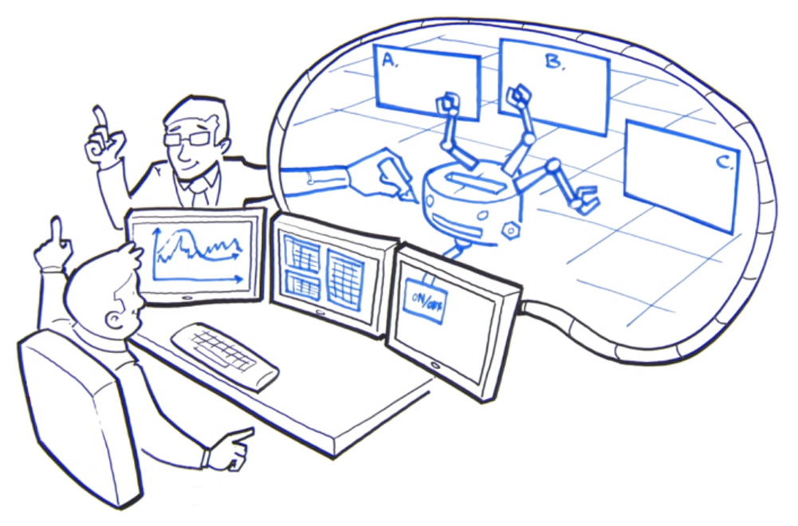
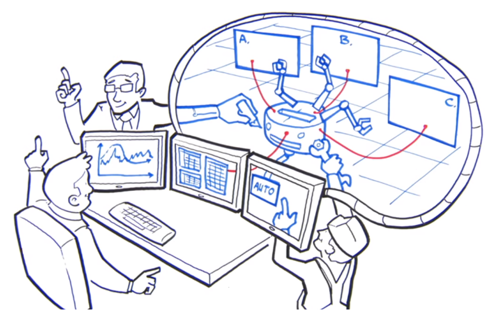
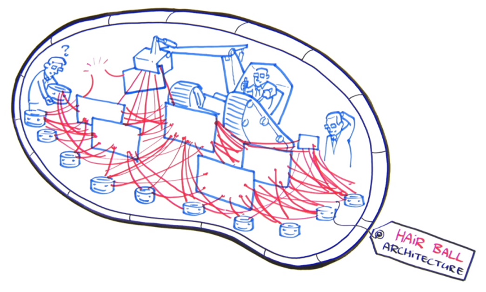
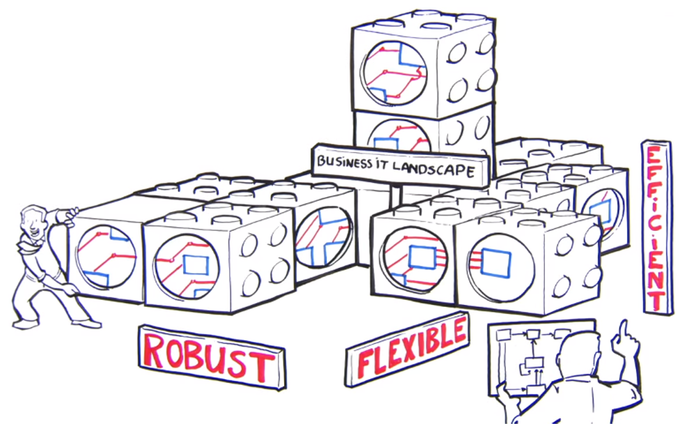

# Capítulo 41 – Arquitetura Orientada a Serviços (SOA)

## Motivação e Conceitos Fundamentais

Para embarcar no estudo da **Arquitetura Orientada a Serviços (Service-Oriented Architecture - SOA)**, é imprescindível primeiro solidificar a compreensão dos dois conceitos que formam seu nome. A **arquitetura**, no contexto da engenharia de software, refere-se à organização ou à estrutura dos componentes significativos de um sistema, que interagem entre si por meio de interfaces bem definidas. É o esqueleto conceitual que dita como as partes de um software se encaixam e colaboram.

O segundo pilar é o **serviço**. Um serviço é um mecanismo que permite acessar um conjunto de recursos ou funcionalidades. Esse acesso é fornecido por meio de uma interface formalmente descrita e deve ser exercido de acordo com as políticas e restrições especificadas na descrição do serviço. Em sua essência, um serviço é oferecido por uma entidade, o **Provedor de Serviços**, para uso por outra, o **Consumidor de Serviços**.

Uma característica crucial é que não há necessidade de o consumidor conhecer os detalhes internos da implementação do provedor. A interação é baseada em um contrato claro (a interface), permitindo que o serviço seja utilizado de maneiras que podem até mesmo extrapolar o escopo original concebido por seu criador.

### O Princípio da Lógica Agnóstica

Um conceito central que define a natureza de um serviço em SOA é o de ser **agnóstico**. Isso significa que a lógica encapsulada por um serviço deve ser, tanto quanto possível, independente de qualquer processo de negócio específico, de uma aplicação particular ou de tecnologias proprietárias. O autor Thomas Erl, uma das maiores autoridades no assunto, define essa característica da seguinte forma:

> “Dentro de uma solução orientada a serviços, as unidades de lógica (serviços) encapsulam funcionalidades não específicas a nenhum aplicativo ou processo de negócio. Esses serviços são classificados como ativos de tecnologia da informação agnósticos e reusáveis. Serviços agnósticos fornecem um intervalo de funcionalidades genéricas. Qualquer serviço agnóstico pode, portanto, ser adaptado inúmeras vezes para que seja possível automatizar diferentes processos de negócio como parte de diferentes soluções orientadas a serviços.”

Quanto mais agnóstico for um serviço, mais genéricas são suas capacidades e, consequentemente, maior é seu potencial de reúso em toda a organização. Uma analogia simples do mundo real ilustra bem essa ideia: ao contratar um serviço de fornecimento de energia elétrica para uma residência, o consumidor se preocupa apenas em ter a energia disponível na tomada. Os detalhes complexos da geração (hidrelétrica, solar, eólica), transmissão e distribuição dessa energia são de responsabilidade do provedor e completamente irrelevantes para o consumidor. O serviço "fornecer energia" é agnóstico à sua fonte de implementação.

Além de serem agnósticos, os serviços em uma arquitetura SOA bem projetada apresentam outros benefícios destacados por Thomas Erl: são reutilizáveis por natureza, compartilham um contrato formal, promovem baixo acoplamento, abstraem a lógica de implementação, são capazes de se compor para criar funcionalidades mais complexas e operam de forma autônoma.

### Definindo a Arquitetura Orientada a Serviços (SOA)

Com os conceitos de arquitetura e serviço estabelecidos, podemos uni-los. A OASIS (Organization for the Advancement of Structured Information Standards), um consórcio global para padrões de tecnologia, define a Arquitetura Orientada a Serviços como:

> Um paradigma para organização e utilização de recursos distribuídos que estão sob o controle de diferentes domínios proprietários, permitindo que funcionalidades implementadas sejam disponibilizadas na forma de serviços fracamente acoplados.

A expressão **"serviços fracamente acoplados"** significa que os serviços são independentes uns dos outros. Uma mudança na implementação interna de um serviço não deve, em teoria, afetar os consumidores que dependem dele, desde que o contrato da interface seja mantido.

|O que SOA é...|
|---|
|Um conjunto de **princípios e melhores práticas** para implementar processos de negócio automatizados em ambientes de TI heterogêneos.|
|Uma forma de **aproximar a linguagem do negócio e da tecnologia**, facilitando a integração de sistemas corporativos por meio de serviços reutilizáveis.|
|Um meio para organizar soluções de TI que promove o **reúso, o crescimento sustentável e a interoperabilidade** entre sistemas diferentes.|
|Uma **abordagem distribuída e não monolítica** para a integração de sistemas, baseada no conceito de serviço como a unidade fundamental de lógica.|
|Uma **abordagem arquitetural corporativa** que permite a criação de serviços de negócio que podem ser facilmente compartilhados entre aplicações e até mesmo entre empresas parceiras.|

É fundamental posicionar a SOA como um modelo de arquitetura que é, por definição, **agnóstico a qualquer plataforma de tecnologia específica**. Ao adotar a SOA como uma filosofia, uma empresa ganha a liberdade de perseguir seus objetivos estratégicos, aproveitando os avanços tecnológicos futuros sem ficar presa a uma única tecnologia ou fornecedor. Embora os **Web Services** tenham se tornado a plataforma de tecnologia mais associada à implementação de SOA, outras tecnologias como DCOM, CORBA, RPC e WCF também podem ser utilizadas para construir uma arquitetura orientada a serviços.

### A Motivação para a SOA: O Problema da "Bola de Pelo"

Para entender por que a SOA se tornou tão relevante, é preciso visualizar o cenário que a motivou. Ao longo de décadas, o desenvolvimento de aplicações em grandes ambientes corporativos ocorreu de forma orgânica e, muitas vezes, desordenada. Esse crescimento não planejado resultou em uma verdadeira "colcha de retalhos" de sistemas, onde cada nova aplicação era desenvolvida para resolver um problema imediato, ligando apenas dois pontos do sistema, sem uma preocupação com as consequências a longo prazo.

Considere a seguinte história, que ilustra um problema comum em grandes organizações, como um banco comercial.

João, um analista de negócios, precisa de dados específicos para seus relatórios diários. No entanto, esses dados estão espalhados por três sistemas legados diferentes: Aplicação A, B e C. Para resolver o problema de João, um programador cria uma nova aplicação customizada que se conecta a esses três sistemas, recupera os dados e os consolida em uma planilha.

  

João, satisfeito, percebe que precisa dessa planilha todas as manhãs e não quer gerá-la manualmente. Ele solicita à equipe de infraestrutura que automatize o processo. Um `job` (tarefa agendada) é criado para executar a aplicação de João todas as manhãs. Agora, um novo fluxo de aplicação foi criado e formalizado, e ele depende diretamente de outras três aplicações do banco.

  

Naturalmente, João não é o único funcionário em um banco desse porte. Multiplique essa situação por centenas de outros analistas e departamentos, cada um com suas próprias necessidades e soluções pontuais. O resultado é o que se convencionou chamar de **Arquitetura de Bola de Pelo (Hairball Architecture)**. Temos centenas de "pelos" (integrações ponto a ponto) indo e vindo em todas as direções. Ninguém tem controle total, e torna-se impossível rastrear o fluxo de dependências.

  

Agora, imagine o pesadelo: o banco precisa substituir a Aplicação B, que é um sistema imenso e desatualizado cujo fornecedor deixará de oferecer suporte em dois anos. A pergunta crítica é: quais das centenas de outras aplicações dependem da Aplicação B? A rede de dependências é tão caótica e não documentada que se torna praticamente impossível mudar qualquer aspecto do sistema sem causar um efeito cascata em dezenas de outros. O sistema sofre de **alto acoplamento** e **alta redundância**, pois funcionalidades semelhantes foram replicadas em diversas soluções customizadas.

  

Em um nível estratégico, essa situação significa perda de agilidade, aumento de custos de manutenção e, em última análise, perda de dinheiro. Havia, portanto, uma necessidade urgente de uma nova abordagem, uma arquitetura que fosse simultaneamente robusta, eficiente e flexível o suficiente para permitir que inovações fossem criadas sem quebrar o ecossistema existente.

### Desmistificando o SOA: O Que Ele Não É

Diante de um problema tão complexo, a primeira reação de muitas organizações é procurar por uma solução pronta. No entanto, é fundamental entender que a Arquitetura Orientada a Serviços não é algo que se possa simplesmente comprar. Não se pode chegar a um fornecedor e pedir "o melhor SOA que você tem à venda".

|O que SOA **não** é...|
|---|
|**Não é uma tecnologia:** SOA é um paradigma, uma filosofia de design arquitetural. Tecnologias específicas, como Web Services, CORBA, DCOM ou filas de mensagens, são os meios utilizados para implementar os princípios de uma arquitetura orientada a serviços, mas não são a SOA em si. Uma organização pode usar Web Services e ainda assim não ter uma arquitetura verdadeiramente orientada a serviços.|
|**Não é um projeto de TI:** A adoção de SOA não é um projeto com início, meio e fim definidos. É uma jornada de transformação cultural e técnica que afeta a forma como a organização inteira pensa e desenvolve soluções de software. É um compromisso de longo prazo, não uma iniciativa pontual.|
|**Não é uma metodologia:** A SOA é um conjunto de princípios de design, não um processo passo a passo para o desenvolvimento de software. Metodologias como o RUP ou frameworks ágeis podem ser utilizados para guiar a construção de serviços e a implementação de uma SOA, mas não devem ser confundidos com a própria arquitetura.|
|**Não é um serviço:** Um serviço é a unidade fundamental, o "tijolo" dentro de uma SOA. A arquitetura é o "edifício" completo, ou seja, a forma como esses múltiplos serviços são organizados, compostos e orquestrados para entregar valor ao negócio.|
|**Não é um produto ou um software:** Não existe um "software SOA" que se possa comprar em uma prateleira e instalar. É possível adquirir produtos de software, como um Enterprise Service Bus (ESB) ou um Gateway de API, que ajudam a construir e gerenciar uma SOA, mas eles são apenas peças de um quebra-cabeça muito maior.|
|**Não é uma solução de negócio:** A SOA, por si só, não resolve um problema de negócio específico (como "aumentar as vendas" ou "otimizar o estoque"). Ela é uma **estratégia de TI** que **habilita** a criação de soluções de negócio mais ágeis, flexíveis e integradas. É a fundação que permite que o negócio se adapte mais rapidamente às mudanças.|
|**Não é uma ferramenta:** Ferramentas de modelagem, desenvolvimento, teste e monitoramento são utilizadas para construir, implantar e gerenciar os serviços. A arquitetura, no entanto, é o plano mestre, o design de alto nível, e não as ferramentas usadas para executá-lo.|
|**Não é um web service:** Esta é uma das confusões mais comuns. Um Web Service é uma implementação técnica específica de um serviço que utiliza padrões web (como HTTP, SOAP ou REST). Ele é, talvez, a tecnologia mais popular para se construir uma SOA, mas é perfeitamente possível ter uma arquitetura orientada a serviços utilizando outras tecnologias de comunicação remota. Nem todo serviço em uma SOA é um Web Service.|
|**Não é um framework:** Frameworks de programação (como Spring, .NET, Django) fornecem estruturas e bibliotecas para acelerar o desenvolvimento de aplicações. Pode-se usar um framework para construir um serviço individual, mas o framework não define a arquitetura de alto nível que dita como esse serviço se relaciona com todos os outros no ecossistema da empresa.|
|**Não é um middleware:** O middleware, como vimos, é a camada de "encanamento" que permite a comunicação em sistemas distribuídos. Ele é uma parte essencial da infraestrutura que suporta uma SOA, mas não é a arquitetura em si. A arquitetura é o projeto; o middleware é parte dos materiais e da infraestrutura usados para construir conforme o projeto.|

Compreender o que a SOA é, e o que ela não é, é o primeiro passo para planejar uma adoção bem-sucedida, que visa transformar a "bola de pelo" caótica em um ecossistema organizado de serviços reutilizáveis e bem definidos.

## Os Pilares Conceituais da SOA

Para construir e operar uma arquitetura orientada a serviços de forma eficaz, é essencial compreender os conceitos fundamentais que governam tanto a dinâmica das interações quanto a estrutura que as suporta. O Modelo de Referência da SOA estabelece um conjunto de pilares conceituais que nos ajudam a raciocinar sobre como os serviços são descobertos, utilizados e como eles produzem resultados tangíveis. Podemos dividir esses pilares em dois grandes grupos: a dinâmica da interação com os serviços e a estrutura de suporte a essa interação.

### A Dinâmica da Interação com Serviços

Esta perspectiva descreve o ciclo de vida de uma interação, desde o momento em que um consumidor descobre um provedor até o resultado final da utilização do serviço. Ela é composta por três conceitos-chave: Visibilidade, Interação e Efeito no Mundo Real.

|Conceitos-Chave da Dinâmica|
|---|
|Visibilidade entre provedores e consumidores de serviços.|
|Interação entre provedores e consumidores de serviços.|
|Efeitos no mundo real da interação com um serviço.|

#### Visibilidade

A **visibilidade** é a condição prévia para qualquer interação. Ela representa o relacionamento que é satisfeito quando um consumidor de serviço e um provedor de serviço estão aptos a interagir. Para que a visibilidade exista, três pré-condições devem ser atendidas:

1. **Consciência (Awareness):** O consumidor precisa ter a percepção da existência do provedor e do serviço que ele oferece. Em termos práticos, o consumidor precisa saber que o serviço existe e qual é a sua finalidade.
2. **Concordância (Willingness):** Ambos os participantes, consumidor e provedor, precisam estar dispostos a interagir. O provedor deve estar operacional e pronto para aceitar requisições, e o consumidor deve ter a intenção de utilizar o serviço.
3. **Acessibilidade (Reachability):** Os participantes precisam ser capazes de interagir tecnicamente. Isso implica que deve haver um caminho de comunicação entre eles (como uma rede) e que eles compreendem os mesmos protocolos e formatos de dados.

Uma boa analogia é a de um restaurante: para um cliente (consumidor) poder jantar, ele primeiro precisa saber que o restaurante (provedor) existe (**consciência**). Em seguida, o restaurante precisa estar aberto para negócios (**concordância**). Por fim, o cliente precisa ser capaz de chegar ao restaurante, seja fisicamente ou por meio de um serviço de delivery (**acessibilidade**).

#### Interação

A **interação** é a execução das ações em si, o ato de utilizar o serviço. Na maioria dos cenários de software, isso é realizado pela **troca de mensagens** entre o consumidor e o provedor. O consumidor envia uma mensagem de requisição, e o provedor responde com uma mensagem de resposta. No entanto, a interação pode ocorrer de outras formas que não envolvem explicitamente a transmissão de mensagens, como a modificação do estado de um recurso compartilhado (por exemplo, a alteração de um arquivo em um diretório comum). Grosso modo, a interação refere-se ao mecanismo pelo qual um serviço é invocado e executa sua função.

#### Efeito no Mundo Real

Toda interação com um serviço tem um propósito, um objetivo. O **efeito no mundo real** é o resultado tangível e o propósito alcançado através do uso de um serviço. Esse efeito é frequentemente observado como uma **alteração no estado compartilhado** entre o consumidor, o provedor e outras entidades que pertencem ao mesmo domínio de negócio.

É importante focar no estado que é compartilhado, e não nos estados internos e privados de cada serviço. Imagine um sistema de compras online composto por múltiplos serviços. Quando um cliente finaliza uma compra, a interação com o serviço de "Checkout" gera vários efeitos no mundo real que alteram o estado compartilhado do ecossistema:

- O estoque do produto comprado é reduzido no serviço de `Inventário`.
- A conta do comprador sofre um débito no serviço de `Pagamentos`.
- Um novo pedido é criado com o status "Aguardando Envio" no serviço de `Pedidos`.

Essas três mudanças representam o efeito no mundo real daquela interação, alterando um estado que é de interesse de múltiplas partes do sistema.

### A Estrutura de Suporte aos Serviços

Para que a dinâmica de visibilidade e interação possa ocorrer de forma ordenada e confiável, especialmente em ambientes distribuídos e heterogêneos, a SOA se apoia em um conjunto de conceitos estruturais. Eles formam a "infraestrutura" que permite que os serviços sejam descritos, governados e executados.

#### Descrição do Serviço

A **descrição do serviço** é o conjunto de informações necessárias para que um consumidor possa descobrir, entender e utilizar um serviço. Seu propósito é facilitar a **visibilidade** e a **interação**, particularmente quando o provedor e o consumidor estão em domínios de propriedade diferentes (por exemplo, em empresas diferentes).

Ao oferecer uma descrição formal e padronizada, o provedor torna possível que potenciais consumidores construam sistemas que usam seus serviços sem a necessidade de conhecimento prévio sobre a sua implementação interna. Essa descrição funciona como um "manual de instruções" do serviço.

- **Exemplo Técnico:** No mundo dos Web Services, a descrição de um serviço SOAP é feita por um arquivo **WSDL (Web Services Description Language)**. Para uma API RESTful, a descrição é comumente feita usando a especificação **OpenAPI (anteriormente Swagger)**. Esses documentos detalham os endpoints disponíveis, as operações, os parâmetros esperados, os tipos de dados e os possíveis códigos de resposta.

#### Contratos e Políticas

**Políticas** e **contratos** são os mecanismos utilizados para governar o uso de um serviço.

- Uma **política** representa uma restrição ou condição sobre o uso, a distribuição ou a descrição de um serviço, geralmente definida de forma unilateral pelo provedor. É uma regra que deve ser seguida.
    - **Exemplo:** Uma política de segurança pode ditar que "para acessar o serviço de `ConsultaDeSaldo`, o consumidor deve se autenticar usando o protocolo OAuth 2.0".
- Um **contrato**, por outro lado, representa um **acordo** entre duas ou mais partes. Ele também define as condições de uso de um serviço, mas de forma negociada. Além disso, um contrato pode restringir os efeitos esperados no mundo real ao usar o serviço.
    - **Exemplo:** Um **Acordo de Nível de Serviço (SLA - Service Level Agreement)** é um tipo de contrato. Nele, o provedor pode se comprometer a manter o serviço disponível 99.9% do tempo e a responder a requisições em menos de 200 milissegundos. Em troca, o consumidor concorda em pagar uma taxa mensal e a não exceder um certo número de requisições por minuto.

#### Contexto de Execução

O **contexto de execução** de uma interação de serviço é o conjunto de todos os elementos de infraestrutura, entidades de processo, políticas e contratos que são identificados como parte daquela interação específica. Ele representa o "ambiente" completo no qual a interação ocorre, formando um caminho entre aqueles que possuem necessidades (consumidores) e aqueles que possuem competências (provedores).

Em suma, o contexto de execução engloba os participantes (consumidor e provedor), a infraestrutura de comunicação (a rede), as regras do jogo (políticas e contratos) e a documentação necessária (a descrição do serviço). É a combinação de todos esses elementos que permite que uma interação de serviço ocorra de forma bem-sucedida.