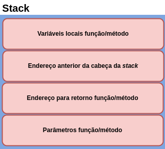
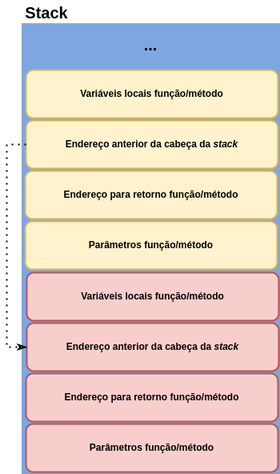
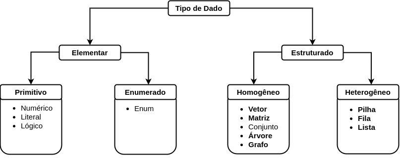
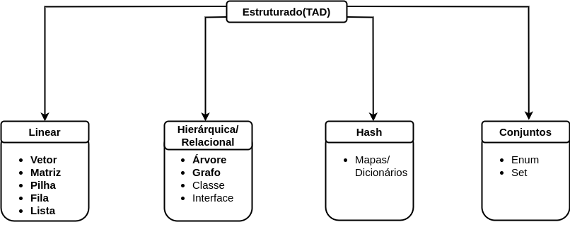

# Capítulo 1 – Conceitos Fundamentais

O estudo de **estruturas de dados** é essencial para compreender como os programas armazenam, organizam e manipulam dados de maneira eficiente. Antes de nos aprofundarmos nas estruturas propriamente ditas, é fundamental entender alguns conceitos basilares da computação que dão suporte ao raciocínio e à prática com estruturas de dados. Neste capítulo, abordaremos o que são dados, informações, **tipos de dados (TD)** e **tipos abstratos de dados (TAD)**, além de discutirmos o papel da memória, ponteiros e os mecanismos de gerenciamento de memória — **heap** e **stack**. Todos esses elementos constituem o alicerce sobre o qual se constroem as estruturas de dados clássicas e modernas.

## Dados, Informações e Estruturas

Em computação, **dado** é qualquer valor bruto que, por si só, não possui um significado claro ou utilidade imediata. São elementos atômicos que podem ser representados de forma numérica, textual, lógica, entre outras. Veja alguns exemplos:

- `10` (valor numérico inteiro)
- `"b"` (caractere)
- `2.6` (valor numérico real)
- `true` (valor lógico)

Dados são a base da computação, mais precisamente a manipulação deles. Tudo que um computador faz é manipular dados para nos auxiliar na tomada de decisões. Podemos dizer que dados podem ser originados a partir da interação entre usuários humanos com computadores (softwares) ou da interação direta entre computadores (softwares), seja apenas através de trocas ou da criação de novos dados a partir da manipulação de dados preexistentes.

Esses valores, isoladamente, não transmitem nenhuma informação específica. Porém, ao serem colocados em contexto, podem se tornar úteis — é justamente dessa contextualização que emerge o conceito de **informação**. Pode-se dizer que ela surge quando um dado ganha um significado, uma semântica a partir ou para um determinado contexto. Por exemplo, já citamos os seguintes exemplos de dados: `10`, `"b",` `2.6`, `true`. Algumas informações que poderiam ser obtidas ou inferidas através deles seriam:

- O carro tem `10` anos de uso.
- A letra `"b"` é a resposta correta para a 3ª questão.
- A taxa de juros é de `2.6` ao mês.
- O seguro está habilitado: `true`.

A transformação de dados em informações é essencial para que os softwares possam interagir com o mundo real de maneira útil.

## Estruturas e Estruturas de Dados

Uma **estrutura** pode ser entendida como a forma ou o arranjo adotado para organizar e manipular um conjunto de dados. A depender do tipo e finalidade dos dados, diferentes estruturas serão utilizadas. Cada estrutura implica em operações próprias (ou uma **álgebra**) que definem como os dados poderão ser acessados, modificados e organizados.

**Estruturas de Dados** são modelos lógicos e organizacionais que definem como os dados serão representados na memória do computador e manipulados por algoritmos. São fundamentais para que programas funcionem de forma eficiente e escalável. Com estruturas adequadas, conseguimos melhorar desempenho, reduzir o consumo de memória e tornar os sistemas mais confiáveis.

## Tipos de Dados (TD) e Tipos Abstratos de Dados (TAD)

Os **Tipos de Dados (TD)** referem-se às categorias primárias de dados que podem ser manipuladas em um sistema computacional. Essas categorias são geralmente definidas pelas linguagens de programação e são consideradas **tipos primitivos**. Entre elas, temos:

- **Numéricos** (ex: `int`, `float`, `double`)
- **Lógicos** (ex: `true` e `false`)
- **Literais** (ex: `char`, `string`)

Muitas linguagens subdividem esses tipos para oferecer maior controle sobre o armazenamento. Por exemplo, em **Java**, temos os tipos numéricos:

```java
byte, short, int, long
```

Cada um com tamanhos e capacidades diferentes. Já em **JavaScript**, existe o tipo primitivo `Symbol`, que representa um valor único e imutável — um exemplo de tipo específico da linguagem.

Enquanto os TDs são implementações concretas em uma linguagem, os **Tipos Abstratos de Dados (TADs)** representam entidades conceituais modeladas para resolver problemas reais. Um TAD define **o que** será feito, mas não **como** será implementado.

Por exemplo, uma **Fila** (Queue) pode ser vista como um TAD com as seguintes operações:

- `enfileirar(dado)`
- `desenfileirar()`

Essas operações podem ser implementadas de diferentes formas, mas a ideia abstrata é sempre a mesma: estrutura com acesso restrito (FIFO – First In, First Out).

Os TADs podem ser classificados em:

- **Lineares**: lista, pilha, fila
- **Hierárquicos**: árvore, heap
- **Mapas**: dicionários, tabelas hash
- **Conjuntos**: coleções não ordenadas, sem elementos repetidos

Algumas dessas categorias também podem possuir subcategorias que visam aumentar o poder de representatividades. Por fim, podemos dizer que um TAD pode ser considerado um TD, no caso um tipo Complexo, que pode ser encarado como uma evolução dos tipos primitivos, pois é constituído a partir destes e possui um poder representacional maior.

## Ponteiros e Acesso à Memória

**Ponteiros** são variáveis especiais que armazenam **endereços de memória**, permitindo o acesso direto ao local onde os dados estão guardados. Com ponteiros, podemos acessar ou manipular valores de forma indireta, o que é essencial para o funcionamento interno de várias estruturas.

Linguagens como **C** oferecem ponteiros explícitos. Veja um exemplo:

```c
#include <stdio.h>

int main() {
    int x = 10;
    int *p = &x;

    printf("Valor de x: %d\n", *p);  // Acessa o valor de x através do ponteiro
    printf("Endereço de x: %p\n", p);
    return 0;
}
```

Já linguagens como **Python**, **Java** e **JavaScript** utilizam ponteiros de maneira implícita, ao manipular objetos e referências. Por exemplo:

```python
x = [1, 2, 3]
y = x
y.append(4)
print(x)  # [1, 2, 3, 4] — x também foi alterado, pois y aponta para o mesmo objeto
```

Esse tipo de comportamento evidencia que ponteiros estão presentes, mesmo quando não explicitamente manipulados.

Inicialmente pode-se pensar que esse tipo de manipulação para dados é desnecessário, mas na verdade não é. Ponteiros são a base para a criação das estruturas de dados. Com o uso deles, é possível alocar e desalocar memória dinamicamente. 

Além disso, sempre estamos usando ponteiros, seja de forma direta ou indireta. Linguagens mais modernas não possibilitam o uso direto de ponteiros; entretanto, toda vez que utilizamos uma variável que é do tipo de algum objeto (seja criado pelo programador ou disponibilizado pela própria linguagem), estamos usando um ponteiro indiretamente. Ou seja, por "debaixo dos panos", tais linguagens usam ponteiros para manipular objetos. Elas só fornecem um nível de abstração maior, que nos poupa de manusear diretamente ponteiros, eliminando possíveis erros decorrentes de acessos indevidos a determinados locais na memória.

## Memória e Organização de Execução

Para que todos os conceitos anteriormente citados possam ser utilizados pelo computador e, consequentemente, pelos softwares, eles devem ser disponibilizados através de algum mecanismo, que, neste caso, é a memória. Pode-se dizer que ela é "um componente capaz de armazenar dados e programas (softwares)". É nesse componente que os softwares são carregados para execução, assim como os dados que são manipulados pelos softwares. Dois conceitos muito importantes neste assunto: **Memória Principal (MP)** e **Memória Secundária (MS)**.

A MP é um tipo de memória que possibilita acesso rápido e que tem curto tempo de vida. Dados armazenados nesse tipo de memória são voláteis. Ao contrário dela, a MS possui um acesso mais lento e tem tempo de vida longo. Dados armazenados nesse tipo de memória são duráveis. Como principais exemplos dessas memórias temos a RAM e a ROM, respectivamente. Pela característica de ter acesso rápido e curto tempo de vida, a RAM é onde — preferencialmente — o **heap** e a **stack** são alocados, pois programas entram e saem de execução constantemente. Esse processo de alocação da memória para ser usada pelo heap ou stack pode ser feito de forma estática ou dinâmica, a depender da necessidade. 

Na alocação estática, a memória de que um tipo de dado ou programa possa vir a necessitar é alocada toda de uma vez e de forma sequencial, sem considerar que toda ela não seria realmente necessária na execução do programa. A alocação dinâmica, por sua vez, aloca a memória sob demanda e de forma não sequencial. Assim, os espaços de memória podem ser alocados, liberados ou realocados para diferentes propósitos durante a execução do programa. O alocador de memória do Sistema Operacional (SO) aloca blocos de memória que estão livres e que são gerenciados por ele.

## Heap e Stack

O **heap** é o principal espaço de memória utilizado pelos computadores para executar programas. É nesse local que linguagens estruturadas armazenam as variáveis de escopo global e que linguagens orientadas a objetos armazenam os objetos criados. É também nesse local que o programa é carregado para poder ser executado, assim como todo o espaço inicial de memória que precisar ser alocado, inclusive stacks. Esse espaço de memória utiliza constantemente a alocação dinâmica sob demanda para possibilitar a execução de programas. A figura a seguir apresenta uma imagem conceitual do funcionamento do heap.

<div align="center">
  
</div>

A **stack**, como já foi mencionado, faz parte do heap. Ela é criada — ou são criadas — no momento de carregamento do programa, e é usada para possibilitar que mudanças de contexto sejam feitas durante a execução do programa e a linha principal de execução consiga seguir seu fluxo normal mesmo assim. Tais "mudanças de contexto" podem ser chamadas internas a funções, em linguagens como C; a métodos, em linguagens como Java, ou mesmo chamadas a outras rotinas de outros programas, externos ao programa inicialmente em execução.

Embora a stack esteja dentro do heap, sua alocação é estática, ou seja, não mudará durante a execução do programa. Basicamente, a stack tem a estrutura apresentada na imagem a seguir.

<div align="center">
  
</div>

Dessa forma, se várias funções ou métodos forem chamados em sequência uma dentro da outra, a estrutura anterior ficará uma em cima da outra, como na imagem a seguir.

<div align="center">
  
</div>

Caso essa sequência de chamadas não seja uma dentro da outra, a stack vai colocando e retirando cada uma das chamadas. Ou seja, a stack sempre ficaria como na primeira figura.

A stack funciona com **alocação estática** e é mais rápida, porém limitada em tamanho. O heap, por outro lado, utiliza **alocação dinâmica**, sendo mais flexível, porém mais custoso em termos de desempenho. Para melhor compreensão, observe os seguintes exemplos:

Em C:
```c
#include <stdlib.h>
#include <string.h>

int main() {
    char *nome = malloc(20 * sizeof(char));  // alocado no heap
    strcpy(nome, "Ana");
    free(nome);  // desalocação
    return 0;
}
```

Em Python:
```python
x = 10             # stack
pessoa = {"nome": "Carlos"}  # heap (objeto referenciado)
```

Em Java:
```java
public class PilhaHeapExemplo {
    public static void main(String[] args) {
        int x = 10; // armazenado na stack
        Pessoa p = new Pessoa("João"); // objeto armazenado no heap
    }
}

class Pessoa {
    String nome;
    Pessoa(String nome) {
        this.nome = nome;
    }
}
```

Em JavaScript:
```javascript
let x = 10; // stack
let obj = { nome: "Maria" }; // heap
```

Por fim, é válido dizer que, quando o programa terminar, tudo isso será descarregado da  memória, que ficará livre para outro programa usar. Outra observação final e importante é que, embora conceitualmente apresentemos o heap e stack em "caixinhas organizadas", na verdade os dois são criados de forma espaçada (desorganizada) na memória. Entretanto, o SO tem a capacidade de nos disponibilizar essas caixinhas, para sua compreensão e uso serem mais fáceis.

## Considerações Finais

Este primeiro capítulo apresentou as bases conceituais sobre as quais repousa todo o estudo de estruturas de dados. Compreender o que são dados, tipos, ponteiros, memória e TADs é essencial para entender como as estruturas funcionam e por que determinadas decisões são feitas na construção de algoritmos eficientes.

Nos próximos capítulos, exploraremos essas estruturas de maneira mais concreta, partindo das lineares mais simples, como vetores e listas, até chegar às hierárquicas e complexas, como árvores e grafos. Cada estrutura será contextualizada, implementada em múltiplas linguagens e analisada quanto ao seu desempenho, uso prático e eficiência algorítmica.

A seguir temos duas imagens que resumem o que foi exposto aqui. Nesta primeira imagem, levamos em consideração como os tipos de dados podem ser constituídos:

<div align="center">
  
</div>

Já nesta segunda imagem levamos em consideração como os dados podem ser estruturados. É válido ressaltar que apenas os TADs são apresentados nesta imagem.

<div align="center">
  
</div>

Nota-se que em ambas as imagens há alguns termos em destaque. Esses termos são as principais Estruturas de Dados, sendo também as mais conhecidas. As demais fazem parte de outras disciplinas no universo da programação.
