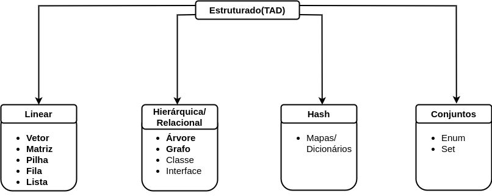

  

 

# Conceitos Básicos

- [Introdução](#introdução)
- [O que é Dado?](#o-que-é-dado)
- [O que é Estrutura?](#o-que-é-estrutura)
- [O que são Estruturas de Dados?](#o-que-são-estruturas-de-dados)
- [O que é Informação](#o-que-é-informação)
- [O que é TD e TAD?](#o-que-é-td-e-tad)
- [O que é um Ponteiro?](#o-que-é-um-ponteiro)
- [Memória](#memória)
- [Heap e Stack](#heap-e-stack)
- [Resumo das Estruturas](#resumo-das-estruturas)

## Introdução

Para se estudar estruturas de dados é essencial compreender alguns conceitos relevantes para o entendimento e funcionamento das estruturas de dados, tais como: dado, informação e tipo de dado. Veremos também conceitos que auxiliam no entendimento e no uso dessas estruturas, como: memória, tipos de estruturas e ponteiros.

## O que é Dado?

Um dado pode ser definido como um valor bruto e sem significado. `10`, `"b"`, `2.6`, `true` são exemplos de dados. Nota-se que estes, utilizados em sua forma bruta, não possuem serventia por serem demasiadamente abstratos e atômicos.

Dados são a base da computação, mais precisamente a manipulação deles. Tudo que um computador faz é manipular dados para nos auxiliar na tomada de decisões. Podemos dizer que dados podem ser originados a partir da interação entre usuários humanos com computadores (softwares) ou da interação direta entre computadores (softwares), seja apenas através de trocas ou da criação de novos dados a partir da manipulação de dados preexistentes.

## O que é Estrutura?

Uma estrutura pode ser definida como a forma como um conjunto de dados pode ser armazenado e manipulado. A depender do tipo de dado — conceito que será abordado mais adiante —, cada estrutura é armazenada e manipulada de uma maneira específica. Assim, podemos dizer que cada estrutura define uma álgebra, um conjunto de operações/manipulações que são permitidas sobre esta estrutura.

## O que são Estruturas de Dados?

As Estruturas de Dados podem ser definidas como um conjunto de teorias e práticas responsáveis por definir a forma como os dados podem ser armazenados, representados e consequentemente manipulados. É nessa área de estudo que são apresentadas as formas como os computadores e, consequentemente, os softwares podem definir e manipular os dados.

## O que é Informação?

Um conceito também relevante, mas não necessariamente pertencente à disciplina de Estruturas de Dados, é a definição de informação. Pode-se dizer que ela surge quando um dado ganha um significado, uma semântica a partir ou para um determinado contexto. Por exemplo, já citamos os seguintes exemplos de dados: 10, "b", 2.6, true. Algumas informações que poderiam ser obtidas ou inferidas através deles seriam:

- O carro tem `10` anos de uso.
- A letra `"b"` é a resposta correta para a 3ª questão.
- A taxa de juros é de `2.6` ao mês.
- O seguro está habilitado: `true`.

## O que é TD e TAD?

**Tipo de Dado (TD)** pode ser definido como as categorias nas quais os dados podem se enquadrar. Os TDs com que os computadores trabalham podem ser divididos em:

- Numéricos
- Lógicos
- Literais

Algumas dessas categorias podem possuir subcategorias que visam aumentar o poder de representatividades. Por exemplo, numéricos podem ser inteiros ou reais. Literais podem ser textos ou caracteres. Lógicos, entretanto, apenas podem possuir dois valores: true e false. Essas três categorias são responsáveis por representar os tipos primitivos, que são os TDs mais básicos que as linguagens de programação podem utilizar. 

É válido ressaltar que os TDs são fortemente ligados às linguagens de programação, e elas podem disponibilizar maiores subdivisões ou TDs próprios. Como exemplo de subdivisões, podemos citar Java, que disponibiliza para inteiros os tipos byte, short, int e long. A diferença entre eles está na capacidade de armazenamento. Como exemplo de TD próprio, podemos citar JS, que disponibiliza o tipo symbol, o qual representa um valor literal e imutável.

Ainda em relação aos tipos de dados, podemos verificar que algumas linguagens possuem uma "tipagem forte" ou "tipagem fraca". Isso diz respeito ao momento em que devemos informar o tipo de dado que a variável deve ser.

Por fim, a partir da manipulação desses tipos de dados, podem ser criados TADs.

O **Tipo Abstrato de Dado (TAD)** é um tipo de dado construído a partir de tipos  primitivos (TDs) e tem como finalidade representar estruturas do mundo concreto (real) para o mundo abstrato (computacional). Assim, podemos afirmar que TADs — ao contrário dos TDs — não são ligados às linguagens de programação, embora possam ser representados por elas. Como dito, TADs são estruturas (conceitos/entidades) que pertencem a um contexto que deve ser modelado para poder ser manipulado pelo computador. 

O termo "abstrato" é utilizado no sentido de ausência de detalhes, evitando uma descrição minuciosa do mundo concreto. Entretanto, é válido ressaltar que, mesmo com essa "ausência de detalhes", os TADs são capazes de alcançar os objetivos almejados no mundo computacional, pois essa simplificação não diminui a capacidade de representação, apenas torna o processo de representação mais fácil de entender pelo homem e pelos computadores. Essa simplificação é vital para tornar o mundo real "computável".

Assim como os TDs, os TADs possuem suas categorias:

- Lineares
- Hierárquicos
- Mapas
- Conjuntos

Algumas dessas categorias também podem possuir subcategorias que visam aumentar o poder de representatividades. Por fim, podemos dizer que um TAD pode ser considerado um TD, no caso um tipo Complexo, que pode ser encarado como uma evolução dos tipos primitivos, pois é constituído a partir destes e possui um poder representacional maior.

## O que é um Ponteiro?

É uma forma de acessar dados (TD ou TAD) através do local na memória do computador onde eles se encontram. Ponteiros possibilitam acesso ao valor do dado e também ao seu endereço de memória. 

Inicialmente pode-se pensar que esse tipo de manipulação para dados é desnecessário, mas na verdade não é. Ponteiros são a base para a criação das estruturas de dados. Com o uso deles, é possível alocar e desalocar memória dinamicamente. 

Além disso, sempre estamos usando ponteiros, seja de forma direta ou indireta. Linguagens mais modernas como Java, C# e Python não possibilitam o uso direto de ponteiros; entretanto, toda vez que utilizamos uma variável que é do tipo de algum objeto (seja criado pelo programador ou disponibilizado pela própria linguagem), estamos usando um ponteiro indiretamente. Ou seja, por "debaixo dos panos", tais linguagens usam ponteiros para manipular objetos. Elas só fornecem um nível de abstração maior, que nos poupa de manusear diretamente ponteiros, eliminando possíveis erros decorrentes de acessos indevidos a determinados locais na memória.

Ao contrário dessas linguagens, a linguggem C possibilita o manuseio desse tipo de acesso a dados. Inicialmente pode-se pensar que isso é ruim devido ao problema de acesso indevido, mas, a depender da necessidade, ponteiros podem ser a melhor forma de se manipular os dados.

## Memória

Para que todos os conceitos anteriormente citados possam ser utilizados pelo computador e, consequentemente, pelos softwares, eles devem ser disponibilizados através de algum mecanismo, que, neste caso, é a memória. Pode-se dizer que ela é "um componente capaz de armazenar dados e programas (softwares)". É nesse componente que os softwares são carregados para execução, assim como os dados que são manipulados pelos softwares. Dois conceitos muito importantes neste assunto: Memória Principal (MP) e Memória Secundária (MS).

A MP é um tipo de memória que possibilita acesso rápido e que tem curto tempo de vida. Dados armazenados nesse tipo de memória são voláteis. Ao contrário dela, a MS possui um acesso mais lento e tem tempo de vida longo. Dados armazenados nesse tipo de memória são duráveis. Como principais exemplos dessas memórias temos a RAM e a ROM, respectivamente. Pela característica de ter acesso rápido e curto tempo de vida, a RAM é onde — preferencialmente — o **heap** e a **stack** são alocados, pois programas entram e saem de execução constantemente. Esse processo de alocação da memória para ser usada pelo heap ou stack pode ser feito de forma estática ou dinâmica, a depender da necessidade. 

Na alocação estática, a memória de que um tipo de dado ou programa possa vir a necessitar é alocada toda de uma vez e de forma sequencial, sem considerar que toda ela não seria realmente necessária na execução do programa. A alocação dinâmica, por sua vez, aloca a memória sob demanda e de forma não sequencial. Assim, os espaços de memória podem ser alocados, liberados ou realocados para diferentes propósitos durante a execução do programa. O alocador de memória do Sistema Operacional (SO) aloca blocos de memória que estão livres e que são gerenciados por ele.

## Heap e Stack

O **heap** é o principal espaço de memória utilizado pelos computadores para executar programas. É nesse local que linguagens estruturadas armazenam as variáveis de escopo global e que linguagens orientadas a objetos armazenam os objetos criados. É também nesse local que o programa é carregado para poder ser executado, assim como todo o espaço inicial de memória que precisar ser alocado, inclusive stacks. Esse espaço de memória utiliza constantemente a alocação dinâmica sob demanda para possibilitar a execução de programas. A figura a seguir apresenta uma imagem conceitual do funcionamento do heap.

  

A **stack**, como já foi mencionado, faz parte do heap. Ela é criada — ou são criadas — no momento de carregamento do programa, e é usada para possibilitar que mudanças de contexto sejam feitas durante a execução do programa e a linha principal de execução consiga seguir seu fluxo normal mesmo assim. Tais "mudanças de contexto" podem ser chamadas internas a funções, em linguagens como C; a métodos, em linguagens como Java, ou mesmo chamadas a outras rotinas de outros programas, externos ao programa inicialmente em execução.

Embora a stack esteja dentro do heap, sua alocação é estática, ou seja, não mudará durante a execução do programa. Basicamente, a stack tem a estrutura apresentada na imagem a seguir.

  

Dessa forma, se várias funções ou métodos forem chamados em sequência uma dentro da outra, a estrutura anterior ficará uma em cima da outra, como na imagem a seguir.

  

Caso essa sequência de chamadas não seja uma dentro da outra, a stack vai colocando e retirando cada uma das chamadas. Ou seja, a stack sempre ficaria como na primeira figura.

Por fim, é válido dizer que, quando o programa terminar, tudo isso será descarregado da  memória, que ficará livre para outro programa usar. Outra observação final e importante é que, embora conceitualmente apresentemos o heap e stack em "caixinhas organizadas", na verdade os dois são criados de forma espaçada (desorganizada) na memória. Entretanto, o SO tem a capacidade de nos disponibilizar essas caixinhas, para sua compreensão e uso serem mais fáceis.

## Resumo das Estruturas

Dados os conceitos básicos e algumas categorizações, podemos apresentar duas imagens que resumem o que foi exposto aqui. Nesta primeira imagem, levamos em consideração como os tipos de dados podem ser constituídos:

  

Já nesta segunda imagem levamos em consideração como os dados podem ser estruturados. É válido ressaltar que apenas os TADs são apresentados nesta imagem.

  

Nota-se que em ambas as imagens há alguns termos em destaque. Esses termos são as principais Estruturas de Dados, sendo também as mais conhecidas. As demais fazem parte de outras disciplinas no universo da programação.
