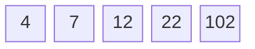
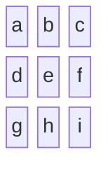

  

 

# Estruturas Lineares - Parte 1: Vetores e Matrizes

- [Introdução](#introdução)
- [Vetores](#vetores)
- [Matrizes](#matrizes)

## Introdução

Vetores e matrizes são duas estruturas de dados fundamentais na programação e na computação em geral, ambas pertencentes à categoria das estruturas lineares. Entender como funcionam essas estruturas é essencial para qualquer desenvolvedor, pois elas formam a base para muitas operações algorítmicas e aplicações práticas.

## Vetores

Um **vetor**, também conhecido como **array**, é uma coleção de elementos de um único tipo dispostos sequencialmente na memória. Cada elemento do vetor é acessado através de um índice, que geralmente começa em zero. Isso significa que o primeiro elemento está na posição `0`, o segundo na posição `1`, e assim por diante. A principal característica dos vetores é que eles permitem acesso rápido e direto a qualquer elemento, pois o índice atua como um deslocamento direto na memória.

Por exemplo, se temos um vetor de inteiros chamado `numeros` com cinco elementos conforme o esquema a seguir, podemos acessar o terceiro elemento (número `12`) utilizando `numeros[2]`. Esta operação é realizada em tempo constante, `O(1)`, pois não depende do tamanho do vetor.

Vetores são amplamente utilizados devido à sua simplicidade e eficiência em termos de acesso aos dados. Eles são ideais para situações em que o número de elementos é conhecido antecipadamente e não muda frequentemente, como no caso de armazenar uma lista fixa de valores ou realizar operações matemáticas básicas.

No entanto, vetores têm algumas limitações. Eles são de tamanho fixo, o que significa que, uma vez criados, não podem crescer ou encolher dinamicamente sem a necessidade de alocar um novo bloco de memória e copiar os elementos existentes. Além disso, operações como inserção e remoção de elementos podem ser ineficientes, pois podem requerer o deslocamento de muitos elementos para manter a ordem.

## Matrizes

Uma **matriz** pode ser vista como uma generalização de um vetor para duas ou mais dimensões. Enquanto um vetor é uma sequência linear de elementos, uma matriz é uma tabela de elementos dispostos em linhas e colunas. As matrizes são muito utilizadas em aplicações que envolvem cálculos matemáticos, gráficos, processamento de imagens e simulações físicas.

Por exemplo, uma matriz bidimensional pode ser visualizada como uma tabela, onde cada elemento é acessado por um par de índices: um para a linha e outro para a coluna. Se tivermos uma matriz de dimensões 3x3 (conforme o esquema abaixo), o elemento na segunda linha e terceira coluna (elemento `f`) é acessado por `matriz[1][2]`.

Tal como os vetores, o acesso a um elemento específico de uma matriz é muito eficiente, pois os índices atuam como deslocamentos diretos na memória. No entanto, matrizes também herdam algumas das limitações dos vetores. Por serem de tamanho fixo, ajustar o tamanho de uma matriz pode ser complicado e caro em termos de tempo de execução e memória. Além disso, operações que envolvem a inserção ou remoção de linhas ou colunas inteiras podem ser particularmente ineficientes.

Apesar dessas limitações, a versatilidade das matrizes em representar dados multidimensionais faz com que sejam uma ferramenta poderosa em diversas áreas da computação. Elas são essenciais em algoritmos que envolvem álgebra linear, como transformações de gráficos em 3D e aprendizado de máquina, onde grandes volumes de dados precisam ser processados de maneira eficiente.
