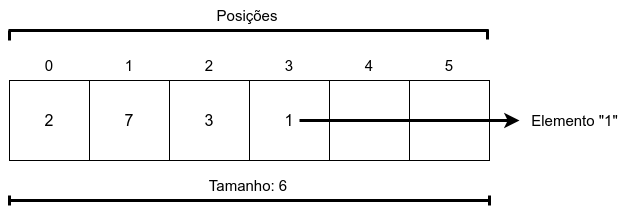
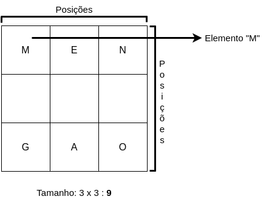
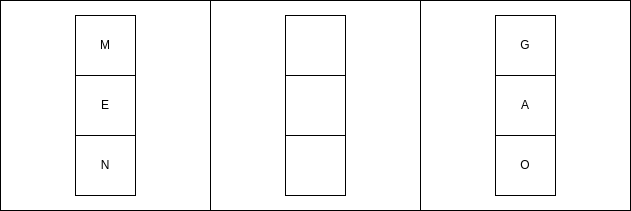

# Capítulo 2 – Vetores e Matrizes

As **estruturas de dados lineares** formam a base sobre a qual se constrói uma infinidade de soluções computacionais. Dentre essas estruturas, os **vetores** e **matrizes** se destacam por sua simplicidade, eficiência e ampla aplicabilidade. Desde problemas simples, como armazenar uma sequência de números, até aplicações complexas, como operações com grandes volumes de dados em **inteligência artificial**, essas estruturas se fazem presentes.

Neste capítulo, exploraremos em profundidade o funcionamento, as vantagens, limitações e os usos práticos dessas estruturas, utilizando quatro linguagens de programação distintas: **C**, **Python**, **Java** e **JavaScript**. Ao final, você estará apto a implementar vetores e matrizes com segurança, sabendo quando e como utilizá-los em seus algoritmos.

## Vetores: Estrutura Linear Unidimensional

Um **vetor**, também chamado de **array unidimensional**, é uma coleção ordenada de elementos de um mesmo tipo, armazenados de forma contígua na memória. Essa disposição sequencial permite o **acesso direto** a qualquer elemento, por meio de um índice, geralmente iniciado em zero.

A principal vantagem dos vetores está na **eficiência de acesso**. Obter o valor de um elemento na posição `i` pode ser feito em **tempo constante**, ou seja, **O(1)**. Isso ocorre porque o índice funciona como um deslocamento direto a partir da posição base na memória onde o vetor está armazenado.

Considere o seguinte vetor:

<div align="center">
  
</div>

Nesse vetor de inteiros, temos os valores `2`, `7`, `3` e `1` nas posições `0`, `1`, `2` e `3`, respectivamente. As posições `4` e `5` ainda não foram utilizadas e permanecem **vazias** (ou contêm lixo de memória, dependendo da linguagem utilizada).

Esse tipo de estrutura é ideal para armazenar uma quantidade **conhecida e fixa** de elementos, como notas de alunos, códigos de produtos ou resultados de sensores, por exemplo.

Exemplo em C:

```c
#include <stdio.h>

int main() {
    int numeros[6] = {2, 7, 3, 1}; // valores não definidos assumem lixo de memória
    printf("O quarto elemento é: %d\n", numeros[3]); // imprime 1
    return 0;
}
```

Exemplo em Python:

```python
numeros = [2, 7, 3, 1]
print("O quarto elemento é:", numeros[3])  # imprime 1
```

Exemplo em Java:

```java
public class VetorExemplo {
    public static void main(String[] args) {
        int[] numeros = {2, 7, 3, 1};
        System.out.println("O quarto elemento é: " + numeros[3]); // imprime 1
    }
}
```

Exemplo em JavaScript:

```javascript
let numeros = [2, 7, 3, 1];
console.log("O quarto elemento é: " + numeros[3]); // imprime 1
```

### Vantagens e Limitações

As principais **vantagens** dos vetores incluem:

- Acesso direto e rápido (`O(1)`)
- Estrutura simples e fácil de implementar
- Ideal para operações sequenciais

Entretanto, eles também apresentam **limitações** importantes:

- **Tamanho fixo**: uma vez definido, não pode ser alterado sem realocar memória
- **Inserção e remoção custosas**: exige deslocamento de elementos
- **Espaço potencialmente desperdiçado**: se o vetor for subutilizado

Assim, vetores devem ser usados quando se conhece antecipadamente a quantidade de dados a ser armazenada e quando o foco está no acesso rápido a elementos.

## Matrizes: Estrutura Linear Multidimensional

Uma **matriz** é uma generalização do vetor para duas ou mais dimensões. Trata-se de uma **tabela de elementos**, dispostos em linhas e colunas. Cada posição da matriz é acessada por meio de **dois ou mais índices**, conforme sua dimensão. Por exemplo, uma matriz bidimensional (duas dimensões) pode ser representada assim:

<div align="center">
  
</div>

O elemento na **linha 0** e **coluna 0** é acessado por `matriz[0][0]` em linguagens como C, Python, Java e JavaScript.

Internamente, as matrizes são armazenadas como **vetores de vetores**, o que significa que, na prática, uma matriz 3x3 pode ser visualizada como:

<div align="center">
  
</div>

Cada linha é, na verdade, um vetor independente, contendo seus próprios elementos. Esse modelo é chamado de **array de arrays** e é a forma mais comum de representação em linguagens modernas.

Exemplo em C:

```c
#include <stdio.h>

int main() {
    int matriz[3][3] = {
        {1, 2, 3},
        {4, 5, 6},
        {7, 8, 9}
    };
    printf("Elemento na posição [0][0]: %d\n", matriz[0][0]); // imprime 1
    return 0;
}
```

Exemplo em Python:

```python
matriz = [
    [1, 2, 3],
    [4, 5, 6],
    [7, 8, 9]
]
print("Elemento na posição [0][0]:", matriz[0][0])  # imprime 1
```

Exemplo em Java:

```java
public class MatrizExemplo {
    public static void main(String[] args) {
        int[][] matriz = {
            {1, 2, 3},
            {4, 5, 6},
            {7, 8, 9}
        };
        System.out.println("Elemento na posição [0][0]: " + matriz[0][0]); // imprime 1
    }
}
```

Exemplo em JavaScript:

```javascript
let matriz = [
    [1, 2, 3],
    [4, 5, 6],
    [7, 8, 9]
];
console.log("Elemento na posição [0][0]: " + matriz[0][0]); // imprime 1
```

### Matrizes multidimensionais

Embora menos comuns, é possível criar matrizes com mais de duas dimensões, como **tridimensionais** (por exemplo, cubos de dados), ou até mesmo estruturas com 4 ou mais dimensões, úteis em domínios como:

- Processamento de imagens 3D
- Redes neurais convolucionais
- Simulações físicas complexas

O acesso a elementos em matrizes multidimensionais é igualmente eficiente, mas sua **manipulação** pode ser mais complexa.

### Limitações e Considerações

As **limitações das matrizes** são similares às dos vetores:

- **Tamanho fixo**: não se ajustam dinamicamente
- **Inserção e remoção custosas**: principalmente de linhas e colunas
- **Complexidade de manipulação**: aumenta com o número de dimensões

Contudo, as matrizes são ferramentas **indispensáveis** em diversas áreas, como:

- **Álgebra linear**
- **Computação gráfica**
- **Machine Learning**
- **Simulações científicas**

## Considerações Finais

Vetores e matrizes são estruturas **fundamentais** no estudo de algoritmos e estruturas de dados. Sua presença é constante em problemas computacionais por sua **eficiência**, **simplicidade** e **capacidade de representar dados estruturados**.

Ao compreender plenamente o funcionamento de vetores e matrizes, o programador amplia significativamente sua capacidade de desenvolver algoritmos mais eficazes e estruturados. Além disso, essas estruturas formam a **base para estruturas mais complexas**, como listas encadeadas, pilhas, filas, árvores e grafos — temas que serão abordados nos próximos capítulos.
