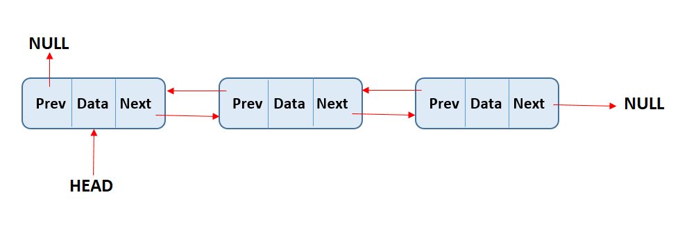

# Capítulo 3 – Listas

As **listas encadeadas** constituem uma importante classe de estruturas de dados dinâmicas, caracterizadas pela flexibilidade na manipulação de seus elementos. Diferentemente dos vetores, que exigem uma alocação contígua de memória e cujas operações de inserção e remoção podem ser custosas, as listas encadeadas organizam seus elementos de forma não contígua, possibilitando um gerenciamento mais eficiente da memória e facilitando operações frequentes de modificação estrutural.

Essas listas são compostas por **nós** (ou "elementos"), onde cada nó armazena um **valor (ou dado)** e, pelo menos, uma **referência (ou ponteiro)** que aponta para outro nó. Essa estrutura permite a criação de uma cadeia de elementos, na qual o acesso sequencial é realizado por meio do encadeamento de ponteiros.

Neste capítulo, exploraremos em profundidade as principais variações de listas encadeadas:

- Listas encadeadas simples
- Listas duplamente encadeadas
- Listas circulares
- Listas circulares duplamente encadeadas

Cada variação será analisada quanto à sua estrutura, funcionalidade, operações básicas, vantagens, desvantagens e custos computacionais.

## Listas Encadeadas Simples

As **listas encadeadas simples** (ou **singly linked lists**) são a forma mais básica de listas dinâmicas. Cada nó dessa estrutura contém duas informações:

- Um **dado** que representa o valor armazenado;
- Um **ponteiro** que indica o próximo nó na sequência.

A estrutura é iniciada por um **ponteiro externo**, geralmente chamado de _head_ (cabeça), que aponta para o primeiro nó da lista. O último nó da sequência tem seu ponteiro ajustado para `null`, indicando que não há um próximo nó — ou seja, esse é o fim da lista.

  

Essa estrutura é naturalmente unidirecional: percorre-se a lista sempre no sentido do primeiro ao último nó. Como cada nó conhece apenas seu sucessor, a manipulação de elementos anteriores exige uma travessia completa da lista até o ponto desejado.

Suas operações fundamentais são:

- **Inserção no início**: Realiza-se com extrema eficiência, pois basta criar um novo nó e ajustar seu ponteiro para o antigo primeiro nó. Em seguida, o ponteiro externo é redirecionado para o novo nó. Essa operação tem complexidade $O(1)$.
- **Inserção no meio ou no final**: Exige a travessia da lista até a posição desejada para que os ponteiros possam ser corretamente atualizados. A complexidade é $O(n)$, sendo `n` o número de elementos da lista.
- **Remoção do primeiro nó**: Semelhante à inserção inicial, a remoção do primeiro nó é rápida. Basta ajustar o ponteiro externo para apontar para o segundo nó da lista. Operação de custo $O(1)$.
- **Remoção no meio ou no final**: Requer a localização prévia do nó anterior ao que será removido, o que demanda uma travessia completa ou parcial da lista. A operação é $O(n)$ no pior caso.
- **Busca por valor**: Como não há índice ou acesso direto, a busca deve percorrer os nós um a um, até localizar o valor desejado. A complexidade é $O(n$).

As listas encadeadas simples são ideais para cenários com inserções e remoções frequentes no início da lista. No entanto, têm desempenho inferior em buscas ou inserções em posições intermediárias, uma vez que não há acesso direto aos nós.

## Listas Duplamente Encadeadas

As **listas duplamente encadeadas** (ou **doubly linked lists**) ampliam a flexibilidade da versão simples ao adicionar um segundo ponteiro em cada nó. Assim, cada nó contém:

- Um **dado**;
- Um ponteiro para o **próximo** nó;
- Um ponteiro para o **nó anterior**.

Com isso, é possível percorrer a lista em ambos os sentidos — do início ao fim e do fim ao início — o que facilita determinadas operações.

  

Essa estrutura oferece um equilíbrio entre desempenho e versatilidade, pois, ao conhecer um determinado nó, é possível navegar para frente ou para trás sem a necessidade de reiniciar o percurso a partir do **head**.

Suas operações fundamentais são:

- **Inserção em posição conhecida**: Quando se conhece o nó de referência (anterior ou posterior), a inserção é eficiente. Ajustam-se apenas os ponteiros dos nós vizinhos. Complexidade $O(1)$.
- **Remoção de nó conhecido**: Assim como na inserção, quando o nó a ser removido é previamente identificado, bastam atualizações locais nos ponteiros. Complexidade $O(1)$.
- **Busca**: A busca ainda exige a travessia da lista, pois não há indexação. Contudo, o percurso reverso pode, em certas situações, reduzir o tempo total. Complexidade média $O(n)$.

A grande vantagem está na **navegação bidirecional** e na possibilidade de manipular elementos com maior agilidade, principalmente quando se trabalha com estruturas como **listas ordenadas** ou **listas com acesso por ambos os extremos**. O custo é um maior uso de memória, já que cada nó precisa manter dois ponteiros.

## Listas Circulares

As **listas circulares** (**circular linked lists**) são uma variação das listas encadeadas simples, nas quais o último nó não aponta para `null`, mas sim para o primeiro nó da lista. Com isso, forma-se um ciclo fechado.

  

Essa estrutura é útil em sistemas que requerem **percurso contínuo ou cíclico**, como buffers circulares, algoritmos de agendamento, simulações de jogos ou problemas clássicos como o **problema de Josephus**.

Em listas circulares, **não existe um início ou fim natural**. Por isso, é comum adotar convenções: uma delas é manter o ponteiro externo apontando para o **último** nó, de modo que o nó seguinte seja o primeiro. Isso facilita inserções e remoções próximas às extremidades.

Suas operações fundamentais são:

- **Inserção após um nó conhecido**: Como há um encadeamento contínuo, inserir um novo nó após um determinado nó é uma operação local, com custo $O(1)$.
- **Remoção de nó conhecido**: Também é realizada em tempo $O(1)$, desde que o nó de interesse e seu predecessor sejam conhecidos.
- **Busca por valor**: Requer travessia cíclica até encontrar o elemento ou retornar ao ponto inicial. Complexidade $O(n)$.

A principal vantagem nas listas circulares é a **eliminação de pontas soltas** (sem `null`), permitindo que a lista seja percorrida continuamente. No entanto, a implementação deve ser cuidadosa, pois o risco de loops infinitos é real se os critérios de parada não forem bem definidos.

## Listas Circulares Duplamente Encadeadas

As **listas circulares duplamente encadeadas** (**doubly circular linked lists**) combinam as características das listas duplamente encadeadas com a estrutura circular. Assim, cada nó possui dois ponteiros (anterior e próximo) e todos estão conectados em ciclo: o primeiro nó aponta para o último e vice-versa.

  

Essa estrutura oferece o **máximo de flexibilidade** entre as listas dinâmicas, permitindo:

- Navegação contínua em ambos os sentidos;
- Inserções e remoções rápidas em qualquer ponto da lista;
- Ideal funcionamento em sistemas circulares complexos.

Suas operações fundamentais são:

- **Inserção e remoção em posição conhecida**: Assim como nas listas duplamente encadeadas, ambas operações são locais e realizadas em tempo $O(1)$.
- **Busca**: Permite percorrer em duas direções, mas continua tendo custo $O(n)$ no pior caso.

Por ser uma estrutura poderosa, é utilizada em aplicações que requerem **flexibilidade máxima** de navegação e modificação. O custo é o **aumento do uso de memória** e da **complexidade na implementação**, pois é preciso cuidar de todos os encadeamentos ao inserir ou remover elementos.

## Considerações Finais

As listas encadeadas, em suas diversas formas, são estruturas fundamentais em ciência da computação. Elas oferecem soluções elegantes para problemas que exigem **flexibilidade na alocação de memória** e **eficiência nas operações de inserção e remoção**.

A escolha entre listas simples, duplamente encadeadas, circulares ou duplamente circulares depende diretamente dos requisitos do problema a ser resolvido. Operações como busca, inserção e remoção devem ser cuidadosamente analisadas quanto à sua frequência e complexidade, de modo a selecionar a estrutura mais apropriada.

Entender profundamente essas variações é essencial para projetar algoritmos eficientes e implementar soluções robustas em software, especialmente na construção de **estruturas de dados mais complexas**, como pilhas, filas, deques e tabelas de dispersão.