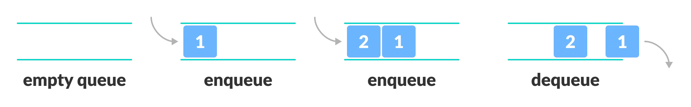
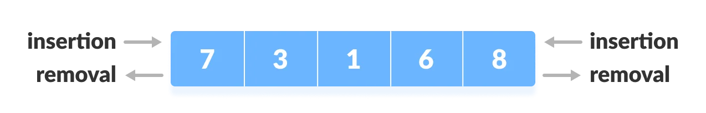

  

 

# Estruturas Lineares - Parte 3: Pilhas e Filas

- [Introdução](#introdução)
- [Pilha (Stack)](#pilha-stack)
- [Fila (Queue)](#fila-queue)
- [Fila Dupla (Deque)](#fila-dupla-deque)
- [Vetor/Matriz vs. Lista vs. Pilha vs. Fila](#vetormatriz-vs-lista-vs-pilha-vs-fila)

## Introdução

Estruturas de dados como pilha, fila e fila dupla (deque) são fundamentais na programação, pois fornecem maneiras eficientes de organizar e acessar dados, oferecendo um grande poder e flexibilidade na organização e manipulação de dados. A pilha é ideal para cenários onde a ordem LIFO é necessária, como em chamadas de função recursivas. A fila é perfeita para situações FIFO, como em sistemas de atendimento. O deque, com sua capacidade de inserir e remover em ambas as extremidades, é extremamente versátil e útil em uma ampla gama de aplicações, desde algoritmos até sistemas de buffering.

## Pilha (Stack)

A pilha é uma estrutura de dados linear que segue o princípio **LIFO (Last In, First Out)**, onde o último elemento inserido é o primeiro a ser removido. Imagine uma pilha de pratos; o prato que você colocou por último no topo é o primeiro que você retira. A estrutura de uma pilha é bastante simples: consiste em uma sequência de elementos onde todas as operações ocorrem no topo da pilha.

  

Uma pilha pode ser implementada usando arrays ou listas encadeadas. No caso de arrays, a pilha tem um tamanho fixo definido, enquanto as listas encadeadas permitem uma pilha de tamanho dinâmico.

As operações básicas de uma pilha são:

- **Push (inserir)**: Adiciona um elemento no topo da pilha.
- **Pop (remover)**: Remove e retorna o elemento do topo da pilha.
- **Peek (ou Top)**: Retorna o elemento do topo sem removê-lo.
- **isEmpty (ou Empty)**: Verifica se a pilha está vazia.

As operações push, pop, peek e isEmpty em uma pilha possuem todas um custo de `O(1)`, ou seja, realizadas em tempo constante. Isso porque cada uma dessas operações envolve apenas a atualização ou acesso de um único elemento.

A pilha é amplamente utilizada em problemas de recursão, na avaliação de expressões, e em algoritmos de backtracking, entre outros.

## Fila (Queue)

A fila é uma estrutura de dados linear que segue o princípio **FIFO (First In, First Out)**, onde o primeiro elemento inserido é o primeiro a ser removido. Isso é semelhante a uma fila de pessoas; a primeira pessoa a entrar na fila é a primeira a ser atendida.

  

Uma fila pode ser implementada usando arrays, listas encadeadas ou até mesmo estruturas mais avançadas como filas circulares para otimização de espaço. Em uma implementação simples usando listas encadeadas, cada nó tem um valor e um ponteiro para o próximo nó. A fila possui um ponteiro para o primeiro nó (frente) e outro para o último nó (traseira).

As operações básicas de uma fila são:

- **Enqueue (inserir)**: Adiciona um elemento no final da fila.
- **Dequeue (remover)**: Remove e retorna o elemento da frente da fila.
- **Front (ou Peek)**: Retorna o elemento da frente sem removê-lo.
- **isEmpty (ou Empty)**: Verifica se a fila está vazia.
Custo de Execução

As operações enqueue, dequeue, front e isEmpty em uma fila são todas de tempo constante `O(1)`, dado que não envolvem a movimentação de elementos, apenas a atualização de ponteiros ou índices.

As filas são usadas em algoritmos de busca em largura, sistemas de gerenciamento de tarefas e em muitos sistemas que requerem processamento em ordem, como filas de impressão e processamento de dados em tempo real.

## Fila Dupla (Deque)

A fila dupla, ou deque (Double-Ended Queue), é uma estrutura de dados que permite a inserção e a remoção de elementos em ambas as extremidades, ou seja, tanto no início quanto no final. Isso a torna uma estrutura muito flexível e poderosa.

  

Um deque pode ser implementado usando arrays ou listas duplamente encadeadas. Em uma implementação usando listas duplamente encadeadas, cada nó possui um valor, um ponteiro para o próximo nó e um ponteiro para o nó anterior. A deque possui ponteiros tanto para o início (frente) quanto para o final (traseira).

As operações básicas de um deque são:

- **AddFront (ou PushFront)**: Adiciona um elemento no início do deque.
- **AddRear (ou PushBack)**: Adiciona um elemento no final do deque.
- **RemoveFront (ou PopFront)**: Remove e retorna o elemento do início do deque.
- **RemoveRear (ou PopBack)**: Remove e retorna o elemento do final do deque.
- **Front (ou PeekFront)**: Retorna o elemento do início sem removê-lo.
- **Rear (ou PeekBack)**: Retorna o elemento do final sem removê-lo.
- **isEmpty (ou Empty)**: Verifica se o deque está vazio.

Todas as operações em um deque tem custo de `O(1)`, independentemente de ser no início ou no final. Isso porque cada operação envolve apenas a atualização de ponteiros ou índices, sem a necessidade de deslocar elementos.

Os deques são extremamente úteis em aplicações que requerem flexibilidade na manipulação de dados em ambas as extremidades, como em algoritmos de cache, algoritmos de pesquisa e em várias aplicações de simulação.

## Vetor/Matriz vs. Lista vs. Pilha vs. Fila

Em resumo, as estruturas lineares tem algumas pequenas diferenças:

- Vetores e matrizes são estáticos, ou seja, têm seu tamanho definido em sua criação, e ele não muda. Possuem acesso posicional e são alocados contiguamente na memória.
- Pilhas, Filas e Listas são dinâmicas, ou seja, têm seu tamanho variável. São alocadas espaçadamente em endereços de memória livres, já que podem usar ponteiros. Elas também podem ter implementações com vetores, mas há uma perda com essa abordagem, devido à falta de dinamismo de que geralmente essas estruturas necessitam.

Embora possuam essas diferenças, uma coisa é comum a todas essas estruturas: a linearidade. Os elementos sempre estão ligados de forma sequencial e, no caso de matrizes, podem ter mais de uma dimensão. A única relação que existe entre os elementos dessas estruturas é que eles são conectados em um sentido: início → fim (esquerda/direita), fim → início (direita/esquerda), cima → baixo ou baixo → cima.

Com isso, pode-se ter dúvidas sobre qual delas utilizar, para isso deve-se pensar primeiro: Qual problema precisamos resolver? A partir disso é que podemos escolher a estrutura de dados linear que se adeque ao problema que se deseja solucionar. Não existe uma melhor que outra. Cada uma tem um porquê de sua existência e um nicho de problemas no qual se encaixa melhor para ajudar a resolvê-los. 
Entender de forma clara o comportamento de cada uma ajuda a escolher a que mais se adequa ao problema a ser resolvido. Algumas dicas ajudam nessa escolha:

- Se tem a certeza de que a quantidade de elementos é fixa, use um vetor. Assim, o acesso será mais rápido e se consumirá menos memória, pois não precisará de ponteiros. Se precisar de mais de uma dimensão, use uma matriz.
- Se é necessário manter uma sequência dos elementos em que os últimos elementos devem ser acessados primeiro, use uma pilha.
- Precisa criar prioridades entre os elementos? Use uma fila.
- Apenas quer ter uma disposição linear dos elementos e precisa de acesso aleatório a eles? Use a lista.

Podemos ver que cada uma dessas estruturas de dados tem uma regra para seu uso muito bem definida.