

  

 

# Estruturas Não-Lineares - Parte 1: Árvores

- [Introdução](#introdução)

## Introdução

As árvores são estruturas de dados hierárquicas que consistem em nós conectados por arestas, formando uma estrutura ramificada. Elas são amplamente utilizadas em várias áreas da computação, incluindo banco de dados, sistemas de arquivos e algoritmos de busca. Uma árvore começa com um nó raiz e cada nó pode ter zero ou mais filhos.

## Estrutura de uma Árvore e Terminologias

As árvores são estruturas hierárquicas compostas por nós,onde cada nó contém um valor ou chave e referências para seus nós filhos. Geralmente, os filhos podem ser categorizados em "filhos mais à esquerda" ou "filhos mais à direita". A depender do tipo de árvore, essa categorização se torna mais evidente. O nó superior da árvore é chamado de raiz, e os nós sem filhos são chamados de folhas. Cada nó pode ter vários filhos, mas apenas um pai, exceto o nó raiz, que não tem pai. Um exemplo clássico desse tipo de estrutura em nosso dia a dia é a árvore genealógica de uma família.

Por ser uma estrutura de dados um pouco mais complexa, a árvore possui um conjunto de termos que auxiliam seu entendimento e uso. Consideremos a imagem a seguir, que é uma das formas mais comuns de representação de uma árvore. Esta é uma árvore simples, na qual apenas a regra essencial dessa estrutura deve ser considerada: pais possuem filhos. A seguir, veremos algumas das terminologias referentes a essa estrutura.

  

- **Raiz (Root)**: é o elemento (nó) inicial de uma árvore. É a partir dele que ela se inicia e por ele que se inicia o processo de percorrê-la. Observação importante: embora também seja um nó, este é o único que não possui um nó pai. A raiz da árvore de exemplo é `A`.
- **Nó (Node)**: é o nome dado ao elemento que constitui uma árvore. Ele é constituído por um valor e conectores/arestas (geralmente ponteiros) para outros nós. Todos os círculos em nossa árvore de exemplos são nós.
- **Nó interno**: é um nó que possui pelo menos um "filho". Ou seja, são "nós pais". `B`, `C`, `D`, `E`, `F`, `H`, `I` e `J` são nós internos. Embora `A` seja um "nó pai", ele não se encaixa nessa definição por ser a raiz.
- **Nó externo (Leaf Nodes)**: é um nó que não possui "filhos". Nesse caso, são "nós filhos". O termo mais usado para nomear esse tipo de nó é nó folha. Nós folhas sempre se encontram ao final de uma árvore. `G`, `K`, `L`, `M`, `N`, `O` e `P` são nós folhas.
- **Ancestral**: são os nós que antecedem um determinado nó. Isso muda de acordo com o nó em questão. Levando em consideração o nó `J`, seus ancestrais são `F`, `C` e `A`.
- **Descendente**: são os nós que procedem de um determinado nó. Isso muda de acordo com o nó em questão. Levando em consideração o nó `C`, seus descendentes são `G`, `F`, `J`, `O` e `P`.
- **Grau do nó (Degree)**: é a quantidade de "filhos" que um determinado nó possui. Levando em consideração o nó `D`, temos um grau 1, pois ele só possui um filho, o nó `H`. Já o nó `H` possui dois filhos, logo ele tem grau 2.
- **Grau da árvore (Degree of tree)**: é a maior quantidade de "filhos" de um determinado nó. Em nossa árvore, o grau é 2, pois esse é maior grau de um dos seus nós, no caso dos nós `A`, `B`, `C`, `H`, `I` e `J`.
- **Profundidade/Altura (Depth/Height)**: é a quantidade de nós a partir da raiz até a folha mais distante. Em nossa árvore, temos uma profundidade de 5, pois vamos de `A` até `K`, passando por `B`, `D`, `H`. Cada nó visitado para se obter a profundidade é chamado de **nível (Level)**. A depender da necessidade, podemos também usar o termo profundidade para nós internos.
- **Largura (Width)**: é a quantidade de nós de um determinado nível. No nível 2 de nossa árvore, temos a largura 4 — no caso, os nós `D`, `E`, `G` e `F`. Essa largura pode variar de acordo com o nível, e nossa árvore demonstra isso.
- **Largura da árvore (Width of tree)**: é a maior largura de nós de um determinado nível da árvore. Em nossa árvore, a largura é 6, embora tenhamos larguras de 1, 2, 3 e 4.
- **Floresta (Forest)**: são subárvores dentro de uma árvore principal. Em nossa árvore, temos por exemplo, uma floresta começando em `B`, que forma uma subárvore com os nós `D` e `E`.
- **Tamanho da árvore (Size of tree)**: é a quantidade total de nós que a árvore possui. Nossa árvore tem um tamanho de 16 nós.

Embora essa seja a representação mais usual de uma árvore, existem outras, tais como diagramas de conjunto, representação linear e representação em níveis.

## Operações Básicas

As árvores possuem as operações de **Inserir**, **Pesquisar**, **Atualizar** e **Excluir**. É importante ressaltar que essas operações podem variar seus comportamentos de acordo com o tipo de árvore, mas, em sua essência, se comportam da seguinte forma:

- `insert`: adiciona um novo nó filho em um nó pai — `insert(raiz, pai, valor)`.
- `search`: obtém um nó da árvore — `search(raiz, valor)`.
- `update`: modifica um nó da árvore — `update(raiz, nó, valor)`.
- `delete`: exclui um nó da árvore — `delete(raiz, valor)`.

Todas essas operações tem um custo equivalente a `O(log n)`, no caso de uma árvore balanceada, e no pior caso é `O(n)` para uma árvore desbalanceada.

## Percorrendo uma Árvore

Para que seja possível executar operações em uma árvore, é preciso navegar por ela. Para realizar isso, é necessário passar pelos seus nós a partir de uma das três formas existentes de navegação: **Pré-ordem**, **Pós-ordem** e **Em-ordem**.

- **Pré-ordem (Pre-order)**: Visita o nó raiz, depois a subárvore esquerda e finalmente a subárvore direita.
- **Pós-ordem (Post-order)**: Visita a subárvore esquerda, depois a subárvore direita e finalmente o nó raiz.
- **Em-ordem (In-order)**: Visita a subárvore esquerda, depois o nó raiz e finalmente a subárvore direita. Em uma árvore binária de busca, isso resulta em uma sequência ordenada.

Dessa forma, podemos perceber que as árvores possuem um processo de acesso aos seus elementos (nós) mais aprimorado por ser hierárquica, pois não apenas temos a ideia de cima-baixo ou esquerda-direita, mas, sim, uma ordem de navegação pelos elementos (nós) que, a depender da forma utilizada, levará a um diferente resultado de exibição. É válido informar que essas navegações podem ser à esquerda ou à direta, e que uma não é melhor do que a outra, sendo apenas uma questão referencial. Todavia, a navegação à esquerda é universalmente a mais utilizada.

### Pré-ordem (pre-order)

Nessa forma de percorrer os nós de uma árvore, inicia-se sua exibição a partir da raiz e segue-se exibindo (visitando) primeiramente sempre um nó interno. Somente após esses nós internos serem visitados é que se visita um nó filho e/ou um nó folha. 

Levando em consideração a árvore de exemplo a seguir, teríamos o seguinte resultado ao percorrê-la em pré-ordem com navegação à esquerda `%`, `*`, `$`, `!`, `=`, `@`, `&`, `/`, `+` e `#`.

  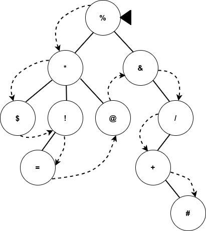

Embora a imagem anterior seja o resultado de um percorrimento em pré-ordem, sabemos que, para chegar a um nó folha de fato, sempre devemos passar pelo nó interno (pai). Assim, o percurso que realmente é executado é o da imagem a seguir. Nele, nota-se que alguns nós são visitados mais de uma vez (o nó `*`, por exemplo, é visitado 4 vezes) para atingir o resultado desejado.

  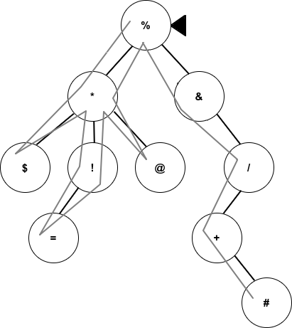

### Pós-ordem (post-order)

Nessa forma de percorrer os nós de uma árvore, inicia-se sua exibição sempre a partir do nó folha mais distante e segue-se exibindo (visitando) primeiramente sempre esses nós folhas e depois os nós internos. Somente após visitar todos eles é que a raiz é exibida. 

Levando em consideração nossa árvore de exemplo da Figura 8.2, teríamos o seguinte resultado ao percorrê-la em pós-ordem com navegação à esquerda: `$`, `=`, `!`, `@`, `*`, `#`, `+`, `/`, `&` e `%`. A imagem a seguir demonstra, conceitualmente, esse percurso. Nota-se que, quando não existe um nó folha mais à esquerda, começa-se pelo primeiro disponível — no caso, o nó `#`.

  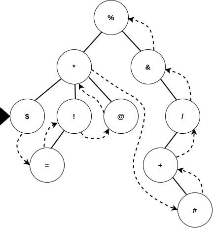

Novamente, existe um percurso real executado que é apresentado na imagem a seguir. Mais uma vez, alguns nós são visitados repetidamente (o nó `*`, por exemplo, foi visitado 3 vezes) para atingir o resultado desejado.

  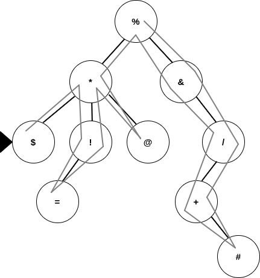

### Em-ordem (in-order)

Nessa terceira e última forma de percorrer uma árvore, inicia-se sua exibição sempre a partir do nó folha mais distante e segue-se exibindo "na ordem" de visitação dos nós, sejam eles nós folhas e/ou nós internos. Após uma subárvore ser completamente visitada, a raiz é exibida e navega-se para a outra subárvore e se repete o processo.

Assim, teríamos o seguinte resultado ao percorrer a árvore exemplo em-ordem com navegação à esquerda: `$`, `*`, `=`, `!`, `@`, `%`, `&`, `+`, `#` e `/`. Nota-se que, quando não existe um nó folha mais à esquerda, começa-se pelo primeiro disponível, no caso o nó `&` e `+`.

  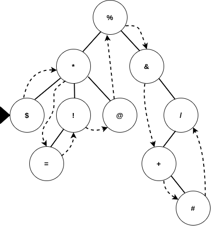

Mais uma vez, existe um percurso real, apresentado na imagem a seguir. Novamente, alguns nós são visitados de forma repetida (como exemplo o nó `*`, que é visitado 2 vezes).

  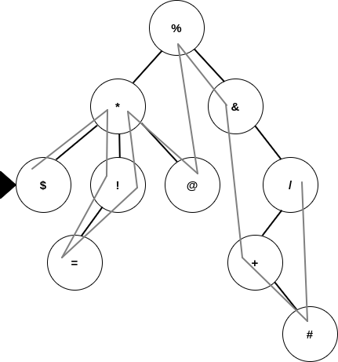

## Tipos de Árvores

Dependendo de como os elementos estão organizados dentro da árvore e da quantidade de nós filhos que os nós pais tenham, podemos identificar vários tipos de árvores. Existem dezenas de tipos de árvores, então aqui exploraremos as mais comumente usadas.

### Árvore Clássica

A árvore do tipo clássica é a mais fácil de trabalhar e entender. Ela é somente a disposição dos nós de forma hierárquica, sem nenhuma restrição de ordenação ou quantidade de nós filhos. As árvores utilizadas como exemplo até aqui são desse tipo.

### Árvore Binária

Uma árvore binária é aquela onde a quantidade de nós filhos para cada nós pai deve ser exatamente 0, 1 ou 2. A figura a seguir ilustra essa característica.

  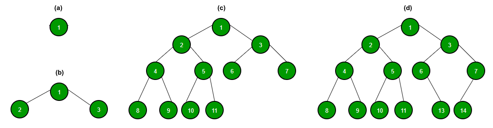

Em **(a)**, verificamos que o nó raiz possui 0 filhos. É a árvore mais simples que se pode ter. É válido ressaltar que uma árvore que possui somente o nó raiz é válida em qualquer tipo de árvore.

Já em **(b)**, temos uma árvore binária em que o nó `1` possui exatamente 2 filhos: `2` e `3`. Em **(c)**, todos os nós possuem 2 filhos, exceto os nós folha, que não possuem nenhum. Por fim, na árvore **(d)**, temos nós com 2 filhos (`1`, `2`, `3`, `4` e `5`). Quando a situação ilustrada em **(b)** e **(c)** se configura, temos o que é chamado de árvore binária completa ou árvore estritamente binária.

### Árvore Binária de Busca

A árvore binária de busca é uma variação da árvore binária que, além de atender à regra de quantidade de nós filhos desta, é necessariamente ordenada, ou seja, cada nó segue a propriedade de ordem binária: o valor do nó esquerdo é menor e o valor do nó direito é maior que o valor do nó pai. Esse tipo de árvore facilita operações de busca, inserção e remoção com complexidade `O(log n)` em média.

  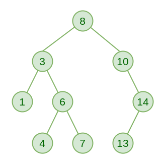

Como pode ser observado na árvore binária de busca acima, todos os nós à esquerca da raiz `8` tem valores menores que esta e todos os nós a direita tem valores maiores, o que também é válido para todos os nós da árvore.

### Árvore AVL

As árvores AVL (árvore Adelson-Velskii e Landis) são árvores binárias de busca autobalanceadas, onde a diferença de altura entre subárvores de qualquer nó é no máximo 1. Isso garante uma melhora na eficiência das operações em comparação a uma árvore binária de busca desbalanceada.

  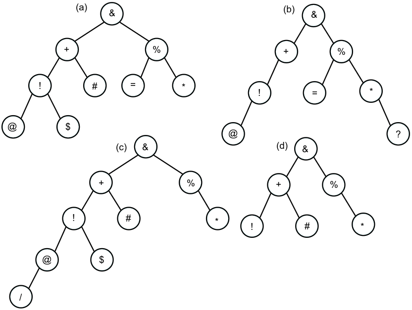

Na imagem anterior, todas as árvores podem ser classificadas como árvores binárias, mas somente **(a)** e **(d)** são árvores AVL, pois em nenhum nó destas duas temos uma diferença de profundidade entre suas subárvores maior que 1.Já nas árvores **(b)** e **(c)** podemos notar que existem nós com uma diferença de profundidade maior que 1 — por exemplo, o nó `+`.

É válido ressaltar que, quando desbalanceamentos ocorrem, devido a inserções ou exclusões, é necessário reorganizar a árvore para que ela ainda possa ser considerada AVL. Assim, devem ser realizadas movimentações nos nós, com certas regras. Estas movimentações são chamadas de rotações e têm a finalidade de deixar a árvore em uma organização que gere sempre o mesmo resultado, após inserções ou exclusões, quando for percorrida na navegação em-ordem.

Existe um conjunto de rotações que podem ser aplicadas para que a árvore se mantenha balanceada e, consequentemente, considerada AVL:

- Rotação simples à esquerda.
- Rotação simples à direita.
- Rotação dupla à esquerda.
- Rotação dupla à direita.

#### Rotação Simples à Esquerda

Essa rotação deve ser realizada quando a árvore estiver desbalanceada para a direita. Os passos a seguir devem ser aplicados:

- Separe toda a subárvore à direita.
- Retire toda a subárvore à esquerda da árvore separada e conecte-a no local da árvore original, da qual a subárvore à direita foi retirada.
- Torne toda a árvore original (modificada anteriormente) uma subárvore à esquerda da árvore separada.

A árvore abaixo está desbalanceada para a direita, logo, a rotação deve ser para a esquerda. Os passos acima são representados na imagem a seguir:

  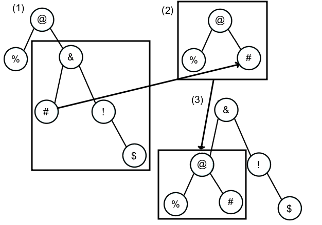

Para finalizar, podemos destacar dois pontos:

- Todos os nós subordinados a `%` e `#` devem ser movimentados na íntegra e sem modificações;
- A navegação em-ordem para (1) e (3) é a mesma: `%`, `@`, `#`, `&`, `$` e `!`.

Esses dois pontos destacados podem ser aplicados para as rotações a seguir.

#### Rotação Simples à Direita

Essa rotação deve ser realizada quando a árvore estiver desbalanceada para a esquerda. Os seguintes passos devem ser aplicados:

- Separe toda a subárvore à esquerda.
- Retire toda a subárvore à direita da árvore separada e conecte-a no local da árvore original da qual a subárvore à esquerda foi retirada.
- Torne toda a árvore original (modificada anteriormente) uma subárvore à direita da árvore separada.

A árvore abaixo está desbalanceada para a esquerda, logo, a rotação deve ser para a direita. Os passos descritos anteriormente são representados na imagem a seguir:

  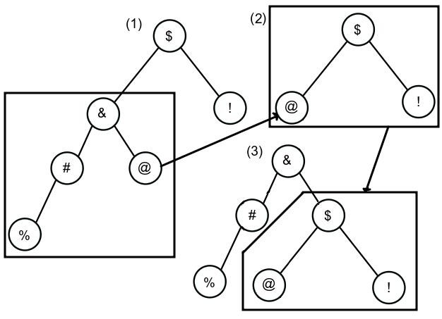

#### Rotação  Dupla à Esquerda (Esquerda-Direita)

Essa rotação deve ser realizada quando a árvore estiver desbalanceada para a direita e com um desvio para a esquerda, o que forma um espécie de quina. Essa rotação executa os seguintes passos:

- Aplica-se uma rotação simples à direita na subárvore à direita do nó desbalanceado.
- Aplica-se uma rotação simples à esquerda no nó desbalanceado da árvore resultante do passo 1.

A árvore abaixo está desbalanceada para a direita, mas com uma subárvore à esquerda mais profunda. Logo, a rotação deve ser dupla para a esquerda. A aplicação dos passos anteriores é representada na imagem a seguir, com duas figuras para 1 e para 2.

  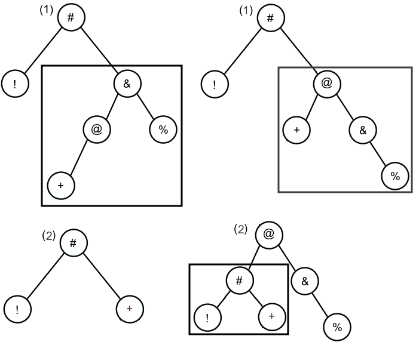

#### Rotação Dupla à Direita (Direita-Esquerda)

Essa rotação deve ser realizada quando a árvore estiver desbalanceada para a esquerda e com um desvio para a direita. Essa rotação executa os seguintes passos:

- Aplica-se uma rotação simples à esquerda na subárvore à esquerda do nó desbalanceado.
- Aplica-se uma rotação simples à direita no nó desbalanceado da árvore resultante do passo 1.

A árvore abaixo está desbalanceada para a esquerda, mas com uma subárvore à direita mais profunda. Logo, a rotação deve ser dupla para a direita. A aplicação dos passos acima é representada na imagem a seguir, com duas figuras para 1 e para 2.

  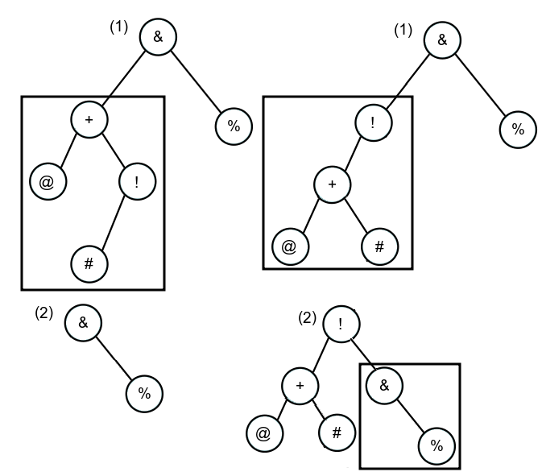

### Árvore Rubro-Negra (Árvore Vermelho-Preto)

As árvores rubro-negras são uma variação das árvores AVL. Devido a isso, elas possuem todas as mesmas propriedades e operações das AVL, mas com propriedades adicionais que garantem uma altura balanceada:

- Todo nó da árvore deve ser negro (preto) ou rubro (vermelho).
- A raiz é sempre negra.
- Nós folhas são sempre negros e são "filhos" nulos, mas que fazem parte da árvore.
- Nós rubros possuem filhos negros.
- A partir de qualquer nó para qualquer um de seus nós folhas descendentes, existe o mesmo número de nós pretos para qualquer caminho percorrido.

A imagem a seguir ilustra essas propriedades e demonstra como é uma árvore desse tipo.

  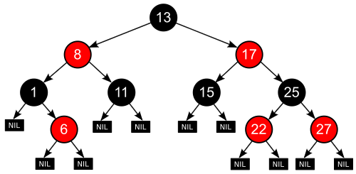

Na imagem anterior, notamos que a raiz `13` é negra. Os nós folhas são todos representados por `nill` (null) e são negros, ou seja, `11` e `15` não são folhas, mas, sim, nós internos. Se filhos forem adicionados a eles, tais filhos se comportarão como `6`, `22` e `27`. Os nós `8` e `17`, que são rubros, possuem filhos negros.

A aplicação dessa propriedade adicional permite que a árvore rubro-negra esteja quase sempre balanceada, evitando uma quantidade maior de rotações. O que possibilita isso são os filhos nulos, que fazem parte da árvore. Dessa maneira, mesmo que eles não possuam um dado em seu nó, estão presentes somente para manter a altura da árvore balanceada. Em contrapartida, as AVL são totalmente balanceadas e seus nós sempre devem possuir dados. Isso termina por requerer muito mais rotações para manter a árvore balanceada.

### Outros Tipos

Existem dezenas de tipos de árvores e que, muitas vezes, têm aplicabilidades bem específicas. Todavia, a grande maioria desses tipos são variações dos tipos aqui apresentados, que sofrem modificações para tratar problemas de forma mais eficaz. Como exemplos, podemos citar:

- Árvores B e B+.
- Árvore Heap.
- Árvore Trie.
- Árvore H.

### Comparação entre os Tipos

Como jpa foi dito, alguns tipos de árvores possuem aplicabilidades bem específicas. Um bom exemplo destas especificidades são os tipos AVL e rubro-negras. Estas árvores são muito similares: a rubro-negra é uma variação da AVL. Como vimos, as AVL devem sempre estar balanceadas e, para isso, rotações são constantemente realizadas. Ou seja, inserções e remoções são mais custosas nesse tipo de árvore, pois toda vez que uma destas é realizada, rotações talvez precisem ser realizadas para manter o balanceamento. Mas isso traz um benefício: as pesquisas são rápidas. Já a rubro-negra, por sempre estar "quase totalmente balanceada", requer menos rotações. No caso, inserções e remoções são menos custosas, mas, em contrapartida, pesquisas são mais lentas do que nas AVL. Então, qual devo usar para resolver meu problema? 

Se tivermos uma grande quantidade de dados com inserções e remoções constantes, a AVL é ruim, pois será muito custoso manter a árvore balanceada, e isso pode se transformar em um gargalo. Nesse caso, é melhor usar uma rubro-negra, que tem uma performance melhor para inserções e remoções — lembrando que, nesta, a pesquisa é mais lenta. Entretanto, se as inserções e remoções não são constantes e a pesquisa deve ser uma operação rápida, a AVL é e melhor opção.

Outra comparação pode ser feita entre as árvores binárias e árvores N-Árias. Devido às binárias só poderem possuir no máximo dois nós filhos, eventualmente elas podem ficar muito profundas, ou seja, com uma altura muito grande. Isso pode ser um problema a depender da quantidade de nós, pois várias chamadas recursivas serão feitas, e isso pode terminar por comprometer o consumo de memória. Como possível solução, o uso de N-Árias pode auxiliar no tocante ao menor consumo de memória, pois elas não têm limitação na quantidade de nós filhos, o que leva a um menor consumo de memória, mas torna o processo de pesquisa mais lento.

Ou seja, não tem "receita de bolo"! Devemos primeiro entender bem o problema que precisamos resolver para, assim, escolher uma das dezenas de opções de árvores que temos à nossa disposição.
