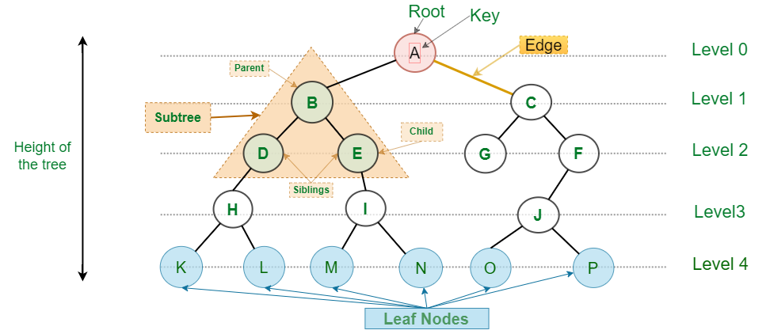

  

 

# Estruturas Não-Lineares - Parte 1: Árvores

- [Introdução](#introdução)

## Introdução

As árvores são estruturas de dados hierárquicas que consistem em nós conectados por arestas, formando uma estrutura ramificada. Elas são amplamente utilizadas em várias áreas da computação, incluindo banco de dados, sistemas de arquivos e algoritmos de busca. Uma árvore começa com um nó raiz e cada nó pode ter zero ou mais filhos.

## Estrutura de uma Árvore e Terminologias

As árvores são estruturas hierárquicas compostas por nós,onde cada nó contém um valor ou chave e referências para seus nós filhos. Geralmente, os filhos podem ser categorizados em "filhos mais à esquerda" ou "filhos mais à direita". A depender do tipo de árvore, essa categorização se torna mais evidente. O nó superior da árvore é chamado de raiz, e os nós sem filhos são chamados de folhas. Cada nó pode ter vários filhos, mas apenas um pai, exceto o nó raiz, que não tem pai. Um exemplo clássico desse tipo de estrutura em nosso dia a dia é a árvore genealógica de uma família.

Por ser uma estrutura de dados um pouco mais complexa, a árvore possui um conjunto de termos que auxiliam seu entendimento e uso. Consideremos a imagem a seguir, que é uma das formas mais comuns de representação de uma árvore. Esta é uma árvore simples, na qual apenas a regra essencial dessa estrutura deve ser considerada: pais possuem filhos. A seguir, veremos algumas das terminologias referentes a essa estrutura.

  

- **Raiz (Root)**: é o elemento (nó) inicial de uma árvore. É a partir dele que ela se inicia e por ele que se inicia o processo de percorrê-la. Observação importante: embora também seja um nó, este é o único que não possui um nó pai. A raiz da árvore de exemplo é `A`.
- **Nó (Node)**: é o nome dado ao elemento que constitui uma árvore. Ele é constituído por um valor e conectores/arestas (geralmente ponteiros) para outros nós. Todos os círculos em nossa árvore de exemplos são nós.
- **Nó interno**: é um nó que possui pelo menos um "filho". Ou seja, são "nós pais". `B`, `C`, `D`, `E`, `F`, `H`, `I` e `J` são nós internos. Embora `A` seja um "nó pai", ele não se encaixa nessa definição por ser a raiz.
- **Nó externo (Leaf Nodes)**: é um nó que não possui "filhos". Nesse caso, são "nós filhos". O termo mais usado para nomear esse tipo de nó é nó folha. Nós folhas sempre se encontram ao final de uma árvore. `G`, `K`, `L`, `M`, `N`, `O` e `P` são nós folhas.
- **Ancestral**: são os nós que antecedem um determinado nó. Isso muda de acordo com o nó em questão. Levando em consideração o nó `J`, seus ancestrais são `F`, `C` e `A`.
- **Descendente**: são os nós que procedem de um determinado nó. Isso muda de acordo com o nó em questão. Levando em consideração o nó `C`, seus descendentes são `G`, `F`, `J`, `O` e `P`.
- **Grau do nó (Degree)**: é a quantidade de "filhos" que um determinado nó possui. Levando em consideração o nó `D`, temos um grau 1, pois ele só possui um filho, o nó `H`. Já o nó `H` possui dois filhos, logo ele tem grau 2.
- **Grau da árvore (Degree of tree)**: é a maior quantidade de "filhos" de um determinado nó. Em nossa árvore, o grau é 2, pois esse é maior grau de um dos seus nós, no caso dos nós `A`, `B`, `C`, `H`, `I` e `J`.
- **Profundidade/Altura (Depth/Height)**: é a quantidade de nós a partir da raiz até a folha mais distante. Em nossa árvore, temos uma profundidade de 5, pois vamos de `A` até `K`, passando por `B`, `D`, `H`. Cada nó visitado para se obter a profundidade é chamado de **nível (Level)**. A depender da necessidade, podemos também usar o termo profundidade para nós internos.
- **Largura (Width)**: é a quantidade de nós de um determinado nível. No nível 2 de nossa árvore, temos a largura 4 — no caso, os nós `D`, `E`, `G` e `F`. Essa largura pode variar de acordo com o nível, e nossa árvore demonstra isso.
- **Largura da árvore (Width of tree)**: é a maior largura de nós de um determinado nível da árvore. Em nossa árvore, a largura é 6, embora tenhamos larguras de 1, 2, 3 e 4.
- **Floresta (Forest)**: são subárvores dentro de uma árvore principal. Em nossa árvore, temos por exemplo, uma floresta começando em `B`, que forma uma subárvore com os nós `D` e `E`.
- **Tamanho da árvore (Size of tree)**: é a quantidade total de nós que a árvore possui. Nossa árvore tem um tamanho de 16 nós.

Embora essa seja a representação mais usual de uma árvore, existem outras, tais como diagramas de conjunto, representação linear e representação em níveis.

<!-- Operações Básicas
Inserção
A inserção em uma árvore envolve encontrar a posição correta para o novo nó de acordo com algum critério específico. Em uma árvore binária de busca (BST), por exemplo, um novo nó é inserido de forma que todos os nós à esquerda de um nó tenham valores menores e todos os nós à direita tenham valores maiores. A inserção começa na raiz e segue para baixo até encontrar um nó que não tenha o filho necessário (esquerdo ou direito), onde o novo nó será inserido.

O custo de inserção em uma árvore binária de busca balanceada é O(log n), onde n é o número de nós na árvore. No pior caso, como em uma árvore desbalanceada, o custo pode ser O(n).

Remoção
A remoção de um nó em uma árvore pode ser mais complexa, pois pode envolver três casos: remover uma folha, remover um nó com um único filho e remover um nó com dois filhos. No caso de um nó com dois filhos, geralmente o nó é substituído pelo seu sucessor in-order (o menor nó na subárvore direita) ou predecessor in-order (o maior nó na subárvore esquerda).

Assim como a inserção, o custo de remoção em uma árvore balanceada é O(log n), e pode ser O(n) no pior caso para uma árvore desbalanceada.

Busca
A busca em uma árvore envolve encontrar um nó com um valor específico. Em uma árvore binária de busca, a busca começa na raiz e segue para a esquerda ou para a direita dependendo se o valor buscado é menor ou maior que o valor do nó atual.

O custo de busca em uma árvore balanceada é O(log n), e no pior caso é O(n) para uma árvore desbalanceada.

Percurso (Traversal)
O percurso de uma árvore envolve visitar todos os nós em uma ordem específica. Existem várias técnicas de percurso:

Pré-ordem (Pre-order): Visita o nó raiz, depois a subárvore esquerda e finalmente a subárvore direita.
Em-ordem (In-order): Visita a subárvore esquerda, depois o nó raiz e finalmente a subárvore direita. Em uma árvore binária de busca, isso resulta em uma sequência ordenada.
Pós-ordem (Post-order): Visita a subárvore esquerda, depois a subárvore direita e finalmente o nó raiz.
Nível a Nível (Level-order): Visita os nós nível por nível, da esquerda para a direita.
O custo de percorrer uma árvore é O(n), onde n é o número de nós na árvore, pois cada nó deve ser visitado. -->