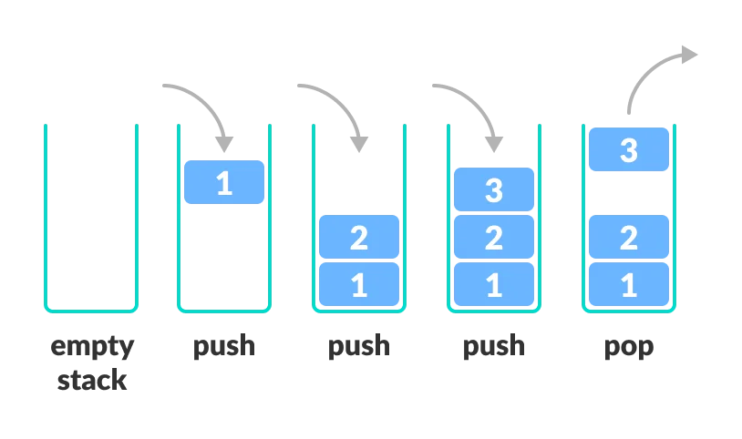
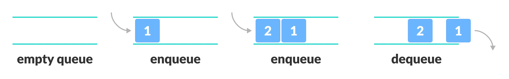
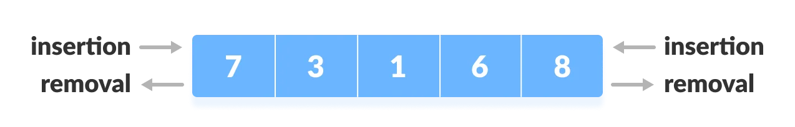

# Capítulo 4 – Pilhas e Filas

As estruturas de dados lineares como **pilhas**, **filas** e **filas duplas (deques)** desempenham um papel crucial na organização e manipulação de dados em diversos contextos computacionais. Elas definem maneiras eficientes de inserir, remover e acessar elementos, sendo amplamente utilizadas em algoritmos, sistemas operacionais, compilação de linguagens de programação, simulações e outros domínios. Cada uma dessas estruturas segue uma lógica própria de acesso e operações, possibilitando diferentes formas de solucionar problemas. Neste capítulo, abordaremos detalhadamente essas três estruturas fundamentais, explorando seu funcionamento, suas operações, eficiência e aplicações.

## Pilha (Stack)

A **pilha (stack)** é uma estrutura de dados linear que opera segundo o princípio **LIFO (Last In, First Out)**, ou seja, o último elemento inserido é o primeiro a ser removido. Essa estrutura pode ser visualizada metaforicamente como uma pilha de pratos: sempre que se coloca um novo prato, ele vai ao topo da pilha; para retirar um prato, também se começa pelo topo.

  

A estrutura de uma pilha é bastante simples: consiste em uma sequência de elementos onde todas as operações ocorrem no topo da pilha. Uma pilha pode ser implementada de diversas formas, sendo as mais comuns:

- **Usando vetores/arrays:** nesse caso, a pilha possui tamanho fixo. Um ponteiro indica o topo da pilha, onde ocorrem as inserções e remoções.
- **Usando listas encadeadas:** nesse modelo, a pilha tem tamanho dinâmico e cada elemento aponta para o próximo. O topo é a cabeça da lista.

As operações básicas de uma pilha são:

- **Push:** Insere um novo elemento no topo da pilha. Em ambas as implementações (vetorial ou encadeada), essa operação é realizada em tempo constante $O(1)$.
- **Pop:** Remove e retorna o elemento do topo da pilha. Também possui custo $O(1)$, pois opera apenas no topo.
- **Peek (ou Top):** Permite acessar o elemento do topo sem removê-lo. O acesso é direto e também ocorre em $O(1)$.
- **isEmpty:** Verifica se a pilha está vazia. Essa verificação é feita em tempo constante, geralmente verificando se o ponteiro para o topo é `null` ou é `-1`.

As operações push, pop, peek e isEmpty em uma pilha possuem todas um custo de $O(1$), ou seja, realizadas em tempo constante. Isso porque cada uma dessas operações envolve apenas a atualização ou acesso de um único elemento.

As pilhas têm aplicações fundamentais em:

- Execução de chamadas recursivas.
- Reversão de palavras, strings ou expressões.
- Avaliação de expressões matemáticas (notâcia polonesa inversa).
- Algoritmos de backtracking (como na resolução de labirintos).
- Desfazer/refazer em editores de texto.

## Fila (Queue)

A **fila (queue)** é uma estrutura de dados linear que segue o princípio **FIFO (First In, First Out)**. Isso significa que os elementos são inseridos em uma extremidade (final da fila) e removidos na outra extremidade (início da fila). A analogia com uma fila de banco é bastante apropriada: o primeiro a chegar é o primeiro a ser atendido.

  

A fila pode ser implementada:

- **Com arrays (vetores):** Nesse caso, é comum usar o conceito de fila circular para evitar desperdício de espaço após as remoções.
- **Com listas encadeadas:** Oferece maior flexibilidade, pois a fila pode crescer dinamicamente.

As operações básicas de uma fila são:

- **Enqueue:** Insere um novo elemento no final da fila. Com ponteiros adequados, essa operação tem custo $O(1)$.
- **Dequeue:** Remove e retorna o elemento do início da fila. Assim como o enqueue, essa operação é de tempo constante $O(1)$.
- **Front (ou Peek):** Retorna o primeiro elemento da fila sem removê-lo. Acesso em tempo constante $O(1)$.
- **isEmpty:** Verifica se a fila está vazia, geralmente comparando os ponteiros de início e fim.

As operações enqueue, dequeue, front e isEmpty em uma fila são todas de tempo constante $O(1)$, dado que não envolvem a movimentação de elementos, apenas a atualização de ponteiros ou índices.

As filas são comuns em:

- Sistemas de gerenciamento de tarefas.
- Algoritmos de busca em largura (BFS).
- Sistemas de atendimento (como filas de impressão).
- Simulações baseadas em eventos.
- Controle de processos em sistemas operacionais.

## Fila Dupla (Deque)

O **deque (Double-Ended Queue)** é uma estrutura de dados que permite inserções e remoções em ambas as extremidades. Essa flexibilidade torna o deque mais geral do que pilhas ou filas tradicionais.

  

Um deque pode ser implementado:

- **Com arrays:** Requer atenção na manipulação dos índices para suportar ambas as extremidades.
- **Com listas duplamente encadeadas:** Cada elemento possui ponteiros para o próximo e para o anterior, facilitando as operações nas duas pontas.

As operações básicas de um deque são:

- **AddFront (ou PushFront)**: Adiciona um elemento no início do deque.
- **AddRear (ou PushBack)**: Adiciona um elemento no final do deque.
- **RemoveFront (ou PopFront)**: Remove e retorna o elemento do início do deque.
- **RemoveRear (ou PopBack)**: Remove e retorna o elemento do final do deque.
- **Front (ou PeekFront)**: Retorna o elemento do início sem removê-lo.
- **Rear (ou PeekBack)**: Retorna o elemento do final sem removê-lo.
- **isEmpty (ou Empty)**: Verifica se o deque está vazio.

Todas as operações em um deque tem custo de $O(1)$, independentemente de ser no início ou no final. Isso porque cada operação envolve apenas a atualização de ponteiros ou índices, sem a necessidade de deslocar elementos.

Deques são usados em:

- Algoritmos de cache (como o LRU - Least Recently Used).
- Algoritmos de janela deslizante.
- Simulações que necessitam de inserção e remoção nas duas pontas.
- Implementação de pilhas e filas com comportamento flexível.

## Vetor/Matriz vs. Lista vs. Pilha vs. Fila

Em resumo, as estruturas lineares tem algumas pequenas diferenças:

- Vetores e matrizes são estáticos, ou seja, têm seu tamanho definido em sua criação, e ele não muda. Possuem acesso posicional e são alocados contiguamente na memória.
- Pilhas, Filas e Listas são dinâmicas, ou seja, têm seu tamanho variável. São alocadas espaçadamente em endereços de memória livres, já que podem usar ponteiros. Elas também podem ter implementações com vetores, mas há uma perda com essa abordagem, devido à falta de dinamismo de que geralmente essas estruturas necessitam.

Embora possuam essas diferenças, uma coisa é comum a todas essas estruturas: a linearidade. Os elementos sempre estão ligados de forma sequencial e, no caso de matrizes, podem ter mais de uma dimensão. A única relação que existe entre os elementos dessas estruturas é que eles são conectados em um sentido: início → fim (esquerda/direita), fim → início (direita/esquerda), cima → baixo ou baixo → cima.

Com isso, pode-se ter dúvidas sobre qual delas utilizar, para isso deve-se pensar primeiro: Qual problema precisamos resolver? A partir disso é que podemos escolher a estrutura de dados linear que se adeque ao problema que se deseja solucionar. Não existe uma melhor que outra. Cada uma tem um porquê de sua existência e um nicho de problemas no qual se encaixa melhor para ajudar a resolvê-los. 

Entender de forma clara o comportamento de cada uma ajuda a escolher a que mais se adequa ao problema a ser resolvido. Algumas dicas ajudam nessa escolha:

- Se tem a certeza de que a quantidade de elementos é fixa, use um vetor. Assim, o acesso será mais rápido e se consumirá menos memória, pois não precisará de ponteiros. Se precisar de mais de uma dimensão, use uma matriz.
- Se é necessário manter uma sequência dos elementos em que os últimos elementos devem ser acessados primeiro, use uma pilha.
- Precisa criar prioridades entre os elementos? Use uma fila.
- Se é necessário inserir e remover elementos em ambas as extremidades, um deque oferece a flexibilidade necessária.
- Apenas quer ter uma disposição linear dos elementos e precisa de acesso aleatório a eles? Use a lista.

Podemos ver que cada uma dessas estruturas de dados tem uma regra para seu uso muito bem definida. Compreender o comportamento e as características de cada estrutura é essencial para selecionar a mais adequada para cada situação.

## Considerações Finais

Este capítulo forneceu uma visão detalhada das estruturas de dados lineares, destacando suas características, operações e aplicações práticas. No próximo capítulo, exploraremos estruturas de dados não lineares, como árvores e grafos, que permitem representações mais complexas e são fundamentais em diversas áreas da computação.