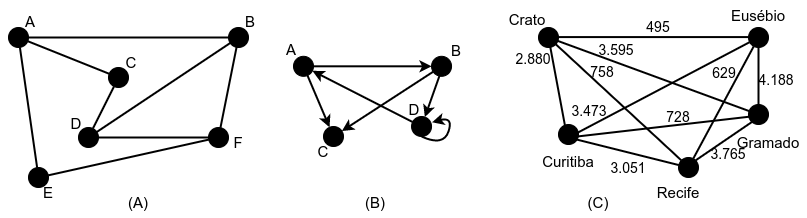
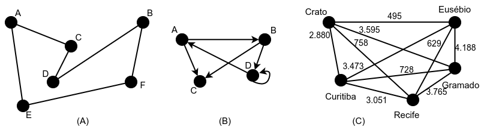
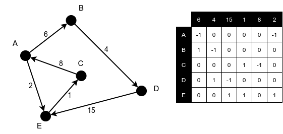
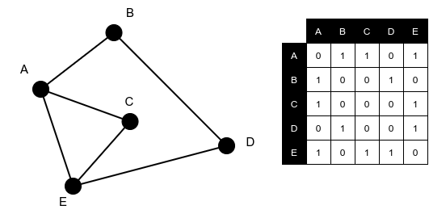
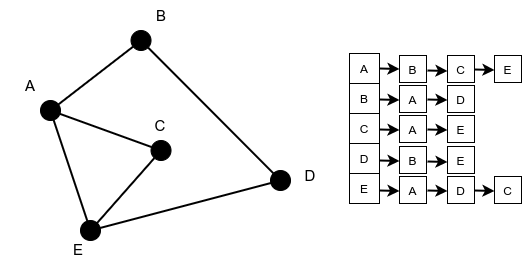
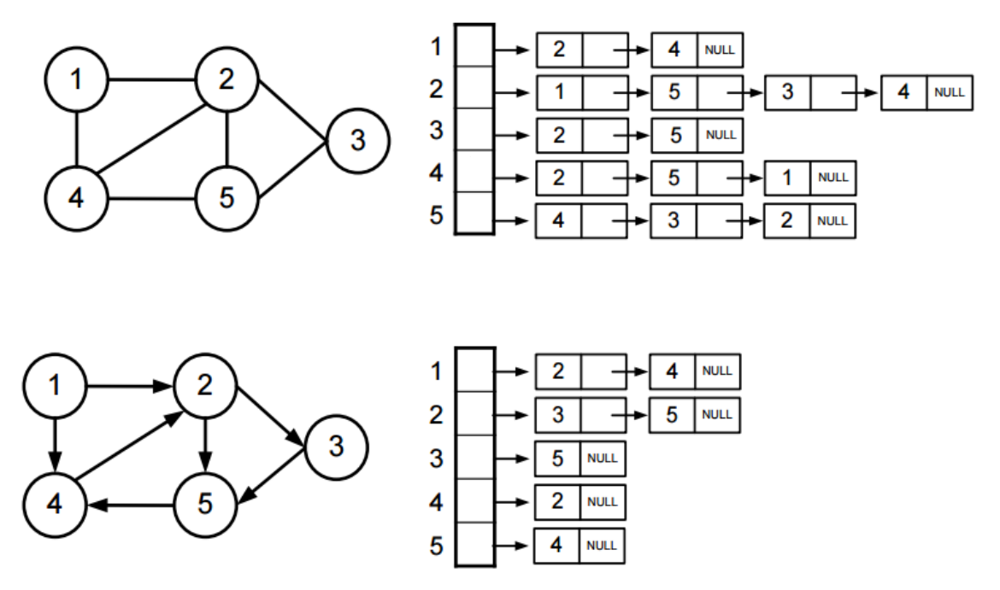
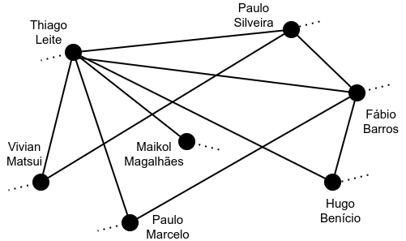
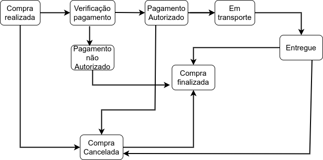

  

 

# Estruturas Não-Lineares - Parte 2: Grafos

- [Introdução](#introdução)
- [Representação e Terminologias](#representação-e-terminologias)
- [Operações Básicas](#operações-básicas)
  - [Busca em Profundidade](#busca-em-profundidade)
  - [Busca em Extensão ou Largura](#busca-em-extensão-ou-largura)
- [Tipos de Grafos](#tipos-de-grafos)
- [Representações de um Grafo](#representações-de-um-grafo)
  - [Matriz de Incidência](#matriz-de-incidência)
  - [Matriz de Adjacência](#matriz-de-adjacência)
  - [Lista de Adjacência](#lista-de-adjacência)
  - [Comparação entre as Diferentes Representações](#comparação-entre-as-diferentes-representações)
- [Problemas Clássicos Envolvendo Grafos](#problemas-clássicos-envolvendo-grafos)
- [Algoritmos Importantes](#algoritmos-importantes)
- [Exemplos de Uso](#exemplos-de-uso)

## Introdução

Grafos são estruturas de dados que representam relações ou conexões entre objetos. Utilizados em uma vasta gama de aplicações, desde redes de computadores até redes sociais, mapas e otimização de rotas, os grafos são uma ferramenta poderosa e versátil na computação. Compostos por um conjunto de vértices (ou nós) e arestas (ou linhas) que conectam pares de vértices, os grafos podem modelar sistemas complexos e permitir a análise e a resolução de problemas que envolvem conexões entre objetos.

Os grafos são representados por um par `G = (V, E)`, onde `V` é um conjunto de vértices e `E` é um conjunto de arestas. As arestas podem ser direcionadas (digrafos) ou não direcionadas. Em um grafo não direcionado, uma aresta entre dois vértices não possui uma direção específica, enquanto em um grafo direcionado, a aresta possui uma direção, indo de um vértice a outro.

Além disso, grafos podem ser ponderados ou não ponderados. Em grafos ponderados, cada aresta possui um peso ou custo associado, o que é útil em problemas que envolvem otimização, como encontrar a rota mais curta em um mapa.

## Representação e Terminologias

Para facilitar as explicações, levemos em consideração a imagem a seguir, que possui três grafos em sua forma mais comum de representação gráfica.

  

- **Vértice (nó)**: assim como as árvores, os grafos também possuem seu elemento base, os quais são chamados de vértices. Assim como os nós das árvores, eles podem armazenar dados e servem para montar a estrutura do grafo. Na figura anterior, as letras em maiúsculo (grafos **(A)** e **(B)**) e os nomes das cidades (grafo **(C)**) são vértices.
- **Aresta**: são as conexões entre os vértices. Essas conexões também estão presentes nas árvores, mas nelas são meras coadjuvantes; já nos grafos, podem ter valores e direções. Na figura anterior, as arestas conectam os vértices, que são os pontos de referências dos grafos. Elas podem ter algumas características a mais:
  - **Peso**: são os valores que as arestas podem possuir. A presença ou ausência de pesos influencia no tipo do grafo. No grafo **(C)** da figura anterior, os pesos são as distâncias entre as cidades.
  - **Laço (loop)**: é quando o vértice de um grafo possui uma aresta que leva a ele mesmo. Isso ocorre no grafo **(B)** com o vértice `D`. É válido dizer que esse tipo de aresta só faz sentido existir em grafos direcionados.
- **Vértice adjacente (vizinho)**: é o vértice ou vértices alcançáveis a partir de um determinado vértice. No grafo **(B)**, o vértice `A` tem como adjacentes os vértices `B` e `C`. Já nos grafos **(A)** e **(C)**, são todos vértices alcançáveis a partir de um determinado vértice.
- **Grau (valência) de um vértice**: é a quantidade de arestas que um vértice possui. Esse grau pode ser de de fora ou de dentro. No primeiro, são as arestas que saem do vértice e no segundo, as arestas que chegam ao vértice. Esse tipo de diferenciação é válido para grafos direcionados. Para grafos não direcionados, resume-se às arestas conectadas ao vértice.
- **Caminho (trajeto)**: são as arestas percorridas para chegar de um determinado vértice a outro. É nesse(s) caminho(s) que a Teoria dos Grafos foca, pois é aí onde estão seus  maiores desafios.

## Operações Básicas

Assim como as árvores, os grafos também possuem operações e formas de navegação. Estas são um pouco diferentes em relação às das árvores, mas têm a mesma finalidade: modificar e navegar pela estrutura. São quatro operações e duas formas de navegação. A lista a seguir explica as operações:

- `ADD`: adiciona um novo vértice ao grafo.
- `JOIN`: após o vértice ser adicionado, é necessário conectá-lo a outro vértice, criando uma aresta. Essa é a finalidade dessa operação.
- `REMOVE`: exclui um vértice do grafo, acompanhado de suas arestas.
- `ADJACENT`: identifica os vértices que possuem arestas com um determinado vértice.

A depender do tipo de grafo, direcionado ou não e com pesos ou não, as operações podem sofrer modificações, mas sem perderem a sua essência.

### Busca em Profundidade

Para essa forma de navegação, inicialmente escolhe-se um vértice de forma aleatória. Após isso, inicia-se o processo de navegação passando por todos os vértices do grafo — por isso o  nome profundidade, pois esse processo vai até o vértice "mais profundo" do grafo. Cada vértice visitado é marcado como processado, para evitar repetições e para que a busca não entre em loop.

Essa navegação é mais simples de implementar, porém menos eficiente, já que essa busca ao vértice mais profundo descarta muitos outros vértices pelo caminho. Quando se chega a esse vértice mais profundo, retorna-se ao ponto de partida para processar os anteriormente descartados. O custo de execução desse tipo de busca é `O(n + m)`, onde `n` é o número de vértices e `m` é o número de arestas.

### Busca em Extensão ou Largura

Para essa outra forma de navegação, também escolhe-se aleatoriamente um vértice de partida. Entretanto, ele não vai passando de forma aleatória por todos os demais vértices após isso. Ela sempre passa primeiro por todos os vértices adjacentes ao vértice corrente. Depois, movimenta-se para os adjacentes dos adjacentes, e assim por diante. Por isso o nome "em largura", pois essa busca vai expandido a cada vértice visitado. Assim como a navegação em profundidade, vértices visitados são marcados como processados para evitar loops. Essa navegação é mais difícil de implementar, mas tem uma performance um pouco melhor que a busca em profundidade, devido ao fato de evitar retrocessos.

Ambas as navegações são consideradas de "força bruta", por navegarem de forma aleatória pelos vértices. Todavia, a busca em largura é ligeiramente melhor quando se tem conhecimento prévio de que os vértices a serem encontrados estão relativamente próximos ao vértice de partida. Ainda, o custo de execução de ambas a estruturas é basicamente o mesmo: `O(n + m)`, onde `n` é o número de vértices e `m` é o número de arestas.

## Tipos de Grafos

Os diferentes tipos de grafos podem ser classificados de diversas formas. Aqui iremos explorar os tipos mais relevantes, que são essenciais para o entendimento dessa estrutura de dados.

  

- **Simples**: é um grafo não direcionado, que não possui laços e que possui somente uma aresta entre quaisquer dois vértices, ou seja, não tem arestas paralelas. Em exceção ao grafo **(B)**, todos os demais são exemplos desse tipo.
- **Completo**: é um grafo em que cada vértice está conectado a todos os demais vértices. Vemos este no grafo **(C)**.
- **Regular**: é um grafo no qual todos os vértices têm o mesmo grau. Vemos este nos grafos **(A)** e **(C)**. Assim, note que todo grafo completo é, também, um grafo regular.
- **Não direcionado**: é um grafo no qual as arestas não possuem um sentido. Em exceção do grafo **(B)**, todos os demais são desse tipo. Neste caso, é indiferente avaliar se o sentido é `(A,B)` ou `(B,A)`, por exemplo.
- **Direcionado (dígrafo)**: é um grafo em que as arestas possuem um sentido que influencia nos trajetos que podem ser realizados. Isso ocorre no grafo **(B)**. Neste caso, é diferente avaliar `(A,B)` ou `(B,A)`: `(B,A)` não é um trajeto permitido pelo grafo **(B)**, ao contrário de `(A,B)`.
- **Grafo misto**: é um grafo no qual suas arestas podem ter um sentido ou não. No caso, é uma mistura do grafo **(A)** e do grafo **(B)**.
- **Conexo**: é um grafo que possibilita um caminho de qualquer um de seus vértices para qualquer outro vértice do grafo. Assim, somente o grafo **(B)** não o é, pois do vértice `C` não conseguimos ir para nenhum outro vértice. Neste caso, **(B)** é um grafo **desconexo**.
- **Ponderado**: é um grafo no qual as arestas possuem pesos. Vemos isso no grafo **(C)**.
- **Cíclico**: é um grafo no qual, a partir de qualquer vértice de partida, consegue-se passar por todos os demais, sem repeti-los, e atingir o vértice de partida. Vemos esse tipo no grafo **(A)** e **(C)**.
- **Acíclico**: é um grafo no qual não se é possível ter um ciclo. Vemos esse no grafo **(B)**.
- **Árvore**: uma árvore é um tipo de grafo. Porém, é um grafo simples, acíclico e conexo.

## Representações de um Grafo

As imagens que vimos até agora são as representações visuais de grafos, mas quando vamos codificar um grafo em alguma linguagem de programação, temos três opções de representá-lo:

- Matriz de incidência.
- Matriz de adjacência.
- Listas de adjacência.

### Matriz de Incidência

Essa representação é mais alinhada com **grafos orientados ponderados**, mas isso não significa que não possa ser usada com grafos não orientados e não ponderados. Nessa matriz, as colunas são as arestas do grafo, mais especificamente seus pesos, e as linhas são seus vértices. Por fim, também devemos definir como representar a incidência das arestas aos vértices, que geralmente usa o seguinte padrão:

- `-1` para representar uma origem de aresta ou um laço.
- `0` para representar vértices que não possuem uma aresta de origem ou destino.
- `1` para representar um destino de aresta.

A imagem a seguir demonstra essa representação.

  

### Matriz de adjacência

Um grafo representado por essa abordagem utiliza uma matriz onde os vértices são dispostos em linhas e colunas. Então, nas relações em que existir uma aresta (ou seja, vértices adjacentes), é feita uma marcação, geralmente com o número `1`; onde não existir, marca-se com o número `0`. Assim, quando vemos `M[A,B]`, significa que existe uma aresta ligando os vértices `A` e `B`. A imagem a seguir demonstra essa representação.

  

### Lista de Adjacência

Essa representação pode utilizar as estruturas de dados vetor e lista, a depender de uma maior necessidade de inclusão de vértices no grafo. Essas estruturas podem ser ligadas entre si da seguinte forma: cada vértice do grafo é armazenado em um vetor. Assim, cada posição desse vetor aponta para uma lista que contém os vértices adjacentes ao vértice armazenado. A imagem a seguir expõe essa representação.

  

Vale ressaltar que a lista de adjacência pode representar tanto grafos direcionados quanto não direcionados. A diferença será no tamanho das listas que representam cada um dos vértices, uma vez que estas irão considerar somente os caminhos possíveis.

  

### Comparação entre as Diferentes Representações

Os grafos podem ser representados de várias maneiras, cada uma com suas próprias vantagens e desvantagens em termos de desempenho e custo de execução das operações básicas.

Uma **matriz de incidência** com tamanho `n x m`, onde `n` é o número de vértices e `m` é o número de arestas, o desempenho e custo de execução para as operações básicas são:

- **Espaço**: `O(n x m)`. Esta representação pode ser bastante ineficiente para grafos esparsos, onde o número de arestas é muito menor que o número de vértices.
- **Inserção e Remoção de Vértice**: `O(m)`. É necessário adicionar ou remover uma linha.
- **Inserção e Remoção de Aresta**: `O(n)`. É necessário adicionar ou remover uma nova coluna.
- **Busca de Aresta**: `O(m)` para encontrar todas as arestas incidentes a um vértice específico.

A **matriz de incidência** é útil para grafos onde é importante saber rapidamente quais arestas estão incidentes a um determinado vértice. No entanto, devido ao seu custo espacial elevado, não é geralmente a melhor escolha para grafos muito grandes ou esparsos.

Uma **matriz de adjacência** é uma matriz quadrada `n x n`, onde `n` é o número de vértices, o desempenho e custo de execução para as operações básicas são:

- **Espaço**: `O(n²)`. Este custo pode ser proibitivo para grafos muito grandes, especialmente se forem esparsos.
- **Inserção e Remoção de Vértice**: `O(n²)` em casos onde é necessário redimensionar a matriz.
- **Inserção e Remoção de Aresta**: `O(1)`. A inserção e moção de arestas é direta e rápida.
- **Busca de Aresta**: `O(1)`. Verificar a presença de uma aresta é imediato.

A **matriz de adjacência** é eficiente para grafos densos, onde o número de arestas é próximo ao número máximo possível de arestas (`n(n−1)/2` para grafos não direcionados). Também é útil quando operações de verificação de existência de arestas precisam ser rápidas e frequentes.

Uma **lista de adjacência** consiste na maioria dos casos em um array de listas, onde cada entrada no array corresponde a um vértice e a lista associada contém todos os vértices adjacentes. Em grafos ponderados, cada entrada na lista pode também armazenar o peso da aresta. O desempenho e custo de execução para as operações básicas são:

- **Espaço**: `O(n + m)`. Muito eficiente para grafos esparsos, pois o espaço é proporcional ao número de vértices e arestas.
- **Inserção de Vértice**: `O(1)`. Adicionar um novo vértice é simples e rápido.
- **Inserção de Aresta**: `O(1)` para adicionar a aresta à lista de adjacência.
- **Remoção de Vértice**: `O(d)`, onde `d` é o grau do vértice a ser removido, mais o tempo necessário para atualizar as listas dos vértices adjacentes.
- **Remoção de Aresta**: `O(d)`, onde `d` é o grau do vértice inicial da aresta.
- **Busca de Aresta**: `O(d)`, onde `d` é o grau do vértice inicial.

As **listas de adjacência** são ideais para grafos esparsos, onde o número de arestas é muito menor do que o quadrado do número de vértices. Elas também são eficientes em termos de espaço e são adequadas para algoritmos que precisam iterar sobre todos os vizinhos de um vértice.

Em resumo, cada representação de grafo tem suas próprias vantagens e desvantagens. As **matrizes de incidência** oferecem uma maneira eficiente de identificar arestas incidentes, mas podem ser espaciais e computacionalmente caras. As **matrizes de adjacência** são rápidas para verificar a existência de arestas e são mais adequadas para grafos densos, mas também têm um alto custo espacial. As **listas de adjacência** são as mais eficientes em termos de espaço para grafos esparsos e são flexíveis para muitas operações, tornando-as uma escolha comum para muitos algoritmos de grafos. A escolha da representação depende das necessidades específicas do problema e da densidade do grafo em questão.

## Problemas Clássicos Envolvendo Grafos

Por ser um assunto de grande relevância e aplicação a várias áreas, existem alguns problemas clássicos sobre grafos que auxiliam a entendê-los e difundi-los. A seguir, apresentaremos outros três famosos problemas.

### Problema do Caminho Mínimo

Esse problema tem por finalidade minimizar o custo de travessia de um grafo entre dois vértices: a origem e o destino. Para isso, o cálculo desse custo leva em consideração a soma dos pesos de cada aresta (e consequentemente vértices) a ser percorrida entre o vértice de origem e o de destino. O Google Maps utiliza a solução desse problema para fornecer sempre a menor rota.

### Caixeiro Viajante

Esse problema tem por finalidade determinar qual a menor rota a ser percorrida através de um determinado conjunto de cidades, sendo que se deve visitar cada cidade apenas uma vez e depois retornar à cidade de origem. Uma aplicabilidade da solução para esse desafio é na área de logística, para otimizar rotas de entregas de produtos ao percorrer o menor caminho possível, com redução do tempo necessário para transporte e de possíveis custos de combustível.

### Teorema das Quatro Cores

Esse problema desafia quem deseja solucioná-lo a somente usar quatro cores para colorir as regiões ou estados de qualquer mapa de um país, de modo que duas regiões ou estados adjacentes (vizinhos) não tenham a mesma cor.

## Algoritmos Importantes

Muitos são os algoritmos que existem para solucionar os problemas citados na seção anterior ou mesmo outros problemas. A seguir, vejamos os dois mais famosos.

### Dijkstra

Edsger Dijkstra é um cientista da computação holandês que entre 1956 e 1959 criou o algoritmo que soluciona o problema do caminho mais curto em um grafo orientado ou não orientado, estes sendo ponderados e com pesos não negativos. Esse algoritmo inicia o processo em um vértice inicial e, a partir deste, navega pelas arestas de menor peso para os vértices adjacentes. Esse processo se repete para os adjacentes dos adjacentes até se chegar ao destino. Arestas que foram avaliadas em processamentos anteriores são descartadas durante o processo de verificação.

### Vizinho mais Próximo

Esse algoritmo é um dos passos para se resolver o problema do caixeiro viajante. Ele começa o processo a partir de um vértice inicial, escolhido aleatoriamente. Após isso, identifica-se a aresta de saída de menor peso do vértice atual que leve a um vértice não visitado. Assim, marca-se o vértice atual como "visitado" e torna o vértice de destino o atual. Se todos os vértices do grafo tiverem sido visitados, encerra-se o processo; se não, devemos novamente identificar a aresta de saída de menor peso do vértice atual e, assim, repetir o processo até visitarmos todos os vértices.

A sequência dos vértices marcados como "visitados" é o resultado do algoritmo. Esse algoritmo é simples de implementar, mas não é 100% eficiente por algumas vezes não obter o melhor caminho (o menor) como resultado. Isso vem do fato de ser considerado um "processamento guloso", ou seja, às vezes já considera um resultado como bom (menor peso), sem ter verificado todas as outras possibilidades.

## Exemplos de Uso

Não diferente das estruturas de dados vistas anteriormente, o grafo possui uma grande quantidade de aplicabilidades. Vejamos algumas.

### Redes Sociais

Algo extremamente comum atualmente são as redes sociais. Lá, temos nossas conexões, que são amigos, conhecidos, influencers, entre outros. Estas conexões também possuem suas próprias conexões, que podem ter algumas conexões em comum entre si e também conosco. Para ilustrar isso, vejamos a imagem a seguir, que é uma visão parcial de conexões entre pessoas em uma rede social.

  

Com essa imagem, vemos claramente que as redes sociais são uma aplicação de grafos. Nesta, cada pessoa será um vértice do grafo e as conexões entre as pessoas são as arestas.

### Máquina de Estados

Máquina de estados é um conceito ligado à matemática que tem como finalidade representar a mudança de estados de entidades quando elas sofrem um estímulo. Várias são suas aplicabilidades:

- Circuitos lógicos de computadores.
- Circuitos elétricos da física.
- Diagramas/Fluxos.
- Autômatos finitos.

Para deixar mais claro, vejamos o seguinte fluxo da realização de uma compra:

  

Nesse fluxo, vemos que temos operações (vértices) que são conectadas por setas (arestas) para outras operações. Essas operações têm uma sequência predefinida de execução. Podemos notar que esse fluxo é um grafo direcionado, onde temos um vértice de início fixo (Compra realizada) e um vértice de destino fixo (Compra finalizada). 
Geralmente, máquinas de estados são grafos simples, pois, além de serem direcionados, possuem poucos caminhos possíveis a serem percorridos.

### Google Maps

O Google Maps é um ótimo exemplo do uso de grafos. Toda vez que traçamos uma rota, ele cria um ou mais caminhos entre a origem e o destino (os quais são dois vértices). Entre eles, temos várias esquinas, que serão vértices intermediários. Temos também ruas que ligam essas esquinas, que seriam as arestas. Ou seja, um grande grafo.

O Maps é um exemplo tão bom que temos ainda a seguinte situação: se escolhermos uma rota a pé, veremos que o Maps vai sugerir só uma opção, que será a menor (melhor caminho). Entretanto, se colocarmos a rota de carro, veremos que teremos mais de uma opção, com distâncias diferentes. Isso ocorre porque, de carro, teremos que seguir os sentidos das ruas, ou seja, teremos um grafo direcionado. No caso da opção a pé, temos um grafo não direcionado, pois podemos ir da forma que quisermos, sem nos preocupar com mão ou contramão.
