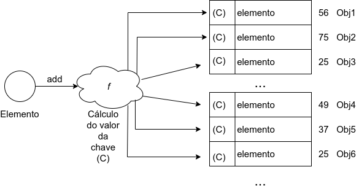
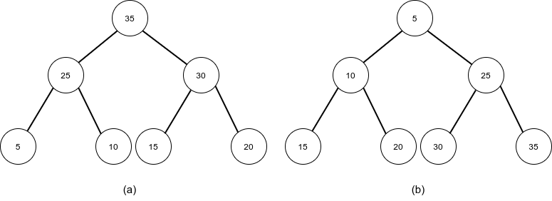

  

 

# Estruturas Não-Lineares - Parte 3: Set, Tabela Hash e Heap

- [Introdução](#introdução)
- [Sets (Conjuntos)](#sets-conjuntos)
- [Tabela de Dispersão (Hashtable)](#tabela-de-dispersão-hashtable)
- [Heap](#heap)

## Introdução

Existem outras estruturas que não fazem parte da Teoria das Estruturas de Dados, mas que também são bem conhecidas e amplamente utilizadas em diversos softwares. São elas o set (sonjunto), a tabela de dispersão (hashtable) e o heap.

## Sets (Conjuntos)

O **Set** é uma estrutura de dados tem como principal característica não permitir a repetição de elementos. A partir disso, podemos ver que ela é "materialização" do conceito matemático de conjuntos. Devido a isso, a estrutura set também tem um importante comportamento dos conjuntos: seus elementos não possuem uma ordem, ou seja, são armazenados de forma aleatória. Essas são as suas características mais relevantes, e isso termina por disponibilizar uma estrutura de simples entendimento e de uso intuitivo.

## Tabela de Dispersão (Hashtable)

Muitas vezes precisamos ter acesso a elementos em uma estrutura de dados de forma rápida. Sabemos que, ao usar vetores, conseguimos esse acesso rápido, mas teremos a desvantagem de ter o tamanho fixo da estrutura. Então podemos pensar em usar uma lista, que tem tamanho variável. Todavia, teremos um processo lento de leitura, pois teremos que navegar por ela — de elemento em elemento — para encontrar o elemento desejado. Baseado nessas informações, talvez se cogite usar uma árvore, que tem o dinamismo desejado e o acesso rápido, caso se use uma árvore binária ordenada, por exemplo. Mas ela pode se tornar lenta, caso sua profundidade seja muito grande, além de consumir mais memória para percorrê-la, devido à recursividade.

Ou seja, existem casos em que o acesso rápido é primordial e as estruturas clássicas que conhecemos talvez não sejam a melhor opção, devido ao tempo de pesquisa ou à memória consumida. Nesses casos, podemos usar a **Tabela de dispersão (Hashtable)**. Ela é uma estrutura de dados auxiliar que possui um acesso posicional muito rápido e ainda com a vantagem de ter tamanho dinâmico. Para isso, ela calcula o endereço (chave) de onde o elemento será armazenado a partir de uma função hash, que pode usar os dados do próprio elemento ou ser fornecida de forma livre. Dessa forma, sabe-se exatamente onde o elemento se encontra, o que permite um acesso mais rápido. Para ilustrar isso, levemos em consideração a imagem a seguir:

  

Na imagem anterior, vemos que, no momento em que cada elemento foi adicionado na tabela, seu hash foi calculado e armazenado junto a ele. Assim, quando se desejar acessar um desses elementos, usa-se sua chave, que lhe levará exatamente ao endereço específico, evitando passar por todos os outros elementos da tabela. 

Uma observação relevante sobre a Tabela de dispersão é que nada impede de os valores hash coincidirem (no caso, os hashs 25 em nossa imagem). Isso é um problema, pois poderíamos ter dois elementos com a mesma chave. Mas existem algoritmos que auxiliam na geração de chaves únicas ou no tratamento de chaves repetidas, o que possibilita o uso dessa estrutura de forma ampla. Muitas linguagens usam as tabelas de dispersão sob o nome de mapas ou dicionários.

## Heap

Também chamada de **Binary Heap**, essa estrutura de dados é uma variação de uso de árvores binárias. Para uma árvore binária poder ser considerada um heap, uma regra deve ser atendida: valores em nós pais devem ser sempre maiores ou iguais aos nós filhos (**max-heap**) ou sempre menores ou iguais aos nós filhos (**min-heap**). Essa é a chamada propriedade heap.

Devido a essa característica, essa estrutura é muito utilizada como uma implementação de filas de prioridade. Ou seja, elementos de maior ou menor prioridade vão sendo removidos sempre a partir da raiz da árvore. Após essas remoções, é necessário reorganizar a árvore, realizando rotações, para manter a propriedade heap válida. Para exemplificar isso, vejamos as duas árvores a seguir:

  

Na imagem acima, em **(a)** temos uma max-heap, pois podemos notar que os nós pais (no caso, `35`, `25` e `30`) são sempre maiores que seus nós filhos. Já em **(b)**, temos uma min-heap, pois `5`, `10` e `25` são sempre menores que seus nós filhos.
