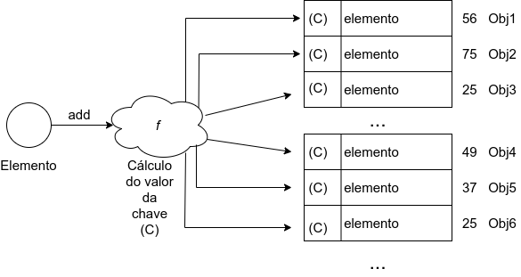

# Capítulo 7 – Outras Estruturas

Nem todas as estruturas de dados amplamente utilizadas na prática pertencem ao conjunto canônico de estruturas estudadas na teoria clássica de estruturas de dados, como listas, pilhas, filas e árvores. Ainda assim, há estruturas igualmente essenciais, principalmente no desenvolvimento de aplicações modernas e no tratamento de grandes volumes de dados. Neste capítulo, exploraremos três dessas estruturas: **Set (Conjunto)**, **Tabela de Dispersão (Hashtable)**, **Heap (ou Binary Heap)**, **Bitmaps** e **Estrutura de Arquivos**.

Essas estruturas destacam-se por oferecerem soluções elegantes e eficientes para problemas específicos, como verificação de unicidade, busca extremamente rápida e gerenciamento de prioridades. Vamos analisá-las em detalhes, explorando suas características, comportamentos, aplicações práticas e peculiaridades de implementação.

## Sets (Conjuntos)

A estrutura conhecida como **Set** (ou conjunto) é uma implementação direta do conceito matemático de conjuntos. Sua principal característica é a **não repetição de elementos**, ou seja, cada elemento é único dentro da estrutura. Outro ponto fundamental é que os elementos armazenados **não possuem ordem definida**, sendo dispostos de maneira aparentemente aleatória na memória.

Essa ausência de duplicidade é extremamente útil em diversas situações do cotidiano da programação. Por exemplo, ao desejar saber quantos valores únicos existem em uma lista de entradas, ou ao realizar operações como interseção e união de conjuntos.

Considere o seguinte exemplo implementado em Python, imagine que desejamos armazenar os nomes de alunos que participaram de um evento, evitando repetições:

```python
participantes = set()
participantes.add("Alice")
participantes.add("Bruno")
participantes.add("Alice")  # Tentativa de adicionar duplicado
print(participantes)`
# Saída esperada: {'Alice', 'Bruno'}
```

Como podemos observar, a tentativa de inserir "Alice" pela segunda vez é ignorada automaticamente pela estrutura `set`. Isso evidencia sua natureza de armazenamento não duplicado. Além disso, a saída não necessariamente segue a ordem de inserção, pois o set não garante ordenação.

Além da unicidade e da ausência de ordem, a estrutura de conjuntos oferece eficiência em operações de pertencimento — por exemplo, verificar se um elemento está no conjunto (`x in set`) é feito de forma extremamente rápida, geralmente com complexidade $O(1)$ graças ao uso interno de **tabelas de dispersão** para indexação.

## Tabela de Dispersão (Hashtable)

Uma necessidade recorrente em algoritmos e aplicações reais é o **acesso rápido a informações**, especialmente quando há um grande volume de dados. As tabelas de dispersão — conhecidas também como **hashtables**, **tabelas hash**, ou ainda **dicionários** em muitas linguagens de programação — surgem como uma das mais eficientes soluções para esse problema.

Uma **tabela de dispersão** combina o desempenho de acesso direto (como vetores) com a flexibilidade de estruturas dinâmicas. Para alcançar isso, ela utiliza uma **função hash**, que transforma uma chave (por exemplo, uma string) em um índice numérico. Esse índice é então usado para localizar diretamente a posição do dado na tabela, sem necessidade de percorrer a estrutura inteira.

Antes de nos aprofundarmos, é útil entender por que estruturas como listas, vetores ou árvores binárias não são ideais para determinadas situações:

- **Vetores**: possuem acesso rápido por índice ($O(1)$), mas são limitados em tamanho fixo e exigem gerenciamento manual de posições.
- **Listas**: oferecem flexibilidade de tamanho, mas o acesso sequencial implica em complexidade $O(n)$.
- **Árvores binárias ordenadas**: permitem busca rápida em média ($O(\log n)$), mas podem se tornar desbalanceadas, degradando o desempenho para $O(n)$.

A **tabela hash**, por outro lado, oferece acesso em **tempo constante médio (O(1))**, mesmo com tamanhos dinâmicos.

O princípio básico da hashtable é o seguinte:

1. Uma **chave** é fornecida para identificar um valor.
2. A chave é processada por uma **função hash**, que gera um número (hash code).
3. Esse número determina o **índice** onde o valor será armazenado.

Considere a imagem abaixo:

<div align="center">
  
</div>

Na figura, podemos observar que para cada elemento adicionado, um valor de hash foi calculado e usado para determinar sua posição. Quando se deseja acessar um elemento, a chave fornecida gera novamente o mesmo hash, que aponta diretamente para sua localização — sem a necessidade de percorrer outros elementos.

Entretanto, é possível que dois elementos diferentes gerem o mesmo hash — esse fenômeno é chamado de **colisão**. No exemplo da imagem, o hash `25` aparece duas vezes, representando duas chaves diferentes que foram mapeadas para o mesmo índice. Existem diversas estratégias para lidar com colisões, entre elas:

- **Encadeamento (chaining)**: cada posição da tabela armazena uma lista de elementos que compartilham o mesmo hash.
- **Sondagem linear (linear probing)**: em caso de colisão, procura-se a próxima posição livre.
- **Funções hash mais elaboradas**: que reduzem a probabilidade de colisões.

Muitas linguagens modernas fornecem implementações prontas de tabelas hash, com nomes como `Map`, `Dictionary`, `Object` (em JavaScript) ou simplesmente `dict` (em Python). Essas implementações já tratam automaticamente a maioria das colisões.

## Heap (Heap Binário)

O **heap**, mais especificamente o **heap binário**, é uma estrutura de dados baseada em árvore binária e voltada para o gerenciamento de prioridades. Essa estrutura é amplamente utilizada na construção de **filas de prioridade**, nas quais o elemento com maior (ou menor) prioridade é sempre acessado primeiro.

Para que uma árvore binária seja considerada um heap, ela deve obedecer a uma das duas formas da **propriedade heap**:

- **Max-Heap**: cada nó pai possui valor maior ou igual ao de seus filhos.
- **Min-Heap**: cada nó pai possui valor menor ou igual ao de seus filhos.

Essas propriedades garantem que o elemento de maior ou menor valor (dependendo do tipo de heap) esteja sempre na **raiz** da árvore, permitindo acesso rápido à prioridade extrema.

A imagem a seguir ilustra os dois tipos de heap:

<div align="center">
  
</div>

Na imagem acima, em **(a)** temos uma max-heap, pois podemos notar que os nós pais (no caso, `35`, `25` e `30`) são sempre maiores que seus nós filhos. Já em **(b)**, temos uma min-heap, pois `5`, `10` e `25` são sempre menores que seus nós filhos.

O heap possui duas operações principais:

- **Inserção (inserir)**: o novo elemento é adicionado no final da árvore (última posição disponível) e, em seguida, “subido” por meio de comparações com seus ancestrais até que a propriedade heap seja restabelecida.
- **Remoção (remover da raiz)**: remove-se o elemento da raiz (de maior ou menor prioridade), substituindo-o pelo último elemento da árvore. Após isso, a estrutura é reorganizada para manter a propriedade heap, geralmente por meio da operação chamada **heapify**.

Como exemplo prático de uso suponha que você deseje criar uma fila de impressão, onde os documentos mais urgentes devem ser impressos primeiro. A estrutura heap permite implementar isso com eficiência:

```python
import heapq

fila_prioridade = []
heapq.heappush(fila_prioridade, (1, "Documento Urgente"))
heapq.heappush(fila_prioridade, (3, "Documento Normal"))
heapq.heappush(fila_prioridade, (2, "Documento Importante"))

while fila_prioridade:
    prioridade, documento = heapq.heappop(fila_prioridade)
    print(f"Imprimindo: {documento}")
# Saída Esperada:
# Imprimindo: Documento Urgente
# Imprimindo: Documento Importante
# Imprimindo: Documento Normal
```

## Bitmaps

Os **bitmaps**, ou mapas de bits são uma técnica de indexação muito utilizada em bancos de dados para acelerar a recuperação de informações. Não devemos confundir essa estrutura com o popular formato de imagem `.bmp`, embora compartilhem o uso de bits. Os bitmaps em bancos de dados são utilizados para representar, de forma compacta e eficiente, a presença ou ausência de determinados valores em colunas específicas.

Considere uma tabela com diversas colunas e muitas tuplas (linhas). Quando realizamos uma consulta filtrando registros com base nos valores de uma coluna, o SGBD precisa percorrer todas as tuplas para verificar se os valores correspondem à condição desejada. Esse processo é chamado de **varredura completa da tabela** (**full table scan**), e pode ser bastante custoso em termos de desempenho, principalmente em grandes volumes de dados.

Uma das estratégias para otimizar esse processo é o uso de **índices**, e uma técnica especialmente eficaz para colunas com **baixa cardinalidade** (ou seja, poucas categorias diferentes de valores) é o **índice bitmap**.

Como exemplo, considere a seguinte tabela denominada `Banda`, contendo informações sobre bandas musicais, seus países de origem e estilos musicais:

|ROWID|NOME|PAIS|ESTILO|
|---|---|---|---|
|1|Radiohead|Inglaterra|Indie Rock|
|2|The Killers|EUA|Rock|
|3|Beach House|EUA|Indie Rock|
|4|The Cure|Inglaterra|Indie Rock|
|5|The Cardigans|Suécia|Rock|
|6|R.E.M.|EUA|Rock|
|7|The Hives|Suécia|Punk Rock|
|8|The Who|Inglaterra|Rock|
|9|Green Day|EUA|Punk Rock|
|10|Sex Pistols|Inglaterra|Punk Rock|

Vamos criar um bitmap com base na coluna `PAIS`. Primeiro, identificamos os valores distintos da coluna: **EUA**, **Inglaterra** e **Suécia**. O bitmap será uma matriz, onde cada linha representa um valor possível e cada coluna representa uma tupla da tabela `Banda`.

|PAIS|1|2|3|4|5|6|7|8|9|10|
|---|---|---|---|---|---|---|---|---|---|---|
|EUA|0|1|1|0|0|1|0|0|1|0|
|Inglaterra|1|0|0|1|0|0|0|1|0|1|
|Suécia|0|0|0|0|1|0|1|0|0|0|

Neste bitmap:

- Um valor **1** indica que a tupla correspondente tem aquele valor de país.
- Um valor **0** indica que não tem.

Por exemplo, a coluna 2 (tupla com ROWID 2) possui valor 1 na linha "EUA" e 0 nas outras, indicando que a banda é dos EUA.

Agora, considere a consulta:

```sql
SELECT * FROM BANDA WHERE PAIS = 'Inglaterra';
```

Ao invés de fazer comparações de strings linha por linha, o SGBD pode simplesmente percorrer a linha "Inglaterra" no bitmap e identificar os ROWIDs correspondentes aos bits 1.

Consultas com **múltiplos critérios** também podem ser feitas com operações lógicas. Por exemplo:

```sql
SELECT * FROM BANDA WHERE PAIS = 'Inglaterra' OR PAIS = 'EUA';
```

Basta aplicar uma **operação OU** (bitwise OR) entre as linhas EUA e Inglaterra no bitmap, resultando em:

```
OR (EUA ∨ Inglaterra) → [1 1 1 1 0 1 0 1 1 1]
```

Podemos também criar bitmaps combinando duas colunas. A seguir, um índice bitmap para a combinação `PAIS` + `ESTILO`:

|PAIS_ESTILO|1|2|3|4|5|6|7|8|9|10|
|---|---|---|---|---|---|---|---|---|---|---|
|EUA_Rock|0|1|0|0|0|1|0|0|0|0|
|EUA_Indie Rock|0|0|1|0|0|0|0|0|0|0|
|EUA_Punk Rock|0|0|0|0|0|0|0|0|1|0|
|Inglaterra_Rock|0|0|0|0|0|0|0|1|0|0|
|Inglaterra_Indie Rock|1|0|0|1|0|0|0|0|0|0|
|Inglaterra_Punk Rock|0|0|0|0|0|0|0|0|0|1|
|Suécia_Rock|0|0|0|0|1|0|0|0|0|0|
|Suécia_Indie Rock|0|0|0|0|0|0|0|0|0|0|
|Suécia_Punk Rock|0|0|0|0|0|0|1|0|0|0|

Para consultar bandas inglesas que tocam Indie Rock, basta verificar a linha "Inglaterra_Indie Rock", que tem valor 1 nas colunas 1 e 4.

Por fim, é importante considerar que:

- Bitmaps são mais eficientes em **consultas frequentes** e colunas com **baixa cardinalidade**.
- São muito usados em bancos como Oracle, PostgreSQL e Teradata.
- São particularmente eficazes em sistemas OLAP, nos quais as atualizações são menos frequentes.
- São menos indicados em ambientes OLTP com constantes atualizações, pois qualquer alteração requer reprocessamento do índice.

### Estrutura de Arquivos

O armazenamento e a recuperação eficiente de dados em sistemas computacionais exigem o uso de técnicas organizadas, especialmente quando lidamos com grandes volumes de informações. As **estruturas de arquivos** são fundamentais para o desempenho de sistemas de banco de dados e outros sistemas de informação.

Um **arquivo** pode ser entendido como uma **coleção de registros** armazenados em dispositivos de memória secundária, como discos rígidos, SSDs, pen drives ou fitas magnéticas. Cada **registro** armazena dados sobre um determinado objeto ou entidade do mundo real.

Um **registro lógico** é formado por uma sequência de **campos** (ou atributos), sendo cada campo responsável por armazenar uma característica específica do objeto representado.

Como exemplo, suponha um sistema que armazene informações de alunos. Um possível registro seria:

```plaintext
[Nome: João Silva] [Matrícula: 20231234] [Curso: Ciência da Computação] [IRA: 8.7]
```

Neste exemplo, temos um **registro lógico** com quatro **campos**.

Existem três formas principais de acessar os dados de um arquivo:

1. **Acesso Sequencial**  
    Os registros são lidos em ordem, um após o outro, desde o início do arquivo.
    - **Vantagem**: Simplicidade.
    - **Desvantagem**: Ineficiente para buscas aleatórias.
    - **Uso típico**: Processamento de listas, geração de relatórios.
2. **Acesso Direto (ou Aleatório)**  
    Os registros são acessados diretamente por meio de um cálculo sobre uma chave, geralmente usando **funções hash**.
    - **Vantagem**: Rápido acesso individual.
    - **Desvantagem**: Complexidade de colisões e re-hashing.
    - **Uso típico**: Tabelas de cadastro com busca por chave.
3. **Acesso Indexado**  
    Utiliza uma estrutura auxiliar (índice) para localizar rapidamente registros no arquivo.
    - **Vantagem**: Combina eficiência e flexibilidade.
    - **Desvantagem**: Maior espaço de armazenamento.
    - **Uso típico**: Bancos de dados relacionais, arquivos com consultas frequentes.

Os arquivos podem ser organizados fisicamente de diferentes formas:

- **Arquivos não ordenados (Heap)**: os registros são armazenados na ordem em que chegam. É simples, mas ineficiente para buscas.
- **Arquivos ordenados**: os registros são armazenados em uma ordem definida por uma chave. Facilitam buscas binárias.
- **Arquivos indexados**: possuem um índice auxiliar que aponta para os registros.

Por fim, devemos considerar que:

- A **estrutura de arquivos** impacta diretamente no **desempenho do sistema**.
- A escolha da estrutura adequada depende do tipo de aplicação, volume de dados e padrão de acesso.
- Em sistemas modernos, estruturas de arquivos estão intimamente ligadas aos **SGBDs**, que usam técnicas sofisticadas de armazenamento, indexação e recuperação para garantir performance e confiabilidade.

### Considerações Finais

Neste capítulo, exploramos cinco estruturas utilizadas na organização e manipulação eficiente de dados: **Set**, **Tabela Hash**, **Heap**, **Bitmap** e **Estrutura de Arquivos**. Cada uma dessas abordagens desempenha um papel importante em diferentes contextos de uso em sistemas de banco de dados e em computação de forma geral.

Iniciamos com os **Sets (conjuntos)**, destacando sua importância na representação de coleções de elementos distintos, sem repetição. A estrutura de conjunto é essencial para operações como união, interseção e diferença, frequentemente empregadas em consultas relacionais e no processamento de grandes volumes de dados, especialmente quando se deseja eliminar duplicatas ou verificar pertencimento.

Em seguida, estudamos a **Tabela Hash**, uma estrutura que se destaca pela sua eficiência no acesso e busca de dados. Com base em funções de dispersão (hash functions), essa estrutura permite operações de inserção, remoção e consulta em tempo constante no melhor caso. Abordamos também os desafios relacionados às colisões e estratégias como o encadeamento e o endereçamento aberto, que garantem o bom desempenho da estrutura mesmo em cenários adversos.

A estrutura **Heap** foi então apresentada, com foco especial na sua aplicação em algoritmos de ordenação (como o heapsort) e no gerenciamento de filas de prioridade. Através da sua organização baseada em árvores binárias, a heap mantém propriedades específicas que permitem o acesso eficiente ao maior (ou menor) elemento, dependendo do tipo de heap utilizada. Esta estrutura também é amplamente utilizada em gerenciadores de memória e agendadores de tarefas.

Avançamos para a estrutura **Bitmap**, cuja principal vantagem é a representação compacta e eficiente de conjuntos e intervalos, utilizando vetores de bits. Seu uso é particularmente vantajoso quando lidamos com grandes volumes de dados e a necessidade de realizar operações de presença/ausência, como em índices bitmap nos sistemas de banco de dados, que otimizam consultas em colunas com baixa cardinalidade.

Por fim, discutimos as **Estruturas de Arquivos**, que servem como base para a organização dos dados armazenados em disco. Abordamos os diferentes métodos de organização — como arquivos sequenciais, indexados, heap files e hash files —, cada um com suas vantagens e aplicações específicas. A escolha adequada da estrutura de arquivos impacta diretamente o desempenho das operações de leitura, escrita e atualização nos bancos de dados.

De forma geral, a compreensão dessas estruturas é fundamental para o projeto e a implementação eficiente de sistemas de gerenciamento de dados. Cada estrutura possui características próprias que a tornam mais adequada a determinados cenários, e o domínio dessas características permite que profissionais da área tomem decisões informadas sobre a melhor forma de estruturar, acessar e manipular os dados, sempre considerando critérios como desempenho, escalabilidade e eficiência de armazenamento.