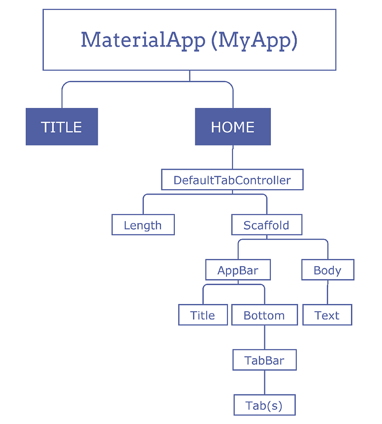

<div align="center">
  <a href="https://github.com/joseferreira-dev/my-study-notes/tree/main/flutter"></a>
</div>
<br>

# O que são Widgets?

- [Introdução](#introdução)
- [Tipos de Widgets](#tipos-de-widgets)
- [Stateful vs Stateless Widgets](#stateful-vs-stateless-widgets)
- [A Árvore de Widgets](#a-árvore-de-widgets)
- [Ciclo de Vida dos Widgets](#ciclo-de-vida-dos-widgets)

## Introdução

No Flutter, Widgets são os blocos de construção fundamentais para a construção de interfaces de usuário. Tudo que você vê em um aplicativo Flutter é um widget, desde um simples botão ou texto até layouts complexos que combinam vários widgets. A filosofia central do Flutter é que a interface do usuário é composta por uma árvore de widgets, onde cada widget descreve uma parte da interface.

## Tipos de Widgets

Os widgets podem ser divididos em várias categorias, com base na sua função e comportamento:

- **Widgets Visuais**: São aqueles que desenham algo na tela, como textos, imagens e botões. Exemplos incluem `Text`, `Image`, `Icon`, `RaisedButton` (ou `ElevatedButton` nas versões mais recentes), entre outros.
- **Widgets de Layout**: Esses widgets ajudam a organizar outros widgets na tela. Eles definem como os widgets filhos são posicionados e dimensionados. Exemplos incluem `Row`, `Column`, `Stack`, `Container`, `Padding`, `Align`, entre outros.
- **Widgets Interativos**: São widgets que respondem a interações do usuário, como toques e gestos. Exemplos incluem `GestureDetector`, `InkWell`, `Switch`, `Slider`, `Form`, `TextField`, entre outros.
- **Widgets de Estilização**: São usados para aplicar estilos aos widgets filhos. Eles não desenham nada por si mesmos, mas modificam a aparência e o comportamento dos widgets filhos. Exemplos incluem `Theme`, `DecoratedBox`, `Transform`, `Opacity`, entre outros.
- **Widgets Funcionais**: Esses widgets fornecem funcionalidade específica, como navegação, exibição de listas, ou integração com recursos do dispositivo. Exemplos incluem `Navigator`, `ListView`, `GridView`, `FutureBuilder`, `StreamBuilder`, entre outros.

## Stateful vs Stateless Widgets

Widgets no Flutter podem ser classificados em dois tipos principais com base em seu estado: **Stateless Widgets** e **Stateful Widgets**.

Os **Stateless Widgets**, como o nome sugere, são widgets sem estado. Eles descrevem uma parte da interface do usuário que depende apenas das informações recebidas via propriedades. Como são imutáveis, não mudam após serem construídos. Exemplos incluem `Text`, `Icon`, e `Container`. Um `StatelessWidget` é útil quando a interface do usuário não precisa mudar em resposta a interações do usuário.

```dart
class MyStatelessWidget extends StatelessWidget {
  @override
  Widget build(BuildContext context) {
    return Text('Hello, Flutter!');
  }
}
```

Já os **Stateful Widgets** são widgets que podem mudar de estado durante a execução do aplicativo. Eles mantêm um estado interno que pode ser modificado e, quando esse estado muda, o widget é reconstruído para refletir as mudanças. Exemplos incluem `Checkbox`, `TextField`, e `AnimatedContainer`.

```dart
class MyStatelessWidget extends StatelessWidget {
  @override
  Widget build(BuildContext context) {
    return Text('Hello, Flutter!');
  }
}
```

Um `StatefulWidget` é composto por duas classes:

- A classe `StatefulWidget` propriamente dita, que é imutável.
- A classe `State`, que contém o estado mutável e a lógica para modificar esse estado.

```dart
class MyStatefulWidget extends StatefulWidget {
  @override
  _MyStatefulWidgetState createState() => _MyStatefulWidgetState();
}

class _MyStatefulWidgetState extends State<MyStatefulWidget> {
  int _counter = 0;

  void _incrementCounter() {
    setState(() {
      _counter++;
    });
  }

  @override
  Widget build(BuildContext context) {
    return Column(
      children: <Widget>[
        Text('Counter: $_counter'),
        RaisedButton(
          onPressed: _incrementCounter,
          child: Text('Increment'),
        ),
      ],
    );
  }
}
```

## A Árvore de Widgets

No Flutter, a interface do usuário é construída como uma árvore de widgets. Cada widget pode ter um ou mais widgets filhos, criando uma estrutura hierárquica. Por exemplo, um `Scaffold` pode conter um `AppBar` e um `Body`, que por sua vez pode conter um `Column`, que contém múltiplos widgets de texto e botões.

Essa abordagem permite que a interface do usuário seja descrita de forma declarativa, onde cada widget descreve uma parte da interface e como ela deve se comportar. Quando o estado de um widget muda, a árvore de widgets é reconstruída, atualizando a interface do usuário conforme necessário.

<div align="center">
  
</div>

## Ciclo de Vida dos Widgets

No Flutter, o ciclo de vida dos widgets é um conceito que nos ajuda a entender como os widgets são criados, atualizados e destruídos. O ciclo de vida é especialmente relevante para widgets `StatefulWidget`, já que eles mantêm estado que pode mudar ao longo do tempo.

### Stateless Widgets

O ciclo de vida de um `StatelessWidget` é simples, pois ele é criado apenas uma vez e não mantém estado. A principal função de um `StatelessWidget` é o método `build`, que é chamado para desenhar o widget na tela.

Etapas do ciclo de vida de um `StatelessWidget`:

1. **Criação do Widget**: O widget é instanciado.
2. **Build**: O método `build` é chamado para construir e desenhar o widget.

### Stateful Widgets

O ciclo de vida de um `StatefulWidget` é mais complexo devido à presença do estado que pode mudar ao longo do tempo. O ciclo de vida de um `StatefulWidget` envolve duas classes: a classe `StatefulWidget` e a classe `State`.

Etapas do ciclo de vida de um `StatefulWidget`:

1. **Criação do `StatefulWidget`**: O `StatefulWidget` é instanciado. O método `createState` é chamado para criar uma instância da classe `State` associada.
2. **Criação do Estado (`State`)**: A instância da classe `State` é criada. Isso geralmente é feito no método `createState` da classe `StatefulWidget`.
3. **Inicialização do Estado**: O método `initState` é chamado na instância da classe `State`. Isso acontece uma vez e é usado para inicializar dados que dependem do contexto ou outras partes do sistema.

```dart
@override
void initState() {
  super.initState();
  // Inicialize o estado aqui.
}
```

4. **Construção do Widget**: O método `build` é chamado para construir a interface do widget, utilizando o estado atual.

```dart
@override
Widget build(BuildContext context) {
  return Text('Estado: $_meuEstado');
}
```

5. **Mudanças de Estado**: Quando o estado muda, o método `setState` é chamado para notificar o framework de que o estado foi alterado e que o widget precisa ser reconstruído.

```dart
void _mudarEstado() {
  setState(() {
    // Modifique o estado aqui.
    _meuEstado++;
  });
}
```

6. **Atualização do Widget**: Quando o widget é atualizado, o método `didUpdateWidget` é chamado. Isso ocorre, por exemplo, quando o widget pai reconstrói e passa novos parâmetros para o `StatefulWidget`.

```dart
@override
void didUpdateWidget(covariant MyStatefulWidget oldWidget) {
  super.didUpdateWidget(oldWidget);
  // Faça algo quando o widget é atualizado.
}
```

7. **Desativação do Widget**: Quando o widget é removido da árvore de widgets temporariamente, o método `deactivate` é chamado. Isso acontece quando o widget é movido dentro da árvore de widgets.

```dart
@override
void deactivate() {
  super.deactivate();
  // Faça algo quando o widget é desativado.
}
```
 8. **Descarte do Estado**: Quando o widget é permanentemente removido da árvore de widgets, o método `dispose` é chamado. Aqui, você deve liberar recursos, como controladores ou listeners, para evitar vazamentos de memória.

```dart
@override
void dispose() {
  // Libere recursos aqui.
  super.dispose();
}
```

Aqui está um exemplo completo que ilustra o ciclo de vida de um `StatefulWidget`:

```dart
class MyStatefulWidget extends StatefulWidget {
  @override
  _MyStatefulWidgetState createState() => _MyStatefulWidgetState();
}

class _MyStatefulWidgetState extends State<MyStatefulWidget> {
  int _counter = 0;

  @override
  void initState() {
    super.initState();
    print('initState');
    // Inicialize o estado.
  }

  @override
  void didUpdateWidget(MyStatefulWidget oldWidget) {
    super.didUpdateWidget(oldWidget);
    print('didUpdateWidget');
    // Faça algo quando o widget é atualizado.
  }

  @override
  void deactivate() {
    super.deactivate();
    print('deactivate');
    // Faça algo quando o widget é desativado.
  }

  @override
  void dispose() {
    print('dispose');
    // Libere recursos.
    super.dispose();
  }

  void _incrementCounter() {
    setState(() {
      _counter++;
    });
  }

  @override
  Widget build(BuildContext context) {
    print('build');
    return Column(
      children: <Widget>[
        Text('Counter: $_counter'),
        ElevatedButton(
          onPressed: _incrementCounter,
          child: Text('Increment'),
        ),
      ],
    );
  }
}

```
