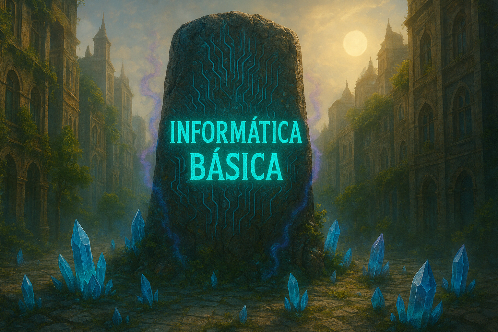

  

 

# Informática Básica

A **informática básica** é um campo essencial do conhecimento na era digital, voltado para o domínio de ferramentas, plataformas e conceitos fundamentais que possibilitam a interação eficiente com computadores e outros dispositivos digitais. Seu foco está no uso prático de recursos como os **navegadores de internet**, **ferramentas de busca**, o **Pacote Office (Word, Excel, PowerPoint)**, além de práticas gerais de uso do computador, como organização de arquivos, instalação de programas e configurações básicas do sistema operacional.

O uso de **navegadores**, como Google Chrome, Mozilla Firefox ou Microsoft Edge, é central para a navegação na internet. Esses programas permitem o acesso a sites, plataformas de serviços, redes sociais e muito mais. Aliado a eles, o domínio de **ferramentas de busca**, como o Google e o Bing, é indispensável para localizar informações com rapidez e eficiência. Saber utilizar palavras-chave, filtros de pesquisa e operadores booleanos pode fazer uma grande diferença na qualidade e na relevância dos resultados obtidos.

Outro pilar da informática básica é o **Pacote Office**, um conjunto de aplicativos amplamente utilizado em ambientes acadêmicos e profissionais. O **Word** é ideal para criação e edição de textos, o **Excel** é voltado para o trabalho com planilhas, cálculos e gráficos, enquanto o **PowerPoint** permite a elaboração de apresentações visuais. Conhecer os principais recursos de cada ferramenta é essencial para realizar tarefas do dia a dia com mais produtividade e organização.

Além disso, o domínio do uso geral do computador envolve compreender como funciona o sistema operacional (como o **Windows**), como organizar pastas e arquivos, configurar dispositivos, realizar atualizações e manter a segurança digital. Essa base permite ao usuário realizar atividades com mais autonomia, além de facilitar o aprendizado de ferramentas mais avançadas no futuro.

A informática básica não é apenas uma habilidade técnica, mas uma competência fundamental para a vida moderna. Ela está presente em praticamente todas as profissões e setores, e seu domínio abre portas para novas oportunidades de aprendizado, trabalho e comunicação. À medida que a tecnologia continua a evoluir, manter-se atualizado e confortável com esses recursos se torna cada vez mais importante para a integração plena na sociedade digital.