# Capítulo 1 – Navegadores e Internet

Vivemos em uma era digital na qual a internet deixou de ser uma ferramenta para se tornar uma extensão de nossas vidas. Um estudo recente da Hootsuite revelou um dado impressionante: o Brasil figura entre os três países do mundo nos quais a população passa, em média, mais de nove horas diárias conectada. Desse tempo, mais de três horas e meia são dedicadas apenas às redes sociais. Esses números mostram o quão profundamente a navegação na web está integrada ao nosso trabalho, estudo, lazer e comunicação. Diante dessa imersão digital, surge uma questão fundamental: quais são as ferramentas e os mecanismos que tornam essa navegação possível? A resposta começa com um software essencial que utilizamos todos os dias, muitas vezes sem refletir sobre sua complexidade e importância: o navegador web.

## O Navegador Web: A Sua Janela para a Internet

Para navegar pelo vasto oceano de informações que é a internet, precisamos de um veículo apropriado. Esse veículo é o **Navegador Web**, também conhecido pelo termo em inglês **Web Browser**. A própria palavra em inglês já nos dá uma pista sobre sua função: o verbo "to browse" pode ser traduzido como "folhear", "explorar" ou "procurar", que é exatamente o que fazemos quando estamos online. O navegador, portanto, é o software cliente que nos fornece as ferramentas para acessar e interagir com os incontáveis serviços e conteúdos disponíveis na internet.

Diferentes provas de concursos e materiais didáticos definem um navegador de formas ligeiramente distintas, mas todas as definições convergem para um mesmo núcleo de ideias.

| Definições                                                                                |
| ----------------------------------------------------------------------------------------- |
| Aplicativo que disponibiliza ferramentas simples para acesso à internet;                  |
| Aplicativo que um usuário invoca para acessar e exibir uma página web;                    |
| Programa utilizado para acessar sítios (ou sites) na internet;                            |
| Espécie de ponte entre usuário e conteúdo virtual na internet;                            |
| Programa desenvolvido para permitir a navegação pela web e processar diversas linguagens; |
| Programa de computador que possibilita a interação entre usuários e páginas web;          |
| Programa que permite a navegação na Internet e a visualização das páginas na web.         |

Analisando a tabela, podemos extrair três pilares que definem um navegador:

1. **É um software:** Trata-se de um programa de computador, um aplicativo instalado em seu dispositivo (computador, smartphone, tablet, etc.).
2. **Permite a interação:** Ele funciona como uma ponte, uma interface que permite a um usuário interagir com o conteúdo da web, como páginas e sites.
3. **Possibilita a navegação:** Sua função primária é permitir a "viagem" pela web, visualizando seus conteúdos.

De forma mais simples e direta, podemos pensar em um navegador como uma **ferramenta para a visualização e o consumo de conteúdo web**. Ele é a nossa janela para o mundo digital, o programa que traduz códigos e dados complexos em páginas visualmente ricas e interativas com as quais podemos nos engajar.

### A Arquitetura da Internet: Clientes e Servidores

Para entender profundamente como um navegador funciona, é indispensável compreender a lógica fundamental sobre a qual toda a internet foi construída: a **Arquitetura Cliente/Servidor**. Esse modelo organiza a comunicação na rede dividindo as tarefas entre dois tipos de atores: aqueles que consomem ou solicitam serviços (os **clientes**) e aqueles que oferecem ou fornecem esses serviços (os **servidores**).

Essa relação não é um conceito exclusivo do mundo digital; ela espelha inúmeras interações do nosso cotidiano. Quando você entra em um restaurante, você é o **cliente** que solicita um serviço (uma refeição), e o restaurante, com sua cozinha e garçons, é o **servidor** que prepara e entrega esse serviço. Quando você pega um ônibus, você é o **cliente** de um serviço de transporte, fornecido pela empresa de ônibus (o **servidor**). Por outro lado, um servidor público é alguém que, como parte do Estado, fornece um serviço à população (o cliente).

A internet opera sob a mesma lógica. Temos computadores e softwares especializados em fornecer serviços e informações (os servidores) e outros especializados em solicitar e consumir esses serviços (os clientes). Ao afirmarmos que o navegador é uma ferramenta para "consumir conteúdo web", estamos definindo sua posição nessa arquitetura: o **navegador é, por excelência, um cliente web**.

O fluxo dessa interação é a base de toda a navegação, como ilustra o esquema a seguir.

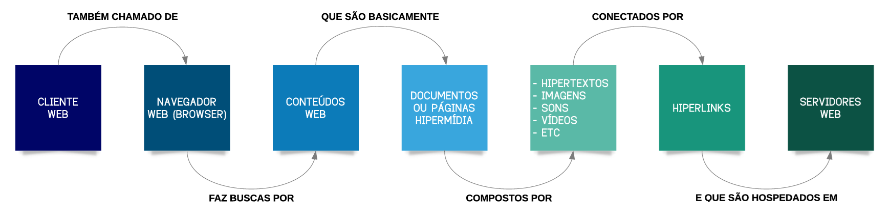

Seguindo a imagem, o processo se inicia no **Cliente Web** (nosso navegador), que faz uma solicitação por um conteúdo. Essa solicitação viaja através da **Internet** até encontrar o **Servidor Web** correto, que processa o pedido e envia o conteúdo de volta para o cliente. Para que essa explicação faça sentido completo, precisamos entender melhor os outros dois elementos da imagem: o que é exatamente o "conteúdo web" e o que faz um "servidor web".

### Desvendando a World Wide Web (WWW)

É comum usarmos os termos "Internet" e "Web" como sinônimos, mas eles se referem a coisas diferentes. A **Internet** é a infraestrutura global – a imensa rede de cabos de fibra óptica, satélites, roteadores e computadores interconectados que permite a troca de dados em escala planetária. A **World Wide Web** (que pode ser traduzida como "Teia de Alcance Mundial"), ou simplesmente **Web**, é um dos muitos serviços que rodam **sobre** a infraestrutura da Internet. Ela é um gigantesco sistema de informações que funciona interligando documentos por meio de links.

O conteúdo web que nosso navegador busca é, portanto, formado por **documentos hipermídia**. O termo pode parecer complexo, mas a ideia é simples. Esses documentos, que conhecemos como **páginas web**, são chamados de hipermídia porque integram diversos tipos de mídia, tendo o **hipertexto** como sua base.

Um **hipertexto** é um texto que contém referências (links) para outros textos, permitindo uma leitura não-linear. Quando você está lendo uma notícia online e clica em um termo azul sublinhado que o leva para uma outra página com mais detalhes, você está navegando por um hipertexto. Essa capacidade de saltar de uma informação para outra é a essência da "teia" que forma a Web.

Contudo, uma página moderna é muito mais do que apenas texto. A **hipermídia** é a evolução do hipertexto, incorporando todos os outros tipos de mídia para criar uma experiência rica e interativa para o usuário. Isso inclui:

- **Imagens:** Fotografias, ilustrações, infográficos.
- **Vídeos:** Tutoriais, clipes, filmes incorporados diretamente na página.
- **Áudio:** Músicas, podcasts, efeitos sonoros.
- **Animações:** Elementos gráficos que se movem para chamar a atenção ou ilustrar um processo.

| Conceitos       | Descrição                                                                                                                                                      |
| --------------- | -------------------------------------------------------------------------------------------------------------------------------------------------------------- |
| **Hipermídia**  | O conteúdo das páginas web, que integra diversos formatos, como hipertextos, imagens, sons e/ou vídeos, para criar uma experiência rica e interativa.          |
| **Hipertextos** | Textos que contêm ligações digitais, permitindo uma navegação não-linear entre diferentes documentos ou partes de um mesmo documento.                          |
| **Hiperlinks**  | A referência ou o "endereço" dentro de um hipertexto que aponta para outro documento. É o elemento clicável que nos permite "saltar" de uma página para outra. |

Quando você acessa a página de um produto em uma loja virtual, você está consumindo hipermídia: vê as fotos (**imagens**), assiste ao vídeo de demonstração (**vídeo**), lê a descrição e os comentários (**hipertexto**) e clica em um botão para comprar (**hiperlink**).

### A Linguagem e o Protocolo da Web

Já entendemos o que é uma página web e quem a acessa. Faltam duas peças no quebra-cabeça: como essas páginas são construídas e como elas viajam do servidor até o nosso navegador?

A linguagem padrão para a construção de páginas web é o **HTML**, sigla para **H**yper**T**ext **M**arkup **L**anguage (Linguagem de Marcação de Hipertexto). O HTML funciona como o esqueleto de uma página, utilizando "etiquetas" ou "marcadores" (as _tags_) para estruturar o conteúdo, definindo o que é um título, um parágrafo, uma imagem ou um link.

Agora, para que a comunicação entre o cliente (navegador) e o servidor (onde a página HTML está armazenada) ocorra de forma ordenada, é preciso um conjunto de regras, um idioma comum. Esse idioma é o **HTTP**, sigla para **H**yper**T**ext **T**ransfer **P**rotocol (Protocolo de Transferência de Hipertexto). O HTTP é o protocolo padrão que define como as solicitações por páginas web devem ser feitas e como as respostas devem ser enviadas.

Uma curiosidade interessante é por que o protocolo se chama "de transferência de hipertexto" e não "de hipermídia". Isso se deve a um fator histórico: quando o protocolo foi criado, no início da década de 1990, as páginas web eram compostas quase que exclusivamente por textos e links. Imagens, sons e vídeos só foram incorporados à web mais tarde, mas o nome original do protocolo permaneceu.

Hoje, você frequentemente verá o endereço de sites começando com **HTTPS**. O "S" adicional significa **Secure** (Seguro). O HTTPS é uma versão criptografada do HTTP, que garante que os dados trocados entre seu navegador e o servidor sejam protegidos e confidenciais, impedindo que interceptadores consigam ler as informações. É por isso que ele é obrigatório em sites de bancos, lojas virtuais e qualquer página que lide com informações sensíveis.

### O Ecossistema em Ação: Juntando as Peças

Com todos os conceitos apresentados, podemos agora descrever o processo completo de navegação. Imagine que você deseja acessar o site do seu portal de notícias favorito. O fluxo de ações que acontece em poucos segundos é o seguinte:

1. **A Solicitação (Cliente):** Você digita o endereço do site na barra do seu **navegador web** (o cliente) e pressiona "Enter".
2. **A Mensagem (Protocolo):** Seu navegador cria uma "mensagem" seguindo as regras do protocolo **HTTP/HTTPS**, solicitando a página principal do portal.
3. **A Viagem (Internet):** Essa solicitação viaja pela infraestrutura da **Internet**, sendo encaminhada por diversos equipamentos até chegar ao seu destino.
4. **O Destino (Servidor):** A solicitação chega ao **servidor web** do portal de notícias. Um servidor web é um computador potente e sempre conectado, cujo software é especializado em receber requisições HTTP e encontrar os arquivos correspondentes.
5. **A Resposta (Conteúdo):** O servidor localiza o arquivo da página principal, que está escrito em **HTML**, e o prepara para envio.
6. **O Retorno (Protocolo):** O servidor envia o arquivo HTML de volta para o seu navegador, dentro de uma resposta HTTP.
7. **A "Tradução" (Cliente):** Seu navegador recebe o código HTML. Ele então o interpreta, como um tradutor, e renderiza a página visual que você vê na tela, com seus textos formatados, imagens, vídeos e links clicáveis – ou seja, todo o conteúdo **hipermídia**.

Esse ciclo de requisição e resposta é a base de toda a sua experiência na World Wide Web.

### Os Principais Navegadores do Mercado

Desde o surgimento da web comercial, dezenas de navegadores foram criados. Atualmente, o mercado é dominado por um pequeno grupo de softwares, cada um com suas características. Os mais conhecidos e utilizados são:

- **Google Chrome:** Lançado pelo Google, é atualmente o navegador mais popular do mundo. Destaca-se pela sua velocidade, interface limpa e forte integração com o ecossistema de serviços do Google (Gmail, Drive, etc.).
- **Mozilla Firefox:** Desenvolvido pela Fundação Mozilla, é um navegador de código aberto conhecido por seu forte foco em privacidade e segurança do usuário, oferecendo diversas opções de personalização.
- **Microsoft Edge:** É o navegador moderno da Microsoft, que substituiu o antigo Internet Explorer. Construído sobre a mesma base do Chrome (o projeto Chromium), oferece alta compatibilidade, bom desempenho e integração nativa com o sistema operacional Windows.
- **Safari:** O navegador padrão da Apple, disponível exclusivamente para seus dispositivos (macOS, iOS e iPadOS). É conhecido por sua otimização de desempenho e baixo consumo de energia no ecossistema da Apple.
- **Opera:** Um navegador veterano, conhecido por inovar com recursos como um bloqueador de anúncios e uma VPN gratuita integrados.

Além desses, existem muitos outros, como o **Shiira**, o **Konqueror** (comum em ambientes Linux), entre outros que atendem a nichos específicos de usuários. A escolha de um navegador, no fim, depende das preferências pessoais de cada usuário em relação à interface, desempenho, recursos e políticas de privacidade.

## Localizando Conteúdo: A Anatomia da URL e o Papel do DNS

Já estabelecemos que o navegador é a nossa ferramenta para acessar conteúdos na web, que estão armazenados em servidores espalhados pelo mundo. Mas como o navegador sabe exatamente onde encontrar uma página ou um arquivo específico em meio a bilhões de servidores e trilhões de documentos? A resposta está em um sistema de endereçamento padronizado e universal: a **URL (Uniform Resource Locator)**, ou Localizador Uniforme de Recursos.

Todo e qualquer recurso disponível na internet – seja uma página de texto, uma imagem, um vídeo, um arquivo para download ou até mesmo um dispositivo como uma impressora em rede – possui uma URL única. Ela é o "endereço virtual" que informa ao navegador o caminho exato para encontrar o que se procura. Ao digitar ou clicar em uma URL, estamos fornecendo ao navegador as coordenadas precisas para que ele possa fazer a solicitação ao servidor correto e trazer o recurso até a nossa tela.

### A Estrutura de um Endereço Web

Embora possam parecer complexas, as URLs seguem uma estrutura lógica e padronizada. Em sua forma mais comum, ela é composta pelos seguintes elementos:

| Estrutura de URL Simplificada               |
| ------------------------------------------- |
| `protocolo://domínio:porta/caminho/recurso` |

É importante notar que, no uso cotidiano, raramente precisamos digitar todos esses componentes. Partes como a porta, o caminho e o nome do recurso são frequentemente opcionais ou preenchidas automaticamente pelo navegador. Vamos dissecar cada um desses componentes usando uma analogia com um endereço físico. Pense no endereço fictício de um apartamento em Brasília: `SQN 115 Bloco A, Apt 208 – Asa Norte – Brasília/DF`.

|Componentes da URL|Descrição|Analogia com Endereço Físico|
|---|---|---|
|**Protocolo**|Define o conjunto de regras ou o "idioma" que será usado para a comunicação. Os mais comuns são `http` e `https`|É o **meio de transporte** que se usa para chegar. Você vai de carro, de ônibus, a pé? Cada um tem suas regras.|
|**Domínio ou IP**|É o nome ou o número de identificação único do servidor onde o recurso está hospedado. É o endereço principal do "terreno digital".|É a **cidade e o bairro** do endereço: `Asa Norte – Brasília/DF`. Informa a localização geral do destino.|
|**Porta**|Um ponto de comunicação lógico no servidor. Cada serviço (web, e-mail, etc.) opera em uma porta diferente para não haver conflito.|É a **entrada específica** do prédio. Pode ser a portaria principal, a entrada de serviço ou a garagem.|
|**Caminho**|A estrutura de pastas e subpastas dentro do servidor que organiza os arquivos.|É o **endereço dentro do bairro**: `SQN 115 Bloco A`. Indica a rua e o prédio específico.|
|**Recurso**|O arquivo final que se deseja acessar.|É o **local exato** dentro do prédio: `Apt 208`. É o destino final da sua jornada.|

Vamos analisar uma URL real para solidificar o conceito:

`https://www.cursodeinformatica.com.br/app/dashboard/cursos/aulas/aula1.pdf`

|Componentes|Descrição|
|---|---|
|**Protocolo**|`https` - O navegador usará o Protocolo de Transferência de Hipertexto Seguro.|
|**Domínio**|`cursodeinformatica.com.br` - O servidor que hospeda o recurso. O `www` é um subdomínio comum, mas muitas vezes pode ser omitido.|
|**Porta**|`443` - Embora não esteja visível na URL, esta é a porta padrão para o protocolo `https` e é usada automaticamente pelo navegador.|
|**Caminho**|`/app/dashboard/cursos/aulas/` - A sequência de "pastas" dentro do servidor para chegar ao arquivo.|
|**Recurso**|`aula1.pdf` - O arquivo específico que estamos solicitando.|

É comum confundir URL com Domínio. O **domínio** é apenas uma parte da URL, a que identifica o site (`cursodeinformatica.com.br`). Se alterarmos o recurso para `aula2.pdf`, teremos uma nova URL, mas o domínio permanecerá o mesmo.

### A Sintaxe Completa da URL

A estrutura que vimos é a mais comum, mas a sintaxe completa de uma URL pode incluir outros componentes opcionais, embora mais raros, que permitem interações mais complexas.

|URL (SINTAXE COMPLETA)|
|---|
|`protocolo://nome-de-usuário@domínio:porta/caminho/recurso?query#fragmento`|

|Componentes Extras|Descrição|Exemplo de Uso|
|---|---|---|
|**Query / queryString**|Utilizada para passar parâmetros adicionais para o servidor em formato de "chave=valor". Inicia com `?` e múltiplos parâmetros são separados por `&`.|Ao pesquisar "apostila de informática" em um buscador, a URL pode conter `.../search?q=apostila+de+informatica`.|
|**Fragmento**|Utilizado para navegar diretamente para uma seção específica de uma página, identificada por uma "âncora". Inicia com `#`.|Em um longo artigo da Wikipédia sobre o Brasil, uma URL terminada em `#História` levará o navegador diretamente para a seção "História".|
|**Nome de usuário**|Utilizado em contextos que exigem autenticação para acessar o recurso, passando as credenciais diretamente na URL. Hoje é um método raro e inseguro.|Acessar um servidor de arquivos privado: `ftp://usuario@meuservidor.com`.|

> **Ponto de Atenção: A Codificação de URLs**
> 
> As URLs possuem um conjunto restrito de caracteres permitidos. Caracteres especiais, acentos e espaços não são aceitos diretamente. Para contornar isso, existe a "codificação de URL", que converte esses caracteres em uma representação segura. O exemplo mais famoso é o espaço em branco, que é codificado como `%20`.

### O DNS: A Lista Telefônica da Internet

Nós, humanos, somos bons em memorizar nomes, como `google.com` ou `registro.br`. Os computadores, no entanto, se comunicam na rede usando endereços numéricos, chamados de **endereços IP** (Internet Protocol), como `172.217.29.206`. Como a ponte entre esses dois mundos é feita? A resposta é o **DNS (Domain Name System)**, ou Sistema de Nomes de Domínio.

O DNS pode ser entendido como a **gigantesca lista telefônica da internet**. Quando você digita um nome de domínio no seu navegador, ele não sabe qual servidor no mundo corresponde àquele nome. O navegador, então, consulta um servidor DNS, que funciona como um tradutor: ele recebe o nome do domínio e retorna o endereço IP correspondente. Com o número "certo" em mãos, seu navegador finalmente sabe para qual servidor deve enviar a solicitação HTTP.

Esse sistema não é centralizado. Ele possui uma estrutura **hierárquica e distribuída**. Isso significa que a "lista telefônica" está espalhada por milhares de servidores DNS pelo mundo, organizados em uma árvore hierárquica, o que garante que o sistema seja rápido e resiliente a falhas. A imagem a seguir ilustra a hierarquia de domínios no Brasil.

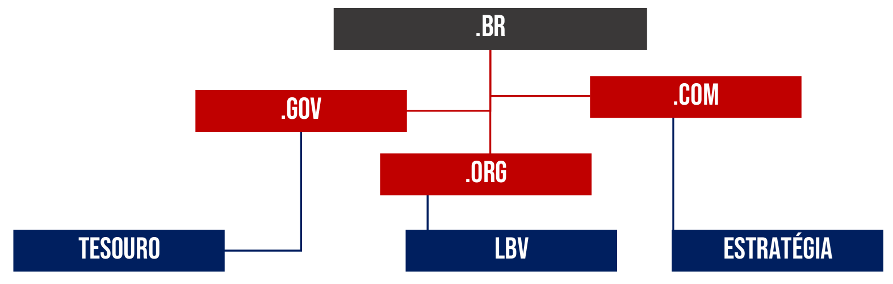

Para garantir que cada nome de domínio seja único e não haja ambiguidade (assim como não podem existir dois telefones com o mesmo número), existe um sistema de governança. Em nível global, a entidade responsável por gerenciar os domínios de topo (como `.com`, `.org`, e os de países como `.br` para o Brasil, `.pt` para Portugal e `.jp` para o Japão) é a **ICANN (Internet Corporation for Assigned Names and Numbers)**.

No Brasil, a responsabilidade pelo registro e manutenção de todos os domínios terminados em `.br` é do **Registro.br**. Se você desejar criar um site e registrar um domínio próprio, como `www.meunome.com.br`, é a essa entidade que deverá recorrer.

O Registro.br também organiza os domínios `.br` em subcategorias, que ajudam a identificar a natureza de um site:

- **.com.br:** Destinado a atividades comerciais.
- **.org.br:** Para organizações não-governamentais e sem fins lucrativos.
- **.gov.br:** Exclusivo para entidades do governo federal.
- **.edu.br:** Para instituições de ensino e pesquisa credenciadas.
- E muitas outras categorias, algumas com restrições que exigem comprovação documental para o registro.

### Um Protocolo Histórico: O FTP

Para finalizar nossa exploração dos componentes da internet, vale mencionar rapidamente o **FTP (File Transfer Protocol)**, ou Protocolo de Transferência de Arquivos. Como o nome indica, sua função principal é permitir a transferência de arquivos (upload e download) entre computadores em uma rede. Por muitos anos, o FTP foi o método padrão para enviar os arquivos de um site para o servidor de hospedagem ou para baixar programas e documentos.

Atualmente, seu uso pelo público geral diminuiu drasticamente. A razão é que o próprio protocolo HTTP/HTTPS evoluiu e hoje permite a transferência de arquivos de forma segura e integrada à navegação. Quando você anexa um arquivo em um e-mail ou faz o download de um PDF, está usando HTTP/HTTPS para a transferência. Por essa razão, o suporte direto ao protocolo FTP (acessado por URLs que começam com `ftp://`) tem sido descontinuado na maioria dos navegadores modernos, que priorizam a segurança e a simplicidade do HTTPS.

## A Interface Gráfica do Navegador

Apesar de toda a complexa tecnologia de redes, protocolos e servidores que opera nos bastidores, o sucesso e a popularização dos navegadores dependem de um fator crucial: uma interface gráfica amigável e intuitiva. É através dos seus botões, menus e da organização visual que conseguimos interagir de forma simples com o universo da web. A seguir, exploraremos os componentes fundamentais dessa interface, começando por aquele que revolucionou a forma como organizamos nossa navegação: a barra de guias.

### Navegando em Múltiplas Páginas

A **Barra de Guias**, também conhecida como **Barra de Abas** ou **Separadores**, é o elemento gráfico horizontal localizado no topo da janela do navegador. Sua função é permitir que o usuário abra e alterne entre múltiplas páginas web dentro de uma única instância (uma única janela) do programa.

Pode parecer difícil de imaginar hoje, mas houve uma época em que essa funcionalidade não existia. Para acessar o e-mail, uma rede social e um portal de notícias simultaneamente, era necessário abrir três janelas separadas do navegador, poluindo a área de trabalho e tornando a alternância entre as páginas uma tarefa lenta e desorganizada. A introdução da navegação por abas representou uma quebra de paradigma, uma inovação tão poderosa que foi rapidamente adotada por todos os navegadores modernos.

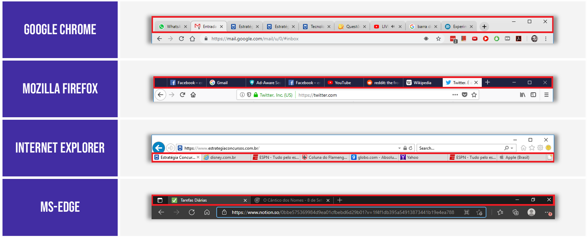

Hoje, é comum que usuários mantenham dezenas de abas abertas ao mesmo tempo, seja para trabalho, estudo ou lazer. O limite máximo de abas que um navegador pode abrir não é fixo, sendo determinado principalmente pela quantidade de recursos computacionais disponíveis no dispositivo (memória RAM e capacidade de processamento). No entanto, em um computador moderno, é possível abrir mais de cinquenta abas com facilidade.

### Organizando o Caos: Ferramentas de Gerenciamento de Abas

Com a possibilidade de abrir tantas páginas simultaneamente, a barra de guias pode rapidamente se transformar em um ambiente caótico e difícil de gerenciar. Para solucionar esse problema, os navegadores desenvolveram ferramentas que ajudam a organizar e a priorizar o acesso às abas mais importantes.

#### Fixando Guias: Seus Favoritos Sempre à Mão

Para aquelas páginas que utilizamos com altíssima frequência ao longo do dia – como o e-mail, o calendário ou uma ferramenta de trabalho –, existe a funcionalidade de **fixar a guia**. Ao fixar uma guia, o navegador a posiciona permanentemente no lado esquerdo da barra de abas, em um formato reduzido que exibe apenas o ícone do site (o _favicon_).

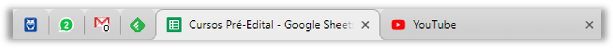

Essa ação traz duas vantagens: economiza um espaço precioso na barra de guias e garante que seus sites mais importantes estejam sempre no mesmo lugar, fáceis de encontrar, não importa quantas outras abas sejam abertas. Para utilizar o recurso, basta clicar com o botão direito do mouse sobre a aba desejada e escolher a opção "Fixar Guia".

#### Agrupando Guias: Criando Contextos de Trabalho

Uma funcionalidade mais recente, presente em navegadores como o Google Chrome e o Microsoft Edge, é o **agrupamento de guias**. Esse recurso é uma solução poderosa para quem trabalha com múltiplos projetos ou assuntos ao mesmo tempo. Ele permite que o usuário organize diversas abas relacionadas sob um mesmo grupo nomeado e colorido.

O processo para criar e gerenciar grupos é bastante simples:

1. Clica-se com o botão direito do mouse sobre uma guia que se deseja agrupar.
2. Seleciona-se a opção "Adicionar guia ao novo grupo" (ou similar).
3. Abre-se uma pequena janela onde é possível dar um nome ao grupo (por exemplo, "Trabalho da Faculdade", "Pesquisa de Viagem") e escolher uma cor para identificá-lo.
4. Uma vez que o grupo está criado, pode-se arrastar outras guias para dentro dele ou clicar com o botão direito em outras abas e adicioná-las a um grupo existente.
5. Os grupos podem ser gerenciados a qualquer momento, permitindo desagrupar as guias ou fechar todas as abas de um grupo de uma só vez.

Imagine um navegador com mais de 20 abas abertas simultaneamente. A imagem a seguir ilustra como o agrupamento pode organizar esse cenário, criando contextos claros para cada conjunto de páginas.

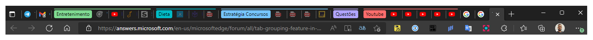

Na imagem, as abas foram organizadas em grupos temáticos: "Entretenimento" (com páginas de filmes e blogs), "Dieta", "Estratégia Concursos" (com materiais de estudo), "Questões" e "Youtube". Note que algumas páginas permanecem desagrupadas.

A grande vantagem dessa funcionalidade é a possibilidade de **expandir e retrair** os grupos. Ao clicar sobre o nome de um grupo, todas as suas abas são recolhidas, liberando um enorme espaço visual na barra de guias e reduzindo a poluição visual. O resultado, como mostra a imagem abaixo, é um ambiente de trabalho muito mais limpo e organizado.

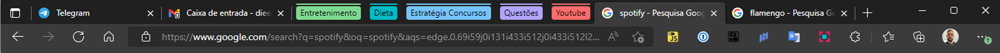

Dessa forma, ferramentas como a fixação e o agrupamento de guias transformam o navegador de uma simples janela para a web em um poderoso ambiente de trabalho, permitindo ao usuário gerenciar grandes volumes de informação de maneira eficiente e produtiva.

### Barra de Navegação e Endereços

Logo abaixo da barra de abas, encontramos a área mais interativa do navegador, aquela que utilizamos a todo momento para nos movermos pela web. Historicamente, essa área era dividida em componentes bem definidos. Embora os navegadores modernos tenham fundido algumas dessas funções para otimizar o espaço e a usabilidade, é didaticamente importante compreender cada uma de suas partes. A maioria dos especialistas divide essa região em três elementos funcionais distintos: os controles de navegação, a barra de endereços e a barra de pesquisa.

É preciso ter atenção, pois alguns materiais podem se referir a todo esse conjunto simplesmente como "Barra de Navegação". Para garantir a clareza, vamos analisar cada componente separadamente, utilizando como guia a imagem a seguir, que destaca as funções de cada área.

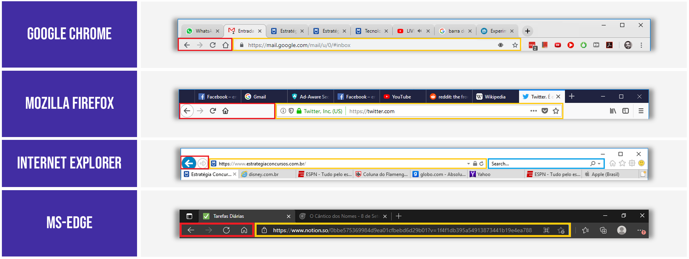

#### Os Controles de Navegação (Área Vermelha)

Esta é a parte da interface que agrupa os botões e atalhos essenciais para o controle do nosso fluxo de navegação. Eles funcionam de maneira análoga a virar as páginas de um livro ou usar os controles de um player de vídeo, permitindo-nos mover para frente e para trás em nosso histórico. Os principais botões são:

- **Voltar (Seta para a esquerda):** Este botão nos leva de volta à página que visitamos imediatamente antes da atual, dentro da mesma aba. Ele só fica ativo se já tivermos navegado por pelo menos duas páginas naquela guia.
- **Avançar (Seta para a direita):** Este botão é o oposto do "Voltar". Ele só se torna clicável após termos recuado em nosso histórico e nos permite avançar novamente para a página que estávamos visitando.
- **Atualizar/Recarregar (Ícone circular):** Clicar neste botão força o navegador a solicitar e baixar novamente todo o conteúdo da página atual do servidor. Isso é útil em diversas situações: para visualizar informações que mudam constantemente (como o placar de um jogo ou a cotação de uma ação), para corrigir uma página que carregou com erros ou para verificar se há novo conteúdo em um site de notícias.
- **Página Inicial (Ícone de casa):** Leva o usuário diretamente para a página definida como inicial nas configurações do navegador. Muitos usuários configuram seu portal de notícias ou buscador favorito como página inicial para acesso rápido.

#### A Barra de Endereços (Área Amarela)

Este é o campo onde inserimos o endereço (a URL) da página que desejamos visitar. Funciona como o "GPS" da web: ao fornecer o endereço exato de um recurso, o navegador sabe exatamente para qual servidor deve enviar a solicitação. Se quisermos acessar o site do Google, é nesta barra que digitamos `www.google.com`.

Além de ser um campo de entrada, a barra de endereços nos navegadores modernos também serve como um importante painel de informações, exibindo ícones que indicam o estado de segurança da conexão (como o cadeado que representa uma conexão HTTPS segura) e oferecendo atalhos para adicionar a página aos favoritos.

#### A Barra de Pesquisa (Área Azul)

Em navegadores mais antigos, como o Internet Explorer (mostrado na imagem), era comum haver uma barra de pesquisa separada. Sua função era exclusivamente a de permitir que o usuário realizasse buscas na internet utilizando um mecanismo de pesquisa pré-configurado (Google, Bing, Yahoo!, etc.), sem precisar primeiro acessar o site do buscador.

#### A Fusão Inteligente: A "Omnibox" Moderna

A principal evolução nesta área da interface foi a fusão da Barra de Endereços com a Barra de Pesquisa. Navegadores como Google Chrome, Mozilla Firefox e Microsoft Edge adotaram um campo unificado e inteligente, muitas vezes chamado de **"Omnibox"** ou "Barra Impressionante".

Essa barra multifuncional é capaz de interpretar o que o usuário digita e decidir a melhor ação a ser tomada. Se o texto inserido se parece com uma URL (`google.com.br`), o navegador tentará acessar o site. Se, por outro lado, o usuário digitar termos ou uma pergunta ("melhor apostila de informática para concursos"), o navegador entenderá que se trata de uma pesquisa e enviará esses termos diretamente para o mecanismo de busca padrão, exibindo a página de resultados.

Além disso, a Omnibox moderna é integrada ao histórico de navegação e aos favoritos, sugerindo sites já visitados ou salvos à medida que o usuário digita, tornando o processo de reencontrar uma página muito mais rápido e eficiente. Essa integração tornou a barra de pesquisa dedicada uma ferramenta obsoleta na maioria dos navegadores atuais.

### Barra de Menu

Em softwares de computador mais antigos, era um padrão de design haver uma **Barra de Menu** no topo da janela. Trata-se de um elemento gráfico horizontal que apresenta uma série de menus textuais, como "Arquivo", "Editar", "Exibir", "Histórico", "Favoritos", "Ferramentas" e "Ajuda". Cada um desses menus, ao ser clicado, desdobra uma lista de funcionalidades e configurações relacionadas, servindo como o repositório central para todas as ações possíveis dentro do programa.

Os primeiros navegadores de internet seguiram essa mesma lógica. No entanto, com a evolução do design de interfaces, a tendência passou a ser a de criar ambientes mais limpos e minimalistas, que maximizam o espaço útil da tela para o conteúdo principal – no caso, a própria página web. Como resultado, a tradicional Barra de Menu passou por um processo de transformação, sendo ocultada ou até mesmo completamente substituída nos navegadores mais modernos.

A imagem a seguir demonstra claramente essa transição, comparando a interface de quatro navegadores populares.

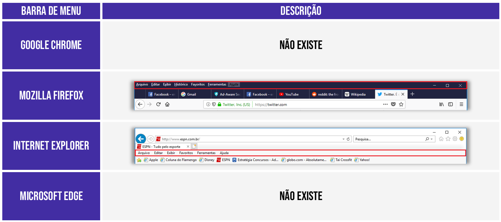

Como podemos observar, existem duas abordagens distintas para a Barra de Menu no cenário atual, que vamos detalhar a seguir.

#### Oculta, mas Presente (Mozilla Firefox e Internet Explorer)

Alguns navegadores, como o Mozilla Firefox e o já descontinuado Internet Explorer, optaram por não remover a Barra de Menu, mas sim **ocultá-la por padrão**. A ferramenta ainda existe, com todos os seus menus tradicionais, mas não fica visível para não poluir a interface.

Para os usuários que desejam acessá-la, existe um atalho simples: basta pressionar a tecla **ALT** no teclado. Ao pressioná-la, a Barra de Menu surge temporariamente no topo da janela, permitindo o acesso a funcionalidades como:

- **Arquivo:** Opções para abrir novas janelas, salvar a página atual ou imprimi-la.
- **Editar:** Comandos de copiar, colar e localizar texto na página.
- **Exibir:** Controles de zoom, visualização em tela cheia e acesso a barras de ferramentas.
- **Histórico:** Acesso à lista de sites visitados recentemente.
- **Favoritos:** Gerenciamento dos sites salvos (bookmarks).
- **Ferramentas:** Acesso a configurações mais avançadas, downloads e extensões (add-ons).

#### Removida e Reintegrada (Google Chrome e Microsoft Edge)

Os navegadores mais modernos, como o Google Chrome e o Microsoft Edge, adotaram uma abordagem mais radical: eles **eliminaram completamente** a tradicional Barra de Menu. Isso não significa, contudo, que as funcionalidades desapareceram.

O que ocorreu foi uma **reorganização**. Todas as opções que antes estavam espalhadas pelos menus "Arquivo", "Editar", "Ferramentas", etc., foram consolidadas e integradas em um **único botão de menu principal**. Esse ícone, geralmente localizado no canto superior direito do navegador, é popularmente conhecido como "menu de três pontos" (no Chrome e Edge) ou "menu de hambúrguer" (três linhas horizontais, como no Firefox).

Ao clicar neste único botão, o usuário tem acesso a um painel que agrupa de forma organizada todas as configurações e ferramentas do navegador: histórico, downloads, favoritos, zoom, impressão, configurações de privacidade e muito mais. Essa abordagem se tornou o padrão de design atual por oferecer uma interface mais limpa e intuitiva, concentrando todas as ações em um único ponto de acesso.

### Barra de Favoritos

Em nossa navegação diária, é comum visitarmos repetidamente um mesmo conjunto de sites: o portal de notícias, a caixa de entrada do e-mail, a rede social, a plataforma de estudos, entre outros. Digitar o endereço completo desses sites toda vez que desejamos acessá-los seria uma tarefa repetitiva e pouco produtiva. Para resolver exatamente esse problema, os navegadores oferecem a **Barra de Favoritos** (também conhecida como **Barra de Marcadores** ou, em inglês, _Bookmarks Bar_).

A Barra de Favoritos é um elemento gráfico, geralmente uma barra horizontal, localizada logo abaixo da barra de endereços, que serve como um painel de atalhos personalizável. Nela, o usuário pode salvar links para suas páginas preferidas, permitindo o acesso a elas com um único clique, sem a necessidade de digitar qualquer endereço. A imagem a seguir ilustra a aparência dessa barra nos principais navegadores.

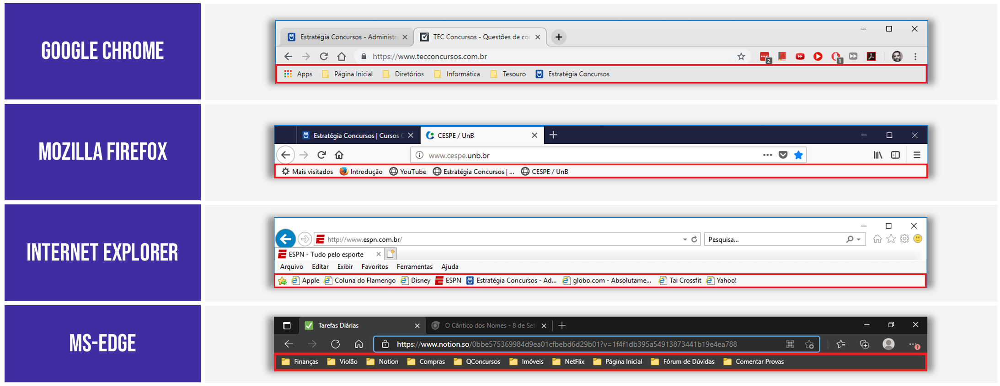

#### Como Adicionar e Gerenciar Favoritos

O processo para salvar uma página na Barra de Favoritos é intencionalmente simples e muito similar em todos os navegadores. Geralmente, o ícone que representa a ação de "favoritar" uma página é uma **estrela (☆)**, localizada dentro ou ao final da barra de endereços.

Ao visitar uma página que se deseja salvar, basta clicar neste ícone. Uma pequena janela se abrirá, permitindo que o usuário edite o nome do atalho (para que fique mais curto e claro) e, o mais importante, escolha em qual local o favorito será salvo. A opção padrão é adicioná-lo diretamente à Barra de Favoritos.

#### O Poder da Organização: O Uso de Pastas

A verdadeira força da Barra de Favoritos reside em sua capacidade de organização. Em vez de simplesmente adicionar dezenas de atalhos soltos, o que tornaria a barra poluída e confusa, é possível criar **pastas** para agrupar os links por tema ou contexto. Essas pastas podem, inclusive, conter outras subpastas, criando uma estrutura hierárquica que facilita enormemente a localização dos sites.

Por exemplo, um usuário pode organizar sua Barra de Favoritos da seguinte forma:

- **Uma pasta "Trabalho"**: contendo links para o e-mail corporativo, o sistema interno da empresa e sites de referência profissional.
- **Uma pasta "Estudos"**: com atalhos para a plataforma da faculdade, dicionários online e portais de artigos científicos.
- **Uma pasta "Lazer"**: que pode conter subpastas como "Notícias", "Esportes" e "Streaming", cada uma com os respectivos links.

Essa organização transforma a Barra de Favoritos em um menu pessoal e altamente produtivo, adaptado às necessidades e à rotina de cada pessoa.

#### Exibindo e Ocultando a Barra

Para os usuários que preferem uma interface mais limpa, a Barra de Favoritos pode ser facilmente ocultada e exibida conforme a necessidade. A maioria dos navegadores oferece uma opção no menu de configurações para controlar sua visibilidade, e também um atalho de teclado para alternar rapidamente entre exibir e ocultar a barra (geralmente **Ctrl + Shift + B** no Windows ou **Cmd + Shift + B** no macOS).

### Barra de Status

A **Barra de Status** é um elemento informativo, tradicionalmente localizado na parte inferior da janela do navegador. Sua principal função é apresentar o status atual de uma ação ou o destino de um link, fornecendo ao usuário um feedback em tempo real sobre suas interações com a página web.

Assim como a Barra de Menu, a Barra de Status também passou por uma significativa evolução de design. Em navegadores mais antigos, ela era uma barra permanentemente visível que exibia uma gama maior de informações, como o progresso de carregamento dos elementos da página ("Carregando imagem...", "Concluído"), detalhes do certificado de segurança e o endereço de links.

Seguindo a tendência de interfaces mais limpas, os navegadores modernos optaram por **ocultar a Barra de Status por padrão**. Ela não foi removida, mas transformada em um elemento dinâmico, que surge apenas quando é necessário, cumprindo uma função essencial: revelar o endereço de um hyperlink antes que o usuário clique nele.

Essa funcionalidade é um recurso de transparência e segurança. Ao posicionar o ponteiro do mouse sobre qualquer elemento clicável de uma página – seja um trecho de texto, um botão ou uma imagem que contenha um link – duas coisas acontecem simultaneamente:

1. O cursor do mouse geralmente se transforma em um ícone de "mãozinha" (ponteiro), indicando que aquele elemento é interativo.
2. A Barra de Status aparece momentaneamente no canto inferior esquerdo da tela, exibindo a URL completa para a qual aquele link aponta.

A imagem a seguir ilustra perfeitamente essa ação.

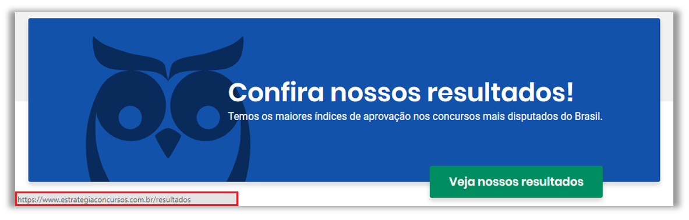

Na imagem, ao pousar o cursor sobre o botão "Veja nossos resultados", a Barra de Status surge na parte inferior, revelando o endereço de destino:

`https://www.estrategiaconcursos.com.br/resultados`.

Essa verificação prévia é uma prática de navegação segura. Ela permite que o usuário confirme se o link realmente leva para o destino esperado, ajudando a identificar links suspeitos ou enganosos que poderiam redirecioná-lo para sites mal-intencionados.

## Funcionalidades Essenciais do Navegador

Além dos componentes visuais que formam sua estrutura, os navegadores são equipados com um robusto conjunto de funcionalidades projetadas para otimizar, personalizar e tornar mais produtiva a nossa interação com a web. A seguir, vamos analisar uma das mais básicas e úteis dessas ferramentas: a configuração de uma página inicial.

### Página Inicial e de Inicialização

A **Página Inicial** é o endereço web que o navegador abre quando o usuário clica no ícone de "casa" (popularmente conhecido como "casinha"), geralmente localizado na barra de navegação. Trata-se de um atalho configurável que serve como um ponto de partida ou um "porto seguro" para o qual se pode retornar rapidamente a qualquer momento.

Contudo, é importante fazer uma distinção que alguns navegadores, como o Google Chrome e o Microsoft Edge, estabelecem entre dois conceitos parecidos:

1. **Página Inicial:** Refere-se exclusivamente à página (sempre única) que é carregada ao se clicar no **ícone da casa**. Por exemplo, um usuário pode definir seu portal de notícias preferido como a página inicial para acessá-lo rapidamente com um clique.
2. **Página de Inicialização:** Refere-se à(s) página(s) que são carregadas **automaticamente toda vez que o navegador é aberto**. Esta opção é mais flexível, permitindo que o usuário configure um conjunto de várias páginas que serão abertas simultaneamente, cada uma em sua própria aba.

Essa segunda funcionalidade é extremamente útil para otimizar rotinas de trabalho ou estudo. Um estudante, por exemplo, pode configurar sua página de inicialização para abrir automaticamente o portal da universidade, seu e-mail acadêmico e a biblioteca virtual. Da mesma forma, um profissional pode iniciar seu dia de trabalho com o navegador já abrindo o sistema da empresa, a ferramenta de gestão de projetos e seu calendário.

A imagem a seguir destaca o ícone da "casinha" nos principais navegadores, que é o atalho universal para acessar a **Página Inicial**.

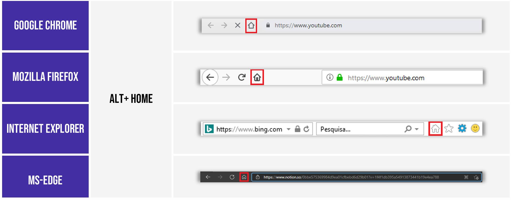

Além do clique no ícone, a maioria dos navegadores também oferece um atalho de teclado para retornar à página inicial: **ALT + Home**. Essa combinação de teclas executa a mesma ação do botão "casinha", oferecendo uma alternativa rápida para a navegação. A configuração de qual site será a sua página inicial ou de inicialização é feita no menu de "Configurações" ou "Opções" do navegador.

### Gerenciador de Downloads

Uma das atividades mais comuns na internet é a de salvar arquivos em nosso computador ou dispositivo, um processo conhecido como **download**. Seja para baixar uma videoaula, um documento em PDF, um programa de instalação ou uma imagem, os navegadores vêm equipados com uma ferramenta integrada para gerenciar essas transferências: o **Gerenciador de Downloads**.

Quando se clica em um link para baixar um arquivo, o navegador inicia o processo e, por padrão, salva o arquivo em uma pasta pré-definida no sistema. Essa localização pode ser alterada nas configurações do navegador, mas os locais padrão são:

- **No Windows:** `C:\Usuários\<Nome do Usuário>\Downloads`
- **No Linux:** `/home/<nome do usuário>/Downloads`
- **No macOS:** `/Users/<nome do usuário>/Downloads`

#### Acessando e Gerenciando seus Downloads

Para visualizar e interagir com os arquivos que estão sendo baixados ou que já foram transferidos, os navegadores oferecem uma tela ou painel de gerenciamento. O acesso a essa área é padronizado na grande maioria dos navegadores através de um atalho de teclado universal: **Ctrl + J**.

|Navegador|Atalho|Descrição|
|---|---|---|
|Google Chrome|Ctrl + J|Acessa a página com o histórico de arquivos baixados.|
|Mozilla Firefox|Ctrl + J|Abre o painel com o histórico de arquivos baixados.|
|Internet Explorer|Ctrl + J|Abre a janela de exibição de downloads.|
|Microsoft Edge|Ctrl + J|Acessa a página com o histórico de arquivos baixados.|

Dentro dessa interface de gerenciamento, o usuário pode realizar uma série de ações que lhe dão total controle sobre as transferências de arquivos:

- **Visualizar o Histórico:** Acessar uma lista completa de todos os downloads realizados, incluindo os que foram concluídos com sucesso, os que falharam e os que foram cancelados.
- **Pausar e Retomar:** Em caso de downloads de arquivos grandes, é possível pausar a transferência temporariamente e retomá-la mais tarde, um recurso muito útil em conexões instáveis (desde que o servidor de origem suporte essa funcionalidade).
- **Cancelar:** Interromper um download em andamento, seja por ter sido iniciado por engano ou por não ser mais necessário.
- **Abrir Arquivo ou Pasta:** A maioria dos gerenciadores oferece atalhos para abrir o arquivo baixado diretamente com o programa associado ou para abrir a pasta onde o arquivo foi salvo no computador, facilitando sua localização.
- **Tentar Novamente:** Caso um download falhe por problemas de conexão, é possível solicitar que o navegador tente baixar o arquivo novamente.

#### Uma Nota Sobre Segurança

Os navegadores modernos integram mecanismos de segurança ao gerenciador de downloads. Eles podem analisar os arquivos durante e após a transferência, verificando se são conhecidos por conterem software mal-intencionado (malware) ou vírus. Caso um arquivo seja considerado suspeito, o navegador exibirá um alerta, dando ao usuário a opção de descartá-lo. É uma prática de segurança fundamental sempre desconfiar de downloads de fontes não conhecidas ou não confiáveis.

