# Capítulo 2 – Ferramentas de Busca e Pesquisa

Em uma era não muito distante, o conhecimento era frequentemente medido pela capacidade de memorização. Uma pessoa considerada "culta" era aquela que conseguia recitar de cor as capitais de todos os países, as datas de eventos históricos importantes ou os nomes das luas de Júpiter. Esse tipo de saber enciclopédico, embora impressionante, perdeu grande parte de seu protagonismo no mundo contemporâneo. A razão para essa mudança é simples e poderosa: o acesso quase instantâneo à informação.

Hoje, para descobrir o nome da maior lua de Júpiter (Ganimedes, a propósito), não é mais necessário ter memorizado essa informação. Basta um minuto em um site de busca ou um simples comando de voz para um assistente digital em nosso smartphone (como a Siri, o Google Assistente ou a Cortana) para obter a resposta. Essa onipresença da informação redefiniu o que significa "saber". A habilidade mais valiosa deixou de ser a de _reter_ fatos e passou a ser a de _encontrar_ informações de forma rápida, crítica e eficiente.

## A Habilidade Essencial de Saber Pesquisar

A mensagem central para o profissional e o estudante do século XXI é clara: hoje, vale mais uma pessoa que sabe formular a pergunta certa e fazer uma pesquisa certeira em uma ferramenta de busca do que uma pessoa que simplesmente possui diversos conhecimentos memorizados. É essa competência que nos permite resolver problemas, aprender coisas novas e nos manter atualizados em um mundo em constante mudança.

As principais ferramentas para essa tarefa são os **mecanismos de busca** ou **ferramentas de busca**, sites projetados para vasculhar a imensidão da World Wide Web e nos trazer as respostas mais relevantes para nossas perguntas.

Existem diversos mecanismos de busca disponíveis, cada um com seus próprios algoritmos e características. Entre os mais utilizados globalmente, podemos destacar o **Google**, o **Microsoft Bing**, o **Yahoo!**, o **Yandex** (popular na Rússia), o **Baidu** (dominante na China) e o **DuckDuckGo** (com foco em privacidade).

Apesar da variedade de opções, o mercado de buscas é um dos mais concentrados do mundo digital, com um domínio avassalador do Google.

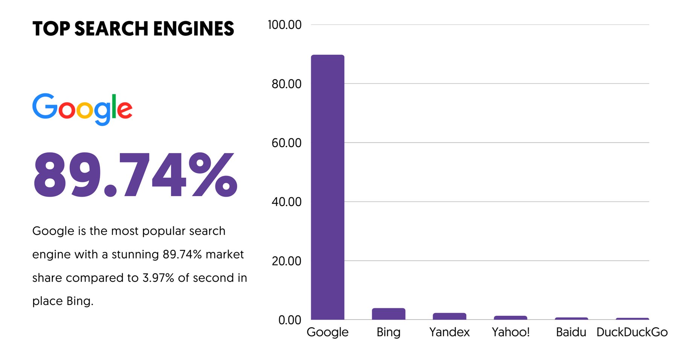

Como o gráfico ilustra, o Google detém uma fatia de mercado de aproximadamente 90%, o que o torna a porta de entrada para a internet para a esmagadora maioria dos usuários. Essa liderança faz com que suas ferramentas e métodos de pesquisa se tornem o padrão de fato para a indústria.

Para ilustrar o poder de uma busca bem-feita, o próprio processo de encontrar a informação acima serve como um exemplo prático. Ao realizar uma pesquisa com os termos em inglês "market share google" ("fatia de mercado do google"), o buscador rapidamente retorna resultados precisos de fontes especializadas no assunto.

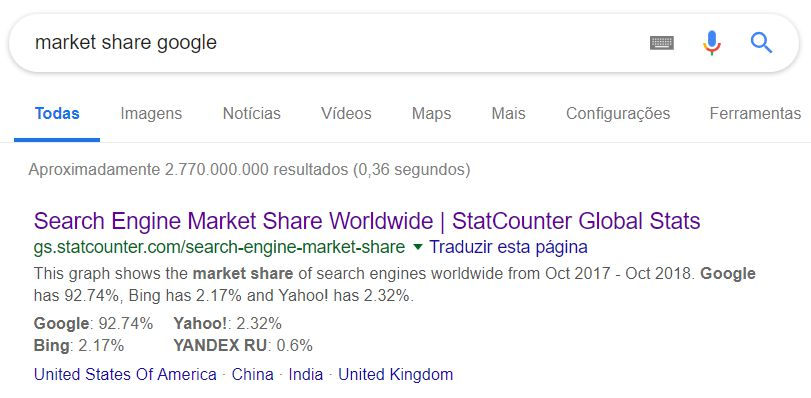

Este exemplo demonstra a tese deste capítulo em ação: saber quais palavras-chave utilizar para encontrar uma informação confiável é uma habilidade poderosa.

Dado o domínio do Google e o fato de que a maioria dos mecanismos de busca opera de forma semelhante do ponto de vista do usuário, utilizaremos o Google como nosso modelo padrão para o estudo das técnicas de busca e pesquisa. Para começar, vamos entender o que é, de fato, o Google.

## Google: O Gigante da Busca

O Google é mais do que uma empresa ou um site; é um verbo, um sinônimo para a ação de pesquisar na internet. Para entender como ele se tornou essa força cultural e tecnológica, é preciso voltar à sua origem. O Google nasceu como um projeto de pesquisa acadêmica em 1996, na Universidade de Stanford, desenvolvido por dois estudantes de doutorado, Larry Page e Sergey Brin.

Inicialmente batizado de "BackRub", o projeto tinha como objetivo criar um sistema mais eficiente para organizar e pesquisar as páginas da crescente World Wide Web. Em 1997, o nome foi alterado para Google – uma brincadeira com o termo matemático "googol", que representa o número 1 seguido por 100 zeros, refletindo a missão de organizar a quantidade aparentemente infinita de informações na internet.

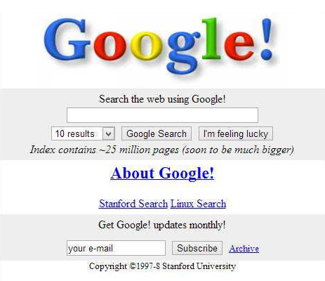

A imagem acima mostra a aparência do site em 1998. Apesar da simplicidade, um detalhe chama a atenção: a nota de que seu índice já continha "cerca de 25 milhões de páginas". Para se ter uma ideia da escala de crescimento, em 2016, esse número já ultrapassava a marca de **130 trilhões** de páginas indexadas.

### A Interface: Simplicidade como Filosofia

Desde o início, a marca registrada do Google é sua interface **extremamente limpa e minimalista**. Enquanto outros portais da época eram repletos de notícias, links e anúncios, a página inicial do Google focava em uma única tarefa: a busca. Essa filosofia de design persiste até hoje.

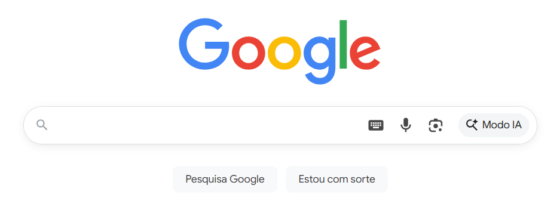

A interface atual é dominada pela barra de busca e por dois botões principais, cada um representando um modo de pesquisa distinto:

1. **Pesquisa Google:** Este é o modo padrão e mais utilizado. Ao clicar neste botão (ou simplesmente pressionar Enter), o Google processa os termos digitados e retorna uma **página de resultados** com uma lista de links, imagens, vídeos e outras informações que seu algoritmo considera mais relevantes para a busca.
2. **Estou com Sorte:** Este botão oferece um atalho para quem busca uma resposta direta. Em vez de mostrar a lista de resultados, ele leva o usuário diretamente para a página que o Google considera a **mais relevante** de todas – ou seja, o primeiro resultado da busca padrão. A ideia é que, para buscas muito específicas (como "site oficial da Receita Federal"), o usuário "tenha sorte" e chegue ao destino correto na primeira tentativa, economizando tempo.

### Filtrando os Resultados: As Guias de Pesquisa

Após realizar uma busca no modo padrão, o Google exibe uma página de resultados que mistura diferentes tipos de conteúdo. Para refinar essa busca, o usuário pode utilizar as **guias de pesquisa**, localizadas logo abaixo da barra de busca.

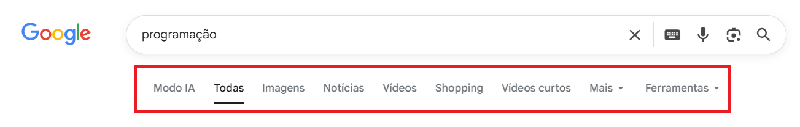

Cada guia funciona como um filtro poderoso, restringindo os resultados a um tipo específico de conteúdo:

- **Todas:** A visualização padrão, que mistura links, vídeos, notícias e outros resultados.
- **Imagens:** Exibe apenas resultados de imagens, ideal para encontrar fotos, ilustrações ou gráficos.
- **Notícias:** Filtra os resultados para mostrar apenas artigos de portais de notícias.
- **Vídeos:** Mostra apenas resultados de vídeos, provenientes de plataformas como YouTube, Vimeo, etc.
- **Shopping:** Exibe produtos à venda em diversas lojas online, com preços e comparações.
- **Mais (Livros, Voos, Finanças):** Um menu que agrupa outros buscadores especializados do Google.

Saber utilizar essas guias é o primeiro passo para transformar uma busca genérica em uma pesquisa muito mais focada e eficiente.

### Refinando a Busca: Ferramentas Avançadas e Filtros de Conteúdo

Uma busca simples, com uma ou duas palavras-chave, geralmente é o suficiente para encontrar o que procuramos. No entanto, para pesquisas mais complexas ou específicas, o Google oferece um arsenal de ferramentas que permitem refinar e filtrar os resultados com alta precisão. Vamos explorar as duas principais abordagens: a interface de Pesquisa Avançada e o filtro de segurança SafeSearch.

#### Interface de Pesquisa Avançada

Para usuários que desejam aplicar múltiplos filtros a uma busca sem precisar memorizar operadores de texto complexos, o Google oferece a página de **Pesquisa Avançada**. Ela funciona como um formulário detalhado que traduz suas seleções em uma busca poderosa e específica.

Para acessá-la, basta realizar uma busca inicial, clicar na opção **"Ferramentas"** (localizada abaixo da barra de busca) e, em seguida, selecionar **"Pesquisa avançada"**.

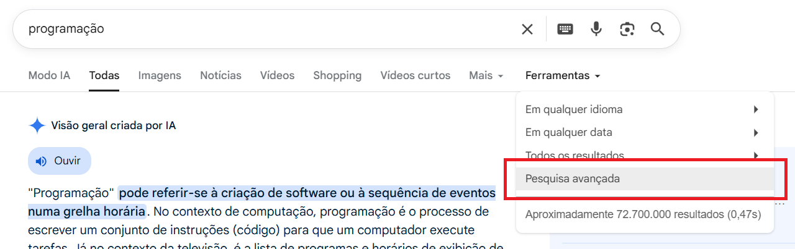

Uma vez na página, o usuário encontrará uma série de campos para detalhar sua pesquisa.

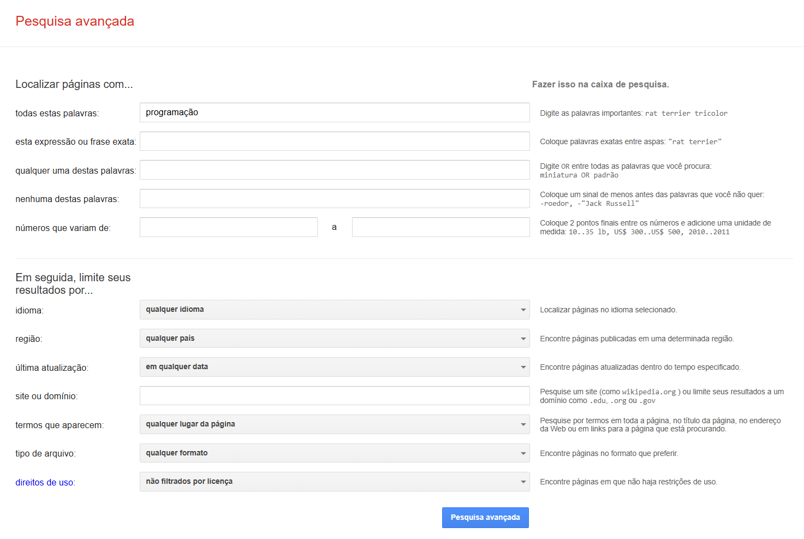

Os principais campos de refinamento de palavras são:

- **todas estas palavras:** A busca padrão, que procura por páginas que contenham todas as palavras digitadas.
- **esta expressão ou frase exata:** Equivalente a colocar a busca entre aspas (`""`), procurando pela frase exata.
- **qualquer uma destas palavras:** Equivalente a usar o operador `OR`, buscando páginas que contenham ao menos uma das palavras listadas.
- **nenhuma destas palavras:** Equivalente a usar o sinal de menos (`-`), para excluir termos dos resultados.

Além disso, a página permite aplicar filtros poderosos, como:

- **idioma e região:** Para encontrar páginas em uma língua ou país específico.
- **última atualização:** Para filtrar resultados por data (última hora, 24 horas, último ano, etc.).
- **site ou domínio:** Para restringir a busca a um site específico (ex: `wikipedia.org`) ou a um tipo de domínio (ex: `.gov.br` para sites do governo).
- **tipo de arquivo:** Um recurso extremamente útil para encontrar documentos específicos, como apresentações (`ppt`), planilhas (`xls`) ou, mais comumente, arquivos **PDF**.

Existe também uma página de **Pesquisa de imagens avançada**, com filtros específicos para o conteúdo visual, como tamanho, cor, tipo de imagem (rosto, foto, clipart) e, crucialmente, **direitos de uso**, que permite encontrar imagens que podem ser legalmente reutilizadas.

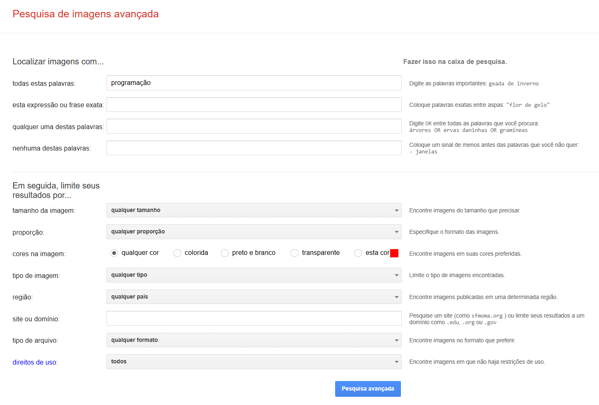

#### Segurança e Controle de Conteúdo: SafeSearch

O **SafeSearch** é a ferramenta do Google projetada para gerenciar e filtrar conteúdo sexualmente explícito, violento ou adulto dos resultados da pesquisa. É um recurso essencial para o uso em ambientes de trabalho, escolas ou por famílias com crianças.

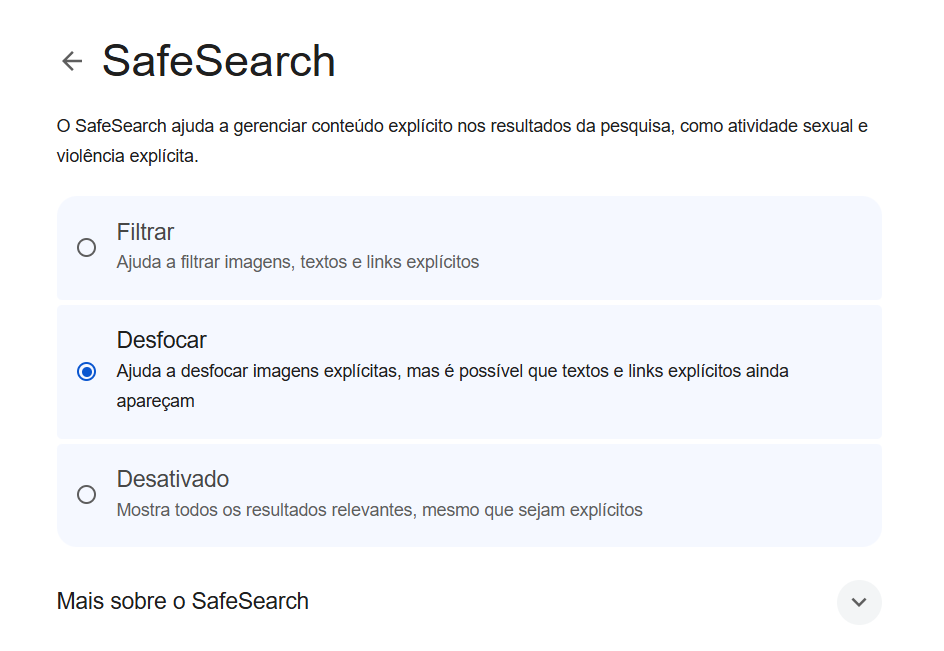

O SafeSearch pode ser configurado em três níveis:

1. **Filtrar:** A opção mais restritiva. Ajuda a filtrar imagens, textos e links explícitos.
2. **Desfocar:** A opção padrão para muitos usuários. Ajuda a desfocar imagens explícitas, mas textos e links ainda podem aparecer nos resultados.
3. **Desativado:** Mostra todos os resultados mais relevantes para a pesquisa, mesmo que sejam explícitos.

É fundamental compreender que o SafeSearch **só funciona nos resultados da pesquisa do Google**. Ele não é um filtro de conteúdo para a internet como um todo e não impede o acesso a conteúdo explícito através de outros buscadores ou pela navegação direta a um site.

### Além do Google: Buscadores Verticais e Concorrentes

Ainda que o Google seja um buscador **horizontal** – que pesquisa sobre todos os tipos de temas –, existem também os buscadores **verticais**, que são especializados em um nicho específico. Sites como o _Buscapé_ (que pesquisa preços de produtos), o _iCarros_ (que pesquisa veículos) ou o _Google Acadêmico_ (que pesquisa artigos científicos) são exemplos de buscadores verticais.

Por fim, é importante saber que o **Microsoft Bing** é o principal concorrente do Google. Ambas as tecnologias são extremamente similares, e a maioria das técnicas e operadores de busca funcionam de forma idêntica nos dois serviços. Por padrão, tanto o Google quanto o Bing utilizam o operador **E (AND)** implicitamente entre os termos de uma busca, significando que, ao pesquisar por `concurso público federal`, ambos buscarão por páginas que contenham as três palavras.

## Por Trás da Magia: Como a Busca Funciona

Como uma ferramenta de busca consegue vasculhar trilhões de páginas na internet e entregar uma resposta relevante em uma fração de segundo? O processo, embora extremamente complexo, pode ser compreendido em três grandes etapas: rastreamento, indexação e classificação.

### Rastreamento (_Crawling_): Descobrindo a Web

A World Wide Web pode ser comparada a uma biblioteca pública de tamanho infinito, que não para de crescer, com bilhões de livros sendo adicionados a todo momento e sem um sistema de catálogo central. Para descobrir o que existe nessa biblioteca, o Google utiliza um exército de robôs de software, conhecidos como **rastreadores** (_crawlers_ ou _spiders_).

Esses rastreadores são programas automatizados que navegam pela web de forma autônoma. Eles começam com uma lista de páginas conhecidas e, a partir delas, seguem cada link que encontram, saltando de página em página, 24 horas por dia. Ao fazer isso, eles descobrem novas páginas, atualizações em páginas existentes e links quebrados, trazendo constantemente dados sobre o que encontram de volta para os servidores do Google.

### Indexação (_Indexing_): Organizando a Biblioteca

Apenas descobrir as páginas não é o suficiente. Para que a busca seja rápida, essa imensa quantidade de informação precisa ser organizada. É aqui que entra a etapa de **indexação**.

Quando um rastreador encontra uma página, os sistemas do Google analisam seu conteúdo, identificando sinais importantes como as palavras-chave presentes no texto, o título, a data de publicação, se a página contém imagens ou vídeos, entre centenas de outros fatores. Todas essas informações são então catalogadas em um gigantesco banco de dados chamado **Índice da Pesquisa** (_Search Index_).

Esse índice funciona de maneira análoga ao índice remissivo no final de um livro. Para cada palavra encontrada em uma página, o índice cria uma entrada, apontando para todas as páginas que contêm aquela palavra. Com centenas de bilhões de páginas e mais de cem milhões de gigabytes de tamanho, este índice é uma das estruturas de dados mais complexas do mundo.

É fundamental entender este ponto: quando você faz uma busca, o Google **não está pesquisando na internet em tempo real**. Ele está pesquisando neste índice pré-organizado, o que explica a velocidade impressionante com que os resultados são retornados.

### Classificação (_Ranking_): Encontrando a Melhor Resposta

Uma vez que o Google encontra no índice todas as páginas que correspondem às palavras da sua busca, o desafio final é decidir qual delas mostrar primeiro. Essa é a etapa de **classificação**, realizada por uma complexa série de **algoritmos de pesquisa**.

Esses algoritmos analisam sua consulta e as páginas no índice para determinar a relevância de cada resultado. Eles levam em conta centenas de fatores, como a reputação do site, a qualidade do conteúdo, a localização e o idioma do usuário e, crucialmente, o contexto da busca.

Um dos aspectos mais sofisticados desses algoritmos é a **análise semântica das palavras**. Eles são capazes de compreender que uma mesma palavra pode ter significados completamente diferentes dependendo do contexto.

Como a imagem ilustra, o algoritmo entende que a palavra "trocar" na busca "Como **trocar** uma lâmpada" significa _substituir_, em "Os correios **trocam** moeda" significa _permutar_, e em "Vou me **trocar**" significa _vestir-se_. Essa capacidade de interpretar a **intenção** do usuário, e não apenas as palavras-chave, é o que permite ao Google entregar resultados cada vez mais úteis e precisos, organizados no formato mais adequado para cada tipo de pesquisa.

### A Busca por Respostas, Não Apenas Links

Larry Page, um dos cofundadores do Google, uma vez descreveu o mecanismo de pesquisa perfeito como algo que "entende exatamente o que você quer e retorna exatamente o que você precisa". Essa filosofia é o motor por trás da constante evolução do Google: a busca por fornecer respostas rápidas e úteis, apresentadas no formato mais prático para o usuário.

A experiência mostrou que, na maioria das vezes, os usuários não querem apenas uma lista de sites para explorar; eles querem a resposta para sua pergunta.

- Ao pesquisar sobre o **clima**, o ideal é ver a previsão do tempo diretamente na página de resultados, e não ter que clicar em um link para outro site.
- Ao pesquisar por rotas, como "Como chegar ao Aeroporto Castro Pinto", a expectativa é receber um mapa interativo com o trajeto, e não apenas uma lista de sites de mapas.

Essa necessidade de respostas diretas é ainda mais crucial em dispositivos móveis, onde as telas são menores e a conexão de dados pode ser mais lenta, tornando a navegação entre múltiplos sites uma tarefa menos eficiente. Para atender a essa demanda, o Google integrou diretamente em sua página de resultados uma série de "caixas de resposta", como painéis de conhecimento, previsões do tempo e calculadoras.

#### Adaptando-se a uma Web em Constante Mudança

O desafio de fornecer a melhor resposta é amplificado pela natureza da própria web, um universo de informações que está em permanente expansão, com centenas de novas páginas sendo publicadas a cada segundo. Para se manter relevante, o Google precisa rastrear e indexar esse novo conteúdo de forma contínua.

Isso significa que os algoritmos de classificação precisam ser inteligentes o suficiente para entender a natureza de cada busca e a temporalidade da informação necessária:

- **Resultados Dinâmicos:** Para uma pesquisa sobre o placar de um jogo de futebol em andamento, os resultados precisam ser atualizados em tempo real, a cada minuto ou segundo.
- **Resultados Estáveis:** Por outro lado, para uma pesquisa sobre uma figura histórica, como "quem foi João Pessoa", a informação principal tende a permanecer a mesma por anos.

O Google processa trilhões de pesquisas a cada ano e, surpreendentemente, **cerca de 15% das buscas realizadas a cada dia são completamente inéditas**, ou seja, nunca foram feitas por ninguém antes. Criar algoritmos capazes de entender e encontrar os melhores resultados para esse volume massivo e essa constante novidade de consultas é um desafio monumental, que exige investimentos contínuos em pesquisa, desenvolvimento e testes de qualidade.

## Recursos Avançados e Princípios de Classificação

Além da busca simples, o Google oferece recursos e opera sob princípios que aprimoram a experiência do usuário e determinam a ordem em que os resultados são exibidos. Compreender esses elementos nos ajuda a pesquisar de forma mais crítica e a entender por que vemos o que vemos.

### O "Cache" do Google: Uma Viagem ao Passado da Web (Recurso Descontinuado)

Por muitos anos, o Google ofereceu uma funcionalidade chamada "Cache". Tratava-se de uma cópia de uma página da web, armazenada nos servidores do Google no momento em que seus rastreadores a visitaram. Esse recurso era extremamente útil por permitir que os usuários acessassem uma versão "salva" de uma página, mesmo que o site original estivesse temporariamente fora do ar.

Além disso, a função de cache permitia fazer uma verdadeira viagem no tempo, visualizando como um site era em uma data anterior. A imagem a seguir, por exemplo, é uma captura da página do Estratégia Concursos em 2012, resgatada através de ferramentas de arquivamento da web.

É importante destacar que, no início de 2024, o Google **descontinuou oficialmente** a funcionalidade de link para a versão em cache diretamente nos resultados da pesquisa. Para quem ainda deseja explorar o passado da web, a principal alternativa hoje é o **Internet Archive**, através de sua ferramenta "Wayback Machine" (`archive.org`).

### Omissão de Resultados Semelhantes

Ao realizar uma busca, o objetivo do Google é apresentar os resultados mais relevantes e diversificados possíveis. Para evitar a redundância e tornar a experiência mais eficiente, o mecanismo pode **omitir resultados que considera muito semelhantes** aos que já foram exibidos.

Isso é comum em pesquisas que retornam muitas páginas com conteúdo repetido ou muito parecido. Ao final da página de resultados, o Google geralmente exibe uma mensagem informando sobre a omissão.

O usuário, no entanto, mantém o controle total. Caso deseje realizar uma pesquisa exaustiva e ver absolutamente todos os resultados encontrados, basta clicar no link oferecido para "repetir a pesquisa incluindo os resultados omitidos". Essa funcionalidade, embora simples, já foi objeto de questões em concursos públicos.

### PageRank e SEO: Classificação de Resultados

A ordem em que os resultados aparecem não é aleatória. Ela é determinada por algoritmos complexos, e um dos conceitos fundadores dessa classificação é o **PageRank**.

#### PageRank

O PageRank foi o algoritmo original criado por Larry Page e Sergey Brin para medir a **importância e a relevância** de uma página. Sua lógica é baseada na quantidade e, principalmente, na **qualidade** dos links que apontam para ela. Na prática, um link de um site para outro funciona como um "voto de confiança". Quanto mais "votos" uma página recebe de outros sites importantes e confiáveis, maior é a sua pontuação de PageRank e, consequentemente, maior a sua chance de aparecer em uma boa posição nos resultados.

Embora o PageRank hoje seja apenas um entre centenas de outros fatores que os algoritmos do Google utilizam, o princípio de autoridade baseado em links continua sendo um pilar da classificação.

#### SEO (_Search Engine Optimization_)

**SEO**, ou Otimização para Mecanismos de Busca, é o conjunto de técnicas aplicadas a um site com o objetivo de melhorar sua visibilidade e posicionamento nos **resultados orgânicos** (não pagos) do Google e de outros buscadores.

A importância do SEO é imensa, pois a maioria do tráfego da internet se origina de buscas. Um site bem otimizado tem mais chances de aparecer nas primeiras posições para as pesquisas relevantes ao seu negócio ou conteúdo, atraindo mais visitantes. O processo de SEO envolve diversas etapas, sendo a **pesquisa de palavras-chave** uma das mais fundamentais.

Essa pesquisa consiste em identificar os termos e as frases que o público-alvo utiliza ao procurar por informações, produtos ou serviços. Ferramentas profissionais como o Google Keyword Planner, SEMrush e Ahrefs ajudam a analisar dois fatores cruciais:

- **Volume de busca:** Quantas vezes um termo é pesquisado.
- **Relevância:** O quanto o termo está alinhado ao conteúdo do site.

O desafio é encontrar um equilíbrio, focando em palavras-chave que tenham um volume de busca significativo e, ao mesmo tempo, uma alta relevância para atrair o público certo.

## Operadores de Busca

Dominar a arte da pesquisa vai além de simplesmente digitar palavras em uma caixa de busca. Os mecanismos de busca, como o Google, oferecem um conjunto de **operadores** – símbolos ou palavras especiais – que funcionam como comandos para refinar e direcionar sua pesquisa, permitindo encontrar resultados muito mais precisos.

> **Ponto de Atenção:** É importante notar que a eficácia desses operadores pode variar. Os mecanismos de busca utilizam algoritmos complexos de "melhor esforço" e, dependendo de como as páginas da web estão estruturadas, nem todos os operadores funcionarão perfeitamente em 100% das vezes. Além disso, eles geralmente se aplicam aos resultados orgânicos, podendo não afetar os links patrocinados.

Vamos começar com o operador mais fundamental e um dos mais úteis.

### Busca por Frase Exata com Aspas ("")

Por padrão, quando se digita uma sequência de palavras em um buscador, ele procura por páginas que contenham aquelas palavras, mas não necessariamente na ordem exata em que foram digitadas. Por exemplo, ao pesquisar por `brasília cambalhota vampeta`, o Google retornará páginas que mencionem os três termos, mesmo que de forma separada no texto.

Para forçar o buscador a procurar por uma correspondência exata de uma frase, utiliza-se o operador de **aspas duplas ("")**.

|Operador|Utilização|Exemplo|
|---|---|---|
|**`"frase"`**|Pesquisa pela frase ou expressão exata, na ordem em que foi digitada.|`"prédio mais alto do mundo"`|

Ao colocar os termos de busca entre aspas, o mecanismo entende que deve encontrar apenas as páginas que contenham aquela sequência exata de palavras. Assim, a busca por `"cambalhota do Vampeta em Brasília"` trará resultados muito mais específicos e relevantes para o evento em questão.

Este operador é extremamente útil em diversas situações:

- **Encontrar a fonte de uma citação:** Para descobrir o autor de uma frase específica.
- **Pesquisar letras de música:** Quando se lembra apenas de um trecho exato da canção.
- **Localizar questões de prova:** Para encontrar o enunciado exato de uma questão de concurso, como ela foi originalmente publicada.

É importante saber que a busca por frase exata **ignora letras maiúsculas/minúsculas e a maioria dos sinais de pontuação** dentro das aspas. Como resultado dessa maior especificidade, uma pesquisa utilizando aspas quase sempre retornará um número significativamente menor de resultados do que a mesma pesquisa sem elas.

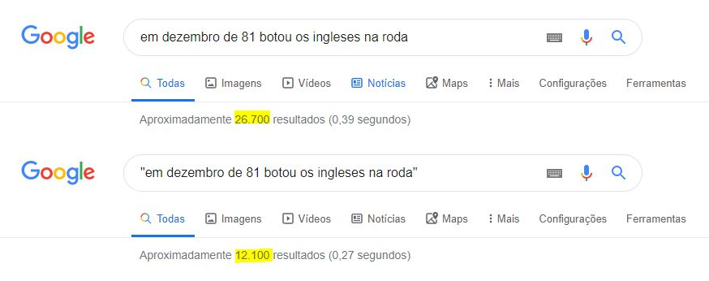

### Exclusão de Palavras com o Hífen (-)

Muitas vezes, nossas palavras de busca podem ser ambíguas, ou seja, ter múltiplos significados. Isso pode poluir nossos resultados com informações que não são relevantes para nossa intenção de pesquisa. Para resolver esse problema, o Google oferece o operador de **hífen (-)**, que funciona como um comando de exclusão.

Ao colocar um hífen imediatamente antes de uma palavra (sem espaços), estamos instruindo o mecanismo de busca a remover de nossos resultados todas as páginas que contenham aquele termo específico.

|Operador|Utilização|Exemplo|
|---|---|---|
|**`-palavra`**|Exclui de um resultado de pesquisa todas as páginas que contenham a palavra especificada.|`velocidade do jaguar -carro`|

Vamos analisar um exemplo clássico de palavra com múltiplos significados: **Prisma**. Uma busca simples por esse termo pode retornar resultados sobre o objeto geométrico, sobre a refração da luz, ou, mais provavelmente, sobre o popular modelo de carro da Chevrolet.

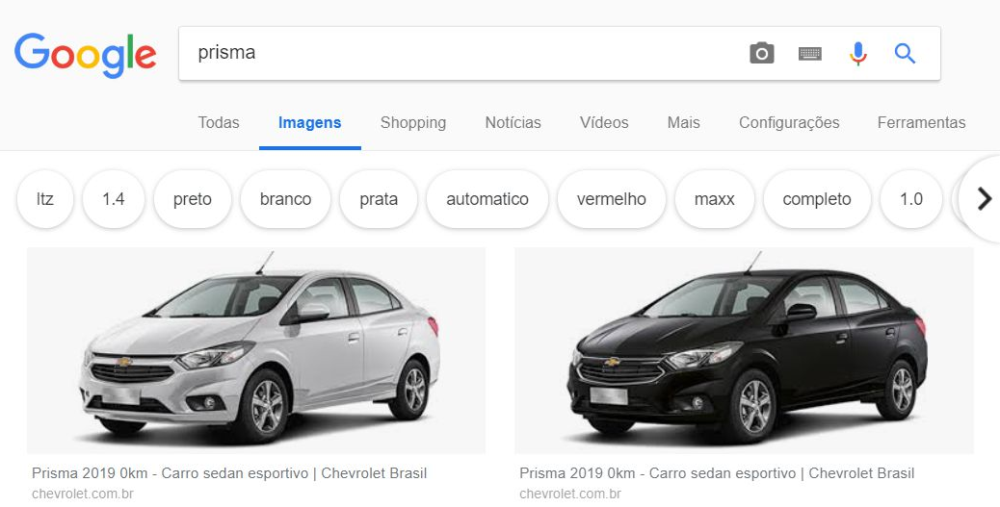

Se a intenção era pesquisar pelo objeto óptico, os resultados acima não são úteis. É aqui que o operador de exclusão se torna essencial. Ao refinar a busca para **`prisma -carro -chevrolet`**, estamos dando um comando claro ao Google: "Procure por 'prisma', mas ignore todas as páginas que também mencionem as palavras 'carro' ou 'chevrolet'".

O resultado é uma lista de imagens e sites dramaticamente mais precisa e alinhada com a intenção original da pesquisa.

Este operador é útil em inúmeras situações:

- **Buscas Técnicas:** Ao pesquisar sobre a linguagem de programação `Python`, pode-se usar `python -monty` para excluir referências ao grupo de comédia Monty Python.
- **Pesquisa de Produtos:** Para encontrar um produto novo, pode-se usar `notebook dell -usado` para remover resultados de sites de classificados.
- **Buscas Gerais:** Ao procurar por receitas, `receita de torta -doce` pode ajudar a encontrar apenas opções de tortas salgadas.

### Buscas em Redes Sociais com Arroba (@) e Hashtag (#)

Com a crescente importância das redes sociais como fonte de informação e debate, os mecanismos de busca integraram operadores específicos para facilitar a descoberta de perfis e tópicos populares nessas plataformas.

#### Buscando Perfis e Menções com a Arroba (@)

O símbolo da **arroba (@)** é o padrão universal nas redes sociais para identificar um nome de usuário ou perfil. Ao utilizar este operador no Google, a busca é direcionada para encontrar perfis e menções em plataformas como X (antigo Twitter), Instagram, Facebook, entre outras.

|Operador|Utilização|Exemplo|
|---|---|---|
|**`@perfil`**|Permite buscar perfis e menções em redes sociais.|`@professordiegocarvalho`|

Ao pesquisar por `@professordiegocarvalho`, por exemplo, o Google priorizará em seus resultados os links diretos para os perfis sociais associados a esse nome de usuário, tornando mais fácil encontrar a presença digital de uma pessoa ou marca específica.

#### Acompanhando Tópicos com a Hashtag (#)

A **hashtag (#)**, ou cerquilha, é utilizada para agrupar e categorizar publicações em torno de um mesmo tema, evento ou movimento. Usar este operador no Google permite encontrar conversas e conteúdos de diversas redes sociais que foram marcados com aquela etiqueta específica.

|Operador|Utilização|Exemplo|
|---|---|---|
|**`#tópico`**|Permite pesquisar por hashtags em diversas redes sociais.|`#DesafioDoBaldeDeGelo`|

Diferente da busca com `@`, que foca em encontrar _pessoas_ ou _perfis_, a busca com `#` foca em encontrar _conversas_ ou _tópicos_. Uma pesquisa por `#DesafioDoBaldeDeGelo` (o famoso "Ice Bucket Challenge"), por exemplo, retornará uma mistura de notícias, vídeos e publicações de redes sociais que participaram ou cobriram essa campanha viral.

Este operador é especialmente útil para acompanhar:

- **Eventos ao vivo:** Como `#Olimpíadas` ou `#RockInRio`.
- **Movimentos sociais:** Como `#VidasNegrasImportam`.
- **Comunidades de fãs:** Como `#StarWars` ou discussões sobre programas de TV.

### Preenchendo as Lacunas com Asterisco (\*)

Em muitas situações, sabemos parte do que queremos pesquisar, mas nos falta uma palavra ou uma frase específica. Para esses casos, o Google oferece um poderoso **operador curinga**: o **asterisco (\*)**. Ele funciona como um espaço em branco que o mecanismo de busca se encarrega de preencher, substituindo uma ou mais palavras desconhecidas em uma consulta.

| Operador | Utilização                                                                                    | Exemplo             |
| -------- | --------------------------------------------------------------------------------------------- | ------------------- |
| **`*`**  | Funciona como um caractere curinga, substituindo uma ou mais palavras desconhecidas na busca. | `maior * do Brasil` |

Ao pesquisar por `maior * do Brasil`, estamos essencialmente fazendo uma pergunta aberta ao Google: "O que existe que se encaixa no padrão 'maior [qualquer coisa] do Brasil'?". O buscador, então, retorna uma variedade de resultados que preenchem essa lacuna, como "maior torcida do Brasil", "maior cidade do Brasil", "maior prédio do Brasil", entre outros.

Uma das utilizações mais populares e eficazes do operador curinga é para encontrar letras de música quando não nos lembramos de um trecho específico. Ao combinar o asterisco com o operador de aspas, podemos buscar pela parte que conhecemos e deixar que o Google descubra a parte que falta.

Por exemplo, para descobrir a palavra que falta no famoso trecho da música "Melô do Marinheiro", dos Paralamas do Sucesso, pode-se pesquisar: `"Entrei de * no navio"`.

Da mesma forma, o asterisco é perfeito para corrigir letras de música que cantamos errado por anos. Para descobrir o que realmente é dito no famoso trecho da música "Como uma Onda", de Lulu Santos, a busca `"Na madrugada rolando um blues * sem parar"` rapidamente revelaria que o correto é "...**tocando B. B. King** sem parar", e não "...trocando de biquini sem parar".

Outros usos práticos incluem:

- **Completar citações ou provérbios:** `“Mais vale um pássaro na mão do que *”`.
- **Pesquisas abertas por produtos:** `capa de celular para iphone 15 *`, onde o asterisco pode ser preenchido com "transparente", "anti-impacto", "de couro", etc.

### Ampliando e Combinando Buscas com OR

Enquanto o operador de hífen (-) serve para restringir uma busca, o operador **`OR`** (que significa "OU" em inglês) serve para **ampliá-la**. Por padrão, o Google busca por páginas que contenham todos os termos digitados (um "E" implícito). O operador `OR` modifica essa lógica, instruindo o buscador a encontrar páginas que contenham _pelo menos um_ dos termos especificados.

É crucial notar que, para ser reconhecido como um operador, o termo **`OR`** deve ser escrito em letras **maiúsculas**.

| Operador | Utilização                                                                  | Exemplo               |
| -------- | --------------------------------------------------------------------------- | --------------------- |
| **`OR`** | Combina buscas, retornando resultados que contenham qualquer um dos termos. | `maratona OR corrida` |

Ao pesquisar por `maratona OR corrida`, os resultados incluirão páginas que falam apenas sobre maratonas, páginas que falam apenas sobre corridas em geral, e páginas que falam sobre ambos os assuntos, resultando em uma busca muito mais abrangente.

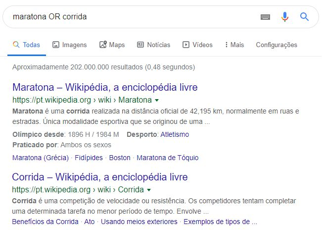

Este operador é especialmente útil para pesquisar por sinônimos ou termos relacionados simultaneamente, garantindo que nenhum resultado importante seja perdido. Por exemplo:

- **Sinônimos:** `carro OR automóvel`
- **Termos Relacionados:** `concurso OR certame`
- **Variações de Nomes:** `universidade OR faculdade`

> **Dica de Produtividade:** O caractere _pipe_ **`|`** (a barra vertical) pode ser usado como um substituto para o `OR`. A busca `maratona | corrida` produz exatamente o mesmo resultado de `maratona OR corrida`, mas é mais rápido de digitar.

### Pesquisando Dentro de um Site Específico com "site:"

Frequentemente, sabemos que a informação que procuramos está em um site específico, mas a ferramenta de busca interna desse site pode não ser muito eficiente. Em outros casos, queremos usar o poder do algoritmo do Google, mas restringindo os resultados a apenas uma fonte confiável. Para essas situações, existe o operador **`site:`**.

Este operador instrui o Google a limitar a pesquisa a um único site ou domínio, ignorando todo o resto da internet. A sintaxe é simples, mas requer atenção a um detalhe: **não deve haver espaço** entre o comando `site:`, os dois pontos e o endereço do site.

|Operador|Utilização|Exemplo|
|---|---|---|
|**`site:nomedosite.com`**|Restringe a pesquisa a um site ou domínio específico.|`flamengo site:youtube.com`|

Vamos supor que um usuário queira encontrar todas as menções ao seu nome, "diego carvalho", mas apenas dentro do portal do Estratégia Concursos. A busca correta seria: **`diego carvalho site:estrategiaconcursos.com.br`**.

O resultado será uma lista de páginas exclusivamente do domínio `estrategiaconcursos.com.br` que contenham o termo pesquisado, como mostra a imagem.

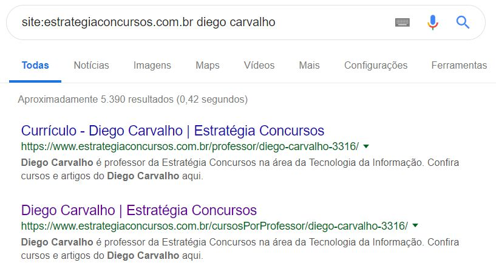

Este operador é extremamente versátil e útil em diversos cenários:

- **Pesquisas em Portais de Notícias:** Para encontrar todas as matérias sobre "inteligência artificial" publicadas apenas no portal G1, a busca seria: `inteligência artificial site:g1.globo.com`.
- **Buscas em Sites Governamentais:** Para encontrar um edital específico, pode-se usar: `"concurso público unificado" site:gov.br`. Note que o operador também funciona com domínios genéricos, como `.gov.br` (todos os sites do governo federal) ou `.edu.br` (todos os sites de instituições de ensino).
- **Encontrar Manuais ou Suporte:** Para achar o manual de um produto específico no site do fabricante: `manual liquidificador site:philips.com.br`.

Este operador também pode ser combinado com outros para criar buscas ainda mais poderosas. Por exemplo, a busca **`"edital de abertura" -retificação site:cebraspe.org.br`** procuraria pela frase exata "edital de abertura", excluindo a palavra "retificação", apenas dentro do site do Cebraspe.

### Encontrando Sites Relacionados com "related:"

Às vezes, nosso objetivo não é encontrar uma informação específica, mas sim descobrir novos sites que sejam semelhantes a um que já conhecemos e gostamos. Para essa finalidade, o Google oferece o operador **`related:`**.

Este comando instrui o buscador a encontrar e listar páginas que, segundo seu algoritmo, são relacionadas em conteúdo ou propósito ao site especificado. Ele responde à pergunta: "Quais outros sites são como este?".

|Operador|Utilização|Exemplo|
|---|---|---|
|**`related:nomedosite.com`**|Pesquisa por sites que são semelhantes a um site específico.|`related:uol.com.br`|

Ao realizar a busca `related:uol.com.br`, o Google entende que o UOL é um grande portal de notícias e conteúdo variado. Portanto, ele retornará uma lista de outros grandes portais brasileiros, como Terra, iG, entre outros.

É importante notar que a definição de "relacionado" é determinada pelo algoritmo do Google e, embora geralmente precisa, pode ocasionalmente incluir resultados inesperados. Ainda assim, é uma ferramenta extremamente útil para:

- **Pesquisa de Compras:** Ao usar `related:amazon.com.br`, pode-se descobrir outros grandes sites de e-commerce.
- **Encontrar Fontes de Notícias:** Com `related:nytimes.com`, é possível encontrar outros jornais internacionais de grande porte.
- **Pesquisa Acadêmica:** A busca por `related:scielo.br` pode revelar outras bases de dados de artigos científicos.
- **Descobrir Ferramentas Alternativas:** Ao pesquisar por `related:canva.com`, o Google pode sugerir outras ferramentas de design online.

### Acessando o Arquivo do Google com "cache:"

Como vimos anteriormente, o Google, ao rastrear a web, armazena uma "fotografia" ou uma cópia temporária da maioria das páginas que visita. Por muitos anos, um link para essa versão em **cache** ficava facilmente acessível nos resultados da pesquisa. Embora esse link tenha sido removido em 2024, ainda é possível acessar essa funcionalidade de forma direta através do operador **`cache:`**.

Este operador instrui o Google a exibir a última versão de uma página que ele armazenou em seus servidores, em vez de direcionar para a página ao vivo.

|Operador|Utilização|Exemplo|
|---|---|---|
|**`cache:enderecodosite.com`**|Permite visualizar a última versão de uma página armazenada pelo Google.|`cache:orkut.com`|

Ao realizar a busca `cache:orkut.com`, por exemplo, o navegador não tentará acessar o site do Orkut (que não existe mais em sua forma original). Em vez disso, ele exibirá a cópia que o Google salvou em uma determinada data.

No topo da página, o Google exibe uma barra de informações, como ilustrado na imagem, informando que aquela é uma versão em cache e a data em que a "fotografia" da página foi tirada. Essa barra também oferece um link para a "página atual", caso o usuário queira visitar a versão ao vivo do site.

Esta ferramenta é particularmente útil em algumas situações específicas:

- **Quando um site está fora do ar:** Se um site está temporariamente inacessível, a versão em cache pode ser a única maneira de visualizar seu conteúdo.
- **Para ver conteúdo removido:** Se uma informação foi recentemente apagada de uma página, é possível que ela ainda esteja visível na última versão em cache.
- **Para verificar mudanças:** Permite comparar a versão atual de uma página com uma versão anterior, para ver o que foi alterado.

É importante ter em mente que nem todas as páginas possuem uma versão em cache, e a data do armazenamento pode variar muito, dependendo da frequência com que o Google rastreia cada site.

### Pesquisas na URL com "inurl:"

O endereço (URL) de uma página web muitas vezes contém palavras-chave que descrevem seu conteúdo. Por exemplo, uma página sobre uma receita de bolo de fubá pode ter uma URL como `www.siteculinario.com.br/receitas/bolo-de-fuba`. O operador **`inurl:`** permite que o usuário pesquise por termos que aparecem especificamente dentro do texto da URL, em vez de no conteúdo da página.

Isso transforma o próprio endereço em um critério de busca, permitindo um filtro muito preciso.

|Operador|Utilização|Exemplo|
|---|---|---|
|**`inurl:palavra`**|Pesquisa por páginas que contenham uma palavra específica em sua URL.|`inurl:stn`|

A busca `inurl:stn`, por exemplo, instrui o Google a retornar apenas as páginas que contenham a sigla "stn" em qualquer parte de seu endereço, seja no domínio ou no caminho do arquivo.

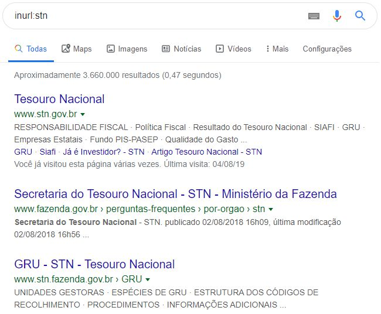

Este operador é especialmente útil para encontrar tipos específicos de páginas ou conteúdos:

- **Encontrar Tópicos Específicos:** Uma busca por `"segunda guerra mundial" inurl:resumo` tende a encontrar páginas cujo endereço indica se tratar de um resumo sobre o tema.
- **Localizar Seções de um Site:** Para encontrar apenas artigos da seção de tecnologia de um portal de notícias, pode-se pesquisar: `inteligência artificial site:uol.com.br inurl:tecnologia`.
- **Encontrar Páginas de Login:** Uma busca por `inurl:login` ou `inurl:admin` pode ajudar a localizar as páginas de acesso de diversos sistemas.

A combinação de `inurl:` com outros operadores, como `site:` e aspas, permite a criação de buscas extremamente específicas e poderosas, tornando-o uma ferramenta valiosa para pesquisas aprofundadas.

### Pesquisando no Título com "intitle:"

O título de uma página da web – aquele texto que aparece na aba do navegador e como o link azul nos resultados da pesquisa – é um dos indicadores mais fortes sobre o seu conteúdo principal. O operador **`intitle:`** permite que a busca seja focada exclusivamente neste campo, retornando apenas as páginas que contenham uma palavra-chave específica em seu título.

|Operador|Utilização|Exemplo|
|---|---|---|
|**`intitle:palavra`**|Permite realizar buscas por palavras contidas nos títulos das páginas.|`intitle:gripe`|

Ao realizar a busca **`intitle:gripe`**, o Google irá filtrar todos os resultados do seu índice e exibir apenas as páginas que, de fato, possuem a palavra "gripe" em seu título, como demonstra a imagem dos resultados da busca.

Podemos confirmar o funcionamento do operador ao visitar um dos links retornados. A imagem a seguir mostra a página correspondente, onde se pode observar na aba do navegador que o título do documento realmente contém a palavra "Gripe".

Este operador é particularmente útil para:

- **Encontrar guias e tutoriais:** Uma busca por `photoshop intitle:tutorial` tende a retornar resultados mais focados em páginas de instrução.
- **Pesquisas acadêmicas:** Para encontrar artigos sobre um tema específico, pode-se usar, por exemplo, `"aquecimento global" intitle:relatório`.

> Dica Avançada: `allintitle:`
> 
> Existe uma variação ainda mais restritiva deste operador: o `allintitle:`. Enquanto `intitle:receita bolo de fubá busca` por "receita" no título e "bolo de fubá" em qualquer parte da página, a busca `allintitle:receita bolo de fubá` retorna apenas as páginas que contenham todas as três palavras no título.

### Pesquisas no Texto Âncora com "inanchor:"

Para entender o operador `inanchor:`, primeiro precisamos desconstruir um hiperlink. Todo link é composto por duas partes:

1. **A URL de Destino:** O endereço para o qual o link nos leva quando clicamos.
2. **O Texto Âncora (_Anchor Text_):** O texto visível e clicável que serve como "rótulo" para o link.

Essas duas partes são independentes. Em um caso extremo, é perfeitamente possível criar um link cujo texto âncora seja `www.flamengo.com.br`, mas que, ao ser clicado, leve o usuário para o endereço `www.vasco.com.br`.

O operador **`inanchor:`** permite pesquisar por palavras-chave que aparecem especificamente no **texto âncora** dos links espalhados pela web. Ou seja, ele não busca o termo no conteúdo da página, mas sim no texto que outros sites usaram para criar um link para aquela página.

|Operador|Utilização|Exemplo|
|---|---|---|
|**`inanchor:palavra`**|Pesquisa por páginas que são referenciadas por links com uma palavra específica no texto âncora.|`inanchor:mais`|

Uma busca por `inanchor:mais` retornará páginas que outros sites apontaram usando a palavra "mais" em seus links, como no exemplo da imagem, onde o texto âncora "Cartão Mais!" aponta para um site específico.

Assim como o `intitle:`, este operador possui uma variação mais restritiva:

- **`allinanchor:`**: Exige que **todas** as palavras da busca estejam presentes no texto âncora. Por exemplo, `allinanchor:melhor museu` buscará por páginas que são referenciadas por links cujo texto âncora contenha tanto a palavra "melhor" quanto a palavra "museu".

É importante notar que os operadores `inanchor:` e `allinanchor:` são considerados mais técnicos e podem, por vezes, apresentar resultados inconsistentes. Com a evolução dos algoritmos do Google, a ênfase em sinais mais complexos de relevância fez com que a indexação de textos âncora se tornasse menos prioritária, então a ferramenta nem sempre funciona de forma precisa.

### Obtendo Definições com "define:"

Muitas vezes, o objetivo de uma pesquisa é simplesmente descobrir o significado de uma palavra ou conceito. Para atender a essa necessidade de forma rápida e direta, o Google oferece o operador **`define:`**, que transforma o buscador em um dicionário instantâneo.

Ao utilizar este comando, o Google exibe, no topo da página de resultados, uma caixa especial com a definição da palavra, sua pronúncia, classificação gramatical e, muitas vezes, sinônimos e exemplos de uso.

|Operador|Utilização|Exemplo|
|---|---|---|
|**`define:`** ou **`define`**|Apresenta a definição de um determinado termo.|`define:estratégia`|

Diferentemente de outros operadores, a sintaxe do `define:` é mais flexível. O uso dos dois-pontos e do espaço é opcional. Na verdade, o algoritmo do Google se tornou tão bom em interpretar a intenção do usuário que buscas como "o que é estratégia" ou "significado de estratégia" geralmente retornam o mesmo resultado.

A busca por **`define:estratégia`** resulta na exibição do painel de dicionário, como mostra a imagem.

Este recurso é uma maneira extremamente eficiente de obter definições rápidas e confiáveis para os mais variados termos, desde conceitos técnicos e acadêmicos até gírias e expressões do dia a dia.

### Encontrando Tipos de Arquivo com "filetype:"

A internet não é composta apenas por páginas web (HTML). Ela é um imenso repositório de documentos nos mais variados formatos: PDFs, apresentações de slides, planilhas, imagens, entre outros. O operador **`filetype:`** é a ferramenta ideal para filtrar a busca e encontrar exclusivamente um tipo de arquivo específico.

Este comando instrui o Google a ignorar as páginas web tradicionais e retornar apenas os resultados que correspondam à extensão de arquivo especificada.

|Operador|Utilização|Exemplo|
|---|---|---|
|**`filetype:extensao`**|Permite buscar documentos na web com um formato específico.|`"lei de licitações" filetype:pdf`|

Ao realizar a busca **`"lei de licitações" filetype:pdf`**, por exemplo, o Google irá procurar pelo termo "lei de licitações", mas exibirá apenas links diretos para arquivos no formato PDF, que é o formato padrão para documentos oficiais, artigos acadêmicos e e-books.

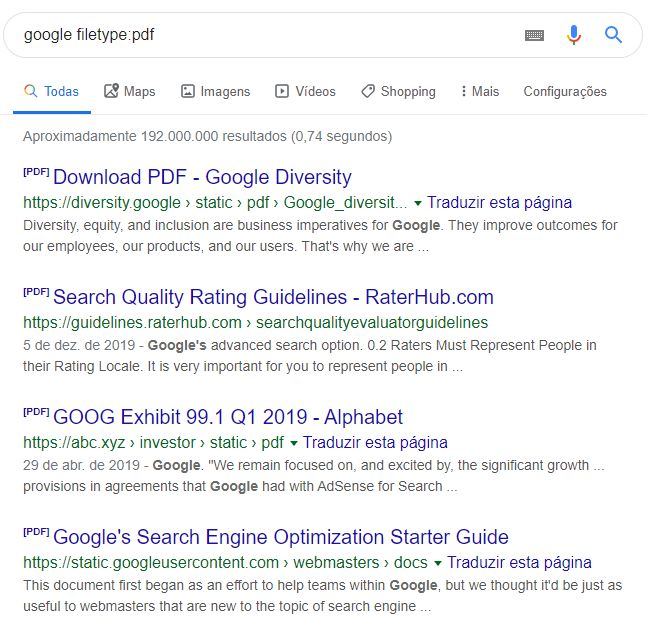

Este operador se torna ainda mais poderoso quando se conhece as extensões de arquivo mais comuns e suas aplicações:

- **`filetype:pdf` (Portable Document Format):** Ideal para encontrar artigos, relatórios, editais de concurso, livros e manuais.
- **`filetype:ppt` ou `filetype:pptx` (Microsoft PowerPoint):** Excelente para encontrar apresentações de slides sobre um determinado tema, o que pode ser uma ótima fonte para resumos visuais.
- **`filetype:doc` ou `filetype:docx` (Microsoft Word):** Útil para encontrar modelos de documentos, currículos e relatórios em formato editável.
- **`filetype:xls` ou `filetype:xlsx` (Microsoft Excel):** Perfeito para buscar planilhas com dados, modelos financeiros ou listas.

A combinação deste operador com outros, como o `site:`, permite criar buscas de altíssima precisão. Por exemplo, a busca **`"relatório anual" site:ibama.gov.br filetype:pdf`** irá procurar pelo termo "relatório anual" apenas dentro do site do IBAMA e mostrará exclusivamente os resultados que são arquivos PDF.

