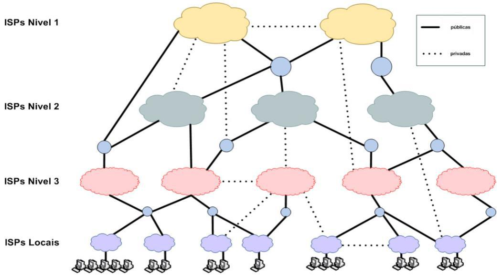
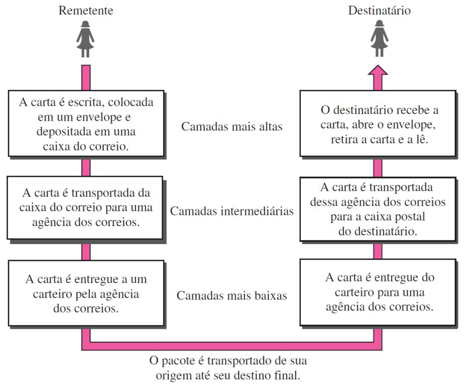
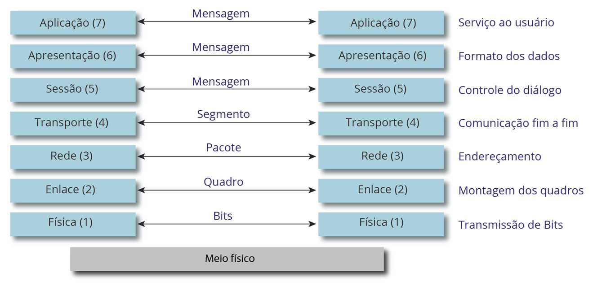

# Capítulo 3 – Internet: Conceitos e Tecnologias

A Internet tornou-se uma ferramenta tão onipresente na vida moderna que é fácil esquecer que ela é, de fato, uma infraestrutura tecnológica complexa, com uma história fascinante e princípios de funcionamento específicos. No dia a dia, ela é a janela para o mundo, a ferramenta de trabalho e a plataforma de entretenimento. No entanto, por trás da aparente simplicidade de abrir um site ou enviar um e-mail, existe uma arquitetura global de redes interconectadas. Este capítulo se aprofunda nos conceitos e tecnologias que definem a Internet, começando por suas origens surpreendentes.

## Contexto Histórico

A história da Internet não começa com comércio ou entretenimento, mas sim com a tensão geopolítica da Guerra Fria. Suas raízes estão profundamente fincadas na estratégia militar dos Estados Unidos, que, durante as décadas de 1950 e 1960, buscava uma forma de manter seus sistemas de comunicação operacionais mesmo diante de um ataque nuclear. A preocupação era que um sistema de comando centralizado seria um alvo fácil e vulnerável. A solução seria criar uma rede _descentralizada_, capaz de continuar funcionando mesmo que partes dela fossem destruídas.

O grande catalisador para essa iniciativa surgiu em 1957, quando a União Soviética lançou o Sputnik, o primeiro satélite artificial. Esse evento chocou os Estados Unidos, que temiam estar ficando para trás na corrida tecnológica. Em resposta, o governo americano criou, em 1958, a **ARPA (Advanced Research Projects Agency)**, uma agência dedicada a financiar projetos de pesquisa de ponta para garantir a vanguarda tecnológica militar.

### Nascimento da ARPANET e a Comutação por Pacotes

Um dos projetos da ARPA, iniciado na década de 1960, foi a **ARPANET**. Seu objetivo era interligar computadores de diferentes universidades e centros de pesquisa que prestavam serviços ao governo. O principal desafio técnico era como fazer esses computadores, distantes geograficamente, conversarem de forma eficiente e, acima de tudo, resiliente.

A tecnologia de comunicação dominante na época era a **comutação por circuito**, utilizada pela rede telefônica. Nesse modelo, um caminho físico dedicado (um "circuito") é estabelecido entre o remetente e o destinatário e permanece reservado durante toda a comunicação. Isso é como reservar uma estrada inteira apenas para dois carros viajarem, mesmo que eles fiquem parados por longos períodos. É um método ineficiente, pois o recurso fica ocioso, e vulnerável, pois se qualquer ponto da estrada for bloqueado, a comunicação é interrompida.

A ARPANET introduziu uma abordagem revolucionária: a **comutação por pacotes**. Neste modelo, a informação a ser enviada (seja um e-mail, um arquivo ou uma imagem) é quebrada em pequenos blocos de dados, chamados **pacotes**. Cada pacote é "endereçado" com informações de origem, destino e sua ordem sequencial. Eles são então enviados pela rede de forma independente.

Usando a analogia do correio, em vez de enviar um relatório volumoso em uma única caixa gigante, o relatório é dividido em vários envelopes menores (pacotes). Cada envelope pode seguir uma rota diferente pelos correios. Os pacotes viajam de roteador em roteador pela rede, e se uma rota estiver congestionada ou for destruída, os pacotes são automaticamente redirecionados por outros caminhos. No destino, o computador receptor recolhe todos os envelopes (pacotes), que podem chegar fora de ordem, e os reorganiza na sequência correta para remontar o relatório original.

Esse método trouxe duas vantagens cruciais:

1. **Resiliência:** A rede não possui um ponto central de falha. Se um nó ou uma rota for perdida, os pacotes simplesmente encontram outro caminho.
2. **Eficiência:** Os recursos da rede (os "cabos" ou "linhas") são compartilhados. Várias comunicações podem usar a mesma linha simultaneamente, já que os pacotes de diferentes usuários são intercalados. A linha não fica mais ociosa.

### Protocolo TCP/IP

Com o sucesso e o crescimento da ARPANET, surgiu um desafio logístico: como gerenciar os endereços de todos os computadores na rede. Em 1973, optou-se por um registro central na Universidade de Stanford (SRI), que mantinha a lista mestra de endereços, facilitando a organização e o encaminhamento de pacotes.

Ao mesmo tempo, outras redes de comutação por pacotes começaram a surgir, cada uma com seus próprios formatos de dados e regras de comunicação. A ARPANET era apenas uma delas. O verdadeiro desafio tornou-se a "interconexão de redes" (ou _internetworking_). Como fazer com que essas redes diferentes, com "idiomas" distintos, pudessem trocar informações?

A solução foi a criação de um conjunto universal de protocolos de comunicação: o **TCP/IP (Transmission Control Protocol / Internet Protocol)**. Esse conjunto atua como a "língua franca" da comunicação em rede:

- **IP (Internet Protocol):** É o responsável pelo endereçamento e roteamento dos pacotes, garantindo que eles cheguem ao computador de destino correto, mesmo que precisem cruzar várias redes diferentes.
- **TCP (Transmission Control Protocol):** É o responsável pela confiabilidade. Ele gerencia a divisão da informação em pacotes na origem e sua remontagem correta no destino, verificando se todos os pacotes chegaram e solicitando a retransmissão daqueles que se perderam no caminho.

A adoção do TCP/IP como padrão permitiu que redes acadêmicas, comerciais e governamentais de todo o mundo se interconectassem, formando a rede global que hoje conhecemos como Internet.

### Os Serviços da Internet

A Internet em si é a infraestrutura – os cabos, roteadores e protocolos. Sobre essa infraestrutura, rodam diversas **aplicações** ou **serviços** que utilizamos no dia a dia. A seguir, são descritos os principais serviços disponíveis na rede.

| **Serviços**              | **Descrição**                                                                                                                                                                                                                                                                                                                                                                      |
| ------------------------- | ---------------------------------------------------------------------------------------------------------------------------------------------------------------------------------------------------------------------------------------------------------------------------------------------------------------------------------------------------------------------------------- |
| World Wide Web (WWW)      | Trata-se do serviço de visualização de páginas web organizadas em sites em que milhares de pessoas possuem acesso instantâneo a uma vasta gama de informação online em hipermídia que podem ser acessadas via navegador – é o serviço mais utilizado na Internet. Em geral, esse serviço utiliza protocolos como HTTP e HTTPS.                                                     |
| Correio Eletrônico        | Trata-se do serviço de composição, envio e recebimento de mensagens eletrônicas entre partes de uma maneira análoga ao envio de cartas – é anterior à criação da Internet. Utiliza tipicamente um modo assíncrono de comunicação que permite a troca de mensagens dentro de uma organização. Em geral, esse serviço utiliza protocolos como POP3, IMAP e SMTP.                     |
| Acesso Remoto             | Trata-se do serviço que permite aos usuários facilmente se conectarem com outros computadores, mesmo que eles estejam em localidades distantes no mundo. Esse acesso remoto pode ser feito de forma segura, com autenticação e criptografia de dados, se necessário. Em geral, esse serviço utiliza protocolos como SSH, RDP, VNC.                                                 |
| Transferência de Arquivos | Trata-se do serviço de tornar arquivos disponíveis para outros usuários por meio de downloads e uploads. Um arquivo de computador pode ser compartilhado ou transferido com diversas pessoas através da Internet, permitindo o acesso remoto aos usuários. Em geral, esse serviço utiliza protocolos como FTP e P2P.                                                               |
| Wiki                      | Wikis são plataformas colaborativas online que permitem que múltiplos usuários editem, criem e organizem conteúdo de forma conjunta. Qualquer pessoa pode modificar ou adicionar informações, facilitando a construção de conhecimento coletivo. Um exemplo famoso é a Wikipedia, onde o conteúdo é constantemente atualizado e expandido por sua comunidade de usuários.          |
| Ferramentas de Busca      | Ferramentas de busca são plataformas que permitem aos usuários pesquisar informações na web por meio de palavras-chave. Eles utilizam algoritmos para indexar e classificar páginas da internet, exibindo resultados relevantes em poucos segundos. Exemplos populares incluem Google, Bing e Yahoo, que ajudam a localizar websites, imagens, vídeos e outros conteúdos digitais. |
| Redes Sociais             | Redes sociais são plataformas digitais que conectam usuários, permitindo a criação e o compartilhamento de conteúdo como textos, imagens, vídeos e links. Elas facilitam a interação entre indivíduos e comunidades através de curtidas, comentários e mensagens. Exemplos incluem Facebook, Instagram e Twitter, que possibilitam a troca de informações em tempo real.           |
| Grupos de Discussão       | Grupos de Discussão são espaços virtuais onde pessoas com interesses comuns se reúnem para trocar informações, debater ideias e compartilhar experiências sobre um tema específico. Esses grupos podem ser organizados em fóruns online, listas de e-mails ou plataformas sociais, facilitando a comunicação e a colaboração entre os participantes em torno de tópicos variados.  |
| Computação em Nuvem       | Computação em nuvem é a tecnologia que permite o armazenamento, processamento e gerenciamento de dados e aplicativos pela internet, em vez de servidores ou dispositivos locais. Os recursos de TI são fornecidos sob demanda, permitindo que empresas e usuários acessem dados remotamente, escalem operações e reduzam custos de infraestrutura física.                          |
| Portais Web               | Portais Web são plataformas que centralizam e organizam uma vasta gama de informações e serviços em um único local online. Eles oferecem acesso a conteúdos diversos, como notícias, e-mails, fóruns, e-commerce e mais. Funcionam como uma porta de entrada para a navegação na web, facilitando o acesso a recursos variados em um só lugar.                                     |

### Arquitetura Padrão: Cliente/Servidor

A maioria dos serviços da Internet, incluindo a World Wide Web e o Correio Eletrônico, opera sob um modelo de arquitetura fundamental conhecido como **cliente/servidor**. Esse modelo organiza a comunicação de forma eficiente, dividindo as tarefas entre dois tipos de participantes:

- O **Cliente (Client)** é o dispositivo que consome o serviço. É o computador pessoal, smartphone ou tablet. O cliente é responsável por _iniciar_ a comunicação, fazendo uma **solicitação** (request) por um recurso. Por exemplo, quando se digita um endereço no navegador (como o Google Chrome ou Firefox), o navegador atua como um cliente solicitando uma página web.
- O **Servidor (Server)** é um computador ou sistema robusto, sempre conectado à rede, cuja função é _aguardar_ e _processar_ as solicitações dos clientes. Quando o servidor recebe uma solicitação (por exemplo, "entregue-me a página inicial do site"), ele localiza o recurso e o envia de volta ao cliente como uma **resposta** (response). Um único servidor pode atender a milhares de clientes simultaneamente.

Essa separação de papéis é crucial, pois permite que os servidores centralizem e gerenciem os dados de forma segura e eficiente (como armazenar todas as páginas de um site ou todos os e-mails de uma conta), enquanto os clientes precisam apenas da capacidade de acessar esses recursos remotamente. Isso garante a escalabilidade e o compartilhamento de recursos que definem a Internet moderna.

## Conceitos Básicos

A Internet, em sua essência, é a maior e mais conhecida rede de computadores do mundo. Portanto, para compreender verdadeiramente a Internet, é fundamental primeiro entender o que é uma **rede de computadores**.

Uma definição formal descreve uma rede como:

> “Um conjunto de terminais, equipamentos, meios de transmissão e comutação que interligados possibilitam a prestação de serviços”.

Uma definição mais simples e direta afirma que uma rede é um conjunto de dispositivos (normalmente conhecidos como **nós**) conectados por **links de comunicação**. Em uma rede moderna, um "nó" não é apenas um computador de mesa. Pode ser um notebook, uma impressora, um smartphone, um tablet, um _smartwatch_, uma Smart TV, uma câmera de segurança ou qualquer outro dispositivo capaz de enviar e receber dados que esteja conectado a outros nós da rede.

As primeiras redes de computadores surgiram dentro de organizações fechadas, como laboratórios de pesquisa e grandes empresas. O objetivo inicial era duplo:

1. **Facilitar a Troca de Informações:** Antes das redes, a transferência de dados entre computadores era um processo físico e manual. Envolvia pessoas carregando pilhas de cartões perfurados ou rolos de fitas magnéticas de um lado para o outro. Uma rede interna permitia que essa troca de informações fosse feita de forma digital, o que era drasticamente mais rápido e confiável.
2. **Compartilhar Recursos Físicos:** O segundo benefício, de enorme impacto econômico, foi o compartilhamento de recursos de _hardware_. Equipamentos como impressoras de grande porte e, principalmente, dispositivos de armazenamento de dados, eram extremamente caros. Em vez de cada computador possuir sua própria impressora, uma rede permitia que um departamento inteiro compartilhasse uma única impressora de rede. Da mesma forma, um grande e caro dispositivo de armazenamento poderia ser centralizado e acessado por todos.

Em essência, o objetivo fundamental de uma rede de computadores pode ser resumido em três pilares: o **compartilhamento de recursos** (sejam eles equipamentos, programas ou dados) e a **comunicação** entre pessoas (através da troca de mensagens de texto, áudio ou vídeo).

### Classificação quanto à Abrangência Geográfica

A forma mais comum de classificar as redes de computadores é pela sua dimensão, ou seja, a área geográfica que elas cobrem. Sob essa ótica, as redes são tradicionalmente divididas em PAN, LAN, MAN e WAN.

#### PAN (Personal Area Network)

A **Rede de Área Pessoal** é definida como uma rede projetada para conectar e transmitir dados entre dispositivos que estão localizados no espaço imediato de uma pessoa. Ela abrange uma área muito pequena, geralmente limitada a alguns metros.

Com frequência, essa rede não utiliza fios, sendo chamada de **WPAN (Wireless Personal Area Network)**. A tecnologia mais emblemática deste tipo de rede é o **Bluetooth**.

Exemplos clássicos de uma PAN estão presentes no cotidiano: a conexão entre um smartphone e uma caixa de som portátil na beira da piscina é uma PAN. Da mesma forma, um corredor que utiliza um fone de ouvido sem fio conectado a um smartphone para ouvir música durante a atividade física está criando e utilizando uma PAN. Outros exemplos incluem teclados, mouses e impressoras sem fio conectados a um computador via Bluetooth.

É importante notar que, em algumas classificações acadêmicas ou em questões de prova, a PAN pode não ser tratada como uma categoria padrão ao lado de LAN, MAN e WAN, mas sua existência prática é inegável.

| **Características** | **Descrição**                                                                  |
| ------------------- | ------------------------------------------------------------------------------ |
| Definição           | Rede pessoal que cobre uma área pequena, geralmente cerca de alguns metros.    |
| Cobertura           | Alguns centímetros a poucos metros.                                            |
| Finalidade          | Conectar dispositivos pessoais de curto alcance.                               |
| Velocidade          | Geralmente de alta velocidade devido à proximidade dos dispositivos.           |
| Tecnologias         | Em geral, Bluetooth, Wi-Fi, USB.                                               |
| Segurança           | Geralmente mais segura devido à proximidade física.                            |
| Complexidade        | Menos complexa devido à simplicidade da conexão.                               |
| Isolamento          | Fácil de isolar problemas devido à proximidade.                                |
| Aplicações          | Conexão de dispositivos pessoais (Ex: fones de ouvido sem fio, teclados, etc). |

### LAN (Local Area Network)

A **Rede de Área Local**, ou **LAN**, é o tipo de rede mais comum no cotidiano. Ela é definida por sua abrangência geográfica limitada, conectando dispositivos dentro de uma área restrita, como uma residência, um único andar de um prédio, um escritório ou um laboratório escolar. O exemplo clássico de uma LAN no passado eram as _Lan Houses_, locais que interligavam diversos computadores para jogos em rede e acesso à internet.

Hoje, a rede de uma residência é um exemplo perfeito de LAN: ela conecta computadores, notebooks, Smart TVs, consoles de videogame e smartphones a um único roteador central, permitindo que todos acessem a internet e compartilhem recursos entre si, como uma impressora.

Em um ambiente corporativo, uma LAN permite a troca de informações, a comunicação eficaz entre os funcionários e o compartilhamento de recursos caros, como servidores de arquivos e impressoras de alta capacidade.

Tecnicamente, as LANs são caracterizadas por oferecerem **altas velocidades de transmissão**, pois as distâncias são curtas. Elas podem ser implementadas com cabos (principalmente com a tecnologia **Ethernet**) ou sem fios (criando uma **WLAN**, ou Rede Local Sem Fio, mais conhecida pelo nome comercial **Wi-Fi**). A topologia moderna mais comum é a "estrela", onde todos os dispositivos se conectam a um equipamento central, como um _switch_ ou um roteador. Devido ao seu ambiente controlado, as LANs geralmente apresentam uma baixa ocorrência de erros na transmissão de dados.

|**Características**|**Descrição**|
|---|---|
|Definição|Rede local que abrange uma área geográfica limitada (Ex: edifício ou campus).|
|Cobertura|De algumas centenas de metros a alguns quilômetros.|
|Finalidade|Facilitar a comunicação dentro de uma organização local.|
|Velocidade|Alta velocidade dentro da rede local.|
|Tecnologias|Em geral, Ethernet e Wi-Fi.|
|Segurança|Pode ser configurada com medidas de segurança, como firewalls.|
|Complexidade|De complexidade moderada, dependendo do tamanho da rede.|
|Isolamento|Problemas podem ser isolados com relativa facilidade.|
|Aplicações|Uso em escritórios, escolas e redes corporativas locais.|

### MAN (Metropolitan Area Network)

A **Rede de Área Metropolitana**, ou **MAN**, representa um passo intermediário entre a LAN e a WAN (que veremos a seguir). Como o nome sugere, ela é projetada para cobrir uma área geográfica do tamanho de uma cidade ou uma grande metrópole.

Uma MAN não é, tipicamente, uma rede única construída do zero; ela é, na maioria das vezes, o resultado da **interligação de várias LANs** pertencentes a uma mesma organização, mas que estão fisicamente separadas por quilômetros.

Considere uma empresa que possui sua sede (matriz) no centro da cidade e dezenas de filiais espalhadas por diferentes bairros. Cada um desses locais possui sua própria LAN. Para que todos os funcionários possam acessar os mesmos sistemas internos como se estivessem no mesmo prédio, a empresa contrata links de alta velocidade (geralmente de fibra óptica, fornecidos por uma operadora de telecomunicações) para conectar todas essas LANs. A rede resultante, que abrange toda a cidade, é uma MAN. Outro exemplo seria um campus universitário cujas faculdades e centros de pesquisa estão localizados em diferentes pontos da cidade.

|**Características**|**Descrição**|
|---|---|
|Definição|Rede metropolitana que abrange uma cidade ou uma área metropolitana.|
|Cobertura|Algumas dezenas de quilômetros.|
|Finalidade|Conectar redes locais dentro de uma área metropolitana.|
|Velocidade|Velocidade variável, dependendo da infraestrutura da rede.|
|Tecnologias|Em geral, Ethernet e fibra óptica.|
|Segurança|Maior risco devido à extensão geográfica, exigindo segurança adicional.|
|Complexidade|Moderadamente complexa por conta da complexidade da infraestrutura.|
|Isolamento|Pode ser desafiador isolar problemas devido à extensão geográfica.|
|Aplicações|Integração de redes locais em uma área metropolitana.|

### WAN (Wide Area Network)

A **Rede de Área Extensa**, ou **WAN**, é a classificação para redes que cobrem grandes áreas geográficas, sem restrições de distância. Uma WAN é utilizada para conectar e transmitir dados entre dispositivos localizados em diferentes cidades, estados, países ou até continentes.

Na prática, uma WAN é uma "rede de redes", conectando múltiplas LANs e MANs. Quando uma empresa possui filiais em Brasília e Goiânia e as interliga, ela está criando uma rede privada do tipo WAN. O exemplo do Programa Antártico Brasileiro (PROANTAR), que envia dados de suas pesquisas na Antártida para o Brasil, ilustra perfeitamente o alcance de uma WAN, que neste caso utiliza links de satélite.

Contudo, o exemplo mais clássico, abrangente e definitivo de uma WAN é a própria **Internet**. Ela é uma rede mundial pública que interconecta milhões de redes (LANs, MANs e outras WANs), permitindo a comunicação em escala global.

Por dependerem de infraestruturas de longa distância (como cabos de fibra óptica submarinos, satélites e redes de operadoras), as WANs são as redes mais complexas e, historicamente, apresentavam velocidades de conexão mais baixas que as LANs, embora os avanços em fibra óptica tenham reduzido significativamente essa diferença.

|**Características**|**Descrição**|
|---|---|
|Definição|Rede de grande área que pode abranger cidades, países ou até continentes.|
|Cobertura|Centenas a milhares de quilômetros.|
|Finalidade|Conectar redes em diferentes locais geograficamente distantes.|
|Velocidade|Geralmente menor velocidade devido a longas distâncias.|
|Tecnologias|Frame Relay, MPLS, Internet.|
|Segurança|Requer medidas rigorosas devido ao alcance e à exposição a ameaças.|
|Complexidade|Em geral, complexa devido à escala global e aos diferentes tipos de tecnologia.|
|Isolamento|Requer ferramentas avançadas para isolar problemas em redes extensas.|
|Aplicações|Comunicação em escala regional, nacional ou global.|

### Resumo da Classificação Geográfica

A tabela a seguir consolida as diferenças de abrangência entre os tipos de rede discutidos.

|**Tipo**|**Sigla**|**Descrição**|**Distância**|
|---|---|---|---|
|Personal Area Network|PAN|Rede de computadores pessoal (celular, tablet, notebook, etc).|De alguns centímetros a alguns poucos metros.|
|Local Area Network|LAN|Rede de computadores de lares, escritórios, prédios, entre outros.|De algumas centenas de metros a alguns quilômetros.|
|Metropolitan Area Network|MAN|Rede de computadores entre uma matriz e filiais em uma cidade.|Cerca de algumas dezenas de quilômetros.|
|Wide Area Network|WAN|Rede de computadores entre cidades, países ou até continentes.|De algumas dezenas a milhares de quilômetros.|

É importante notar que todas essas classificações possuem uma correspondente direta quando a tecnologia de transmissão de dados principal não utiliza cabos (_wireless_). Nesses casos, o prefixo "W" é adicionado à sigla:

- **WPAN (Wireless Personal Area Network):** A rede Bluetooth.
- **WLAN (Wireless Local Area Network):** A rede Wi-Fi.
- **WMAN (Wireless Metropolitan Area Network):** Tecnologias como o WiMAX, que buscaram oferecer cobertura de internet sem fio em larga escala para cidades.
- **WWAN (Wireless Wide Area Network):** A tecnologia de dados móveis que usamos em nossos smartphones (como as redes **3G, 4G e 5G**).

## World Wide Web (WWW)

É comum, no dia a dia, que os termos "Internet" e "Web" sejam usados como sinônimos. No entanto, do ponto de vista técnico, é crucial entender que eles **não são a mesma coisa**.

A **Internet** é a infraestrutura física e lógica global: a vasta rede de cabos submarinos, satélites, roteadores, servidores e protocolos (como o TCP/IP) que conecta milhões de redes de computadores em todo o mundo. A **Web**, uma contração do termo **World Wide Web (WWW)**, é um dos muitos _serviços_ ou _aplicações_ que rodam sobre essa infraestrutura.

A analogia da rede rodoviária, mencionada em suas anotações, é a forma mais clara de entender essa diferença:

- A **Internet** é a rede global de estradas, ruas e rodovias. É a infraestrutura que permite o tráfego e a conexão entre diferentes pontos.
- A **Web** é o conjunto de destinos que existem ao longo dessas estradas: as lojas, as bibliotecas, as casas e os escritórios (ou seja, os _sites_).
- Outros serviços, como o **Correio Eletrônico (e-mail)**, seriam o sistema de correios, que também _usa_ as mesmas estradas da Internet para transportar suas cartas (mensagens), mas opera de forma independente das lojas (sites da Web).

Portanto, a Web é uma gigantesca aplicação distribuída, rodando em milhões de servidores ao redor do mundo, que nos permite acessar e interagir com informações por meio de navegadores.

### Componentes Fundamentais da Web

A Web, como serviço, opera com base em um conjunto de tecnologias e componentes padrão que trabalham juntos para permitir a navecagação.

|**Componentes da Web**|**Descrição**|
|---|---|
|Hipertexto|A Web é baseada em documentos que contêm links (hiperlinks) para outros documentos relacionados. Isso permite que os usuários naveguem de uma página para outra, seguindo os links.|
|URL|Cada documento ou recurso na Web é identificado por um URL (Uniform Resource Locator) exclusivo, que é um endereço usado para acessar o recurso em um navegador.|
|Navegadores da Web|São os aplicativos-cliente (softwares) que permitem aos usuários visualizar e interagir com documentos da Web. Exemplos populares de navegadores incluem o Google Chrome, Mozilla Firefox, Microsoft Edge e Safari.|
|Protocolos de Comunicação|A Web utiliza protocolos de comunicação, como HTTP (Hypertext Transfer Protocol) e HTTPS (HTTP Secure), para transferir dados entre navegadores e servidores web.|
|Servidores Web|São computadores que hospedam documentos e recursos da Web. Eles respondem às solicitações dos navegadores e fornecem os conteúdos solicitados.|
|Páginas da Web|São os documentos criados usando linguagens de marcação, como HTML (Hypertext Markup Language). As páginas da web podem conter texto, imagens, links e outros elementos interativos.|
|Motores de Busca|São ferramentas que ajudam os usuários a encontrar informações na Web, indexando e classificando páginas da web com base em palavras-chave.|

A Web não é uma entidade estática; ela evoluiu drasticamente desde sua criação. Essa evolução é frequentemente categorizada em "gerações" (Web 1.0, 2.0, 3.0, etc.). É importante notar que essas gerações não se excluem mutuamente, mas sim se sobrepõem. As características de uma nova geração são adicionadas ao ecossistema, convivendo com as tecnologias das gerações anteriores. A seguir, vamos explorar essas fases em detalhe.

### Web 0.0: Gênese da Web

A World Wide Web nasceu de uma necessidade prática. Em março de 1989, **Tim Berners-Lee**, um físico britânico que trabalhava no CERN (Organização Europeia para a Pesquisa Nuclear), propôs um sistema de gerenciamento de informações. O desafio no CERN era que pesquisadores de todo o mundo precisavam compartilhar dados e documentos, mas estes estavam em computadores diferentes, com formatos diferentes e sistemas incompatíveis.

A solução de Berners-Lee foi a criação de um sistema de hipertexto global. Para isso, ele inventou as três tecnologias fundamentais que formam a base da Web até hoje:

1. **URL (Uniform Resource Locator):** O sistema de endereçamento universal para localizar qualquer recurso na rede (ex: `http://www.exemplo.com`).
2. **HTML (Hypertext Markup Language):** A linguagem de marcação para criar as páginas da web e seus links (hiperlinks).
3. **HTTP (Hypertext Transfer Protocol):** O protocolo (o "idioma") que permite que um navegador (cliente) requisite e um servidor entregue uma página HTML.

Essa fase inicial, que podemos chamar de **Web 0.0**, era essencialmente acadêmica. Em 1991, a primeira página web da história foi colocada no ar no domínio `info.cern.ch`. Era uma página de texto simples com links, explicando o que era o projeto World Wide Web e como utilizá-lo.

O crescimento, a partir daí, foi exponencial. Os números ilustram essa explosão:

- **1991:** 1 página web (a do CERN).
- **1994:** 2.738 páginas web (incluindo o lançamento do Yahoo!).
- **1998:** 2.410.067 páginas web (ano de fundação do Google).
- **2001:** 29.254.370 páginas web (lançamento da Wikipedia).
- **2005:** 64.780.617 páginas web (lançamento do YouTube).
- **2008:** 172.338.776 páginas web (lançamento do Dropbox).
- **2018:** Mais de 1,8 bilhão de páginas web.

O que começou como uma ferramenta para cientistas rapidamente evoluiu para a primeira era pública da web.

### Web 1.0: Web da "Leitura" (Read-Only)

A Web 1.0 corresponde à primeira fase pública da internet, abrangendo aproximadamente de 1994 ao início dos anos 2000. Essa era é caracterizada por **sites estáticos**, com conteúdo fixo e comunicação **unidirecional**.

Nesse modelo, a web funcionava como uma gigantesca biblioteca ou um catálogo de brochuras digitais. Um pequeno número de "webmasters" e empresas criava conteúdo (páginas informativas, portais de notícias, sites institucionais) e o publicava. A esmagadora maioria dos usuários era de **consumidores passivos de conteúdo**.

A interação era mínima. Ela se limitava, na maioria das vezes, a simples formulários de "Fale Conosco", livros de visita (_guestbooks_) ou, no máximo, os primeiros fóruns de discussão. Não havia redes sociais, blogs (como os conhecemos hoje) ou a possibilidade de o usuário comum publicar seu próprio conteúdo de forma fácil.

### Web 2.0: Web Social e da "Leitura-Escrita" (Read-Write)

A Web 2.0 não foi uma atualização técnica da noite para o dia, mas uma mudança de filosofia que se consolidou em meados dos anos 2000. A grande revolução aqui foi a **interatividade** e o **Conteúdo Gerado pelo Usuário (UGC - User-Generated Content)**.

Nesta geração, os usuários deixaram de ser apenas consumidores e passaram a ser, massivamente, **criadores de conteúdo**. A comunicação tornou-se bidirecional. Isso foi possibilitado por novas tecnologias, como o **AJAX**, que permitia que partes de uma página fossem atualizadas sem a necessidade de recarregar a página inteira (permitindo ações como "curtir", comentar em tempo real, arrastar itens em um mapa, etc.).

A Web 2.0 é a era das plataformas de colaboração:

- **Redes Sociais (Facebook, Orkut, Twitter/X):** O usuário cria e compartilha seu próprio conteúdo (textos, fotos, vídeos).
- **Blogs e Wikis (Wikipedia, Blogger):** Plataformas que facilitaram a publicação de textos e a construção coletiva do conhecimento.
- **Compartilhamento de Mídia (YouTube, Flickr):** Serviços inteiros construídos sobre o conteúdo enviado pelos próprios usuários.

Nesta fase, a web tornou-se dinâmica, social e centrada no usuário, com interfaces mais ricas e amigáveis.

### Web 3.0: Web Semântica e Descentralizada

A Web 3.0 é a geração atual e emergente, e seu conceito é, na verdade, uma fusão de duas grandes ideias.

1. **Web Semântica:** Esta foi a visão original de Tim Berners-Lee para a "próxima web". O objetivo é tornar os dados mais **inteligíveis para as máquinas**. Na Web 2.0, um computador sabe que uma página contém o texto "R$ 100", mas não sabe o que isso _significa_. Na Web Semântica, os dados têm um "significado" (semântica) atrelado a eles. O computador entende que "R$ 100" é um _preço_ para um _produto_. Isso permite que assistentes virtuais (como a Siri ou o Google Assistente) e sistemas de inteligência artificial compreendam e executem tarefas complexas, oferecendo uma navegação muito mais personalizada e conectada.
2. **Web Descentralizada (Web3):** Esta é uma interpretação mais recente, impulsionada por tecnologias como o **Blockchain**. O foco aqui é a **propriedade dos dados**. Enquanto na Web 2.0 os dados dos usuários são controlados por grandes empresas (Meta, Google, Amazon), a Web 3.0 propõe um modelo descentralizado, onde os usuários têm maior controle e propriedade sobre seus dados e sua identidade digital, sem depender de intermediários. Isso promove maior segurança, transparência e interoperabilidade.

A Web 3.0 é, portanto, a intersecção da **Inteligência Artificial** (a Web Semântica) com a **descentralização** (o Blockchain), visando criar uma internet mais inteligente, personalizada e controlada pelo próprio usuário.

### Comparativo das Gerações da Web

A tabela a seguir resume as principais diferenças entre as fases de evolução da World Wide Web.

|**Características**|**Web 1.0**|**Web 2.0**|**Web 3.0**|
|---|---|---|---|
|Interatividade|Baixa|Alta|Muito Alta|
|Conteúdo|Estático e somente leitura|Dinâmico, com feedback do usuário|Inteligente, com semântica|
|Usuários|Consumidores passivos|Produtores de conteúdos|Participantes ativos|
|Socialização|Ausente|Integração de redes sociais|Integração com IA e Internet das Coisas|
|Experiência do Usuário|Limitada|Melhorada e personalizada|Altamente personalizada|
|Tecnologia|HTML|AJAX, APIs e RSS|IA e Aprendizado de Máquina|
|Exemplos|Sites estáticos de início da web|Redes sociais, blogs e wikis|Assistentes virtuais|
|Principais Aplicações|Sites informativos e institucionais|Redes sociais e colaboração online|Assistentes virtuais e Internet das Coisas|

## Deep Web e Dark Web: As Camadas da Internet

Para a maioria dos usuários, a "internet" é o que se vê através de mecanismos de busca como o Google. No entanto, essa parte visível é apenas a ponta de um imenso iceberg. Estima-se que a **Surface Web**, ou Web de Superfície, componha apenas cerca de 4% de todo o conteúdo online. Esta é a camada da web composta por sites e páginas que são projetados para serem públicos, podendo ser facilmente encontrados, rastreados e **indexados** por mecanismos de busca comuns. Páginas de notícias, blogs, sites de e-commerce e perfis públicos em redes sociais são todos parte da Surface Web.

|**Surface Web**|**Descrição**|
|---|---|
|Acessibilidade|Facilmente acessível por meio de mecanismos de busca e navegadores padrão.|
|Conteúdo Público|Compreende sites, páginas e conteúdo que são acessíveis ao público em geral.|
|Indexação por Mecanismos de Busca|Os motores de busca, como Google e Bing, indexam e exibem o conteúdo da Surface Web em resultados de pesquisa.|
|Informações Amplamente Visíveis|Notícias, blogs, lojas online, fóruns públicos e outros tipos de sites podem ser encontrados na Surface Web.|
|Sem Restrições Significativas|Os usuários podem navegar e acessar conteúdo sem a necessidade de credenciais ou permissões especiais.|
|Exemplos|Páginas de notícias, blogs, lojas online e outros sites acessíveis ao público em geral.|

### Web Profunda (Deep Web)

Os outros 96% da internet compõem a **Deep Web** (Web Profunda). É fundamental esclarecer que a Deep Web, por si só, não é um local ilegal ou sinistro; ela é, na verdade, a maior parte da internet que usamos todos os dias.

A Deep Web é definida como o conjunto de todas as páginas e recursos da web que **não são indexados** por mecanismos de busca padrão. O conteúdo não é indexado por diversos motivos, sendo o mais comum a necessidade de **autenticação** ou por ser conteúdo gerado dinamicamente.

Sempre que se acessa uma área que exige um nome de usuário e uma senha, está-se navegando na Deep Web. Isso inclui:

- Contas de e-mail (Gmail, Hotmail, etc.).
- Serviços de _Internet Banking_.
- Contas de redes sociais (o _feed_ privado, mensagens diretas).
- Bancos de dados de universidades e bibliotecas.
- Registros médicos online.
- **Intranets** corporativas, que são redes internas de empresas acessíveis apenas por funcionários autorizados.

Embora esse conteúdo não seja visível para o público geral, isso não garante a privacidade total. A comunicação entre o computador do usuário e esses servidores (o banco, a intranet da empresa) deixa rastros e registros. O provedor de internet sabe quais servidores foram acessados, e o próprio servidor (o banco, por exemplo) registra toda a atividade da conta.

|**Deep Web**|**Descrição**|
|---|---|
|Conteúdo não Indexado por Mecanismos de Busca|O conteúdo da Deep Web não é indexado pelos mecanismos de busca tradicionais, o que o torna invisível nas pesquisas comuns.|
|Requer Autenticação|Muitos sites da Deep Web exigem credenciais ou autenticação para acessar, tornando o conteúdo acessível apenas a usuários autorizados.|
|Informações Confidenciais|Inclui informações privadas, como dados de empresas, registros médicos, sistemas de gerenciamento de bibliotecas e muito mais.|
|Não Acessível por Links Comuns|Não se pode simplesmente clicar em um link público para acessar o conteúdo da Deep Web; geralmente, precisa-se de informações de login ou URLs específicas.|
|Variedade de Conteúdo|A Deep Web abrange uma ampla gama de informações, desde bancos de dados privados a sistemas de gerenciamento de conteúdo corporativo.|

### Web Escura (Dark Web)

A **Dark Web** (Web Escura) é uma **subseção** da Deep Web. Todo conteúdo da Dark Web está na Deep Web, mas nem todo conteúdo da Deep Web está na Dark Web.

A principal diferença é a tecnologia utilizada e o foco no **anonimato**. A Dark Web é composta por redes sobrepostas (ou _overlay networks_) que não são acessíveis por navegadores convencionais e que exigem softwares específicos para ocultar a identidade do usuário e a localização do servidor.

A mais famosa dessas redes é a **Rede Tor**. Originalmente um projeto de pesquisa da Marinha dos EUA para comunicações seguras, o Tor hoje é uma rede global operada por milhares de voluntários.

O nome "Tor" vem de "O Roteador Cebola" (_The Onion Router_), uma analogia a como os dados são protegidos. Quando se faz uma requisição usando o Navegador Tor, os dados não vão diretamente do computador do usuário para o servidor do site. Em vez disso, a requisição é criptografada em múltiplas camadas (como uma cebola) e "quica" por uma série de servidores proxy aleatórios (os "nós" da Rede Tor) ao redor do mundo.

Cada nó só consegue "descascar" uma camada de criptografia, o suficiente para saber qual será o próximo nó da rota, mas sem saber a origem original ou o destino final. O último nó ("nó de saída") faz a requisição final ao site de destino, que por sua vez enxerga apenas o IP desse nó de saída, e não o do usuário original. Isso torna o endereço IP do usuário não identificável e não rastreável.

É importante notar que o Navegador Tor pode ser usado para duas finalidades:

1. **Acessar a Surface Web anonimamente:** Pode-se usar o Tor para acessar o `Google.com`. O Google não saberá _quem_ está acessando, mas saberá que _alguém_ está acessando seus serviços. Essa é uma ferramenta crucial para ativistas, jornalistas e cidadãos em países com regimes repressivos ou censura na internet.
2. **Acessar a Dark Web:** Existem sites que só existem _dentro_ da Rede Tor, conhecidos por seus endereços especiais terminados em `.onion`. Nesses casos, não apenas a identidade do usuário está oculta, mas a localização do servidor que hospeda o site também está. Isso permite um anonimato quase completo para ambas as partes.

É nesse segundo cenário que as atividades ilícitas florescem, pois o anonimato total dificulta a aplicação da lei. A Dark Web é, infelizmente, um ambiente conhecido por hospedar mercados de entorpecentes, venda de armas, contratação de serviços ilegais (como matadores de aluguel), planejamento de atentados terroristas, compartilhamento de material de abuso infantil, vazamento de documentos sigilosos, comércio de dados roubados, conteúdos de extrema violência, racismo e falsificação de documentos.

| **Dark Web**                      | **Descrição**                                                                                                                             |
| --------------------------------- | ----------------------------------------------------------------------------------------------------------------------------------------- |
| Acessível com Software Específico | A Dark Web é acessada por meio de redes criptografadas, como o Tor (The Onion Router), que requerem software especial para acesso.        |
| Conteúdo Ilegal e Obscuro         | Inclui sites que hospedam atividades ilegais, como tráfico de drogas, armas, venda de informações roubadas e outros conteúdos obscuros.   |
| Anonimato é Valorizado            | Os usuários da Dark Web muitas vezes valorizam o anonimato, pois os serviços são frequentemente anônimos e transações são criptografadas. |
| Riscos à Segurança                | A Dark Web é um ambiente de alto risco, onde os usuários podem ser vítimas de fraudes e ataques cibernéticos.                             |
| Níveis Profundos de Anonimato     | Diferentemente da Deep Web, a Dark Web oferece um nível mais profundo de anonimato e criptografia, tornando difícil rastrear usuários.    |

Devido à natureza desse ambiente, ele é povoado por hackers, cibercriminosos e agências de aplicação da lei. Não é um local recomendado para acesso por curiosidade, dado o alto risco de exposição a malwares e conteúdos perturbadores.

#### Dark Web e Criptomoedas

A natureza anônima da Dark Web exige um sistema financeiro igualmente anônimo. Transações com cartão de crédito ou transferências bancárias são rastreáveis e deixam um rastro digital claro. Por isso, as **criptomoedas**, com destaque para o **Bitcoin**, tornaram-se o meio de pagamento padrão nesses mercados.

O caso mais famoso foi o do **Silk Road** (Rota da Seda), um mercado online da Dark Web lançado em 2011, que funcionava como um "eBay para drogas" e outros produtos ilícitos. Todas as transações eram feitas exclusivamente em Bitcoin, pois a criptomoeda não passa pelo sistema financeiro tradicional e oferece um alto grau de anonimato (pseudonimato).

Em 2013, o FBI conseguiu fechar o site e prender seu fundador. Curiosamente, a queda do administrador não se deu por uma falha na tecnologia Tor ou no Bitcoin, mas por erro humano: ele havia usado seu nome verdadeiro em um fórum na Surface Web anos antes, em uma postagem que pôde ser conectada às atividades do Silk Road. Ele foi condenado à prisão perpétua.

### Resumo das Camadas da Web

A tabela a seguir consolida as diferenças entre as três camadas da web, e a analogia do iceberg ajuda a visualizar essa estrutura.

| **Características** | **Surface Web**                                                                  | **Deep Web**                                                                                        | **Dark Web**                                                    |
| ------------------- | -------------------------------------------------------------------------------- | --------------------------------------------------------------------------------------------------- | --------------------------------------------------------------- |
| Acessibilidade      | Acessível por mecanismos de busca e navegadores comuns.                          | Requer credenciais específicas ou URLs exclusivas.                                                  | Acessível apenas por redes criptografadas, como o Tor.          |
| Conteúdo Comum      | Contém informações e sites disponíveis publicamente.                             | Inclui conteúdo não indexado por mecanismos de busca, como bancos de dados privados.                | Contém conteúdo obscuro e frequentemente ilegal.                |
| Anonimato           | Não oferece anonimato especial para usuários.                                    | Pode exigir credenciais de login, mas não enfatiza o anonimato.                                     | Valoriza altos níveis de anonimato e segurança.                 |
| Conteúdo Comercial  | Amplamente usado para negócios, educação, entretenimento e informações públicas. | Inclui recursos protegidos por senha, como e-mails, serviços bancários online e redes corporativas. | Muitas vezes associada a atividades ilegais e conteúdo obscuro. |
| Exemplos            | Sites de notícias, blogs, redes sociais, sites de compras online.                | E-mails privados, intranets corporativas, bancos de dados de bibliotecas.                           | Sites de venda de drogas, mercados negros, fóruns de hackers.   |

## Internet das Coisas (IoT)

A sociedade contemporânea está no meio de um profundo processo de **transformação digital**, no qual empresas e indivíduos integram tecnologias inovadoras para otimizar operações, resolver problemas complexos e agregar valor. Esse movimento envolve uma reestruturação cultural e operacional, onde a tecnologia deixa de ser uma ferramenta de suporte para se tornar o pilar central do sucesso, da agilidade e da resiliência.

A pandemia de COVID-19, em particular, atuou como um catalisador poderoso para essa transformação. Empresas foram compelidas a adotar o trabalho remoto em massa, e setores inteiros tiveram que reconfigurar suas operações para atender a novas demandas de distanciamento social e logística. A digitalização deixou de ser uma opção e tornou-se uma necessidade de sobrevivência, consolidando-se como um pilar para o futuro.

Dentro desse cenário de conectividade global em rápida expansão, uma tecnologia se destaca como a próxima grande revolução: a **Internet das Coisas**, ou **IoT** (_Internet of Things_).

### Definindo a Internet das Coisas

A Internet das Coisas refere-se à rede de dispositivos físicos e objetos do cotidiano ("coisas") que são equipados com sensores, software e outras tecnologias com o propósito de **coletar e trocar dados** com outros dispositivos e sistemas através da internet.

Por décadas, a internet foi uma rede de computadores, e mais recentemente, de _smartphones_. A IoT expande essa fronteira para incluir, literalmente, qualquer objeto. Itens que já se tornaram comuns, como câmeras de segurança, _Smart TVs_ e consoles de videogame, são exemplos iniciais de IoT. Em países mais desenvolvidos, essa rede já inclui geladeiras que monitoram o estoque de alimentos e máquinas de lavar que podem ser acionadas remotamente.

A ideia central não é apenas conectar por conectar, mas tornar esses dispositivos mais eficientes e inteligentes em suas funções, permitindo que eles interajam com o ambiente e entre si. A IoT tem aplicações que vão muito além das residências, sendo um motor de eficiência em setores como agricultura (sensores de umidade do solo), pecuária (monitoramento de rebanhos), hospitais (sensores de sinais vitais de pacientes), escolas e, principalmente, na indústria (manutenção preditiva de máquinas).

Com o avanço das redes de alta velocidade, como o **5G**, a conectividade entre esses objetos se tornará ainda mais robusta e onipresente, acelerando a transformação digital e ampliando as possibilidades de uso em todos os contextos.

### Componentes de um Ecossistema IoT

A Internet das Coisas não é uma tecnologia única, mas sim um ecossistema complexo formado por quatro componentes principais que trabalham em conjunto.

|**Componentes**|**Descrição**|
|---|---|
|Dispositivos|São os elementos físicos que compõem a IoT, como sensores, atuadores e outros dispositivos conectados, como câmeras, medidores inteligentes, veículos e eletrodomésticos. Eles coletam dados do mundo real e podem executar ações com base nesses dados.|
|Tecnologias de Comunicação|São os meios pelos quais os dispositivos IoT se comunicam entre si e com a nuvem. Isso pode incluir Wi-Fi, Bluetooth, 3G/4G/5G, Zigbee, LoRa, entre outros. As redes de comunicação são responsáveis pela transferência de dados dos dispositivos para a nuvem e vice-versa.|
|Sensores e Atuadores|Os sensores coletam informações do ambiente, como temperatura, umidade, localização, movimento e muito mais. Os atuadores são responsáveis por tomar ações, como ligar ou desligar um dispositivo. Eles são os olhos e as mãos da IoT.|
|Nuvem (Cloud)|A nuvem é onde os dados coletados pelos dispositivos IoT são processados, armazenados e disponibilizados para acesso. Plataformas de nuvem fornecem recursos de computação, armazenamento e análise de dados em grande escala, tornando possível o processamento de grandes volumes de informações.|

Para ilustrar: imagine uma casa inteligente com monitoramento de segurança, controle de temperatura e gerenciamento de iluminação.

- **Sensores** (temperatura, movimento, fumaça) e **Dispositivos** (câmeras, lâmpadas, aparelhos de ar-condicionado) coletam dados.
- Esses dados são enviados via **Tecnologias de Comunicação** (como Wi-Fi ou Zigbee) para um sistema central.
- Esse sistema, rodando em um serviço de **Nuvem**, processa as informações (ex: "o sensor de temperatura indica 28°C" e "o sensor de presença indica que há alguém na sala").
- O sistema na nuvem então envia um comando para um **Atuador** (o motor do ar-condicionado) para que ele ligue e resfrie o ambiente.

O usuário pode, então, acessar esse sistema em nuvem de qualquer lugar do mundo através de um aplicativo em seu celular.

### Tecnologias Essenciais para a IoT

Para que essa malha de bilhões de dispositivos funcione, duas tecnologias de base são essenciais: endereçamento e comunicação.

**1. O Papel do IPv6:**

O protocolo de internet que usamos por décadas, o IPv4, tinha um limite de cerca de 4,3 bilhões de endereços. Esse número, que parecia gigantesco nos anos 80, esgotou-se. Para a IoT ser viável, onde cada lâmpada, sensor e geladeira precisa de um endereço único na internet, era necessário um sistema muito maior. É aqui que entra o IPv6, a nova versão do protocolo, que oferece um número de endereços tão absurdamente gigantesco (trilhões de trilhões) que, na prática, é ilimitado para o futuro previsível, garantindo que a quantidade de dispositivos e sensores não seja um problema.

**2. Tecnologias de Comunicação:**

A comunicação é o pilar da IoT. Diferentes dispositivos têm diferentes necessidades de energia e alcance, por isso, várias tecnologias coexistem:

|**Tecnologias de Comunicação**|**Descrição**|
|---|---|
|Wi-Fi (802.11)|Trata-se de uma das tecnologias de comunicação sem fio mais amplamente utilizadas e oferece alta largura de banda. É adequado para dispositivos que têm acesso a redes locais de alta velocidade e energia suficiente (ex: Smart TVs, câmeras de segurança).|
|Bluetooth (802.15)|Trata-se de uma tecnologia de comunicação sem fio de curto alcance, adequada para dispositivos pessoais, como fones de ouvido sem fio e dispositivos vestíveis (wearables). O Bluetooth Low Energy (BLE) é uma variante de baixo consumo de energia.|
|ZigBee|Trata-se de um padrão de comunicação sem fio de baixa potência projetado para redes de sensores e dispositivos IoT em ambientes domésticos e industriais (ex: lâmpadas e interruptores inteligentes).|

É importante notar que muitas aplicações de IoT, especialmente em agricultura ou cidades inteligentes, precisam de **longo alcance** e **baixo consumo de energia** (pois os dispositivos podem ficar anos no campo, funcionando a bateria). Para isso, foram criadas redes do tipo **LPWAN (Low-Power Wide Area Network)**, como o **LoRaWAN**. A ideia é permitir comunicações de longa distância com uma taxa de transmissão de dados baixa (enviando apenas um pequeno pacote de dados, como "o portão abriu" ou "a temperatura é 22°C").

### Riscos, Vantagens e Desvantagens

A conexão de tudo à internet traz uma nova superfície de ataque para a segurança e a privacidade. Dispositivos de IoT, muitas vezes fabricados com baixo custo e pouca preocupação com segurança, podem ser vulneráveis a ataques. Os riscos incluem:

- **Privacidade:** Um dispositivo vulnerável (como uma câmera ou babá eletrônica) pode permitir acesso não autorizado, permitindo que invasores espionem residências.
- **Escalonamento de Ataques:** Um invasor pode usar um dispositivo IoT vulnerável (como uma geladeira) para ganhar acesso à rede Wi-Fi local e, a partir daí, atacar computadores e outros dispositivos mais críticos na mesma rede.
- **Botnets:** Dispositivos IoT inseguros podem ser infectados e transformados em "escravos" (zumbis) de uma rede _botnet_. Milhares desses dispositivos podem ser usados em conjunto para realizar ataques de negação de serviço (DDoS) em larga escala contra sites ou serviços governamentais.

A tabela a seguir resume o equilíbrio entre os benefícios e os desafios da IoT:

|**Vantagens**|**Desvantagens**|
|---|---|
|Varejistas podem fornecer bônus de fidelidade para clientes preferenciais.|A dependência de compras online pode custar empregos.|
|As cidades podem avaliar as necessidades futuras de transporte.|Os varejistas podem saber tudo o que você está comprando.|
|Indivíduos podem reduzir os custos de energia e dos sistemas de aquecimento residenciais.|Os indivíduos podem receber mais e-mails de spam.|
|Fabricantes podem reduzir a inatividade prevendo as necessidades de manutenção dos equipamentos.|Uma falha da rede pode ser catastrófica.|
|Os governos podem monitorar o ambiente.|As empresas que criam dispositivos vestíveis têm muitas informações pessoais sobre os usuários.|

A Internet das Coisas pode, portanto, ser definida como uma tecnologia que permite que uma malha de dispositivos – como dispositivos móveis, _wearables_ (tecnologias para vestir), sensores, aparelhos eletrônicos de consumo e domésticos, dispositivos automotivos e ambientais – possa ser integrada para acessar aplicativos e informações ou para a interação com pessoas, redes sociais, governos e empresas.

## Tecnologias de Acesso à Internet

Para que um usuário final consiga acessar os serviços da Internet, como a World Wide Web, é necessária uma complexa infraestrutura de conexão. As **Tecnologias de Acesso à Internet** referem-se aos diversos métodos utilizados para conectar dispositivos, como computadores e smartphones, à rede global.

Até o início dos anos 90, a Internet era um ambiente restrito, frequentado principalmente por pesquisadores, acadêmicos e militares. O advento da Web transformou esse cenário, tornando a informação acessível e interessante para milhões de pessoas. Esse crescimento explosivo só foi possível graças ao surgimento dos **Provedores de Serviços de Internet (ISPs - _Internet Service Providers_)**, empresas que começaram a "vender" o acesso à rede para o público geral, transformando a Internet em um serviço de utilidade pública, semelhante à telefonia.

### Backbone e a Hierarquia de ISPs

Para entender como seu computador se conecta a um servidor do outro lado do mundo, é preciso visualizar a Internet como uma estrutura hierárquica. No topo dessa estrutura está o **Backbone** (espinha dorsal).

O _Backbone_ é a infraestrutura de rede de altíssima velocidade que forma o núcleo da Internet. Ele é composto por uma malha global de cabos de fibra óptica (terrestres e submarinos), satélites e ondas de rádio, interligando países e continentes. Estima-se que os cabos submarinos sozinhos sejam responsáveis por mais de 80% de toda a comunicação global.

Esses _backbones_ são construídos e administrados pelos **Provedores de Serviço de Internet (ISPs)**, que se organizam em uma hierarquia de três níveis.

|**Níveis**|**Descrição**|
|---|---|
|**ISP Nível 1**|São os provedores de acesso à internet de nível mais alto na hierarquia. Eles não precisam comprar acesso à internet de outros provedores, pois possuem uma rede global de alta capacidade e trocam tráfego diretamente uns com os outros. Exemplos de provedores de Nível 1 incluem AT&T, Verizon, NTT Communications e CenturyLink. Eles têm uma presença global e fornecem acesso à internet em escala internacional. Imagine ISPs de Nível 1 como rodovias federais, como a Rodovia Presidente Dutra (BR-116). Essas rodovias cruzam continentes e países sem precisar pagar pedágio a outras estradas menores. Os provedores de Nível 1 constroem e mantêm essas "rodovias da internet" e interconectam-se diretamente para permitir um tráfego rápido e eficiente.|
|**ISP Nível 2**|Estes são provedores de acesso à internet que não possuem redes globais como os Nível 1, mas ainda têm uma rede significativa em uma área geográfica específica. Eles geralmente compram acesso à internet de Nível 1 ISPs e podem vender serviços a ISPs de nível inferior ou a empresas e consumidores diretos. Exemplos de provedores de Nível 2 incluem Cogent, Orange, Charter, Deutsche Telekom, entre outros. ISPs de Nível 2 podem ser comparados a rodovias estaduais. Eles atendem a áreas geográficas maiores, como estados ou regiões inteiras. Essas rodovias estaduais se conectam às autoestradas globais (Nível 1) e podem cobrar pedágio por permitir que o tráfego flua entre essas grandes autoestradas e áreas locais.|
|**ISP Nível 3**|São provedores regionais ou locais que não possuem redes globais. Eles compram acesso à internet de provedores de Nível 1 ou 2 para fornecer conectividade a empresas e consumidores em áreas geográficas específicas. Esses ISPs podem se concentrar em uma única cidade, região ou país. Alguns provedores de Nível 3 podem ser ISPs de acesso final, que fornecem serviços diretamente a residências e empresas locais. ISPs de Nível 3 são como as estradas locais e ruas em cidades. Eles atendem áreas geográficas muito específicas, como uma cidade ou bairro. Essas estradas locais se conectam às rodovias regionais (Nível 2) ou diretamente às autoestradas globais (Nível 1) e permitem que o tráfego alcance destinos locais.|

ISPs Locais normalmente se enquadram como ISPs de Nível 3. Eles são responsáveis por fornecer conectividade à Internet para áreas locais específicas e são mais próximos dos usuários finais.

Dito isso, os enlaces que conectam as redes de acesso residenciais aos ISP Nível 3 ou Locais podem ser de diferentes tecnologias. Todo computador que se conecta à internet, seja via cabo ou Wi-Fi, precisa de uma placa de rede (também chamada de NIC - Network Interface Card), que pode ser uma placa de rede Ethernet (para conexões cabeadas) ou uma placa de rede Wi-Fi (para conexões sem fio).

### Métodos de Acesso

O enlace que conecta a residência ou empresa do usuário final ao seu provedor local (ISP de Nível 3) pode ser feito usando diversas tecnologias. Para que qualquer computador se conecte, ele precisa de uma **placa de rede** (NIC - _Network Interface Card_), que pode ser uma placa **Ethernet** (para conexões cabeadas) ou **Wi-Fi** (para conexões sem fio).

Além da placa de rede, é necessário um dispositivo que "traduza" o sinal. O **modem** (_modulador-demodulador_) é o equipamento que converte os sinais digitais do computador em sinais analógicos (ou ópticos) adequados para transmissão pela infraestrutura do provedor (seja ela linha telefônica, cabo coaxial, fibra, etc.) e vice-versa. Em redes domésticas modernas, é comum que o modem e o roteador Wi-Fi estejam integrados em um único aparelho.

As principais tecnologias de acesso ao longo da história são:

|**Tecnologias de Acesso**|**Descrição**|
|---|---|
|**DIAL-UP** (Discada)|Dial-Up é uma conexão à internet via linha telefônica convencional, onde a transmissão de dados é feita utilizando o tom de discagem. A velocidade é baixa, geralmente até 56 Kbps, e a linha telefônica fica ocupada durante o uso, sendo uma tecnologia obsoleta em comparação com as alternativas atuais.|
|**ADSL**|ADSL (Asymmetric Digital Subscriber Line) usa a linha telefônica comum para transmitir dados em alta velocidade, sem interromper as chamadas telefônicas. A velocidade de download é maior que a de upload, ideal para uso doméstico, com velocidades típicas de até 24 Mbps dependendo da qualidade da linha e da distância da central.|
|**HFC** (Cabo)|HFC (Hybrid Fiber-Coaxial) combina fibra óptica e cabos coaxiais para transmitir dados. A fibra é usada até uma certa distância, sendo complementada por cabos coaxiais até o usuário final. Comum em serviços de TV a cabo, permite velocidades de internet rápidas, dependendo da infraestrutura local.|
|**Fibra Óptica (FTTH)**|FTTH (Fiber to the Home) é uma tecnologia que utiliza fibra óptica diretamente até a residência do usuário, proporcionando conexões de alta velocidade, estáveis e com baixa latência. É uma das tecnologias mais avançadas para acesso à internet, suportando velocidades simétricas de upload e download.|
|**PLC**|PLC (Power Line Communication) usa a rede elétrica para transmitir dados de internet. É uma solução que permite a distribuição de sinal de internet por meio da infraestrutura de energia, sendo útil em áreas com baixa cobertura de outras tecnologias. A velocidade pode variar conforme a rede elétrica local.|
|**Rádio** (Via Rádio)|A tecnologia de rádio transmite sinal de internet sem fio por meio de torres de rádio, sendo uma opção para áreas rurais ou de difícil acesso. A velocidade e a estabilidade da conexão dependem da proximidade com a torre e das condições climáticas, sendo uma alternativa viável onde não há cabeamento.|
|**Satélite**|Satélite permite o acesso à internet em áreas remotas, transmitindo dados via satélites em órbita. Apesar de ser uma solução para locais onde outras tecnologias não chegam, tem maior latência e menor velocidade em comparação a soluções terrestres, sendo influenciada por condições climáticas.|
|**Telefonia Móvel**|A Telefonia Móvel usa redes celulares 3G, 4G ou 5G para fornecer acesso à internet. A cobertura depende da infraestrutura de torres de telefonia, e a velocidade varia conforme a geração da rede. É amplamente utilizada devido à sua mobilidade, permitindo conexões em qualquer lugar com sinal disponível.|

## Protocolos de Comunicação

Para que uma rede de computadores funcione—seja ela uma pequena LAN em um escritório ou a vasta Internet global—seus componentes precisam de um conjunto de regras. **Protocolos de comunicação** são exatamente isso: conjuntos de regras, padrões e convenções que especificam em detalhes como os dispositivos em uma rede devem se comunicar.

Sem protocolos, a comunicação seria um caos. Imagine dois dispositivos tentando enviar dados ao mesmo tempo, ou um dispositivo enviando dados em um formato que o outro não consegue entender. Os protocolos resolvem isso e desempenham um papel fundamental na garantia de que diferentes dispositivos de rede, com _hardware_ e _software_ diversos (fabricantes diferentes, sistemas operacionais diferentes), possam se comunicar e trocar informações de maneira consistente e confiável.

Essas regras definem todos os aspectos da comunicação, incluindo:

- **Formatos dos Dados:** Como a informação é "empacotada" para a transmissão (a estrutura de um pacote ou _frame_).
- **Sequência de Mensagens:** A ordem em que as mensagens devem ser enviadas e recebidas.
- **Detecção e Correção de Erros:** Como verificar se um dado foi corrompido durante a transmissão e o que fazer para corrigi-lo.
- **Controle de Acesso:** Quem pode transmitir dados e quando, para evitar que múltiplos dispositivos "falem" ao mesmo tempo e causem colisões.

Diferentes especialistas usam analogias para simplificar esse conceito:

- **Andrew Tanenbaum**, um renomado autor da área, define um protocolo como um **acordo** que estabelece como a comunicação ocorrerá.
- **Behrouz Forouzan**, outro autor de destaque, o descreve como um **conjunto de regras** que controlam a troca de dados.
- Uma terceira analogia, talvez a mais intuitiva, é a de **idiomas**. Em uma rede, os protocolos organizam e representam os dados, assim como as gramáticas e estruturas dos idiomas facilitam a comunicação entre pessoas.

Se duas pessoas que não falam o mesmo idioma tentarem conversar, elas não se entenderão. Da mesma forma, se um computador (cliente) tentar se comunicar com um servidor usando um protocolo, e o servidor estiver esperando um protocolo diferente, a comunicação falhará. Os dispositivos de rede, portanto, precisam "falar a mesma língua" para trocar informações, independentemente de suas diferenças de _hardware_ ou _software_.

O exemplo mais importante desse conceito é o conjunto de protocolos **TCP/IP** (_Transmission Control Protocol/Internet Protocol_). Este não é um único protocolo, mas uma "família" (ou suíte) de protocolos que define o padrão de comunicação de toda a Internet.

É o TCP/IP que permite que dispositivos em redes completamente diferentes se comuniquem de forma eficaz. Independentemente do sistema operacional (Windows, macOS, Android, iOS) ou da arquitetura do dispositivo (um _smartphone_ Samsung, um _notebook_ Dell, um servidor HP), se ele estiver conectado à Internet, ele está obrigatoriamente utilizando a suíte de protocolos TCP/IP. Ela fornece as regras universais necessárias para garantir a comunicação global entre máquinas de todas as plataformas.

### Modelo OSI/ISO

Para gerenciar a complexidade de diferentes _hardwares_ e _softwares_ que precisam "falar a mesma língua" em uma rede, a comunidade de engenharia precisou criar um padrão. O **Modelo OSI (Open Systems Interconnection)**, ou Interconexão de Sistemas Abertos, é o modelo de referência mais famoso para entender como os protocolos de rede funcionam e interagem. Ele foi desenvolvido pela **ISO (International Organization for Standardization)**.

O Modelo OSI não é um protocolo em si, nem uma arquitetura de rede prática, mas sim um **modelo conceitual e didático**. Sua função é dividir o complexo processo de comunicação em uma rede de computadores em sete camadas lógicas e hierárquicas, onde cada camada tem um propósito específico. Ele serve como um guia universal para o desenvolvimento e a compreensão dos protocolos.

Nós já sabemos que uma rede é uma combinação de _hardware_ e _software_ que envia dados de uma localidade para outra. O processo de enviar um simples e-mail para um amigo do outro lado do mundo, por exemplo, parece instantâneo, mas envolve uma complexidade imensa.

Falando especificamente do _software_, essa atividade pode ser dividida em várias tarefas menores, cada uma realizada por uma "camada" de _software_ diferente. A analogia do serviço postal é perfeita para entender essa divisão de tarefas. O processo de enviar uma carta a um amigo seria extremamente complexo se não houvesse um serviço organizado dos correios.

Na analogia acima:

- **Camadas mais altas:** O remetente (usuário) escreve a carta (os dados), coloca em um envelope (formatação) e a deposita na caixa do correio (início da sessão). Isso é análogo às camadas superiores do Modelo OSI, que lidam com a aplicação e os dados do usuário.
- **Camadas intermediárias:** A carta é transportada da caixa do correio para a agência local. Essa agência (roteador) decide qual a melhor rota para a carta seguir até a agência de destino. Isso é análogo às camadas de transporte e rede.
- **Camadas mais baixas:** A carta é entregue fisicamente por um carteiro da agência de origem até a agência de destino (o meio físico, como caminhões ou aviões). Isso é análogo às camadas de enlace e física.

No destino, o processo se inverte: o carteiro local entrega na agência, a agência encaminha para a caixa postal e o destinatário abre o envelope e lê a carta.

#### Lógica das Camadas

A comunicação em redes é organizada em camadas, onde cada uma realiza uma tarefa específica e **usa os serviços da camada imediatamente inferior**. Isso permite que o processo de transmissão de dados seja dividido em etapas menores e mais fáceis de gerenciar.

As camadas se comunicam entre si através de **interfaces**, que especificam quais serviços a camada inferior deve fornecer à camada superior. Esse design **modular** é a grande vantagem do modelo:

1. **Abstração de Complexidade:** Cada camada só precisa saber como interagir com a camada acima e abaixo dela. Ela não precisa se preocupar com os detalhes de como as outras camadas funcionam.
2. **Interoperabilidade:** Permite que dispositivos de diferentes fabricantes funcionem em conjunto. Um fabricante pode criar uma placa de rede (Camadas 1 e 2) sem se preocupar com qual navegador de internet (Camada 7) o usuário utilizará, desde que ambos sigam o padrão.
3. **Manutenção e Desenvolvimento:** Uma camada pode ser alterada ou substituída (por exemplo, trocar o Wi-Fi por um cabo Ethernet) sem afetar as outras camadas, desde que as funções principais sejam mantidas.

A seguir, estão as sete camadas do Modelo OSI, da mais alta (próxima ao usuário) para a mais baixa (próxima ao meio físico).

|**Número**|**Camada**|**Descrição**|**Protocolos**|
|---|---|---|---|
|7|Aplicação|Camada responsável por habilitar o usuário, seja ele humano ou software, a estabelecer a comunicação entre aplicações e a acessar a rede.|HTTP, SMTP, FTP, SSH, TELNET, SNMP, POP3, IMAP, DNS|
|6|Apresentação|Camada responsável por definir o formato para troca de dados entre computadores, como se fosse um tradutor.|AFP, ICA, LPP, NCP, NDR, TOX, XDR, PAD.|
|5|Sessão|Camada responsável por permitir que duas ou mais aplicações em computadores diferentes possam abrir, usar e fechar uma conexão, chamada sessão.|NETBIOS.|
|4|Transporte|Camada responsável por organizar dados em segmentos e que eles cheguem ao destino livre de erros (sem perdas, sem duplicações e na ordem correta).|TCP, UDP, NETBEUI.|
|3|Rede|Camada responsável pelo endereçamento, roteamento e entrega de pacotes individuais de dados desde sua origem até o seu destino, provavelmente através de várias redes.|IP, ICMP, ARP RARP, NAT.|
|2|Enlace|Camada responsável por organizar os dados em frames (ou quadros) e por estabelecer uma conexão nó-a-nó entre dois dispositivos físicos que compartilham o mesmo meio físico.|Ethernet, Token Ring, Bluetooth, Wi-Fi.|
|1|Física|Camada responsável por definir as especificações elétricas e físicas da conexão de dados.|USB, DSL.|

#### Um Modelo Teórico, Não Prático

É fundamental reforçar que o Modelo OSI é uma **abstração teórica**. Sendo rigoroso, esse modelo não é propriamente dito uma arquitetura de rede, pois não especifica os serviços e protocolos exatos que devem ser utilizados em cada camada. Ele tem uma função muito mais **didática** do que pragmática.

Na prática, a arquitetura de rede utilizada atualmente no mundo real é a **pilha de protocolos TCP/IP**, que é mais simples e será vista mais adiante. No entanto, o Modelo OSI continua sendo a ferramenta de referência fundamental para que estudantes e profissionais de rede possam classificar os protocolos e entender onde cada função se encaixa no processo de comunicação. Não é incomum "encaixar" protocolos do mundo real (como o IP) em sua camada correspondente do Modelo OSI (Camada 3) para fins de estudo.

A imagem acima ilustra o processo de comunicação. No remetente (esquerda), os dados descem as camadas. A cada camada que os dados passam, um novo "cabeçalho" (com informações de controle) é adicionado, em um processo chamado **encapsulamento**. A unidade de dados muda de nome em cada etapa:

- **Mensagem** (Camadas 7, 6, 5)
- **Segmento** (Camada 4)
- **Pacote** (Camada 3)
- **Quadro** (Camada 2)
- **Bits** (Camada 1), que são transmitidos pelo meio físico.

No destinatário (direita), ocorre o processo inverso: os dados sobem as camadas, e cada camada lê e remove o seu respectivo cabeçalho, em um processo chamado **desencapsulamento**, até que a mensagem original seja entregue à aplicação.