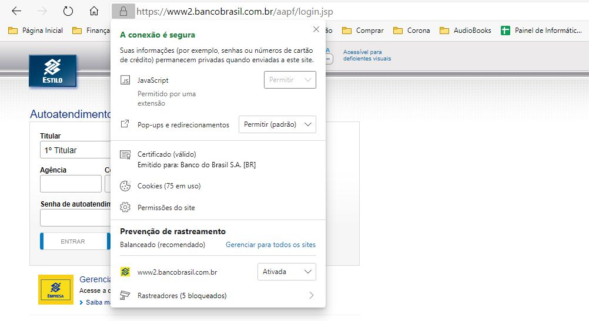

# Capítulo 3 – Internet: Conceitos e Tecnologias

A Internet tornou-se uma ferramenta tão onipresente na vida moderna que é fácil esquecer que ela é, de fato, uma infraestrutura tecnológica complexa, com uma história fascinante e princípios de funcionamento específicos. No dia a dia, ela é a janela para o mundo, a ferramenta de trabalho e a plataforma de entretenimento. No entanto, por trás da aparente simplicidade de abrir um site ou enviar um e-mail, existe uma arquitetura global de redes interconectadas. Este capítulo se aprofunda nos conceitos e tecnologias que definem a Internet, começando por suas origens surpreendentes.

## Contexto Histórico

A história da Internet não começa com comércio ou entretenimento, mas sim com a tensão geopolítica da Guerra Fria. Suas raízes estão profundamente fincadas na estratégia militar dos Estados Unidos, que, durante as décadas de 1950 e 1960, buscava uma forma de manter seus sistemas de comunicação operacionais mesmo diante de um ataque nuclear. A preocupação era que um sistema de comando centralizado seria um alvo fácil e vulnerável. A solução seria criar uma rede _descentralizada_, capaz de continuar funcionando mesmo que partes dela fossem destruídas.

O grande catalisador para essa iniciativa surgiu em 1957, quando a União Soviética lançou o Sputnik, o primeiro satélite artificial. Esse evento chocou os Estados Unidos, que temiam estar ficando para trás na corrida tecnológica. Em resposta, o governo americano criou, em 1958, a **ARPA (Advanced Research Projects Agency)**, uma agência dedicada a financiar projetos de pesquisa de ponta para garantir a vanguarda tecnológica militar.

### Nascimento da ARPANET e a Comutação por Pacotes

Um dos projetos da ARPA, iniciado na década de 1960, foi a **ARPANET**. Seu objetivo era interligar computadores de diferentes universidades e centros de pesquisa que prestavam serviços ao governo. O principal desafio técnico era como fazer esses computadores, distantes geograficamente, conversarem de forma eficiente e, acima de tudo, resiliente.

A tecnologia de comunicação dominante na época era a **comutação por circuito**, utilizada pela rede telefônica. Nesse modelo, um caminho físico dedicado (um "circuito") é estabelecido entre o remetente e o destinatário e permanece reservado durante toda a comunicação. Isso é como reservar uma estrada inteira apenas para dois carros viajarem, mesmo que eles fiquem parados por longos períodos. É um método ineficiente, pois o recurso fica ocioso, e vulnerável, pois se qualquer ponto da estrada for bloqueado, a comunicação é interrompida.

A ARPANET introduziu uma abordagem revolucionária: a **comutação por pacotes**. Neste modelo, a informação a ser enviada (seja um e-mail, um arquivo ou uma imagem) é quebrada em pequenos blocos de dados, chamados **pacotes**. Cada pacote é "endereçado" com informações de origem, destino e sua ordem sequencial. Eles são então enviados pela rede de forma independente.

Usando a analogia do correio, em vez de enviar um relatório volumoso em uma única caixa gigante, o relatório é dividido em vários envelopes menores (pacotes). Cada envelope pode seguir uma rota diferente pelos correios. Os pacotes viajam de roteador em roteador pela rede, e se uma rota estiver congestionada ou for destruída, os pacotes são automaticamente redirecionados por outros caminhos. No destino, o computador receptor recolhe todos os envelopes (pacotes), que podem chegar fora de ordem, e os reorganiza na sequência correta para remontar o relatório original.

Esse método trouxe duas vantagens cruciais:

1. **Resiliência:** A rede não possui um ponto central de falha. Se um nó ou uma rota for perdida, os pacotes simplesmente encontram outro caminho.
2. **Eficiência:** Os recursos da rede (os "cabos" ou "linhas") são compartilhados. Várias comunicações podem usar a mesma linha simultaneamente, já que os pacotes de diferentes usuários são intercalados. A linha não fica mais ociosa.

### Protocolo TCP/IP

Com o sucesso e o crescimento da ARPANET, surgiu um desafio logístico: como gerenciar os endereços de todos os computadores na rede. Em 1973, optou-se por um registro central na Universidade de Stanford (SRI), que mantinha a lista mestra de endereços, facilitando a organização e o encaminhamento de pacotes.

Ao mesmo tempo, outras redes de comutação por pacotes começaram a surgir, cada uma com seus próprios formatos de dados e regras de comunicação. A ARPANET era apenas uma delas. O verdadeiro desafio tornou-se a "interconexão de redes" (ou _internetworking_). Como fazer com que essas redes diferentes, com "idiomas" distintos, pudessem trocar informações?

A solução foi a criação de um conjunto universal de protocolos de comunicação: o **TCP/IP (Transmission Control Protocol / Internet Protocol)**. Esse conjunto atua como a "língua franca" da comunicação em rede:

- **IP (Internet Protocol):** É o responsável pelo endereçamento e roteamento dos pacotes, garantindo que eles cheguem ao computador de destino correto, mesmo que precisem cruzar várias redes diferentes.
- **TCP (Transmission Control Protocol):** É o responsável pela confiabilidade. Ele gerencia a divisão da informação em pacotes na origem e sua remontagem correta no destino, verificando se todos os pacotes chegaram e solicitando a retransmissão daqueles que se perderam no caminho.

A adoção do TCP/IP como padrão permitiu que redes acadêmicas, comerciais e governamentais de todo o mundo se interconectassem, formando a rede global que hoje conhecemos como Internet.

### Os Serviços da Internet

A Internet em si é a infraestrutura – os cabos, roteadores e protocolos. Sobre essa infraestrutura, rodam diversas **aplicações** ou **serviços** que utilizamos no dia a dia. A seguir, são descritos os principais serviços disponíveis na rede.

| **Serviços**              | **Descrição**                                                                                                                                                                                                                                                                                                                                                                      |
| ------------------------- | ---------------------------------------------------------------------------------------------------------------------------------------------------------------------------------------------------------------------------------------------------------------------------------------------------------------------------------------------------------------------------------- |
| World Wide Web (WWW)      | Trata-se do serviço de visualização de páginas web organizadas em sites em que milhares de pessoas possuem acesso instantâneo a uma vasta gama de informação online em hipermídia que podem ser acessadas via navegador – é o serviço mais utilizado na Internet. Em geral, esse serviço utiliza protocolos como HTTP e HTTPS.                                                     |
| Correio Eletrônico        | Trata-se do serviço de composição, envio e recebimento de mensagens eletrônicas entre partes de uma maneira análoga ao envio de cartas – é anterior à criação da Internet. Utiliza tipicamente um modo assíncrono de comunicação que permite a troca de mensagens dentro de uma organização. Em geral, esse serviço utiliza protocolos como POP3, IMAP e SMTP.                     |
| Acesso Remoto             | Trata-se do serviço que permite aos usuários facilmente se conectarem com outros computadores, mesmo que eles estejam em localidades distantes no mundo. Esse acesso remoto pode ser feito de forma segura, com autenticação e criptografia de dados, se necessário. Em geral, esse serviço utiliza protocolos como SSH, RDP, VNC.                                                 |
| Transferência de Arquivos | Trata-se do serviço de tornar arquivos disponíveis para outros usuários por meio de downloads e uploads. Um arquivo de computador pode ser compartilhado ou transferido com diversas pessoas através da Internet, permitindo o acesso remoto aos usuários. Em geral, esse serviço utiliza protocolos como FTP e P2P.                                                               |
| Wiki                      | Wikis são plataformas colaborativas online que permitem que múltiplos usuários editem, criem e organizem conteúdo de forma conjunta. Qualquer pessoa pode modificar ou adicionar informações, facilitando a construção de conhecimento coletivo. Um exemplo famoso é a Wikipedia, onde o conteúdo é constantemente atualizado e expandido por sua comunidade de usuários.          |
| Ferramentas de Busca      | Ferramentas de busca são plataformas que permitem aos usuários pesquisar informações na web por meio de palavras-chave. Eles utilizam algoritmos para indexar e classificar páginas da internet, exibindo resultados relevantes em poucos segundos. Exemplos populares incluem Google, Bing e Yahoo, que ajudam a localizar websites, imagens, vídeos e outros conteúdos digitais. |
| Redes Sociais             | Redes sociais são plataformas digitais que conectam usuários, permitindo a criação e o compartilhamento de conteúdo como textos, imagens, vídeos e links. Elas facilitam a interação entre indivíduos e comunidades através de curtidas, comentários e mensagens. Exemplos incluem Facebook, Instagram e Twitter, que possibilitam a troca de informações em tempo real.           |
| Grupos de Discussão       | Grupos de Discussão são espaços virtuais onde pessoas com interesses comuns se reúnem para trocar informações, debater ideias e compartilhar experiências sobre um tema específico. Esses grupos podem ser organizados em fóruns online, listas de e-mails ou plataformas sociais, facilitando a comunicação e a colaboração entre os participantes em torno de tópicos variados.  |
| Computação em Nuvem       | Computação em nuvem é a tecnologia que permite o armazenamento, processamento e gerenciamento de dados e aplicativos pela internet, em vez de servidores ou dispositivos locais. Os recursos de TI são fornecidos sob demanda, permitindo que empresas e usuários acessem dados remotamente, escalem operações e reduzam custos de infraestrutura física.                          |
| Portais Web               | Portais Web são plataformas que centralizam e organizam uma vasta gama de informações e serviços em um único local online. Eles oferecem acesso a conteúdos diversos, como notícias, e-mails, fóruns, e-commerce e mais. Funcionam como uma porta de entrada para a navegação na web, facilitando o acesso a recursos variados em um só lugar.                                     |

### Arquitetura Padrão: Cliente/Servidor

A maioria dos serviços da Internet, incluindo a World Wide Web e o Correio Eletrônico, opera sob um modelo de arquitetura fundamental conhecido como **cliente/servidor**. Esse modelo organiza a comunicação de forma eficiente, dividindo as tarefas entre dois tipos de participantes:

- O **Cliente (Client)** é o dispositivo que consome o serviço. É o computador pessoal, smartphone ou tablet. O cliente é responsável por _iniciar_ a comunicação, fazendo uma **solicitação** (request) por um recurso. Por exemplo, quando se digita um endereço no navegador (como o Google Chrome ou Firefox), o navegador atua como um cliente solicitando uma página web.
- O **Servidor (Server)** é um computador ou sistema robusto, sempre conectado à rede, cuja função é _aguardar_ e _processar_ as solicitações dos clientes. Quando o servidor recebe uma solicitação (por exemplo, "entregue-me a página inicial do site"), ele localiza o recurso e o envia de volta ao cliente como uma **resposta** (response). Um único servidor pode atender a milhares de clientes simultaneamente.

Essa separação de papéis é crucial, pois permite que os servidores centralizem e gerenciem os dados de forma segura e eficiente (como armazenar todas as páginas de um site ou todos os e-mails de uma conta), enquanto os clientes precisam apenas da capacidade de acessar esses recursos remotamente. Isso garante a escalabilidade e o compartilhamento de recursos que definem a Internet moderna.

## Conceitos Básicos

A Internet, em sua essência, é a maior e mais conhecida rede de computadores do mundo. Portanto, para compreender verdadeiramente a Internet, é fundamental primeiro entender o que é uma **rede de computadores**.

Uma definição formal descreve uma rede como:

> “Um conjunto de terminais, equipamentos, meios de transmissão e comutação que interligados possibilitam a prestação de serviços”.

Uma definição mais simples e direta afirma que uma rede é um conjunto de dispositivos (normalmente conhecidos como **nós**) conectados por **links de comunicação**. Em uma rede moderna, um "nó" não é apenas um computador de mesa. Pode ser um notebook, uma impressora, um smartphone, um tablet, um _smartwatch_, uma Smart TV, uma câmera de segurança ou qualquer outro dispositivo capaz de enviar e receber dados que esteja conectado a outros nós da rede.

As primeiras redes de computadores surgiram dentro de organizações fechadas, como laboratórios de pesquisa e grandes empresas. O objetivo inicial era duplo:

1. **Facilitar a Troca de Informações:** Antes das redes, a transferência de dados entre computadores era um processo físico e manual. Envolvia pessoas carregando pilhas de cartões perfurados ou rolos de fitas magnéticas de um lado para o outro. Uma rede interna permitia que essa troca de informações fosse feita de forma digital, o que era drasticamente mais rápido e confiável.
2. **Compartilhar Recursos Físicos:** O segundo benefício, de enorme impacto econômico, foi o compartilhamento de recursos de _hardware_. Equipamentos como impressoras de grande porte e, principalmente, dispositivos de armazenamento de dados, eram extremamente caros. Em vez de cada computador possuir sua própria impressora, uma rede permitia que um departamento inteiro compartilhasse uma única impressora de rede. Da mesma forma, um grande e caro dispositivo de armazenamento poderia ser centralizado e acessado por todos.

Em essência, o objetivo fundamental de uma rede de computadores pode ser resumido em três pilares: o **compartilhamento de recursos** (sejam eles equipamentos, programas ou dados) e a **comunicação** entre pessoas (através da troca de mensagens de texto, áudio ou vídeo).

### Classificação quanto à Abrangência Geográfica

A forma mais comum de classificar as redes de computadores é pela sua dimensão, ou seja, a área geográfica que elas cobrem. Sob essa ótica, as redes são tradicionalmente divididas em PAN, LAN, MAN e WAN.

#### PAN (Personal Area Network)

A **Rede de Área Pessoal** é definida como uma rede projetada para conectar e transmitir dados entre dispositivos que estão localizados no espaço imediato de uma pessoa. Ela abrange uma área muito pequena, geralmente limitada a alguns metros.

Com frequência, essa rede não utiliza fios, sendo chamada de **WPAN (Wireless Personal Area Network)**. A tecnologia mais emblemática deste tipo de rede é o **Bluetooth**.

Exemplos clássicos de uma PAN estão presentes no cotidiano: a conexão entre um smartphone e uma caixa de som portátil na beira da piscina é uma PAN. Da mesma forma, um corredor que utiliza um fone de ouvido sem fio conectado a um smartphone para ouvir música durante a atividade física está criando e utilizando uma PAN. Outros exemplos incluem teclados, mouses e impressoras sem fio conectados a um computador via Bluetooth.

É importante notar que, em algumas classificações acadêmicas ou em questões de prova, a PAN pode não ser tratada como uma categoria padrão ao lado de LAN, MAN e WAN, mas sua existência prática é inegável.

| **Características** | **Descrição**                                                                  |
| ------------------- | ------------------------------------------------------------------------------ |
| Definição           | Rede pessoal que cobre uma área pequena, geralmente cerca de alguns metros.    |
| Cobertura           | Alguns centímetros a poucos metros.                                            |
| Finalidade          | Conectar dispositivos pessoais de curto alcance.                               |
| Velocidade          | Geralmente de alta velocidade devido à proximidade dos dispositivos.           |
| Tecnologias         | Em geral, Bluetooth, Wi-Fi, USB.                                               |
| Segurança           | Geralmente mais segura devido à proximidade física.                            |
| Complexidade        | Menos complexa devido à simplicidade da conexão.                               |
| Isolamento          | Fácil de isolar problemas devido à proximidade.                                |
| Aplicações          | Conexão de dispositivos pessoais (Ex: fones de ouvido sem fio, teclados, etc). |

### LAN (Local Area Network)

A **Rede de Área Local**, ou **LAN**, é o tipo de rede mais comum no cotidiano. Ela é definida por sua abrangência geográfica limitada, conectando dispositivos dentro de uma área restrita, como uma residência, um único andar de um prédio, um escritório ou um laboratório escolar. O exemplo clássico de uma LAN no passado eram as _Lan Houses_, locais que interligavam diversos computadores para jogos em rede e acesso à internet.

Hoje, a rede de uma residência é um exemplo perfeito de LAN: ela conecta computadores, notebooks, Smart TVs, consoles de videogame e smartphones a um único roteador central, permitindo que todos acessem a internet e compartilhem recursos entre si, como uma impressora.

Em um ambiente corporativo, uma LAN permite a troca de informações, a comunicação eficaz entre os funcionários e o compartilhamento de recursos caros, como servidores de arquivos e impressoras de alta capacidade.

Tecnicamente, as LANs são caracterizadas por oferecerem **altas velocidades de transmissão**, pois as distâncias são curtas. Elas podem ser implementadas com cabos (principalmente com a tecnologia **Ethernet**) ou sem fios (criando uma **WLAN**, ou Rede Local Sem Fio, mais conhecida pelo nome comercial **Wi-Fi**). A topologia moderna mais comum é a "estrela", onde todos os dispositivos se conectam a um equipamento central, como um _switch_ ou um roteador. Devido ao seu ambiente controlado, as LANs geralmente apresentam uma baixa ocorrência de erros na transmissão de dados.

|**Características**|**Descrição**|
|---|---|
|Definição|Rede local que abrange uma área geográfica limitada (Ex: edifício ou campus).|
|Cobertura|De algumas centenas de metros a alguns quilômetros.|
|Finalidade|Facilitar a comunicação dentro de uma organização local.|
|Velocidade|Alta velocidade dentro da rede local.|
|Tecnologias|Em geral, Ethernet e Wi-Fi.|
|Segurança|Pode ser configurada com medidas de segurança, como firewalls.|
|Complexidade|De complexidade moderada, dependendo do tamanho da rede.|
|Isolamento|Problemas podem ser isolados com relativa facilidade.|
|Aplicações|Uso em escritórios, escolas e redes corporativas locais.|

### MAN (Metropolitan Area Network)

A **Rede de Área Metropolitana**, ou **MAN**, representa um passo intermediário entre a LAN e a WAN (que veremos a seguir). Como o nome sugere, ela é projetada para cobrir uma área geográfica do tamanho de uma cidade ou uma grande metrópole.

Uma MAN não é, tipicamente, uma rede única construída do zero; ela é, na maioria das vezes, o resultado da **interligação de várias LANs** pertencentes a uma mesma organização, mas que estão fisicamente separadas por quilômetros.

Considere uma empresa que possui sua sede (matriz) no centro da cidade e dezenas de filiais espalhadas por diferentes bairros. Cada um desses locais possui sua própria LAN. Para que todos os funcionários possam acessar os mesmos sistemas internos como se estivessem no mesmo prédio, a empresa contrata links de alta velocidade (geralmente de fibra óptica, fornecidos por uma operadora de telecomunicações) para conectar todas essas LANs. A rede resultante, que abrange toda a cidade, é uma MAN. Outro exemplo seria um campus universitário cujas faculdades e centros de pesquisa estão localizados em diferentes pontos da cidade.

|**Características**|**Descrição**|
|---|---|
|Definição|Rede metropolitana que abrange uma cidade ou uma área metropolitana.|
|Cobertura|Algumas dezenas de quilômetros.|
|Finalidade|Conectar redes locais dentro de uma área metropolitana.|
|Velocidade|Velocidade variável, dependendo da infraestrutura da rede.|
|Tecnologias|Em geral, Ethernet e fibra óptica.|
|Segurança|Maior risco devido à extensão geográfica, exigindo segurança adicional.|
|Complexidade|Moderadamente complexa por conta da complexidade da infraestrutura.|
|Isolamento|Pode ser desafiador isolar problemas devido à extensão geográfica.|
|Aplicações|Integração de redes locais em uma área metropolitana.|

### WAN (Wide Area Network)

A **Rede de Área Extensa**, ou **WAN**, é a classificação para redes que cobrem grandes áreas geográficas, sem restrições de distância. Uma WAN é utilizada para conectar e transmitir dados entre dispositivos localizados em diferentes cidades, estados, países ou até continentes.

Na prática, uma WAN é uma "rede de redes", conectando múltiplas LANs e MANs. Quando uma empresa possui filiais em Brasília e Goiânia e as interliga, ela está criando uma rede privada do tipo WAN. O exemplo do Programa Antártico Brasileiro (PROANTAR), que envia dados de suas pesquisas na Antártida para o Brasil, ilustra perfeitamente o alcance de uma WAN, que neste caso utiliza links de satélite.

Contudo, o exemplo mais clássico, abrangente e definitivo de uma WAN é a própria **Internet**. Ela é uma rede mundial pública que interconecta milhões de redes (LANs, MANs e outras WANs), permitindo a comunicação em escala global.

Por dependerem de infraestruturas de longa distância (como cabos de fibra óptica submarinos, satélites e redes de operadoras), as WANs são as redes mais complexas e, historicamente, apresentavam velocidades de conexão mais baixas que as LANs, embora os avanços em fibra óptica tenham reduzido significativamente essa diferença.

|**Características**|**Descrição**|
|---|---|
|Definição|Rede de grande área que pode abranger cidades, países ou até continentes.|
|Cobertura|Centenas a milhares de quilômetros.|
|Finalidade|Conectar redes em diferentes locais geograficamente distantes.|
|Velocidade|Geralmente menor velocidade devido a longas distâncias.|
|Tecnologias|Frame Relay, MPLS, Internet.|
|Segurança|Requer medidas rigorosas devido ao alcance e à exposição a ameaças.|
|Complexidade|Em geral, complexa devido à escala global e aos diferentes tipos de tecnologia.|
|Isolamento|Requer ferramentas avançadas para isolar problemas em redes extensas.|
|Aplicações|Comunicação em escala regional, nacional ou global.|

### Resumo da Classificação Geográfica

A tabela a seguir consolida as diferenças de abrangência entre os tipos de rede discutidos.

|**Tipo**|**Sigla**|**Descrição**|**Distância**|
|---|---|---|---|
|Personal Area Network|PAN|Rede de computadores pessoal (celular, tablet, notebook, etc).|De alguns centímetros a alguns poucos metros.|
|Local Area Network|LAN|Rede de computadores de lares, escritórios, prédios, entre outros.|De algumas centenas de metros a alguns quilômetros.|
|Metropolitan Area Network|MAN|Rede de computadores entre uma matriz e filiais em uma cidade.|Cerca de algumas dezenas de quilômetros.|
|Wide Area Network|WAN|Rede de computadores entre cidades, países ou até continentes.|De algumas dezenas a milhares de quilômetros.|

É importante notar que todas essas classificações possuem uma correspondente direta quando a tecnologia de transmissão de dados principal não utiliza cabos (_wireless_). Nesses casos, o prefixo "W" é adicionado à sigla:

- **WPAN (Wireless Personal Area Network):** A rede Bluetooth.
- **WLAN (Wireless Local Area Network):** A rede Wi-Fi.
- **WMAN (Wireless Metropolitan Area Network):** Tecnologias como o WiMAX, que buscaram oferecer cobertura de internet sem fio em larga escala para cidades.
- **WWAN (Wireless Wide Area Network):** A tecnologia de dados móveis que usamos em nossos smartphones (como as redes **3G, 4G e 5G**).

## World Wide Web (WWW)

É comum, no dia a dia, que os termos "Internet" e "Web" sejam usados como sinônimos. No entanto, do ponto de vista técnico, é crucial entender que eles **não são a mesma coisa**.

A **Internet** é a infraestrutura física e lógica global: a vasta rede de cabos submarinos, satélites, roteadores, servidores e protocolos (como o TCP/IP) que conecta milhões de redes de computadores em todo o mundo. A **Web**, uma contração do termo **World Wide Web (WWW)**, é um dos muitos _serviços_ ou _aplicações_ que rodam sobre essa infraestrutura.

A analogia da rede rodoviária, mencionada em suas anotações, é a forma mais clara de entender essa diferença:

- A **Internet** é a rede global de estradas, ruas e rodovias. É a infraestrutura que permite o tráfego e a conexão entre diferentes pontos.
- A **Web** é o conjunto de destinos que existem ao longo dessas estradas: as lojas, as bibliotecas, as casas e os escritórios (ou seja, os _sites_).
- Outros serviços, como o **Correio Eletrônico (e-mail)**, seriam o sistema de correios, que também _usa_ as mesmas estradas da Internet para transportar suas cartas (mensagens), mas opera de forma independente das lojas (sites da Web).

Portanto, a Web é uma gigantesca aplicação distribuída, rodando em milhões de servidores ao redor do mundo, que nos permite acessar e interagir com informações por meio de navegadores.

### Componentes Fundamentais da Web

A Web, como serviço, opera com base em um conjunto de tecnologias e componentes padrão que trabalham juntos para permitir a navecagação.

|**Componentes da Web**|**Descrição**|
|---|---|
|Hipertexto|A Web é baseada em documentos que contêm links (hiperlinks) para outros documentos relacionados. Isso permite que os usuários naveguem de uma página para outra, seguindo os links.|
|URL|Cada documento ou recurso na Web é identificado por um URL (Uniform Resource Locator) exclusivo, que é um endereço usado para acessar o recurso em um navegador.|
|Navegadores da Web|São os aplicativos-cliente (softwares) que permitem aos usuários visualizar e interagir com documentos da Web. Exemplos populares de navegadores incluem o Google Chrome, Mozilla Firefox, Microsoft Edge e Safari.|
|Protocolos de Comunicação|A Web utiliza protocolos de comunicação, como HTTP (Hypertext Transfer Protocol) e HTTPS (HTTP Secure), para transferir dados entre navegadores e servidores web.|
|Servidores Web|São computadores que hospedam documentos e recursos da Web. Eles respondem às solicitações dos navegadores e fornecem os conteúdos solicitados.|
|Páginas da Web|São os documentos criados usando linguagens de marcação, como HTML (Hypertext Markup Language). As páginas da web podem conter texto, imagens, links e outros elementos interativos.|
|Motores de Busca|São ferramentas que ajudam os usuários a encontrar informações na Web, indexando e classificando páginas da web com base em palavras-chave.|

A Web não é uma entidade estática; ela evoluiu drasticamente desde sua criação. Essa evolução é frequentemente categorizada em "gerações" (Web 1.0, 2.0, 3.0, etc.). É importante notar que essas gerações não se excluem mutuamente, mas sim se sobrepõem. As características de uma nova geração são adicionadas ao ecossistema, convivendo com as tecnologias das gerações anteriores. A seguir, vamos explorar essas fases em detalhe.

### Web 0.0: Gênese da Web

A World Wide Web nasceu de uma necessidade prática. Em março de 1989, **Tim Berners-Lee**, um físico britânico que trabalhava no CERN (Organização Europeia para a Pesquisa Nuclear), propôs um sistema de gerenciamento de informações. O desafio no CERN era que pesquisadores de todo o mundo precisavam compartilhar dados e documentos, mas estes estavam em computadores diferentes, com formatos diferentes e sistemas incompatíveis.

A solução de Berners-Lee foi a criação de um sistema de hipertexto global. Para isso, ele inventou as três tecnologias fundamentais que formam a base da Web até hoje:

1. **URL (Uniform Resource Locator):** O sistema de endereçamento universal para localizar qualquer recurso na rede (ex: `http://www.exemplo.com`).
2. **HTML (Hypertext Markup Language):** A linguagem de marcação para criar as páginas da web e seus links (hiperlinks).
3. **HTTP (Hypertext Transfer Protocol):** O protocolo (o "idioma") que permite que um navegador (cliente) requisite e um servidor entregue uma página HTML.

Essa fase inicial, que podemos chamar de **Web 0.0**, era essencialmente acadêmica. Em 1991, a primeira página web da história foi colocada no ar no domínio `info.cern.ch`. Era uma página de texto simples com links, explicando o que era o projeto World Wide Web e como utilizá-lo.

O crescimento, a partir daí, foi exponencial. Os números ilustram essa explosão:

- **1991:** 1 página web (a do CERN).
- **1994:** 2.738 páginas web (incluindo o lançamento do Yahoo!).
- **1998:** 2.410.067 páginas web (ano de fundação do Google).
- **2001:** 29.254.370 páginas web (lançamento da Wikipedia).
- **2005:** 64.780.617 páginas web (lançamento do YouTube).
- **2008:** 172.338.776 páginas web (lançamento do Dropbox).
- **2018:** Mais de 1,8 bilhão de páginas web.

O que começou como uma ferramenta para cientistas rapidamente evoluiu para a primeira era pública da web.

### Web 1.0: Web da "Leitura" (Read-Only)

A Web 1.0 corresponde à primeira fase pública da internet, abrangendo aproximadamente de 1994 ao início dos anos 2000. Essa era é caracterizada por **sites estáticos**, com conteúdo fixo e comunicação **unidirecional**.

Nesse modelo, a web funcionava como uma gigantesca biblioteca ou um catálogo de brochuras digitais. Um pequeno número de "webmasters" e empresas criava conteúdo (páginas informativas, portais de notícias, sites institucionais) e o publicava. A esmagadora maioria dos usuários era de **consumidores passivos de conteúdo**.

A interação era mínima. Ela se limitava, na maioria das vezes, a simples formulários de "Fale Conosco", livros de visita (_guestbooks_) ou, no máximo, os primeiros fóruns de discussão. Não havia redes sociais, blogs (como os conhecemos hoje) ou a possibilidade de o usuário comum publicar seu próprio conteúdo de forma fácil.

### Web 2.0: Web Social e da "Leitura-Escrita" (Read-Write)

A Web 2.0 não foi uma atualização técnica da noite para o dia, mas uma mudança de filosofia que se consolidou em meados dos anos 2000. A grande revolução aqui foi a **interatividade** e o **Conteúdo Gerado pelo Usuário (UGC - User-Generated Content)**.

Nesta geração, os usuários deixaram de ser apenas consumidores e passaram a ser, massivamente, **criadores de conteúdo**. A comunicação tornou-se bidirecional. Isso foi possibilitado por novas tecnologias, como o **AJAX**, que permitia que partes de uma página fossem atualizadas sem a necessidade de recarregar a página inteira (permitindo ações como "curtir", comentar em tempo real, arrastar itens em um mapa, etc.).

A Web 2.0 é a era das plataformas de colaboração:

- **Redes Sociais (Facebook, Orkut, Twitter/X):** O usuário cria e compartilha seu próprio conteúdo (textos, fotos, vídeos).
- **Blogs e Wikis (Wikipedia, Blogger):** Plataformas que facilitaram a publicação de textos e a construção coletiva do conhecimento.
- **Compartilhamento de Mídia (YouTube, Flickr):** Serviços inteiros construídos sobre o conteúdo enviado pelos próprios usuários.

Nesta fase, a web tornou-se dinâmica, social e centrada no usuário, com interfaces mais ricas e amigáveis.

### Web 3.0: Web Semântica e Descentralizada

A Web 3.0 é a geração atual e emergente, e seu conceito é, na verdade, uma fusão de duas grandes ideias.

1. **Web Semântica:** Esta foi a visão original de Tim Berners-Lee para a "próxima web". O objetivo é tornar os dados mais **inteligíveis para as máquinas**. Na Web 2.0, um computador sabe que uma página contém o texto "R$ 100", mas não sabe o que isso _significa_. Na Web Semântica, os dados têm um "significado" (semântica) atrelado a eles. O computador entende que "R$ 100" é um _preço_ para um _produto_. Isso permite que assistentes virtuais (como a Siri ou o Google Assistente) e sistemas de inteligência artificial compreendam e executem tarefas complexas, oferecendo uma navegação muito mais personalizada e conectada.
2. **Web Descentralizada (Web3):** Esta é uma interpretação mais recente, impulsionada por tecnologias como o **Blockchain**. O foco aqui é a **propriedade dos dados**. Enquanto na Web 2.0 os dados dos usuários são controlados por grandes empresas (Meta, Google, Amazon), a Web 3.0 propõe um modelo descentralizado, onde os usuários têm maior controle e propriedade sobre seus dados e sua identidade digital, sem depender de intermediários. Isso promove maior segurança, transparência e interoperabilidade.

A Web 3.0 é, portanto, a intersecção da **Inteligência Artificial** (a Web Semântica) com a **descentralização** (o Blockchain), visando criar uma internet mais inteligente, personalizada e controlada pelo próprio usuário.

### Comparativo das Gerações da Web

A tabela a seguir resume as principais diferenças entre as fases de evolução da World Wide Web.

|**Características**|**Web 1.0**|**Web 2.0**|**Web 3.0**|
|---|---|---|---|
|Interatividade|Baixa|Alta|Muito Alta|
|Conteúdo|Estático e somente leitura|Dinâmico, com feedback do usuário|Inteligente, com semântica|
|Usuários|Consumidores passivos|Produtores de conteúdos|Participantes ativos|
|Socialização|Ausente|Integração de redes sociais|Integração com IA e Internet das Coisas|
|Experiência do Usuário|Limitada|Melhorada e personalizada|Altamente personalizada|
|Tecnologia|HTML|AJAX, APIs e RSS|IA e Aprendizado de Máquina|
|Exemplos|Sites estáticos de início da web|Redes sociais, blogs e wikis|Assistentes virtuais|
|Principais Aplicações|Sites informativos e institucionais|Redes sociais e colaboração online|Assistentes virtuais e Internet das Coisas|

## Deep Web e Dark Web: As Camadas da Internet

Para a maioria dos usuários, a "internet" é o que se vê através de mecanismos de busca como o Google. No entanto, essa parte visível é apenas a ponta de um imenso iceberg. Estima-se que a **Surface Web**, ou Web de Superfície, componha apenas cerca de 4% de todo o conteúdo online. Esta é a camada da web composta por sites e páginas que são projetados para serem públicos, podendo ser facilmente encontrados, rastreados e **indexados** por mecanismos de busca comuns. Páginas de notícias, blogs, sites de e-commerce e perfis públicos em redes sociais são todos parte da Surface Web.

|**Surface Web**|**Descrição**|
|---|---|
|Acessibilidade|Facilmente acessível por meio de mecanismos de busca e navegadores padrão.|
|Conteúdo Público|Compreende sites, páginas e conteúdo que são acessíveis ao público em geral.|
|Indexação por Mecanismos de Busca|Os motores de busca, como Google e Bing, indexam e exibem o conteúdo da Surface Web em resultados de pesquisa.|
|Informações Amplamente Visíveis|Notícias, blogs, lojas online, fóruns públicos e outros tipos de sites podem ser encontrados na Surface Web.|
|Sem Restrições Significativas|Os usuários podem navegar e acessar conteúdo sem a necessidade de credenciais ou permissões especiais.|
|Exemplos|Páginas de notícias, blogs, lojas online e outros sites acessíveis ao público em geral.|

### Web Profunda (Deep Web)

Os outros 96% da internet compõem a **Deep Web** (Web Profunda). É fundamental esclarecer que a Deep Web, por si só, não é um local ilegal ou sinistro; ela é, na verdade, a maior parte da internet que usamos todos os dias.

A Deep Web é definida como o conjunto de todas as páginas e recursos da web que **não são indexados** por mecanismos de busca padrão. O conteúdo não é indexado por diversos motivos, sendo o mais comum a necessidade de **autenticação** ou por ser conteúdo gerado dinamicamente.

Sempre que se acessa uma área que exige um nome de usuário e uma senha, está-se navegando na Deep Web. Isso inclui:

- Contas de e-mail (Gmail, Hotmail, etc.).
- Serviços de _Internet Banking_.
- Contas de redes sociais (o _feed_ privado, mensagens diretas).
- Bancos de dados de universidades e bibliotecas.
- Registros médicos online.
- **Intranets** corporativas, que são redes internas de empresas acessíveis apenas por funcionários autorizados.

Embora esse conteúdo não seja visível para o público geral, isso não garante a privacidade total. A comunicação entre o computador do usuário e esses servidores (o banco, a intranet da empresa) deixa rastros e registros. O provedor de internet sabe quais servidores foram acessados, e o próprio servidor (o banco, por exemplo) registra toda a atividade da conta.

|**Deep Web**|**Descrição**|
|---|---|
|Conteúdo não Indexado por Mecanismos de Busca|O conteúdo da Deep Web não é indexado pelos mecanismos de busca tradicionais, o que o torna invisível nas pesquisas comuns.|
|Requer Autenticação|Muitos sites da Deep Web exigem credenciais ou autenticação para acessar, tornando o conteúdo acessível apenas a usuários autorizados.|
|Informações Confidenciais|Inclui informações privadas, como dados de empresas, registros médicos, sistemas de gerenciamento de bibliotecas e muito mais.|
|Não Acessível por Links Comuns|Não se pode simplesmente clicar em um link público para acessar o conteúdo da Deep Web; geralmente, precisa-se de informações de login ou URLs específicas.|
|Variedade de Conteúdo|A Deep Web abrange uma ampla gama de informações, desde bancos de dados privados a sistemas de gerenciamento de conteúdo corporativo.|

### Web Escura (Dark Web)

A **Dark Web** (Web Escura) é uma **subseção** da Deep Web. Todo conteúdo da Dark Web está na Deep Web, mas nem todo conteúdo da Deep Web está na Dark Web.

A principal diferença é a tecnologia utilizada e o foco no **anonimato**. A Dark Web é composta por redes sobrepostas (ou _overlay networks_) que não são acessíveis por navegadores convencionais e que exigem softwares específicos para ocultar a identidade do usuário e a localização do servidor.

A mais famosa dessas redes é a **Rede Tor**. Originalmente um projeto de pesquisa da Marinha dos EUA para comunicações seguras, o Tor hoje é uma rede global operada por milhares de voluntários.

O nome "Tor" vem de "O Roteador Cebola" (_The Onion Router_), uma analogia a como os dados são protegidos. Quando se faz uma requisição usando o Navegador Tor, os dados não vão diretamente do computador do usuário para o servidor do site. Em vez disso, a requisição é criptografada em múltiplas camadas (como uma cebola) e "quica" por uma série de servidores proxy aleatórios (os "nós" da Rede Tor) ao redor do mundo.

Cada nó só consegue "descascar" uma camada de criptografia, o suficiente para saber qual será o próximo nó da rota, mas sem saber a origem original ou o destino final. O último nó ("nó de saída") faz a requisição final ao site de destino, que por sua vez enxerga apenas o IP desse nó de saída, e não o do usuário original. Isso torna o endereço IP do usuário não identificável e não rastreável.

É importante notar que o Navegador Tor pode ser usado para duas finalidades:

1. **Acessar a Surface Web anonimamente:** Pode-se usar o Tor para acessar o `Google.com`. O Google não saberá _quem_ está acessando, mas saberá que _alguém_ está acessando seus serviços. Essa é uma ferramenta crucial para ativistas, jornalistas e cidadãos em países com regimes repressivos ou censura na internet.
2. **Acessar a Dark Web:** Existem sites que só existem _dentro_ da Rede Tor, conhecidos por seus endereços especiais terminados em `.onion`. Nesses casos, não apenas a identidade do usuário está oculta, mas a localização do servidor que hospeda o site também está. Isso permite um anonimato quase completo para ambas as partes.

É nesse segundo cenário que as atividades ilícitas florescem, pois o anonimato total dificulta a aplicação da lei. A Dark Web é, infelizmente, um ambiente conhecido por hospedar mercados de entorpecentes, venda de armas, contratação de serviços ilegais (como matadores de aluguel), planejamento de atentados terroristas, compartilhamento de material de abuso infantil, vazamento de documentos sigilosos, comércio de dados roubados, conteúdos de extrema violência, racismo e falsificação de documentos.

| **Dark Web**                      | **Descrição**                                                                                                                             |
| --------------------------------- | ----------------------------------------------------------------------------------------------------------------------------------------- |
| Acessível com Software Específico | A Dark Web é acessada por meio de redes criptografadas, como o Tor (The Onion Router), que requerem software especial para acesso.        |
| Conteúdo Ilegal e Obscuro         | Inclui sites que hospedam atividades ilegais, como tráfico de drogas, armas, venda de informações roubadas e outros conteúdos obscuros.   |
| Anonimato é Valorizado            | Os usuários da Dark Web muitas vezes valorizam o anonimato, pois os serviços são frequentemente anônimos e transações são criptografadas. |
| Riscos à Segurança                | A Dark Web é um ambiente de alto risco, onde os usuários podem ser vítimas de fraudes e ataques cibernéticos.                             |
| Níveis Profundos de Anonimato     | Diferentemente da Deep Web, a Dark Web oferece um nível mais profundo de anonimato e criptografia, tornando difícil rastrear usuários.    |

Devido à natureza desse ambiente, ele é povoado por hackers, cibercriminosos e agências de aplicação da lei. Não é um local recomendado para acesso por curiosidade, dado o alto risco de exposição a malwares e conteúdos perturbadores.

#### Dark Web e Criptomoedas

A natureza anônima da Dark Web exige um sistema financeiro igualmente anônimo. Transações com cartão de crédito ou transferências bancárias são rastreáveis e deixam um rastro digital claro. Por isso, as **criptomoedas**, com destaque para o **Bitcoin**, tornaram-se o meio de pagamento padrão nesses mercados.

O caso mais famoso foi o do **Silk Road** (Rota da Seda), um mercado online da Dark Web lançado em 2011, que funcionava como um "eBay para drogas" e outros produtos ilícitos. Todas as transações eram feitas exclusivamente em Bitcoin, pois a criptomoeda não passa pelo sistema financeiro tradicional e oferece um alto grau de anonimato (pseudonimato).

Em 2013, o FBI conseguiu fechar o site e prender seu fundador. Curiosamente, a queda do administrador não se deu por uma falha na tecnologia Tor ou no Bitcoin, mas por erro humano: ele havia usado seu nome verdadeiro em um fórum na Surface Web anos antes, em uma postagem que pôde ser conectada às atividades do Silk Road. Ele foi condenado à prisão perpétua.

### Resumo das Camadas da Web

A tabela a seguir consolida as diferenças entre as três camadas da web, e a analogia do iceberg ajuda a visualizar essa estrutura.

| **Características** | **Surface Web**                                                                  | **Deep Web**                                                                                        | **Dark Web**                                                    |
| ------------------- | -------------------------------------------------------------------------------- | --------------------------------------------------------------------------------------------------- | --------------------------------------------------------------- |
| Acessibilidade      | Acessível por mecanismos de busca e navegadores comuns.                          | Requer credenciais específicas ou URLs exclusivas.                                                  | Acessível apenas por redes criptografadas, como o Tor.          |
| Conteúdo Comum      | Contém informações e sites disponíveis publicamente.                             | Inclui conteúdo não indexado por mecanismos de busca, como bancos de dados privados.                | Contém conteúdo obscuro e frequentemente ilegal.                |
| Anonimato           | Não oferece anonimato especial para usuários.                                    | Pode exigir credenciais de login, mas não enfatiza o anonimato.                                     | Valoriza altos níveis de anonimato e segurança.                 |
| Conteúdo Comercial  | Amplamente usado para negócios, educação, entretenimento e informações públicas. | Inclui recursos protegidos por senha, como e-mails, serviços bancários online e redes corporativas. | Muitas vezes associada a atividades ilegais e conteúdo obscuro. |
| Exemplos            | Sites de notícias, blogs, redes sociais, sites de compras online.                | E-mails privados, intranets corporativas, bancos de dados de bibliotecas.                           | Sites de venda de drogas, mercados negros, fóruns de hackers.   |

## Internet das Coisas (IoT)

A sociedade contemporânea está no meio de um profundo processo de **transformação digital**, no qual empresas e indivíduos integram tecnologias inovadoras para otimizar operações, resolver problemas complexos e agregar valor. Esse movimento envolve uma reestruturação cultural e operacional, onde a tecnologia deixa de ser uma ferramenta de suporte para se tornar o pilar central do sucesso, da agilidade e da resiliência.

A pandemia de COVID-19, em particular, atuou como um catalisador poderoso para essa transformação. Empresas foram compelidas a adotar o trabalho remoto em massa, e setores inteiros tiveram que reconfigurar suas operações para atender a novas demandas de distanciamento social e logística. A digitalização deixou de ser uma opção e tornou-se uma necessidade de sobrevivência, consolidando-se como um pilar para o futuro.

Dentro desse cenário de conectividade global em rápida expansão, uma tecnologia se destaca como a próxima grande revolução: a **Internet das Coisas**, ou **IoT** (_Internet of Things_).

### Definindo a Internet das Coisas

A Internet das Coisas refere-se à rede de dispositivos físicos e objetos do cotidiano ("coisas") que são equipados com sensores, software e outras tecnologias com o propósito de **coletar e trocar dados** com outros dispositivos e sistemas através da internet.

Por décadas, a internet foi uma rede de computadores, e mais recentemente, de _smartphones_. A IoT expande essa fronteira para incluir, literalmente, qualquer objeto. Itens que já se tornaram comuns, como câmeras de segurança, _Smart TVs_ e consoles de videogame, são exemplos iniciais de IoT. Em países mais desenvolvidos, essa rede já inclui geladeiras que monitoram o estoque de alimentos e máquinas de lavar que podem ser acionadas remotamente.

A ideia central não é apenas conectar por conectar, mas tornar esses dispositivos mais eficientes e inteligentes em suas funções, permitindo que eles interajam com o ambiente e entre si. A IoT tem aplicações que vão muito além das residências, sendo um motor de eficiência em setores como agricultura (sensores de umidade do solo), pecuária (monitoramento de rebanhos), hospitais (sensores de sinais vitais de pacientes), escolas e, principalmente, na indústria (manutenção preditiva de máquinas).

Com o avanço das redes de alta velocidade, como o **5G**, a conectividade entre esses objetos se tornará ainda mais robusta e onipresente, acelerando a transformação digital e ampliando as possibilidades de uso em todos os contextos.

### Componentes de um Ecossistema IoT

A Internet das Coisas não é uma tecnologia única, mas sim um ecossistema complexo formado por quatro componentes principais que trabalham em conjunto.

|**Componentes**|**Descrição**|
|---|---|
|Dispositivos|São os elementos físicos que compõem a IoT, como sensores, atuadores e outros dispositivos conectados, como câmeras, medidores inteligentes, veículos e eletrodomésticos. Eles coletam dados do mundo real e podem executar ações com base nesses dados.|
|Tecnologias de Comunicação|São os meios pelos quais os dispositivos IoT se comunicam entre si e com a nuvem. Isso pode incluir Wi-Fi, Bluetooth, 3G/4G/5G, Zigbee, LoRa, entre outros. As redes de comunicação são responsáveis pela transferência de dados dos dispositivos para a nuvem e vice-versa.|
|Sensores e Atuadores|Os sensores coletam informações do ambiente, como temperatura, umidade, localização, movimento e muito mais. Os atuadores são responsáveis por tomar ações, como ligar ou desligar um dispositivo. Eles são os olhos e as mãos da IoT.|
|Nuvem (Cloud)|A nuvem é onde os dados coletados pelos dispositivos IoT são processados, armazenados e disponibilizados para acesso. Plataformas de nuvem fornecem recursos de computação, armazenamento e análise de dados em grande escala, tornando possível o processamento de grandes volumes de informações.|

Para ilustrar: imagine uma casa inteligente com monitoramento de segurança, controle de temperatura e gerenciamento de iluminação.

- **Sensores** (temperatura, movimento, fumaça) e **Dispositivos** (câmeras, lâmpadas, aparelhos de ar-condicionado) coletam dados.
- Esses dados são enviados via **Tecnologias de Comunicação** (como Wi-Fi ou Zigbee) para um sistema central.
- Esse sistema, rodando em um serviço de **Nuvem**, processa as informações (ex: "o sensor de temperatura indica 28°C" e "o sensor de presença indica que há alguém na sala").
- O sistema na nuvem então envia um comando para um **Atuador** (o motor do ar-condicionado) para que ele ligue e resfrie o ambiente.

O usuário pode, então, acessar esse sistema em nuvem de qualquer lugar do mundo através de um aplicativo em seu celular.

### Tecnologias Essenciais para a IoT

Para que essa malha de bilhões de dispositivos funcione, duas tecnologias de base são essenciais: endereçamento e comunicação.

**1. O Papel do IPv6:**

O protocolo de internet que usamos por décadas, o IPv4, tinha um limite de cerca de 4,3 bilhões de endereços. Esse número, que parecia gigantesco nos anos 80, esgotou-se. Para a IoT ser viável, onde cada lâmpada, sensor e geladeira precisa de um endereço único na internet, era necessário um sistema muito maior. É aqui que entra o IPv6, a nova versão do protocolo, que oferece um número de endereços tão absurdamente gigantesco (trilhões de trilhões) que, na prática, é ilimitado para o futuro previsível, garantindo que a quantidade de dispositivos e sensores não seja um problema.

**2. Tecnologias de Comunicação:**

A comunicação é o pilar da IoT. Diferentes dispositivos têm diferentes necessidades de energia e alcance, por isso, várias tecnologias coexistem:

|**Tecnologias de Comunicação**|**Descrição**|
|---|---|
|Wi-Fi (802.11)|Trata-se de uma das tecnologias de comunicação sem fio mais amplamente utilizadas e oferece alta largura de banda. É adequado para dispositivos que têm acesso a redes locais de alta velocidade e energia suficiente (ex: Smart TVs, câmeras de segurança).|
|Bluetooth (802.15)|Trata-se de uma tecnologia de comunicação sem fio de curto alcance, adequada para dispositivos pessoais, como fones de ouvido sem fio e dispositivos vestíveis (wearables). O Bluetooth Low Energy (BLE) é uma variante de baixo consumo de energia.|
|ZigBee|Trata-se de um padrão de comunicação sem fio de baixa potência projetado para redes de sensores e dispositivos IoT em ambientes domésticos e industriais (ex: lâmpadas e interruptores inteligentes).|

É importante notar que muitas aplicações de IoT, especialmente em agricultura ou cidades inteligentes, precisam de **longo alcance** e **baixo consumo de energia** (pois os dispositivos podem ficar anos no campo, funcionando a bateria). Para isso, foram criadas redes do tipo **LPWAN (Low-Power Wide Area Network)**, como o **LoRaWAN**. A ideia é permitir comunicações de longa distância com uma taxa de transmissão de dados baixa (enviando apenas um pequeno pacote de dados, como "o portão abriu" ou "a temperatura é 22°C").

### Riscos, Vantagens e Desvantagens

A conexão de tudo à internet traz uma nova superfície de ataque para a segurança e a privacidade. Dispositivos de IoT, muitas vezes fabricados com baixo custo e pouca preocupação com segurança, podem ser vulneráveis a ataques. Os riscos incluem:

- **Privacidade:** Um dispositivo vulnerável (como uma câmera ou babá eletrônica) pode permitir acesso não autorizado, permitindo que invasores espionem residências.
- **Escalonamento de Ataques:** Um invasor pode usar um dispositivo IoT vulnerável (como uma geladeira) para ganhar acesso à rede Wi-Fi local e, a partir daí, atacar computadores e outros dispositivos mais críticos na mesma rede.
- **Botnets:** Dispositivos IoT inseguros podem ser infectados e transformados em "escravos" (zumbis) de uma rede _botnet_. Milhares desses dispositivos podem ser usados em conjunto para realizar ataques de negação de serviço (DDoS) em larga escala contra sites ou serviços governamentais.

A tabela a seguir resume o equilíbrio entre os benefícios e os desafios da IoT:

|**Vantagens**|**Desvantagens**|
|---|---|
|Varejistas podem fornecer bônus de fidelidade para clientes preferenciais.|A dependência de compras online pode custar empregos.|
|As cidades podem avaliar as necessidades futuras de transporte.|Os varejistas podem saber tudo o que você está comprando.|
|Indivíduos podem reduzir os custos de energia e dos sistemas de aquecimento residenciais.|Os indivíduos podem receber mais e-mails de spam.|
|Fabricantes podem reduzir a inatividade prevendo as necessidades de manutenção dos equipamentos.|Uma falha da rede pode ser catastrófica.|
|Os governos podem monitorar o ambiente.|As empresas que criam dispositivos vestíveis têm muitas informações pessoais sobre os usuários.|

A Internet das Coisas pode, portanto, ser definida como uma tecnologia que permite que uma malha de dispositivos – como dispositivos móveis, _wearables_ (tecnologias para vestir), sensores, aparelhos eletrônicos de consumo e domésticos, dispositivos automotivos e ambientais – possa ser integrada para acessar aplicativos e informações ou para a interação com pessoas, redes sociais, governos e empresas.

## Tecnologias de Acesso à Internet

Para que um usuário final consiga acessar os serviços da Internet, como a World Wide Web, é necessária uma complexa infraestrutura de conexão. As **Tecnologias de Acesso à Internet** referem-se aos diversos métodos utilizados para conectar dispositivos, como computadores e smartphones, à rede global.

Até o início dos anos 90, a Internet era um ambiente restrito, frequentado principalmente por pesquisadores, acadêmicos e militares. O advento da Web transformou esse cenário, tornando a informação acessível e interessante para milhões de pessoas. Esse crescimento explosivo só foi possível graças ao surgimento dos **Provedores de Serviços de Internet (ISPs - _Internet Service Providers_)**, empresas que começaram a "vender" o acesso à rede para o público geral, transformando a Internet em um serviço de utilidade pública, semelhante à telefonia.

### Backbone e a Hierarquia de ISPs

Para entender como seu computador se conecta a um servidor do outro lado do mundo, é preciso visualizar a Internet como uma estrutura hierárquica. No topo dessa estrutura está o **Backbone** (espinha dorsal).

O _Backbone_ é a infraestrutura de rede de altíssima velocidade que forma o núcleo da Internet. Ele é composto por uma malha global de cabos de fibra óptica (terrestres e submarinos), satélites e ondas de rádio, interligando países e continentes. Estima-se que os cabos submarinos sozinhos sejam responsáveis por mais de 80% de toda a comunicação global.

Esses _backbones_ são construídos e administrados pelos **Provedores de Serviço de Internet (ISPs)**, que se organizam em uma hierarquia de três níveis.

|**Níveis**|**Descrição**|
|---|---|
|**ISP Nível 1**|São os provedores de acesso à internet de nível mais alto na hierarquia. Eles não precisam comprar acesso à internet de outros provedores, pois possuem uma rede global de alta capacidade e trocam tráfego diretamente uns com os outros. Exemplos de provedores de Nível 1 incluem AT&T, Verizon, NTT Communications e CenturyLink. Eles têm uma presença global e fornecem acesso à internet em escala internacional. Imagine ISPs de Nível 1 como rodovias federais, como a Rodovia Presidente Dutra (BR-116). Essas rodovias cruzam continentes e países sem precisar pagar pedágio a outras estradas menores. Os provedores de Nível 1 constroem e mantêm essas "rodovias da internet" e interconectam-se diretamente para permitir um tráfego rápido e eficiente.|
|**ISP Nível 2**|Estes são provedores de acesso à internet que não possuem redes globais como os Nível 1, mas ainda têm uma rede significativa em uma área geográfica específica. Eles geralmente compram acesso à internet de Nível 1 ISPs e podem vender serviços a ISPs de nível inferior ou a empresas e consumidores diretos. Exemplos de provedores de Nível 2 incluem Cogent, Orange, Charter, Deutsche Telekom, entre outros. ISPs de Nível 2 podem ser comparados a rodovias estaduais. Eles atendem a áreas geográficas maiores, como estados ou regiões inteiras. Essas rodovias estaduais se conectam às autoestradas globais (Nível 1) e podem cobrar pedágio por permitir que o tráfego flua entre essas grandes autoestradas e áreas locais.|
|**ISP Nível 3**|São provedores regionais ou locais que não possuem redes globais. Eles compram acesso à internet de provedores de Nível 1 ou 2 para fornecer conectividade a empresas e consumidores em áreas geográficas específicas. Esses ISPs podem se concentrar em uma única cidade, região ou país. Alguns provedores de Nível 3 podem ser ISPs de acesso final, que fornecem serviços diretamente a residências e empresas locais. ISPs de Nível 3 são como as estradas locais e ruas em cidades. Eles atendem áreas geográficas muito específicas, como uma cidade ou bairro. Essas estradas locais se conectam às rodovias regionais (Nível 2) ou diretamente às autoestradas globais (Nível 1) e permitem que o tráfego alcance destinos locais.|

ISPs Locais normalmente se enquadram como ISPs de Nível 3. Eles são responsáveis por fornecer conectividade à Internet para áreas locais específicas e são mais próximos dos usuários finais.

Dito isso, os enlaces que conectam as redes de acesso residenciais aos ISP Nível 3 ou Locais podem ser de diferentes tecnologias. Todo computador que se conecta à internet, seja via cabo ou Wi-Fi, precisa de uma placa de rede (também chamada de NIC - Network Interface Card), que pode ser uma placa de rede Ethernet (para conexões cabeadas) ou uma placa de rede Wi-Fi (para conexões sem fio).

### Métodos de Acesso

O enlace que conecta a residência ou empresa do usuário final ao seu provedor local (ISP de Nível 3) pode ser feito usando diversas tecnologias. Para que qualquer computador se conecte, ele precisa de uma **placa de rede** (NIC - _Network Interface Card_), que pode ser uma placa **Ethernet** (para conexões cabeadas) ou **Wi-Fi** (para conexões sem fio).

Além da placa de rede, é necessário um dispositivo que "traduza" o sinal. O **modem** (_modulador-demodulador_) é o equipamento que converte os sinais digitais do computador em sinais analógicos (ou ópticos) adequados para transmissão pela infraestrutura do provedor (seja ela linha telefônica, cabo coaxial, fibra, etc.) e vice-versa. Em redes domésticas modernas, é comum que o modem e o roteador Wi-Fi estejam integrados em um único aparelho.

As principais tecnologias de acesso ao longo da história são:

|**Tecnologias de Acesso**|**Descrição**|
|---|---|
|**DIAL-UP** (Discada)|Dial-Up é uma conexão à internet via linha telefônica convencional, onde a transmissão de dados é feita utilizando o tom de discagem. A velocidade é baixa, geralmente até 56 Kbps, e a linha telefônica fica ocupada durante o uso, sendo uma tecnologia obsoleta em comparação com as alternativas atuais.|
|**ADSL**|ADSL (Asymmetric Digital Subscriber Line) usa a linha telefônica comum para transmitir dados em alta velocidade, sem interromper as chamadas telefônicas. A velocidade de download é maior que a de upload, ideal para uso doméstico, com velocidades típicas de até 24 Mbps dependendo da qualidade da linha e da distância da central.|
|**HFC** (Cabo)|HFC (Hybrid Fiber-Coaxial) combina fibra óptica e cabos coaxiais para transmitir dados. A fibra é usada até uma certa distância, sendo complementada por cabos coaxiais até o usuário final. Comum em serviços de TV a cabo, permite velocidades de internet rápidas, dependendo da infraestrutura local.|
|**Fibra Óptica (FTTH)**|FTTH (Fiber to the Home) é uma tecnologia que utiliza fibra óptica diretamente até a residência do usuário, proporcionando conexões de alta velocidade, estáveis e com baixa latência. É uma das tecnologias mais avançadas para acesso à internet, suportando velocidades simétricas de upload e download.|
|**PLC**|PLC (Power Line Communication) usa a rede elétrica para transmitir dados de internet. É uma solução que permite a distribuição de sinal de internet por meio da infraestrutura de energia, sendo útil em áreas com baixa cobertura de outras tecnologias. A velocidade pode variar conforme a rede elétrica local.|
|**Rádio** (Via Rádio)|A tecnologia de rádio transmite sinal de internet sem fio por meio de torres de rádio, sendo uma opção para áreas rurais ou de difícil acesso. A velocidade e a estabilidade da conexão dependem da proximidade com a torre e das condições climáticas, sendo uma alternativa viável onde não há cabeamento.|
|**Satélite**|Satélite permite o acesso à internet em áreas remotas, transmitindo dados via satélites em órbita. Apesar de ser uma solução para locais onde outras tecnologias não chegam, tem maior latência e menor velocidade em comparação a soluções terrestres, sendo influenciada por condições climáticas.|
|**Telefonia Móvel**|A Telefonia Móvel usa redes celulares 3G, 4G ou 5G para fornecer acesso à internet. A cobertura depende da infraestrutura de torres de telefonia, e a velocidade varia conforme a geração da rede. É amplamente utilizada devido à sua mobilidade, permitindo conexões em qualquer lugar com sinal disponível.|

## Protocolos de Comunicação

Para que uma rede de computadores funcione—seja ela uma pequena LAN em um escritório ou a vasta Internet global—seus componentes precisam de um conjunto de regras. **Protocolos de comunicação** são exatamente isso: conjuntos de regras, padrões e convenções que especificam em detalhes como os dispositivos em uma rede devem se comunicar.

Sem protocolos, a comunicação seria um caos. Imagine dois dispositivos tentando enviar dados ao mesmo tempo, ou um dispositivo enviando dados em um formato que o outro não consegue entender. Os protocolos resolvem isso e desempenham um papel fundamental na garantia de que diferentes dispositivos de rede, com _hardware_ e _software_ diversos (fabricantes diferentes, sistemas operacionais diferentes), possam se comunicar e trocar informações de maneira consistente e confiável.

Essas regras definem todos os aspectos da comunicação, incluindo:

- **Formatos dos Dados:** Como a informação é "empacotada" para a transmissão (a estrutura de um pacote ou _frame_).
- **Sequência de Mensagens:** A ordem em que as mensagens devem ser enviadas e recebidas.
- **Detecção e Correção de Erros:** Como verificar se um dado foi corrompido durante a transmissão e o que fazer para corrigi-lo.
- **Controle de Acesso:** Quem pode transmitir dados e quando, para evitar que múltiplos dispositivos "falem" ao mesmo tempo e causem colisões.

Diferentes especialistas usam analogias para simplificar esse conceito:

- **Andrew Tanenbaum**, um renomado autor da área, define um protocolo como um **acordo** que estabelece como a comunicação ocorrerá.
- **Behrouz Forouzan**, outro autor de destaque, o descreve como um **conjunto de regras** que controlam a troca de dados.
- Uma terceira analogia, talvez a mais intuitiva, é a de **idiomas**. Em uma rede, os protocolos organizam e representam os dados, assim como as gramáticas e estruturas dos idiomas facilitam a comunicação entre pessoas.

Se duas pessoas que não falam o mesmo idioma tentarem conversar, elas não se entenderão. Da mesma forma, se um computador (cliente) tentar se comunicar com um servidor usando um protocolo, e o servidor estiver esperando um protocolo diferente, a comunicação falhará. Os dispositivos de rede, portanto, precisam "falar a mesma língua" para trocar informações, independentemente de suas diferenças de _hardware_ ou _software_.

O exemplo mais importante desse conceito é o conjunto de protocolos **TCP/IP** (_Transmission Control Protocol/Internet Protocol_). Este não é um único protocolo, mas uma "família" (ou suíte) de protocolos que define o padrão de comunicação de toda a Internet.

É o TCP/IP que permite que dispositivos em redes completamente diferentes se comuniquem de forma eficaz. Independentemente do sistema operacional (Windows, macOS, Android, iOS) ou da arquitetura do dispositivo (um _smartphone_ Samsung, um _notebook_ Dell, um servidor HP), se ele estiver conectado à Internet, ele está obrigatoriamente utilizando a suíte de protocolos TCP/IP. Ela fornece as regras universais necessárias para garantir a comunicação global entre máquinas de todas as plataformas.

### Modelo OSI/ISO

Para gerenciar a complexidade de diferentes _hardwares_ e _softwares_ que precisam "falar a mesma língua" em uma rede, a comunidade de engenharia precisou criar um padrão. O **Modelo OSI (Open Systems Interconnection)**, ou Interconexão de Sistemas Abertos, é o modelo de referência mais famoso para entender como os protocolos de rede funcionam e interagem. Ele foi desenvolvido pela **ISO (International Organization for Standardization)**.

O Modelo OSI não é um protocolo em si, nem uma arquitetura de rede prática, mas sim um **modelo conceitual e didático**. Sua função é dividir o complexo processo de comunicação em uma rede de computadores em sete camadas lógicas e hierárquicas, onde cada camada tem um propósito específico. Ele serve como um guia universal para o desenvolvimento e a compreensão dos protocolos.

Nós já sabemos que uma rede é uma combinação de _hardware_ e _software_ que envia dados de uma localidade para outra. O processo de enviar um simples e-mail para um amigo do outro lado do mundo, por exemplo, parece instantâneo, mas envolve uma complexidade imensa.

Falando especificamente do _software_, essa atividade pode ser dividida em várias tarefas menores, cada uma realizada por uma "camada" de _software_ diferente. A analogia do serviço postal é perfeita para entender essa divisão de tarefas. O processo de enviar uma carta a um amigo seria extremamente complexo se não houvesse um serviço organizado dos correios.

Na analogia acima:

- **Camadas mais altas:** O remetente (usuário) escreve a carta (os dados), coloca em um envelope (formatação) e a deposita na caixa do correio (início da sessão). Isso é análogo às camadas superiores do Modelo OSI, que lidam com a aplicação e os dados do usuário.
- **Camadas intermediárias:** A carta é transportada da caixa do correio para a agência local. Essa agência (roteador) decide qual a melhor rota para a carta seguir até a agência de destino. Isso é análogo às camadas de transporte e rede.
- **Camadas mais baixas:** A carta é entregue fisicamente por um carteiro da agência de origem até a agência de destino (o meio físico, como caminhões ou aviões). Isso é análogo às camadas de enlace e física.

No destino, o processo se inverte: o carteiro local entrega na agência, a agência encaminha para a caixa postal e o destinatário abre o envelope e lê a carta.

#### Lógica das Camadas

A comunicação em redes é organizada em camadas, onde cada uma realiza uma tarefa específica e **usa os serviços da camada imediatamente inferior**. Isso permite que o processo de transmissão de dados seja dividido em etapas menores e mais fáceis de gerenciar.

As camadas se comunicam entre si através de **interfaces**, que especificam quais serviços a camada inferior deve fornecer à camada superior. Esse design **modular** é a grande vantagem do modelo:

1. **Abstração de Complexidade:** Cada camada só precisa saber como interagir com a camada acima e abaixo dela. Ela não precisa se preocupar com os detalhes de como as outras camadas funcionam.
2. **Interoperabilidade:** Permite que dispositivos de diferentes fabricantes funcionem em conjunto. Um fabricante pode criar uma placa de rede (Camadas 1 e 2) sem se preocupar com qual navegador de internet (Camada 7) o usuário utilizará, desde que ambos sigam o padrão.
3. **Manutenção e Desenvolvimento:** Uma camada pode ser alterada ou substituída (por exemplo, trocar o Wi-Fi por um cabo Ethernet) sem afetar as outras camadas, desde que as funções principais sejam mantidas.

A seguir, estão as sete camadas do Modelo OSI, da mais alta (próxima ao usuário) para a mais baixa (próxima ao meio físico).

|**Número**|**Camada**|**Descrição**|**Protocolos**|
|---|---|---|---|
|7|Aplicação|Camada responsável por habilitar o usuário, seja ele humano ou software, a estabelecer a comunicação entre aplicações e a acessar a rede.|HTTP, SMTP, FTP, SSH, TELNET, SNMP, POP3, IMAP, DNS|
|6|Apresentação|Camada responsável por definir o formato para troca de dados entre computadores, como se fosse um tradutor.|AFP, ICA, LPP, NCP, NDR, TOX, XDR, PAD.|
|5|Sessão|Camada responsável por permitir que duas ou mais aplicações em computadores diferentes possam abrir, usar e fechar uma conexão, chamada sessão.|NETBIOS.|
|4|Transporte|Camada responsável por organizar dados em segmentos e que eles cheguem ao destino livre de erros (sem perdas, sem duplicações e na ordem correta).|TCP, UDP, NETBEUI.|
|3|Rede|Camada responsável pelo endereçamento, roteamento e entrega de pacotes individuais de dados desde sua origem até o seu destino, provavelmente através de várias redes.|IP, ICMP, ARP RARP, NAT.|
|2|Enlace|Camada responsável por organizar os dados em frames (ou quadros) e por estabelecer uma conexão nó-a-nó entre dois dispositivos físicos que compartilham o mesmo meio físico.|Ethernet, Token Ring, Bluetooth, Wi-Fi.|
|1|Física|Camada responsável por definir as especificações elétricas e físicas da conexão de dados.|USB, DSL.|

#### Um Modelo Teórico, Não Prático

É fundamental reforçar que o Modelo OSI é uma **abstração teórica**. Sendo rigoroso, esse modelo não é propriamente dito uma arquitetura de rede, pois não especifica os serviços e protocolos exatos que devem ser utilizados em cada camada. Ele tem uma função muito mais **didática** do que pragmática.

Na prática, a arquitetura de rede utilizada atualmente no mundo real é a **pilha de protocolos TCP/IP**, que é mais simples e será vista mais adiante. No entanto, o Modelo OSI continua sendo a ferramenta de referência fundamental para que estudantes e profissionais de rede possam classificar os protocolos e entender onde cada função se encaixa no processo de comunicação. Não é incomum "encaixar" protocolos do mundo real (como o IP) em sua camada correspondente do Modelo OSI (Camada 3) para fins de estudo.

A imagem acima ilustra o processo de comunicação. No remetente (esquerda), os dados descem as camadas. A cada camada que os dados passam, um novo "cabeçalho" (com informações de controle) é adicionado, em um processo chamado **encapsulamento**. A unidade de dados muda de nome em cada etapa:

- **Mensagem** (Camadas 7, 6, 5)
- **Segmento** (Camada 4)
- **Pacote** (Camada 3)
- **Quadro** (Camada 2)
- **Bits** (Camada 1), que são transmitidos pelo meio físico.

No destinatário (direita), ocorre o processo inverso: os dados sobem as camadas, e cada camada lê e remove o seu respectivo cabeçalho, em um processo chamado **desencapsulamento**, até que a mensagem original seja entregue à aplicação.

### Arquitetura TCP/IP

Enquanto o Modelo OSI serve como um mapa de referência conceitual, a **Arquitetura TCP/IP (Transmission Control Protocol / Internet Protocol)** é o conjunto de protocolos prático e funcional que forma a base de toda a Internet e da maioria das redes locais modernas. Ela não é apenas uma teoria; é o conjunto de regras e especificações que os dispositivos _realmente_ usam para se comunicar, independentemente de seu fabricante ou sistema operacional.

Como vimos, o Modelo OSI é uma ferramenta didática valiosa para entender as _funções_ da comunicação em um cenário ideal. No entanto, ele não é uma tecnologia, um software ou um conjunto de protocolos que se possa instalar. Na prática, o que é utilizado é a **Pilha TCP/IP**.

Historicamente, a arquitetura TCP/IP foi desenvolvida _antes_ do Modelo OSI, durante os anos 1970, como parte do projeto ARPANET. Ela nasceu da necessidade prática de interconectar redes diferentes de maneira uniforme. Por ter sido criada em um ambiente de engenharia e experimentação, sua estrutura é mais condensada e pragmática do que as sete camadas rigidamente definidas do OSI. Por ser o conjunto padrão de protocolos da Internet, qualquer dispositivo que queira se conectar à rede global deve, obrigatoriamente, implementá-la.

#### Estrutura de Camadas TCP/IP vs. OSI

Uma das principais fontes de confusão ao estudar redes é que as camadas da arquitetura TCP/IP não correspondem exatamente às do Modelo OSI. Além disso, diferentes autores e documentos de referência (como as RFCs, ou _Request for Comments_) modelam a pilha TCP/IP com três, quatro ou cinco camadas.

A imagem a seguir ilustra as comparações mais comuns:

Vamos analisar essa comparação:

- **Modelo OSI (7 Camadas):** O modelo teórico completo (Física, Enlace, Rede, Transporte, Sessão, Apresentação, Aplicação).
- **Arquitetura TCP/IP (4 Camadas):** Este é o modelo mais tradicional, baseado na documentação oficial (como a RFC 1122). Ele é mais enxuto e agrupa funções:
    - **Camada de Aplicação:** Condensa as funções das camadas de Aplicação, Apresentação e Sessão do OSI. No TCP/IP, a aplicação lida diretamente com a formatação dos dados (apresentação) e o gerenciamento da conexão (sessão).
    - **Camada de Transporte:** Corresponde diretamente à camada de Transporte do OSI, focada na comunicação fim-a-fim (usando os protocolos TCP ou UDP).
    - **Camada de Internet:** Corresponde à camada de Rede do OSI. É aqui que o protocolo IP atua, cuidando do endereçamento e roteamento dos pacotes.
    - **Camada de Acesso à Rede (ou Enlace):** Condensa as camadas de Enlace e Física do OSI. Ela lida tanto com a organização dos dados em _frames_ quanto com a transmissão física (elétrica/óptica/rádio) dos _bits_ no meio físico.
- **TCP/IP Híbrido (5 Camadas):** Muitos autores e cursos (como o de Andrew Tanenbaum) preferem usar um modelo híbrido de 5 camadas. Ele é funcionalmente idêntico ao TCP/IP, mas separa a camada de "Acesso à Rede" de volta em **Enlace** e **Física**. Isso é feito por razões didáticas, pois as funções de _software_ (enlace) e _hardware_ (física) são bastante distintas e merecem estudo separado.

#### Convenção de Nomenclatura de Servidores

Na prática, os protocolos da camada de Aplicação são os serviços que utilizamos. É uma convenção comum no jargão de TI referir-se a um servidor (a máquina física ou o _software_ especializado) pelo nome do protocolo principal que ele implementa ou fornece. Isso facilita a identificação rápida do propósito daquele servidor na rede.

Seguindo essa lógica, temos que:

- Um servidor que fornece serviços de apresentação de páginas web (protocolo HTTP) pode ser chamado de **Servidor HTTP** (ex: Apache, Nginx).
- Um servidor que fornece serviços de envio de e-mails (protocolo SMTP) pode ser chamado de **Servidor SMTP**.
- Um servidor que fornece serviços de tradução de domínios (protocolo DNS) pode ser chamado de **Servidor DNS**.
- Um servidor que fornece serviços de transferência de arquivos (protocolo FTP) pode ser chamado de **Servidor FTP**.

### Protocolos da Camada de Rede

Como visto no modelo TCP/IP, a camada de Internet (ou Camada de Rede, no modelo OSI) é a responsável pela comunicação entre redes distintas. O protocolo que define o funcionamento dessa camada e que dá nome a toda a arquitetura é o Protocolo de Internet.

#### IP (Internet Protocol)

O **IP (Internet Protocol)** é a base fundamental de toda a comunicação na Internet. Ele é um protocolo—um conjunto de regras e convenções—cujo propósito principal é permitir a comunicação **entre redes** (daí o nome _Inter-net_). Sua função é o **roteamento** de pacotes de dados, ou seja, encontrar o caminho para que um pacote saia de um dispositivo de origem e chegue a um dispositivo de destino, mesmo que eles estejam em redes, cidades ou continentes diferentes.

Para que isso seja possível, o IP estabelece um sistema de **endereçamento lógico**. Todo dispositivo conectado à Internet (como um computador, _smartphone_ ou roteador) recebe um **endereço IP** exclusivo. Esse endereço é usado para duas coisas: identificar quem está enviando dados (origem) e quem deve recebê-los (destino).

Esse endereço lógico funciona de forma análoga a um CEP (Código de Endereçamento Postal). Assim como um carteiro precisa de um CEP e um número para encontrar uma casa específica em uma cidade, os roteadores da Internet precisam do endereço IP para encaminhar os dados para a máquina correta.

Esses endereços são:

- **Universais:** O sistema de endereçamento tem de ser aceito e compreendido por qualquer _host_ (máquina) que queira se conectar à Internet.
- **Exclusivos:** Cada endereço define uma única conexão com a Internet. Dois dispositivos na mesma rede não podem ter o mesmo endereço IP ao mesmo tempo.

##### Processo de Envio e Roteamento

Quando um dispositivo de origem (ex: um computador) deseja enviar dados (ex: acessar um site), ele divide esses dados em pequenos blocos, chamados **pacotes**. O protocolo IP então "embrulha" cada um desses pacotes, adicionando um cabeçalho que contém, entre outras coisas, o endereço IP do remetente e o endereço IP do destinatário.

Esses pacotes são então enviados pela rede. O **roteamento** é o processo pelo qual os pacotes são direcionados do remetente ao destinatário. Isso é feito por dispositivos intermediários chamados **roteadores**. Cada roteador que recebe um pacote analisa o endereço IP de destino e, consultando sua própria "tabela de roteamento" (similar a um mapa de trânsito), decide qual é o melhor "próximo salto" para onde o pacote deve ser encaminhado, aproximando-o cada vez mais do seu destino final.

##### Características do IP

É crucial entender que o Protocolo IP, por si só, é um protocolo **sem conexão**, **não confiável** e de **melhor esforço** (_best-effort_).

- **Sem Conexão (_Connectionless_):** O IP não estabelece uma conexão prévia contínua entre o remetente e o destinatário, como uma chamada telefônica. Ele simplesmente "dispara" os pacotes na rede, tratando cada um de forma independente.
- **Não Confiável e de Melhor Esforço:** Isso significa que o IP fará o seu melhor para entregar os pacotes, mas **não oferece nenhuma garantia**.
    - O IP não garante que os pacotes **chegarão** ao destino (eles podem ser perdidos no meio do caminho se houver um congestionamento na rede).
    - O IP não garante que os pacotes chegarão na **ordem correta** (pacotes diferentes podem pegar rotas diferentes, e o pacote 2 pode chegar antes do pacote 1).
    - O IP não garante que os pacotes chegarão **sem erros** (os dados podem ser corrompidos durante a transmissão).

Essa aparente falha é, na verdade, uma virtude. Ao não se preocupar com garantias, o IP se torna extremamente simples, rápido e eficiente. A responsabilidade de garantir a confiabilidade (ou seja, verificar se todos os pacotes chegaram, colocá-los na ordem correta e pedir a retransmissão dos que se perderam) é delegada a um protocolo de camada superior, o **TCP** (Protocolo de Controle de Transmissão), que veremos mais adiante.

O sistema de endereçamento do protocolo IP depende de sua versão. Atualmente, coexistem duas versões na Internet: O **IPv4 (Versão 4)**, que é o formato mais antigo e ainda dominante, e o **IPv6 (Versão 6)**, a nova geração criada para solucionar a escassez de endereços do IPv4.

##### IPv4 (IP Versão 4)

O **IPv4 (IP Versão 4)** é a primeira versão do Protocolo de Internet a ser amplamente adotada e ainda hoje forma a base da maior parte do tráfego da Internet. Sua estrutura de endereçamento é definida por um comprimento total de **32 bits**.

Para facilitar o gerenciamento, esses 32 bits são geralmente divididos em 4 grupos de 8 bits cada. Um grupo de 8 bits é conhecido como um **octeto** (ou 1 byte).

Portanto, um endereço IPv4, em sua forma binária pura, é uma sequência de 32 zeros e uns, organizada em quatro octetos, como no exemplo abaixo:

|**ENDEREÇO IP COM NOTAÇÃO DE OCTETOS BINÁRIOS**|
|---|
|`10101010 01010101 11100111 10111101`|

Utilizar endereços longos de 32 bits no sistema binário é extremamente impraticável para seres humanos. A chance de cometer um erro ao ler ou digitar uma sequência tão longa de 0s e 1s é muito alta. Para resolver isso, foi criada a **notação decimal pontuada**.

Nessa notação, cada um dos quatro octetos é convertido do sistema binário para o sistema decimal (base 10). Um octeto (8 bits) pode representar valores decimais que vão de **0** (`00000000` em binário) até **255** (`11111111` em binário). Por isso, em um endereço IP válido, nunca será encontrado um número menor que 0 ou maior que 255 em qualquer um dos octetos.

Convertendo o exemplo binário anterior para a notação decimal pontuada, obtemos um formato muito mais legível:

|**ENDEREÇO IP COM NOTAÇÃO DECIMAL PONTUADA**|
|---|
|`170.85.231.189`|

###### Como Descobrir o Próprio Endereço IPv4 (Windows)

É possível verificar facilmente qual o endereço IPv4 que um computador está utilizando em uma rede local. No sistema operacional Windows, isso pode ser feito através do _Prompt_ de Comando.

O primeiro passo é abrir a janela "Executar". Isso pode ser feito pressionando simultaneamente as teclas de atalho **Windows + R**.

Na caixa "Abrir", digita-se o comando **`cmd`** (abreviação de _command_) e pressiona-se OK.

Isso abrirá o _Prompt_ de Comando do Windows, uma interface de linha de comando com fundo preto.

Dentro do _Prompt_ de Comando, digita-se o comando **`ipconfig`** (_IP Configuration_) e pressiona-se a tecla ENTER.

O sistema exibirá diversas informações sobre as conexões de rede do computador. O resultado será semelhante ao da imagem abaixo:

Na imagem, o endereço IPv4 do computador na rede local é `192.168.0.17`. É crucial destacar que este é um endereço **IP privado**, válido apenas dentro da rede local (a LAN). Ele não é o endereço visível para o resto da Internet. O endereço visível para a Internet, conhecido como **IP público**, é fornecido pelo provedor de acesso e, geralmente, pertence ao roteador da residência ou empresa.

##### IPv6 (IP Versão 6)

O IPv4 foi implementado oficialmente em 1983, em uma época em que a Internet ainda estava em sua infância, conectando um número limitado de instituições acadêmicas e militares. Nenhum engenheiro de redes da época poderia ter imaginado que, em poucas décadas, uma quantidade tão absurda de equipamentos no mundo—computadores pessoais, _smartphones_, _tablets_, relógios e até eletrodomésticos—estaria acessando a Internet.

Com essa explosão de dispositivos, o limite de 32 bits (cerca de 4,3 bilhões) de endereços do IPv4 começou a se mostrar um problema grave. Estávamos avançando em velocidade máxima em direção ao esgotamento total de endereços IP. Tornou-se evidente que os endereços não são um recurso infinito; são recursos escassos como qualquer outro.

Na época em que a escassez se tornou um problema claro (nos anos 90), surgiram soluções de curto prazo para tentar mitigar o problema (como o NAT, que veremos adiante). No entanto, a escassez de endereços não era o único problema do IPv4. Havia outras deficiências, como a falta de tratamento específico para a transmissão de áudio e vídeo em tempo real (Qualidade de Serviço) e a ausência de criptografia e autenticação de dados de forma nativa para algumas aplicações.

Tudo isso serviu de motivação para a criação de uma nova versão do Protocolo IP: o **IPv6 (Versão 6)**.

A nova versão resolve o problema de esgotamento de forma definitiva, expandindo o espaço de endereçamento para **128 bits**. Isso significa que temos até $2^{128}$ endereços possíveis, um número que na prática é inexaurível. Estamos falando de **340 undecilhões de endereços**, ou:

`340.282.366.920.938.000.000.000.000.000.000.000.000`

###### Notação Hexadecimal

No IPv4, optou-se por uma representação decimal pontuada (quatro números de 0 a 255) para facilitar a leitura dos 32 bits. Se tentássemos fazer o mesmo com o IPv6, teríamos uma sequência imensa de números decimais, tornando-o impraticável.

Dessa forma, optou-se por utilizar a **representação hexadecimal**. Esse sistema numérico usa 16 símbolos para representar valores: os números de 0 a 9 e as letras de A a F.

A estrutura de um endereço IPv6 é a seguinte: os 128 bits são divididos em **8 grupos (ou seções)**, cada um contendo 16 bits. Cada seção de 16 bits é então representada por **4 dígitos hexadecimais**, e as seções são separadas por **dois-pontos (:)**.

Além da vastidão de endereços, o IPv6 traz outras melhorias, como o abandono do conceito de "classes" de rede e a eliminação do endereço de _broadcast_ (utilizando formas mais eficientes de _multicast_).

###### Regras de Abreviação

Mesmo com a notação hexadecimal, um endereço IPv6 completo ainda é longo e complexo de digitar. Para simplificar, existem duas regras principais de abreviação:

**1. Omissão de Zeros Não Significativos (Zeros à Esquerda)**

Dentro de qualquer seção de quatro dígitos, os zeros à esquerda (não significativos) podem ser omitidos.

- Uma seção `0074` pode ser abreviada para `74`.
- Uma seção `000F` pode ser abreviada para `F`.
- Uma seção `0000` pode ser abreviada para `0`.
- Uma seção `3210` não pode ser abreviada, pois não há zeros à esquerda.

| **ENDEREÇO ORIGINAL**                     |
| ----------------------------------------- |
| `FDEC:0074:0000:0000:0000:B0FF:0000:FFF0` |

| **ENDEREÇO ABREVIADO (Regra 1)** |
| -------------------------------- |
| `FDEC:74:0:0:0:B0FF:0:FFF0`      |

**2. Compressão de Seções Consecutivas de Zeros**

Se existirem seções consecutivas formadas somente por zeros, elas podem ser eliminadas e substituídas por um dois-pontos duplo (::).

Aplicando isso ao exemplo anterior, a sequência `:0:0:0:` pode ser comprimida:

| **ENDEREÇO MAIS ABREVIADO (Regra 2)** |
| ------------------------------------- |
| `FDEC:74::B0FF:0:FFF0`                |

Essa abreviação com dois-pontos duplos é permitida apenas **uma vez por endereço**. Se for usada mais de uma vez (Ex: `2001:C00::5400::9`), seria impossível para um computador saber quantos zeros foram comprimidos em cada `::`, tornando o endereço ambíguo.

Se houver duas ocorrências de seções de zeros, apenas uma delas pode ser abreviada. A reexpansão do endereço é simples: o dispositivo alinha as partes não abreviadas e insere quantos zeros forem necessários no lugar do `::` até que o endereço tenha 8 seções completas.

| **ENDEREÇO ORIGINAL**                     |
| ----------------------------------------- |
| `2001:0C00:0000:0000:5400:0000:0000:0009` |

| **ENDEREÇO ABREVIADO (Regra 1)** |
| -------------------------------- |
| `2001:C00:0:0:5400:0:0:9`        |

| **ENDEREÇO MAIS ABREVIADO (Válido)**             |
| ------------------------------------------------ |
| `2001:C00::5400:0:0:9` OU `2001:C00:0:0:5400::9` |

| **ENDEREÇO ABREVIADO (Inválido)** |
| --------------------------------- |
| `2001:C00::5400::9`               |

É interessante notar que o IPv6, assim como o IPv4, também permite o endereçamento local (privado), isto é, endereços usados em redes internas que não são roteáveis na Internet pública.

Por fim, é crucial entender que o IPv6 **não pode se comunicar diretamente com o IPv4**. Eles são protocolos incompatíveis. A Internet de hoje opera em um modo de "pilha dupla" (_dual-stack_), onde a maioria dos sistemas e roteadores entende ambos os protocolos simultaneamente, utilizando estratégias de transição e tradução para que eles possam coexistir.

### Protocolos da Camada de Transporte

Enquanto a Camada de Rede (com o Protocolo IP) é responsável por levar um pacote de uma rede de origem a uma rede de destino, a **Camada de Transporte** tem uma função diferente: ela é responsável pela comunicação lógica **fim-a-fim** (_end-to-end_), ou seja, entre os _processos_ (aplicações) específicos que estão rodando nas máquinas de origem e destino.

Ela pega os dados da Camada de Aplicação e os prepara para serem enviados, adicionando um cabeçalho de transporte, e os entrega à Camada de Rede. É nesta camada que a confiabilidade da comunicação é (ou não) garantida. Os dois principais protocolos desta camada são o TCP e o UDP.

#### TCP (Transmission Control Protocol)

O **TCP (Protocolo de Controle de Transmissão)** é um dos principais protocolos da suíte TCP/IP e o principal responsável pela **confiabilidade** na Internet. Ele é classificado como um protocolo **confiável** e **orientado à conexão**.

Sua função é criar uma camada de segurança e robustez sobre o protocolo IP. Como vimos, o IP é um protocolo "não confiável" e de "melhor esforço"—ele não garante que os pacotes chegarão, nem que chegarão na ordem correta. O TCP resolve todos esses problemas.

- **Orientado à Conexão:** Diferente do IP, que apenas "dispara" pacotes, o TCP primeiro estabelece uma conexão formal entre o remetente e o destinatário (um processo conhecido como _three-way handshake_ ou "aperto de mão triplo") antes de qualquer dado ser transferido.
- **Confiável:** O TCP garante que os dados cheguem ao destino corretamente, na ordem certa, e sem corrupção.

Para garantir essa confiabilidade, o TCP divide os dados em segmentos menores e executa uma série de funções:

1. **Sequenciamento:** Ele numera cada segmento para que eles possam ser reordenados corretamente no destino, mesmo que cheguem fora de ordem.
2. **Confirmação (ACKs):** O receptor envia confirmações ("Avisos de Recebimento", ou ACKs) de volta ao remetente para cada segmento recebido com sucesso.
3. **Retransmissão:** Se o remetente não receber a confirmação de um segmento dentro de um determinado tempo, ele assume que o segmento foi perdido ou corrompido e o **retransmite** automaticamente.
4. **Soma de Verificação (_Checksum_):** Utiliza um cálculo de verificação para detectar se os dados foram corrompidos durante a transmissão.
5. **Controle de Fluxo:** Gerencia a velocidade da transmissão para evitar que um remetente rápido sobrecarregue (congestione) um receptor mais lento ou a própria rede.

Devido a essas características, o TCP prioriza a **integridade e a correção dos dados** acima da velocidade. Ele é amplamente utilizado em aplicações onde a entrega garantida de cada _bit_ de dados é crucial, como navegadores web (HTTP/HTTPS), transferência de arquivos (FTP) e correio eletrônico (SMTP, IMAP).

##### Necessidade de Portas

O TCP resolve um problema que o IP não consegue: como entregar dados ao processo correto dentro da máquina de destino.

A melhor analogia para entender a relação entre IP e TCP (e suas portas) é a de um serviço de entrega em um prédio residencial.

- O **Endereço IP** é como o endereço do prédio (ex: "Rua Exemplo, 123"). O protocolo IP é o carteiro que consegue levar o pacote até a portaria do prédio.
- No entanto, um computador (o "prédio") possui dezenas de **processos** (aplicações) rodando ao mesmo tempo: um navegador, um cliente de e-mail, um _streaming_ de música, um jogo online. Estes são os "moradores" ou "apartamentos" do prédio.
- Quando o pacote de dados chega ao computador (ao "prédio") usando o endereço IP, o sistema precisa saber para qual desses processos ("apartamentos") o pacote se destina.

É aqui que entram as **Portas**. O número da porta é como o número do apartamento. Ele informa ao sistema operacional qual processo específico é o dono daquele pacote.

Um processo é, portanto, uma instância de uma aplicação em execução. O número da **porta de destino** é necessário para a entrega correta, e o número da **porta de origem** é usado para que o destinatário saiba para onde enviar a resposta.

Esses números de porta são apenas números que variam de **0 a 65535**. Isso significa que, em tese, um único servidor com um único endereço IP poderia ter até 65.536 serviços diferentes ativos simultaneamente. A combinação específica de um Protocolo (TCP), um Endereço IP e um Número de Porta é chamada de **Socket**.

##### Portas Padrão (Well-Known Ports)

Para que a comunicação funcione globalmente, existe um padrão. Como um navegador no seu computador sabe em qual "porta" o servidor web do outro lado do mundo está "escutando"?

Uma organização chamada **IANA (Internet Assigned Number Authority)** é responsável por definir e controlar as portas padrão (ou "portas bem-conhecidas", _well-known ports_), que são reservadas para serviços específicos.

Por exemplo, quando se está acessando uma página web, o protocolo padrão é o **HTTP**. A IANA definiu que a porta padrão para o HTTP é a **porta 80**.

Por isso, quando se digita `http://www.exemplo.com.br` no navegador, o navegador automaticamente envia a requisição para o endereço IP daquele servidor, na porta 80. Se fizermos o teste e digitarmos explicitamente `http://www.exemplo.com.br:80`, a página abrirá normalmente, pois estamos apenas explicitando a porta padrão.

No entanto, se tentarmos acessar o mesmo servidor em uma porta errada—por exemplo, `http://www.exemplo.com.br:21` (Porta 21 é o padrão do FTP, Transferência de Arquivos)—a conexão falhará. O navegador (falando "HTTP") estará "batendo na porta" errada, onde espera-se um serviço de FTP. Isso geralmente resulta em um erro, como `ERR_UNSAFE_PORT` ou simplesmente uma falha de conexão, pois o navegador entende que está tentando usar a porta errada para aquele serviço.

#### UDP (User Datagram Protocol)

O segundo protocolo fundamental da Camada de Transporte é o **UDP (User Datagram Protocol)**, ou Protocolo de Datagrama do Usuário. Ele é, em essência, o oposto filosófico do TCP. O UDP é um protocolo **sem conexão** e **não confiável**, que oferece um serviço de entrega de "melhor esforço".

Assim como o TCP, ele utiliza **portas** para comunicação, permitindo que os dados sejam entregues ao processo correto dentro da máquina de destino. No entanto, as semelhanças terminam aí. O UDP é um protocolo minimalista que praticamente não adiciona nenhum controle adicional aos serviços de entrega já oferecidos pelo protocolo IP (Camada de Rede). Sua principal contribuição é, de fato, implementar a comunicação entre _processos_ (usando portas), em vez da comunicação entre _hosts_ (que o IP já faz).

Ao contrário do TCP, o UDP:

- **Não estabelece conexão:** Não há um "aperto de mão" inicial. Os dados são simplesmente enviados assim que a aplicação os entrega, sem aviso prévio.
- **Não é confiável:** Ele não possui mecanismos de confirmação, retransmissão ou sequenciamento.
    - Não há garantia de que os pacotes chegarão ao destino.
    - Não há garantia de que os pacotes chegarão na ordem correta.
    - Pacotes perdidos **não são retransmitidos**.
- **Não tem controle de fluxo:** O UDP não gerencia a velocidade da transmissão, podendo sobrecarregar o receptor ou a rede.
- **Verificação de erros limitada:** Ele realiza uma verificação básica de erros (um _checksum_) nos dados recebidos, mas não faz nada para corrigi-los; pacotes corrompidos são simplesmente descartados.

##### As Vantagens do UDP: Velocidade e Baixo _Overhead_

Se o UDP é tão "simples" e "não confiável", por que um processo iria querer usá-lo? A resposta está na velocidade. Com as desvantagens vêm vantagens significativas.

Por não ter que estabelecer uma conexão, numerar segmentos, esperar confirmações ou gerenciar retransmissões, o UDP é extremamente leve e rápido. Ele tem um **baixo _overhead_** (tráfego adicional), pois seus cabeçalhos são muito menores e a interação entre emissor e receptor é mínima.

Se um processo quiser enviar uma pequena mensagem e não se preocupar muito com a confiabilidade total de cada pacote, o UDP é a escolha ideal.

##### Casos de Uso: Onde a Velocidade Supera a Confiabilidade

Existem contextos específicos onde a perda eventual de um pacote é tolerável, mas o atraso (latência) não é. Nesses cenários, o UDP brilha.

- **Aplicações em Tempo Real (_Real-Time_):** O principal caso de uso é a transmissão de áudio e vídeo, como em **VoIP** (Voz sobre IP, ex: ligações no WhatsApp) ou _streaming_ de vídeo ao vivo (ex: transmissões esportivas ou videoconferências).
    - Nessas aplicações, se um ou dois pacotes de dados se perderem, o impacto é mínimo: talvez uma fração de segundo de áudio falhe ou um _frame_ do vídeo congele momentaneamente.
    - Não faz nenhum sentido tentar reenviar esses pacotes perdidos, como o TCP faria. A informação (o áudio ou vídeo daquele instante) chegaria atrasada e seria inútil, pois o fluxo da conversa ou transmissão já teria continuado. Nesses serviços, a **velocidade** e o fluxo contínuo (baixa latência) são muito mais importantes do que a perfeição de cada pacote.
- **Jogos Online:** Muitos jogos utilizam o UDP para enviar informações de posição e ação dos jogadores, onde a velocidade da resposta é crítica e a perda de um único pacote de atualização de posição é rapidamente corrigida pelo pacote seguinte.
- **DNS (Domain Name System):** O serviço que "traduz" nomes de sites (como `www.google.com`) em endereços IP. A consulta DNS é uma mensagem muito pequena. É muito mais eficiente enviá-la via UDP do que construir uma conexão TCP completa. Se o pacote de consulta ou resposta se perder, a aplicação simplesmente pergunta de novo.

#### Comparativo: TCP vs. UDP

O TCP e o UDP oferecem, portanto, um _trade-off_ (uma troca) fundamental na Camada de Transporte. A escolha entre um e outro depende inteiramente da necessidade da aplicação.

- O **TCP** tolera **atrasos** (para retransmitir pacotes), mas não tolera **perdas**. É ideal para e-mails, navegação web (HTTP) e transferência de arquivos (FTP), onde cada _bit_ deve chegar perfeitamente.
- O **UDP** tolera **perdas** (de pacotes), mas não tolera **atrasos**. É ideal para _streaming_, VoIP e jogos, onde um fluxo rápido e constante é mais importante que a perfeição.

A tabela a seguir resume as principais diferenças:

| **TCP**                                      | **UDP**                                    |
| -------------------------------------------- | ------------------------------------------ |
| É comparativamente mais lento que o UDP      | É comparativamente mais rápido que o TCP   |
| Entregas confiáveis                          | Entregas não confiáveis (melhor esforço)   |
| Orientado à conexão                          | Não orientado à conexão                    |
| Dados perdidos são retransmitidos            | Dados perdidos não são retransmitidos      |
| Tolera atrasos, mas não tolera perdas        | Tolera perdas, mas não tolera atrasos      |
| Bastante utilizada em e-mail, navegação, etc | Bastante utilizada em VoIP, streaming, etc |

### Protocolos da Camada de Aplicação

A Camada de Aplicação é a camada superior nos modelos OSI e TCP/IP. Ela é a interface direta com o usuário (seja ele humano ou _software_) e fornece os protocolos que permitem o funcionamento dos serviços de rede que utilizamos todos os dias, como a navegação na web (HTTP) ou a troca de mensagens. Começaremos explorando um dos serviços mais antigos e fundamentais da Internet: o correio eletrônico.

#### Protocolos de E-Mail

O **Correio Eletrônico (E-Mail)** é uma forma de comunicação digital que permite aos usuários enviar e receber mensagens através de redes eletrônicas. Sendo um dos serviços mais antigos e robustos da rede, o correio eletrônico é baseado na arquitetura cliente/servidor. Esta arquitetura é composta por máquinas responsáveis por oferecer serviços (por essa razão, são chamadas de **servidores**) e máquinas responsáveis por consumir esses serviços (por essa razão, são chamadas de **clientes**).

Para compreender o fluxo de uma mensagem, é essencial diferenciar os quatro componentes-chave desse ecossistema:

- **Cliente de E-mail:** Trata-se de uma aplicação instalada em uma máquina local que permite enviar/receber e-mails (Ex: Mozilla Thunderbird, Microsoft Outlook, Apple Mail).
- **Servidor de E-mail:** Trata-se de uma máquina especializada (um _software_ rodando em um computador potente e sempre conectado) que recebe e-mails de um cliente de e-mail ou de um webmail, e os envia para o servidor de e-mail de destino. Ele atua como uma "agência de correios" digital.
- **Provedor de E-mail:** Trata-se de uma empresa ou serviço que hospeda e disponibiliza serviços de e-mail para outras empresas ou usuários finais (Ex: Google (Gmail), Microsoft (Outlook), Yahoo, Uol, etc).
- **Webmail:** Trata-se de uma aplicação hospedada em um servidor remoto que permite enviar/receber e-mails através de um navegador web. Ao contrário do "Cliente de E-mail", o webmail não requer instalação local, pois a aplicação em si (a interface) é acessada via HTTP (Ex: Outlook.com, Gmail.com, Yahoo.com, Uol.com, etc).

Para que a comunicação entre clientes, webmails e servidores funcione de maneira padronizada, são utilizados três protocolos principais: **SMTP**, **POP** e **IMAP**. Cada um tem uma função muito específica no processo de envio e recebimento de mensagens.

A tabela a seguir resume a função de cada um, e seus detalhes serão explorados na sequência.

| **Protocolos de E-Mail** | **Descrição**                                                                                                                                                                                                                                                                                                                                                               |
| ------------------------ | --------------------------------------------------------------------------------------------------------------------------------------------------------------------------------------------------------------------------------------------------------------------------------------------------------------------------------------------------------------------------- |
| **SMTP**                 | Protocolo utilizado basicamente para **enviar** e-mails. Ele transfere mensagens de e-mail de um cliente para um servidor ou entre servidores. Funciona bem para a entrega de mensagens, mas não para recuperá-las.                                                                                                                                                         |
| **POP**                  | Protocolo projetado para **recuperar** e-mails de um servidor. Quando você o utiliza, os e-mails são baixados para o seu dispositivo e geralmente são excluídos do servidor. Isso é útil para acessar e-mails offline, mas pode ser limitante se você usar vários dispositivos, pois as mensagens estão disponíveis apenas no dispositivo onde foram baixadas inicialmente. |
| **IMAP**                 | Também usado para **recuperar** e-mails de um servidor, mas – diferentemente do anterior – ele mantém as mensagens no servidor. Isso permite que você acesse seus e-mails de vários dispositivos, mantendo tudo sincronizado. As mudanças feitas em um dispositivo (como ler ou excluir uma mensagem) são refletidas em todos os outros dispositivos.                       |

##### SMTP (Simple Mail Transfer Protocol)

O **SMTP (Simple Mail Transfer Protocol)**, ou Protocolo Simples de Transferência de Correio, é o protocolo da camada de aplicação que serve como o "carteiro" da Internet. Sua função é responsável pelo **envio** de mensagens de e-mail. Ele é o padrão universal para transferir mensagens de um cliente de e-mail (como o Outlook ou Thunderbird) para um servidor de e-mail e, crucialmente, também é o protocolo usado para a comunicação **entre servidores de e-mail**.

O SMTP é eficaz para _enviar_ e _encaminhar_ mensagens, mas não para recuperá-las ou armazená-las na caixa de entrada do usuário final. Para isso, ele é interoperável com outros protocolos de e-mail (Ex: POP3 e IMAP) para uma funcionalidade de e-mail completa. Em seu uso moderno, o SMTP também inclui mecanismos de autenticação (como o SMTP-AUTH) para aumentar a segurança, ajudando a prevenir o abuso do sistema de e-mail, como o envio de _spam_.

Para entender os cenários de uso do SMTP, é fundamental reforçar o conceito da **Caixa Postal**. O serviço de correio eletrônico é fundamentalmente **assíncrono**, ou seja, a comunicação não exige uma sincronia para ocorrer.

Um exemplo de serviço síncrono é um chat em tempo real ou um telefonema: quando um fala, o outro deve estar disponível no mesmo momento para que possa responder à mensagem; caso contrário, a conversa não fluirá. Um serviço assíncrono, por outro lado, permite que o destinatário leia e responda quando bem entender.

O e-mail funciona exatamente assim: o remetente e o destinatário não se comunicam de forma direta. A mensagem é enviada e fica armazenada em uma **Caixa Postal** digital no servidor de e-mail do destinatário, aguardando que ele decida acessá-la.

Vejamos os dois cenários de utilização do SMTP:

**a) Cenário 1: Troca de e-mails em um mesmo provedor**

Vamos supor que Diego deseja enviar um e-mail para Renato e ambos possuem uma conta no mesmo provedor (ex: `diego@gmail.com` e `renato@gmail.com`). Como o domínio (`@gmail.com`) é o mesmo, ambos utilizam o mesmo servidor de e-mail.

1. Quando Diego clica em "Enviar", seu cliente de e-mail usa o protocolo **SMTP** para transferir a mensagem para o servidor de e-mail do Gmail.
2. O servidor do Gmail recebe a mensagem, analisa o destinatário (`renato@gmail.com`) e identifica que se trata de uma conta local (hospedada nesse mesmo servidor).
3. O servidor, então, simplesmente deposita a mensagem na caixa postal de Renato, que está armazenada em sua própria infraestrutura.
4. Quando Renato quiser ler o e-mail, seu cliente de e-mail (ou webmail) usará um protocolo de _recebimento_ (**POP ou IMAP**) para acessar o servidor do Gmail e recuperar a mensagem de sua caixa postal.

**b) Cenário 2: Troca de e-mails em provedores diferentes**

Este cenário é o mais completo e ilustra o papel duplo do SMTP. Suponha agora que o e-mail de Diego é `diego@gmail.com` e o e-mail de Renato é `renato@yahoo.com`. Temos domínios diferentes e, portanto, servidores de e-mail diferentes.

O fluxo da mensagem é o seguinte:

1. Diego escreve e envia um e-mail para Renato. O cliente de e-mail de Diego usa **SMTP** para transferir a mensagem para o seu servidor de correio de origem (o servidor de saída do Gmail).
2. O servidor de correio de origem (Gmail) analisa o endereço e identifica o domínio de destino: `@yahoo.com`.
3. Como o domínio não é local, o servidor do Gmail (agora atuando como um _cliente SMTP_) localiza na Internet o servidor de e-mail responsável pelo domínio `yahoo.com` (o servidor de entrada do Yahoo).
4. O servidor do Gmail usa **SMTP** novamente para transferir a mensagem, através da Internet, para o servidor do Yahoo. (Esta é a comunicação **servidor-para-servidor**).
5. O servidor de correio de destino (Yahoo) recebe a mensagem, identifica o usuário (`renato`) e deposita a mensagem em sua respectiva caixa postal.
6. Quando Renato quiser ler, ele utiliza seu programa cliente de e-mail ou webmail para – por meio do **POP3 ou IMAP** – se conectar ao servidor do Yahoo e recuperar a mensagem.

##### POP (Post Office Protocol)

Enquanto o SMTP é o protocolo de _envio_, o **POP (Post Office Protocol)** é um protocolo da camada de aplicação projetado especificamente para **recuperar** e-mails de um servidor de e-mail. A versão mais comum e amplamente utilizada é a **POP3** (Post Office Protocol Version 3).

Historicamente, o POP3 foi essencial para o uso do e-mail em uma era de acesso à internet limitado (como conexões _dial-up_) e, principalmente, com limitações severas de armazenamento nos servidores. O protocolo foi criado com base em um modo de funcionamento padrão, muitas vezes chamado de _Delete/Download_: um cliente de e-mail (como o Microsoft Outlook) se conecta ao servidor, baixa **todas** as novas mensagens para a máquina local (para o computador do usuário) e, em regra, **deleta as mensagens do servidor**.

Este modo de operação tinha duas vantagens claras na época:

1. **Liberava espaço no servidor**, o que era crucial, já que as caixas postais tinham limites muito pequenos.
2. Permitia que o usuário se desconectasse da internet e lesse todos os seus e-mails **offline**, redigindo as respostas para enviá-las na próxima vez que se conectasse.

Embora este seja o modo clássico, os clientes de e-mail que usam POP3 também podem ser configurados para um modo _Keep/Notification_, onde o cliente baixa as mensagens, mas **mantém uma cópia no servidor**. Isso oferecia maior flexibilidade e uma forma de _backup_, mas podia esgotar rapidamente o limite de armazenamento do servidor se não fosse gerenciado.

O POP3 suporta criptografia (via SSL/TLS, geralmente na porta 995) e autenticação através de usuário e senha (porta padrão 110).

###### As Limitações do POP3

O grande problema do POP3 no mundo moderno é a falta de sincronização. Como as mensagens são baixadas para um dispositivo local, qualquer alteração feita ali (marcar como lida, mover para uma pasta, responder) fica restrita àquele dispositivo. Se o usuário acessar o e-mail de um segundo dispositivo (como um smartphone), ele não verá as mensagens já lidas ou as pastas criadas no primeiro. Isso o torna ideal para usuários que acessam e-mail de um único dispositivo, mas problemático para o uso em múltiplos dispositivos.

##### IMAP (Internet Message Access Protocol)

O **IMAP (Internet Message Access Protocol)** é o protocolo de acesso a e-mails mais moderno e flexível, projetado para solucionar as limitações do POP3. A principal diferença filosófica é que o IMAP foi criado para **acessar, gerenciar e sincronizar** e-mails que estão **armazenados permanentemente no servidor**.

Com o IMAP, o cliente de e-mail (Outlook, Apple Mail, etc.) funciona como um "terminal remoto" para a caixa de correio que existe no servidor. As mensagens geralmente permanecem no servidor, permitindo que o usuário acesse seus e-mails de múltiplos dispositivos (computador, _smartphone_, _tablet_) e mantenha tudo sincronizado.

A principal característica do IMAP é a **sincronização de estado**. Se uma mensagem é lida no _smartphone_, ela aparecerá como lida também no computador. Se uma mensagem é excluída no computador, ela desaparecerá do _smartphone_.

O IMAP oferece funcionalidades muito mais avançadas que o POP3:

- Um usuário pode verificar apenas o **cabeçalho** de um e-mail (remetente, assunto) antes de decidir se quer baixá-lo.
- Um usuário pode **baixar parcialmente** um e-mail (por exemplo, apenas o texto, ignorando um anexo pesado), o que é útil se a largura de banda for limitada.
- Um usuário pode **procurar** pelo conteúdo de e-mails diretamente no servidor, antes de baixá-los.
- Um usuário pode **criar, eliminar ou renomear caixas de correio (pastas)** no servidor de e-mail, e essa estrutura de pastas será replicada em todos os dispositivos.

###### IMAP vs. Webmail

Muitas vezes, o IMAP é equivocadamente associado a webmails (como o Gmail.com ou Outlook.com), devido ao caráter de repositório central que ambos oferecem (acesso de qualquer lugar, pastas no servidor). No entanto, é crucial entender a diferença:

- **Webmail** é um _site_ (uma aplicação web) que se acessa via navegador. O protocolo de comunicação entre o navegador do usuário e o servidor de webmail é o **HTTP/HTTPS**.
- **IMAP** é um _protocolo_ de correio eletrônico usado por _clientes de e-mail_ (softwares instalados) para se comunicar com o servidor de e-mail.

Embora o _efeito_ para o usuário seja parecido (mobilidade e sincronização), as tecnologias de acesso são completamente diferentes.

Assim como o POP3, o IMAP possui uma versão segura chamada **IMAPS (IMAP Secure)**, que utiliza criptografia SSL/TLS. A porta padrão do IMAP é a **143**, e a porta segura do IMAPS é a **993**.

##### Comparativo: POP3 vs. IMAP

A tabela a seguir consolida as diferenças funcionais entre os dois protocolos de recebimento de e-mail.

| **POP3**                                                | **IMAP**                                            |
| ------------------------------------------------------- | --------------------------------------------------- |
| Post Office Protocol (Version 3)                        | Internet Message Access Protocol                    |
| Não recomendado para acesso em múltiplos dispositivos   | Recomendado para acesso em múltiplos dispositivos   |
| Não permite criar e organizar pastas no servidor        | Permite criar e organizar pastas no servidor        |
| Não permite verificar o cabeçalho antes de baixá-lo     | Permite verificar o cabeçalho antes de baixá-lo     |
| Modificações em um dispositivo não refletidas em outros | Modificações em um dispositivo refletidas em outros |
| Não permite baixar parcialmente um e-mail               | Permite baixar parcialmente um e-mail               |
| Por padrão, mensagens de e-mail são lidas offline       | Por padrão, mensagens de e-mail são lidas online    |
| Não permite múltiplas caixas postais                    | Permite múltiplas caixas postais                    |
| Porta 110                                               | Porta 143                                           |
| Porta Segura (SSL/TLS): 995                             | Porta Segura (SSL/TLS): 993                         |

##### WebMail

Além dos clientes de e-mail dedicados (softwares instalados localmente, como o Microsoft Outlook ou o Mozilla Thunderbird), existe uma forma de acesso ao correio eletrônico extremamente popular: o **Webmail**.

Um webmail é um serviço de e-mail que pode ser acessado e utilizado inteiramente através de um **navegador da web** (como Chrome, Firefox ou Edge). Exemplos onipresentes incluem o Gmail (Google), o Outlook.com (Microsoft) e o Yahoo Mail.

Do ponto de vista técnico, um webmail é um sistema web, ou seja, uma aplicação complexa (um "site") que fica hospedada em um **Servidor Web**. Quando um usuário acessa `www.gmail.com`, ele está, na verdade, acessando uma interface gráfica construída em HTML, CSS e JavaScript, que seu navegador renderiza.

Essa interface web funciona "por trás dos panos" como um cliente de e-mail. É como se o _software_ cliente de e-mail, em vez de estar instalado na máquina do usuário, estivesse hospedado em um servidor web, e o usuário o acessasse remotamente através do navegador.

Isso introduz o protocolo **HTTP/HTTPS** na cadeia de comunicação. O fluxo de uma mensagem enviada e recebida inteiramente por webmails é o mais complexo, pois envolve todos os protocolos:

Vamos analisar o fluxo completo da imagem acima, do remetente ao destinatário:

1. **Remetente (HTTP):** O remetente, em seu computador, abre um navegador e se conecta ao seu Servidor Web (ex: `gmail.com`). A comunicação entre o navegador do remetente e o Servidor Web é feita via **HTTP** (ou, mais comumente, **HTTPS** para segurança). O usuário escreve o e-mail nessa interface web.
2. **Interface (SMTP):** Ao clicar em "Enviar", o Servidor Web é instruído a enviar a mensagem. Ele, então, atua como um cliente interno e entrega a mensagem ao Servidor de Correio (o servidor de saída do Gmail) usando o protocolo **SMTP**.
3. **Trânsito (SMTP):** O Servidor de Correio de origem (Gmail) localiza o servidor do destinatário (ex: Yahoo) e transfere a mensagem para ele, também via **SMTP**.
4. **Interface (POP/IMAP):** O Servidor de Correio de destino (Yahoo) armazena a mensagem na caixa postal do destinatário. Para que o destinatário veja essa mensagem em seu webmail (`yahoo.com`), o Servidor Web do Yahoo precisa primeiro "buscar" essa mensagem no Servidor de Correio do Yahoo. Ele faz isso usando um protocolo de recebimento, **POP ou IMAP**. Como a imagem corretamente aponta, o **IMAP é o preferencial**, pois ele permite que o webmail apenas "espelhe" o conteúdo da caixa postal (incluindo pastas e status de "lido/não lido"), o que é essencial para a experiência de webmail.
5. **Destinatário (HTTP):** Finalmente, o Servidor Web do Yahoo formata a mensagem recebida (via IMAP) em HTML e a envia para o navegador do destinatário, que está acessando o site, usando o protocolo **HTTP/HTTPS**.

É importante notar que muitas literaturas não primam por esse rigor técnico. Elas frequentemente omitem a existência do "Servidor Web" e tratam ambos (Servidor Web e Servidor de Correio) como uma única entidade chamada "Servidor de Correio Eletrônico". Isso é uma simplificação, pois para o provedor (como o Google), ambos os serviços rodam em sua infraestrutura, sendo transparentes para o usuário.

A popularidade do webmail se deve às suas características vantajosas:

| **Características de WebMail**    | **Descrição**                                                                                                                                                        |
| --------------------------------- | -------------------------------------------------------------------------------------------------------------------------------------------------------------------- |
| Acessibilidade                    | Webmails podem ser acessados de qualquer dispositivo com uma conexão à internet e um navegador web, oferecendo grande conveniência e mobilidade.                     |
| Não Requer Instalação de Software | Ao contrário dos clientes de e-mail que requerem instalação, como Microsoft Outlook ou Mozilla Thunderbird, o webmail opera inteiramente no navegador.               |
| Armazenamento na Nuvem            | As mensagens de e-mail são armazenadas no servidor do provedor de e-mail, não no dispositivo local. Isso facilita o acesso a e-mails de diferentes dispositivos.     |
| Interface do Usuário              | Webmails geralmente têm interfaces de usuário ricas, semelhantes a aplicações desktop, com recursos como arrastar e soltar, pastas, e ferramentas de busca avançada. |
| Segurança e Manutenção            | A segurança e a atualização de software são gerenciadas pelo provedor do serviço, reduzindo a necessidade de manutenção por parte do usuário.                        |
| Integração com Outros Serviços    | Muitos webmails são integrados com outros serviços online, como calendários, gerenciamento de contatos, armazenamento em nuvem e aplicações de escritório.           |

#### DHCP (Dynamic Host Configuration Protocol)

Um dos desafios fundamentais em qualquer rede TCP/IP é garantir que cada dispositivo conectado tenha um endereço IP único e válido. Além do IP, o dispositivo precisa de outras informações para se comunicar com o resto da rede e com a Internet:

1. **Endereço IP:** A identificação única do dispositivo na rede.
2. **Máscara de Sub-rede:** Define o tamanho da rede local e quais IPs pertencem a ela.
3. **Gateway Padrão:** O endereço do roteador, que é a "porta de saída" da rede local para a Internet.
4. **Servidores DNS:** Os endereços dos "tradutores" que convertem nomes de sites em endereços IP.

Antes do DHCP, esse processo era totalmente **manual**. Em uma empresa, um administrador de rede precisava ir fisicamente a cada computador, ou instruir o usuário, a inserir manualmente esses quatro conjuntos de números. Esse método era não apenas trabalhoso, mas extremamente propenso a erros. Um simples dígito errado ou a atribuição de um mesmo IP a dois dispositivos (conflito de IP) poderia derrubar a comunicação de parte da rede.

O **DHCP (Dynamic Host Configuration Protocol)**, ou Protocolo de Configuração Dinâmica de Host, é o protocolo da camada de aplicação que resolve esse problema de forma elegante e automática.

###### Modelo Cliente-Servidor do DHCP

O DHCP funciona em um modelo cliente-servidor, que geralmente ocorre no roteador da rede (em redes domésticas) ou em um servidor dedicado (em redes corporativas).

1. **Cliente DHCP:** Quando um dispositivo (um _notebook_, _smartphone_, etc.) se conecta à rede (seja por cabo ou Wi-Fi), ele ainda não tem um endereço IP. A primeira coisa que ele faz é enviar uma mensagem de _broadcast_ (um "grito" para toda a rede local) perguntando: "Existe algum Servidor DHCP aí que possa me arranjar uma configuração de rede?".
2. **Servidor DHCP:** O servidor DHCP na rede "ouve" esse pedido. Ele possui um "pool" (um intervalo) de endereços IP que está autorizado a distribuir. O servidor, então, responde diretamente ao cliente, oferecendo-lhe um endereço IP e todas as outras configurações necessárias (máscara, gateway e DNS).
3. **Cliente DHCP:** O cliente aceita a oferta e configura automaticamente sua placa de rede com essas informações.

Todo esse processo, chamado **DORA** (_Discover, Offer, Request, Acknowledge_), leva uma fração de segundo e é completamente transparente para o usuário.

###### Endereço Lógico (IP) vs. Endereço Físico (MAC)

É importante reforçar a diferença entre o endereço IP (lógico) e o endereço MAC (físico).

- **Endereço MAC:** É um identificador único, gravado permanentemente na fábrica da placa de rede (_hardware_). Ele não muda.
- **Endereço IP:** É um identificador lógico (uma configuração de _software_). Ele é flexível e pode ser alterado, o que permite que um dispositivo se conecte a diferentes redes.

O DHCP é o protocolo que gerencia a atribuição desses endereços IP lógicos e flexíveis.

###### Modos de Alocação do DHCP

O DHCP pode atribuir endereços de três formas:

1. **Alocação Dinâmica:** É o método mais comum. O servidor "empresta" um endereço IP ao dispositivo por um período de tempo limitado (chamado de _lease_ ou "locação"). Quando o dispositivo se desconecta ou o _lease_ expira, o endereço IP retorna ao _pool_ e pode ser reutilizado por outro dispositivo. Isso é ideal para redes com alta rotatividade, como um Wi-Fi de aeroporto ou a rede doméstica.
2. **Alocação Automática:** O servidor DHCP atribui um endereço IP ao dispositivo na primeira vez que ele se conecta e o vincula permanentemente a ele.
3. **Alocação Estática (ou Reserva):** O administrador da rede configura o servidor DHCP para que ele _sempre_ atribua o mesmo endereço IP a um dispositivo específico (identificado pelo seu endereço MAC). Isso é extremamente útil para servidores internos, impressoras de rede ou câmeras de segurança, que precisam ser encontrados sempre no mesmo endereço, mas ainda permite que a configuração seja gerenciada de forma centralizada pelo DHCP.

###### IP Estático vs. Dinâmico (Visão do Provedor de Internet)

O mesmo conceito se aplica à conexão da sua casa com a Internet. Os Provedores de Internet (ISPs) também usam o DHCP para gerenciar os endereços IP _públicos_ que atribuem aos seus clientes.

- **IP Dinâmico:** É o padrão para a maioria dos usuários domésticos. O endereço IP público do seu roteador (aquele que a Internet "vê") é atribuído dinamicamente pelo DHCP do provedor e pode mudar a cada nova conexão ou de tempos em tempos. Isso oferece uma camada extra de segurança (dificultando o rastreamento) e é eficiente para o provedor.
- **IP Estático:** É um serviço geralmente pago, voltado para empresas. Se uma empresa hospeda seu próprio servidor de site ou de e-mail, ela precisa de um IP público fixo, para que o domínio (ex: `www.minhaempresa.com.br`) sempre aponte para o endereço correto.

Em resumo, o DHCP é um protocolo de bastidores essencial que simplifica drasticamente o gerenciamento de redes de qualquer tamanho, automatizando um processo que antes era manual, trabalhoso e sujeito a erros.

#### DNS (Domain Name System)

Nós sabemos que os computadores e servidores na Internet são identificados e localizados utilizando seus endereços IP (por exemplo: `192.168.10.15` ou `216.58.211.14`). No entanto, para seres humanos, é muito mais fácil decorar nomes do que longas sequências numéricas.

Já imaginaram se, para acessar todos os sites que usamos diariamente, tivéssemos que decorar os endereços IP de cada um deles? Seria completamente inviável. Para resolver esse problema fundamental da usabilidade da Internet, foi criado o **DNS (Domain Name System)**, ou Sistema de Nomes de Domínio.

O DNS é um protocolo da camada de aplicação que funciona como a "agenda de contatos" ou a "lista telefônica" da Internet. Sua principal responsabilidade é **traduzir** (um processo também chamado de **resolver**) nomes de domínio legíveis por humanos (como `www.google.com`) para os endereços IP numéricos (como `216.58.211.14`) que os computadores realmente usam para se comunicar.

##### Funcionamento

Toda página web está armazenada em algum servidor, e todo servidor conectado à Internet precisa ter um endereço lógico exclusivo (um IP) para ser acessado. O servidor que armazena o Google, por exemplo, possui endereços IP como `216.58.211.14`. Se digitarmos esse número na barra de endereços do navegador, a página do Google abrirá.

O DNS é o sistema cliente/servidor que automatiza essa tradução. O que é mais fácil de decorar: `216.58.211.14` ou `Google.com`? Obviamente, o nome. Esses nomes são chamados de **endereços léxicos**, pois são formados por palavras de um idioma, em vez de números.

Assim como na agenda telefônica de um _smartphone_, onde procuramos o nome de um contato e o celular disca o número armazenado, o DNS funciona da mesma forma:

1. O usuário digita `www.google.com` no navegador.
2. O navegador (atuando como um cliente DNS) pergunta a um **Servidor DNS**: "Qual é o endereço IP de `www.google.com`?".
3. O Servidor DNS (ou um conjunto deles) procura em seus registros e responde: "O IP é `216.58.211.14`".
4. O navegador, agora com o endereço IP correto, estabelece a conexão com o servidor do Google usando esse número.

Esse processo de "consulta e resposta" também funciona ao contrário (tradução reversa), embora seja menos comum. O sistema DNS é estruturado de maneira **hierárquica**, com vários níveis de servidores (raiz, TLD, autoritativo) que colaboram para encontrar a resposta correta.

Para tornar o processo mais rápido e reduzir o tráfego na rede, os servidores DNS e os sistemas operacionais armazenam as respostas recentes em um **cache**. Assim, se o usuário acessar o Google novamente, o computador não precisa perguntar à Internet qual é o IP; ele simplesmente usa a resposta que já está salva em sua memória temporária.

Para proteger contra-ataques (como o "envenenamento de cache DNS", onde um invasor tenta enganar o servidor para que ele forneça um IP falso), foram criadas extensões de segurança, como o **DNSSEC**.

Em resumo, o DNS é um protocolo de bastidores absolutamente essencial para a navegação na Internet, permitindo que utilizemos nomes de URLs fáceis de lembrar, em vez de endereços IP numéricos.

A tabela a seguir mostra um exemplo dessa correspondência:

| **URL**                                   | **Endereço IP** |
| ----------------------------------------- | --------------- |
| [www.google.com](https://www.google.com/) | 216.58.211.14   |

##### Estrutura de Endereçamento da Web (URL)

Antes de prosseguirmos para a hierarquia do DNS, é essencial dissecar um componente fundamental que o DNS ajuda a gerenciar: a **URL (Uniform Resource Locator)**, ou Localizador Uniforme de Recursos.

A URL nada mais é do que o **endereço** de um recurso em uma rede de computadores. Na Internet, todo e qualquer recurso (seja uma página web, um arquivo de imagem, um vídeo, um documento, um servidor, uma impressora, etc.) deve possuir um endereço único para que possa ser localizado. A URL oferece uma maneira uniforme e padronizada de nomear e encontrar esses recursos.

Uma URL é formada por uma estrutura hierárquica. Em sua sintaxe mais comum, ela é organizada da seguinte forma:

| **URL (Sintaxe Abstrata)**                        |
| ------------------------------------------------- |
| `PROTOCOLO://IP-OU-DOMÍNIO:PORTA/CAMINHO/RECURSO` |

Cada componente desse "endereço virtual" tem uma função específica para localizar o recurso:

| **Componentes** | **Descrição**                                                                                                                            |
| --------------- | ---------------------------------------------------------------------------------------------------------------------------------------- |
| **Protocolo**   | Também chamado de esquema, trata-se do protocolo de camada de aplicação utilizado para acessar o recurso (ex: HTTP, HTTPS, FTP).         |
| **IP**          | O número de IP do Servidor (_Host_) que hospeda o recurso.                                                                               |
| **Domínio**     | O nome de domínio do Servidor (_Host_) que hospeda o recurso (ex: `google.com`). É aqui que o DNS atua, traduzindo esse nome para um IP. |
| **Porta**       | O ponto lógico no servidor que permite a conexão com um processo ou serviço específico.                                                  |
| **Caminho**     | A estrutura de diretórios (pastas e subpastas) dentro do servidor que armazena o recurso.                                                |
| **Recurso**     | O componente físico ou lógico (o arquivo em si) que está sendo solicitado (ex: `pagina.html`, `imagem.jpg`).                             |

Os componentes de um endereço funcionam de forma hierárquica para ajudar a encontrar o recurso desejado. A melhor analogia é um endereço postal. Vamos pensar em um endereço fictício, como os de Brasília: `SQN 115 Bloco A Apt 208 – Asa Norte – Brasília/DF`.

Para encontrar esse endereço, é preciso seguir uma hierarquia: ir até o **Distrito Federal** (o domínio de nível mais alto), localizar **Brasília**, se deslocar até a **Asa Norte** (o subdomínio), seguir até a **SQN 115** (o caminho), procurar o **Bloco A** (o subcaminho) e chegar no **Apt 208** (o recurso final).

A URL é o endereço virtual de um recurso em uma rede e funciona da mesma maneira. Ela informa ao navegador que, para encontrar o recurso desejado, ele deve usar um determinado **protocolo** (o "idioma"), informar o **domínio** (para o DNS traduzir em um IP e encontrar o "prédio" servidor), conectar-se a uma **porta** específica (o "apartamento" ou serviço), seguir um **caminho** nos diretórios do servidor (os "corredores") até finalmente encontrar o **recurso** (o "documento").

Vamos analisar um exemplo prático:

**`HTTPS://WWW.CURSO.COM.BR/APP/DASHBOARD/CURSOS/AULAS/AULA1.PDF`**

| **Componentes** | **Descrição**                                                                                                                    |
| --------------- | -------------------------------------------------------------------------------------------------------------------------------- |
| **Protocolo**   | `https` (Hypertext Transfer Protocol Secure)                                                                                     |
| **Domínio**     | `curso.com.br` (o `www` é um prefixo de subdomínio comum, muitas vezes omitido)                                                  |
| **Porta**       | `443`. Apesar de ter sido omitida na URL, esta é a porta padrão para o protocolo HTTPS, e o navegador a utiliza automaticamente. |
| **Caminho**     | `/app/dashboard/cursos/aulas` (a estrutura de pastas no servidor)                                                                |
| **Recurso**     | `Aula1.pdf` (o arquivo final que está sendo solicitado)                                                                          |

É comum haver confusão entre os termos URL e Domínio. O **domínio** (`curso.com.br`) é apenas _uma parte_ da **URL**. Observe que, se modificarmos o nome do recurso na URL anterior para `Aula2.pdf`, teremos uma URL completamente nova e diferente, mas o domínio permanecerá exatamente o mesmo.

A sintaxe apresentada anteriormente é a mais comum, mas não é a única. Por isso dizemos que ela é "abstrata". A sintaxe completa de uma URL pode conter outros componentes opcionais, embora mais raros:

| **URL (Sintaxe Completa)**                                                        |
| --------------------------------------------------------------------------------- |
| `PROTOCOLO://NOME-DE-USUÁRIO@IP-OU-DOMÍNIO:PORTA/CAMINHO/RECURSO?QUERY#FRAGMENTO` |

Dos componentes apresentados, apenas dois são estritamente obrigatórios para formar uma URL válida: **Protocolo** e **Domínio/IP**. Os componentes Porta, Caminho e Recurso são bastante comuns, mas opcionais (se omitidos, o servidor geralmente retorna um recurso padrão, como a página inicial).

Na sintaxe completa, vemos três componentes opcionais adicionais:

| **Componentes Extras** | **Descrição**                                                                       |
| ---------------------- | ----------------------------------------------------------------------------------- |
| **Query/Querystring**  | Utilizado para passar parâmetros adicionais para o servidor em formato chave-valor. |
| **Fragmento**          | Utilizado para navegar diretamente para uma seção específica de uma página da web.  |
| **Nome de Usuário**    | Utilizado em contextos em que é necessária a autenticação para acessar os recursos. |

###### Query String (Consulta)

A _Query String_ permite passar parâmetros adicionais para o servidor. Ela é iniciada por um ponto de interrogação (`?`) e é seguida por um ou mais pares de `chave=valor`. Se houver múltiplos pares, eles são separados por um "E comercial" (`&`).

Isso é muito usado para enviar dados de formulários, aplicar filtros em uma pesquisa, ou indicar informações de paginação. Por exemplo, em uma busca no Google por "tecnologia", a URL resultante pode ser:

`https://www.google.com/search?q=tecnologia&source=hp`

Aqui, a _query string_ (`q=tecnologia&source=hp`) está passando dois parâmetros para o servidor do Google: `q` (de _query_, ou consulta) com o valor `tecnologia`, e `source` (origem) com o valor `hp`.

**Nota:** URLs não permitem acentuação gráfica ou espaços. Caracteres reservados são convertidos usando a "codificação de URL". Por exemplo, um espaço em branco é codificado como `%20`.

###### Fragmento (Âncora)

O fragmento (ou âncora) é uma parte da URL que segue o caractere cerquilha (`#`) e é usada para identificar e direcionar o navegador para uma parte específica _dentro_ de um documento que já foi carregado.

O detalhe técnico mais importante do fragmento é que ele **não é enviado ao servidor** durante a solicitação HTTP. Ele é processado exclusivamente pelo navegador (cliente). Por exemplo, em uma página longa da Wikipedia, clicar em um item do sumário leva a uma URL como:

`https://pt.wikipedia.org/wiki/Internet#História`

O navegador carrega a página "Internet" e, em seguida, "pula" (rola a tela) automaticamente para a seção da página que está marcada com o fragmento "História".

##### Hierarquia

O **domínio** é o principal componente legível por humanos de uma URL e, como vimos, é o componente que o DNS se propõe a traduzir. É por isso que, em termos simples, dizemos que o DNS "resolve" um Nome/Domínio em um Endereço IP e vice-versa.

Para gerenciar os bilhões de nomes de domínio existentes na Internet de forma eficiente, o DNS foi projetado com uma estrutura **hierárquica** e **distribuída**.

- **Hierárquica:** A estrutura de nomes se assemelha a uma árvore invertida. A hierarquia é lida da direita para a esquerda. Por exemplo, em `www.google.com.br`, a raiz da hierarquia é o `.br`, abaixo dele está o `.com` (formando `.com.br`), e abaixo dele está o `google`.
- **Distribuída:** Não existe um único supercomputador no mundo que contenha a "agenda telefônica" inteira. Isso seria um ponto de falha catastrófico e um gargalo de tráfego. Em vez disso, o sistema é distribuído: a responsabilidade por cada "ramo" da árvore é delegada a diferentes **Servidores de Domínio** espalhados pelo globo, organizados em níveis.

Para evitar ambiguidades e garantir que cada endereço aponte para um único lugar, os nomes atribuídos às máquinas devem ser cuidadosamente selecionados a partir de um **espaço de nomes** – que nada mais é que um conjunto organizado de possíveis nomes, onde cada nome deve ser exclusivo.

A entidade que controla o registro e a manutenção de domínios em nível global, no topo dessa hierarquia, é chamada de **ICANN** (_Internet Corporation for Assigned Names and Numbers_).

A ICANN gerencia os chamados **TLDs (Top-Level Domains)**, ou Domínios de Nível Superior. Eles são o último segmento de um domínio (o que vem após o último ponto). Existem duas categorias principais de TLDs:

1. **gTLD (generic Top-Level Domain):** Domínios genéricos, como `.com`, `.org`, `.net`, `.gov`, `.edu`.
2. **ccTLD (country-code Top-Level Domain):** Domínios de código de país, que são delegados a entidades nacionais.

É a ICANN que define, por exemplo, que o domínio `.br` pertence ao Brasil; o domínio `.pt` pertence a Portugal; o domínio `.jp` pertence ao Japão; e o domínio `.es` pertence à Espanha.

Já em nível nacional, existe outra entidade responsável pelo registro e manutenção dos domínios brasileiros (o ccTLD `.br`). No Brasil, essa entidade é o **Registro.br** (parte do Comitê Gestor da Internet no Brasil, o CGI.br). Caso algum dia seja necessário adquirir e registrar um domínio próprio terminado em `.br`, o processo provavelmente será feito através do site:

`WWW.REGISTRO.BR`

É crucial entender que "registrar um domínio" e "hospedar um site" são coisas diferentes. O registro (feito no Registro.br) é apenas a compra do "direito de usar o endereço". A hospedagem é o aluguel de espaço em um servidor (que pode estar em qualquer lugar do mundo) para armazenar os arquivos do site. Isso significa que um site com final `.br` está _registrado_ no Brasil, mas não necessariamente _hospedado_ fisicamente no Brasil.

###### Subcategorias de Domínios .br

O Registro.br não permite o registro direto sob o `.br` (como `meusite.br`). Em vez disso, ele organiza os domínios em subcategorias, muitas das quais refletem a natureza da entidade que está fazendo o registro. Se uma entidade exerce uma atividade comercial, ela poderá ter um domínio `.com.br`; se possui uma organização não-governamental sem fins lucrativos, poderá ter um domínio `.org.br`.

Algumas categorias possuem restrições adicionais, sendo direcionadas a setores específicos e exigindo a comprovação por meio do envio de documentos para validar o registro (por exemplo, `.gov.br` para o governo, `.jus.br` para o judiciário, ou `.edu.br` para instituições de ensino superior).

As imagens a seguir detalham as principais categorias de domínios `.br` disponíveis:

Existem algumas regras que devem ser observadas em um nome de domínio registrado no Registro.br: (1) deve possuir entre 2 e 26 caracteres, não incluindo a categoria. Logo, o domínio `www.x.com.br` é inválido porque possui apenas 1 caractere; (2) deve ser composta por caracteres alfanuméricos. Logo, o domínio `www.123.com.br` é inválido porque não contém letras; (3) não pode começar ou terminar com hífen, mas pode ter acentuação e cedilha desde 2008.

### Protocolos Web

Os protocolos web são um subconjunto da camada de aplicação especificamente projetados para o funcionamento da World Wide Web. Eles gerenciam como os navegadores requisitam informações e como os servidores as entregam.

#### HTTP (HyperText Transfer Protocol)

O **HTTP (HyperText Transfer Protocol)**, ou Protocolo de Transferência de Hipertexto, é o protocolo da camada de aplicação que serve como o alicerce fundamental da World Wide Web. É o "idioma" ou conjunto de regras que os programas de navegação (_browsers_, como o Chrome ou Firefox) utilizam para acessar dados na web.

Ele é responsável pela transferência, formatação e apresentação de páginas web com conteúdo multimídia—o que inclui não apenas textos (hipertextos), mas também imagens, áudio, vídeos, _scripts_ e folhas de estilo—entre um servidor e um cliente na Internet. Sua função é utilizada para carregar páginas, enviar dados de formulários, realizar transações online e obter praticamente qualquer recurso disponível em um site.

O HTTP é um protocolo cliente/servidor que funciona em um modelo simples de **requisição-resposta** (_request-response_). O cliente (o navegador web) é sempre quem inicia a comunicação.

1. **Solicitação (Request):** O cliente envia uma mensagem de solicitação ao servidor. Por exemplo, ao digitar uma URL no navegador, o cliente está, na prática, enviando uma solicitação HTTP para o servidor daquele domínio.
2. **Resposta (Response):** O servidor web, que armazena os arquivos da página (o servidor que hospeda ou armazena o site), processa a solicitação. Se o recurso for encontrado e o acesso for permitido, o servidor envia uma mensagem de resposta de volta ao cliente, contendo o recurso solicitado (como o código HTML da página).

A imagem anterior ilustra essa transação. Toda página web está armazenada em um servidor web. Logo, quando se acessa qualquer página pelo navegador, está-se fazendo uma solicitação ao servidor para acessar aquela página. Se o acesso for bem-sucedido, o servidor devolve como resposta a página desejada.

##### Códigos de Status HTTP

Uma parte crucial da "Resposta" do servidor é o **código de status HTTP**. Este é um número de três dígitos que informa ao cliente o resultado de sua solicitação, antes mesmo de enviar o conteúdo principal. Esses códigos são divididos em cinco categorias:

| **Código** | **Categoria**    | **Significado**                                                                                                                                                                                                                       |
| ---------- | ---------------- | ------------------------------------------------------------------------------------------------------------------------------------------------------------------------------------------------------------------------------------- |
| **1XX**    | Informação       | **100 (Continue)**: O servidor recebeu o início da requisição e concorda em continuar.                                                                                                                                                |
| **2XX**    | Sucesso          | **200 (OK)**: A requisição foi bem-sucedida. Este é o código esperado para uma página carregada com sucesso. **204 (No Content)**: A requisição foi bem-sucedida, mas a página está sem conteúdo.                                     |
| **3XX**    | Redirecionamento | **301 (Moved Permanently)**: A página foi movida permanentemente para uma nova URL. **304 (Not Modified)**: A página em cache no navegador ainda é válida e não precisa ser baixada novamente.                                        |
| **4XX**    | Erro do Cliente  | **403 (Forbidden)**: Acesso proibido. O servidor entendeu a requisição, mas se recusa a autorizá-la. **404 (Not Found)**: O erro mais famoso; a página ou recurso não foi encontrado no servidor.                                     |
| **5XX**    | Erro do Servidor | **500 (Internal Server Error)**: Houve um erro interno no servidor (um bug no código do site, por exemplo). **503 (Service Unavailable)**: O servidor não consegue atender à requisição no momento (sobrecarregado ou em manutenção). |

Esses códigos são diagnósticos vitais. Quando grandes plataformas como WhatsApp, Instagram e Facebook caíram por um dia inteiro, por exemplo, os usuários que tentavam acessar essas páginas viam um **Erro 5XX**. Este código significa que o problema não está sendo ocasionado por uma falha no computador ou na internet do usuário (que seria um erro 4XX), mas sim em uma falha nos próprios servidores. Na prática, ele ocorre quando o servidor (computador central) não consegue completar a solicitação do usuário e, por isso, não tem como exibir a informação desejada.

Por fim, é importante não confundir HTTP com HTML:

- **HTTP** é o **protocolo** (as regras) para _transferir_ ou _acessar_ o hipertexto.
- **HTML** é a **linguagem** (o código) usada para _criar_ as páginas web.

#### HTTPS (HyperText Transfer Protocol Secure)

O protocolo HTTP, em sua forma original, tem uma vulnerabilidade crítica para o mundo moderno: ele não possui segurança. Os dados de uma requisição e de uma resposta HTTP trafegam em **texto claro** (_plain text_), ou seja, sem qualquer tipo ofuscamento ou criptografia.

O **HTTPS (HyperText Transfer Protocol Secure)** é a solução para esse problema. Ele não é um protocolo inteiramente novo, mas sim uma implementação do HTTP sobre uma camada adicional de segurança que utiliza outro protocolo chamado **SSL/TLS** (_Secure Sockets Layer_ / _Transport Layer Security_).

O HTTPS tem, portanto, a mesma finalidade do HTTP: transferir, formatar e apresentar páginas web. No entanto, ele o faz de forma segura, adicionando três garantias fundamentais à comunicação:

1. **Criptografia (Confidencialidade):** Garante que os dados trocados entre o cliente (navegador) e o servidor sejam embaralhados e permaneçam ilegíveis caso sejam interceptados por um terceiro.
2. **Autenticação:** Garante que o usuário está se comunicando com o servidor _correto_ e legítimo, e não com um impostor.
3. **Integridade:** Verifica se os dados enviados (como os de um formulário) não foram alterados ou corrompidos durante a transferência.

Essa camada adicional de segurança (SSL/TLS) utiliza propriedades criptográficas para assegurar a confidencialidade e a integridade da comunicação.

**Cenário 1: A Importância da Criptografia (Confidencialidade)**

Imagine um usuário em um _Coffee Shop_, conectado ao Wi-Fi público com seu _notebook_. Ele decide comprar um presente online em um site que utiliza apenas o HTTP (sem o "S"). Uma pessoa mal-intencionada, na mesa ao lado, pode utilizar ferramentas simples de "sniffing" (interceptação de rede) para "ouvir" o tráfego do Wi-Fi. Como a conexão é HTTP, os dados trafegam em claro. Quando o usuário digitar os dados do seu cartão de crédito e clicar em "Enviar", o invasor poderá interceptar essa transação e ler os números do cartão.

Por meio da utilização do HTTPS, a conexão entre o navegador e o servidor é criptografada. Mesmo que o invasor intercepte o pacote de dados, ele verá apenas um conjunto ilegível de caracteres, pois não possui a chave para decifrá-los.

**Cenário 2: A Importância do Certificado Digital (Autenticação)**

Imaginemos outro cenário, desta vez um ataque de _phishing_. O usuário procura no Google um site para comprar um presente. Entre os links, ele lê rápido e, por engano, acessa o domínio `www.amason.com` em vez de `www.amazon.com`. Esse primeiro site é uma cópia idêntica do original, mas foi feito por um _hacker_ para enganar o usuário e roubar os dados do seu cartão de crédito. E agora?

Nesse momento, o protocolo HTTPS inicia sua segunda função vital: a **autenticação**.

1. O navegador, ao tentar se conectar ao site, solicita ao servidor um documento de identidade: o **Certificado Digital**.
2. Esse certificado é um documento eletrônico que serve para validar que um site é realmente quem diz ser (ou seja, que o servidor `amazon.com` pertence de fato à empresa Amazon).
3. Um site legítimo, como o `amazon.com`, obtém esse certificado de uma **Autoridade Certificadora (CA)**, que é uma entidade terceira registrada e confiável (como um "cartório digital"). O site precisa provar à CA que ele é o dono legítimo daquele domínio.
4. Ao receber o certificado do site, o navegador (que possui uma lista interna de CAs confiáveis) confere a assinatura digital desse certificado. É como se o navegador "fosse a vários cartórios" para conferir se aquela assinatura é legítima.
5. No caso do site falso (`amason.com`), o _hacker_ não consegue obter um certificado legítimo para o domínio `amazon.com`. Ele pode até ter um certificado, mas será para o domínio `amason.com` ou um certificado autoassinado (que não é confiável). O navegador detecta essa discrepância ou a falta de confiança.

Quando isso acontece, o navegador bloqueia ativamente a conexão e exibe uma mensagem de alerta grave, como a da imagem abaixo, informando que o "Certificado de servidor [é] inválido". Isso geralmente significa que o certificado não foi encontrado, expirou, foi revogado ou, o mais perigoso, não corresponde ao site que se está tentando acessar.

Por outro lado, quando o certificado é validado com sucesso, o navegador exibe os indicadores de segurança. Ao entrar em um site de _Internet Banking_, por exemplo, o usuário visualizará o endereço começando com `https://` e um ícone de **cadeado fechado** ao lado esquerdo da barra de endereço.

Como a imagem ilustra, ao clicar no cadeado, é informado que "A conexão é segura" e que o "Certificado (é) válido". Isso não é uma garantia absoluta contra todos os tipos de fraude, mas é a garantia de que a _comunicação_ com aquele servidor específico está criptografada e que o servidor foi autenticado por uma entidade confiável.

#### FTP (File Transfer Protocol)

O **FTP (File Transfer Protocol)**, ou Protocolo de Transferência de Arquivos, é um protocolo da camada de aplicação baseado no modelo cliente/servidor, cujo objetivo principal e dedicado é a **transferência de arquivos** entre sistemas.

Trata-se de um dos protocolos mais antigos da Internet, projetado especificamente para permitir que um "Cliente FTP" (um _software_ na máquina do usuário) possa se conectar a um "Servidor FTP" (um repositório de arquivos remoto) para realizar duas operações básicas:

- **Download:** A cópia de arquivos _do_ servidor _para_ o cliente.
- **Upload:** A cópia de arquivos _do_ cliente _para_ o servidor.

O FTP é um protocolo robusto que pode transferir uma variedade de tipos de dados (incluindo arquivos binários e de texto) e oferece comandos para a manipulação de diretórios, permitindo ao usuário listar, renomear, mover ou apagar arquivos e pastas no servidor remoto. O acesso geralmente requer autenticação (nome de usuário e senha), embora, historicamente, tenha sido muito utilizado no modo de **acesso anônimo**, onde o público podia baixar arquivos de servidores abertos (como repositórios de _software_ ou universidades) sem precisar de uma conta.

##### Arquitetura de Conexão Dupla do FTP

Uma característica técnica que distingue o FTP de muitos outros protocolos (como o HTTP) é o uso de **duas conexões TCP** separadas entre o cliente e o servidor para gerenciar uma sessão:

1. **Conexão de Controle (Porta 21):** A primeira conexão é estabelecida na porta TCP 21 (por padrão). Ela é persistente e usada exclusivamente para a troca de informações de controle. É por este canal que o cliente envia comandos (ex: `USER`, `PASS` para autenticar; `LIST` para listar arquivos; `GET` para solicitar um download) e o servidor envia suas respostas (ex: `230 Login successful`).
2. **Conexão de Dados (Porta 20):** A segunda conexão é temporária e aberta (geralmente na porta TCP 20, no modo ativo) apenas quando um arquivo está, de fato, sendo transferido. Os dados do arquivo em si viajam por esta conexão separada, que é fechada assim que a transferência termina.

Essa divisão ocorre para tornar o protocolo mais eficiente. A troca de comandos (controle) é leve e rápida, enquanto a transferência de dados (que pode ser pesada e demorada) ocorre em um canal dedicado, permitindo que o usuário, por exemplo, navegue por outros diretórios usando a conexão de controle _enquanto_ um arquivo está sendo baixado pela conexão de dados.

##### Contexto da Transferência de Dados: Download e Upload

Para entender o propósito do FTP, é útil revisitar os conceitos fundamentais de _download_ e _upload_, que são centrais para o uso da Internet.

Quase toda a Internet funciona por meio da arquitetura ou modelo chamado **Cliente/Servidor**. De forma simplificada, isso significa que ela é baseada em um conjunto de computadores que exercem a função de clientes ou servidores.

- Os computadores **servidores** são aqueles que fornecem um serviço (armazenam um site, um vídeo, um arquivo).
- Os computadores **clientes** são aqueles que consomem um serviço (o seu _notebook_, sua _Smart TV_, seu _smartphone_).

Quando um usuário liga sua televisão em um domingo à noite para assistir a um filme, ele acessa a página da Netflix, escolhe um título e começa a assisti-lo. Nesse momento, a televisão funciona como um **cliente** que está consumindo um serviço. Esse serviço é disponibilizado pelos **servidores** da Netflix, que hospedam ou armazenam os filmes. Quase tudo na internet segue essa lógica: o acesso ao servidor do Estratégia para ver uma videoaula; o acesso ao servidor do Spotify para ouvir uma música; o acesso ao servidor do Google para fazer uma busca.

Dentro desse modelo, surgem os termos **download** e **upload**. Ambos são utilizados para referenciar a transmissão de dados de um dispositivo para outro:

- **Download (Baixar):** Refere-se à obtenção de conteúdo da Internet. Do ponto de vista do cliente (seu dispositivo), é a operação de _receber_ dados de um servidor.
- **Upload (Enviar/Carregar):** Refere-se à operação inversa, o envio de conteúdo _do_ seu dispositivo _para_ um servidor.

##### O FTP na Transferência de Arquivos Moderna

O objetivo principal do FTP é, portanto, ser a ferramenta para _uploads_ e _downloads_. No entanto, é um erro comum presumir que _toda_ transferência de arquivos na internet ocorre por meio do FTP.

Diversos outros protocolos, embora tenham objetivos principais diferentes, também permitem enviar arquivos como uma função alternativa:

- É possível transferir arquivos por e-mail? Sim, em anexo. Nesse caso, o protocolo de envio é o **SMTP** (com extensões como o MIME).
- É possível transferir arquivos por uma página web? Sim. Quando se faz o _download_ de uma videoaula ou de um PDF em um site, o protocolo utilizado é, na vasta maioria das vezes, o **HTTP/HTTPS**.

Em suma: o HTTP é utilizado primariamente para a transferência de hipertexto, mas é perfeitamente capaz de ser usado para a transferência de arquivos; o SMTP é usado para a transferência de e-mails, mas pode ser usado para transferir arquivos (anexos). O FTP, por sua vez, foi _criado_ especificamente para isso.

A grande verdade é que o FTP tem sido cada vez menos utilizado pelo usuário comum, principalmente após a popularização massiva do **armazenamento em nuvem** (_Cloud Storage_). Hoje, se um usuário precisa enviar um arquivo grande para outra pessoa, ele não configura mais um Cliente/Servidor FTP. Em vez disso, ele simplesmente faz o _upload_ do arquivo para um serviço em nuvem (como Google Drive, Dropbox ou WeTransfer) e envia o link para o destinatário—um processo que, "por baixo dos panos", usa o protocolo HTTPS.

Apesar de estar em desuso pelo público geral (embora ainda seja muito usado em _back-end_ por desenvolvedores para atualizar arquivos de sites), o FTP continua sendo um protocolo fundamental e bastante cobrado em avaliações de tecnologia.

### Serviço VoIP (Voice over Internet Protocol)

O **VoIP (Voice over Internet Protocol)**, ou Voz sobre Protocolo de Internet, é uma tecnologia da camada de aplicação que permite a transmissão de voz e comunicações multimídia (como chamadas telefônicas, videotelefonia e sessões de conferência) através da Internet ou de outras redes baseadas em protocolos IP.

Essencialmente, o VoIP transforma os sinais de voz analógicos (o som da sua voz) em pacotes de dados digitais. Esses pacotes podem então ser enviados pela Internet como qualquer outro tipo de dado, como um e-mail ou uma página web.

#### VoIP vs. Telefonia Convencional (PSTN)

Essa tecnologia representa uma mudança fundamental em relação à telefonia tradicional. A rede telefônica convencional, conhecida como **PSTN (Public Switched Telephone Network)**, opera com base na **comutação por circuito**. Como vimos, esse método estabelece um caminho físico contínuo e dedicado entre os dois interlocutores durante toda a chamada.

O VoIP, por outro lado, utiliza a **comutação por pacotes**, a mesma da Internet. A voz é digitalizada, quebrada em pequenos pacotes (geralmente contendo entre 10 e 30 milissegundos de áudio) e enviada pela rede. Isso torna o uso da largura de banda muito mais eficiente, pois o canal só é usado quando há dados (voz) para enviar, e a mesma infraestrutura pode ser compartilhada por diversos outros serviços simultaneamente.

#### A Relação do VoIP com TCP e UDP

Para o _transporte_ dos pacotes de voz em si, o VoIP geralmente utiliza o protocolo **UDP** (User Datagram Protocol), e não o TCP. A razão para isso está no _trade-off_ entre confiabilidade e velocidade:

- O **TCP** é confiável. Se um pacote se perde, ele para a comunicação e solicita a retransmissão. Em uma conversa de áudio em tempo real, esse comportamento causaria pausas e atrasos longos, tornando a conversa inviável. Uma palavra que chega 3 segundos atrasada é inútil.
- O **UDP** não é confiável, mas é extremamente rápido (baixa latência). Ele envia os pacotes sem garantia de entrega. Em uma chamada de voz, é aceitável que ocorram pequenas perdas de pacotes (o que pode soar como um pequeno corte ou uma falha de milissegundo), desde que o fluxo principal da conversa continue sem atrasos. O VoIP tolera perdas, mas não tolera atrasos.

#### VoIP: Um Serviço Orientado à Conexão?

Aqui surge uma aparente contradição: se o VoIP usa UDP (um protocolo _sem conexão_) para os dados, por que ele é considerado um _serviço orientado à conexão_?

A resposta é que o VoIP utiliza _outros_ protocolos da camada de aplicação (como **SIP** ou **H.323**) para **gerenciar a chamada**. Embora os pacotes de voz em si viajem por UDP, há um protocolo de sinalização que:

1. **Estabelece a conexão:** Ele "chama" o outro lado, faz o telefone tocar e negocia os parâmetros da chamada.
2. **Coordena a chamada:** Mantém a sessão ativa.
3. **Encerra a chamada:** Desconecta os dois lados quando um deles desliga.

Portanto, embora o _transporte de dados_ de voz não seja orientado à conexão (para ser rápido), o _serviço_ de telefonia como um todo é, pois há um estabelecimento de sessão antes da comunicação de fato começar.

#### Vantagens e Desvantagens do VoIP

O foco do VoIP está na eficiência e na flexibilidade da transmissão de dados.

|**VANTAGENS DO VOIP**|
|---|
|Permite fazer e receber ligações telefônicas tanto em uma rede local (LAN/Interna) quanto em uma rede pública (WAN/Externa).|
|Permite fazer e receber ligações para telefones fixos ou telefones celulares da telefonia convencional ou da telefonia digital por meio da utilização de um conjunto de dispositivos (adaptadores, gateways, etc).|
|Permite compartilhar o canal de comunicação de dados com outros serviços, podendo transmitir – além da voz – vídeos, imagens, entre outros.|
|Permite uma instalação extremamente escalável, podendo expandir com facilidade sem a necessidade de novas linhas dedicadas e aproveitando a infraestrutura de Redes IP (Em geral, há duas alternativas: (1) substituir o telefone convencional por um **telefone IP** conectado por meio de um conector RJ-45; (2) ou utilizar um **ATA (Adaptador de Terminal Analógico)**, que converte um sinal analógico em um sinal digital e vice-versa).|

No entanto, a maior vantagem percebida pelo usuário final é a drástica **redução de custos**. Na telefonia convencional (PSTN), a cobrança é complexa, baseada em tempo de ligação, tipo (fixo ou móvel), distância (local, interurbana, internacional), operadora e até horários (diurno/noturno).

No VoIP, a comunicação é tratada como dados. Se a chamada ocorre entre dois dispositivos na Internet, o único custo é o da conexão de banda larga, independentemente da distância. Isso pode reduzir os custos de ligações, especialmente as internacionais, em até 70% ou mais.

Apesar dos benefícios, o serviço tem suas limitações, a maioria derivada de sua dependência da rede de dados.

|**DESVANTAGENS DO VOIP**|
|---|
|Pode oscilar e perder a qualidade da ligação caso não esteja disponível uma conexão eficiente com a Internet.|
|Menos confiável que a telefonia convencional em relação a quedas de energia (telefones PSTN tradicionais recebem energia da própria linha telefônica; VoIP depende do modem/roteador, que precisa de energia elétrica local).|
|Podem ocorrer problemas de latência (atraso na voz), _jitter_ (variação no atraso) e cortes na comunicação, além de perdas de dados.|
|Apresenta menor disponibilidade do canal de comunicação, uma vez que não possui um canal dedicado e compete por largura de banda com outros serviços (como _streaming_ de vídeo ou _downloads_).|

## Considerações Finais

Neste capítulo, dissecamos o termo "Internet", transformando-o de um conceito abstrato do cotidiano em uma arquitetura tangível, composta por infraestrutura física, regras lógicas e um vasto ecossistema de serviços. A jornada nos levou das origens militares da ARPANET, baseada na robustez da comutação por pacotes, até as aplicações de ponta que definem a sociedade moderna, como a Internet das Coisas e a Computação em Nuvem.

O pilar central desta jornada foi a compreensão dos **protocolos**, o verdadeiro "idioma universal" que permite que bilhões de dispositivos, de fabricantes e sistemas operacionais distintos, conversem entre si de forma coesa. Entendemos que a Internet funciona sobre a **Pilha TCP/IP**, uma arquitetura pragmática que, embora inspirada no **Modelo OSI** teórico, define na prática como os dados são gerenciados.

Exploramos a divisão fundamental de responsabilidades:

1. Na **Camada de Rede**, encontramos o **Protocolo IP** (tanto IPv4 quanto IPv6), o grande responsável pelo endereçamento lógico e pelo roteamento de pacotes, atuando como o "serviço postal" global que se preocupa em "melhor esforço" para encontrar o caminho correto entre redes distintas.
2. Na **Camada de Transporte**, descobrimos o _trade-off_ crucial entre confiabilidade e velocidade, materializado no **TCP**—o protocolo robusto, orientado à conexão e obcecado pela integridade dos dados, ideal para a web e e-mails—e no **UDP**—o protocolo ágil, rápido e leve, que tolera perdas em favor da baixa latência, sendo perfeito para _streaming_ e VoIP.
3. Na **Camada de Aplicação**, vimos como esses protocolos de base dão vida aos serviços que utilizamos: o **DNS** atuando como a agenda telefônica da web; o **DHCP** automatizando a configuração das redes; o **HTTP/HTTPS** gerenciando as requisições e respostas que constroem a Web; e os protocolos de e-mail (**SMTP**, **POP**, **IMAP**) orquestrando o complexo fluxo de envio e recebimento de mensagens.

Também desmistificamos a geografia da rede, desde a conexão pessoal de uma **PAN** (Bluetooth) e a rede doméstica de uma **LAN** (Wi-Fi), até a conectividade global de uma **WAN**, sustentada pela hierarquia de _Backbones_ e **ISPs**. Mapeamos, ainda, as camadas de visibilidade da web, diferenciando a **Surface Web** (indexada) da vasta **Deep Web** (não indexada) e de seu segmento focado no anonimato, a **Dark Web**.

Ao final deste capítulo, a Internet deixa de ser uma "nuvem" mágica e se revela como um sistema de engenharia complexo e fascinante, construído camada por camada, onde cada protocolo tem uma função específica para garantir que, ao digitar um simples nome de domínio, um universo de dados possa ser entregue de forma confiável de um servidor em outro continente até a tela em nossas mãos, em uma fração de segundo.