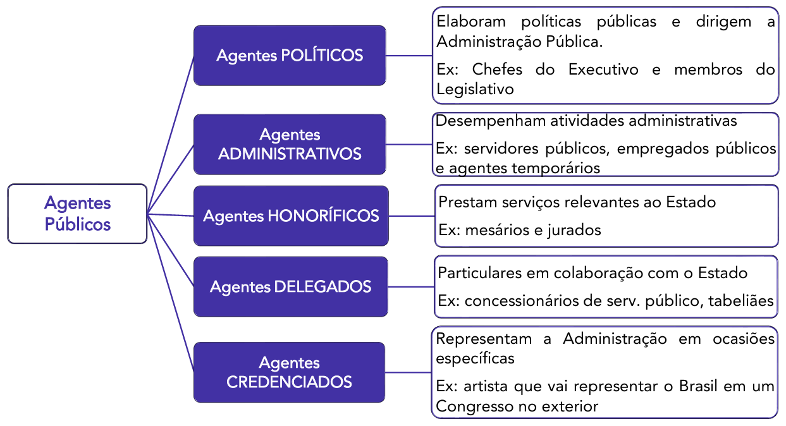
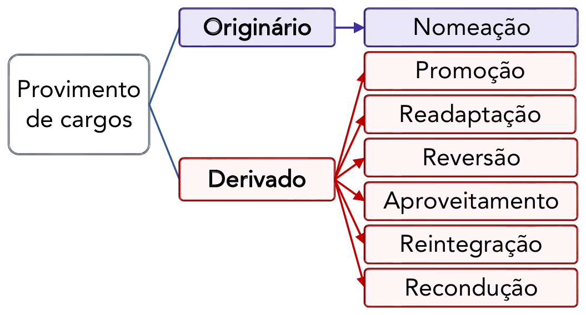

# Capítulo 1 – Lei nº 8.112/1990: Regime Jurídico dos Servidores Públicos Civis da União

## Disposições Preliminares: Cargo, Emprego e Função Pública

### Noções Introdutórias: Situando o Servidor Público

Antes de adentrarmos nas minúcias do regime jurídico estabelecido pela Lei nº 8.112, de 11 de dezembro de 1990, é fundamental estabelecer uma base conceitual sólida, compreendendo exatamente onde o "servidor público" se localiza no vasto universo dos colaboradores do Estado. A expressão **servidor público** representa uma espécie dentro do gênero **agentes públicos**.

**Agentes públicos**, em sentido amplo, são todas as pessoas físicas que, de alguma forma, prestam serviços ao Estado e às pessoas jurídicas da Administração Indireta, exercendo uma função pública. A doutrina majoritária, notadamente a do professor Hely Lopes Meirelles, classifica os agentes públicos em cinco grandes categorias, conforme detalhado a seguir:

  

- **Agentes Políticos:** São os componentes do mais alto escalão do governo, incumbidos de traçar as diretrizes, os planos de governo e as políticas públicas. Sua investidura não decorre de um vínculo profissional, mas sim de um mandato político obtido por meio de eleição (Chefes do Executivo e membros do Poder Legislativo), ou de nomeação para cargos de estrita confiança política, como os de Ministros e Secretários. **Exemplos:** Presidente da República, Governadores, Prefeitos, Senadores, Deputados, bem como Ministros e Secretários de Estado e de Município.
- **Agentes Administrativos:** Esta é a categoria de maior interesse para o nosso estudo. São todos aqueles que mantêm um vínculo profissional com o Estado e suas entidades, de natureza permanente ou temporária, e caráter predominantemente técnico ou de execução. É dentro desta categoria que encontramos os **servidores públicos estatutários** (ocupantes de cargos públicos), os **empregados públicos** (celetistas) e os **servidores temporários**.
- **Agentes Honoríficos:** São cidadãos convocados, designados ou requisitados para prestar, transitoriamente, determinados serviços ao Estado, geralmente em razão de sua condição cívica, notoriedade ou capacidade profissional. Não possuem vínculo profissional ou empregatício, e sua atuação é considerada um serviço público relevante (**múnus público**). A remuneração, quando existente, é usualmente um **pro labore** ou uma simples indenização. **Exemplos:** Jurados de um Tribunal do Júri, mesários eleitorais, membros de conselhos tutelares.
- **Agentes Delegados:** São particulares (pessoas físicas ou jurídicas) que recebem a incumbência da execução de uma atividade, obra ou serviço público, e o realizam em nome próprio, por sua conta e risco, mas sempre sob a fiscalização do Poder Público delegante. **Exemplos:** Concessionários e permissionários de serviços públicos (como empresas de transporte coletivo e de pedágio), leiloeiros oficiais, tradutores públicos juramentados.
- **Agentes Credenciados:** São aqueles que recebem da Administração Pública a incumbência de representar o Estado em uma ocasião específica ou de praticar determinada atividade, mediante remuneração do Poder Público. Não possuem vínculo empregatício, atuando de forma pontual. **Exemplo:** Um médico de uma clínica particular que é credenciado para realizar determinados procedimentos pelo Sistema Único de Saúde (SUS), ou um artista contratado para representar o país em um evento cultural internacional.

Compreendido que o servidor público é um tipo de agente administrativo, o próximo passo é diferenciar com precisão os conceitos de **cargo**, **emprego** e **função pública**, cuja confusão é uma fonte comum de erros em provas de concurso.

### A Tríade Essencial: Cargo, Emprego e Função

Embora no linguajar cotidiano os termos "cargo", "emprego" e "função" sejam frequentemente usados como sinônimos, no Direito Administrativo eles possuem significados técnicos distintos e inconfundíveis.

#### Cargo Público

O **cargo público** é a mais fundamental e indivisível unidade de competências dentro da estrutura da Administração Pública Direta, das autarquias e das fundações públicas de direito público. Pense no cargo como um "lugar" jurídico, uma posição formalmente criada por lei, com denominação própria, número certo de vagas e remuneração paga pelos cofres públicos. Este lugar é preenchido por um agente que passará a ter um conjunto definido de atribuições e responsabilidades.

O professor Hely Lopes Meirelles o definia como “o lugar instituído na organização do serviço público, com denominação própria, atribuições e responsabilidades específicas e estipêndio correspondente, para ser provido e exercido por um titu1lar, na forma estabelecida em lei”.

A Lei nº 8.112/1990, em seu artigo 3º, adota uma definição alinhada, afirmando que:

> **Art. 3º** Cargo público é o conjunto de atribuições e responsabilidades previstas na estrutura organizacional que devem ser cometidas a um servidor.

A principal característica do cargo público é o **vínculo jurídico** que une seu ocupante ao Estado. Esse vínculo é de natureza **estatutária** ou **institucional**. Isso significa que a relação não é regida por um contrato de vontades (como na CLT), mas sim por um **Estatuto**, que é uma lei. O Estado, por meio de lei, pode alterar unilateralmente as regras dessa relação (como remuneração, jornada, direitos e deveres), desde que respeitadas as garantias constitucionais.

Os ocupantes de cargos públicos são, por excelência, chamados de **servidores públicos estatutários**. No âmbito federal, seu regime é justamente o da Lei nº 8.112/1990.

Quanto à forma de preenchimento, os cargos públicos se dividem em duas naturezas:

- **Cargo Efetivo:** É aquele cujo provimento exige aprovação prévia em **concurso público de provas ou de provas e títulos**. É a regra geral para a investidura e confere ao servidor, após o estágio probatório, a garantia da **estabilidade**.
    - **Exemplo:** Analista Judiciário de um Tribunal, Auditor-Fiscal da Receita Federal, Policial Federal.

- **Cargo em Comissão:** É aquele de **livre nomeação e livre exoneração**, ou seja, não exige concurso público. Destina-se exclusivamente às atribuições de **direção, chefia e assessoramento**. A autoridade competente pode nomear e exonerar seu ocupante a qualquer momento, sem necessidade de justificativa. São cargos de confiança política ou técnica.
    - **Exemplo:** Ministro de Estado, Secretário de um Tribunal, Assessor Especial de um Governador.

#### Emprego Público

O **emprego público**, assim como o cargo, também representa uma unidade de atribuições dentro da máquina estatal. A grande diferença reside na natureza do vínculo: o ocupante de um emprego público, chamado de **empregado público**, é contratado sob o regime da **Consolidação das Leis do Trabalho (CLT)**.

Seu vínculo, portanto, é de natureza **contratual**, e não legal/estatutária. A relação é regida por um contrato de trabalho, o que a aproxima das relações do setor privado. No entanto, é fundamental entender que essa relação não é puramente privada. O empregado público está a serviço do Estado, e por isso seu vínculo sofre forte influência de normas de direito público.

Apesar de serem celetistas, a investidura em emprego público, como regra, também **depende de aprovação prévia em concurso público**, conforme determina o art. 37, II, da Constituição Federal.

Enquanto os cargos públicos são típicos das pessoas jurídicas de direito público (União, Estados, DF, Municípios, autarquias e fundações públicas de direito público), os empregos públicos são a forma de contratação padrão nas **entidades da Administração Indireta de direito privado**, como as **empresas públicas** e as **sociedades de economia mista**.

- **Exemplo:** Funcionários do Banco do Brasil (sociedade de economia mista), da Caixa Econômica Federal (empresa pública) e da Petrobras (sociedade de economia mista) são empregados públicos.

#### Função Pública

Por fim, temos o conceito de **função pública**, que é definido de forma residual. A função pública corresponde a um conjunto de atribuições públicas que, no entanto, **não correspondem a um cargo ou emprego público específico**. É uma forma de atuação em nome do Estado sem que o agente ocupe uma posição formal na estrutura de cargos ou empregos.

Conforme ensina a professora Maria Sylvia Zanella Di Pietro, existem atribuições que precisam ser exercidas, mas para as quais o legislador não criou um cargo ou emprego correspondente. A Constituição Federal, em seu art. 37, II, ao exigir concurso público, menciona apenas "cargo ou emprego", omitindo deliberadamente o termo "função", o que indica um tratamento diferenciado.

Atualmente, a função pública se manifesta em duas modalidades principais:

  

- **Função de Confiança**: São atribuições de direção, chefia e assessoramento exercidas de forma transitória. O ponto mais importante sobre elas é que, segundo o art. 37, V, da Constituição, as funções de confiança são exercidas exclusivamente por servidores ocupantes de cargo efetivo. Isso significa que um servidor concursado e estável pode ser designado para exercer, além das atribuições de seu cargo, uma função de liderança ou assessoramento, recebendo por isso uma gratificação. Ele não ocupa um novo cargo, apenas acumula uma nova função temporariamente.
    - **Exemplo:** Um Analista Tributário (servidor de cargo efetivo) é designado para ser o "Chefe da Seção de Atendimento ao Contribuinte" (função de confiança). Ele continua sendo Analista, mas enquanto exercer a chefia, recebe uma remuneração adicional.

- **Agente Temporário/Função Temporária (Contratação por Tempo Determinado):** Esta modalidade, prevista no art. 37, IX, da Constituição, permite que a Administração Pública contrate pessoal por tempo determinado para atender a uma **necessidade temporária de excepcional interesse público**.
    - O que seria "excepcional interesse público"? A própria lei de cada ente federativo define as hipóteses. **Exemplos comuns incluem**: contratação de médicos e enfermeiros para combater uma epidemia, recenseadores para o censo do IBGE, professores substitutos em universidades federais, ou pessoal para atuar em situações de calamidade pública.
    - Os agentes contratados nesta modalidade não são servidores estatutários nem empregados celetistas. Eles são vinculados por um **contrato de direito administrativo**, com um regime jurídico especial, definido em lei específica. No âmbito federal, essa lei é a Lei nº 8.745/1993.

A tabela a seguir consolida e compara as principais características estudadas:

|Característica|Cargo Público|Emprego Público|Função Pública|
|---|---|---|---|
|**Ocupante**|Servidor Público Estatutário|Empregado Público|Função de Confiança (por servidor efetivo) ou Contratado Temporário|
|**Vínculo Jurídico**|Legal (Estatutário)|Contratual (Celetista)|Função de Confiança: acessório ao vínculo estatutário.   Temporário: Contrato de Direito Administrativo.|
|**Regime Jurídico**|Estatuto (Ex: Lei 8.112/90)|CLT (com incidência de normas públicas)|Regime Jurídico Especial (Ex: Lei 8.745/93)|
|**Forma de Investidura**|Concurso público (regra) ou livre nomeação (cargos em comissão)|Concurso público (regra)|Função de Confiança: livre designação entre servidores efetivos.   Temporário: processo seletivo simplificado (regra).|
|**Entidades Típicas**|Adm. Direta, Autarquias, Fundações Públicas de Direito Público|Empresas Públicas, Sociedades de Economia Mista|Todas as esferas da Administração.|
|**Natureza**|Permanente|Permanente|Função de Confiança: Transitória.   Temporário: Transitória e por prazo determinado.|

### Os Regimes Jurídicos dos Agentes Administrativos

Como vimos, a relação profissional entre o Estado e seus agentes administrativos pode ser governada por diferentes conjuntos de normas. Essa diversidade dá origem a três regimes jurídicos principais:

- **Regime Estatutário:** É o regime legal, definido por um Estatuto (lei), que rege os direitos e deveres dos servidores públicos ocupantes de **cargos públicos**. É um regime de direito público, marcado pela possibilidade de alteração unilateral das regras pelo Estado. Este será o nosso foco de estudo, com base na Lei nº 8.112/1990.
- **Regime Celetista:** É o regime contratual, regido pela **Consolidação das Leis do Trabalho (CLT)**, aplicável aos **empregados públicos**. Embora seja predominantemente de direito privado, ele é adaptado por normas de direito público, como a exigência de concurso e o teto remuneratório.
- **Regime Especial (ou Temporário):** É o regime aplicável aos contratados para atender a uma necessidade temporária de excepcional interesse público. É definido por lei específica de cada ente federativo e possui natureza de direito administrativo.

Feita esta indispensável contextualização, que nos permitiu diferenciar os principais conceitos e regimes, estamos prontos para iniciar o estudo aprofundado do regime estatutário federal, conforme previsto na Lei nº 8.112/1990.

## O Regime Jurídico da Lei nº 8.112/1990: Âmbito e Características

O **regime estatutário** é o conjunto de normas que disciplina a relação jurídica de natureza não-contratual entre os servidores públicos e as pessoas jurídicas de direito público a que pertencem (Administração Direta, autarquias e fundações públicas). A principal característica desse regime é que suas regras são fixadas de forma unilateral pelo Estado, por meio de uma **lei** específica, denominada **Estatuto**.

Cada ente da federação (União, Estados, Distrito Federal e Municípios) possui competência para editar seu próprio estatuto. No âmbito federal, a norma que rege essa relação para os servidores civis é a **Lei nº 8.112, de 11 de dezembro de 1990**.

A edição desta lei teve como fundamento a redação original do **art. 39 da Constituição Federal de 1988**, que determinava:

> **Art. 39, CF/88 (Redação Original):** A União, os Estados, o Distrito Federal e os Municípios instituirão, no âmbito de sua competência, **regime jurídico único** e planos de carreira para os servidores da administração pública direta, das autarquias e das fundações públicas.

A exigência de um **"regime jurídico único"** forçava cada ente a escolher um único regime (majoritariamente o estatutário) para todos os servidores de sua administração direta, autárquica e fundacional.

Contudo, a **Emenda Constitucional nº 19, de 1998**, alterou profundamente este artigo, **eliminando a obrigatoriedade do regime jurídico único**. Essa mudança, em tese, permitiria que um mesmo ente federativo tivesse servidores estatutários e empregados celetistas coexistindo dentro de sua administração direta, autarquias e fundações.

Ocorre que o Supremo Tribunal Federal (STF), ao julgar a Ação Direta de Inconstitucionalidade (ADI) nº 2.135, concedeu uma medida cautelar para **suspender a eficácia da nova redação do art. 39**. Na prática, até o julgamento definitivo da ação, a regra que prevalece é a da redação original, ou seja, a **exigência do regime jurídico único**.

Por essa razão, o escopo de aplicação da Lei nº 8.112/1990 é bem definido:

- **A quem se aplica?** Aos servidores públicos civis da **Administração Pública Federal Direta** (Ministérios, Presidência da República, etc.), das **autarquias federais** (INSS, IBAMA, etc.) e das **fundações públicas federais de direito público** (FUNAI, etc.).
- **A quem NÃO se aplica?**
    - Aos **militares**, que possuem estatuto próprio.
    - Aos servidores dos **Poderes Legislativo e Judiciário**, que possuem regimes próprios, embora muitas vezes se utilizem da Lei nº 8.112/1990 de forma subsidiária.
    - Aos servidores dos **Estados, Distrito Federal e Municípios**, que devem ter seus próprios estatutos.
    - Aos **empregados públicos federais**, que são regidos pela CLT e atuam em empresas públicas (Caixa Econômica Federal, Correios) e sociedades de economia mista (Banco do Brasil, Petrobras).

## Formas de Provimento e Vacância

### Provimento: O Ato de Preenchimento do Cargo Público

O preenchimento de um cargo público vago se dá por meio do ato de **provimento**. Trata-se do ato administrativo que formaliza a designação de uma pessoa para titularizar um cargo público, estabelecendo o início do vínculo jurídico com a Administração.

A doutrina define o provimento de formas complementares. Para José dos Santos Carvalho Filho, é o "fato administrativo que traduz o preenchimento de um cargo público". Já para Maria Sylvia Zanella Di Pietro, é o "ato pelo qual se efetua o preenchimento do cargo público, com a designação de seu titular".

A Lei nº 8.112/1990, em seu artigo 8º, elenca as formas de provimento de cargo público. A doutrina costuma classificá-las em duas grandes categorias: **provimento originário** e **provimento derivado**.

- **Provimento Originário:** É aquele que dá início a um vínculo jurídico novo entre o servidor e a Administração, não dependendo de uma relação anterior. A **nomeação** é a única forma de provimento originário.
- **Provimento Derivado:** É aquele que pressupõe a existência de um vínculo jurídico anterior e estável do servidor com a Administração. Todas as outras formas (promoção, readaptação, reversão, aproveitamento, reintegração e recondução) são derivadas.

  

O art. 8º da Lei nº 8.112/1990 estabelece as seguintes formas de provimento:

I - nomeação;
II - promoção;
**III - revogado**
**IV - revogado**
V - readaptação;
VI - reversão;
VII - aproveitamento;
VIII - reintegração;
IX - recondução.

> **Ponto de Atenção: Ascensão e Transferência**
> 
> É fundamental observar que os incisos III e IV do artigo 8º, que originalmente previam a **ascensão** e a **transferência** como formas de provimento, foram **revogados**. O Supremo Tribunal Federal (STF) declarou ambas as formas **inconstitucionais** (Súmula Vinculante nº 43), por entenderem que representavam uma burla à exigência de concurso público (art. 37, II, da CF/88).
> 
> - A **transferência** permitia que um servidor passasse de um cargo para outro de igual denominação e vencimentos, mas pertencente a um quadro de pessoal diverso (ex: de um órgão para outro).
> - A **ascensão** (também chamada de "acesso") permitia que o servidor fosse promovido para um cargo de uma carreira diferente, de nível mais elevado.
> 
> Ambas as modalidades permitiam a investidura em um cargo para o qual o servidor não havia prestado concurso público específico, motivo pelo qual foram expurgadas do ordenamento jurídico. Portanto, **ascensão e transferência NÃO são formas válidas de provimento de cargo público**.

A seguir, passaremos ao estudo detalhado de cada uma das formas de provimento válidas, iniciando pela nomeação.