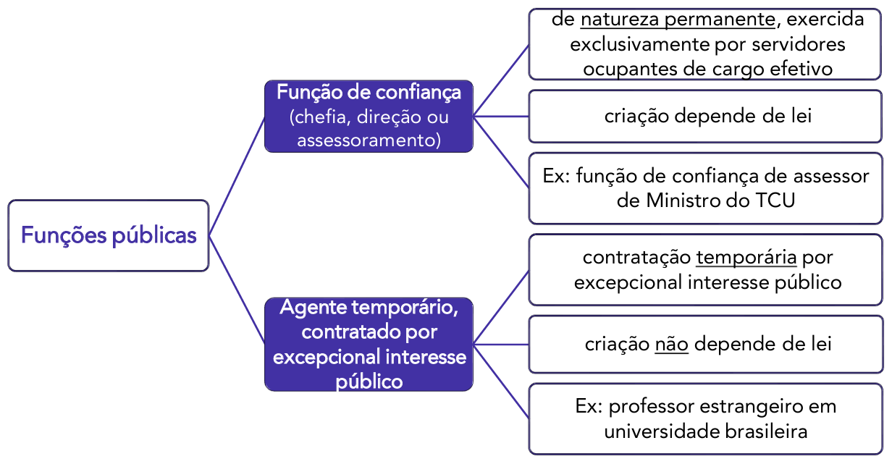

# Capítulo 1 – Lei nº 8.112/1990: Regime Jurídico dos Servidores Públicos Civis da União

## Disposições Preliminares: Cargo, Emprego e Função Pública

### Noções Introdutórias: Situando o Servidor Público

Antes de adentrarmos nas minúcias do regime jurídico estabelecido pela Lei nº 8.112, de 11 de dezembro de 1990, é fundamental estabelecer uma base conceitual sólida, compreendendo exatamente onde o "servidor público" se localiza no vasto universo dos colaboradores do Estado. A expressão **servidor público** representa uma espécie dentro do gênero **agentes públicos**.

**Agentes públicos**, em sentido amplo, são todas as pessoas físicas que, de alguma forma, prestam serviços ao Estado e às pessoas jurídicas da Administração Indireta, exercendo uma função pública. A doutrina majoritária, notadamente a do professor Hely Lopes Meirelles, classifica os agentes públicos em cinco grandes categorias, conforme detalhado a seguir:

  

- **Agentes Políticos:** São os componentes do mais alto escalão do governo, incumbidos de traçar as diretrizes, os planos de governo e as políticas públicas. Sua investidura não decorre de um vínculo profissional, mas sim de um mandato político obtido por meio de eleição (Chefes do Executivo e membros do Poder Legislativo), ou de nomeação para cargos de estrita confiança política, como os de Ministros e Secretários. **Exemplos:** Presidente da República, Governadores, Prefeitos, Senadores, Deputados, bem como Ministros e Secretários de Estado e de Município.
- **Agentes Administrativos:** Esta é a categoria de maior interesse para o nosso estudo. São todos aqueles que mantêm um vínculo profissional com o Estado e suas entidades, de natureza permanente ou temporária, e caráter predominantemente técnico ou de execução. É dentro desta categoria que encontramos os **servidores públicos estatutários** (ocupantes de cargos públicos), os **empregados públicos** (celetistas) e os **servidores temporários**.
- **Agentes Honoríficos:** São cidadãos convocados, designados ou requisitados para prestar, transitoriamente, determinados serviços ao Estado, geralmente em razão de sua condição cívica, notoriedade ou capacidade profissional. Não possuem vínculo profissional ou empregatício, e sua atuação é considerada um serviço público relevante (**múnus público**). A remuneração, quando existente, é usualmente um **pro labore** ou uma simples indenização. **Exemplos:** Jurados de um Tribunal do Júri, mesários eleitorais, membros de conselhos tutelares.
- **Agentes Delegados:** São particulares (pessoas físicas ou jurídicas) que recebem a incumbência da execução de uma atividade, obra ou serviço público, e o realizam em nome próprio, por sua conta e risco, mas sempre sob a fiscalização do Poder Público delegante. **Exemplos:** Concessionários e permissionários de serviços públicos (como empresas de transporte coletivo e de pedágio), leiloeiros oficiais, tradutores públicos juramentados.
- **Agentes Credenciados:** São aqueles que recebem da Administração Pública a incumbência de representar o Estado em uma ocasião específica ou de praticar determinada atividade, mediante remuneração do Poder Público. Não possuem vínculo empregatício, atuando de forma pontual. **Exemplo:** Um médico de uma clínica particular que é credenciado para realizar determinados procedimentos pelo Sistema Único de Saúde (SUS), ou um artista contratado para representar o país em um evento cultural internacional.

Compreendido que o servidor público é um tipo de agente administrativo, o próximo passo é diferenciar com precisão os conceitos de **cargo**, **emprego** e **função pública**, cuja confusão é uma fonte comum de erros em provas de concurso.

### A Tríade Essencial: Cargo, Emprego e Função

Embora no linguajar cotidiano os termos "cargo", "emprego" e "função" sejam frequentemente usados como sinônimos, no Direito Administrativo eles possuem significados técnicos distintos e inconfundíveis.

#### Cargo Público

O **cargo público** é a mais fundamental e indivisível unidade de competências dentro da estrutura da Administração Pública Direta, das autarquias e das fundações públicas de direito público. Pense no cargo como um "lugar" jurídico, uma posição formalmente criada por lei, com denominação própria, número certo de vagas e remuneração paga pelos cofres públicos. Este lugar é preenchido por um agente que passará a ter um conjunto definido de atribuições e responsabilidades.

O professor Hely Lopes Meirelles o definia como “o lugar instituído na organização do serviço público, com denominação própria, atribuições e responsabilidades específicas e estipêndio correspondente, para ser provido e exercido por um titu1lar, na forma estabelecida em lei”.

A Lei nº 8.112/1990, em seu artigo 3º, adota uma definição alinhada, afirmando que:

> **Art. 3º** Cargo público é o conjunto de atribuições e responsabilidades previstas na estrutura organizacional que devem ser cometidas a um servidor.

A principal característica do cargo público é o **vínculo jurídico** que une seu ocupante ao Estado. Esse vínculo é de natureza **estatutária** ou **institucional**. Isso significa que a relação não é regida por um contrato de vontades (como na CLT), mas sim por um **Estatuto**, que é uma lei. O Estado, por meio de lei, pode alterar unilateralmente as regras dessa relação (como remuneração, jornada, direitos e deveres), desde que respeitadas as garantias constitucionais.

Os ocupantes de cargos públicos são, por excelência, chamados de **servidores públicos estatutários**. No âmbito federal, seu regime é justamente o da Lei nº 8.112/1990.

Quanto à forma de preenchimento, os cargos públicos se dividem em duas naturezas:

- **Cargo Efetivo:** É aquele cujo provimento exige aprovação prévia em **concurso público de provas ou de provas e títulos**. É a regra geral para a investidura e confere ao servidor, após o estágio probatório, a garantia da **estabilidade**.
    - **Exemplo:** Analista Judiciário de um Tribunal, Auditor-Fiscal da Receita Federal, Policial Federal.

- **Cargo em Comissão:** É aquele de **livre nomeação e livre exoneração**, ou seja, não exige concurso público. Destina-se exclusivamente às atribuições de **direção, chefia e assessoramento**. A autoridade competente pode nomear e exonerar seu ocupante a qualquer momento, sem necessidade de justificativa. São cargos de confiança política ou técnica.
    - **Exemplo:** Ministro de Estado, Secretário de um Tribunal, Assessor Especial de um Governador.

#### Emprego Público

O **emprego público**, assim como o cargo, também representa uma unidade de atribuições dentro da máquina estatal. A grande diferença reside na natureza do vínculo: o ocupante de um emprego público, chamado de **empregado público**, é contratado sob o regime da **Consolidação das Leis do Trabalho (CLT)**.

Seu vínculo, portanto, é de natureza **contratual**, e não legal/estatutária. A relação é regida por um contrato de trabalho, o que a aproxima das relações do setor privado. No entanto, é fundamental entender que essa relação não é puramente privada. O empregado público está a serviço do Estado, e por isso seu vínculo sofre forte influência de normas de direito público.

Apesar de serem celetistas, a investidura em emprego público, como regra, também **depende de aprovação prévia em concurso público**, conforme determina o art. 37, II, da Constituição Federal.

Enquanto os cargos públicos são típicos das pessoas jurídicas de direito público (União, Estados, DF, Municípios, autarquias e fundações públicas de direito público), os empregos públicos são a forma de contratação padrão nas **entidades da Administração Indireta de direito privado**, como as **empresas públicas** e as **sociedades de economia mista**.

- **Exemplo:** Funcionários do Banco do Brasil (sociedade de economia mista), da Caixa Econômica Federal (empresa pública) e da Petrobras (sociedade de economia mista) são empregados públicos.

#### Função Pública

Por fim, temos o conceito de **função pública**, que é definido de forma residual. A função pública corresponde a um conjunto de atribuições públicas que, no entanto, **não correspondem a um cargo ou emprego público específico**. É uma forma de atuação em nome do Estado sem que o agente ocupe uma posição formal na estrutura de cargos ou empregos.

Conforme ensina a professora Maria Sylvia Zanella Di Pietro, existem atribuições que precisam ser exercidas, mas para as quais o legislador não criou um cargo ou emprego correspondente. A Constituição Federal, em seu art. 37, II, ao exigir concurso público, menciona apenas "cargo ou emprego", omitindo deliberadamente o termo "função", o que indica um tratamento diferenciado.

Atualmente, a função pública se manifesta em duas modalidades principais:

  

- **Função de Confiança**: São atribuições de direção, chefia e assessoramento exercidas de forma transitória. O ponto mais importante sobre elas é que, segundo o art. 37, V, da Constituição, as funções de confiança são exercidas exclusivamente por servidores ocupantes de cargo efetivo. Isso significa que um servidor concursado e estável pode ser designado para exercer, além das atribuições de seu cargo, uma função de liderança ou assessoramento, recebendo por isso uma gratificação. Ele não ocupa um novo cargo, apenas acumula uma nova função temporariamente.
    - **Exemplo:** Um Analista Tributário (servidor de cargo efetivo) é designado para ser o "Chefe da Seção de Atendimento ao Contribuinte" (função de confiança). Ele continua sendo Analista, mas enquanto exercer a chefia, recebe uma remuneração adicional.

- **Agente Temporário/Função Temporária (Contratação por Tempo Determinado):** Esta modalidade, prevista no art. 37, IX, da Constituição, permite que a Administração Pública contrate pessoal por tempo determinado para atender a uma **necessidade temporária de excepcional interesse público**.
    - O que seria "excepcional interesse público"? A própria lei de cada ente federativo define as hipóteses. **Exemplos comuns incluem**: contratação de médicos e enfermeiros para combater uma epidemia, recenseadores para o censo do IBGE, professores substitutos em universidades federais, ou pessoal para atuar em situações de calamidade pública.
    - Os agentes contratados nesta modalidade não são servidores estatutários nem empregados celetistas. Eles são vinculados por um **contrato de direito administrativo**, com um regime jurídico especial, definido em lei específica. No âmbito federal, essa lei é a Lei nº 8.745/1993.

A tabela a seguir consolida e compara as principais características estudadas:

|Característica|Cargo Público|Emprego Público|Função Pública|
|---|---|---|---|
|**Ocupante**|Servidor Público Estatutário|Empregado Público|Função de Confiança (por servidor efetivo) ou Contratado Temporário|
|**Vínculo Jurídico**|Legal (Estatutário)|Contratual (Celetista)|Função de Confiança: acessório ao vínculo estatutário.   Temporário: Contrato de Direito Administrativo.|
|**Regime Jurídico**|Estatuto (Ex: Lei 8.112/90)|CLT (com incidência de normas públicas)|Regime Jurídico Especial (Ex: Lei 8.745/93)|
|**Forma de Investidura**|Concurso público (regra) ou livre nomeação (cargos em comissão)|Concurso público (regra)|Função de Confiança: livre designação entre servidores efetivos.   Temporário: processo seletivo simplificado (regra).|
|**Entidades Típicas**|Adm. Direta, Autarquias, Fundações Públicas de Direito Público|Empresas Públicas, Sociedades de Economia Mista|Todas as esferas da Administração.|
|**Natureza**|Permanente|Permanente|Função de Confiança: Transitória.   Temporário: Transitória e por prazo determinado.|

### Os Regimes Jurídicos dos Agentes Administrativos

Como vimos, a relação profissional entre o Estado e seus agentes administrativos pode ser governada por diferentes conjuntos de normas. Essa diversidade dá origem a três regimes jurídicos principais:

- **Regime Estatutário:** É o regime legal, definido por um Estatuto (lei), que rege os direitos e deveres dos servidores públicos ocupantes de **cargos públicos**. É um regime de direito público, marcado pela possibilidade de alteração unilateral das regras pelo Estado. Este será o nosso foco de estudo, com base na Lei nº 8.112/1990.
- **Regime Celetista:** É o regime contratual, regido pela **Consolidação das Leis do Trabalho (CLT)**, aplicável aos **empregados públicos**. Embora seja predominantemente de direito privado, ele é adaptado por normas de direito público, como a exigência de concurso e o teto remuneratório.
- **Regime Especial (ou Temporário):** É o regime aplicável aos contratados para atender a uma necessidade temporária de excepcional interesse público. É definido por lei específica de cada ente federativo e possui natureza de direito administrativo.

Feita esta indispensável contextualização, que nos permitiu diferenciar os principais conceitos e regimes, estamos prontos para iniciar o estudo aprofundado do regime estatutário federal, conforme previsto na Lei nº 8.112/1990.

## O Regime Jurídico da Lei nº 8.112/1990: Âmbito e Características

O **regime estatutário** é o conjunto de normas que disciplina a relação jurídica de natureza não-contratual entre os servidores públicos e as pessoas jurídicas de direito público a que pertencem (Administração Direta, autarquias e fundações públicas). A principal característica desse regime é que suas regras são fixadas de forma unilateral pelo Estado, por meio de uma **lei** específica, denominada **Estatuto**.

Cada ente da federação (União, Estados, Distrito Federal e Municípios) possui competência para editar seu próprio estatuto. No âmbito federal, a norma que rege essa relação para os servidores civis é a **Lei nº 8.112, de 11 de dezembro de 1990**.

A edição desta lei teve como fundamento a redação original do **art. 39 da Constituição Federal de 1988**, que determinava:

> **Art. 39, CF/88 (Redação Original):** A União, os Estados, o Distrito Federal e os Municípios instituirão, no âmbito de sua competência, **regime jurídico único** e planos de carreira para os servidores da administração pública direta, das autarquias e das fundações públicas.

A exigência de um **"regime jurídico único"** forçava cada ente a escolher um único regime (majoritariamente o estatutário) para todos os servidores de sua administração direta, autárquica e fundacional.

Contudo, a **Emenda Constitucional nº 19, de 1998**, alterou profundamente este artigo, **eliminando a obrigatoriedade do regime jurídico único**. Essa mudança, em tese, permitiria que um mesmo ente federativo tivesse servidores estatutários e empregados celetistas coexistindo dentro de sua administração direta, autarquias e fundações.

Ocorre que o Supremo Tribunal Federal (STF), ao julgar a Ação Direta de Inconstitucionalidade (ADI) nº 2.135, concedeu uma medida cautelar para **suspender a eficácia da nova redação do art. 39**. Na prática, até o julgamento definitivo da ação, a regra que prevalece é a da redação original, ou seja, a **exigência do regime jurídico único**.

Por essa razão, o escopo de aplicação da Lei nº 8.112/1990 é bem definido:

- **A quem se aplica?** Aos servidores públicos civis da **Administração Pública Federal Direta** (Ministérios, Presidência da República, etc.), das **autarquias federais** (INSS, IBAMA, etc.) e das **fundações públicas federais de direito público** (FUNAI, etc.).
- **A quem NÃO se aplica?**
    - Aos **militares**, que possuem estatuto próprio.
    - Aos servidores dos **Poderes Legislativo e Judiciário**, que possuem regimes próprios, embora muitas vezes se utilizem da Lei nº 8.112/1990 de forma subsidiária.
    - Aos servidores dos **Estados, Distrito Federal e Municípios**, que devem ter seus próprios estatutos.
    - Aos **empregados públicos federais**, que são regidos pela CLT e atuam em empresas públicas (Caixa Econômica Federal, Correios) e sociedades de economia mista (Banco do Brasil, Petrobras).

## Formas de Provimento e Vacância

### Provimento: O Ato de Preenchimento do Cargo Público

O preenchimento de um cargo público vago se dá por meio do ato de **provimento**. Trata-se do ato administrativo que formaliza a designação de uma pessoa para titularizar um cargo público, estabelecendo o início do vínculo jurídico com a Administração.

A doutrina define o provimento de formas complementares. Para José dos Santos Carvalho Filho, é o "fato administrativo que traduz o preenchimento de um cargo público". Já para Maria Sylvia Zanella Di Pietro, é o "ato pelo qual se efetua o preenchimento do cargo público, com a designação de seu titular".

A Lei nº 8.112/1990, em seu artigo 8º, elenca as formas de provimento de cargo público. A doutrina costuma classificá-las em duas grandes categorias: **provimento originário** e **provimento derivado**.

- **Provimento Originário:** É aquele que dá início a um vínculo jurídico novo entre o servidor e a Administração, não dependendo de uma relação anterior. A **nomeação** é a única forma de provimento originário.
- **Provimento Derivado:** É aquele que pressupõe a existência de um vínculo jurídico anterior e estável do servidor com a Administração. Todas as outras formas (promoção, readaptação, reversão, aproveitamento, reintegração e recondução) são derivadas.

  

O art. 8º da Lei nº 8.112/1990 estabelece as seguintes formas de provimento:

I - nomeação;
II - promoção;
**III - revogado**
**IV - revogado**
V - readaptação;
VI - reversão;
VII - aproveitamento;
VIII - reintegração;
IX - recondução.

> **Ponto de Atenção: Ascensão e Transferência**
> 
> É fundamental observar que os incisos III e IV do artigo 8º, que originalmente previam a **ascensão** e a **transferência** como formas de provimento, foram **revogados**. O Supremo Tribunal Federal (STF) declarou ambas as formas **inconstitucionais** (Súmula Vinculante nº 43), por entenderem que representavam uma burla à exigência de concurso público (art. 37, II, da CF/88).
> 
> - A **transferência** permitia que um servidor passasse de um cargo para outro de igual denominação e vencimentos, mas pertencente a um quadro de pessoal diverso (ex: de um órgão para outro).
> - A **ascensão** (também chamada de "acesso") permitia que o servidor fosse promovido para um cargo de uma carreira diferente, de nível mais elevado.
> 
> Ambas as modalidades permitiam a investidura em um cargo para o qual o servidor não havia prestado concurso público específico, motivo pelo qual foram expurgadas do ordenamento jurídico. Portanto, **ascensão e transferência NÃO são formas válidas de provimento de cargo público**.

A seguir, passaremos ao estudo detalhado de cada uma das formas de provimento válidas, iniciando pela nomeação.

### Nomeação: A Porta de Entrada no Serviço Público

A **nomeação** é o ato administrativo que materializa o provimento de um cargo público. Trata-se da única forma de **provimento originário** prevista na Lei nº 8.112/1990, o que a torna a porta de entrada por excelência para o serviço público. Por ser de caráter originário, a nomeação instaura um vínculo jurídico novo e autônomo, não dependendo de qualquer relação preexistente do nomeado com a Administração Pública.

Mesmo que uma pessoa já seja servidora pública, ao ser aprovada em um novo concurso e nomeada para um novo cargo, essa nova investidura será considerada originária. O fato gerador do novo vínculo não é a relação anterior, mas sim a aprovação no novo certame.

- **Exemplo:** Joana é Técnica Judiciária (cargo de nível médio) em um Tribunal Regional Federal. Após anos de estudo, ela é aprovada no concurso para Analista Judiciário (cargo de nível superior) no mesmo tribunal. Ao ser publicada sua nomeação para Analista, este ato será um provimento originário, pois a causa jurídica que o fundamenta é a aprovação no novo concurso, e não seu vínculo anterior como Técnica.

A nomeação é um ato de competência do Chefe de cada Poder (no âmbito da União, o Presidente da República para o Executivo, os Presidentes das Casas para o Legislativo e os Presidentes dos Tribunais para o Judiciário), podendo ser delegada. Ela pode ocorrer em duas modalidades, a depender da natureza do cargo a ser provido:

  

- **Para Cargo de Provimento Efetivo:** Esta é a regra no serviço público, em obediência ao princípio constitucional do concurso público (art. 37, II, CF/88). A nomeação ocorre para preencher um cargo de caráter permanente na estrutura da Administração e exige, impreterivelmente, a **prévia aprovação em concurso público** de provas ou de provas e títulos. A nomeação dos candidatos aprovados deve seguir rigorosamente a **ordem de classificação** final do certame.
- **Para Cargo em Comissão:** Esta é a exceção. Trata-se da nomeação para cargos declarados em lei como de **livre nomeação e livre exoneração**. São cargos de confiança, destinados às atribuições de direção, chefia e assessoramento. A autoridade competente possui discricionariedade para escolher e nomear o ocupante, assim como para exonerá-lo a qualquer tempo, sem necessidade de motivação (ato ad nutum).

Do ponto de vista jurídico, a nomeação é um **ato administrativo unilateral**, ou seja, ela se aperfeiçoa com a única manifestação de vontade da Administração Pública, expressa por sua publicação em diário oficial. Não se exige, neste momento, a concordância do nomeado.

> **Ponto de Atenção: O Direito Subjetivo à Nomeação**
> 
> A nomeação gera um importante efeito para o candidato aprovado em concurso: o **direito subjetivo à nomeação**. O Supremo Tribunal Federal (STF) consolidou o entendimento de que o candidato aprovado **dentro do número de vagas** previstas no edital possui direito líquido e certo de ser nomeado durante o prazo de validade do concurso. A Administração, nesse caso, não tem mais a mera expectativa, mas o **dever** de nomear.

Contudo, é crucial entender que a nomeação, por si só, não torna a pessoa um servidor público. Ela é o primeiro e indispensável passo para a **investidura** no cargo, que só se completa com a **posse**. A nomeação confere o direito à posse; a posse, por sua vez, completa a investidura.

Se o nomeado para um cargo efetivo não tomar posse no prazo legal, que é de **30 (trinta) dias** contados da publicação do ato de provimento (art. 13, § 1º), o ato de nomeação será **tornado sem efeito**. Essa expressão é tecnicamente importante:

- **Tornado sem Efeito:** Ocorre quando o nomeado não cumpre o requisito da posse. O vínculo jurídico nunca chegou a se formar. Não se trata de exoneração (que pressupõe um servidor já empossado) nem de anulação (que pressupõe uma ilegalidade no ato). O ato de nomeação simplesmente perde sua eficácia.

Por fim, é vital não confundir **nomeação** com **designação**.

- **Nomeação** refere-se ao provimento de um **cargo público** (seja efetivo ou em comissão).
- **Designação** é o ato pelo qual um servidor efetivo é escolhido para exercer uma **função de confiança** ou **função comissionada**. O servidor é **nomeado** para o cargo de Analista e, posteriormente, pode ser **designado** para a função de Chefe de Setor. A designação não cria um novo vínculo, apenas atribui um encargo adicional ao servidor já empossado em seu cargo.

Estudada a nomeação, a única forma de provimento originário, passemos à análise das formas de provimento derivado, que pressupõem um vínculo estável anterior do servidor com a Administração.

### Promoção: A Evolução na Carreira

A **promoção** é uma forma de **provimento derivado vertical**, por meio da qual o servidor público efetivo é elevado a um cargo de maior complexidade ou responsabilidade dentro da **mesma carreira** a que pertence. É o mecanismo que permite a progressão e o desenvolvimento profissional do servidor ao longo de sua vida funcional.

Conforme define Celso Antônio Bandeira de Mello, a promoção se distingue por ser um "deslocamento vertical do servidor, de uma para outra classe mais elevada, dentro do mesmo cargo ou da carreira a que pertence". O termo **carreira**, neste contexto, deve ser entendido como a estrutura organizada de cargos, geralmente dividida em **classes** (agrupamentos de cargos da mesma natureza e responsabilidade) e **padrões** (níveis de vencimento dentro de uma mesma classe), que delineia a trajetória de ascensão do servidor.

A movimentação na carreira via promoção ocorre com base em critérios objetivos previamente estabelecidos na lei que rege a respectiva carreira. Os dois critérios mais comuns são:

- **Promoção por Merecimento:** Baseada no mérito profissional do servidor, aferido por meio de avaliações de desempenho periódicas, participação em cursos de capacitação, obtenção de títulos acadêmicos, entre outros fatores que demonstrem sua contribuição e desenvolvimento.
- **Promoção por Antiguidade:** Baseada exclusivamente no tempo de efetivo exercício do servidor na classe ou padrão em que se encontra.

- **Exemplo:** João, servidor público, foi nomeado para o cargo de Analista de Comércio Exterior, ingressando na carreira na Classe A, Padrão I. Após cumprir o interstício (período mínimo) e obter resultados satisfatórios em sua avaliação de desempenho, ele recebe uma **promoção por merecimento**, passando para a Classe B, Padrão I. Anos depois, ao completar o tempo de serviço exigido na lei de sua carreira, ele recebe uma **promoção por antiguidade**, passando para a Classe C, Padrão I. Em todos os casos, ele permaneceu na carreira de Analista de Comércio Exterior.

> **Ponto de Atenção: Promoção vs. Ascensão e Transferência**
> 
> É imperativo diferenciar a **promoção**, que é constitucional, das figuras da **ascensão** e da **transferência**, que são **inconstitucionais**. A promoção ocorre sempre **dentro da mesma carreira** para a qual o servidor prestou concurso. Já a ascensão e a transferência representavam formas de "salto" ou "transposição" para uma carreira distinta, o que foi vedado pelo STF por violar a regra do concurso público.
> 
> A **Súmula Vinculante nº 43 do STF** pacificou o tema:
> 
> > É inconstitucional toda modalidade de provimento que propicie ao servidor investir-se, sem prévia aprovação em concurso público destinado ao seu provimento, em cargo que não integra a carreira na qual anteriormente investido.
> 
> - **Exemplo de prática inconstitucional:** Maria é Técnica do Seguro Social (cargo de nível médio). Após alguns anos, por meio de um processo interno, ela obtém uma "ascensão funcional" para o cargo de Analista do Seguro Social (cargo de nível superior). Essa movimentação é inconstitucional, pois ela está ingressando em uma nova carreira (a de Analista) sem ter sido aprovada no concurso público específico para esse cargo. A única forma válida de Maria se tornar Analista é sendo aprovada em um novo concurso.

Portanto, a promoção é a única forma de provimento derivado vertical admitida em nosso ordenamento jurídico.

Um aspecto legal importante da promoção é que ela **não interrompe o tempo de exercício** do servidor. Isso significa que, para fins de contagem de tempo para aposentadoria, férias e outros benefícios, o período de serviço não é "zerado" a cada promoção. A contagem continua normalmente, como dispõe o art. 17 da Lei nº 8.112/1990:

> **Art. 17.** A promoção não interrompe o tempo de exercício, que é contado no novo posicionamento na carreira a partir da data de publicação do ato que promover o servidor.

Por fim, é crucial notar que a promoção possui um **efeito dúplice**. Ao mesmo tempo em que ela é uma forma de **provimento** (pois o servidor preenche um cargo na classe/padrão superior), ela também é uma forma de **vacância** (pois o servidor deixa vago o cargo na classe/padrão que ocupava anteriormente). Este duplo efeito é frequentemente explorado em questões de concurso.

### Readaptação: A Readequação Funcional do Servidor

A **readaptação** é a forma de provimento derivado pela qual um servidor, que tenha sofrido uma **limitação em sua capacidade física ou mental**, é investido em um novo cargo, cujas atribuições e responsabilidades sejam compatíveis com sua nova condição. Este instituto é um importante mecanismo de proteção ao servidor e de garantia da eficiência do serviço público, pois busca reaproveitar a força de trabalho do agente que, embora não possa mais exercer suas funções originais, ainda possui plena capacidade para outras.

A condição fundamental para que ocorra a readaptação é que a limitação de capacidade seja comprovada por uma **inspeção médica oficial**, conforme dispõe o art. 24 da Lei nº 8.112/1990. Não se trata, portanto, de uma escolha ou de uma avaliação subjetiva, mas de uma constatação técnica realizada por uma junta médica.

A doutrina classifica a readaptação como a única forma de **provimento derivado horizontal**. A expressão "horizontal" significa que o servidor não ascende nem é rebaixado em sua posição funcional. Ele é deslocado para um cargo de mesmo nível hierárquico e remuneratório, apenas com um conjunto de atribuições diferente e compatível com sua limitação.

Para que a readaptação seja efetivada, a lei exige o cumprimento de alguns requisitos para o novo cargo:

- **Atribuições Afins:** As tarefas do novo cargo devem ter correlação com as do cargo anterior, sempre que possível.
- **Habilitação Exigida:** O servidor deve possuir a qualificação técnica ou a formação específica exigida para o novo cargo.
- **Nível de Escolaridade:** O novo cargo deve exigir o mesmo nível de escolaridade do cargo de origem.
- **Equivalência de Vencimentos:** A remuneração do novo cargo deve ser equivalente à do cargo que o servidor ocupava.
- **Exemplo:** Um Perito Criminal Federal, especialista em análise de campo, sofre um acidente que lhe causa uma deficiência motora permanente, impedindo-o de realizar coletas em locais de difícil acesso. Após laudo da junta médica, a Administração constata que ele não pode mais exercer plenamente as funções de perito de campo. No entanto, sendo ele graduado em Química e possuindo grande conhecimento técnico, ele é **readaptado** em um cargo vago de mesma remuneração e nível de escolaridade, cujas atribuições sejam exclusivamente laboratoriais e administrativas, compatíveis com sua nova condição física.

Duas situações específicas devem ser observadas no processo de readaptação:

1. **Inexistência de Cargo Vago:** Caso a Administração identifique um cargo compatível, mas não haja uma vaga disponível no momento, o servidor readaptado exercerá suas novas atribuições como **excedente**, até a ocorrência de uma vaga no quadro de pessoal. Ele não fica sem trabalhar, mas aguarda a formalização de sua nova posição.
2. **Incapacidade Total:** Se a junta médica oficial constatar que a limitação sofrida pelo servidor é tão severa que o torna incapaz para todo e qualquer serviço público, não sendo possível a readaptação, o servidor será, então, **aposentado por invalidez**. A aposentadoria é, portanto, a medida subsidiária, aplicada apenas quando a readaptação não for viável.

Assim como a promoção, a readaptação também possui um **efeito dúplice**: é uma forma de **provimento**, pois o servidor preenche um novo cargo, e, simultaneamente, é uma forma de **vacância**, pois o cargo que ele ocupava anteriormente torna-se vago.

Estudada a readaptação, passaremos a analisar as quatro formas de provimento derivado que se caracterizam pelo **reingresso** do servidor ao serviço público, após um afastamento.

### Formas de Provimento por Reingresso

Após analisarmos a nomeação, a promoção e a readaptação, adentramos agora em um grupo de formas de provimento derivado que possuem uma característica em comum: todas representam o **reingresso** de um servidor ao serviço público, após algum tipo de afastamento ou desligamento. São elas: a reversão, o aproveitamento, a reintegração e a recondução.

#### Reversão: O Retorno do Servidor Aposentado

A **reversão** é o ato pelo qual um servidor **aposentado** retorna à atividade no serviço público. Trata-se de uma forma de provimento derivado, pois pressupõe um vínculo anterior que, embora extinto pela aposentadoria, é a causa jurídica para o reingresso.

Conforme o artigo 25 da Lei nº 8.112/1990, a reversão acarreta uma mudança fundamental no status remuneratório do servidor: ele deixa de receber os **proventos** da inatividade (aposentadoria) e volta a receber a **remuneração** correspondente ao cargo que passará a ocupar. A lei assegura, ainda, que as vantagens de natureza pessoal que o servidor percebia antes de se aposentar sejam mantidas.

A reversão pode ocorrer em duas modalidades distintas, com naturezas e requisitos completamente diferentes: a reversão de ofício e a reversão a pedido.

  

**I. Reversão de Ofício (ou Compulsória)**

Esta modalidade ocorre quando um servidor, que foi **aposentado por invalidez**, tem os motivos de sua aposentadoria declarados insubsistentes por uma **junta médica oficial**. Em outras palavras, a perícia médica constata que o servidor recuperou sua capacidade laborativa e está apto a voltar ao trabalho.

A reversão de ofício possui as seguintes características:

- **Ato Vinculado:** Uma vez que a junta médica atesta a recuperação da capacidade do servidor, a Administração Pública tem o **dever** de revertê-lo. Não há espaço para análise de conveniência ou oportunidade; é um ato obrigatório.
- **Independe de Estabilidade:** O retorno à atividade é compulsório, independentemente de o servidor ser estável ou não no momento em que se aposentou.
- **Cargo de Retorno:** O servidor, em regra, retornará ao mesmo cargo que ocupava ou em cargo resultante de sua transformação.
- **Regra do Excedente:** Caso o cargo original esteja ocupado no momento do retorno, o servidor revertido exercerá suas atribuições como **excedente**, até que surja uma vaga.

**II. Reversão a Pedido (ou Voluntária)**

Nesta modalidade, o próprio servidor aposentado solicita seu retorno à atividade. Por ser um ato que depende da concordância da Administração, ele só se concretiza se forem preenchidos, cumulativamente, os seguintes requisitos:

1. **Solicitação do Aposentado:** O processo deve ser iniciado por um requerimento formal do interessado.
2. **Aposentadoria Voluntária:** A reversão só é possível se a aposentadoria original tiver sido voluntária, ou seja, por tempo de contribuição. Excluem-se, portanto, as aposentadorias por invalidez ou compulsória.
3. **Servidor Estável na Atividade:** O requerente deve ter sido estável quando estava na ativa.
4. **Prazo de Cinco Anos:** A aposentadoria deve ter ocorrido nos **cinco anos anteriores** à data da solicitação de reversão.
5. **Existência de Cargo Vago:** Diferentemente da reversão de ofício, aqui é indispensável que haja um cargo vago para ser preenchido. Não se admite o retorno na condição de excedente.

Além de todos esses requisitos, a reversão a pedido é um **ato discricionário**, que se perfaz "no interesse da Administração". Isso significa que, mesmo que o servidor preencha todas as condições, a autoridade competente pode indeferir o pedido se julgar que o retorno não é conveniente ou oportuno para o serviço público.

> **Ponto de Atenção: O Limite de Idade para a Reversão**
> 
> O artigo 27 da Lei nº 8.112/1990 estabelece uma vedação expressa: "Não poderá reverter o aposentado que já tiver completado 70 (setenta) anos de idade".
> 
> Este dispositivo foi criado quando a idade para a aposentadoria compulsória era de 70 anos. Contudo, a Emenda Constitucional nº 88/2015 elevou a idade da aposentadoria compulsória para **75 anos**. Embora o texto do art. 27 não tenha sido formalmente alterado, o entendimento é que a lógica da norma é impedir o retorno de um servidor que já atingiu a idade limite para permanência no serviço ativo. Portanto, para fins de prova, é crucial conhecer a literalidade do art. 27 (70 anos), mas também ter ciência da alteração constitucional que pode influenciar a interpretação da norma em questões mais complexas. A reversão não pode ocorrer se o servidor já tiver atingido a idade para a aposentadoria compulsória.

#### Aproveitamento: O Reingresso do Servidor em Disponibilidade

O **aproveitamento** é a forma de provimento derivado que marca o reingresso ao serviço ativo de um servidor que se encontrava em **disponibilidade**. Este instituto tem previsão direta na Constituição Federal (art. 41, § 3º) e é regulamentado nos artigos 30 a 32 da Lei nº 8.112/1990.

Para compreender o aproveitamento, é indispensável entender primeiro o que é a **disponibilidade**. A disponibilidade é a situação em que se encontra um servidor **estável** cujo cargo foi formalmente **extinto** ou declarado **desnecessário** pela Administração.

- **Quem pode ser colocado em disponibilidade?** Apenas o servidor **estável**. Caso um servidor em estágio probatório tenha seu cargo extinto, ele será exonerado. A disponibilidade é, portanto, uma garantia constitucional atrelada à estabilidade.
- **Por que ocorre?** Em decorrência de medidas de reorganização administrativa, o Poder Público pode, por meio de lei, extinguir determinados cargos ou, por ato administrativo, declará-los desnecessários.
- **Qual a situação do servidor?** O servidor em disponibilidade fica afastado de suas funções, mas mantém o vínculo com a Administração Pública, recebendo **remuneração proporcional ao seu tempo de serviço**. Ele fica, essencialmente, aguardando ser "aproveitado" em uma nova função.

É nesse contexto que surge o **aproveitamento**. Trata-se do ato pelo qual a Administração convoca o servidor em disponibilidade para assumir um novo cargo. A lei determina que esse novo cargo deve possuir **atribuições e vencimentos compatíveis** com o que era anteriormente ocupado pelo servidor.

- **Exemplo:** Imagine que uma lei federal extingue o cargo de "Técnico em Mecanografia" em todos os Ministérios, por se tratar de uma atividade obsoleta. Carlos, um servidor estável que ocupava esse cargo, é colocado em disponibilidade. Seis meses depois, um cargo de "Técnico de Apoio Administrativo", de mesma escolaridade e faixa de vencimento, fica vago no mesmo Ministério. A Administração, então, deverá realizar o **aproveitamento** de Carlos, convocando-o para assumir este novo cargo compatível.

O aproveitamento é um ato de natureza **obrigatória** para ambas as partes. A Administração tem o dever de aproveitar o servidor em disponibilidade assim que surgir uma vaga compatível. Em contrapartida, o servidor tem o dever de retornar ao serviço quando convocado.

A recusa injustificada em assumir o novo cargo acarreta uma penalidade severa. Conforme o art. 32, parágrafo único, da Lei nº 8.112/1990, se o servidor não entrar em exercício no prazo legal (salvo em caso de doença comprovada por junta médica oficial), o ato de aproveitamento será **tornado sem efeito** e a sua **disponibilidade será cassada**. A cassação da disponibilidade implica na quebra do vínculo com o serviço público, sendo uma das formas de demissão previstas no estatuto (art. 132, XV c/c art. 127, IV).

#### Reintegração: A Reparação da Demissão Ilegal

A **reintegração** é a forma de provimento derivado que garante a **reinvestidura de um servidor estável** no cargo que ocupava anteriormente, ou no cargo resultante de sua transformação, em decorrência da **invalidação de sua demissão**. Este instituto, previsto no art. 41, § 2º, da Constituição Federal e regulamentado pelo art. 28 da Lei nº 8.112/1990, é um dos mais fortes instrumentos de garantia da estabilidade, pois visa reparar integralmente o dano causado por um desligamento indevido.

O fato gerador da reintegração é, portanto, a anulação do ato de demissão. Essa invalidação pode ocorrer por duas vias:

1. **Decisão Administrativa:** A própria Administração Pública, no exercício de seu poder-dever de **autotutela** (Súmulas 346 e 473 do STF), pode rever seus próprios atos e, ao constatar uma ilegalidade no processo demissório (como a violação do contraditório e da ampla defesa), anular a demissão e determinar a reintegração do servidor.
2. **Decisão Judicial:** É a via mais comum. O servidor demitido recorre ao Poder Judiciário, que, ao analisar o caso, pode anular o ato de demissão por vício de legalidade, ordenando o retorno do servidor ao cargo.

A consequência da anulação da demissão é o restabelecimento completo do _status quo ante_, ou seja, a situação retorna exatamente ao ponto em que estava antes do ato ilegal. A lei determina que a reintegração se dará com o **ressarcimento de todas as vantagens**. Isso significa que a anulação opera com efeitos **retroativos (_ex tunc_)**, e o servidor terá direito a:

- Todas as remunerações e vencimentos que deixou de receber no período em que esteve afastado.
- A contagem de tempo de serviço para todos os fins (férias, aposentadoria, etc.).
- As promoções por antiguidade ou merecimento a que teria direito se estivesse na ativa.

> **Ponto de Atenção: O Destino do Eventual Ocupante do Cargo**
> 
> Uma questão clássica de concurso surge quando o cargo do servidor demitido já foi preenchido por outra pessoa. O que acontece com este novo ocupante quando o servidor original é reintegrado?
> 
> O art. 28, § 2º, da Lei nº 8.112/1990 resolve essa situação, estabelecendo uma ordem de preferência para o destino do "eventual ocupante":
> 
> 1. Será **reconduzido** ao cargo de origem, sem direito a indenização;
> 2. Será **aproveitado** em outro cargo; ou
> 3. Será posto em **disponibilidade**.
> 
> - **Exemplo:** João, servidor estável, foi demitido. Sua vaga foi preenchida por Maria, aprovada em novo concurso. Anos depois, João obtém uma decisão judicial que anula sua demissão. Ao ser **reintegrado**, João volta ao seu cargo original. Maria, a eventual ocupante, será **reconduzida** ao cargo que ocupava antes de ser nomeada para a vaga de João, se for o caso. Se não houver cargo de origem, a Administração tentará seu **aproveitamento** em outro cargo vago compatível. E, em último caso, se nenhuma das opções for possível, Maria será posta em **disponibilidade**.

Por fim, caso o cargo do servidor reintegrado tenha sido formalmente **extinto** por lei durante o período de seu afastamento, ele não ficará desamparado. Neste caso, o servidor será colocado em **disponibilidade**, nos mesmos moldes já estudados, aguardando o futuro aproveitamento em outro cargo.

#### Recondução: O Retorno ao Cargo de Origem

A **recondução** é a última das formas de provimento por reingresso e consiste no retorno do servidor **estável** ao cargo que ocupava anteriormente. Este instituto, também com previsão no art. 41, § 2º, da Constituição e regulamentado pelo art. 29 da Lei nº 8.112/1990, funciona como um mecanismo de retorno a uma posição de origem segura, em decorrência de situações específicas.

A lei prevê expressamente duas hipóteses para a ocorrência da recondução, e a jurisprudência, posteriormente consolidada em lei, adicionou uma terceira. São elas:

**I. Recondução em Decorrência da Reintegração do Anterior Ocupante**

Esta é a hipótese diretamente ligada à reintegração que acabamos de estudar. Ocorre quando um servidor estável ("Servidor B") ocupa uma vaga que foi aberta pela demissão de outro servidor ("Servidor A"). Se a demissão do "Servidor A" é posteriormente invalidada, ele será reintegrado ao cargo. Consequentemente, o "Servidor B", que ocupava a vaga, será **reconduzido** ao seu cargo de origem.

O fluxograma abaixo ilustra perfeitamente essa dinâmica:

  

Analisando a figura, o "Ocupante da vaga" (Servidor B), caso seja estável, será **reconduzido** ao seu cargo de origem como primeira opção. É fundamental notar que este direito só existe se este "eventual ocupante" já era um servidor público estável. Se ele não tinha vínculo anterior com a Administração (era seu primeiro cargo), ele será simplesmente exonerado, pois não possui um "cargo de origem" para o qual retornar.

**II. Recondução por Inabilitação em Estágio Probatório**

Esta hipótese protege o servidor que, já sendo **estável** em um cargo, presta um novo concurso e é nomeado para outro cargo inacumulável. Ao iniciar o exercício no novo cargo, ele será submetido a um novo **estágio probatório** de 3 anos. Caso ele seja considerado **inapto** neste novo estágio, sua estabilidade anterior, que é um atributo do servidor no serviço público e não no cargo, garante-lhe o direito de retornar à sua antiga posição.

- **Exemplo:** Beatriz é servidora estável no cargo de Técnica Administrativa em uma Universidade Federal. Ela presta concurso e é aprovada para o cargo de Analista em um Ministério. Durante o estágio probatório como Analista, suas avaliações de desempenho são insuficientes, e ela é considerada inapta para as novas funções. Beatriz não será exonerada do serviço público. Em vez disso, ela será **reconduzida** ao seu cargo de origem, o de Técnica Administrativa na universidade.

**III. Recondução a Pedido (Desistência do Estágio Probatório)**

Esta terceira hipótese, inicialmente uma construção da jurisprudência para garantir a segurança jurídica do servidor, foi posteriormente positivada na Lei nº 8.112/1990 (art. 20, § 2º). Ela permite que o servidor estável, que está em estágio probatório em um novo cargo, **solicite a recondução** ao cargo anterior por desistência.

Isso ocorre quando o servidor não se adapta às novas funções, ao novo ambiente de trabalho, ou simplesmente conclui que sua vocação estava no cargo anterior. Em vez de esperar uma possível reprovação na avaliação, ele pode, a qualquer momento durante o novo estágio probatório, solicitar seu retorno.

> **Ponto de Atenção: Requisitos e Consequências da Recondução**
> 
> Alguns pontos sobre a recondução são essenciais e frequentemente cobrados em provas:
> 
> - **Elegibilidade:** A recondução é um direito exclusivo do servidor **estável**.
> - **Indenização:** Em nenhuma hipótese de recondução haverá direito a indenização, pois não há um ato ilícito da Administração a ser reparado. O retorno ao cargo de origem é uma consequência de outra situação jurídica (reintegração de terceiro, inaptidão ou desistência do próprio servidor).
> - **Cargo de Origem Ocupado:** Se, no momento da recondução, o cargo de origem do servidor já estiver ocupado, o servidor reconduzido será **aproveitado** em outro cargo de atribuições e vencimentos compatíveis ou, em último caso, colocado em **disponibilidade**.

### Resumo

Para sintetizar os principais aspectos das formas de provimento que estudamos, o quadro a seguir oferece uma visão comparativa:

  

## A Posse: O Ato de Aceitação e o Aperfeiçoamento do Vínculo

Após o ato de nomeação, que como vimos é a porta de entrada para o serviço público, a investidura no cargo se completa com a **posse**. Enquanto a nomeação é um ato unilateral da Administração, a posse é o momento em que o nomeado manifesta sua aceitação, concordando em assumir as atribuições, os deveres e as responsabilidades de seu cargo. É com a posse que o vínculo funcional entre o novo servidor e o Estado se aperfeiçoa.

É crucial destacar que a exigência da posse se aplica exclusivamente à forma de provimento por **nomeação**. Nas demais formas de provimento derivado (como promoção, readaptação, etc.), o servidor já possui um vínculo estabelecido e não há que se falar em uma nova posse.

### Provimento vs. Investidura: Esclarecendo os Conceitos

A doutrina e a própria lei fazem uma distinção técnica entre os termos **provimento** e **investidura**, que é fundamental para a correta compreensão do processo.

- **Provimento** é o ato da Administração que designa alguém para ocupar um cargo. É o ato de preenchimento da vaga. A nomeação é o exemplo por excelência.
- **Investidura** é o ato pelo qual a pessoa efetivamente se torna titular do cargo, assumindo suas prerrogativas e deveres. A investidura abrange dois momentos distintos e sucessivos: a **posse** e o **exercício**.

Nas palavras do mestre Celso Antônio Bandeira de Mello, a posse representa o **"travamento da relação funcional"**. De forma didática, pode-se dizer que o **provimento** diz respeito ao **cargo** (o cargo é provido), enquanto a **investidura** diz respeito à **pessoa** (a pessoa é investida no cargo).

  

A posse, portanto, tem natureza de **ato bilateral**, pois depende da convergência de duas vontades: a da Administração, que nomeia, e a do cidadão, que aceita o cargo. Essa aceitação é formalizada com a assinatura do **"termo de posse"**, um documento no qual deverão constar as atribuições, os deveres, as responsabilidades e os direitos inerentes ao cargo ocupado. Uma vez assinado, seu conteúdo não pode ser alterado unilateralmente por nenhuma das partes, ressalvados os atos de ofício previstos em lei.

### Requisitos Básicos para a Posse

Para que a investidura ocorra, o nomeado deve comprovar, no ato da posse, o preenchimento dos requisitos básicos previstos no art. 5º da Lei nº 8.112/1990:

  

- **A nacionalidade brasileira:** Em regra, admite-se tanto o brasileiro nato quanto o naturalizado. A exigência de ser brasileiro nato é restrita aos cargos privativos listados na Constituição (ex: Presidente da República).
- **O gozo dos direitos políticos:** Significa estar apto a votar e ser votado, não tendo os direitos políticos suspensos ou cassados.
- **A quitação com as obrigações militares e eleitorais:** Comprovação de estar em dia com o serviço militar (para homens) e com a Justiça Eleitoral.
- **O nível de escolaridade exigido para o exercício do cargo:** A comprovação do diploma ou da habilitação legal deve ser feita no momento da posse, e não na inscrição do concurso. Este é o entendimento pacificado pela **Súmula 266 do Superior Tribunal de Justiça (STJ)**.
- **A idade mínima de dezoito anos.**
- **Aptidão física e mental:** Esta aptidão é verificada por meio de uma **inspeção médica oficial** (perícia médica), que atestará se o candidato possui as condições de saúde necessárias para desempenhar as atribuições específicas do cargo para o qual foi nomeado.

Além desses requisitos, o nomeado deverá apresentar, no ato da posse, duas declarações importantes:

- **Declaração de bens e valores** que constituem seu patrimônio.
- **Declaração quanto ao exercício ou não de outro cargo, emprego ou função pública**, para verificação de eventual acúmulo ilegal de cargos.

### Prazos e Formalidades da Posse

A posse deverá ocorrer no prazo de **até 30 (trinta) dias**, contados da publicação do ato de provimento (nomeação). Este prazo, em regra, é **improrrogável**.

Contudo, a lei prevê uma exceção importante: se o nomeado já for um servidor público federal e estiver legalmente afastado (em licença ou outro impedimento previsto em lei), o prazo para a posse no novo cargo será contado a partir do **término do impedimento**. As situações de afastamento que suspendem a contagem do prazo incluem, entre outras, férias, licença para tratamento da própria saúde, licença à gestante ou paternidade, e licença para capacitação.

Caso o nomeado não tome posse dentro do prazo legal, o ato de sua nomeação será **tornado sem efeito**, conforme já estudado.

Por fim, a lei permite que a posse ocorra sem a presença física do nomeado, desde que ele seja representado por um terceiro munido de **procuração específica** para este fim (art. 13, § 3º). Uma procuração genérica não é válida.

## O Exercício: O Início Efetivo da Atividade Funcional

Após a nomeação e a posse, a investidura do servidor no cargo público se consolida com o **exercício**. O exercício, conforme define o art. 15 da Lei nº 8.112/1990, é o **efetivo desempenho das atribuições** do cargo público ou da função de confiança. É o momento em que o servidor, já legalmente investido no cargo, começa de fato a trabalhar e a exercer as responsabilidades que lhe foram cometidas.

Para o ingressante no serviço público, o caminho completo da investidura segue, portanto, esta sequência de atos: **Nomeação → Posse → Exercício**.

A entrada em exercício é um marco temporal de extrema importância, pois é a partir deste momento que se inicia a contagem do tempo de serviço do servidor para todos os efeitos legais, como aquisição de direito a férias, contagem para aposentadoria, promoções e, nos cargos efetivos, o início do estágio probatório para aquisição da estabilidade.

A lei estabelece prazos rigorosos para o início do exercício:

- **Prazo para Entrada em Exercício:** O servidor empossado tem o prazo de **até 15 (quinze) dias** para entrar em exercício, contados da data da posse.
- **Consequência do Não Cumprimento:** Caso o servidor não inicie suas atividades neste prazo, o ato de sua nomeação não é simplesmente tornado sem efeito. Como a posse já aperfeiçoou o vínculo, a pessoa já é considerada servidora pública. A ausência ao serviço neste caso é tratada como um abandono inicial das funções, e a consequência legal é a **exoneração** do cargo. A exoneração, neste contexto, não tem caráter punitivo, mas formaliza o desfazimento do vínculo.

O esquema a seguir resume as diferenças cruciais entre os efeitos da não ocorrência da posse e do não início do exercício:

  

A lei prevê, ainda, um prazo diferenciado para o servidor que já se encontra em atividade e precisa iniciar o exercício em outro município, em decorrência de remoção, redistribuição, requisição ou outra forma de deslocamento. Nestes casos, o prazo para a apresentação na nova sede será de, no mínimo, 10 e, no máximo, 30 dias, para que o servidor possa organizar sua mudança.

### Exercício de Função de Confiança

As regras para o início do exercício de uma **função de confiança** (ou cargo em comissão) são diferentes. Como o servidor designado já possui vínculo com a Administração, a lei determina que o início do exercício da nova função deve ser **imediato**, coincidindo com a data de publicação do ato de designação, salvo se o servidor estiver legalmente afastado.

Caso o servidor designado não entre em exercício, a consequência também é distinta. Não ocorre a exoneração de seu cargo efetivo, mas apenas o **ato de designação para a função é tornado sem efeito**.

|-|**Provimento em Cargo Efetivo**|**Designação para Função de Confiança**|
|---|---|---|
|**Ato de Investidura**|Nomeação|Designação|
|**Prazo para Exercício**|15 dias a partir da posse|Na data da publicação do ato (imediato)|
|**Se não entrar em exercício**|Exoneração do cargo|Ato de designação é tornado sem efeito|

## Tempo de Serviço: A Contagem e Seus Efeitos

Como mencionado, o **tempo de serviço** é o período de efetivo exercício do cargo, contado em dias e convertido em anos, e sua contagem se inicia na data de entrada em exercício. Este cômputo é fundamental para a aquisição de diversos direitos e vantagens na carreira do servidor.

É importante não confundir **tempo de serviço** com **tempo de contribuição**.

- **Tempo de Serviço:** É um conceito do direito administrativo, utilizado como parâmetro para direitos estatutários, como férias, licenças, promoções e a remuneração do servidor posto em disponibilidade.
- **Tempo de Contribuição:** É um conceito do direito previdenciário, que se refere ao período em que houve recolhimento de contribuições para o regime de previdência (RPPS ou RGPS) e é utilizado para o cálculo dos benefícios de aposentadoria e pensão.

Relembrando o que foi visto no tópico sobre a promoção, o art. 17 da lei estabelece que a **promoção não interrompe a contagem do tempo de serviço**, que continua a fluir normalmente no novo posicionamento do servidor na carreira.

### O Fim do Adicional por Tempo de Serviço

No passado, a Lei nº 8.112/1990 previa o pagamento do **adicional por tempo de serviço**, uma vantagem pecuniária que consistia em um acréscimo de 1% sobre o vencimento a cada ano de serviço (**anuênio**) ou 5% a cada cinco anos (**quinquênio**). Contudo, essa vantagem foi **extinta** para os servidores públicos federais a partir de 8 de março de 1999.

Atualmente, apenas os servidores que já haviam adquirido o direito a essa parcela antes da extinção continuam a recebê-la, por força do direito adquirido. Nenhum novo período de tempo de serviço gera direito a este adicional no âmbito federal.

## Jornada de Trabalho: Regras e Exceções

A Lei nº 8.112/1990 estabelece, em seu art. 19, a jornada de trabalho padrão para os servidores públicos federais, que é fixada em **8 horas diárias** e **40 horas semanais**, salvo quando a lei estabelecer duração diversa.

  

Contudo, a própria lei e legislações especiais preveem exceções importantes a essa regra geral:

- **Jornadas Especiais por Lei:** Carreiras específicas podem ter jornadas diferenciadas, definidas em lei própria. É o caso de médicos, advogados, jornalistas, entre outros, que podem cumprir jornadas de 20, 24 ou 30 horas semanais.
- **Cargos em Comissão e Funções de Confiança:** Os ocupantes destes cargos se submetem a um **regime de integral dedicação ao serviço**. Isso significa que eles podem ser convocados a trabalhar sempre que houver interesse ou necessidade da Administração, sem direito ao recebimento de horas extras.
- **Horário Especial para Servidor Estudante:** O servidor que comprovar a incompatibilidade entre seu horário de aulas e o da repartição terá direito a um horário de trabalho especial, **desde que realize a compensação das horas** não trabalhadas, para não haver prejuízo ao cumprimento da jornada semanal. O mesmo direito, com a mesma exigência de compensação, é assegurado ao servidor que participar de bancas examinadoras de concurso.
- **Horário Especial para Servidor com Deficiência (ou com dependente):** Ao servidor com deficiência, quando comprovada a necessidade por junta médica oficial, será concedido horário especial, **independentemente de compensação de horário**. Este mesmo direito é estendido ao servidor que tenha cônjuge, filho ou dependente com deficiência. Nestes casos, a proteção à saúde e à inclusão se sobrepõe à exigência de compensação.

## O Estágio Probatório: A Aferição da Aptidão para o Cargo

Após a nomeação, a posse e a entrada em exercício, o servidor nomeado para um cargo de provimento efetivo inicia um período de avaliação fundamental: o **estágio probatório**. Trata-se do período no qual a Administração Pública irá aferir, na prática, se o novo servidor possui a aptidão e a capacidade necessárias para o bom desempenho das atribuições do cargo para o qual foi aprovado em concurso. É a prova de fogo que valida a adequação do servidor às demandas do serviço público.

Conforme o art. 20 da Lei nº 8.112/1990, cinco fatores são objeto de avaliação durante o estágio probatório:

**I - Assiduidade:** Refere-se à frequência, pontualidade e presença constante do servidor no local de trabalho.
**II - Disciplina:** Consiste na observância das normas legais e regulamentares, bem como no acatamento às ordens superiores, exceto quando manifestamente ilegais.
**III - Capacidade de iniciativa:** Avalia a habilidade do servidor de agir de forma proativa, de encontrar soluções para os problemas e de se antecipar às demandas do serviço sem a necessidade de ordens constantes.
**IV - Produtividade:** Mede a quantidade e a qualidade do trabalho realizado pelo servidor, considerando a eficiência e a eficácia na execução de suas tarefas.
**V - Responsabilidade:** Avalia o grau de comprometimento e zelo do servidor com suas atribuições e com o patrimônio público.

Para facilitar a memorização, os concurseiros frequentemente utilizam o mnemônico **R.A.P.I.D.**: **R**esponsabilidade, **A**ssiduidade, **P**rodutividade, **I**niciativa e **D**isciplina.

### Duração do Estágio Probatório: A Regra dos 3 Anos

Um ponto de extrema importância e que gera muita confusão é a duração do estágio probatório. O texto do art. 20 da Lei nº 8.112/1990 ainda menciona o prazo de **24 meses**. Contudo, este dispositivo está tacitamente revogado. A **Emenda Constitucional nº 19, de 1998**, alterou o art. 41 da Constituição Federal, ampliando o prazo para a aquisição da **estabilidade** para **3 (três) anos** de efetivo exercício.

O Supremo Tribunal Federal (STF) pacificou o entendimento de que, por uma interpretação lógica e sistemática, o prazo do estágio probatório deve acompanhar o prazo da estabilidade. Portanto, apesar da redação desatualizada da Lei nº 8.112, o prazo vigente para o estágio probatório é de **3 anos (ou 36 meses)**.

> **Ponto de Atenção: Estágio Probatório vs. Estabilidade**
> 
> É fundamental não confundir esses dois institutos, que, embora relacionados, são distintos:
> 
> - **Estágio Probatório:** É o período de **avaliação da aptidão** para um **cargo específico**. Toda vez que um servidor, mesmo que já estável, assume um novo cargo efetivo (via novo concurso), ele será submetido a um novo estágio probatório.    
> - **Estabilidade:** É a **garantia de permanência no serviço público** (e não no cargo), adquirida pelo servidor efetivo após 3 anos de exercício e aprovação em avaliação de desempenho. A estabilidade, em regra, é adquirida uma única vez no serviço público de cada ente federativo.

### Avaliação e as Consequências da Inabilitação

A avaliação de desempenho do servidor é realizada por uma comissão específica, e o resultado deve ser submetido à homologação da autoridade competente **4 (quatro) meses antes do fim do estágio probatório**.

Se o servidor for aprovado, ele adquire a estabilidade (se for seu primeiro cargo) ou simplesmente conclui o estágio com sucesso (se já era estável). Contudo, se for considerado **inabilitado** (reprovado), as consequências variam conforme seu vínculo anterior:

- **Servidor não estável:** Será **exonerado** do cargo. É importante frisar que a exoneração por inabilitação em estágio probatório **não possui caráter de penalidade**, apenas atesta a inaptidão do servidor para aquele cargo específico. Se, durante o estágio, o servidor cometer uma falta grave, ele poderá ser **demitido** (ato punitivo) através de um Processo Administrativo Disciplinar.
- **Servidor estável:** Se o servidor já era estável em outro cargo federal, ele não será exonerado, mas sim **reconduzido** ao cargo que ocupava anteriormente, como já estudamos.

### Licenças e Afastamentos durante o Estágio

A contagem do tempo do estágio probatório pode ser afetada por licenças e afastamentos. A lei determina que o estágio ficará **suspenso** (a contagem para e é retomada de onde parou) durante as seguintes licenças: por motivo de doença em pessoa da família; por motivo de afastamento do cônjuge; para o serviço militar; para atividade política; e para participar de curso de formação.

A lei também estabelece quais licenças e afastamentos são permitidos e quais são vedados ao servidor em estágio probatório:

|Licenças / Afastamentos **Permitidos** no Estágio Probatório|Licenças / Afastamentos **Vedados** no Estágio Probatório|
|---|---|
|Licença maternidade e licença paternidade|Licença para Capacitação|
|Licença para tratamento de saúde|Licença para Tratar de Interesses Particulares|
|Licença por acidente do trabalho|Licença para Desempenho de Mandato Classista|
|Licença por motivo de doença em pessoa da família|Licença para participar de curso de pós-graduação|
|Licença por motivo de afastamento do cônjuge ou companheiro||
|Licença para o serviço militar||
|Licença para atividade política||
|Afastamento para exercício de mandato eletivo||
|Afastamento para estudo ou missão no exterior||
|Afastamento para servir em organismo internacional de que o Brasil participe||
|Afastamento para participar de curso de formação para ingresso em outro órgão da administração pública federal||

Por fim, é permitido que o servidor em estágio probatório exerça **cargos em comissão** ou **funções de confiança**.

### Entendimentos Jurisprudenciais Relevantes

- **Exoneração e Devido Processo Legal:** O STF, por meio da **Súmula nº 21**, estabeleceu que mesmo a exoneração por inabilitação em estágio probatório deve ser precedida de um processo administrativo que assegure ao servidor o **contraditório e a ampla defesa**.
- **Direito de Greve:** A participação de servidor em estágio probatório em movimento de greve não pode ser considerada falta de assiduidade para fins de reprovação. O STF entende que isso feriria o princípio da isonomia, pois o direito de greve é assegurado a todos os servidores.
- **Extinção do Cargo:** Se o cargo ocupado por um servidor em estágio probatório for extinto, e ele não for estável em virtude de outro cargo, ele será **exonerado**, não tendo direito a ser colocado em disponibilidade.

## A Vacância: O Desligamento do Cargo Público

Se o provimento é o ato que preenche um cargo público, a **vacância** é o fato administrativo que o torna vago, desocupado. Conforme leciona Marcelo Alexandrino, a vacância representa o **"rompimento definitivo do vínculo jurídico entre o servidor e a administração"**. É o ato ou fato que encerra a titularidade de um servidor sobre um determinado cargo.

O art. 33 da Lei nº 8.112/1990 elenca as hipóteses que geram a vacância de um cargo público:

**I - Exoneração;**
**II - Demissão;**
**III - Promoção;**
**IV - Readaptação;**
**V - Aposentadoria;**
**VI - Posse em outro cargo inacumulável;**
**VII - Falecimento.**

  

A vacância pode decorrer de um **ato administrativo** (como a exoneração de ofício ou a demissão) ou de um **fato jurídico** (como o falecimento do servidor).

> **Ponto de Atenção: O Efeito Dúplice de Certos Atos**
> 
> É crucial notar que algumas formas de vacância são, simultaneamente, formas de provimento em outro cargo. O servidor se desliga de um cargo para, no mesmo ato, se vincular a outro. Isso ocorre com:
> 
> - **Promoção:** O servidor deixa vago um cargo na classe inferior para prover (ocupar) um cargo na classe superior da mesma carreira.
> - **Readaptação:** O servidor deixa vago seu cargo original para prover um novo cargo compatível com sua limitação de capacidade.
> - **Posse em outro cargo inacumulável:** A posse no novo cargo gera a vacância do cargo anterior.

> **Não Confunda: Vacância vs. Deslocamento**
> 
> Formas de deslocamento do servidor, como a **remoção** e a **redistribuição** (que serão estudadas em detalhe mais adiante), **NÃO geram vacância**. Nesses casos, o servidor é deslocado para outra lotação ou outro órgão, mas leva consigo o seu cargo, que continua ocupado por ele. A vacância só ocorre quando o cargo fica efetivamente desprovido de seu titular.

Em razão de sua importância e complexidade, detalharemos a seguir as duas principais formas de desinvestidura do servidor: a exoneração e a demissão.

### Exoneração

A **exoneração** é a forma de vacância que **não possui caráter de penalidade**. Ela pode ocorrer por vontade do próprio servidor (a pedido) ou por determinação da Administração (de ofício), em hipóteses legalmente previstas.

As situações que levam à exoneração variam conforme a natureza do cargo, efetivo ou em comissão, conforme o esquema a seguir:

  

Analisando o quadro, a exoneração de um ocupante de **cargo em comissão** é um ato discricionário da autoridade competente (ad nutum), que não exige motivação. Já para o ocupante de **cargo efetivo**, a exoneração de ofício ocorre em duas situações que já estudamos:

1. **Inabilitação em estágio probatório.**
2. Quando, tendo tomado posse, o servidor não entra em exercício no prazo legal.

Além destas hipóteses da Lei nº 8.112/1990, a própria Constituição e a lógica do sistema preveem outras situações que resultam em exoneração, inclusive de servidores estáveis:

- **Insuficiência de desempenho (servidor estável):** Conforme o art. 41, § 1º, III, da CF/88, o servidor estável poderá perder o cargo mediante procedimento de avaliação periódica de desempenho, na forma de lei complementar, assegurada a ampla defesa.
- **Excesso de despesa com pessoal (servidor estável):** Para cumprimento dos limites de gastos com pessoal impostos pela Lei de Responsabilidade Fiscal, a Constituição (art. 169, § 4º) prevê, como última medida, a exoneração de servidores estáveis.
- **Extinção de cargo (servidor não estável):** Se o cargo de um servidor em estágio probatório for extinto, ele será exonerado, pois ainda não possui a garantia da disponibilidade.
- **Deslocamento por reintegração (servidor não estável):** Se um servidor não estável ocupa a vaga de um servidor que foi reintegrado, e não há como reconduzi-lo, ele será exonerado.

### Demissão

A **demissão**, em contraste com a exoneração, é a forma de vacância com **natureza de penalidade**. Ela é a sanção administrativa mais grave, aplicada ao servidor que comete uma infração disciplinar grave, após a conclusão de um Processo Administrativo Disciplinar (PAD) em que se assegure o contraditório e a ampla defesa.

Conforme leciona Di Pietro, a demissão tem o efeito de "desligar o servidor dos quadros do funcionalismo". É importante fazer uma distinção técnica:

- **Demissão:** É a penalidade aplicada aos ocupantes de **cargos efetivos**.
- **Destituição de Cargo em Comissão:** É a penalidade equivalente, aplicada aos ocupantes de **cargos em comissão** que cometem infrações graves.

As hipóteses que levam à demissão serão estudadas em profundidade no capítulo sobre o Regime Disciplinar. Por ora, o fundamental é compreender a diferença crucial entre demissão e exoneração:

  

Por fim, uma regra comum se aplica a diversas formas de desligamento. O servidor que for demitido, exonerado, ou que tiver sua aposentadoria ou disponibilidade cassada, e que possuir algum débito com o erário, terá o prazo de **60 (sessenta) dias** para quitar a dívida. A não quitação no prazo implicará na inscrição do valor em **dívida ativa**, para cobrança judicial.

## O Deslocamento do Servidor: Remoção e Redistribuição

Antes de detalhar as duas formas de deslocamento funcional previstas na Lei nº 8.112/1990, é crucial fixar uma premissa fundamental: a **remoção** e a **redistribuição** **não são formas de provimento nem de vacância**. Em nenhum dos dois institutos o servidor é investido em um novo cargo ou desligado do seu cargo atual. O vínculo funcional permanece intacto. O que ocorre é uma alteração no local físico ou na unidade organizacional onde o servidor exerce suas atribuições.

### Remoção: O Deslocamento do Servidor

A **remoção**, conforme o art. 36 da Lei, é o **deslocamento do servidor** para exercer suas atividades em outra localidade ou em outra unidade administrativa, sempre **no âmbito do mesmo quadro de pessoal** a que pertence. A remoção pode ocorrer com ou sem mudança de sede (município).

- **Exemplo 1 (remoção sem mudança de sede):** Um Auditor-Fiscal da Receita Federal é removido da Delegacia de Julgamento para a Delegacia de Fiscalização, ambas localizadas em Recife/PE.
- **Exemplo 2 (remoção com mudança de sede):** Um Analista do INSS é removido da Agência da Previdência Social em Caruaru/PE para a Agência da Previdência Social em Petrolina/PE.

A lei estabelece três modalidades de remoção, que se distinguem pela sua motivação e pela existência ou não de um direito subjetivo do servidor:

  

- **Remoção de Ofício, no interesse da Administração:** É a remoção compulsória, determinada pela Administração por necessidade do serviço. Neste caso, por ser um deslocamento forçado e no interesse público, o servidor terá direito à **ajuda de custo** para compensar as despesas de instalação na nova sede.
- **Remoção a Pedido, a critério da Administração:** O servidor solicita a remoção, mas a Administração tem a discricionariedade de concedê-la ou não, analisando a conveniência e a oportunidade do ato. Nesta modalidade, o servidor **não faz jus** à ajuda de custo.
- **Remoção a Pedido, independentemente do interesse da Administração:** Nestas hipóteses, a remoção deixa de ser um ato discricionário e passa a ser um **direito subjetivo do servidor**. Se os requisitos legais forem preenchidos, a Administração tem o dever de efetivar a remoção. São três os casos:
    - **a) Para acompanhar cônjuge ou companheiro, também servidor público civil ou militar, de qualquer dos Poderes da União, dos Estados, do DF e dos Municípios, que foi deslocado no interesse da Administração.** O ponto-chave aqui é que o deslocamento do cônjuge deve ter sido compulsório ("de ofício"). O STF entende que a nomeação inicial do cônjuge, decorrente de aprovação em concurso, não gera o direito à remoção, por não se tratar de deslocamento no interesse da Administração.
    - **b) Por motivo de saúde do servidor, de seu cônjuge, companheiro ou dependente,** condicionada à comprovação por **junta médica oficial**.
    - **c) Em virtude de processo seletivo de remoção (concurso de remoção),** no qual os servidores do órgão ou entidade competem por vagas em outras localidades, com base em regras e critérios objetivos definidos em edital.

> **Ponto de Atenção: Remoção e a Lei Maria da Penha**
> 
> A Lei nº 11.340/2006 (Lei Maria da Penha) estabelece que a servidora pública em situação de violência doméstica e familiar terá **acesso prioritário à remoção**, quando o afastamento do local de trabalho for necessário para garantir sua segurança, conforme determinação judicial.

No caso da remoção que implique mudança de município, o servidor terá, em regra, um prazo de **10 a 30 dias** para se apresentar na nova sede. Este período é chamado de **"tempo de trânsito"** e já inclui o tempo para o deslocamento.

### Redistribuição: O Deslocamento do Cargo

A **redistribuição**, por sua vez, é um instituto mais complexo e de natureza estritamente gerencial. Conforme o art. 37, a redistribuição é o **deslocamento de cargo de provimento efetivo, ocupado ou vago,** para outro órgão ou entidade **do mesmo Poder**.

A diferença fundamental para a remoção é o objeto do deslocamento:

- Na **remoção**, o **servidor** se desloca.
- Na **redistribuição**, o **cargo** é que se desloca, levando consigo o seu ocupante, se houver.

A redistribuição é sempre realizada **de ofício**, no estrito **interesse da Administração**, geralmente para fins de reorganização, ajuste de lotação ou para adequar a força de trabalho às necessidades do serviço. Ela exige prévia apreciação do órgão central do Sistema de Pessoal Civil (SIPEC) e o cumprimento dos seguintes requisitos:

- Interesse da administração;
- Equivalência de vencimentos;
- Manutenção da essência das atribuições do cargo;
- Vinculação entre os graus de responsabilidade e complexidade das atividades;
- Mesmo nível de escolaridade, especialidade ou habilitação profissional;
- Compatibilidade entre as atribuições do cargo e as finalidades institucionais do novo órgão ou entidade.

Fazendo um comparativo entre Remoção e Redistribuição:

  

|Característica|**Remoção**|**Redistribuição**|
|---|---|---|
|**Objeto do Deslocamento**|O Servidor|O Cargo (ocupado ou vago)|
|**Iniciativa**|De ofício ou a pedido|Sempre de ofício|
|**Âmbito**|No mesmo quadro de pessoal|Entre órgãos/entidades do mesmo Poder|
|**Interesse**|Da Administração ou do Servidor|Sempre da Administração|
|**Existência de Vaga**|Necessária na lotação de destino|Não é necessária (o próprio cargo é deslocado)|

### Substituição: A Sucessão Temporária em Cargos de Liderança**

A **substituição** é o instituto que garante a **continuidade do serviço público** e da cadeia de comando, assegurando que as funções de liderança e assessoramento estratégico não fiquem vagas durante os afastamentos e impedimentos de seus titulares.

Conforme o art. 38 da Lei nº 8.112/1990, os servidores investidos em **cargo ou função de direção ou chefia**, bem como os ocupantes de **cargo de Natureza Especial**, deverão ter substitutos previamente indicados.

- **Cargos de Natureza Especial (CNE):** São cargos de alto nível, destinados ao assessoramento direto das mais altas autoridades de um Poder ou órgão, como a Mesa Diretora de uma Casa Legislativa, Presidências de Tribunais ou Ministros de Estado.

A designação do substituto é um ato preventivo, que pode constar do regimento interno do órgão ou ser formalizada por uma portaria do dirigente máximo. O objetivo é evitar um vácuo de poder e garantir que sempre haja um responsável formal pelas decisões da unidade administrativa.

O servidor designado como substituto assumirá o cargo ou função nos seguintes casos:

- Afastamentos do titular (férias, licenças, etc.).
- Impedimentos legais ou regulamentares do titular.
- Na vacância do cargo, até o provimento de um novo titular.

A lei estabelece um regime diferenciado para a substituição, a depender de sua duração:

**I. Substituição por até 30 dias**

Nos afastamentos ou impedimentos que não excedam 30 dias consecutivos, a substituição ocorre de forma **automática e cumulativa**. Isso significa que o servidor substituto acumula as atribuições de seu próprio cargo efetivo com as do cargo ou função que está substituindo.

Durante este período, a lei confere ao substituto o direito de **optar pela remuneração** que lhe for mais vantajosa: ele pode continuar recebendo a remuneração de seu cargo de origem ou passar a receber a do cargo ou função do titular ausente.

**II. Substituição por mais de 30 dias**

Quando a substituição ultrapassa 30 dias consecutivos, a situação se altera. A lei presume que a acumulação de cargos se torna inviável. Neste caso, o substituto passa a ter o **direito** a receber a retribuição pelo exercício do cargo ou função de direção, chefia ou de Natureza Especial. Essa remuneração será paga **na proporção dos dias de efetiva substituição** que excederem o trigésimo dia.

- **Exemplo:** Ricardo é Chefe de Divisão e o substituto legal de sua superior, Laura, que é Diretora de Departamento. Laura entra em uma licença médica de 50 dias.
    - **Do 1º ao 30º dia:** Ricardo acumula as duas funções. Ele pode **optar** por receber a remuneração de Diretor, por ser mais alta.
    - **Do 31º ao 50º dia:** Ricardo passa a ter o **direito** de receber a remuneração de Diretor. Esse pagamento será calculado proporcionalmente aos 20 dias que excederam o período inicial.

A mesma regra da substituição se aplica aos titulares de unidades administrativas que, embora não tenham o nome de "direção" ou "chefia", sejam organizadas em nível de assessoria.

## Direitos e Vantagens

A relação jurídica entre o servidor e o Estado é uma via de mão dupla, composta por deveres e responsabilidades, mas também por um conjunto de direitos e vantagens. O principal desses direitos é a contraprestação pecuniária pelo serviço prestado. O art. 4º da Lei nº 8.112/1990 estabelece o princípio da onerosidade, vedando a prestação de serviços gratuitos, salvo nos casos excepcionais previstos em lei.

A estrutura de pagamento do servidor público federal é definida por uma terminologia técnica precisa, que é crucial dominar.

### Estrutura Remuneratória: Vencimento e Remuneração

Os termos **vencimento** e **remuneração**, embora pareçam sinônimos, possuem significados distintos na lei. A compreensão dessa diferença é o primeiro passo para entender a composição dos ganhos de um servidor.

O **vencimento** (no singular) é a retribuição pecuniária base pelo exercício de um cargo público, com valor fixado em lei para um determinado padrão de carreira (art. 40). É, em essência, o **salário-base** do servidor, a parcela fixa e principal de seus ganhos.

A **remuneração**, por sua vez, é um conceito mais amplo. Conforme o art. 41 da Lei, a remuneração é a soma do **vencimento do cargo efetivo** com as **vantagens pecuniárias permanentes** estabelecidas em lei.

> **REMUNERAÇÃO = VENCIMENTO + VANTAGENS PERMANENTES**

As **vantagens pecuniárias permanentes** são aquelas parcelas que se incorporam ao patrimônio jurídico do servidor de forma estável, geralmente atreladas a qualificações ou condições inerentes ao cargo, e não a situações transitórias. Ficam excluídas, portanto, as vantagens de caráter indenizatório ou eventual, como diárias de viagem ou auxílio-transporte.

Para tornar a questão um pouco mais complexa, a legislação que trata da fixação de vencimentos no serviço federal (Lei nº 8.852/1994) utiliza uma terminologia ligeiramente diferente, que também é cobrada em provas:

- **Vencimento Básico:** Equivalente ao **vencimento** da Lei nº 8.112/1990 (o salário-base).
- **Vencimentos (no plural):** Seria a soma do **vencimento básico** com as **vantagens permanentes**.
- **Remuneração:** Seria a soma dos **vencimentos** com outras vantagens de caráter individual, como adicionais.

O esquema a seguir ajuda a visualizar essa estrutura:

  

> **Não Confunda: Remuneração, Provento e Pensão**
> 
> É fundamental distinguir os termos que definem a retribuição do servidor em cada fase de sua vida funcional e após ela:
> 
> - **Remuneração:** É a contraprestação paga ao servidor que está **na ativa**, em efetivo exercício.
> - **Provento:** É o valor pago ao servidor **aposentado** (inativo).
> - **Pensão:** É o benefício previdenciário pago aos **dependentes** do servidor, após o seu falecimento.

### Regras de Proteção e Desconto da Remuneração

Por seu caráter alimentar, a remuneração do servidor é cercada de garantias e regras específicas.

- **Garantia do Salário Mínimo:** A **remuneração** total do servidor não pode ser inferior ao salário mínimo vigente. No entanto, o **vencimento básico** (a parcela principal) pode, legalmente, ter um valor inferior, desde que a soma com as vantagens permanentes atinja o piso nacional.
- **Irredutibilidade de Vencimentos:** A Constituição Federal (art. 37, XV) assegura o princípio da irredutibilidade dos subsídios e vencimentos dos servidores públicos. Isso significa que a Administração não pode, por ato próprio, reduzir o valor nominal da remuneração de um servidor. A única exceção a essa regra é a adequação ao **teto remuneratório constitucional**.
- **Reposições e Indenizações ao Erário:** Quando o servidor causa algum prejuízo à Administração ou recebe valores indevidamente, ele é obrigado a fazer a reposição. O art. 46 da Lei estabelece que essa devolução pode ser feita em **parcelas**, cujo valor não pode ser inferior a **10% da remuneração** do servidor. Se o pagamento indevido ocorreu no mês anterior, a devolução deve ser feita integralmente no mês seguinte.
- **Recebimento de Boa-Fé (Súmula 249 do TCU):** Uma importante exceção à regra da devolução é quando o servidor recebe um valor indevido de **boa-fé**, em decorrência de um **erro de interpretação da lei por parte da própria Administração**. Nestes casos, o Tribunal de Contas da União (TCU) entende que o servidor não é obrigado a devolver os valores, dada a presunção de legalidade do ato administrativo e o caráter alimentar da verba.
- **Impenhorabilidade:** Em regra, o vencimento e a remuneração são impenhoráveis, ou seja, não podem ser objeto de arresto, sequestro ou penhora para o pagamento de dívidas. A principal e mais conhecida exceção a essa regra é a **prestação de alimentos** (pensão alimentícia) resultante de decisão judicial.

### As Vantagens Pecuniárias: Indenizações, Gratificações e Adicionais

Além do vencimento, que é a retribuição base pelo exercício do cargo, a Lei nº 8.112/1990 prevê o pagamento de outras parcelas pecuniárias ao servidor, genericamente denominadas **vantagens**. O propósito dessas vantagens é variado: algumas visam **recompensar** o servidor por condições especiais de trabalho ou pelo desempenho de funções extraordinárias, enquanto outras buscam **ressarcir** despesas que ele teve em razão do serviço.

O art. 49 da Lei agrupa essas vantagens em três grandes categorias, que formam a base da estrutura remuneratória do servidor para além do seu vencimento básico:

  

- **Indenizações:** São valores pagos ao servidor com o objetivo de **ressarcir despesas** que ele teve na execução de suas atividades. Possuem um caráter compensatório, e não de acréscimo patrimonial.
- **Gratificações:** São retribuições de natureza transitória, pagas em razão do exercício de uma função especial, da execução de um trabalho em condições excepcionais ou como recompensa por um evento específico (como a gratificação natalina).
- **Adicionais:** São vantagens concedidas em razão do tempo de serviço (quando a lei ainda previa) ou em decorrência de condições especiais e permanentes do trabalho, como a exposição a agentes nocivos à saúde ou o trabalho em horário noturno.

É fundamental compreender como essas vantagens se relacionam com o conceito de **remuneração** que estudamos. Como regra geral:

- As **indenizações**, por terem natureza de ressarcimento de despesas, **nunca se incorporam** ao vencimento ou à remuneração para qualquer efeito, e sobre elas não incide imposto de renda.
- As **gratificações** e os **adicionais** podem ou não se incorporar à remuneração, a depender de sua natureza (permanente ou transitória) e da previsão legal. Aqueles de caráter permanente são os que, somados ao vencimento, compõem a remuneração do servidor.

O esquema a seguir detalha a classificação legal dessas vantagens:

  

A seguir, passaremos a detalhar cada uma dessas vantagens, com base nas disposições dos artigos 51 a 76-A da Lei, começando pelas indenizações.

### As Indenizações em Espécie

As **indenizações** são valores pagos pela Administração com o objetivo específico de **ressarcir o servidor por despesas extraordinárias** que ele tenha tido em razão do exercício de suas funções. Por possuírem essa natureza de reposição de gastos, e não de acréscimo patrimonial, as indenizações **não se incorporam ao vencimento ou à remuneração** para nenhum efeito, **não sofrem a incidência de imposto de renda** e **não são consideradas para o cálculo de contribuições previdenciárias**.

O art. 51 da Lei nº 8.112/1990 prevê quatro espécies de indenizações:

  

A seguir, examinaremos cada uma delas em detalhe.

#### Ajuda de Custo

A **ajuda de custo** destina-se a compensar as despesas de instalação (mudança, aluguel inicial, etc.) do servidor que, **no interesse do serviço**, passar a ter exercício em uma nova sede, com **mudança de domicílio em caráter permanente**.

As principais regras sobre esta indenização são:

- **Hipóteses de Concessão:** É devida quando o servidor é deslocado de ofício. Isso ocorre, por exemplo, em casos de **remoção de ofício** ou **redistribuição**. Também é concedida à pessoa que, não sendo servidora da União, é nomeada para um **cargo em comissão** e precisa mudar de domicílio para assumi-lo.
- **Vedação:** A ajuda de custo **não é devida** nas hipóteses de remoção a pedido do próprio servidor. Também não é concedida ao servidor que se afasta do cargo, ou a ele retorna, em virtude de mandato eletivo.
- **Transporte:** Além da ajuda de custo, a Administração arcará com as despesas de transporte do servidor e de sua família, compreendendo passagem, bagagem e bens pessoais.
- **Valor:** É calculada com base na remuneração do servidor, não podendo exceder a importância correspondente a **3 (três) meses** de sua remuneração.
- **Regra para Cônjuges:** Se o cônjuge ou companheiro do servidor, que também seja servidor público, for deslocado para a mesma nova sede, apenas um deles receberá a ajuda de custo.
- **Em caso de Falecimento:** Se o servidor falecer na nova sede, sua família terá direito à ajuda de custo e transporte para retornar à localidade de origem, desde que o faça no prazo de **1 (um) ano**, contado do óbito.
- **Restituição:** O servidor que recebe a ajuda de custo e, por qualquer motivo, não se apresenta na nova sede, é obrigado a restituir o valor integralmente.

#### Diárias

Enquanto a ajuda de custo cobre a mudança permanente, as **diárias** se destinam a indenizar as despesas extraordinárias com **pousada, alimentação e locomoção urbana** do servidor que se afastar de sua sede em **caráter eventual ou transitório** para outro ponto do território nacional ou para o exterior.

- **Exemplo:** Um Policial Federal lotado em Recife/PE que é enviado para uma operação de 5 dias em Petrolina/PE fará jus a diárias para cobrir seus gastos com hotel e alimentação durante a missão.

As principais regras sobre as diárias são:

- **Natureza do Deslocamento:** O deslocamento deve ser eventual. Se a viagem for uma exigência permanente do cargo, o servidor não terá direito a diárias.
- **Deslocamento em Região Metropolitana:** Não são devidas diárias quando o deslocamento ocorre dentro da mesma região metropolitana, aglomeração urbana ou microrregião, **a não ser que haja pernoite** fora da sede.
- **Valor:** A diária é concedida por dia de afastamento. Será paga pela **metade** quando o deslocamento não exigir pernoite ou quando a União custear, por outro meio, as despesas cobertas pela diária.
- **Restituição:** O servidor que receber diárias e não se afastar da sede, por qualquer motivo, fica obrigado a restituí-las integralmente, no prazo de **5 (cinco) dias**.

#### Indenização de Transporte

A **indenização de transporte** é concedida ao servidor que utiliza **meio próprio de locomoção** (veículo particular) para a execução de **serviços externos**, por força das atribuições de seu cargo.

Esta indenização é paga por dia de efetivo deslocamento e não é devida durante férias, licenças ou quaisquer outros afastamentos.

- **Exemplo:** Um Oficial de Justiça Avaliador Federal, que precisa utilizar seu próprio carro para cumprir mandados judiciais em diversos endereços ao longo do dia, faz jus a esta indenização para compensar os gastos com combustível e depreciação do veículo.

#### Auxílio-Moradia

O **auxílio-moradia** é um benefício de caráter restrito, que consiste no ressarcimento de despesas comprovadas com aluguel ou hospedagem. Sua concessão depende do preenchimento cumulativo de uma série de requisitos, entre os quais se destacam:

- Não existir imóvel funcional disponível para o servidor.
- O servidor ou seu cônjuge não ser proprietário de imóvel no município para onde foi deslocado.
- O deslocamento ter ocorrido para ocupar um **cargo em comissão ou função de confiança de alto nível** (Grupo-DAS, níveis 4, 5 e 6, ou de Natureza Especial).

O valor mensal do auxílio-moradia é limitado a **25%** do valor da remuneração do cargo em comissão ocupado, e não pode ultrapassar o teto de 25% da remuneração de um Ministro de Estado. Em caso de exoneração, falecimento ou aquisição de imóvel, o pagamento do auxílio continua por mais **1 (um) mês**.

#### Resumo das Indenizações

Resumindo os tipos de indenizações:

  

|Indenização|Fato Gerador|Caráter do Deslocamento|Principal Requisito|
|---|---|---|---|
|**Ajuda de Custo**|Mudança de domicílio para nova sede|Permanente|Deslocamento no interesse da Administração|
|**Diárias**|Viagem a serviço|Eventual ou Transitório|Afastamento da sede|
|**Indenização de Transporte**|Uso de veículo próprio para serviço externo|Não se aplica|Atribuição do cargo exigir serviço externo|
|**Auxílio-Moradia**|Despesa com aluguel em nova sede|Permanente|Ocupar cargo em comissão de alto nível|

### Gratificações e Adicionais

Após o estudo das indenizações, que possuem caráter de ressarcimento, adentramos agora nas vantagens que têm, em sua maioria, natureza de retribuição ou recompensa: as **gratificações** e os **adicionais**. Diferentemente das indenizações, estas vantagens podem, a depender de sua natureza e da previsão legal, integrar a remuneração do servidor para diversos efeitos.

#### Retribuição pelo Exercício de Função de Direção, Chefia e Assessoramento

Prevista no art. 62, esta é a retribuição paga ao servidor pela assunção de maiores responsabilidades. Ela é devida em duas situações:

1. Ao **servidor efetivo** que é designado para exercer uma **função de confiança** (FC).
2. Ao servidor (efetivo ou não) que é nomeado para um **cargo em comissão** (CJ) ou de **Natureza Especial** (CNE).

> **Ponto de Atenção: O Fim da "Incorporação de Quintos" e a VPNI**
> 
> No passado, a legislação permitia que o servidor, após exercer uma função de confiança por um determinado período, "incorporasse" uma fração daquela gratificação à sua remuneração de forma permanente, mesmo após deixar a função. Essa prática ficou conhecida como "incorporação de quintos ou décimos".
> 
> Contudo, essa possibilidade foi **extinta**. Atualmente, a retribuição por função de confiança tem caráter **pro labore faciendo**, ou seja, só é paga enquanto o servidor estiver efetivamente no exercício da função. Para os servidores que adquiriram esse direito antes da mudança na lei, o valor incorporado foi transformado em uma **Vantagem Pessoal Nominalmente Identificada (VPNI)**, uma parcela destacada na remuneração que não sofre reajustes gerais.

#### Gratificação Natalina

A gratificação natalina nada mais é do que o **13º salário** do servidor público. Seu valor corresponde a **1/12 (um doze avos) da remuneração** a que o servidor fizer jus no mês de dezembro, por cada mês de exercício no respectivo ano.

- A fração igual ou superior a 15 dias de trabalho em um mês é considerada como mês integral para o cálculo.
- O pagamento deve ser efetuado pela Administração até o dia **20 de dezembro** de cada ano.
- O servidor exonerado também recebe a gratificação natalina, de forma proporcional aos meses de exercício, calculada com base na remuneração do mês da exoneração.
- A gratificação natalina **não é considerada** para o cálculo de nenhuma outra vantagem pecuniária.
- **Exemplo:** Márcio ingressou no serviço público em 1º de agosto de 2024. Em dezembro de 2024, sua remuneração é de R$ 12.000,00. Ele trabalhou por 5 meses (agosto, setembro, outubro, novembro e dezembro). Sua gratificação natalina será de 5/12 de sua remuneração: (5/12) * 12.000 = R$ 5.000,00.

#### Adicionais de Insalubridade, Periculosidade ou Penosidade

Estes adicionais são devidos aos servidores que trabalham sob condições especiais que representam risco à saúde ou à integridade física.

- **Adicional de Insalubridade:** Devido aos servidores que trabalham com habitualidade em locais insalubres ou em contato com substâncias tóxicas, radioativas ou com risco de contaminação. O valor pode ser de **5%, 10% ou 20% sobre o vencimento básico**, a depender do grau de insalubridade (mínimo, médio ou máximo).
- **Adicional de Periculosidade:** Devido aos servidores que trabalham em contato permanente com inflamáveis, explosivos ou eletricidade, em situação de risco de vida. O valor é de **10% sobre o vencimento básico**.

É vedada a acumulação destes dois adicionais; o servidor que fizer jus a ambos deverá **optar por um deles**. O direito ao recebimento cessa com a eliminação das condições de risco. Importante destacar que a servidora gestante ou lactante deve ser afastada dessas atividades, exercendo seu trabalho em local salubre e seguro.

- **Adicional de Penosidade:** Previsto para o exercício de atividades em zonas de fronteira ou em localidades com condições de vida precárias, este adicional é controverso. A doutrina majoritária entende que ele foi tacitamente revogado, sendo hoje pago apenas quando há lei específica para determinadas carreiras (como a Indenização de Fronteira para Policiais Federais).

#### Adicional por Serviço Extraordinário (Horas Extras)

O serviço extraordinário só é permitido para atender a situações **excepcionais e temporárias**, com limite máximo de **2 horas por jornada**. A hora extra será remunerada com um acréscimo de **50%** em relação ao valor da hora normal de trabalho.

#### Adicional Noturno

O serviço prestado entre as **22 horas de um dia e as 5 horas do dia seguinte** é considerado noturno e gera dois direitos ao servidor:

1. Um **adicional de 25%** sobre o valor da hora diurna de trabalho.
2. A **hora noturna é computada como tendo 52 minutos e 30 segundos** (hora ficta reduzida).

- **Exemplo:** Se a hora normal de um servidor vale R$ 40,00, cada hora noturna trabalhada valerá R$ 50,00 (R$ 40,00 + 25% de R$ 40,00). Caso essa hora noturna seja também uma hora extra, o adicional de 25% incidirá sobre o valor já acrescido dos 50% da hora extra.

#### Adicional de Férias

Direito constitucional, o adicional de férias corresponde a **1/3 (um terço) da remuneração** do período de férias do servidor, pago independentemente de solicitação. Caso o servidor exerça função de confiança, o valor desta retribuição entra na base de cálculo do adicional.

#### Gratificação por Encargo de Curso ou Concurso (GECC)

A GECC é devida ao servidor que, em caráter **eventual** e sem prejuízo de suas atribuições, atuar como instrutor em cursos, ou participar de bancas examinadoras, comissões e da logística de preparação e realização de concursos públicos.

O valor é calculado em horas, com um limite anual de **120 horas**, que pode ser ultrapassado em situações excepcionais. Por ser uma vantagem eventual, a GECC **não se incorpora ao vencimento** do servidor para nenhum efeito.

### Direito a Férias

As **férias** anuais remuneradas são um direito social fundamental, assegurado pela Constituição Federal a todos os trabalhadores, incluindo os servidores públicos (art. 7º, XVII, c/c art. 39, § 3º). Trata-se de um período de descanso destinado a preservar a saúde física e mental do servidor, permitindo sua recuperação e o convívio social e familiar.

A Lei nº 8.112/1990 regulamenta este direito, estabelecendo as seguintes regras:

#### Duração, Aquisição e Acumulação

- **Duração:** O servidor fará jus a **30 (trinta) dias** de férias a cada exercício.
- **Período Aquisitivo:** Para o primeiro período de férias, é necessário que o servidor complete **12 (doze) meses de efetivo exercício**. Este é o chamado **período aquisitivo**, o tempo de trabalho necessário para "ganhar" o direito ao descanso.
- **Acumulação:** É permitido o acúmulo de, no máximo, **dois períodos de férias**, em caso de necessidade do serviço. A acumulação por mais de dois períodos, em regra, implicaria na perda do direito ao primeiro período acumulado.

> **Ponto de Atenção: A Posição do STJ sobre a Acumulação**
> 
> Embora a lei limite o acúmulo a dois períodos, o Superior Tribunal de Justiça (STJ) tem um entendimento consolidado de que o servidor **não perde o direito às férias** caso a Administração, por necessidade do serviço, impeça seu gozo por mais de dois anos. Nesse caso, o servidor mantém o direito de usufruir do descanso em momento oportuno ou de ser indenizado, pois o direito à saúde e ao descanso não pode ser suprimido por uma omissão da própria Administração.

#### Remuneração e Parcelamento

- **Remuneração de Férias:** O servidor recebe sua remuneração normal, acrescida do **adicional de 1/3 (um terço)**, um direito constitucional. Se o servidor exercer função de confiança ou cargo em comissão, o valor desta retribuição integra a base de cálculo do adicional.
- **Pagamento:** O pagamento da remuneração das férias, incluindo o adicional, deve ser efetuado em **até 2 (dois) dias antes** do início do respectivo período.
- **Parcelamento:** As férias podem ser parceladas em até **3 (três) etapas**, desde que haja requerimento do servidor e seja do interesse da Administração. Trata-se de um **ato discricionário**, que pode ser negado. Caso haja o parcelamento, o adicional de 1/3 será pago integralmente quando do usufruto da primeira etapa.

#### Interrupção e Indenização

- **Interrupção:** Uma vez iniciadas, as férias só podem ser interrompidas por motivos excepcionais e taxativos: **calamidade pública, comoção interna, convocação para júri, serviço militar ou eleitoral, ou por necessidade do serviço declarada pela autoridade máxima do órgão**. O saldo remanescente deverá ser gozado de uma só vez.
- **Proibição de Desconto de Faltas:** A lei veda expressamente que qualquer falta ao serviço, mesmo que injustificada, seja descontada do período de férias.
- **Indenização por Férias não Gozadas:** O servidor exonerado de cargo efetivo ou em comissão que não tenha usufruído de suas férias tem direito a uma **indenização**. O cálculo é feito na proporção de **1/12 (um doze avos) por mês de efetivo exercício** ou fração superior a 14 dias, com base na remuneração do mês da publicação do ato exoneratório.

#### Entendimentos Jurisprudenciais Relevantes

- **Indenização na Aposentadoria:** O Supremo Tribunal Federal (STF) firmou o entendimento de que o servidor que se aposenta também faz jus à indenização pelas férias não gozadas, quando ainda estava na ativa, como forma de vedar o enriquecimento ilícito da Administração.
- **Impossibilidade de Perda do Direito:** Conforme já mencionado, o STJ entende que o direito às férias não prescreve nem é perdido pelo acúmulo superior a dois períodos, quando este acúmulo é causado por necessidade do serviço imposta pela Administração.

#### Resumo

Resumidamente:

  

