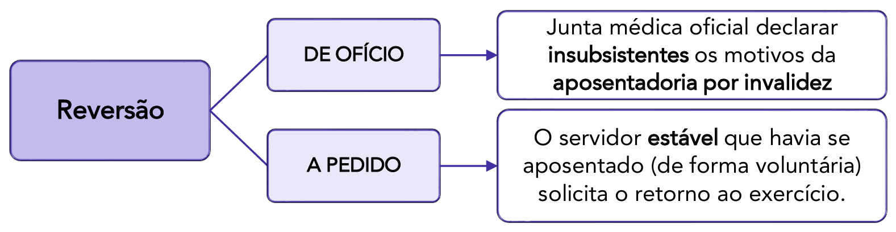
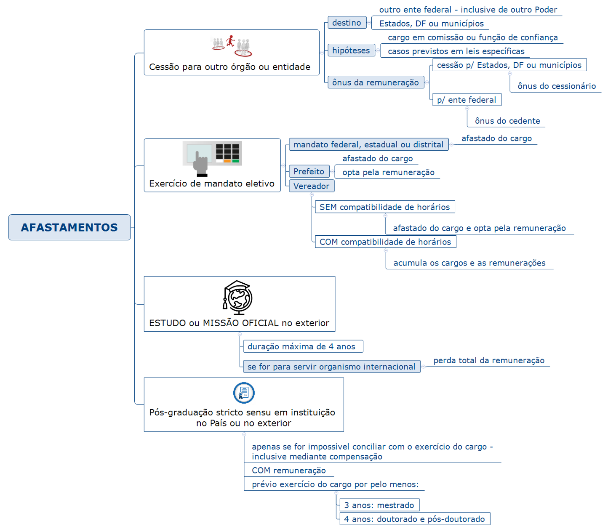
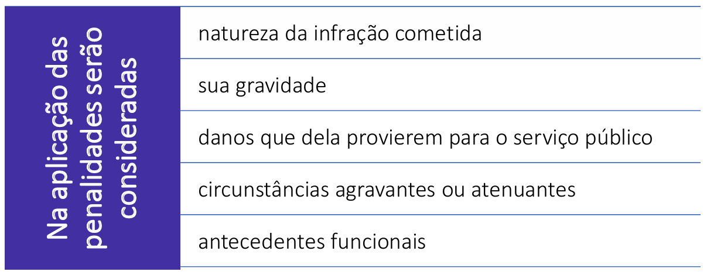

# Capítulo 1 – Lei nº 8.112/1990: Regime Jurídico dos Servidores Públicos Civis da União

## Disposições Preliminares: Cargo, Emprego e Função Pública

### Noções Introdutórias: Situando o Servidor Público

Antes de adentrarmos nas minúcias do regime jurídico estabelecido pela Lei nº 8.112, de 11 de dezembro de 1990, é fundamental estabelecer uma base conceitual sólida, compreendendo exatamente onde o "servidor público" se localiza no vasto universo dos colaboradores do Estado. A expressão **servidor público** representa uma espécie dentro do gênero **agentes públicos**.

**Agentes públicos**, em sentido amplo, são todas as pessoas físicas que, de alguma forma, prestam serviços ao Estado e às pessoas jurídicas da Administração Indireta, exercendo uma função pública. A doutrina majoritária, notadamente a do professor Hely Lopes Meirelles, classifica os agentes públicos em cinco grandes categorias, conforme detalhado a seguir:

  

- **Agentes Políticos:** São os componentes do mais alto escalão do governo, incumbidos de traçar as diretrizes, os planos de governo e as políticas públicas. Sua investidura não decorre de um vínculo profissional, mas sim de um mandato político obtido por meio de eleição (Chefes do Executivo e membros do Poder Legislativo), ou de nomeação para cargos de estrita confiança política, como os de Ministros e Secretários. **Exemplos:** Presidente da República, Governadores, Prefeitos, Senadores, Deputados, bem como Ministros e Secretários de Estado e de Município.
- **Agentes Administrativos:** Esta é a categoria de maior interesse para o nosso estudo. São todos aqueles que mantêm um vínculo profissional com o Estado e suas entidades, de natureza permanente ou temporária, e caráter predominantemente técnico ou de execução. É dentro desta categoria que encontramos os **servidores públicos estatutários** (ocupantes de cargos públicos), os **empregados públicos** (celetistas) e os **servidores temporários**.
- **Agentes Honoríficos:** São cidadãos convocados, designados ou requisitados para prestar, transitoriamente, determinados serviços ao Estado, geralmente em razão de sua condição cívica, notoriedade ou capacidade profissional. Não possuem vínculo profissional ou empregatício, e sua atuação é considerada um serviço público relevante (**múnus público**). A remuneração, quando existente, é usualmente um **pro labore** ou uma simples indenização. **Exemplos:** Jurados de um Tribunal do Júri, mesários eleitorais, membros de conselhos tutelares.
- **Agentes Delegados:** São particulares (pessoas físicas ou jurídicas) que recebem a incumbência da execução de uma atividade, obra ou serviço público, e o realizam em nome próprio, por sua conta e risco, mas sempre sob a fiscalização do Poder Público delegante. **Exemplos:** Concessionários e permissionários de serviços públicos (como empresas de transporte coletivo e de pedágio), leiloeiros oficiais, tradutores públicos juramentados.
- **Agentes Credenciados:** São aqueles que recebem da Administração Pública a incumbência de representar o Estado em uma ocasião específica ou de praticar determinada atividade, mediante remuneração do Poder Público. Não possuem vínculo empregatício, atuando de forma pontual. **Exemplo:** Um médico de uma clínica particular que é credenciado para realizar determinados procedimentos pelo Sistema Único de Saúde (SUS), ou um artista contratado para representar o país em um evento cultural internacional.

Compreendido que o servidor público é um tipo de agente administrativo, o próximo passo é diferenciar com precisão os conceitos de **cargo**, **emprego** e **função pública**, cuja confusão é uma fonte comum de erros em provas de concurso.

### A Tríade Essencial: Cargo, Emprego e Função

Embora no linguajar cotidiano os termos "cargo", "emprego" e "função" sejam frequentemente usados como sinônimos, no Direito Administrativo eles possuem significados técnicos distintos e inconfundíveis.

#### Cargo Público

O **cargo público** é a mais fundamental e indivisível unidade de competências dentro da estrutura da Administração Pública Direta, das autarquias e das fundações públicas de direito público. Pense no cargo como um "lugar" jurídico, uma posição formalmente criada por lei, com denominação própria, número certo de vagas e remuneração paga pelos cofres públicos. Este lugar é preenchido por um agente que passará a ter um conjunto definido de atribuições e responsabilidades.

O professor Hely Lopes Meirelles o definia como “o lugar instituído na organização do serviço público, com denominação própria, atribuições e responsabilidades específicas e estipêndio correspondente, para ser provido e exercido por um titu1lar, na forma estabelecida em lei”.

A Lei nº 8.112/1990, em seu artigo 3º, adota uma definição alinhada, afirmando que:

> **Art. 3º** Cargo público é o conjunto de atribuições e responsabilidades previstas na estrutura organizacional que devem ser cometidas a um servidor.

A principal característica do cargo público é o **vínculo jurídico** que une seu ocupante ao Estado. Esse vínculo é de natureza **estatutária** ou **institucional**. Isso significa que a relação não é regida por um contrato de vontades (como na CLT), mas sim por um **Estatuto**, que é uma lei. O Estado, por meio de lei, pode alterar unilateralmente as regras dessa relação (como remuneração, jornada, direitos e deveres), desde que respeitadas as garantias constitucionais.

Os ocupantes de cargos públicos são, por excelência, chamados de **servidores públicos estatutários**. No âmbito federal, seu regime é justamente o da Lei nº 8.112/1990.

Quanto à forma de preenchimento, os cargos públicos se dividem em duas naturezas:

- **Cargo Efetivo:** É aquele cujo provimento exige aprovação prévia em **concurso público de provas ou de provas e títulos**. É a regra geral para a investidura e confere ao servidor, após o estágio probatório, a garantia da **estabilidade**.
    - **Exemplo:** Analista Judiciário de um Tribunal, Auditor-Fiscal da Receita Federal, Policial Federal.

- **Cargo em Comissão:** É aquele de **livre nomeação e livre exoneração**, ou seja, não exige concurso público. Destina-se exclusivamente às atribuições de **direção, chefia e assessoramento**. A autoridade competente pode nomear e exonerar seu ocupante a qualquer momento, sem necessidade de justificativa. São cargos de confiança política ou técnica.
    - **Exemplo:** Ministro de Estado, Secretário de um Tribunal, Assessor Especial de um Governador.

#### Emprego Público

O **emprego público**, assim como o cargo, também representa uma unidade de atribuições dentro da máquina estatal. A grande diferença reside na natureza do vínculo: o ocupante de um emprego público, chamado de **empregado público**, é contratado sob o regime da **Consolidação das Leis do Trabalho (CLT)**.

Seu vínculo, portanto, é de natureza **contratual**, e não legal/estatutária. A relação é regida por um contrato de trabalho, o que a aproxima das relações do setor privado. No entanto, é fundamental entender que essa relação não é puramente privada. O empregado público está a serviço do Estado, e por isso seu vínculo sofre forte influência de normas de direito público.

Apesar de serem celetistas, a investidura em emprego público, como regra, também **depende de aprovação prévia em concurso público**, conforme determina o art. 37, II, da Constituição Federal.

Enquanto os cargos públicos são típicos das pessoas jurídicas de direito público (União, Estados, DF, Municípios, autarquias e fundações públicas de direito público), os empregos públicos são a forma de contratação padrão nas **entidades da Administração Indireta de direito privado**, como as **empresas públicas** e as **sociedades de economia mista**.

- **Exemplo:** Funcionários do Banco do Brasil (sociedade de economia mista), da Caixa Econômica Federal (empresa pública) e da Petrobras (sociedade de economia mista) são empregados públicos.

#### Função Pública

Por fim, temos o conceito de **função pública**, que é definido de forma residual. A função pública corresponde a um conjunto de atribuições públicas que, no entanto, **não correspondem a um cargo ou emprego público específico**. É uma forma de atuação em nome do Estado sem que o agente ocupe uma posição formal na estrutura de cargos ou empregos.

Conforme ensina a professora Maria Sylvia Zanella Di Pietro, existem atribuições que precisam ser exercidas, mas para as quais o legislador não criou um cargo ou emprego correspondente. A Constituição Federal, em seu art. 37, II, ao exigir concurso público, menciona apenas "cargo ou emprego", omitindo deliberadamente o termo "função", o que indica um tratamento diferenciado.

Atualmente, a função pública se manifesta em duas modalidades principais:

  

- **Função de Confiança**: São atribuições de direção, chefia e assessoramento exercidas de forma transitória. O ponto mais importante sobre elas é que, segundo o art. 37, V, da Constituição, as funções de confiança são exercidas exclusivamente por servidores ocupantes de cargo efetivo. Isso significa que um servidor concursado e estável pode ser designado para exercer, além das atribuições de seu cargo, uma função de liderança ou assessoramento, recebendo por isso uma gratificação. Ele não ocupa um novo cargo, apenas acumula uma nova função temporariamente.
    - **Exemplo:** Um Analista Tributário (servidor de cargo efetivo) é designado para ser o "Chefe da Seção de Atendimento ao Contribuinte" (função de confiança). Ele continua sendo Analista, mas enquanto exercer a chefia, recebe uma remuneração adicional.

- **Agente Temporário/Função Temporária (Contratação por Tempo Determinado):** Esta modalidade, prevista no art. 37, IX, da Constituição, permite que a Administração Pública contrate pessoal por tempo determinado para atender a uma **necessidade temporária de excepcional interesse público**.
    - O que seria "excepcional interesse público"? A própria lei de cada ente federativo define as hipóteses. **Exemplos comuns incluem**: contratação de médicos e enfermeiros para combater uma epidemia, recenseadores para o censo do IBGE, professores substitutos em universidades federais, ou pessoal para atuar em situações de calamidade pública.
    - Os agentes contratados nesta modalidade não são servidores estatutários nem empregados celetistas. Eles são vinculados por um **contrato de direito administrativo**, com um regime jurídico especial, definido em lei específica. No âmbito federal, essa lei é a Lei nº 8.745/1993.

A tabela a seguir consolida e compara as principais características estudadas:

|Característica|Cargo Público|Emprego Público|Função Pública|
|---|---|---|---|
|**Ocupante**|Servidor Público Estatutário|Empregado Público|Função de Confiança (por servidor efetivo) ou Contratado Temporário|
|**Vínculo Jurídico**|Legal (Estatutário)|Contratual (Celetista)|Função de Confiança: acessório ao vínculo estatutário.   Temporário: Contrato de Direito Administrativo.|
|**Regime Jurídico**|Estatuto (Ex: Lei 8.112/90)|CLT (com incidência de normas públicas)|Regime Jurídico Especial (Ex: Lei 8.745/93)|
|**Forma de Investidura**|Concurso público (regra) ou livre nomeação (cargos em comissão)|Concurso público (regra)|Função de Confiança: livre designação entre servidores efetivos.   Temporário: processo seletivo simplificado (regra).|
|**Entidades Típicas**|Adm. Direta, Autarquias, Fundações Públicas de Direito Público|Empresas Públicas, Sociedades de Economia Mista|Todas as esferas da Administração.|
|**Natureza**|Permanente|Permanente|Função de Confiança: Transitória.   Temporário: Transitória e por prazo determinado.|

### Os Regimes Jurídicos dos Agentes Administrativos

Como vimos, a relação profissional entre o Estado e seus agentes administrativos pode ser governada por diferentes conjuntos de normas. Essa diversidade dá origem a três regimes jurídicos principais:

- **Regime Estatutário:** É o regime legal, definido por um Estatuto (lei), que rege os direitos e deveres dos servidores públicos ocupantes de **cargos públicos**. É um regime de direito público, marcado pela possibilidade de alteração unilateral das regras pelo Estado. Este será o nosso foco de estudo, com base na Lei nº 8.112/1990.
- **Regime Celetista:** É o regime contratual, regido pela **Consolidação das Leis do Trabalho (CLT)**, aplicável aos **empregados públicos**. Embora seja predominantemente de direito privado, ele é adaptado por normas de direito público, como a exigência de concurso e o teto remuneratório.
- **Regime Especial (ou Temporário):** É o regime aplicável aos contratados para atender a uma necessidade temporária de excepcional interesse público. É definido por lei específica de cada ente federativo e possui natureza de direito administrativo.

Feita esta indispensável contextualização, que nos permitiu diferenciar os principais conceitos e regimes, estamos prontos para iniciar o estudo aprofundado do regime estatutário federal, conforme previsto na Lei nº 8.112/1990.

## O Regime Jurídico da Lei nº 8.112/1990: Âmbito e Características

O **regime estatutário** é o conjunto de normas que disciplina a relação jurídica de natureza não-contratual entre os servidores públicos e as pessoas jurídicas de direito público a que pertencem (Administração Direta, autarquias e fundações públicas). A principal característica desse regime é que suas regras são fixadas de forma unilateral pelo Estado, por meio de uma **lei** específica, denominada **Estatuto**.

Cada ente da federação (União, Estados, Distrito Federal e Municípios) possui competência para editar seu próprio estatuto. No âmbito federal, a norma que rege essa relação para os servidores civis é a **Lei nº 8.112, de 11 de dezembro de 1990**.

A edição desta lei teve como fundamento a redação original do **art. 39 da Constituição Federal de 1988**, que determinava:

> **Art. 39, CF/88 (Redação Original):** A União, os Estados, o Distrito Federal e os Municípios instituirão, no âmbito de sua competência, **regime jurídico único** e planos de carreira para os servidores da administração pública direta, das autarquias e das fundações públicas.

A exigência de um **"regime jurídico único"** forçava cada ente a escolher um único regime (majoritariamente o estatutário) para todos os servidores de sua administração direta, autárquica e fundacional.

Contudo, a **Emenda Constitucional nº 19, de 1998**, alterou profundamente este artigo, **eliminando a obrigatoriedade do regime jurídico único**. Essa mudança, em tese, permitiria que um mesmo ente federativo tivesse servidores estatutários e empregados celetistas coexistindo dentro de sua administração direta, autarquias e fundações.

Ocorre que o Supremo Tribunal Federal (STF), ao julgar a Ação Direta de Inconstitucionalidade (ADI) nº 2.135, concedeu uma medida cautelar para **suspender a eficácia da nova redação do art. 39**. Na prática, até o julgamento definitivo da ação, a regra que prevalece é a da redação original, ou seja, a **exigência do regime jurídico único**.

Por essa razão, o escopo de aplicação da Lei nº 8.112/1990 é bem definido:

- **A quem se aplica?** Aos servidores públicos civis da **Administração Pública Federal Direta** (Ministérios, Presidência da República, etc.), das **autarquias federais** (INSS, IBAMA, etc.) e das **fundações públicas federais de direito público** (FUNAI, etc.).
- **A quem NÃO se aplica?**
    - Aos **militares**, que possuem estatuto próprio.
    - Aos servidores dos **Poderes Legislativo e Judiciário**, que possuem regimes próprios, embora muitas vezes se utilizem da Lei nº 8.112/1990 de forma subsidiária.
    - Aos servidores dos **Estados, Distrito Federal e Municípios**, que devem ter seus próprios estatutos.
    - Aos **empregados públicos federais**, que são regidos pela CLT e atuam em empresas públicas (Caixa Econômica Federal, Correios) e sociedades de economia mista (Banco do Brasil, Petrobras).

## Formas de Provimento e Vacância

### Provimento: O Ato de Preenchimento do Cargo Público

O preenchimento de um cargo público vago se dá por meio do ato de **provimento**. Trata-se do ato administrativo que formaliza a designação de uma pessoa para titularizar um cargo público, estabelecendo o início do vínculo jurídico com a Administração.

A doutrina define o provimento de formas complementares. Para José dos Santos Carvalho Filho, é o "fato administrativo que traduz o preenchimento de um cargo público". Já para Maria Sylvia Zanella Di Pietro, é o "ato pelo qual se efetua o preenchimento do cargo público, com a designação de seu titular".

A Lei nº 8.112/1990, em seu artigo 8º, elenca as formas de provimento de cargo público. A doutrina costuma classificá-las em duas grandes categorias: **provimento originário** e **provimento derivado**.

- **Provimento Originário:** É aquele que dá início a um vínculo jurídico novo entre o servidor e a Administração, não dependendo de uma relação anterior. A **nomeação** é a única forma de provimento originário.
- **Provimento Derivado:** É aquele que pressupõe a existência de um vínculo jurídico anterior e estável do servidor com a Administração. Todas as outras formas (promoção, readaptação, reversão, aproveitamento, reintegração e recondução) são derivadas.

  

O art. 8º da Lei nº 8.112/1990 estabelece as seguintes formas de provimento:

I - nomeação;
II - promoção;
**III - revogado**
**IV - revogado**
V - readaptação;
VI - reversão;
VII - aproveitamento;
VIII - reintegração;
IX - recondução.

> **Ponto de Atenção: Ascensão e Transferência**
> 
> É fundamental observar que os incisos III e IV do artigo 8º, que originalmente previam a **ascensão** e a **transferência** como formas de provimento, foram **revogados**. O Supremo Tribunal Federal (STF) declarou ambas as formas **inconstitucionais** (Súmula Vinculante nº 43), por entenderem que representavam uma burla à exigência de concurso público (art. 37, II, da CF/88).
> 
> - A **transferência** permitia que um servidor passasse de um cargo para outro de igual denominação e vencimentos, mas pertencente a um quadro de pessoal diverso (ex: de um órgão para outro).
> - A **ascensão** (também chamada de "acesso") permitia que o servidor fosse promovido para um cargo de uma carreira diferente, de nível mais elevado.
> 
> Ambas as modalidades permitiam a investidura em um cargo para o qual o servidor não havia prestado concurso público específico, motivo pelo qual foram expurgadas do ordenamento jurídico. Portanto, **ascensão e transferência NÃO são formas válidas de provimento de cargo público**.

A seguir, passaremos ao estudo detalhado de cada uma das formas de provimento válidas, iniciando pela nomeação.

### Nomeação: A Porta de Entrada no Serviço Público

A **nomeação** é o ato administrativo que materializa o provimento de um cargo público. Trata-se da única forma de **provimento originário** prevista na Lei nº 8.112/1990, o que a torna a porta de entrada por excelência para o serviço público. Por ser de caráter originário, a nomeação instaura um vínculo jurídico novo e autônomo, não dependendo de qualquer relação preexistente do nomeado com a Administração Pública.

Mesmo que uma pessoa já seja servidora pública, ao ser aprovada em um novo concurso e nomeada para um novo cargo, essa nova investidura será considerada originária. O fato gerador do novo vínculo não é a relação anterior, mas sim a aprovação no novo certame.

- **Exemplo:** Joana é Técnica Judiciária (cargo de nível médio) em um Tribunal Regional Federal. Após anos de estudo, ela é aprovada no concurso para Analista Judiciário (cargo de nível superior) no mesmo tribunal. Ao ser publicada sua nomeação para Analista, este ato será um provimento originário, pois a causa jurídica que o fundamenta é a aprovação no novo concurso, e não seu vínculo anterior como Técnica.

A nomeação é um ato de competência do Chefe de cada Poder (no âmbito da União, o Presidente da República para o Executivo, os Presidentes das Casas para o Legislativo e os Presidentes dos Tribunais para o Judiciário), podendo ser delegada. Ela pode ocorrer em duas modalidades, a depender da natureza do cargo a ser provido:

  

- **Para Cargo de Provimento Efetivo:** Esta é a regra no serviço público, em obediência ao princípio constitucional do concurso público (art. 37, II, CF/88). A nomeação ocorre para preencher um cargo de caráter permanente na estrutura da Administração e exige, impreterivelmente, a **prévia aprovação em concurso público** de provas ou de provas e títulos. A nomeação dos candidatos aprovados deve seguir rigorosamente a **ordem de classificação** final do certame.
- **Para Cargo em Comissão:** Esta é a exceção. Trata-se da nomeação para cargos declarados em lei como de **livre nomeação e livre exoneração**. São cargos de confiança, destinados às atribuições de direção, chefia e assessoramento. A autoridade competente possui discricionariedade para escolher e nomear o ocupante, assim como para exonerá-lo a qualquer tempo, sem necessidade de motivação (ato ad nutum).

Do ponto de vista jurídico, a nomeação é um **ato administrativo unilateral**, ou seja, ela se aperfeiçoa com a única manifestação de vontade da Administração Pública, expressa por sua publicação em diário oficial. Não se exige, neste momento, a concordância do nomeado.

> **Ponto de Atenção: O Direito Subjetivo à Nomeação**
> 
> A nomeação gera um importante efeito para o candidato aprovado em concurso: o **direito subjetivo à nomeação**. O Supremo Tribunal Federal (STF) consolidou o entendimento de que o candidato aprovado **dentro do número de vagas** previstas no edital possui direito líquido e certo de ser nomeado durante o prazo de validade do concurso. A Administração, nesse caso, não tem mais a mera expectativa, mas o **dever** de nomear.

Contudo, é crucial entender que a nomeação, por si só, não torna a pessoa um servidor público. Ela é o primeiro e indispensável passo para a **investidura** no cargo, que só se completa com a **posse**. A nomeação confere o direito à posse; a posse, por sua vez, completa a investidura.

Se o nomeado para um cargo efetivo não tomar posse no prazo legal, que é de **30 (trinta) dias** contados da publicação do ato de provimento (art. 13, § 1º), o ato de nomeação será **tornado sem efeito**. Essa expressão é tecnicamente importante:

- **Tornado sem Efeito:** Ocorre quando o nomeado não cumpre o requisito da posse. O vínculo jurídico nunca chegou a se formar. Não se trata de exoneração (que pressupõe um servidor já empossado) nem de anulação (que pressupõe uma ilegalidade no ato). O ato de nomeação simplesmente perde sua eficácia.

Por fim, é vital não confundir **nomeação** com **designação**.

- **Nomeação** refere-se ao provimento de um **cargo público** (seja efetivo ou em comissão).
- **Designação** é o ato pelo qual um servidor efetivo é escolhido para exercer uma **função de confiança** ou **função comissionada**. O servidor é **nomeado** para o cargo de Analista e, posteriormente, pode ser **designado** para a função de Chefe de Setor. A designação não cria um novo vínculo, apenas atribui um encargo adicional ao servidor já empossado em seu cargo.

Estudada a nomeação, a única forma de provimento originário, passemos à análise das formas de provimento derivado, que pressupõem um vínculo estável anterior do servidor com a Administração.

### Promoção: A Evolução na Carreira

A **promoção** é uma forma de **provimento derivado vertical**, por meio da qual o servidor público efetivo é elevado a um cargo de maior complexidade ou responsabilidade dentro da **mesma carreira** a que pertence. É o mecanismo que permite a progressão e o desenvolvimento profissional do servidor ao longo de sua vida funcional.

Conforme define Celso Antônio Bandeira de Mello, a promoção se distingue por ser um "deslocamento vertical do servidor, de uma para outra classe mais elevada, dentro do mesmo cargo ou da carreira a que pertence". O termo **carreira**, neste contexto, deve ser entendido como a estrutura organizada de cargos, geralmente dividida em **classes** (agrupamentos de cargos da mesma natureza e responsabilidade) e **padrões** (níveis de vencimento dentro de uma mesma classe), que delineia a trajetória de ascensão do servidor.

A movimentação na carreira via promoção ocorre com base em critérios objetivos previamente estabelecidos na lei que rege a respectiva carreira. Os dois critérios mais comuns são:

- **Promoção por Merecimento:** Baseada no mérito profissional do servidor, aferido por meio de avaliações de desempenho periódicas, participação em cursos de capacitação, obtenção de títulos acadêmicos, entre outros fatores que demonstrem sua contribuição e desenvolvimento.
- **Promoção por Antiguidade:** Baseada exclusivamente no tempo de efetivo exercício do servidor na classe ou padrão em que se encontra.

- **Exemplo:** João, servidor público, foi nomeado para o cargo de Analista de Comércio Exterior, ingressando na carreira na Classe A, Padrão I. Após cumprir o interstício (período mínimo) e obter resultados satisfatórios em sua avaliação de desempenho, ele recebe uma **promoção por merecimento**, passando para a Classe B, Padrão I. Anos depois, ao completar o tempo de serviço exigido na lei de sua carreira, ele recebe uma **promoção por antiguidade**, passando para a Classe C, Padrão I. Em todos os casos, ele permaneceu na carreira de Analista de Comércio Exterior.

> **Ponto de Atenção: Promoção vs. Ascensão e Transferência**
> 
> É imperativo diferenciar a **promoção**, que é constitucional, das figuras da **ascensão** e da **transferência**, que são **inconstitucionais**. A promoção ocorre sempre **dentro da mesma carreira** para a qual o servidor prestou concurso. Já a ascensão e a transferência representavam formas de "salto" ou "transposição" para uma carreira distinta, o que foi vedado pelo STF por violar a regra do concurso público.
> 
> A **Súmula Vinculante nº 43 do STF** pacificou o tema:
> 
> > É inconstitucional toda modalidade de provimento que propicie ao servidor investir-se, sem prévia aprovação em concurso público destinado ao seu provimento, em cargo que não integra a carreira na qual anteriormente investido.
> 
> - **Exemplo de prática inconstitucional:** Maria é Técnica do Seguro Social (cargo de nível médio). Após alguns anos, por meio de um processo interno, ela obtém uma "ascensão funcional" para o cargo de Analista do Seguro Social (cargo de nível superior). Essa movimentação é inconstitucional, pois ela está ingressando em uma nova carreira (a de Analista) sem ter sido aprovada no concurso público específico para esse cargo. A única forma válida de Maria se tornar Analista é sendo aprovada em um novo concurso.

Portanto, a promoção é a única forma de provimento derivado vertical admitida em nosso ordenamento jurídico.

Um aspecto legal importante da promoção é que ela **não interrompe o tempo de exercício** do servidor. Isso significa que, para fins de contagem de tempo para aposentadoria, férias e outros benefícios, o período de serviço não é "zerado" a cada promoção. A contagem continua normalmente, como dispõe o art. 17 da Lei nº 8.112/1990:

> **Art. 17.** A promoção não interrompe o tempo de exercício, que é contado no novo posicionamento na carreira a partir da data de publicação do ato que promover o servidor.

Por fim, é crucial notar que a promoção possui um **efeito dúplice**. Ao mesmo tempo em que ela é uma forma de **provimento** (pois o servidor preenche um cargo na classe/padrão superior), ela também é uma forma de **vacância** (pois o servidor deixa vago o cargo na classe/padrão que ocupava anteriormente). Este duplo efeito é frequentemente explorado em questões de concurso.

### Readaptação: A Readequação Funcional do Servidor

A **readaptação** é a forma de provimento derivado pela qual um servidor, que tenha sofrido uma **limitação em sua capacidade física ou mental**, é investido em um novo cargo, cujas atribuições e responsabilidades sejam compatíveis com sua nova condição. Este instituto é um importante mecanismo de proteção ao servidor e de garantia da eficiência do serviço público, pois busca reaproveitar a força de trabalho do agente que, embora não possa mais exercer suas funções originais, ainda possui plena capacidade para outras.

A condição fundamental para que ocorra a readaptação é que a limitação de capacidade seja comprovada por uma **inspeção médica oficial**, conforme dispõe o art. 24 da Lei nº 8.112/1990. Não se trata, portanto, de uma escolha ou de uma avaliação subjetiva, mas de uma constatação técnica realizada por uma junta médica.

A doutrina classifica a readaptação como a única forma de **provimento derivado horizontal**. A expressão "horizontal" significa que o servidor não ascende nem é rebaixado em sua posição funcional. Ele é deslocado para um cargo de mesmo nível hierárquico e remuneratório, apenas com um conjunto de atribuições diferente e compatível com sua limitação.

Para que a readaptação seja efetivada, a lei exige o cumprimento de alguns requisitos para o novo cargo:

- **Atribuições Afins:** As tarefas do novo cargo devem ter correlação com as do cargo anterior, sempre que possível.
- **Habilitação Exigida:** O servidor deve possuir a qualificação técnica ou a formação específica exigida para o novo cargo.
- **Nível de Escolaridade:** O novo cargo deve exigir o mesmo nível de escolaridade do cargo de origem.
- **Equivalência de Vencimentos:** A remuneração do novo cargo deve ser equivalente à do cargo que o servidor ocupava.
- **Exemplo:** Um Perito Criminal Federal, especialista em análise de campo, sofre um acidente que lhe causa uma deficiência motora permanente, impedindo-o de realizar coletas em locais de difícil acesso. Após laudo da junta médica, a Administração constata que ele não pode mais exercer plenamente as funções de perito de campo. No entanto, sendo ele graduado em Química e possuindo grande conhecimento técnico, ele é **readaptado** em um cargo vago de mesma remuneração e nível de escolaridade, cujas atribuições sejam exclusivamente laboratoriais e administrativas, compatíveis com sua nova condição física.

Duas situações específicas devem ser observadas no processo de readaptação:

1. **Inexistência de Cargo Vago:** Caso a Administração identifique um cargo compatível, mas não haja uma vaga disponível no momento, o servidor readaptado exercerá suas novas atribuições como **excedente**, até a ocorrência de uma vaga no quadro de pessoal. Ele não fica sem trabalhar, mas aguarda a formalização de sua nova posição.
2. **Incapacidade Total:** Se a junta médica oficial constatar que a limitação sofrida pelo servidor é tão severa que o torna incapaz para todo e qualquer serviço público, não sendo possível a readaptação, o servidor será, então, **aposentado por invalidez**. A aposentadoria é, portanto, a medida subsidiária, aplicada apenas quando a readaptação não for viável.

Assim como a promoção, a readaptação também possui um **efeito dúplice**: é uma forma de **provimento**, pois o servidor preenche um novo cargo, e, simultaneamente, é uma forma de **vacância**, pois o cargo que ele ocupava anteriormente torna-se vago.

Estudada a readaptação, passaremos a analisar as quatro formas de provimento derivado que se caracterizam pelo **reingresso** do servidor ao serviço público, após um afastamento.

### Formas de Provimento por Reingresso

Após analisarmos a nomeação, a promoção e a readaptação, adentramos agora em um grupo de formas de provimento derivado que possuem uma característica em comum: todas representam o **reingresso** de um servidor ao serviço público, após algum tipo de afastamento ou desligamento. São elas: a reversão, o aproveitamento, a reintegração e a recondução.

#### Reversão: O Retorno do Servidor Aposentado

A **reversão** é o ato pelo qual um servidor **aposentado** retorna à atividade no serviço público. Trata-se de uma forma de provimento derivado, pois pressupõe um vínculo anterior que, embora extinto pela aposentadoria, é a causa jurídica para o reingresso.

Conforme o artigo 25 da Lei nº 8.112/1990, a reversão acarreta uma mudança fundamental no status remuneratório do servidor: ele deixa de receber os **proventos** da inatividade (aposentadoria) e volta a receber a **remuneração** correspondente ao cargo que passará a ocupar. A lei assegura, ainda, que as vantagens de natureza pessoal que o servidor percebia antes de se aposentar sejam mantidas.

A reversão pode ocorrer em duas modalidades distintas, com naturezas e requisitos completamente diferentes: a reversão de ofício e a reversão a pedido.

  

**I. Reversão de Ofício (ou Compulsória)**

Esta modalidade ocorre quando um servidor, que foi **aposentado por invalidez**, tem os motivos de sua aposentadoria declarados insubsistentes por uma **junta médica oficial**. Em outras palavras, a perícia médica constata que o servidor recuperou sua capacidade laborativa e está apto a voltar ao trabalho.

A reversão de ofício possui as seguintes características:

- **Ato Vinculado:** Uma vez que a junta médica atesta a recuperação da capacidade do servidor, a Administração Pública tem o **dever** de revertê-lo. Não há espaço para análise de conveniência ou oportunidade; é um ato obrigatório.
- **Independe de Estabilidade:** O retorno à atividade é compulsório, independentemente de o servidor ser estável ou não no momento em que se aposentou.
- **Cargo de Retorno:** O servidor, em regra, retornará ao mesmo cargo que ocupava ou em cargo resultante de sua transformação.
- **Regra do Excedente:** Caso o cargo original esteja ocupado no momento do retorno, o servidor revertido exercerá suas atribuições como **excedente**, até que surja uma vaga.

**II. Reversão a Pedido (ou Voluntária)**

Nesta modalidade, o próprio servidor aposentado solicita seu retorno à atividade. Por ser um ato que depende da concordância da Administração, ele só se concretiza se forem preenchidos, cumulativamente, os seguintes requisitos:

1. **Solicitação do Aposentado:** O processo deve ser iniciado por um requerimento formal do interessado.
2. **Aposentadoria Voluntária:** A reversão só é possível se a aposentadoria original tiver sido voluntária, ou seja, por tempo de contribuição. Excluem-se, portanto, as aposentadorias por invalidez ou compulsória.
3. **Servidor Estável na Atividade:** O requerente deve ter sido estável quando estava na ativa.
4. **Prazo de Cinco Anos:** A aposentadoria deve ter ocorrido nos **cinco anos anteriores** à data da solicitação de reversão.
5. **Existência de Cargo Vago:** Diferentemente da reversão de ofício, aqui é indispensável que haja um cargo vago para ser preenchido. Não se admite o retorno na condição de excedente.

Além de todos esses requisitos, a reversão a pedido é um **ato discricionário**, que se perfaz "no interesse da Administração". Isso significa que, mesmo que o servidor preencha todas as condições, a autoridade competente pode indeferir o pedido se julgar que o retorno não é conveniente ou oportuno para o serviço público.

> **Ponto de Atenção: O Limite de Idade para a Reversão**
> 
> O artigo 27 da Lei nº 8.112/1990 estabelece uma vedação expressa: "Não poderá reverter o aposentado que já tiver completado 70 (setenta) anos de idade".
> 
> Este dispositivo foi criado quando a idade para a aposentadoria compulsória era de 70 anos. Contudo, a Emenda Constitucional nº 88/2015 elevou a idade da aposentadoria compulsória para **75 anos**. Embora o texto do art. 27 não tenha sido formalmente alterado, o entendimento é que a lógica da norma é impedir o retorno de um servidor que já atingiu a idade limite para permanência no serviço ativo. Portanto, para fins de prova, é crucial conhecer a literalidade do art. 27 (70 anos), mas também ter ciência da alteração constitucional que pode influenciar a interpretação da norma em questões mais complexas. A reversão não pode ocorrer se o servidor já tiver atingido a idade para a aposentadoria compulsória.

#### Aproveitamento: O Reingresso do Servidor em Disponibilidade

O **aproveitamento** é a forma de provimento derivado que marca o reingresso ao serviço ativo de um servidor que se encontrava em **disponibilidade**. Este instituto tem previsão direta na Constituição Federal (art. 41, § 3º) e é regulamentado nos artigos 30 a 32 da Lei nº 8.112/1990.

Para compreender o aproveitamento, é indispensável entender primeiro o que é a **disponibilidade**. A disponibilidade é a situação em que se encontra um servidor **estável** cujo cargo foi formalmente **extinto** ou declarado **desnecessário** pela Administração.

- **Quem pode ser colocado em disponibilidade?** Apenas o servidor **estável**. Caso um servidor em estágio probatório tenha seu cargo extinto, ele será exonerado. A disponibilidade é, portanto, uma garantia constitucional atrelada à estabilidade.
- **Por que ocorre?** Em decorrência de medidas de reorganização administrativa, o Poder Público pode, por meio de lei, extinguir determinados cargos ou, por ato administrativo, declará-los desnecessários.
- **Qual a situação do servidor?** O servidor em disponibilidade fica afastado de suas funções, mas mantém o vínculo com a Administração Pública, recebendo **remuneração proporcional ao seu tempo de serviço**. Ele fica, essencialmente, aguardando ser "aproveitado" em uma nova função.

É nesse contexto que surge o **aproveitamento**. Trata-se do ato pelo qual a Administração convoca o servidor em disponibilidade para assumir um novo cargo. A lei determina que esse novo cargo deve possuir **atribuições e vencimentos compatíveis** com o que era anteriormente ocupado pelo servidor.

- **Exemplo:** Imagine que uma lei federal extingue o cargo de "Técnico em Mecanografia" em todos os Ministérios, por se tratar de uma atividade obsoleta. Carlos, um servidor estável que ocupava esse cargo, é colocado em disponibilidade. Seis meses depois, um cargo de "Técnico de Apoio Administrativo", de mesma escolaridade e faixa de vencimento, fica vago no mesmo Ministério. A Administração, então, deverá realizar o **aproveitamento** de Carlos, convocando-o para assumir este novo cargo compatível.

O aproveitamento é um ato de natureza **obrigatória** para ambas as partes. A Administração tem o dever de aproveitar o servidor em disponibilidade assim que surgir uma vaga compatível. Em contrapartida, o servidor tem o dever de retornar ao serviço quando convocado.

A recusa injustificada em assumir o novo cargo acarreta uma penalidade severa. Conforme o art. 32, parágrafo único, da Lei nº 8.112/1990, se o servidor não entrar em exercício no prazo legal (salvo em caso de doença comprovada por junta médica oficial), o ato de aproveitamento será **tornado sem efeito** e a sua **disponibilidade será cassada**. A cassação da disponibilidade implica na quebra do vínculo com o serviço público, sendo uma das formas de demissão previstas no estatuto (art. 132, XV c/c art. 127, IV).

#### Reintegração: A Reparação da Demissão Ilegal

A **reintegração** é a forma de provimento derivado que garante a **reinvestidura de um servidor estável** no cargo que ocupava anteriormente, ou no cargo resultante de sua transformação, em decorrência da **invalidação de sua demissão**. Este instituto, previsto no art. 41, § 2º, da Constituição Federal e regulamentado pelo art. 28 da Lei nº 8.112/1990, é um dos mais fortes instrumentos de garantia da estabilidade, pois visa reparar integralmente o dano causado por um desligamento indevido.

O fato gerador da reintegração é, portanto, a anulação do ato de demissão. Essa invalidação pode ocorrer por duas vias:

1. **Decisão Administrativa:** A própria Administração Pública, no exercício de seu poder-dever de **autotutela** (Súmulas 346 e 473 do STF), pode rever seus próprios atos e, ao constatar uma ilegalidade no processo demissório (como a violação do contraditório e da ampla defesa), anular a demissão e determinar a reintegração do servidor.
2. **Decisão Judicial:** É a via mais comum. O servidor demitido recorre ao Poder Judiciário, que, ao analisar o caso, pode anular o ato de demissão por vício de legalidade, ordenando o retorno do servidor ao cargo.

A consequência da anulação da demissão é o restabelecimento completo do _status quo ante_, ou seja, a situação retorna exatamente ao ponto em que estava antes do ato ilegal. A lei determina que a reintegração se dará com o **ressarcimento de todas as vantagens**. Isso significa que a anulação opera com efeitos **retroativos (_ex tunc_)**, e o servidor terá direito a:

- Todas as remunerações e vencimentos que deixou de receber no período em que esteve afastado.
- A contagem de tempo de serviço para todos os fins (férias, aposentadoria, etc.).
- As promoções por antiguidade ou merecimento a que teria direito se estivesse na ativa.

> **Ponto de Atenção: O Destino do Eventual Ocupante do Cargo**
> 
> Uma questão clássica de concurso surge quando o cargo do servidor demitido já foi preenchido por outra pessoa. O que acontece com este novo ocupante quando o servidor original é reintegrado?
> 
> O art. 28, § 2º, da Lei nº 8.112/1990 resolve essa situação, estabelecendo uma ordem de preferência para o destino do "eventual ocupante":
> 
> 1. Será **reconduzido** ao cargo de origem, sem direito a indenização;
> 2. Será **aproveitado** em outro cargo; ou
> 3. Será posto em **disponibilidade**.
> 
> - **Exemplo:** João, servidor estável, foi demitido. Sua vaga foi preenchida por Maria, aprovada em novo concurso. Anos depois, João obtém uma decisão judicial que anula sua demissão. Ao ser **reintegrado**, João volta ao seu cargo original. Maria, a eventual ocupante, será **reconduzida** ao cargo que ocupava antes de ser nomeada para a vaga de João, se for o caso. Se não houver cargo de origem, a Administração tentará seu **aproveitamento** em outro cargo vago compatível. E, em último caso, se nenhuma das opções for possível, Maria será posta em **disponibilidade**.

Por fim, caso o cargo do servidor reintegrado tenha sido formalmente **extinto** por lei durante o período de seu afastamento, ele não ficará desamparado. Neste caso, o servidor será colocado em **disponibilidade**, nos mesmos moldes já estudados, aguardando o futuro aproveitamento em outro cargo.

#### Recondução: O Retorno ao Cargo de Origem

A **recondução** é a última das formas de provimento por reingresso e consiste no retorno do servidor **estável** ao cargo que ocupava anteriormente. Este instituto, também com previsão no art. 41, § 2º, da Constituição e regulamentado pelo art. 29 da Lei nº 8.112/1990, funciona como um mecanismo de retorno a uma posição de origem segura, em decorrência de situações específicas.

A lei prevê expressamente duas hipóteses para a ocorrência da recondução, e a jurisprudência, posteriormente consolidada em lei, adicionou uma terceira. São elas:

**I. Recondução em Decorrência da Reintegração do Anterior Ocupante**

Esta é a hipótese diretamente ligada à reintegração que acabamos de estudar. Ocorre quando um servidor estável ("Servidor B") ocupa uma vaga que foi aberta pela demissão de outro servidor ("Servidor A"). Se a demissão do "Servidor A" é posteriormente invalidada, ele será reintegrado ao cargo. Consequentemente, o "Servidor B", que ocupava a vaga, será **reconduzido** ao seu cargo de origem.

O fluxograma abaixo ilustra perfeitamente essa dinâmica:

  

Analisando a figura, o "Ocupante da vaga" (Servidor B), caso seja estável, será **reconduzido** ao seu cargo de origem como primeira opção. É fundamental notar que este direito só existe se este "eventual ocupante" já era um servidor público estável. Se ele não tinha vínculo anterior com a Administração (era seu primeiro cargo), ele será simplesmente exonerado, pois não possui um "cargo de origem" para o qual retornar.

**II. Recondução por Inabilitação em Estágio Probatório**

Esta hipótese protege o servidor que, já sendo **estável** em um cargo, presta um novo concurso e é nomeado para outro cargo inacumulável. Ao iniciar o exercício no novo cargo, ele será submetido a um novo **estágio probatório** de 3 anos. Caso ele seja considerado **inapto** neste novo estágio, sua estabilidade anterior, que é um atributo do servidor no serviço público e não no cargo, garante-lhe o direito de retornar à sua antiga posição.

- **Exemplo:** Beatriz é servidora estável no cargo de Técnica Administrativa em uma Universidade Federal. Ela presta concurso e é aprovada para o cargo de Analista em um Ministério. Durante o estágio probatório como Analista, suas avaliações de desempenho são insuficientes, e ela é considerada inapta para as novas funções. Beatriz não será exonerada do serviço público. Em vez disso, ela será **reconduzida** ao seu cargo de origem, o de Técnica Administrativa na universidade.

**III. Recondução a Pedido (Desistência do Estágio Probatório)**

Esta terceira hipótese, inicialmente uma construção da jurisprudência para garantir a segurança jurídica do servidor, foi posteriormente positivada na Lei nº 8.112/1990 (art. 20, § 2º). Ela permite que o servidor estável, que está em estágio probatório em um novo cargo, **solicite a recondução** ao cargo anterior por desistência.

Isso ocorre quando o servidor não se adapta às novas funções, ao novo ambiente de trabalho, ou simplesmente conclui que sua vocação estava no cargo anterior. Em vez de esperar uma possível reprovação na avaliação, ele pode, a qualquer momento durante o novo estágio probatório, solicitar seu retorno.

> **Ponto de Atenção: Requisitos e Consequências da Recondução**
> 
> Alguns pontos sobre a recondução são essenciais e frequentemente cobrados em provas:
> 
> - **Elegibilidade:** A recondução é um direito exclusivo do servidor **estável**.
> - **Indenização:** Em nenhuma hipótese de recondução haverá direito a indenização, pois não há um ato ilícito da Administração a ser reparado. O retorno ao cargo de origem é uma consequência de outra situação jurídica (reintegração de terceiro, inaptidão ou desistência do próprio servidor).
> - **Cargo de Origem Ocupado:** Se, no momento da recondução, o cargo de origem do servidor já estiver ocupado, o servidor reconduzido será **aproveitado** em outro cargo de atribuições e vencimentos compatíveis ou, em último caso, colocado em **disponibilidade**.

### Resumo

Para sintetizar os principais aspectos das formas de provimento que estudamos, o quadro a seguir oferece uma visão comparativa:

  

## A Posse: O Ato de Aceitação e o Aperfeiçoamento do Vínculo

Após o ato de nomeação, que como vimos é a porta de entrada para o serviço público, a investidura no cargo se completa com a **posse**. Enquanto a nomeação é um ato unilateral da Administração, a posse é o momento em que o nomeado manifesta sua aceitação, concordando em assumir as atribuições, os deveres e as responsabilidades de seu cargo. É com a posse que o vínculo funcional entre o novo servidor e o Estado se aperfeiçoa.

É crucial destacar que a exigência da posse se aplica exclusivamente à forma de provimento por **nomeação**. Nas demais formas de provimento derivado (como promoção, readaptação, etc.), o servidor já possui um vínculo estabelecido e não há que se falar em uma nova posse.

### Provimento vs. Investidura: Esclarecendo os Conceitos

A doutrina e a própria lei fazem uma distinção técnica entre os termos **provimento** e **investidura**, que é fundamental para a correta compreensão do processo.

- **Provimento** é o ato da Administração que designa alguém para ocupar um cargo. É o ato de preenchimento da vaga. A nomeação é o exemplo por excelência.
- **Investidura** é o ato pelo qual a pessoa efetivamente se torna titular do cargo, assumindo suas prerrogativas e deveres. A investidura abrange dois momentos distintos e sucessivos: a **posse** e o **exercício**.

Nas palavras do mestre Celso Antônio Bandeira de Mello, a posse representa o **"travamento da relação funcional"**. De forma didática, pode-se dizer que o **provimento** diz respeito ao **cargo** (o cargo é provido), enquanto a **investidura** diz respeito à **pessoa** (a pessoa é investida no cargo).

  

A posse, portanto, tem natureza de **ato bilateral**, pois depende da convergência de duas vontades: a da Administração, que nomeia, e a do cidadão, que aceita o cargo. Essa aceitação é formalizada com a assinatura do **"termo de posse"**, um documento no qual deverão constar as atribuições, os deveres, as responsabilidades e os direitos inerentes ao cargo ocupado. Uma vez assinado, seu conteúdo não pode ser alterado unilateralmente por nenhuma das partes, ressalvados os atos de ofício previstos em lei.

### Requisitos Básicos para a Posse

Para que a investidura ocorra, o nomeado deve comprovar, no ato da posse, o preenchimento dos requisitos básicos previstos no art. 5º da Lei nº 8.112/1990:

  

- **A nacionalidade brasileira:** Em regra, admite-se tanto o brasileiro nato quanto o naturalizado. A exigência de ser brasileiro nato é restrita aos cargos privativos listados na Constituição (ex: Presidente da República).
- **O gozo dos direitos políticos:** Significa estar apto a votar e ser votado, não tendo os direitos políticos suspensos ou cassados.
- **A quitação com as obrigações militares e eleitorais:** Comprovação de estar em dia com o serviço militar (para homens) e com a Justiça Eleitoral.
- **O nível de escolaridade exigido para o exercício do cargo:** A comprovação do diploma ou da habilitação legal deve ser feita no momento da posse, e não na inscrição do concurso. Este é o entendimento pacificado pela **Súmula 266 do Superior Tribunal de Justiça (STJ)**.
- **A idade mínima de dezoito anos.**
- **Aptidão física e mental:** Esta aptidão é verificada por meio de uma **inspeção médica oficial** (perícia médica), que atestará se o candidato possui as condições de saúde necessárias para desempenhar as atribuições específicas do cargo para o qual foi nomeado.

Além desses requisitos, o nomeado deverá apresentar, no ato da posse, duas declarações importantes:

- **Declaração de bens e valores** que constituem seu patrimônio.
- **Declaração quanto ao exercício ou não de outro cargo, emprego ou função pública**, para verificação de eventual acúmulo ilegal de cargos.

### Prazos e Formalidades da Posse

A posse deverá ocorrer no prazo de **até 30 (trinta) dias**, contados da publicação do ato de provimento (nomeação). Este prazo, em regra, é **improrrogável**.

Contudo, a lei prevê uma exceção importante: se o nomeado já for um servidor público federal e estiver legalmente afastado (em licença ou outro impedimento previsto em lei), o prazo para a posse no novo cargo será contado a partir do **término do impedimento**. As situações de afastamento que suspendem a contagem do prazo incluem, entre outras, férias, licença para tratamento da própria saúde, licença à gestante ou paternidade, e licença para capacitação.

Caso o nomeado não tome posse dentro do prazo legal, o ato de sua nomeação será **tornado sem efeito**, conforme já estudado.

Por fim, a lei permite que a posse ocorra sem a presença física do nomeado, desde que ele seja representado por um terceiro munido de **procuração específica** para este fim (art. 13, § 3º). Uma procuração genérica não é válida.

## O Exercício: O Início Efetivo da Atividade Funcional

Após a nomeação e a posse, a investidura do servidor no cargo público se consolida com o **exercício**. O exercício, conforme define o art. 15 da Lei nº 8.112/1990, é o **efetivo desempenho das atribuições** do cargo público ou da função de confiança. É o momento em que o servidor, já legalmente investido no cargo, começa de fato a trabalhar e a exercer as responsabilidades que lhe foram cometidas.

Para o ingressante no serviço público, o caminho completo da investidura segue, portanto, esta sequência de atos: **Nomeação → Posse → Exercício**.

A entrada em exercício é um marco temporal de extrema importância, pois é a partir deste momento que se inicia a contagem do tempo de serviço do servidor para todos os efeitos legais, como aquisição de direito a férias, contagem para aposentadoria, promoções e, nos cargos efetivos, o início do estágio probatório para aquisição da estabilidade.

A lei estabelece prazos rigorosos para o início do exercício:

- **Prazo para Entrada em Exercício:** O servidor empossado tem o prazo de **até 15 (quinze) dias** para entrar em exercício, contados da data da posse.
- **Consequência do Não Cumprimento:** Caso o servidor não inicie suas atividades neste prazo, o ato de sua nomeação não é simplesmente tornado sem efeito. Como a posse já aperfeiçoou o vínculo, a pessoa já é considerada servidora pública. A ausência ao serviço neste caso é tratada como um abandono inicial das funções, e a consequência legal é a **exoneração** do cargo. A exoneração, neste contexto, não tem caráter punitivo, mas formaliza o desfazimento do vínculo.

O esquema a seguir resume as diferenças cruciais entre os efeitos da não ocorrência da posse e do não início do exercício:

  

A lei prevê, ainda, um prazo diferenciado para o servidor que já se encontra em atividade e precisa iniciar o exercício em outro município, em decorrência de remoção, redistribuição, requisição ou outra forma de deslocamento. Nestes casos, o prazo para a apresentação na nova sede será de, no mínimo, 10 e, no máximo, 30 dias, para que o servidor possa organizar sua mudança.

### Exercício de Função de Confiança

As regras para o início do exercício de uma **função de confiança** (ou cargo em comissão) são diferentes. Como o servidor designado já possui vínculo com a Administração, a lei determina que o início do exercício da nova função deve ser **imediato**, coincidindo com a data de publicação do ato de designação, salvo se o servidor estiver legalmente afastado.

Caso o servidor designado não entre em exercício, a consequência também é distinta. Não ocorre a exoneração de seu cargo efetivo, mas apenas o **ato de designação para a função é tornado sem efeito**.

|-|**Provimento em Cargo Efetivo**|**Designação para Função de Confiança**|
|---|---|---|
|**Ato de Investidura**|Nomeação|Designação|
|**Prazo para Exercício**|15 dias a partir da posse|Na data da publicação do ato (imediato)|
|**Se não entrar em exercício**|Exoneração do cargo|Ato de designação é tornado sem efeito|

## Tempo de Serviço: A Contagem e Seus Efeitos

Como mencionado, o **tempo de serviço** é o período de efetivo exercício do cargo, contado em dias e convertido em anos, e sua contagem se inicia na data de entrada em exercício. Este cômputo é fundamental para a aquisição de diversos direitos e vantagens na carreira do servidor.

É importante não confundir **tempo de serviço** com **tempo de contribuição**.

- **Tempo de Serviço:** É um conceito do direito administrativo, utilizado como parâmetro para direitos estatutários, como férias, licenças, promoções e a remuneração do servidor posto em disponibilidade.
- **Tempo de Contribuição:** É um conceito do direito previdenciário, que se refere ao período em que houve recolhimento de contribuições para o regime de previdência (RPPS ou RGPS) e é utilizado para o cálculo dos benefícios de aposentadoria e pensão.

Relembrando o que foi visto no tópico sobre a promoção, o art. 17 da lei estabelece que a **promoção não interrompe a contagem do tempo de serviço**, que continua a fluir normalmente no novo posicionamento do servidor na carreira.

### O Fim do Adicional por Tempo de Serviço

No passado, a Lei nº 8.112/1990 previa o pagamento do **adicional por tempo de serviço**, uma vantagem pecuniária que consistia em um acréscimo de 1% sobre o vencimento a cada ano de serviço (**anuênio**) ou 5% a cada cinco anos (**quinquênio**). Contudo, essa vantagem foi **extinta** para os servidores públicos federais a partir de 8 de março de 1999.

Atualmente, apenas os servidores que já haviam adquirido o direito a essa parcela antes da extinção continuam a recebê-la, por força do direito adquirido. Nenhum novo período de tempo de serviço gera direito a este adicional no âmbito federal.

## Jornada de Trabalho: Regras e Exceções

A Lei nº 8.112/1990 estabelece, em seu art. 19, a jornada de trabalho padrão para os servidores públicos federais, que é fixada em **8 horas diárias** e **40 horas semanais**, salvo quando a lei estabelecer duração diversa.

  

Contudo, a própria lei e legislações especiais preveem exceções importantes a essa regra geral:

- **Jornadas Especiais por Lei:** Carreiras específicas podem ter jornadas diferenciadas, definidas em lei própria. É o caso de médicos, advogados, jornalistas, entre outros, que podem cumprir jornadas de 20, 24 ou 30 horas semanais.
- **Cargos em Comissão e Funções de Confiança:** Os ocupantes destes cargos se submetem a um **regime de integral dedicação ao serviço**. Isso significa que eles podem ser convocados a trabalhar sempre que houver interesse ou necessidade da Administração, sem direito ao recebimento de horas extras.
- **Horário Especial para Servidor Estudante:** O servidor que comprovar a incompatibilidade entre seu horário de aulas e o da repartição terá direito a um horário de trabalho especial, **desde que realize a compensação das horas** não trabalhadas, para não haver prejuízo ao cumprimento da jornada semanal. O mesmo direito, com a mesma exigência de compensação, é assegurado ao servidor que participar de bancas examinadoras de concurso.
- **Horário Especial para Servidor com Deficiência (ou com dependente):** Ao servidor com deficiência, quando comprovada a necessidade por junta médica oficial, será concedido horário especial, **independentemente de compensação de horário**. Este mesmo direito é estendido ao servidor que tenha cônjuge, filho ou dependente com deficiência. Nestes casos, a proteção à saúde e à inclusão se sobrepõe à exigência de compensação.

## O Estágio Probatório: A Aferição da Aptidão para o Cargo

Após a nomeação, a posse e a entrada em exercício, o servidor nomeado para um cargo de provimento efetivo inicia um período de avaliação fundamental: o **estágio probatório**. Trata-se do período no qual a Administração Pública irá aferir, na prática, se o novo servidor possui a aptidão e a capacidade necessárias para o bom desempenho das atribuições do cargo para o qual foi aprovado em concurso. É a prova de fogo que valida a adequação do servidor às demandas do serviço público.

Conforme o art. 20 da Lei nº 8.112/1990, cinco fatores são objeto de avaliação durante o estágio probatório:

**I - Assiduidade:** Refere-se à frequência, pontualidade e presença constante do servidor no local de trabalho.
**II - Disciplina:** Consiste na observância das normas legais e regulamentares, bem como no acatamento às ordens superiores, exceto quando manifestamente ilegais.
**III - Capacidade de iniciativa:** Avalia a habilidade do servidor de agir de forma proativa, de encontrar soluções para os problemas e de se antecipar às demandas do serviço sem a necessidade de ordens constantes.
**IV - Produtividade:** Mede a quantidade e a qualidade do trabalho realizado pelo servidor, considerando a eficiência e a eficácia na execução de suas tarefas.
**V - Responsabilidade:** Avalia o grau de comprometimento e zelo do servidor com suas atribuições e com o patrimônio público.

Para facilitar a memorização, os concurseiros frequentemente utilizam o mnemônico **R.A.P.I.D.**: **R**esponsabilidade, **A**ssiduidade, **P**rodutividade, **I**niciativa e **D**isciplina.

### Duração do Estágio Probatório: A Regra dos 3 Anos

Um ponto de extrema importância e que gera muita confusão é a duração do estágio probatório. O texto do art. 20 da Lei nº 8.112/1990 ainda menciona o prazo de **24 meses**. Contudo, este dispositivo está tacitamente revogado. A **Emenda Constitucional nº 19, de 1998**, alterou o art. 41 da Constituição Federal, ampliando o prazo para a aquisição da **estabilidade** para **3 (três) anos** de efetivo exercício.

O Supremo Tribunal Federal (STF) pacificou o entendimento de que, por uma interpretação lógica e sistemática, o prazo do estágio probatório deve acompanhar o prazo da estabilidade. Portanto, apesar da redação desatualizada da Lei nº 8.112, o prazo vigente para o estágio probatório é de **3 anos (ou 36 meses)**.

> **Ponto de Atenção: Estágio Probatório vs. Estabilidade**
> 
> É fundamental não confundir esses dois institutos, que, embora relacionados, são distintos:
> 
> - **Estágio Probatório:** É o período de **avaliação da aptidão** para um **cargo específico**. Toda vez que um servidor, mesmo que já estável, assume um novo cargo efetivo (via novo concurso), ele será submetido a um novo estágio probatório.    
> - **Estabilidade:** É a **garantia de permanência no serviço público** (e não no cargo), adquirida pelo servidor efetivo após 3 anos de exercício e aprovação em avaliação de desempenho. A estabilidade, em regra, é adquirida uma única vez no serviço público de cada ente federativo.

### Avaliação e as Consequências da Inabilitação

A avaliação de desempenho do servidor é realizada por uma comissão específica, e o resultado deve ser submetido à homologação da autoridade competente **4 (quatro) meses antes do fim do estágio probatório**.

Se o servidor for aprovado, ele adquire a estabilidade (se for seu primeiro cargo) ou simplesmente conclui o estágio com sucesso (se já era estável). Contudo, se for considerado **inabilitado** (reprovado), as consequências variam conforme seu vínculo anterior:

- **Servidor não estável:** Será **exonerado** do cargo. É importante frisar que a exoneração por inabilitação em estágio probatório **não possui caráter de penalidade**, apenas atesta a inaptidão do servidor para aquele cargo específico. Se, durante o estágio, o servidor cometer uma falta grave, ele poderá ser **demitido** (ato punitivo) através de um Processo Administrativo Disciplinar.
- **Servidor estável:** Se o servidor já era estável em outro cargo federal, ele não será exonerado, mas sim **reconduzido** ao cargo que ocupava anteriormente, como já estudamos.

### Licenças e Afastamentos durante o Estágio

A contagem do tempo do estágio probatório pode ser afetada por licenças e afastamentos. A lei determina que o estágio ficará **suspenso** (a contagem para e é retomada de onde parou) durante as seguintes licenças: por motivo de doença em pessoa da família; por motivo de afastamento do cônjuge; para o serviço militar; para atividade política; e para participar de curso de formação.

A lei também estabelece quais licenças e afastamentos são permitidos e quais são vedados ao servidor em estágio probatório:

|Licenças / Afastamentos **Permitidos** no Estágio Probatório|Licenças / Afastamentos **Vedados** no Estágio Probatório|
|---|---|
|Licença maternidade e licença paternidade|Licença para Capacitação|
|Licença para tratamento de saúde|Licença para Tratar de Interesses Particulares|
|Licença por acidente do trabalho|Licença para Desempenho de Mandato Classista|
|Licença por motivo de doença em pessoa da família|Licença para participar de curso de pós-graduação|
|Licença por motivo de afastamento do cônjuge ou companheiro||
|Licença para o serviço militar||
|Licença para atividade política||
|Afastamento para exercício de mandato eletivo||
|Afastamento para estudo ou missão no exterior||
|Afastamento para servir em organismo internacional de que o Brasil participe||
|Afastamento para participar de curso de formação para ingresso em outro órgão da administração pública federal||

Por fim, é permitido que o servidor em estágio probatório exerça **cargos em comissão** ou **funções de confiança**.

### Entendimentos Jurisprudenciais Relevantes

- **Exoneração e Devido Processo Legal:** O STF, por meio da **Súmula nº 21**, estabeleceu que mesmo a exoneração por inabilitação em estágio probatório deve ser precedida de um processo administrativo que assegure ao servidor o **contraditório e a ampla defesa**.
- **Direito de Greve:** A participação de servidor em estágio probatório em movimento de greve não pode ser considerada falta de assiduidade para fins de reprovação. O STF entende que isso feriria o princípio da isonomia, pois o direito de greve é assegurado a todos os servidores.
- **Extinção do Cargo:** Se o cargo ocupado por um servidor em estágio probatório for extinto, e ele não for estável em virtude de outro cargo, ele será **exonerado**, não tendo direito a ser colocado em disponibilidade.

## A Vacância: O Desligamento do Cargo Público

Se o provimento é o ato que preenche um cargo público, a **vacância** é o fato administrativo que o torna vago, desocupado. Conforme leciona Marcelo Alexandrino, a vacância representa o **"rompimento definitivo do vínculo jurídico entre o servidor e a administração"**. É o ato ou fato que encerra a titularidade de um servidor sobre um determinado cargo.

O art. 33 da Lei nº 8.112/1990 elenca as hipóteses que geram a vacância de um cargo público:

**I - Exoneração;**
**II - Demissão;**
**III - Promoção;**
**IV - Readaptação;**
**V - Aposentadoria;**
**VI - Posse em outro cargo inacumulável;**
**VII - Falecimento.**

  

A vacância pode decorrer de um **ato administrativo** (como a exoneração de ofício ou a demissão) ou de um **fato jurídico** (como o falecimento do servidor).

> **Ponto de Atenção: O Efeito Dúplice de Certos Atos**
> 
> É crucial notar que algumas formas de vacância são, simultaneamente, formas de provimento em outro cargo. O servidor se desliga de um cargo para, no mesmo ato, se vincular a outro. Isso ocorre com:
> 
> - **Promoção:** O servidor deixa vago um cargo na classe inferior para prover (ocupar) um cargo na classe superior da mesma carreira.
> - **Readaptação:** O servidor deixa vago seu cargo original para prover um novo cargo compatível com sua limitação de capacidade.
> - **Posse em outro cargo inacumulável:** A posse no novo cargo gera a vacância do cargo anterior.

> **Não Confunda: Vacância vs. Deslocamento**
> 
> Formas de deslocamento do servidor, como a **remoção** e a **redistribuição** (que serão estudadas em detalhe mais adiante), **NÃO geram vacância**. Nesses casos, o servidor é deslocado para outra lotação ou outro órgão, mas leva consigo o seu cargo, que continua ocupado por ele. A vacância só ocorre quando o cargo fica efetivamente desprovido de seu titular.

Em razão de sua importância e complexidade, detalharemos a seguir as duas principais formas de desinvestidura do servidor: a exoneração e a demissão.

### Exoneração

A **exoneração** é a forma de vacância que **não possui caráter de penalidade**. Ela pode ocorrer por vontade do próprio servidor (a pedido) ou por determinação da Administração (de ofício), em hipóteses legalmente previstas.

As situações que levam à exoneração variam conforme a natureza do cargo, efetivo ou em comissão, conforme o esquema a seguir:

  

Analisando o quadro, a exoneração de um ocupante de **cargo em comissão** é um ato discricionário da autoridade competente (ad nutum), que não exige motivação. Já para o ocupante de **cargo efetivo**, a exoneração de ofício ocorre em duas situações que já estudamos:

1. **Inabilitação em estágio probatório.**
2. Quando, tendo tomado posse, o servidor não entra em exercício no prazo legal.

Além destas hipóteses da Lei nº 8.112/1990, a própria Constituição e a lógica do sistema preveem outras situações que resultam em exoneração, inclusive de servidores estáveis:

- **Insuficiência de desempenho (servidor estável):** Conforme o art. 41, § 1º, III, da CF/88, o servidor estável poderá perder o cargo mediante procedimento de avaliação periódica de desempenho, na forma de lei complementar, assegurada a ampla defesa.
- **Excesso de despesa com pessoal (servidor estável):** Para cumprimento dos limites de gastos com pessoal impostos pela Lei de Responsabilidade Fiscal, a Constituição (art. 169, § 4º) prevê, como última medida, a exoneração de servidores estáveis.
- **Extinção de cargo (servidor não estável):** Se o cargo de um servidor em estágio probatório for extinto, ele será exonerado, pois ainda não possui a garantia da disponibilidade.
- **Deslocamento por reintegração (servidor não estável):** Se um servidor não estável ocupa a vaga de um servidor que foi reintegrado, e não há como reconduzi-lo, ele será exonerado.

### Demissão

A **demissão**, em contraste com a exoneração, é a forma de vacância com **natureza de penalidade**. Ela é a sanção administrativa mais grave, aplicada ao servidor que comete uma infração disciplinar grave, após a conclusão de um Processo Administrativo Disciplinar (PAD) em que se assegure o contraditório e a ampla defesa.

Conforme leciona Di Pietro, a demissão tem o efeito de "desligar o servidor dos quadros do funcionalismo". É importante fazer uma distinção técnica:

- **Demissão:** É a penalidade aplicada aos ocupantes de **cargos efetivos**.
- **Destituição de Cargo em Comissão:** É a penalidade equivalente, aplicada aos ocupantes de **cargos em comissão** que cometem infrações graves.

As hipóteses que levam à demissão serão estudadas em profundidade no capítulo sobre o Regime Disciplinar. Por ora, o fundamental é compreender a diferença crucial entre demissão e exoneração:

  

Por fim, uma regra comum se aplica a diversas formas de desligamento. O servidor que for demitido, exonerado, ou que tiver sua aposentadoria ou disponibilidade cassada, e que possuir algum débito com o erário, terá o prazo de **60 (sessenta) dias** para quitar a dívida. A não quitação no prazo implicará na inscrição do valor em **dívida ativa**, para cobrança judicial.

## O Deslocamento do Servidor: Remoção e Redistribuição

Antes de detalhar as duas formas de deslocamento funcional previstas na Lei nº 8.112/1990, é crucial fixar uma premissa fundamental: a **remoção** e a **redistribuição** **não são formas de provimento nem de vacância**. Em nenhum dos dois institutos o servidor é investido em um novo cargo ou desligado do seu cargo atual. O vínculo funcional permanece intacto. O que ocorre é uma alteração no local físico ou na unidade organizacional onde o servidor exerce suas atribuições.

### Remoção: O Deslocamento do Servidor

A **remoção**, conforme o art. 36 da Lei, é o **deslocamento do servidor** para exercer suas atividades em outra localidade ou em outra unidade administrativa, sempre **no âmbito do mesmo quadro de pessoal** a que pertence. A remoção pode ocorrer com ou sem mudança de sede (município).

- **Exemplo 1 (remoção sem mudança de sede):** Um Auditor-Fiscal da Receita Federal é removido da Delegacia de Julgamento para a Delegacia de Fiscalização, ambas localizadas em Recife/PE.
- **Exemplo 2 (remoção com mudança de sede):** Um Analista do INSS é removido da Agência da Previdência Social em Caruaru/PE para a Agência da Previdência Social em Petrolina/PE.

A lei estabelece três modalidades de remoção, que se distinguem pela sua motivação e pela existência ou não de um direito subjetivo do servidor:

  

- **Remoção de Ofício, no interesse da Administração:** É a remoção compulsória, determinada pela Administração por necessidade do serviço. Neste caso, por ser um deslocamento forçado e no interesse público, o servidor terá direito à **ajuda de custo** para compensar as despesas de instalação na nova sede.
- **Remoção a Pedido, a critério da Administração:** O servidor solicita a remoção, mas a Administração tem a discricionariedade de concedê-la ou não, analisando a conveniência e a oportunidade do ato. Nesta modalidade, o servidor **não faz jus** à ajuda de custo.
- **Remoção a Pedido, independentemente do interesse da Administração:** Nestas hipóteses, a remoção deixa de ser um ato discricionário e passa a ser um **direito subjetivo do servidor**. Se os requisitos legais forem preenchidos, a Administração tem o dever de efetivar a remoção. São três os casos:
    - **a) Para acompanhar cônjuge ou companheiro, também servidor público civil ou militar, de qualquer dos Poderes da União, dos Estados, do DF e dos Municípios, que foi deslocado no interesse da Administração.** O ponto-chave aqui é que o deslocamento do cônjuge deve ter sido compulsório ("de ofício"). O STF entende que a nomeação inicial do cônjuge, decorrente de aprovação em concurso, não gera o direito à remoção, por não se tratar de deslocamento no interesse da Administração.
    - **b) Por motivo de saúde do servidor, de seu cônjuge, companheiro ou dependente,** condicionada à comprovação por **junta médica oficial**.
    - **c) Em virtude de processo seletivo de remoção (concurso de remoção),** no qual os servidores do órgão ou entidade competem por vagas em outras localidades, com base em regras e critérios objetivos definidos em edital.

> **Ponto de Atenção: Remoção e a Lei Maria da Penha**
> 
> A Lei nº 11.340/2006 (Lei Maria da Penha) estabelece que a servidora pública em situação de violência doméstica e familiar terá **acesso prioritário à remoção**, quando o afastamento do local de trabalho for necessário para garantir sua segurança, conforme determinação judicial.

No caso da remoção que implique mudança de município, o servidor terá, em regra, um prazo de **10 a 30 dias** para se apresentar na nova sede. Este período é chamado de **"tempo de trânsito"** e já inclui o tempo para o deslocamento.

### Redistribuição: O Deslocamento do Cargo

A **redistribuição**, por sua vez, é um instituto mais complexo e de natureza estritamente gerencial. Conforme o art. 37, a redistribuição é o **deslocamento de cargo de provimento efetivo, ocupado ou vago,** para outro órgão ou entidade **do mesmo Poder**.

A diferença fundamental para a remoção é o objeto do deslocamento:

- Na **remoção**, o **servidor** se desloca.
- Na **redistribuição**, o **cargo** é que se desloca, levando consigo o seu ocupante, se houver.

A redistribuição é sempre realizada **de ofício**, no estrito **interesse da Administração**, geralmente para fins de reorganização, ajuste de lotação ou para adequar a força de trabalho às necessidades do serviço. Ela exige prévia apreciação do órgão central do Sistema de Pessoal Civil (SIPEC) e o cumprimento dos seguintes requisitos:

- Interesse da administração;
- Equivalência de vencimentos;
- Manutenção da essência das atribuições do cargo;
- Vinculação entre os graus de responsabilidade e complexidade das atividades;
- Mesmo nível de escolaridade, especialidade ou habilitação profissional;
- Compatibilidade entre as atribuições do cargo e as finalidades institucionais do novo órgão ou entidade.

Fazendo um comparativo entre Remoção e Redistribuição:

  

|Característica|**Remoção**|**Redistribuição**|
|---|---|---|
|**Objeto do Deslocamento**|O Servidor|O Cargo (ocupado ou vago)|
|**Iniciativa**|De ofício ou a pedido|Sempre de ofício|
|**Âmbito**|No mesmo quadro de pessoal|Entre órgãos/entidades do mesmo Poder|
|**Interesse**|Da Administração ou do Servidor|Sempre da Administração|
|**Existência de Vaga**|Necessária na lotação de destino|Não é necessária (o próprio cargo é deslocado)|

### Substituição: A Sucessão Temporária em Cargos de Liderança**

A **substituição** é o instituto que garante a **continuidade do serviço público** e da cadeia de comando, assegurando que as funções de liderança e assessoramento estratégico não fiquem vagas durante os afastamentos e impedimentos de seus titulares.

Conforme o art. 38 da Lei nº 8.112/1990, os servidores investidos em **cargo ou função de direção ou chefia**, bem como os ocupantes de **cargo de Natureza Especial**, deverão ter substitutos previamente indicados.

- **Cargos de Natureza Especial (CNE):** São cargos de alto nível, destinados ao assessoramento direto das mais altas autoridades de um Poder ou órgão, como a Mesa Diretora de uma Casa Legislativa, Presidências de Tribunais ou Ministros de Estado.

A designação do substituto é um ato preventivo, que pode constar do regimento interno do órgão ou ser formalizada por uma portaria do dirigente máximo. O objetivo é evitar um vácuo de poder e garantir que sempre haja um responsável formal pelas decisões da unidade administrativa.

O servidor designado como substituto assumirá o cargo ou função nos seguintes casos:

- Afastamentos do titular (férias, licenças, etc.).
- Impedimentos legais ou regulamentares do titular.
- Na vacância do cargo, até o provimento de um novo titular.

A lei estabelece um regime diferenciado para a substituição, a depender de sua duração:

**I. Substituição por até 30 dias**

Nos afastamentos ou impedimentos que não excedam 30 dias consecutivos, a substituição ocorre de forma **automática e cumulativa**. Isso significa que o servidor substituto acumula as atribuições de seu próprio cargo efetivo com as do cargo ou função que está substituindo.

Durante este período, a lei confere ao substituto o direito de **optar pela remuneração** que lhe for mais vantajosa: ele pode continuar recebendo a remuneração de seu cargo de origem ou passar a receber a do cargo ou função do titular ausente.

**II. Substituição por mais de 30 dias**

Quando a substituição ultrapassa 30 dias consecutivos, a situação se altera. A lei presume que a acumulação de cargos se torna inviável. Neste caso, o substituto passa a ter o **direito** a receber a retribuição pelo exercício do cargo ou função de direção, chefia ou de Natureza Especial. Essa remuneração será paga **na proporção dos dias de efetiva substituição** que excederem o trigésimo dia.

- **Exemplo:** Ricardo é Chefe de Divisão e o substituto legal de sua superior, Laura, que é Diretora de Departamento. Laura entra em uma licença médica de 50 dias.
    - **Do 1º ao 30º dia:** Ricardo acumula as duas funções. Ele pode **optar** por receber a remuneração de Diretor, por ser mais alta.
    - **Do 31º ao 50º dia:** Ricardo passa a ter o **direito** de receber a remuneração de Diretor. Esse pagamento será calculado proporcionalmente aos 20 dias que excederam o período inicial.

A mesma regra da substituição se aplica aos titulares de unidades administrativas que, embora não tenham o nome de "direção" ou "chefia", sejam organizadas em nível de assessoria.

## Direitos e Vantagens

A relação jurídica entre o servidor e o Estado é uma via de mão dupla, composta por deveres e responsabilidades, mas também por um conjunto de direitos e vantagens. O principal desses direitos é a contraprestação pecuniária pelo serviço prestado. O art. 4º da Lei nº 8.112/1990 estabelece o princípio da onerosidade, vedando a prestação de serviços gratuitos, salvo nos casos excepcionais previstos em lei.

A estrutura de pagamento do servidor público federal é definida por uma terminologia técnica precisa, que é crucial dominar.

### Estrutura Remuneratória: Vencimento e Remuneração

Os termos **vencimento** e **remuneração**, embora pareçam sinônimos, possuem significados distintos na lei. A compreensão dessa diferença é o primeiro passo para entender a composição dos ganhos de um servidor.

O **vencimento** (no singular) é a retribuição pecuniária base pelo exercício de um cargo público, com valor fixado em lei para um determinado padrão de carreira (art. 40). É, em essência, o **salário-base** do servidor, a parcela fixa e principal de seus ganhos.

A **remuneração**, por sua vez, é um conceito mais amplo. Conforme o art. 41 da Lei, a remuneração é a soma do **vencimento do cargo efetivo** com as **vantagens pecuniárias permanentes** estabelecidas em lei.

> **REMUNERAÇÃO = VENCIMENTO + VANTAGENS PERMANENTES**

As **vantagens pecuniárias permanentes** são aquelas parcelas que se incorporam ao patrimônio jurídico do servidor de forma estável, geralmente atreladas a qualificações ou condições inerentes ao cargo, e não a situações transitórias. Ficam excluídas, portanto, as vantagens de caráter indenizatório ou eventual, como diárias de viagem ou auxílio-transporte.

Para tornar a questão um pouco mais complexa, a legislação que trata da fixação de vencimentos no serviço federal (Lei nº 8.852/1994) utiliza uma terminologia ligeiramente diferente, que também é cobrada em provas:

- **Vencimento Básico:** Equivalente ao **vencimento** da Lei nº 8.112/1990 (o salário-base).
- **Vencimentos (no plural):** Seria a soma do **vencimento básico** com as **vantagens permanentes**.
- **Remuneração:** Seria a soma dos **vencimentos** com outras vantagens de caráter individual, como adicionais.

O esquema a seguir ajuda a visualizar essa estrutura:

  

> **Não Confunda: Remuneração, Provento e Pensão**
> 
> É fundamental distinguir os termos que definem a retribuição do servidor em cada fase de sua vida funcional e após ela:
> 
> - **Remuneração:** É a contraprestação paga ao servidor que está **na ativa**, em efetivo exercício.
> - **Provento:** É o valor pago ao servidor **aposentado** (inativo).
> - **Pensão:** É o benefício previdenciário pago aos **dependentes** do servidor, após o seu falecimento.

### Regras de Proteção e Desconto da Remuneração

Por seu caráter alimentar, a remuneração do servidor é cercada de garantias e regras específicas.

- **Garantia do Salário Mínimo:** A **remuneração** total do servidor não pode ser inferior ao salário mínimo vigente. No entanto, o **vencimento básico** (a parcela principal) pode, legalmente, ter um valor inferior, desde que a soma com as vantagens permanentes atinja o piso nacional.
- **Irredutibilidade de Vencimentos:** A Constituição Federal (art. 37, XV) assegura o princípio da irredutibilidade dos subsídios e vencimentos dos servidores públicos. Isso significa que a Administração não pode, por ato próprio, reduzir o valor nominal da remuneração de um servidor. A única exceção a essa regra é a adequação ao **teto remuneratório constitucional**.
- **Reposições e Indenizações ao Erário:** Quando o servidor causa algum prejuízo à Administração ou recebe valores indevidamente, ele é obrigado a fazer a reposição. O art. 46 da Lei estabelece que essa devolução pode ser feita em **parcelas**, cujo valor não pode ser inferior a **10% da remuneração** do servidor. Se o pagamento indevido ocorreu no mês anterior, a devolução deve ser feita integralmente no mês seguinte.
- **Recebimento de Boa-Fé (Súmula 249 do TCU):** Uma importante exceção à regra da devolução é quando o servidor recebe um valor indevido de **boa-fé**, em decorrência de um **erro de interpretação da lei por parte da própria Administração**. Nestes casos, o Tribunal de Contas da União (TCU) entende que o servidor não é obrigado a devolver os valores, dada a presunção de legalidade do ato administrativo e o caráter alimentar da verba.
- **Impenhorabilidade:** Em regra, o vencimento e a remuneração são impenhoráveis, ou seja, não podem ser objeto de arresto, sequestro ou penhora para o pagamento de dívidas. A principal e mais conhecida exceção a essa regra é a **prestação de alimentos** (pensão alimentícia) resultante de decisão judicial.

### As Vantagens Pecuniárias: Indenizações, Gratificações e Adicionais

Além do vencimento, que é a retribuição base pelo exercício do cargo, a Lei nº 8.112/1990 prevê o pagamento de outras parcelas pecuniárias ao servidor, genericamente denominadas **vantagens**. O propósito dessas vantagens é variado: algumas visam **recompensar** o servidor por condições especiais de trabalho ou pelo desempenho de funções extraordinárias, enquanto outras buscam **ressarcir** despesas que ele teve em razão do serviço.

O art. 49 da Lei agrupa essas vantagens em três grandes categorias, que formam a base da estrutura remuneratória do servidor para além do seu vencimento básico:

  

- **Indenizações:** São valores pagos ao servidor com o objetivo de **ressarcir despesas** que ele teve na execução de suas atividades. Possuem um caráter compensatório, e não de acréscimo patrimonial.
- **Gratificações:** São retribuições de natureza transitória, pagas em razão do exercício de uma função especial, da execução de um trabalho em condições excepcionais ou como recompensa por um evento específico (como a gratificação natalina).
- **Adicionais:** São vantagens concedidas em razão do tempo de serviço (quando a lei ainda previa) ou em decorrência de condições especiais e permanentes do trabalho, como a exposição a agentes nocivos à saúde ou o trabalho em horário noturno.

É fundamental compreender como essas vantagens se relacionam com o conceito de **remuneração** que estudamos. Como regra geral:

- As **indenizações**, por terem natureza de ressarcimento de despesas, **nunca se incorporam** ao vencimento ou à remuneração para qualquer efeito, e sobre elas não incide imposto de renda.
- As **gratificações** e os **adicionais** podem ou não se incorporar à remuneração, a depender de sua natureza (permanente ou transitória) e da previsão legal. Aqueles de caráter permanente são os que, somados ao vencimento, compõem a remuneração do servidor.

O esquema a seguir detalha a classificação legal dessas vantagens:

  

A seguir, passaremos a detalhar cada uma dessas vantagens, com base nas disposições dos artigos 51 a 76-A da Lei, começando pelas indenizações.

### As Indenizações em Espécie

As **indenizações** são valores pagos pela Administração com o objetivo específico de **ressarcir o servidor por despesas extraordinárias** que ele tenha tido em razão do exercício de suas funções. Por possuírem essa natureza de reposição de gastos, e não de acréscimo patrimonial, as indenizações **não se incorporam ao vencimento ou à remuneração** para nenhum efeito, **não sofrem a incidência de imposto de renda** e **não são consideradas para o cálculo de contribuições previdenciárias**.

O art. 51 da Lei nº 8.112/1990 prevê quatro espécies de indenizações:

  

A seguir, examinaremos cada uma delas em detalhe.

#### Ajuda de Custo

A **ajuda de custo** destina-se a compensar as despesas de instalação (mudança, aluguel inicial, etc.) do servidor que, **no interesse do serviço**, passar a ter exercício em uma nova sede, com **mudança de domicílio em caráter permanente**.

As principais regras sobre esta indenização são:

- **Hipóteses de Concessão:** É devida quando o servidor é deslocado de ofício. Isso ocorre, por exemplo, em casos de **remoção de ofício** ou **redistribuição**. Também é concedida à pessoa que, não sendo servidora da União, é nomeada para um **cargo em comissão** e precisa mudar de domicílio para assumi-lo.
- **Vedação:** A ajuda de custo **não é devida** nas hipóteses de remoção a pedido do próprio servidor. Também não é concedida ao servidor que se afasta do cargo, ou a ele retorna, em virtude de mandato eletivo.
- **Transporte:** Além da ajuda de custo, a Administração arcará com as despesas de transporte do servidor e de sua família, compreendendo passagem, bagagem e bens pessoais.
- **Valor:** É calculada com base na remuneração do servidor, não podendo exceder a importância correspondente a **3 (três) meses** de sua remuneração.
- **Regra para Cônjuges:** Se o cônjuge ou companheiro do servidor, que também seja servidor público, for deslocado para a mesma nova sede, apenas um deles receberá a ajuda de custo.
- **Em caso de Falecimento:** Se o servidor falecer na nova sede, sua família terá direito à ajuda de custo e transporte para retornar à localidade de origem, desde que o faça no prazo de **1 (um) ano**, contado do óbito.
- **Restituição:** O servidor que recebe a ajuda de custo e, por qualquer motivo, não se apresenta na nova sede, é obrigado a restituir o valor integralmente.

#### Diárias

Enquanto a ajuda de custo cobre a mudança permanente, as **diárias** se destinam a indenizar as despesas extraordinárias com **pousada, alimentação e locomoção urbana** do servidor que se afastar de sua sede em **caráter eventual ou transitório** para outro ponto do território nacional ou para o exterior.

- **Exemplo:** Um Policial Federal lotado em Recife/PE que é enviado para uma operação de 5 dias em Petrolina/PE fará jus a diárias para cobrir seus gastos com hotel e alimentação durante a missão.

As principais regras sobre as diárias são:

- **Natureza do Deslocamento:** O deslocamento deve ser eventual. Se a viagem for uma exigência permanente do cargo, o servidor não terá direito a diárias.
- **Deslocamento em Região Metropolitana:** Não são devidas diárias quando o deslocamento ocorre dentro da mesma região metropolitana, aglomeração urbana ou microrregião, **a não ser que haja pernoite** fora da sede.
- **Valor:** A diária é concedida por dia de afastamento. Será paga pela **metade** quando o deslocamento não exigir pernoite ou quando a União custear, por outro meio, as despesas cobertas pela diária.
- **Restituição:** O servidor que receber diárias e não se afastar da sede, por qualquer motivo, fica obrigado a restituí-las integralmente, no prazo de **5 (cinco) dias**.

#### Indenização de Transporte

A **indenização de transporte** é concedida ao servidor que utiliza **meio próprio de locomoção** (veículo particular) para a execução de **serviços externos**, por força das atribuições de seu cargo.

Esta indenização é paga por dia de efetivo deslocamento e não é devida durante férias, licenças ou quaisquer outros afastamentos.

- **Exemplo:** Um Oficial de Justiça Avaliador Federal, que precisa utilizar seu próprio carro para cumprir mandados judiciais em diversos endereços ao longo do dia, faz jus a esta indenização para compensar os gastos com combustível e depreciação do veículo.

#### Auxílio-Moradia

O **auxílio-moradia** é um benefício de caráter restrito, que consiste no ressarcimento de despesas comprovadas com aluguel ou hospedagem. Sua concessão depende do preenchimento cumulativo de uma série de requisitos, entre os quais se destacam:

- Não existir imóvel funcional disponível para o servidor.
- O servidor ou seu cônjuge não ser proprietário de imóvel no município para onde foi deslocado.
- O deslocamento ter ocorrido para ocupar um **cargo em comissão ou função de confiança de alto nível** (Grupo-DAS, níveis 4, 5 e 6, ou de Natureza Especial).

O valor mensal do auxílio-moradia é limitado a **25%** do valor da remuneração do cargo em comissão ocupado, e não pode ultrapassar o teto de 25% da remuneração de um Ministro de Estado. Em caso de exoneração, falecimento ou aquisição de imóvel, o pagamento do auxílio continua por mais **1 (um) mês**.

#### Resumo das Indenizações

Resumindo os tipos de indenizações:

  

|Indenização|Fato Gerador|Caráter do Deslocamento|Principal Requisito|
|---|---|---|---|
|**Ajuda de Custo**|Mudança de domicílio para nova sede|Permanente|Deslocamento no interesse da Administração|
|**Diárias**|Viagem a serviço|Eventual ou Transitório|Afastamento da sede|
|**Indenização de Transporte**|Uso de veículo próprio para serviço externo|Não se aplica|Atribuição do cargo exigir serviço externo|
|**Auxílio-Moradia**|Despesa com aluguel em nova sede|Permanente|Ocupar cargo em comissão de alto nível|

### Gratificações e Adicionais

Após o estudo das indenizações, que possuem caráter de ressarcimento, adentramos agora nas vantagens que têm, em sua maioria, natureza de retribuição ou recompensa: as **gratificações** e os **adicionais**. Diferentemente das indenizações, estas vantagens podem, a depender de sua natureza e da previsão legal, integrar a remuneração do servidor para diversos efeitos.

#### Retribuição pelo Exercício de Função de Direção, Chefia e Assessoramento

Prevista no art. 62, esta é a retribuição paga ao servidor pela assunção de maiores responsabilidades. Ela é devida em duas situações:

1. Ao **servidor efetivo** que é designado para exercer uma **função de confiança** (FC).
2. Ao servidor (efetivo ou não) que é nomeado para um **cargo em comissão** (CJ) ou de **Natureza Especial** (CNE).

> **Ponto de Atenção: O Fim da "Incorporação de Quintos" e a VPNI**
> 
> No passado, a legislação permitia que o servidor, após exercer uma função de confiança por um determinado período, "incorporasse" uma fração daquela gratificação à sua remuneração de forma permanente, mesmo após deixar a função. Essa prática ficou conhecida como "incorporação de quintos ou décimos".
> 
> Contudo, essa possibilidade foi **extinta**. Atualmente, a retribuição por função de confiança tem caráter **pro labore faciendo**, ou seja, só é paga enquanto o servidor estiver efetivamente no exercício da função. Para os servidores que adquiriram esse direito antes da mudança na lei, o valor incorporado foi transformado em uma **Vantagem Pessoal Nominalmente Identificada (VPNI)**, uma parcela destacada na remuneração que não sofre reajustes gerais.

#### Gratificação Natalina

A gratificação natalina nada mais é do que o **13º salário** do servidor público. Seu valor corresponde a **1/12 (um doze avos) da remuneração** a que o servidor fizer jus no mês de dezembro, por cada mês de exercício no respectivo ano.

- A fração igual ou superior a 15 dias de trabalho em um mês é considerada como mês integral para o cálculo.
- O pagamento deve ser efetuado pela Administração até o dia **20 de dezembro** de cada ano.
- O servidor exonerado também recebe a gratificação natalina, de forma proporcional aos meses de exercício, calculada com base na remuneração do mês da exoneração.
- A gratificação natalina **não é considerada** para o cálculo de nenhuma outra vantagem pecuniária.
- **Exemplo:** Márcio ingressou no serviço público em 1º de agosto de 2024. Em dezembro de 2024, sua remuneração é de R$ 12.000,00. Ele trabalhou por 5 meses (agosto, setembro, outubro, novembro e dezembro). Sua gratificação natalina será de 5/12 de sua remuneração: (5/12) * 12.000 = R$ 5.000,00.

#### Adicionais de Insalubridade, Periculosidade ou Penosidade

Estes adicionais são devidos aos servidores que trabalham sob condições especiais que representam risco à saúde ou à integridade física.

- **Adicional de Insalubridade:** Devido aos servidores que trabalham com habitualidade em locais insalubres ou em contato com substâncias tóxicas, radioativas ou com risco de contaminação. O valor pode ser de **5%, 10% ou 20% sobre o vencimento básico**, a depender do grau de insalubridade (mínimo, médio ou máximo).
- **Adicional de Periculosidade:** Devido aos servidores que trabalham em contato permanente com inflamáveis, explosivos ou eletricidade, em situação de risco de vida. O valor é de **10% sobre o vencimento básico**.

É vedada a acumulação destes dois adicionais; o servidor que fizer jus a ambos deverá **optar por um deles**. O direito ao recebimento cessa com a eliminação das condições de risco. Importante destacar que a servidora gestante ou lactante deve ser afastada dessas atividades, exercendo seu trabalho em local salubre e seguro.

- **Adicional de Penosidade:** Previsto para o exercício de atividades em zonas de fronteira ou em localidades com condições de vida precárias, este adicional é controverso. A doutrina majoritária entende que ele foi tacitamente revogado, sendo hoje pago apenas quando há lei específica para determinadas carreiras (como a Indenização de Fronteira para Policiais Federais).

#### Adicional por Serviço Extraordinário (Horas Extras)

O serviço extraordinário só é permitido para atender a situações **excepcionais e temporárias**, com limite máximo de **2 horas por jornada**. A hora extra será remunerada com um acréscimo de **50%** em relação ao valor da hora normal de trabalho.

#### Adicional Noturno

O serviço prestado entre as **22 horas de um dia e as 5 horas do dia seguinte** é considerado noturno e gera dois direitos ao servidor:

1. Um **adicional de 25%** sobre o valor da hora diurna de trabalho.
2. A **hora noturna é computada como tendo 52 minutos e 30 segundos** (hora ficta reduzida).

- **Exemplo:** Se a hora normal de um servidor vale R$ 40,00, cada hora noturna trabalhada valerá R$ 50,00 (R$ 40,00 + 25% de R$ 40,00). Caso essa hora noturna seja também uma hora extra, o adicional de 25% incidirá sobre o valor já acrescido dos 50% da hora extra.

#### Adicional de Férias

Direito constitucional, o adicional de férias corresponde a **1/3 (um terço) da remuneração** do período de férias do servidor, pago independentemente de solicitação. Caso o servidor exerça função de confiança, o valor desta retribuição entra na base de cálculo do adicional.

#### Gratificação por Encargo de Curso ou Concurso (GECC)

A GECC é devida ao servidor que, em caráter **eventual** e sem prejuízo de suas atribuições, atuar como instrutor em cursos, ou participar de bancas examinadoras, comissões e da logística de preparação e realização de concursos públicos.

O valor é calculado em horas, com um limite anual de **120 horas**, que pode ser ultrapassado em situações excepcionais. Por ser uma vantagem eventual, a GECC **não se incorpora ao vencimento** do servidor para nenhum efeito.

### Direito a Férias

As **férias** anuais remuneradas são um direito social fundamental, assegurado pela Constituição Federal a todos os trabalhadores, incluindo os servidores públicos (art. 7º, XVII, c/c art. 39, § 3º). Trata-se de um período de descanso destinado a preservar a saúde física e mental do servidor, permitindo sua recuperação e o convívio social e familiar.

A Lei nº 8.112/1990 regulamenta este direito, estabelecendo as seguintes regras:

#### Duração, Aquisição e Acumulação

- **Duração:** O servidor fará jus a **30 (trinta) dias** de férias a cada exercício.
- **Período Aquisitivo:** Para o primeiro período de férias, é necessário que o servidor complete **12 (doze) meses de efetivo exercício**. Este é o chamado **período aquisitivo**, o tempo de trabalho necessário para "ganhar" o direito ao descanso.
- **Acumulação:** É permitido o acúmulo de, no máximo, **dois períodos de férias**, em caso de necessidade do serviço. A acumulação por mais de dois períodos, em regra, implicaria na perda do direito ao primeiro período acumulado.

> **Ponto de Atenção: A Posição do STJ sobre a Acumulação**
> 
> Embora a lei limite o acúmulo a dois períodos, o Superior Tribunal de Justiça (STJ) tem um entendimento consolidado de que o servidor **não perde o direito às férias** caso a Administração, por necessidade do serviço, impeça seu gozo por mais de dois anos. Nesse caso, o servidor mantém o direito de usufruir do descanso em momento oportuno ou de ser indenizado, pois o direito à saúde e ao descanso não pode ser suprimido por uma omissão da própria Administração.

#### Remuneração e Parcelamento

- **Remuneração de Férias:** O servidor recebe sua remuneração normal, acrescida do **adicional de 1/3 (um terço)**, um direito constitucional. Se o servidor exercer função de confiança ou cargo em comissão, o valor desta retribuição integra a base de cálculo do adicional.
- **Pagamento:** O pagamento da remuneração das férias, incluindo o adicional, deve ser efetuado em **até 2 (dois) dias antes** do início do respectivo período.
- **Parcelamento:** As férias podem ser parceladas em até **3 (três) etapas**, desde que haja requerimento do servidor e seja do interesse da Administração. Trata-se de um **ato discricionário**, que pode ser negado. Caso haja o parcelamento, o adicional de 1/3 será pago integralmente quando do usufruto da primeira etapa.

#### Interrupção e Indenização

- **Interrupção:** Uma vez iniciadas, as férias só podem ser interrompidas por motivos excepcionais e taxativos: **calamidade pública, comoção interna, convocação para júri, serviço militar ou eleitoral, ou por necessidade do serviço declarada pela autoridade máxima do órgão**. O saldo remanescente deverá ser gozado de uma só vez.
- **Proibição de Desconto de Faltas:** A lei veda expressamente que qualquer falta ao serviço, mesmo que injustificada, seja descontada do período de férias.
- **Indenização por Férias não Gozadas:** O servidor exonerado de cargo efetivo ou em comissão que não tenha usufruído de suas férias tem direito a uma **indenização**. O cálculo é feito na proporção de **1/12 (um doze avos) por mês de efetivo exercício** ou fração superior a 14 dias, com base na remuneração do mês da publicação do ato exoneratório.

#### Entendimentos Jurisprudenciais Relevantes

- **Indenização na Aposentadoria:** O Supremo Tribunal Federal (STF) firmou o entendimento de que o servidor que se aposenta também faz jus à indenização pelas férias não gozadas, quando ainda estava na ativa, como forma de vedar o enriquecimento ilícito da Administração.
- **Impossibilidade de Perda do Direito:** Conforme já mencionado, o STJ entende que o direito às férias não prescreve nem é perdido pelo acúmulo superior a dois períodos, quando este acúmulo é causado por necessidade do serviço imposta pela Administração.

#### Resumo

Resumidamente:

  

## As Licenças

A **licença** é o afastamento temporário e autorizado do servidor do exercício de seu cargo. Durante a licença, o servidor não presta serviço, mas seu vínculo funcional com a Administração é mantido. A depender da modalidade, a licença pode ser remunerada ou não.

O artigo 81 da Lei nº 8.112/1990 enumera as diversas espécies de licenças que podem ser concedidas ao servidor público federal.

  

A seguir, passaremos a examinar cada uma delas em detalhe.

### Licença à Gestante, à Adotante e Licença-Paternidade

Estes direitos, de forte amparo constitucional, visam proteger a maternidade, a paternidade e, acima de tudo, garantir o cuidado e o desenvolvimento da criança em seus primeiros meses de vida.

#### Licença à Gestante e à Adotante

A servidora pública faz jus a uma licença remunerada, que, como regra geral, tem a duração de **120 (cento e vinte) dias consecutivos**.

Originalmente, a Lei nº 8.112/1990 previa prazos menores para a licença-adotante, diferenciados conforme a idade da criança. Contudo, o Supremo Tribunal Federal (STF), em decisão com repercussão geral (Tema 782), declarou essa diferenciação **inconstitucional**, por ferir o princípio da isonomia e a proteção integral à criança. O STF estabeleceu a seguinte tese:

> Os prazos da licença adotante não podem ser inferiores ao prazo da licença gestante, o mesmo valendo para as respectivas prorrogações. Em relação à licença adotante, não é possível fixar prazos diversos em função da idade da criança adotada.

Portanto, hoje, a regra é única: tanto a licença à gestante quanto a licença à adotante possuem a duração de **120 dias**, independentemente da idade da criança adotada.

- **Prorrogação da Licença (Programa Empresa Cidadã):** A Lei nº 11.770/2008, regulamentada pelo Decreto nº 6.690/2008, instituiu o Programa Empresa Cidadã, que permite a **prorrogação da licença por mais 60 dias**, totalizando **180 dias** de afastamento. A servidora que desejar a prorrogação deve requerê-la até o final do primeiro mês após o parto ou a adoção. Durante a prorrogação, a servidora não poderá exercer qualquer outra atividade remunerada.
- **Início da Licença à Gestante:** A licença pode ter início no primeiro dia do nono mês de gestação (salvo antecipação por prescrição médica) ou, em caso de nascimento prematuro, a partir da data do parto.
- **Casos Específicos:**
    - **Natimorto:** No caso de o bebê nascer sem vida, a servidora cumpre os 120 dias de licença. Após 30 dias do evento, ela pode ser submetida a exame médico e, se julgada apta, pode optar por reassumir o exercício.
    - **Aborto:** Em caso de aborto não criminoso, atestado por médico oficial, a servidora terá direito a **30 dias** de repouso remunerado.
- **Direito à Amamentação:** A lei também assegura à servidora lactante o direito a **1 (uma) hora de descanso** por dia, que pode ser parcelada em dois períodos de meia hora, para amamentar o próprio filho até que este complete 6 (seis) meses de idade.

#### Licença-Paternidade

Ao servidor é concedida a licença-paternidade pelo nascimento ou adoção de filhos, com duração de **5 (cinco) dias consecutivos**, contados da data do evento.

Assim como a licença à gestante, a licença-paternidade também pode ser **prorrogada por mais 15 dias**, totalizando **20 dias**, caso o servidor participe de programa de paternidade responsável e o requeira no prazo legal.

Tanto a licença à gestante/adotante quanto a licença-paternidade são consideradas como de **efetivo exercício** para todos os fins.

> **Ponto de Atenção Jurisprudencial: A Extensão da Licença ao Pai Monoparental**
> 
> Em uma decisão histórica (Tema 1.182 de Repercussão Geral), o STF estendeu o direito à licença-maternidade de 180 dias ao **pai servidor público que seja o único genitor** de uma família monoparental. O caso concreto envolvia um pai solteiro que teve filhos por meio de fertilização in vitro e gestação por substituição ("barriga de aluguel").
> 
> O fundamento da decisão foi a **proteção integral à criança** (art. 227 da CF) e o **princípio da paternidade responsável**. O STF entendeu que o direito à licença não está atrelado ao gênero do genitor, mas sim à necessidade de cuidado da criança, que é a mesma em uma família monoparental chefiada por um homem ou por uma mulher.

### Licença para Tratamento da Própria Saúde

A **licença para tratamento da própria saúde** é um direito fundamental do servidor, destinado a assegurar seu afastamento do trabalho para recuperação, sem que haja prejuízo de sua remuneração. Este afastamento pode ser concedido de duas formas:

- **A pedido:** Quando o próprio servidor, sentindo-se incapacitado para o trabalho, solicita o afastamento, apresentando um atestado médico.
- **De ofício:** Quando a própria Administração, por meio de seus serviços médicos, constata que o servidor não possui condições de saúde para continuar em atividade e determina seu afastamento, mesmo que contra a vontade do servidor.

#### A Perícia Médica Oficial como Requisito Essencial

Independentemente de ser a pedido ou de ofício, a concessão da licença depende, como regra, de uma **perícia médica oficial**, realizada por um médico ou uma junta médica do serviço público. É a perícia que valida a necessidade e a duração do afastamento, e não o simples atestado do médico particular.

A lei, no entanto, prevê situações em que a perícia oficial pode ser dispensada:

- Quando não existir médico do serviço público no local de trabalho do servidor. Neste caso, aceita-se o atestado de médico particular, que deverá ser homologado pela unidade de recursos humanos do órgão.
- Para licenças de curta duração (inferiores a 15 dias, somadas no período de um ano), o órgão pode, por meio de regulamento próprio, dispensar a perícia e aceitar o atestado particular diretamente.

Para afastamentos mais longos, a exigência de avaliação se torna mais rigorosa. A licença que exceder **120 dias** em um período de 12 meses só poderá ser concedida mediante avaliação por uma **junta médica oficial**, composta por múltiplos profissionais, e não por um único perito.

O esquema a seguir resume o processo de avaliação:

  

Caso o servidor esteja impossibilitado de se locomover, a inspeção médica será realizada em sua residência ou no hospital onde estiver internado.

#### Duração Máxima e Aposentadoria por Invalidez

A licença para tratamento de saúde pode ser concedida por um prazo máximo de **24 meses**, de forma consecutiva ou não. Ao final deste período, se o servidor não apresentar condições de reassumir suas funções ou de ser readaptado, ele será aposentado por invalidez. A licença, portanto, é para condições de saúde tratáveis e recuperáveis; a cronicidade da incapacidade leva à aposentadoria.

A qualquer momento, a Administração pode convocar o servidor em licença para uma nova perícia, para reavaliar as condições que levaram ao seu afastamento.

> **Ponto de Atenção: Contagem como Efetivo Exercício**
> 
> A forma como o tempo em licença saúde é computado é um ponto crucial e frequentemente cobrado em provas. A regra é a seguinte:
> 
> - **Até o limite de 24 meses (cumulativos):** O período em licença para tratamento da própria saúde é considerado como de **efetivo exercício** para todos os fins (contagem para férias, promoção, aposentadoria, etc.).
> - **Após 24 meses:** Se o servidor precisar de mais afastamentos por motivo de saúde ao longo de sua carreira, o tempo que exceder esse limite de 24 meses contará apenas para fins de **aposentadoria e disponibilidade**, não mais sendo computado para outros direitos, como férias e promoções.

Por fim, vale mencionar que, de forma preventiva, a lei prevê a realização de **exames de saúde periódicos** para todos os servidores, como forma de monitorar e promover a saúde no ambiente de trabalho.

### Licença por Acidente em Serviço

A **licença por acidente em serviço** é uma modalidade específica de afastamento concedida ao servidor que sofre um dano físico ou mental decorrente de suas atividades laborais. Embora em muito se assemelhe à licença para tratamento de saúde, sua causa específica – o nexo com o trabalho – lhe confere um tratamento jurídico diferenciado e mais protetivo.

#### Conceito de Acidente em Serviço

O art. 212 da Lei nº 8.112/1990 define o acidente em serviço como o dano sofrido pelo servidor que se relacione, mediata ou imediatamente, com as atribuições do cargo exercido. Além do acidente típico, ocorrido no ambiente de trabalho, a lei equipara a ele outras duas situações:

1. **Dano decorrente de agressão não provocada:** Protege o servidor que é agredido por terceiros em razão do exercício de seu cargo.
    - **Exemplo:** Um Fiscal do IBAMA que sofre uma agressão física durante uma operação de fiscalização contra o desmatamento ilegal.
        
2. **Dano sofrido no percurso residência-trabalho-residência:** É o chamado **acidente de trajeto**. O dano ocorrido no deslocamento habitual do servidor entre sua casa e o local de trabalho é considerado, para todos os efeitos legais, um acidente em serviço.
    - **Exemplo:** Uma Analista do Ministério da Economia que sofre uma fratura em uma queda na estação de metrô, durante seu trajeto diário para o trabalho.

#### Procedimentos e Direitos

- **Comprovação:** A prova do acidente deve ser feita em até **10 (dez) dias** após a ocorrência, prazo que pode ser prorrogado se as circunstâncias o exigirem. Essa comunicação é fundamental para que o evento seja formalmente caracterizado como acidente em serviço, o que acionará as proteções legais específicas.
- **Perícia Médica:** Assim como na licença para tratamento de saúde, a concessão do afastamento dependerá de **perícia médica oficial**, que irá constatar a lesão e definir o período necessário para a recuperação.
- **Remuneração e Contagem de Tempo:** A licença por acidente em serviço é concedida **sem qualquer prejuízo da remuneração** do servidor. Um ponto de extrema importância é que todo o período de afastamento é considerado como de **efetivo exercício para todos os fins**, sem o limite de 24 meses que existe na licença para tratamento de saúde comum. Trata-se de uma garantia ao servidor que teve sua saúde comprometida por causa do trabalho.
- **Consequências da Lesão Permanente:** Caso o acidente resulte em uma lesão com sequelas permanentes que incapacitem o servidor para seu cargo original, ele poderá ser **readaptado** para um cargo compatível ou, se a incapacidade for total para o serviço público, será **aposentado por invalidez**, geralmente com proventos integrais.

### Licença por Motivo de Doença em Pessoa da Família

A **licença por motivo de doença em pessoa da família** é um afastamento remunerado concedido ao servidor para que ele possa prestar assistência direta a um familiar próximo que se encontre doente. É um instituto de nítido caráter social, que busca harmonizar as necessidades do serviço público com os deveres de assistência familiar.

Conforme o art. 83 da Lei nº 8.112/1990, o rol de familiares que ensejam a concessão desta licença é taxativo:

- Cônjuge ou companheiro;
- Pais;
- Filhos;
- Padrasto ou madrasta;
- Enteado;
- Dependente que viva às expensas do servidor e que conste de seu assentamento funcional.

Para que a licença seja concedida, não basta a simples comprovação da doença do familiar. A lei exige o preenchimento de dois requisitos cumulativos, que serão avaliados pela perícia médica oficial:

1. A **assistência direta do servidor** deve ser **indispensável** para a recuperação do familiar; e
2. Essa assistência **não pode ser prestada simultaneamente** com o exercício do cargo ou mediante compensação de horário.

Isso significa que a licença é o último recurso, concedida apenas quando a presença do servidor é crucial e não há como conciliar o cuidado com a jornada de trabalho.

#### Duração, Remuneração e Contagem de Tempo

As regras sobre a duração e a remuneração desta licença são complexas e frequentemente cobradas em provas. A contagem é feita dentro de um ciclo de 12 meses, com as seguintes condições:

- **Até 60 dias (consecutivos ou não):** A licença é concedida **com a remuneração** do cargo efetivo.
- **Após 60 dias e até o limite de mais 90 dias (consecutivos ou não):** A licença é concedida **sem remuneração**, totalizando um afastamento máximo de 150 dias a cada 12 meses.

A contagem do tempo de serviço também segue regras específicas e escalonadas:

- **Os primeiros 30 dias** da licença contam como de **efetivo exercício para todos os fins** (férias, promoção, etc.).
- O período que exceder 30 dias (ou seja, **do 31º ao 60º dia**), embora ainda seja remunerado, conta apenas para fins de **aposentadoria e disponibilidade**.
- O período não remunerado (a partir do 61º dia) **não é computado para nenhum efeito**.

O esquema a seguir sintetiza estas regras:

  

- **Exemplo:** A servidora Beatriz precisa cuidar de seu filho, que passará por um tratamento médico complexo. No mesmo ano, ela tira duas licenças. A primeira, de 40 dias. A segunda, de 30 dias.
    - **Na primeira licença (40 dias):** Ela receberá sua remuneração integral. Os primeiros 30 dias contarão como efetivo exercício para todos os fins. Os 10 dias restantes contarão apenas para aposentadoria e disponibilidade.
    - **Na segunda licença (30 dias):** Ela já utilizou 40 dos seus 60 dias remunerados. Portanto, os primeiros 20 dias desta nova licença serão com remuneração (contando apenas para aposentadoria e disponibilidade). Os 10 dias finais serão sem remuneração e não contarão para nenhum efeito.

Durante todo o período desta licença, seja ele remunerado ou não, é **vedado ao servidor o exercício de qualquer outra atividade remunerada**, sob pena de cassação da licença e instauração de processo disciplinar.

### Licença para Acompanhar Cônjuge ou Companheiro

Esta modalidade de licença, prevista no art. 84 da Lei, tem como fundamento a **proteção constitucional da unidade familiar** (art. 226 da CF/88). Ela permite que o servidor se afaste de seu cargo para acompanhar seu cônjuge ou companheiro que foi deslocado para outro ponto do território nacional, para o exterior, ou para o exercício de mandato eletivo dos Poderes Executivo e Legislativo.

As características que definem esta licença são:

- **Prazo Indeterminado:** A licença durará enquanto persistir o motivo do afastamento do cônjuge.
- **Sem Remuneração:** É uma licença não remunerada. O servidor deixa de receber seus vencimentos durante todo o período.
- **Não há Contagem de Tempo de Serviço:** O período de afastamento não é computado para nenhum efeito, seja para aposentadoria, promoção ou qualquer outro direito.

> **Ponto de Atenção Jurisprudencial: Ato Vinculado ou Discricionário?**
> 
> Embora o texto da lei utilize a expressão "poderá ser concedida licença", o que sugere discricionariedade, o Superior Tribunal de Justiça (STJ) firmou o entendimento de que a concessão desta licença é um **ato vinculado**. Ou seja, uma vez que o servidor preenche os requisitos legais (comprovação do vínculo e do deslocamento do cônjuge), a Administração **tem o dever** de conceder o afastamento, não cabendo juízo de conveniência ou oportunidade. Trata-se de um **direito subjetivo** do servidor para proteger sua família.

#### O Exercício Provisório como Alternativa

A mesma Lei nº 8.112/1990, ciente do impacto financeiro e profissional que a licença sem remuneração acarreta, oferece uma alternativa muito mais vantajosa para o servidor, quando cabível: o **exercício provisório**.

O § 2º do art. 84 estabelece que, no deslocamento de servidor cujo cônjuge ou companheiro **também seja servidor público** (civil ou militar, de qualquer dos Poderes da União, dos Estados, do DF e dos Municípios), ele **poderá** ter exercício provisório em órgão ou entidade da Administração Pública Federal direta, autárquica ou fundacional, desde que para o desempenho de atividade compatível com seu cargo.

- **Exemplo:** Ana é Analista do INSS em Porto Alegre/RS. Seu marido, Marcos, que é Policial Rodoviário Federal, é removido de ofício para atuar em Uruguaiana/RS. Ana tem duas opções:
    1. **Pedir a licença sem remuneração** para acompanhar Marcos em Uruguaiana.
    2. **Solicitar o exercício provisório** na Agência da Previdência Social de Uruguaiana. Caso haja compatibilidade de atividades e interesse da Administração, ela poderá ser lotada provisoriamente na nova cidade, continuando a trabalhar e a receber sua remuneração normalmente.

A tabela a seguir resume as duas possibilidades:

|Característica|**Licença para Acompanhar Cônjuge**|**Exercício Provisório**|
|---|---|---|
|**Requisito**|Cônjuge deslocado|Cônjuge (também servidor) deslocado + vaga compatível|
|**Natureza do Ato**|Direito do servidor (Ato Vinculado)|Ato Discricionário da Administração|
|**Remuneração**|Sem remuneração|Com remuneração integral|
|**Contagem de Tempo**|Não conta para nenhum efeito|Conta como efetivo exercício|

### Licença para o Serviço Militar

Esta licença é concedida ao servidor que for convocado para a prestação do **serviço militar obrigatório**. Trata-se de um direito que visa assegurar o vínculo do servidor com seu cargo público enquanto ele cumpre um dever cívico previsto na Constituição.

As principais regras, conforme o art. 85 da Lei, são:

- **Natureza da Concessão:** A licença é concedida na forma e nas condições previstas na legislação militar específica.
- **Remuneração:** Durante o período do serviço militar, o servidor não acumula a remuneração do cargo civil com a remuneração da atividade militar (soldo). Ele deverá optar por uma delas.
- **Retorno ao Cargo:** Após a conclusão do serviço militar, o servidor terá o prazo de **até 30 (trinta) dias sem remuneração** para reassumir o exercício de seu cargo. Este período é uma carência para que ele possa se reorganizar antes de voltar à atividade civil.
- **Contagem de Tempo:** Todo o período da licença para o serviço militar é considerado como de **efetivo exercício** para todos os fins legais (contagem para aposentadoria, promoção, férias, etc.), conforme o art. 102, VIII, 'f'.

### Licença para Atividade Política

Para assegurar o direito do servidor de participar da vida política do país como candidato (capacidade eleitoral passiva), a lei prevê uma licença específica. O objetivo é, ao mesmo tempo, garantir esse direito e preservar a imparcialidade da Administração Pública, evitando que o servidor utilize a máquina pública em sua campanha.

A licença, prevista no art. 86, é dividida em duas fases, com regras distintas de remuneração e contagem de tempo:

**1ª Fase (Pré-Campanha - Licença Facultativa e Sem Remuneração):**

- **Período:** Inicia-se com a escolha do servidor como candidato em convenção partidária e vai até a véspera do registro de sua candidatura perante a Justiça Eleitoral.
- **Remuneração:** A licença neste período é **sem remuneração**.
- **Contagem de Tempo:** Por ser não remunerado, este período **não é computado** para nenhum efeito.

**2ª Fase (Campanha - Licença Obrigatória e Remunerada):**

- **Período:** Inicia-se com o registro da candidatura e se estende até o **10º (décimo) dia seguinte ao da eleição**. O afastamento do servidor de suas funções é **obrigatório** neste período.
- **Remuneração:** A licença é **remunerada**, mas com um limite: o servidor tem direito à remuneração do cargo efetivo por um período máximo de **3 (três) meses**. Se o período de campanha exceder esse prazo, o tempo excedente será sem remuneração.
- **Contagem de Tempo:** O período remunerado desta licença (os 3 meses) conta apenas para fins de **aposentadoria e disponibilidade**, não sendo considerado para outros direitos como promoção ou férias.

O esquema a seguir ilustra a linha do tempo desta licença:

  

Caso o servidor seja eleito, a licença para atividade política se encerra e ele passará para uma nova situação de afastamento, o **Afastamento para Exercício de Mandato Eletivo**, que possui regras próprias e será estudado mais adiante.

### Licença para Capacitação Profissional

A **licença para capacitação** é um instrumento de valorização e desenvolvimento do servidor, permitindo seu afastamento para a participação em cursos de capacitação profissional. Diferentemente de outras licenças que são um direito subjetivo, esta possui um caráter de investimento da própria Administração em seu capital humano.

As principais regras, conforme o art. 87 da Lei, são:

- **Requisito Temporal (Quinquênio):** A cada **5 (cinco) anos de efetivo exercício**, o servidor adquire o direito de solicitar a licença.
- **Duração:** O afastamento pode ser de **até 3 (três) meses**.
- **Remuneração:** A licença é concedida com a **remuneração do cargo efetivo**.
- **Interesse da Administração:** Este é o requisito central. A concessão da licença é um **ato discricionário**, que depende da análise de conveniência e oportunidade da Administração. O curso ou ação de desenvolvimento pretendido pelo servidor deve estar alinhado aos interesses do órgão ou entidade.
    - **Exemplo:** Um Analista de Tecnologia da Informação que solicita a licença para realizar um curso avançado de Segurança da Informação tem grande chance de ter seu pedido deferido, pois o conhecimento adquirido é de alto interesse para a Administração. Contudo, se o mesmo servidor solicitasse a licença para um curso de gastronomia, o pedido certamente seria negado por falta de alinhamento com as atribuições de seu cargo.

- **Não Acumulável:** Os períodos de licença não são acumuláveis. Se o servidor completa um quinquênio e não utiliza o seu direito à licença, ele não poderá somar esses 3 meses ao período seguinte.
    - **Exemplo:** Um servidor com 15 anos de serviço, que nunca tirou a licença capacitação, não tem o direito de solicitar um afastamento de 9 meses (3 meses por cada quinquênio). O direito de cada período de 5 anos, se não for gozado, é perdido.

- **Contagem de Tempo:** O período da licença é considerado como de **efetivo exercício** para todos os fins.
- **Vedação:** O servidor em **estágio probatório** não faz jus à licença para capacitação.

O esquema a seguir sintetiza as regras deste benefício:

  

### Licença para Tratar de Interesses Particulares (LTIP)

A **Licença para Tratar de Interesses Particulares**, popularmente conhecida como **licença sem vencimentos**, é o afastamento concedido ao servidor para que ele possa se dedicar a projetos e assuntos de natureza estritamente pessoal, que não possuam relação com o serviço público.

As principais regras sobre esta licença, previstas no art. 91 da Lei, são:

- **Requisitos para Concessão:**
    1. Ser servidor ocupante de **cargo efetivo**.
    2. **Não estar em estágio probatório**. A estabilidade já adquirida é um pré-requisito implícito.
    3. A concessão é **a critério da Administração**. Trata-se de um **ato discricionário**, o que significa que, mesmo preenchendo os requisitos, o gestor pode indeferir o pedido por conveniência ou necessidade do serviço.

- **Duração:** A licença pode ser concedida pelo prazo de **até 3 (três) anos consecutivos**.
- **Remuneração e Contagem de Tempo:** É uma licença **sem remuneração**, e o período de afastamento **não é computado** como tempo de serviço para nenhum efeito legal (aposentadoria, férias, etc.).
- **Interrupção:** A licença pode ser interrompida a qualquer tempo, seja a pedido do próprio servidor, seja no interesse do serviço, por determinação da Administração.
- **Nova Licença:** O servidor só poderá solicitar uma nova LTIP após ter trabalhado por um período igual ao da licença que usufruiu anteriormente.

> **Ponto de Atenção Jurisprudencial: LTIP e Ocupação de Cargo em Comissão**
> 
> O Tribunal de Contas da União (TCU) firmou o entendimento de que é **vedado** ao servidor em Licença para Tratar de Interesses Particulares assumir um cargo em comissão ou uma função de confiança em qualquer outro órgão ou entidade da Administração Pública (Acórdão nº 1.809/2023 - Plenário). O raciocínio é que a licença se destina a assuntos **particulares**, e assumir outra função pública desvirtuaria sua finalidade, além de contornar as regras de cessão de servidores.

  

### Licença para Desempenho de Mandato Classista

Esta licença é um direito que materializa a garantia constitucional de liberdade de associação sindical e profissional (art. 8º e 37, VI, da CF/88). Ela assegura ao servidor eleito para um cargo de representação de sua categoria o afastamento necessário para exercer plenamente o seu mandato, sem que perca seu vínculo com o serviço público.

Conforme o art. 92, a licença é concedida para o desempenho de mandato em:

- Confederação, federação ou associação de classe de âmbito nacional;
    
- Sindicato representativo da categoria;
    
- Entidade fiscalizadora da profissão (ex: Conselhos como CREA, CRM, OAB);
    
- Gerência ou administração de sociedade cooperativa constituída por servidores públicos.
    

As principais regras sobre esta licença são:

- **Requisitos:** A licença é concedida apenas aos servidores **eleitos** para cargos de **direção ou representação** nessas entidades, e a entidade deve estar devidamente cadastrada no órgão público competente.
    
- **Duração:** A licença terá a mesma duração do mandato, podendo ser renovada em caso de reeleição.
    
- **Remuneração:** É uma licença **sem remuneração** por parte da Administração Pública. Geralmente, a remuneração do dirigente é custeada pela própria entidade classista.
    
- **Vedação:** Assim como a licença para capacitação e para tratar de interesses particulares, esta também **não pode ser concedida** ao servidor que esteja em **estágio probatório**.
    

> **Ponto de Atenção: Contagem de Tempo de Serviço**
> 
> Um dos pontos mais importantes sobre esta licença, e frequentemente cobrado em provas, é a sua contagem como tempo de serviço. O período em que o servidor está licenciado para o mandato classista **é considerado como de efetivo exercício para todos os fins, EXCETO para promoção por merecimento**.
> 
> A lógica é que, estando afastado de suas atribuições do cargo, o servidor não pode ser avaliado pelo mérito no desempenho daquelas funções. Contudo, o tempo continua contando para outros fins, como aposentadoria e promoção por antiguidade.

### Quadro-Resumo das Licenças

Para consolidar e facilitar a revisão das diversas modalidades de licença estudadas, o quadro a seguir apresenta uma síntese comparativa de suas principais características.

  

|Licença|Prazo Máximo|É Remunerada?|Exige Estar Fora do Estágio Probatório?|Natureza da Concessão|
|---|---|---|---|---|
|**À Gestante/Adotante**|120 dias (+ 60 de prorrogação)|Sim|Não|Vinculada|
|**Paternidade**|5 dias (+ 15 de prorrogação)|Sim|Não|Vinculada|
|**Para Tratamento de Saúde**|24 meses (para fins de remuneração)|Sim|Não|Vinculada|
|**Por Acidente em Serviço**|O necessário para a recuperação|Sim|Não|Vinculada|
|**Por Doença em Pessoa da Família**|60 dias (remunerados) + 90 dias (não remunerados), a cada 12 meses|Sim (até 60 dias) e Não (após 60 dias)|Não|Vinculada|
|**Para Acompanhar Cônjuge**|Indeterminado|Não|Não|Vinculada|
|**Para o Serviço Militar**|Duração do serviço|Não (servidor opta pela remuneração militar ou civil)|Não|Vinculada|
|**Para Atividade Política**|Da convenção até 10 dias após a eleição|Sim (por até 3 meses, na fase de campanha) e Não (na fase pré-campanha)|Não|Vinculada|
|**Para Capacitação**|3 meses (a cada 5 anos)|Sim|Sim|Discricionária|
|**Para Tratar de Interesses Particulares**|Até 3 anos|Não|Sim|Discricionária|
|**Para Desempenho de Mandato Classista**|Duração do mandato|Não|Sim|Vinculada|

## Afastamentos e Concessões

Além das licenças, que geralmente se relacionam com situações pessoais do servidor (saúde, família, etc.), a Lei nº 8.112/1990 prevê outras hipóteses em que o servidor pode se ausentar de suas funções. Esses **afastamentos** estão, em regra, ligados ao exercício de outra atividade de interesse público. Adicionalmente, a lei prevê algumas **concessões**, que são ausências de curta duração por motivos específicos.

Iniciaremos pelo estudo dos afastamentos, começando pela cessão.

### Afastamento para Cessão a Outro Órgão ou Entidade

A **cessão** é o ato pelo qual um servidor público é "emprestado" por seu órgão de origem (o **cedente**) para ter exercício em outro órgão ou entidade (o **cessionário**). Durante a cessão, o servidor se afasta de suas atribuições originais para exercer uma nova função, mas **mantém o vínculo** com seu cargo efetivo de origem.

O art. 93 da Lei estabelece que a cessão de um servidor federal pode ter como destino:

- Outro órgão ou entidade dos **Poderes da União** (ex: um servidor do Poder Executivo cedido ao Judiciário).
- Órgãos ou entidades dos **Estados, do Distrito Federal ou dos Municípios**.

A regra geral é que a cessão só pode ocorrer para que o servidor exerça um **cargo em comissão** ou uma **função de confiança**. A lei também admite a cessão em outros casos previstos em legislações específicas (por exemplo, leis que criam agências ou autarquias podem prever a cessão de servidores para compor seu quadro inicial).

#### O Ônus da Remuneração

Um dos pontos mais importantes da cessão é a definição de quem arcará com o pagamento da remuneração do servidor cedido. A regra, prevista no § 1º do art. 93, é a seguinte:

1. **Cessão para outra esfera da federação (Estados, DF e Municípios):** O ônus da remuneração é do órgão ou entidade **cessionário** (quem recebe o servidor).
    - **Exemplo:** Um Analista do Tesouro Nacional (servidor federal) é cedido para exercer um cargo de Secretário de Fazenda no Estado de Pernambuco. O Governo de Pernambuco será o responsável por pagar a remuneração do servidor.
        
2. **Cessão dentro da própria União:** Nos demais casos, ou seja, quando a cessão ocorre entre órgãos e entidades da própria União (mesmo que entre Poderes diferentes), o ônus da remuneração, em regra, permanece com o órgão **cedente** (o órgão de origem do servidor).
    - **Exemplo:** Uma servidora do Ministério da Saúde (Poder Executivo) é cedida para exercer uma função de confiança no gabinete de um Senador (Poder Legislativo). O Ministério da Saúde continuará pagando sua remuneração.

O fluxograma a seguir sintetiza esta regra:

  

- **Regra Especial para Empresas Públicas e Sociedades de Economia Mista:** Se a cessão ocorrer para uma dessas entidades, a regra de custeio é diferente. O servidor poderá optar pela remuneração de seu cargo efetivo ou pela remuneração do cargo na estatal. Independentemente da escolha, a empresa **cessionária** deverá **reembolsar** o órgão de origem do servidor (o cedente) pela despesa com a remuneração.

### Afastamento para Exercício de Mandato Eletivo

Este afastamento é a consequência natural da licença para atividade política, quando o servidor candidato obtém sucesso nas urnas. Para que o servidor possa exercer plenamente o mandato para o qual foi eleito pelo povo, a lei estabelece regras específicas de afastamento e remuneração, que variam conforme a natureza e a esfera do cargo eletivo.

O art. 94 da Lei nº 8.112/1990, em harmonia com o art. 38 da Constituição Federal, define o tratamento a ser dado em cada caso:

#### Mandato Federal, Estadual ou Distrital

Quando o servidor é eleito para um mandato de Deputado Federal, Deputado Estadual/Distrital ou Senador, ele será **obrigatoriamente afastado** de seu cargo público efetivo. Durante o período do mandato, ele receberá exclusivamente a remuneração do cargo eletivo (subsídio), não sendo possível acumular com a remuneração de seu cargo de origem.

#### Mandato de Prefeito

Ao ser investido no mandato de Prefeito, o servidor também será **obrigatoriamente afastado** de seu cargo. Contudo, a lei lhe confere a **faculdade de optar pela sua remuneração**: ele pode escolher entre receber o subsídio de Prefeito ou a remuneração de seu cargo efetivo.

#### Mandato de Vereador

Para o mandato de Vereador, a regra é mais flexível e depende da compatibilidade de horários:

- **Havendo compatibilidade de horários:** O servidor poderá **acumular o exercício** de seu cargo efetivo com o mandato de Vereador. Neste caso, ele receberá **ambas as remunerações**: a de seu cargo e o subsídio de Vereador. Trata-se de uma das exceções constitucionais à regra da inacumulabilidade de cargos.
- **Não havendo compatibilidade de horários:** O servidor será **afastado** de seu cargo efetivo e, assim como o Prefeito, terá a **faculdade de optar** pela remuneração que lhe for mais vantajosa.

O esquema a seguir sintetiza estas regras:

  

> **Ponto de Atenção: Contribuição Previdenciária e a Reforma da Previdência (EC 103/2019)**
> 
> A Emenda Constitucional nº 103/2019 (Reforma da Previdência) alterou significativamente as regras de contribuição do servidor afastado para mandato eletivo. A nova regra constitucional (art. 38, V) estabelece que, durante o afastamento, o servidor continuará vinculado ao seu Regime Próprio de Previdência Social (RPPS) de origem. A contribuição será calculada com base na remuneração do cargo efetivo, como se em exercício estivesse, e o ente público para o qual o servidor foi eleito (o cessionário) deverá reembolsar o órgão de origem pela contribuição patronal.

#### Garantias do Servidor em Mandato Eletivo

- **Contagem de Tempo de Serviço:** O tempo de serviço durante o mandato eletivo é contado para todos os efeitos legais, **exceto para promoção por merecimento**. A lógica é a mesma do mandato classista: como o servidor não está desempenhando as funções de seu cargo, não pode ser avaliado pelo mérito nelas.
- **Inamovibilidade de Ofício:** O servidor investido em mandato eletivo **não poderá ser removido ou redistribuído de ofício** para localidade diversa daquela onde exerce o mandato. Essa é uma garantia para que o servidor não sofra perseguição política por parte da Administração, sendo transferido para longe de sua base eleitoral.

### Afastamento para Estudo ou Missão no Exterior

Este afastamento, de natureza estratégica, permite que o servidor se ausente do país para aprofundar seus conhecimentos ou para representar os interesses do Brasil em uma missão oficial. Por seu caráter excepcional, a concessão é um **ato discricionário**, dependente do interesse da Administração e de autorização da mais alta autoridade do respectivo Poder.

As regras gerais, previstas no art. 95 da Lei, são as seguintes:

- **Autorização de Alto Nível:** O afastamento depende de autorização do Presidente da República, dos Presidentes das Casas do Poder Legislativo ou do Presidente do Supremo Tribunal Federal, conforme o órgão de lotação do servidor.
- **Duração Máxima:** A ausência do país para este fim não poderá exceder **4 (quatro) anos**.
- **Exceção à Regra:** Estas disposições não se aplicam aos servidores da **carreira diplomática**, que possuem regime próprio de lotação e remoção para o exterior.

#### O "Pedágio": A Retribuição do Investimento Público

A Administração Pública investe no servidor ao permitir seu afastamento, muitas vezes remunerado, para estudo ou missão. Para garantir um retorno sobre este investimento, a lei estabelece uma espécie de "pedágio":

Ao retornar, o servidor fica obrigado a permanecer no exercício de seu cargo por um **período igual ao do afastamento**. Durante este tempo, não lhe será concedida exoneração a pedido, nem licença para tratar de interesses particulares (LTIP).

A única forma de se desvincular do serviço público durante o período do "pedágio" é mediante o **ressarcimento de todas as despesas** que a Administração teve com seu afastamento, incluindo remunerações e outros auxílios.

- **Exemplo:** Um pesquisador da Embrapa obtém autorização para um afastamento de 2 anos para realizar um pós-doutorado em uma universidade na Holanda. Ao retornar ao Brasil, ele deverá permanecer na Embrapa por, no mínimo, mais 2 anos. Caso receba uma proposta de emprego na iniciativa privada e queira pedir exoneração após 1 ano de seu retorno, ele só poderá fazê-lo se restituir aos cofres públicos todas as despesas relativas ao seu período de afastamento.

#### Regras de Remuneração e Afastamento para Servir em Organismo Internacional

A regra geral de remuneração para estudo ou missão no exterior é delegada a um regulamento específico. No entanto, a lei trata de forma explícita o caso do afastamento para servir em organismo internacional.

Conforme o art. 96, o afastamento de servidor para servir em **organismo internacional** de que o Brasil participe ou com o qual coopere (como a ONU, OEA, Banco Mundial, etc.) se dará com **perda total da remuneração** do cargo público federal. A lógica é que o servidor, neste caso, será remunerado pelo próprio organismo internacional.

Por fim, é importante notar que, caso o estudo no exterior se enquadre como um curso de pós-graduação stricto sensu (mestrado, doutorado), ele será regido pelas regras específicas do afastamento para participação em programa de pós-graduação, que estudaremos a seguir.

### Afastamento para Participação em Programa de Pós-Graduação

Este é um dos mais importantes instrumentos para a qualificação de alto nível do corpo de servidores públicos. Trata-se de um afastamento remunerado que permite ao servidor se dedicar integralmente a cursos de pós-graduação _stricto sensu_ (mestrado, doutorado e pós-doutorado), tanto no Brasil quanto no exterior.

A concessão deste afastamento, prevista no art. 96-A, é um investimento estratégico da Administração e, por isso, é cercada de requisitos rigorosos.

#### Requisitos para a Concessão

Para que o afastamento seja concedido, é necessário o cumprimento de uma série de condições gerais e específicas, a depender do nível do curso pretendido.

**Requisitos Gerais (aplicáveis a todos os níveis):**

- **Interesse da Administração:** O curso deve ser relevante para o órgão ou entidade de lotação do servidor. A decisão é **discricionária**.
- **Impossibilidade de Simultaneidade:** O afastamento só é concedido se a participação no curso não puder ocorrer simultaneamente com o exercício do cargo, ou mediante compensação de horário.
- **Remuneração:** O afastamento é concedido com a **respectiva remuneração** do cargo efetivo do servidor.

**Requisitos Específicos (tempo de casa e "quarentena" de licenças):**

A lei exige que o servidor já tenha um tempo mínimo de vínculo com o órgão e que não tenha usufruído de certas licenças recentemente, para garantir seu comprometimento.

|Nível do Curso|Tempo Mínimo de Serviço no Órgão|Período Anterior Sem Licenças ("Quarentena")|
|---|---|---|
|**Mestrado**|Pelo menos **3 anos** de exercício, incluindo o estágio probatório.|Não ter gozado de LTIP ou Licença para Capacitação nos **2 anos** anteriores.|
|**Doutorado**|Pelo menos **4 anos** de exercício, incluindo o estágio probatório.|Não ter gozado de LTIP ou Licença para Capacitação nos **2 anos** anteriores.|
|**Pós-Doutorado**|Pelo menos **4 anos** de exercício, incluindo o estágio probatório.|Não ter gozado de LTIP ou se afastado para mestrado/doutorado nos **4 anos** anteriores.|

#### O Dever de Permanência (Pedágio)

Assim como no afastamento para estudo ou missão no exterior, o servidor beneficiado com o afastamento para pós-graduação tem o dever de retribuir o investimento feito pela Administração.

Ao retornar, ele deverá **permanecer no exercício de suas funções por um período igual ao do afastamento**. Durante este período de "pedágio", o servidor não poderá solicitar exoneração ou aposentadoria voluntária. Caso o faça, deverá **ressarcir o órgão** de todos os gastos que a Administração teve com seu aperfeiçoamento.

- **Exemplo:** Um servidor da Controladoria-Geral da União (CGU) é afastado por 24 meses para cursar um mestrado em Governança e Combate à Corrupção. Ao concluir o curso e retornar à CGU, ele terá que permanecer no órgão por, no mínimo, mais 24 meses.

#### Aplicação para Cursos no Exterior

Embora o caput do art. 96-A mencione apenas instituições no País, o § 7º do mesmo artigo estende expressamente **todas estas regras** aos afastamentos para realização de programas de pós-graduação stricto sensu no exterior.

### Quadro-Resumo dos Afastamentos

Para consolidar as informações sobre os diferentes tipos de afastamento estudados, o quadro a seguir apresenta uma visão comparativa de suas principais regras.

  

Vistos os afastamentos, passaremos agora ao estudo das concessões.

## As Concessões: Ausências Justificadas e Outros Direitos

Além das licenças e dos afastamentos, que geralmente envolvem períodos mais longos, a Lei nº 8.112/1990 prevê um conjunto de **concessões**. Tratam-se de benefícios que permitem ao servidor ausentar-se do serviço por curtos períodos, de forma justificada e sem prejuízo da remuneração, ou que lhe asseguram direitos específicos em razão de sua condição funcional.

### Ausências ao Serviço sem Prejuízo da Remuneração (Art. 97)

O art. 97 elenca situações pontuais em que o servidor pode se ausentar do trabalho sem que isso implique em falta ou desconto em sua remuneração. São elas:

- **Doação de sangue:** ausência por **1 (um) dia**.
- **Alistamento ou recadastramento eleitoral:** ausência pelo período comprovadamente necessário, limitado ao máximo de **2 (dois) dias**.
- **Casamento:** ausência por **8 (oito) dias consecutivos**, contados a partir da data do casamento civil.
- **Falecimento (Licença Nojo):** ausência por **8 (oito) dias consecutivos**, em razão de falecimento do cônjuge, companheiro, pais, madrasta ou padrasto, filhos, enteados, menor sob guarda ou tutela e irmãos.

É importante notar que, nos casos de casamento e falecimento, o prazo é contado de forma **consecutiva**, incluindo sábados, domingos e feriados que porventura ocorram no período.

### O Direito à Matrícula em Instituição de Ensino (Art. 99)

Esta é uma importante concessão que visa proteger a continuidade da educação do servidor e de sua família em casos de transferência compulsória. A lei assegura ao servidor estudante, que for removido ou redistribuído **no interesse da Administração**, o direito à matrícula em instituição de ensino congênere na nova localidade, a qualquer época do ano e independentemente da existência de vaga.

Este direito é estendido ao **cônjuge ou companheiro, aos filhos ou enteados** que vivam na companhia do servidor, bem como aos menores sob sua guarda.

Para a aplicação deste direito, é preciso observar os seguintes requisitos:

1. **Transferência Ex Officio:** O direito só existe se o deslocamento do servidor for compulsório, ou seja, no interesse da Administração.
2. **Mudança de Domicílio:** A transferência deve implicar em uma mudança de município.
3. **Instituição Congênere:** A regra geral é que a matrícula deve ocorrer em uma instituição de mesma natureza. Se o estudante estava matriculado em uma universidade pública, a vaga será assegurada em outra universidade pública. Se estudava em uma instituição privada, a vaga será em outra privada.

> **Ponto de Atenção: Exclusão do Direito à Matrícula**
> 
> A Lei nº 9.536/1997, que regulamenta este direito, estabelece expressamente que ele **não se aplica** quando o deslocamento do servidor ocorre para assumir um novo cargo efetivo em razão de **aprovação em concurso público**, ou para assumir um **cargo em comissão** ou **função de confiança**. O direito é restrito aos casos de remoção ou redistribuição na carreira atual do servidor.

> **Ponto de Atenção Jurisprudencial: A Exceção da Instituição Congênere (STF)**
> 
> O Supremo Tribunal Federal (STF), no julgamento do RE 601.580 (Tema 334 de Repercussão Geral), flexibilizou a regra da instituição congênere. A Corte fixou a tese de que é constitucional a matrícula do estudante em instituição pública, mesmo que sua instituição de origem seja privada, na hipótese de **inexistir instituição de ensino congênere (privada) na localidade de destino**.
> 
> - **Exemplo 1 (Regra Geral):** Um servidor da Advocacia-Geral da União (AGU), estudante de Direito na Universidade de São Paulo (USP), é removido de ofício para atuar em Recife/PE. Ele terá direito à matrícula no curso de Direito da Universidade Federal de Pernambuco (UFPE), que é uma instituição pública congênere.
> - **Exemplo 2 (Exceção do STF):** O mesmo servidor, agora estudante de uma universidade privada em São Paulo, é removido para uma pequena cidade no interior de Minas Gerais onde não existe nenhuma faculdade de Direito privada. Neste caso, com base na decisão do STF, ele terá o direito de ser matriculado na universidade pública local que ofereça o curso.

## O Regime Disciplinar

O exercício de um cargo público confere ao servidor uma série de direitos e vantagens, mas também o submete a um conjunto de responsabilidades e regras de conduta. O **Regime Disciplinar**, previsto no Título IV da Lei nº 8.112/1990 (arts. 116 a 142), é o arcabouço normativo que estabelece os deveres, as proibições, as responsabilidades e as penalidades aplicáveis aos servidores públicos federais, assegurando que sua atuação esteja sempre pautada pela ética, pela legalidade e pelo interesse público.

### Os Deveres do Servidor Público (Art. 116)

Os **deveres** são as diretrizes positivas da atuação do servidor, o conjunto de condutas que se espera que ele adote no desempenho de suas funções. O art. 116 da Lei elenca um rol exemplificativo desses deveres:

**I - Exercer com zelo e dedicação as atribuições do cargo:** Significa desempenhar as tarefas com cuidado, atenção, eficiência e empenho.
**II - Ser leal às instituições a que servir:** Implica um compromisso com os princípios e os objetivos da instituição e do serviço público, e não uma lealdade pessoal a superiores.
**III - Observar as normas legais e regulamentares:** É a expressão do princípio da legalidade. O servidor deve pautar sua conduta pelo que a lei e os regulamentos determinam.
**IV - Cumprir as ordens superiores, exceto quando manifestamente ilegais:** Este é o dever de obediência, decorrente do poder hierárquico. A exceção é crucial: diante de uma ordem cuja ilegalidade seja evidente, notória e incontestável, o servidor não só pode, como **deve** se recusar a cumpri-la e representar contra a autoridade que a emitiu.
**V - Atender com presteza:** Desdobra-se em três obrigações de atendimento rápido e eficiente: **a)** ao público em geral, prestando informações (ressalvadas as sigilosas); **b)** à expedição de certidões para a defesa de direitos; e **c)** às requisições para a defesa da Fazenda Pública.
**VI - Levar as irregularidades de que tiver ciência em razão do cargo ao conhecimento da autoridade superior:** É o dever de não ser conivente com atos ilícitos. Se houver suspeita de envolvimento do superior direto, a comunicação deve ser feita a outra autoridade competente. A Lei nº 12.527/2011 (Lei de Acesso à Informação) reforçou este ponto, estabelecendo em seu art. 126-A que nenhum servidor poderá ser responsabilizado por dar ciência de crimes ou atos de improbidade de que tenha conhecimento.
**VII - Zelar pela economia do material e a conservação do patrimônio público:** O dever de evitar o desperdício e cuidar dos bens públicos, desde materiais de escritório até equipamentos e instalações.
**VIII - Guardar sigilo sobre assunto da repartição:** Proteger informações sensíveis e documentos que não sejam de caráter público.
**IX - Manter conduta compatível com a moralidade administrativa:** Agir com ética, honestidade e boa-fé, tanto dentro quanto fora da repartição, de modo a não macular a imagem do serviço público.
**X - Ser assíduo e pontual ao serviço:** Cumprir a jornada de trabalho e os horários estabelecidos.
**XI - Tratar com urbanidade as pessoas:** Ser cortês, educado e respeitoso no trato com os colegas e com o público.
**XII - Representar contra ilegalidade, omissão ou abuso de poder:** É o complemento do dever de desobediência a ordens ilegais. O servidor tem a obrigação de formalizar uma denúncia ("representação") contra atos que considere ilegais. A representação é encaminhada pela via hierárquica e deve ser apreciada pela autoridade superior àquela que foi denunciada.

> **Ponto de Atenção: Convicções Pessoais e Deveres Públicos**
> 
> O art. 239 da Lei estabelece que, embora o servidor não possa ser privado de seus direitos ou sofrer discriminação por motivo de crença religiosa ou de convicção filosófica ou política, ele também **não pode se eximir do cumprimento de seus deveres** por essas mesmas razões. A liberdade de crença é garantida, mas não serve como justificativa para o não cumprimento de uma obrigação funcional.

#### A Consequência pelo Descumprimento de um Dever

Diferentemente das proibições, que possuem penalidades específicas, a lei não estabelece uma sanção para cada dever descumprido. A regra geral, prevista no art. 129, é que a inobservância de um dever funcional acarreta a penalidade de **advertência**, aplicada por escrito.

Contudo, se a mesma conduta que viola um dever também se enquadrar em uma das proibições legais (que estudaremos a seguir), será aplicada a penalidade mais grave prevista para a proibição (como suspensão ou demissão). Além disso, a reincidência de faltas punidas com advertência pode levar à aplicação da pena de suspensão.

Estudados os deveres, que são as diretrizes "positivas" da atuação do servidor, passaremos a analisar as proibições, que consistem nas condutas "negativas", ou seja, aquilo que o servidor é impedido de fazer.

### As Proibições ao Servidor Público (Art. 117)

Enquanto os deveres estabelecem as condutas positivas esperadas do servidor, as **proibições** definem as condutas negativas, ou seja, os atos que o servidor é expressamente impedido de praticar no exercício de suas funções ou em razão delas. A violação de uma proibição é, em geral, considerada uma infração de maior gravidade do que o mero descumprimento de um dever, estando associada a penalidades específicas e mais severas.

O art. 117 da Lei nº 8.112/1990 elenca um extenso rol de proibições, das quais destacamos as mais importantes com exemplos práticos:

**I - Ausentar-se do serviço durante o expediente, sem prévia autorização do chefe imediato:** Infração que viola a jornada de trabalho e o dever de assiduidade.
**II - Retirar, sem prévia anuência da autoridade competente, qualquer documento ou objeto da repartição:** Protege o patrimônio e a informação pública. Ex: Levar para casa um processo administrativo ou um notebook do órgão sem a devida permissão.
**III - Recusar fé a documentos públicos:** O servidor não pode, sem motivo justificado, questionar a validade de um documento que possui fé pública, como uma certidão ou um documento de identidade.
**IV - Opor resistência injustificada ao andamento de documento e processo ou execução de serviço:** É a conduta de "deixar na gaveta", procrastinar ou criar obstáculos desnecessários para a tramitação de processos e a prestação de serviços.
**V - Promover manifestação de apreço ou desapreço no recinto da repartição:** Visa manter a impessoalidade e a harmonia no ambiente de trabalho, proibindo manifestações que possam ser vistas como bajulação, perseguição ou que criem um ambiente hostil.
**VI - Cometer a pessoa estranha à repartição, fora dos casos previstos em lei, o desempenho de atribuição que seja de sua responsabilidade ou de seu subordinado:** Proíbe a "terceirização" indevida do serviço público. Ex: Um servidor que pede a um amigo ou familiar para redigir um parecer técnico que é de sua responsabilidade.
**VII - Coagir ou aliciar subordinados no sentido de filiarem-se a associação profissional ou sindical, ou a partido político:** Protege a liberdade de associação e de convicção política do servidor.
**VIII - Manter sob sua chefia imediata, em cargo ou função de confiança, cônjuge, companheiro ou parente até o segundo grau civil:** Esta é a principal regra legal de combate ao **nepotismo** na Lei nº 8.112, vedando que um chefe nomeie seus familiares mais próximos para posições de confiança diretamente subordinadas a ele.
**IX - Valer-se do cargo para lograr proveito pessoal ou de outrem, em detrimento da dignidade da função pública:** É a utilização do poder ou do prestígio do cargo para obter vantagens indevidas. Ex: Usar a "carteirada" para evitar uma multa de trânsito.
**X - Participar de gerência ou administração de sociedade privada, personificada ou não personificada, exercer o comércio...:** Veda que o servidor seja administrador ou gerente de uma empresa privada, para evitar o conflito de interesses. A lei permite, contudo, que ele participe como **acionista, cotista ou comanditário**, ou seja, como mero investidor, sem poder de gestão. O parágrafo único deste artigo excepciona a participação em conselhos de empresas em que a União tenha participação e em cooperativas de servidores.
**XI - Atuar, como procurador ou intermediário, junto a repartições públicas:** Proíbe o servidor de "despachar" interesses privados dentro da máquina pública, salvo quando se tratar de benefícios previdenciários ou assistenciais de parentes próximos.
**XII - Receber propina, comissão, presente ou vantagem de qualquer espécie, em razão de suas atribuições:** É o núcleo da corrupção passiva.
**XV - Proceder de forma desidiosa:** A **desídia** é a falta de zelo, a negligência reiterada, a preguiça e o desleixo no cumprimento das atribuições.
**XVI - Utilizar pessoal ou recursos materiais da repartição em serviços ou atividades particulares:** Ex: Usar o carro oficial para fins de semana ou a impressora do órgão para imprimir trabalhos acadêmicos pessoais.
**XVII - Cometer a outro servidor atribuições estranhas ao cargo que ocupa, exceto em situações de emergência e transitórias:** Veda o chamado "desvio de função", protegendo o servidor de ser obrigado a realizar tarefas para as quais não foi concursado.
**XIX - Recusar-se a atualizar seus dados cadastrais quando solicitado:** Infração de natureza mais branda, mas que prejudica a gestão de pessoal da Administração.

#### Penalidades Associadas às Proibições

Diferentemente dos deveres, a lei associa penalidades específicas ao descumprimento das proibições. A gravidade da conduta define a sanção, que pode ser de advertência, suspensão ou até mesmo demissão.

O quadro a seguir, embora simplificado (a análise completa será feita no capítulo sobre Penalidades), ilustra a correlação entre algumas proibições do art. 117 e suas respectivas sanções:

  

- **Advertência:** Aplicada para as infrações mais leves, como as dos incisos I a VIII e XIX.
- **Suspensão:** Aplicada para infrações de gravidade intermediária ou em caso de reincidência de faltas punidas com advertência. A proibição do inciso XVII (cometer a outro servidor atribuições estranhas) é punível com suspensão.
- **Demissão:** Aplicada para as infrações mais graves, que demonstram incompatibilidade do servidor com o serviço público, como as dos incisos IX a XVI.

### As Penalidades Disciplinares

A violação dos deveres e das proibições funcionais sujeita o servidor público à responsabilização administrativa, que se materializa por meio da aplicação de **penalidades**. Estas sanções são a expressão do **poder disciplinar** da Administração, que tem o dever de zelar pela legalidade, moralidade e eficiência de seus serviços.

O art. 127 da Lei nº 8.112/1990 elenca o rol de penalidades aplicáveis ao servidor público federal:

**I - Advertência;**
**II - Suspensão;**
**III - Demissão;**
**IV - Cassação de Aposentadoria ou Disponibilidade;**
**V - Destituição de cargo em comissão;**
**VI - Destituição de função comissionada.**

Antes de analisar cada uma, é fundamental estabelecer um princípio basilar: nenhuma penalidade pode ser aplicada sem a instauração de um processo administrativo (Sindicância ou Processo Administrativo Disciplinar - PAD) que assegure ao servidor o **contraditório e a ampla defesa**.

> **Ponto de Atenção: A Multa e a Destituição de Função Comissionada**
> 
> É importante notar duas particularidades no rol do art. 127:
> 
> - **Multa:** A multa **não é uma penalidade autônoma**. Ela surge apenas como uma **conversão** da penalidade de suspensão, quando há conveniência para o serviço, como será detalhado adiante.
> - **Destituição de Função Comissionada:** Embora listada, a lei não detalha as hipóteses de aplicação desta penalidade específica. Na prática, o servidor que comete uma infração punível com suspensão ou demissão, e que ocupa uma função de confiança, é dispensado da função como consequência da penalidade principal.

#### A Natureza do Poder Disciplinar: Dever de Punir e Discricionariedade na Sanção

A aplicação de penalidades é um tema complexo, pois o poder disciplinar da Administração possui uma dupla faceta: ele é, ao mesmo tempo, **vinculado** e **discricionário**.

- **Faceta Vinculada (O Dever de Apurar e Punir):** Ao tomar conhecimento de uma irregularidade cometida por um servidor, a autoridade competente **não tem a liberdade de escolher** entre apurar ou não apurar o fato. Ela tem o **dever legal de instaurar o procedimento administrativo** para a devida apuração (art. 143). A inércia da autoridade diante de uma infração pode, inclusive, caracterizar crime de condescendência criminosa. A apuração e a punição, quando cabível, são atos vinculados.
- **Faceta Discricionária (A Gradação da Pena):** A discricionariedade não está no "se", mas no "como" e no "quanto" punir. A lei, muitas vezes, confere à autoridade julgadora uma margem de liberdade para dosar a sanção, considerando as particularidades do caso concreto. Por exemplo, ao aplicar uma suspensão, a autoridade pode, de forma fundamentada, decidir por um afastamento de 15, 30 ou até 90 dias.

#### Critérios para Aplicação da Penalidade (Art. 128)

Para guiar o exercício dessa discricionariedade e garantir que a sanção seja justa e proporcional, o art. 128 da Lei estabelece que a autoridade deve considerar os seguintes fatores na aplicação da penalidade:

  

- **A natureza e a gravidade da infração:** Analisa-se a essência da falta cometida. Uma ausência injustificada de um dia tem uma gravidade muito menor do que um ato de corrupção.
- **Os danos que dela provierem para o serviço público:** Avalia-se o prejuízo causado pela conduta, que pode ser financeiro, material ou de imagem para a instituição.
- **As circunstâncias agravantes ou atenuantes:** São os fatores que podem aumentar ou diminuir a reprovabilidade da conduta. A premeditação é um agravante; ter confessado a falta ou agido sob coação são atenuantes.
- **Os antecedentes funcionais:** A ficha funcional do servidor é analisada. Um servidor com um histórico exemplar pode receber uma pena mais branda do que um servidor reincidente em infrações.

Com base nesses critérios, a autoridade competente fundamenta sua decisão, aplicando a sanção que considera mais adequada ao caso. A seguir, passaremos a analisar cada uma das penalidades em espécie.

#### Advertência

A **advertência** é a penalidade disciplinar mais branda prevista na Lei nº 8.112/1990. Seu objetivo é primordialmente educativo e corretivo, servindo como uma repreensão formal ao servidor por uma falta de menor gravidade. Conforme o art. 129, ela é sempre **aplicada por escrito** e registrada nos assentamentos funcionais do servidor.

##### Hipóteses de Aplicação

A advertência será aplicada nos seguintes casos:

1. **Violação de dever funcional:** Esta é a hipótese genérica. O descumprimento de qualquer um dos deveres listados no art. 116 (zelo, lealdade, assiduidade, etc.), desde que a conduta não se enquadre em uma infração mais grave que justifique uma penalidade superior.
2. **Violação de proibições específicas:** O art. 129 determina a pena de advertência para a violação das proibições contidas nos **incisos I a VIII e XIX do art. 117**, que incluem, entre outras:
    - Ausentar-se do serviço durante o expediente sem autorização;
    - Retirar documento ou objeto da repartição sem permissão;
    - Recusar fé a documentos públicos;
    - Opor resistência injustificada ao andamento de processos;
    - Promover manifestação de apreço ou desapreço no recinto;
    - Coagir ou aliciar subordinados para fins políticos ou sindicais;
    - Manter parente sob chefia imediata em cargo de confiança (nepotismo);
    - Recusar-se a atualizar dados cadastrais.

##### Cancelamento do Registro (Reabilitação Funcional)

Um aspecto importante da advertência é a possibilidade de reabilitação funcional do servidor. O art. 131 da Lei estabelece que o registro da penalidade de advertência será **cancelado** após o decurso de **3 (três) anos** de efetivo exercício, desde que o servidor não tenha, nesse período, praticado nova infração disciplinar.

O cancelamento do registro significa que a penalidade deixa de constar nos assentamentos funcionais do servidor para fins de **antecedentes**. Na prática, se após 3 anos de bom comportamento ele cometer uma nova falta leve, será considerado primário naquela infração, não podendo a Administração usar a advertência anterior para caracterizar reincidência e aplicar uma pena mais grave, como a de suspensão.

#### Suspensão

A **suspensão** é uma penalidade de gravidade intermediária, mais severa que a advertência, mas inferior à demissão. Seu principal efeito é o **afastamento compulsório do servidor** do exercício de suas funções por um determinado período, com a correspondente **perda da remuneração** relativa aos dias de afastamento.

A suspensão possui um caráter **residual**, sendo aplicada nas infrações que, por sua gravidade, não se enquadram na pena de advertência, mas que também não são graves o suficiente para justificar a demissão. A duração da suspensão não pode exceder **90 (noventa) dias**.

##### Hipóteses de Aplicação

Conforme o art. 130 da Lei, a suspensão será aplicada nas seguintes situações:

1. **Reincidência em falta punida com advertência:** Quando o servidor, já tendo sido punido com uma advertência, comete novamente a mesma ou outra infração punível com a mesma penalidade.
2. **Violação de proibições específicas:** A lei não elenca exaustivamente quais proibições geram suspensão, mas a doutrina aponta como exemplos aquelas que não se enquadram nem na advertência nem na demissão, como:
    - Cometer a outro servidor atribuições estranhas ao cargo que ocupa (art. 117, XVII).
    - Exercer atividades incompatíveis com o cargo ou o horário de trabalho (art. 117, XVIII).

3. **Recusa à inspeção médica oficial:** De forma específica, o servidor que, injustificadamente, se recusar a ser submetido à inspeção médica determinada pela autoridade competente será punido com suspensão de **até 15 (quinze) dias**. Os efeitos da penalidade cessam assim que o servidor cumprir a determinação.

  

##### A Conversão da Suspensão em Multa

A lei prevê uma alternativa à aplicação da suspensão. Quando houver **conveniência para o serviço**, a penalidade de suspensão pode ser **convertida em multa**, na base de **50% (cinquenta por cento) por dia** da remuneração ou vencimento. Neste caso, o servidor fica **obrigado a permanecer em serviço**.

Esta conversão é um ato **discricionário** da Administração. Ela ocorre quando a ausência do servidor suspenso seria mais prejudicial ao serviço público do que a própria falta cometida por ele. A multa, portanto, não é uma penalidade autônoma, mas uma forma de executar a sanção de suspensão sem afastar o servidor de suas funções.

- **Exemplo:** Um médico especialista, único em sua área em um hospital público, comete uma infração punível com 30 dias de suspensão. Para não desfalcar o serviço essencial que ele presta, a Administração pode converter a suspensão em multa. Ele continuará trabalhando durante os 30 dias, mas receberá apenas metade de sua remuneração diária.

##### Cancelamento do Registro

A penalidade de suspensão, após cumprida, também pode ter seu registro cancelado dos assentamentos funcionais do servidor. O prazo, contudo, é maior que o da advertência: o cancelamento ocorrerá após o decurso de **5 (cinco) anos** de efetivo exercício, se o servidor não tiver praticado nova infração disciplinar nesse período.

  

#### Demissão

A **demissão** é a sanção capital do direito administrativo disciplinar. Trata-se da penalidade expulsiva, de caráter punitivo, que resulta no rompimento do vínculo funcional e no desligamento definitivo do servidor do cargo que ocupa, em razão do cometimento de uma infração de natureza grave.

As hipóteses que ensejam a aplicação da pena de demissão estão previstas, em sua maioria, no art. 132 da Lei nº 8.112/1990.

##### Hipóteses de Aplicação

As condutas que podem levar à demissão são divididas entre as infrações gravíssimas do art. 132 e a violação de certas proibições do art. 117.

**I - Infrações do Art. 132:**

Este artigo elenca as faltas consideradas mais graves pela lei. São elas:

- **Crime contra a administração pública;**
- **Abandono de cargo;**
- **Inassiduidade habitual;**
- **Improbidade administrativa;**
- **Incontinência pública e conduta escandalosa, na repartição;**
- **Insubordinação grave em serviço;**
- **Ofensa física, em serviço, a servidor ou a particular,** salvo em legítima defesa;
- **Aplicação irregular de dinheiros públicos;**
- **Revelação de segredo do qual se apropriou em razão do cargo;**
- **Lesão aos cofres públicos e dilapidação do patrimônio nacional;**
- **Corrupção;**
- **Acumulação ilegal de cargos, empregos ou funções públicas.**

Dentre estas, duas merecem destaque pela frequência em provas:

> **Não Confunda: Abandono de Cargo vs. Inassiduidade Habitual**
> 
> Ambos se referem a faltas injustificadas, mas se diferenciam pela forma como ocorrem:
> 
> - **Abandono de Cargo (art. 138):** Exige a ausência **intencional** do servidor por mais de **30 dias consecutivos**.
> - **Inassiduidade Habitual (art. 139):** Configura-se pela falta ao serviço, sem causa justificada, por **60 dias, interpoladamente**, em um período de 12 meses.

  

> **Ponto de Atenção: Improbidade Administrativa e a Independência das Esferas**
> 
> A improbidade administrativa é, ao mesmo tempo, uma infração administrativa (punível com demissão na Lei nº 8.112) e um ilícito civil (cujas sanções, como perda da função pública e suspensão dos direitos políticos, são aplicadas pelo Poder Judiciário, nos termos da Lei nº 8.429/1992).
> 
> Uma dúvida comum é se a Administração precisa aguardar a condenação judicial para demitir o servidor. A resposta é **não**. As esferas administrativa, civil e penal são, em regra, independentes. O STJ, na **Súmula nº 651**, pacificou o entendimento de que:
> 
> Compete à autoridade administrativa aplicar a servidor público a pena de demissão em razão da prática de improbidade administrativa, independentemente de prévia condenação, por autoridade judicial, à perda da função pública.

Recentemente, a Advocacia-Geral da União (AGU), no Parecer nº 1/2023, manifestou o entendimento de que a prática de **assédio sexual** no ambiente de trabalho se enquadra como incontinência de conduta e valimento do cargo para lograr proveito pessoal, condutas puníveis com demissão.

**II - Violação de Proibições Específicas do Art. 117:**

Conforme estudamos, a lei também prevê a pena de demissão para a violação de certas proibições listadas no art. 117, como:

- Valer-se do cargo para lograr proveito pessoal ou de outrem, em detrimento da dignidade da função pública;
- Atuar, como procurador ou intermediário, junto a repartições públicas, salvo quando se tratar de benefícios previdenciários ou assistenciais de parentes até o segundo grau, e de cônjuge ou companheiro;
- Receber propina, comissão, presente ou vantagem de qualquer espécie, em razão de suas atribuições;
- Aceitar comissão, emprego ou pensão de estado estrangeiro;
- Praticar usura sob qualquer de suas formas;
- Proceder de forma desidiosa;
- Utilizar pessoal ou recursos materiais da repartição em serviços ou atividades particulares (inciso XVI).
- Participar de gerência ou administração de sociedade privada, personificada ou nãopersonificada, exercer o comércio, exceto:
	- Na qualidade de acionista, cotista ou comanditário.

##### A Demissão Qualificada e a Dosimetria da Pena

A demissão, por si só, já é a penalidade máxima. Contudo, para as infrações mais graves, a lei prevê consequências adicionais que dificultam ou impedem o retorno do ex-servidor ao serviço público federal.

- **Incompatibilidade para nova investidura por 5 anos:** Ocorre quando a demissão se dá pela violação das proibições de **valer-se do cargo para lograr proveito pessoal** (art. 117, IX) ou de **atuar como procurador ou intermediário** (art. 117, XI).
- **Impedimento para nova investidura (demissão "a bem do serviço público"):** Originalmente, o art. 137 previa que a demissão por **crime contra a administração pública, improbidade, corrupção, lesão aos cofres públicos ou dilapidação do patrimônio** impediria para sempre o retorno ao serviço público federal.

> **Ponto de Atenção Jurisprudencial: O Fim do Impedimento Perpétuo (STF)**
> 
> O STF, no julgamento da ADI 2.975, declarou que o impedimento perpétuo previsto no art. 137 é **inconstitucional**, por violar o princípio da vedação a penas de caráter perpétuo (art. 5º, XLVII, 'b', da CF). Como a Corte não fixou um prazo substituto, o entendimento atual é que esta sanção adicional perdeu sua eficácia, não havendo mais impedimento para o retorno desses ex-servidores, caso sejam aprovados em novo concurso.

Finalmente, é crucial ressaltar o entendimento do STJ, consolidado na **Súmula nº 650**:

> A autoridade administrativa não dispõe de discricionariedade para aplicar ao servidor pena diversa da demissão quando caracterizadas as hipóteses do art. 132 da Lei nº 8.112/1990.

Isso significa que, uma vez comprovada em PAD a prática de uma das infrações do art. 132, a autoridade julgadora tem o **dever** de aplicar a pena de demissão, não podendo, por exemplo, convertê-la em uma suspensão.

  

#### Cassação de Aposentadoria ou Disponibilidade

A **cassação da aposentadoria ou da disponibilidade** é a penalidade aplicada ao servidor **inativo** que, quando ainda se encontrava em atividade, praticou uma infração disciplinar punível com a **demissão**.

Este instituto, previsto no art. 134, garante que o servidor não possa utilizar a aposentadoria ou a disponibilidade como um meio de escapar da punição por uma falta grave cometida no passado. A apuração da falta é feita por meio de Processo Administrativo Disciplinar, assegurando o contraditório e a ampla defesa, mesmo que o servidor não esteja mais na ativa.

O efeito prático da cassação é drástico: o servidor perde o direito ao benefício da aposentadoria ou da remuneração da disponibilidade, rompendo definitivamente seu último laço com a Administração Pública.

- **Exemplo:** Um servidor, durante seus últimos anos de carreira, participou de um esquema de fraude em licitações. A irregularidade, no entanto, só foi descoberta pela Administração um ano após sua aposentadoria voluntária. Após a instauração do devido PAD, comprovou-se a falta, que é punível com demissão. Como ele não pode mais ser demitido, a autoridade competente aplicará a penalidade de **cassação de sua aposentadoria**.

  

#### Destituição de Cargo em Comissão

A **destituição de cargo em comissão** é a penalidade aplicada à pessoa que ocupa **exclusivamente um cargo em comissão**, sem possuir vínculo efetivo com a Administração Pública (o chamado "comissionado puro").

Esta sanção, prevista no art. 135, é a penalidade correspondente à demissão para o não efetivo. Ela será aplicada quando o ocupante do cargo em comissão cometer qualquer infração sujeita às penalidades de **suspensão** ou de **demissão**.

> **Não Confunda: Destituição vs. Exoneração de Cargo em Comissão**
> 
> É fundamental diferenciar os dois atos que resultam no desligamento de um ocupante de cargo em comissão:
> 
> - **Exoneração:** É o ato de dispensa **sem caráter punitivo**. Ocorre por simples juízo de conveniência e oportunidade da autoridade nomeante ("livre exoneração"). Não deixa qualquer mácula no histórico do indivíduo.
> - **Destituição:** É o ato de dispensa com **caráter punitivo**, decorrente do cometimento de uma infração disciplinar apurada em PAD. A destituição gera um antecedente negativo e, a depender da falta, pode levar à incompatibilidade para nova investidura em cargo público.

Por fim, embora o art. 127 mencione a **destituição de função comissionada**, a Lei nº 8.112/1990 não regulamenta suas hipóteses, sendo um tema de pouca relevância prática para concursos. O servidor efetivo que ocupa uma função de confiança e comete uma infração é punido em seu cargo efetivo (com advertência, suspensão ou demissão), e a perda da função é uma consequência natural.

  

### A Aplicação e a Prescrição da Sanção Disciplinar

#### Autoridade Competente para Aplicar a Sanção

A aplicação de uma penalidade disciplinar é um ato de grande responsabilidade. Por isso, a Lei nº 8.112/1990 estabelece uma competência escalonada, seguindo uma lógica hierárquica: quanto mais grave a sanção, mais alta a autoridade necessária para aplicá-la.

O art. 141 define a seguinte estrutura de competências:

|Penalidade|Autoridade Competente para Aplicação|
|---|---|
|**Demissão** e **Cassação de Aposentadoria ou Disponibilidade**|**Presidente da República**, Presidentes da Câmara dos Deputados e do Senado Federal, Presidentes de Tribunais e o Procurador-Geral da República.|
|**Suspensão superior a 30 dias**|Autoridades administrativas de **hierarquia imediatamente inferior** às mencionadas acima (ex: Ministros de Estado, dirigentes de autarquias e fundações).|
|**Advertência** ou **Suspensão de até 30 dias**|**Chefe da repartição** e outras autoridades na forma dos respectivos regimentos internos.|
|**Destituição de Cargo em Comissão**|A **autoridade que houver feito a nomeação**.|

No âmbito do Poder Executivo Federal, é importante notar que o Decreto nº 3.035/1999 **delegou** aos Ministros de Estado, ao Advogado-Geral da União e a outras autoridades de mesmo nível a competência para aplicar as penalidades de demissão e cassação de aposentadoria ou disponibilidade.

#### Prescrição da Ação Disciplinar

A **prescrição**, no direito disciplinar, é a perda do direito de punir do Estado pelo decurso do tempo. Após um determinado período de inércia da Administração, ela não pode mais aplicar a penalidade ao servidor, em nome da segurança jurídica.

##### Prazos Prescricionais

O art. 142 da Lei estabelece os seguintes prazos de prescrição para a ação disciplinar:

|Penalidade Aplicável à Infração|Prazo de Prescrição|
|---|---|
|**Advertência**|**180 dias**|
|**Suspensão**|**2 anos**|
|**Demissão, Cassação de Aposentadoria/Disponibilidade e Destituição de Cargo em Comissão**|**5 anos**|

- **Infrações também tipificadas como Crime:** Se a infração disciplinar também constituir um crime (ex: corrupção, peculato), o prazo prescricional a ser observado será o da lei penal, caso este seja superior ao prazo administrativo.

##### Início e Interrupção da Prescrição

Este é um dos temas mais complexos e importantes da matéria. A contagem da prescrição segue regras específicas:

1. **Termo Inicial (Quando começa a contar):** O prazo de prescrição começa a correr da **data em que o fato se tornou conhecido**. A jurisprudência do STJ (consolidada na **Súmula nº 635**) refinou essa regra, estabelecendo que o marco inicial é o conhecimento do fato pela **autoridade competente para a instauração do processo administrativo disciplinar**.
2. **Interrupção (Quando o prazo é zerado):** A abertura de **sindicância punitiva** ou a instauração de **processo administrativo disciplinar (PAD)** **interrompe** a contagem da prescrição. Isso significa que, na data da instauração do processo, o prazo que já havia corrido é descartado e a contagem é zerada.
3. **Retomada da Contagem (A Regra dos 140 dias):** Após a interrupção, o prazo prescricional não fica suspenso para sempre. O STF e o STJ firmaram o entendimento de que a prescrição volta a correr por inteiro após **140 dias** da instauração do PAD. Este prazo de 140 dias corresponde à soma do prazo máximo para a conclusão do processo (60 dias, prorrogáveis por mais 60) com o prazo para a autoridade proferir o julgamento (20 dias).

##### Efeitos da Prescrição

Uma vez reconhecida a prescrição da pretensão punitiva, a Administração fica impedida de aplicar qualquer penalidade ao servidor. Mas e os registros funcionais?

O art. 170 da Lei previa que, mesmo com a prescrição, a autoridade deveria determinar o registro do fato nos assentamentos do servidor. Contudo, o **STF declarou este artigo inconstitucional**, por violação ao **princípio da presunção de inocência**. Se o Estado perdeu o seu direito de punir, ele também perde o direito de fazer qualquer anotação desabonadora sobre um fato que não foi devidamente apurado e julgado.

### Quadro-Resumo de Infrações e Penalidades

A correta associação entre a infração cometida pelo servidor e a penalidade aplicável é um tema de extrema relevância em provas de concurso. A tabela a seguir organiza as principais condutas puníveis de acordo com a sanção correspondente, servindo como um guia de consulta rápida.

|Penalidade|Infração / Fundamento Legal|
|---|---|
|**Advertência** (Art. 129)|**Inobservância de dever funcional** previsto em lei, regulamentação ou norma interna.      **Violação das seguintes proibições do art. 117:**   • Ausentar-se do serviço sem autorização (inciso I);   • Retirar documento ou objeto da repartição sem permissão (inciso II);   • Recusar fé a documentos públicos (inciso III);   • Opor resistência injustificada a processo ou serviço (inciso IV);   • Promover manifestação de apreço/desapreço na repartição (inciso V);   • Cometer a pessoa estranha à repartição atribuição de sua responsabilidade (inciso VI);   • Coagir ou aliciar subordinados para fins políticos ou sindicais (inciso VII);   • Manter parente sob chefia imediata em cargo de confiança (nepotismo) (inciso VIII);   • Recusar-se a atualizar seus dados cadastrais (inciso XIX).|
|**Suspensão** (Art. 130)|**Reincidência** das faltas punidas com advertência.      **Recusar-se, injustificadamente, a ser submetido a inspeção médica** (pena de até 15 dias).      **Violação das seguintes proibições do art. 117:**   • Cometer a outro servidor atribuições estranhas ao cargo (desvio de função) (inciso XVII);   • Exercer atividades incompatíveis com o cargo, função e horário de trabalho (inciso XVIII).|
|**Demissão** (Art. 132)|**Violação das seguintes proibições do art. 117:**   • Valer-se do cargo para lograr proveito pessoal ou de outrem (inciso IX);   • Participar de gerência de sociedade privada ou exercer o comércio (inciso X);   • Atuar como procurador ou intermediário junto a repartições públicas (inciso XI);   • Receber propina, comissão, presente ou vantagem (inciso XII);   • Aceitar comissão, emprego ou pensão de estado estrangeiro (inciso XIII);   • Praticar usura (inciso XIV);   • Proceder de forma desidiosa (inciso XV);   • Utilizar recursos da repartição em atividades particulares (inciso XVI).      **Prática das seguintes infrações graves do art. 132:**   • Crime contra a administração pública;   • Abandono de cargo;   • Inassiduidade habitual;   • Improbidade administrativa;   • Incontinência pública e conduta escandalosa;   • Insubordinação grave em serviço;   • Ofensa física em serviço;   • Aplicação irregular de dinheiros públicos;   • Revelação de segredo do qual se apropriou em razão do cargo;   • Lesão aos cofres públicos e dilapidação do patrimônio nacional;   • Corrupção;   • Acumulação ilegal de cargos, empregos ou funções públicas.|

### A Responsabilização do Servidor: As Esferas Civil, Penal e Administrativa

A conduta de um servidor público, quando irregular, pode gerar consequências em diferentes âmbitos do direito. A Lei nº 8.112/1990, em seu art. 121, estabelece que "o servidor responde civil, penal e administrativamente pelo exercício irregular de suas atribuições".

Isso significa que um único ato pode ser analisado sob três óticas distintas, com apurações e sanções próprias a cada uma:

- **Esfera Administrativa:** Apura a violação de deveres e proibições funcionais. O objetivo é a manutenção da disciplina e da regularidade do serviço público. A sanção é de natureza disciplinar (advertência, suspensão, demissão, etc.).
- **Esfera Civil:** Apura a ocorrência de um dano, seja ele causado ao erário (patrimônio público) ou a terceiros. O objetivo é a reparação financeira do prejuízo. A sanção é de natureza patrimonial (obrigação de indenizar).
- **Esfera Penal:** Apura se a conduta do servidor se enquadra em um tipo penal, ou seja, se é um crime ou contravenção. O objetivo é a proteção da sociedade. A sanção é de natureza penal (pena privativa de liberdade, multa penal, etc.).

  

#### Responsabilidade Civil

A responsabilidade civil do servidor decorre de um ato, omissivo ou comissivo, praticado com **dolo** (intenção) ou **culpa** (negligência, imprudência ou imperícia), que resulte em prejuízo ao erário ou a terceiros.

É fundamental distinguir a responsabilidade do servidor da responsabilidade do Estado. O Estado responde de forma **objetiva** pelos danos que seus agentes causarem a terceiros (art. 37, § 6º, da CF/88). Já o servidor responde de forma **subjetiva**, ou seja, sua responsabilidade só se configura se comprovado dolo ou culpa.

Essa diferença dá origem à **ação regressiva**. O particular que sofreu o dano aciona judicialmente o Estado. Se o Estado for condenado a indenizar, ele então se volta contra o servidor em uma ação regressiva para reaver o valor pago, momento em que deverá comprovar que o servidor agiu com dolo ou culpa.

A obrigação de reparar o dano estende-se aos sucessores do servidor, até o limite do valor da herança recebida.

#### Responsabilidade Penal

A responsabilidade penal abrange os crimes e as contravenções penais imputadas ao servidor, na qualidade de agente público. São os chamados crimes funcionais, como peculato, concussão e corrupção passiva.

#### A Relação entre as Esferas: Independência e Comunicação

- **Regra Geral (Independência e Cumulatividade):** A regra é que as esferas são **independentes**, e as sanções podem se **cumular**. Um mesmo fato pode gerar, sem que isso configure bis in idem (dupla punição pelo mesmo fato), uma demissão (sanção administrativa), a obrigação de indenizar (sanção civil) e uma pena de reclusão (sanção penal). A apuração em uma esfera, em geral, não precisa aguardar o desfecho da outra.
- **Exceções (Vinculação pela Decisão Penal):** A independência entre as esferas não é absoluta. Em situações específicas, a decisão proferida no juízo criminal, por ser obtida com um rigor probatório maior, **vincula** as decisões nas esferas cível e administrativa.

As duas principais exceções são:

1. **Absolvição Criminal por Negativa de Autoria ou Inexistência do Fato (art. 126):** Se a sentença penal absolutória concluir, de forma categórica, que **o fato não existiu** ou que **o servidor não foi o seu autor**, essa decisão faz coisa julgada nas outras esferas. A Administração fica impedida de punir o servidor administrativamente por um fato que o Judiciário provou que não ocorreu ou que não foi ele quem cometeu. Qualquer outra fundamentação para a absolvição criminal (falta de provas, atipicidade da conduta, etc.) não impede a punição administrativa pela **falta residual** (Súmula 18 do STF).
2. **Condenação Criminal:** Uma condenação criminal com trânsito em julgado por um fato que também constitui ilícito administrativo vincula a Administração. O fato e a autoria já foram provados na esfera penal, não cabendo mais discussão na esfera administrativa. A Administração, neste caso, tem o dever de aplicar a sanção disciplinar correspondente.

O esquema a seguir ilustra essa relação de independência com pontos de comunicação:

  

## Processo Administrativo Disciplinar

Após o estudo do regime de deveres, proibições e penalidades, é fundamental compreender o caminho formal que a Administração Pública deve percorrer para apurar uma infração e, se for o caso, aplicar a sanção correspondente. A imposição de qualquer penalidade a um servidor público não pode ser um ato arbitrário ou sumário; ela deve, obrigatoriamente, ser precedida de um processo formal que garanta os direitos constitucionais ao **devido processo legal**, ao **contraditório** e à **ampla defesa**.

O art. 143 da Lei nº 8.112/1990 estabelece o **dever de apuração**, determinando que a autoridade que tiver ciência de irregularidade no serviço público é **obrigada a promover a sua apuração imediata**. Para cumprir este dever, a lei prevê dois instrumentos principais: a **Sindicância** e o **Processo Administrativo Disciplinar (PAD)**.

### Instrumentos de Apuração: Sindicância e PAD

É crucial não confundir os dois instrumentos. A escolha entre um e outro depende, primordialmente, da gravidade da infração a ser apurada.

- **Sindicância:** É um procedimento de rito mais simples e célere, destinado à apuração de infrações de menor potencial ofensivo. A sindicância, como procedimento autônomo, só pode resultar na aplicação das penalidades de **advertência** ou de **suspensão de até 30 (trinta) dias**. É importante notar que a sindicância também pode ter um caráter meramente investigativo ou preparatório, servindo para coletar elementos de informação antes da instauração de um PAD, caso a infração se mostre mais grave.
- **Processo Administrativo Disciplinar (PAD):** É o instrumento obrigatório para a apuração de infrações mais graves, puníveis com **suspensão por mais de 30 dias, demissão, cassação de aposentadoria ou disponibilidade, ou destituição de cargo em comissão**. É um processo mais robusto e com maiores formalidades, dada a severidade das sanções que dele podem decorrer. O PAD pode ser conduzido na modalidade **ordinária** ou, em casos específicos de abandono de cargo e inassiduidade, na modalidade **sumária**.

A relação entre os instrumentos pode ser visualizada da seguinte forma:

  

Feita esta distinção inicial, passaremos ao detalhamento de cada um desses instrumentos nos próximos tópicos.

### A Sindicância

A **sindicância** é o instrumento apuratório de rito simplificado e mais célere, utilizado pela Administração para investigar irregularidades funcionais. Conforme a lição de Cretella Júnior, o termo remete a uma operação destinada a "trazer à tona, fazer ver, revelar ou mostrar algo, que se acha oculto".

No contexto da Lei nº 8.112/1990, a sindicância pode assumir duas naturezas distintas, um ponto de extrema importância para a compreensão de seu trâmite e de seus efeitos.

#### As Duas Faces da Sindicância: Investigativa e Punitiva

A sindicância pode ocorrer em duas modalidades:

1. **Sindicância Investigativa (ou Preparatória):** Esta modalidade é utilizada quando a autoria ou a materialidade da infração ainda não estão claras. Seu objetivo é a apuração preliminar dos fatos, servindo como um procedimento de coleta de informações para que a autoridade competente decida se há elementos suficientes para a instauração de um processo punitivo. Por não ter um acusado formal, mas apenas investigados, a doutrina e a jurisprudência entendem que, nesta fase, não se exige a observância plena do contraditório e da ampla defesa. Ela não pode resultar em punição.
2. **Sindicância Punitiva (ou Acusatória):** Esta modalidade é um processo administrativo disciplinar de rito sumário, instaurado quando já existem indícios de autoria e materialidade de uma infração de menor potencial ofensivo. Por ter um servidor formalmente acusado e poder resultar em penalidade, é **obrigatória** a observância do **contraditório e da ampla defesa**. Dela pode resultar a aplicação das penalidades de **advertência** ou de **suspensão de até 30 dias**.

#### Prazo e Resultados da Sindicância

O prazo para a conclusão da sindicância é de **30 (trinta) dias**, podendo ser prorrogado por igual período a critério da autoridade superior.

Conforme o art. 145 da Lei, ao final de uma sindicância, a comissão ou o servidor responsável poderá chegar a três resultados possíveis:

  

1. **Arquivamento do processo:** Ocorre quando a infração não é comprovada ou quando o fato apurado não configura um ilícito administrativo.
2. **Aplicação de penalidade de advertência ou suspensão de até 30 dias:** Resultado possível apenas na **sindicância punitiva**, após ser garantida a ampla defesa ao servidor acusado.
3. **Instauração de processo disciplinar (PAD):** Ocorre quando a comissão da sindicância conclui que a infração apurada é grave e punível com uma sanção superior à suspensão de 30 dias (como demissão). Neste caso, a sindicância serve de base para a instauração do PAD, e seus autos o integrarão como peça informativa.

A Lei nº 8.112/1990 não estabelece um rito detalhado para a sindicância, que pode ser conduzida por uma comissão de servidores ou até mesmo por um único servidor, conforme dispuserem os regulamentos internos de cada órgão.

### O Processo Administrativo Disciplinar (PAD)

O **Processo Administrativo Disciplinar (PAD)** é o instrumento formal e obrigatório destinado a apurar a responsabilidade de um servidor por infrações graves, praticadas no exercício de suas atribuições ou que com elas tenham relação. É por meio do PAD que a Administração pode aplicar as penalidades mais severas, como a suspensão por mais de 30 dias, a demissão, a cassação de aposentadoria ou a destituição de cargo em comissão.

Dada a gravidade de suas possíveis consequências, o PAD é cercado de um rito mais rigoroso e solene que o da sindicância, visando garantir a imparcialidade da apuração e o pleno direito de defesa do servidor acusado.

#### A Comissão Disciplinar: Garantia de Imparcialidade

A primeira garantia de um processo justo é a sua condução por uma comissão, e não por um único servidor. O art. 149 da Lei determina que o PAD será conduzido por uma **comissão composta por 3 (três) servidores estáveis**, designados pela autoridade competente.

- **Requisito da Estabilidade:** A exigência de que os membros da comissão sejam estáveis é fundamental. A estabilidade lhes confere a segurança necessária para atuarem com isenção e independência, sem estarem sujeitos a pressões hierárquicas.
- **Presidência da Comissão:** Dentre os membros, a autoridade designará um **Presidente**, que deverá ser ocupante de cargo efetivo superior ou de mesmo nível, ou ter nível de escolaridade igual ou superior ao do servidor acusado.

#### Os Ritos Processuais: Ordinário e Sumário

A depender da natureza da infração a ser apurada, o PAD pode seguir dois ritos distintos:

  

- **Rito Ordinário:** É o procedimento padrão, mais detalhado e com prazos mais longos, utilizado para a apuração da maioria das infrações puníveis com as penalidades mais graves.
- **Rito Sumário:** É um procedimento especial, mais célere, reservado para as infrações de **acumulação ilegal de cargos, abandono de cargo e inassiduidade habitual**.

#### Separação de Funções: Comissão Processante vs. Autoridade Julgadora

No PAD, há uma clara separação entre a função de apurar e a de julgar.

- **Comissão Processante:** É a comissão de servidores designada para conduzir o processo. Sua função é investigar os fatos, instruir os autos com provas, ouvir testemunhas, garantir o direito de defesa do acusado e, ao final, elaborar um **relatório conclusivo**, no qual opina pela inocência ou pela responsabilização do servidor, sugerindo a penalidade cabível.
- **Autoridade Julgadora:** É a autoridade competente para aplicar a penalidade (conforme estudamos no art. 141). Ela recebe o relatório da comissão e profere a **decisão final**. A autoridade não está vinculada à sugestão da comissão, podendo decidir de forma diversa, desde que o faça de maneira fundamentada.

A seguir, estudaremos em detalhe as fases do PAD sob o rito ordinário e, na sequência, as particularidades do rito sumário.
#### Rito Ordinário

O rito ordinário do Processo Administrativo Disciplinar é o procedimento padrão e mais completo para a apuração de infrações graves. Ele é dividido em três fases distintas e sucessivas: **Instauração**, **Inquérito Administrativo** e **Julgamento**.

  

A seguir, analisaremos cada uma dessas fases.

##### A) Instauração: O Início Formal do Processo

A fase de **instauração** marca o início formal do PAD e se materializa com a publicação do ato que constitui a comissão processante, geralmente uma **Portaria**. Este ato designa os servidores responsáveis pela apuração e delimita o escopo inicial da investigação.

- **Composição da Comissão:** A comissão, como já vimos, é composta por **3 (três) servidores estáveis**. A lei estabelece, como garantia de imparcialidade, que o cônjuge, companheiro ou parente do acusado, até o terceiro grau, não pode participar da comissão.
- **Prazo para Conclusão:** A comissão tem o prazo de **60 (sessenta) dias** para concluir os trabalhos, prorrogável por igual período em caso de necessidade.
- **Efeitos da Instauração:** A partir da instauração do PAD, o servidor acusado fica impedido de solicitar **exoneração a pedido** ou **aposentadoria voluntária** até a conclusão final do processo e o eventual cumprimento da penalidade. Essa regra visa impedir que o servidor utilize o desligamento voluntário como forma de escapar à sanção disciplinar.

###### Entendimentos Jurisprudenciais Essenciais sobre a Instauração e Condução do PAD

A jurisprudência dos tribunais superiores, em especial do STJ e do STF, consolidou diversos entendimentos que são cruciais para a compreensão da validade do PAD:

1. **Excesso de Prazo (Súmula STJ nº 592):** O mero descumprimento do prazo de 60 + 60 dias para a conclusão do PAD **não o torna nulo automaticamente**. A nulidade só ocorrerá se a defesa do servidor comprovar que o excesso de prazo lhe causou algum **prejuízo concreto**.
2. **Denúncia Anônima (Súmula STJ nº 611):** É permitida a instauração de PAD com base em denúncia anônima, **desde que a Administração realize uma investigação preliminar (sindicância)** para verificar a plausibilidade dos fatos antes de acusar formalmente o servidor.
3. **Conteúdo da Portaria de Instauração (Súmula STJ nº 641):** A portaria que instaura o PAD **não precisa conter uma descrição detalhada dos fatos** a serem apurados. Basta uma indicação genérica, pois a apuração detalhada e a acusação formal ocorrerão na fase de inquérito.
4. **Membro da Comissão em Estágio Probatório:** Um servidor que já é **estável** (por um cargo anterior) mas que está em **estágio probatório** em um novo cargo **pode, sim, integrar a comissão do PAD**. O requisito legal é a estabilidade no serviço público, e não a conclusão do estágio probatório do cargo atual.
5. **Alteração da Capitulação Legal (Súmula STJ nº 672):** Se a comissão, durante o processo, entender que a conduta do servidor se enquadra em um dispositivo legal diferente do inicialmente apontado, essa **mudança de capitulação não anula o PAD**. Isso ocorre porque o servidor se defende dos **fatos** que lhe são imputados, e não da classificação jurídica que a eles é dada.
6. **Motivação _per relationem_ (Súmula STJ nº 674):** A autoridade julgadora **pode utilizar o relatório final da comissão como fundamento principal** para sua própria decisão. Essa técnica, conhecida como fundamentação _per relationem_ (por referência), é válida e não viola o dever de motivar os atos administrativos.

Superada a fase de instauração, a comissão inicia seus trabalhos na fase mais longa e complexa do processo: o inquérito administrativo.

Compreendido. Peço desculpas se as respostas anteriores foram apresentadas de forma mais sintética do que o desejado. Sua instrução para priorizar o detalhamento e a expansão completa das anotações, em vez de resumi-las, é o ponto central. Adotarei uma abordagem ainda mais aprofundada e analítica a partir de agora, em linha com o que se espera de um material de estudo exaustivo para concursos.

##### B) Inquérito Administrativo: A Apuração dos Fatos

O **inquérito administrativo** constitui a fase central e mais longa do Processo Administrativo Disciplinar. É o coração da apuração, onde a comissão processante, imbuída de seus poderes investigatórios, aprofundará a análise dos fatos, coletará as provas necessárias e, fundamentalmente, garantirá ao servidor acusado a oportunidade de exercer plenamente seu direito à defesa.

Esta fase se desdobra em um fluxo lógico composto por três subfases sequenciais, que representam a essência do devido processo legal na esfera administrativa: a **instrução**, a **defesa** e a elaboração do **relatório** final.

###### I. Instrução: A Fase Probatória

A **instrução** é a etapa probatória do PAD, cujo objetivo primordial é a **completa elucidação dos fatos**. O termo "instruir", aqui, significa municiar o processo com todos os elementos de prova e de convicção necessários para que, ao final, a autoridade julgadora possa proferir uma decisão justa e bem fundamentada. É nesta fase que a comissão, agindo sob o **princípio do impulso oficial**, deve promover ativamente todas as diligências cabíveis para buscar a **verdade material**, e não apenas a verdade formal que consta nos autos.

Conforme o art. 155, a comissão promoverá a tomada de depoimentos, acareações, investigações e diligências, recorrendo, quando necessário, a técnicos e peritos. Durante toda esta etapa, o contraditório é assegurado, sendo um direito do servidor, conforme o art. 156, "acompanhar o processo pessoalmente ou por intermédio de procurador, arrolar e reinquirir testemunhas, produzir provas e contraprovas e formular quesitos, quando se tratar de prova pericial".

> **Ponto de Atenção: A Defesa por Advogado e a Súmula Vinculante 5**
> 
> Embora o servidor tenha o direito de ser assistido por um procurador, a presença de um advogado não é uma condição de validade do PAD. O Supremo Tribunal Federal, na **Súmula Vinculante nº 5**, pacificou o entendimento de que:
> 
> > A falta de defesa técnica por advogado no processo administrativo disciplinar não ofende a Constituição.
> 
> O que é absolutamente indispensável e irrenunciável é a garantia do contraditório e da ampla defesa, que pode ser exercida pessoalmente pelo próprio servidor.

Os principais meios de prova utilizados na instrução são:

- **Prova Testemunhal:** A comissão convoca testemunhas por meio de mandado de intimação. Os depoimentos são prestados oralmente e reduzidos a termo, não sendo permitido que a testemunha traga seu depoimento por escrito. As testemunhas são inquiridas separadamente para evitar a contaminação de seus relatos. Caso haja divergências ou contradições relevantes, a comissão procederá à **acareação**, ato que consiste em colocar os depoentes com versões conflitantes frente a frente para esclarecer os pontos de discordância.
- **Interrogatório do Acusado:** O interrogatório do servidor acusado é um momento crucial, servindo tanto como meio de prova para a comissão quanto como meio de defesa para o servidor. Ele ocorre, estrategicamente, **após a conclusão da inquirição de todas as testemunhas**, garantindo que o acusado possa se manifestar sobre toda a prova oral já produzida contra ele.
- **Prova Pericial:** Quando a apuração de um fato exigir conhecimento técnico ou científico especializado, a comissão poderá solicitar a atuação de um perito. Exemplos incluem perícias contábeis para apurar desvios financeiros, perícias de informática para rastrear acessos indevidos a sistemas, ou perícias grafotécnicas para verificar a autenticidade de uma assinatura.
- **Prova Emprestada:** Consiste na utilização, no PAD, de provas que foram originalmente produzidas em outro processo, seja ele de natureza cível, administrativa ou, mais comumente, criminal.

> **Ponto de Atenção Jurisprudencial: A Validade da Prova Emprestada (Súmula STJ nº 591)**
> 
> O Superior Tribunal de Justiça admite o uso da prova emprestada, desde que observados requisitos rigorosos para garantir sua validade:
> 
> > É permitida a "prova emprestada" no processo administrativo disciplinar, desde que devidamente autorizada pelo juízo competente e respeitados o contraditório e a ampla defesa.
> 
> Isso significa que a prova (ex: uma interceptação telefônica) deve ter sido obtida de forma lícita no processo original e, ao ser transposta para o PAD, deve ser formalmente apresentada ao servidor acusado, que terá o direito de se manifestar sobre ela, contestá-la e produzir contraprovas.

Ao final da coleta de provas, a comissão delibera sobre a existência de indícios suficientes de autoria e materialidade da infração. Em caso afirmativo, o processo avança para seu clímax: a **indiciação**.

A indiciação é o ato pelo qual a comissão formaliza a acusação contra o servidor, que passa da condição de "acusado" para "indiciado". Este ato se materializa no **Termo de Indiciação**, um documento que deve conter a especificação detalhada dos fatos imputados ao servidor, as provas em que a comissão se baseia e as normas legais infringidas.

A fase de instrução se encerra formalmente com a **citação** do servidor indiciado. A citação é a comunicação oficial que lhe entrega o Termo de Indiciação e o intima a apresentar sua defesa escrita, marcando o início da próxima subfase: a defesa.

###### II. Defesa: O Exercício do Contraditório

Após a conclusão da fase de instrução e a citação formal do servidor indiciado, inicia-se a subfase de **defesa**. Este é o momento processual de maior importância para o servidor, pois representa a materialização plena dos princípios constitucionais do **contraditório** e da **ampla defesa**. É a oportunidade formal para o indiciado rebater as acusações, analisar o conjunto de provas produzido pela comissão e apresentar seus próprios argumentos e contraprovas por meio de uma defesa escrita.

O art. 161 da Lei estabelece prazos específicos para a apresentação da defesa escrita, que variam conforme o número de indiciados no processo:

- **Havendo um único indiciado:** O prazo para a defesa é de **10 (dez) dias**, contados da data da citação.
- **Havendo mais de um indiciado:** O prazo é **comum e único**, de **20 (vinte) dias**, contados a partir da citação do último indiciado.
- **Prorrogação:** Em ambos os casos, o prazo pode ser **prorrogado pelo dobro** (para 20 ou 40 dias, respectivamente), caso a comissão ou o servidor justifique a necessidade de diligências reputadas indispensáveis à elaboração da defesa.

Caso o servidor indiciado, após ser devidamente citado, opte por não apresentar sua defesa no prazo legal, ele será considerado **revel**.

É fundamental compreender o efeito da revelia no processo administrativo disciplinar. Diferentemente do que ocorre no processo civil, a revelia no PAD **não implica em confissão**, nem autoriza que os fatos imputados ao servidor sejam presumidos como verdadeiros. Isso ocorre porque o processo administrativo é regido pelo **princípio da verdade material**, que impõe à Administração o dever de buscar a realidade dos fatos, independentemente da manifestação do acusado.

Diante da revelia, a lei estabelece um mecanismo de proteção para garantir que nenhum servidor seja punido sem defesa. O art. 164 determina que a autoridade instauradora do processo deverá designar um **servidor como defensor dativo**.

- **Defensor Dativo:** É um servidor incumbido de elaborar e apresentar a defesa técnica em nome do servidor revel. Para garantir a paridade de armas, a lei exige que o defensor dativo seja ocupante de cargo efetivo de nível igual ou superior, ou de escolaridade igual ou superior à do indiciado.

Portanto, em um PAD, a apresentação de uma defesa escrita é **sempre obrigatória**. Ela será feita ou pelo próprio indiciado (ou seu procurador), ou, na ausência deste, por um defensor dativo designado pela autoridade.

- **Exemplo:** Um servidor é citado em um PAD e, por decisão própria, não apresenta sua defesa escrita no prazo de 10 dias. A comissão certificará a revelia nos autos, mas não poderá prosseguir para o relatório com base apenas na acusação. A autoridade que instaurou o PAD será comunicada e deverá nomear outro servidor (que cumpra os requisitos de hierarquia) como defensor dativo. Este defensor terá acesso a todo o processo e elaborará uma peça de defesa baseada nas provas e nos fatos apurados, que será devidamente analisada pela comissão.

Uma vez apresentada e juntada aos autos a defesa escrita, a comissão processante avança para a última etapa do inquérito: a elaboração do relatório final.

###### III. Relatório: A Conclusão da Comissão

Após a apresentação e a devida apreciação da defesa escrita, a comissão processante entra na etapa final de seus trabalhos: a elaboração do **relatório**. Este documento, previsto no art. 165 da Lei, é a peça de síntese de todo o inquérito administrativo, onde a comissão consolida o resultado de sua apuração.

O relatório deve ser **minucioso**, ou seja, detalhado e cuidadoso. Nele, a comissão deve resumir as peças principais dos autos, analisar as teses da acusação e da defesa, e, fundamentalmente, mencionar as provas em que se baseou para formar a sua convicção.

A principal característica do relatório é o seu caráter **conclusivo**. A comissão não pode ser ambígua; ao final de sua análise, ela deverá opinar objetivamente sobre a **inocência** ou a **responsabilidade** do servidor.

- **Caso conclua pela inocência:** O relatório deve demonstrar, com base nas provas, que a acusação não se sustentou.
- **Caso conclua pela responsabilidade:** O relatório deve indicar de forma precisa o **dispositivo legal ou regulamentar** que foi transgredido pelo servidor, bem como apontar as eventuais **circunstâncias agravantes ou atenuantes** que cercaram a prática da infração. Esta análise servirá de subsídio para a autoridade julgadora na dosimetria (gradação) da pena.

> **Ponto de Atenção: A Natureza Opinativa do Relatório**
> 
> É de extrema importância compreender que o relatório da comissão **não é uma decisão**, mas sim um **parecer opinativo e conclusivo**. A comissão investiga, apura e, ao final, **sugere** um desfecho para o caso. A competência para julgar, ou seja, para proferir a decisão final que efetivamente absolve ou aplica a penalidade, é da autoridade que instaurou o processo.
> 
> A autoridade julgadora **não está vinculada** às conclusões do relatório. Ela pode, de forma fundamentada, discordar da comissão e proferir uma decisão em sentido contrário (por exemplo, a comissão sugere a demissão, e a autoridade decide pela suspensão, ou vice-versa).

Uma vez finalizado, o relatório conclusivo, juntamente com todos os autos do processo, é encaminhado à autoridade competente para a fase final: o julgamento.

  

##### C) Julgamento: A Decisão da Autoridade Competente

O **julgamento** é a fase derradeira do Processo Administrativo Disciplinar, na qual a autoridade competente, de posse do relatório da comissão, proferirá a decisão final sobre a responsabilidade do servidor.

###### Prazo e Duração do Processo

A autoridade que determinou a instauração do PAD dispõe de **20 (vinte) dias**, contados do recebimento do processo, para proferir sua decisão. É importante notar que a própria lei, em seu art. 169, § 1º, estabelece que "o julgamento fora do prazo legal não implica nulidade do processo". Isso significa que este é um **prazo impróprio**, cujo descumprimento não invalida a decisão, embora possa gerar responsabilização para a autoridade morosa.

Somando-se este prazo de 20 dias ao prazo máximo para a conclusão do inquérito (60 dias, prorrogáveis por mais 60), o tempo total ideal para a tramitação de um PAD, desde sua instauração até o julgamento, é de **140 dias**.

###### A Vinculação do Julgamento ao Relatório da Comissão

Uma questão fundamental nesta fase é o grau de vinculação da autoridade julgadora às conclusões apresentadas pela comissão processante. A regra geral, disposta no art. 168 da Lei, é que **o julgamento acatará o relatório da comissão**.

Contudo, a lei estabelece uma única e importante exceção a esta regra: a autoridade poderá decidir de forma diversa quando a conclusão do relatório for **manifestamente contrária às provas dos autos**.

Nesta situação, a autoridade julgadora não está obrigada a seguir a recomendação. Ela pode, desde que o faça de forma **devidamente motivada**, proferir uma decisão diferente, podendo agravar a penalidade proposta, abrandá-la ou até mesmo isentar o servidor de responsabilidade. O mesmo raciocínio se aplica no caso de a comissão ter opinado pela inocência do servidor. Conforme o art. 167, § 4º:

> **Art. 167, § 4º** Reconhecida pela comissão a inocência do servidor, a autoridade instauradora do processo determinará o seu arquivamento, **salvo se flagrantemente contrária à prova dos autos**.

Isso reforça que a decisão final deve estar sempre amparada no conjunto probatório, mesmo que isso signifique divergir da conclusão da comissão.

###### Autoridade Competente para Julgar

A competência para julgar o PAD é da mesma autoridade que possui a competência para aplicar a sanção correspondente, conforme estudado anteriormente. A estrutura de competências do art. 141 é a seguinte:

| Autoridade                                                                                                                             | Penalidade                                             |
| -------------------------------------------------------------------------------------------------------------------------------------- | ------------------------------------------------------ |
| **Presidente da República, Presidentes do Senado e da Câmara, Presidente do Tribunal e Procurador-Geral da República**                 | Demissão  Cassação de aposentadoria/disponibilidade |
| **Autoridades administrativas de hierarquia imediatamente inferior às anteriores (Ministro de Estado, Diretor-Geral do Tribunal etc)** | Suspensão superior a 30 dias                           |
| **Chefe da repartição ou outra autoridade legitimada pelo regimento interno**                                                          | Suspensão de até 30 dias  Advertência               |
| **Autoridade que houver feito a nomeação**                                                                                             | Destituição de cargo em comissão                       |

É importante destacar que o STF entende que tal competência pode ser **delegada**. No âmbito do Poder Executivo, por exemplo, o Presidente da República, por meio do Decreto nº 3.035/1999, delegou aos Ministros de Estado a competência para aplicar as penas de demissão e cassação de aposentadoria ou disponibilidade.

###### Vícios Processuais e a Revisão do Julgamento

- **Vícios Insanáveis:** Caso se constate a ocorrência de um vício insanável no processo (como uma grave ofensa ao direito de defesa), a autoridade que o instaurou poderá declarar sua nulidade e determinar a constituição de uma nova comissão para a realização de um novo processo.
- **Revisão do PAD:** O julgamento põe fim ao PAD. Em regra, não pode haver um novo julgamento para agravar a penalidade já imposta. A jurisprudência do STJ é firme no sentido de que é **impossível o agravamento da penalidade** após o encerramento do processo. A única via para reexaminar a decisão na esfera administrativa é a **revisão do processo** (art. 174), que é um novo processo, instaurado a pedido do servidor, quando surgem fatos novos ou circunstâncias que possam justificar sua inocência ou a inadequação da pena aplicada. Crucialmente, da revisão **nunca poderá resultar um agravamento da penalidade**.

Para sintetizar as fases, competências e prazos do rito ordinário do PAD, o quadro a seguir oferece uma visão completa do fluxo processual.

  

##### D) O Afastamento Preventivo do Servidor Acusado (Art. 147)

Durante a apuração de uma infração disciplinar, a permanência do servidor acusado no exercício de suas funções pode, em certas situações, representar um risco à própria investigação. Para neutralizar esse risco, a Lei nº 8.112/1990 prevê o **afastamento preventivo**, uma **medida cautelar** destinada a impedir que o servidor venha a influir na apuração da irregularidade.

É de extrema importância compreender que o afastamento preventivo **não é uma penalidade**, nem uma antecipação de culpa. Trata-se de um instrumento processual com o objetivo único de **assegurar a lisura e a eficácia da apuração**, evitando que o servidor acusado possa, por exemplo:

- Coagir ou ameaçar testemunhas;
- Destruir ou alterar provas;
- Utilizar as prerrogativas do cargo para dificultar a investigação.

Por não ter natureza de sanção, o afastamento ocorre **sem prejuízo da remuneração** do servidor. As regras para sua aplicação são:

- **Autoridade Competente:** A determinação do afastamento é de competência da mesma autoridade que instaurou o processo disciplinar.
- **Prazo:** O afastamento pode ser determinado pelo prazo de **até 60 (sessenta) dias**, prorrogável por igual período, totalizando um máximo de **120 (cento e vinte) dias**.
- **Fim do Afastamento:** Findo o prazo da prorrogação, o afastamento cessa automaticamente e o servidor deve retornar ao exercício de seu cargo, **ainda que o processo disciplinar não tenha sido concluído**.

O esquema a seguir sintetiza as principais regras desta medida cautelar:

  

Estudadas as características do rito ordinário, passemos agora às particularidades do PAD sob o rito sumário.

#### Rito Sumário

O **rito sumário**, previsto no art. 133 da Lei nº 8.112/1990, é um procedimento disciplinar especial, caracterizado pela celeridade e pela simplificação de seus atos. Ele não se aplica a qualquer infração, mas é reservado para a apuração de faltas específicas cuja materialidade é, em regra, de comprovação mais objetiva e documental.

As únicas três hipóteses que autorizam a adoção do rito sumário são:

1. **Acumulação ilegal de cargos, empregos ou funções públicas;**
2. **Abandono de cargo;**
3. **Inassiduidade habitual.**

A lógica para a adoção de um rito mais rápido nesses casos é que a prova da infração depende, primordialmente, da análise de registros formais (folhas de ponto, registros de frequência, atos de nomeação em Diários Oficiais), exigindo uma instrução probatória menos complexa do que infrações de natureza mais subjetiva, como a "incontinência de conduta".

O prazo total para a conclusão do PAD em rito sumário é de **30 (trinta) dias**, contados da publicação do ato de instauração, admitida uma única prorrogação por mais **15 (quinze) dias**. As disposições do rito ordinário aplicam-se a ele de forma subsidiária.

##### As Fases do Rito Sumário

O procedimento é condensado em uma sequência de atos com prazos curtos e rigorosos:

  

1. **Instauração:** Ocorre com a publicação do ato que designa a comissão. A principal diferença em relação ao rito ordinário é que a comissão do rito sumário é composta por apenas **2 (dois) servidores estáveis**.
2. **Instrução Sumária e Indiciação:** A fase de instrução é extremamente concisa. A comissão tem o prazo de **3 (três) dias** após a instauração para formalizar a acusação, elaborando o **Termo de Indiciação**, que conterá a identificação do servidor e a descrição da irregularidade.
3. **Citação:** O servidor indiciado é formalmente citado, pessoalmente ou por intermédio de sua chefia imediata, para apresentar sua defesa.
4. **Defesa:** O servidor dispõe de um prazo exíguo de **5 (cinco) dias** para apresentar sua defesa escrita. Neste período, é-lhe assegurada vista dos autos do processo na repartição.
5. **Relatório:** Após receber a defesa, a comissão tem o prazo de **5 (cinco) dias** para elaborar seu relatório conclusivo, opinando sobre a inocência ou responsabilidade do servidor.
6. **Julgamento:** A autoridade julgadora, por fim, tem o prazo de **5 (cinco) dias** para proferir a decisão final.

##### O Tratamento Específico da Acumulação Ilegal

No caso específico da acumulação ilegal de cargos, o procedimento do rito sumário é desenhado para, antes de punir, dar ao servidor a oportunidade de regularizar sua situação, presumindo, inicialmente, sua boa-fé. A lei oferece duas "janelas de oportunidade" para que o servidor faça sua opção por um dos cargos:

- **1ª Oportunidade (Fase Pré-Processual):** Antes mesmo da instauração do PAD, a autoridade notifica o servidor da ilegalidade e lhe concede um prazo improrrogável de **10 (dez) dias** para que ele apresente sua opção por um dos cargos. Se o servidor fizer a opção neste momento, o processo é encerrado e ele será exonerado do outro cargo, sem qualquer punição.
- **2ª Oportunidade (Fase Processual):** Caso o servidor não faça a opção nos 10 dias iniciais, a autoridade instaura o PAD sumário. Contudo, a lei ainda lhe concede uma última chance: ele poderá fazer a sua opção **até o último dia do prazo para a apresentação de sua defesa escrita** (ou seja, dentro daqueles 5 dias). Se a opção for feita nesta fase, o ato também será considerado de boa-fé, e o processo será convertido em um pedido de **exoneração** do outro cargo.

A penalidade de demissão só ocorrerá se a **má-fé** for caracterizada, o que acontece quando o servidor, mesmo após as duas oportunidades, se mantém inerte ou se recusa a regularizar sua situação. Neste caso, ele será demitido, destituído ou terá sua aposentadoria/disponibilidade cassada em relação a todos os vínculos acumulados ilegalmente.

O fluxograma a seguir ilustra este procedimento especial:

  

#### Quadro-Resumo dos Procedimentos Disciplinares

A fim de sintetizar as principais características da sindicância e dos dois ritos do Processo Administrativo Disciplinar (PAD), a tabela a seguir apresenta uma comparação direta de seus aspectos mais importantes, como o cabimento, os prazos e a composição da comissão.

| Característica             | **Sindicância**                                                                                                 | **PAD - Rito Sumário**                                                                                                    | **PAD - Rito Ordinário**                                                                                            |
| -------------------------- | --------------------------------------------------------------------------------------------------------------- | ------------------------------------------------------------------------------------------------------------------------- | ------------------------------------------------------------------------------------------------------------------- |
| **Finalidade / Cabimento** | **1. Investigativa:** apuração preliminar de fatos ou autoria. **2. Punitiva:** apuração de infrações leves. | Apuração de infrações específicas: • Abandono de cargo; • Inassiduidade habitual; • Acumulação ilegal de cargos. | Apuração das demais infrações graves, puníveis com suspensão superior a 30 dias, demissão, cassação ou destituição. |
| **Penalidades Máximas**    | Advertência ou Suspensão de **até 30 dias**.                                                                    | Demissão, Cassação ou Destituição.                                                                                        | Demissão, Cassação ou Destituição.                                                                                  |
| **Prazo de Conclusão**     | **30 dias**, prorrogáveis por mais 30 dias.                                                                     | **30 dias**, prorrogáveis por mais 15 dias.                                                                               | **60 dias**, prorrogáveis por mais 60 dias.                                                                         |
| **Prazo para Defesa**      | Não definido em lei (regulado internamente).                                                                    | **5 dias**.                                                                                                               | **10 dias** (1 indiciado) ou **20 dias** (mais de 1 indiciado).                                                     |
| **Prazo para Julgamento**  | Não definido em lei.                                                                                            | **5 dias**.                                                                                                               | **20 dias**.                                                                                                        |
| **Composição**             | Um ou mais servidores (não exige comissão formal de 3 membros).                                                 | Comissão com **2 servidores estáveis**.                                                                                   | Comissão com **3 servidores estáveis**.                                                                             |

#### A Revisão e o Controle Judicial do PAD

Uma vez proferida a decisão final em um Processo Administrativo Disciplinar, ela se torna, em regra, definitiva na esfera administrativa. Contudo, o ordenamento jurídico prevê mecanismos para reexaminar essa decisão, seja pela própria Administração, em circunstâncias excepcionais, seja pelo Poder Judiciário.

##### A) A Revisão do Processo Disciplinar

A **revisão do PAD**, prevista nos artigos 174 a 182 da Lei, é um instrumento de justiça que permite a reanálise de um processo já concluído, do qual resultou a aplicação de uma penalidade. É fundamental compreender que a revisão **não é um mero recurso**, no qual se reapreciam os mesmos fatos e provas. Trata-se de um **novo processo**, instaurado para corrigir eventuais erros judiciários na esfera administrativa.

###### Fato Gerador e Legitimidade

A instauração de um processo de revisão não pode ser baseada na simples alegação de injustiça da penalidade. O fato gerador da revisão é o surgimento de **fatos novos ou de circunstâncias suscetíveis de justificar a inocência do servidor punido ou a inadequação da penalidade aplicada**.
- **Fatos Novos:** Provas que não eram conhecidas ou não puderam ser produzidas no processo original (ex: o surgimento de um documento que comprova um álibi, ou a confissão de um terceiro assumindo a autoria da infração).
- **Inadequação da Penalidade:** Situações que demonstrem que a sanção aplicada foi desproporcional ou baseada em premissas equivocadas que os novos fatos desconstroem.

A revisão pode ser solicitada **a qualquer tempo**, seja **a pedido** do próprio servidor (ou de seu procurador/curador) ou **de ofício**, pela própria Administração, quando esta toma conhecimento dos novos elementos.

###### Procedimento da Revisão

1. **Instauração:** Admitido o pedido de revisão, será instaurado um novo processo, que correrá **apenso** (anexado) ao processo original.
2. **Comissão Revisora:** Será designada uma nova comissão, com a mesma composição do PAD ordinário (3 servidores estáveis), que terá o prazo improrrogável de **60 (sessenta) dias** para a conclusão dos trabalhos.
3. **Julgamento:** O relatório da comissão revisora será encaminhado à mesma autoridade que aplicou a penalidade original, que terá **20 (vinte) dias** para proferir o julgamento final.

###### O Princípio do _Non Reformatio in Pejus_

A regra mais importante da revisão é que, de seu julgamento, **jamais poderá resultar um agravamento da penalidade**. A revisão é um instrumento que opera exclusivamente em benefício do servidor (_pro reo_). Se a comissão concluir que a penalidade original foi correta, a decisão será simplesmente mantida. Se julgar procedente a revisão, a penalidade original será declarada insubsistente, restabelecendo-se todos os direitos do servidor.

  

##### B) O Controle Judicial do Resultado do PAD

Após o esgotamento da via administrativa, o servidor que se sentir lesado por uma decisão punitiva pode recorrer ao **Poder Judiciário**. No entanto, a atuação do Judiciário sobre os atos administrativos disciplinares é limitada pelo **princípio da separação dos Poderes**.

A regra geral é que o controle judicial **não pode adentrar no mérito administrativo**. Isso significa que o juiz não pode substituir o administrador e reavaliar a conveniência ou a oportunidade da punição, ou decidir se uma pena de 40 dias de suspensão seria "mais justa" que uma de 60 dias.

O controle do Poder Judiciário restringe-se ao **exame da legalidade e da regularidade do procedimento**. O juiz irá verificar se o PAD observou todos os ritos legais e se garantiu os princípios do contraditório, da ampla defesa e do devido processo legal.

> **Ponto de Atenção Jurisprudencial: A Exceção ao Controle de Mérito (Súmula STJ nº 665)**
> 
> A jurisprudência, contudo, admite que o Judiciário avance sobre o mérito em situações excepcionais, quando a decisão administrativa for flagrantemente ilegal, teratológica (absurda) ou manifestamente desproporcional. A **Súmula nº 665 do STJ** estabelece:
> 
> > O controle jurisdicional do processo administrativo disciplinar restringe-se ao exame da regularidade do procedimento e da legalidade do ato, à luz dos princípios do contraditório, da ampla defesa e do devido processo legal, não sendo possível incursão no mérito administrativo, **ressalvadas as hipóteses de flagrante ilegalidade, teratologia ou manifesta desproporcionalidade da sanção aplicada.**
> 
> **Exemplo:** Um servidor é demitido por ter se ausentado do serviço por um dia sem autorização. Embora a conduta seja irregular, a penalidade de demissão é evidentemente desproporcional à falta cometida (punível com advertência). Neste caso, o Poder Judiciário pode anular o ato de demissão por violação ao princípio da proporcionalidade, mesmo que, para isso, precise analisar o mérito da sanção.

## Direito de Petição

O **direito de petição** é uma garantia fundamental assegurada a todos os cidadãos pela Constituição Federal (art. 5º, XXXIV, 'a'), que se manifesta, no âmbito do serviço público, como o instrumento formal pelo qual o servidor pode se dirigir à Administração para requerer, postular ou defender direitos e interesses próprios.

A Lei nº 8.112/1999, em seus artigos 104 a 115, regulamenta o exercício deste direito, estabelecendo as formas, os prazos e os procedimentos para que o servidor possa pleitear a concessão de benefícios, a revisão de atos ou a correção de situações que considere prejudiciais.

> **Não Confunda: Direito de Petição vs. Dever de Representação**
> 
> É crucial não confundir o **direito de petição** com o **dever de representação** (art. 116, XII). Embora ambos envolvam uma comunicação formal à autoridade, suas naturezas e finalidades são opostas:
> 
> - **Direito de Petição:** É um **direito** do servidor, exercido em **interesse próprio**, para solicitar algo em seu benefício (ex: pedir a concessão de uma licença, solicitar a correção de um cálculo em seu contracheque).
> - **Dever de Representação:** É um **dever** funcional, exercido em **defesa do interesse público**, para comunicar uma ilegalidade, omissão ou abuso de poder (ex: denunciar um superior pela prática de um ato ilícito).

  

#### As Formas de Exercício do Direito de Petição

A lei estabelece uma sequência hierárquica para o exercício do direito de petição, que se desdobra em três instrumentos distintos: o **Requerimento**, o **Pedido de Reconsideração** e o **Recurso**.

  

1. **Requerimento:** É o ato inicial. Trata-se da petição formal que o servidor dirige à autoridade competente para solicitar um direito ou a análise de uma situação.
2. **Pedido de Reconsideração:** Caso o requerimento seja indeferido (negado), o servidor pode, como primeira instância de reexame, apresentar um pedido de reconsideração, que será dirigido à **mesma autoridade que proferiu a decisão inicial**, para que ela reavalie seu próprio ato.
3. **Recurso:** Se o pedido de reconsideração também for negado, o servidor pode interpor um recurso, que será dirigido, sucessivamente, às **autoridades hierarquicamente superiores**.

A seguir, estudaremos em detalhe os prazos e as regras de cada um desses instrumentos.

#### Requerimento: Ato Inicial

O **requerimento** é o ato inaugural, a petição formal por meio da qual o servidor exerce, em uma primeira instância, o seu direito de dirigir-se aos Poderes Públicos para pleitear ou defender um direito ou interesse legítimo, conforme assegurado pelo art. 104 da Lei.

Trata-se do documento escrito em que o servidor irá expor os fatos, os fundamentos de seu pedido e a providência que espera da Administração.

##### O Encaminhamento pela Via Hierárquica

Para garantir a ordem e a ciência da cadeia de comando, a lei estabelece um rito específico para o encaminhamento do requerimento. Conforme o art. 105, o requerimento deve ser **dirigido à autoridade competente para decidi-lo**, mas **encaminhado por intermédio da autoridade a que o servidor estiver imediatamente subordinado**.

  

A observância da via hierárquica tem um duplo propósito:

1. **Manter a organização administrativa:** O chefe imediato toma conhecimento das demandas de seus subordinados.
2. **Possibilitar uma solução preliminar:** Em alguns casos, a própria chefia imediata pode ter a competência ou os meios para resolver a questão, tornando desnecessária a tramitação para instâncias superiores.

- **Exemplo:** Um servidor lotado na Divisão de Fiscalização de um órgão deseja solicitar a contagem de um tempo de serviço especial para fins de aposentadoria. A autoridade competente para analisar e decidir sobre esse tipo de pedido é o Diretor de Gestão de Pessoas. O servidor, então, redige seu requerimento endereçado ao Diretor de Gestão de Pessoas, mas o protocola junto ao seu Chefe da Divisão de Fiscalização. Este, por sua vez, tem o dever de encaminhar o documento à autoridade competente.

##### Prazos para Tramitação e Decisão

A lei estabelece prazos para que o direito de petição não se perca pela inércia da Administração:

- **Prazo para Encaminhamento:** A autoridade a quem o servidor é subordinado tem o prazo de **5 (cinco) dias** para despachar (encaminhar) o requerimento.
- **Prazo para Decisão:** A autoridade competente para julgar o mérito do pedido tem o prazo de **30 (trinta) dias** para proferir sua decisão.

Caso a decisão do requerimento não seja proferida neste prazo de 30 dias, o servidor poderá, a partir de então, acionar as instâncias seguintes (pedido de reconsideração e recurso).

#### Pedido de Reconsideração: Reexame pela Própria Autoridade

Caso o requerimento inicial do servidor seja indeferido, a lei lhe faculta uma primeira instância de reexame: o **pedido de reconsideração**. Este instrumento, previsto no art. 106, consiste na solicitação formal para que a **mesma autoridade que proferiu a decisão original reavalie seu próprio ato**.

A finalidade do pedido de reconsideração é dar à Administração a oportunidade de exercer sua **autotutela**, corrigindo eventuais erros de fato ou de direito em sua decisão inicial, de forma mais célere e sem a necessidade de escalar a questão para a hierarquia superior.

As duas características que definem este instrumento são:

1. **Destinatário:** É sempre dirigido à **mesma autoridade** que expediu o ato ou proferiu a primeira decisão.
2. **Unicidade:** O pedido de reconsideração **não pode ser renovado**. O servidor só pode utilizá-lo uma única vez para cada decisão. Se a autoridade mantiver o indeferimento, o próximo passo será o recurso.

##### Prazos Aplicáveis

- **Prazo para Interposição:** O servidor tem o prazo de **30 (trinta) dias** para apresentar seu pedido de reconsideração, contados a partir da data de publicação ou da ciência da decisão que deseja impugnar (art. 108).
- **Prazo para Decisão:** A autoridade que recebeu o pedido tem o prazo de **30 (trinta) dias** para decidi-lo (art. 106, parágrafo único).

##### Os Efeitos da Decisão

Caso a autoridade acate o pedido de reconsideração e reforme sua decisão anterior, os efeitos desse novo ato serão **retroativos**, operando desde a data do ato original que foi impugnado (efeito _ex tunc_).

- **Exemplo:** Um servidor solicita, em 10 de março, o pagamento de uma gratificação a que entende ter direito, mas o pedido é indeferido. Ele apresenta um pedido de reconsideração, e em 20 de abril, a autoridade reconsidera e defere o pleito. O servidor receberá os valores da gratificação retroativamente, como se o direito tivesse sido reconhecido desde 10 de março.

Se o pedido de reconsideração for negado, ou se a autoridade não se manifestar no prazo de 30 dias, abre-se para o servidor a via do recurso hierárquico.

#### Recurso: Análise pela Hierarquia Superior

O **recurso** é o instrumento que permite ao servidor levar a matéria, já decidida em instâncias inferiores, ao reexame de uma **autoridade hierarquicamente superior**. Conforme o art. 107 da Lei, caberá recurso do indeferimento do pedido de reconsideração e das decisões sobre os recursos sucessivamente interpostos.

Trata-se, portanto, da via de escalada hierárquica do pleito do servidor, que pode recorrer da decisão de uma autoridade para a autoridade imediatamente superior, e assim por diante, em até três instâncias administrativas.

  

O encaminhamento do recurso segue o mesmo rito da via hierárquica do requerimento inicial: ele é **dirigido à autoridade imediatamente superior** à que proferiu a decisão, mas **protocolado por intermédio da autoridade a que o servidor está subordinado**.

##### Prazos Aplicáveis

- **Prazo para Interposição:** O servidor tem o prazo de **30 (trinta) dias** para interpor o recurso, contados da publicação ou da ciência da decisão recorrida (art. 108).
- **Prazo para Decisão:** A autoridade recorrida tem o prazo de 5 dias para encaminhar o recurso à autoridade superior, que, por sua vez, terá o prazo de **30 (trinta) dias** para proferir sua decisão.

##### Os Efeitos do Recurso: Devolutivo e Suspensivo

Este é um ponto de grande importância. Em regra, o recurso administrativo possui apenas **efeito devolutivo**. Isso significa que a interposição do recurso "devolve" a matéria para reexame pela autoridade superior, mas **não impede que a decisão original produza seus efeitos** enquanto o recurso não for julgado.

Contudo, o art. 109 prevê que, em caso de justo receio de prejuízo de difícil ou incerta reparação, a autoridade recorrida ou a imediatamente superior poderá, de ofício ou a pedido, conceder **efeito suspensivo** ao recurso. O efeito suspensivo, que é a exceção, **paralisa os efeitos da decisão recorrida** até o julgamento final do recurso.

- **Exemplo:** A Administração determina que um servidor deve repor ao erário um valor de R$ 5.000,00. O servidor recorre da decisão.
    - **Com efeito devolutivo (regra):** A Administração pode iniciar a cobrança do valor, mesmo com o recurso pendente.
    - **Com efeito suspensivo (exceção):** Se a autoridade conceder o efeito suspensivo, a cobrança ficará paralisada, e a Administração só poderá efetuá-la se, ao final, a decisão for mantida.

#### A Prescrição do Direito de Petição

O **direito de petição** não pode ser exercido indefinidamente no tempo. A **prescrição**, neste contexto, é a perda do direito de o servidor requerer ou pleitear algo na esfera administrativa, em razão de sua inércia por um determinado período. É um instituto que visa garantir a estabilidade e a segurança das relações jurídicas.

##### Prazos Prescricionais (Art. 110)

A Lei nº 8.112/1990 estabelece dois prazos prescricionais distintos, a depender da natureza do ato que o servidor deseja questionar:

1. **Prazo de 5 (cinco) anos:** Aplicável aos requerimentos que envolvam os atos de maior impacto na vida funcional e patrimonial do servidor. São eles:
    - Atos de **demissão** e de **cassação de aposentadoria ou disponibilidade**.
    - Atos que afetem **interesse patrimonial** e **créditos resultantes das relações de trabalho** (ex: solicitar o pagamento de uma vantagem pecuniária que deixou de ser paga).

2. **Prazo de 120 (cento e vinte) dias:** É o prazo geral, aplicável a **todos os demais casos** não abarcados pela regra de cinco anos, salvo se outra lei fixar um prazo específico.
    - **Exemplo:** Um servidor que discorda do resultado de sua avaliação de desempenho ou do indeferimento de um pedido de remoção a critério da Administração tem 120 dias para apresentar seu requerimento.

O prazo de prescrição começa a ser contado da **data da publicação do ato impugnado** ou, se não for um ato público, da **data da ciência pelo interessado**.

##### A Interrupção da Prescrição (Art. 111)

A contagem do prazo prescricional é **interrompida** quando o servidor exerce seu direito de reexame, ou seja, quando apresenta um **pedido de reconsideração** ou um **recurso**.

A interrupção significa que o prazo para de correr e, após a decisão final sobre o pedido de reconsideração ou recurso, ele **volta a ser contado do zero**, por inteiro.

- **Exemplo:** Um servidor foi demitido em 10/01/2020. Ele teria até 10/01/2025 (5 anos) para peticionar contra o ato. Em 05/01/2025, ele entra com um pedido de reconsideração. A contagem da prescrição é imediatamente **interrompida**. A autoridade nega o pedido em 15/03/2025. A partir desta nova decisão, um **novo prazo de 5 anos** se inicia para que ele possa, por exemplo, interpor um recurso à autoridade superior.

## Seguridade Social do  Servidor e Disposições Gerais

A Lei nº 8.112/1990, em seu Título VI, dedica-se a um dos mais importantes pilares de proteção ao trabalhador: a Seguridade Social. O art. 183 estabelece o dever de a União manter um **Plano de Seguridade Social (PSS)** para o servidor e sua família.

Este plano consiste em um conjunto de benefícios e ações destinados a assegurar os meios de subsistência e a saúde do servidor e de seus dependentes diante de eventos da vida como a doença, a invalidez, a velhice, a morte, a maternidade e a reclusão. Trata-se de um **Regime Próprio de Previdência Social (RPPS)**, que funciona de forma paralela ao Regime Geral de Previdência Social (RGPS), gerido pelo INSS e aplicável aos trabalhadores da iniciativa privada.

O PSS abrange um rol de benefícios que se destinam tanto ao servidor quanto a seus dependentes:

  

As regras de **aposentadoria** e **pensão** são complexas e regidas primordialmente pela Constituição Federal, sendo objeto de estudo em direito previdenciário. As **licenças** por motivo de saúde, acidente, à gestante e paternidade já foram detalhadas em seções anteriores.

A seguir, sintetizamos as principais características dos demais benefícios.

| Benefício                              | Características                                                                                                                                                                                         | Valor                                                                                                                                                                                       |
| -------------------------------------- | ------------------------------------------------------------------------------------------------------------------------------------------------------------------------------------------------------- | ------------------------------------------------------------------------------------------------------------------------------------------------------------------------------------------- |
| **Auxílio-Natalidade** (Art. 196)   | Devido à servidora pelo nascimento de filho, inclusive no caso de natimorto. Se a mãe não for servidora, o benefício é pago ao cônjuge ou companheiro servidor público. É um pagamento único por filho. | Equivalente ao **menor vencimento básico** do serviço público federal. Em caso de parto múltiplo (gêmeos, etc.), o valor é acrescido de 50% por nascituro.                                  |
| **Salário-Família** (Arts. 197-201) | Benefício mensal pago ao servidor ativo ou inativo de **baixa renda**, para auxiliar no sustento de seus dependentes.                                                                                   | É um **valor fixo por dependente**, definido periodicamente em ato do Poder Executivo. Consideram-se dependentes o filho ou equiparado de até 14 anos, ou inválido de qualquer idade.       |
| **Auxílio-Funeral** (Arts. 226-228) | Devido à família do servidor falecido na atividade ou aposentado, como ressarcimento das despesas com o funeral. Se um terceiro custear o funeral, será indenizado até o limite do valor do auxílio.    | Equivalente a **um mês da remuneração ou provento** a que o servidor teria direito.                                                                                                         |
| **Auxílio-Reclusão** (Art. 229)     | Benefício devido aos **dependentes** do servidor ativo de **baixa renda**, durante o período em que ele estiver preso. O objetivo é amparar a família, e não o servidor.                                | **2/3 da remuneração:** enquanto o servidor estiver em prisão provisória (flagrante ou preventiva). **1/2 da remuneração:** após condenação criminal que não determine a perda do cargo. |

## Previdência do Servidor Público: Aposentadoria e Pensão

A par dos diversos direitos e vantagens pecuniárias estudados, o Plano de Seguridade Social do Servidor, previsto a partir do art. 183 da Lei nº 8.112/1990, tem como núcleo os benefícios de natureza previdenciária: a **aposentadoria** e a **pensão por morte**.

As regras que governam a previdência dos servidores são complexas e têm sua base principal na Constituição Federal, que estabelece dois grandes sistemas previdenciários no Brasil.

### Os Regimes Previdenciários: RPPS vs. RGPS

A Constituição prevê duas espécies de regimes de previdência:

1. **Regime Geral de Previdência Social (RGPS):** É o regime público de caráter mais amplo, aplicável à grande maioria dos trabalhadores brasileiros, incluindo os da iniciativa privada, os empregados públicos (celetistas), os ocupantes exclusivamente de cargos em comissão e os contratados por tempo determinado. É gerido pelo **Instituto Nacional do Seguro Social (INSS)** e suas regras estão nas Leis nº 8.212/91 e 8.213/91.
2. **Regime Próprio de Previdência Social (RPPS):** É o regime especial, de filiação obrigatória, destinado exclusivamente aos **servidores públicos titulares de cargos efetivos** da União, dos Estados, do Distrito Federal e dos Municípios. Cada ente federativo deve instituir e gerir o seu próprio RPPS. É sobre este regime que a Lei nº 8.112/1990 e, principalmente, o art. 40 da Constituição, se debruçam.

|Característica|**Regime Próprio (RPPS)**|**Regime Geral (RGPS)**|
|---|---|---|
|**Público-Alvo**|Servidores públicos titulares de cargo efetivo.|Trabalhadores da iniciativa privada, empregados públicos, comissionados puros, temporários, etc.|
|**Fundamento Principal**|Art. 40 da Constituição Federal.|Art. 201 da Constituição Federal.|
|**Órgão Gestor (Federal)**|Unidades gestoras de cada Poder e órgão.|Instituto Nacional do Seguro Social (INSS).|

### Características Constitucionais do Regime Próprio (RPPS)

O art. 40 da Constituição Federal, com a redação dada pela Emenda Constitucional nº 103/2019 (Reforma da Previdência), estabelece as diretrizes fundamentais do RPPS. Dele, extraem-se as seguintes características:

1. **Destinado Exclusivamente a Titulares de Cargos Efetivos:** O RPPS é um sistema fechado, desenhado para a realidade de uma carreira de longo prazo. O STF já declarou inconstitucionais leis estaduais que tentaram incluir servidores exclusivamente comissionados ou outras categorias no regime próprio, pois isso desestabilizaria seus cálculos atuariais.
2. **Caráter Contributivo e Solidário:**
    - **Contributivo:** O direito aos benefícios depende da efetiva **contribuição** previdenciária. Não basta mais o mero cômputo do tempo de serviço. Por essa razão, é vedada a contagem de tempo de contribuição fictício.
    - **Solidário:** O regime funciona pelo sistema de **repartição simples** (e não de capitalização individual). Isso significa que as contribuições arrecadadas dos servidores ativos, inativos e pensionistas de hoje são utilizadas para pagar os benefícios de quem já está aposentado ou recebendo pensão. É um pacto de solidariedade entre as gerações.

3. **Múltiplas Fontes de Custeio:** O sistema é financiado por três fontes: **(i)** o ente público (a contribuição patronal); **(ii)** os **servidores ativos**; e **(iii)** os **inativos e pensionistas**. É uma característica marcante do RPPS a continuidade da contribuição previdenciária mesmo após a aposentadoria.
4. **Busca pelo Equilíbrio Financeiro e Atuarial:** O regime deve ser gerido de forma a garantir sua sustentabilidade a longo prazo. O **equilíbrio financeiro** se refere à capacidade de pagar as despesas correntes com as receitas correntes. O **equilíbrio atuarial** é a projeção de longo prazo que garante que as contribuições futuras serão suficientes para honrar os compromissos com as futuras gerações de aposentados e pensionistas.

É preciso ter em mente que o RPPS, desde a Constituição de 1988, passou por profundas e sucessivas reformas, notadamente a **EC nº 41/2003** e a **EC nº 103/2019**, que buscaram aproximar suas regras às do RGPS e garantir sua solvência.

A seguir, veremos as espécies de aposentadoria e as regras gerais da pensão por morte no âmbito do serviço público federal.

  

