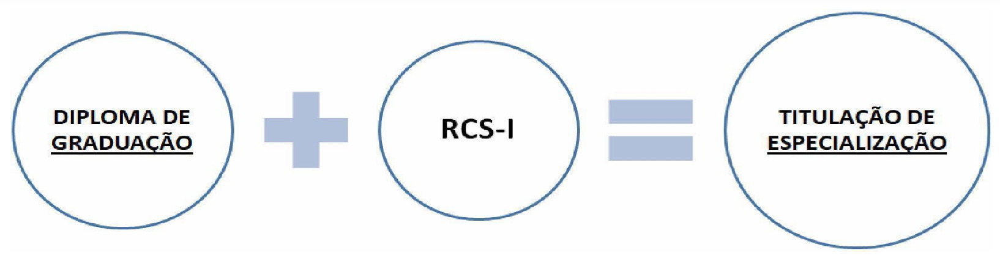
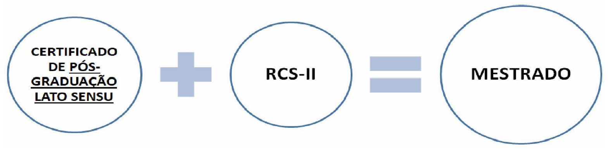
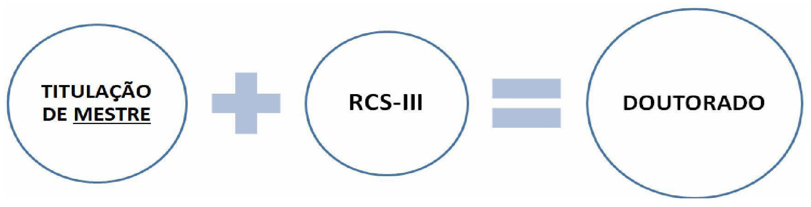
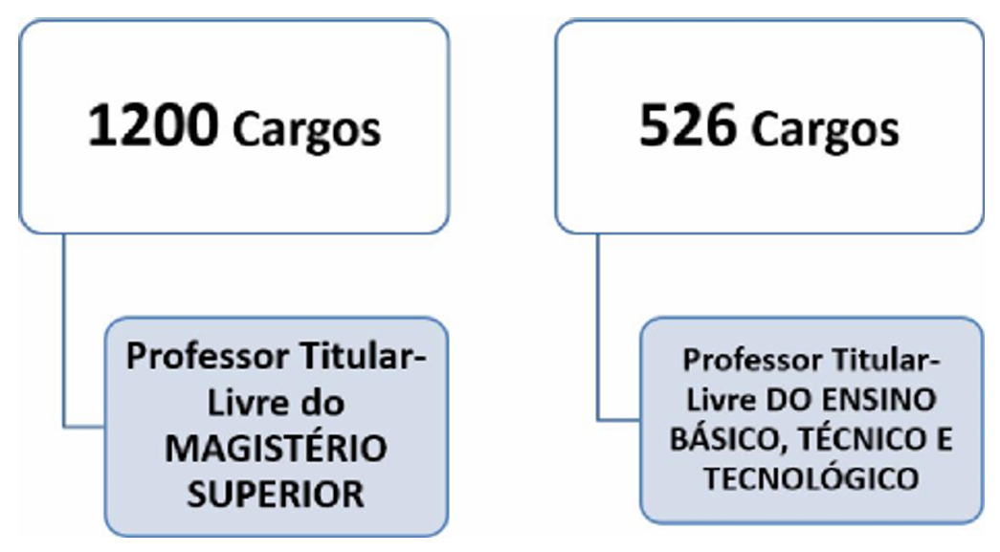

# Capítulo 2 – Lei nº 12.772/2012: Plano de Carreiras e Cargos de Magistério Federal

## O Plano de Carreiras e Cargos de Magistério Federal: Noções Introdutórias

A Lei Federal nº 12.772, de 28 de dezembro de 2012, com as alterações promovidas pela Medida Provisória nº 1.286/2024, é o diploma legal que dispõe sobre a estruturação do **Plano de Carreiras e Cargos de Magistério Federal**. Esta norma representa o estatuto específico que rege a vida funcional dos docentes das Instituições Federais de Ensino (IFE), estabelecendo os pilares para o ingresso, o desenvolvimento profissional e a remuneração desta importante categoria de servidores públicos.

Regra geral, um Plano de Carreiras e Cargos é o instrumento administrativo inerente à gestão de pessoas, que contempla um conjunto de normas, conceitos essenciais, a estrutura da carreira e dos cargos, e a tabela de remuneração de uma determinada categoria. É um mecanismo que busca valorizar o servidor, oferecendo-lhe um caminho claro, unificado e previsível de crescimento profissional, pautado em critérios de mérito, tempo de serviço e qualificação contínua, com um percurso total de 19 anos para se atingir o topo da carreira.

É exatamente a estrutura deste plano, à luz do que regula a norma em estudo, que conheceremos a partir de agora, começando pela composição e pelas atividades da carreira do Magistério Federal.

## A Estrutura da Carreira de Magistério Federal

De acordo com o art. 1º da Lei nº 12.772/2012, o Plano de Carreiras e Cargos de Magistério Federal é composto por duas carreiras distintas e por cargos isolados de altíssimo nível, conforme ilustra o esquema abaixo:

### Atividades do Magistério Federal: O Tripé Ensino, Pesquisa e Extensão

As atividades desempenhadas pelos ocupantes dos cargos deste plano formam o alicerce da atuação das instituições federais de ensino. Elas são centradas no indissociável tripé acadêmico: **ensino, pesquisa e extensão**.

- **Ensino:** Compreende as atividades diretamente ligadas à formação de estudantes, como ministrar aulas na graduação e na pós-graduação, preparar material didático, orientar trabalhos de conclusão de curso, dissertações e teses, e participar de bancas examinadoras.
- **Pesquisa:** Refere-se à produção de conhecimento científico, tecnológico e cultural, por meio do desenvolvimento de projetos de investigação, da publicação de artigos em periódicos especializados, da apresentação de trabalhos em congressos e da orientação de alunos de iniciação científica.
- **Extensão:** Consiste nas ações que promovem a interação e a troca de saberes entre a instituição de ensino e a sociedade em geral, como a oferta de cursos abertos à comunidade, a prestação de serviços especializados, a organização de eventos culturais e o desenvolvimento de projetos com impacto social.

Além deste núcleo acadêmico, são também atividades das Carreiras e Cargos do Magistério Federal aquelas inerentes ao exercício de **direção, assessoramento, chefia, coordenação e assistência** na própria instituição.

### A Carreira de Magistério Superior (MS)

A Carreira de Magistério Superior destina-se a profissionais habilitados para o exercício de atividades acadêmicas no âmbito da **educação superior**, ou seja, nas Universidades Federais e nos Centros Federais de Educação Tecnológica (CEFETs). A carreira é dividida por Classes, com denominações que correspondem à titulação e ao nível de maturidade acadêmica do docente. Com a reestruturação a carreira passou a ter 4 classes e um total de 10 níveis.

A estrutura do Cargo de Professor de Magistério Superior é a seguinte:

| Classe | Denominação | Nível |
| ------ | ----------- | ----- |
| D      | Titular     | 1     |
| C      | Associado   | 4     |
| C      | Associado   | 3     |
| C      | Associado   | 2     |
| C      | Associado   | 1     |
| B      | Adjunto     | 4     |
| B      | Adjunto     | 3     |
| B      | Adjunto     | 2     |
| B      | Adjunto     | 1     |
| A      | Assistente  | 1     |

- **Ingresso na Carreira:** O ingresso ocorre sempre no **nível único da classe inicial (Classe A - Assistente)**, por meio de concurso público de provas e títulos, **independentemente da titulação** que o candidato possua (graduação, mestrado ou doutorado).
- **Desenvolvimento na Carreira:** A ascensão do professor é um processo contínuo de progressão e promoção, com um percurso total de **19 anos**.
    - **Progressão:** É a passagem de um nível para outro dentro da mesma classe (ex: de Adjunto 1 para Adjunto 2 na Classe B).
    - **Promoção:** É a passagem de uma classe para a classe imediatamente superior (ex: da Classe A para a Classe B).
    - **Interstícios:** O tempo mínimo em cada nível para o desenvolvimento na carreira foi unificado. A primeira promoção, da Classe A para a Classe B, ocorrerá após um interstício de **3 anos**, período que coincide com o estágio probatório. As demais progressões e promoções ocorrerão a cada **2 anos** de efetivo exercício, condicionadas à avaliação de desempenho.
    - **Fim da Aceleração da Promoção:** Para os docentes que ingressarem a partir de 1º de janeiro de 2025, foi **extinta a possibilidade de aceleração da promoção**. A progressão na carreira seguirá os interstícios fixos, independentemente da obtenção de novos títulos de mestre ou doutor após o ingresso.

### A Carreira de Magistério do Ensino Básico, Técnico e Tecnológico (EBTT)

A Carreira de Magistério do EBTT é destinada aos profissionais habilitados para o exercício de atividades acadêmicas no âmbito da **educação básica** e da **educação profissional e tecnológica**. Estes docentes compõem o quadro de instituições como os **Institutos Federais de Educação, Ciência e Tecnologia (IFs)**, os **Centros Federais de Educação Tecnológica (CEFETs)**, o **Colégio Pedro II**, as **Escolas Técnicas Vinculadas às Universidades Federais** e os **Colégios de Aplicação**.

Com a reestruturação, a carreira EBTT teve a Classe D I extinta e as demais classes foram renomeadas, passando a ter a seguinte estrutura:

|Classe|Nível|
|---|---|
|Titular|1|
|C|4|
|C|3|
|C|2|
|C|1|
|B|4|
|B|3|
|B|2|
|B|1|
|A|1|

**Ingresso e Desenvolvimento na Carreira:** As regras de ingresso e desenvolvimento na carreira EBTT foram unificadas com as da Carreira de Magistério Superior.

- O ingresso se dá sempre na **Classe A, Nível 1**, por meio de concurso público, com a exigência mínima de graduação.
- O percurso total na carreira é de **19 anos**, com o primeiro interstício para promoção (da Classe A para a B) de **3 anos** e os demais de **2 anos**.
- A **aceleração da promoção também foi extinta** para novos ingressantes.
- Foi mantida a exigência de **título de Doutor** para a promoção à Classe de Titular, bem como a necessidade de defesa de memorial ou tese inédita.

### Os Cargos Isolados de Professor Titular-Livre

Além das duas carreiras estruturadas em classes e níveis, o Plano de Carreiras e Cargos de Magistério Federal contempla uma categoria especial de cargos: os **Cargos Isolados de provimento efetivo**. Como o próprio nome sugere, estes cargos existem de forma autônoma, **fora da escada de progressão** das carreiras de Magistério Superior e de EBTT.

São posições de elite, de classe e nível únicos, criadas com o objetivo estratégico de atrair e incorporar às Instituições Federais de Ensino (IFE) docentes e pesquisadores de altíssima qualificação, com reconhecida produção intelectual e notório saber em suas áreas de atuação. O ingresso nestes cargos não se dá pelos concursos convencionais de início de carreira, mas por meio de um **concurso público de provas e títulos específico e de elevadíssimo rigor**, destinado a profissionais já consagrados em suas áreas.

Estes cargos são estruturados em uma única classe e nível de vencimento, da seguinte forma:

**Cargo Isolado de Professor Titular-Livre do Magistério Superior**

|Cargo|Nível|
|---|---|
|Professor Titular-Livre do Magistério Superior|Único|

**Cargo Isolado do Ensino Básico, Técnico e Tecnológico**

|Cargo|Nível|
|---|---|
|Professor Titular-Livre do Ensino Básico, Técnico e Tecnológico|Único|

Os ocupantes destes cargos, assim como os demais docentes federais, integram os Quadros de Pessoal das Instituições Federais de Ensino (IFE) subordinadas ou vinculadas ao **Ministério da Educação** (como as Universidades Federais) e ao **Ministério da Defesa** (como o Instituto Militar de Engenharia - IME e o Instituto Tecnológico de Aeronáutica - ITA). A lei ressalva apenas situações específicas de cargos que integram o quadro de pessoal do Ministério do Planejamento, Orçamento e Gestão (atualmente, Ministério da Gestão e da Inovação em Serviços Públicos).

O objetivo principal destes cargos é contribuir para o desenvolvimento e fortalecimento de competências e para o alcance da excelência no ensino e na pesquisa nas IFE.

> **Ponto de Atenção: O Regime Jurídico Aplicável**
> 
> É de fundamental importância notar que, embora o Plano de Carreiras seja regido por esta lei específica (Lei nº 12.772/2012), o **regime jurídico** que governa a relação desses professores com a União é o da **Lei nº 8.112, de 1990**.
> 
> Isso significa que todas as regras sobre provimento, vacância, direitos, deveres, regime disciplinar e seguridade social que estudamos no Capítulo 1 aplicam-se integralmente aos docentes do Magistério Federal, sendo a Lei nº 12.772/2012 uma norma especial que detalha apenas os aspectos da carreira e da remuneração.

Entendido como a Carreira e os Cargos de Magistério Federal estão estruturados, é hora de saber como se dá o ingresso nesses cargos. É o que veremos a seguir.

## O Ingresso nas Carreiras e Cargos Isolados

O ingresso nos cargos do Plano de Carreiras e Cargos de Magistério Federal se dá, invariavelmente, por meio de **concurso público de provas e títulos**, em pleno acordo com o art. 37, II, da Constituição Federal. As regras específicas para o ingresso, contudo, foram significativamente alteradas pela reestruturação da carreira, que unificou o ponto de entrada e o percurso de desenvolvimento profissional.

### Ingresso na Carreira de Magistério Superior (MS)

Conforme a nova estrutura, o ingresso na Carreira de Magistério Superior ocorrerá sempre no **primeiro e único nível de vencimento da classe inicial da carreira (Classe A)**, mediante aprovação em concurso público de provas e títulos.

Uma das mudanças mais significativas da reestruturação é que o ponto de entrada na carreira foi unificado. Anteriormente, a titulação do candidato (mestrado ou doutorado) determinava uma classe de ingresso mais elevada. A partir de 1º de janeiro de 2025, essa diferenciação no ingresso foi extinta. O ingresso se dará sempre na classe inicial, **independentemente da titulação** que o candidato possua no momento da posse.

A titulação acadêmica (graduação, especialização, mestrado ou doutorado) passa a ser um **requisito de habilitação** para o concurso, definido no edital, e não mais um fator de posicionamento inicial na carreira. A lei mantém a possibilidade de a Instituição Federal de Ensino (IFE), em decisão fundamentada de seu Conselho Superior, dispensar a exigência de título de Doutor e substituí-la pela de Mestre, Especialista ou Graduado, especialmente em áreas com carência de profissionais.

- **Exemplo:** Em um concurso para a área de Engenharia de Software, o edital exige o título de Doutor. Em outro concurso para a área de Design Gráfico, o edital exige o título de Mestre. Sob as novas regras, os candidatos aprovados em ambos os certames, ao serem nomeados, ingressarão na mesma **Classe A, Nível 1**. A maior titulação do primeiro candidato será valorizada na forma de Retribuição por Titulação e em sua progressão futura, mas não alterará seu ponto de partida na carreira.

O concurso público poderá ser organizado em diversas etapas, como prova escrita, prova didática, prova prática e defesa de memorial, conforme dispuser o edital de abertura do certame, que também estabelecerá os critérios eliminatórios e classificatórios.

##### Ingresso no Cargo Isolado de Professor Titular-Livre do Magistério Superior

O ingresso no Cargo Isolado de Professor Titular-Livre do Magistério Superior, por sua natureza de elite acadêmica, mantém requisitos e um rito de seleção ainda mais rigorosos. O ingresso se dá na classe e nível únicos do cargo, mediante aprovação em concurso público de provas e títulos que exige, cumulativamente:

- **Título de Doutor;** e
- Comprovação de, no mínimo, **10 anos de experiência** ou de **obtenção do título de Doutor**, ambos na área de conhecimento exigida no concurso.

O concurso para este cargo é um processo de alta complexidade, consistindo, no mínimo, nas seguintes etapas:

- **Prova escrita,** de caráter eliminatório;
- **Prova oral ou defesa de tese,** de caráter eliminatório; e
- **Defesa de memorial,** de caráter classificatório, na qual o candidato apresenta e defende sua trajetória acadêmica, científica e profissional.

Uma garantia adicional de isenção e rigor neste certame é a composição de sua comissão examinadora. A lei determina que a comissão especial para o concurso de Titular-Livre será composta por, no mínimo, **75% de profissionais externos à Instituição Federal de Ensino** que está realizando o concurso, assegurando uma avaliação com ampla pluralidade de perspectivas e isenta de influências internas.

### Ingresso na Carreira de Magistério do Ensino Básico, Técnico e Tecnológico (EBTT)

Conforme o art. 10 da Lei nº 12.772/2012, o ingresso nos cargos de provimento efetivo de Professor do Ensino Básico, Técnico e Tecnológico ocorrerá sempre no **primeiro nível da classe inicial da carreira (Classe A)**, mediante aprovação em concurso público, que poderá ser de provas ou de provas e títulos.

A exigência mínima de formação para concorrer a uma vaga na carreira EBTT é o **diploma de curso superior em nível de graduação**, em área de conhecimento compatível com a definida no edital do certame.

Com a reestruturação da carreira, vigente a partir de 1º de janeiro de 2025, o ponto de entrada foi unificado. Assim, um candidato que concorre a um cargo desta Carreira, ao ser aprovado no concurso, será nomeado para **Professor de Ensino Básico, Técnico e Tecnológico, Classe A, Nível 1**, independentemente de sua titulação no momento da posse (seja ele graduado, especialista, mestre ou doutor). O desenvolvimento na carreira, com a ascensão pelos níveis e classes até o topo (Classe Titular), ocorrerá por meio dos mecanismos de progressão e promoção, conforme será detalhado adiante.

O concurso público poderá ser organizado em diversas etapas, e o edital de abertura estabelecerá as características de cada uma, bem como os critérios eliminatórios e classificatórios do certame.

#### Ingresso no Cargo Isolado de Professor Titular-Livre do EBTT

De forma análoga à Carreira de Magistério Superior, a lei também prevê o Cargo Isolado de Professor Titular-Livre do Ensino Básico, Técnico e Tecnológico. O ingresso nesta posição de elite ocorrerá na classe e nível únicos, mediante aprovação em concurso público de provas e títulos de altíssimo rigor, no qual serão exigidos:

- **Título de doutor;** e
- Comprovação de, no mínimo, **10 anos de experiência** ou de **obtenção do título de doutor**, ambos na área de conhecimento exigida no concurso.

O concurso público para este cargo será organizado em etapas, conforme dispuser o edital, e consistirá, no mínimo, em:

- **Prova escrita;**
- **Prova oral;** e
- **Defesa de memorial.**

A comissão examinadora para o concurso de Titular-Livre do EBTT segue a mesma regra de rigor e isenção aplicada ao Magistério Superior: será uma comissão especial composta por, no mínimo, **75% de profissionais externos à Instituição Federal de Ensino** promotora do concurso.

Uma vez compreendida a estrutura das carreiras e as regras de ingresso, o próximo passo é analisar os mecanismos de desenvolvimento profissional. O tópico a seguir detalhará as formas de progressão e promoção na Carreira de Magistério Federal.

## O Desenvolvimento na arreira de Magistério Federal 

Uma vez dentro da carreira, o desenvolvimento profissional do docente é um processo contínuo, estruturado por meio de dois institutos fundamentais: a **progressão funcional** e a **promoção**. A compreensão da diferença entre estes dois mecanismos é essencial para entender a trajetória do servidor na carreira.

### Desenvolvimento na Carreira de Magistério Superior (MS)

Conforme o § 1º do art. 12 da Lei nº 12.772/2012, a distinção é a seguinte:

- A **progressão** é a passagem do servidor para o nível de vencimento imediatamente superior **dentro de uma mesma classe**.
    - **Exemplo:** Um professor que se encontra na Classe B (Adjunto), Nível 1, ao cumprir os requisitos, avança para a Classe B (Adjunto), Nível 2. Ele progride dentro da mesma classe.
- A **promoção** é a passagem do servidor do último nível de uma classe para o primeiro nível da **classe subsequente**.
    - **Exemplo:** Um professor que está na Classe B (Adjunto), Nível 4, ao cumprir os requisitos, avança para a Classe C (Associado), Nível 1. Ele é promovido para uma nova classe.

#### Requisitos para Progressão e Promoção

Com a reestruturação da carreira, vigente para os ingressantes a partir de 1º de janeiro de 2025, as regras para o desenvolvimento foram unificadas, criando um percurso total de **19 anos** até o topo da carreira, independentemente da titulação de ingresso.

A **progressão** na Carreira de Magistério Superior ocorrerá com base nos critérios gerais estabelecidos na lei e observará, cumulativamente:
- **O cumprimento do interstício** de efetivo exercício em cada nível; e
- **Aprovação em avaliação de desempenho.**

Os interstícios (períodos mínimos em cada nível/classe) foram redefinidos:

- A primeira promoção, da Classe A (nível único) para a Classe B, Nível 1, ocorrerá após um interstício de **3 (três) anos**, período que coincide com o estágio probatório do servidor.
- As demais progressões e promoções ocorrerão a cada **24 meses (2 anos)** de efetivo exercício, sempre condicionadas à aprovação em avaliação de desempenho.

A **promoção** entre as classes ocorrerá observando o interstício mínimo de 24 meses no último nível da classe antecedente e, adicionalmente, as seguintes condições:

|Promoção para a Classe|Requisitos Adicionais|
|---|---|
|**Classe B (Adjunto)**|Cumprir o interstício de 3 anos na Classe A e ser aprovado em avaliação de desempenho.|
|**Classe C (Associado)**|Cumprir o interstício de 2 anos no último nível da Classe B (Adjunto 4), ser aprovado em avaliação de desempenho e **possuir o título de Doutor**.|
|**Classe D (Titular)**|Cumprir o interstício de 2 anos no último nível da Classe C (Associado 4) e ser aprovado em um processo especial de avaliação que inclui: a) Possuir o título de Doutor; b) Aprovação em avaliação de desempenho; e c) Lograr aprovação de **memorial** (que considera as atividades de ensino, pesquisa, extensão e gestão) ou **defesa de tese acadêmica inédita**.|

A promoção para a Classe D (Professor Titular) representa o ápice da carreira e, por sua importância, o processo de avaliação será realizado por uma **comissão especial composta por, no mínimo, 75% de profissionais externos à IFE**, garantindo o máximo de rigor e imparcialidade.

> **Ponto de Atenção: Regra de Transição para Docentes em Exercício**
> 
> Para os servidores da carreira de Magistério Superior que, em 31 de dezembro de 2024, já se encontravam posicionados nas antigas classes A (Auxiliar e Assistente) e B (Adjunto) e que já haviam sido aprovados no estágio probatório, a lei estabelece uma regra de transição: considera-se cumprido o interstício para a promoção para a classe de Professor Adjunto (a nova Classe B) em 1º de janeiro de 2025, facilitando seu reenquadramento na nova estrutura.

### Desenvolvimento na Carreira de Magistério do Ensino Básico, Técnico e Tecnológico (EBTT)

De forma análoga à Carreira de Magistério Superior, e em especial após a unificação promovida pela reestruturação de 2025, o desenvolvimento na Carreira de Magistério do Ensino Básico, Técnico e Tecnológico (EBTT) também ocorrerá mediante **progressão funcional** e **promoção**.

- A **progressão** é a passagem do servidor para o nível de vencimento imediatamente superior **dentro de uma mesma classe** (ex: da Classe B, Nível 2 para a Classe B, Nível 3).
- A **promoção** é a passagem do servidor do último nível de uma classe para o primeiro nível da **classe subsequente** (ex: da Classe B, Nível 4 para a Classe C, Nível 1).

#### Requisitos Unificados para o Desenvolvimento

A progressão e a promoção na Carreira de EBTT, para os ingressantes a partir de 1º de janeiro de 2025, seguirão as mesmas regras e o mesmo percurso de 19 anos da Carreira de Magistério Superior, observando cumulativamente:

- **O cumprimento do interstício** de efetivo exercício em cada nível; e
- **Aprovação em avaliação de desempenho individual.**

Os interstícios para o desenvolvimento na carreira são:

- A primeira promoção, da Classe A (nível único) para a Classe B, Nível 1, ocorrerá após um interstício de **3 (três) anos**, período que coincide com o estágio probatório do servidor.
- As demais progressões e promoções ocorrerão a cada **24 meses (2 anos)** de efetivo exercício, sempre condicionadas à aprovação em avaliação de desempenho.

A reestruturação também **extinguiu a possibilidade de aceleração da promoção** para os novos docentes, tornando o percurso na carreira padronizado.

#### Promoção à Classe Titular

A promoção para a **Classe Titular**, o ápice da carreira EBTT, mantém seus requisitos especiais e rigorosos, exigindo do docente:

a) Possuir o título de Doutor;
b) Ser aprovado em processo de avaliação de desempenho; e
c) Lograr aprovação de memorial (que deverá considerar as atividades de ensino, pesquisa, extensão e gestão) ou defesa de tese acadêmica inédita.

Assim como na carreira superior, o processo de avaliação para acesso à Classe Titular será realizado por uma **comissão especial composta por, no mínimo, 75% de profissionais externos à IFE**.

### O Efeito Financeiro do Desenvolvimento na Carreira

Um ponto importante, aplicável a ambas as carreiras (MS e EBTT), é que o **efeito financeiro** da progressão e da promoção é **retroativo à data em que o docente cumpriu todos os requisitos** para o desenvolvimento.

Isso significa que, mesmo que a portaria que formaliza a progressão ou promoção seja publicada meses depois da data em que o servidor completou o interstício e cumpriu as demais exigências, o pagamento da nova remuneração será devido desde a data original do cumprimento dos requisitos.

## A Estrutura Remunatória do Plano de Carreiras

A remuneração dos docentes do Magistério Federal é estruturada de forma a valorizar tanto a posição do servidor na carreira (sua classe e nível) quanto, e de forma muito significativa, sua qualificação acadêmica.

De acordo com o art. 16 da Lei nº 12.772/2012, a estrutura remuneratória possui a seguinte composição:

1. **Vencimento Básico (VB):** A parcela fixa da remuneração, correspondente à classe e ao nível em que o docente se encontra posicionado na carreira. Seus valores são definidos em tabelas publicadas em lei e são atualizados periodicamente.
2. **Retribuição por Titulação (RT):** Uma vantagem pecuniária, calculada como um percentual sobre o Vencimento Básico, concedida de acordo com a mais alta titulação acadêmica que o docente possui (Aperfeiçoamento/Especialização, Mestrado ou Doutorado).

A composição da remuneração pode ser visualizada da seguinte forma:

### A Retribuição por Titulação (RT)

A Retribuição por Titulação é o principal incentivo financeiro para a qualificação contínua do docente. Seu valor é significativamente maior para os títulos de Mestre e, principalmente, de Doutor.

Algumas regras importantes sobre a RT são:

- **Incorporação na Aposentadoria:** A RT é considerada no cálculo dos proventos de aposentadoria e das pensões, desde que o título tenha sido obtido antes da data da inativação.
- **Não Acumulação:** O docente recebe a RT correspondente à sua mais alta titulação. Os valores **não são cumulativos**.
    - **Exemplo:** Um professor com Mestrado recebe a RT correspondente a este título. Ao concluir o Doutorado, ele passará a receber a RT de Doutor (que é maior), e o pagamento da RT de Mestre cessará.

### O Reconhecimento de Saberes e Competências (RSC) na Carreira EBTT

Exclusivamente para os ocupantes de cargos da Carreira de **Magistério do Ensino Básico, Técnico e Tecnológico (EBTT)**, a lei criou um mecanismo inovador para valorizar os conhecimentos e a experiência profissional que não necessariamente se traduzem em títulos acadêmicos formais: o **Reconhecimento de Saberes e Competências (RSC)**.

O RSC é um processo pelo qual a trajetória profissional, as experiências, as produções técnicas e os conhecimentos do professor EBTT podem ser formalmente reconhecidos e equiparados, **para fins de remuneração**, a uma titulação acadêmica.

O RSC é concedido em três níveis, com as seguintes equivalências para fins de percepção da Retribuição por Titulação (RT):

A concessão do RSC é regulamentada por um **Conselho Permanente para Reconhecimento de Saberes e Competências**, vinculado ao Ministério da Educação.

> **PONTO FUNDAMENTAL: O RSC é para fins de Remuneração, NÃO para Promoção**
> 
> Este é um dos pontos mais importantes e cobrados em concursos sobre a carreira EBTT. O Reconhecimento de Saberes e Competências (RSC) gera uma equivalência com a titulação acadêmica **exclusivamente para fins de percepção da Retribuição por Titulação (RT)**.
> 
> Em nenhuma hipótese o RSC pode ser utilizado para cumprir os requisitos de titulação exigidos para a **promoção** na carreira.
> 
> - **Exemplo:** Um professor EBTT obtém o RSC-III, que equivale ao Doutorado para fins financeiros. Ele passará a receber a mesma RT que um colega com título de Doutor. Contudo, para ser promovido à Classe Titular, que exige o título de Doutor, este professor **precisará obter o diploma de Doutorado** em um programa de pós-graduação. O RSC-III, neste caso, não substitui o diploma para fins de promoção funcional.

## Os Regimes de Trabalho

O art. 20 da Lei nº 12.772/2012 estabelece que o Professor do Plano de Carreiras e Cargos de Magistério Federal será submetido a um dos seguintes regimes de trabalho, conforme previsto no edital de seu concurso:

1. **40 (quarenta) horas semanais**, em tempo integral, com **dedicação exclusiva** às atividades de ensino, pesquisa, extensão e gestão institucional; ou
2. **Tempo parcial de 20 (vinte) horas semanais** de trabalho.

A grande maioria dos cargos, especialmente nas Universidades Federais, é provida sob o regime de 40 horas semanais com Dedicação Exclusiva (DE). Este regime, por suas particularidades, merece uma análise aprofundada.

### O Regime de Dedicação Exclusiva (DE) e suas Exceções

O regime de **Dedicação Exclusiva (DE)** implica o compromisso do docente de dedicar todo o seu tempo e capacidade de trabalho à Instituição Federal de Ensino a que pertence. A regra geral é o **impedimento do exercício de qualquer outra atividade remunerada**, seja ela pública ou privada.

Contudo, a própria lei, em seu art. 21, reconhecendo a natureza da atividade acadêmica e sua interface com a sociedade, estabelece um rol de exceções a essa regra. Um docente em regime de DE **pode perceber remuneração** por outras atividades, desde que se enquadrem nas seguintes hipóteses:

#### Atividades de Gestão e Avaliação Acadêmica

- Remuneração de **cargos de direção ou funções de confiança** (ex: um professor que assume o cargo de Reitor ou a função de Chefe de Departamento).
- Retribuição por participação em **comissões julgadoras ou verificadoras** (ex: participar de uma banca de concurso público ou de defesa de tese em outra instituição).
- **Gratificação por Encargo de Curso ou Concurso (GECC)**, nos termos da Lei nº 8.112/1990.
- **Função Comissionada de Coordenação de Curso (FCC)**, que é a retribuição específica para o docente que coordena um curso de graduação.

#### Bolsas de Fomento ao Ensino, Pesquisa e Extensão

- Bolsas pagas por **agências oficiais de fomento** (como CNPq e CAPES), fundações de apoio ou organismos internacionais (ex: bolsa de produtividade em pesquisa).
- Bolsas para o desempenho de atividades de **formação de professores da educação básica**, como as do programa Universidade Aberta do Brasil (UAB).
- Bolsas para a **qualificação docente** do próprio professor (ex: uma bolsa para cursar o doutorado).
- Outras bolsas de ensino, pesquisa e extensão pagas pela própria IFE.

#### Propriedade Intelectual e Colaboração Externa Esporádica

- **Direitos autorais e de propriedade intelectual** (ex: receber royalties pela publicação de um livro didático).
- Participação **esporádica** em palestras, conferências, atividades artísticas e culturais, com remuneração paga por outra entidade. A lei considera "esporádica" a participação que não exceder o total de **30 horas anuais**.
- Retribuição pecuniária, em caráter **eventual**, por trabalho em projetos institucionais de ensino, pesquisa e extensão, via fundações de apoio (Lei nº 8.958/1994).
- Colaboração **esporádica** de natureza científica ou tecnológica em assuntos de sua especialidade, devidamente autorizada pela IFE.

> **Ponto de Atenção: Limites de Horas para Colaboração Externa**
> 
> As duas últimas atividades (projetos via fundação de apoio e colaboração científica esporádica) possuem um limite de carga horária. Computadas de forma isolada ou em conjunto, elas não podem exceder **8 horas semanais** ou **416 horas anuais**.

As condições específicas para o exercício dessas atividades e os limites de valores, quando não definidos em lei, são estabelecidos em normas próprias de cada Instituição Federal de Ensino, em respeito à sua autonomia.

### A Atuação em Fundações de Apoio

As **Fundações de Apoio** são entidades de direito privado, sem fins lucrativos, criadas com o propósito de dar suporte a projetos de pesquisa, ensino, extensão e desenvolvimento institucional das IFE, conferindo maior agilidade administrativa e financeira a essas atividades.

A lei permite que o docente, inclusive aquele em regime de Dedicação Exclusiva, participe da gestão dessas fundações, desde que não esteja ocupando um cargo em comissão ou função de confiança na IFE. A participação pode se dar em dois níveis:

1. **Como membro dos órgãos de Direção:** O docente pode participar dos conselhos deliberativos ou fiscais da fundação. Esta participação é considerada parte de sua atividade institucional e, por essa razão, é **vedada a percepção de remuneração** paga pela fundação de apoio.
2. **Como Dirigente Máximo:** Excepcionalmente, o docente pode ocupar o cargo de dirigente máximo (presidente, diretor-superintendente, etc.) da fundação, mediante aprovação do Conselho Superior da IFE. Por se tratar de uma função executiva de alta responsabilidade, a lei permite a **remuneração** pela fundação, desde que observadas certas condições, como o limite de 70% do teto remuneratório do Poder Executivo federal para o servidor estatutário.

### O Regime de 40 Horas Semanais sem Dedicação Exclusiva

Além dos regimes padrão de 20h e 40h com DE, a lei prevê, em caráter **excepcional**, a possibilidade de a IFE adotar o regime de **40 horas semanais em tempo integral, sem dedicação exclusiva**. Este regime, que exige o cumprimento de dois turnos diários completos, deve ser aprovado pelo órgão colegiado superior e destina-se a áreas com características específicas, onde a interface com o mercado de trabalho ou a prática profissional externa é relevante para a atividade docente.

Adicionalmente, um docente contratado para o regime de **20 horas** pode ser, **temporariamente**, vinculado ao regime de 40 horas (sem DE), nas seguintes hipóteses:

- Ocupação de cargo de direção, função gratificada ou função de coordenação de cursos; ou
- Participação em outras ações de relevante interesse institucional.

Essa alteração temporária depende da verificação de que não há acúmulo ilegal de cargos e da existência de dotação orçamentária.

### O Processo de Alteração do Regime de Trabalho

O Professor do Magistério Federal pode, a qualquer tempo, solicitar a alteração de seu regime de trabalho (ex: de 20h para 40h com DE). O processo, conforme o art. 22, segue um rito formal:

1. O docente formaliza a proposta e a submete à sua **unidade de lotação** (Departamento ou Instituto).
2. Com a aprovação na unidade, a solicitação é encaminhada à **Comissão Permanente de Pessoal Docente (CPPD)** para análise e emissão de parecer. A CPPD é um órgão de assessoramento composto por docentes, responsável por analisar todos os processos da carreira.
3. O parecer da CPPD subsidia a **decisão final** da autoridade ou do Conselho Superior competente.

> **Ponto de Atenção: O "Pedágio" para Alteração de Regime**
> 
> A lei estabelece uma condição para a solicitação de mudança de regime. O docente que tiver se beneficiado de um afastamento para qualificação (como mestrado ou doutorado) sem prejuízo de vencimentos, só poderá solicitar a alteração de seu regime de trabalho **após o decurso de um período igual ao do afastamento**.
> 
> - **Exemplo:** Uma professora foi afastada por 24 meses para cursar seu doutorado. Ao retornar, ela deverá permanecer em seu regime de trabalho original por, no mínimo, mais 24 meses antes de poder solicitar uma alteração, como a passagem de 20h para 40h com DE. É uma forma de garantir o retorno do investimento que a instituição fez em sua qualificação.

Com certeza. Dando continuidade ao Capítulo 2, apresento o desenvolvimento do tópico sobre o **Estágio Probatório** na carreira do Magistério Federal, com os devidos aprofundamentos e a estrutura solicitada.

---

## O Estágio Probatório no Magistério Federal

O estágio probatório, como vimos no Capítulo 1, é o período de 36 (trinta e seis) meses de efetivo exercício durante o qual o servidor recém-ingressado tem sua aptidão e capacidade avaliadas para o desempenho do cargo. Para os docentes do Magistério Federal, a Lei nº 12.772/2012 estabelece um rito e critérios de avaliação específicos, que complementam as regras gerais da Lei nº 8.112/1990. De acordo com o art. 20 da Lei nº 8.112/90:

> Art. 20. Ao entrar em exercício, o servidor nomeado para cargo de provimento efetivo ficará sujeito a estágio probatório por período de 36 (trinta e seis) meses, durante o qual a sua aptidão e capacidade serão objeto de avaliação para o desempenho do cargo, observados os seguintes fatores:
> 
> I - assiduidade;
> II - disciplina;
> III - capacidade de iniciativa;
> IV - produtividade;
> V- responsabilidade.

A avaliação do docente em estágio probatório não se limita apenas aos fatores gerais de assiduidade, disciplina, capacidade de iniciativa, produtividade e responsabilidade. Ela é muito mais aprofundada, abrangendo a essência da atividade acadêmica.

### A Comissão e os Critérios da Avaliação Especial de Desempenho

Conforme o art. 23, a avaliação especial de desempenho do docente será realizada por uma **Comissão de Avaliação de Desempenho** designada no âmbito de cada IFE. A composição desta comissão visa garantir uma análise técnica e contextualizada, devendo ser formada por **docentes estáveis**, com representantes da unidade acadêmica de exercício do professor avaliado e do Colegiado do Curso no qual ele ministra a maior parte de suas aulas.

Além dos cinco fatores gerais da Lei nº 8.112/1990, a avaliação do docente em estágio probatório deverá, obrigatoriamente, considerar os seguintes aspectos específicos da atividade de magistério:

- **Adaptação ao trabalho:** Avaliação da capacidade e da qualidade no desempenho das atribuições do cargo, incluindo o **desempenho didático-pedagógico**.
- **Cumprimento de deveres e ética profissional:** Observância das obrigações do servidor público, com ênfase na conduta ética.
- **Análise de relatórios de atividades:** Verificação da produção acadêmica e administrativa do docente, conforme o plano de trabalho de sua unidade, abrangendo o tripé **ensino, pesquisa e extensão**.
- **Participação em Programa de Recepção de Docentes:** A participação no programa de integração e formação inicial instituído pela IFE.
- **Avaliação pelos discentes:** O feedback dos estudantes, coletado por meio de instrumentos próprios da IFE, é um componente formal da avaliação de desempenho do professor.

### As Garantias Processuais do Docente Avaliado

Para assegurar a lisura e a justiça do processo avaliativo, a lei estabelece garantias fundamentais ao docente em estágio probatório:

- **Transparência e Contraditório:** O professor avaliado tem o direito de conhecer previamente os instrumentos e os critérios de avaliação, bem como de ter acesso aos resultados de todos os relatórios emitidos pela Comissão, sendo-lhe assegurado o direito ao contraditório para se manifestar sobre eles.
- **Quórum para Deliberação:** As reuniões da Comissão de Avaliação de Desempenho só podem ocorrer com a presença da maioria simples de seus membros, garantindo a colegialidade das decisões.

Ao final dos 36 meses, se aprovado na avaliação, o docente adquire a estabilidade. Caso seja considerado inapto, aplicam-se as regras gerais da Lei nº 8.112/1990: se já era um servidor público federal estável, será **reconduzido** ao cargo anterior; caso contrário, será **exonerado**.

## A Comissão Permanente de Pessoal Docente (CPPD)

A **Comissão Permanente de Pessoal Docente (CPPD)**, prevista no art. 26 da Lei, é um órgão colegiado de caráter consultivo, fundamental para a gestão da carreira do Magistério Federal. Trata-se do principal órgão de assessoramento técnico da administração superior das Instituições Federais de Ensino (IFE) em todos os assuntos pertinentes à vida funcional de seus professores.

Sua composição reflete o princípio da gestão democrática e da avaliação por pares, sendo **eleita pelos próprios docentes** que integram o Plano de Carreiras e Cargos de Magistério Federal. Essa característica garante que a comissão seja formada por membros que conhecem profundamente a realidade acadêmica e as regras da carreira.

### As Atribuições da CPPD

A função primordial da CPPD é prestar **assessoramento** ao colegiado competente ou ao dirigente máximo da instituição (ex: Reitor, Conselho Universitário) para a formulação e o acompanhamento da execução da política de pessoal docente. Seus pareceres técnicos, embora não sejam decisórios, são peças obrigatórias na instrução da maioria dos processos que afetam a carreira dos professores.

As principais áreas de atuação da CPPD incluem a análise e emissão de parecer sobre:

- **Dimensionamento da alocação de vagas docentes:** Analisar a necessidade de novos professores nas diversas unidades acadêmicas, auxiliando no planejamento de concursos e na distribuição de vagas.
- **Contratação e admissão de professores:** Acompanhar os processos de contratação de professores efetivos e substitutos, zelando pela observância das normas legais.
- **Alteração do regime de trabalho docente:** Como vimos, toda solicitação de mudança de regime de trabalho (ex: de 20h para 40h com DE) deve, obrigatoriamente, passar pela análise da CPPD.
- **Avaliação do desempenho para fins de progressão e promoção funcional:** Supervisionar e emitir parecer sobre os processos de avaliação que resultam no desenvolvimento do docente na carreira.
- **Solicitação de afastamento para qualificação:** Analisar os pedidos de afastamento de docentes para cursar especialização, mestrado, doutorado ou pós-doutorado.
- **Liberação de professores para cooperação:** Emitir parecer sobre a liberação de docentes para participar de programas de cooperação com outras instituições, no Brasil ou no exterior.

As demais atribuições e a forma de funcionamento da CPPD são definidas em regulamento próprio de cada IFE, em respeito à sua autonomia.

> **Ponto de Atenção: A Exceção para o Ministério da Defesa**
> 
> Nas Instituições Federais de Ensino subordinadas ao **Ministério da Defesa** (como o Instituto Militar de Engenharia - IME e o Instituto Tecnológico de Aeronáutica - ITA), a instituição da CPPD é **opcional**, ficando a critério do dirigente máximo de cada instituição.

## A Composição do Corpo Docente

O corpo docente das Instituições Federais de Ensino (IFE) é composto por duas categorias de professores, que se distinguem fundamentalmente pela natureza de seu vínculo com a instituição: os docentes do quadro efetivo e os docentes temporários.

### O Quadro Efetivo

O núcleo do corpo docente é formado pelos servidores ocupantes de **cargos efetivos** do Plano de Carreiras e Cargos de Magistério Federal. São os professores que ingressaram por meio de concurso público de provas e títulos e que integram as carreiras de **Magistério Superior (MS)**, de **Magistério do Ensino Básico, Técnico e Tecnológico (EBTT)** ou os **Cargos Isolados de Professor Titular-Livre**, conforme detalhado no início deste capítulo.

Estes docentes formam o quadro permanente da instituição, sendo responsáveis pela condução das políticas de ensino, pesquisa e extensão a longo prazo. Seu regime jurídico, como já estabelecido, é o da **Lei nº 8.112/1990**.

### Os Professores Temporários

Além do quadro efetivo, as IFE podem contratar professores por tempo determinado para atender a necessidades temporárias e de excepcional interesse público. A contratação destes docentes não é regida pela Lei nº 8.112/1990, mas sim pela **Lei nº 8.745, de 1993**. O ingresso se dá por meio de processo seletivo simplificado, e não por concurso público para cargo efetivo.

Existem três categorias de professores temporários:

1. **Professor Substituto:** É a modalidade mais comum. O Professor Substituto é contratado para suprir a falta de um docente efetivo em decorrência de seus afastamentos e licenças legais (como licença para capacitação, licença maternidade, etc.). Sua função é garantir a continuidade das atividades de ensino.
2. **Professor Visitante:** É um docente ou pesquisador de elevado nível de competência, geralmente com título de Doutor, de outras instituições do Brasil, que é contratado por um período determinado para apoiar e enriquecer os programas de pós-graduação, a pesquisa e o ensino na IFE.
3. **Professor Visitante Estrangeiro:** Possui a mesma finalidade do Professor Visitante, mas destina-se a atrair para a IFE docentes e pesquisadores de instituições estrangeiras, promovendo o intercâmbio de conhecimento e a internacionalização da instituição.

#### Os Afastamentos Específicos do Magistério Federal

Além das licenças e afastamentos gerais previstos na Lei nº 8.112/1990, a Lei nº 12.772/2012 estabelece regras de afastamento específicas para a carreira do Magistério Federal. Essas regras visam atender às particularidades da vida acadêmica, incentivando a qualificação e a cooperação científica e técnica.

Para os afastamentos previstos nesta lei específica, a regra geral é que eles ocorrem **sem prejuízo dos direitos e vantagens** do cargo, ou seja, o docente continua a receber sua remuneração e o tempo é contado como de efetivo exercício.

### Afastamento para Pós-Graduação e Pós-Doutorado

Este é um dos pontos que mais diferencia a carreira docente das demais carreiras do serviço público federal. A lei permite que o docente se afaste para participar de programa de pós-graduação _stricto sensu_ (Mestrado e Doutorado) ou de pós-doutorado.

> **Ponto de Atenção: A Dispensa do Tempo Mínimo de Exercício**
> 
> A principal vantagem para a carreira do Magistério Federal é que o afastamento para cursar Mestrado e Doutorado pode ser concedido **independentemente do tempo de ocupação do cargo ou na instituição**.
> 
> Isso representa uma exceção direta à regra geral da Lei nº 8.112/1990 (art. 96-A), que exige um tempo mínimo de 3 anos de exercício para Mestrado e 4 anos para Doutorado para os demais servidores. Para os docentes, entende-se que a qualificação é de interesse imediato da instituição.
> 
> Contudo, é importante ressaltar que a regra do **"pedágio"** (dever de permanência no cargo por período igual ao do afastamento após o retorno) continua sendo aplicável, pois é uma norma geral não excepcionada por esta lei.

A concessão do afastamento, no entanto, não é automática. Ela depende do **interesse da Administração** e será regulamentada por cada IFE, que definirá seus próprios critérios para a participação de seus docentes em programas de qualificação.

### Afastamento para Colaboração Técnica

A lei também prevê o afastamento do docente para prestar colaboração a outras instituições, como forma de promover o intercâmbio de conhecimento e o desenvolvimento de projetos estratégicos para o país.

Este afastamento exige que o servidor já tenha sido **aprovado no estágio probatório** e que seja autorizado pelo dirigente máximo da IFE. A colaboração deve estar vinculada a um projeto ou convênio com prazos e objetivos definidos.

Existem duas modalidades:

1. **Colaboração a outra Instituição Federal de Ensino ou Pesquisa:** O docente pode ser "emprestado" a outra universidade, instituto federal ou centro de pesquisa para atuar em um projeto específico.
    - **Prazo:** Até 4 anos.
    - **Ônus:** Com ônus para a instituição de origem (a IFE de origem do docente continua pagando sua remuneração).
    - **Exemplo:** A Universidade Federal do Amazonas (UFAM) solicita a colaboração de um renomado pesquisador em biotecnologia da Universidade Federal de São Carlos (UFSCar) para auxiliar na criação de um novo programa de pós-graduação. O professor da UFSCar pode ser afastado por até 4 anos para colaborar com a UFAM, continuando a receber sua remuneração pela UFSCar.

2. **Colaboração Técnica ao Ministério da Educação (MEC):** O docente pode ser afastado para atuar diretamente no MEC, apoiando o desenvolvimento de programas e projetos de relevância nacional.
    - **Prazo:** Não superior a 1 ano.
    - **Ônus:** Com ônus para a instituição de origem.

## Disposições Finais

Para concluir o estudo da Lei nº 12.772/2012, é importante abordar algumas disposições gerais que, embora não tratem diretamente da estrutura da carreira, estabelecem direitos e informações relevantes para os docentes do Magistério Federal.

Os artigos 31 a 35 da lei tratam de regras de enquadramento e transição remuneratória para os servidores que já se encontravam na carreira antes da promulgação da norma. Por se tratarem de disposições cujos efeitos já se exauriram no tempo, não possuem relevância para os novos concursos.

Dessa forma, focaremos em duas disposições finais de grande importância: o direito a férias e a criação de cargos.

### O Direito a Férias de 45 Dias (Art. 36)

O art. 36 da lei estabelece um importante direito específico para a categoria, que representa uma exceção à regra geral do serviço público federal.

Aos servidores ocupantes de cargos efetivos pertencentes ao Plano de Carreiras e Cargos de Magistério Federal serão concedidos **45 (quarenta e cinco) dias de férias anuais**, que poderão ser gozadas de forma parcelada, de acordo com a conveniência e as normas da instituição.

> **Ponto de Atenção: Férias do Magistério vs. Demais Servidores**
> 
> Este é um diferencial significativo da carreira docente. Enquanto os servidores regidos exclusivamente pela Lei nº 8.112/1990 têm direito a 30 dias de férias anuais, os integrantes do Magistério Federal fazem jus a 45 dias.
> 
> A justificativa para este período estendido reside na natureza da atividade acadêmica, que envolve um intenso desgaste intelectual e cujos calendários são pautados por semestres letivos, sendo o período de férias, em geral, gozado durante o recesso acadêmico.

### A Criação de Cargos para a Expansão da Rede Federal (Arts. 39 e 40)

A Lei nº 12.772/2012, em seu contexto original, também atuou como um instrumento para a expansão da rede federal de educação. Seus artigos 39 e 40 criaram um número expressivo de novos cargos de Professor de Magistério Superior e de Professor Titular-Livre.

É crucial entender, contudo, que a criação de um cargo por lei não implica em sua imediata disponibilidade para concurso. O provimento desses cargos é um processo gradual e condicionado a dois fatores:

1. **Comprovação da disponibilidade orçamentária** para arcar com as novas despesas de pessoal.
2. **Autorização expressa** do Ministério da Gestão и da Inovação em Serviços Públicos (antigo Ministério do Planejamento) para a realização de concursos.

A lei, portanto, cria o "espaço" legal para a contratação, cuja efetivação dependerá da política orçamentária e de pessoal do governo vigente.

### Considerações Finais

Ao longo deste capítulo, nos debruçamos sobre a Lei nº 12.772/2012, a norma que estabelece o **Plano de Carreiras e Cargos de Magistério Federal**. Vimos que esta lei é o instrumento que define a arquitetura da vida profissional dos docentes que atuam nas Instituições Federais de Ensino, criando um ecossistema com regras e características próprias dentro do universo do serviço público federal.

Analisamos a estrutura fundamental do plano, que se divide entre a **Carreira de Magistério Superior (MS)** e a **Carreira de Magistério do Ensino Básico, Técnico e Tecnológico (EBTT)**, além dos **Cargos Isolados de Professor Titular-Livre**, destinados a profissionais de notório saber. Detalhamos a nova estrutura unificada de desenvolvimento, que, para os ingressantes a partir de 2025, estabelece um percurso único de 19 anos, com um interstício inicial de 3 anos e os demais de 2 anos, extinguindo a antiga aceleração da promoção e padronizando o ingresso na classe inicial, independentemente da titulação.

Aprofundamos na estrutura remuneratória, que se assenta sobre dois pilares: o **Vencimento Básico**, atrelado à posição do docente na carreira, e a **Retribuição por Titulação (RT)**, um poderoso incentivo à qualificação acadêmica contínua. Neste ponto, destacamos o inovador mecanismo do **Reconhecimento de Saberes e Competências (RSC)**, exclusivo da carreira EBTT, que permite a valorização de experiências profissionais para fins remuneratórios, ressaltando a regra fundamental de que seus efeitos são estritamente financeiros, não se aplicando aos requisitos para promoção.

Exploramos também as particularidades do **Regime de Trabalho**, com ênfase na **Dedicação Exclusiva (DE)**, que, embora seja a regra, é permeada por um rol de exceções que permitem ao docente a colaboração externa e a participação em projetos de fomento, em harmonia com a natureza da atividade acadêmica. Vimos, ainda, os direitos específicos da carreira, como as regras mais flexíveis para **afastamento para qualificação** e o importante benefício de **45 dias de férias anuais**.

Por fim, é crucial reiterar o ponto de conexão entre este capítulo e o anterior. A Lei nº 12.772/2012 é uma norma especial, que detalha os aspectos da carreira e da remuneração docente. Contudo, ela não opera em um vácuo legal. O regime jurídico geral, que define os direitos, deveres, licenças, afastamentos, regime disciplinar e seguridade social, continua sendo o da **Lei nº 8.112, de 1990**. As duas leis se complementam, sendo a primeira a regra geral e a segunda, a norma específica que prevalece apenas naquilo que expressamente dispuser de forma diversa.

O domínio deste plano de carreiras é, portanto, indispensável não apenas para a aprovação em concursos da área, mas para a plena compreensão da trajetória profissional que aguarda os futuros professores e professoras da rede federal de ensino.