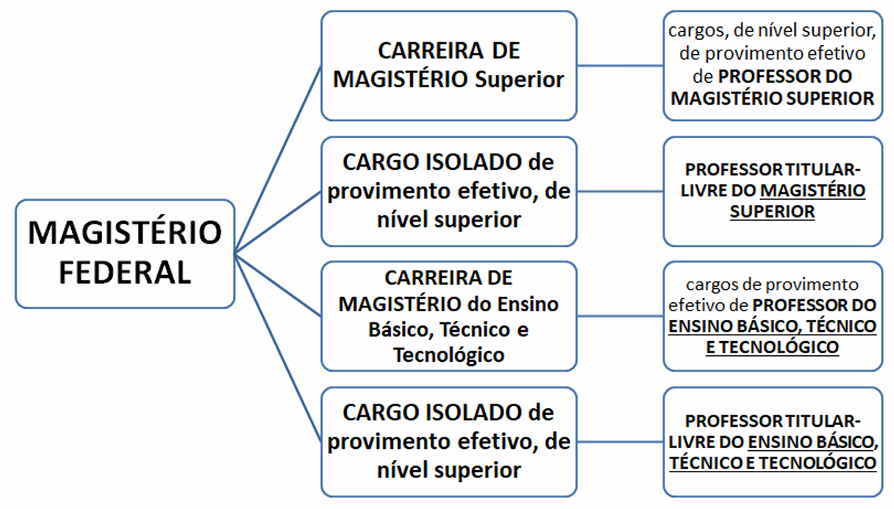

# Capítulo 2 – Lei nº 12.772/2012: Plano de Carreiras e Cargos de Magistério Federal

## O Plano de Carreiras e Cargos de Magistério Federal: Noções Introdutórias

A Lei Federal nº 12.772, de 28 de dezembro de 2012, com as alterações promovidas pela Medida Provisória nº 1.286/2024, é o diploma legal que dispõe sobre a estruturação do **Plano de Carreiras e Cargos de Magistério Federal**. Esta norma representa o estatuto específico que rege a vida funcional dos docentes das Instituições Federais de Ensino (IFE), estabelecendo os pilares para o ingresso, o desenvolvimento profissional e a remuneração desta importante categoria de servidores públicos.

Regra geral, um Plano de Carreiras e Cargos é o instrumento administrativo inerente à gestão de pessoas, que contempla um conjunto de normas, conceitos essenciais, a estrutura da carreira e dos cargos, e a tabela de remuneração de uma determinada categoria. É um mecanismo que busca valorizar o servidor, oferecendo-lhe um caminho claro, unificado e previsível de crescimento profissional, pautado em critérios de mérito, tempo de serviço e qualificação contínua, com um percurso total de 19 anos para se atingir o topo da carreira.

É exatamente a estrutura deste plano, à luz do que regula a norma em estudo, que conheceremos a partir de agora, começando pela composição e pelas atividades da carreira do Magistério Federal.

## A Estrutura da Carreira de Magistério Federal

De acordo com o art. 1º da Lei nº 12.772/2012, o Plano de Carreiras e Cargos de Magistério Federal é composto por duas carreiras distintas e por cargos isolados de altíssimo nível, conforme ilustra o esquema abaixo:

### Atividades do Magistério Federal: O Tripé Ensino, Pesquisa e Extensão

As atividades desempenhadas pelos ocupantes dos cargos deste plano formam o alicerce da atuação das instituições federais de ensino. Elas são centradas no indissociável tripé acadêmico: **ensino, pesquisa e extensão**.

- **Ensino:** Compreende as atividades diretamente ligadas à formação de estudantes, como ministrar aulas na graduação e na pós-graduação, preparar material didático, orientar trabalhos de conclusão de curso, dissertações e teses, e participar de bancas examinadoras.
- **Pesquisa:** Refere-se à produção de conhecimento científico, tecnológico e cultural, por meio do desenvolvimento de projetos de investigação, da publicação de artigos em periódicos especializados, da apresentação de trabalhos em congressos e da orientação de alunos de iniciação científica.
- **Extensão:** Consiste nas ações que promovem a interação e a troca de saberes entre a instituição de ensino e a sociedade em geral, como a oferta de cursos abertos à comunidade, a prestação de serviços especializados, a organização de eventos culturais e o desenvolvimento de projetos com impacto social.

Além deste núcleo acadêmico, são também atividades das Carreiras e Cargos do Magistério Federal aquelas inerentes ao exercício de **direção, assessoramento, chefia, coordenação e assistência** na própria instituição.

### A Carreira de Magistério Superior (MS)

A Carreira de Magistério Superior destina-se a profissionais habilitados para o exercício de atividades acadêmicas no âmbito da **educação superior**, ou seja, nas Universidades Federais e nos Centros Federais de Educação Tecnológica (CEFETs). A carreira é dividida por Classes, com denominações que correspondem à titulação e ao nível de maturidade acadêmica do docente. Com a reestruturação a carreira passou a ter 4 classes e um total de 10 níveis.

A estrutura do Cargo de Professor de Magistério Superior é a seguinte:

| Classe | Denominação | Nível |
| ------ | ----------- | ----- |
| D      | Titular     | 1     |
| C      | Associado   | 4     |
| C      | Associado   | 3     |
| C      | Associado   | 2     |
| C      | Associado   | 1     |
| B      | Adjunto     | 4     |
| B      | Adjunto     | 3     |
| B      | Adjunto     | 2     |
| B      | Adjunto     | 1     |
| A      | Assistente  | 1     |

- **Ingresso na Carreira:** O ingresso ocorre sempre no **nível único da classe inicial (Classe A - Assistente)**, por meio de concurso público de provas e títulos, **independentemente da titulação** que o candidato possua (graduação, mestrado ou doutorado).
- **Desenvolvimento na Carreira:** A ascensão do professor é um processo contínuo de progressão e promoção, com um percurso total de **19 anos**.
    - **Progressão:** É a passagem de um nível para outro dentro da mesma classe (ex: de Adjunto 1 para Adjunto 2 na Classe B).
    - **Promoção:** É a passagem de uma classe para a classe imediatamente superior (ex: da Classe A para a Classe B).
    - **Interstícios:** O tempo mínimo em cada nível para o desenvolvimento na carreira foi unificado. A primeira promoção, da Classe A para a Classe B, ocorrerá após um interstício de **3 anos**, período que coincide com o estágio probatório. As demais progressões e promoções ocorrerão a cada **2 anos** de efetivo exercício, condicionadas à avaliação de desempenho.
    - **Fim da Aceleração da Promoção:** Para os docentes que ingressarem a partir de 1º de janeiro de 2025, foi **extinta a possibilidade de aceleração da promoção**. A progressão na carreira seguirá os interstícios fixos, independentemente da obtenção de novos títulos de mestre ou doutor após o ingresso.

### A Carreira de Magistério do Ensino Básico, Técnico e Tecnológico (EBTT)

A Carreira de Magistério do EBTT é destinada aos profissionais habilitados para o exercício de atividades acadêmicas no âmbito da **educação básica** e da **educação profissional e tecnológica**. Estes docentes compõem o quadro de instituições como os **Institutos Federais de Educação, Ciência e Tecnologia (IFs)**, os **Centros Federais de Educação Tecnológica (CEFETs)**, o **Colégio Pedro II**, as **Escolas Técnicas Vinculadas às Universidades Federais** e os **Colégios de Aplicação**.

Com a reestruturação, a carreira EBTT teve a Classe D I extinta e as demais classes foram renomeadas, passando a ter a seguinte estrutura:

|Classe|Nível|
|---|---|
|Titular|1|
|C|4|
|C|3|
|C|2|
|C|1|
|B|4|
|B|3|
|B|2|
|B|1|
|A|1|

**Ingresso e Desenvolvimento na Carreira:** As regras de ingresso e desenvolvimento na carreira EBTT foram unificadas com as da Carreira de Magistério Superior.

- O ingresso se dá sempre na **Classe A, Nível 1**, por meio de concurso público, com a exigência mínima de graduação.
- O percurso total na carreira é de **19 anos**, com o primeiro interstício para promoção (da Classe A para a B) de **3 anos** e os demais de **2 anos**.
- A **aceleração da promoção também foi extinta** para novos ingressantes.
- Foi mantida a exigência de **título de Doutor** para a promoção à Classe de Titular, bem como a necessidade de defesa de memorial ou tese inédita.

### Os Cargos Isolados de Professor Titular-Livre

Além das duas carreiras estruturadas em classes e níveis, o Plano de Carreiras e Cargos de Magistério Federal contempla uma categoria especial de cargos: os **Cargos Isolados de provimento efetivo**. Como o próprio nome sugere, estes cargos existem de forma autônoma, **fora da escada de progressão** das carreiras de Magistério Superior e de EBTT.

São posições de elite, de classe e nível únicos, criadas com o objetivo estratégico de atrair e incorporar às Instituições Federais de Ensino (IFE) docentes e pesquisadores de altíssima qualificação, com reconhecida produção intelectual e notório saber em suas áreas de atuação. O ingresso nestes cargos não se dá pelos concursos convencionais de início de carreira, mas por meio de um **concurso público de provas e títulos específico e de elevadíssimo rigor**, destinado a profissionais já consagrados em suas áreas.

Estes cargos são estruturados em uma única classe e nível de vencimento, da seguinte forma:

**Cargo Isolado de Professor Titular-Livre do Magistério Superior**

|Cargo|Nível|
|---|---|
|Professor Titular-Livre do Magistério Superior|Único|

**Cargo Isolado do Ensino Básico, Técnico e Tecnológico**

|Cargo|Nível|
|---|---|
|Professor Titular-Livre do Ensino Básico, Técnico e Tecnológico|Único|

Os ocupantes destes cargos, assim como os demais docentes federais, integram os Quadros de Pessoal das Instituições Federais de Ensino (IFE) subordinadas ou vinculadas ao **Ministério da Educação** (como as Universidades Federais) e ao **Ministério da Defesa** (como o Instituto Militar de Engenharia - IME e o Instituto Tecnológico de Aeronáutica - ITA). A lei ressalva apenas situações específicas de cargos que integram o quadro de pessoal do Ministério do Planejamento, Orçamento e Gestão (atualmente, Ministério da Gestão e da Inovação em Serviços Públicos).

O objetivo principal destes cargos é contribuir para o desenvolvimento e fortalecimento de competências e para o alcance da excelência no ensino e na pesquisa nas IFE.

> **Ponto de Atenção: O Regime Jurídico Aplicável**
> 
> É de fundamental importância notar que, embora o Plano de Carreiras seja regido por esta lei específica (Lei nº 12.772/2012), o **regime jurídico** que governa a relação desses professores com a União é o da **Lei nº 8.112, de 1990**.
> 
> Isso significa que todas as regras sobre provimento, vacância, direitos, deveres, regime disciplinar e seguridade social que estudamos no Capítulo 1 aplicam-se integralmente aos docentes do Magistério Federal, sendo a Lei nº 12.772/2012 uma norma especial que detalha apenas os aspectos da carreira e da remuneração.

Entendido como a Carreira e os Cargos de Magistério Federal estão estruturados, é hora de saber como se dá o ingresso nesses cargos. É o que veremos a seguir.

## O Ingresso nas Carreiras e Cargos Isolados

O ingresso nos cargos do Plano de Carreiras e Cargos de Magistério Federal se dá, invariavelmente, por meio de **concurso público de provas e títulos**, em pleno acordo com o art. 37, II, da Constituição Federal. As regras específicas para o ingresso, contudo, foram significativamente alteradas pela reestruturação da carreira, que unificou o ponto de entrada e o percurso de desenvolvimento profissional.

### Ingresso na Carreira de Magistério Superior (MS)

Conforme a nova estrutura, o ingresso na Carreira de Magistério Superior ocorrerá sempre no **primeiro e único nível de vencimento da classe inicial da carreira (Classe A)**, mediante aprovação em concurso público de provas e títulos.

Uma das mudanças mais significativas da reestruturação é que o ponto de entrada na carreira foi unificado. Anteriormente, a titulação do candidato (mestrado ou doutorado) determinava uma classe de ingresso mais elevada. A partir de 1º de janeiro de 2025, essa diferenciação no ingresso foi extinta. O ingresso se dará sempre na classe inicial, **independentemente da titulação** que o candidato possua no momento da posse.

A titulação acadêmica (graduação, especialização, mestrado ou doutorado) passa a ser um **requisito de habilitação** para o concurso, definido no edital, e não mais um fator de posicionamento inicial na carreira. A lei mantém a possibilidade de a Instituição Federal de Ensino (IFE), em decisão fundamentada de seu Conselho Superior, dispensar a exigência de título de Doutor e substituí-la pela de Mestre, Especialista ou Graduado, especialmente em áreas com carência de profissionais.

- **Exemplo:** Em um concurso para a área de Engenharia de Software, o edital exige o título de Doutor. Em outro concurso para a área de Design Gráfico, o edital exige o título de Mestre. Sob as novas regras, os candidatos aprovados em ambos os certames, ao serem nomeados, ingressarão na mesma **Classe A, Nível 1**. A maior titulação do primeiro candidato será valorizada na forma de Retribuição por Titulação e em sua progressão futura, mas não alterará seu ponto de partida na carreira.

O concurso público poderá ser organizado em diversas etapas, como prova escrita, prova didática, prova prática e defesa de memorial, conforme dispuser o edital de abertura do certame, que também estabelecerá os critérios eliminatórios e classificatórios.

##### Ingresso no Cargo Isolado de Professor Titular-Livre do Magistério Superior

O ingresso no Cargo Isolado de Professor Titular-Livre do Magistério Superior, por sua natureza de elite acadêmica, mantém requisitos e um rito de seleção ainda mais rigorosos. O ingresso se dá na classe e nível únicos do cargo, mediante aprovação em concurso público de provas e títulos que exige, cumulativamente:

- **Título de Doutor;** e
- Comprovação de, no mínimo, **10 anos de experiência** ou de **obtenção do título de Doutor**, ambos na área de conhecimento exigida no concurso.

O concurso para este cargo é um processo de alta complexidade, consistindo, no mínimo, nas seguintes etapas:

- **Prova escrita,** de caráter eliminatório;
- **Prova oral ou defesa de tese,** de caráter eliminatório; e
- **Defesa de memorial,** de caráter classificatório, na qual o candidato apresenta e defende sua trajetória acadêmica, científica e profissional.

Uma garantia adicional de isenção e rigor neste certame é a composição de sua comissão examinadora. A lei determina que a comissão especial para o concurso de Titular-Livre será composta por, no mínimo, **75% de profissionais externos à Instituição Federal de Ensino** que está realizando o concurso, assegurando uma avaliação com ampla pluralidade de perspectivas e isenta de influências internas.

### Ingresso na Carreira de Magistério do Ensino Básico, Técnico e Tecnológico (EBTT)

Conforme o art. 10 da Lei nº 12.772/2012, o ingresso nos cargos de provimento efetivo de Professor do Ensino Básico, Técnico e Tecnológico ocorrerá sempre no **primeiro nível da classe inicial da carreira (Classe A)**, mediante aprovação em concurso público, que poderá ser de provas ou de provas e títulos.

A exigência mínima de formação para concorrer a uma vaga na carreira EBTT é o **diploma de curso superior em nível de graduação**, em área de conhecimento compatível com a definida no edital do certame.

Com a reestruturação da carreira, vigente a partir de 1º de janeiro de 2025, o ponto de entrada foi unificado. Assim, um candidato que concorre a um cargo desta Carreira, ao ser aprovado no concurso, será nomeado para **Professor de Ensino Básico, Técnico e Tecnológico, Classe A, Nível 1**, independentemente de sua titulação no momento da posse (seja ele graduado, especialista, mestre ou doutor). O desenvolvimento na carreira, com a ascensão pelos níveis e classes até o topo (Classe Titular), ocorrerá por meio dos mecanismos de progressão e promoção, conforme será detalhado adiante.

O concurso público poderá ser organizado em diversas etapas, e o edital de abertura estabelecerá as características de cada uma, bem como os critérios eliminatórios e classificatórios do certame.

#### Ingresso no Cargo Isolado de Professor Titular-Livre do EBTT

De forma análoga à Carreira de Magistério Superior, a lei também prevê o Cargo Isolado de Professor Titular-Livre do Ensino Básico, Técnico e Tecnológico. O ingresso nesta posição de elite ocorrerá na classe e nível únicos, mediante aprovação em concurso público de provas e títulos de altíssimo rigor, no qual serão exigidos:

- **Título de doutor;** e
- Comprovação de, no mínimo, **10 anos de experiência** ou de **obtenção do título de doutor**, ambos na área de conhecimento exigida no concurso.

O concurso público para este cargo será organizado em etapas, conforme dispuser o edital, e consistirá, no mínimo, em:

- **Prova escrita;**
- **Prova oral;** e
- **Defesa de memorial.**

A comissão examinadora para o concurso de Titular-Livre do EBTT segue a mesma regra de rigor e isenção aplicada ao Magistério Superior: será uma comissão especial composta por, no mínimo, **75% de profissionais externos à Instituição Federal de Ensino** promotora do concurso.

Uma vez compreendida a estrutura das carreiras e as regras de ingresso, o próximo passo é analisar os mecanismos de desenvolvimento profissional. O tópico a seguir detalhará as formas de progressão e promoção na Carreira de Magistério Federal.

