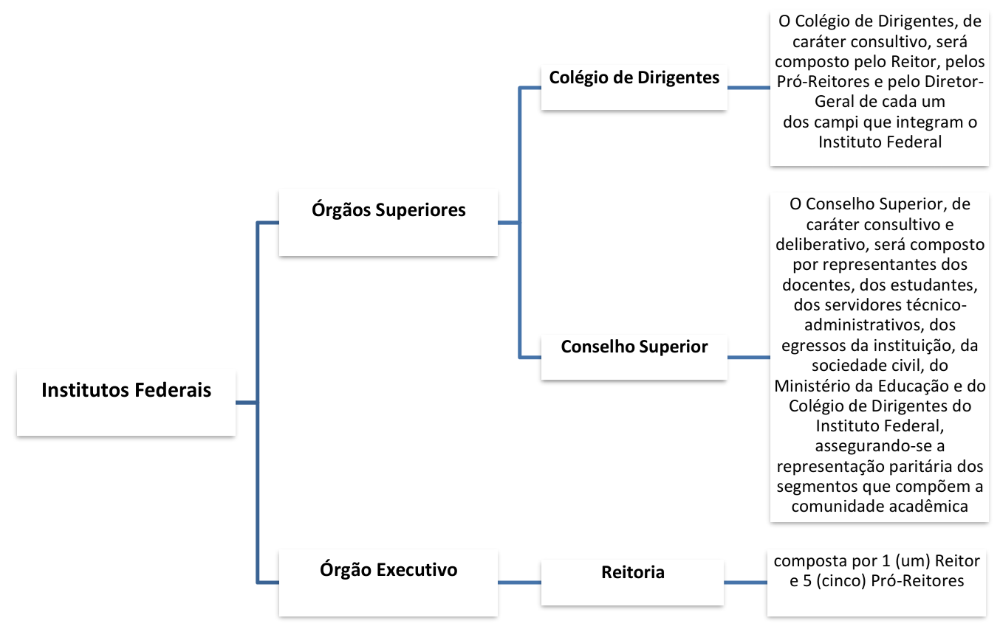

# Capítulo 3 – Lei nº 11.892/2008: Instituição da Rede Federal de Educação Profissional, Científica e Tecnológica

A Lei nº 11.892, de 29 de dezembro de 2008, representa um marco na história da educação profissional e tecnológica no Brasil. Foi por meio desta norma que se instituiu a **Rede Federal de Educação Profissional, Científica e Tecnológica**, uma iniciativa de grande envergadura que reorganizou e expandiu a oferta de educação pública, gratuita e de qualidade, com foco no desenvolvimento local e regional.

## A Instituição e a Composição da Rede Federal

O art. 1º da Lei estabelece a criação da Rede no âmbito do sistema federal de ensino, vinculada ao Ministério da Educação. A Rede não é uma única instituição, mas um arranjo cooperativo que congrega diferentes tipos de instituições de ensino, cada qual com suas particularidades, mas unidas pelo mesmo propósito.

> **Art. 1º** Fica instituída, no âmbito do sistema federal de ensino, a Rede Federal de Educação Profissional, Científica e Tecnológica, vinculada ao Ministério da Educação e constituída pelas seguintes instituições:
> 
> I - Institutos Federais de Educação, Ciência e Tecnologia - Institutos Federais;
> II - Universidade Tecnológica Federal do Paraná - UTFPR;
> III - Centros Federais de Educação Tecnológica Celso Suckow da Fonseca - CEFET-RJ e de Minas Gerais - CEFET-MG;
> IV - Escolas Técnicas Vinculadas às Universidades Federais; e
> V - Colégio Pedro II.

É fundamental compreender o que é a Rede Federal e quais são as instituições que a integram. Basicamente, a Rede congrega as escolas federais de educação profissional e tecnológica, conforme ilustrado a seguir:

Com exceção das Escolas Técnicas Vinculadas às Universidades Federais (cuja autonomia é exercida por meio da universidade a que pertencem), todas as demais instituições da Rede possuem **natureza jurídica de autarquia**. Isso significa que são entidades da administração pública indireta, criadas por lei, com patrimônio e receita próprios, e detentoras de **autonomia administrativa, patrimonial, financeira, didático-pedagógica e disciplinar**.

## Os Institutos Federais de Educação, Ciência e Tecnologia (IFs)

Os Institutos Federais são a grande inovação e o pilar da Lei nº 11.892/2008. Eles foram criados, em sua maioria, a partir da transformação e da unificação de antigos Centros Federais de Educação Tecnológica (CEFETs), Escolas Agrotécnicas e Escolas Técnicas. O art. 2º da Lei os define da seguinte forma:

> **Art. 2º** Os Institutos Federais são instituições de educação superior, básica e profissional, **pluricurriculares** e **multicampi**, especializados na oferta de educação profissional e tecnológica nas diferentes modalidades de ensino, com base na conjugação de conhecimentos técnicos e tecnológicos com as suas práticas pedagógicas, nos termos desta Lei.

Analisando a definição, temos que os IFs são:

- **Pluricurriculares:** Oferecem uma vasta gama de cursos em diferentes áreas do saber e em todos os níveis de ensino, desde a formação inicial e continuada de trabalhadores, passando pelos cursos técnicos de nível médio, até a graduação (tecnológica, licenciaturas e bacharelados) e a pós-graduação (_lato_ e _stricto sensu_).
- **Multicampi:** Possuem uma estrutura descentralizada, com um campus Reitoria e diversos outros _campi_ espalhados pelo interior dos estados, promovendo a interiorização da educação federal.

Para fins de regulação, avaliação e supervisão, os Institutos Federais são **equiparados às universidades federais**. Isso lhes confere, por exemplo, autonomia para criar e extinguir cursos, bem como para registrar os diplomas que expedem, mediante autorização de seu Conselho Superior.

## As Instituições com Características Peculiares

Além dos Institutos Federais, a Rede é composta por outras instituições com características históricas e organizacionais distintas:

- **A Universidade Tecnológica Federal do Paraná (UTFPR):** É a única instituição do país com o status de "Universidade Tecnológica". Originada da transformação do antigo CEFET-PR, ela é configurada como uma universidade especializada, com foco nas engenharias e na tecnologia.
- **Os CEFET-RJ e CEFET-MG:** Em razão de sua tradição e relevância histórica, os Centros Federais de Educação Tecnológica do Rio de Janeiro e de Minas Gerais foram mantidos com sua nomenclatura e estrutura originais, não sendo transformados em Institutos Federais.
- **O Colégio Pedro II:** Instituição de ensino de grande prestígio, localizada no Rio de Janeiro, é especializada na oferta de educação básica (do ensino fundamental ao médio) e de licenciaturas. Para fins de autonomia e gestão, a lei o equipara aos Institutos Federais.

## Os Institutos Federais de Educação, Ciência e Tecnologia

Os Institutos Federais de Educação, Ciência e Tecnologia (IFs) são a principal inovação e o pilar central da Rede Federal instituída pela Lei nº 11.892/2008. Sua criação representou uma profunda reorganização da educação profissional e tecnológica no país.

### Criação dos Institutos Federais

Os 38 Institutos Federais originais não foram criados do zero. Eles surgiram a partir da reestruturação de unidades de ensino já existentes, por meio de dois processos distintos: a **transformação** e a **integração**.

- **Transformação:** Ocorreu quando uma única instituição preexistente, geralmente um Centro Federal de Educação Tecnológica (CEFET), foi convertida em um novo Instituto Federal.
    - **Exemplo:** O antigo Centro Federal de Educação Tecnológica da Bahia foi _transformado_ no Instituto Federal da Bahia (IFBA).
- **Integração:** Ocorreu quando múltiplas instituições, como CEFETs e Escolas Agrotécnicas Federais, foram fundidas para dar origem a um novo e único Instituto Federal, com uma estrutura multicampi.
    - **Exemplo:** O antigo Centro Federal de Educação Tecnológica da Paraíba foi _integrado_ à Escola Agrotécnica Federal de Sousa para formar o atual Instituto Federal da Paraíba (IFPB).

O art. 5º da Lei detalha a criação de cada um dos Institutos Federais:

> **Art. 5º** Ficam criados os seguintes Institutos Federais de Educação, Ciência e Tecnologia:
> 
> I - Instituto Federal do Acre, mediante transformação da Escola Técnica Federal do Acre;
> II - Instituto Federal de Alagoas, mediante integração do Centro Federal de Educação Tecnológica de Alagoas e da Escola Agrotécnica Federal de Satuba;
> III - Instituto Federal do Amapá, mediante transformação da Escola Técnica Federal do Amapá;
> IV - Instituto Federal do Amazonas, mediante integração do Centro Federal de Educação Tecnológica do Amazonas e das Escolas Agrotécnicas Federais de Manaus e de São Gabriel da Cachoeira;
> V - Instituto Federal da Bahia, mediante transformação do Centro Federal de Educação Tecnológica da Bahia;
> VI - Instituto Federal Baiano, mediante integração das Escolas Agrotécnicas Federais de Catu, de Guanambi (Antonio José Teixeira), de Santa Inês e de Senhor do Bonfim;
> VII - Instituto Federal de Brasília, mediante transformação da Escola Técnica Federal de Brasília;
> VIII - Instituto Federal do Ceará, mediante integração do Centro Federal de Educação Tecnológica do Ceará e das Escolas Agrotécnicas Federais de Crato e de Iguatu;
> IX - Instituto Federal do Espírito Santo, mediante integração do Centro Federal de Educação Tecnológica do Espírito Santo e das Escolas Agrotécnicas Federais de Alegre, de Colatina e de Santa Teresa;
> X - Instituto Federal de Goiás, mediante transformação do Centro Federal de Educação Tecnológica de Goiás;
> XI - Instituto Federal Goiano, mediante integração dos Centros Federais de Educação Tecnológica de Rio Verde e de Urutaí, e da Escola Agrotécnica Federal de Ceres;
> XII - Instituto Federal do Maranhão, mediante integração do Centro Federal de Educação Tecnológica do Maranhão e das Escolas Agrotécnicas Federais de Codó, de São Luís e de São Raimundo das Mangabeiras;
> XIII - Instituto Federal de Minas Gerais, mediante integração dos Centros Federais de Educação Tecnológica de Ouro Preto e de Bambuí, e da Escola Agrotécnica Federal de São João Evangelista;
> XIV - Instituto Federal do Norte de Minas Gerais, mediante integração do Centro Federal de Educação Tecnológica de Januária e da Escola Agrotécnica Federal de Salinas;
> XV - Instituto Federal do Sudeste de Minas Gerais, mediante integração do Centro Federal de Educação Tecnológica de Rio Pomba e da Escola Agrotécnica Federal de Barbacena;
> XVI - Instituto Federal do Sul de Minas Gerais, mediante integração das Escolas Agrotécnicas Federais de Inconfidentes, de Machado e de Muzambinho;
> XVII - Instituto Federal do Triângulo Mineiro, mediante integração do Centro Federal de Educação Tecnológica de Uberaba e da Escola Agrotécnica Federal de Uberlândia;
> XVIII - Instituto Federal de Mato Grosso, mediante integração dos Centros Federais de Educação Tecnológica de Mato Grosso e de Cuiabá, e da Escola Agrotécnica Federal de Cáceres;
> XIX - Instituto Federal de Mato Grosso do Sul, mediante integração da Escola Técnica Federal de Mato Grosso do Sul e da Escola Agrotécnica Federal de Nova Andradina;
> XX - Instituto Federal do Pará, mediante integração do Centro Federal de Educação Tecnológica do Pará e das Escolas Agrotécnicas Federais de Castanhal e de Marabá;
> XXI - Instituto Federal da Paraíba, mediante integração do Centro Federal de Educação Tecnológica da Paraíba e da Escola Agrotécnica Federal de Sousa;
> XXII - Instituto Federal de Pernambuco, mediante integração do Centro Federal de Educação Tecnológica de Pernambuco e das Escolas Agrotécnicas Federais de Barreiros, de Belo Jardim e de Vitória de Santo Antão;
> XXIII - Instituto Federal do Sertão Pernambucano, mediante transformação do Centro Federal de Educação Tecnológica de Petrolina;
> XXIV - Instituto Federal do Piauí, mediante transformação do Centro Federal de Educação Tecnológica do Piauí;
> XXV - Instituto Federal do Paraná, mediante transformação da Escola Técnica da Universidade Federal do Paraná;
> XXVI - Instituto Federal do Rio de Janeiro, mediante transformação do Centro Federal de Educação Tecnológica de Química de Nilópolis;
> XXVII - Instituto Federal Fluminense, mediante transformação do Centro Federal de Educação Tecnológica de Campos;
> XXVIII - Instituto Federal do Rio Grande do Norte, mediante transformação do Centro Federal de Educação Tecnológica do Rio Grande do Norte;
> XXIX - Instituto Federal do Rio Grande do Sul, mediante integração do Centro Federal de Educação Tecnológica de Bento Gonçalves, da Escola Técnica Federal de Canoas e da Escola Agrotécnica Federal de Sertão;
> XXX - Instituto Federal Farroupilha, mediante integração do Centro Federal de Educação Tecnológica de São Vicente do Sul e da Escola Agrotécnica Federal de Alegrete;
> XXXI - Instituto Federal Sul-rio-grandense, mediante transformação do Centro Federal de Educação Tecnológica de Pelotas;
> XXXII - Instituto Federal de Rondônia, mediante integração da Escola Técnica Federal de Rondônia e da Escola Agrotécnica Federal de Colorado do Oeste;
> XXXIII - Instituto Federal de Roraima, mediante transformação do Centro Federal de Educação Tecnológica de Roraima;
> XXXIV - Instituto Federal de Santa Catarina, mediante transformação do Centro Federal de Educação Tecnológica de Santa Catarina;
> XXXV - Instituto Federal Catarinense, mediante integração das Escolas Agrotécnicas Federais de Concórdia, de Rio do Sul e de Sombrio;
> XXXVI - Instituto Federal de São Paulo, mediante transformação do Centro Federal de Educação Tecnológica de São Paulo;
> XXXVII - Instituto Federal de Sergipe, mediante integração do Centro Federal de Educação Tecnológica de Sergipe e da Escola Agrotécnica Federal de São Cristóvão; e
> XXXVIII - Instituto Federal do Tocantins, mediante integração da Escola Técnica Federal de Palmas e da Escola Agrotécnica Federal de Araguatins.

A lei, em seus anexos, define a localidade da sede (Reitoria) de cada um dos Institutos Federais criados. A definição de quais _campi_ específicos passariam a integrar cada Instituto foi estabelecida posteriormente, por meio de ato do Ministro de Estado da Educação, para organizar a transição.

### Fomento à Pesquisa e Inovação

Reforçando seu papel como centros de produção de conhecimento, a lei concede aos Institutos Federais a autonomia para conceder **bolsas de pesquisa, desenvolvimento, inovação e intercâmbio** a alunos, docentes e até mesmo a pesquisadores externos ou de empresas. Esta prerrogativa é um instrumento fundamental para o fomento da atividade científica e tecnológica no âmbito dos IFs.

###  Finalidades, Características e Objetivos dos Institutos Federais

Os artigos 6º e 7º da Lei nº 11.892/2008 formam o núcleo conceitual dos Institutos Federais, estabelecendo sua missão institucional e as ações concretas que devem realizar para cumpri-la. É importante diferenciar as duas categorias:

- As **Finalidades e Características (art. 6º)** representam a **missão**, a identidade e os princípios norteadores dos IFs. Elas respondem à pergunta: "O que é e para que serve um Instituto Federal?".
- Os **Objetivos (art. 7º)** representam a **materialização** dessa missão. São as ações, os cursos e as atividades que os IFs devem efetivamente executar para atingir suas finalidades. Eles respondem à pergunta: "Como um Instituto Federal cumpre sua missão?".

#### As Finalidades e Características

A lei estabelece um rol de finalidades e características que definem a natureza dos Institutos Federais:

> **I - ofertar educação profissional e tecnológica**, em todos os seus níveis e modalidades, formando e qualificando cidadãos com vistas na atuação profissional nos diversos setores da economia, com ênfase no desenvolvimento socioeconômico local, regional e nacional;
> **II - desenvolver a educação profissional e tecnológica como processo educativo e investigativo** de geração e adaptação de soluções técnicas e tecnológicas às demandas sociais e peculiaridades regionais;
> **III - promover a integração e a verticalização da educação básica à educação profissional e educação superior**, otimizando a infraestrutura física, os quadros de pessoal e os recursos de gestão;

A **verticalização** é uma característica-chave: significa que o aluno pode trilhar um itinerário formativo completo dentro da mesma instituição, ingressando em um curso técnico de nível médio, prosseguindo para uma graduação tecnológica e, em seguida, para um mestrado profissional.

> **IV - orientar sua oferta formativa em benefício da consolidação e fortalecimento dos arranjos produtivos, sociais e culturais locais**, identificados com base no mapeamento das potencialidades de desenvolvimento socioeconômico e cultural no âmbito de atuação do Instituto Federal;

Isso significa que um IF localizado em uma região com forte vocação para o agronegócio, por exemplo, deve priorizar cursos como Técnico em Agropecuária ou Engenharia Agronômica.

> **V - constituir-se em centro de excelência na oferta do ensino de ciências**, em geral, e de ciências aplicadas, em particular, estimulando o desenvolvimento de espírito crítico, voltado à investigação empírica;
> **VI - qualificar-se como centro de referência no apoio à oferta do ensino de ciências nas instituições públicas de ensino**, oferecendo capacitação técnica e atualização pedagógica aos docentes das redes públicas de ensino;
> **VII - desenvolver programas de extensão e de divulgação científica e tecnológica;**
> **VIII - realizar e estimular a pesquisa aplicada, a produção cultural, o empreendedorismo, o cooperativismo e o desenvolvimento científico e tecnológico;**
> **IX - promover a produção, o desenvolvimento e a transferência de tecnologias sociais**, notadamente as voltadas à preservação do meio ambiente.

#### Os Objetivos

Para alcançar as finalidades descritas, os Institutos Federais devem perseguir os seguintes objetivos concretos:

> **I - ministrar educação profissional técnica de nível médio**, prioritariamente na forma de cursos integrados;
> **II - ministrar cursos de formação inicial e continuada (FIC)** de trabalhadores, em todos os níveis de escolaridade;
> **III - realizar pesquisas aplicadas**, estimulando o desenvolvimento de soluções técnicas e tecnológicas;
> **IV - desenvolver atividades de extensão**, em articulação com o mundo do trabalho e os segmentos sociais;
> **V - estimular e apoiar processos educativos que levem à geração de trabalho e renda** e à emancipação do cidadão; e
> **VI - ministrar, em nível de educação superior:**
>     a) cursos superiores de tecnologia;
>     b) cursos de licenciatura, para a formação de professores;
>     c) cursos de bacharelado e engenharia;
>     d) cursos de pós-graduação _lato sensu_ (especialização); e
>     e) cursos de pós-graduação _stricto sensu_ (mestrado e doutorado).

#### Oferta Mínima de Vagas

Para garantir que os Institutos Federais mantenham seu foco em sua missão original, o **art. 8º** da Lei estabelece uma política de cotas para a distribuição de suas vagas. Esta é uma diretriz de cumprimento obrigatório que visa evitar que os IFs abandonem a educação básica e a formação de professores para se concentrarem exclusivamente no ensino superior.

Cada Instituto Federal deverá garantir, anualmente, a seguinte oferta mínima:

1. **50% (cinquenta por cento) de suas vagas** para a **educação profissional técnica de nível médio**, prioritariamente na forma integrada.
2. **20% (vinte por cento) de suas vagas** para os **cursos de licenciatura**, bem como para programas especiais de formação pedagógica, visando a formação de professores para a educação básica.

Os 30% restantes das vagas podem ser distribuídos livremente entre os demais cursos e níveis de ensino ofertados pela instituição.

### A Estrutura Organizacional dos Institutos Federais

A Lei nº 11.892/2008 estabelece um modelo de organização e governança para os Institutos Federais que busca equilibrar a gestão centralizada com a autonomia dos campi, pautado em princípios de democracia e participação da comunidade acadêmica.

#### A Estrutura Multicampi e Orçamentária

A lei define, em primeiro lugar, a natureza descentralizada dos Institutos Federais.

> **Art. 9º** Cada Instituto Federal é organizado em estrutura multicampi, com proposta orçamentária anual identificada para cada campus e a reitoria, exceto no que diz respeito a pessoal, encargos sociais e benefícios aos servidores.

Este artigo consagra a **estrutura multicampi** como o modelo padrão dos IFs, o que reflete a política de interiorização da educação federal, com um órgão central (a Reitoria) e diversos _campi_ distribuídos em diferentes municípios. A proposta orçamentária anual discrimina os valores para cada _campus_ e para a respectiva Reitoria, conferindo autonomia na gestão dos recursos de custeio e investimento. A exceção para as despesas com pessoal, encargos sociais e benefícios dos servidores ocorre porque estes são custos, em geral, fixos e geridos de forma centralizada pelo órgão de gestão de pessoas da Reitoria, garantindo a uniformidade e o controle sobre a folha de pagamento.

#### A Estrutura de Governança: Órgãos Superiores e Executivo

A administração dos Institutos Federais é dividida entre órgãos superiores, responsáveis pela definição estratégica, e um órgão executivo, responsável pela gestão cotidiana.

> **Art. 10.** A administração dos Institutos Federais terá como órgãos superiores o Colégio de Dirigentes e o Conselho Superior.

As presidências tanto do Colégio de Dirigentes quanto do Conselho Superior são exercidas pelo Reitor do Instituto Federal. O estatuto de cada IF deverá dispor sobre a estruturação, as competências e as normas de funcionamento detalhadas desses órgãos, cujas composições e naturezas são explicadas no esquema a seguir.

> **Art. 11.** Os Institutos Federais terão como órgão executivo a reitoria, composta por 1 (um) Reitor e 5 (cinco) Pró-Reitores.

O órgão executivo, responsável pela gestão do dia a dia da instituição, é a **Reitoria**. Como órgão de administração central, a Reitoria pode ser instalada em um espaço físico distinto de qualquer dos _campi_ que integram o Instituto Federal. Podem ser nomeados para os cargos de Pró-Reitor os servidores ocupantes de cargo efetivo da Carreira docente ou de cargo efetivo com nível superior da Carreira dos técnico-administrativos, desde que possuam o mínimo de 5 anos de efetivo exercício em instituição federal de educação profissional e tecnológica.

A estrutura completa de governança pode ser visualizada no organograma abaixo:

#### O Processo de Escolha do Reitor

A escolha do dirigente máximo do Instituto Federal é um processo democrático, cujas regras são detalhadas no art. 12 da Lei.

> **Art. 12.** Os Reitores serão nomeados pelo Presidente da República, para mandato de 4 (quatro) anos, permitida uma recondução, após processo de consulta à comunidade escolar do respectivo Instituto Federal, atribuindo-se o peso de 1/3 (um terço) para a manifestação do corpo docente, de 1/3 (um terço) para a manifestação dos servidores técnico-administrativos e de 1/3 (um terço) para a manifestação do corpo discente.1

O Reitor, portanto, é nomeado pelo Presidente da República para cumprir um mandato de 4 anos, sendo permitida uma única recondução. Essa nomeação, contudo, é precedida por um **processo de consulta** à comunidade escolar (docentes, técnico-administrativos e discentes), que funciona como uma eleição interna. A votação é **paritária**, com o resultado de cada segmento tendo o mesmo peso (1/3) no cômputo final.

Para se candidatar ao cargo de Reitor, o docente deve pertencer ao Quadro de Pessoal Ativo Permanente de qualquer dos _campi_ do Instituto Federal, possuir o mínimo de 5 anos de efetivo exercício em instituição federal de educação profissional e tecnológica e atender a, pelo menos, um dos seguintes requisitos:

a) possuir o título de doutor; ou
b) estar posicionado nas Classes DIV ou Titular da Carreira do Magistério do Ensino Básico, Técnico e Tecnológico, ou na Classe de Professor Associado ou Titular da Carreira do Magistério Superior;

O mandato do Reitor se encerra ao final do prazo de 4 anos ou, antecipadamente, em casos de aposentadoria, renúncia, destituição ou vacância do cargo. Os Pró-Reitores, por sua vez, são cargos de confiança nomeados diretamente pelo Reitor eleito.

Com certeza. Dando continuidade ao Capítulo 3, apresento o desenvolvimento dos tópicos sobre a **Gestão dos Campi** e as regras específicas para o **Colégio Pedro II**, com os devidos aprofundamentos e a estrutura solicitada.

#### A Gestão dos Campi: A Figura do Diretor-Geral

Sendo os Institutos Federais organizados em uma estrutura multicampi, a lei estabelece a figura do **Diretor-Geral** como o dirigente máximo de cada _campus_. Ele é o responsável pela gestão administrativa e acadêmica daquela unidade específica, atuando de forma alinhada às diretrizes da Reitoria.

O processo de escolha do Diretor-Geral espelha, em nível local, o mesmo princípio democrático da escolha do Reitor.

> **Art. 13.** Os campi serão dirigidos por Diretores-Gerais, nomeados pelo Reitor para mandato de 4 (quatro) anos, permitida uma recondução, após processo de consulta à comunidade do respectivo campus, atribuindo-se o peso de 1/3 (um terço) para a manifestação do corpo docente, de 1/3 (um terço) para a manifestação dos servidores técnico-administrativos e de 1/3 (um terço) para a manifestação do corpo discente.

Assim, os Diretores-Gerais são nomeados pelo Reitor do Instituto Federal para um mandato de 4 anos, permitida uma recondução. A nomeação é precedida por um processo de consulta (eleição) junto à comunidade específica daquele _campus_, observando-se o mesmo critério de voto paritário entre os três segmentos (docentes, técnico-administrativos e estudantes).

Para se candidatar ao cargo de Diretor-Geral, o servidor deve ocupar um cargo efetivo da carreira docente ou de técnico-administrativo de nível superior, possuir no mínimo 5 anos de efetivo exercício em instituição federal de educação profissional e tecnológica e enquadrar-se em, pelo menos, uma das seguintes situações:

a) Preencher os requisitos exigidos para a candidatura ao cargo de Reitor;
b) Possuir o mínimo de 2 anos de exercício em cargo ou função de gestão na instituição; ou
c) Ter concluído, com aproveitamento, curso de formação para o exercício de cargo ou função de gestão em instituições da administração pública.

## O Regime Especial do Colégio Pedro II

O Colégio Pedro II, instituição de ensino de grande tradição e relevância histórica, recebe um tratamento específico na lei, que busca preservar sua identidade ao mesmo tempo em que o integra à lógica organizacional da Rede Federal.

> **Art. 13-A.** O Colégio Pedro II terá a mesma estrutura e organização dos Institutos Federais de Educação, Ciência e Tecnologia.

Esta equiparação legal significa que, para fins de gestão e autonomia, o Colégio Pedro II funciona de forma bastante semelhante a um Instituto Federal. Suas unidades escolares, que já compunham sua estrutura antes da lei, passaram a ser consideradas _campi_. A instituição é chefiada por um Reitor, eleito pela comunidade, e possui órgãos superiores como o Conselho Superior.

A principal diferença reside em sua finalidade: enquanto os IFs têm uma atuação ampla em todos os níveis, o Colégio Pedro II é especializado na oferta de educação básica (ensino fundamental e médio) e de cursos de licenciatura para a formação de professores.

Por fim, a lei determina que a criação de novos _campi_ para o Colégio Pedro II fica condicionada à expedição de autorização específica do Ministério da Educação.

## Disposições Gerais e Transitórias

Os artigos finais da Lei nº 11.892/2008 tratam de regras de transição, destinadas a organizar a complexa passagem das antigas instituições para a nova estrutura dos Institutos Federais, bem como de disposições gerais que orientam a expansão futura da Rede.

### As Regras de Transição para a Gestão

Para garantir uma transição de gestão suave e sem vácuo de poder, a lei estabeleceu mandatos temporários para os primeiros dirigentes dos recém-criados Institutos Federais.

> **Art. 14.** O Diretor-Geral de instituição transformada ou integrada em Instituto Federal nomeado para o cargo de Reitor da nova instituição exercerá esse cargo até o final de seu mandato em curso e em caráter _pro tempore_, com a incumbência de promover, no prazo máximo de 180 (cento e oitenta) dias, a elaboração e encaminhamento ao Ministério da Educação da proposta de estatuto e de plano de desenvolvimento institucional do Instituto Federal, assegurada a participação da comunidade acadêmica na construção dos referidos instrumentos.
> 
> § 1º Os Diretores-Gerais das instituições transformadas em campus de Instituto Federal exercerão, até o final de seu mandato e em caráter pro tempore, o cargo de Diretor-Geral do respectivo campus.
> 
> § 2º Nos campi em processo de implantação, os cargos de Diretor-Geral serão providos em caráter pro tempore, por nomeação do Reitor do Instituto Federal, até que seja possível identificar candidatos que atendam aos requisitos previstos no § 1º do art. 13 desta Lei.
> 
> § 3º O Diretor-Geral nomeado para o cargo de Reitor Pro-Tempore do Instituto Federal, ou de Diretor-Geral Pro-Tempore do Campus, não poderá candidatar-se a um novo mandato, desde que já se encontre no exercício do segundo mandato, em observância ao limite máximo de investidura permitida, que são de 2 (dois) mandatos consecutivos.

Esses dispositivos criaram a figura do **mandato _pro tempore_** (temporário), que permitiu que os dirigentes em exercício nas antigas instituições continuassem em seus postos até o fim de seus mandatos originais, agora como gestores da nova estrutura. A principal incumbência do Reitor _pro tempore_ era conduzir o processo de criação do primeiro estatuto do novo Instituto Federal. A lei também resguardou o limite máximo de dois mandatos consecutivos, impedindo que um gestor que já estivesse em seu segundo mandato pudesse se candidatar na primeira eleição da nova instituição.

### A Redistribuição de Pessoal e Patrimônio

Os artigos 16 e 17 foram fundamentais para garantir a segurança jurídica da reorganização, tratando da transferência dos servidores e dos bens das antigas instituições.

> **Art. 16.** Ficam redistribuídos para os Institutos Federais criados nos termos desta Lei todos os cargos e funções, ocupados e vagos, pertencentes aos quadros de pessoal das respectivas instituições que os integram.
> 
> § 1º Todos os servidores e funcionários serão mantidos em sua lotação atual, exceto aqueles que forem designados pela administração superior de cada Instituto Federal para integrar o quadro de pessoal da Reitoria.
> 
> § 2º A mudança de lotação de servidores entre diferentes campi de um mesmo Instituto Federal deverá observar o instituto da remoção, nos termos do art. 36 da Lei nº 8.112, de 11 de dezembro de 1990.
> 
> **Art. 17.** O patrimônio de cada um dos novos Institutos Federais será constituído:
> 
> I - pelos bens e direitos que compõem o patrimônio de cada uma das instituições que o integram, os quais ficam automaticamente transferidos, sem reservas ou condições, ao novo ente;
> II - pelos bens e direitos que vier a adquirir;
> III - pelas doações ou legados que receber; e
> IV - por incorporações que resultem de serviços por ele realizado.
> 
> Parágrafo único. Os bens e direitos do Instituto Federal serão utilizados ou aplicados, exclusivamente, para a consecução de seus objetivos, não podendo ser alienados a não ser nos casos e condições permitidos em lei.

Esses artigos garantiram que todos os cargos, servidores e o patrimônio (bens e direitos) das instituições extintas ou integradas fossem **automaticamente transferidos** para os novos Institutos Federais, sem solução de continuidade. É importante notar que a lei protegeu o servidor ao determinar que a mudança de lotação entre os _campi_ de um mesmo IF deve seguir as regras da **remoção**, previstas na Lei nº 8.112/1990.

### Diretrizes Futuras e a Manutenção dos CEFETs Históricos

Por fim, a lei estabelece diretrizes para o futuro da Rede e formaliza a situação especial de duas de suas instituições.

> **Art. 15.** A criação de novas instituições federais de educação profissional e tecnológica, bem como a expansão das instituições já existentes, levará em conta o modelo de Instituto Federal, observando ainda os parâmetros e as normas definidas pelo Ministério da Educação.

Este artigo elege o **"modelo Instituto Federal"** como o padrão para toda e qualquer expansão futura da Rede.

> **Art. 18.** Os Centros Federais de Educação Tecnológica Celso Suckow da Fonseca - CEFET-RJ e de Minas Gerais - CEFET-MG, não inseridos no reordenamento de que trata o art. 5º desta Lei, permanecem como entidades autárquicas vinculadas ao Ministério da Educação, configurando-se como instituições de ensino superior pluricurriculares, especializadas na oferta de educação tecnológica nos diferentes níveis e modalidades de ensino, caracterizando-se pela atuação prioritária na área tecnológica, na forma da legislação.

Por razões de relevância histórica e institucional, optou-se por não transformar os CEFETs do Rio de Janeiro e de Minas Gerais em Institutos Federais. Eles foram mantidos com sua nomenclatura e organização tradicionais, embora continuem a integrar a Rede Federal e a desempenhar um papel crucial na oferta de educação tecnológica.

## Considerações Finais

Ao longo deste capítulo, exploramos a Lei nº 11.892, de 29 de dezembro de 2008, um diploma legislativo que representou uma das mais significativas transformações na educação profissional e tecnológica do Brasil. Mais do que uma simples norma, esta lei instituiu uma nova política de Estado para o setor, materializada na criação da **Rede Federal de Educação Profissional, Científica e Tecnológica**.

Vimos que esta Rede foi concebida como um sistema integrado e cooperativo, tendo os **Institutos Federais de Educação, Ciência e Tecnologia (IFs)** como seu pilar central e sua principal inovação. Analisamos o processo de criação dos 38 Institutos originais, que se deu a partir da **transformação** e da **integração** de unidades preexistentes, como os CEFETs e as Escolas Agrotécnicas, em uma vasta reorganização administrativa e acadêmica.

Aprofundamos na identidade dos Institutos Federais, compreendendo suas finalidades e objetivos. A lei lhes confere uma missão multifacetada, caracterizada pela **verticalização** do ensino (da educação básica à pós-graduação), pela estrutura **multicampi** e **pluricurricular**, e por uma forte vocação para o **desenvolvimento socioeconômico local e regional**. Para garantir o cumprimento dessa missão, a lei estabelece diretrizes vinculantes, como a oferta mínima de 50% das vagas para cursos técnicos de nível médio e 20% para cursos de licenciatura.

Analisamos, ainda, a estrutura de governança dos IFs, pautada em princípios de autonomia e gestão democrática. Detalhamos o papel dos **Órgãos Superiores** – o **Conselho Superior**, como instância máxima deliberativa e de participação social, e o **Colégio de Dirigentes**, como fórum consultivo da alta gestão – e do **Órgão Executivo**, a **Reitoria**. O processo democrático de escolha do **Reitor** e dos **Diretores-Gerais** dos campi, por meio de consulta paritária à comunidade acadêmica, foi destacado como um pilar deste modelo de gestão.

Por fim, é crucial consolidar a relação entre as normas estudadas. A Lei nº 11.892/2008 define a **estrutura institucional** da Rede Federal. A vida profissional dos docentes que atuam nessas instituições, por sua vez, é regida por um arcabouço duplo: a **Lei nº 12.772/2012**, que estabelece seu plano de carreira específico, e, como norma geral para todos os demais direitos, deveres e obrigações, a **Lei nº 8.112/1990**.

O domínio desta lei é, portanto, essencial para qualquer candidato a um cargo na Rede Federal, pois ela não apenas descreve a arquitetura do sistema, mas revela a missão e o propósito das instituições que o compõem.