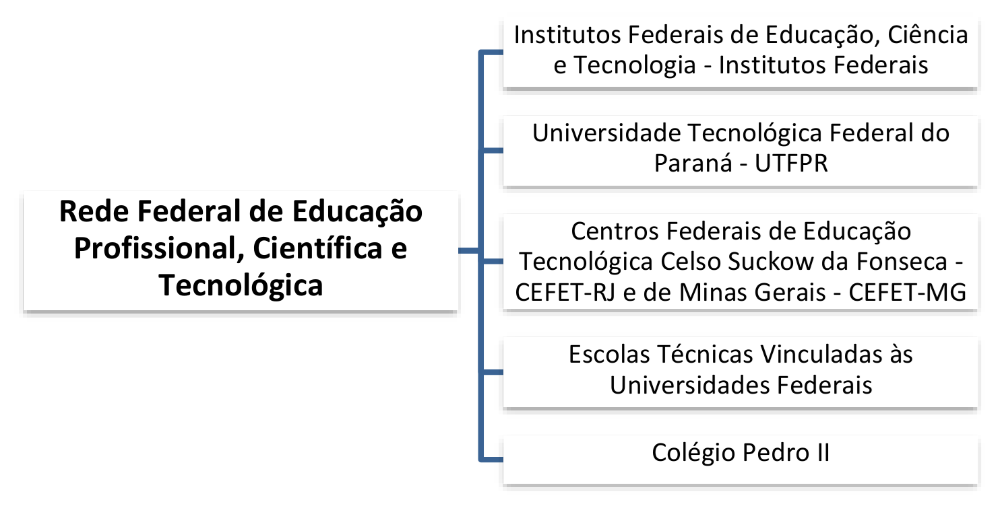

# Capítulo 3 – Lei nº 11.892/2008: Instituição da Rede Federal de Educação Profissional, Científica e Tecnológica

A Lei nº 11.892, de 29 de dezembro de 2008, representa um marco na história da educação profissional e tecnológica no Brasil. Foi por meio desta norma que se instituiu a **Rede Federal de Educação Profissional, Científica e Tecnológica**, uma iniciativa de grande envergadura que reorganizou e expandiu a oferta de educação pública, gratuita e de qualidade, com foco no desenvolvimento local e regional.

## A Instituição e a Composição da Rede Federal

O art. 1º da Lei estabelece a criação da Rede no âmbito do sistema federal de ensino, vinculada ao Ministério da Educação. A Rede não é uma única instituição, mas um arranjo cooperativo que congrega diferentes tipos de instituições de ensino, cada qual com suas particularidades, mas unidas pelo mesmo propósito.

> **Art. 1º** Fica instituída, no âmbito do sistema federal de ensino, a Rede Federal de Educação Profissional, Científica e Tecnológica, vinculada ao Ministério da Educação e constituída pelas seguintes instituições:
> 
> I - Institutos Federais de Educação, Ciência e Tecnologia - Institutos Federais;
> II - Universidade Tecnológica Federal do Paraná - UTFPR;
> III - Centros Federais de Educação Tecnológica Celso Suckow da Fonseca - CEFET-RJ e de Minas Gerais - CEFET-MG;
> IV - Escolas Técnicas Vinculadas às Universidades Federais; e
> V - Colégio Pedro II.

É fundamental compreender o que é a Rede Federal e quais são as instituições que a integram. Basicamente, a Rede congrega as escolas federais de educação profissional e tecnológica, conforme ilustrado a seguir:

Com exceção das Escolas Técnicas Vinculadas às Universidades Federais (cuja autonomia é exercida por meio da universidade a que pertencem), todas as demais instituições da Rede possuem **natureza jurídica de autarquia**. Isso significa que são entidades da administração pública indireta, criadas por lei, com patrimônio e receita próprios, e detentoras de **autonomia administrativa, patrimonial, financeira, didático-pedagógica e disciplinar**.

## Os Institutos Federais de Educação, Ciência e Tecnologia (IFs)

Os Institutos Federais são a grande inovação e o pilar da Lei nº 11.892/2008. Eles foram criados, em sua maioria, a partir da transformação e da unificação de antigos Centros Federais de Educação Tecnológica (CEFETs), Escolas Agrotécnicas e Escolas Técnicas. O art. 2º da Lei os define da seguinte forma:

> **Art. 2º** Os Institutos Federais são instituições de educação superior, básica e profissional, **pluricurriculares** e **multicampi**, especializados na oferta de educação profissional e tecnológica nas diferentes modalidades de ensino, com base na conjugação de conhecimentos técnicos e tecnológicos com as suas práticas pedagógicas, nos termos desta Lei.

Analisando a definição, temos que os IFs são:

- **Pluricurriculares:** Oferecem uma vasta gama de cursos em diferentes áreas do saber e em todos os níveis de ensino, desde a formação inicial e continuada de trabalhadores, passando pelos cursos técnicos de nível médio, até a graduação (tecnológica, licenciaturas e bacharelados) e a pós-graduação (_lato_ e _stricto sensu_).
- **Multicampi:** Possuem uma estrutura descentralizada, com um campus Reitoria e diversos outros _campi_ espalhados pelo interior dos estados, promovendo a interiorização da educação federal.

Para fins de regulação, avaliação e supervisão, os Institutos Federais são **equiparados às universidades federais**. Isso lhes confere, por exemplo, autonomia para criar e extinguir cursos, bem como para registrar os diplomas que expedem, mediante autorização de seu Conselho Superior.

## As Instituições com Características Peculiares

Além dos Institutos Federais, a Rede é composta por outras instituições com características históricas e organizacionais distintas:

- **A Universidade Tecnológica Federal do Paraná (UTFPR):** É a única instituição do país com o status de "Universidade Tecnológica". Originada da transformação do antigo CEFET-PR, ela é configurada como uma universidade especializada, com foco nas engenharias e na tecnologia.
- **Os CEFET-RJ e CEFET-MG:** Em razão de sua tradição e relevância histórica, os Centros Federais de Educação Tecnológica do Rio de Janeiro e de Minas Gerais foram mantidos com sua nomenclatura e estrutura originais, não sendo transformados em Institutos Federais.
- **O Colégio Pedro II:** Instituição de ensino de grande prestígio, localizada no Rio de Janeiro, é especializada na oferta de educação básica (do ensino fundamental ao médio) e de licenciaturas. Para fins de autonomia e gestão, a lei o equipara aos Institutos Federais.

