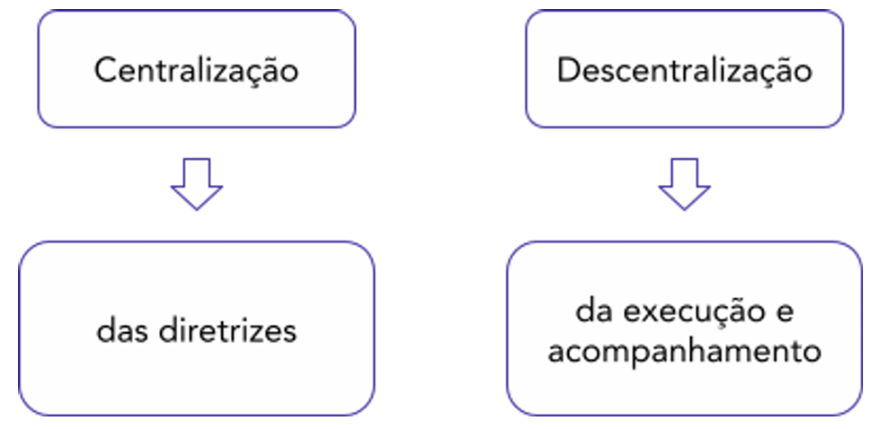

# Capítulo 4 – Portaria MGI nº 6.719/2024: Plano Federal de Prevenção e Enfrentamento do Assédio e da Discriminação na Administração Pública Federal

A Portaria MGI nº 6.719, de 13 de setembro de 2024, representa um marco normativo no âmbito da gestão de pessoas na Administração Pública Federal. Ela institui o **Plano Federal de Prevenção e Enfrentamento do Assédio e da Discriminação**, estabelecendo uma política pública robusta e integrada que transcende a abordagem meramente punitiva, focando na construção de uma cultura organizacional de respeito, dignidade e segurança psicológica no ambiente de trabalho.

## Instituição, Abrangência e Objetivo Geral do Plano Federal

A portaria estabelece um conjunto de diretrizes e ações coordenadas com o objetivo de promover ambientes de trabalho livres de assédio, discriminação e outras formas de violência. Para isso, o plano se estrutura sobre cinco pilares de atuação: **prevenção, acolhimento, apuração, responsabilização e autocomposição de conflitos**.

- **Âmbito de Aplicação:** A portaria e o plano federal se aplicam a todos os órgãos e entidades da **administração pública federal direta** (Ministérios, Secretarias da Presidência, etc.), suas **autarquias** (INSS, IBAMA, Universidades Federais, etc.) e **fundações públicas federais** (FUNAI, IBGE, etc.).

## Objetivos Específicos e Diretrizes Gerais

Para alcançar seu objetivo maior de erradicar a violência no trabalho, o Plano Federal persegue os seguintes objetivos específicos:

- **Desenvolver ações coordenadas para prevenir o assédio e a discriminação**, por meio de estratégias educativas, como cursos e campanhas de sensibilização para todos os agentes públicos.
- **Fomentar a gestão humanizada** nos espaços institucionais, incentivando lideranças pautadas pelo respeito, empatia e comunicação clara.
- **Estruturar instâncias de acolhimento e escuta ativa**, criando canais seguros e confidenciais para que as pessoas afetadas possam relatar o ocorrido e receber orientação e apoio psicossocial.
- **Assegurar sigilo e proteção contra retaliação**, garantindo que as pessoas que denunciam não sofram perseguições, exposições ou prejuízos em sua carreira.
- **Evitar a revitimização nos procedimentos correcionais**, assegurando que a apuração dos fatos seja conduzida de forma empática e respeitosa, sem submeter a vítima a constrangimentos ou a um novo ciclo de sofrimento.
- **Garantir a efetividade do programa** por meio da integração e da cooperação entre os diversos órgãos e entidades da Administração.

Um princípio fundamental que perpassa toda a execução do plano é a adoção do uso de **linguagem inclusiva e não violenta** em todas as suas fases e documentos.

### As Diretrizes Gerais do Plano

O art. 3º da Portaria elenca as diretrizes que devem nortear todas as ações de prevenção e enfrentamento:

- **Compromisso institucional:** A alta administração de cada órgão deve demonstrar, por meio de atos e comunicações, seu total comprometimento com a política de tolerância zero ao assédio e à discriminação.
- **Universalidade:** O plano se aplica a todas as pessoas que atuam no ambiente de trabalho, independentemente de cargo, hierarquia, tipo de vínculo ou regime de contratação.
- **Acolhimento:** A primeira resposta a uma denúncia deve ser de acolhimento e suporte à pessoa vitimada, e não de dúvida ou burocracia.
- **Comunicação não violenta:** Fomento a uma cultura de diálogo baseada no respeito mútuo, na escuta ativa e na empatia.
- **Integralização:** A política de enfrentamento ao assédio deve estar integrada às demais políticas de gestão de pessoas, saúde e segurança do trabalho.
- **Resolutividade:** Os procedimentos de apuração e acolhimento devem ser céleres, eficazes e conduzir a resultados concretos.
- **Confidencialidade:** O sigilo das informações e a proteção da identidade dos envolvidos devem ser garantidos em todas as etapas.
- **Transversalidade:** O tema deve ser tratado de forma contínua e em todos os níveis e setores da organização, não se restringindo a um único departamento.

## A Estrutura de Execução e Implementação do Plano

A portaria estabelece um prazo e uma estrutura de governança para a implementação do plano em toda a Administração Pública Federal.

- **Dever de Implementação:** O art. 4º determina que todos os órgãos e entidades abrangidos pela norma deverão **aprovar e publicar seus próprios planos específicos** de prevenção e enfrentamento, ou revisar os já existentes, no prazo máximo de **120 (cento e vinte) dias** a contar da publicação da portaria.
- **A Rede Federal de Execução:** Para garantir a coesão e a eficácia do plano em nível nacional, o art. 5º prevê sua execução por meio de uma **Rede Federal**, composta por três níveis:
    1. O **Comitê Gestor do Plano Federal**, de âmbito nacional, responsável pela coordenação geral, estabelecimento de diretrizes e monitoramento dos resultados.
    2. Os **Comitês Estaduais de Acompanhamento**, responsáveis por apoiar e monitorar a implementação do plano nos órgãos e entidades em cada estado.
    3. Os próprios **órgãos e entidades** da administração pública federal, que são a ponta da execução, responsáveis por implementar seus planos específicos e promover as ações no dia a dia.

## Plano Federal de Prevenção e Enfrentamento do Assédio e da Discriminação (Anexo I)

O Anexo I da Portaria MGI nº 6.719/2024 detalha o conteúdo e o alcance do Plano Federal de Prevenção e Enfrentamento do Assédio e da Discriminação (PFPEAD). Ele representa o núcleo da política, estabelecendo sua filosofia, seus conceitos e suas linhas de ação.

### Finalidades e Princípios Basilares

A finalidade do Plano Federal é a busca por ambientes de trabalho seguros e saudáveis, nos quais os direitos humanos e a dignidade de todas as pessoas sejam integralmente respeitados. Para tanto, o plano propõe-se a **erradicar todas as formas de violência** oriundas das relações de trabalho, com especial atenção a três condutas centrais: o assédio moral, o assédio sexual e a discriminação.

> **Conceitos-Chave: Assédio Moral, Assédio Sexual e Discriminação**
> 
> É fundamental compreender a definição de cada uma destas condutas para a correta aplicação do plano:
> 
> - **Assédio Moral:** É a exposição de agentes públicos a situações humilhantes e constrangedoras, de forma **repetitiva e prolongada**, no exercício de suas funções. É uma conduta que visa desestabilizar a vítima emocional e profissionalmente, atentando contra sua dignidade.
>     - **Exemplos:** Atribuir tarefas impossíveis de serem cumpridas; delegar tarefas muito abaixo da competência do servidor com o intuito de humilhar; isolar o servidor de seus colegas; espalhar boatos; criticar o trabalho de forma excessiva e depreciativa em público.
>
> - **Assédio Sexual:** É a conduta de natureza sexual, manifestada de forma verbal, não verbal ou física, **não desejada pela vítima**, com o objetivo de perturbar ou constranger, ou de obter vantagem ou favorecimento sexual. Pode ocorrer mesmo que não haja hierarquia entre o assediador e a vítima.
>     - **Exemplos:** Comentários e piadas de conotação sexual; convites impertinentes e insistentes; contato físico não consentido; exibição de material pornográfico; chantagem para a obtenção de favores sexuais em troca de benefícios na carreira.
>
> - **Discriminação:** É toda distinção, exclusão, restrição ou preferência baseada em raça, cor, etnia, sexo, orientação sexual, identidade de gênero, idade, religião, deficiência, opinião política ou qualquer outra característica, que tenha o efeito de anular ou prejudicar o tratamento igualitário no ambiente de trabalho.

O PFPEAD visa, ainda, à consolidação da **integridade** na Administração Pública Federal. Um ambiente de trabalho com práticas de assédio e discriminação é, por definição, um ambiente com baixa integridade. Portanto, combater essas violências é uma ação central para o fortalecimento da ética e do caráter público das instituições.

A abordagem do plano não é meramente reativa. As medidas propostas são centradas na compreensão e na **erradicação das causas fundamentais** da discriminação e do assédio, promovendo uma cultura organizacional que valorize o respeito, a inclusão, a diversidade, a equidade e a acessibilidade.

> **Ponto de Atenção: A Proteção de Grupos Historicamente Vulnerabilizados**
> 
> O Plano dedica especial atenção à proteção de grupos que, por razões históricas e estruturais, são desproporcionalmente impactados por processos de trabalho excludentes e discriminatórios. São eles: **mulheres, pessoas negras, indígenas, pessoas idosas, pessoas com deficiência e pessoas LGBTQIA+**.
> 
> Ao fazer esta menção expressa, a norma adota um enfoque de **equidade**, reconhecendo que um tratamento formalmente igual para todos pode ser insuficiente para proteger aqueles que são alvos mais frequentes de violência e discriminação. A política, portanto, deve ser sensível a essas vulnerabilidades específicas.

### As Definições Fundamentais

Para a correta e uniforme aplicação da política de prevenção e enfrentamento, a Portaria estabelece um conjunto de definições-chave. A adoção de um vocabulário comum é essencial para que todos os agentes públicos, gestores e membros de comissões possam identificar, classificar e tratar as ocorrências de assédio e discriminação com segurança jurídica e precisão técnica.

O Plano Federal e os planos específicos de cada órgão deverão considerar as seguintes definições:

**Assédio Moral:** Conduta praticada no ambiente de trabalho, por meio de gestos, palavras faladas ou escritas ou comportamentos que exponham a pessoa a situações humilhantes e constrangedoras, capazes de lhes causar ofensa à personalidade, à dignidade e à integridade psíquica ou física, degradando o clima de trabalho e colocando em risco sua vida profissional.

O assédio moral caracteriza-se pela **reiteração** e **sistematização** de uma conduta hostil. Não se confunde com um conflito pontual ou com o exercício regular do poder hierárquico (como uma crítica construtiva ao trabalho). É uma violência psicológica deliberada e contínua.

- **Exemplos:** Isolar um servidor do convívio social da equipe; sonegar-lhe informações essenciais para a realização de seu trabalho; atribuir-lhe apelidos depreciativos; sobrecarregá-lo com tarefas excessivas ou, ao contrário, deixá-lo sem nenhuma atividade (a chamada "geladeira").

**Assédio Moral Organizacional:** Processo de condutas abusivas ou hostis, amparado por estratégias organizacionais ou métodos gerenciais que visem a obter engajamento intensivo ou a excluir pessoas que exercem atividade pública as quais a instituição não deseja manter em seus quadros, por meio do desrespeito aos seus direitos fundamentais.

Nesta modalidade, a violência não parte de um indivíduo isolado, mas da própria **estrutura ou estratégia de gestão** da organização. O assédio é utilizado como uma ferramenta gerencial para atingir determinados fins, como o aumento da produtividade a qualquer custo ou o estímulo a pedidos de remoção de servidores.

- **Exemplo:** A chefia de um setor que estabelece metas abusivas e inatingíveis e, de forma sistemática, expõe publicamente o ranking de desempenho dos servidores, humilhando os que ficam nas últimas posições, pratica assédio moral organizacional.

**Assédio Sexual:** Conduta de conotação sexual praticada no exercício profissional ou em razão dele, manifestada fisicamente ou por palavras, gestos ou outros meios, proposta ou imposta à pessoa contra sua vontade, causando-lhe constrangimento e violando a sua liberdade sexual.

O elemento central do assédio sexual é a **ausência de consentimento** da vítima. A conduta não é desejada e cria um ambiente de trabalho hostil, intimidatório ou ofensivo. Pode ocorrer entre colegas de mesma hierarquia, de um superior para um subordinado (assédio vertical descendente) ou de um subordinado para um superior (assédio vertical ascendente).

**Outras condutas de natureza sexual inadequadas:** Expressão representativa de condutas sexuais impróprias, de médio ou baixo grau de reprovabilidade.

Esta é uma categoria residual que abarca comportamentos que, embora não se configurem como assédio sexual, são inadequados para o ambiente de trabalho e contribuem para a degradação do clima organizacional.

- **Exemplos:** Contar piadas de cunho sexual, fazer comentários de duplo sentido ou elogios sobre a aparência física de colegas de forma a causar constrangimento.

**Discriminação:** Compreende toda distinção, exclusão, restrição ou preferência fundada na raça, etnia, cor, sexo, religião, deficiência, opinião política, ascendência nacional, origem social, idade, orientação sexual, identidade e expressão de gênero, ou qualquer outra que atente contra o reconhecimento ou exercício em condições de igualdade de direitos e liberdades fundamentais nos campos econômico, social, cultural, laboral ou em qualquer campo da vida pública.

A discriminação se manifesta em atos que, baseados em preconceito, negam oportunidades ou dispensam tratamento desigual a pessoas ou grupos.

- **Exemplos:** Deixar de promover uma servidora qualificada por ela ser mãe de filhos pequenos (discriminação de gênero); atribuir a servidores negros apenas tarefas de menor prestígio (discriminação racial); não realizar adaptações razoáveis na estação de trabalho de um servidor com deficiência (discriminação por deficiência).

**Rede de Acolhimento:** Espaços institucionais responsáveis por realizar uma primeira escuta da situação, prestar informações e esclarecimentos, orientar e acolher as vítimas, informando os princípios deste PFPEAD.

Não se trata de um único órgão, mas de uma **rede de unidades** que devem atuar de forma integrada para dar suporte às vítimas, como as unidades de gestão de pessoas, ouvidorias, comissões de ética, assessorias de participação social e diversidade, gestoras e gestores, unidades do Subsistema Integrado de Atenção à Saúde do Servidor Público Federal (SIASS), quando houver, dentre outras que existirem na instituição.

**Organização do Trabalho e Saúde no Trabalho:** A portaria define estes termos para reforçar que a prevenção ao assédio passa, necessariamente, pela promoção de uma organização do trabalho saudável e pela garantia do bem-estar físico, mental e social dos agentes públicos:

- **Organização do Trabalho**: conjunto de normas, instruções, práticas e processos que modulam as relações hierárquicas e as competências das pessoas envolvidas, os mecanismos de deliberação, a divisão do trabalho, o conteúdo das tarefas, os modos operatórios, os critérios de qualidade e de desempenho.
- **Saúde no trabalho**: dinâmica de construção contínua, em que estejam assegurados os meios e condições para a construção de uma trajetória em direção ao bem-estar físico, mental e social, considerada em sua relação específica e relevante com o trabalho.

### As Diretrizes Gerais

Para que os objetivos do Plano Federal sejam alcançados de forma coesa e eficaz, a Portaria estabelece, em seu art. 3º, um conjunto de diretrizes. Estes são os princípios basilares que devem orientar e informar todas as políticas, estratégias e ações de prevenção e enfrentamento do assédio e da discriminação no serviço público.

Para fins do disposto no Plano, deverão ser observados os seguintes conceitos:

**Compromisso institucional:** Promoção de ambiente organizacional de respeito à diversidade e à inclusão, baseada em políticas, estratégias e métodos gerenciais que favoreçam o desenvolvimento de ambientes de trabalho seguros e saudáveis.

Esta diretriz estabelece que a responsabilidade pelo combate ao assédio começa no topo da hierarquia. O chamado "tom no topo" é fundamental. Não basta a existência de normas, é preciso que os dirigentes máximos de cada órgão demonstrem, por meio de atos, discursos e alocação de recursos, um compromisso visível e inequívoco com a criação de uma cultura de respeito.

**Universalidade:** Inclusão de todas as pessoas na esfera de proteção do presente Plano, incluindo servidoras e servidores efetivos, temporárias e temporários, comissionadas e comissionados, empregadas públicas e empregados públicos, estagiárias e estagiários, e trabalhadoras e trabalhadores terceirizados.

A proteção contra o assédio e a discriminação não faz distinção de vínculo. A norma deixa claro que todas as pessoas que compartilham o ambiente de trabalho, sejam elas servidoras estatutárias, celetistas, comissionadas, temporárias, estagiárias ou trabalhadoras de empresas terceirizadas, estão sob o amparo da política e devem ter acesso aos mesmos canais de acolhimento e denúncia.

**Acolhimento:** Ações de escuta, fornecimento e esclarecimento de informações sobre caminhos possíveis para soluções focadas na pessoa assediada ou discriminada.

O primeiro contato de uma pessoa que sofreu violência com a instituição deve ser de acolhimento, e não de julgamento ou burocracia. Esta diretriz orienta que as instâncias da Rede de Acolhimento pratiquem a escuta ativa e empática, validando o sofrimento da vítima e oferecendo-lhe, de forma clara e objetiva, todas as informações sobre os caminhos disponíveis, sejam eles de mediação, de apuração formal ou de suporte à saúde.

**Comunicação não violenta:** Utilização de linguagem positiva, inclusiva e não estigmatizante, manifestada pelo compartilhamento da observação de um fato e pela expressão de sentimentos e necessidades.

Esta diretriz deve permear todas as interações no âmbito do plano, desde as campanhas de sensibilização até a condução dos procedimentos de apuração, evitando o uso de linguagem que culpabilize a vítima ou estigmatize os envolvidos, e fomentando o diálogo respeitoso.

**Integralização:** O atendimento e o acompanhamento dos casos de assédio e discriminação serão orientados por abordagem sistêmica e fluxos de trabalho integrados entre as unidades e especialidades profissionais.

O assédio não é um problema isolado de uma única área. Ele tem reflexos na gestão de pessoas, na saúde do servidor, na ética e na correição. A integralização exige que as diversas unidades da Rede de Acolhimento (Gestão de Pessoas, Ouvidoria, Comissão de Ética, SIASS, etc.) atuem de forma coordenada, compartilhando informações (respeitado o sigilo) e construindo um fluxo de atendimento que ampare a vítima em todas as suas dimensões.

**Resolutividade:** O tratamento correcional das denúncias de assédio ou discriminação deverá ser célere, controlado e definido como prioritário.

Esta diretriz visa combater a morosidade e a sensação de impunidade. Os procedimentos de apuração de assédio e discriminação devem ter prioridade de tramitação, com prazos definidos e rigorosamente controlados, para que se chegue a uma solução efetiva em tempo razoável.

**Confidencialidade:** As identidades de todas as partes envolvidas, incluindo as testemunhas, deverão ser protegidas a fim de evitar exposição ou retaliações. O sigilo e a confidencialidade das informações fornecidas deverão ser assegurados.

A garantia do sigilo é essencial para encorajar as denúncias. As pessoas precisam se sentir seguras de que, ao relatarem uma situação de violência, não serão expostas ou revitimizadas por fofocas e que não sofrerão retaliações por parte do denunciado.

**Transversalidade:** A abordagem das situações de assédio e discriminação deverá levar em conta sua relação com a organização, a gestão do trabalho e suas dimensões sociocultural, institucional e individual.

Esta diretriz reconhece que o assédio e a discriminação raramente são apenas um problema de conduta individual ("maçãs podres"). Muitas vezes, são sintomas de falhas mais profundas na cultura organizacional, nas práticas de gestão ou na forma como o trabalho é estruturado. A abordagem, portanto, deve ser transversal, analisando e corrigindo também essas causas estruturais.

### Prevenção: Construindo uma Cultura de Respeito

De acordo com o item 4 do Anexo I da Portaria, as ações de prevenção do assédio e da discriminação são elementos essenciais para consolidar uma cultura organizacional que valorize o respeito às diferenças, à equidade e à diversidade, e que internalize a compreensão dos conceitos e das práticas aceitáveis nos ambientes de trabalho.

A abordagem central do plano é proativa. Em vez de apenas remediar os danos após a ocorrência da violência, o foco principal é na criação de uma cultura que impeça o surgimento e a proliferação de condutas de assédio e discriminação. Para isso, o plano se estrutura sobre três ferramentas de prevenção:

- **Ações de formação;**
- **Ações de sensibilização;** e
- **Ações de promoção da saúde e prevenção de riscos e agravos.**

A seguir, detalharemos a primeira e mais robusta dessas ferramentas.

#### A) Ações de Formação e de Capacitação

A formação e a capacitação contínua de todos os agentes públicos são consideradas o pilar para a transformação da cultura organizacional. A portaria estabelece uma série de diretrizes para garantir que o tema seja tratado de forma transversal e permanente.

- **Integração nos Instrumentos Estratégicos de Gestão:** Os órgãos do Sistema de Pessoal Civil da Administração Federal (SIPEC) deverão incorporar a temática em seus instrumentos estratégicos, garantindo que a prevenção ao assédio seja uma prioridade formal da gestão de pessoas em toda a Administração. Os documentos que devem refletir esse compromisso são:
    - A **Política Nacional de Desenvolvimento de Pessoas (PNDP)**;
    - Os **Planos de Desenvolvimento de Pessoas (PDP)** de cada órgão e entidade; e
    - Os **Planos de Integridade**.

- **Formação em Todas as Etapas da Vida Funcional:** Os órgãos, entidades e as Escolas de Governo deverão contemplar as temáticas de prevenção do assédio e da discriminação em todos os momentos da carreira do servidor, assegurando uma abordagem contínua:
    - Na **formação inicial** dos novos servidores;
    - Na **ambientação** das servidoras e dos servidores públicos federais em estágio probatório; e
    - **Ao longo de toda sua jornada laboral**, por meio de ações de educação continuada.

- **O Papel Estratégico das Escolas de Governo:** As Escolas de Governo, como a ENAP, têm a responsabilidade de propiciar formação continuada e especializada para os membros da **Rede de Acolhimento** e da **Rede Federal de Governança** do PFPEAD. Essa capacitação deve abranger temas como a elaboração de protocolos internos, a realização de campanhas de prevenção, e as técnicas de escuta, acolhimento, encaminhamento de providências e responsabilização. Adicionalmente, é previsto o **letramento obrigatório de gênero, raça, diversidade e inclusão** para essas equipes.

- **Conteúdos Gerais e Obrigatórios da Formação:** As ações de formação e de capacitação destinadas a todos os agentes públicos deverão abordar temas essenciais, considerando as realidades do trabalho presencial e do teletrabalho:
    - O assédio, a discriminação e suas **repercussões jurídicas e gerenciais**;
    - A **gestão participativa e humanizada**;
    - A **comunicação não violenta**;
    - A **intervenção da espectadora e do espectador** (Bystander Intervention), capacitando os agentes a agirem de forma segura ao presenciarem uma situação de violência;
    - E, de forma obrigatória, o **letramento étnico-racial, de gênero, e demais formas de discriminação e suas interseccionalidades**.

- **Formação Específica para Lideranças:** Ocupantes de cargos de liderança, em qualquer nível hierárquico, deverão participar de **formação complementar específica e periódica**, com conteúdo adequado às suas responsabilidades como gestoras e gestores de equipes na prevenção e no enfrentamento do assédio.

- **Monitoramento e Registro:** Como forma de monitoramento, os relatórios anuais dos Planos de Desenvolvimento de Pessoas (PDP) de cada órgão deverão consolidar e apresentar as ações formativas realizadas sobre o tema, contendo a **carga horária** destinada a essa capacitação no período.

- **Temas Práticos para o Desenvolvimento da Capacitação:** Para materializar esses objetivos, a capacitação promoverá o desenvolvimento de temas direcionados à rotina de trabalho, capacitando os agentes públicos a como:
    - **como promover modelo de gestão cooperativo, humanizado e não violento nos ambientes de trabalho tanto físicos quanto virtuais**, envolvendo todas as servidoras e servidores e demais trabalhadoras e trabalhadores com qualquer vínculo, tais como terceirizadas e terceirizados, estagiárias e estagiários, bolsistas e outros;
    - **como utilizar a comunicação não violenta e a escuta ativa** na rotina de trabalho;
    - **como identificar o racismo, o machismo, a misoginia, o etarismo, o capacitismo e a LGBTfobia** em suas diversas formas de manifestação e dimensões no ambiente de trabalho;
    - **como identificar situações** de assédio moral, assédio sexual e discriminação;
    - **como agir diante de situação de assédio moral, assédio sexual e discriminação** com base em fluxograma de acolhimento, recebimento e encaminhamento de denúncias; e
    - **como interromper situações** de assédio moral, assédio sexual e discriminação.

- **Prioridade na Capacitação:** Os membros da **Rede de Acolhimento** e da **Rede Federal de Prevenção e Enfrentamento do Assédio e da Discriminação** terão **prioridade** no processo de formação e deverão, obrigatoriamente, participar de capacitação específica com temáticas voltadas para a escuta ativa, riscos psicossociais do trabalho, métodos de prevenção e resolução de conflitos, saúde no trabalho, entre outros temas afins.

#### B) Ações de Sensibilização

Enquanto as ações de formação e capacitação se aprofundam no conhecimento técnico e no desenvolvimento de competências específicas, as **ações de sensibilização** têm como objetivo alcançar um público mais amplo, visando transformar a percepção coletiva, disseminar informações essenciais e promover uma reflexão sobre a importância de um ambiente de trabalho respeitoso.

A sensibilização deverá ser realizada por meio de uma diversidade de canais e formatos, como **campanhas, materiais informativos, eventos, ações culturais, artísticas ou lúdicas**, e outras formas de comunicação que possam engajar o maior número possível de pessoas que exercem atividade pública, de forma acessível e impactante.

- **Exemplos Práticos:** Ações de sensibilização podem incluir a fixação de cartazes informativos nos espaços comuns, a realização de palestras com especialistas durante a Semana de Prevenção ao Assédio, a exibição de filmes ou peças teatrais sobre o tema, ou a criação de _quizzes_ e jogos interativos na intranet do órgão.

Para garantir a continuidade e a seriedade dessas ações, a norma determina que os **Planos de Comunicação** dos órgãos e entidades do SIPEC deverão prever, em seu planejamento anual, ações periódicas de disseminação e compreensão da temática.

As ações de sensibilização deverão ter como objetivo a promoção de:

- **Equidade e combate a todas as formas de discriminação e de assédio**, reforçando o compromisso institucional com a tolerância zero a essas práticas.
- **Campanhas educativas e conteúdos informativos com linguagem não violenta, inclusiva e acessível**, garantindo que a mensagem seja compreendida por todas as pessoas, independentemente de seu nível de letramento sobre o tema.
- **Ações voltadas à qualidade de vida no trabalho**, pois um ambiente com bem-estar e saúde mental é, por natureza, um ambiente mais resistente ao surgimento de condutas de assédio.
- **Informação e conhecimento acerca das práticas de assédio e discriminação** com recortes específicos de gênero, raça e de outros grupos vulnerabilizados, bem como a divulgação das políticas e dos canais para o seu enfrentamento.

Por fim, o plano estabelece a necessidade de **avaliar o resultado** das ações de sensibilização e de formação. Isso deve ser feito por meio da análise de **dados quantitativos** (como o número de participantes em um evento) e, principalmente, de seus **impactos**, que podem ser medidos por meio de pesquisas de clima organizacional ou da análise da evolução do número e da natureza das denúncias recebidas, por exemplo.

#### C) Ações de Promoção da Saúde e Prevenção de Riscos e Agravos

Esta terceira ferramenta de prevenção parte de um princípio fundamental: o assédio e a discriminação não são apenas desvios de conduta, mas também graves **fatores de risco psicossocial** que afetam diretamente a saúde física e mental dos agentes públicos. Ambientes de trabalho tóxicos são causa direta de adoecimento, gerando estresse crônico, ansiedade, depressão e outros agravos que resultam em absenteísmo (faltas ao trabalho) e na queda da qualidade do serviço prestado.

Diante disso, o plano estabelece que a promoção da saúde no trabalho é uma estratégia de prevenção essencial.

- **O Papel do Órgão Central e do SIASS:** O órgão central do SIPEC, por meio das unidades do **Subsistema Integrado de Atenção à Saúde do Servidor (SIASS)**, tem a responsabilidade de estruturar políticas e protocolos para **identificar e monitorar** de forma sistêmica as situações de adoecimento que possam ser decorrentes de práticas de assédio e discriminação. O objetivo é dar ao SIASS um papel proativo, que vá além da concessão de licenças médicas, atuando também na identificação das causas organizacionais do sofrimento no trabalho.
- **As Responsabilidades dos Órgãos e Entidades:** Cada órgão e entidade do SIPEC deverá adotar medidas concretas com vista à promoção da saúde, destacando-se duas ações principais:
    1. **Realizar levantamento e monitoramento periódicos do clima organizacional** e da qualidade de vida no trabalho. Isso se materializa, por exemplo, na aplicação de **Pesquisas de Clima Organizacional** anônimas, capazes de medir a percepção dos servidores sobre a gestão, o respeito nas relações interpessoais e a ocorrência de práticas de assédio. Os resultados dessas pesquisas funcionam como um diagnóstico, permitindo identificar os setores mais vulneráveis e redirecionar as ações de prevenção.
    2. **Estruturar programas de promoção da saúde e prevenção de agravos e riscos no ambiente de trabalho.** Isso inclui o desenvolvimento de projetos, estratégias e práticas que promovam ambientes e relações de trabalho mais inclusivos, seguros e saudáveis, como programas de apoio à saúde mental, oficinas sobre gestão de estresse e a criação de protocolos claros para lidar com os riscos psicossociais identificados.

#### O Ciclo Virtuoso da Prevenção

As três ferramentas de prevenção – formação, sensibilização e promoção da saúde – não são ações isoladas. A portaria prevê que elas devem se **retroalimentar**, estabelecendo um ciclo virtuoso de melhoria contínua.

- **Exemplo Prático:** Uma **Pesquisa de Clima Organizacional** (ação de saúde) revela que, em determinado setor, há uma alta percepção de práticas de machismo e misoginia. Este dado subsidia as outras ferramentas: a área de comunicação pode lançar uma **campanha de sensibilização** (ferramenta 2) focada no combate ao sexismo no ambiente de trabalho, enquanto a área de gestão de pessoas pode desenvolver uma **ação de formação** (ferramenta 1) obrigatória para as lideranças daquele setor sobre equidade de gênero. As ações, portanto, se tornam mais focadas e eficazes.

### Acolhimento: Suporte e Orientação

O **acolhimento** é o eixo do plano que se destina a criar um ambiente seguro e de confiança para as pessoas que vivenciaram ou testemunharam situações de assédio e discriminação. Seu objetivo não é a apuração ou a punição, mas sim a escuta qualificada, o suporte humanizado e a orientação sobre os caminhos disponíveis para a resolução do conflito e a reparação do dano.

#### A) A Rede de Acolhimento

Para que o acolhimento seja eficaz, a portaria prevê que ele não será responsabilidade de um único setor, mas de uma **Rede de Acolhimento** integrada por diversas instâncias já existentes na estrutura dos órgãos e entidades. A ideia é que diferentes portas de entrada estejam abertas para a vítima, que poderá buscar o canal com o qual se sentir mais confortável.

Nos termos do item 5.1 do Anexo I, constituirão potencialmente a Rede de Acolhimento:

- **Unidades de gestão de pessoas:** Responsáveis por orientar sobre direitos, deveres e procedimentos administrativos, como a solicitação de remoção por motivo de saúde.
- **Ouvidorias:** O canal formal para o registro de denúncias que podem dar início a procedimentos correcionais.
- **Comissões de Ética:** Responsáveis pela análise da conduta sob a ótica da ética pública, podendo aplicar as sanções previstas no Código de Ética.
- **Assessorias de Participação Social e de Diversidade:** Unidades especializadas na promoção de políticas de inclusão e na análise de questões que envolvem grupos vulnerabilizados.
- **Gestoras e Gestores:** A primeira linha de contato. As lideranças devem ser capacitadas para realizar uma escuta inicial e encaminhar a pessoa aos canais adequados da Rede.
- **Unidades do SIASS:** O braço de saúde da Rede, responsável por oferecer o suporte médico e psicológico necessário à pessoa em sofrimento.

A Rede de Acolhimento terá por **finalidade**:

- **Prestar esclarecimentos e informações** sobre o que caracteriza o assédio e a discriminação, e sobre os fluxos e procedimentos do plano.
- **Acolher as pessoas afetadas**, praticando a escuta ativa e empática, sem prejulgamentos.
- **Buscar soluções sistêmicas**, analisando os casos para identificar padrões que possam indicar a necessidade de mudanças na gestão ou na organização do trabalho.
- **Orientar a pessoa para atendimento especializado**, quando for o caso, como o encaminhamento para serviços de saúde ou assistência jurídica.

Para fortalecer essa estrutura, cada órgão ou entidade poderá instituir uma **Comissão de Apoio ao Acolhimento**, com representação direta de servidoras e servidores e composição baseada no princípio da diversidade. A participação nesta comissão será considerada **prestação de serviço público relevante, não remunerada**, e suas diretrizes de funcionamento serão definidas pelo Comitê Gestor do Programa.

#### B) Os Canais e o Protocolo de Acolhimento

Para que a Rede de Acolhimento seja efetiva, é fundamental que existam canais de acesso claros, seguros e permanentemente disponíveis para todas as pessoas que necessitem de apoio.

Os órgãos e entidades do SIPEC têm o dever de manter e de dar ampla divulgação a esses canais, garantindo que todas as pessoas nos ambientes de trabalho saibam onde e como buscar ajuda. As Comissões de Apoio ao Acolhimento, onde forem constituídas, também deverão ser de amplo e fácil acesso.

##### O Ambiente de Atendimento: Criando um Espaço Seguro

O atendimento à pessoa que relata uma situação de assédio ou discriminação é um momento delicado, que exige a criação de um ambiente de segurança e confiança. A portaria estabelece requisitos específicos para este atendimento:

- **Ambiente Adequado e Acessível:** O atendimento deve ocorrer em um espaço, seja ele presencial ou virtual, que garanta a privacidade e a confidencialidade da conversa. Além disso, deve ser plenamente acessível a pessoas com deficiência.
- **Direito de Escolha do Local:** Em uma importante medida de proteção, a norma assegura à pessoa o direito de ser atendida em um órgão ou entidade de sua escolha, e não necessariamente em seu próprio local de trabalho, onde poderia se sentir intimidada ou constrangida.
- **Composição da Equipe de Atendimento:** Para promover a empatia e o conforto da pessoa acolhida, a equipe de atendimento deverá ter, **preferencialmente**, a presença de uma pessoa do mesmo gênero e/ou raça da vítima.

##### A Natureza do Atendimento e o Protocolo

As ações de acolhimento e escuta devem ser pautadas na **lógica do cuidado**, com foco na pessoa exposta aos riscos psicossociais, e não em uma lógica investigativa ou de julgamento. Para isso, a utilização de **linguagem não violenta** é obrigatória.

O atendimento deve ser apoiado, preferencialmente, por **profissionais da área da saúde** (como psicólogos e assistentes sociais), e todos os atendimentos realizados pela Rede de Acolhimento deverão, obrigatoriamente, seguir as diretrizes do **Protocolo de Acolhimento**, constante do Anexo II da Portaria.

##### A Articulação com a Esfera Penal

O plano reconhece que algumas condutas de assédio ou discriminação podem, também, configurar crimes. A portaria estabelece uma clara divisão de responsabilidades ao lidar com esses casos:

1. **Atuação da Rede de Acolhimento:** Caso o relato recebido no acolhimento apresente indícios de crime (como assédio sexual, injúria racial, etc.), a Rede de Acolhimento tem o dever de **esclarecer à pessoa denunciante** sobre a possibilidade de ela registrar a ocorrência na autoridade policial competente (como a Delegacia Especial de Atendimento à Mulher - DEAM ou a Delegacia de Crimes Raciais e Delitos de Intolerância - Decradi). A decisão de registrar a queixa na polícia, contudo, é da vítima.
2. **Atuação da Unidade de Correição:** Se os indícios de crime surgirem no curso de uma apuração correcional formal (Sindicância ou PAD), a unidade de correição tem o **dever de ofício** de encaminhar cópia dos autos ao **Ministério Público**, para que este tome as providências cabíveis na esfera criminal.

##### O Apoio de Parceiros Externos

Reconhecendo a complexidade do tema, a portaria autoriza que os órgãos e entidades do SIPEC celebrem **termos de cooperação técnica com universidades** ou **contratem serviços especializados** de acolhimento, sempre resguardado o sigilo das informações. O objetivo é apoiar e qualificar a Rede de Acolhimento, garantindo um atendimento realizado por equipes multiprofissionais, interdisciplinares e diversas.

#### C) As Medidas Acautelatórias

As **medidas acautelatórias**, conforme dispostas no item 5.3 do Anexo I, são um dos instrumentos mais importantes e inovadores do Plano Federal. Elas configuram **atos de gestão**, de caráter imediato, destinados a **preservar a integridade física e mental** da pessoa afetada pelo assédio ou pela discriminação.

É fundamental compreender as três características que definem a natureza destas medidas:

1. **São independentes da atividade correcional:** Elas podem e devem ser adotadas assim que o risco à saúde e ao bem-estar da pessoa for identificado, mesmo que uma apuração formal (Sindicância ou PAD) ainda não tenha sido iniciada, ou que jamais venha a ser. O foco é a proteção imediata.
2. **Não constituem penalidade:** As medidas acautelatórias não têm caráter punitivo. Seu objetivo é reorganizar a situação de trabalho para cessar ou mitigar a violência, e não sancionar o suposto agressor.
3. **Dependem da anuência da pessoa afetada:** Nenhuma medida acautelatória pode ser imposta à pessoa que sofreu a violência. Sua concordância é requisito indispensável, respeitando sua autonomia e evitando que a solução se torne um novo problema (a chamada revitimização).

> **Não Confunda: Medida Acautelatória vs. Afastamento Preventivo**
> 
> Embora ambos sejam instrumentos cautelares, suas finalidades e seus alvos são opostos:
> 
> - **Medida Acautelatória (Portaria MGI nº 6.719/2024):** É uma medida de proteção **em favor da pessoa vitimada**, para resguardar sua saúde e bem-estar.
> - **Afastamento Preventivo (Lei nº 8.112/1990):** É uma medida **contra o servidor acusado**, para impedi-lo de interferir na apuração de uma infração em um PAD.

O fluxo para a adoção de uma medida acautelatória se inicia na **Rede de Acolhimento**. Seus integrantes, ao realizarem a escuta, podem identificar a necessidade de uma intervenção imediata. Com a concordância da pessoa afetada, a Rede preencherá um formulário de avaliação de risco e o encaminhará à **unidade de gestão de pessoas** do órgão.

A unidade de gestão de pessoas, com base nesta avaliação e novamente com a anuência da pessoa afetada, poderá adotar ações como:

- A alteração da unidade de lotação da pessoa afetada, caso seja de seu interesse;
- O deferimento de teletrabalho em regime provisório;
- A alteração do turno de trabalho;
- O remanejamento do suposto agressor para outra equipe, como um ato de gestão para preservar o clima organizacional.

### Denúncia

Após o acolhimento inicial, o plano estabelece os canais e procedimentos formais para o registro da **denúncia**, ato que pode dar início aos procedimentos de apuração e responsabilização.

#### A) A Formalização da Denúncia

- **Legitimidade para Denunciar:** A legitimidade para apresentar uma denúncia é ampla. Ela pode ser feita por:
    1. Qualquer pessoa, **identificada ou não**, que se perceba alvo de assédio ou discriminação no trabalho.
    2. Qualquer pessoa, **identificada ou não**, que tenha conhecimento de fatos que possam caracterizar assédio ou discriminação (testemunhas, colegas, etc.).

- **O Canal Oficial: Ouvidoria e Plataforma Fala.BR:** O canal prioritário e oficial para o registro de denúncias é a **Ouvidoria** do órgão ou entidade, seja de forma presencial ou, preferencialmente, por meio da **Plataforma Integrada de Ouvidoria e Acesso à Informação (Fala.BR)**. Esta plataforma centralizada garante a padronização, o sigilo e a rastreabilidade das denúncias em todo o Poder Executivo Federal. Todas as denúncias recebidas por outros meios ou agentes públicos devem ser, obrigatoriamente, encaminhadas à Ouvidoria.
- **Articulação com a Rede de Acolhimento:** A Rede de Acolhimento deve orientar a pessoa sobre a possibilidade de registrar a denúncia na Plataforma Fala.BR. Caso a pessoa afetada não se sinta em condições de fazê-lo, a Rede poderá acionar a Ouvidoria para que a equipe desta realize o registro, desde que com o consentimento expresso da pessoa afetada.

#### B) A Proteção Contra a Retaliação

A retaliação é a "segunda violência" sofrida pela pessoa que denuncia. Consiste em qualquer ato prejudicial praticado contra a denunciante ou testemunha como forma de vingança ou intimidação. Por minar a confiança nos canais institucionais e perpetuar a cultura do silêncio, a retaliação é tratada pela legislação com extrema severidade.

A portaria estabelece que deverá ser assegurada à pessoa denunciante e às testemunhas **proteção contra ações ou omissões praticadas em retaliação**.

- **Registro e Apuração:** A ocorrência de um ato de retaliação deve ser registrada como uma nova denúncia na Plataforma Fala.BR, fazendo menção à denúncia original, e será encaminhada à **Controladoria-Geral da União (CGU)** para o devido processamento.
- **Exemplos de Atos de Retaliação:** A norma traz uma lista exemplificativa de condutas que podem configurar retaliação:
    - A demissão arbitrária;
    - A alteração injustificada de funções, atribuições ou local de trabalho (a chamada "geladeira");
    - A instauração de procedimentos correcionais infundados ou a imposição de sanções injustas;
    - A imposição de prejuízos remuneratórios ou materiais de qualquer espécie (como a negativa de uma promoção ou de diárias); e
    - A retirada de benefícios, diretos ou indiretos (como a exclusão de projetos ou de oportunidades de capacitação).

> **Ponto de Atenção: A Punição para a Retaliação**
> 
> A prática de ações ou omissões de retaliação contra denunciantes é considerada uma **falta disciplinar de natureza grave**. A Lei nº 13.608/2018, em seu art. 4º-C, sujeita o agente público que pratica a retaliação à penalidade de **demissão a bem do serviço público**, uma das sanções mais severas do regime disciplinar, que pode implicar em inelegibilidade para novos cargos públicos.

### Infrações, Procedimentos Disciplinares e Penalidades

Uma vez formalizada a denúncia junto à Ouvidoria, e havendo indícios de infração disciplinar, o caso avança para o eixo de **apuração e responsabilização**. Esta é a fase em que a **unidade correcional** do órgão ou entidade (a Corregedoria, por exemplo) assume a condução do processo, por meio dos instrumentos formais da Sindicância ou do Processo Administrativo Disciplinar (PAD), para apurar os fatos e, se for o caso, aplicar as penalidades cabíveis.

A Portaria MGI nº 6.719/2024 estabelece um conjunto de princípios e salvaguardas que devem ser, obrigatoriamente, observados nestes procedimentos, adequando o rito geral da Lei nº 8.112/1990 às especificidades dos casos de assédio e discriminação.

#### A) Princípios e Salvaguardas no Procedimento Disciplinar

- **Análise das Raízes Estruturais e a Perspectiva de Gênero:** A comissão processante não deve se limitar a analisar o fato isolado. Ela deve observar as **raízes discriminatórias e estruturais** que podem estar por trás da conduta. Para isso, a norma orienta a aplicação, no que couber, do **Protocolo para Julgamento com Perspectiva de Gênero**, do Conselho Nacional de Justiça (CNJ), que auxilia os julgadores a identificarem e superarem estereótipos e assimetrias de poder.
- **Composição Diversa da Comissão:** Para a apuração de irregularidades relacionadas à **discriminação**, a composição da comissão de PAD deverá observar, **sempre que possível**, a preponderância da participação de mulheres, pessoas negras, indígenas, idosas, pessoas LGBTQIA+ ou com deficiência. O objetivo é garantir um colegiado com maior sensibilidade e pluralidade de vivências para julgar o caso.
- **A Relevância da Palavra da Vítima:** Em casos de assédio, especialmente o sexual, as condutas muitas vezes ocorrem de forma velada, sem testemunhas. Reconhecendo essa dificuldade probatória, a norma estabelece que as declarações da vítima serão qualificadas como **meio de prova de alta relevância**. Isso não significa que a palavra da vítima, por si só, seja suficiente para a condenação, mas que ela deve receber um peso especial na análise do conjunto de provas.
- **O Princípio da Não Revitimização:** Todo o procedimento de apuração deve ser pautado pela proteção à pessoa denunciante, evitando que o próprio processo se torne uma nova fonte de sofrimento. A norma dá atenção especial aos momentos de oitiva (depoimentos), que deverão ocorrer **sem a presença da suposta pessoa agressora**. A realização de uma acareação ou de uma oitiva conjunta é uma medida excepcionalíssima, que só pode ocorrer se for absolutamente indispensável e devidamente justificada pela comissão.

#### B) Aplicação da Penalidade e Comunicação

A definição da penalidade para os casos de assédio e discriminação deverá seguir os critérios gerais do art. 128 da Lei nº 8.112/1990: a natureza e a gravidade da infração, os danos, as circunstâncias agravantes ou atenuantes e os antecedentes funcionais. A depender da gravidade, a conduta pode ser enquadrada em infrações puníveis com **demissão**, como a "incontinência de conduta" ou o "valimento do cargo para lograr proveito pessoal".

Caso, ao final da apuração, a denúncia seja arquivada por falta de provas ou por não configurar ilícito, a pessoa denunciante deverá ser formalmente **informada** da decisão, por meio de linguagem simples e respeitosa.

Por fim, todo o fluxo de tratamento da denúncia deverá ter como referência, no que couber, o **Guia Lilás: Orientações para prevenção e tratamento ao assédio moral e sexual e à discriminação no Governo Federal**, um manual detalhado publicado pela Controladoria-Geral da União (CGU).

### Instâncias Executoras

Para garantir a efetiva implementação do Plano Federal de Prevenção e Enfrentamento do Assédio e da Discriminação (PFPEAD), a Portaria MGI nº 6.719/2024 estabelece um arranjo organizacional em rede. Este modelo busca equilibrar a necessidade de uma política unificada com a autonomia e as particularidades de cada órgão, seguindo uma lógica de **centralização das diretrizes** e **descentralização da execução e do acompanhamento**.

As instâncias executoras do plano, conforme o art. 5º da Portaria, são:

1. **O Comitê Gestor do Plano Federal (Nível Nacional):** Atua como a instância central, responsável por coordenar, monitorar e estabelecer as diretrizes gerais do plano para toda a Administração Pública Federal.
2. **Os Comitês Estaduais de Acompanhamento (Nível Regional):** Atuam como braços do Comitê Gestor nos estados, apoiando a implementação e o monitoramento do plano nas unidades descentralizadas.
3. **Os Órgãos e Entidades (Nível Local):** São a linha de frente da execução, responsáveis por internalizar as diretrizes e implementar as ações no cotidiano do ambiente de trabalho.

A portaria determina que as ações de prevenção e enfrentamento deverão, obrigatoriamente, considerar a **diversidade regional e cultural** do país, que se reflete no funcionamento das unidades descentralizadas dos órgãos federais.

É importante destacar que a participação nas atividades desenvolvidas pelos integrantes dos comitês do Programa será considerada **prestação de serviço público relevante, não remunerada**, devendo respeitar a jornada de trabalho do cargo público do participante.

#### O Papel dos Órgãos e Entidades na Execução

Os órgãos e entidades são as estruturas fundamentais da Rede Federal de Prevenção e Enfrentamento do Assédio e da Discriminação (RFPEAD). A eles cabem duas responsabilidades centrais:

- Disseminar as diretrizes do Plano Federal em seus ambientes de trabalho.
- Elaborar, publicar e executar seus **planos específicos** de prevenção, acolhimento e enfrentamento do assédio e da discriminação, conforme o prazo e as diretrizes estabelecidas na portaria.

##### A Integração com os Planos de Integridade

Para garantir maior robustez e eficiência, a norma exige que os planos específicos de enfrentamento ao assédio e os **Planos de Integridade** de cada órgão estejam **adequadamente conectados**.

Essa conexão deve se dar por meio de **mútuas remissões** (um plano citando o outro), **convergência de ações** e **sincronicidade no monitoramento**. Na prática, isso significa que a gestão de riscos de integridade (corrupção, fraudes, etc.) deve, a partir de agora, incluir a análise dos riscos de assédio e discriminação como uma de suas variáveis. Caso ações sobre o tema já existam nos planos de integridade, elas deverão ser revisitadas e adequadas às novas diretrizes do PFPEAD.

Por fim, a portaria frisa que a **atuação em rede** visa à cooperação e ao compartilhamento de experiências, à disseminação de boas práticas e à colaboração mútua, para a construção de ambientes de trabalho livres de assédio, discriminação e de todo tipo de violência.

### Disposições Gerais e Aplicação Transversal do Plano

O item 9 do Anexo I da Portaria estabelece as disposições gerais, que reforçam as responsabilidades de implementação e, de forma muito importante, estendem o alcance do plano para além dos servidores já em exercício, abrangendo os novos ingressantes e os trabalhadores de empresas terceirizadas.

A norma reitera que a implementação do PFPEAD é uma responsabilidade compartilhada entre o **Comitê Gestor**, os **Comitês Estaduais de Acompanhamento** e todos os **órgãos e entidades** da Administração Pública Federal, que juntos formam a Rede Federal de Prevenção e Enfrentamento do Assédio e da Discriminação.

É reafirmado, ainda, o dever de cada órgão e entidade aprovar e publicar, ou revisar, seus **planos específicos** de prevenção e enfrentamento no prazo máximo de **120 (cento e vinte) dias** da vigência do Plano Federal.

#### A Aplicação do Plano no Ingresso ao Serviço Público

A portaria estabelece que a construção de uma cultura de respeito deve começar pela "porta de entrada" do serviço público, ou seja, nos concursos e no ato de posse.

- **Nos Concursos Públicos:** Os conteúdos programáticos dos concursos públicos para a Administração Pública Federal deverão observar as temáticas do assédio e da discriminação. O objetivo é garantir que todos os novos agentes públicos ingressem no serviço federal com um conhecimento basilar sobre o tema, compreendendo-o como um valor essencial de um Estado democrático e inclusivo.
- **No Ato de Posse:** No momento da posse, a servidora ou o servidor deverá ser formalmente cientificado da existência e do conteúdo do Plano Federal de Prevenção e Enfrentamento do Assédio e da Discriminação. Este ato reforça o compromisso da instituição e informa o novo servidor sobre seus direitos e deveres em relação ao tema desde o primeiro dia de seu vínculo.

#### A Extensão das Diretrizes aos Contratos de Terceirização

Reconhecendo que o ambiente de trabalho é compartilhado por diferentes categorias de trabalhadores, a norma estende a aplicação de suas diretrizes às empresas prestadoras de serviço, em uma demonstração de corresponsabilidade.

As empresas de prestação de serviços com regime de **dedicação exclusiva de mão de obra** (terceirização) contratadas pela Administração Pública Federal deverão observar as diretrizes do Plano Federal e promover práticas de gestão respeitosas e humanizadas.

Para garantir a efetividade desta medida, a portaria determina que os **editais de licitação e os contratos** deverão prever cláusulas que obriguem as empresas a assumir o compromisso com o desenvolvimento de suas próprias políticas de enfrentamento do assédio e da discriminação, bem como a realizar ações de formação para suas empregadas e seus empregados que atuam nas dependências dos órgãos públicos.

### Glossário de Termos Fundamentais

O último item do Anexo I da Portaria apresenta um glossário com definições essenciais para a correta interpretação e aplicação do Plano. A padronização desses conceitos é fundamental para criar um vocabulário comum em toda a Administração Pública Federal, garantindo que os debates, as políticas e os procedimentos sobre assédio e discriminação partam de uma mesma base de entendimento.

A seguir, apresentamos os principais termos definidos pela norma, agrupados tematicamente para facilitar a compreensão.

#### A) Conceitos de Gestão e Processo

- **Gestão humanizada:** Forma de gestão que valoriza as pessoas, reconhece suas potencialidades, respeita suas diferenças, estimula seu desenvolvimento, promove sua saúde e bem-estar, incentiva sua participação, colaboração e corresponsabilidade, e busca alcançar resultados de forma ética, eficiente e efetiva.
	- Esta definição contrasta com modelos de gestão puramente focados em resultados, que podem negligenciar o bem-estar dos trabalhadores. Uma gestão humanizada se manifesta em práticas como a oferta de feedback construtivo, a distribuição equitativa de tarefas, a criação de canais de diálogo abertos e o reconhecimento do esforço da equipe.

- **Autocomposição de conflitos:** Método de resolução de conflitos a partir da negociação direta entre as partes interessadas que buscam atingir o consentimento entre ambas.
	- Refere-se a abordagens como a mediação e a conciliação, nas quais um terceiro neutro facilita o diálogo para que as próprias partes encontrem uma solução para o conflito. É uma alternativa ao processo disciplinar formal, especialmente indicada para casos de menor gravidade, pois pode ser mais célere e menos desgastante para os envolvidos.

- **Fator de Risco:** Toda condição ou situação de trabalho que tem o potencial de comprometer o equilíbrio físico, psicológico e social das pessoas, causar acidente, doença do trabalho ou profissional.
    - O plano reconhece que o assédio e a discriminação são fatores de risco psicossocial. Outros exemplos incluem metas abusivas, sobrecarga de trabalho, falta de autonomia e comunicação deficiente.
    
- **Revitimização:** Adoção de procedimentos que obriga a vítima a reviver repetidamente a violência que sofreu ou a expõe a novas formas de violência devido a atendimentos inadequados.
    - Ocorre quando a própria instituição, ao tentar lidar com a denúncia, causa um novo trauma à vítima. Exemplos incluem forçar a pessoa a recontar sua história para múltiplos setores desnecessariamente, tratá-la com desconfiança, questionar suas roupas ou seu comportamento, ou conduzir uma acareação em um ambiente hostil.
    
- **Gestora - Gestor:** Aquela ou aquele que exerce atividades com poder de decisão, que lidera equipes e processos de trabalho.

#### B) Conceitos Socioculturais e de Direitos Humanos

- **Diversidade:** Variedade de características, identidades, experiências, saberes, culturas, crenças, valores, opiniões, perspectivas e formas de expressão que compõem as pessoas e os grupos sociais.
- **Inclusão:** Ação de reconhecer, valorizar, respeitar e promover a diversidade, garantindo a participação, a representação, a acessibilidade, a equidade, a justiça e os direitos de todas as pessoas e grupos sociais.
- **Letramento em gênero e raça:** Conjunto de práticas pedagógicas que têm por objetivo conscientizar a pessoa da estrutura e do funcionamento do racismo, do machismo e da misoginia na sociedade e torná-la apta a reconhecer, criticar e combater atitudes racistas e misóginas em seu cotidiano.
- **Interseccionalidade:** Condição na qual dois ou mais marcadores sociais se sobrepõem, podendo resultar em opressões e discriminações específicas que se explicam por essa sobreposição.
    - Este conceito é crucial para entender a complexidade da discriminação. Ele reconhece que uma pessoa não pertence a uma única categoria. Por exemplo, uma mulher negra e com deficiência não sofre o machismo, o racismo e o capacitismo de forma isolada; ela vivencia uma forma única de opressão que nasce da **interseção** desses múltiplos marcadores sociais.

#### C) Formas de Preconceito e Discriminação

- **Racismo:** Fenômeno social marcado por dinâmicas de poder pautadas em diferenciações étnico-raciais hierárquicas e excludentes, que promovem desigualdades baseadas na raça, cor, origem nacional ou étnica de uma pessoa ou grupo.
- **Misoginia:** Expressa comportamentos e ações que geram sofrimento, constrangimentos, violências e imposição de opressão em relação às mulheres. Essa opressão se manifesta de diferentes maneiras, como a exclusão social, a agressão física, a violência doméstica, entre outras formas de machismo.
- **Etarismo (idadismo):** Preconceito atribuído à idade, o qual consiste nos estereótipos, preconceito e discriminação dirigidos a outras pessoas ou a nós com base na idade.
    - Exemplos no ambiente de trabalho incluem presumir que um servidor mais velho é resistente a novas tecnologias ou que uma servidora mais jovem não tem maturidade para assumir um cargo de liderança.

- **LGBTfobia:** Prática discriminatória que atenta contra os direitos fundamentais das pessoas lésbicas, gays, bissexuais, travestis, transexuais, queers, intersexos, assexuais, não binárias e outras, em razão de sua identidade de gênero, orientação sexual ou características sexuais.
    - Manifesta-se, por exemplo, por meio de piadas ofensivas, recusa em usar o nome social de uma pessoa trans ou exclusão de eventos sociais da equipe.

- **Capacitismo:** Discriminação originada a partir da condição da deficiência, que subestima a capacidade e as habilidades de pessoas por viverem com deficiência.
    - Exemplos incluem dirigir-se ao acompanhante de uma pessoa com deficiência em vez de diretamente a ela, ou parabenizar uma pessoa com deficiência por realizar tarefas cotidianas, tratando sua autonomia como um ato de "superação".
