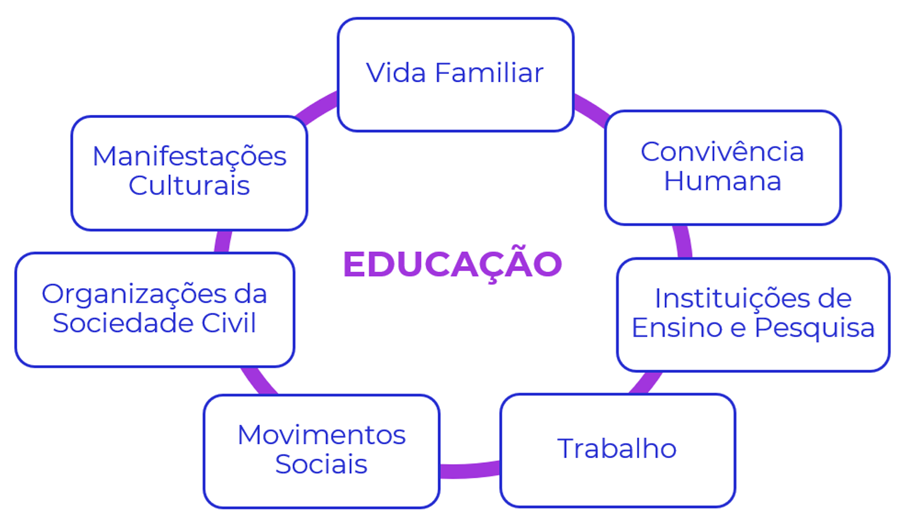
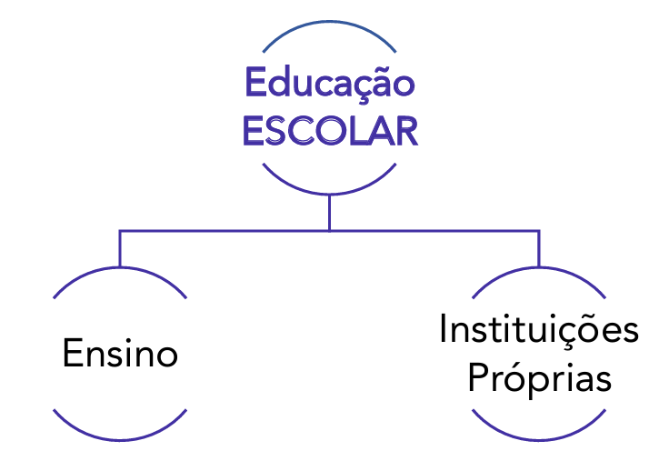
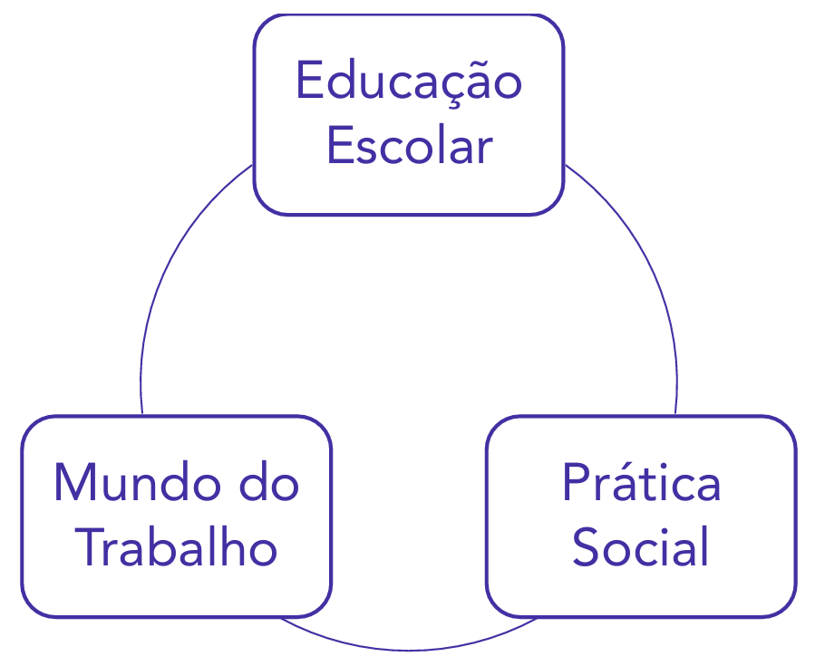
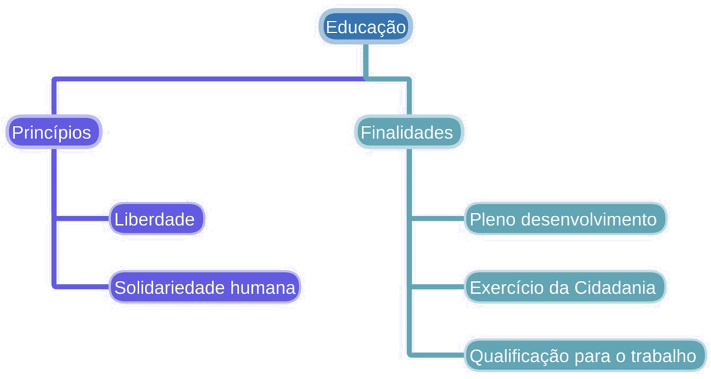
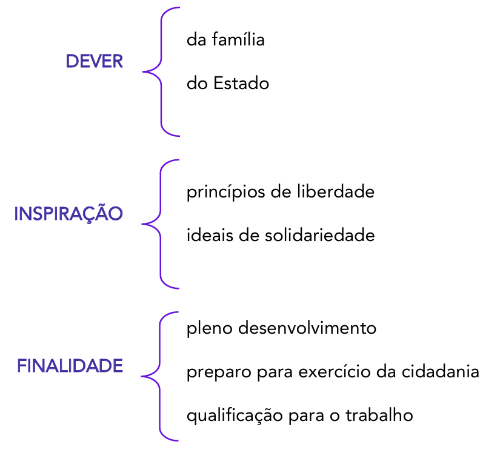

# Capítulo 5 – Lei nº 9.394/1996: Lei de Diretrizes e Bases da Educação Nacional (LDB)

Neste capítulo, iniciaremos o estudo da mais importante norma do ordenamento jurídico educacional brasileiro: a **Lei de Diretrizes e Bases da Educação Nacional (LDB)**. A LDB é a "lei magna" da educação, o arcabouço legal que organiza e estrutura todo o sistema educacional do país, desde a educação infantil até a pós-graduação, definindo os princípios, as finalidades, os direitos e os deveres que norteiam o ato de educar em âmbito nacional.

## Breve Histórico e a Evolução da Legislação Educacional

A Lei de Diretrizes e Bases da Educação Nacional vigente é aquela estabelecida pela **Lei Federal nº 9.394, de 20 de dezembro de 1996**. Mas ela não foi a única. Antes de direcionar nosso estudo para a norma vigente, é fundamental pontuar alguns aspectos sobre as leis anteriores: as LDBs de 1961 e de 1971. Assim como a norma de 1996, ambas estabeleceram as bases e normas da educação nacional no Brasil, mas cada uma refletiu seu contexto histórico, reproduzindo o que se vivia e acreditava a sociedade à época.

- **A Primeira LDB (Lei nº 4.024/1961):** Sancionada no governo de João Goulart após 13 anos de intensos debates no Congresso, esta foi a primeira LDB do país. Ela foi marcada pela disputa entre os "estatistas", que defendiam o monopólio estatal na educação, e os "privatistas", que defendiam a liberdade de ensino. O resultado foi uma lei de compromisso, que, entre outros pontos, oficializou a participação de instituições privadas na oferta do ensino e estabeleceu a obrigatoriedade do ensino primário.
- **A LDB do Regime Militar (Lei nº 5.692/1971):** Promulgada durante o governo do General Médici, esta lei refletiu as prioridades do regime militar. Suas principais características foram a unificação do antigo primário e ginásio no "Ensino de 1º Grau" (com 8 anos de duração) e a imposição de uma terminalidade profissionalizante compulsória ao "Ensino de 2º Grau" (o antigo colegial).
- **A LDB da Democracia (Lei nº 9.394/1996):** A atual LDB é fruto direto do processo de redemocratização do país e dos princípios estabelecidos na Constituição Federal de 1988. Sua tramitação durou 8 anos e foi marcada por um longo embate entre duas propostas distintas. A principal divergência entre ambas era o papel do Estado na educação. O projeto vitorioso teve como relator o senador Darcy Ribeiro e foi sancionado no governo de Fernando Henrique Cardoso.

A tabela a seguir sintetiza o contexto de cada uma das leis.

| Lei            | Tramitação | Ementa                                                                           | Contexto Histórico                                                                       |
| -------------- | ---------- | -------------------------------------------------------------------------------- | ---------------------------------------------------------------------------------------- |
| **4.024/1961** | 13 anos    | Fixa as Diretrizes e Bases da Educação Nacional                                  | Presidente da República: João Goulart                                                    |
| **5.692/1971** | 10 meses   | Fixa Diretrizes e Bases para o ensino de 1° e 2º graus, e dá outras providências | Regime Militar, presidente: Médici                                                       |
| **9.394/1996** | 8 anos     | Estabelece as diretrizes e bases da educação nacional                            | Presidente da República: FHC; Ministro da Educação: Paulo Renato; Relator: Darcy Ribeiro |

Quando chegamos à norma vigente, aprovada em 1996 – que ainda sofreria muitas atualizações até a redação atual - e a comparamos com as anteriores, conseguimos notar claramente que a educação não possuía a importância dada atualmente. Para se ter uma ideia, no início da República, as temáticas educacionais eram tratadas pelo Departamento Nacional do Ensino, um órgão ligado ao Ministério da Justiça. O próprio Ministério da Educação seria criado somente em 1930.

Além disso, no estudo histórico da República, nota-se que aos poucos a educação foi ganhando espaço e tendo seus conceitos atualizados. Antigas constituições federais nem sequer citavam a educação. E em outras épocas, o termo “educação” restava restrito somente à instrução formal.

### Breve Comparativo entre as Normas

A tabela a seguir ilustra algumas das principais diferenças de conteúdo entre as três Leis de Diretrizes e Bases da Educação.

|Item|LDB de 1961|LDB de 1971|LDB de 1996 (Atual)|
|---|---|---|---|
|**Dias letivos**|180 dias|180 dias|**200 dias**|
|**Ensino obrigatório**|Primário (7 a 10 anos)|1º grau (7 a 14 anos)|**Educação Básica** (4 a 17 anos)|
|**Estrutura**|Primário, ginásio e colegial|1º e 2º graus|**Educação Básica** e **Educação Superior** Inclusão da Educação Infantil, com creches e pré-escolas, como primeira etapa da educação|
|**Recursos investidos**|União: mín. 12% Estados, DF e municípios: mín. 20%|Municípios: mín. 20%|**União: mín. 18%** **Estados, DF e municípios: mín. 25%**|
|**Educação Física**|Prática obrigatória nos cursos primário e médio, até a idade de 18 anos|Obrigatória (1º e 2º graus)|Componente curricular obrigatório da Educação Básica, com prática facultativa em alguns casos|
|**Ensino Religioso**|Matrícula facultativa, horário normal de aula “de acôrdo com a confissão religiosa do aluno”|Matrícula facultativa, horário normal de aula (1º e 2º graus)|Matrícula facultativa, horário normal de aula (Ensino Fundamental, escolas públicas)|
|**Idade para EJA**|16 anos (ginásio) e 19 anos (colegial)|18 anos (1º grau) e 21 anos (2º grau)|**15 anos** (Ensino Fundamental) e **18 anos** (Ensino Médio)|

As normas de 1961 e 1971 podem ser objeto de estudo em disciplinas como “História da Educação” ou “Tendências Pedagógicas”. Hoje, focaremos na de 1996, vigente e de grande relevância para concursos públicos.

## A LDB no Ordenamento Jurídico e sua Estrutura

A Lei de Diretrizes e Bases da Educação Nacional, conhecida como a **Carta Magna da Educação**, ou simplesmente LDB ou LDBEN, é o normativo mais importante sobre educação em nosso país. Para compreender sua relevância, é preciso situá-la no ordenamento jurídico nacional. A Constituição Federal de 1988 é o fundamento de validade de toda a legislação brasileira. Por isso mesmo, a LDB deve estar em total alinhamento com os princípios e as determinações da Carta Magna, especialmente com os artigos 205 a 214, que formam o capítulo "Da Educação".

A Lei nº 9.394/96, que estabelece as atuais Diretrizes e Bases da Educação Nacional, tramitou por longos e conturbados oito anos no Congresso Nacional, sendo finalmente aprovada em 20 de dezembro de 1996. Seu projeto, de relatoria do senador Darcy Ribeiro, foi muito criticado à época. O texto original era consideravelmente mais extenso, mas a versão aprovada sem vetos presidenciais, que é a que está atualmente vigente, foi mais enxuta.

Mesmo com as críticas, esta é a lei que rege a educação brasileira. Antes dela, tivemos outras leis que normatizaram o setor no Brasil, a Lei nº 4.024/61 e a Lei nº 5.692/71, ambas atualmente revogadas. Nosso foco, portanto, será na legislação vigente.

A LDB é uma lei relativamente pequena, mas de profundo impacto. Ela é composta por 9 Títulos que, juntos, somam 92 artigos. A estrutura da lei organiza-se da seguinte forma:

- **TÍTULO I - Da Educação:** Apresenta o conceito de educação, suas finalidades e a quem ela abrange.
- **TÍTULO II - Dos Princípios e Fins da Educação Nacional:** Detalha os princípios norteadores do ensino no Brasil, como a liberdade de aprender, o pluralismo de ideias e a valorização do profissional da educação.
- **TÍTULO III - Do Direito à Educação e do Dever de Educar:** Estabelece as responsabilidades do Estado e da família, define a educação como direito público subjetivo e detalha o acesso à educação obrigatória e gratuita.
- **TÍTULO IV - Da Organização da Educação Nacional:** Descreve como o sistema educacional brasileiro está organizado, definindo as competências da União, dos Estados, do Distrito Federal e dos Municípios.
- **TÍTULO V - Dos Níveis e das Modalidades de Educação e Ensino:** Esta é a parte mais extensa da lei. Ela detalha os dois níveis da educação nacional (Educação Básica e Educação Superior) e as diversas modalidades de ensino.
    - CAPÍTULO I - DA COMPOSIÇÃO DOS NÍVEIS ESCOLARES
    - CAPÍTULO II - DA EDUCAÇÃO BÁSICA
        - Seções: Disposições Gerais, Educação Infantil, Ensino Fundamental, Ensino Médio, Educação Profissional Técnica de Nível Médio, Educação de Jovens e Adultos.
    - CAPÍTULO III - DA EDUCAÇÃO PROFISSIONAL E TECNOLÓGICA
    - CAPÍTULO IV - DA EDUCAÇÃO SUPERIOR
    - CAPÍTULO V - DA EDUCAÇÃO ESPECIAL
- **TÍTULO VI - Dos Profissionais da Educação:** Trata da formação, da valorização e das condições de trabalho dos profissionais que atuam na educação.
- **TÍTULO VII - Dos Recursos Financeiros:** Define as fontes de recursos e os percentuais mínimos de investimento em educação para a União, os Estados, o DF и os Municípios.
- **TÍTULO VIII - Das Disposições Gerais:** Contém regras gerais aplicáveis a todo o sistema de ensino.
- **TÍTULO IX - Das Disposições Transitórias:** Estabelece regras de transição para a adaptação do sistema educacional à nova lei.

A memorização da estrutura e dos artigos é parte do estudo para concursos, mas a compreensão do sentido das normas e de seus efeitos práticos facilita enormemente a aprendizagem. O objetivo desta apostila é justamente auxiliar nessa compreensão.

## Título I – Da Educação

O primeiro título da Lei de Diretrizes e Bases da Educação Nacional é fundamental, pois estabelece os conceitos basilares que definem o alcance e o foco de toda a legislação. Ele responde a duas perguntas essenciais: O que é educação? E qual tipo de educação esta lei se propõe a regular?

### O Conceito Amplo de Educação (Art. 1º, _caput_)

A LDB inicia com uma definição abrangente e humanista de educação, reconhecendo que os processos de formação do indivíduo transcendem os muros da escola. A lei compreende que a educação ocorre em uma multiplicidade de espaços e interações ao longo da vida.

Este entendimento está consolidado no texto do artigo 1º:

> **Art. 1º** A educação abrange os processos formativos que se desenvolvem na vida familiar, na convivência humana, no trabalho, nas instituições de ensino e pesquisa, nos movimentos sociais e organizações da sociedade civil e nas manifestações culturais.

Ao adotar essa visão ampla, a lei valoriza os conhecimentos adquiridos de forma não-formal (como em projetos sociais e manifestações culturais) e informal (na família e na convivência diária), reconhecendo que a formação humana é um processo contínuo e multifacetado.

### O Foco da LDB: A Educação Escolar (Art. 1º, § 1º)

Apesar de reconhecer a amplitude do conceito de educação, a LDB define claramente o seu objeto de regulação. O parágrafo 1º do mesmo artigo delimita o escopo de atuação da lei, explicitando que ela se dedicará a normatizar especificamente a **educação escolar**.

A lei conceitua a educação escolar da seguinte forma:

> **Art. 1º, § 1º** Esta Lei disciplina a educação escolar, que se desenvolve, **predominantemente**, por meio do ensino, em instituições próprias.

É crucial ter clareza sobre essa distinção: a educação acontece em diversos espaços e momentos, mas a LDB normatiza somente a educação escolar. O termo "predominantemente" indica que, embora o principal local da educação escolar seja a instituição própria (escolas, faculdades, universidades), ela não se restringe exclusivamente a esses espaços físicos, abrindo margem para outras formas de organização, como a educação a distância.

### O Vínculo com o Mundo do Trabalho e a Prática Social (Art. 1º, § 2º)

Por fim, a lei estabelece um vínculo mandatório para a educação escolar, determinando que ela não pode ser uma atividade isolada ou desconectada da realidade social.

> **Art. 1º, § 2º** A educação escolar **deverá** vincular-se ao mundo do trabalho e à prática social.

O uso do verbo "deverá" impõe um caráter de **obrigatoriedade** a esse vínculo. Questões de concurso frequentemente tentam alterar o sentido da norma, sugerindo que esse vínculo seria facultativo. A educação escolar, portanto, deve ter como um de seus fins a preparação do indivíduo para o exercício da cidadania (prática social) e para sua inserção produtiva no mundo do trabalho.

Em síntese, o Título I da LDB estabelece a abrangência do conceito de educação, aponta seu âmbito de atuação específico como sendo a educação escolar e impõe a obrigatoriedade do vínculo da educação escolar com o mundo do trabalho e a prática social.

## Título II – Dos Princípios e Fins da Educação Nacional

O Título II da Lei de Diretrizes e Bases da Educação Nacional (LDB) estabelece a base filosófica e teleológica de todo o sistema de ensino brasileiro. Em seus artigos 2º e 3º, a lei define de quem é a responsabilidade pela educação, quais são seus objetivos maiores e sob quais princípios ela deve ser ministrada.

### O Dever, a Inspiração e as Finalidades da Educação (Art. 2º)

O artigo 2º da LDB é um dos mais importantes da lei, pois condensa a missão central da educação no Brasil. Ele indica a responsabilidade compartilhada da família e do Estado, a inspiração humanista do processo educativo e suas três finalidades essenciais.

- **O Dever da Família e do Estado:** A lei estabelece que a educação é uma incumbência de duas esferas complementares. À **família** cabe o dever da educação primária, dos cuidados e da formação de valores no seio do lar. Ao **Estado** cabe o dever de instituir, manter e expandir o sistema de ensino público, garantindo o acesso e a permanência de todos na educação escolar.
- **A Inspiração na Liberdade e na Solidariedade:** A educação nacional, segundo a lei, inspira-se nos **princípios de liberdade** e nos **ideais de solidariedade humana**. Isso significa que o processo educativo deve, ao mesmo tempo, promover a autonomia, o pensamento crítico e a liberdade de aprender e ensinar, e também fomentar valores como a empatia, a cooperação, o respeito ao próximo e a responsabilidade social.
- **As Finalidades da Educação:** A LDB estabelece que a educação tem por finalidade um tripé de objetivos que se complementam para a formação integral do indivíduo. São eles:
    1. **O pleno desenvolvimento do educando:** Este é o objetivo mais amplo e holístico. Não se trata apenas do desenvolvimento cognitivo e da aprendizagem de conteúdos, mas da formação do ser humano em todas as suas dimensões: intelectual, física, emocional, social e cultural.
    2. **Seu preparo para o exercício da cidadania:** Esta é a finalidade política e social da educação. A escola deve formar cidadãos conscientes de seus direitos e deveres, capazes de participar ativamente da vida democrática, com senso crítico e responsabilidade.
    3. **Sua qualificação para o trabalho:** Esta é a finalidade econômica da educação. O processo educativo deve prover aos estudantes as competências, habilidades e conhecimentos necessários para sua inserção no mundo do trabalho, permitindo sua autonomia e contribuição para o desenvolvimento do país.

> **Ponto de Atenção: A Redação da "Qualificação para o Trabalho"**
> 
> A redação exata da terceira finalidade é um clássico em questões de concurso. É comum que as bancas examinadoras tentem induzir o candidato ao erro, trocando o termo "**qualificação** para o trabalho" por "**preparo** para o trabalho" (que é a expressão usada para cidadania) ou por "qualificação para o **mercado de trabalho**". A expressão legal exata é **"qualificação para o trabalho"**.

#### A Relação com o Art. 205 da Constituição Federal

As finalidades da educação previstas na LDB estão em total consonância com o disposto no art. 205 da Constituição Federal. A Carta Magna, contudo, apresenta o tema de forma mais abrangente.

> **CF/88, art. 205.** A educação, **direito de todos** e dever do Estado e da família, será promovida e incentivada com a **colaboração da sociedade**, visando ao pleno desenvolvimento da pessoa, seu preparo para o exercício da cidadania e sua qualificação para o trabalho.

Comparando os textos, nota-se que a Constituição, além de frisar a responsabilidade do Estado e da família, destaca que a educação é um **"direito de todos"** e inclui a **"colaboração da sociedade"** como um terceiro agente de promoção e incentivo, o que a LDB não menciona expressamente no art. 2º. As três finalidades, no entanto, são idênticas em ambas as normas.

Para recapitular os elementos centrais do artigo 2º, o esquema a seguir sintetiza a sua estrutura:

### Os Princípios do Ensino (Art. 3º)

Ainda no Título II, após definir as finalidades da educação, a LDB, em seu artigo 3º, detalha os **princípios** sob os quais o ensino no Brasil deve ser ministrado. Estes princípios são os alicerces éticos, políticos e pedagógicos que devem orientar todas as práticas educacionais no país.

Novamente, e por óbvio, estes princípios estão em total consonância com o artigo 206 da Constituição Federal de 1988 – um dos artigos mais cobrados quando o edital do concurso exige conhecimentos sobre a educação na Constituição. O art. 206 já elenca os princípios fundamentais da educação, mas o artigo 3º da LDB os detalha e acrescenta outros que não constam expressamente no texto constitucional.

Tanto o art. 206 da CF quanto o 3º da LDB disciplinam que "o ensino será ministrado com base nos seguintes princípios". A seguir, analisaremos cada um deles.

- **I - Igualdade de condições para o acesso e permanência na escola:** Este é o princípio da universalização e da equidade. Ele estabelece que não basta garantir a matrícula (o **acesso**); é dever do Estado criar as condições necessárias para que o estudante possa continuar seus estudos e concluir sua trajetória escolar com sucesso (a **permanência**). Isso se materializa em políticas públicas como o transporte escolar, a merenda, o fornecimento de material didático e programas de assistência estudantil. Acesso e permanência são condições básicas para o exercício da cidadania, uma das finalidades da educação.
- **II - Liberdade de aprender, ensinar, pesquisar e divulgar a cultura, o pensamento, a arte e o saber:** Este inciso é a materialização da liberdade de cátedra e da autonomia pedagógica. Ele garante que as instituições de ensino e seus docentes tenham a liberdade para definir suas propostas e metodologias, e que os estudantes tenham a liberdade de explorar diferentes campos do conhecimento, sem a imposição de um pensamento único ou de uma doutrina oficial.
- **III - Pluralismo de ideias e de concepções pedagógicas:** Diretamente vinculado ao princípio anterior, o pluralismo assegura que o ambiente educacional seja um espaço de diversidade e de debate democrático. Ele garante a coexistência de diferentes correntes de pensamento e de abordagens pedagógicas, refletindo a pluralidade da própria sociedade e sendo fundamental para a manutenção da democracia.
- **IV - Respeito à liberdade e apreço à tolerância:** A escola é o lócus privilegiado para a formação cidadã. Este princípio reforça que o ambiente escolar deve ser um espaço seguro, onde o respeito à liberdade de expressão e de crença, e o apreço à tolerância para com as diferenças, sejam valores ativamente cultivados e praticados.
- **V - Coexistência de instituições públicas e privadas de ensino:** O sistema educacional brasileiro é misto. Este princípio garante o direito à iniciativa privada de atuar na educação, desde que cumpra as normas gerais e seja autorizada e avaliada pelo Poder Público. A coexistência visa ampliar a oferta e promover a diversidade de propostas pedagógicas.
- **VI - Gratuidade do ensino público em estabelecimentos oficiais:** Este é um pilar do direito à educação no Brasil. Ele assinala a obrigação do Estado de ofertar o ensino em suas escolas de forma gratuita, removendo barreiras econômicas que poderiam impedir o acesso e a permanência.
- **VII - Valorização do profissional da educação escolar:** Este princípio reconhece que não há educação de qualidade sem profissionais valorizados. Essa valorização se materializa em políticas concretas como a garantia de planos de carreira, a exigência de concurso público para ingresso, a formação continuada e a instituição de um piso salarial profissional nacional. É importante destacar que a valorização se estende a todos os **profissionais da educação escolar**, e não apenas aos professores.
- **VIII - Gestão democrática do ensino público, na forma desta Lei e da legislação dos sistemas de ensino:** Este princípio confere à comunidade escolar (profissionais da educação, estudantes, pais e responsáveis) o direito de participar dos processos de tomada de decisão da escola. Isso se manifesta na existência de órgãos colegiados, como o Conselho Escolar, e na eleição de diretores. A redação atual do inciso, alterada em 2023, reforça que a forma dessa gestão será regulamentada pela LDB e pela legislação de cada estado, DF e município.
- **IX - Garantia de padrão de qualidade:** A oferta da educação não deve ser apenas quantitativa, mas qualitativa. Este princípio estabelece o dever do Estado de garantir um padrão mínimo de qualidade para todas as instituições, o que envolve a avaliação periódica dos sistemas de ensino, das escolas e dos estudantes.
- **X - Valorização da experiência extraescolar:** A LDB reconhece que a aprendizagem não ocorre apenas dentro da escola. Este princípio determina que os sistemas de ensino devem criar mecanismos para valorizar e, quando possível, aproveitar os conhecimentos e as habilidades que o estudante adquire em outras vivências, como no trabalho, em cursos livres e em atividades comunitárias.
- **XI - Vinculação entre a educação escolar, o trabalho e as práticas sociais:** Este princípio retoma e reforça a obrigatoriedade já prevista no artigo 1º da Lei. Ele determina que o currículo e as práticas pedagógicas devem estar conectados com a realidade do estudante, preparando-o para o mundo do trabalho e para a participação ativa na sociedade.
- **XII - Consideração com a diversidade étnico-racial:** Acrescido à lei em 2013, este princípio adentra o campo das políticas de ação afirmativa e da educação para as relações étnico-raciais. Ele impõe ao sistema de ensino o dever de considerar e valorizar a diversidade étnico-racial da população brasileira, promovendo o combate ao racismo e à discriminação.
- **XIII - Garantia do direito à educação e à aprendizagem ao longo da vida:** Incluído em 2018, este princípio formaliza o conceito de "lifelong learning". Ele reconhece que a necessidade de aprender não se encerra com a conclusão da educação formal, sendo um direito que se estende por toda a vida do indivíduo, o que justifica a existência e o fomento de modalidades como a Educação de Jovens e Adultos (EJA) e a educação profissional continuada.
- **XIV - Respeito à diversidade humana, linguística, cultural e identitária das pessoas surdas, surdo-cegas e com deficiência auditiva:** Inserido em 2021, este princípio reforça o compromisso com a educação inclusiva, com foco específico na comunidade surda, valorizando a Língua Brasileira de Sinais (Libras) e as identidades culturais próprias deste grupo.
- **XV - Garantia do direito de acesso a informações públicas sobre a gestão da educação:** Incluído em 2024, este princípio fortalece a gestão democrática e a transparência. Ele estabelece o direito dos cidadãos de acessarem informações sobre a gestão educacional, como orçamentos, resultados de avaliações e dados de matrículas, permitindo um maior controle social sobre as políticas públicas de educação.

Esses são os princípios que orientam a educação no Brasil. A compreensão da razão de ser de cada um deles, como um reflexo das lutas e dos valores da sociedade, é fundamental para a correta interpretação de toda a LDB.

## Título III – Do Direito à Educação e do Dever de Educar

Neste título da Lei de Diretrizes e Bases da Educação Nacional, são estabelecidos os fundamentos que regulamentam a educação como um direito público subjetivo. Isso significa que a educação não é apenas uma recomendação ou uma meta, mas sim um direito que pode ser exigido individualmente por qualquer cidadão perante o Poder Público. O texto legal detalha de que forma se efetiva o dever do Estado, a partir de quais garantias, como está organizada a sua oferta e atendimento, e quais são os padrões mínimos de qualidade do ensino que devem ser assegurados.

Um dos pilares deste título, e um dos temas mais relevantes em concursos públicos, refere-se ao dever do Estado para com a educação, expresso no artigo 4º da lei. Este artigo detalha, em seus incisos, as ações e garantias que o Estado precisa prover para que se possa afirmar que ele está, de fato, cumprindo com sua obrigação constitucional e legal de ofertar educação a todos os brasileiros.

As garantias contidas neste artigo são objeto comum de avaliação, exigindo atenção aos detalhes, especialmente no que tange à organização da educação básica, sua obrigatoriedade e gratuidade.

### A Abrangência da Educação Básica: Gratuidade e Obrigatoriedade

Para compreender as responsabilidades do Estado, é fundamental, primeiramente, entender a estrutura da Educação Básica. De acordo com o artigo 21 da LDB, a educação escolar se compõe de dois níveis: a educação básica e a educação superior. A Educação Básica, por sua vez, é formada por três etapas sequenciais:

- **Educação Infantil:** Primeira etapa da educação básica.
- **Ensino Fundamental:** Etapa intermediária, com duração de nove anos.
- **Ensino Médio:** Etapa final da educação básica.

A Educação Infantil, conforme o artigo 30 da LDB, também possui uma subdivisão interna, organizada de acordo com a faixa etária das crianças:

- **Creche:** Para crianças de 0 (zero) a 3 (três) anos de idade.
- **Pré-escola:** Para crianças de 4 (quatro) e 5 (cinco) anos de idade.

Com essa estrutura em mente, podemos analisar a principal garantia estabelecida no artigo 4º: a oferta da educação básica obrigatória e gratuita. A LDB define um intervalo etário específico para a compulsoriedade do ensino, o que gera uma importante distinção.

A lei determina que o Estado deve ofertar, de forma **obrigatória e gratuita**, a educação básica para a população na faixa etária dos **4 (quatro) aos 17 (dezessete) anos**. Essa faixa etária compreende a Pré-Escola, o Ensino Fundamental e o Ensino Médio.

Surge, então, uma dúvida comum: e as crianças de 0 a 3 anos, que estão na creche? Como fica a primeira fase da Educação Infantil?

Aqui reside o ponto crucial da distinção: embora a creche faça parte da Educação Básica e deva ser oferecida gratuitamente pelo Estado, sua frequência não é obrigatória para as famílias. A obrigatoriedade de matrícula na escola se inicia apenas aos 4 anos de idade.

Para simplificar e consolidar esse conhecimento, podemos organizar da seguinte forma:

- **Oferta GRATUITA da Educação Básica:** Abarca toda a sua extensão, ou seja, dos **0 (zero) aos 17 (dezessete) anos**, incluindo a creche. Isso significa que o Estado tem o dever de disponibilizar vagas gratuitas em creches, pré-escolas, ensino fundamental e médio.
- **Oferta OBRIGATÓRIA da Educação Básica:** Refere-se ao período em que tanto o Estado tem o dever de ofertar a vaga quanto os pais ou responsáveis têm o dever de matricular a criança. Essa obrigatoriedade se aplica à faixa etária dos **4 (quatro) aos 17 (dezessete) anos**.

**Exemplo prático:**

Uma família com uma criança de 2 anos de idade tem o direito de solicitar uma vaga em uma creche pública. O município (ente federativo responsável pela oferta da Educação Infantil) tem o dever de prover essa vaga. Contudo, se a família optar por não matricular a criança na creche, ela não estará descumprindo nenhuma lei. A situação muda radicalmente quando essa mesma criança completa 4 anos. A partir desse momento, os pais ou responsáveis são legalmente obrigados a matriculá-la na pré-escola, e o Estado é obrigado a garantir sua vaga.

|Faixa Etária|Etapa Educacional|Dever do Estado|
|---|---|---|
|**0 a 3 anos**|Creche (Educação Infantil)|Oferta **Gratuita**|
|**4 a 17 anos**|Pré-escola, Ensino Fundamental e Médio|Oferta **Gratuita e Obrigatória**|

### Garantia de Inclusão: O Atendimento Educacional Especializado (AEE)

Avançando nas garantias do dever do Estado, a LDB estabelece um ponto fundamental para a construção de um sistema educacional inclusivo. É assegurado o **atendimento educacional especializado gratuito** aos educandos com deficiência, transtornos globais do desenvolvimento e altas habilidades ou superdotação.

Este atendimento possui características específicas que merecem destaque:

1. **Caráter Transversal:** O AEE não é uma etapa ou um nível de ensino isolado. Ele é "transversal a todos os níveis, etapas e modalidades". Isso significa que ele perpassa toda a trajetória escolar do estudante, desde a educação infantil até o ensino superior, se necessário, funcionando como um suporte complementar ao ensino regular.
2. **Local de Oferta:** A lei indica que o AEE deve ocorrer, **preferencialmente**, na rede regular de ensino.

Essa diretriz está diretamente alinhada a um dos princípios basilares da educação nacional: a "igualdade de condições para o acesso e permanência na escola". A política de inclusão busca superar o modelo antigo de segregação, no qual alunos com necessidades especiais eram isolados em classes ou escolas exclusivas. A proposta atual é garantir que esses estudantes convivam e aprendam no mesmo ambiente que os demais, nas chamadas classes comuns. A inclusão promove a diversidade, o respeito às diferenças e o desenvolvimento social e acadêmico de todos os envolvidos.

A palavra **"preferencialmente"** é de extrema importância e frequentemente explorada em avaliações. Ela indica que a matrícula na classe comum da rede regular é a regra, o caminho principal a ser seguido. O sistema educacional deve se esforçar e se adaptar para acolher e desenvolver o potencial de todos os alunos. Contudo, a lei reconhece que, em situações muito específicas e excepcionais, em que as necessidades do estudante não possam ser adequadamente atendidas no ambiente regular, outras alternativas podem ser consideradas, como classes especiais ou escolas especializadas. A oferta do AEE também pode ocorrer fora do espaço físico da escola, como em classes hospitalares, para garantir a continuidade do processo de escolarização de alunos impossibilitados de frequentar a escola por motivos de saúde.

É fundamental ter clareza sobre o público-alvo do Atendimento Educacional Especializado, que inclui estudantes com:

- **Deficiência:** intelectual, física, auditiva, visual, múltipla, etc.
- **Transtornos Globais do Desenvolvimento (TGD):** como o Transtorno do Espectro Autista (TEA).
- **Altas Habilidades ou Superdotação:** estudantes que demonstram potencial elevado em áreas como a intelectual, acadêmica, de liderança, artística, entre outras.

O AEE, na prática, geralmente ocorre no contraturno escolar, em Salas de Recursos Multifuncionais, com professores especializados que utilizam métodos, técnicas e recursos pedagógicos específicos para atender às necessidades individuais de cada estudante, complementando e suplementando a formação recebida na classe comum.

### Ampliando as Oportunidades: Estratégias de Acesso, Permanência e Progressão

A efetivação do dever do Estado com a educação vai além da oferta de vagas na idade considerada regular. Reconhecendo as diversas realidades sociais e trajetórias de vida dos cidadãos, a LDB estabelece um conjunto de garantias para assegurar que todos, sem exceção, tenham a oportunidade não apenas de acessar a escola, mas de permanecer nela e progredir em seus estudos. Essas garantias materializam o princípio da igualdade de condições.

Uma das mais importantes estratégias nesse sentido é a oferta de **educação para jovens e adultos (EJA)**. Esta modalidade é destinada àqueles que não tiveram a oportunidade de concluir o Ensino Fundamental e o Ensino Médio na idade própria. A LDB assegura que esta oferta seja pública e gratuita, mas vai além, determinando que ela seja adequada às necessidades e à disponibilidade desses estudantes. Isso se manifesta, por exemplo, na organização do **ensino noturno regular**, que permite a conciliação dos estudos com a jornada de trabalho, uma realidade para a grande maioria do público da EJA. O currículo e a metodologia da EJA também devem ser diferenciados, valorizando os conhecimentos e as experiências de vida que esses alunos já possuem.

Seguindo na linha do acesso, a lei garante a **vaga na escola pública de educação infantil ou de ensino fundamental mais próxima de sua residência** a toda criança a partir do dia em que completar 4 (quatro) anos de idade. Essa medida tem um impacto social e pedagógico profundo, pois reduz os custos e o tempo de deslocamento das famílias, diminui o risco de evasão escolar e fortalece os laços entre a comunidade e a instituição de ensino.

O direito à educação é ininterrupto, mesmo em situações adversas de saúde. Por isso, a LDB prevê o **atendimento educacional durante o período de internação** ao aluno da educação básica que se encontre em tratamento de saúde em regime hospitalar ou domiciliar por tempo prolongado. Esse atendimento, realizado por meio de classes hospitalares ou por professores em atendimento domiciliar, garante a continuidade do processo de aprendizagem, evita a defasagem curricular e mantém o vínculo do estudante com sua escola e seus colegas, sendo fundamental também para seu bem-estar emocional e recuperação.

Finalmente, o dever do Estado não se esgota na educação básica. A lei também prevê como garantia o **acesso aos níveis mais elevados do ensino, da pesquisa e da criação artística, segundo a capacidade de cada um**. Este inciso consagra o princípio do mérito. Significa que, uma vez concluída a educação básica, o Estado deve prover os meios para que os indivíduos mais aptos e dedicados possam prosseguir para a educação superior, por meio de universidades públicas, institutos de pesquisa e fomento à cultura, garantindo assim a formação de profissionais qualificados e o avanço científico e cultural do país.

### O Suporte Material para a Aprendizagem: Programas Suplementares

A simples oferta da vaga não é suficiente para garantir a permanência e o sucesso escolar se as condições materiais básicas do estudante não estiverem atendidas. Ciente disso, a LDB estabelece que o dever do Estado com a educação escolar pública será efetivado mediante a garantia de programas suplementares. Esses programas são ações de suporte que visam remover obstáculos de ordem socioeconômica que impactam diretamente o processo de ensino-aprendizagem.

Esses programas são, em grande parte, gerenciados e cofinanciados pelo Governo Federal, por meio do **Fundo Nacional de Desenvolvimento da Educação (FNDE)**, e implementados em colaboração com estados e municípios. Entre os principais, destacam-se:

- **Material didático-escolar:** Concretizado principalmente pelo Programa Nacional do Livro e do Material Didático (PNLD), que distribui gratuitamente livros e outros materiais a todos os alunos das escolas públicas de educação básica.
- **Transporte:** O Programa Nacional de Apoio ao Transporte do Escolar (PNATE) auxilia no custeio do transporte de alunos, sendo essencial para garantir o acesso à escola, especialmente para aqueles que vivem em zonas rurais.
- **Alimentação:** Por meio do Programa Nacional de Alimentação Escolar (PNAE), oferece alimentação nutritiva e gratuita nas escolas, combatendo a desnutrição, promovendo a saúde e melhorando a capacidade de concentração e aprendizado dos alunos.
- **Assistência à saúde:** Materializado em ações intersetoriais como o Programa Saúde na Escola (PSE), que articula as redes de educação e de saúde para realizar avaliações, prevenção e promoção da saúde dos estudantes.

### Para Além do Acesso: Os Padrões Mínimos de Qualidade

O artigo 4º da LDB avança da dimensão quantitativa (a oferta de vagas) para a dimensão qualitativa do ensino. A lei determina que o dever do Estado se efetiva com a garantia de **padrões mínimos de qualidade de ensino**.

Legalmente, esses padrões são definidos como **"a variedade e a quantidade mínimas, por aluno, de insumos indispensáveis ao desenvolvimento do processo de ensino-aprendizagem"**.

Embora a definição pareça objetiva, sua aplicação prática é complexa e objeto de intenso debate. "Insumos indispensáveis" podem ser interpretados de diversas formas, mas geralmente englobam:

- **Infraestrutura adequada:** Salas de aula com ventilação e iluminação corretas, biblioteca, laboratórios, quadra de esportes, banheiros em condições de higiene e acessibilidade.
- **Recursos pedagógicos:** Disponibilidade de computadores, acesso à internet, materiais de laboratório, acervo bibliográfico atualizado.
- **Recursos humanos:** Número adequado de alunos por turma, e, principalmente, professores qualificados, com formação adequada e em número suficiente para atender a todas as áreas do conhecimento.

A discussão em torno do Custo Aluno-Qualidade (CAQ), por exemplo, é uma tentativa de traduzir esses insumos em um valor financeiro mínimo que o Estado deveria investir por aluno para garantir uma educação de qualidade, tornando essa exigência legal mais concreta e fiscalizável.

### Atualizações Recentes: Alfabetização e Educação Digital

A LDB é um documento dinâmico, que se atualiza para responder às novas demandas sociais e tecnológicas. Em 2022 e 2023, o artigo 4º recebeu acréscimos significativos, reforçando garantias essenciais para a educação no século XXI. É fundamental estar atento a essas mudanças, pois, por serem recentes, têm grande probabilidade de serem cobradas em concursos e processos seletivos.

A primeira atualização importante é a garantia da **alfabetização plena e da capacitação gradual para a leitura** ao longo da educação básica como requisitos indispensáveis para a efetivação dos direitos e objetivos de aprendizagem. Essa inclusão eleva a alfabetização a um patamar de prioridade máxima, compreendendo-a não apenas como a capacidade de decodificar letras e palavras, mas como um processo contínuo de desenvolvimento da habilidade de ler, interpretar e produzir textos criticamente em diferentes contextos.

A segunda, introduzida pela Lei nº 14.533/2023, estabelece o compromisso com a **Educação Digital**. Esta garantia se desdobra em três eixos fundamentais:

1. **Conectividade:** Assegurar a conexão à internet em alta velocidade para todas as escolas públicas da educação básica.
2. **Competências digitais:** Promover o desenvolvimento de competências nos alunos para o uso significativo e crítico das tecnologias digitais.
3. **Letramento digital:** Ir além do uso instrumental das ferramentas, desenvolvendo a capacidade de compreender, avaliar e criar informações em múltiplos formatos digitais, formando cidadãos conscientes e seguros no ambiente online.

### A Educação como Direito Público Subjetivo: A Exigibilidade perante o Estado

Para compreender a força da LDB, é crucial entender o conceito de **direito público subjetivo**. Quando a lei confere este status à educação, ela deixa de ser apenas uma declaração de intenções ou uma meta a ser perseguida pelo Estado. Ela se torna uma obrigação jurídica concreta, que pode ser exigida individualmente por qualquer cidadão.

Em termos simples, o direito público subjetivo estabelece uma relação na qual o cidadão é o credor e o Estado (Poder Público) é o devedor. A "dívida" do Estado é a prestação do serviço educacional, conforme as garantias e os padrões de qualidade definidos em lei. Portanto, se a educação obrigatória não for ofertada, ou for ofertada de maneira irregular (sem qualidade, em local inadequado, sem professores, etc.), o cidadão tem o poder de acionar a justiça para forçar o Estado a cumprir sua obrigação.

É importante notar que o poder público organiza o cumprimento desse dever de forma escalonada e prioritária. A LDB, em consonância com a Constituição Federal, estabelece que a primeira e mais urgente obrigação do Estado é garantir o acesso ao ensino obrigatório, que, como vimos, compreende a faixa etária dos 4 aos 17 anos. Somente após assegurar plenamente o atendimento dessa demanda, o poder público deve direcionar seus esforços para contemplar os demais níveis e modalidades, como a creche (0 a 3 anos) e a educação superior.

Essa hierarquia de responsabilidades ficará ainda mais clara no próximo título, que trata da organização da educação nacional e da distribuição de competências entre União, Estados e Municípios. No entanto, já é possível antecipar que, se um Município é o principal responsável pela oferta da Educação Infantil e do Ensino Fundamental, sua prioridade absoluta será garantir vagas para todas as crianças e adolescentes nessas etapas. Ele até pode colaborar com o Ensino Médio, mas apenas depois de ter cumprido integralmente sua obrigação principal.

### A Ação Cidadã e a Responsabilização do Poder Público

Se o Poder Público falhar em sua obrigação, quem pode exigir o cumprimento da lei? A LDB é enfática ao democratizar o acesso à justiça para a defesa desse direito. O artigo 5º estabelece que a legitimidade para acionar o Estado não se restringe a um grupo seleto. Podem exigir o cumprimento:

- Qualquer cidadão individualmente;
- Grupo de cidadãos;
- Associação comunitária;
- Organização sindical;
- Entidade de classe ou outra legalmente constituída;
- E, de forma institucional, o Ministério Público.

Essa amplitude de legitimados transforma a sociedade civil em uma poderosa agente de fiscalização. A lei ainda facilita o processo, determinando que a ação judicial correspondente será **gratuita e de rito sumário**. "Rito sumário", em termos gerais, significa um procedimento judicial mais rápido e simplificado em comparação com os ritos comuns, visando dar celeridade a uma demanda de caráter urgente e fundamental.

A negligência na oferta do ensino obrigatório acarreta consequências severas para a autoridade pública responsável. O § 4º do artigo 5º é claro ao prever que, uma vez comprovada a negligência, a autoridade competente poderá ser **imputada por crime de responsabilidade**. Trata-se de uma infração de natureza político-administrativa grave, que pode levar a sanções como a perda do cargo e a inabilitação para o exercício de funções públicas.

**Exemplo prático:**

Imagine que em um determinado bairro não há vagas de pré-escola suficientes para atender a todas as crianças de 4 e 5 anos. Um grupo de mães, organizadas em uma associação de moradores, pode entrar com uma ação na justiça contra a prefeitura, exigindo a criação de novas vagas. O processo será gratuito e terá tramitação prioritária. Se, ao final do processo, ficar comprovado que o prefeito ou o secretário de educação foram negligentes e não tomaram as providências cabíveis, eles poderão responder por crime de responsabilidade.

### Mecanismos de Efetivação: As Obrigações Ativas do Estado

Para garantir o cumprimento da obrigatoriedade do ensino, o Poder Público não deve apenas esperar a demanda chegar; ele deve agir proativamente. O § 1º do artigo 5º detalha um conjunto de deveres que compõem uma estratégia de busca ativa e controle da frequência escolar:

I - **Recensear anualmente as crianças e adolescentes em idade escolar, bem como os jovens e adultos que não concluíram a educação básica:** O Estado deve, anualmente, fazer um censo, um mapeamento para saber quem são e onde estão as pessoas que deveriam estar na escola.
II - **Fazer-lhes a chamada pública:** Com base nos dados do censo, o Poder Público deve divulgar amplamente os períodos de matrícula, incentivando e convocando a população a se inscrever na rede de ensino.
III - **Zelar, junto aos pais ou responsáveis, pela frequência à escola:** A responsabilidade não termina na matrícula. A escola e os órgãos de proteção (como o Conselho Tutelar) devem monitorar a frequência dos alunos e, em caso de evasão ou faltas excessivas, atuar junto às famílias para garantir o retorno do estudante.
IV - **Divulgar a lista de espera por vagas:** Uma adição importante que promove a transparência. O Poder Público deve publicar a lista de espera por vagas (inclusive em creches), mostrando a ordem de colocação e os critérios utilizados. Isso permite o controle social e evita favorecimentos indevidos.
V – **Garantir acesso aos resultados das avaliações:** Pais, responsáveis e os próprios estudantes têm o direito de conhecer os resultados das avaliações de qualidade (como o IDEB) e de rendimento da sua escola, sejam elas realizadas pelo governo ou por organizações parceiras.

Adicionalmente, o § 5º do mesmo artigo determina que, para garantir o cumprimento da obrigatoriedade de ensino, o Poder Público criará **formas alternativas de acesso aos diferentes níveis de ensino, independentemente da escolarização anterior**. Isso significa que o sistema deve ser flexível, permitindo, por exemplo, que um jovem ou adulto que abandonou a escola há muitos anos possa ser avaliado e inserido em uma etapa compatível com seus conhecimentos, sem necessariamente ter que refazer todo o percurso.

### A Era da Transparência: As Novas Exigências de Publicidade de Dados (Lei nº 15.017/2024)

Em uma atualização muito recente, de 2024, a LDB reforçou significativamente os mecanismos de transparência e acesso à informação no campo educacional. A Lei nº 15.017/2024 incluiu novos parágrafos ao artigo 5º e criou o artigo 5º-A, estabelecendo o seguinte:

- **Acesso Público à Informação:** O poder público tem o dever de promover o acesso público às informações do censo escolar e dos sistemas de avaliação da educação básica (como o Saeb).
- **Transparência como Regra:** A organização de estatísticas educacionais em todas as esferas de governo está sujeita ao dever de transparência e publicidade, seguindo os preceitos da Lei de Acesso à Informação (Lei nº 12.527/2011).
- **Compartilhamento de Dados:** Dados e microdados coletados em políticas educacionais devem ser tratados, divulgados e compartilhados, sempre que possível, de forma **anonimizada**, protegendo a identidade dos indivíduos, mas permitindo análises aprofundadas por pesquisadores e pela sociedade.
- **Abrangência para o Ensino Superior:** O novo Art. 5º-A estende todas essas obrigações de transparência de dados do censo e das avaliações também para a educação superior.

Essas mudanças representam um avanço fundamental para o controle social das políticas educacionais, permitindo que a sociedade civil, a imprensa e a comunidade acadêmica fiscalizem com mais eficiência a qualidade e a equidade do sistema de ensino brasileiro.

### A Corresponsabilidade da Família no Dever Educacional

A Constituição e a LDB estabelecem que a educação é um dever compartilhado entre o Estado e a família. Após detalharmos extensivamente as obrigações do Poder Público, é fundamental voltar o foco para o papel da família. Aos pais ou responsáveis legais recai o dever de efetivar a matrícula das crianças na educação básica, assegurando sua inserção e permanência no sistema de ensino.

Um ponto histórico relevante é a evolução do escopo dessa obrigatoriedade. Legislações anteriores, como o Estatuto da Criança e do Adolescente (ECA) em sua redação original, concentravam sua atenção e exigências no Ensino Fundamental. Contudo, essa visão foi superada pelo conceito mais amplo e integrado de **Educação Básica**, consolidado pela LDB de 1996 e por normativos posteriores, que passaram a abranger a Educação Infantil, o Ensino Fundamental e o Ensino Médio como um percurso formativo contínuo.

Dentro dessa nova estrutura, a questão central para as famílias é: a partir de qual idade a matrícula se torna um dever legal? Como já discutido, embora a Educação Básica comece aos zero anos com a oferta de vagas em creches, a obrigatoriedade da matrícula, tanto para a família quanto para o Estado, inicia-se na **pré-escola, aos 4 (quatro) anos de idade**.

Essa definição é fruto de uma importante evolução legislativa. O artigo 6º da LDB, que trata do tema, sofreu alterações significativas ao longo dos anos, refletindo a crescente valorização da educação na primeira infância:

- Originalmente, a idade de matrícula obrigatória estava alinhada ao Ensino Fundamental de 8 anos, iniciando-se aos 7 anos.
- A Lei nº 11.114/2005, que instituiu o Ensino Fundamental de 9 anos, alterou a idade de matrícula obrigatória para **6 anos**.
- Finalmente, a Lei nº 12.796/2013, em um marco para a educação infantil, estendeu a obrigatoriedade para a pré-escola, fixando a idade de matrícula em **4 anos**, que é a regra vigente.

### A Participação da Iniciativa Privada no Sistema Educacional

Um dos princípios do ensino no Brasil é a coexistência de instituições públicas e privadas. A LDB reafirma que o ensino é livre à iniciativa privada, permitindo que pessoas físicas ou jurídicas de direito privado criem e mantenham estabelecimentos de ensino. Contudo, essa liberdade não é absoluta.

As escolas privadas, assim como as públicas, estão inseridas em um sistema de ensino (federal, estadual ou municipal) e, portanto, não atuam de forma autônoma. Elas estão sujeitas a um conjunto de regras e condições para seu funcionamento, das quais se destacam:

1. **Cumprimento das normas gerais da educação nacional:** As escolas privadas devem seguir as diretrizes curriculares nacionais, a Base Nacional Comum Curricular (BNCC) e todas as demais normas que regem a educação no país.
2. **Autorização de funcionamento e avaliação de qualidade pelo Poder Público:** Nenhuma escola privada pode funcionar sem uma autorização prévia do órgão competente do seu sistema de ensino. Além disso, ela está sujeita a processos de avaliação periódicos que atestam a qualidade do serviço oferecido. O Estado, portanto, não apenas permite, mas também regula e fiscaliza a atuação privada.
3. **Capacidade de autofinanciamento:** A regra geral é que as instituições privadas devem se manter com seus próprios recursos, oriundos das mensalidades e de outras fontes privadas. Há, no entanto, uma exceção importante prevista no artigo 213 da Constituição Federal, que permite o direcionamento de recursos públicos para escolas **comunitárias, confessionais ou filantrópicas**, desde que comprovem finalidade não lucrativa e apliquem seus excedentes financeiros em educação.

### O Respeito à Liberdade de Crença: O Direito à Ausência por Motivos Religiosos

Para concluir a análise do direito à educação e do dever de educar, a LDB incorpora, em seu artigo 7º-A (incluído pela Lei nº 13.796/2019), um dispositivo que assegura a liberdade de consciência e de crença no ambiente educacional.

Este artigo garante que estudantes de todos os níveis de ensino (da educação infantil à superior), matriculados em instituições públicas ou privadas, tenham o direito de se ausentar de uma prova ou aula marcada para um dia no qual, por preceitos de sua religião, seja vedado o exercício de tais atividades. A popular frase "minha religião não permite" encontra aqui seu respaldo legal.

Para que esse direito seja exercido, a lei estabelece condições claras:

- O estudante (ou seus responsáveis) deve fazer um **requerimento prévio e motivado**, comunicando à instituição a necessidade da ausência.
- A instituição de ensino, por sua vez, tem o dever de oferecer uma **prestação alternativa**, sem qualquer custo adicional para o aluno.

As opções para essa prestação alternativa incluem, a critério da instituição:

- Aplicação de prova ou aula de reposição em outra data;
- Realização de um trabalho escrito ou outra modalidade de atividade de pesquisa.

A instituição definirá os parâmetros dessa atividade alternativa, como tema e prazo, observando o conteúdo que foi ministrado no dia da ausência. Essa nova data ou atividade deve ser agendada, preferencialmente, em um turno de estudo do aluno ou em outro horário, mediante acordo expresso entre as partes. O cumprimento da prestação alternativa substitui a obrigação original para todos os efeitos, inclusive para o registro da frequência.

É importante notar que esta norma **não se aplica ao ensino militar**, que é regido por legislação específica. A lei também concedeu um prazo de 2 anos, a partir de sua publicação, para que as instituições de ensino se adaptassem a essa nova exigência.

## Título IV – Da Organização da Educação Nacional

A educação no Brasil, por sua dimensão e pela natureza federativa do país, exige um complexo sistema de organização e cooperação. O Título IV da LDB se dedica a estabelecer como a União, os Estados, o Distrito Federal e os Municípios devem estruturar seus sistemas de ensino e, fundamentalmente, como devem colaborar entre si para garantir o direito à educação em todo o território nacional.

O princípio norteador desta organização é o **regime de colaboração**, um conceito que busca harmonizar a autonomia dos entes federados com a necessidade de uma política educacional coesa e unificada. A ideia é evitar tanto a sobreposição de esforços quanto a existência de lacunas no atendimento educacional. A LDB inicia este título estabelecendo essa premissa:

> Art. 8º A União, os Estados, o Distrito Federal e os Municípios organizarão, em regime de colaboração, os respectivos sistemas de ensino.
> 
> § 1º Caberá à União a coordenação da política nacional de educação, articulando os diferentes níveis e sistemas e exercendo função normativa, redistributiva e supletiva em relação às demais instâncias educacionais.

Este primeiro parágrafo do artigo 8º é crucial, pois define o papel da União como a grande maestrina da orquestra educacional brasileira. Ela não executa todas as ações, mas é responsável por coordenar, ditar as regras gerais (função normativa), equilibrar as desigualdades regionais (função redistributiva) e apoiar os demais entes quando necessário (função supletiva).

Para detalhar como esse regime de colaboração funciona na prática, a lei especifica as incumbências de cada esfera de governo nos artigos 9º, 10 e 11.

### As Incumbências da União: Coordenação e Estratégia Nacional

Conforme disposto no artigo 9º da LDB, cabe à União o papel de planejamento estratégico, normatização, avaliação e financiamento em escala nacional. Suas responsabilidades são amplas e estruturantes para todo o sistema. Podemos agrupá-las em grandes eixos de atuação:

**Planejamento e Coordenação da Política Nacional:**

A União é a principal responsável por pensar a educação em longo prazo e garantir que todo o país caminhe em uma direção comum. Sua principal ferramenta para isso é a elaboração do **Plano Nacional de Educação (PNE)**, um documento decenal com metas e estratégias para a educação brasileira, que deve ser construído em colaboração com os estados e municípios.

**Função Normativa e Estabelecimento de Diretrizes:**

É incumbência da União estabelecer as "regras do jogo" para a educação básica e superior. Isso se materializa na definição de **competências e diretrizes curriculares nacionais**, como a Base Nacional Comum Curricular (BNCC), que orientam os currículos de todas as escolas do país, assegurando uma formação básica comum a todos os estudantes. Essa função também se estende a áreas específicas, como a criação de diretrizes para o atendimento de alunos com **altas habilidades ou superdotação**. Além disso, a União baixa as normas gerais que regulamentam os cursos de graduação e pós-graduação em todo o Brasil.

**Função Redistributiva e Supletiva (Assistência Técnica e Financeira):**

Reconhecendo as profundas desigualdades regionais do país, a União tem o dever de atuar para equilibrar as oportunidades educacionais. A **função redistributiva** se manifesta no repasse de recursos financeiros para estados e municípios com menor capacidade de arrecadação, visando garantir um padrão mínimo de qualidade em todo o território. A **função supletiva** ocorre quando a União oferece suporte técnico ou financeiro para suprir deficiências ou lacunas específicas dos sistemas de ensino locais.

**Coleta de Dados e Avaliação Nacional:**

Para planejar e aprimorar a educação, é preciso diagnosticá-la. Cabe à União **coletar, analisar e disseminar informações e estatísticas educacionais**, o que é feito anualmente por meio do Censo Escolar. Além disso, é sua responsabilidade assegurar um **processo nacional de avaliação** em todos os níveis:

- **Na Educação Básica:** Avaliação do rendimento escolar, como o Sistema de Avaliação da Educação Básica (Saeb).
- **Na Educação Profissional:** Conforme atualização de 2023, um processo de avaliação dos cursos técnicos e tecnológicos.
- **Na Educação Superior**: Avaliação das instituições e cursos, realizada pelo Sistema Nacional de Avaliação da Educação Superior (Sinaes).

O objetivo dessas avaliações é gerar dados para a definição de prioridades e a formulação de políticas para a melhoria da qualidade do ensino.

**Manutenção e Gestão do Sistema Federal de Ensino:**

Por fim, a União também atua como mantenedora de sua própria rede de ensino. Ela deve organizar, manter e desenvolver os órgãos e instituições do **sistema federal**, que inclui:

- As instituições de educação superior (Universidades Federais e Institutos Federais de Educação, Ciência e Tecnologia).
- Os estabelecimentos de ensino médio e técnico vinculados a essas universidades (colégios de aplicação, por exemplo).
- As instituições de educação básica para os Territórios Federais (caso existam).

Nesse âmbito, é a União que **autoriza, reconhece, credencia, supervisiona e avalia** os cursos e as instituições de ensino superior em todo o país, bem como os estabelecimentos que compõem seu sistema.

### As Incumbências dos Estados e do Distrito Federal: Articulação e Prioridades

Seguindo a estrutura do regime de colaboração, o artigo 10º da LDB detalha as incumbências dos Estados. Eles atuam como um elo crucial, articulando as políticas nacionais emanadas da União com a execução local realizada pelos Municípios. O Distrito Federal, por sua natureza híbrida, acumula tanto as competências estaduais quanto as municipais.

As responsabilidades estaduais podem ser compreendidas em diferentes eixos de atuação:

**Gestão, Planejamento e Normatização do Sistema Estadual:**

Assim como a União, os Estados são responsáveis por **organizar, manter и desenvolver seus próprios sistemas de ensino**. Isso inclui a criação e manutenção de órgãos como as Secretarias Estaduais de Educação e os Conselhos Estaduais de Educação. Eles devem **elaborar e executar políticas e planos educacionais** próprios (os Planos Estaduais de Educação - PEE), que precisam estar em sintonia com o Plano Nacional de Educação (PNE).

Uma de suas funções mais importantes é a de **baixar normas complementares** para o seu sistema. Isso significa que, respeitando as diretrizes gerais federais, os Estados podem criar regras específicas para questões como a organização do calendário escolar, a carreira do magistério estadual e a gestão das escolas de sua rede.

**Definição da Oferta Educacional Prioritária:**

A LDB estabelece uma divisão de prioridades entre os entes. Aos Estados, cabe a dupla responsabilidade de **assegurar o ensino fundamental e oferecer, com prioridade, o ensino médio**. Na prática, isso se desdobra da seguinte forma:

- **Ensino Fundamental:** A oferta é, na maioria das vezes, compartilhada com os municípios.
- **Ensino Médio:** Esta é a principal e prioritária responsabilidade dos Estados. A grande maioria das escolas de ensino médio públicas no Brasil pertence à rede estadual.

**Articulação e Colaboração com os Municípios:**

O sucesso do regime de colaboração depende diretamente da capacidade de articulação entre Estados e Municípios. A LDB determina que os Estados devem **definir, com os Municípios, formas de colaboração na oferta do ensino fundamental**. Essa colaboração deve garantir uma distribuição justa das responsabilidades, levando em conta a população a ser atendida e os recursos de cada ente.

- **Exemplo prático:** É muito comum que Estados e Municípios pactuem a divisão do ensino fundamental. Em muitos arranjos, os Municípios ficam responsáveis pelos anos iniciais (1º ao 5º ano), enquanto o Estado assume a responsabilidade pelos anos finais (6º ao 9º ano). Essa é uma forma de otimizar recursos e especializar a gestão.

**Regulação, Supervisão e Gestão Democrática:**

Os Estados têm o poder de **autorizar, reconhecer, credenciar, supervisionar e avaliar** as instituições que pertencem ao seu sistema de ensino. Isso inclui as escolas de educação básica da rede privada, as escolas da própria rede estadual e, crucialmente, as instituições de educação superior estaduais (universidades estaduais) e as privadas que não sejam vinculadas ao sistema federal.

Além disso, a lei incumbe os Estados de promover a gestão democrática, por meio da instituição de **Conselhos Escolares** (órgãos colegiados em cada escola com participação da comunidade) e **Fóruns dos Conselhos Escolares** (instâncias para articular e fortalecer os conselhos em nível regional ou estadual).

**Garantia de Serviços de Apoio: O Transporte Escolar:**

A LDB também atribui aos Estados a responsabilidade de **assumir o transporte escolar dos alunos da rede estadual**. Essa é uma incumbência vital para garantir o acesso e a permanência de estudantes, especialmente aqueles que residem em zonas rurais ou distantes das escolas.

Uma atualização importante, trazida pela Lei nº 14.862, de 2024, modernizou essa incumbência, permitindo que **professores da respectiva rede, em trechos autorizados, possam utilizar assentos vagos nos veículos do transporte escolar**. Essa medida visa otimizar o uso da frota e solucionar dificuldades de deslocamento de docentes para escolas de difícil acesso. Para que isso ocorra de forma eficiente, a lei também determina que o Estado deve se **articular com os Municípios** para que a organização do transporte atenda aos interesses de alunos e professores.

### As Incumbências dos Municípios: A Atuação na Base do Sistema

Os Municípios representam a base do sistema educacional, sendo a esfera de governo mais próxima do cotidiano dos cidadãos e das escolas. Suas incumbências, descritas no artigo 11 da LDB, refletem essa proximidade, com foco na educação infantil e nos anos iniciais da trajetória escolar.

**Gestão e Organização do Sistema Municipal de Ensino:**

De forma análoga aos Estados, os Municípios devem **organizar, manter e desenvolver os órgãos e instituições oficiais de seus sistemas de ensino**. Isso envolve a manutenção de uma Secretaria Municipal de Educação e, quando optam por criar um sistema próprio, de um Conselho Municipal de Educação. É fundamental que suas ações e planos educacionais locais estejam **integrados às políticas e planos da União e dos Estados**, garantindo a coesão do regime de colaboração. Eles também podem **baixar normas complementares** para adequar as diretrizes gerais à realidade local.

**Definição da Oferta Educacional Prioritária:**

Aqui reside a principal e mais clara atribuição dos Municípios. A eles compete **oferecer a Educação Infantil em creches e pré-escolas, e, com prioridade, o Ensino Fundamental**. Esta é a sua área de atuação por excelência. A LDB estabelece uma condição rigorosa para que um município possa atuar em outros níveis de ensino (como o Ensino Médio ou Superior): isso só é permitido quando as necessidades da Educação Infantil e do Ensino Fundamental estiverem **plenamente atendidas** e com o uso de **recursos acima dos percentuais mínimos** exigidos pela Constituição para a educação.

**Promoção da Equidade e Serviços de Apoio:**

Os Municípios devem exercer **ação redistributiva em relação às suas escolas**. Diferente da função redistributiva da União (que equilibra recursos entre Estados e Municípios), a ação municipal é interna, visando reduzir as desigualdades _dentro do próprio município_.

- **Exemplo prático:** A secretaria municipal deve alocar mais recursos, melhores equipamentos ou programas de reforço pedagógico para as escolas localizadas em bairros periféricos ou com maiores índices de vulnerabilidade social, em detrimento daquelas que já se encontram em melhores condições, buscando assim equalizar as oportunidades de aprendizagem.

Assim como os Estados, os Municípios devem **assumir o transporte escolar dos alunos da rede municipal**, incluindo a recente permissão para que professores da rede utilizem assentos vagos nos veículos, em trechos autorizados.

**Regulação e Gestão Democrática:**

Compete aos Municípios **autorizar, credenciar e supervisionar os estabelecimentos de seu sistema de ensino**. Na prática, isso se aplica majoritariamente às instituições privadas de Educação Infantil (creches e pré-escolas particulares), que devem obter licença da secretaria municipal para funcionar. A promoção da gestão democrática também é uma incumbência, através da instituição de **Conselhos Escolares e Fóruns dos Conselhos Escolares**.

Uma particularidade importante é a flexibilidade organizacional: o município pode **optar por se integrar ao sistema estadual de ensino ou compor com ele um sistema único de educação básica**, uma alternativa frequentemente utilizada por municípios de pequeno porte com menor capacidade administrativa.

### Análise Comparativa das Incumbências: Semelhanças e Diferenças Essenciais

Apesar de operarem em um regime de colaboração, as atribuições de cada ente federativo possuem focos e abrangências distintas. A compreensão dessas diferenças é fundamental.

|Função / Atribuição|União (Nível Estratégico)|Estados (Nível Tático/Articulador)|Municípios (Nível Operacional/Local)|
|---|---|---|---|
|**Oferta Prioritária de Ensino**|**Ensino Superior** (através do sistema federal) e **função supletiva/técnica** na Ed. Básica.|**Ensino Médio** (prioritário) e **Ensino Fundamental** (em regime de colaboração).|**Educação Infantil** (creches e pré-escolas) e **Ensino Fundamental** (prioritário).|
|**Função Normativa**|Baixa **normas gerais** para todo o país (ex: BNCC, Diretrizes Curriculares Nacionais).|Baixa **normas complementares** para seu sistema de ensino, detalhando e adaptando as normas gerais.|Baixa **normas complementares** para seu sistema de ensino, adequando as regras à realidade local.|
|**Função Redistributiva**|Exerce a função **entre os entes federados**, transferindo recursos para Estados e Municípios mais necessitados.|Não possui essa função de forma explícita na LDB.|Exerce a função **entre as suas próprias escolas**, buscando a equidade dentro do município.|
|**Planejamento Educacional**|Elabora o **Plano Nacional de Educação (PNE)**, com metas decenais para todo o país.|Elabora o **Plano Estadual de Educação (PEE)**, que deve estar alinhado ao PNE.|Elabora o **Plano Municipal de Educação (PME)**, que deve estar alinhado ao PNE e ao PEE.|
|**Transporte Escolar**|Não é sua incumbência direta; atua por meio de assistência financeira (PNATE).|Assegura o transporte para os alunos da **rede estadual**.|Assegura o transporte para os alunos da **rede municipal**.|
|**Autorização de Instituições**|Sistema federal de ensino, especialmente **Instituições de Ensino Superior** em todo o país.|Sistema estadual de ensino, incluindo **Universidades Estaduais** e escolas privadas de Ed. Básica.|Sistema municipal de ensino, com foco principal nas **instituições de Educação Infantil privadas**.|

Esta análise comparativa evidencia a lógica do federalismo colaborativo na educação: a União define as grandes estratégias e regras, avalia o sistema e equaliza as condições; os Estados articulam as políticas, priorizam o Ensino Médio e apoiam os municípios; e os Municípios cuidam da base, garantindo o acesso à Educação Infantil e ao Ensino Fundamental.

É crucial reforçar que os quadros e as sínteses são ferramentas de estudo. A leitura atenta e repetida dos artigos 9º, 10 e 11 da LDB na íntegra é indispensável para uma compreensão completa e aprofundada da organização da educação nacional.

