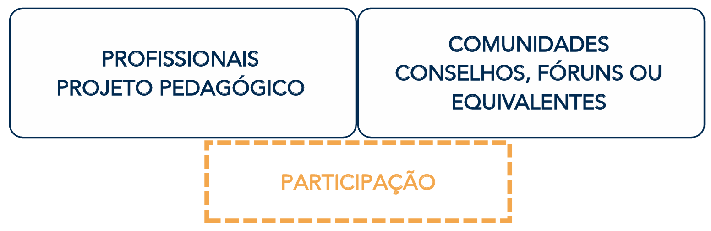
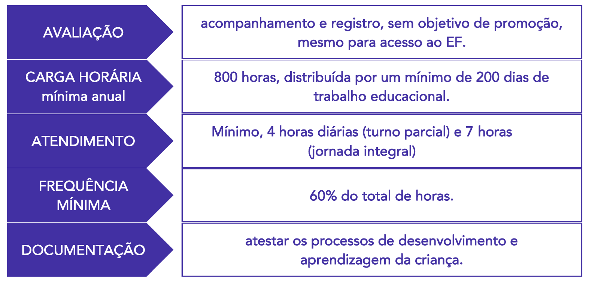

# Capítulo 5 – Lei nº 9.394/1996: Lei de Diretrizes e Bases da Educação Nacional (LDB)

Neste capítulo, iniciaremos o estudo da mais importante norma do ordenamento jurídico educacional brasileiro: a **Lei de Diretrizes e Bases da Educação Nacional (LDB)**. A LDB é a "lei magna" da educação, o arcabouço legal que organiza e estrutura todo o sistema educacional do país, desde a educação infantil até a pós-graduação, definindo os princípios, as finalidades, os direitos e os deveres que norteiam o ato de educar em âmbito nacional.

## Breve Histórico e a Evolução da Legislação Educacional

A Lei de Diretrizes e Bases da Educação Nacional vigente é aquela estabelecida pela **Lei Federal nº 9.394, de 20 de dezembro de 1996**. Mas ela não foi a única. Antes de direcionar nosso estudo para a norma vigente, é fundamental pontuar alguns aspectos sobre as leis anteriores: as LDBs de 1961 e de 1971. Assim como a norma de 1996, ambas estabeleceram as bases e normas da educação nacional no Brasil, mas cada uma refletiu seu contexto histórico, reproduzindo o que se vivia e acreditava a sociedade à época.

- **A Primeira LDB (Lei nº 4.024/1961):** Sancionada no governo de João Goulart após 13 anos de intensos debates no Congresso, esta foi a primeira LDB do país. Ela foi marcada pela disputa entre os "estatistas", que defendiam o monopólio estatal na educação, e os "privatistas", que defendiam a liberdade de ensino. O resultado foi uma lei de compromisso, que, entre outros pontos, oficializou a participação de instituições privadas na oferta do ensino e estabeleceu a obrigatoriedade do ensino primário.
- **A LDB do Regime Militar (Lei nº 5.692/1971):** Promulgada durante o governo do General Médici, esta lei refletiu as prioridades do regime militar. Suas principais características foram a unificação do antigo primário e ginásio no "Ensino de 1º Grau" (com 8 anos de duração) e a imposição de uma terminalidade profissionalizante compulsória ao "Ensino de 2º Grau" (o antigo colegial).
- **A LDB da Democracia (Lei nº 9.394/1996):** A atual LDB é fruto direto do processo de redemocratização do país e dos princípios estabelecidos na Constituição Federal de 1988. Sua tramitação durou 8 anos e foi marcada por um longo embate entre duas propostas distintas. A principal divergência entre ambas era o papel do Estado na educação. O projeto vitorioso teve como relator o senador Darcy Ribeiro e foi sancionado no governo de Fernando Henrique Cardoso.

A tabela a seguir sintetiza o contexto de cada uma das leis.

| Lei            | Tramitação | Ementa                                                                           | Contexto Histórico                                                                       |
| -------------- | ---------- | -------------------------------------------------------------------------------- | ---------------------------------------------------------------------------------------- |
| **4.024/1961** | 13 anos    | Fixa as Diretrizes e Bases da Educação Nacional                                  | Presidente da República: João Goulart                                                    |
| **5.692/1971** | 10 meses   | Fixa Diretrizes e Bases para o ensino de 1° e 2º graus, e dá outras providências | Regime Militar, presidente: Médici                                                       |
| **9.394/1996** | 8 anos     | Estabelece as diretrizes e bases da educação nacional                            | Presidente da República: FHC; Ministro da Educação: Paulo Renato; Relator: Darcy Ribeiro |

Quando chegamos à norma vigente, aprovada em 1996 – que ainda sofreria muitas atualizações até a redação atual - e a comparamos com as anteriores, conseguimos notar claramente que a educação não possuía a importância dada atualmente. Para se ter uma ideia, no início da República, as temáticas educacionais eram tratadas pelo Departamento Nacional do Ensino, um órgão ligado ao Ministério da Justiça. O próprio Ministério da Educação seria criado somente em 1930.

Além disso, no estudo histórico da República, nota-se que aos poucos a educação foi ganhando espaço e tendo seus conceitos atualizados. Antigas constituições federais nem sequer citavam a educação. E em outras épocas, o termo “educação” restava restrito somente à instrução formal.

### Breve Comparativo entre as Normas

A tabela a seguir ilustra algumas das principais diferenças de conteúdo entre as três Leis de Diretrizes e Bases da Educação.

|Item|LDB de 1961|LDB de 1971|LDB de 1996 (Atual)|
|---|---|---|---|
|**Dias letivos**|180 dias|180 dias|**200 dias**|
|**Ensino obrigatório**|Primário (7 a 10 anos)|1º grau (7 a 14 anos)|**Educação Básica** (4 a 17 anos)|
|**Estrutura**|Primário, ginásio e colegial|1º e 2º graus|**Educação Básica** e **Educação Superior** Inclusão da Educação Infantil, com creches e pré-escolas, como primeira etapa da educação|
|**Recursos investidos**|União: mín. 12% Estados, DF e municípios: mín. 20%|Municípios: mín. 20%|**União: mín. 18%** **Estados, DF e municípios: mín. 25%**|
|**Educação Física**|Prática obrigatória nos cursos primário e médio, até a idade de 18 anos|Obrigatória (1º e 2º graus)|Componente curricular obrigatório da Educação Básica, com prática facultativa em alguns casos|
|**Ensino Religioso**|Matrícula facultativa, horário normal de aula “de acôrdo com a confissão religiosa do aluno”|Matrícula facultativa, horário normal de aula (1º e 2º graus)|Matrícula facultativa, horário normal de aula (Ensino Fundamental, escolas públicas)|
|**Idade para EJA**|16 anos (ginásio) e 19 anos (colegial)|18 anos (1º grau) e 21 anos (2º grau)|**15 anos** (Ensino Fundamental) e **18 anos** (Ensino Médio)|

As normas de 1961 e 1971 podem ser objeto de estudo em disciplinas como “História da Educação” ou “Tendências Pedagógicas”. Hoje, focaremos na de 1996, vigente e de grande relevância para concursos públicos.

## A LDB no Ordenamento Jurídico e sua Estrutura

A Lei de Diretrizes e Bases da Educação Nacional, conhecida como a **Carta Magna da Educação**, ou simplesmente LDB ou LDBEN, é o normativo mais importante sobre educação em nosso país. Para compreender sua relevância, é preciso situá-la no ordenamento jurídico nacional. A Constituição Federal de 1988 é o fundamento de validade de toda a legislação brasileira. Por isso mesmo, a LDB deve estar em total alinhamento com os princípios e as determinações da Carta Magna, especialmente com os artigos 205 a 214, que formam o capítulo "Da Educação".

A Lei nº 9.394/96, que estabelece as atuais Diretrizes e Bases da Educação Nacional, tramitou por longos e conturbados oito anos no Congresso Nacional, sendo finalmente aprovada em 20 de dezembro de 1996. Seu projeto, de relatoria do senador Darcy Ribeiro, foi muito criticado à época. O texto original era consideravelmente mais extenso, mas a versão aprovada sem vetos presidenciais, que é a que está atualmente vigente, foi mais enxuta.

Mesmo com as críticas, esta é a lei que rege a educação brasileira. Antes dela, tivemos outras leis que normatizaram o setor no Brasil, a Lei nº 4.024/61 e a Lei nº 5.692/71, ambas atualmente revogadas. Nosso foco, portanto, será na legislação vigente.

A LDB é uma lei relativamente pequena, mas de profundo impacto. Ela é composta por 9 Títulos que, juntos, somam 92 artigos. A estrutura da lei organiza-se da seguinte forma:

- **TÍTULO I - Da Educação:** Apresenta o conceito de educação, suas finalidades e a quem ela abrange.
- **TÍTULO II - Dos Princípios e Fins da Educação Nacional:** Detalha os princípios norteadores do ensino no Brasil, como a liberdade de aprender, o pluralismo de ideias e a valorização do profissional da educação.
- **TÍTULO III - Do Direito à Educação e do Dever de Educar:** Estabelece as responsabilidades do Estado e da família, define a educação como direito público subjetivo e detalha o acesso à educação obrigatória e gratuita.
- **TÍTULO IV - Da Organização da Educação Nacional:** Descreve como o sistema educacional brasileiro está organizado, definindo as competências da União, dos Estados, do Distrito Federal e dos Municípios.
- **TÍTULO V - Dos Níveis e das Modalidades de Educação e Ensino:** Esta é a parte mais extensa da lei. Ela detalha os dois níveis da educação nacional (Educação Básica e Educação Superior) e as diversas modalidades de ensino.
    - CAPÍTULO I - DA COMPOSIÇÃO DOS NÍVEIS ESCOLARES
    - CAPÍTULO II - DA EDUCAÇÃO BÁSICA
        - Seções: Disposições Gerais, Educação Infantil, Ensino Fundamental, Ensino Médio, Educação Profissional Técnica de Nível Médio, Educação de Jovens e Adultos.
    - CAPÍTULO III - DA EDUCAÇÃO PROFISSIONAL E TECNOLÓGICA
    - CAPÍTULO IV - DA EDUCAÇÃO SUPERIOR
    - CAPÍTULO V - DA EDUCAÇÃO ESPECIAL
- **TÍTULO VI - Dos Profissionais da Educação:** Trata da formação, da valorização e das condições de trabalho dos profissionais que atuam na educação.
- **TÍTULO VII - Dos Recursos Financeiros:** Define as fontes de recursos e os percentuais mínimos de investimento em educação para a União, os Estados, o DF и os Municípios.
- **TÍTULO VIII - Das Disposições Gerais:** Contém regras gerais aplicáveis a todo o sistema de ensino.
- **TÍTULO IX - Das Disposições Transitórias:** Estabelece regras de transição para a adaptação do sistema educacional à nova lei.

A memorização da estrutura e dos artigos é parte do estudo para concursos, mas a compreensão do sentido das normas e de seus efeitos práticos facilita enormemente a aprendizagem. O objetivo desta apostila é justamente auxiliar nessa compreensão.

## Título I – Da Educação

O primeiro título da Lei de Diretrizes e Bases da Educação Nacional é fundamental, pois estabelece os conceitos basilares que definem o alcance e o foco de toda a legislação. Ele responde a duas perguntas essenciais: O que é educação? E qual tipo de educação esta lei se propõe a regular?

### O Conceito Amplo de Educação (Art. 1º, _caput_)

A LDB inicia com uma definição abrangente e humanista de educação, reconhecendo que os processos de formação do indivíduo transcendem os muros da escola. A lei compreende que a educação ocorre em uma multiplicidade de espaços e interações ao longo da vida.

Este entendimento está consolidado no texto do artigo 1º:

> **Art. 1º** A educação abrange os processos formativos que se desenvolvem na vida familiar, na convivência humana, no trabalho, nas instituições de ensino e pesquisa, nos movimentos sociais e organizações da sociedade civil e nas manifestações culturais.

Ao adotar essa visão ampla, a lei valoriza os conhecimentos adquiridos de forma não-formal (como em projetos sociais e manifestações culturais) e informal (na família e na convivência diária), reconhecendo que a formação humana é um processo contínuo e multifacetado.

### O Foco da LDB: A Educação Escolar (Art. 1º, § 1º)

Apesar de reconhecer a amplitude do conceito de educação, a LDB define claramente o seu objeto de regulação. O parágrafo 1º do mesmo artigo delimita o escopo de atuação da lei, explicitando que ela se dedicará a normatizar especificamente a **educação escolar**.

A lei conceitua a educação escolar da seguinte forma:

> **Art. 1º, § 1º** Esta Lei disciplina a educação escolar, que se desenvolve, **predominantemente**, por meio do ensino, em instituições próprias.

É crucial ter clareza sobre essa distinção: a educação acontece em diversos espaços e momentos, mas a LDB normatiza somente a educação escolar. O termo "predominantemente" indica que, embora o principal local da educação escolar seja a instituição própria (escolas, faculdades, universidades), ela não se restringe exclusivamente a esses espaços físicos, abrindo margem para outras formas de organização, como a educação a distância.

### O Vínculo com o Mundo do Trabalho e a Prática Social (Art. 1º, § 2º)

Por fim, a lei estabelece um vínculo mandatório para a educação escolar, determinando que ela não pode ser uma atividade isolada ou desconectada da realidade social.

> **Art. 1º, § 2º** A educação escolar **deverá** vincular-se ao mundo do trabalho e à prática social.

O uso do verbo "deverá" impõe um caráter de **obrigatoriedade** a esse vínculo. Questões de concurso frequentemente tentam alterar o sentido da norma, sugerindo que esse vínculo seria facultativo. A educação escolar, portanto, deve ter como um de seus fins a preparação do indivíduo para o exercício da cidadania (prática social) e para sua inserção produtiva no mundo do trabalho.

Em síntese, o Título I da LDB estabelece a abrangência do conceito de educação, aponta seu âmbito de atuação específico como sendo a educação escolar e impõe a obrigatoriedade do vínculo da educação escolar com o mundo do trabalho e a prática social.

## Título II – Dos Princípios e Fins da Educação Nacional

O Título II da Lei de Diretrizes e Bases da Educação Nacional (LDB) estabelece a base filosófica e teleológica de todo o sistema de ensino brasileiro. Em seus artigos 2º e 3º, a lei define de quem é a responsabilidade pela educação, quais são seus objetivos maiores e sob quais princípios ela deve ser ministrada.

### O Dever, a Inspiração e as Finalidades da Educação (Art. 2º)

O artigo 2º da LDB é um dos mais importantes da lei, pois condensa a missão central da educação no Brasil. Ele indica a responsabilidade compartilhada da família e do Estado, a inspiração humanista do processo educativo e suas três finalidades essenciais.

- **O Dever da Família e do Estado:** A lei estabelece que a educação é uma incumbência de duas esferas complementares. À **família** cabe o dever da educação primária, dos cuidados e da formação de valores no seio do lar. Ao **Estado** cabe o dever de instituir, manter e expandir o sistema de ensino público, garantindo o acesso e a permanência de todos na educação escolar.
- **A Inspiração na Liberdade e na Solidariedade:** A educação nacional, segundo a lei, inspira-se nos **princípios de liberdade** e nos **ideais de solidariedade humana**. Isso significa que o processo educativo deve, ao mesmo tempo, promover a autonomia, o pensamento crítico e a liberdade de aprender e ensinar, e também fomentar valores como a empatia, a cooperação, o respeito ao próximo e a responsabilidade social.
- **As Finalidades da Educação:** A LDB estabelece que a educação tem por finalidade um tripé de objetivos que se complementam para a formação integral do indivíduo. São eles:
    1. **O pleno desenvolvimento do educando:** Este é o objetivo mais amplo e holístico. Não se trata apenas do desenvolvimento cognitivo e da aprendizagem de conteúdos, mas da formação do ser humano em todas as suas dimensões: intelectual, física, emocional, social e cultural.
    2. **Seu preparo para o exercício da cidadania:** Esta é a finalidade política e social da educação. A escola deve formar cidadãos conscientes de seus direitos e deveres, capazes de participar ativamente da vida democrática, com senso crítico e responsabilidade.
    3. **Sua qualificação para o trabalho:** Esta é a finalidade econômica da educação. O processo educativo deve prover aos estudantes as competências, habilidades e conhecimentos necessários para sua inserção no mundo do trabalho, permitindo sua autonomia e contribuição para o desenvolvimento do país.

> **Ponto de Atenção: A Redação da "Qualificação para o Trabalho"**
> 
> A redação exata da terceira finalidade é um clássico em questões de concurso. É comum que as bancas examinadoras tentem induzir o candidato ao erro, trocando o termo "**qualificação** para o trabalho" por "**preparo** para o trabalho" (que é a expressão usada para cidadania) ou por "qualificação para o **mercado de trabalho**". A expressão legal exata é **"qualificação para o trabalho"**.

#### A Relação com o Art. 205 da Constituição Federal

As finalidades da educação previstas na LDB estão em total consonância com o disposto no art. 205 da Constituição Federal. A Carta Magna, contudo, apresenta o tema de forma mais abrangente.

> **CF/88, art. 205.** A educação, **direito de todos** e dever do Estado e da família, será promovida e incentivada com a **colaboração da sociedade**, visando ao pleno desenvolvimento da pessoa, seu preparo para o exercício da cidadania e sua qualificação para o trabalho.

Comparando os textos, nota-se que a Constituição, além de frisar a responsabilidade do Estado e da família, destaca que a educação é um **"direito de todos"** e inclui a **"colaboração da sociedade"** como um terceiro agente de promoção e incentivo, o que a LDB não menciona expressamente no art. 2º. As três finalidades, no entanto, são idênticas em ambas as normas.

Para recapitular os elementos centrais do artigo 2º, o esquema a seguir sintetiza a sua estrutura:

### Os Princípios do Ensino (Art. 3º)

Ainda no Título II, após definir as finalidades da educação, a LDB, em seu artigo 3º, detalha os **princípios** sob os quais o ensino no Brasil deve ser ministrado. Estes princípios são os alicerces éticos, políticos e pedagógicos que devem orientar todas as práticas educacionais no país.

Novamente, e por óbvio, estes princípios estão em total consonância com o artigo 206 da Constituição Federal de 1988 – um dos artigos mais cobrados quando o edital do concurso exige conhecimentos sobre a educação na Constituição. O art. 206 já elenca os princípios fundamentais da educação, mas o artigo 3º da LDB os detalha e acrescenta outros que não constam expressamente no texto constitucional.

Tanto o art. 206 da CF quanto o 3º da LDB disciplinam que "o ensino será ministrado com base nos seguintes princípios". A seguir, analisaremos cada um deles.

- **I - Igualdade de condições para o acesso e permanência na escola:** Este é o princípio da universalização e da equidade. Ele estabelece que não basta garantir a matrícula (o **acesso**); é dever do Estado criar as condições necessárias para que o estudante possa continuar seus estudos e concluir sua trajetória escolar com sucesso (a **permanência**). Isso se materializa em políticas públicas como o transporte escolar, a merenda, o fornecimento de material didático e programas de assistência estudantil. Acesso e permanência são condições básicas para o exercício da cidadania, uma das finalidades da educação.
- **II - Liberdade de aprender, ensinar, pesquisar e divulgar a cultura, o pensamento, a arte e o saber:** Este inciso é a materialização da liberdade de cátedra e da autonomia pedagógica. Ele garante que as instituições de ensino e seus docentes tenham a liberdade para definir suas propostas e metodologias, e que os estudantes tenham a liberdade de explorar diferentes campos do conhecimento, sem a imposição de um pensamento único ou de uma doutrina oficial.
- **III - Pluralismo de ideias e de concepções pedagógicas:** Diretamente vinculado ao princípio anterior, o pluralismo assegura que o ambiente educacional seja um espaço de diversidade e de debate democrático. Ele garante a coexistência de diferentes correntes de pensamento e de abordagens pedagógicas, refletindo a pluralidade da própria sociedade e sendo fundamental para a manutenção da democracia.
- **IV - Respeito à liberdade e apreço à tolerância:** A escola é o lócus privilegiado para a formação cidadã. Este princípio reforça que o ambiente escolar deve ser um espaço seguro, onde o respeito à liberdade de expressão e de crença, e o apreço à tolerância para com as diferenças, sejam valores ativamente cultivados e praticados.
- **V - Coexistência de instituições públicas e privadas de ensino:** O sistema educacional brasileiro é misto. Este princípio garante o direito à iniciativa privada de atuar na educação, desde que cumpra as normas gerais e seja autorizada e avaliada pelo Poder Público. A coexistência visa ampliar a oferta e promover a diversidade de propostas pedagógicas.
- **VI - Gratuidade do ensino público em estabelecimentos oficiais:** Este é um pilar do direito à educação no Brasil. Ele assinala a obrigação do Estado de ofertar o ensino em suas escolas de forma gratuita, removendo barreiras econômicas que poderiam impedir o acesso e a permanência.
- **VII - Valorização do profissional da educação escolar:** Este princípio reconhece que não há educação de qualidade sem profissionais valorizados. Essa valorização se materializa em políticas concretas como a garantia de planos de carreira, a exigência de concurso público para ingresso, a formação continuada e a instituição de um piso salarial profissional nacional. É importante destacar que a valorização se estende a todos os **profissionais da educação escolar**, e não apenas aos professores.
- **VIII - Gestão democrática do ensino público, na forma desta Lei e da legislação dos sistemas de ensino:** Este princípio confere à comunidade escolar (profissionais da educação, estudantes, pais e responsáveis) o direito de participar dos processos de tomada de decisão da escola. Isso se manifesta na existência de órgãos colegiados, como o Conselho Escolar, e na eleição de diretores. A redação atual do inciso, alterada em 2023, reforça que a forma dessa gestão será regulamentada pela LDB e pela legislação de cada estado, DF e município.
- **IX - Garantia de padrão de qualidade:** A oferta da educação não deve ser apenas quantitativa, mas qualitativa. Este princípio estabelece o dever do Estado de garantir um padrão mínimo de qualidade para todas as instituições, o que envolve a avaliação periódica dos sistemas de ensino, das escolas e dos estudantes.
- **X - Valorização da experiência extraescolar:** A LDB reconhece que a aprendizagem não ocorre apenas dentro da escola. Este princípio determina que os sistemas de ensino devem criar mecanismos para valorizar e, quando possível, aproveitar os conhecimentos e as habilidades que o estudante adquire em outras vivências, como no trabalho, em cursos livres e em atividades comunitárias.
- **XI - Vinculação entre a educação escolar, o trabalho e as práticas sociais:** Este princípio retoma e reforça a obrigatoriedade já prevista no artigo 1º da Lei. Ele determina que o currículo e as práticas pedagógicas devem estar conectados com a realidade do estudante, preparando-o para o mundo do trabalho e para a participação ativa na sociedade.
- **XII - Consideração com a diversidade étnico-racial:** Acrescido à lei em 2013, este princípio adentra o campo das políticas de ação afirmativa e da educação para as relações étnico-raciais. Ele impõe ao sistema de ensino o dever de considerar e valorizar a diversidade étnico-racial da população brasileira, promovendo o combate ao racismo e à discriminação.
- **XIII - Garantia do direito à educação e à aprendizagem ao longo da vida:** Incluído em 2018, este princípio formaliza o conceito de "lifelong learning". Ele reconhece que a necessidade de aprender não se encerra com a conclusão da educação formal, sendo um direito que se estende por toda a vida do indivíduo, o que justifica a existência e o fomento de modalidades como a Educação de Jovens e Adultos (EJA) e a educação profissional continuada.
- **XIV - Respeito à diversidade humana, linguística, cultural e identitária das pessoas surdas, surdo-cegas e com deficiência auditiva:** Inserido em 2021, este princípio reforça o compromisso com a educação inclusiva, com foco específico na comunidade surda, valorizando a Língua Brasileira de Sinais (Libras) e as identidades culturais próprias deste grupo.
- **XV - Garantia do direito de acesso a informações públicas sobre a gestão da educação:** Incluído em 2024, este princípio fortalece a gestão democrática e a transparência. Ele estabelece o direito dos cidadãos de acessarem informações sobre a gestão educacional, como orçamentos, resultados de avaliações e dados de matrículas, permitindo um maior controle social sobre as políticas públicas de educação.

Esses são os princípios que orientam a educação no Brasil. A compreensão da razão de ser de cada um deles, como um reflexo das lutas e dos valores da sociedade, é fundamental para a correta interpretação de toda a LDB.

## Título III – Do Direito à Educação e do Dever de Educar

Neste título da Lei de Diretrizes e Bases da Educação Nacional, são estabelecidos os fundamentos que regulamentam a educação como um direito público subjetivo. Isso significa que a educação não é apenas uma recomendação ou uma meta, mas sim um direito que pode ser exigido individualmente por qualquer cidadão perante o Poder Público. O texto legal detalha de que forma se efetiva o dever do Estado, a partir de quais garantias, como está organizada a sua oferta e atendimento, e quais são os padrões mínimos de qualidade do ensino que devem ser assegurados.

Um dos pilares deste título, e um dos temas mais relevantes em concursos públicos, refere-se ao dever do Estado para com a educação, expresso no artigo 4º da lei. Este artigo detalha, em seus incisos, as ações e garantias que o Estado precisa prover para que se possa afirmar que ele está, de fato, cumprindo com sua obrigação constitucional e legal de ofertar educação a todos os brasileiros.

As garantias contidas neste artigo são objeto comum de avaliação, exigindo atenção aos detalhes, especialmente no que tange à organização da educação básica, sua obrigatoriedade e gratuidade.

### A Abrangência da Educação Básica: Gratuidade e Obrigatoriedade

Para compreender as responsabilidades do Estado, é fundamental, primeiramente, entender a estrutura da Educação Básica. De acordo com o artigo 21 da LDB, a educação escolar se compõe de dois níveis: a educação básica e a educação superior. A Educação Básica, por sua vez, é formada por três etapas sequenciais:

- **Educação Infantil:** Primeira etapa da educação básica.
- **Ensino Fundamental:** Etapa intermediária, com duração de nove anos.
- **Ensino Médio:** Etapa final da educação básica.

A Educação Infantil, conforme o artigo 30 da LDB, também possui uma subdivisão interna, organizada de acordo com a faixa etária das crianças:

- **Creche:** Para crianças de 0 (zero) a 3 (três) anos de idade.
- **Pré-escola:** Para crianças de 4 (quatro) e 5 (cinco) anos de idade.

Com essa estrutura em mente, podemos analisar a principal garantia estabelecida no artigo 4º: a oferta da educação básica obrigatória e gratuita. A LDB define um intervalo etário específico para a compulsoriedade do ensino, o que gera uma importante distinção.

A lei determina que o Estado deve ofertar, de forma **obrigatória e gratuita**, a educação básica para a população na faixa etária dos **4 (quatro) aos 17 (dezessete) anos**. Essa faixa etária compreende a Pré-Escola, o Ensino Fundamental e o Ensino Médio.

Surge, então, uma dúvida comum: e as crianças de 0 a 3 anos, que estão na creche? Como fica a primeira fase da Educação Infantil?

Aqui reside o ponto crucial da distinção: embora a creche faça parte da Educação Básica e deva ser oferecida gratuitamente pelo Estado, sua frequência não é obrigatória para as famílias. A obrigatoriedade de matrícula na escola se inicia apenas aos 4 anos de idade.

Para simplificar e consolidar esse conhecimento, podemos organizar da seguinte forma:

- **Oferta GRATUITA da Educação Básica:** Abarca toda a sua extensão, ou seja, dos **0 (zero) aos 17 (dezessete) anos**, incluindo a creche. Isso significa que o Estado tem o dever de disponibilizar vagas gratuitas em creches, pré-escolas, ensino fundamental e médio.
- **Oferta OBRIGATÓRIA da Educação Básica:** Refere-se ao período em que tanto o Estado tem o dever de ofertar a vaga quanto os pais ou responsáveis têm o dever de matricular a criança. Essa obrigatoriedade se aplica à faixa etária dos **4 (quatro) aos 17 (dezessete) anos**.

**Exemplo prático:**

Uma família com uma criança de 2 anos de idade tem o direito de solicitar uma vaga em uma creche pública. O município (ente federativo responsável pela oferta da Educação Infantil) tem o dever de prover essa vaga. Contudo, se a família optar por não matricular a criança na creche, ela não estará descumprindo nenhuma lei. A situação muda radicalmente quando essa mesma criança completa 4 anos. A partir desse momento, os pais ou responsáveis são legalmente obrigados a matriculá-la na pré-escola, e o Estado é obrigado a garantir sua vaga.

|Faixa Etária|Etapa Educacional|Dever do Estado|
|---|---|---|
|**0 a 3 anos**|Creche (Educação Infantil)|Oferta **Gratuita**|
|**4 a 17 anos**|Pré-escola, Ensino Fundamental e Médio|Oferta **Gratuita e Obrigatória**|

### Garantia de Inclusão: O Atendimento Educacional Especializado (AEE)

Avançando nas garantias do dever do Estado, a LDB estabelece um ponto fundamental para a construção de um sistema educacional inclusivo. É assegurado o **atendimento educacional especializado gratuito** aos educandos com deficiência, transtornos globais do desenvolvimento e altas habilidades ou superdotação.

Este atendimento possui características específicas que merecem destaque:

1. **Caráter Transversal:** O AEE não é uma etapa ou um nível de ensino isolado. Ele é "transversal a todos os níveis, etapas e modalidades". Isso significa que ele perpassa toda a trajetória escolar do estudante, desde a educação infantil até o ensino superior, se necessário, funcionando como um suporte complementar ao ensino regular.
2. **Local de Oferta:** A lei indica que o AEE deve ocorrer, **preferencialmente**, na rede regular de ensino.

Essa diretriz está diretamente alinhada a um dos princípios basilares da educação nacional: a "igualdade de condições para o acesso e permanência na escola". A política de inclusão busca superar o modelo antigo de segregação, no qual alunos com necessidades especiais eram isolados em classes ou escolas exclusivas. A proposta atual é garantir que esses estudantes convivam e aprendam no mesmo ambiente que os demais, nas chamadas classes comuns. A inclusão promove a diversidade, o respeito às diferenças e o desenvolvimento social e acadêmico de todos os envolvidos.

A palavra **"preferencialmente"** é de extrema importância e frequentemente explorada em avaliações. Ela indica que a matrícula na classe comum da rede regular é a regra, o caminho principal a ser seguido. O sistema educacional deve se esforçar e se adaptar para acolher e desenvolver o potencial de todos os alunos. Contudo, a lei reconhece que, em situações muito específicas e excepcionais, em que as necessidades do estudante não possam ser adequadamente atendidas no ambiente regular, outras alternativas podem ser consideradas, como classes especiais ou escolas especializadas. A oferta do AEE também pode ocorrer fora do espaço físico da escola, como em classes hospitalares, para garantir a continuidade do processo de escolarização de alunos impossibilitados de frequentar a escola por motivos de saúde.

É fundamental ter clareza sobre o público-alvo do Atendimento Educacional Especializado, que inclui estudantes com:

- **Deficiência:** intelectual, física, auditiva, visual, múltipla, etc.
- **Transtornos Globais do Desenvolvimento (TGD):** como o Transtorno do Espectro Autista (TEA).
- **Altas Habilidades ou Superdotação:** estudantes que demonstram potencial elevado em áreas como a intelectual, acadêmica, de liderança, artística, entre outras.

O AEE, na prática, geralmente ocorre no contraturno escolar, em Salas de Recursos Multifuncionais, com professores especializados que utilizam métodos, técnicas e recursos pedagógicos específicos para atender às necessidades individuais de cada estudante, complementando e suplementando a formação recebida na classe comum.

### Ampliando as Oportunidades: Estratégias de Acesso, Permanência e Progressão

A efetivação do dever do Estado com a educação vai além da oferta de vagas na idade considerada regular. Reconhecendo as diversas realidades sociais e trajetórias de vida dos cidadãos, a LDB estabelece um conjunto de garantias para assegurar que todos, sem exceção, tenham a oportunidade não apenas de acessar a escola, mas de permanecer nela e progredir em seus estudos. Essas garantias materializam o princípio da igualdade de condições.

Uma das mais importantes estratégias nesse sentido é a oferta de **educação para jovens e adultos (EJA)**. Esta modalidade é destinada àqueles que não tiveram a oportunidade de concluir o Ensino Fundamental e o Ensino Médio na idade própria. A LDB assegura que esta oferta seja pública e gratuita, mas vai além, determinando que ela seja adequada às necessidades e à disponibilidade desses estudantes. Isso se manifesta, por exemplo, na organização do **ensino noturno regular**, que permite a conciliação dos estudos com a jornada de trabalho, uma realidade para a grande maioria do público da EJA. O currículo e a metodologia da EJA também devem ser diferenciados, valorizando os conhecimentos e as experiências de vida que esses alunos já possuem.

Seguindo na linha do acesso, a lei garante a **vaga na escola pública de educação infantil ou de ensino fundamental mais próxima de sua residência** a toda criança a partir do dia em que completar 4 (quatro) anos de idade. Essa medida tem um impacto social e pedagógico profundo, pois reduz os custos e o tempo de deslocamento das famílias, diminui o risco de evasão escolar e fortalece os laços entre a comunidade e a instituição de ensino.

O direito à educação é ininterrupto, mesmo em situações adversas de saúde. Por isso, a LDB prevê o **atendimento educacional durante o período de internação** ao aluno da educação básica que se encontre em tratamento de saúde em regime hospitalar ou domiciliar por tempo prolongado. Esse atendimento, realizado por meio de classes hospitalares ou por professores em atendimento domiciliar, garante a continuidade do processo de aprendizagem, evita a defasagem curricular e mantém o vínculo do estudante com sua escola e seus colegas, sendo fundamental também para seu bem-estar emocional e recuperação.

Finalmente, o dever do Estado não se esgota na educação básica. A lei também prevê como garantia o **acesso aos níveis mais elevados do ensino, da pesquisa e da criação artística, segundo a capacidade de cada um**. Este inciso consagra o princípio do mérito. Significa que, uma vez concluída a educação básica, o Estado deve prover os meios para que os indivíduos mais aptos e dedicados possam prosseguir para a educação superior, por meio de universidades públicas, institutos de pesquisa e fomento à cultura, garantindo assim a formação de profissionais qualificados e o avanço científico e cultural do país.

### O Suporte Material para a Aprendizagem: Programas Suplementares

A simples oferta da vaga não é suficiente para garantir a permanência e o sucesso escolar se as condições materiais básicas do estudante não estiverem atendidas. Ciente disso, a LDB estabelece que o dever do Estado com a educação escolar pública será efetivado mediante a garantia de programas suplementares. Esses programas são ações de suporte que visam remover obstáculos de ordem socioeconômica que impactam diretamente o processo de ensino-aprendizagem.

Esses programas são, em grande parte, gerenciados e cofinanciados pelo Governo Federal, por meio do **Fundo Nacional de Desenvolvimento da Educação (FNDE)**, e implementados em colaboração com estados e municípios. Entre os principais, destacam-se:

- **Material didático-escolar:** Concretizado principalmente pelo Programa Nacional do Livro e do Material Didático (PNLD), que distribui gratuitamente livros e outros materiais a todos os alunos das escolas públicas de educação básica.
- **Transporte:** O Programa Nacional de Apoio ao Transporte do Escolar (PNATE) auxilia no custeio do transporte de alunos, sendo essencial para garantir o acesso à escola, especialmente para aqueles que vivem em zonas rurais.
- **Alimentação:** Por meio do Programa Nacional de Alimentação Escolar (PNAE), oferece alimentação nutritiva e gratuita nas escolas, combatendo a desnutrição, promovendo a saúde e melhorando a capacidade de concentração e aprendizado dos alunos.
- **Assistência à saúde:** Materializado em ações intersetoriais como o Programa Saúde na Escola (PSE), que articula as redes de educação e de saúde para realizar avaliações, prevenção e promoção da saúde dos estudantes.

### Para Além do Acesso: Os Padrões Mínimos de Qualidade

O artigo 4º da LDB avança da dimensão quantitativa (a oferta de vagas) para a dimensão qualitativa do ensino. A lei determina que o dever do Estado se efetiva com a garantia de **padrões mínimos de qualidade de ensino**.

Legalmente, esses padrões são definidos como **"a variedade e a quantidade mínimas, por aluno, de insumos indispensáveis ao desenvolvimento do processo de ensino-aprendizagem"**.

Embora a definição pareça objetiva, sua aplicação prática é complexa e objeto de intenso debate. "Insumos indispensáveis" podem ser interpretados de diversas formas, mas geralmente englobam:

- **Infraestrutura adequada:** Salas de aula com ventilação e iluminação corretas, biblioteca, laboratórios, quadra de esportes, banheiros em condições de higiene e acessibilidade.
- **Recursos pedagógicos:** Disponibilidade de computadores, acesso à internet, materiais de laboratório, acervo bibliográfico atualizado.
- **Recursos humanos:** Número adequado de alunos por turma, e, principalmente, professores qualificados, com formação adequada e em número suficiente para atender a todas as áreas do conhecimento.

A discussão em torno do Custo Aluno-Qualidade (CAQ), por exemplo, é uma tentativa de traduzir esses insumos em um valor financeiro mínimo que o Estado deveria investir por aluno para garantir uma educação de qualidade, tornando essa exigência legal mais concreta e fiscalizável.

### Atualizações Recentes: Alfabetização e Educação Digital

A LDB é um documento dinâmico, que se atualiza para responder às novas demandas sociais e tecnológicas. Em 2022 e 2023, o artigo 4º recebeu acréscimos significativos, reforçando garantias essenciais para a educação no século XXI. É fundamental estar atento a essas mudanças, pois, por serem recentes, têm grande probabilidade de serem cobradas em concursos e processos seletivos.

A primeira atualização importante é a garantia da **alfabetização plena e da capacitação gradual para a leitura** ao longo da educação básica como requisitos indispensáveis para a efetivação dos direitos e objetivos de aprendizagem. Essa inclusão eleva a alfabetização a um patamar de prioridade máxima, compreendendo-a não apenas como a capacidade de decodificar letras e palavras, mas como um processo contínuo de desenvolvimento da habilidade de ler, interpretar e produzir textos criticamente em diferentes contextos.

A segunda, introduzida pela Lei nº 14.533/2023, estabelece o compromisso com a **Educação Digital**. Esta garantia se desdobra em três eixos fundamentais:

1. **Conectividade:** Assegurar a conexão à internet em alta velocidade para todas as escolas públicas da educação básica.
2. **Competências digitais:** Promover o desenvolvimento de competências nos alunos para o uso significativo e crítico das tecnologias digitais.
3. **Letramento digital:** Ir além do uso instrumental das ferramentas, desenvolvendo a capacidade de compreender, avaliar e criar informações em múltiplos formatos digitais, formando cidadãos conscientes e seguros no ambiente online.

### A Educação como Direito Público Subjetivo: A Exigibilidade perante o Estado

Para compreender a força da LDB, é crucial entender o conceito de **direito público subjetivo**. Quando a lei confere este status à educação, ela deixa de ser apenas uma declaração de intenções ou uma meta a ser perseguida pelo Estado. Ela se torna uma obrigação jurídica concreta, que pode ser exigida individualmente por qualquer cidadão.

Em termos simples, o direito público subjetivo estabelece uma relação na qual o cidadão é o credor e o Estado (Poder Público) é o devedor. A "dívida" do Estado é a prestação do serviço educacional, conforme as garantias e os padrões de qualidade definidos em lei. Portanto, se a educação obrigatória não for ofertada, ou for ofertada de maneira irregular (sem qualidade, em local inadequado, sem professores, etc.), o cidadão tem o poder de acionar a justiça para forçar o Estado a cumprir sua obrigação.

É importante notar que o poder público organiza o cumprimento desse dever de forma escalonada e prioritária. A LDB, em consonância com a Constituição Federal, estabelece que a primeira e mais urgente obrigação do Estado é garantir o acesso ao ensino obrigatório, que, como vimos, compreende a faixa etária dos 4 aos 17 anos. Somente após assegurar plenamente o atendimento dessa demanda, o poder público deve direcionar seus esforços para contemplar os demais níveis e modalidades, como a creche (0 a 3 anos) e a educação superior.

Essa hierarquia de responsabilidades ficará ainda mais clara no próximo título, que trata da organização da educação nacional e da distribuição de competências entre União, Estados e Municípios. No entanto, já é possível antecipar que, se um Município é o principal responsável pela oferta da Educação Infantil e do Ensino Fundamental, sua prioridade absoluta será garantir vagas para todas as crianças e adolescentes nessas etapas. Ele até pode colaborar com o Ensino Médio, mas apenas depois de ter cumprido integralmente sua obrigação principal.

### A Ação Cidadã e a Responsabilização do Poder Público

Se o Poder Público falhar em sua obrigação, quem pode exigir o cumprimento da lei? A LDB é enfática ao democratizar o acesso à justiça para a defesa desse direito. O artigo 5º estabelece que a legitimidade para acionar o Estado não se restringe a um grupo seleto. Podem exigir o cumprimento:

- Qualquer cidadão individualmente;
- Grupo de cidadãos;
- Associação comunitária;
- Organização sindical;
- Entidade de classe ou outra legalmente constituída;
- E, de forma institucional, o Ministério Público.

Essa amplitude de legitimados transforma a sociedade civil em uma poderosa agente de fiscalização. A lei ainda facilita o processo, determinando que a ação judicial correspondente será **gratuita e de rito sumário**. "Rito sumário", em termos gerais, significa um procedimento judicial mais rápido e simplificado em comparação com os ritos comuns, visando dar celeridade a uma demanda de caráter urgente e fundamental.

A negligência na oferta do ensino obrigatório acarreta consequências severas para a autoridade pública responsável. O § 4º do artigo 5º é claro ao prever que, uma vez comprovada a negligência, a autoridade competente poderá ser **imputada por crime de responsabilidade**. Trata-se de uma infração de natureza político-administrativa grave, que pode levar a sanções como a perda do cargo e a inabilitação para o exercício de funções públicas.

**Exemplo prático:**

Imagine que em um determinado bairro não há vagas de pré-escola suficientes para atender a todas as crianças de 4 e 5 anos. Um grupo de mães, organizadas em uma associação de moradores, pode entrar com uma ação na justiça contra a prefeitura, exigindo a criação de novas vagas. O processo será gratuito e terá tramitação prioritária. Se, ao final do processo, ficar comprovado que o prefeito ou o secretário de educação foram negligentes e não tomaram as providências cabíveis, eles poderão responder por crime de responsabilidade.

### Mecanismos de Efetivação: As Obrigações Ativas do Estado

Para garantir o cumprimento da obrigatoriedade do ensino, o Poder Público não deve apenas esperar a demanda chegar; ele deve agir proativamente. O § 1º do artigo 5º detalha um conjunto de deveres que compõem uma estratégia de busca ativa e controle da frequência escolar:

I - **Recensear anualmente as crianças e adolescentes em idade escolar, bem como os jovens e adultos que não concluíram a educação básica:** O Estado deve, anualmente, fazer um censo, um mapeamento para saber quem são e onde estão as pessoas que deveriam estar na escola.
II - **Fazer-lhes a chamada pública:** Com base nos dados do censo, o Poder Público deve divulgar amplamente os períodos de matrícula, incentivando e convocando a população a se inscrever na rede de ensino.
III - **Zelar, junto aos pais ou responsáveis, pela frequência à escola:** A responsabilidade não termina na matrícula. A escola e os órgãos de proteção (como o Conselho Tutelar) devem monitorar a frequência dos alunos e, em caso de evasão ou faltas excessivas, atuar junto às famílias para garantir o retorno do estudante.
IV - **Divulgar a lista de espera por vagas:** Uma adição importante que promove a transparência. O Poder Público deve publicar a lista de espera por vagas (inclusive em creches), mostrando a ordem de colocação e os critérios utilizados. Isso permite o controle social e evita favorecimentos indevidos.
V – **Garantir acesso aos resultados das avaliações:** Pais, responsáveis e os próprios estudantes têm o direito de conhecer os resultados das avaliações de qualidade (como o IDEB) e de rendimento da sua escola, sejam elas realizadas pelo governo ou por organizações parceiras.

Adicionalmente, o § 5º do mesmo artigo determina que, para garantir o cumprimento da obrigatoriedade de ensino, o Poder Público criará **formas alternativas de acesso aos diferentes níveis de ensino, independentemente da escolarização anterior**. Isso significa que o sistema deve ser flexível, permitindo, por exemplo, que um jovem ou adulto que abandonou a escola há muitos anos possa ser avaliado e inserido em uma etapa compatível com seus conhecimentos, sem necessariamente ter que refazer todo o percurso.

### A Era da Transparência: As Novas Exigências de Publicidade de Dados (Lei nº 15.017/2024)

Em uma atualização muito recente, de 2024, a LDB reforçou significativamente os mecanismos de transparência e acesso à informação no campo educacional. A Lei nº 15.017/2024 incluiu novos parágrafos ao artigo 5º e criou o artigo 5º-A, estabelecendo o seguinte:

- **Acesso Público à Informação:** O poder público tem o dever de promover o acesso público às informações do censo escolar e dos sistemas de avaliação da educação básica (como o Saeb).
- **Transparência como Regra:** A organização de estatísticas educacionais em todas as esferas de governo está sujeita ao dever de transparência e publicidade, seguindo os preceitos da Lei de Acesso à Informação (Lei nº 12.527/2011).
- **Compartilhamento de Dados:** Dados e microdados coletados em políticas educacionais devem ser tratados, divulgados e compartilhados, sempre que possível, de forma **anonimizada**, protegendo a identidade dos indivíduos, mas permitindo análises aprofundadas por pesquisadores e pela sociedade.
- **Abrangência para o Ensino Superior:** O novo Art. 5º-A estende todas essas obrigações de transparência de dados do censo e das avaliações também para a educação superior.

Essas mudanças representam um avanço fundamental para o controle social das políticas educacionais, permitindo que a sociedade civil, a imprensa e a comunidade acadêmica fiscalizem com mais eficiência a qualidade e a equidade do sistema de ensino brasileiro.

### A Corresponsabilidade da Família no Dever Educacional

A Constituição e a LDB estabelecem que a educação é um dever compartilhado entre o Estado e a família. Após detalharmos extensivamente as obrigações do Poder Público, é fundamental voltar o foco para o papel da família. Aos pais ou responsáveis legais recai o dever de efetivar a matrícula das crianças na educação básica, assegurando sua inserção e permanência no sistema de ensino.

Um ponto histórico relevante é a evolução do escopo dessa obrigatoriedade. Legislações anteriores, como o Estatuto da Criança e do Adolescente (ECA) em sua redação original, concentravam sua atenção e exigências no Ensino Fundamental. Contudo, essa visão foi superada pelo conceito mais amplo e integrado de **Educação Básica**, consolidado pela LDB de 1996 e por normativos posteriores, que passaram a abranger a Educação Infantil, o Ensino Fundamental e o Ensino Médio como um percurso formativo contínuo.

Dentro dessa nova estrutura, a questão central para as famílias é: a partir de qual idade a matrícula se torna um dever legal? Como já discutido, embora a Educação Básica comece aos zero anos com a oferta de vagas em creches, a obrigatoriedade da matrícula, tanto para a família quanto para o Estado, inicia-se na **pré-escola, aos 4 (quatro) anos de idade**.

Essa definição é fruto de uma importante evolução legislativa. O artigo 6º da LDB, que trata do tema, sofreu alterações significativas ao longo dos anos, refletindo a crescente valorização da educação na primeira infância:

- Originalmente, a idade de matrícula obrigatória estava alinhada ao Ensino Fundamental de 8 anos, iniciando-se aos 7 anos.
- A Lei nº 11.114/2005, que instituiu o Ensino Fundamental de 9 anos, alterou a idade de matrícula obrigatória para **6 anos**.
- Finalmente, a Lei nº 12.796/2013, em um marco para a educação infantil, estendeu a obrigatoriedade para a pré-escola, fixando a idade de matrícula em **4 anos**, que é a regra vigente.

### A Participação da Iniciativa Privada no Sistema Educacional

Um dos princípios do ensino no Brasil é a coexistência de instituições públicas e privadas. A LDB reafirma que o ensino é livre à iniciativa privada, permitindo que pessoas físicas ou jurídicas de direito privado criem e mantenham estabelecimentos de ensino. Contudo, essa liberdade não é absoluta.

As escolas privadas, assim como as públicas, estão inseridas em um sistema de ensino (federal, estadual ou municipal) e, portanto, não atuam de forma autônoma. Elas estão sujeitas a um conjunto de regras e condições para seu funcionamento, das quais se destacam:

1. **Cumprimento das normas gerais da educação nacional:** As escolas privadas devem seguir as diretrizes curriculares nacionais, a Base Nacional Comum Curricular (BNCC) e todas as demais normas que regem a educação no país.
2. **Autorização de funcionamento e avaliação de qualidade pelo Poder Público:** Nenhuma escola privada pode funcionar sem uma autorização prévia do órgão competente do seu sistema de ensino. Além disso, ela está sujeita a processos de avaliação periódicos que atestam a qualidade do serviço oferecido. O Estado, portanto, não apenas permite, mas também regula e fiscaliza a atuação privada.
3. **Capacidade de autofinanciamento:** A regra geral é que as instituições privadas devem se manter com seus próprios recursos, oriundos das mensalidades e de outras fontes privadas. Há, no entanto, uma exceção importante prevista no artigo 213 da Constituição Federal, que permite o direcionamento de recursos públicos para escolas **comunitárias, confessionais ou filantrópicas**, desde que comprovem finalidade não lucrativa e apliquem seus excedentes financeiros em educação.

### O Respeito à Liberdade de Crença: O Direito à Ausência por Motivos Religiosos

Para concluir a análise do direito à educação e do dever de educar, a LDB incorpora, em seu artigo 7º-A (incluído pela Lei nº 13.796/2019), um dispositivo que assegura a liberdade de consciência e de crença no ambiente educacional.

Este artigo garante que estudantes de todos os níveis de ensino (da educação infantil à superior), matriculados em instituições públicas ou privadas, tenham o direito de se ausentar de uma prova ou aula marcada para um dia no qual, por preceitos de sua religião, seja vedado o exercício de tais atividades. A popular frase "minha religião não permite" encontra aqui seu respaldo legal.

Para que esse direito seja exercido, a lei estabelece condições claras:

- O estudante (ou seus responsáveis) deve fazer um **requerimento prévio e motivado**, comunicando à instituição a necessidade da ausência.
- A instituição de ensino, por sua vez, tem o dever de oferecer uma **prestação alternativa**, sem qualquer custo adicional para o aluno.

As opções para essa prestação alternativa incluem, a critério da instituição:

- Aplicação de prova ou aula de reposição em outra data;
- Realização de um trabalho escrito ou outra modalidade de atividade de pesquisa.

A instituição definirá os parâmetros dessa atividade alternativa, como tema e prazo, observando o conteúdo que foi ministrado no dia da ausência. Essa nova data ou atividade deve ser agendada, preferencialmente, em um turno de estudo do aluno ou em outro horário, mediante acordo expresso entre as partes. O cumprimento da prestação alternativa substitui a obrigação original para todos os efeitos, inclusive para o registro da frequência.

É importante notar que esta norma **não se aplica ao ensino militar**, que é regido por legislação específica. A lei também concedeu um prazo de 2 anos, a partir de sua publicação, para que as instituições de ensino se adaptassem a essa nova exigência.

## Título IV – Da Organização da Educação Nacional

A educação no Brasil, por sua dimensão e pela natureza federativa do país, exige um complexo sistema de organização e cooperação. O Título IV da LDB se dedica a estabelecer como a União, os Estados, o Distrito Federal e os Municípios devem estruturar seus sistemas de ensino e, fundamentalmente, como devem colaborar entre si para garantir o direito à educação em todo o território nacional.

O princípio norteador desta organização é o **regime de colaboração**, um conceito que busca harmonizar a autonomia dos entes federados com a necessidade de uma política educacional coesa e unificada. A ideia é evitar tanto a sobreposição de esforços quanto a existência de lacunas no atendimento educacional. A LDB inicia este título estabelecendo essa premissa:

> Art. 8º A União, os Estados, o Distrito Federal e os Municípios organizarão, em regime de colaboração, os respectivos sistemas de ensino.
> 
> § 1º Caberá à União a coordenação da política nacional de educação, articulando os diferentes níveis e sistemas e exercendo função normativa, redistributiva e supletiva em relação às demais instâncias educacionais.

Este primeiro parágrafo do artigo 8º é crucial, pois define o papel da União como a grande maestrina da orquestra educacional brasileira. Ela não executa todas as ações, mas é responsável por coordenar, ditar as regras gerais (função normativa), equilibrar as desigualdades regionais (função redistributiva) e apoiar os demais entes quando necessário (função supletiva).

Para detalhar como esse regime de colaboração funciona na prática, a lei especifica as incumbências de cada esfera de governo nos artigos 9º, 10 e 11.

### As Incumbências da União: Coordenação e Estratégia Nacional

Conforme disposto no artigo 9º da LDB, cabe à União o papel de planejamento estratégico, normatização, avaliação e financiamento em escala nacional. Suas responsabilidades são amplas e estruturantes para todo o sistema. Podemos agrupá-las em grandes eixos de atuação:

**Planejamento e Coordenação da Política Nacional:**

A União é a principal responsável por pensar a educação em longo prazo e garantir que todo o país caminhe em uma direção comum. Sua principal ferramenta para isso é a elaboração do **Plano Nacional de Educação (PNE)**, um documento decenal com metas e estratégias para a educação brasileira, que deve ser construído em colaboração com os estados e municípios.

**Função Normativa e Estabelecimento de Diretrizes:**

É incumbência da União estabelecer as "regras do jogo" para a educação básica e superior. Isso se materializa na definição de **competências e diretrizes curriculares nacionais**, como a Base Nacional Comum Curricular (BNCC), que orientam os currículos de todas as escolas do país, assegurando uma formação básica comum a todos os estudantes. Essa função também se estende a áreas específicas, como a criação de diretrizes para o atendimento de alunos com **altas habilidades ou superdotação**. Além disso, a União baixa as normas gerais que regulamentam os cursos de graduação e pós-graduação em todo o Brasil.

**Função Redistributiva e Supletiva (Assistência Técnica e Financeira):**

Reconhecendo as profundas desigualdades regionais do país, a União tem o dever de atuar para equilibrar as oportunidades educacionais. A **função redistributiva** se manifesta no repasse de recursos financeiros para estados e municípios com menor capacidade de arrecadação, visando garantir um padrão mínimo de qualidade em todo o território. A **função supletiva** ocorre quando a União oferece suporte técnico ou financeiro para suprir deficiências ou lacunas específicas dos sistemas de ensino locais.

**Coleta de Dados e Avaliação Nacional:**

Para planejar e aprimorar a educação, é preciso diagnosticá-la. Cabe à União **coletar, analisar e disseminar informações e estatísticas educacionais**, o que é feito anualmente por meio do Censo Escolar. Além disso, é sua responsabilidade assegurar um **processo nacional de avaliação** em todos os níveis:

- **Na Educação Básica:** Avaliação do rendimento escolar, como o Sistema de Avaliação da Educação Básica (Saeb).
- **Na Educação Profissional:** Conforme atualização de 2023, um processo de avaliação dos cursos técnicos e tecnológicos.
- **Na Educação Superior**: Avaliação das instituições e cursos, realizada pelo Sistema Nacional de Avaliação da Educação Superior (Sinaes).

O objetivo dessas avaliações é gerar dados para a definição de prioridades e a formulação de políticas para a melhoria da qualidade do ensino.

**Manutenção e Gestão do Sistema Federal de Ensino:**

Por fim, a União também atua como mantenedora de sua própria rede de ensino. Ela deve organizar, manter e desenvolver os órgãos e instituições do **sistema federal**, que inclui:

- As instituições de educação superior (Universidades Federais e Institutos Federais de Educação, Ciência e Tecnologia).
- Os estabelecimentos de ensino médio e técnico vinculados a essas universidades (colégios de aplicação, por exemplo).
- As instituições de educação básica para os Territórios Federais (caso existam).

Nesse âmbito, é a União que **autoriza, reconhece, credencia, supervisiona e avalia** os cursos e as instituições de ensino superior em todo o país, bem como os estabelecimentos que compõem seu sistema.

### As Incumbências dos Estados e do Distrito Federal: Articulação e Prioridades

Seguindo a estrutura do regime de colaboração, o artigo 10º da LDB detalha as incumbências dos Estados. Eles atuam como um elo crucial, articulando as políticas nacionais emanadas da União com a execução local realizada pelos Municípios. O Distrito Federal, por sua natureza híbrida, acumula tanto as competências estaduais quanto as municipais.

As responsabilidades estaduais podem ser compreendidas em diferentes eixos de atuação:

**Gestão, Planejamento e Normatização do Sistema Estadual:**

Assim como a União, os Estados são responsáveis por **organizar, manter и desenvolver seus próprios sistemas de ensino**. Isso inclui a criação e manutenção de órgãos como as Secretarias Estaduais de Educação e os Conselhos Estaduais de Educação. Eles devem **elaborar e executar políticas e planos educacionais** próprios (os Planos Estaduais de Educação - PEE), que precisam estar em sintonia com o Plano Nacional de Educação (PNE).

Uma de suas funções mais importantes é a de **baixar normas complementares** para o seu sistema. Isso significa que, respeitando as diretrizes gerais federais, os Estados podem criar regras específicas para questões como a organização do calendário escolar, a carreira do magistério estadual e a gestão das escolas de sua rede.

**Definição da Oferta Educacional Prioritária:**

A LDB estabelece uma divisão de prioridades entre os entes. Aos Estados, cabe a dupla responsabilidade de **assegurar o ensino fundamental e oferecer, com prioridade, o ensino médio**. Na prática, isso se desdobra da seguinte forma:

- **Ensino Fundamental:** A oferta é, na maioria das vezes, compartilhada com os municípios.
- **Ensino Médio:** Esta é a principal e prioritária responsabilidade dos Estados. A grande maioria das escolas de ensino médio públicas no Brasil pertence à rede estadual.

**Articulação e Colaboração com os Municípios:**

O sucesso do regime de colaboração depende diretamente da capacidade de articulação entre Estados e Municípios. A LDB determina que os Estados devem **definir, com os Municípios, formas de colaboração na oferta do ensino fundamental**. Essa colaboração deve garantir uma distribuição justa das responsabilidades, levando em conta a população a ser atendida e os recursos de cada ente.

- **Exemplo prático:** É muito comum que Estados e Municípios pactuem a divisão do ensino fundamental. Em muitos arranjos, os Municípios ficam responsáveis pelos anos iniciais (1º ao 5º ano), enquanto o Estado assume a responsabilidade pelos anos finais (6º ao 9º ano). Essa é uma forma de otimizar recursos e especializar a gestão.

**Regulação, Supervisão e Gestão Democrática:**

Os Estados têm o poder de **autorizar, reconhecer, credenciar, supervisionar e avaliar** as instituições que pertencem ao seu sistema de ensino. Isso inclui as escolas de educação básica da rede privada, as escolas da própria rede estadual e, crucialmente, as instituições de educação superior estaduais (universidades estaduais) e as privadas que não sejam vinculadas ao sistema federal.

Além disso, a lei incumbe os Estados de promover a gestão democrática, por meio da instituição de **Conselhos Escolares** (órgãos colegiados em cada escola com participação da comunidade) e **Fóruns dos Conselhos Escolares** (instâncias para articular e fortalecer os conselhos em nível regional ou estadual).

**Garantia de Serviços de Apoio: O Transporte Escolar:**

A LDB também atribui aos Estados a responsabilidade de **assumir o transporte escolar dos alunos da rede estadual**. Essa é uma incumbência vital para garantir o acesso e a permanência de estudantes, especialmente aqueles que residem em zonas rurais ou distantes das escolas.

Uma atualização importante, trazida pela Lei nº 14.862, de 2024, modernizou essa incumbência, permitindo que **professores da respectiva rede, em trechos autorizados, possam utilizar assentos vagos nos veículos do transporte escolar**. Essa medida visa otimizar o uso da frota e solucionar dificuldades de deslocamento de docentes para escolas de difícil acesso. Para que isso ocorra de forma eficiente, a lei também determina que o Estado deve se **articular com os Municípios** para que a organização do transporte atenda aos interesses de alunos e professores.

### As Incumbências dos Municípios: A Atuação na Base do Sistema

Os Municípios representam a base do sistema educacional, sendo a esfera de governo mais próxima do cotidiano dos cidadãos e das escolas. Suas incumbências, descritas no artigo 11 da LDB, refletem essa proximidade, com foco na educação infantil e nos anos iniciais da trajetória escolar.

**Gestão e Organização do Sistema Municipal de Ensino:**

De forma análoga aos Estados, os Municípios devem **organizar, manter e desenvolver os órgãos e instituições oficiais de seus sistemas de ensino**. Isso envolve a manutenção de uma Secretaria Municipal de Educação e, quando optam por criar um sistema próprio, de um Conselho Municipal de Educação. É fundamental que suas ações e planos educacionais locais estejam **integrados às políticas e planos da União e dos Estados**, garantindo a coesão do regime de colaboração. Eles também podem **baixar normas complementares** para adequar as diretrizes gerais à realidade local.

**Definição da Oferta Educacional Prioritária:**

Aqui reside a principal e mais clara atribuição dos Municípios. A eles compete **oferecer a Educação Infantil em creches e pré-escolas, e, com prioridade, o Ensino Fundamental**. Esta é a sua área de atuação por excelência. A LDB estabelece uma condição rigorosa para que um município possa atuar em outros níveis de ensino (como o Ensino Médio ou Superior): isso só é permitido quando as necessidades da Educação Infantil e do Ensino Fundamental estiverem **plenamente atendidas** e com o uso de **recursos acima dos percentuais mínimos** exigidos pela Constituição para a educação.

**Promoção da Equidade e Serviços de Apoio:**

Os Municípios devem exercer **ação redistributiva em relação às suas escolas**. Diferente da função redistributiva da União (que equilibra recursos entre Estados e Municípios), a ação municipal é interna, visando reduzir as desigualdades _dentro do próprio município_.

- **Exemplo prático:** A secretaria municipal deve alocar mais recursos, melhores equipamentos ou programas de reforço pedagógico para as escolas localizadas em bairros periféricos ou com maiores índices de vulnerabilidade social, em detrimento daquelas que já se encontram em melhores condições, buscando assim equalizar as oportunidades de aprendizagem.

Assim como os Estados, os Municípios devem **assumir o transporte escolar dos alunos da rede municipal**, incluindo a recente permissão para que professores da rede utilizem assentos vagos nos veículos, em trechos autorizados.

**Regulação e Gestão Democrática:**

Compete aos Municípios **autorizar, credenciar e supervisionar os estabelecimentos de seu sistema de ensino**. Na prática, isso se aplica majoritariamente às instituições privadas de Educação Infantil (creches e pré-escolas particulares), que devem obter licença da secretaria municipal para funcionar. A promoção da gestão democrática também é uma incumbência, através da instituição de **Conselhos Escolares e Fóruns dos Conselhos Escolares**.

Uma particularidade importante é a flexibilidade organizacional: o município pode **optar por se integrar ao sistema estadual de ensino ou compor com ele um sistema único de educação básica**, uma alternativa frequentemente utilizada por municípios de pequeno porte com menor capacidade administrativa.

### Análise Comparativa das Incumbências: Semelhanças e Diferenças Essenciais

Apesar de operarem em um regime de colaboração, as atribuições de cada ente federativo possuem focos e abrangências distintas. A compreensão dessas diferenças é fundamental.

|Função / Atribuição|União (Nível Estratégico)|Estados (Nível Tático/Articulador)|Municípios (Nível Operacional/Local)|
|---|---|---|---|
|**Oferta Prioritária de Ensino**|**Ensino Superior** (através do sistema federal) e **função supletiva/técnica** na Ed. Básica.|**Ensino Médio** (prioritário) e **Ensino Fundamental** (em regime de colaboração).|**Educação Infantil** (creches e pré-escolas) e **Ensino Fundamental** (prioritário).|
|**Função Normativa**|Baixa **normas gerais** para todo o país (ex: BNCC, Diretrizes Curriculares Nacionais).|Baixa **normas complementares** para seu sistema de ensino, detalhando e adaptando as normas gerais.|Baixa **normas complementares** para seu sistema de ensino, adequando as regras à realidade local.|
|**Função Redistributiva**|Exerce a função **entre os entes federados**, transferindo recursos para Estados e Municípios mais necessitados.|Não possui essa função de forma explícita na LDB.|Exerce a função **entre as suas próprias escolas**, buscando a equidade dentro do município.|
|**Planejamento Educacional**|Elabora o **Plano Nacional de Educação (PNE)**, com metas decenais para todo o país.|Elabora o **Plano Estadual de Educação (PEE)**, que deve estar alinhado ao PNE.|Elabora o **Plano Municipal de Educação (PME)**, que deve estar alinhado ao PNE e ao PEE.|
|**Transporte Escolar**|Não é sua incumbência direta; atua por meio de assistência financeira (PNATE).|Assegura o transporte para os alunos da **rede estadual**.|Assegura o transporte para os alunos da **rede municipal**.|
|**Autorização de Instituições**|Sistema federal de ensino, especialmente **Instituições de Ensino Superior** em todo o país.|Sistema estadual de ensino, incluindo **Universidades Estaduais** e escolas privadas de Ed. Básica.|Sistema municipal de ensino, com foco principal nas **instituições de Educação Infantil privadas**.|

Esta análise comparativa evidencia a lógica do federalismo colaborativo na educação: a União define as grandes estratégias e regras, avalia o sistema e equaliza as condições; os Estados articulam as políticas, priorizam o Ensino Médio e apoiam os municípios; e os Municípios cuidam da base, garantindo o acesso à Educação Infantil e ao Ensino Fundamental.

É crucial reforçar que os quadros e as sínteses são ferramentas de estudo. A leitura atenta e repetida dos artigos 9º, 10 e 11 da LDB na íntegra é indispensável para uma compreensão completa e aprofundada da organização da educação nacional.

### Outras Disposições Organizacionais e o Papel do CNE

Além da divisão de incumbências entre os entes federados, a organização da educação nacional conta com outros elementos e regras que garantem a coesão do sistema. Um órgão de fundamental importância nesse arranjo é o **Conselho Nacional de Educação (CNE)**. Previsto na LDB, o CNE é um órgão colegiado que assessora o Ministro da Educação, exercendo funções **normativas e de supervisão**.

Suas deliberações têm força de norma e orientam todo o sistema educacional do país. Um exemplo prático e de grande relevância de sua atuação é a Resolução CNE/CEB nº 4/2010, por meio da qual a Câmara de Educação Básica (CEB) do conselho definiu as **Diretrizes Curriculares Nacionais Gerais da Educação Básica (DCNGEB)**, documento que, junto com a BNCC, fundamenta a organização curricular de todas as escolas brasileiras.

Adicionalmente, a LDB estabelece outros pontos de atenção na articulação federativa:

- **Acesso a Dados:** A União, como coordenadora da política nacional, terá acesso a todos os dados e informações de todos os estabelecimentos e órgãos educacionais do país. Essa prerrogativa é essencial para a realização do Censo Escolar, das avaliações nacionais (Saeb) e para o planejamento da distribuição de recursos.
- **Competências do Distrito Federal:** A lei formaliza que ao Distrito Federal, por sua característica constitucional única, aplicar-se-ão as competências referentes tanto aos Estados quanto aos Municípios.
- **Delegação de Competências:** A LDB prevê um mecanismo de descentralização. A atribuição da União de autorizar, reconhecer e avaliar cursos de educação superior pode ser delegada aos Estados e ao Distrito Federal, desde que estes mantenham sistemas de ensino e instituições de educação superior consolidadas.
- **Flexibilidade Municipal:** Reitera-se a possibilidade de os Municípios, especialmente os de menor porte, optarem por se integrar ao sistema estadual de ensino ou compor com ele um sistema único de educação básica, otimizando a gestão.

### A Organização no Nível da Escola

A organização da educação não se resume às esferas governamentais. O sucesso do sistema depende da atuação articulada de suas unidades fundamentais: as escolas e os docentes. Cada um possui um conjunto de responsabilidades que, embora distintas, são interdependentes e devem funcionar em harmonia.

A imagem a seguir ilustra perfeitamente essa relação. O sistema educacional é como uma grande engrenagem, na qual cada peça – União, Estados, Municípios, Escolas e Docentes – tem um formato e uma função específicos, mas só consegue mover o todo se estiver perfeitamente conectada às demais.

Os artigos 12 e 13 da LDB detalham as incumbências que cabem a duas dessas engrenagens essenciais: os estabelecimentos de ensino e seus professores.

#### As Incumbências dos Estabelecimentos de Ensino (Art. 12)

Respeitadas as normas comuns e as do seu sistema de ensino, as escolas têm o dever de:

- **Na Gestão Pedagógica:** Sua principal tarefa é **elaborar e executar sua proposta pedagógica (PPP)**, que é o documento de identidade da escola, definindo suas metas, valores e estratégias. A escola também deve **velar pelo cumprimento do plano de trabalho de cada docente**, **assegurar o cumprimento dos dias letivos e horas-aula** estabelecidos e **prover meios para a recuperação** dos alunos de menor rendimento.
- **Na Gestão Administrativa:** A escola deve **administrar seu pessoal e seus recursos materiais e financeiros**, garantindo o bom funcionamento da instituição.
- **Na Articulação Família-Escola:** É dever da escola **articular-se com as famílias e a comunidade**, criando processos de integração. Isso inclui **informar pais e mães**, conviventes ou não com seus filhos, sobre a frequência, o rendimento dos alunos e a execução da proposta pedagógica.
- **Na Promoção de um Ambiente Seguro e de Paz:** A LDB atribui à escola a responsabilidade de promover a **conscientização, a prevenção e o combate a todos os tipos de violência, com destaque para a intimidação sistemática (bullying)**. Deve, ainda, promover a cultura de paz, criar um ambiente escolar seguro e atuar na prevenção e enfrentamento ao uso ou dependência de drogas.
- **No Cumprimento de Deveres Legais:** A escola deve **notificar o Conselho Tutelar** do Município sobre alunos que apresentem quantidade de faltas acima de 30% (trinta por cento) do percentual permitido em lei. Também deve **instituir Conselhos Escolares**, fortalecendo a gestão democrática.

#### As Incumbências dos Docentes (Art. 13)

As responsabilidades dos professores estão intrinsecamente ligadas às da escola, mas com verbos de ação que denotam sua função específica no processo educativo. A diferenciação é crucial para o entendimento:

- **Proposta Pedagógica e Planejamento:** Enquanto a escola tem o dever de _elaborar_ o PPP, o docente deve **participar da elaboração** dessa proposta. Em contrapartida, o professor deve **elaborar e cumprir seu próprio plano de trabalho**, segundo a proposta pedagógica do estabelecimento.
- **Aprendizagem e Recuperação:** O dever do docente é **zelar pela aprendizagem dos alunos**. Se a escola _provê os meios_ para a recuperação, é o professor quem deve **estabelecer as estratégias de recuperação** para os alunos de menor rendimento, aplicando as metodologias mais adequadas.
- **Execução do Calendário Letivo:** Se a escola _assegura o cumprimento_ dos dias letivos, é o professor quem efetivamente os executa, ao **ministrar os dias letivos e horas-aula** estabelecidos.
- **Articulação com a Comunidade:** O professor deve **colaborar com as atividades de articulação da escola com as famílias e a comunidade**, participando de reuniões e projetos que promovam essa integração.

Percebe-se, portanto, uma relação de complementaridade. A escola cria a estrutura, as condições e as diretrizes (o "o quê" e o "como" em nível macro), enquanto o docente participa dessa construção e a executa na ponta, na sala de aula, planejando e aplicando as estratégias pedagógicas (o "como" em nível micro) para garantir a aprendizagem.

### A Gestão Democrática do Ensino Público: O Princípio da Participação

A gestão democrática é um princípio constitucional que a LDB detalha como um dos fundamentos para a organização do ensino público no Brasil. Em 2023, através da Lei nº 14.644, o artigo 14 da LDB sofreu uma alteração relevante que reforça e dá maior solidez a este princípio. É fundamental estar atento a essa mudança.

A redação anterior do artigo determinava que os "sistemas de ensino" definiriam as normas da gestão democrática. A nova redação estabelece que:

> Art. 14. **Lei dos respectivos Estados e Municípios e do Distrito Federal definirá** as normas da gestão democrática do ensino público na educação básica, de acordo com as suas peculiaridades e conforme os seguintes princípios: (Redação dada pela Lei nº 14.644, de 2023)

Essa mudança é mais do que um detalhe textual. Ao exigir uma **Lei** específica, o legislador eleva o patamar da norma, retirando-a da esfera de decisões puramente administrativas (que poderiam ser alteradas por um decreto do poder executivo, por exemplo) e submetendo-a ao debate e à aprovação do poder legislativo (Câmaras de Vereadores e Assembleias Legislativas). Isso confere maior estabilidade, legitimidade e transparência às regras da gestão democrática em cada localidade.

O artigo 14 estabelece que essa gestão se materializa a partir de um princípio central: a **participação**. Essa participação se desdobra em dois eixos principais, conforme ilustra a imagem:

1. **Participação dos profissionais da educação na elaboração do projeto pedagógico da escola;**
2. **Participação das comunidades escolar e local em Conselhos Escolares e em Fóruns dos Conselhos Escolares ou equivalentes.**

Vamos detalhar essas instâncias de participação, que foram minuciosamente descritas na nova legislação.

#### Conselho Escolar: A Voz da Comunidade na Gestão da Escola

A Lei nº 14.644/2023 inseriu o parágrafo 1º no artigo 14, definindo com clareza a natureza e a composição do Conselho Escolar. Trata-se de um **órgão deliberativo**, o que significa que suas decisões têm poder de resolução e não são meramente consultivas. Ele é o principal espaço para o exercício da democracia no cotidiano da escola.

Sua composição é plural e busca representar todos os segmentos que compõem a comunidade escolar e seu entorno:

- **Membro Nato:** O **Diretor da Escola**, que participa por força do cargo que ocupa.
- **Membros Eleitos:** Representantes eleitos por seus pares, garantindo a legitimidade da representação, divididos nas seguintes categorias:
    - **I –** Profissionais do magistério (professores, orientadores, supervisores);
    - **II –** Demais servidores que atuam na escola (pessoal de secretaria, limpeza, merenda, etc.);
    - **III –** Estudantes;
    - **IV –** Pais ou responsáveis;
    - **V –** Membros da comunidade local (representantes de associações de bairro, do comércio local, etc.).

Essa estrutura garante que as decisões sobre o futuro da escola – desde a aplicação de recursos financeiros até a definição de prioridades pedagógicas – sejam tomadas de forma coletiva e transparente.

#### Fórum dos Conselhos Escolares: Fortalecendo a Democracia em Rede

A atualização da LDB também instituiu e detalhou o **Fórum dos Conselhos Escolares**, um colegiado que atua em um nível acima do Conselho Escolar individual. Enquanto o Conselho Escolar cuida do microcosmo de uma escola, o Fórum atua em uma esfera mais ampla (municipal ou regional), articulando os diversos conselhos de uma mesma rede.

Suas **finalidades** são o **fortalecimento dos Conselhos Escolares** e a **efetivação do processo democrático** nas escolas e nas instâncias decisórias do sistema (como a Secretaria de Educação), visando sempre a melhoria da qualidade da educação.

O Fórum é norteado por três **princípios**:

1. Democratização da gestão;
2. Democratização do acesso e permanência;
3. Qualidade social da educação (uma educação que seja inclusiva, relevante e formadora para a cidadania).

A **composição** do Fórum reflete sua natureza articuladora:

- **I –** 2 (dois) representantes do órgão responsável pelo sistema de ensino (ex: da Secretaria Municipal de Educação);
- **II –** 2 (dois) representantes de **cada Conselho Escolar** da sua área de abrangência.

Essa composição cria uma ponte direta entre a gestão central do sistema de ensino e a base, representada pelos conselhos de cada escola.

Em suma, é crucial diferenciar os dois colegiados: o **Conselho Escolar** é o órgão deliberativo da _unidade escolar_, focado em sua gestão interna. O **Fórum dos Conselhos Escolares** é um órgão deliberativo de _articulação da rede_, focado no fortalecimento do conjunto de conselhos e na sua interlocução com o poder público.

### A Ampliação da Transparência na Gestão Educacional: O Novo Artigo 14-A

Reforçando os princípios da gestão democrática e do direito à informação, a LDB foi atualizada em 2024 pela Lei nº 15.001, que incluiu o Artigo 14-A. Este novo dispositivo estabelece a **transparência e o acesso à informação** como princípios obrigatórios na gestão de todas as redes de ensino do país.

Essa inclusão representa um avanço significativo no controle social sobre as políticas educacionais. Ela transforma a publicidade de dados, que antes poderia ser vista como uma boa prática, em uma obrigação legal detalhada, determinando que todos os entes federados devem disponibilizar ao público, de forma acessível e por meio eletrônico, um vasto conjunto de informações.

A nova legislação determina:

> Art. 14-A. A União, os Estados, o Distrito Federal e os Municípios adotarão, como princípios de gestão de suas redes de ensino, a transparência e o acesso à informação, devendo disponibilizar ao público, em meio eletrônico, informações acessíveis referentes a:

A seguir, detalharemos os tipos de informação que, por força de lei, devem agora ser de conhecimento público.

#### I – Transparência no Acesso e Vagas

O primeiro inciso foca em um dos pontos mais sensíveis para as famílias: o acesso à vaga escolar. A lei exige a publicidade do **número de vagas disponíveis e preenchidas** por escola, bem como a **lista de espera**, quando houver, com a ordem de colocação. Para as instituições federais, a publicidade deve especificar a **reserva de vagas** conforme a Lei de Cotas (Lei nº 12.711/2012).

- **Impacto prático:** Essa medida permite que a comunidade fiscalize o processo de matrícula, garantindo mais lisura e dificultando práticas de favorecimento. Uma família pode verificar online a posição de seu filho na fila da creche, por exemplo, e entender os critérios de alocação de vagas.

#### II e III – Transparência no Fomento à Pesquisa e Extensão

A lei determina a divulgação de informações sobre **bolsas e auxílios para estudo e pesquisa** concedidos a estudantes, professores e pesquisadores. No caso específico das instituições de educação superior, também devem ser divulgadas as informações sobre **atividades ou projetos de pesquisa, extensão e inovação tecnológica**, tanto os finalizados quanto os que estão em andamento.

- **Impacto prático:** Essa medida aumenta a responsabilidade sobre como os recursos de fomento à ciência e tecnologia são distribuídos e quais resultados estão sendo gerados a partir desses investimentos públicos.

#### IV e V – Transparência nos Resultados e no Financiamento

Dois dos mais importantes mecanismos de controle social são fortalecidos aqui. O inciso IV exige a publicidade de **estatísticas relativas a fluxo e a rendimento escolares** (como taxas de aprovação, reprovação e evasão). Já o inciso V determina a transparência na **execução física e financeira de programas e projetos** financiados com recursos públicos.

- **Impacto prático:** Qualquer cidadão poderá consultar dados sobre o desempenho das escolas de sua cidade e verificar como o dinheiro de programas como a merenda escolar ou a construção de quadras está sendo efetivamente gasto, comparando o que foi planejado com o que foi executado.

#### VI e VII – Transparência na Gestão e nos Órgãos Colegiados

Por fim, a lei foca na transparência sobre quem são os gestores do sistema e como as decisões são tomadas. O inciso VI exige a divulgação do **currículo profissional e acadêmico dos diretores** de instituições de ensino e dos **membros dos conselhos de educação**, sempre respeitando as normas da Lei Geral de Proteção de Dados Pessoais (LGPD). O inciso VII, por sua vez, obriga a publicação das **pautas e atas das reuniões** dos Conselhos de Educação (Nacional, Estaduais e do DF).

- **Impacto prático:** A comunidade pode avaliar a qualificação técnica dos gestores responsáveis pela educação. Além disso, ao ter acesso às pautas e atas dos conselhos, a sociedade pode acompanhar os debates e as decisões que moldam as políticas educacionais, entendendo o que está sendo discutido e como cada conselheiro se posiciona.

Em conjunto, as determinações do Artigo 14-A representam um poderoso instrumento para a cidadania, permitindo que a sociedade civil, pesquisadores e órgãos de controle fiscalizem de forma mais eficaz a gestão da educação em todos os seus níveis.

### A Composição dos Sistemas de Ensino

Para que o regime de colaboração funcione, é essencial que a LDB defina claramente o escopo de atuação de cada ente federativo, ou seja, quais instituições e órgãos estão sob a responsabilidade de cada sistema. Os artigos 16, 17 e 18 da lei fazem essa delimitação.

#### Sistema Federal de Ensino (Art. 16)

O sistema federal é o mais abrangente em termos de regulação e o mais específico em termos de manutenção direta. Ele é composto por:

- **Instituições de ensino mantidas pela União:** São as escolas e universidades públicas federais. Exemplos incluem os Institutos Federais de Educação, Ciência e Tecnologia (IFs), as Universidades Federais (como a UFRJ, UFMG, UFPE), o Colégio Pedro II, os colégios de aplicação vinculados às universidades, e as escolas militares.
- **Instituições de educação superior (IES) mantidas pela iniciativa privada:** Este é um ponto crucial. **Toda e qualquer instituição de ensino superior privada do Brasil**, seja uma grande universidade ou uma pequena faculdade local, integra o sistema federal. Sua autorização, reconhecimento e avaliação são de competência do Ministério da Educação (MEC). Exemplos: PUC, Mackenzie, FGV, Estácio de Sá.
- **Órgãos federais de educação:** Inclui o próprio MEC e suas autarquias e fundações vinculadas, que são responsáveis por planejar, financiar e avaliar a educação nacional, como o Conselho Nacional de Educação (CNE), o Instituto Nacional de Estudos e Pesquisas Educacionais Anísio Teixeira (INEP), o Fundo Nacional de Desenvolvimento da Educação (FNDE) e a Coordenação de Aperfeiçoamento de Pessoal de Nível Superior (CAPES).

#### Sistemas de Ensino dos Estados e do Distrito Federal (Art. 17)

Os sistemas estaduais atuam em um nível intermediário. Eles são compostos por:

- **Instituições de ensino mantidas pelo Poder Público estadual e do DF:** Principalmente as escolas públicas estaduais de ensino fundamental e, com prioridade, de ensino médio, além das Universidades Estaduais (como a USP, UNICAMP, UERJ).
- **Instituições de educação superior mantidas pelo Poder Público municipal:** Caso um município crie uma faculdade ou universidade pública municipal, a regulação desta instituição caberá ao sistema estadual de ensino.
- **Instituições de Ensino Fundamental e Médio criadas e mantidas pela iniciativa privada:** As escolas particulares que oferecem essas etapas são reguladas e supervisionadas pelo sistema estadual correspondente, por meio do Conselho Estadual de Educação.
- **Órgãos de educação estaduais e do DF:** As Secretarias Estaduais de Educação e os Conselhos Estaduais de Educação.
- **Observação para o DF:** A lei especifica que as instituições de Educação Infantil criadas e mantidas pela iniciativa privada no Distrito Federal também integram o seu sistema de ensino, refletindo a competência municipal que o DF acumula.

#### Sistemas Municipais de Ensino (Art. 18)

Os sistemas municipais são a base do atendimento educacional. Eles compreendem:

- **Instituições de Ensino Fundamental, Médio e de Educação Infantil mantidas pelo Poder Público municipal:** A grande maioria são escolas de educação infantil (creches e pré-escolas) e de ensino fundamental. A oferta de ensino médio é rara e condicionada ao pleno atendimento das etapas prioritárias.
- **Instituições de Educação Infantil criadas e mantidas pela iniciativa privada:** As creches e pré-escolas particulares são autorizadas e supervisionadas pelo sistema municipal de ensino.
- **Órgãos municipais de educação:** As Secretarias Municipais de Educação e, nos municípios que optaram por ter um sistema autônomo, os Conselhos Municipais de Educação.

### O Princípio da Autonomia na Escola Pública

A LDB estabelece um importante princípio para a modernização da gestão escolar, visando superar modelos centralizadores e burocráticos. Trata-se da autonomia das unidades escolares.

> Art. 15. Os sistemas de ensino assegurarão às unidades escolares públicas de educação básica que os integram progressivos graus de autonomia pedagógica e administrativa e de gestão financeira, observadas as normas gerais de direito financeiro público.

Isso significa que as escolas públicas devem, gradualmente, ganhar mais liberdade para tomar suas próprias decisões em três áreas:

- **Autonomia Pedagógica:** É a liberdade de a escola construir seu próprio Projeto Político Pedagógico (PPP), escolher suas metodologias de ensino, desenvolver projetos que dialoguem com a realidade local e contextualizar o currículo, sempre respeitando as diretrizes curriculares nacionais (BNCC).
- **Autonomia Administrativa:** Refere-se à capacidade de a escola gerenciar sua rotina, organizar seu calendário (desde que cumpra a carga horária mínima), administrar o uso de seus espaços e tomar decisões sobre sua organização interna.
- **Autonomia de Gestão Financeira:** É o poder de a escola receber recursos diretamente (sem passar pela burocracia central da secretaria) e geri-los para atender às suas necessidades prioritárias. O exemplo mais conhecido é o Programa Dinheiro Direto na Escola (PDDE), que transfere verbas federais para uma conta da própria escola, que decide como aplicar os recursos em pequenas manutenções, compra de material pedagógico, etc., prestando contas posteriormente.

### Classificação das Instituições de Ensino

Finalmente, a LDB classifica as instituições de ensino brasileiras em três grandes categorias administrativas, definidas nos artigos 19 e 20 (este último, embora revogado, teve seu conteúdo absorvido pelo artigo 19).

| **PÚBLICAS**                                                                                                                  | **PRIVADAS**                                                                                                                                                                                                                                                                                                                                                                          | **COMUNITÁRIAS**                                                                                                                                                                                                                                                                                      |
| ----------------------------------------------------------------------------------------------------------------------------- | ------------------------------------------------------------------------------------------------------------------------------------------------------------------------------------------------------------------------------------------------------------------------------------------------------------------------------------------------------------------------------------- | ----------------------------------------------------------------------------------------------------------------------------------------------------------------------------------------------------------------------------------------------------------------------------------------------------- |
| São aquelas criadas ou incorporadas, mantidas e administradas pelo Poder Público (Federal, Estadual, Distrital ou Municipal). | São aquelas mantidas e administradas por pessoas físicas ou jurídicas de direito privado.                                                                                                                                                                                                                                                                                             | São um tipo específico de instituição privada, definidas "na forma da lei" como aquelas que são instituídas por grupos de pessoas físicas ou por uma ou mais pessoas jurídicas (incluindo cooperativas de professores e alunos) que incluam na sua entidade mantenedora representantes da comunidade. |
| -                                                                                                                             | Podem se qualificar como **confessionais**, quando são vinculadas a igrejas ou orientações religiosas específicas (ex: escolas católicas, presbiterianas, judaicas).  Podem ser certificadas como **filantrópicas**, quando são pessoas jurídicas sem fins lucrativos que prestam serviços à sociedade e, em troca de isenções fiscais, oferecem bolsas de estudo, por exemplo. | Assim como as demais privadas, também podem se qualificar como **confessionais** ou serem certificadas como **filantrópicas**. São, por definição, instituições sem fins lucrativos.                                                                                                                  |

## Título V – Dos Níveis e das Modalidades de Educação e Ensino

Após a LDB ter estabelecido os princípios da educação, o direito e o dever de educar, e a organização dos sistemas de ensino, a lei passa a detalhar a estrutura interna da educação brasileira. O Título V é de grande importância prática, pois ele desenha o caminho que os estudantes percorrem ao longo de sua vida escolar, definindo os diferentes níveis, as etapas que os compõem e as modalidades de ensino que se adaptam a diferentes públicos e necessidades.

### Capítulo I - Da Composição dos Níveis Escolares

O ponto de partida para compreender essa estrutura é a divisão fundamental da educação escolar brasileira. A lei organiza todo o percurso formativo em dois grandes e sequenciais patamares, ou níveis. Este conceito, embora básico, é a espinha dorsal de toda a organização pedagógica do país. A LDB o estabelece de forma direta e objetiva em seu artigo 21:

> Art. 21. A educação escolar compõe-se de:
> 
> I - educação básica, formada pela educação infantil, ensino fundamental и ensino médio;
> II - educação superior.

Essa divisão cria os dois grandes universos da formação acadêmica: a Educação Básica, que representa a formação essencial, comum e obrigatória a todo cidadão; e a Educação Superior, de caráter opcional e voltada à especialização profissional e científica.

O organograma a seguir ilustra de forma clara e completa essa estrutura, detalhando as etapas e os componentes de cada um desses níveis.

Vamos analisar detalhadamente cada um desses níveis, com base na estrutura apresentada.

Com certeza. Dando sequência ao Título V, mergulharemos agora no Capítulo II, que se dedica a detalhar a Educação Básica, sua finalidade e suas formas de organização, aprofundando os conceitos apresentados em suas anotações.

---

### Capítulo II - Da Educação Básica

#### Seção I - Das Disposições Gerais

Após estabelecer a Educação Básica como o primeiro nível da educação escolar, a LDB dedica um capítulo inteiro para detalhar suas finalidades, sua estrutura e suas regras gerais. Este é o alicerce sobre o qual se constrói toda a formação escolar obrigatória no Brasil.

##### A Finalidade da Educação Básica

O artigo 22 da LDB estabelece a missão da Educação Básica, definindo claramente seus propósitos fundamentais. A finalidade desta etapa é multifacetada e visa a uma formação integral do indivíduo. São elas:

- **Desenvolver o educando:** Promover seu crescimento em todas as dimensões – cognitiva, física, emocional, social e cultural.
- **Assegurar-lhe a formação comum indispensável para o exercício da cidadania:** Oferecer os conhecimentos e as competências essenciais para que ele possa compreender a sociedade em que vive, seus direitos e deveres, e participar ativamente da vida pública.
- **Fornecer-lhe meios para progredir no trabalho e em estudos posteriores:** Equipá-lo com as ferramentas intelectuais e as habilidades necessárias para que possa tanto ingressar no mundo do trabalho quanto continuar sua trajetória educacional em níveis mais avançados.

É comum e importante diferenciar a finalidade da Educação Básica (Art. 22) da finalidade da Educação como um todo (Art. 2º da LDB). Embora muito próximas, possuem nuances significativas:

|**Finalidade da EDUCAÇÃO (Art. 2º)**|**Finalidade da EDUCAÇÃO BÁSICA (Art. 22)**|
|---|---|
|✓ Pleno desenvolvimento do educando|✓ Desenvolver o educando|
|✓ Preparo para o exercício da cidadania|✓ Assegurar a formação comum indispensável para o exercício da cidadania|
|✓ Qualificação para o trabalho|✓ Fornecer meios para progredir no trabalho e em estudos posteriores|

A análise comparativa revela que o Artigo 2º apresenta uma visão mais ampla e filosófica da educação, enquanto o Artigo 22 direciona essa visão para a etapa escolar específica. A diferença mais notável está no terceiro item: enquanto a Educação em seu sentido lato busca a "qualificação para o trabalho", a Educação Básica, por ser uma etapa de fundamentos, tem o objetivo mais propedêutico de "fornecer os meios" para essa progressão. Ou seja, ela não necessariamente especializa para uma profissão, mas constrói a base sólida sobre a qual a qualificação futura será edificada.

##### Os Objetivos Primordiais: Alfabetização Plena e Formação de Leitores

Em 2022, a Lei nº 14.407 incluiu um parágrafo único ao artigo 22, estabelecendo objetivos precípuos para a Educação Básica. Essa adição reforça o que é considerado o pilar para que as finalidades maiores sejam alcançadas:

- **Alfabetização Plena:** Entendida não apenas como a capacidade de decodificar palavras, mas como o letramento, ou seja, a habilidade de ler, interpretar, compreender e usar a informação de forma crítica em diferentes contextos.
- **Formação de Leitores:** O estímulo contínuo ao hábito e ao prazer da leitura, desenvolvendo a capacidade de análise e a ampliação do repertório cultural do estudante.

A lei define esses dois pontos como **requisitos essenciais** para o cumprimento das finalidades da Educação Básica, reconhecendo que sem o domínio pleno da leitura e da escrita, o exercício da cidadania e a progressão nos estudos e no trabalho ficam severamente comprometidos.

##### Flexibilidade na Organização Curricular

Reconhecendo a diversidade de contextos e de perfis de estudantes, a LDB confere aos sistemas de ensino uma notável flexibilidade na forma de organizar a Educação Básica. O artigo 23 estabelece:

> Art. 23. A educação básica poderá organizar-se em séries anuais, períodos semestrais, ciclos, alternância regular de períodos de estudos, grupos não-seriados, com base na idade, na competência e em outros critérios, ou por forma diversa de organização, sempre que o interesse do processo de aprendizagem assim o recomendar.

A análise deste artigo revela três pontos fundamentais:

1. A palavra **"poderá"** indica que a tradicional organização em séries anuais não é a única nem a obrigatória. Os sistemas de ensino têm a permissão legal para inovar. Um exemplo comum é a organização em **ciclos**, na qual a progressão do aluno é avaliada ao longo de um período de dois ou três anos, evitando a cultura da reprovação ao final de cada ano letivo.
2. A expressão **"ou por forma diversa"** deixa claro que a lista de possibilidades (séries, ciclos, etc.) é um **rol exemplificativo**, e não taxativo. Ou seja, outras formas de organização podem ser criadas, desde que atendam ao critério principal.
3. O critério que rege qualquer escolha organizacional é o **"interesse do processo de aprendizagem"**. Isso coloca o aluno e seu desenvolvimento no centro das decisões pedagógicas, e não a conveniência administrativa.

##### A Reclassificação como Ferramenta Pedagógica

Uma consequência direta dessa flexibilidade e do foco no aprendiz é a possibilidade de **reclassificação** dos alunos. Se a organização pode ser flexível para atender ao interesse da aprendizagem, a trajetória do aluno dentro dela também pode ser.

A reclassificação permite que um estudante seja posicionado em uma série ou etapa mais avançada (ou, em casos específicos, anterior) àquela que sua idade ou histórico escolar indicariam, com base em uma avaliação de suas competências reais. Isso é válido inclusive para alunos transferidos de outras escolas, dentro do país ou mesmo do exterior.

É importante frisar que este processo não é arbitrário. A LDB estabelece que a reclassificação deve ter como balizador as **normas curriculares gerais** (como a BNCC). Isso garante que, mesmo com a flexibilização do percurso, o direito do estudante a uma base curricular comum e sólida seja sempre preservado.

##### As Regras Comuns para a Organização do Ensino Fundamental e Médio (Art. 24)

A LDB, em seu artigo 24, estabelece um conjunto de regras comuns que servem como a espinha dorsal para a organização da Educação Básica nos níveis Fundamental e Médio em todo o território nacional. Este artigo é de extrema importância e seu conteúdo é frequentemente cobrado em avaliações.

É crucial destacar que este trecho da lei foi objeto de uma atualização significativa pela **Lei nº 14.945, de 31 de julho de 2024**. Por ser uma alteração muito recente, é um forte candidato a ser explorado em provas e concursos, e materiais de estudo anteriores a essa data podem conter informações desatualizadas, especialmente no que tange à carga horária do Ensino Médio.

Vamos analisar cada uma dessas regras:

###### Estrutura Temporal: Carga Horária e Dias Letivos

A lei define o tempo mínimo que o aluno deve passar em atividades escolares anualmente. A carga horária mínima anual obrigatória é de:

- **800 (oitocentas) horas** para o Ensino Fundamental.
- **1.000 (mil) horas** para o Ensino Médio.

Essa carga horária deve ser distribuída por um mínimo de **200 (duzentos) dias de efetivo trabalho escolar**, excluído o tempo reservado aos exames finais, quando houver. "Efetivo trabalho escolar" compreende todas as atividades planejadas com a presença e participação de estudantes e professores, dentro ou fora do ambiente físico da escola, desde que previstas no Projeto Político Pedagógico.

**Ampliação Progressiva da Carga Horária do Ensino Médio:**

O destaque principal da atualização de 2024 refere-se ao futuro da carga horária do Ensino Médio. A meta é expandir o tempo dos estudantes na escola. O § 1º do artigo 24 estabelece:

> § 1º A carga horária mínima anual de que trata o inciso I do caput deste artigo será ampliada de forma progressiva para 1.400 (mil e quatrocentas) horas, considerados os prazos e as metas estabelecidos no Plano Nacional de Educação. (Redação dada pela Lei nº 14.945, de 2024)

Isso indica que, embora o piso atual seja de 1.000 horas, a política nacional caminha para um Ensino Médio com um tempo de formação mais robusto, alinhado às metas do PNE, visando uma maior qualidade e aprofundamento dos estudos.

###### Trajetória do Aluno: Classificação e Progressão

A LDB prevê diferentes formas de um aluno ser posicionado no percurso escolar:

- **Classificação:** A inserção do aluno em uma determinada série ou etapa pode ocorrer de três formas:
    1. **Por promoção:** Para alunos que cursaram com aproveitamento a série ou fase anterior na própria escola.
    2. **Por transferência:** Para alunos procedentes de outras escolas.
    3. **Independentemente de escolarização anterior:** Mediante uma avaliação de competências feita pela escola, um estudante sem histórico escolar formal pode ser matriculado na série adequada ao seu nível de desenvolvimento e conhecimento, exceto na primeira do Ensino Fundamental.
- **Progressão Parcial:** Para evitar a reprovação e o desestímulo, os regimentos escolares podem prever a "progressão parcial". Nela, o aluno que não obteve rendimento suficiente em um ou mais componentes curriculares pode avançar para a série seguinte, com a condição de cursar, em paralelo, estudos de recuperação para as disciplinas em que teve dificuldade, sendo uma estratégia importante de combate à evasão.

###### Avaliação da Aprendizagem: Foco no Processo

A verificação do rendimento escolar é um dos pilares pedagógicos da LDB, com foco no processo de aprendizagem e não apenas no resultado final. Os critérios são:

- **a) Avaliação contínua e cumulativa:** Com **prevalência dos aspectos qualitativos sobre os quantitativos** e dos resultados ao longo do período sobre os de eventuais provas finais. Isso significa que a trajetória do aluno (participação, projetos, trabalhos) vale mais do que uma única prova final.
- **b) Possibilidade de aceleração de estudos:** Para alunos com defasagem idade-série.
- **c) Possibilidade de avanço nos cursos e séries:** Para alunos que demonstram alto rendimento, mediante verificação do aprendizado.
- **d) Aproveitamento de estudos concluídos com êxito:** Permite que o aluno não precise refazer componentes curriculares ou estudos que já domina.
- **e) Obrigatoriedade de estudos de recuperação:** Para os casos de baixo rendimento, preferencialmente paralelos ao período letivo, garantindo ao aluno novas oportunidades de aprendizagem.

###### Outras Regras Comuns

- **Organização Flexível de Turmas:** A lei permite a organização de classes com alunos de séries distintas, mas com níveis de conhecimento equivalentes, para o ensino de componentes como línguas estrangeiras, artes, entre outros.
- **Frequência:** Para ser aprovado, o aluno precisa ter uma frequência mínima de **75% do total de horas letivas**. O controle dessa frequência é de responsabilidade da escola.
- **Escrituração Escolar:** Cabe a cada instituição de ensino a responsabilidade de expedir os documentos que atestam a vida escolar do aluno, como históricos, declarações e certificados de conclusão.

##### Parâmetros de Qualidade e a Estrutura do Currículo

Antes de mergulhar na estrutura curricular, a LDB estabelece, em seu artigo 25, um princípio de qualidade relacionado às condições de ensino. A lei determina que será um **"objetivo permanente das autoridades responsáveis em alcançar relação adequada entre o número de alunos e o professor, a carga horária e as condições materiais do estabelecimento"**. Cada sistema de ensino, considerando suas características regionais e locais, deve estabelecer parâmetros para atingir essa adequação, que é fundamental para a qualidade do processo de ensino-aprendizagem.

Avançando para o coração pedagógico da Educação Básica, o artigo 26 da LDB define a arquitetura do currículo. É crucial notar que, enquanto as regras comuns do artigo 24 se aplicavam ao Ensino Fundamental e Médio, as diretrizes curriculares do artigo 26 **englobam toda a Educação Básica, incluindo, portanto, a Educação Infantil**.

##### A Estrutura Dual: Base Nacional Comum e Parte Diversificada

O princípio fundamental que organiza os currículos no Brasil é a sua composição dual. A lei estabelece:

> Art. 26. Os currículos da educação infantil, do ensino fundamental e do ensino médio devem ter **base nacional comum**, a ser complementada, em cada sistema de ensino e em cada estabelecimento escolar, por uma **parte diversificada**, exigida pelas características regionais e locais da sociedade, da cultura, da economia e dos educandos.

Essa estrutura busca equilibrar dois objetivos essenciais: a unidade e a diversidade.

- **Base Nacional Comum (BNCC):** É o conjunto de conhecimentos, competências e habilidades essenciais que todos os alunos têm o direito de aprender, independentemente de onde vivem. Materializada na Base Nacional Comum Curricular (BNCC), ela garante a equidade e a construção de uma identidade nacional, assegurando que um estudante no sertão da Paraíba e um na capital de São Paulo tenham acesso ao mesmo núcleo formativo.
- **Parte Diversificada:** É o espaço para a contextualização e o enriquecimento do currículo. Essa parte deve ser articulada com a BNCC, mas elaborada para atender às peculiaridades locais. Ela permite que a escola inclua saberes e práticas relevantes para a sua comunidade, considerando o contexto histórico, econômico, social, ambiental e cultural da região. Por exemplo, uma escola em uma comunidade ribeirinha pode, na parte diversificada, aprofundar estudos sobre ecossistemas aquáticos e a cultura local, em diálogo com os componentes da base comum.

##### Componentes Curriculares Obrigatórios e Temas Integradores

Dentro dessa estrutura, a LDB define alguns componentes e conteúdos que devem, obrigatoriamente, fazer parte do currículo da Educação Básica:

- **Núcleo Essencial:** O estudo da **língua portuguesa e da matemática**, o conhecimento do **mundo físico e natural** e da **realidade social e política, especialmente do Brasil**, são obrigatórios em todas as etapas.
- **Arte:** É um componente curricular **obrigatório** em toda a Educação Básica. A lei incentiva que o ensino da Arte valorize as **expressões regionais**, contemplando as diversas linguagens artísticas, como as artes visuais, a dança, a música e o teatro.
- **Educação Física:** Integrada à proposta pedagógica da escola, é também componente **obrigatório** da Educação Básica. A sua **prática**, no entanto, torna-se **facultativa** para o aluno em algumas situações específicas: que cumpra jornada de trabalho igual ou superior a seis horas; maior de 30 anos; que esteja prestando serviço militar; amparado por condição médica que o impeça; ou que tenha prole (filhos).
- **História e Cultura Afro-Brasileira e Indígena:** O ensino de História do Brasil deve, obrigatoriamente, destacar as contribuições das diferentes culturas na formação do povo brasileiro (indígena, africana e europeia). Nos estabelecimentos de Ensino Fundamental e Médio, públicos e privados, torna-se **obrigatório o estudo da história e cultura afro-brasileira e indígena**, como uma política de reconhecimento e valorização dessas matrizes essenciais da identidade nacional.
- **Língua Inglesa:** A oferta da língua inglesa é **obrigatória** no currículo do Ensino Fundamental, **a partir do sexto ano**.
- **Educação Digital:** Como componente curricular do **Ensino Fundamental e do Ensino Médio**, deve-se incluir a educação digital, com foco no letramento digital e no ensino de computação, programação, robótica e outras competências digitais. Note que a lei especifica apenas as duas últimas etapas da Educação Básica.
- **Temas Transversais e Complementares:** Diversos temas devem perpassar os currículos, como conteúdos relativos aos **direitos humanos**, à **prevenção de todas as formas de violência contra a criança, o adolescente e a mulher**, e à **educação alimentar e nutricional**. O estudo dos **símbolos nacionais** também será incluído como tema transversal. Adicionalmente, a exibição de **filmes de produção nacional** constitui componente curricular complementar, com obrigatoriedade de exibição por, no mínimo, **2 horas mensais**. No Ensino Fundamental, é obrigatória a inclusão de conteúdos sobre os **direitos das crianças e dos adolescentes**.

##### A História e Cultura Afro-Brasileira e Indígena como Componente Obrigatório (Art. 26-A)

Dentro das discussões sobre o currículo, a LDB dedica um artigo específico para assegurar o reconhecimento e a valorização das matrizes africana e indígena na formação do Brasil. O Artigo 26-A, incluído na lei em 2003 e atualizado em 2008 para incluir a temática indígena, é um dispositivo de grande relevância social e pedagógica, sendo, por isso, um tema recorrente em concursos.

> Art. 26-A. Nos estabelecimentos de ensino fundamental e de ensino médio, públicos e privados, torna-se obrigatório o estudo da história e cultura afro-brasileira e indígena.
> 
> § 1º O conteúdo programático a que se refere este artigo incluirá diversos aspectos da história e da cultura que caracterizam a formação da população brasileira, a partir desses dois grupos étnicos, tais como o estudo da história da África e dos africanos, a luta dos negros e dos povos indígenas no Brasil, a cultura negra e indígena brasileira e o negro e o índio na formação da sociedade nacional, resgatando as suas contribuições nas áreas social, econômica e política, pertinentes à história do Brasil.
> 
> § 2º Os conteúdos referentes à história e cultura afro-brasileira e dos povos indígenas brasileiros serão ministrados no âmbito de todo o currículo escolar, em especial nas áreas de educação artística e de literatura e história brasileiras.

A análise deste artigo revela pontos fundamentais:

- **Abrangência:** A obrigatoriedade se aplica ao **Ensino Fundamental e ao Ensino Médio**, tanto em estabelecimentos **públicos quanto privados**. Embora a redação do artigo não inclua explicitamente a Educação Infantil, as Diretrizes Curriculares Nacionais para esta etapa já preveem o trabalho com a diversidade e o respeito às diferentes culturas, o que dialoga diretamente com o espírito da lei.
- **Transversalidade:** O ponto mais importante é que este não deve ser um conteúdo isolado. O § 2º determina que ele seja ministrado **"no âmbito de todo o currículo escolar"**. Isso significa que a temática deve perpassar diferentes componentes curriculares, com destaque ("em especial") para Artes, Literatura e História.
    - **Exemplo prático:** Em **Literatura**, significa ir além do cânone europeu e estudar autores como Conceição Evaristo, Daniel Munduruku e Itamar Vieira Junior. Em **Geografia**, pode-se estudar a formação de quilombos e a demarcação de terras indígenas. Em **Ciências**, pode-se abordar os saberes tradicionais sobre plantas medicinais. Em **Artes**, a riqueza da música de matriz africana, como o samba e o maracatu, e a estética da arte indígena.
- **Conteúdo Programático:** O § 1º detalha a profundidade do que deve ser abordado, superando uma visão superficial ou folclórica. Inclui o estudo da história da África, a análise da luta e da resistência desses povos no Brasil e o resgate de suas contribuições decisivas para a sociedade brasileira.

##### As Diretrizes Filosóficas do Currículo (Art. 27)

Após detalhar os componentes, a LDB, em seu Artigo 27, reafirma as diretrizes gerais que devem orientar todos os conteúdos curriculares da Educação Básica, servindo como uma espécie de "bússola filosófica":

> I - A difusão de valores fundamentais ao interesse social, aos direitos e deveres dos cidadãos, de respeito ao bem comum e à ordem democrática;
> II - A consideração das condições de escolaridade dos alunos em cada estabelecimento;
> III - A orientação para o trabalho;
> IV - A promoção do desporto educacional e o apoio às práticas desportivas não-formais.

Essas diretrizes asseguram que o currículo não seja apenas uma lista de conteúdos, mas um projeto formativo comprometido com a cidadania, a realidade dos alunos, sua inserção futura no mundo do trabalho e seu desenvolvimento integral.

##### A Educação do Campo: Adaptações e Garantias (Art. 28)

Reconhecendo que um modelo curricular único e urbano não atende à diversidade do país, a LDB prevê, em seu artigo 28, a necessidade de adaptações para a **população rural**. Os sistemas de ensino devem promover adequações que considerem as peculiaridades da vida no campo, especialmente em três áreas:

1. **Conteúdos e Metodologias:** O currículo deve ser apropriado às reais necessidades e interesses dos alunos do campo. A lei menciona a possibilidade do uso da **pedagogia da alternância**, um modelo no qual o estudante alterna um período de estudos na escola (geralmente em regime de imersão) com um período de aplicação e pesquisa em sua comunidade e propriedade familiar. O tempo na comunidade é também considerado tempo pedagógico, onde o aluno aplica os conhecimentos escolares à sua realidade e traz essa vivência de volta para a sala de aula.
2. **Organização Escolar Própria:** A estrutura da escola deve ser flexível. Isso inclui a **adequação do calendário escolar às fases do ciclo agrícola e às condições climáticas**. Por exemplo, uma escola em uma região de colheita de café pode ter seu período de férias mais longo coincidindo com o pico da safra, permitindo que os jovens ajudem suas famílias sem que isso gere evasão escolar.
3. **Adequação à Natureza do Trabalho:** Os conteúdos e projetos devem dialogar com a realidade do trabalho e da vida na zona rural, valorizando seus saberes e práticas.

###### Proteção Contra o Fechamento de Escolas

Para combater o êxodo rural e garantir o direito à educação no local de vivência, a LDB criou um mecanismo de proteção contra o fechamento arbitrário de escolas. O fechamento de uma escola do campo, indígena ou quilombola só pode ocorrer após um processo rigoroso, que exige a manifestação favorável do órgão normativo do sistema de ensino (como o Conselho Estadual de Educação), que deve analisar a justificativa da Secretaria de Educação, um diagnóstico do impacto social da medida e, fundamentalmente, ouvir a manifestação da comunidade escolar afetada.

#### Seção II - Da Educação Infantil

A Lei de Diretrizes e Bases da Educação Nacional reafirma a Educação Infantil como a **primeira etapa da Educação Básica**, estabelecendo as bases para o desenvolvimento que se estenderá por toda a vida escolar do indivíduo. A finalidade desta etapa, conforme o artigo 29 da LDB, é o **desenvolvimento integral da criança de até cinco anos**, uma concepção que abrange múltiplos aspectos:

- **Físico:** Relacionado ao desenvolvimento motor, ao conhecimento e controle do próprio corpo, e à promoção da saúde.
- **Psicológico:** Envolve a construção da identidade e da autonomia, o desenvolvimento da autoestima e a capacidade de lidar com as emoções.
- **Intelectual:** Refere-se à curiosidade, à imaginação, à capacidade de raciocínio, à resolução de problemas e à apropriação das diferentes linguagens (verbal, corporal, plástica, musical).
- **Social:** A capacidade de interação, a cooperação, o respeito às regras de convívio e à diversidade.

A LDB compreende que as crianças não são uma "folha em branco". Elas chegam à escola imersas em contextos familiares, sociais e culturais ricos e diversos, trazendo consigo um vasto repertório de conhecimentos. Portanto, o papel da Educação Infantil não é substituir a família, mas sim **complementar a ação da família e da comunidade**. A escola deve ser um espaço de ampliação de experiências, oferecendo oportunidades estruturadas para que as crianças, por meio de interações e brincadeiras, construam novos conhecimentos e significados sobre o mundo.

##### A Organização e a Oferta da Educação Infantil

De acordo com o artigo 30 da LDB, o atendimento na Educação Infantil ocorre em dois tipos de estabelecimentos, organizados por faixa etária:

- **Creches:** Para crianças de zero a três anos de idade.
- **Pré-escolas:** Para crianças de quatro e cinco anos de idade.

É sempre válido reforçar a distinção relacionada à obrigatoriedade. Embora o Estado tenha o dever de ofertar gratuitamente ambas, a obrigatoriedade de matrícula por parte das famílias começa apenas aos quatro anos, incluindo, portanto, somente a **pré-escola** na faixa da educação básica obrigatória (dos 4 aos 17 anos).

##### As Regras Específicas de Funcionamento

Enquanto o Ensino Fundamental e o Médio compartilham um conjunto de regras comuns (discutidas anteriormente), a Educação Infantil, por suas especificidades pedagógicas, possui regras próprias, estabelecidas no artigo 31 da LDB:

1. **Avaliação:** A avaliação na Educação Infantil é um dos seus maiores diferenciais. Ela deve ser feita mediante **acompanhamento e registro do desenvolvimento da criança, sem o objetivo de promoção**, mesmo para o acesso ao Ensino Fundamental. Isso significa que não existem conceitos como "aprovação" ou "reprovação". A avaliação é um instrumento diagnóstico para o professor, que observa e registra os avanços e as necessidades de cada criança para poder planejar suas próximas ações pedagógicas. O resultado dessa avaliação é, geralmente, um portfólio ou um relatório descritivo.
2. **Carga Horária:** A carga horária mínima anual é de **800 (oitocentas) horas**, distribuídas por um mínimo de **200 (duzentos) dias** de trabalho educacional.
3. **Jornada de Atendimento:** O atendimento diário à criança deve ter uma duração mínima de **4 (quatro) horas** para o turno parcial e de **7 (sete) horas** para a jornada integral.
4. **Frequência Mínima:** O controle de frequência é exigido, e a frequência mínima para a criança é de **60% (sessenta por cento)** do total de horas letivas. Este percentual é inferior aos 75% exigidos nas etapas seguintes, demonstrando uma maior flexibilidade com a faixa etária.
5. **Expedição de Documentação:** Ao final do percurso, a instituição deve expedir uma documentação que permita **atestar os processos de desenvolvimento e aprendizagem da criança**, servindo como um registro de sua trajetória para a transição para o Ensino Fundamental.

Embora os artigos 29, 30 e 31 sejam os pilares da Educação Infantil na LDB, é importante lembrar que ela também está sujeita às diretrizes mais amplas da Educação Básica. Isso inclui, por exemplo, a estrutura curricular que prevê uma **Base Nacional Comum** (a BNCC, que para esta etapa se organiza em direitos de aprendizagem e campos de experiências) e uma **parte diversificada**, que contempla as especificidades locais e culturais, como já abordado.

#### Seção III - Do Ensino Fundamental

O Ensino Fundamental (EF) é a etapa obrigatória mais extensa da Educação Básica e passou por transformações significativas ao longo do tempo. Seus artigos específicos na LDB são o 32, 33 e 34, que detalham sua estrutura, seus objetivos e suas particularidades.

##### Estrutura e Objetivos do Ensino Fundamental

Uma das mudanças mais importantes no EF foi sua ampliação. A Lei nº 11.274, de 2006, estabeleceu a sua duração em **nove anos**, com início obrigatório aos **seis anos de idade**.

Sua finalidade principal, conforme o artigo 32, é a **formação básica do cidadão**. Este é um objetivo amplo, que a LDB detalha em quatro meios para ser alcançado, constituindo os pilares pedagógicos desta etapa:

1. **Desenvolvimento da Capacidade de Aprender:** O foco inicial é garantir as ferramentas instrumentais para toda a aprendizagem futura. Isso se materializa no **pleno domínio da leitura, da escrita e do cálculo**.
2. **Compreensão do Ambiente:** Formar um indivíduo que compreenda o mundo à sua volta, o que inclui o **ambiente natural e social, o sistema político, a tecnologia, as artes e os valores** que fundamentam a sociedade.
3. **Desenvolvimento de Competências e Valores:** Ir além da simples aquisição de conteúdo, visando o desenvolvimento de **habilidades, atitudes e valores** essenciais para a vida em sociedade.
4. **Fortalecimento dos Vínculos Sociais:** A escola é vista como um espaço para fortalecer os **vínculos de família, os laços de solidariedade humana e de tolerância recíproca**, que são a base da vida social.

##### Organização Pedagógica e Flexibilidade

A LDB confere uma considerável flexibilidade na organização do Ensino Fundamental para que os sistemas de ensino possam se adequar às suas realidades:

- **Modo de Ensino:** A regra é que o EF seja **presencial**. O ensino a distância (EAD) pode ser utilizado apenas como **complementação da aprendizagem ou em situações emergenciais**, como ficou evidente durante a pandemia de COVID-19, que demandou o uso de tecnologias para a continuidade do processo educativo.
- **Língua de Ensino:** Será ministrado em **língua portuguesa**. No entanto, a lei **assegura às comunidades indígenas a utilização de suas línguas maternas e processos próprios de aprendizagem**, uma medida de valorização e preservação cultural.
- **Formas de Progressão:** Os estabelecimentos podem se organizar em **ciclos** ou adotar o regime de **progressão continuada**. Este regime, diferente da progressão por série anual, busca evitar a reprovação ao final de cada ano, avaliando o aluno ao longo de um processo mais longo e contínuo, sem prejuízo da avaliação constante e da necessidade de recuperação da aprendizagem.

##### O Ensino Religioso no Currículo

O artigo 33 da LDB, em consonância com a Constituição Federal, trata do Ensino Religioso, um tema recorrente em avaliações. É fundamental compreender suas características:

> Art. 33. O ensino religioso, de matrícula facultativa, é parte integrante da formação básica do cidadão e constitui disciplina dos horários normais das escolas públicas de ensino fundamental, assegurado o respeito à diversidade cultural religiosa do Brasil, vedadas quaisquer formas de proselitismo.

Analisando o texto, destacam-se os seguintes pontos:

1. **Matrícula Facultativa:** A escola pública **tem a obrigação de ofertar** a disciplina, mas a matrícula do aluno é uma **escolha da família ou do próprio estudante**.
2. **Disciplina dos Horários Normais:** Não é uma atividade de contraturno ou extracurricular. Ela deve constar na grade horária regular da escola.
3. **Vedação ao Proselitismo:** É proibido que o ensino religioso seja utilizado para promover uma única religião ou converter os alunos. A abordagem deve ser **não confessional**, respeitando a diversidade de crenças (e a ausência delas) e focando em aspectos como a história das religiões e os valores éticos comuns.
4. **Definição dos Conteúdos:** Cabe a cada sistema de ensino definir os conteúdos, após ouvir uma entidade civil que represente as diferentes denominações religiosas, garantindo a pluralidade.

##### A Expansão da Jornada Escolar: Rumo ao Tempo Integral

A LDB aponta para a expansão progressiva da jornada escolar. O artigo 34 estabelece que a jornada no Ensino Fundamental deve incluir pelo menos **quatro horas de trabalho efetivo em sala de aula**, sendo que este período deve ser **progressivamente ampliado**.

Isso significa que a política nacional de educação tem como meta a oferta do **Ensino Fundamental em tempo integral**, visando proporcionar aos alunos mais oportunidades de aprendizagem e desenvolvimento, com exceção do ensino noturno e de outras formas de organização que já possuem regras específicas.

#### Seção IV - Do Ensino Médio

O Ensino Médio (EM) é a terceira e última etapa da Educação Básica. Com duração mínima de três anos, sua conclusão é requisito para o prosseguimento dos estudos em nível superior. Trata-se de uma fase de consolidação de conhecimentos, de aprofundamento da formação cidadã e de preparação para os desafios do mundo do trabalho e da vida adulta.

##### As Finalidades do Ensino Médio

O artigo 35 da LDB estabelece quatro finalidades essenciais para esta etapa, que funcionam como os pilares que devem sustentar toda a sua proposta pedagógica:

I - **A consolidação e o aprofundamento dos conhecimentos adquiridos no EF, possibilitando o prosseguimento de estudos:** Esta é a função propedêutica do Ensino Médio, ou seja, preparatória para a Educação Superior. Visa garantir que o estudante tenha a base de conhecimentos necessária para ser bem-sucedido na universidade.
II - **A preparação básica para o trabalho e a cidadania do educando, para continuar aprendendo:** O EM deve desenvolver competências que permitam ao jovem inserir-se no mundo do trabalho, não como um especialista, mas como um cidadão capaz de se adaptar com flexibilidade a novas condições e de se manter em um processo de aprendizagem contínuo (o chamado _lifelong learning_).
III - **O aprimoramento do educando como pessoa humana:** Esta é a dimensão formativa e humanística, que inclui a **formação ética**, o desenvolvimento da **autonomia intelectual** (a capacidade de pensar por si mesmo) e do **pensamento crítico**.
IV - **A compreensão dos fundamentos científico-tecnológicos dos processos produtivos:** Visa conectar a teoria aprendida em sala de aula com a prática do mundo real, mostrando como os conhecimentos de cada disciplina se aplicam nos processos produtivos e tecnológicos da sociedade.

##### A Reestruturação do Ensino Médio pela Lei nº 14.945/2024

O Ensino Médio tem sido palco de intensos debates e reformas nas últimas décadas. É fundamental ter atenção máxima às mudanças mais recentes, pois elas alteraram significativamente a estrutura que vigorou entre 2017 e 2024. A **Lei nº 14.945, de 31 de julho de 2024**, promoveu uma reestruturação do EM, **revogando integralmente o artigo 35-A** da LDB, que havia sido incluído pela reforma de 2017.

Assim como outras atualizações recentes na lei, esta é de extrema importância para os estudos:

- Questões de concursos e avaliações anteriores a agosto de 2024 sobre a organização do EM estarão com seus gabaritos desatualizados.
- Por ser uma mudança legislativa de grande impacto, é um tema com altíssima probabilidade de ser cobrado em futuras avaliações.

##### A Nova Estrutura Curricular e seus Elementos Orientadores (Art. 35-B)

A nova legislação reafirma que o currículo do Ensino Médio será composto por uma **formação geral básica** e por **itinerários formativos**. A formação geral básica corresponde ao conjunto de competências e habilidades das áreas do conhecimento que todos os estudantes deverão desenvolver. Os itinerários formativos, por sua vez, são os percursos de aprofundamento que os estudantes poderão escolher.

O novo Artigo 35-B estabelece que as escolas, ao estruturarem suas propostas pedagógicas, devem considerar quatro elementos orientadores que modernizam a concepção de ensino:

Na literalidade da norma, temos:

> Art. 35-B. O currículo do ensino médio será composto de formação geral básica e de itinerários formativos.
> 
> § 1º Os estabelecimentos que ofertem ensino médio estruturarão suas propostas pedagógicas considerando os seguintes elementos:
> 
> I – promoção de metodologias investigativas no processo de ensino e aprendizagem;
> II – conexão dos processos de ensino e aprendizagem com a vida comunitária и social em cada território;
> III – reconhecimento do trabalho e de seu caráter formativo; e
> IV – articulação entre os diferentes saberes com base nas áreas do conhecimento e, quando for o caso, no currículo da formação técnica e profissional.

Analisando cada elemento:

1. **Promoção de metodologias investigativas:** Este inciso incentiva a superação do modelo de aula puramente expositiva. A escola deve promover práticas em que o aluno seja um agente ativo na construção do conhecimento, utilizando-se de projetos, pesquisas, debates e da resolução de problemas para aprender.
2. **Conexão com a vida comunitária e social:** O ensino deve ser relevante e contextualizado. As escolas devem conectar os conteúdos curriculares com a realidade local dos estudantes, com os desafios e as potencialidades do seu território, tornando a aprendizagem mais significativa.
3. **Reconhecimento do trabalho e seu caráter formativo:** A abordagem do trabalho vai além da preparação para uma profissão. Envolve a compreensão do trabalho como uma atividade humana fundamental, que transforma a sociedade e o indivíduo, abordando seus aspectos históricos, sociais e éticos.
4. **Articulação entre os diferentes saberes:** Este é um chamado à interdisciplinaridade. A proposta é romper com a fragmentação do conhecimento em "caixinhas" disciplinares, promovendo projetos e abordagens que integrem os saberes das diferentes áreas do conhecimento e, quando houver, da formação técnica e profissional.

##### A Estrutura do Currículo e o Projeto de Vida como Eixo Estruturante

Como pontuado anteriormente, o currículo do Ensino Médio é composto pela **Formação Geral Básica** (o núcleo comum a todos) e pelos **Itinerários Formativos** (os percursos de aprofundamento). Dentro dessa estrutura, a nova legislação insere elementos que buscam dar mais sentido e propósito à jornada do estudante.

Um desses elementos, que ganha status de direito, é a construção do **Projeto de Vida**. A lei determina:

> § 2º Serão asseguradas aos estudantes oportunidades de construção de projetos de vida, em perspectiva orientada pelo desenvolvimento integral, nas dimensões física, cognitiva e socioemocional, pela integração comunitária no território, pela participação cidadã e pela preparação para o mundo do trabalho, de forma ambiental e socialmente responsável.

O Projeto de Vida não deve ser visto como uma disciplina isolada, mas como um eixo que articula as experiências escolares e ajuda o estudante a refletir sobre quem ele é, quem ele quer ser e como pode alcançar seus objetivos. Os pilares que sustentam essa construção são:

1. **Desenvolvimento Integral:** O projeto de vida deve considerar o estudante em sua totalidade, abrangendo não apenas seus interesses acadêmicos (cognitivo), mas também seu bem-estar (físico) e suas habilidades de relacionamento, resiliência e autoconhecimento (socioemocional).
2. **Integração Comunitária:** A escola deve ajudar o aluno a conectar seus anseios pessoais com as necessidades e oportunidades de seu território, fortalecendo seu senso de pertencimento.
3. **Participação Cidadã:** O projeto de vida deve estimular o estudante a se ver como um agente de transformação social, refletindo sobre como suas escolhas profissionais e pessoais podem impactar positivamente a coletividade.
4. **Preparação para o Mundo do Trabalho:** Este é um ponto crucial. A lei utiliza a expressão "mundo do trabalho", que é mais ampla que "mercado de trabalho". Enquanto "mercado" se refere estritamente às vagas e demandas das empresas, "mundo do trabalho" engloba uma compreensão mais vasta sobre as relações de trabalho, o empreendedorismo, os direitos trabalhistas e o trabalho como forma de realização pessoal e social.

##### Modalidade de Ensino: A Regra Presencial e a Exceção Tecnológica

A nova redação da LDB reafirma a importância da convivência e da interação no ambiente escolar para o Ensino Médio, estabelecendo o ensino presencial como regra.

> § 3º O ensino médio será ofertado de forma presencial, admitido, excepcionalmente, ensino mediado por tecnologia, na forma de regulamento elaborado com a participação dos sistemas estaduais e distrital de ensino.

Isso significa que a oferta do Ensino Médio a distância (EAD) não é a norma. Ela é tratada como uma exceção, a ser aplicada em situações específicas (como o atendimento a comunidades remotas onde faltam professores de certas áreas) e que dependerá de uma regulamentação cuidadosa, a ser construída em diálogo com os Estados, para garantir sua qualidade.

##### Reconhecimento de Saberes Extraescolares para o Tempo Integral

Uma das inovações mais significativas da lei é a possibilidade de reconhecer atividades realizadas fora da escola como parte da carga horária do estudante. Contudo, é fundamental compreender as condições para que isso ocorra:

> § 4º Para fins de cumprimento das exigências curriculares do ensino médio em regime de tempo integral, excepcionalmente, os sistemas de ensino poderão reconhecer aprendizagens, competências e habilidades desenvolvidas pelos estudantes em experiências extraescolares...

Analisando a regra, temos que o reconhecimento:

- É **excepcional**, não uma prática rotineira.
- Aplica-se especificamente para integralizar a carga horária do **ensino em tempo integral**, ou seja, para compor as horas que excedem a formação geral básica.
- Depende de **formas de comprovação** definidas pelos sistemas de ensino.

As experiências que podem ser reconhecidas incluem:

- **I - Experiências de trabalho:** Estágio, programas de aprendizagem profissional (como o Jovem Aprendiz), trabalho remunerado ou voluntário, desde que haja uma clara relação com o currículo escolar. Por exemplo, um estágio em um laboratório de análises clínicas pode ser validado para um estudante que cursa o itinerário formativo de Ciências da Natureza.
- **II - Cursos de qualificação profissional:** A conclusão de cursos técnicos ou de qualificação com certificação válida pode ser aproveitada.
- **III - Atividades de liderança e pesquisa:** A participação comprovada em projetos de extensão universitária, de iniciação científica ou o exercício de cargos de direção em grêmios estudantis também podem ser validados, reconhecendo a importância da liderança juvenil e da pesquisa na formação do estudante.

##### A Arquitetura Curricular do Ensino Médio: Carga Horária e Organização

A Lei nº 14.945, de 2024, trouxe uma definição clara para a distribuição da carga horária do Ensino Médio, detalhando o tempo destinado à formação comum e aos percursos de aprofundamento. A carga horária total mínima para o Ensino Médio é de **3.000 horas**, distribuídas entre a Formação Geral Básica e os Itinerários Formativos.

##### A Divisão da Carga Horária: Formação Geral Básica e Itinerários Formativos (Art. 35-C)

O novo artigo 35-C da LDB estabelece a carga horária mínima para a parte comum do currículo, que é obrigatória para todos os estudantes.

> Art. 35-C. A formação geral básica, com carga horária mínima total de 2.400 (duas mil e quatrocentas) horas, ocorrerá mediante articulação da Base Nacional Comum Curricular e da parte diversificada de que trata o caput do art. 26 desta Lei.

A lei, no entanto, prevê uma exceção para os cursos articulados com a Formação Técnica e Profissional:

> Parágrafo único. No caso da formação técnica e profissional [...], a carga horária mínima da formação geral básica será de 2.100 (duas mil e cem) horas, admitindo-se que até 300 (trezentas) horas da carga horária da formação geral básica sejam destinadas ao aprofundamento de estudos de conteúdos da Base Nacional Comum Curricular diretamente relacionados à formação técnica profissional oferecida.

Podemos, então, resumir a estrutura da seguinte forma:

Analisando os componentes:

- **Formação Geral Básica (FGB):** Corresponde ao núcleo comum e obrigatório. Sua carga horária mínima padrão é de **2.400 horas** ao longo dos três anos. É nesta carga horária que todas as competências e habilidades da BNCC devem ser integralmente desenvolvidas.
- **Itinerários Formativos (IF):** Correspondem à parte flexível e de aprofundamento do currículo, escolhida pelo estudante. De acordo com o artigo 36, a carga horária mínima destinada aos IFs é de **600 horas**.
- **A Exceção da Formação Técnica e Profissional (FTP):** Para os estudantes que optam por um itinerário de formação técnica, a estrutura é adaptada para permitir uma melhor integração entre os saberes. A FGB tem sua carga horária mínima reduzida para **2.100 horas**. As 300 horas restantes não são eliminadas; elas podem ser utilizadas dentro da própria FGB para aprofundar conteúdos da BNCC que são essenciais para o curso técnico.
    - **Exemplo prático:** Um aluno no itinerário de Técnico em Edificações terá uma FGB de 2.100 horas. As 300 horas adicionais poderão ser usadas para um estudo aprofundado de geometria, trigonometria (Matemática) e mecânica dos sólidos (Física), componentes da BNCC que são fundamentais para sua formação técnica.

##### A Organização da Formação Geral Básica: As Áreas do Conhecimento (Art. 35-D)

Para promover a interdisciplinaridade e superar a fragmentação do conhecimento, a LDB determina que a BNCC, a ser cumprida integralmente na Formação Geral Básica, seja organizada por **Áreas do Conhecimento**, e não por uma lista de disciplinas isoladas.

As quatro áreas do conhecimento são:

1. **Linguagens e suas Tecnologias:** Abrange os componentes de Língua Portuguesa, Literatura, Língua Inglesa (obrigatória), Artes e Educação Física.
2. **Matemática e suas Tecnologias:** Abrange o componente de Matemática.
3. **Ciências da Natureza e suas Tecnologias:** Abrange os componentes de Biologia, Física e Química.
4. **Ciências Humanas e Sociais Aplicadas:** Abrange os componentes de História, Geografia, Sociologia e Filosofia.

##### As Diretrizes para o Ensino de Línguas

A LDB reafirma que o Ensino Médio será ministrado em **língua portuguesa**, assegurando, no entanto, às comunidades indígenas o direito à utilização de suas línguas maternas no processo de aprendizagem.

No que tange às línguas estrangeiras, além do ensino de Inglês já ser obrigatório, a lei sinaliza que os currículos **poderão ofertar outras línguas estrangeiras**, sendo que o **Espanhol** é tratado de forma diferenciada:

- A oferta de outras línguas estrangeiras, em caráter optativo, deve ser feita **preferencialmente** em espanhol, de acordo com a disponibilidade da rede de ensino. A palavra "preferencialmente" é chave: não se trata de uma obrigação, mas de uma forte recomendação legal, que deve ser a primeira opção a ser considerada pelos sistemas de ensino, refletindo a importância do idioma no contexto sul-americano.

##### Os Itinerários Formativos: Aprofundamento e Flexibilização (Art. 36)

O coração da nova estrutura do Ensino Médio reside na organização dos Itinerários Formativos (IFs). Eles representam a parte flexível do currículo, onde o estudante pode aprofundar seus estudos em áreas de maior interesse, alinhadas ao seu projeto de vida. O artigo 36, em sua nova redação, estabelece as diretrizes para essa organização:

> Art. 36. Os itinerários formativos, articulados com a parte diversificada de que trata o caput do art. 26 desta Lei, terão carga horária mínima de 600 (seiscentas) horas, ressalvadas as especificidades da formação técnica e profissional, e serão compostos de aprofundamento das áreas do conhecimento ou de formação técnica e profissional, conforme a relevância para o contexto local e a possibilidade dos sistemas de ensino, consideradas as seguintes ênfases:
> 
> I - linguagens e suas tecnologias;
> II - matemática e suas tecnologias;
> III - ciências da natureza e suas tecnologias;
> IV - ciências humanas e sociais aplicadas;
> V - formação técnica e profissional (...).

###### Estrutura e Oferta dos Itinerários Formativos

A lei estabelece regras claras para garantir que a flexibilização não se transforme em precarização ou falta de opção para os estudantes:

- **Opções de Aprofundamento:** Os IFs podem se aprofundar em uma das quatro áreas do conhecimento ou em uma formação técnica e profissional (FTP).
- **Oferta Mínima:** Todas as escolas que ofertam o Ensino Médio deverão oferecer, no mínimo, **dois itinerários formativos com ênfases distintas** para que o estudante tenha direito à escolha. A exceção a esta regra são as escolas que ofertam a formação técnica e profissional, que podem se concentrar em um único percurso. Os sistemas de ensino são responsáveis por garantir que todas as escolas cumpram essa exigência.
- **Relevância Local:** A escolha de quais itinerários ofertar deve considerar a relevância para o contexto local e as possibilidades da rede de ensino, conectando a escola com as demandas e vocações de seu território.

###### Diretrizes, Avaliação e Apoio ao Estudante

Para garantir a qualidade e a coerência dos IFs em todo o país, a LDB prevê:

- **Diretrizes Nacionais de Aprofundamento:** O Conselho Nacional de Educação (CNE), em conjunto com os sistemas de ensino, elaborará diretrizes específicas para o aprofundamento de cada uma das quatro áreas do conhecimento, orientando os currículos e reconhecendo as especificidades da educação indígena e quilombola.
- **Avaliação Nacional:** A União desenvolverá indicadores e padrões de desempenho para o Ensino Médio. Os processos nacionais de avaliação (como o futuro ENEM) serão baseados tanto na BNCC (referente à Formação Geral Básica) quanto nessas novas Diretrizes Nacionais de Aprofundamento (referentes aos Itinerários Formativos).
- **Apoio à Escolha:** Os sistemas de ensino deverão apoiar as escolas na criação de programas de orientação vocacional e de vida para auxiliar os estudantes no processo de escolha de seu itinerário.
- **Segunda Formação:** A lei também prevê que um egresso do Ensino Médio possa cursar um segundo itinerário formativo em sua antiga escola ou em outra da rede, mediante a disponibilidade de vagas, fomentando a educação continuada.

##### A Ênfase na Formação Técnica e Profissional (FTP)

A Formação Técnica e Profissional é um dos cinco itinerários possíveis e recebe atenção especial da lei, podendo ser organizada de diferentes formas para se integrar ao Ensino Médio.

- **Parcerias:** A oferta da FTP pode ser realizada pela própria escola ou mediante **convênios e parcerias** com outras instituições, como os Institutos Federais, o Sistema S (SENAI, SENAC) ou outras escolas técnicas, com preferência para as instituições públicas.
- **Vivências Práticas:** A formação deve, obrigatoriamente, incluir **vivências práticas de trabalho**, seja no setor produtivo (estágios) ou em ambientes de simulação, conectando a teoria com a prática profissional.
- **Cursos Experimentais:** A lei permite a criação de cursos técnicos experimentais que ainda não constem no Catálogo Nacional de Cursos Técnicos (CNCT). No entanto, para continuar sendo ofertado, o curso precisa obter reconhecimento do Conselho Estadual de Educação em até três anos e ser incluído no CNCT em até cinco anos.

##### Certificação e a Garantia do Ensino Médio Noturno

- **Certificação:** Ao concluir a etapa, as instituições emitirão um **certificado com validade nacional**, que habilitará o estudante a prosseguir para a educação superior ou para outros cursos que exijam o Ensino Médio, independentemente do itinerário cursado.
- **Ensino Médio Noturno:** Como uma garantia de acesso para os estudantes trabalhadores, a lei determina que os Estados deverão manter, na sede de cada um de seus municípios, **pelo menos uma escola de sua rede pública com oferta de Ensino Médio regular no turno noturno**, desde que haja demanda comprovada para a matrícula.

É importante notar que a Educação Profissional Técnica de Nível Médio (EPTNM) é um tema amplo na legislação educacional. Os artigos 36-A, 36-B, 36-C e 36-D, em suas diversas redações ao longo dos anos, buscam integrar essa modalidade à educação regular, sendo que as regras estabelecidas pela Lei nº 14.945/2024 representam a mais atual e específica orientação para sua oferta dentro da nova estrutura do Ensino Médio.

### Capítulo IV - Da Educação Superior

Para iniciar o estudo da Educação Superior (ES), é fundamental resgatar a estrutura geral da educação brasileira, conforme estabelece o artigo 21 da LDB:

> Art. 21. A educação escolar compõe-se de:
> I - educação básica, formada pela educação infantil, ensino fundamental e ensino médio;
> II - educação superior.

Essa distinção é basilar. A Educação Superior é um dos dois níveis da Educação Escolar, mas **não compõe a Educação Básica**. Ela representa o percurso formativo subsequente, de caráter não obrigatório, voltado ao aprofundamento e à especialização do conhecimento.

#### As Finalidades da Educação Superior

O artigo 43 da LDB elenca uma série de finalidades para a Educação Superior, que revelam seu papel complexo e multifacetado na sociedade. Mais do que apenas centros de formação profissional, as instituições de ES são concebidas como polos de produção e difusão de conhecimento, de fomento à cultura e de engajamento com os problemas sociais. Suas finalidades podem ser organizadas em torno de grandes eixos de atuação.

##### Eixo 1: Ensino e Formação Continuada

Este é o papel mais visível da ES: a formação de profissionais e a promoção da aprendizagem ao longo da vida. As finalidades que compõem este eixo são:

- **Formar diplomados:** Preparar profissionais nas mais diversas áreas do saber, tornando-os aptos a se inserirem nos setores produtivos e a participarem ativamente do desenvolvimento do país, colaborando também com sua formação contínua.
- **Suscitar o desejo permanente de aperfeiçoamento:** Estimular nos profissionais e na comunidade o interesse pela atualização cultural e profissional, integrando novos conhecimentos a uma estrutura intelectual coerente e sistematizada.

##### Eixo 2: Pesquisa e Produção do Conhecimento

Este eixo diferencia a ES de outras instituições de ensino. A pesquisa é a atividade que gera novos saberes, tecnologias e soluções. As finalidades relacionadas são:

- **Estimular a criação cultural, o espírito científico e o pensamento reflexivo:** Fomentar um ambiente de questionamento, crítica e inovação.
- **Incentivar o trabalho de pesquisa e investigação científica:** Promover o desenvolvimento da ciência e da tecnologia, bem como a criação e difusão da cultura, para ampliar o entendimento do ser humano e do mundo.
- **Promover a divulgação de conhecimentos:** Tornar público o patrimônio cultural, científico e técnico da humanidade por meio do ensino, de publicações, congressos e outras formas de comunicação.

##### Eixo 3: Extensão e Relação com a Sociedade

A extensão é a ponte que conecta a instituição de ES com a comunidade externa, promovendo uma troca de saberes e prestando serviços relevantes.

- **Promover a extensão:** Oferecer atividades abertas à participação da população, com o objetivo de compartilhar os benefícios e as conquistas da produção cultural, científica e tecnológica gerada na instituição. Um exemplo clássico são os cursos abertos à comunidade, os projetos de atendimento jurídico ou de saúde, e as atividades culturais.
- **Estimular o conhecimento dos problemas do mundo presente:** Em particular os nacionais e regionais, prestando serviços especializados e estabelecendo uma relação de reciprocidade com a comunidade.

##### Eixo 4: Articulação com a Educação Básica

A LDB confere à ES um papel fundamental no fortalecimento do primeiro nível de ensino, criando um ciclo virtuoso:

- **Atuar em favor da universalização e do aprimoramento da EB:** Esta é uma finalidade crucial, que se materializa principalmente por meio da **formação inicial e continuada de professores** (nas licenciaturas e cursos de pós-graduação), da realização de **pesquisas pedagógicas** que buscam novas e melhores práticas de ensino, e do desenvolvimento de **atividades de extensão** que aproximem a universidade das escolas públicas.

#### A Abrangência da Educação Superior: Cursos e Programas

A Educação Superior é composta por diferentes tipos de cursos e programas, cada um com características e objetivos específicos, conforme o artigo 44 da LDB:

1. **Cursos Sequenciais:** São cursos por campo do saber, de curta duração, que não se configuram como graduação. São abertos a candidatos que já concluíram o Ensino Médio e podem ser uma forma de obter uma qualificação específica ou complementar estudos.
2. **Graduação:** É o principal nível de entrada na ES. Destinada a candidatos que concluíram o Ensino Médio e foram classificados em processo seletivo (vestibular, ENEM/SiSU, etc.), que deve levar em conta as competências e habilidades da BNCC. A graduação confere diplomas de bacharel, licenciado ou tecnólogo.
3. **Pós-graduação:** Destinada a candidatos já diplomados na graduação. Compreende dois grandes ramos:
    - **Lato Sensu (sentido amplo):** Cursos de especialização e aperfeiçoamento, como os MBAs, mais voltados ao mercado de trabalho.
    - **Stricto Sensu (sentido estrito):** Programas de mestrado e doutorado, com foco na formação de pesquisadores e docentes para a própria Educação Superior.
4. **Extensão:** São cursos, projetos e atividades de diferentes formatos e durações, abertos a candidatos que atendam aos requisitos de cada oferta. Visam à disseminação do conhecimento e à interação com a comunidade externa à instituição.

#### O Acesso à Educação Superior: O Processo Seletivo

O ingresso na Educação Superior, seja em instituições públicas ou privadas, ocorre mediante um processo seletivo que visa avaliar os conhecimentos e as competências dos candidatos. A LDB estabelece regras claras para garantir a transparência e a isonomia deste processo.

Após a realização das provas e exames, a publicidade dos resultados é obrigatória e deve incluir:

- A **relação nominal dos classificados**;
- A respectiva **ordem de classificação**;
- O **cronograma das chamadas para matrícula**, que orienta os candidatos sobre os prazos para garantir sua vaga.

Além da publicidade dos aprovados, a lei assegura um direito individual a todos os participantes: qualquer candidato, classificado ou não, pode solicitar e **ter acesso às suas notas** ou indicadores de desempenho em cada etapa da seleção, bem como à sua posição na ordem geral de classificação. Isso permite que o candidato compreenda seu desempenho e, se for o caso, tenha subsídios para eventuais recursos.

A LDB também estabelece um **critério de desempate de natureza social**. Em caso de empate na classificação, a prioridade de vaga será concedida ao candidato que comprove ter **renda familiar inferior a dez salários-mínimos**. Se mais de um candidato empatado preencher esse requisito, a vaga será daquele que tiver a **menor renda** entre eles.

#### A Regulação e Avaliação das Instituições de Ensino Superior (IES)

A oferta de Educação Superior é um serviço de interesse público e, por isso, é rigorosamente regulado e avaliado pelo Estado, por meio do Sistema Nacional de Avaliação da Educação Superior (Sinaes). A LDB define que os atos de autorização, reconhecimento e credenciamento têm **prazos limitados** e precisam ser **renovados periodicamente**.

- **Credenciamento:** É a autorização para que uma instituição (IES) possa funcionar.
- **Autorização:** É a permissão para que uma IES possa ofertar um curso específico.
- **Reconhecimento:** Ocorre após o início do funcionamento do curso e é condição indispensável para a validade nacional dos diplomas emitidos.

Uma regra específica é destacada para a graduação em **Medicina**: devido ao seu alto impacto social, os Estados e o Distrito Federal são obrigados a seguir os mesmos critérios definidos pela União para autorizar o funcionamento de novos cursos, garantindo um padrão nacional de qualidade.

##### O Processo de Saneamento e as Sanções Aplicáveis

Quando o processo de avaliação periódica identifica deficiências em um curso ou instituição, é instaurado um processo de supervisão. Primeiramente, é concedido um **prazo para que a instituição possa sanar as irregularidades**.

Após este prazo, uma reavaliação é realizada. Caso as deficiências persistam, a instituição fica sujeita a uma série de penalidades, que variam em gravidade:

- Desativação de cursos e habilitações;
- Intervenção na instituição;
- Suspensão temporária de prerrogativas de autonomia (como a de criar novos cursos);
- Descredenciamento da instituição como um todo.

A LDB diferencia a aplicação dessas sanções entre instituições públicas e privadas:

- **Instituições Públicas:** O Poder Executivo responsável (União ou Estado) tem a corresponsabilidade de acompanhar o processo de saneamento e, se necessário, **fornecer recursos adicionais** para que a instituição supere suas dificuldades.
- **Instituições Privadas:** Além das sanções gerais, podem sofrer penalidades com impacto direto em sua operação comercial, como a **redução de vagas autorizadas** e a **suspensão temporária de novos ingressos** em seus cursos.

Visando resguardar os interesses dos estudantes já matriculados, o MEC tem a prerrogativa de **comutar as penalidades** (com exceção do descredenciamento, que é a mais grave) por outras medidas saneadoras, desde que haja a concordância da instituição de ensino.

#### A Organização do Ano Letivo na Educação Superior

O artigo 47 da LDB define a organização temporal do ano letivo na Educação Superior, seguindo um padrão similar ao da Educação Básica:

> Mínimo de **200 (duzentos) dias de trabalho acadêmico efetivo**, excluído o tempo reservado aos exames finais, quando houver.

O ponto de maior destaque, e frequentemente explorado em avaliações, é a flexibilidade do calendário acadêmico. A redação do artigo indica expressamente que o ano letivo regular na Educação Superior é **independente do ano civil**.

Isso significa que, embora a maioria das instituições organize seu calendário de março a dezembro, elas não estão legalmente obrigadas a isso. Uma universidade pode, por exemplo, iniciar seu ano letivo em agosto e concluí-lo em junho do ano seguinte para se alinhar a calendários internacionais, ou pode ajustar seu início e fim para se recuperar de períodos de greve, sem que isso configure uma irregularidade, desde que o mínimo de 200 dias de trabalho acadêmico efetivo seja cumprido.

#### Transparência e o Direito à Informação do Estudante

A LDB estabelece um conjunto robusto de regras para garantir que os estudantes tenham acesso a informações claras e completas sobre os cursos e as instituições antes de efetivarem suas matrículas. As IES são obrigadas a publicar, antes de cada período letivo, informações detalhadas sobre todos os seus cursos e programas, incluindo os componentes curriculares, a duração, os requisitos, a qualificação do corpo docente, os recursos disponíveis e os critérios de avaliação.

Essa publicação deve ser feita de forma simultânea e ostensiva em três locais:

1. Em uma **página específica no sítio eletrônico oficial** da instituição.
2. Em **toda propaganda eletrônica** da instituição.
3. Em **local visível na própria instituição**, de fácil acesso ao público.

A lei detalha minuciosamente as exigências para a página na internet, visando coibir a propaganda enganosa e garantir a clareza das informações:

- A página deve ter o título **"Grade e Corpo Docente"**.
- Deve haver um link claro e direto para esta página a partir da página principal do site da IES e das páginas de oferta de cursos.
- Mesmo que a IES não possua um site institucional completo, ela é obrigada a criar esta página específica.
- A página deve informar a **data completa de sua última atualização**, que deve ocorrer semestral ou anualmente, conforme a periodicidade das disciplinas de cada curso.
- Deve conter a **lista de todos os cursos**, a **grade curricular** de cada um com as respectivas cargas horárias, e a **identificação dos docentes**, informando sua titulação (mestre, doutor, etc.), as disciplinas que ministrará e o seu tempo de vínculo com a instituição.

#### A Vida Acadêmica e a Flexibilidade do Percurso

A LDB prevê mecanismos que regem a trajetória do estudante dentro da instituição, contemplando desde a frequência regular até situações de desempenho excepcional.

- **Abreviação de Cursos:** A lei permite que alunos com **extraordinário aproveitamento nos estudos** possam ter a duração de seu curso abreviada. Isso não é um procedimento comum e depende de uma avaliação rigorosa, por meio de provas e outros instrumentos aplicados por uma banca examinadora especial, que ateste o notável domínio do conhecimento pelo estudante.
- **Frequência Obrigatória:** Salvo nos programas de Educação a Distância (EAD) que possuem regras próprias, a frequência de alunos e professores às aulas e atividades acadêmicas é **obrigatória**.
- **Alunos Não Regulares e Transferências:** As IES podem, a seu critério e mediante processo seletivo, abrir matrícula em disciplinas isoladas para **alunos não regulares** (ouvintes ou especiais), que desejam cursá-las com aproveitamento. Da mesma forma, a **transferência de alunos regulares** entre instituições para cursos afins deve ser aceita, condicionada à existência de vagas e à aprovação em um processo seletivo.

#### A Oferta de Cursos e sua Função Social

A organização da oferta de cursos de graduação também é objeto de regulação, com destaque para o turno noturno e a articulação com a Educação Básica.

- **Oferta Noturna de Cursos:** As IES privadas que oferecem cursos noturnos devem fazê-lo com os **mesmos padrões de qualidade** dos cursos diurnos. Para as **instituições públicas, a oferta noturna de graduação é obrigatória**, sendo esta a principal política de acesso à Educação Superior para o estudante trabalhador.
- **Articulação com a Educação Básica:** As universidades, ao definirem seus critérios de seleção e admissão, devem considerar os efeitos que esses critérios têm sobre a orientação do Ensino Médio. Essa norma busca criar um diálogo entre os dois níveis de ensino, para que os processos seletivos da ES estejam alinhados aos objetivos pedagógicos da EB, evitando distorções no currículo do Ensino Médio.

#### O Diploma: Expedição, Registro e Validação Nacional

A conclusão de um curso superior é formalizada pela emissão de um diploma, que, para ter validade nacional, precisa ser devidamente registrado.

- **Processo de Registro de Diplomas Nacionais:** O poder de registrar um diploma é uma prerrogativa que diferencia as instituições:
    - As **Universidades** registram os diplomas que elas próprias expedem.
    - Os diplomas conferidos por **instituições não-universitárias** (faculdades, centros universitários) devem ser registrados em uma universidade indicada pelo Conselho Nacional de Educação (CNE), que atua como um validador externo.
- **Validação de Diplomas Estrangeiros:** Para que um diploma obtido no exterior tenha validade no Brasil, ele precisa passar por um processo de reconhecimento:
    - **Diplomas de Graduação:** Devem ser **revalidados** por uma **universidade pública** brasileira que tenha um curso reconhecido na mesma área de conhecimento e em nível equivalente ou superior.
    - **Diplomas de Pós-Graduação (Mestrado e Doutorado):** Devem ser **reconhecidos** por uma **universidade** (pública ou privada) que possua cursos de pós-graduação _stricto sensu_ (mestrado e doutorado) reconhecidos e avaliados na mesma área e em nível equivalente ou superior.

#### A Autonomia Universitária: Princípio Constitucional e Atribuições na LDB

A autonomia é a característica que define a universidade e a distingue de outras instituições de ensino. Este princípio não é apenas uma diretriz da LDB, mas um mandamento da Constituição Federal de 1988, que em seu artigo 207 estabelece:

> Art. 207. As universidades gozam de autonomia didático-científica, administrativa e de gestão financeira e patrimonial, e obedecerão ao princípio de indissociabilidade entre ensino, pesquisa e extensão.

A LDB, em seus artigos 53 e 54, operacionaliza esse princípio constitucional, detalhando o conjunto de atribuições que materializam a autonomia universitária. É importante notar que as universidades, mesmo no exercício de sua autonomia, devem obedecer às normas gerais da União.

##### As Dimensões da Autonomia na Prática

A autonomia universitária se desdobra em diferentes dimensões, que se interligam para garantir a liberdade de atuação da instituição.

###### Autonomia Didático-Científica (Art. 53, I a IV; Art. 54)

Esta é a essência da liberdade acadêmica. Refere-se à capacidade da universidade de decidir sobre sua própria vida intelectual, sem interferências externas. Suas principais atribuições são:

- **Criar, organizar e extinguir cursos e programas** de educação superior em sua sede.
- **Fixar os currículos** de seus cursos, observadas as diretrizes curriculares nacionais.
- **Estabelecer planos e projetos de pesquisa científica**, produção artística e atividades de extensão.
- **Fixar o número de vagas**, de acordo com sua capacidade institucional e as demandas da sociedade.
- **Conferir graus, diplomas e outros títulos acadêmicos**.

Para garantir essa autonomia, a LDB especifica que os **colegiados de ensino e pesquisa** (órgãos compostos por professores e representantes da comunidade acadêmica) têm a palavra final sobre a criação e modificação de cursos, a programação de pesquisas e a contratação e dispensa de professores, dentro dos recursos orçamentários disponíveis.

###### Autonomia Administrativa (Art. 53, V e outros)

Refere-se à capacidade de auto-organização e autogestão da universidade. Suas atribuições incluem:

- **Elaborar e reformar seus próprios estatutos e regimentos**.
- **Propor seu quadro de pessoal** docente, técnico e administrativo, bem como seus planos de cargos e salários.
- **Elaborar o regulamento de seu pessoal**.

###### Autonomia de Gestão Financeira e Patrimonial (Art. 53, VII a X e outros)

É o poder que a universidade tem de gerir seus próprios recursos para cumprir suas finalidades. Isso inclui:

- **Firmar contratos, acordos e convênios**.
- **Administrar seus rendimentos e deles dispor**, conforme seus estatutos.
- **Elaborar seus orçamentos anuais e plurianuais**.
- **Receber subvenções, doações, heranças e legados**. A lei detalha que as doações podem ser direcionadas a setores ou projetos específicos. Nas universidades públicas, esses recursos devem ingressar no caixa único da instituição, mas com a destinação garantida à unidade beneficiada.
- **Realizar operações de crédito** para aquisição de bens e equipamentos, com aprovação do poder competente.

A LDB prevê que este robusto rol de atribuições de autonomia **poderá ser estendido a instituições não-universitárias** (como Centros Universitários) que comprovem alta qualificação no ensino e na pesquisa, mediante avaliação do Poder Público.

##### A Gestão nas Instituições Públicas de Ensino Superior

As universidades mantidas pelo Poder Público possuem um estatuto jurídico especial. A União tem o dever de assegurar em seu orçamento recursos anuais suficientes para a manutenção e o desenvolvimento de suas instituições.

O princípio da **gestão democrática**, também presente na Educação Básica, é um pilar das IES públicas. O artigo 56, em redação atualizada pela Lei nº 15.001, de 2024, reforça essa diretriz:

> Art. 56. As instituições públicas de educação superior obedecerão ao princípio da gestão **transparente e democrática**, assegurada a existência de órgãos colegiados deliberativos, dos quais participarão os segmentos da comunidade institucional, local e regional.

A inclusão do termo **"transparente"** em 2024 alinha a gestão universitária às mais modernas práticas de administração pública, exigindo não apenas a participação, mas também a clareza e a publicidade dos atos de gestão.

A composição dos órgãos colegiados (como o Conselho Universitário, que é a instância máxima de deliberação) tem uma regra específica para garantir o predomínio da perspectiva acadêmica nas decisões:

> Parágrafo único. Em qualquer caso, os **docentes ocuparão 70% (setenta por cento) dos assentos** em cada órgão colegiado e comissão, inclusive nos que tratarem da elaboração e modificações estatutárias e regimentais, bem como da escolha de dirigentes.

Por fim, a lei estabelece que o professor de instituição pública de ensino superior, cuja carreira geralmente envolve o tripé ensino-pesquisa-extensão, ficará obrigado a um mínimo de **oito horas semanais de aulas**.

### Das Modalidades de Educação

Após a LDB detalhar a estrutura vertical da educação brasileira em níveis (Educação Básica e Superior) e etapas (Educação Infantil, Ensino Fundamental e Médio), a lei passa a tratar de suas adaptações transversais: as **Modalidades de Ensino**.

#### O Conceito de Modalidade de Ensino

É fundamental distinguir o que é um nível/etapa do que é uma modalidade. Enquanto os níveis e etapas representam o percurso sequencial e regular da escolarização, as modalidades são as formas e os procedimentos específicos através dos quais a educação se organiza para atender a públicos com necessidades e características particulares.

Em essência, as modalidades são um **modo próprio de fazer a educação acontecer**. Partindo do princípio de que a educação é um direito de todos, as modalidades são as políticas públicas e as adaptações pedagógicas que garantem que grupos específicos, em razão de suas peculiaridades, tenham esse direito plenamente assegurado.

Portanto, uma modalidade não é um nível em si, mas uma forma de ofertar um ou mais níveis e etapas. Elas perpassam a estrutura regular da educação. Por exemplo, pode-se ter a modalidade de Educação Especial no Ensino Fundamental, ou a modalidade de Educação de Jovens e Adultos aplicada ao Ensino Médio.

Embora a LDB se dedique a regulamentar algumas delas, o Conselho Nacional de Educação, por meio de normativos como o Parecer CNE/CEB nº 7/2010, reconhece um conjunto mais amplo de modalidades, que podem ser aplicadas nas diferentes etapas da educação. São elas:

- **Educação Especial (EE):** Destinada a educandos com deficiência, transtornos globais do desenvolvimento e altas habilidades ou superdotação.
- **Educação de Jovens e Adultos (EJA):** Voltada para aqueles que não tiveram acesso ou não concluíram o Ensino Fundamental e Médio na idade apropriada.
- **Educação Profissional e Tecnológica (EPT):** Integra-se aos diferentes níveis e tem como objetivo a preparação para o exercício de profissões.
- **Educação a Distância (EAD):** Modalidade em que o processo de ensino-aprendizagem ocorre com a mediação de tecnologias de informação e comunicação.
- **Educação do Campo (ECamp):** Voltada para as populações rurais, com adequações curriculares e metodológicas às suas realidades.
- **Educação Escolar Indígena (EEI):** Garante às comunidades indígenas uma educação bilíngue, intercultural e comunitária.
- **Educação Escolar Quilombola (EEQ):** Destinada às comunidades quilombolas, com foco em sua identidade cultural e história.

##### Uma Distinção Importante: A Educação Ambiental

É comum a dúvida sobre o status da **Educação Ambiental**. Embora seja um componente essencial e obrigatório da educação nacional, ela **não é uma modalidade de ensino**, tampouco uma disciplina específica. A Educação Ambiental é um **tema transversal**, um princípio que deve ser promovido em todos os níveis e modalidades de ensino, permeando os diferentes componentes curriculares, desde as Ciências da Natureza até a História e a Arte.

#### Educação Profissional e Tecnológica (EPT)

A Educação Profissional e Tecnológica (EPT) é uma modalidade que perpassa todos os níveis da educação escolar, desde a formação inicial até a pós-graduação. Seu objetivo, conforme o artigo 39 da LDB, é integrar a educação com o mundo do trabalho, da ciência e da tecnologia, preparando os cidadãos para o exercício de atividades produtivas e para a contínua elevação de seus conhecimentos.

> Art. 39. A educação profissional e tecnológica, no cumprimento dos objetivos da educação nacional, integra-se aos diferentes níveis e modalidades de educação e às dimensões do trabalho, da ciência e da tecnologia.
> 
> [...]
> 
> § 2º A educação profissional e tecnológica abrangerá os seguintes cursos:
> 
> I – de formação inicial e continuada ou qualificação profissional;
> II – de educação profissional técnica de nível médio;
> III – de educação profissional tecnológica de graduação e pós-graduação.

Embora a EPT seja ampla, a LDB dedica uma atenção especial à sua oferta no âmbito da Educação Básica, a chamada **Educação Profissional Técnica de Nível Médio (EPTNM)**, que se articula diretamente com o Ensino Médio.

##### A Educação Profissional Técnica de Nível Médio (EPTNM)

A LDB estabelece que o Ensino Médio, além de cumprir a formação geral do educando, **poderá prepará-lo para o exercício de profissões técnicas**. Essa preparação pode ocorrer na própria instituição de Ensino Médio ou em cooperação com instituições especializadas em EPT, como os Institutos Federais, o Sistema S (SENAI, SENAC, etc.) ou outras escolas técnicas.

A EPTNM deve sempre observar as diretrizes curriculares nacionais estabelecidas pelo CNE, as normas de seu respectivo sistema de ensino e as particularidades do projeto pedagógico de cada instituição. Sua oferta pode se dar de diferentes formas, conforme o artigo 36-B.

##### Formas de Oferta da EPTNM

A LDB estrutura a oferta da EPTNM em duas formas principais: subsequente ou articulada com o Ensino Médio.

###### Forma Subsequente

Esta é a modalidade destinada a quem já concluiu o Ensino Médio. O estudante, já de posse de seu certificado de conclusão, matricula-se em um curso técnico para obter uma habilitação profissional específica.

- **Exemplo:** Uma pessoa que terminou o Ensino Médio há alguns anos decide se qualificar na área da saúde e se matricula em um curso de Técnico em Enfermagem. O curso será focado exclusivamente nos componentes curriculares da formação profissional.

###### Forma Articulada

Esta forma ocorre ao mesmo tempo em que o estudante está cursando o Ensino Médio regular. A articulação pode acontecer de duas maneiras:

- **a) Articulada Integrada:** Neste modelo, o currículo do Ensino Médio e o da formação técnica são unificados em um único curso e um único projeto pedagógico. O aluno faz uma **matrícula única** na mesma instituição e cursa, de forma integrada, tanto os componentes da formação geral (Português, Matemática, História, etc.) quanto os componentes da formação técnica.
    - **Exemplo:** Um estudante se matricula no curso de "Ensino Médio Integrado ao Técnico em Informática" de um Instituto Federal. Sua grade horária contemplará, ao longo de três ou quatro anos, tanto as disciplinas da base comum quanto as de programação, redes de computadores e hardware. Ao final, ele recebe um único diploma, válido tanto para a conclusão do Ensino Médio quanto para a habilitação técnica.
- **b) Articulada Concomitante:** Neste modelo, o estudante possui **matrículas distintas**, uma no Ensino Médio e outra no curso técnico. A formação pode ocorrer na mesma instituição ou em instituições diferentes.
    - **Exemplo:** Um aluno cursa o Ensino Médio regular em uma escola estadual no período da manhã. À tarde, ele frequenta um curso de Técnico em Logística em uma unidade do SENAC. Ele está fazendo as duas formações ao mesmo tempo, mas em matrículas e instituições separadas.

##### Articulação com a Aprendizagem Profissional

Tanto a forma articulada quanto a subsequente podem ser oferecidas em articulação com a **aprendizagem profissional** (regulada pela "Lei do Aprendiz"). A LDB prevê um aproveitamento mútuo para evitar a sobrecarga do estudante:

- As atividades pedagógicas do curso técnico podem ser aproveitadas para cumprir as exigências teóricas do contrato de aprendizagem.
- As horas de trabalho prático do contrato de aprendizagem podem ser aproveitadas para cumprir a carga horária de estágio ou prática profissional do curso técnico.

##### Validade dos Diplomas

É fundamental destacar que os diplomas dos cursos de Educação Profissional Técnica de Nível Médio, quando devidamente concluídos, têm **validade nacional**. Além de conferirem uma habilitação profissional, eles também **habilitam o estudante ao prosseguimento dos estudos na Educação Superior**, garantindo que a escolha por um percurso técnico não feche as portas para a universidade.

##### Certificações Intermediárias e Itinerários Formativos

A estrutura da Educação Profissional e Tecnológica (EPT) é projetada para ser flexível, permitindo que o estudante obtenha qualificações ao longo de seu percurso. O parágrafo único do artigo 36-D estabelece que os cursos de EPT de nível médio (nas formas concomitante e subsequente), quando organizados em etapas com terminalidade, permitem a obtenção de **certificados de qualificação para o trabalho** após a conclusão de cada módulo.

- **Exemplo prático:** Em um curso de "Técnico em Mecânica" com duração de dois anos, o primeiro módulo pode ser focado em "Metrologia e Desenho Técnico". Ao concluir com aproveitamento este módulo, o estudante já pode receber um certificado de qualificação como "Auxiliar de Metrologia", que lhe permite uma inserção inicial no mundo do trabalho, mesmo antes de concluir o curso técnico completo.

Essa organização em **eixos tecnológicos**, como prevê o artigo 39, possibilita a construção de diferentes itinerários formativos, dando coerência a essas etapas e certificações.

##### Integração, Articulação e Reconhecimento de Saberes

A LDB estabelece diversos mecanismos para que a EPT não seja um caminho isolado, mas sim uma via integrada à educação regular e às experiências de vida e trabalho do cidadão.

- **Articulação com a Educação Superior:** A lei determina que as Instituições de Ensino Superior (IES) devem criar e dar **transparência a critérios e procedimentos objetivos para o aproveitamento** dos conhecimentos desenvolvidos na EPT de nível médio. Isso cria uma ponte entre o ensino médio técnico e a graduação, permitindo que um estudante que concluiu um curso técnico em áreas afins possa eliminar disciplinas introdutórias na universidade, valorizando sua formação prévia.
- **Reconhecimento de Saberes Extraescolares:** O conhecimento adquirido na EPT, **inclusive no próprio ambiente de trabalho**, pode ser objeto de avaliação, reconhecimento e certificação para o prosseguimento ou conclusão de estudos. Esse mecanismo, conhecido como Reconhecimento de Saberes e Competências (RVCC), permite que trabalhadores experientes, mas sem diploma formal, possam ter suas competências avaliadas e certificadas oficialmente.
- **Cursos Abertos à Comunidade:** As instituições de EPT devem oferecer, além de seus cursos regulares, **cursos especiais abertos à comunidade**, cuja matrícula depende da capacidade de aproveitamento do interessado, e não necessariamente de seu nível de escolaridade formal, promovendo a educação continuada.

##### A Estruturação da EPT em Eixos Tecnológicos e Itinerários Contínuos (Lei nº 14.645/2023)

As atualizações de 2023, com a inclusão dos artigos 42-A e 42-B, representam uma modernização significativa na concepção da EPT, buscando criar um sistema nacional coeso e dinâmico.

###### Art. 42-A - As Trajetórias Progressivas de Formação

Este artigo estabelece o princípio da **integração curricular** entre os diferentes cursos e programas da EPT, com o objetivo de criar **itinerários formativos contínuos e trajetórias progressivas**.

> Art. 42-A. A educação profissional e tecnológica organizada em eixos tecnológicos observará o princípio da integração curricular entre cursos e programas, de modo a viabilizar itinerários formativos contínuos e trajetórias progressivas de formação entre todos os níveis educacionais.

Isso significa que a formação do estudante deve ser vista como um percurso contínuo. Um curso técnico de nível médio deve se conectar de forma lógica a um curso superior de tecnologia, que por sua vez pode se conectar a uma pós-graduação na mesma área, com aproveitamento de estudos entre as etapas.

Para orientar essa integração, a lei fortalece o papel dos catálogos nacionais:

- **Catálogo Nacional de Cursos Técnicos (CNCT)**
- **Catálogo Nacional de Cursos Superiores de Tecnologia (CNCST)**

Esses catálogos organizam os cursos por eixos tecnológicos (ex: "Saúde e Ambiente", "Informação e Comunicação") e servem como referência para garantir a **equivalência e o aproveitamento de estudos** entre o nível médio e o superior. O Ministério da Educação tem a responsabilidade de manter esses catálogos periodicamente atualizados, em diálogo com os sistemas de ensino e os representantes do mundo do trabalho.

###### Art. 42-B - A Avaliação da Qualidade como Orientadora da Oferta

Este artigo cria um mecanismo de feedback para o sistema, determinando que a oferta de cursos de EPT deve ser orientada por uma avaliação de qualidade abrangente.

> Art. 42-B. A oferta de educação profissional técnica e tecnológica será orientada pela avaliação da qualidade das instituições e dos cursos [...], que deverá considerar as estatísticas de oferta, fluxo e rendimento, a aprendizagem dos saberes do trabalho, a aderência da oferta ao contexto social, econômico e produtivo local e nacional, a inserção dos egressos no mundo do trabalho e as condições institucionais de oferta.

Isso significa que a decisão de abrir, manter ou expandir um curso técnico ou tecnológico deve ser baseada em dados concretos sobre sua relevância para o arranjo produtivo local, a qualidade do ensino oferecido e, fundamentalmente, a **empregabilidade de seus egressos**.

#### Educação de Jovens e Adultos (EJA)

A Educação de Jovens e Adultos, ou EJA, é a modalidade de ensino destinada a garantir o direito à educação para aqueles que, por diferentes razões, não tiveram a oportunidade de acessar ou de concluir o Ensino Fundamental e o Ensino Médio na idade considerada apropriada. A LDB dedica os artigos 37 e 38 para tratar de suas especificidades, que materializam as garantias já previstas no artigo 4º da lei.

##### Princípios Fundamentais: Adequação e Flexibilidade

O pilar da EJA é a sua adequação à realidade de seu público. Diferente da educação regular para crianças e adolescentes, esta modalidade não pode ser uma mera transposição de conteúdos em um ritmo acelerado. A LDB determina que os sistemas de ensino devem assegurar oportunidades educacionais apropriadas, que levem em conta:

- **As características dos estudantes:** Adultos e jovens com trajetórias de vida diversas, que trazem consigo uma rica bagagem de experiências.
- **Seus interesses:** O currículo deve dialogar com as necessidades e os objetivos de vida desses estudantes.
- **Suas condições de vida e de trabalho:** A organização da EJA deve ser flexível para se compatibilizar com as responsabilidades familiares e profissionais de seu público, sendo a oferta noturna a sua expressão mais comum.

O papel do Poder Público é, portanto, o de ativamente **viabilizar e estimular o acesso e a permanência** do estudante trabalhador na escola, por meio de ações que reconheçam e se adaptem a essas condições.

##### A Articulação Preferencial com a Educação Profissional

Para tornar o retorno à escola mais significativo e conectado com os objetivos de vida dos estudantes, a LDB estabelece que a EJA deverá ser articulada, **preferencialmente**, com a Educação Profissional.

Essa articulação cria um poderoso incentivo, pois permite que o estudante, ao mesmo tempo em que eleva seu nível de escolaridade básica, adquira uma qualificação profissional, ampliando suas oportunidades no mundo do trabalho.

- **Exemplo prático:** Uma rede municipal de ensino pode estabelecer uma parceria com um Instituto Federal para oferecer um curso de EJA integrado à formação profissional em "Operador de Computador". Assim, o aluno conclui o Ensino Fundamental e, simultaneamente, obtém uma certificação profissional que pode facilitar sua inserção ou promoção no emprego.

##### Acesso, Cursos e Exames: As Vias de Conclusão

A conclusão do Ensino Fundamental ou Médio por meio da EJA pode ocorrer por duas vias principais: a frequência a cursos regulares ou a aprovação em exames supletivos.

- **Cursos e Exames Supletivos:** Os sistemas de ensino devem manter cursos gratuitos e exames periódicos para os estudantes da EJA. Esses exames, que compreendem a Base Nacional Comum Curricular (BNCC), permitem que o estudante obtenha a certificação de conclusão da etapa.
- **Reconhecimento de Saberes Informais:** Uma característica importante dos exames da EJA é a possibilidade de aferir e reconhecer conhecimentos e habilidades que foram adquiridos por meios informais, ou seja, fora do ambiente escolar, como na experiência de vida e de trabalho.

**Idades Mínimas para Cursos e Exames:** Este é um dos pontos de maior incidência em provas e requer atenção. A LDB estabelece idades mínimas para o ingresso nos cursos ou para a prestação dos exames de conclusão da EJA:

- Para conclusão do **Ensino Fundamental**: idade mínima de **15 (quinze) anos completos**.
- Para conclusão do **Ensino Médio**: idade mínima de **18 (dezoito) anos completos**.

##### EJA como Efetivação do Direito à Educação

A existência da modalidade EJA e suas regras específicas são a concretização de garantias fundamentais do direito à educação, estabelecidas no artigo 4º da LDB, que determinam ao Estado a obrigação de ofertar:

> IV - acesso público e gratuito aos ensinos fundamental e médio para todos os que não os concluíram na idade própria;
> VI - oferta de ensino noturno regular, adequado às condições do educando;
> VII - oferta de educação escolar regular para jovens e adultos, com características e modalidades adequadas às suas necessidades e disponibilidades, garantindo-se aos que forem trabalhadores as condições de acesso e permanência na escola;

Dessa forma, a EJA se consolida como uma política de reparação e de inclusão, assegurando que a educação seja, de fato, um direito acessível em todas as fases da vida.

#### Educação Especial

A Educação Especial é tratada em um capítulo específico na LDB (artigos 58 a 60), mas sua filosofia e diretrizes permeiam todo o documento, como já observado nas garantias do dever do Estado. Ela é definida como uma **modalidade de educação escolar transversal a todos os níveis, etapas e modalidades de ensino**.

Seu público-alvo são os educandos com **deficiência, transtornos globais do desenvolvimento (TGD) e altas habilidades ou superdotação**. O objetivo da Educação Especial é assegurar o acesso, a participação e a aprendizagem desses estudantes, garantindo um sistema educacional inclusivo.

##### O Princípio da Inclusão: A Oferta "Preferencial" na Rede Regular

O pilar que sustenta a Educação Especial na legislação brasileira é o **princípio da inclusão**. A lei determina que a oferta deste atendimento deve ocorrer, **preferencialmente, na rede regular de ensino**.

A palavra **"preferencialmente"** é um dos pontos de maior relevância e merece destaque. Ela é cuidadosamente utilizada para estabelecer a regra, sem, contudo, ignorar as exceções necessárias. Vamos analisar essa dualidade:

**A Regra: A Inclusão na Classe Comum**

A preferência, o caminho principal e o objetivo a ser perseguido por todos os sistemas de ensino é a matrícula do estudante da Educação Especial na classe comum, junto aos demais alunos. Essa diretriz se baseia na compreensão de que a convivência com a diversidade é benéfica para todos. A inclusão promove o desenvolvimento social, combate o preconceito e desafia a escola a criar práticas pedagógicas mais ricas e acessíveis para todos os estudantes, com ou sem deficiência.

**A Exceção: O Atendimento Especializado**

O uso do termo "preferencialmente", e não "exclusivamente", é um ato de prudência pedagógica. A lei reconhece que, em alguns casos, devido a condições muito específicas e severas do estudante, a sua integração na classe comum pode não ser a melhor alternativa para o seu próprio desenvolvimento.

Nessas situações, e somente nelas, a lei prevê o atendimento em ambientes especializados. É o que dispõe o § 2º do artigo 58:

> § 2º O atendimento educacional será feito em classes, escolas ou serviços especializados, sempre que, em função das condições específicas dos alunos, não for possível a sua integração nas classes comuns de ensino regular.

Portanto, a decisão por um atendimento em classe ou escola especial não deve ser baseada na conveniência da escola ou na falta de preparo, mas sim em uma avaliação técnica criteriosa que conclua que esta é a melhor opção para garantir o desenvolvimento e a aprendizagem daquele aluno em particular.

##### Os Serviços de Apoio Especializado (AEE)

Para que a inclusão na classe comum seja efetiva, não basta apenas matricular o aluno. É preciso oferecer as condições e o suporte para que ele possa participar e aprender. É o que prevê o § 1º do artigo 58:

> § 1º Haverá, quando necessário, serviços de apoio especializado, na escola regular, para atender às peculiaridades da clientela de educação especial.

Esses serviços, que constituem o **Atendimento Educacional Especializado (AEE)**, são o conjunto de recursos e estratégias que viabilizam a inclusão. Eles ocorrem de forma complementar ou suplementar à formação na classe comum. Alguns exemplos práticos desses serviços são:

- **Salas de Recursos Multifuncionais (SRM):** Espaços dentro da própria escola regular, equipados com materiais de acessibilidade, jogos e equipamentos específicos, onde o aluno, no contraturno, recebe atendimento de um professor especializado para trabalhar suas necessidades específicas.
- **Professor de Apoio ou Mediador:** Um profissional que acompanha o estudante dentro da sala de aula comum, auxiliando-o na realização das atividades, na comunicação e na interação com os colegas e com o professor.
- **Intérprete de Libras:** Profissional que atua na sala de aula comum para fazer a tradução e interpretação da Língua Brasileira de Sinais, garantindo a comunicação para o estudante surdo.
- **Materiais Adaptados:** Disponibilização de livros em Braille, materiais com fontes ampliadas, softwares de leitura de tela, audiodescrição, entre outros recursos de tecnologia assistiva.

##### A Trajetória da Educação Especial: Do Início e Ao Longo da Vida

Um ponto fundamental estabelecido pela LDB é a amplitude temporal desta modalidade. A oferta da Educação Especial **tem início na Educação Infantil**, onde a identificação precoce e a estimulação são essenciais, e **"se estende ao longo da vida"**.

Isso significa que o direito ao atendimento especializado não cessa com o fim da educação básica obrigatória. Ele deve ser garantido, caso necessário, na Educação de Jovens e Adultos (EJA), na Educação Profissional e, inclusive, na Educação Superior, assegurando que a trajetória educacional da pessoa não seja limitada ou interrompida.

##### Garantias e Suportes Específicos da Educação Especial

Para que a inclusão seja efetiva, a LDB, em seu artigo 59, determina que os sistemas de ensino devem assegurar um conjunto de recursos e adaptações para atender às necessidades do público-alvo da Educação Especial (pessoas com deficiência, TGD e altas habilidades ou superdotação). São eles:

1. **Organização Curricular Específica:** Os sistemas de ensino devem garantir **currículos, métodos, técnicas e recursos educativos específicos e adaptados**. Isso significa que o currículo não é inflexível; ele deve ser ajustado para atender às necessidades de cada um.
    - **Exemplo prático:** Para um estudante com Transtorno do Espectro Autista (TEA), os métodos podem incluir o uso de rotinas visuais e comunicação alternativa. Para um estudante com deficiência visual, os recursos incluem materiais em Braille e softwares de acessibilidade.
2. **Flexibilização da Trajetória Escolar:** A LDB prevê duas formas de adaptar o tempo e a conclusão dos estudos:
    - **Terminalidade Específica:** Para os estudantes que, em virtude de suas deficiências, não conseguem atingir o nível de conclusão exigido no Ensino Fundamental. A lei garante um certificado de conclusão (terminalidade) que atesta o seu percurso e desenvolvimento, assegurando a dignidade e o reconhecimento de sua trajetória escolar.
    - **Aceleração de Estudos:** Para os estudantes com **altas habilidades ou superdotação**, a lei prevê a possibilidade de concluir o programa escolar em menor tempo, permitindo que avancem em um ritmo compatível com sua capacidade e evitando o desinteresse.
3. **Qualificação Docente:** A qualidade do atendimento depende da preparação dos professores. A lei exige a garantia de:
    - **Professores com especialização adequada** em nível médio ou superior para o Atendimento Educacional Especializado (AEE).
    - **Professores do ensino regular capacitados** para a integração desses educandos nas classes comuns.
4. **Educação Especial para o Trabalho:** Visando a autonomia e a efetiva integração na vida em sociedade, a modalidade deve promover a preparação para o mundo do trabalho. Para aqueles estudantes que não demonstram capacidade de nível superior em áreas específicas, devem ser ofertadas condições adequadas de formação profissional em articulação com órgãos oficiais afins.
5. **Acesso Igualitário a Programas Suplementares:** É garantido aos estudantes da Educação Especial o acesso igualitário a todos os benefícios dos programas sociais suplementares disponíveis para o seu nível de ensino, como alimentação, transporte e material escolar.

##### O Cadastro Nacional de Alunos com Altas Habilidades ou Superdotação

Com o objetivo de dar visibilidade a este público e fomentar políticas públicas específicas, o artigo 59-A da LDB determina que o poder público institua um **cadastro nacional de alunos com altas habilidades ou superdotação** matriculados na Educação Básica e na Educação Superior. Este cadastro servirá como base para a identificação precoce desses talentos e para a criação de políticas de desenvolvimento de suas potencialidades, evitando a perda de capital humano valioso para o país.

##### A Relação com as Instituições Privadas e a Prioridade da Rede Pública

A LDB reconhece a atuação histórica de instituições privadas sem fins lucrativos, especializadas e com atuação exclusiva em Educação Especial (como as APAEs, por exemplo). O artigo 60 permite que o Poder Público ofereça apoio técnico e financeiro a essas entidades, desde que elas atendam a critérios de caracterização estabelecidos pelos órgãos normativos.

Contudo, a lei é enfática ao estabelecer a prioridade da política pública:

> O poder público adotará, como **alternativa preferencial**, a **ampliação do atendimento aos educandos [da EE], na própria rede pública regular de ensino**, independentemente do apoio técnico e financeiro dado às instituições privadas [...].

Isso significa que o apoio às instituições privadas especializadas é visto como **complementar**, e não substitutivo. A principal responsabilidade e o foco dos investimentos do Estado devem ser a qualificação e a expansão da capacidade da escola pública regular para incluir todos os estudantes, consolidando a educação inclusiva como a regra do sistema.

A seguir, uma síntese dos principais pontos da Educação Especial na LDB:

Em suma, a LDB, embora de forma concisa, estabelece um arcabouço legal robusto para a Educação Especial, fundamentado no princípio da inclusão preferencial na rede regular e no dever do Estado de prover todos os suportes necessários para garantir o pleno desenvolvimento e a aprendizagem de cada estudante, em suas singularidades.

#### Educação Bilíngue de Surdos

Em agosto de 2021, a Lei nº 14.191 alterou a LDB para incluir um novo capítulo, o V-A, que institui e regulamenta a **Educação Bilíngue de Surdos** como uma modalidade de educação escolar. Essa inclusão representa o reconhecimento legal de uma abordagem pedagógica que respeita a identidade linguística e cultural da comunidade surda.

##### Definição e Princípios Pedagógicos (Art. 60-A)

O artigo 60-A define com precisão o que se entende por esta modalidade:

> Art. 60-A. Entende-se por educação bilíngue de surdos, para os efeitos desta Lei, a modalidade de educação escolar oferecida em Língua Brasileira de Sinais (Libras), como primeira língua, e em português escrito, como segunda língua, em escolas bilíngues de surdos, classes bilíngues de surdos, escolas comuns ou em polos de educação bilíngue de surdos, para educandos surdos, surdo-cegos, com deficiência auditiva sinalizantes, surdos com altas habilidades ou superdotação ou com outras deficiências associadas, optantes pela modalidade de educação bilíngue de surdos.

A análise deste artigo revela os pilares desta modalidade:

1. **Libras como Primeira Língua (L1):** Este é o princípio fundamental. A Língua Brasileira de Sinais não é apenas uma ferramenta de tradução, mas a **língua de instrução**. Todos os componentes curriculares (Matemática, Ciências, História, etc.) são ministrados diretamente em Libras. O ambiente escolar é de imersão linguística, onde a Libras é a língua primária de comunicação, interação e construção do conhecimento.
2. **Português Escrito como Segunda Língua (L2):** O objetivo é o letramento na língua oficial do país, mas a abordagem pedagógica é a de ensino de uma segunda língua, com metodologias específicas que consideram a ausência da referência auditiva e fonológica. O foco é na modalidade escrita do português.
3. **Público-Alvo:** A modalidade é destinada a um público específico (surdos, surdo-cegos, com deficiência auditiva sinalizantes, surdos com altas habilidades ou superdotação ou com outras deficiências associadas) que seja **optante** por este modelo educacional.
4. **Locais de Oferta:** A lei prevê flexibilidade na oferta, que pode ocorrer em **escolas bilíngues de surdos** (instituições exclusivas), **classes bilíngues de surdos** (turmas específicas dentro de escolas comuns), ou **polos de educação bilíngue**.

Assim como na Educação Especial geral, está previsto um **Atendimento Educacional Especializado (AEE) bilíngue**, para atender às especificidades dos estudantes dentro desta mesma abordagem linguística.

##### O Direito à Escolha e a Convivência de Modelos

É crucial compreender que a criação desta modalidade **não extingue o modelo de inclusão em classes comuns**. O § 3º do artigo 60-A garante que a oferta da educação bilíngue ocorre **sem prejuízo das prerrogativas de matrícula em escolas e classes regulares**, de acordo com o que decidir o estudante ou seus pais/responsáveis.

Isso significa que a família de um estudante surdo pode optar pelo modelo que julgar mais adequado: a matrícula em uma classe comum de uma escola regular, com o apoio de um intérprete de Libras e outros recursos, ou a matrícula na modalidade bilíngue. A lei, portanto, amplia as opções, respeitando a diversidade dentro da própria comunidade surda e as garantias já previstas no Estatuto da Pessoa com Deficiência.

##### Recursos e Profissionais Especializados (Art. 60-B)

Para que a modalidade seja efetiva, a LDB determina que os sistemas de ensino assegurem recursos humanos e materiais específicos:

> Art. 60-B. Além do disposto no art. 59 desta Lei, os sistemas de ensino assegurarão aos educandos surdos, surdo-cegos, com deficiência auditiva sinalizantes, surdos com altas habilidades ou superdotação ou com outras deficiências associadas materiais didáticos e professores bilíngues com formação e especialização adequadas, em nível superior.

- **Materiais Didáticos:** Não se trata apenas de traduzir o material existente. A exigência é de materiais concebidos dentro de uma perspectiva visual-espacial, como vídeos em Libras, softwares educativos acessíveis e textos em português adequados para o ensino de L2.
- **Professores Bilíngues:** A lei exige um profissional com um perfil específico: fluente em Libras, com formação superior e especialização na área, capacitado não apenas para se comunicar, mas para ensinar os conteúdos curriculares _em_ Libras e para aplicar as metodologias do ensino de português escrito como segunda língua.

Adicionalmente, o parágrafo único do artigo 60-B estabelece que, nos processos de contratação e de avaliação dos professores bilíngues, **deverão ser ouvidas as entidades representativas das pessoas surdas**, um importante mecanismo de controle social e de garantia da qualidade do serviço ofertado.

Assim como na Educação Especial, a LDB preconiza que a oferta da Educação Bilíngue de Surdos **deve ter início ao zero ano, na Educação Infantil**, e se estender **ao longo da vida**, garantindo um percurso educacional completo e coerente com a identidade linguística do estudante surdo.

#### Educação a Distância (EAD)

A Educação a Distância (EAD) é definida como a modalidade educacional na qual a mediação didático-pedagógica nos processos de ensino e aprendizagem ocorre com a utilização de meios e tecnologias de informação e comunicação, com estudantes e professores desenvolvendo atividades educativas em lugares ou tempos diversos.

O artigo 80 da LDB é o dispositivo central que trata do tema, estabelecendo o papel do Estado e as regras gerais para a oferta desta modalidade:

> Art. 80. O Poder Público incentivará o desenvolvimento e a veiculação de programas de ensino a distância, em todos os níveis e modalidades de ensino, e de educação continuada.

A LDB, portanto, posiciona a EAD como uma ferramenta estratégica para a expansão e democratização do acesso à educação. Sua regulamentação mais detalhada é feita por decretos específicos (atualmente o Decreto nº 9.057/2017), mas a lei estabelece seus pilares fundamentais.

##### Regulação e Credenciamento da EAD

A oferta de EAD não é livre; ela é submetida a um rigoroso processo de regulação para garantir sua qualidade. Os parágrafos do artigo 80 determinam que:

- **A EAD será organizada com abertura e regime especiais**, o que significa que ela possui regras próprias de funcionamento, metodologia, avaliação e acompanhamento dos estudantes, distintas do ensino presencial.
- A oferta de EAD depende de **credenciamento institucional específico pela União**. Uma instituição, mesmo que já tenha autorização para cursos presenciais, precisa passar por um processo de credenciamento específico junto ao Ministério da Educação (MEC) para poder atuar na modalidade a distância.
- A **União regulamentará os requisitos** para a realização de exames e para o registro de diplomas de cursos de EAD, assegurando que tenham a mesma validade nacional dos diplomas de cursos presenciais.
- As normas para produção, controle e avaliação dos programas de EAD caberão aos **respectivos sistemas de ensino**, permitindo a cooperação entre eles.

##### Incentivos à Difusão da EAD

Para cumprir o objetivo de incentivar a modalidade, a LDB prevê mecanismos para facilitar sua difusão através de meios de comunicação de massa:

- **Custos de transmissão reduzidos** em canais comerciais de rádio e televisão.
- **Concessão de canais** com finalidades exclusivamente educativas.
- **Reserva de tempo mínimo gratuito** para o Poder Público nos canais comerciais.

Essas medidas visam utilizar a infraestrutura de comunicação já existente para levar a educação a locais remotos ou a públicos que não têm acesso a outros meios, como a internet de alta velocidade.

##### A Aplicação da EAD nos Diferentes Níveis e Contextos Educacionais

A LDB estabelece diferentes papéis e limites para a EAD, a depender do nível de ensino. A regra geral é que, quanto mais jovem o público e mais basilar a etapa da educação, mais restrito é o uso da EAD.

- **No Ensino Fundamental:** A regra é o ensino **presencial**. A EAD só pode ser utilizada como **complementação da aprendizagem** (por exemplo, o uso de uma plataforma online com atividades extras) ou em **situações emergenciais** (como ocorreu durante a pandemia de COVID-19, que forçou a migração temporária para o ensino remoto).
- **No Ensino Médio:** A regra também é o ensino **presencial**. No entanto, a lei admite, **excepcionalmente**, o ensino mediado por tecnologia, mediante regulamentação específica. Isso permite, por exemplo, que uma escola em uma localidade remota oferte um Itinerário Formativo específico por meio de um professor que ministra a aula a distância.
- **Na Educação Superior:** Este é o nível onde a EAD é mais consolidada e amplamente permitida. A LDB flexibiliza a obrigatoriedade de frequência para os programas de EAD, o que viabiliza o acesso para milhares de estudantes, especialmente os trabalhadores, que precisam de flexibilidade de tempo e espaço para estudar.
- **Na Formação de Docentes:** A lei faz uma distinção importante:
    - **Formação Continuada:** O uso de EAD é amplamente incentivado para a capacitação e o aperfeiçoamento de professores que já estão em exercício.
    - **Formação Inicial (Licenciaturas):** A LDB dá **preferência ao ensino presencial**, considerando a importância da interação e das práticas (estágios) na formação de um novo professor. A EAD, neste caso, deve ser utilizada de forma **subsidiária**, como apoio ao modelo presencial.

Embora a LDB forneça a base, é importante notar que as regras detalhadas de funcionamento, credenciamento e avaliação da EAD são aprofundadas em normativos específicos, como o Decreto nº 9.057/2017.

