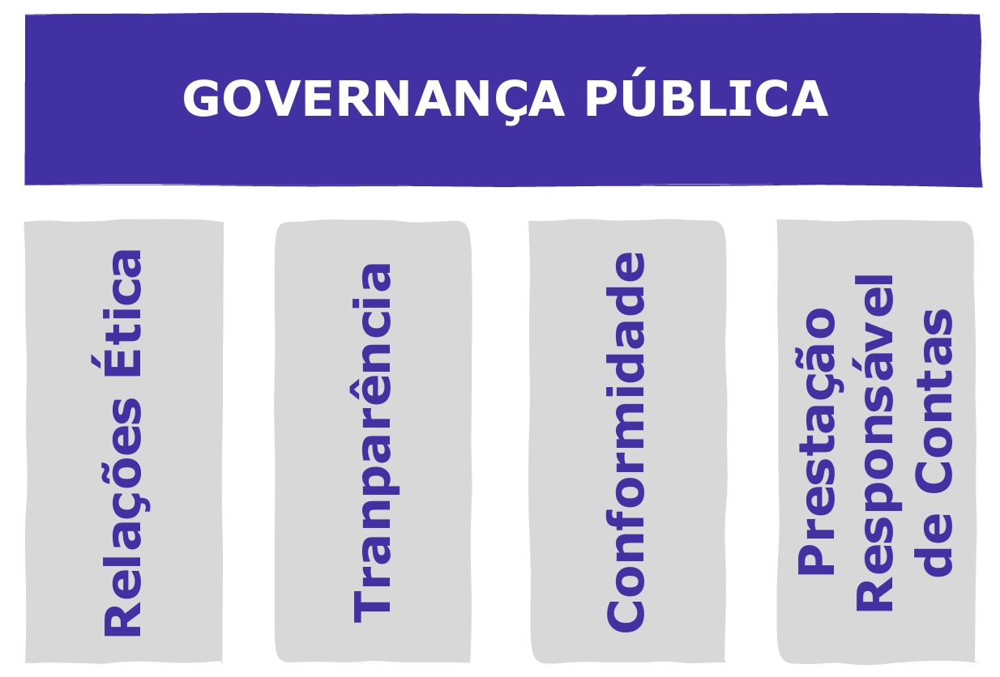
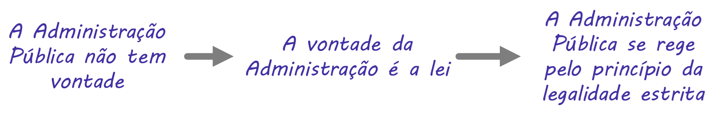

# Capítulo 6 – Ética no Serviço Público

A ética no serviço público é, antes de tudo, um compromisso fundamental do servidor com a verdade, a justiça e o bem comum. Para compreender a profundidade e a necessidade deste compromisso, é preciso reconhecer a natureza da instituição a que se serve: o Estado. Sendo a instituição de mais alto poder na sociedade, suas decisões afetam profundamente a vida dos cidadãos. Em sua arena, convergem forças que representam os mais diversos e, muitas vezes, conflitantes interesses da coletividade.

Contrariamente à percepção comum, a Administração Pública não age por meio de indivíduos isolados, movidos por vontades particulares. Sua natureza é intrinsecamente **coletiva e processual**. Uma decisão de grande impacto raramente é fruto da deliberação de uma única pessoa; ela é o resultado de um processo que envolve diversos agentes, pareceres, análises e etapas. Em tal cenário, a ética desempenha um papel crucial, funcionando como o alicerce que garante que estas ações coletivas estejam alinhadas não apenas com a legalidade estrita, mas com princípios universais de justiça, equidade e moralidade.

A Administração deve, a todo momento, articular princípios e valores que frequentemente entram em choque, colocando-os em perspectiva a fim de conciliá-los ou priorizá-los. É nesse contexto que surgem os dilemas morais, vivenciados justamente por aqueles que procuram pautar sua conduta pela ética.

A ética na Administração Pública não é apenas uma questão de fazer o que é certo, mas de fazê-lo pelo motivo certo. Ela instaura, portanto, uma **cultura de justificação de escolhas**, delimitando parâmetros objetivos para a formulação de decisões que devem se basear não em preferências pessoais, mas em argumentos universalizáveis e defensáveis perante a sociedade.

Nesse sentido, podemos afirmar que a ética no serviço público se manifesta e se sustenta sobre três dimensões interdependentes.

1. **A Dimensão Pessoal:** A natureza do indivíduo que ingressa no serviço público é de extrema relevância, pois se exige que o servidor possua um caráter moral elevado. Os agentes públicos são a face visível do Estado e, ao mesmo tempo, a interface direta com a população. Daí decorre a imensa responsabilidade de desempenhar suas funções com **integridade, probidade e imparcialidade**. Ao lidar diariamente com o público, o servidor tem o dever de respeitar e dignificar cada cidadão, recordando sempre que sua atuação não é em nome próprio, mas como representante dos interesses coletivos.
2. **A Dimensão Profissional:** A natureza do serviço executado é igualmente importante. A ética, aqui, manifesta-se no zelo e na competência. O servidor público deve ter um profundo conhecimento da legislação e dos procedimentos que regem o seu trabalho. Ele deve ser capaz de tomar decisões que estejam em plena conformidade com a lei e que atendam aos interesses da população, em alinhamento com o **princípio da finalidade**, que exige que todo ato administrativo busque o fim público para o qual foi idealizado. A ética profissional, portanto, vai além da honestidade, abrangendo a dedicação, a eficiência e o compromisso com a excelência na prestação do serviço.
3. **A Dimensão Relacional:** A própria designação "serviço público" revela a essência desta dimensão. Os servidores, como o nome indica, servem ao público. Eles são a ponte entre o Estado e a população, e a **confiança** é o pilar fundamental que sustenta essa relação. Essa confiança, por sua vez, é construída e mantida com base na conduta ética de cada agente. Cada atendimento, cada decisão, cada ato administrativo contribui para fortalecer ou erodir a confiança do cidadão nas instituições. A transparência, a urbanidade e a presteza não são meras formalidades, mas manifestações concretas do compromisso ético do servidor com aqueles a quem ele serve.

## Moral e Direito: Duas Faces da Mesma Moeda na Ética Pública

A ética no serviço público é ainda uma confluência entre a Moral e o Direito. Ao contrário do que muitos podem supor, ela não se baseia apenas em uma estrutura de valores pessoais ou coletivos. A ética no setor público dança na encruzilhada de, pelo menos, dois componentes cruciais e interdependentes: a moral e o direito.

Para compreender essa confluência, é preciso, primeiramente, distinguir os dois campos:

- A **Moral** diz respeito ao conjunto de princípios, valores e costumes que orientam o comportamento humano em uma determinada sociedade e em um determinado tempo. Seu fundamento reside na consciência individual e na convenção social. A sanção para uma conduta imoral é, tipicamente, de natureza interna (culpa, remorso) ou social (reprovação, ostracismo).
- O **Direito**, por sua vez, consiste em um conjunto de normas e princípios de conduta que são impostos de forma coercitiva pelo Estado. Seu fundamento é a autoridade de um poder soberano, e sua violação acarreta sanções formais e predefinidas (multas, penas privativas de liberdade, sanções administrativas).

Enquanto a moral se pergunta "o que é o bem?", o direito se pergunta "o que é o lícito?". No setor público, essa dualidade assume uma forma peculiar e indissociável.

As regras éticas que regem a conduta do servidor público não são simples manifestações de bons costumes ou de um código de valores coletivos. Elas possuem peso de lei. São, de fato, **normas jurídicas** que, quando violadas, implicam consequências legais. Um servidor público não adere aos princípios éticos de sua função apenas por convicção pessoal ou por pressão social, mas porque há uma estrutura legal que o **obriga** a fazê-lo. É essa estrutura que garante a **coação** em casos de desvios éticos.

- **Exemplo:** Um cidadão em uma fila de banco que fura a fila comete um ato considerado imoral pela maioria, sujeito à reprovação social. No entanto, um servidor público que, em seu guichê de atendimento, deliberadamente inverte a ordem da fila para beneficiar um conhecido não comete apenas um ato imoral; ele viola o **princípio da impessoalidade**, uma norma jurídica explícita na Constituição (art. 37) e nos códigos de ética, e está sujeito a um processo administrativo disciplinar e a uma sanção formal.

As regras éticas do setor público são, portanto, mais que regulamentos morais; são normas jurídicas e, como tais, passíveis de coação. A ética pública é a **moral administrativamente juridicizada**. Ela representa a internalização, pelo Direito, de um conjunto de valores morais que a sociedade considera indispensáveis para o correto exercício do poder estatal, transformando-os em deveres funcionais cujo cumprimento pode ser exigido e fiscalizado.

## A Distinção entre Público e Privado e a Ética do Bem Comum

Muitas vezes, o setor público é comparado ou contraposto ao privado, como se ambos operassem sob as mesmas regras e motivações. Contudo, suas essências, finalidades e, consequentemente, seus imperativos éticos são fundamentalmente distintos. Enquanto o setor privado pode ter, como principal e legítimo objetivo, o lucro e o retorno para seus acionistas, o setor público lida com os grandes embates sociais e busca incessantemente o **bem comum**.

Esta busca se traduz na **ética do bem comum**, que visa a promover que as decisões tomadas pela Administração Pública sejam a opção mais vantajosa que beneficie o maior número de pessoas. O bem comum, neste contexto, deve ser entendido não apenas como o patrimônio material do Estado, mas também como o conjunto dos princípios, das regras, das instituições e dos meios que visam a garantir a dignidade, os direitos e a existência de todos os membros de uma sociedade.

A natureza do serviço público não é redutível àquela de uma empresa privada. Ela remete a embates sociais que interessam à ética do bem comum, cujo objeto é a riqueza comum. Para uma administração pública eficaz e íntegra, é crucial que cada servidor entenda seu papel como agente transformador e se perceba como parte essencial de uma estrutura maior, dedicada a este fim. A ética e a moralidade, neste contexto, transcendem a mera obrigação, tornando-se uma vocação intrínseca ao exercício da função pública.

Historicamente, desde as primeiras civilizações, o Estado tem desempenhado um papel central na organização social, atuando como guardião da ordem e promotor do bem comum. Neste sentido, é imperativo que suas ações reflitam valores éticos e morais inabaláveis, como justiça, equidade e transparência. Esta responsabilidade se estende a todos os níveis da administração pública, exigindo dos servidores uma conduta pautada por esses mesmos princípios.

No entanto, a realidade ainda revela casos de desvios de conduta e corrupção, que minam a confiança da população nas instituições e comprometem a moralidade do Estado. Para combater essas práticas e fortalecer a ética no serviço público, são implementadas diversas iniciativas, como a criação de leis mais rigorosas de combate à corrupção e à improbidade, a atuação de instituições de controle efetivas (como os Tribunais de Contas e a Controladoria-Geral da União), a realização de auditorias regulares, a implementação de programas de _compliance_ e integridade nos órgãos, o investimento em treinamentos contínuos sobre ética e a realização de processos seletivos criteriosos que avaliem não apenas o conhecimento técnico, mas também a idoneidade moral dos candidatos.

A conduta ética dos servidores não apenas reflete seus valores pessoais, mas também molda a imagem e a eficácia do Estado. Um servidor comprometido com a ética, a probidade e a integridade contribui diretamente para uma administração pública respeitável e confiável. O **princípio da legalidade**, que delimita as ações do Estado, é um componente fundamental dessa estrutura, mas não é o único.

A avaliação da conduta dos servidores públicos não deve se limitar apenas à legalidade de suas ações. É essencial considerar também a aderência a princípios éticos que refletem os valores mais profundos da sociedade. A ética na administração pública emerge, assim, como um instrumento vital para a proteção de direitos fundamentais, como a liberdade e a igualdade, fortalecendo o tecido moral da _res publica_ (a "coisa pública") e assegurando um Estado mais justo e equitativo.

### Bases Teóricas da Ética no Setor Público

Diversos pensadores se debruçaram sobre a natureza do Estado e da justiça, e suas teorias fornecem uma base sólida para a compreensão da ética no serviço público.

- **Max Weber:** O sociólogo alemão estudou o Estado e o fenômeno da burocracia. Para Weber, o Estado moderno se caracteriza pela **impessoalidade**, pela **racionalidade** e pela **legalidade**. A impessoalidade é essencial para a ética pública, pois garante que os funcionários atuem em nome do interesse do Estado, e não em nome próprio ou de seus interesses particulares. A decisão deve ser técnica e baseada em regras, e não em favoritismos ou relações pessoais.
- **John Rawls:** O filósofo americano desenvolveu uma influente teoria da justiça. Para Rawls, a justiça é o princípio básico que deve guiar todas as instituições sociais, incluindo o Estado. Essa justiça deve ser baseada na ideia de **igualdade de oportunidades**, de modo que todos os cidadãos tenham a mesma chance de alcançar o sucesso e de serem tratados com equidade pelo poder público, independentemente de sua origem social ou econômica.
- **Amartya Sen:** O economista e filósofo indiano, laureado com o Prêmio Nobel, defende a ideia de **desenvolvimento como liberdade**. Para Sen, o objetivo do Estado não deve ser apenas o crescimento econômico, mas a expansão das **capacidades** das pessoas de viverem a vida que têm razões para valorizar. O desenvolvimento humano é um conceito amplo que inclui não apenas a renda, mas também a saúde, a educação e as liberdades civis e políticas.

Os princípios e valores defendidos por esses autores são essenciais para a ética no setor público. A impessoalidade, a racionalidade, a justiça, a igualdade de oportunidades e a promoção do desenvolvimento humano são todos princípios que devem guiar os funcionários públicos em suas ações, transcendendo a mera execução burocrática de tarefas e alinhando sua atuação ao propósito maior do bem comum.

Além desses princípios, existem também uma série de regras e normas que devem ser seguidas pelos funcionários públicos. Essas regras e normas são estabelecidas em leis, decretos e outros regulamentos. Elas servem para garantir que os funcionários públicos atuem de acordo com os princípios éticos e para proteger os interesses da sociedade.

O cumprimento das regras e normas éticas é essencial para a boa governança. Quando os funcionários públicos atuam de forma ética, eles contribuem para o desenvolvimento de uma sociedade mais justa e democrática.

### Os Pilares da Governança Pública

A governança pública pode ser entendida como o conjunto de mecanismos de liderança, estratégia e controle postos em prática para avaliar, direcionar e monitorar a atuação da gestão, com vistas à condução de políticas públicas e à prestação de serviços de interesse da sociedade. Segundo Matias-Pereira (2008), a governança pública está apoiada em quatro princípios fundamentais:

  * **Relações Éticas:** Este é o pilar fundamental. A ética não é apenas um conjunto de boas intenções, mas se traduz em ações concretas que devem ser pautadas pelo interesse público. Todo ato administrativo possui implicações e, do ponto de vista ético, seu limite é a não nocividade social, ou seja, a obrigação de não causar dano à coletividade.
  * **Transparência (Transparency):** Este princípio determina que as ações, decisões e, principalmente, o uso de recursos públicos devem ser abertos ao conhecimento e ao escrutínio da sociedade. A transparência vai além da mera divulgação de dados; ela busca garantir que as informações sejam claras, compreensíveis e acessíveis ao cidadão mediano, permitindo-lhe exercer um controle social eficaz sobre a conduta do gestor público.
  * **Conformidade (Compliance):** Este pilar garante que os atos da Administração estejam em total sintonia com as leis, as normas e os regulamentos vigentes. É a materialização do princípio da legalidade, assegurando que a atuação do agente público não se desvie do que é permitido e determinado pelo ordenamento jurídico.
  * **Prestação de Contas (Accountability):** Este conceito, como bem pontuado por O'Donnell (1998), é mais amplo que uma mera prestação de contas financeira. *Accountability* representa uma postura de responsabilidade e compromisso inegociável com a verdade. Implica não apenas o dever de informar sobre os atos praticados, mas também o de **justificá-los** perante a sociedade e as instâncias de controle, estando sujeito a **sanções** em caso de desvios.

No Brasil, as agências de *accountability* formam uma rede robusta, incluindo o Ministério Público, o Poder Judiciário, o sistema de controle interno de cada Poder e, de forma destacada, os **Tribunais de Contas**. Estes últimos têm a responsabilidade de fiscalizar a correta aplicação dos recursos públicos e assegurar a obediência à Lei de Responsabilidade Fiscal, que tem a transparência como um de seus pilares centrais.

A administração pública é o meio pelo qual o Estado executa as prioridades do governo, e a efetividade, nesse contexto, refere-se ao grau em que essas ações refletem o verdadeiro interesse público. A coletividade deve ser capaz de reconhecer suas demandas nas ações governamentais.

Em suma, a transparência e a prestação de contas são alicerces sólidos de uma governança eficaz e ética. A transparência permite que a sociedade, através de instrumentos como análise de conformidade e desempenho, avalie e decida sobre a continuidade ou modificação de uma gestão. Afinal, é a sociedade, munida de informações claras e relevantes, que representa o mais poderoso mecanismo de controle da conduta do gestor público, conduzindo não só ao cumprimento das leis, mas ao atendimento genuíno das necessidades e expectativas da coletividade.

Como vimos, a Administração Pública ética é orientada para o bem comum e regida por princípios que transcendem a lógica do setor privado. Essa orientação se materializa em um conjunto de regras e normas que devem ser seguidas pelos servidores públicos, estabelecidas em leis, decretos e, de forma especial, nos Códigos de Ética.

### O Código de Ética e sua Relação com a Lei

Poderia surgir o questionamento: por que seria necessário um código de ética, se as leis e o regime disciplinar já estabelecem o que o servidor pode ou não fazer? A resposta reside na diferença de foco e profundidade entre a legalidade estrita e a conduta ética. A lei, por sua natureza, concentra-se na correta realização dos **procedimentos** e na definição de proibições objetivas. O código de ética, por sua vez, visa garantir que esses procedimentos sejam realizados com **integridade**, capturando o espírito por trás da norma.

A ética vai além da mera adesão às regras; ela busca o bem comum e a justiça social. No contexto da administração, isso significa não apenas seguir o que é legal, mas também o que é moral e justo, agindo sempre com o objetivo de beneficiar a coletividade.

#### Código de Ética vs. Regime Disciplinar

O Código de Ética e o Regime Disciplinar do Servidor (previsto na Lei nº 8.112/1990) são instrumentos fundamentais na governança pública, mas possuem naturezas e objetivos distintos e complementares.

- O **Código de Ética** é um documento que estabelece os padrões de comportamento esperados dos servidores, baseando-se em valores e princípios morais. Ele serve como uma **bússola moral**, orientando as ações de maneira **proativa**. Seu objetivo é inspirar e educar, oferecendo diretrizes que definem uma prática desejável e honrosa, motivando a reflexão e incentivando os servidores a agirem de maneira ética mesmo em situações não explicitamente previstas em lei.
- O **Regime Disciplinar**, por outro lado, é um conjunto de regras que especificam as condutas inadequadas e as sanções aplicáveis. Seu foco é **reativo** e **punitivo**, estabelecendo as consequências legais para atos que desviam dos padrões. É uma ferramenta de controle que visa assegurar que o serviço público opere dentro dos limites da legalidade e que os servidores que falharem em seguir as normas sejam responsabilizados.

Também não faria sentido ter um código de ética que apenas repetisse o que já está plenamente determinado na lei. Para que não seja uma mera repetição, o código deve explicitar os **valores** afirmados por aquele grupo profissional e, em seguida, solidificá-los por meio de normas que sirvam de instrumento para realizar tais valores. Por isso, um código de ética não é simplesmente um conjunto de regras punitivas, mas sim um **guia para a conduta**.

#### A Construção Coletiva do Código de Ética: O Papel da Sociedade

Para que um código de ética seja eficaz e ressoe com os valores tanto internos (dos servidores) quanto externos (da sociedade), é fundamental que ele seja construído de forma participativa.

A **participação da sociedade** na construção de um código de ética confere **legitimidade** ao documento. Quando a comunidade tem a oportunidade de contribuir, ela se torna coautora das normas e, por conseguinte, mais comprometida em respeitar e defender os princípios ali estabelecidos. Esse processo democrático garante que as diretrizes se alinhem com as expectativas da população.

O envolvimento da sociedade também promove **transparência e responsabilidade**. Ao abrir o diálogo para diferentes setores, as instituições demonstram seu compromisso com a inclusão. Ademais, a construção coletiva fomenta a **educação e a conscientização** sobre a ética, estimulando o debate e a reflexão.

Como citado pelo antropólogo Roberto Da Matta, “quando falamos de ética como instrumento de gestão, não podemos deixar de convidar a sociedade como um todo, para o programa de reformas”. A reflexão de Da Matta aponta para a necessidade de uma abordagem inclusiva, baseada nos seguintes pontos:

- **Participação Social:** A eficácia das práticas éticas depende do envolvimento de diferentes setores sociais no processo de mudança, garantindo que as reformas atendam às verdadeiras necessidades da população.
- **Corresponsabilidade:** A construção de uma gestão pública íntegra é um papel de todos, não apenas dos gestores, mas de cada indivíduo na sociedade.
- **Educação para a Cidadania:** Para que a sociedade participe ativamente, é necessário promover a educação sobre direitos, deveres e o funcionamento das instituições.
- **Transparência e Diálogo:** O diálogo constante entre o Estado e a sociedade é fundamental para que a ética seja percebida e valorizada como um instrumento de gestão.
- **Monitoramento e Avaliação:** A sociedade deve ter meios de monitorar e avaliar as práticas de gestão pública, contribuindo para um controle social efetivo.

Por fim, é importante ressaltar que a construção de um código de ética em conjunto com a sociedade é um processo contínuo. A ética pública não é estática, e os códigos devem ser revisados e atualizados periodicamente para refletir as mudanças nos valores sociais e nas expectativas da comunidade.

## A Ética à luz dos Princípios Fundamentais

Os servidores públicos são agentes do Estado e, como tal, devem representá-lo de forma ética e moral. Isso significa que eles devem agir de acordo com os valores que o Estado defende, como a honestidade, a transparência, a eficiência e a justiça.

Para garantir que a atuação do agente público não se desvie desses valores, a própria Constituição Federal, em seu artigo 37, estabelece os princípios básicos que devem nortear toda a Administração Pública. Esses princípios não são meras sugestões, mas sim mandamentos jurídicos que formam a base da ética no serviço público. Além deles, existem, obviamente, uma série de outras regras e normas que devem ser seguidas, estabelecidas em leis e regulamentos. O cumprimento desse arcabouço ético-jurídico é essencial para a boa governança e para o desenvolvimento de uma sociedade justa e democrática.

### Os Princípios Constitucionais da Administração Pública

O _caput_ do artigo 37 da Constituição Federal de 1988 elenca cinco princípios fundamentais que devem reger os atos da Administração Pública direta e indireta, de qualquer dos Poderes da União, dos Estados, do Distrito Federal e dos Municípios. Para fins de memorização, estes princípios são conhecidos pelo mnemônico **LIMPE**.

- **Legalidade:** Este princípio determina que o agente público só pode fazer o que a lei permite ou determina. Diferentemente do cidadão comum, que pode fazer tudo o que a lei não proíbe (princípio da autonomia da vontade), o administrador público está estritamente adstrito à lei. A lei não é apenas um limite, mas o fundamento de sua ação.
    - **Exemplo:** Se uma lei municipal de zoneamento proíbe a construção de edifícios com mais de dez andares em uma determinada área, um servidor da secretaria de urbanismo não pode, sob nenhuma hipótese ou justificativa, aprovar um projeto de doze andares nessa zona. Sua vontade é irrelevante; a vontade que ele deve executar é a da lei.
- **Impessoalidade:** O servidor deve tratar todos os cidadãos de maneira igual, sem favorecimentos ou preconceitos. O foco deve ser sempre o interesse público, e não interesses pessoais, de grupos ou de terceiros. A impessoalidade possui uma dupla face:
    1. **Em relação aos administrados:** Veda perseguições ou privilégios. Em um processo de licitação, por exemplo, o servidor não deve dar vantagem a uma empresa devido a relações pessoais com seus sócios.
    2. **Em relação à própria Administração:** Os atos praticados pelo servidor são imputados ao Estado, e não à pessoa do agente. Por essa razão, é vedada a promoção pessoal de autoridades ou servidores em atos, obras e campanhas dos órgãos públicos.
- **Moralidade:** A moralidade no serviço público não se limita à distinção entre o bem e o mal, mas se traduz em um conceito jurídico que exige do servidor um comportamento pautado pela honestidade, pela lealdade e pela boa-fé. Um ato pode ser legal, mas imoral e, por isso, inválido. A moralidade administrativa implica, por exemplo, que o servidor deve evitar situações que possam gerar conflito de interesses, como participar de decisões em que ele ou seus familiares tenham interesses particulares.
- **Publicidade:** As ações do serviço público devem ser transparentes e abertas ao escrutínio da sociedade, garantindo que os cidadãos sejam informados sobre os atos administrativos. A publicidade não é apenas um dever de transparência, mas também um requisito de eficácia para muitos atos, que só passam a valer após sua devida publicação.
    - **Exemplo:** A divulgação de editais de concursos e licitações, dos salários dos servidores no Portal da Transparência e dos relatórios de gestão em sites oficiais são manifestações do princípio da publicidade, que é instrumentalizado principalmente pela Lei de Acesso à Informação (LAI).
- **Eficiência:** Incluído pela Emenda Constitucional nº 19/1998, este princípio exige que o serviço público seja exercido com presteza, perfeição e rendimento funcional, buscando sempre a otimização de recursos e a qualidade dos serviços prestados. A eficiência impõe uma lógica gerencial à Administração, que deve buscar não apenas a legalidade, mas o melhor resultado possível com os recursos disponíveis, evitando desperdícios e buscando a melhoria contínua.
    - **Exemplo:** A implementação de sistemas eletrônicos para agilizar processos burocráticos, reduzindo o tempo de espera do cidadão, é uma medida que concretiza o princípio da eficiência.

### Direitos e Deveres do Servidor Público

A relação entre o servidor e o Estado é uma via de mão dupla, regida por um conjunto de direitos que garantem sua dignidade e desenvolvimento profissional, e por um conjunto de deveres que asseguram que sua atuação seja sempre pautada pelo interesse público.

#### Direitos do Servidor Público

Os direitos do servidor público são garantias que visam a assegurar condições de trabalho justas, estabilidade e a possibilidade de desenvolvimento na carreira.

- **Estabilidade:** A estabilidade é um direito fundamental dos servidores públicos nomeados para cargo de provimento **efetivo**, adquirida após **três anos de exercício** e aprovação em avaliação especial de desempenho, conforme previsto na Constituição Federal. Esta estabilidade não significa que o servidor seja "inamovível", mas sim que sua demissão só pode ocorrer em situações específicas e após o devido processo legal: por sentença judicial transitada em julgado; mediante processo administrativo em que lhe seja assegurada ampla defesa; ou mediante procedimento de avaliação periódica de desempenho insuficiente. Além disso, em casos extremos de excesso de despesa com pessoal, a estabilidade pode ser relativizada, permitindo a exoneração do servidor estável, conforme critérios definidos em lei.
- **Vencimentos:** O direito aos vencimentos é a garantia da contraprestação pecuniária que o servidor recebe pelo exercício de suas funções. Esses vencimentos devem ser justos e proporcionais à complexidade e responsabilidade do cargo. A remuneração do servidor é composta pelo **vencimento básico** (o salário-base) e pode ser acrescida de **vantagens pecuniárias**, como gratificações e adicionais (por tempo de serviço, quando houver, por insalubridade, noturno, etc.). Os vencimentos são protegidos pelo princípio da irredutibilidade, não podendo ser reduzidos, salvo em casos específicos previstos em lei, como para adequação ao teto constitucional ou para o custeio da seguridade social.
- **Progressão de Carreira:** A progressão na carreira é o direito do servidor de avançar para níveis ou classes superiores dentro da estrutura de seu cargo, com o correspondente aumento remuneratório. Este avanço está vinculado a critérios objetivos definidos na lei de cada carreira, que geralmente combinam **tempo de serviço (antiguidade)** e **desempenho no cargo (merecimento)**. A avaliação de desempenho é feita por meio de processos regulares, e a progressão também pode estar associada à qualificação profissional, como a participação em cursos de capacitação e a obtenção de títulos de pós-graduação.
- **Licenças e Afastamentos:** O servidor tem direito a uma série de licenças para ampará-lo em diversas situações da vida, como para tratamento de saúde, à gestante e à paternidade, para capacitação, para o serviço militar, entre outras. Além disso, pode ter direito a afastamentos para o exercício de mandato eletivo ou para estudo ou missão no exterior, conforme detalhado no estudo da Lei nº 8.112/1990.
- **Previdência Social:** O servidor efetivo tem direito à proteção do Regime Próprio de Previdência Social (RPPS), que lhe garante os benefícios de **aposentadoria** e, a seus dependentes, a **pensão por morte**, seguindo regras específicas definidas na Constituição Federal.
- **Jornada de Trabalho Justa:** O servidor tem direito ao respeito à carga horária estabelecida em lei para o seu cargo, bem como ao gozo de repouso semanal remunerado e férias anuais. A prestação de serviço extraordinário deve ser remunerada com acréscimo ou compensada, conforme a legislação.

#### Deveres do Servidor Público

Os deveres do ofício são as obrigações que os profissionais têm para com a sociedade (o cidadão), o empregador (a Administração Pública) e os colegas. Eles são o cerne da conduta ética esperada de um agente público. O objetivo desses deveres é reduzir a lesão a direitos reconhecidos, entendida como qualquer ato, intencional ou não, que cause prejuízo a uma pessoa, seja ele físico, moral ou patrimonial.

- **Prestar Serviços com Zelo e Diligência:** O servidor deve executar suas funções com eficiência, responsabilidade, cuidado e presteza, garantindo a qualidade do serviço. Isso implica não apenas na observância das leis, mas na busca contínua pela melhoria. A negligência, a desídia (preguiça, desleixo) ou a procrastinação no desempenho das atividades caracterizam violação deste dever.
- **Manter Conduta Compatível com a Moralidade Administrativa:** Este dever exige que o servidor aja com ética, integridade, honestidade e decoro. Ele não deve se envolver em práticas corruptas, conflitos de interesse ou qualquer ação que possa comprometer a confiança do público na instituição. A conduta do servidor, tanto dentro quanto fora da repartição, deve refletir os mais altos padrões de moralidade.
- **Ser Leal às Instituições:** A lealdade às instituições implica em um compromisso com os objetivos e valores da entidade pública e do Estado. O servidor deve respeitar a hierarquia e as decisões superiores. Contudo, essa lealdade **não se sobrepõe à legalidade e à moralidade**. Se uma ordem superior for manifestamente ilegal, o dever do servidor é não cumpri-la e representar contra a autoridade que a emitiu.
- **Respeitar os Direitos dos Cidadãos:** O servidor deve tratar todos os cidadãos com respeito, urbanidade, igualdade e justiça, garantindo o acesso aos serviços públicos sem qualquer tipo de discriminação.
- **Zelar pela Economia e pelo Patrimônio Público:** O servidor tem o dever de evitar desperdícios e de utilizar os recursos públicos (materiais, equipamentos, etc.) de maneira eficiente, responsável e exclusivamente para fins públicos.
- **Manter Sigilo Profissional:** Proteger informações confidenciais a que tenha acesso em razão do cargo, respeitando a privacidade dos cidadãos e a segurança da informação do Estado.
- **Atualização e Capacitação Constantes:** O servidor deve buscar ativamente a atualização de seus conhecimentos e sua capacitação profissional, visando aprimorar continuamente a qualidade do serviço que presta à sociedade.
- **Impedir e Denunciar Irregularidades:** O servidor tem o dever funcional de não ser conivente com ilegalidades. Ao presenciar ou tomar conhecimento de atos ilegais, imorais ou antieconômicos, ele tem a obrigação de levar o fato ao conhecimento da autoridade competente, contribuindo para a integridade e a transparência da Administração Pública.

Com certeza. Dando continuidade ao Capítulo 6, apresento o desenvolvimento do tópico sobre a **integração entre a vida pública e a vida privada**, com os devidos aprofundamentos e a estrutura solicitada.

---

## A Vida Pública se Integra à Vida Privada

Primeiramente, é imprescindível compreender que a atividade de servidor público não se limita a uma mera ocupação, mas sim a uma **profissão** com um múnus público específico. Ao assumir esse papel, os servidores carregam consigo a responsabilidade de representar o Estado e a sociedade como um todo. Isso exige a adoção de valores éticos sólidos, que devem nortear suas ações não apenas no ambiente de trabalho, mas em todas as esferas da vida.

O filósofo Aristóteles afirmava que "somos aquilo que fazemos repetidamente. A excelência, portanto, não é um ato, mas um hábito." Assim, a ética, como um hábito a ser cultivado, deve estar presente de forma contínua, manifestando-se tanto na esfera pública quanto na esfera privada da vida do servidor.

A vida pública e a vida privada do servidor não são compartimentos estanques, mas sim aspectos interligados de sua existência. Os fatos e atos praticados no âmbito privado podem impactar diretamente o conceito que a sociedade tem do servidor em sua vida funcional. Afinal, como representantes do Estado, suas atitudes refletem na confiança depositada pela população nos serviços e nas instituições.

### O Impacto da Conduta Privada na Função Pública

Os exemplos hipotéticos a seguir demonstram como a vida privada pode influenciar a percepção e a legitimidade da atuação de um servidor público:

- **A Importância da Honestidade:** Se um servidor, em sua vida privada, for conhecido por agir de forma desonesta em seus negócios pessoais ou por faltar com a verdade em suas relações, essa reputação pode gerar uma desconfiança generalizada sobre sua idoneidade no exercício do cargo público, questionando a lisura de suas decisões.
- **A Responsabilidade Financeira:** Suponha que um servidor tenha uma vida financeira desregrada, resultando em múltiplas dívidas e inadimplência. Essa situação de vulnerabilidade pode afetar sua capacidade de tomar decisões justas e imparciais no serviço público, especialmente se ele atuar em áreas sensíveis, como fiscalização, compras ou gestão de contratos, onde pode se tornar mais suscetível a propostas de corrupção.
- **O Conflito de Interesses:** Imagine um servidor que seja responsável pela análise de processos de licenciamento ambiental. Se, em sua vida privada, ele possuir participação societária em uma empresa de consultoria ambiental, seu julgamento pode ser comprometido, gerando a suspeita de que ele poderia favorecer clientes de sua empresa ou utilizar informações privilegiadas do cargo para benefício privado.
- **A Transparência na Prestação de Contas:** Um servidor que, em sua vida privada, utiliza recursos de uma associação de moradores da qual faz parte de forma pouco transparente, justificando como "pequenos desvios" ou "caixa dois", demonstra uma conduta que não condiz com os princípios da publicidade e da moralidade exigidos no serviço público, comprometendo a confiança da sociedade no órgão em que trabalha.

Nesse contexto, quando os servidores públicos incorporam os valores morais e a boa-fé à sua vida privada, eles não apenas se protegem de questionamentos, mas também contribuem para a criação de um ambiente de trabalho mais positivo e produtivo. Eles fortalecem a confiança dos usuários do serviço, o que é essencial para a melhoria da qualidade do serviço público como um todo.

### A Construção da Confiança Através da Conduta

A incorporação de valores morais e da boa-fé à vida privada se manifesta em posturas que reforçam a ética profissional. Servidores públicos podem cultivar essa integração ao:

- **Serem honestos e transparentes** em todas as suas relações, tanto profissionais quanto pessoais.
- **Serem justos e imparciais** em suas decisões, evitando que preferências ou antipatias pessoais influenciem seus atos.
- **Serem respeitosos** com seus colegas e com os usuários do serviço, tratando a todos com urbanidade e cortesia.
- **Serem comprometidos** com a qualidade do serviço público, buscando sempre a excelência.
- **Serem exemplos de ética e moral** para seus colegas e para a sociedade, compreendendo que sua conduta é um reflexo da imagem do próprio Estado.

## A Finalidade do Serviço Público: A Busca pelo Bem Comum

A Administração Pública, ao exercer suas funções, é regida por um princípio fundamental e norteador: a **moralidade**. Isso significa que todas as suas ações e decisões devem estar intrinsecamente e inegociávelmente ligadas ao objetivo maior de alcançar o **bem comum** para toda a sociedade. A moralidade da Administração Pública está sempre ligada à ideia de que o fim é sempre o bem comum.

Como agentes ativos na administração pública, os servidores são os alicerces sobre os quais se constrói uma sociedade mais justa e equitativa. Sua atuação diária, desde o ato mais simples até a decisão mais complexa, influencia diretamente a qualidade de vida e o bem-estar da população. Eles são a materialização do Estado na vida do cidadão.

A Administração Pública contemporânea está imbuída de uma visão que privilegia o **interesse coletivo**, colocando-o acima dos desejos individuais ou das aspirações de grupos específicos. Esta abordagem não é meramente uma questão de governança, mas sim um compromisso ético profundo com o desenvolvimento integral da sociedade. O servidor público se torna, portanto, um instrumento vital para o aprimoramento das condições de vida e para o atendimento às necessidades fundamentais dos cidadãos.

Como bem expressou o pensador John Gardner, a moralidade ultrapassa a simples adesão a normas e regulamentos; ela incorpora a **promoção ativa do bem-estar dos outros**. Nesse contexto, o conceito de bem comum se estabelece como o farol que guia as ações da Administração Pública. Servidores públicos, ao desempenharem suas funções, devem manter uma constante avaliação sobre se suas ações estão, de fato, contribuindo significativamente para o bem-estar coletivo e se estão alinhadas com o interesse público, ao invés de favorecerem interesses pessoais ou de grupos restritos.

Ademais, a atuação dos servidores públicos deve estar fundamentada em pilares sólidos de **transparência, responsabilidade e integridade**. Esses princípios não são apenas diretrizes administrativas, mas sim elementos essenciais que sustentam a confiança do cidadão no Estado. Essa confiança é a pedra angular de uma gestão pública eficaz, que não somente responde às expectativas dos cidadãos, mas também promove o desenvolvimento sustentável do país.

Portanto, é imperativo reconhecer e valorizar a função do servidor público na administração contemporânea. Ao abraçar a responsabilidade de agir em prol do bem comum, os servidores públicos desempenham um papel que vai além da mera execução de tarefas administrativas; eles são, de fato, os **guardiões dos valores democráticos e da justiça social**. Nessa perspectiva, reafirma-se o compromisso com uma Administração Pública que, verdadeiramente, serve ao povo e reflete as aspirações de uma sociedade que anseia por igualdade, justiça e prosperidade para todos.

## A Validade do Ato Administrativo: O Equilíbrio entre Legalidade, Finalidade e Moralidade

A moralidade administrativa é o pilar ético que fundamenta o exercício de todas as atividades na Administração Pública. Ela não se restringe apenas à conformidade do ato com a lei (legalidade), mas se estende ao propósito maior de alcançar o bem comum, sempre em consonância com os princípios éticos que regem a função pública.

É crucial compreender que a moralidade administrativa é considerada um princípio de **caráter objetivo**. Isso significa que ela não depende da opinião, da intenção ou do julgamento de cada servidor. Ela é baseada em um conjunto de princípios e normas que são universais para a Administração — como a honestidade, a lealdade, a boa-fé e o decoro — e que devem ser aplicados a todos os agentes públicos, independentemente de suas crenças ou valores pessoais.

Um ato administrativo, para ser considerado válido, deve estar em perfeito equilíbrio entre a **legalidade** e a **finalidade**. Isso significa que, além de respeitar as normas e leis vigentes, ele deve perseguir um propósito legítimo, voltado para o interesse público e o bem-estar coletivo. A validade do ato, portanto, depende de sua compatibilidade com a moralidade administrativa, que reside justamente nesse equilíbrio.

### O Princípio da Publicidade como Requisito de Eficácia e Moralidade

Além da legalidade e da finalidade, um ato administrativo, para produzir seus efeitos no mundo jurídico, precisa ser tornado público. O **princípio da publicidade** é um dos cinco princípios fundamentais da Administração Pública, previstos no artigo 37 da Constituição Federal. Este princípio estabelece que os atos administrativos devem ser praticados de forma transparente, para que todos os cidadãos possam ter acesso a eles e fiscalizar a atuação do Estado.

A publicidade dos atos é um instrumento essencial para a concretização da moralidade administrativa. A transparência permite que os cidadãos saibam o que o Estado está fazendo, como está gastando o dinheiro público e se está agindo de acordo com a lei. É a publicidade que submete o ato ao controle social.

Contudo, a publicidade não é um princípio absoluto. A legislação pátria permite que alguns atos sejam mantidos em sigilo, quando houver um interesse público justificado que se sobreponha à regra geral da transparência. Os casos de sigilo devem ser excepcionais, previstos em lei de forma clara e objetiva, e limitados ao mínimo necessário para proteger o interesse público.

A seguir, são apresentados alguns exemplos de atos administrativos que podem, legalmente, ser mantidos em sigilo:

- Informações sobre a **segurança nacional**, como a localização de bases militares ou planos de defesa;
- Informações sobre a **segurança pública**, como detalhes de investigações policiais em andamento;
- Informações que afetem a **intimidade, a vida privada, a honra e a imagem das pessoas**;
- Informações de **interesse superior do Estado**, como estratégias de negociações econômicas internacionais.

### Publicidade, Verdade e a Lei de Acesso à Informação

Outra face do princípio da publicidade é o dever do servidor de garantir o acesso do cidadão à verdade. O agente público não pode, em sua atuação, negar informações que são públicas, nem falsear a verdade em documentos ou atendimentos.

Este dever é instrumentalizado pela **Lei de Acesso à Informação (LAI) - Lei nº 12.527/2011**, que regulamenta o direito constitucional de acesso à informação. A LAI estabelece que os órgãos públicos devem praticar a **transparência ativa**, ou seja, publicar informações de interesse público de forma espontânea em seus portais. Além disso, a lei garante o direito à **transparência passiva**, permitindo que qualquer cidadão solicite informações aos órgãos públicos, que têm o dever de responder de forma completa, tempestiva e verdadeira. A recusa injustificada em fornecer informações públicas é uma conduta que viola a ética e pode gerar responsabilização para o servidor.

## A Ética como Elemento Indissociável da Função Pública

Ao discutirmos a ética no serviço público, é fundamental compreender que ela não é uma mera opção ou um acessório à conduta do servidor, mas sim um pilar inabalável que sustenta toda a sua atuação. É o alicerce que garante a legitimidade dos atos estatais e a confiança depositada pelos cidadãos nas instituições públicas.

A visão da Administração Pública é clara e incisiva quando se trata da ética: ela é o guia que orienta a tomada de decisões com responsabilidade e imparcialidade, considerando sempre o bem comum em detrimento de interesses particulares. O servidor público não pode, em momento algum, ignorar o elemento ético de sua conduta, pois é por meio dessa essência que a função pública se dignifica e o agente se torna um verdadeiro exemplo para a sociedade. A ética é o que confere credibilidade às ações estatais e torna os servidores dignos da confiança que lhes é depositada.

No cerne do serviço público, espera-se que os servidores atuem com **integridade**, adotando posturas coerentes e transparentes, independentemente da situação. A integridade, nesse contexto, significa uma aderência completa e consistente a um conjunto de valores morais e princípios éticos, garantindo que não haja dissonância entre o discurso e a prática. A atuação do servidor deve ser um reflexo direto dos valores que a Administração Pública preza e defende.

## Regras Imperativas vs. Regras Constitutivas: O "O Quê" e o "Como" da Conduta Pública

Adentrando os corredores da Administração Pública, somos constantemente lembrados da importância das normas e regras que orientam o comportamento dos servidores e a operação dos órgãos. Nesse universo, para uma compreensão mais profunda da ética e da legalidade, destacam-se duas categorias de regras: as **imperativas** e as **constitutivas**. Embora ambas sejam vitais para a eficácia da gestão, compreendê-las adequadamente pode fazer a diferença na hora de interpretar e aplicar diretrizes.

### Regras Imperativas: O Dever Ser da Ação Pública

As **regras imperativas**, por sua natureza, são aquelas que determinam o que **"deve ser"** feito, estabelecendo padrões mínimos e obrigatórios de conduta. São, em essência, não negociáveis e representam os limites e os deveres inafastáveis do agente público. Elas regulam comportamentos que já existem, prescrevendo ou proibindo ações.

- **Exemplo hipotético:** Imagine um servidor público que trabalha na comissão de licitações de um município. A Lei nº 14.133/2021 (Nova Lei de Licitações) determina que, em regra, as sessões de abertura de propostas devem ser públicas e registradas em ata. Tal diretriz é uma **regra imperativa**; não há espaço para que o servidor, por conveniência ou opinião pessoal, decida realizar a sessão de forma sigilosa. A lei impõe um dever.

O filósofo Immanuel Kant, com seu imperativo categórico, oferece uma base filosófica para essa noção: "Age apenas segundo uma máxima tal que possas ao mesmo tempo querer que ela se torne uma lei universal." Essa noção kantiana ressalta a natureza absoluta e universal das regras imperativas no serviço público: elas são os deveres que se aplicam a todos, em todas as circunstâncias previstas.

### Regras Constitutivas: A Criação da Realidade Administrativa

Diferente das imperativas, as **regras constitutivas** não apenas ditam o que deve ser feito, mas elas **criam ou constituem** novas formas de atividades ou realidades institucionais que, sem tais regras, seriam inexistentes. Elas definem o que "é" algo dentro de um sistema e como esse algo funciona.

- **Exemplo hipotético:** Pense em um servidor responsável por elaborar um novo protocolo de comunicação interdepartamental para o registro de processos. Enquanto a necessidade de registrar e comunicar os processos pode ser ditada por uma regra imperativa (um dever de ofício), a **forma** como essa comunicação ocorrerá — seja por meio de um sistema eletrônico específico, com formulários padronizados, prazos de resposta e fluxos de aprovação — será estabelecida por **regras constitutivas**. Essas regras não regulam uma atividade preexistente; elas **criam** a própria atividade de "protocolo interdepartamental" dentro daquele órgão.

O filósofo Ludwig Wittgenstein, em suas reflexões sobre jogos de linguagem, enfatizou que "para jogar um jogo, é preciso aceitar (...) o que as regras do jogo determinam." Essa aceitação é crucial para compreender o papel das regras constitutivas. Elas estabelecem o "como" de muitas operações na administração, definindo as próprias condições de possibilidade para que uma atividade exista.

### A Distinção e a Complementaridade

Para um servidor público, a habilidade de discernir entre regras imperativas e constitutivas é essencial. As primeiras estabelecem os parâmetros não negociáveis da conduta, enquanto as últimas proporcionam o espaço para a organização, a inovação e a adaptação às circunstâncias.

- O descumprimento de uma **regra imperativa** geralmente resulta em um ato **ilícito**, podendo acarretar consequências significativas, desde a anulação do ato até sanções disciplinares, cíveis e penais.
- O descumprimento de uma **regra constitutiva** pode não ter uma consequência jurídica imediata, mas torna o ato **inválido** ou **inexistente** dentro do sistema. Por exemplo, um gol marcado com a mão no futebol é um "não-gol", pois viola a regra que constitui o que é um gol válido. Da mesma forma, um processo protocolado fora das regras constitutivas do órgão pode ser simplesmente considerado "não protocolado".

A diferença fundamental, portanto, é que as **regras imperativas nos dizem o que devemos fazer**, enquanto as **regras constitutivas nos dizem o que é algo**.

### Aplicação nos Códigos de Conduta

Essa distinção se reflete nos diferentes tipos de códigos que regem a conduta do servidor:

- **Códigos de Conduta Imperativos:** Estabelecem regras e normas de cumprimento **obrigatório**. São geralmente previstos em lei ou em regulamentos e devem ser cumpridos sob pena de sanções.
    - **Exemplos:** A própria Constituição Federal, ao estabelecer os princípios da Administração Pública (legalidade, impessoalidade, etc.); os códigos de ética profissional (como o dos médicos ou advogados); e os regulamentos internos dos órgãos.
- **Códigos de Conduta Constitutivos:** Estabelecem os **princípios e valores** que devem ser seguidos e que definem a cultura da instituição. São geralmente mais flexíveis que os códigos imperativos, permitindo algum grau de decisão e escolha por parte do servidor sobre como melhor realizar aqueles valores.
    - **Exemplos:** O código de conduta ética da administração pública, que estabelece princípios como honestidade e transparência; e o código de conduta de uma organização específica, que pode estabelecer valores como a inovação, a colaboração e o trabalho em equipe.

Os códigos imperativos e constitutivos são complementares. Os primeiros fornecem o marco legal e regulatório que **deve** ser seguido, enquanto os segundos fornecem os princípios e valores que devem **inspirar** a conduta. A combinação de ambos é essencial para garantir uma administração pública que seja, ao mesmo tempo, legal, eficiente e profundamente ética.

## Ética e Cidadania: A Dimensão Coletiva da Conduta Pública

A ética no serviço público encontra seu sentido mais profundo na promoção da cidadania. Esses dois conceitos estão intrinsecamente ligados, pois uma administração pública ética é aquela que atua para garantir que todos os membros da sociedade possam exercer plenamente seus direitos e deveres.

### Definindo a Cidadania

A cidadania é um conceito multifacetado. Em sua dimensão jurídico-política, ela é definida como o vínculo que liga um indivíduo a um Estado. Conforme leciona Dalmo Dallari (2008), "a cidadania expressa um conjunto de direitos que dá à pessoa a possibilidade de participar ativamente da vida e do governo de seu povo. Quem не tem cidadania está marginalizado ou excluído da vida social e da tomada de decisões, ficando numa posição de inferioridade dentro do grupo social".

O dicionário Aurélio complementa essa visão, definindo o cidadão como "aquele indivíduo no gozo dos direitos civis e políticos de um Estado, ou no desempenho de seus deveres para com este".

No entanto, para a ética, não basta que exista um elenco de princípios fundamentais e direitos definidos nas Constituições. O grande desafio ético para uma nação é o de **universalizar os direitos reais**, permitindo a todos uma cidadania plena, cotidiana e ativa. A cidadania, nesse sentido, transcende o mero status legal e se manifesta em atitudes.

A atitude de ceder um assento a um idoso em um transporte coletivo, por exemplo, constitui um comportamento relacionado à cidadania em sua dimensão ética. Este é um exemplo que demonstra um conceito ético universal, não expresso em qualquer código. É a transformação de valores de respeito e solidariedade em atitudes que atendem aos interesses coletivos.

### A Cidadania como um Processo Histórico em Construção

O conceito de quem é considerado "cidadão pleno" não é estático; ele está em permanente construção, sendo o resultado de contínuas lutas sociais por ampliação de direitos e garantias.

> A cidadania esteve e está em permanente construção; é um referencial de conquista da humanidade através daqueles que sempre lutam por mais direitos, maior liberdade, melhores garantias individuais e coletivas e não se conformam frente às dominações arrogantes, seja do próprio Estado ou de outras instituições ou pessoas que não desistem de privilégios, de opressão e de injustiças contra uma maioria desassistida e que não se consegue fazer ouvir, exatamente porque se lhe nega a cidadania plena cuja conquista, ainda que tardia, não deverá ser obstada (SANTANA, 2008).

A história do Brasil ilustra claramente esse processo de ampliação da cidadania. A escravidão foi legal no país até pouco mais de um século atrás, excluindo a população negra da condição de cidadãos. As mulheres brasileiras conquistaram o direito de votar apenas na década de 1930, e os analfabetos apenas com a Constituição de 1988 (MARTINS, 2008). Cada uma dessas conquistas representou uma expansão do círculo da cidadania.

### Cidadania, Ética e Democracia

Hoje, o significado da cidadania assume contornos ainda mais amplos, que extrapolam o sentido de apenas atender às necessidades políticas e sociais, e assume como objetivo a busca por condições que garantam uma vida digna a todas as pessoas.

O conceito de cidadania está, portanto, fortemente ligado ao de democracia. Na antiguidade clássica, ser cidadão era ter o privilégio da participação política. A palavra "cidadão" servia para definir, na Grécia antiga, o indivíduo (homem, livre, nascido na Pólis) que tinha direitos políticos. Com o tempo, o conceito foi se ampliando. Hoje, a cidadania está associada a um equilíbrio entre **direitos e deveres** dos indivíduos.

Nessa perspectiva moderna, ser cidadão implica na preocupação e no exercício de ações que garantam o desenvolvimento harmonioso da sociedade e a preservação dos direitos alheios. Ser cidadão não é simplesmente cobrar os próprios direitos, mas lutar para defender os interesses e a dignidade dos semelhantes. O pleno exercício da cidadania e da democracia está, em última análise, associado à ideia de igualdade e de solidariedade entre os indivíduos.

