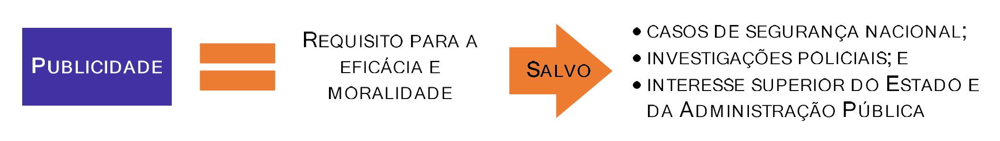

# Capítulo 7 – Decreto nº 1.171/1994: Código de Ética Profissional do Servidor Público Civil do Poder Executivo Federal

## A Natureza do Decreto nº 1.171/1994 e a Consciência Ética

O Decreto nº 1.171, de 22 de junho de 1994, que aprova o Código de Ética Profissional do Servidor Público Civil do Poder Executivo Federal, marcou um passo significativo no estabelecimento de diretrizes éticas para a Administração Pública no Brasil. Mais do que um mero conjunto de regras, o decreto busca instigar nos servidores a adoção de comportamentos que reflitam uma **consciência ética** elevada, não apenas para o simples cumprimento das leis, mas para a honra de princípios morais mais amplos que devem reger a função pública.

O decreto cria normas de conduta, conhecidas no Direito como **normas materiais**, que impõem comportamentos e estabelecem um padrão de integridade para os servidores. A própria exposição de motivos do código revela sua ambição de ir além da formalidade, buscando corrigir um problema profundo da administração:

> A consciência ética do servidor público, nesse particular, além de restaurar a cidadania, corrige a disfunção pública no Brasil, que decorre não só da falta de recursos materiais, mas, principalmente, da conduta muitas vezes perversa no atendimento aos usuários dos serviços públicos, atentatória aos direitos humanos universalmente declarados.

Nesse sentido, o Código de Ética Profissional funciona como um importante instrumento para essa jornada, fornecendo aos servidores públicos um **guia para a ação ética** – um farol que ilumina a tomada de decisão no complexo ambiente da gestão pública.

### A Ética para Além da Lei

Em sua essência, o Decreto nº 1.171/1994 é normativo, mas sua força vem de algo mais profundo do que a simples coerção legal. Ele reconhece que a ética se eleva acima da lei, direcionando as normas com um toque mais humano e apelando ao senso social, à educação e à consciência individual de cada agente público.

> Aliás, até mesmo a coercibilidade jurídica deve buscar seu fundamento na Ética, pois esta, a rigor, não se impõe por lei. Ao contrário, está acima da lei, a ditar as diretrizes desta, fazendo-se aceitar mais pelo senso social, pela educação, pela vontade íntima do próprio agente moral, acolhida com liberdade, em decorrência de sua conscientização e de sua convicção interior.

A **consciência ética** no serviço público, portanto, refere-se à capacidade e ao compromisso dos servidores em incorporar esses princípios e valores em suas atividades e decisões cotidianas. Definir consciência ética envolve compreender que esta não se limita ao mero conhecimento das normas e leis. Trata-se de uma orientação interna que guia o comportamento do servidor para além do que é estritamente legal; é o que direciona as ações para o que é justo, honesto e benéfico para a comunidade como um todo.

Essa consciência se manifesta de diversas maneiras, como a imparcialidade na prestação de serviços, a transparência nos processos, a responsabilidade na administração de recursos e a urbanidade no atendimento às necessidades dos cidadãos. Cada um desses aspectos contribui para um ambiente onde a justiça social e o respeito pela dignidade humana são priorizados.

### Um Guia para a Conduta e a Padronização do Atendimento

O estabelecimento de um código de ética para o exercício das funções públicas busca garantir que as diferenças individuais não sejam tratadas de modo particular ou arbitrário, ou seja, com base na vontade pessoal do agente público que presta determinado serviço.

O Código de Ética reforça essa premissa. Embora detalhe deveres e proibições, ele reconhece que nem todas as situações possíveis podem ser previstas em um documento. Assim, este decreto fornece **diretrizes gerais** que orientam os servidores em suas decisões cotidianas, assegurando um padrão de conduta que priorize sempre o interesse público sobre o privado. A promoção de uma consciência ética efetiva requer, portanto, mais do que o estabelecimento de diretrizes; necessita de uma cultura organizacional que valorize e reforce constantemente esses princípios, por meio de treinamentos, diálogo aberto e sistemas que incentivem e recompensem os comportamentos éticos.

## O Âmbito de Aplicação do Decreto nº 1.171/1994

Um ponto fundamental para o estudo do Código de Ética é compreender exatamente a quem ele se aplica. Por ser um Decreto expedido pelo Presidente da República, sua abrangência está adstrita a uma esfera e a um Poder específico.

O Código é aplicável a todos os servidores **civis** do **Poder Executivo Federal**. Isso significa que suas regras não se estendem, de forma obrigatória, aos servidores dos Estados, do Distrito Federal e dos Municípios (que devem ter seus próprios códigos), nem aos membros do Poder Judiciário ou do Poder Legislativo, tampouco às Forças Armadas.

No entanto, dentro do universo do Poder Executivo Federal, o conceito de "servidor público" adotado pelo decreto é extremamente amplo e abrangente.

### A Definição Ampla de Servidor Público

O Código de Ética não se destina apenas ao servidor público estatutário, concursado. Ele engloba um vasto espectro de profissionais que, de alguma forma, prestam serviço ao Estado. O próprio decreto, em seu item XXIV, estabelece esta definição ampliada:

> XXIV - Para fins de apuração do comprometimento ético, entende-se por servidor público **todo aquele que, por força de lei, contrato ou de qualquer ato jurídico, preste serviços de natureza permanente, temporária ou excepcional, ainda que sem retribuição financeira, desde que ligado direta ou indiretamente a qualquer órgão do poder estatal**, como as autarquias, as fundações públicas, as entidades paraestatais, as empresas públicas e as sociedades de economia mista, ou em qualquer setor onde prevaleça o interesse do Estado.

Analisando esta definição, conclui-se que o dever de observância ao Código de Ética se aplica a:

- Servidores estatutários (regidos pela Lei nº 8.112/1990) e celetistas (empregados públicos regidos pela CLT);
- Servidores da Administração Pública Direta (Ministérios) e Indireta (autarquias, fundações, empresas públicas e sociedades de economia mista);
- Ocupantes de cargos efetivos, temporários ou em comissão;
- Prestadores de serviço sem remuneração, como estagiários e voluntários;
- E, por extensão, até mesmo aos empregados de empresas terceirizadas que atuam dentro das repartições públicas.

Esta visão ampla está em consonância com o conceito de agente público adotado por outras normas importantes, como a Lei de Improbidade Administrativa (Lei nº 8.429/1992), que em seu art. 2º reputa como agente público "todo aquele que exerce, ainda que transitoriamente ou sem remuneração, por eleição, nomeação, designação, contratação ou qualquer outra forma de investidura ou vínculo, mandato, cargo, emprego ou função".

O esquema a seguir sintetiza o âmbito de aplicação do Decreto nº 1.171/1994:

###  Distinção entre a Norma Ética e a Norma Disciplinar

É crucial reiterar que o Código de Ética não se confunde com o Regime Disciplinar do servidor (previsto na Lei nº 8.112/1990). Embora ambos tratem da conduta do agente público, suas naturezas são distintas.

A total separação entre o Código de Ética e a lei disciplinar fica evidente na forma de adesão do servidor a cada uma delas. O servidor adere à lei por uma simples conformidade exterior, impessoal e coercitiva, imposta pelo Estado, pois a lei se impõe por si só. Em contrapartida, no que diz respeito ao Código de Ética, a obrigatoriedade moral inclui a liberdade de escolha e de ação do próprio sujeito, até para discordar das normas que porventura entenda injustas e lutar por sua adequação aos princípios da Justiça. A norma ética busca uma adesão interna, baseada na convicção e na consciência do agente, enquanto a norma disciplinar se impõe pela força da sanção.

## A Organização do Código de Ética

O Código de Ética Profissional do Servidor Público Civil do Poder Executivo Federal, aprovado pelo Decreto nº 1.171/1994, contempla essencialmente duas partes. A primeira é de **ordem substancial**, tratando dos princípios e regras de conduta (o que fazer e o que não fazer), e a segunda é de **ordem formal**, dispondo sobre a criação e o funcionamento das Comissões de Ética, que são os órgãos responsáveis por sua aplicação.

O código é estruturado em dois capítulos, com o primeiro sendo subdividido em três seções cruciais:

- **Seção I - Das Regras Deontológicas:** "Deontologia" é o estudo dos deveres. Esta seção, portanto, representa o padrão ético ideal, o conjunto de valores e princípios morais que devem inspirar a conduta do servidor. Tais valores incluem a dignidade, o decoro, o zelo, a honra, a eficácia, a cortesia e, acima de tudo, a consciência de que o bem comum é a finalidade maior do serviço público.
- **Seção II - Dos Principais Deveres:** Esta seção traduz os valores abstratos das regras deontológicas em deveres funcionais mais concretos. Alguns desses deveres refletem diretamente os valores desejados; outros, a necessidade de garantir a integridade do exercício da função pública; e outros, ainda, o que se poderia chamar de “boas maneiras” no ambiente de trabalho.
- **Seção III - Das Vedações:** Esta seção estabelece as condutas negativas, ou seja, aquilo que é expressamente proibido ao servidor. De forma geral, muitas dessas vedações correspondem a condutas que também são qualificadas como infrações disciplinares na Lei nº 8.112/1990 ou como atos de improbidade administrativa.

Essa estrutura reflete a adoção de uma "ética de responsabilidade", ou seja, uma ética que não se preocupa apenas com a pureza da intenção, mas foca principalmente nas **consequências** dos atos dos agentes para o bem comum. O servidor não tem escolha: ele tem o dever de agir de acordo com os interesses coletivos e de orientar seus esforços para a otimização da satisfação do maior número de pessoas, manifestando uma conduta ética baseada na moral e no direito.

### A Dupla Natureza Jurídica do Decreto

Um último item sobre a natureza do Código de Ética é sua complexa natureza jurídica. O decreto, em seu prefácio, indica a sua base legal:

> O PRESIDENTE DA REPÚBLICA, no uso das atribuições que lhe confere o art. 84, incisos IV e VI, e ainda tendo em vista o disposto no art. 37 da Constituição, bem como nos arts. 116 e 117 da Lei n° 8.112, de 11 de dezembro de 1990, e nos arts. 10, 11 e 12 da Lei n° 8.429 (...)

A menção aos incisos IV e VI do art. 84 da Constituição revela que este decreto é, em parte, **regulamentar** e, em parte, **autônomo**.

- **Decreto Regulamentar (ou de Execução):** É o tipo mais comum de decreto. É um ato administrativo utilizado para **detalhar e assegurar a correta aplicação de uma lei** já existente. Ele não pode inovar na ordem jurídica ou contrariar a lei que regulamenta, servindo apenas como um instrumento para a sua fiel execução (fundamento no art. 84, IV, da CF). O Decreto nº 1.171/94 é regulamentar quando ele detalha deveres e vedações que já encontram correspondência na Lei nº 8.112/1990 ou na Lei de Improbidade Administrativa.
- **Decreto Autônomo:** É um ato normativo emitido pelo Chefe do Poder Executivo que **possui força de lei**, inovando na ordem jurídica sem a necessidade de uma lei prévia do Congresso para lhe dar fundamento. A partir da Emenda Constitucional nº 32/2001, o decreto autônomo só é admitido em duas hipóteses, previstas no art. 84, VI, da Constituição:
    - a) Organização e funcionamento da Administração Federal, desde que **não implique aumento de despesa nem criação ou extinção de órgãos públicos**;
    - b) Extinção de cargos ou funções públicas, desde que **vagos**.

O Decreto nº 1.171/94 é considerado autônomo na parte em que trata da organização e do funcionamento do Sistema de Gestão da Ética, como a criação das Comissões de Ética, pois está exercendo a competência presidencial de organizar a Administração Federal.

## As Comissões de Ética: O Sistema de Gestão da Ética

Para garantir a aplicação e a observância do Código de Ética, o Decreto nº 1.171/1994 determinou a criação de um sistema de gestão descentralizado, cujo pilar é a **Comissão de Ética** em cada órgão e entidade.

> **Art. 2°** Os órgãos e entidades da Administração Pública Federal direta e indireta implementarão, em sessenta dias, as providências necessárias à plena vigência do Código de Ética, inclusive mediante a constituição da respectiva Comissão de Ética, integrada por três servidores ou empregados titulares de cargo efetivo ou emprego permanente.
> 
> Parágrafo único. A constituição da Comissão de Ética será comunicada à Secretaria da Administração Federal da Presidência da República, com a indicação dos respectivos membros titulares e suplentes.

Este artigo estabelece a **obrigatoriedade** da criação de uma Comissão de Ética em todos os órgãos e entidades da Administração Pública Federal direta, indireta, autárquica e fundacional, ou em qualquer entidade que exerça atribuições delegadas pelo poder público.

### Composição e Mandato

A composição da comissão é desenhada para garantir a imparcialidade e a continuidade dos trabalhos:

- **Membros:** A comissão é integrada por **três membros titulares e três suplentes**.
- **Vínculo:** Os membros devem ser escolhidos entre servidores e empregados do **quadro permanente** do órgão, ou seja, devem ser servidores de carreira (ocupantes de cargo efetivo ou emprego permanente), o que exclui a participação de pessoas que ocupam exclusivamente cargos em comissão. A exigência de vínculo permanente visa a garantir a estabilidade e a independência dos membros, que ficam menos suscetíveis a pressões externas.
- **Designação e Mandato:** Os membros são designados pelo dirigente máximo do órgão para mandatos de **três anos**, que devem ser **não coincidentes**. A não coincidência dos mandatos é um mecanismo que assegura a continuidade e a preservação da memória institucional, evitando que toda a comissão seja trocada de uma só vez.

### Atribuições e Competências

As comissões de ética, também chamadas de **Comissões de Ética Setoriais**, possuem uma dupla natureza em suas atribuições: uma preventiva/educativa e outra repressiva/punitiva.

- **Função Educativa e Preventiva:** Esta é a sua principal missão. As comissões são encarregadas de **orientar e aconselhar** sobre a ética profissional do servidor, no tratamento com as pessoas e com o patrimônio público. Elas devem atuar na divulgação do código, na realização de treinamentos e na resolução de consultas sobre dilemas éticos que os servidores enfrentam no dia a dia.
- **Função Repressiva:** Compete à comissão **conhecer concretamente de imputação ou de procedimento susceptível de censura**. Ou seja, é a instância responsável por receber denúncias, instaurar o processo de apuração de infração ética e, se for o caso, aplicar a penalidade cabível.

Além disso, a comissão tem a importante atribuição de fornecer, aos organismos encarregados da gestão de carreiras, os registros sobre a conduta ética do servidor. Conforme o item XVIII do Código:

> À Comissão de Ética incumbe fornecer, aos organismos encarregados da execução do quadro de carreira dos servidores, os registros sobre sua conduta ética, para o efeito de instruir e fundamentar promoções e para todos os demais procedimentos próprios da carreira do servidor público.

Isso significa que a conduta ética do servidor tem um impacto direto em sua progressão funcional, sendo um dos critérios a serem considerados na promoção por merecimento.

### A Penalidade de Censura: A Única Sanção Aplicável

Este é um dos pontos mais importantes sobre a competência das Comissões de Ética. Diferentemente das comissões de processo administrativo disciplinar (PAD), que podem aplicar diversas sanções previstas na Lei nº 8.112/1990, a Comissão de Ética tem sua competência punitiva restrita a uma única penalidade.

> **PONTO FUNDAMENTAL: A única penalidade aplicável pela Comissão de Ética é a de CENSURA.**

Qualquer outra pena, como advertência ou suspensão, se atribuída à Comissão de Ética em uma questão de prova, estará incorreta.

A **censura** é uma sanção de natureza moral, que consiste em uma repreensão formal e por escrito ao servidor pela infração ética cometida. Seu extrato é publicado no Diário Oficial da União e ela é registrada nos assentamentos funcionais do servidor, constituindo um antecedente negativo que pode ser considerado em futuras apurações. Se a conduta investigada pela Comissão de Ética também configurar uma infração disciplinar, a comissão deverá encaminhar o caso para a unidade correcional competente para a instauração de sindicância ou PAD.

### Composição e Mandato

As Comissões de Ética são integradas por **três membros titulares e três suplentes**, escolhidos entre servidores e empregados do seu quadro permanente, e designados pelo dirigente máximo da respectiva entidade ou órgão, para mandatos de três anos.

- **O Mandato Não Coincidente:** A exigência de que os mandatos de três anos sejam **não coincidentes** é um mecanismo para garantir a continuidade e a preservação da memória institucional. Isso significa que os membros são renovados de forma escalonada, evitando que toda a comissão seja substituída de uma só vez, o que poderia interromper os trabalhos em andamento. O esquema a seguir ilustra um ciclo de mandatos não coincidentes.

- **Requisitos dos Membros:** Os componentes das Comissões de Ética são escolhidos entre os servidores públicos ocupantes de cargo efetivo ou de emprego permanente do quadro do órgão. Entende-se por Quadro Permanente aquele composto por servidores admitidos para o desempenho das atividades fins e meios, estejam eles ocupando cargo comissionado ou não. Excluem-se desse quadro somente os ocupantes de cargo comissionado sem vínculo efetivo com a administração. Caso não haja servidores em número suficiente na entidade, poderão ser escolhidos servidores de outros órgãos da Administração Pública.

> **Ponto de Atenção: O Dirigente Máximo não pode ser Membro**
> 
> O dirigente máximo do órgão ou entidade **NÃO poderá ser membro** da Comissão de Ética. Essa vedação justifica-se para evitar conflitos de interesse, tendo em vista que o próprio dirigente é o responsável por designar os membros e, eventualmente, por executar algumas das deliberações da comissão.

### Autonomia e Atribuições

A atuação da Comissão de Ética, no que concerne ao exercício de suas competências, **não se subordina à instância superior a que se vincule**. Trata-se de um órgão com autonomia técnica para deliberar sobre a matéria ética.

Eventuais dúvidas de natureza **legal** devem ser resolvidas junto ao setor jurídico da entidade ou órgão. Já as dúvidas sobre a **aplicação das normas do Código de Ética** devem ser dirimidas pela **Comissão de Ética Pública (CEP)**, que é a instância superior do Sistema de Gestão da Ética do Poder Executivo Federal. As comissões setoriais atuam, portanto, como elemento de ligação com a CEP.

As atribuições da comissão são de natureza preventiva, consultiva e repressiva, conforme o esquema a seguir:

Em resumo, compete à Comissão de Ética:

- **Promover** a adoção de normas de conduta ética para os servidores.
- **Orientar e Aconselhar** sobre a ética profissional do servidor, no tratamento com as pessoas e com o patrimônio público.
- **Tomar conhecimento** de procedimentos que possam ensejar a aplicação da penalidade de censura.
- **Supervisionar** a observância do Código de Conduta da Alta Administração Federal, comunicando à CEP eventuais descumprimentos.

## Capítulo 1 – Das Regras e Deveres

### Seção I – Das Regras Deontológicas

A Seção I do Código de Ética estabelece as **regras deontológicas**, que representam o fundamento moral e a base principiológica de todo o decreto. O termo "deontologia" refere-se ao estudo dos deveres. Assim, esta seção apresenta o conjunto de princípios e valores que formam o padrão ético ideal e que devem nortear a conduta de todo servidor público no exercício de sua profissão.

Essas regras estão intimamente relacionadas com os deveres e proibições encontrados na Lei nº 8.112/1990 (Regime Jurídico Único), mas possuem um enfoque mais amplo e principiológico, buscando orientar a consciência do servidor para além da mera legalidade.

As regras deontológicas são as seguintes:

> I - A dignidade, o decoro, o zelo, a eficácia e a consciência dos princípios morais são primados maiores que devem nortear o servidor público, seja no exercício do cargo ou função, ou fora dele, já que refletirá o exercício da vocação do próprio poder estatal. Seus atos, comportamentos e atitudes serão direcionados para a preservação da honra и da tradição dos serviços públicos.
> 
> II - O servidor público não poderá jamais desprezar o elemento ético de sua conduta. Assim, не terá que decidir somente entre o legal e o ilegal, o justo e o injusto, o conveniente e o inconveniente, o oportuno e o inoportuno, mas principalmente entre o honesto e o desonesto.
> 
> III - A moralidade da Administração Pública não se limita à distinção entre o bem e o mal, devendo ser acrescida da ideia de que o fim é sempre o bem comum. O equilíbrio entre a legalidade e a finalidade, na conduta do servidor público, é que poderá consolidar a moralidade do ato administrativo.
> 
> IV - A remuneração do servidor público é custeada pelos tributos pagos direta ou indiretamente por todos, até por ele próprio, e por isso se exige, como contrapartida, que a moralidade administrativa se integre no Direito, como elemento indissociável de sua aplicação e de sua finalidade, erigindo-se, como consequência, em fator de legalidade.
> 
> V - O trabalho desenvolvido pelo servidor público perante a comunidade deve ser entendido como acréscimo ao seu próprio bem-estar, já que, como cidadão, integrante da sociedade, o êxito desse trabalho pode ser considerado como seu maior patrimônio.
> 
> VI - A função pública deve ser tida como exercício profissional e, portanto, se integra na vida particular de cada servidor público. Assim, os fatos e atos verificados na conduta do dia-a-dia em sua vida privada poderão acrescer ou diminuir o seu bom conceito na vida funcional.
> 
> VII - Salvo os casos de segurança nacional, investigações policiais ou interesse superior do Estado e da Administração Pública, a serem preservados em processo previamente declarado sigiloso, nos termos da lei, a publicidade de qualquer ato administrativo constitui requisito de eficácia e moralidade, ensejando sua omissão comprometimento ético contra o bem comum, imputável a quem a negar.
> 
> VIII - Toda pessoa tem direito à verdade. O servidor não pode omiti-la ou falseá-la, ainda que contrária aos interesses da própria pessoa interessada ou da Administração Pública. Nenhum Estado pode crescer ou estabilizar-se sobre o poder corruptivo do hábito do erro, da opressão ou da mentira, que sempre aniquilam até mesmo a dignidade humana quanto mais a de uma Nação.
> 
> IX - A cortesia, a boa vontade, o cuidado e o tempo dedicados ao serviço público caracterizam o esforço pela disciplina. Tratar mal uma pessoa que paga seus tributos direta ou indiretamente significa causar-lhe dano moral. Da mesma forma, causar dano a qualquer bem pertencente ao patrimônio público, deteriorando-o, por descuido ou má vontade, não constitui apenas uma ofensa ao equipamento e às instalações ou ao Estado, mas a todos os homens de boa vontade que dedicaram sua inteligência, seu tempo, suas esperanças e seus esforços para construí-los.
> 
> X - Deixar o servidor público qualquer pessoa à espera de solução que compete ao setor em que exerça suas funções, permitindo a formação de longas filas, ou qualquer outra espécie de atraso na prestação do serviço, não caracteriza apenas atitude contra a ética ou ato de desumanidade, mas principalmente grave dano moral aos usuários dos serviços públicos.
> 
> XI - O servidor deve prestar toda a sua atenção às ordens legais de seus superiores, velando atentamente por seu cumprimento, e, assim, evitando a conduta negligente. Os repetidos erros, o descaso e o acúmulo de desvios tornam-se, às vezes, difíceis de corrigir e caracterizam até mesmo imprudência no desempenho da função pública.
> 
> XII - Toda ausência injustificada do servidor de seu local de trabalho é fator de desmoralização do serviço público, o que quase sempre conduz à desordem nas relações humanas.
> 
> XIII - O servidor que trabalha em harmonia com a estrutura organizacional, respeitando seus colegas e cada concidadão, colabora e de todos pode receber colaboração, pois sua atividade pública é a grande oportunidade para o crescimento e o engrandecimento da Nação.

Nas seções seguintes, estes pontos serão analisados em maior profundidade.

#### Análise Detalhada das Regras Deontológicas

Feita a apresentação geral das regras deontológicas, podemos começar a estudar cada uma delas em maior profundidade.

##### Os Primados Maiores e a Integração da Vida Pública e Privada (Incisos I e VI)

> **I -** A dignidade, o decoro, o zelo, a eficácia e a consciência dos princípios morais são **primados maiores** que devem nortear o servidor público, seja no exercício do cargo ou função, ou fora dele, já que refletirá o exercício da vocação do próprio poder estatal. Seus atos, comportamentos e atitudes serão direcionados para a preservação da honra e da tradição dos serviços públicos.

Este primeiro inciso estabelece os valores fundamentais que devem guiar a conduta do servidor. A norma deixa claro que a obrigação de manter uma conduta ética não se restringe ao horário de expediente ou ao espaço físico da repartição. O servidor público, por representar o Estado, deve zelar por sua conduta **dentro e fora** do serviço, pois seus atos privados podem impactar a imagem e a confiança na instituição pública a que pertence.

Essa ideia é reforçada e detalhada no inciso VI:

> **VI -** A função pública deve ser tida como exercício profissional e, portanto, se integra na vida particular de cada servidor público. Assim, os fatos e atos verificados na conduta do dia-a-dia em sua vida privada poderão acrescer ou diminuir o seu bom conceito na vida funcional.

Ambos os incisos consagram o princípio da **inseparabilidade entre a vida pública e a vida privada** do agente público. A conduta privada de um servidor pode, sim, ser objeto de avaliação e pode gerar consequências em sua vida funcional, especialmente quando tal conduta afeta a honra e a imagem da Administração Pública.

- **Exemplo:** O caso, amplamente divulgado, de um juiz que, ao ser parado em uma blitz da Lei Seca, utiliza seu cargo para intimidar e dar voz de prisão à agente de trânsito. Embora o fato tenha ocorrido fora de seu horário de trabalho, a atitude mancha a imagem do Poder Judiciário, demonstrando um desvio ético que viola o decoro exigido pela função. Da mesma forma, um prefeito que dirige embriagado certamente manchará a imagem da prefeitura que representa.

O esquema a seguir sintetiza a abrangência desses primados maiores:

É fundamental notar que o fim último de toda essa conduta ética é sempre o **bem comum**, e não o interesse da própria Administração Pública enquanto instituição.

##### A Decisão Ética: Para Além da Legalidade (Inciso II)

> **II -** O servidor público não poderá jamais desprezar o elemento ético de sua conduta. Assim, не terá que decidir somente entre o legal e o ilegal, o justo e o injusto, o conveniente e o inconveniente, o oportuno e o inoportuno, mas principalmente entre o **honesto e o desonesto**.

Este inciso estabelece que a legalidade é o piso, e não o teto, da conduta do servidor. O processo de decisão do agente público deve passar por múltiplos filtros. Não basta se perguntar "isto é legal?". É preciso ir além e questionar: "Isto é justo? É conveniente para o interesse público? É oportuno? E, acima de tudo, isto é honesto?". A honestidade é colocada como o critério principal, a nortear todos os outros.

Este princípio ético fundamental encontra respaldo direto nos princípios constitucionais da Administração Pública, previstos no art. 37 da Constituição:

> **Art. 37.** A administração pública direta e indireta de qualquer dos Poderes da União, dos Estados, do Distrito Federal e dos Municípios obedecerá aos princípios de legalidade, impessoalidade, moralidade, publicidade e eficiência. (...)
> 
> **§ 4º -** Os atos de improbidade administrativa importarão a **suspensão dos direitos políticos**, a **perda da função pública**, a indisponibilidade dos bens e o ressarcimento ao erário, na forma e gradação previstas em lei, sem prejuízo da ação penal cabível.

É importante não confundir a "suspensão dos direitos políticos" com a "perda da função pública". A perda da função é, em regra, uma consequência da condenação por improbidade. A suspensão dos direitos políticos, por sua vez, é uma sanção adicional que impede o condenado de votar e ser votado por um determinado período. Um exemplo histórico foi o do ex-presidente Fernando Collor que, após seu impeachment, teve seus direitos políticos suspensos por oito anos, findos os quais pôde se candidatar novamente e foi eleito para o cargo de Senador.

##### A Moralidade Administrativa e a Busca pelo Bem Comum (Inciso III)

> **III -** A moralidade da Administração Pública не se limita à distinção entre o bem e o mal, devendo ser acrescida da ideia de que **o fim é sempre o bem comum**. O equilíbrio entre a legalidade e a finalidade, na conduta do servidor público, é que poderá consolidar a moralidade do ato administrativo.

Este inciso aprofunda o conceito de moralidade administrativa, já previsto no art. 37 da Constituição. Ele estabelece que a moralidade de um ato público não se mede pela moral pessoal do agente, mas sim por sua conformidade com o bem comum. A verdadeira moralidade administrativa reside no **equilíbrio entre a legalidade e a finalidade**.

Não basta o ato ser legal; ele deve ser praticado com a finalidade para a qual a lei foi criada, que é sempre o interesse público. Quando um agente público pratica um ato legal, mas com uma finalidade diversa da prevista (por exemplo, para beneficiar a si mesmo ou a terceiros), ocorre o que o Direito Administrativo chama de "desvio de finalidade", um ato que, embora aparente ser legal, é profundamente imoral e, portanto, inválido.

> "O princípio da moralidade está indissociavelmente ligado à noção do bom administrador, que não somente deve ser conhecedor da lei como dos princípios éticos regentes da função administrativa" (Carvalho Filho, 2013).

##### A Remuneração Pública e o Dever de Reciprocidade (Inciso IV)

> **IV -** A remuneração do servidor público é custeada pelos tributos pagos direta ou indiretamente por todos, até por ele próprio, e por isso se exige, como contrapartida, que a moralidade administrativa se integre no Direito, como elemento indissociável de sua aplicação e de sua finalidade, erigindo-se, como consequência, em fator de legalidade.

Este inciso estabelece uma relação de **reciprocidade** entre o servidor e a sociedade. Ele lembra ao agente público que sua remuneração é fruto do esforço coletivo da nação, financiada pelos tributos pagos por todos os cidadãos. Em contrapartida a essa remuneração, a sociedade exige não apenas um serviço legalmente correto, mas moralmente íntegro.

A moralidade, portanto, não é um mero adorno, mas um elemento que se integra ao próprio Direito. A parte final do inciso é crucial: a moralidade se torna um **fator de legalidade**. Isso significa que um ato administrativo que, embora cumpra os ritos formais, seja profundamente imoral (por exemplo, um ato de nepotismo, um desperdício flagrante de recursos), pode ser considerado inválido por violar a própria legalidade em seu sentido mais amplo, que pressupõe a observância da moralidade.

##### O Trabalho Público como Patrimônio do Cidadão-Servidor (Inciso V)

> **V -** O trabalho desenvolvido pelo servidor público perante a comunidade deve ser entendido como acréscimo ao seu próprio bem-estar, já que, como cidadão, integrante da sociedade, o êxito desse trabalho pode ser considerado como seu maior patrimônio.

Este é um dos incisos de caráter mais motivacional do código. Ele busca combater a ideia de que o servidor é um ente separado da sociedade a quem serve. Pelo contrário, ele lembra que o servidor é, antes de tudo, um **cidadão**.

Dessa forma, o sucesso do serviço público que ele presta reverte-se em benefício para ele mesmo e para sua comunidade. O êxito do trabalho público — uma escola de qualidade, um hospital que funciona, uma rua bem pavimentada — é um patrimônio de toda a sociedade, incluindo o próprio servidor que contribuiu para sua realização.

##### A Publicidade como Requisito de Eficácia e Moralidade (Inciso VII)

> **VII -** Salvo os casos de segurança nacional, investigações policiais ou interesse superior do Estado e da Administração Pública, a serem preservados em processo previamente declarado sigiloso, nos termos da lei, a publicidade de qualquer ato administrativo constitui requisito de eficácia e moralidade, ensejando sua omissão comprometimento ético contra o bem comum, imputável a quem a negar.

Este inciso reforça o princípio constitucional da **publicidade**, estabelecendo-o como um dever ético fundamental. Negar a publicidade a um ato que deveria ser público é uma conduta antiética grave. A publicidade é apresentada com uma dupla função:

1. **Requisito de Eficácia:** Muitos atos administrativos só passam a produzir seus efeitos legais após a devida publicação.
2. **Requisito de Moralidade:** A transparência é o que permite o controle social, inibindo a prática de atos ilícitos e garantindo que a gestão pública seja feita à luz do dia.

As exceções à regra da publicidade (o **sigilo**) são tratadas como excepcionais e devem ser formalmente justificadas. É a **Lei de Acesso à Informação (LAI) - Lei nº 12.527/2011** que regulamenta detalhadamente as hipóteses e os procedimentos para a classificação de informações como sigilosas.

##### O Direito à Verdade (Inciso VIII)

> **VIII -** Toda pessoa tem direito à verdade. O servidor não pode omiti-la ou falseá-la, ainda que contrária aos interesses da própria pessoa interessada ou da Administração Pública. Nenhum Estado pode crescer ou estabilizar-se sobre o poder corruptivo do hábito do erro, da opressão ou da mentira, que sempre aniquilam até mesmo a dignidade humana quanto mais a de uma Nação.

Este inciso estabelece o compromisso radical do servidor público com a verdade. É o dever de agir com total transparência e honestidade perante o cidadão. A expressão popular "doa a quem doer" traduz bem o espírito desta norma.

O servidor não pode omitir ou distorcer a verdade, mesmo que ela seja desfavorável à própria Administração ou à pessoa interessada. Essa diretriz é um pilar contra a arbitrariedade e o abuso de poder, pois, como afirmou o historiador Lord Acton, "o poder tende a corromper, e o poder absoluto corrompe absolutamente". A obrigação de dizer a verdade é um freio a essa tendência.

A questão do sigilo, mencionada no inciso anterior, não conflita com o direito à verdade. Nos casos legalmente sigilosos, o servidor não deve mentir, mas sim informar que, por força de lei, aquela informação está protegida para resguardar um bem maior, como a Segurança Nacional.

##### A Disciplina no Atendimento e no Cuidado com o Patrimônio Público (Inciso IX)

> **IX -** A cortesia, a boa vontade, o cuidado e o tempo dedicados ao serviço público caracterizam o **esforço pela disciplina**. Tratar mal uma pessoa que paga seus tributos direta ou indiretamente significa causar-lhe dano moral. Da mesma forma, causar dano a qualquer bem pertencente ao patrimônio público, deteriorando-o, por descuido ou má vontade, не constitui apenas uma ofensa ao equipamento e às instalações ou ao Estado, mas a todos os homens de boa vontade que dedicaram sua inteligência, seu tempo, suas esperanças e seus esforços para construí-los.

Este inciso aborda duas dimensões fundamentais da conduta ética do servidor: a sua relação com o cidadão e a sua relação com os bens públicos. A norma estabelece que o "esforço pela disciplina" se manifesta em quatro atitudes essenciais:

###### A Ética no Atendimento ao Cidadão

O Código de Ética eleva a qualidade do atendimento ao cidadão a um patamar de dever moral. A norma é taxativa ao afirmar que **tratar mal uma pessoa que paga seus tributos direta ou indiretamente significa causar-lhe dano moral**.

Esta afirmação é de profunda importância. Ela retira o mau atendimento do campo da mera ineficiência administrativa e o coloca na esfera da **violação da dignidade** do cidadão. O código reconhece que o cidadão, ao buscar um serviço público, não está pedindo um favor, mas exercendo um direito, financiado por seus próprios recursos. A cortesia, a boa vontade e o respeito no atendimento não são, portanto, opcionais, mas uma contrapartida obrigatória e um dever ético fundamental.

###### A Ética no Cuidado com o Patrimônio Público

O inciso estende esse raciocínio ao patrimônio público. O dever do servidor de zelar pela economia do material e pela conservação dos bens do Estado é reforçado aqui sob uma ótica ética. Causar dano a um bem público, por descuido ou má vontade, não é apenas um prejuízo material ao Estado.

É, como retrata o inciso IX, uma ofensa direta ao cidadão que contribuiu para a aquisição daquele bem. A imagem de um bem público "largado às moscas" causa revolta justamente porque representa o desrespeito ao esforço coletivo da sociedade.

Assim, o descuido com a "coisa pública" é visto como uma ofensa à coletividade, a "todos os homens de boa vontade que dedicaram sua inteligência, seu tempo, suas esperanças e seus esforços para construí-los".

##### A Presteza no Serviço e o Dano Moral por Atraso (Inciso X)

> **X -** Deixar o servidor público qualquer pessoa à espera de solução que compete ao setor em que exerça suas funções, permitindo a **formação de longas filas, ou qualquer outra espécie de atraso** na prestação do serviço, não caracteriza apenas atitude contra a ética ou ato de desumanidade, mas principalmente **grave dano moral** aos usuários dos serviços públicos.

Mais uma vez, o Código de Ética direciona seu foco para a presteza e a eficiência no atendimento ao cidadão. Este inciso estabelece que a morosidade injustificada é uma grave falta ética.

É importante ponderar que nem toda fila ou atraso é, por si só, uma infração ética. Muitas vezes, a demora decorre de fatores estruturais, como a falta de pessoal, falhas no sistema ou excesso de demanda, que estão além do controle do servidor. O que a norma condena é o atraso decorrente da **conduta do agente público**, como a procrastinação, a desorganização ou a má vontade.

O ponto central deste dispositivo é a qualificação do atraso injustificado como um **"grave dano moral"** aos usuários. Isso eleva a questão para além de um mero aborrecimento, reconhecendo que o tempo do cidadão é valioso e que fazê-lo esperar desnecessariamente é uma afronta à sua dignidade.

##### O Dever de Cuidado: Negligência, Imprudência e Ordens Ilegais (Inciso XI)

> **XI -** O servidor deve prestar toda a sua atenção às **ordens legais** de seus superiores, velando atentamente por seu cumprimento, e, assim, evitando a **conduta negligente**. Os repetidos erros, o descaso e o acúmulo de desvios tornam-se, às vezes, difíceis de corrigir e caracterizam até mesmo **imprudência** no desempenho da função pública.

Este inciso trata do dever de acatar as ordens legais dos superiores hierárquicos, um dos pilares da organização administrativa. O descumprimento ou o cumprimento desatento dessas ordens pode configurar duas condutas culposas:

- **Negligência:** É uma conduta **omissiva**. Ocorre quando o servidor deixa de fazer algo que deveria, age com descaso, descuido, indiferença ou desatenção, não tomando as devidas precauções.

- **Imprudência:** É uma conduta **comissiva**. Ocorre quando o servidor age, mas de forma precipitada, sem a cautela necessária, assumindo riscos desnecessários. É uma ação que vai além do permitido ou do razoável.

> **Ponto de Atenção: O Cumprimento de Ordem Manifestamente Ilegal**
> 
> O dever de obediência do servidor não é absoluto. O próprio inciso XI fala em "ordens **legais**". A Lei nº 8.112/1990, em seu art. 116, IV, é explícita ao determinar que é dever do servidor "cumprir as ordens superiores, **exceto quando manifestamente ilegais**".
> 
> Uma ordem **manifestamente ilegal** é aquela cuja ilegalidade é evidente, óbvia, que não exige uma análise jurídica complexa para ser percebida. Por exemplo, se um chefe ordena a um servidor que utilize um veículo oficial para fins particulares, a ilegalidade é manifesta.
> 
> Nesses casos, o dever do servidor é **não cumprir a ordem** e representar contra a autoridade que a emitiu. Se, sabendo da ilegalidade, o servidor cumprir a ordem, ele também será responsabilizado pela infração cometida.

##### A Assiduidade e a Moralização do Serviço Público (Inciso XII)

> **XII -** Toda **ausência injustificada** do servidor de seu local de trabalho é fator de **desmoralização do serviço público**, o que quase sempre conduz à desordem nas relações humanas.

Este princípio ético encontra correspondência direta no Regime Jurídico dos Servidores (Lei nº 8.112/1990), que estabelece como dever a **assiduidade e a pontualidade** (art. 116, X) e como proibição a **ausência do serviço durante o expediente sem autorização** (art. 117, I).

O código vai além da simples regra e aponta a consequência da ausência injustificada: a **desmoralização do serviço público**. Essa desmoralização ocorre em duas frentes. Externamente, perante o cidadão que busca um serviço e não o encontra, gerando uma imagem de descaso e ineficiência. Internamente, a ausência de um membro da equipe sobrecarrega os demais e gera desordem nas relações de trabalho.

##### A Harmonia Organizacional e o Engrandecimento da Nação (Inciso XIII)

> **XIII -** O servidor que trabalha em **harmonia com a estrutura organizacional**, respeitando seus colegas e cada concidadão, colabora e de todos pode receber colaboração, pois sua atividade pública é a grande oportunidade para o **crescimento e o engrandecimento da Nação**.

Este último inciso das regras deontológicas possui um forte caráter motivacional. Ele estabelece que uma postura colaborativa e respeitosa com os colegas e com os cidadãos é essencial para o bom funcionamento da máquina pública.

Mais do que isso, ele enquadra a atividade pública não como um fardo, mas como uma **"grande oportunidade"**. Ele conecta o trabalho diário e individual de cada servidor a um propósito maior e nobre: o crescimento e o engrandecimento da Nação. É um chamado para que o servidor veja em sua função uma vocação e uma forma de contribuir para o desenvolvimento do país.

### Seção II – Dos Principais Deveres do Servidor Público

Ser servidor público é uma função de grande responsabilidade e privilégio, pois o agente público atua como um instrumento de transformação do Estado, sempre a serviço da sociedade. Partindo desse pressuposto, a atuação do servidor deve ser guiada por preceitos fundamentais que reflitam seu compromisso com a cidadania e o bem comum. Uma atuação ancorada em tais preceitos deve se converter no âmbito da reflexão individual e coletiva, permitindo gerar valor à atividade pública e, de forma específica, contribuir para o desenvolvimento socioeconômico do país.

O exercício compartilhado da atividade pública sustenta seu sucesso duradouro. Para isso, é necessário haver um padrão de deveres para quem a executa. O Decreto nº 1.171/1994, em sua Seção II, enumera os **deveres fundamentais** do servidor. É crucial notar que este é um **rol não exaustivo**, ou seja, exemplificativo. Isso quer dizer que, além dos deveres aqui expressos, outros podem ser exigidos do servidor, decorrentes de outras leis ou dos princípios gerais que regem a Administração Pública.

A seguir, apresentamos a lista dos deveres e, na sequência, iniciaremos a análise pormenorizada de cada um deles.

> **XIV - São deveres fundamentais do servidor público:**
> 
> a) desempenhar, a tempo, as atribuições do cargo, função ou emprego público de que seja titular;
> 
> b) exercer suas atribuições com rapidez, perfeição e rendimento, pondo fim ou procurando prioritariamente resolver situações procrastinatórias, principalmente diante de filas ou de qualquer outra espécie de atraso na prestação dos serviços pelo setor em que exerça suas atribuições, com o fim de evitar dano moral ao usuário;
> 
> c) ser probo, reto, leal e justo, demonstrando toda a integridade do seu caráter, escolhendo sempre, quando estiver diante de duas opções a melhor e a mais vantajosa para o bem comum;
> 
> d) jamais retardar qualquer prestação de contas, condição essencial da gestão dos bens, direitos e serviços da coletividade a seu cargo;
> 
> e) tratar cuidadosamente os usuários dos serviços aperfeiçoando o processo de comunicação e contato com o público;
> 
> f) ter consciência de que seu trabalho é regido por princípios éticos que se materializam na adequada prestação dos serviços públicos;
> 
> g) ser cortês, ter urbanidade, disponibilidade e atenção, respeitando a capacidade e as limitações individuais de todos os usuários do serviço público, sem qualquer espécie de preconceito ou distinção de raça, sexo, nacionalidade, cor, idade, religião, cunho político e posição social, abstendo-se, dessa forma, de causar-lhes dano moral;
> 
> h) ter respeito à hierarquia, porém sem nenhum temor de representar contra qualquer comprometimento indevido da estrutura em que se funda o Poder Estatal;
> 
> i) resistir a todas as pressões de superiores hierárquicos, de contratantes, interessados e outros que visem obter quaisquer favores, benesses ou vantagens indevidas em decorrência de ações imorais, ilegais ou aéticas e denunciá-las;
> 
> j) zelar, no exercício do direito de greve, pelas exigências específicas da defesa da vida e da segurança coletiva;
> 
> l) ser assíduo e frequente ao serviço, na certeza de que sua ausência provoca danos ao trabalho ordenado, refletindo negativamente em todo o sistema;
> 
> m) comunicar imediatamente a seus superiores todo e qualquer ato ou fato contrário ao interesse público, exigindo as providências cabíveis;
> 
> n) manter limpo e em perfeita ordem o local de trabalho, seguindo os métodos mais adequados à sua organização e distribuição;
> 
> o) participar dos movimentos e estudos que se relacionem com a melhoria do exercício de suas funções, tendo por escopo a realização do bem comum;
> 
> p) apresentar-se ao trabalho com vestimentas adequadas ao exercício da função;
> 
> q) manter-se atualizado com as instruções, as normas de serviço e a legislação pertinente ao órgão onde exerce suas funções;
> 
> r) cumprir, de acordo com as normas do serviço e as instruções superiores, as tarefas de seu cargo ou função, tanto quanto possível, com critério, segurança e rapidez, mantendo tudo sempre em boa ordem;
> 
> s) facilitar a fiscalização de todos os atos ou serviços por quem de direito;
> 
> t) exercer com estrita moderação as prerrogativas funcionais que lhe sejam atribuídas, abstendo-se de fazê-lo contrariamente aos legítimos interesses dos usuários do serviço público e dos jurisdicionados administrativos;
> 
> u) abster-se, de forma absoluta, de exercer sua função, poder ou autoridade com finalidade estranha ao interesse público, mesmo que observando as formalidades legais e não cometendo qualquer violação expressa à lei;
> 
> v) divulgar e informar a todos os integrantes da sua classe sobre a existência deste Código de Ética, estimulando o seu integral cumprimento.

A seguir, analisaremos cada um desses deveres fundamentais.

#### Análise Detalhada dos Deveres Fundamentais

A Seção II do Código de Ética traduz os princípios e as regras deontológicas em deveres concretos, estabelecendo as condutas positivas que são esperadas de todo agente público no exercício de suas funções.

##### O Dever de Desempenho Tempestivo (Alínea "a")

> XIV - São deveres fundamentais do servidor público:
> 
> a) desempenhar, a tempo, as atribuições do cargo, função ou emprego público de que seja titular;

Este primeiro dever estabelece a obrigação de **tempestividade**, ou seja, de cumprir as atribuições dentro dos prazos devidos. A menção expressa a "cargo, função ou emprego público" reforça a tese da aplicação ampla do Código de Ética, abrangendo as diferentes formas de vínculo com a Administração Pública. Para fins de clareza, é importante distinguir esses termos:

- **Cargo Público:** É o conjunto de atribuições e responsabilidades, criado por lei, com denominação própria, número certo e remuneração paga pelos cofres públicos, a ser cometido a um servidor. É o vínculo típico do regime estatutário (Lei nº 8.112/1990).

| Tipos de Cargo                | Descrição                                                                                                                                                               |
| ----------------------------- | ----------------------------------------------------------------------------------------------------------------------------------------------------------------------- |
| **de Provimento Efetivo**     | São providos mediante aprovação prévia em concurso público. O servidor adquire estabilidade após 3 anos de efetivo exercício e aprovação em avaliação de desempenho. |
| **de Provimento em Comissão** | São de livre nomeação e exoneração, destinados às atribuições de chefia, direção e assessoramento. Não exigem concurso público e não geram estabilidade.             |

- **Emprego Público:** É o vínculo de trabalho regido pela Consolidação das Leis do Trabalho (CLT), típico das entidades da Administração Pública Indireta que exploram atividade econômica, como as **Empresas Públicas** e as **Sociedades de Economia Mista**. O ingresso também se dá por concurso público.
- **Função Pública:** Refere-se a um conjunto de atribuições exercidas por uma pessoa física junto à Administração. Pode se manifestar, por exemplo, na **função de confiança**, que é exercida exclusivamente por servidor ocupante de cargo efetivo para atribuições de direção, chefia e assessoramento, ou em funções exercidas por particulares em colaboração com o Estado, como os mesários em uma eleição.

##### O Dever de Eficiência e Presteza (Alínea "b")

> **b)** exercer suas atribuições com **rapidez, perfeição e rendimento**, pondo fim ou procurando prioritariamente resolver situações procrastinatórias, principalmente diante de filas ou de qualquer outra espécie de atraso na prestação dos serviços pelo setor em que exerça suas atribuições, com o fim de evitar dano moral ao usuário;

Este dever é a manifestação ética do princípio constitucional da **eficiência**. Ele exige do servidor uma atuação pautada pela qualidade e pela celeridade. A norma define "situação procrastinatória" como aquela que é indevidamente adiada, "empurrada com a barriga". O dever do servidor não é apenas executar suas tarefas, mas atuar proativamente para resolver os gargalos e as demoras que causam dano moral ao cidadão.

##### O Dever de Integridade e Foco no Bem Comum (Alínea "c")

> **c)** ser **probo, reto, leal e justo**, demonstrando toda a integridade do seu caráter, escolhendo sempre, quando estiver diante de duas opções a **melhor e a mais vantajosa para o bem comum**;

Este inciso é o coração da conduta ética. Ser **probo** e **reto** é ser íntegro, honesto e incorruptível. Ser **leal** é ser fiel aos princípios da Administração e ao interesse público. Ser **justo** é agir com imparcialidade e equidade.

A parte final deste dever é de extrema importância. Ela estabelece o critério que deve guiar o servidor em suas decisões: a escolha da opção que seja "a melhor e a mais vantajosa para o **bem comum**".

> **Ponto de Atenção: "Bem Comum" vs. "Interesse da Administração"**
> 
> É comum que questões de concurso tentem confundir o candidato, substituindo a expressão "bem comum" por "interesse da Administração Pública". Embora pareçam sinônimos, há uma diferença sutil e crucial. O "interesse da Administração" pode ser interpretado de forma restrita e meramente gerencial (ex: a opção de menor custo imediato). O **"bem comum"** é um conceito mais amplo, que exige do servidor uma análise do impacto social, da qualidade e da sustentabilidade de sua decisão a longo prazo. A opção eticamente correta é aquela que melhor serve à sociedade como um todo.

