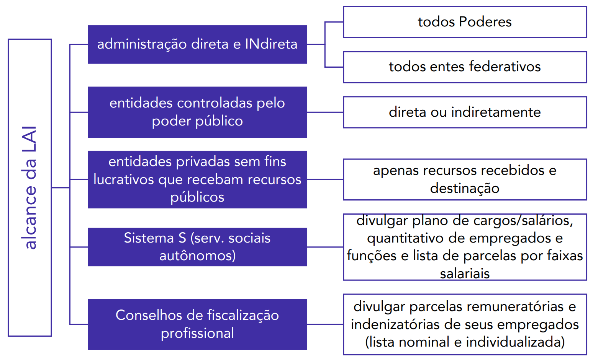

# Capítulo 8 – Lei nº 12.527/2011: Lei de Acesso à Informação (LAI)

O **princípio da publicidade**, previsto no art. 37 da Constituição Federal, é um dos alicerces do Estado Democrático de Direito brasileiro. Ele exige a ampla divulgação dos atos praticados pela Administração Pública, tornando a gestão estatal transparente para os administrados. É por meio dessa transparência que se viabiliza o **controle social**, permitindo que os cidadãos fiscalizem a conduta dos administradores públicos e o uso dos recursos da coletividade.

Nesse sentido, a **Lei nº 12.527, de 18 de novembro de 2011**, conhecida como **Lei de Acesso à Informação (LAI)**, representou um marco histórico na consolidação da democracia brasileira. Ela veio para regulamentar o direito fundamental de acesso a informações mantidas pelo Poder Público, um direito já previsto na Constituição, mas que carecia de um instrumento legal que o tornasse plenamente aplicável.

## Fundamento Constitucional

A LAI não cria um novo direito, mas sim estabelece os procedimentos para garantir a efetividade de um direito já consagrado na Constituição Federal de 1988, principalmente em dois de seus dispositivos:

> **CF, art. 5º, XXXIII -** todos têm direito a receber dos órgãos públicos informações de seu interesse particular, ou de interesse coletivo ou geral, que serão prestadas no prazo da lei, sob pena de responsabilidade, ressalvadas aquelas cujo sigilo seja imprescindível à segurança da sociedade e do Estado;

> **CF, art. 37, § 3º** A lei disciplinará as formas de participação do usuário na administração pública direta e indireta, regulando especialmente: (...)
> 
> II - o acesso dos usuários a registros administrativos e a informações sobre atos de governo, observado o disposto no art. 5º, X e XXXIII;

O inciso XXXIII do art. 5º eleva o acesso à informação ao patamar de **direito fundamental**, inerente à cidadania. Já o art. 37 o insere como um instrumento de **participação e controle** na gestão da Administração Pública.

### Publicidade como Regra, Sigilo como Exceção

O próprio texto constitucional já indica que a regra geral é a transparência. O acesso à informação pode ser negado ao público em geral apenas em casos específicos e justificados.

> **PONTO FUNDAMENTAL: A Publicidade é a Regra, o Sigilo é a Exceção**
> 
> Este é o princípio mais importante que norteia toda a Lei de Acesso à Informação. Significa que, por padrão, toda informação produzida ou custodiada pelo Estado é pública. O sigilo é uma medida excepcional, que só pode ser aplicada nas hipóteses estritamente previstas em lei.
> 
> Na prática, isso inverte o ônus da prova: não é o cidadão que precisa justificar por que deseja uma informação; é o Estado que precisa justificar, com base na lei, por que uma determinada informação deve ser mantida em sigilo.

Com base nestes dispositivos, o legislador, por meio da LAI, estabeleceu como dever do Estado garantir o direito de acesso à informação. Conforme o art. 5º da própria lei, o acesso será franqueado, mediante **procedimentos objetivos e ágeis**, de forma **transparente, clara e em linguagem de fácil compreensão**.

## Alcance da Lei de Acesso à Informação

A Lei de Acesso à Informação (LAI) é uma **norma de caráter nacional**, o que significa que suas regras se aplicam obrigatoriamente a todos os entes da federação: a **União**, os **Estados**, o **Distrito Federal** e os **Municípios**.

### A Abrangência no Setor Público

Em todos os entes federativos, a LAI alcança a totalidade da estrutura estatal, não se limitando ao Poder Executivo. Subordinam-se ao seu regramento:

- **A Administração Direta de todos os Poderes:**
    - **Poder Executivo:** Presidência da República, Ministérios, Secretarias, etc.
    - **Poder Legislativo:** Congresso Nacional, Assembleias Legislativas, Câmaras Municipais.
    - **Poder Judiciário:** Todos os tribunais e órgãos judiciais.
- **As Instituições Autônomas:** O **Ministério Público** e os **Tribunais de Contas**.
- **A Administração Indireta:** Todas as entidades, como as **autarquias** (ex: INSS, Universidades Federais), as **fundações públicas** (ex: IBGE, FUNAI), as **empresas públicas** (ex: Correios, Caixa Econômica Federal) e as **sociedades de economia mista** (ex: Petrobras, Banco do Brasil), além das demais entidades controladas direta ou indiretamente pelo poder público.

### A Aplicação a Entidades Privadas

A LAI estende sua aplicação, no que couber, até mesmo a **entidades privadas sem fins lucrativos** que recebam recursos públicos. O princípio norteador é o de que "quem gere dinheiro público, deve prestar contas públicas".

É crucial, contudo, observar duas limitações importantes:

1. **A quais entidades se aplica?** A regra não alcança toda e qualquer entidade privada, mas apenas aquelas que, além de não terem finalidade lucrativa, possuam vínculos específicos com o poder público para o repasse de recursos, como contratos de gestão, termos de parceria, convênios, acordos, etc.
2. **Qual a extensão da transparência?** As atividades de uma entidade privada podem envolver recursos públicos e também recursos próprios. O dever de publicidade imposto pela LAI se restringe **à parcela dos recursos públicos recebidos e à sua respectiva destinação**. As informações relativas à aplicação de seus recursos privados não são alcançadas pela lei.

#### Regras Específicas para o "Sistema S" e Conselhos Profissionais

Com a alteração promovida pela Lei nº 15.141, em junho de 2025, a LAI passou a incluir regras de transparência específicas para duas categorias de entidades paraestatais (entidades privadas que administram recursos públicos).

- **Serviços Sociais Autônomos (Sistema S):** Entidades como Sesc, Senai, Sesi e Sebrae, que recebem recursos de contribuições parafiscais ou por meio de contratos de gestão, deverão divulgar as seguintes informações:

    > **Art. 8º-A.** As entidades com personalidade jurídica de direito privado, constituídas sob a forma de serviço social autônomo, que sejam destinatárias de contribuições ou de recursos públicos federais decorrentes de contrato de gestão deverão divulgar as seguintes informações relativas aos respectivos empregados:
    > 
    > I - o plano de cargos e salários, inclusive com a divulgação dos critérios para a evolução na carreira e para a fixação da política salarial;
    > II - o quantitativo total de empregados da entidade, discriminado por cargo e por faixas salariais, acompanhado do nome do empregado e do cargo por ele ocupado;
    > III - lista, discriminada por faixas salariais, das parcelas remuneratórias e indenizatórias, ainda que eventuais, incluídos os auxílios, as ajudas de custo, as gratificações, os jetons e quaisquer outras vantagens pecuniárias, que os empregados possam receber em virtude de condições específicas; e
    > IV - o quantitativo de funções gratificadas, os critérios para sua ocupação e o rol dos empregados que ocupam cada espécie de função gratificada.

- **Conselhos de Fiscalização Profissional:** Entidades como o CREA, o CRM, o CRO, etc., devem dar um passo além na transparência:

    > **Art. 8º-B.** Os conselhos de fiscalização profissional devem divulgar, de **forma nominal e individualizada**, lista das parcelas remuneratórias e indenizatórias, ainda que eventuais, incluídos os auxílios, as ajudas de custo, as gratificações, os jetons e quaisquer outras vantagens pecuniárias, que os empregados possam receber em virtude de condições específicas.

Por fim, vale destacar que a LAI é uma norma de caráter geral. Estados, Distrito Federal e Municípios poderão editar normas próprias e mais específicas, desde que não contrariem as diretrizes gerais estabelecidas na lei federal.

