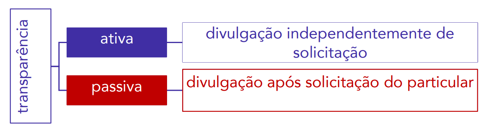
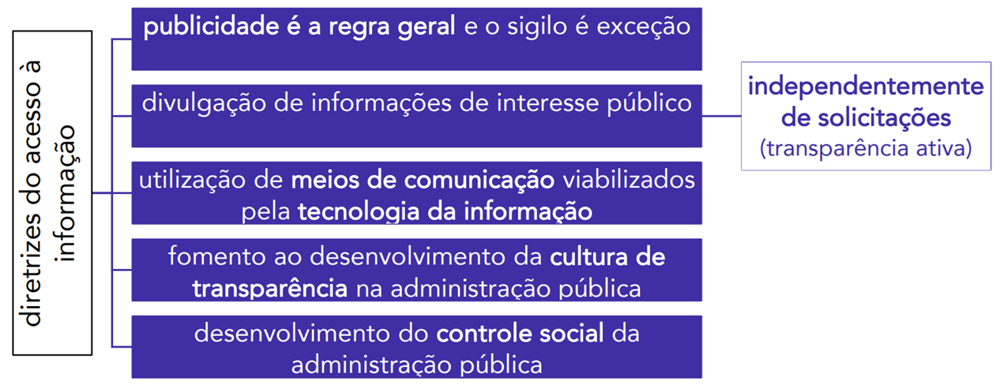
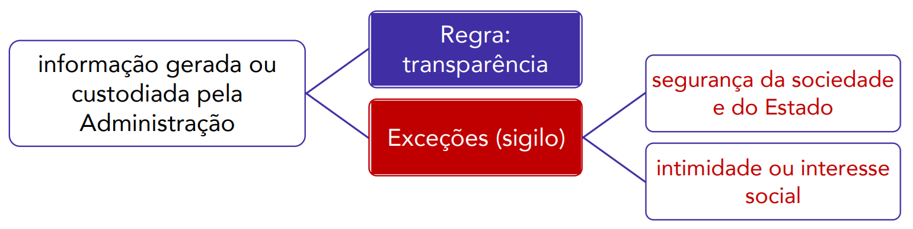
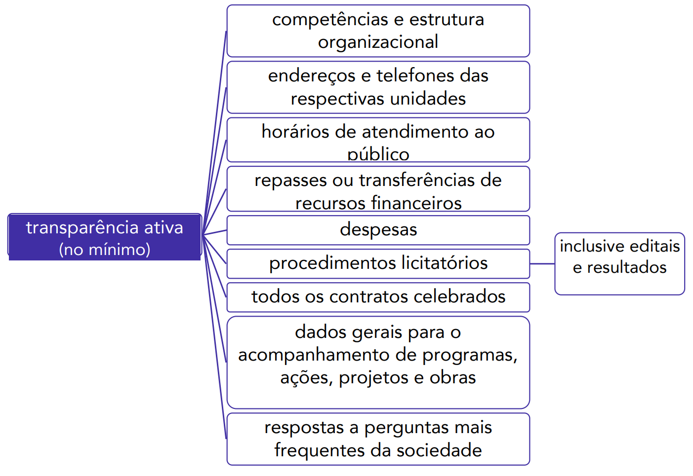
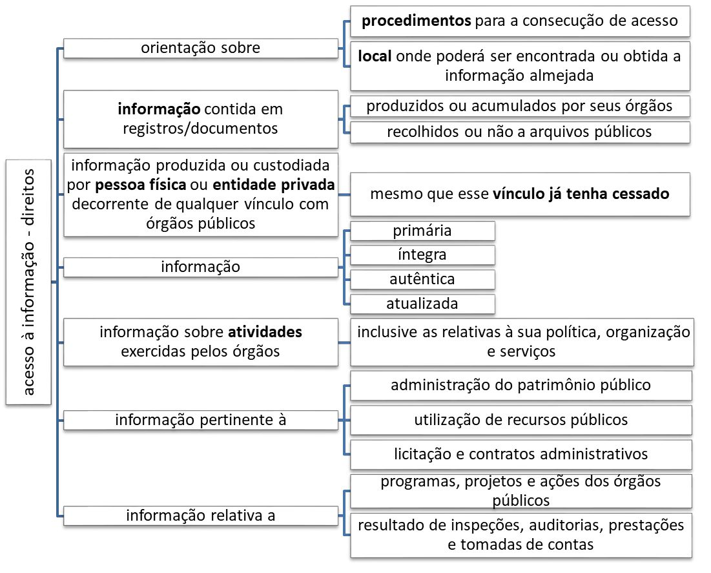
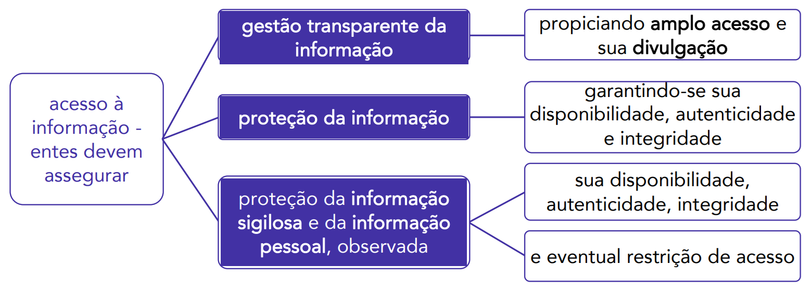
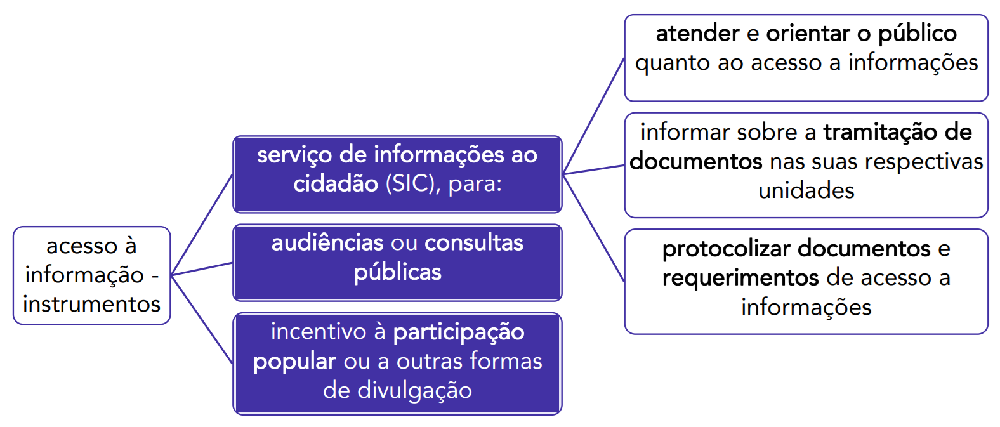
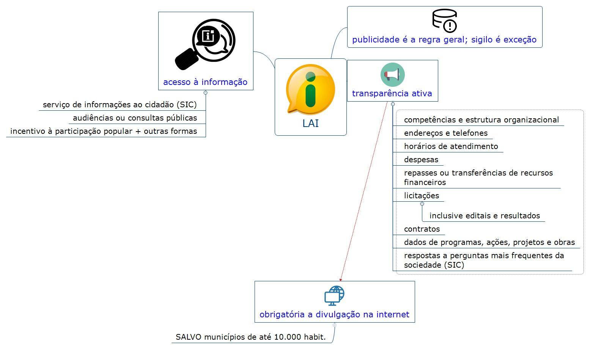

# Capítulo 8 – Lei nº 12.527/2011: Lei de Acesso à Informação (LAI)

O **princípio da publicidade**, previsto no art. 37 da Constituição Federal, é um dos alicerces do Estado Democrático de Direito brasileiro. Ele exige a ampla divulgação dos atos praticados pela Administração Pública, tornando a gestão estatal transparente para os administrados. É por meio dessa transparência que se viabiliza o **controle social**, permitindo que os cidadãos fiscalizem a conduta dos administradores públicos e o uso dos recursos da coletividade.

Nesse sentido, a **Lei nº 12.527, de 18 de novembro de 2011**, conhecida como **Lei de Acesso à Informação (LAI)**, representou um marco histórico na consolidação da democracia brasileira. Ela veio para regulamentar o direito fundamental de acesso a informações mantidas pelo Poder Público, um direito já previsto na Constituição, mas que carecia de um instrumento legal que o tornasse plenamente aplicável.

## Fundamento Constitucional

A LAI não cria um novo direito, mas sim estabelece os procedimentos para garantir a efetividade de um direito já consagrado na Constituição Federal de 1988, principalmente em dois de seus dispositivos:

> **CF, art. 5º, XXXIII -** todos têm direito a receber dos órgãos públicos informações de seu interesse particular, ou de interesse coletivo ou geral, que serão prestadas no prazo da lei, sob pena de responsabilidade, ressalvadas aquelas cujo sigilo seja imprescindível à segurança da sociedade e do Estado;

> **CF, art. 37, § 3º** A lei disciplinará as formas de participação do usuário na administração pública direta e indireta, regulando especialmente: (...)
> 
> II - o acesso dos usuários a registros administrativos e a informações sobre atos de governo, observado o disposto no art. 5º, X e XXXIII;

O inciso XXXIII do art. 5º eleva o acesso à informação ao patamar de **direito fundamental**, inerente à cidadania. Já o art. 37 o insere como um instrumento de **participação e controle** na gestão da Administração Pública.

### Publicidade como Regra, Sigilo como Exceção

O próprio texto constitucional já indica que a regra geral é a transparência. O acesso à informação pode ser negado ao público em geral apenas em casos específicos e justificados.

> **PONTO FUNDAMENTAL: A Publicidade é a Regra, o Sigilo é a Exceção**
> 
> Este é o princípio mais importante que norteia toda a Lei de Acesso à Informação. Significa que, por padrão, toda informação produzida ou custodiada pelo Estado é pública. O sigilo é uma medida excepcional, que só pode ser aplicada nas hipóteses estritamente previstas em lei.
> 
> Na prática, isso inverte o ônus da prova: não é o cidadão que precisa justificar por que deseja uma informação; é o Estado que precisa justificar, com base na lei, por que uma determinada informação deve ser mantida em sigilo.

Com base nestes dispositivos, o legislador, por meio da LAI, estabeleceu como dever do Estado garantir o direito de acesso à informação. Conforme o art. 5º da própria lei, o acesso será franqueado, mediante **procedimentos objetivos e ágeis**, de forma **transparente, clara e em linguagem de fácil compreensão**.

## Alcance da Lei de Acesso à Informação

A Lei de Acesso à Informação (LAI) é uma **norma de caráter nacional**, o que significa que suas regras se aplicam obrigatoriamente a todos os entes da federação: a **União**, os **Estados**, o **Distrito Federal** e os **Municípios**.

### A Abrangência no Setor Público

Em todos os entes federativos, a LAI alcança a totalidade da estrutura estatal, não se limitando ao Poder Executivo. Subordinam-se ao seu regramento:

- **A Administração Direta de todos os Poderes:**
    - **Poder Executivo:** Presidência da República, Ministérios, Secretarias, etc.
    - **Poder Legislativo:** Congresso Nacional, Assembleias Legislativas, Câmaras Municipais.
    - **Poder Judiciário:** Todos os tribunais e órgãos judiciais.
- **As Instituições Autônomas:** O **Ministério Público** e os **Tribunais de Contas**.
- **A Administração Indireta:** Todas as entidades, como as **autarquias** (ex: INSS, Universidades Federais), as **fundações públicas** (ex: IBGE, FUNAI), as **empresas públicas** (ex: Correios, Caixa Econômica Federal) e as **sociedades de economia mista** (ex: Petrobras, Banco do Brasil), além das demais entidades controladas direta ou indiretamente pelo poder público.

### A Aplicação a Entidades Privadas

A LAI estende sua aplicação, no que couber, até mesmo a **entidades privadas sem fins lucrativos** que recebam recursos públicos. O princípio norteador é o de que "quem gere dinheiro público, deve prestar contas públicas".

É crucial, contudo, observar duas limitações importantes:

1. **A quais entidades se aplica?** A regra não alcança toda e qualquer entidade privada, mas apenas aquelas que, além de não terem finalidade lucrativa, possuam vínculos específicos com o poder público para o repasse de recursos, como contratos de gestão, termos de parceria, convênios, acordos, etc.
2. **Qual a extensão da transparência?** As atividades de uma entidade privada podem envolver recursos públicos e também recursos próprios. O dever de publicidade imposto pela LAI se restringe **à parcela dos recursos públicos recebidos e à sua respectiva destinação**. As informações relativas à aplicação de seus recursos privados não são alcançadas pela lei.

#### Regras Específicas para o "Sistema S" e Conselhos Profissionais

Com a alteração promovida pela Lei nº 15.141, em junho de 2025, a LAI passou a incluir regras de transparência específicas para duas categorias de entidades paraestatais (entidades privadas que administram recursos públicos).

- **Serviços Sociais Autônomos (Sistema S):** Entidades como Sesc, Senai, Sesi e Sebrae, que recebem recursos de contribuições parafiscais ou por meio de contratos de gestão, deverão divulgar as seguintes informações:

    > **Art. 8º-A.** As entidades com personalidade jurídica de direito privado, constituídas sob a forma de serviço social autônomo, que sejam destinatárias de contribuições ou de recursos públicos federais decorrentes de contrato de gestão deverão divulgar as seguintes informações relativas aos respectivos empregados:
    > 
    > I - o plano de cargos e salários, inclusive com a divulgação dos critérios para a evolução na carreira e para a fixação da política salarial;
    > II - o quantitativo total de empregados da entidade, discriminado por cargo e por faixas salariais, acompanhado do nome do empregado e do cargo por ele ocupado;
    > III - lista, discriminada por faixas salariais, das parcelas remuneratórias e indenizatórias, ainda que eventuais, incluídos os auxílios, as ajudas de custo, as gratificações, os jetons e quaisquer outras vantagens pecuniárias, que os empregados possam receber em virtude de condições específicas; e
    > IV - o quantitativo de funções gratificadas, os critérios para sua ocupação e o rol dos empregados que ocupam cada espécie de função gratificada.

- **Conselhos de Fiscalização Profissional:** Entidades como o CREA, o CRM, o CRO, etc., devem dar um passo além na transparência:

    > **Art. 8º-B.** Os conselhos de fiscalização profissional devem divulgar, de **forma nominal e individualizada**, lista das parcelas remuneratórias e indenizatórias, ainda que eventuais, incluídos os auxílios, as ajudas de custo, as gratificações, os jetons e quaisquer outras vantagens pecuniárias, que os empregados possam receber em virtude de condições específicas.

Por fim, vale destacar que a LAI é uma norma de caráter geral. Estados, Distrito Federal e Municípios poderão editar normas próprias e mais específicas, desde que não contrariem as diretrizes gerais estabelecidas na lei federal.

## Disposições Gerais: Definições e Conceitos Fundamentais

Para garantir a correta e uniforme aplicação da lei em todo o território nacional e em todas as esferas de poder, o art. 4º da LAI estabelece um conjunto de definições legais. A compreensão desses conceitos é essencial para a interpretação de toda a norma.

> **Art. 4º** Para os efeitos desta Lei, considera-se:
> 
> I - informação: dados, processados ou não, que podem ser utilizados para produção e transmissão de conhecimento, contidos em qualquer meio, suporte ou formato;
> II - documento: unidade de registro de informações, qualquer que seja o suporte ou formato;
> III - informação sigilosa: aquela submetida temporariamente à restrição de acesso público em razão de sua imprescindibilidade para a segurança da sociedade e do Estado;
> IV - informação pessoal: aquela relacionada à pessoa natural identificada ou identificável;
> V - tratamento da informação: conjunto de ações referentes à produção, recepção, classificação, utilização, acesso, reprodução, transporte, transmissão, distribuição, arquivamento, armazenamento, eliminação, avaliação, destinação ou controle da informação;
> VI - disponibilidade: qualidade da informação que pode ser conhecida e utilizada por indivíduos, equipamentos ou sistemas autorizados;
> VII - autenticidade: qualidade da informação que tenha sido produzida, expedida, recebida ou modificada por determinado indivíduo, equipamento ou sistema;
> VIII - integridade: qualidade da informação не modificada, inclusive quanto à origem, trânsito e destino;
> IX - primariedade: qualidade da informação coletada na fonte, com o máximo de detalhamento possível, sem modificações.

Destacam-se nessas definições:

- O conceito amplo de **informação**, que abrange dados brutos e em qualquer formato.
- A natureza da **informação sigilosa**, que é sempre uma restrição **temporária**. Não existe sigilo eterno no âmbito da LAI.
- A **informação pessoal**, cujo tratamento e acesso são regidos por regras especiais para proteger a privacidade do indivíduo, em conformidade com a **Lei Geral de Proteção de Dados (LGPD)**.
- Os conceitos de **disponibilidade, autenticidade e integridade**, que são os pilares da segurança da informação.
- O conceito de **primariedade**, que orienta a Administração a fornecer os dados em sua forma mais bruta e original possível, o que é fundamental para a pesquisa e o controle social aprofundado.

### Transparência Ativa e Transparência Passiva: As Duas Faces do Acesso

Apesar de não constarem expressamente das definições legais do art. 4º, a doutrina e a própria estrutura da LAI se baseiam nos conceitos de "transparência ativa" e "transparência passiva".

- **Transparência Ativa:** Corresponde ao **dever** do Poder Público de **divulgar proativamente**, de forma espontânea e independentemente de solicitações, um conjunto mínimo de informações de interesse público. Essa divulgação ocorre, principalmente, nos sítios oficiais dos órgãos na internet, em seções de fácil acesso denominadas "Acesso à Informação" ou nos "Portais da Transparência".
    - **Exemplos:** Divulgação de informações sobre a estrutura do órgão, seus gastos com licitações e contratos, a remuneração de seus servidores, relatórios de auditorias e prestações de contas.
- **Transparência Passiva:** Corresponde ao **dever** do Poder Público de **fornecer a informação em resposta a uma solicitação** específica feita por qualquer cidadão. É o direito de o cidadão "bater à porta" do Estado e perguntar. Essa modalidade abrange todas as informações de natureza pública que não estejam sujeitas a sigilo legal e que não tenham sido previamente divulgadas na transparência ativa.
    - **Exemplo:** Um pesquisador solicita a um órgão ambiental o relatório completo de impacto de uma obra específica. Se esse documento não estiver disponível no site, o órgão tem o dever de fornecê-lo mediante o pedido (transparência passiva).

### Diretrizes do Acesso à Informação

Para assegurar a efetividade do direito de acesso, a LAI, em seu artigo 3º, estabelece um conjunto de diretrizes que devem ser observadas por todos os entes públicos, em alinhamento com os princípios básicos da Administração.

A seguir, analisaremos em detalhe as principais diretrizes.

#### A Publicidade como Regra e o Sigilo como Exceção

Esta é a diretriz basilar de toda a lei, conforme já mencionado. A publicidade dos atos e das informações públicas constitui a regra geral, sendo o sigilo uma medida de caráter excepcional. A restrição de acesso só pode ocorrer nas hipóteses estritamente previstas em lei, que, nos termos da Constituição Federal, se justificam para a proteção da segurança da sociedade e do Estado, ou para a defesa da intimidade ou do interesse social.

#### A Transparência Ativa: O Dever de Publicar Informações

A segunda diretriz consagra a chamada **"transparência ativa"**. Ela estabelece o dever dos órgãos e entidades públicas de divulgar um conjunto de informações de interesse público em seus sítios oficiais na internet, **independentemente de qualquer solicitação**.

De modo abrangente, o art. 8º da LAI prevê que essa divulgação proativa deve abranger as informações de interesse coletivo ou geral produzidas ou custodiadas pelos entes públicos. De forma mais concreta, o § 1º do mesmo artigo estabelece uma lista de informações que são consideradas, no mínimo, de divulgação obrigatória:

É fundamental notar que este é um rol mínimo; nada impede que os órgãos divulguem ativamente outras informações de interesse público.

> **Ponto de Destaque: A Divulgação da Remuneração dos Servidores**
> 
> Um dos exemplos mais emblemáticos de transparência ativa é a divulgação da remuneração dos servidores públicos. No âmbito do Poder Executivo Federal, o Decreto nº 7.724/2012 (que regulamenta a LAI) determina a divulgação da remuneração e do subsídio de forma individualizada.
> 
> O tema foi levado ao Supremo Tribunal Federal, que, em decisão com repercussão geral, firmou a seguinte tese:
> 
> > É legítima a publicação, inclusive em sítio eletrônico mantido pela administração pública, dos nomes dos seus servidores e do valor dos correspondentes vencimentos e vantagens pecuniárias. (ARE 652.777, Tema 483 de Repercussão Geral)
> 
> O entendimento do STF é o de que o interesse público na transparência e na fiscalização dos gastos com pessoal se sobrepõe ao direito à privacidade do servidor no que tange à sua remuneração, que é custeada por toda a sociedade.

A LAI determina que a divulgação ativa das informações seja realizada em "todos os meios e instrumentos legítimos", sendo **obrigatória a sua publicação em sítios oficiais na internet** (geralmente nos "Portais da Transparência"). A única exceção a esta obrigatoriedade é para os **municípios com população de até 10.000 (dez mil) habitantes**, que, embora dispensados de manter o portal, não estão dispensados do dever de transparência.

Para garantir que esses portais sejam efetivos, a lei estabelece uma série de **requisitos mínimos** que eles devem atender:

> **Art. 8º, § 3º** Os sítios de que trata o § 2º deverão, na forma de regulamento, atender, entre outros, aos seguintes requisitos:
> 
> I - conter ferramenta de pesquisa de conteúdo que permita o acesso à informação de forma objetiva, transparente, clara e em linguagem de fácil compreensão;
> II - possibilitar a gravação de relatórios em diversos formatos eletrônicos, inclusive abertos e não proprietários, tais como planilhas e texto, de modo a facilitar a análise das informações;
> III - possibilitar o acesso automatizado por sistemas externos em formatos abertos, estruturados e legíveis por máquina;
> IV - divulgar em detalhes os formatos utilizados para estruturação da informação;
> V - garantir a autenticidade e a integridade das informações disponíveis para acesso;
> VI - manter atualizadas as informações disponíveis para acesso;
> VII - indicar local e instruções que permitam ao interessado comunicar-se, por via eletrônica ou telefônica, com o órgão ou entidade detentora do sítio; e
> VIII - adotar as medidas necessárias para garantir a acessibilidade de conteúdo para pessoas com deficiência, nos termos do art. 17 da Lei nº 10.098, de 19 de dezembro de 2000, e do art. 9º da Convenção sobre os Direitos das Pessoas com Deficiência, aprovada pelo Decreto Legislativo nº 186, de 9 de julho de 2008.

#### Fomento ao Desenvolvimento do Controle Social

Uma das diretrizes mais importantes da LAI é o **desenvolvimento do controle social da administração pública**. O controle social (ou popular) representa o acompanhamento que a própria população, como titular do poder em uma democracia, pode exercer sobre a Administração Pública e sobre a função administrativa.

Como destinatários da ação governamental, os cidadãos são legitimados a realizar o controle sobre os atos do poder público. Este controle é um mecanismo fundamental para o fortalecimento da cidadania, para a redução dos níveis de corrupção e irregularidades e, em última análise, para a melhoria da qualidade dos serviços públicos.

No entanto, para poder controlar, é necessário que o cidadão tenha acesso a dados da gestão pública. O controle social está, portanto, diretamente ligado à transparência pública. A LAI é o principal instrumento que fornece a "matéria-prima" (a informação) para que o controle social possa ser exercido de forma efetiva. Tal controle pode ser realizado diretamente pela população ou por intermédio de órgãos e mecanismos com tal função.

- **Exemplos de Instrumentos de Controle Social:**
    - **Audiências Públicas:** Reuniões abertas à participação popular, convocadas pelo Poder Público para debater projetos de lei, obras ou políticas públicas de grande impacto, permitindo que os cidadãos manifestem suas opiniões e questionamentos.
    - **Conselhos Gestores de Políticas Públicas:** Órgãos colegiados, com composição paritária entre representantes do governo e da sociedade civil, que participam da formulação, do acompanhamento e da fiscalização de políticas setoriais (ex: Conselho de Alimentação Escolar, Conselho Municipal de Saúde).
    - **Ação Popular:** Instrumento constitucional (art. 5º, LXXIII) que permite a qualquer cidadão propor uma ação judicial para anular um ato lesivo ao patrimônio público, à moralidade administrativa, ao meio ambiente e ao patrimônio histórico e cultural.
    - **Denúncias aos Tribunais de Contas:** A Constituição (art. 74, §2º) permite que qualquer cidadão, partido político, associação ou sindicato denuncie irregularidades ou ilegalidades perante o Tribunal de Contas da União.

#### Fomento à Cultura de Transparência

A quarta diretriz da lei é o **fomento ao desenvolvimento da cultura de transparência na administração pública**. Esta diretriz reconhece que a transparência não se resume ao mero cumprimento de uma lei, mas requer uma mudança de mentalidade e de cultura organizacional.

Significa transitar de uma cultura histórica de sigilo, na qual a informação era vista como patrimônio do burocrata, para uma **cultura de abertura**, na qual a informação é compreendida como um bem público que pertence, por direito, ao cidadão. Analisando as ações governamentais sob o prisma da ciência da Administração e da Governança, tem-se apontado a promoção da transparência e da **equidade** (enquanto forma de tratamento isonômico aos cidadãos e empresas) como pilares necessários para a melhoria da confiança depositada no Estado. A transparência promove a equidade ao garantir que todos tenham acesso às mesmas informações, criando um campo de jogo nivelado para a participação em licitações, o acesso a serviços e a fiscalização do poder público.

### O Acesso à Informação em Detalhe

Após compreendermos as diretrizes gerais, a Lei de Acesso à Informação detalha o que, de fato, significa o "acesso à informação", quais são os deveres dos órgãos públicos na gestão dessas informações e quais instrumentos devem ser criados para garantir que o cidadão possa exercer seu direito.

#### O Que Compreende o Acesso à Informação (Art. 7º)

O art. 7º da LAI define o escopo do direito de acesso, que compreende, entre outros, o direito de obter:

Analisando o diagrama, percebe-se a amplitude do direito, que abrange:

- **Orientação** sobre os procedimentos e locais para se obter a informação.
- **Informação contida em registros e documentos**, sejam eles produzidos pelo próprio órgão ou apenas acumulados por ele.
- **Informação produzida ou custodiada por pessoa física ou entidade privada** que tenha qualquer tipo de vínculo com o poder público (ex: informações relativas a um serviço público concedido a uma empresa privada).
- O direito de receber a informação em sua forma **primária, íntegra, autêntica e atualizada**.
- Informações sobre as **atividades do órgão**, sua **gestão patrimonial**, o uso de **recursos públicos**, **licitações e contratos**, **programas e projetos**, e os **resultados de auditorias e prestações de contas**.

A lei, contudo, exclui expressamente deste direito as informações referentes a projetos de pesquisa e desenvolvimento científicos ou tecnológicos cujo sigilo seja imprescindível à segurança da sociedade e do Estado.

> **Ponto de Atenção: O Acesso a Processos em Andamento**
> 
> A LAI estabelece uma importante regra temporal para o acesso a documentos que compõem um processo administrativo. Como regra geral, o acesso irrestrito ao conteúdo de um processo só será assegurado **após a edição do ato decisório respectivo** (art. 7º, § 3º).
> 
> A finalidade desta regra é proteger o **processo decisório** interno. Enquanto um processo está em tramitação, a divulgação de pareceres técnicos, notas e debates internos poderia inibir a livre manifestação dos servidores e submeter a decisão a pressões externas indevidas. Contudo, uma vez tomada a decisão final, a transparência sobre como essa decisão foi construída se torna a regra, permitindo o controle social.

#### Os Deveres dos Órgãos Públicos na Gestão da Informação (Art. 6º)

Para que o direito de acesso seja efetivo, o art. 6º da LAI impõe aos órgãos e entidades do poder público o dever de assegurar uma gestão adequada da informação, pautada por três eixos:

#### Os Instrumentos para Assegurar o Acesso (Art. 9º)

Para materializar o direito de acesso, o art. 9º prevê que ele será assegurado por meio de instrumentos específicos, com destaque para a criação do Serviço de Informações ao Cidadão (SIC).

O **Serviço de Informações ao Cidadão (SIC)** é a "porta de entrada" da transparência passiva. Trata-se de uma unidade, física ou eletrônica, presente em cada órgão e entidade pública, com a missão de:

- Atender e orientar o público sobre o acesso à informação;
- Informar sobre a tramitação de documentos e pedidos; e
- Protocolizar os requerimentos de acesso à informação.

No âmbito do Poder Executivo Federal, o Decreto nº 7.724/2012 determina que o SIC deve ser instalado em unidade física identificada, de fácil acesso e aberta ao público. Nas unidades descentralizadas onde não houver um SIC, deve ser oferecido, no mínimo, um serviço para o recebimento e o registro dos pedidos.

O esquema a seguir resume os principais conceitos da LAI vistos até aqui:

