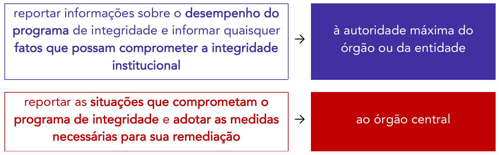

# Capítulo 9 – Decreto nº 11.529/2023: Sistema de Integridade, Transparência e Acesso à Informação

Neste capítulo, iremos discorrer especificamente sobre as regras do Decreto nº 11.529, de 2023, um marco normativo que modernizou e consolidou a política de governança no âmbito da Administração Pública Federal. Este decreto formaliza a conexão indissociável entre três pilares fundamentais: a **Integridade** (o dever de agir corretamente), a **Transparência** (o dever de mostrar o que se faz) e o **Acesso à Informação** (o direito do cidadão de ver o que foi feito).

O decreto institui duas estruturas centrais:

- a) O **SITAI**, que é o Sistema de Integridade, Transparência e Acesso à Informação; e
- b) A **Política de Transparência e Acesso à Informação** da Administração Pública Federal.

Inicialmente, trataremos do SITAI. Antes de avançar, no entanto, é importante revisitar o conceito de integridade pública, que, segundo a Organização para a Cooperação e Desenvolvimento Econômico (OCDE), representa o:

> alinhamento consistente e a aderência a valores éticos compartilhados pela sociedade – princípios e normas para garantia e priorização dos interesses públicos diante dos interesses privados no setor público.

O decreto se aplica à **administração federal direta, às autarquias e às fundações públicas**.

> **PONTO DE ATENÇÃO: O Alcance do Decreto**
> 
> Diferentemente de outras normas, o Decreto nº 11.529/2023 **não se aplica diretamente às empresas estatais federais** (empresas públicas e sociedades de economia mista), que são regidas por legislação própria no que tange à governança e à integridade (Lei nº 13.303/2016).

## Sistema de Integridade, Transparência e Acesso à Informação (SITAI)

O decreto instituiu o **Sistema de Integridade, Transparência e Acesso à Informação da Administração Pública Federal (Sitai)**. Este sistema substituiu o antigo Sistema de Integridade Pública do Poder Executivo Federal (SIPEF), ampliando seu escopo de atuação. Enquanto o SIPEF era focado primordialmente no combate à corrupção e na conduta ética interna, o Sitai adota uma visão mais ampla, reconhecendo que uma administração verdadeiramente íntegra deve ser, também, transparente e aberta ao controle social.

### Estrutura e Objetivos do Sitai

O Sitai é organizado em dois níveis:

- **Órgão Central:** A **Controladoria-Geral da União (CGU)**, que atua como o órgão coordenador, responsável por ditar as normas gerais, estabelecer os padrões e monitorar o sistema como um todo.
- **Unidades Setoriais:** Presentes em cada órgão e entidade, são as responsáveis pela implementação das políticas de integridade no nível local. Nos órgãos da administração direta (Ministérios), essa função é exercida, em regra, pelas **Assessorias Especiais de Controle Interno (AECI)**.

Os **objetivos** do Sitai, conforme o art. 4º do decreto, são:

> **I - Coordenar e articular as atividades relativas à integridade, à transparência e ao acesso à informação**, garantindo que todos os órgãos atuem de forma alinhada;
> **II - Estabelecer padrões para as práticas e as medidas de integridade, transparência e acesso à informação**, buscando um nível de excelência uniforme em toda a administração; e
> **III - Aumentar a simetria de informações e dados nas relações entre a administração pública federal e a sociedade**. Este objetivo visa a reduzir a "assimetria informacional" – a situação em que o Estado detém muito mais informação que o cidadão –, de modo a empoderar a sociedade para o exercício do controle social.

### Caráter Complementar e Integrado do Sitai

A Administração Pública possui diversos sistemas estruturadores (de pessoal, de orçamento, de planejamento, etc.). O Sitai não foi criado para substituir ou se sobrepor a eles, mas para atuar de forma colaborativa, conforme ressalta o art. 9º do decreto:

> **Art. 9º** O Sitai atuará de forma complementar e integrada aos demais sistemas estruturadores, principalmente aqueles que coordenem as atividades de instâncias que lhe prestem apoio, de forma a evitar a sobreposição de esforços, racionalizar os custos e melhorar o desempenho e a qualidade dos resultados.

### Os Conceitos Fundamentais do Sitai

Para a correta implementação do sistema, o art. 3º do Decreto nº 11.529/2023 apresenta três definições essenciais, que representam a arquitetura da política de integridade nos órgãos e entidades.

#### A) O Programa de Integridade

O **programa de integridade** é a estratégia geral e permanente de um órgão para promover uma cultura ética e prevenir desvios de conduta. Ele é definido como o:

> conjunto de princípios, normas, procedimentos e mecanismos de prevenção, detecção e remediação de práticas de corrupção e fraude, de irregularidades, ilícitos e outros desvios éticos e de conduta, de violação ou desrespeito a direitos, valores e princípios que impactem a confiança, a credibilidade e a reputação institucional.

O objetivo do programa é promover a conformidade de condutas, a transparência, a priorização do interesse público e uma cultura organizacional voltada à entrega de valor público à sociedade. Em outras palavras, o programa de integridade representa “uma estrutura de incentivos organizacionais – positivos e negativos – que visa orientar e guiar o comportamento dos agentes públicos de forma a alinhá-los ao interesse público”.

#### B) As Funções de Integridade

Para que o programa de integridade seja executado, ele se apoia em um conjunto de instâncias e atividades já existentes na Administração. Estas são as **funções de integridade**:

> funções constantes nos sistemas de corregedoria, ouvidoria, controle interno, gestão da ética, transparência e outras essenciais ao funcionamento do programa de integridade.

O programa busca fazer com que os responsáveis por essas funções “trabalhem juntas e de forma coordenada, a fim de garantir uma atuação íntegra, minimizando os possíveis riscos de corrupção”. Cada função possui um papel específico:

- **Controle Interno:** Atua na prevenção e detecção, por meio da análise e gestão de riscos.
- **Ouvidoria:** Atua como o canal de denúncias e participação social.
- **Corregedoria:** Atua na remediação e responsabilização, por meio da apuração e punição de desvios.
- **Gestão da Ética:** Atua na orientação e aconselhamento, por meio da Comissão de Ética.
- **Transparência:** Atua na promoção do controle social, garantindo o acesso à informação.

#### C) O Plano de Integridade

Enquanto o _programa_ é a estratégia permanente, o **plano de integridade** é o instrumento de ação. Ele é definido como o:

> plano que organiza as medidas de integridade a serem adotadas em determinado período, elaborado por unidade setorial do Sitai e aprovado pela autoridade máxima do órgão ou da entidade.

O plano de integridade é o documento que transforma os princípios do programa em ações concretas, com metas, prazos e responsáveis.

> **PONTO DE ATENÇÃO: A Elaboração e Aprovação do Plano**
> 
> A norma estabelece duas regras importantes para o plano de integridade:
> 
> 1. Ele deve ser elaborado pela **unidade setorial do Sitai** (geralmente a Assessoria Especial de Controle Interno - AECI).
> 2. Ele deve ser aprovado pela **autoridade máxima** do respectivo órgão ou entidade (pelo Ministro, no caso de um Ministério, por exemplo).
> 
> A aprovação pela autoridade máxima é um mecanismo que visa a garantir o comprometimento da alta gestão com a pauta da integridade, em alinhamento com o princípio do “_tone at the top_” (o exemplo vem de cima).

### Estrutura e Competência do Sitai

Conforme adiantado, o Sistema de Integridade, Transparência e Acesso à Informação (Sitai) é composto por uma estrutura de dois níveis, que visa a equilibrar a padronização das políticas com a execução descentralizada. A estrutura, conforme o art. 5º do decreto, é a seguinte:

> I - a Controladoria-Geral da União (CGU), como órgão central; e
> II - as unidades nos órgãos e nas entidades da administração pública federal direta, autárquica e fundacional responsáveis pela gestão da integridade, da transparência e do acesso à informação, como unidades setoriais.

A seguir, detalharemos a atuação de cada um desses componentes.

#### A) Órgão Central do Sitai: A Controladoria-Geral da União (CGU)

Enquanto órgão central do Sitai, compete à Controladoria-Geral da União (CGU) a coordenação, a normatização, a supervisão e o monitoramento de toda a política de integridade, transparência e acesso à informação no âmbito do Poder Executivo Federal. Suas competências, detalhadas no art. 7º do decreto, são vastas e estratégicas:

> I - estabelecer as normas e os procedimentos para o exercício das competências das unidades integrantes do Sitai e as atribuições dos dirigentes para a gestão dos programas de integridade;
> II - orientar as atividades relativas à gestão dos riscos para a integridade;
> III - exercer a supervisão técnica das atividades relacionadas aos programas de integridade geridos pelas unidades setoriais, sem prejuízo da subordinação administrativa dessas unidades ao órgão ou à entidade da administração pública federal a que pertençam;
> IV - coordenar as atividades que exijam ações conjuntas de unidades integrantes do Sitai;
> V - monitorar e avaliar a atuação das unidades setoriais;
> VI - realizar ações de comunicação e capacitação relacionadas às temáticas de integridade, transparência e acesso à informação;
> VII - dar ciência aos órgãos ou às entidades de fatos ou situações que possam comprometer o seu programa de integridade e recomendar a adoção das medidas de remediação necessárias;
> VIII - planejar, coordenar, executar e monitorar a Política de Transparência e Acesso à Informação da Administração Pública Federal;
> IX - estabelecer normas complementares necessárias ao funcionamento do Sitai;
> X - desenvolver e disponibilizar procedimentos, padrões, metodologias e sistemas informatizados que permitam a disseminação, a obtenção, a utilização e a compreensão de informações públicas;
> XI - monitorar o atendimento às solicitações de acesso à informação e o cumprimento das obrigações de transparência ativa e de abertura de dados;
> XII - estimular e apoiar a adoção de medidas de integridade, transparência e acesso à informação para o fortalecimento das políticas públicas;
> XIII - definir critérios e indicadores para a avaliação e o monitoramento da implementação da Política de Transparência e Acesso à Informação da Administração Pública Federal;
> XIV - promover o uso dos dados e das informações públicas pela sociedade para a melhoria da gestão, das políticas e dos serviços; e
> XV - identificar bases de dados e de informações de interesse público e, conforme o caso, sugerir às unidades setoriais a abertura em transparência ativa.

Analisando este rol de competências, percebe-se que a CGU atua em quatro grandes frentes:

1. **Normatização e Padronização:** A CGU define as "regras do jogo", estabelecendo as normas, os procedimentos e as metodologias que devem ser seguidos por todos os órgãos.
2. **Supervisão e Monitoramento:** A CGU fiscaliza e avalia a atuação das unidades setoriais, garantindo a correta implementação da política. A supervisão é de natureza **técnica**, não interferindo na subordinação administrativa da unidade setorial ao seu próprio órgão.
3. **Coordenação e Articulação:** A CGU promove a integração entre as unidades, especialmente em ações que exigem um esforço conjunto.
4. **Fomento e Capacitação:** A CGU tem um papel proativo de promover a cultura de integridade, por meio de ações de comunicação, treinamento e estímulo à abertura de dados.

#### B) As Unidades Setoriais do Sitai

As **unidades setoriais** são os braços executores do Sitai em cada órgão e entidade. A sua estrutura varia conforme a natureza do órgão:

- Na **administração federal direta** (Ministérios), as unidades setoriais são, em regra, as **Assessorias Especiais de Controle Interno (AECI)**.
- Nas **autarquias e fundações públicas**, o dirigente máximo designará uma ou mais unidades responsáveis pela gestão da integridade, da transparência e do acesso à informação.

Estas unidades possuem uma característica de **dupla subordinação**:

1. Estão sujeitas à **subordinação administrativa** ao órgão ou à entidade a que pertencem. Ou seja, hierarquicamente, respondem ao dirigente máximo de sua própria instituição.
2. Estão sujeitas à **orientação normativa e à supervisão técnica do órgão central (CGU)**. Ou seja, em matéria de integridade e transparência, devem seguir as normas e os padrões definidos pela CGU.

Por exemplo, a unidade setorial do Ministério da Saúde continua subordinada administrativamente ao Ministro da Saúde, mas, no que diz respeito à integridade pública, deve seguir as normas da CGU e se sujeitar à sua supervisão técnica.

##### Competências das Unidades Setoriais

O art. 8º do decreto lista as competências das unidades setoriais, que são as responsáveis pela gestão e operacionalização dos programas de integridade em nível local.

> I - assessorar a autoridade máxima do órgão ou da entidade nos assuntos relacionados com a integridade, a transparência e o acesso à informação (...);
> II - articular-se com as demais unidades do órgão ou da entidade que desempenhem funções de integridade (...);
> III - coordenar a estruturação, a execução e o monitoramento de seus programas de integridade;
> IV - promover, em coordenação com as áreas responsáveis pelas funções de integridade, a orientação e o treinamento (...);
> V - elaborar e revisar, periodicamente, o plano de integridade;
> VI - coordenar a gestão dos riscos para a integridade;
> VII - monitorar e avaliar, no âmbito do órgão ou da entidade, a implementação das medidas estabelecidas no plano de integridade;
> VIII - propor ações e medidas, no âmbito do órgão ou da entidade, a partir das informações e dos dados relacionados com a gestão do programa de integridade;
> IX - avaliar as ações e as medidas relativas ao programa de integridade sugeridas pelas demais unidades do órgão ou da entidade;
> X - reportar à autoridade máxima do órgão ou da entidade informações sobre o desempenho do programa de integridade e informar quaisquer fatos que possam comprometer a integridade institucional;
> XI - participar de atividades que exijam a execução de ações conjuntas das unidades integrantes do Sitai;
> XII - reportar ao órgão central as situações que comprometam o programa de integridade e adotar as medidas necessárias para sua remediação;
> XIII - supervisionar a execução das ações relativas à Política de Transparência e Acesso à Informação (...);
> XIV - monitorar o cumprimento das normas de transparência e acesso à informação (...);
> XV - manter atualizadas as informações sobre os serviços de informação ao cidadão; e
> XVI - manter atualizados o inventário de base de dados e a catalogação dos dados abertos no Portal Brasileiro de Dados Abertos.

Analisando estas competências, percebe-se que a unidade setorial é o "motor" da integridade no órgão, sendo responsável por planejar (elaborar o plano de integridade), executar (coordenar a gestão de riscos e os treinamentos), monitorar (avaliar a implementação das medidas) e reportar os resultados.

> **Ponto de Atenção: O Duplo Reporte**
> 
> É crucial notar a sutil, porém importante, diferença entre duas atribuições de reporte da unidade setorial:
> 
> 

> 
> - **Reporte Interno (Inciso X):** A unidade setorial tem o dever de se reportar **à autoridade máxima do seu próprio órgão**, prestando contas sobre o **desempenho geral** do programa de integridade. É um reporte de gestão.
> - **Reporte Externo (Inciso XII):** A unidade setorial tem o dever de se reportar **ao órgão central (CGU)**, mas apenas sobre as **situações que comprometam** o programa. É um reporte de fiscalização e de alerta para o supervisor do sistema.

## Política de Transparência e Acesso à Informação

Além de instituir o Sitai como o sistema gestor, o Decreto nº 11.529/2023 também estabeleceu a **Política de Transparência e Acesso à Informação da Administração Pública Federal**. Esta política representa o conjunto de diretrizes e objetivos que devem orientar todas as ações de transparência no âmbito do Poder Executivo Federal.

Conforme vimos nas competências do Sitai, esta política será planejada, coordenada, executada e monitorada pela **CGU**, que atua como órgão central do sistema.

Antes de avançar, é importante lembrar que a **transparência ativa** é uma das diretrizes fundamentais da própria Lei de Acesso à Informação (Lei nº 12.527/2011, art. 3º), sendo um dever dos entes públicos divulgar informações de interesse público independentemente de solicitações, ou seja, de forma proativa.

### Os Três Pilares da Política de Transparência

A Política de Transparência e Acesso à Informação da Administração Pública Federal se sustenta sobre três pilares, conforme o art. 10 do decreto, que representam as diferentes frentes de atuação para garantir a publicidade dos atos e dados governamentais:

> **I - Transparência Passiva:** Visa a garantir a prestação de informações em atendimento a pedidos específicos apresentados à administração pública federal com fundamento na Lei nº 12.527, de 2011. Este pilar refere-se ao dever do Estado de **responder** às demandas dos cidadãos.
> **II - Transparência Ativa:** Visa a garantir a divulgação de informações de interesse público nos sítios eletrônicos oficiais, **independentemente de solicitação**. Este pilar refere-se ao dever do Estado de **publicar** proativamente as informações.
> **III - Abertura de Bases de Dados:** Visa a promover a abertura de bases de dados produzidos, custodiados ou acumulados pela administração pública federal, para promover pesquisas, estudos, inovações, geração de negócios e participação da sociedade no acompanhamento e na melhoria de políticas e serviços públicos. Este pilar representa uma evolução do conceito de transparência, focando não apenas na divulgação de relatórios e documentos, mas no fornecimento de **dados brutos, abertos e processáveis por máquina**, o que potencializa o controle social e o desenvolvimento de novas aplicações pela sociedade.

### Os Princípios e Objetivos da Política

O art. 11 do Decreto nº 11.529/2023 elenca um robusto conjunto de princípios e objetivos que devem nortear a Política de Transparência e Acesso à Informação, consolidando e expandindo os preceitos já estabelecidos na Lei de Acesso à Informação (LAI).

> São princípios e objetivos desta Política (art. 11):
> 
> I - observância da publicidade como preceito geral e do sigilo como exceção;
> II - amplo acesso da sociedade às informações e aos dados produzidos, custodiados ou acumulados pela administração pública federal e livre utilização desses dados e dessas informações, independentemente de autorização prévia ou de justificativa;
> III - primariedade, integralidade, autenticidade e atualidade das informações disponibilizadas;
> IV - tempestividade no provimento de informações;
> V - utilização de linguagem acessível e de fácil compreensão;
> VI - ênfase na transparência ativa como forma de atender ao direito das pessoas físicas e jurídicas de terem acesso às informações e aos dados produzidos, custodiados ou acumulados pela administração pública federal;
> VII - observância das diretrizes de Governo Aberto, de Dados Abertos e de Governo Digital;
> VIII - foco no cidadão para definição de prioridades de transparência ativa e abertura de dados e informações;
> IX - participação da sociedade na formulação, na execução e no monitoramento das políticas públicas e no controle da aplicação de seus recursos;
> X - utilização de tecnologias de informação e de comunicação para disseminação e incentivo ao uso de dados e informações;
> XI - compartilhamento de informações com vistas ao estímulo à pesquisa, à inovação, à produção científica, à geração de negócios e ao desenvolvimento econômico e social do País;
> XII - melhoria da gestão das informações disponibilizadas pela administração pública federal para a provisão mais eficaz e eficiente de serviços públicos e para a prestação de contas adequada à sociedade;
> XIII - combate à corrupção por meio da inibição da prática de atos ilícitos na administração pública federal e de desvios de conduta de agentes públicos; e
> XIV - respeito à proteção dos dados pessoais.

Analisando este rol, percebe-se que a Política se estrutura em torno de grandes eixos: a reafirmação dos pilares da LAI; o foco na participação social; a modernização tecnológica; e a melhoria da gestão e o combate à corrupção.

#### A Conexão com as Políticas de Governo Aberto, Dados Abertos e Governo Digital

O inciso VII é de particular importância, pois estabelece que a Política de Transparência e Acesso à Informação não é uma iniciativa isolada, mas sim uma peça que deve se integrar a outras políticas de modernização e abertura do Estado. O decreto determina a observância das diretrizes previstas nos seguintes normativos:

**A Política de Dados Abertos do Poder Executivo Federal (Decreto nº 8.777/2016):**
    
> Art. 3º A Política de Dados Abertos do Poder Executivo federal será regida pelos seguintes princípios e diretrizes:
> I - observância da publicidade das bases de dados como preceito geral e do sigilo como exceção;
> II - garantia de acesso irrestrito às bases de dados, as quais devem ser legíveis por máquina e estar disponíveis em formato aberto;
> III - descrição das bases de dados, com informação suficiente para a compreensão de eventuais ressalvas quanto à sua qualidade e integridade;
> IV - permissão irrestrita de reuso das bases de dados publicadas em formato aberto;
> V - completude e interoperabilidade das bases de dados, as quais devem ser disponibilizadas em sua forma primária, com o maior grau de granularidade possível, ou referenciar as bases primárias, quando disponibilizadas de forma agregada;
> VI - atualização periódica, de forma a garantir a perenidade dos dados, a padronização de estruturas de informação e o valor dos dados à sociedade e atender às necessidades de seus usuários; e
> VII - designação clara de responsável pela publicação, atualização, evolução e manutenção de cada base de dado aberta, incluída a prestação de assistência quanto ao uso de dados.

**A Política Nacional de Governo Aberto (Decreto nº 10.160/2019):**

> Art. 2º São diretrizes da Política Nacional de Governo Aberto:
> 
> I - aumento da disponibilidade de informações sobre as atividades governamentais, incluídos os dados sobre os gastos e o desempenho das ações e dos programas do Governo federal;
> II - fomento à participação social nos processos decisórios;
> III - estímulo ao uso de novas tecnologias que fomentem a inovação, o fortalecimento da governança pública e o aumento da transparência e da participação social na gestão e na prestação de serviços públicos; e
> IV - aumento dos processos de transparência, de acesso a informação e da utilização de tecnologias que subsidiem esses processos.

**A Lei do Governo Digital (Lei nº 14.129/2021):**

> Art. 3º São princípios e diretrizes do Governo Digital e da eficiência pública:
> 
> I - a desburocratização, a modernização, o fortalecimento e a simplificação da relação do poder público com a sociedade, mediante serviços digitais, acessíveis inclusive por dispositivos móveis;
> (...)
> IV - a transparência na execução dos serviços públicos e o monitoramento da qualidade desses serviços;
> V - o incentivo à participação social no controle e na fiscalização da administração pública;
> (...)
> VII - o uso de linguagem clara e compreensível a qualquer cidadão;
> (...)
> XIV - a interoperabilidade de sistemas e a promoção de dados abertos;
> (...)
> XVII - a proteção de dados pessoais, nos termos da Lei nº 13.709, de 14 de agosto de 2018 (Lei Geral de Proteção de Dados Pessoais);
> (...)

### Transparência Ativa

A transparência ativa, mencionada anteriormente, será realizada por meio da divulgação de dados e informações nos sítios eletrônicos oficiais dos órgãos e das entidades da administração pública federal. As ações de transparência ativa são motivadas por três gatilhos:

> I - Em cumprimento às normas vigentes (como as listas de divulgação obrigatória da LAI);
> II - Por demanda ou interesse coletivo ou geral da sociedade (quando se percebe que um tema é de grande interesse público); e
> III - Por iniciativa dos próprios órgãos e entidades, que podem identificar informações relevantes e publicá-las proativamente.

#### A) Portal da Transparência do Poder Executivo Federal

Reforçando o papel de coordenação assumido pela CGU, o Decreto reafirma que a Controladoria-Geral da União manterá o **Portal da Transparência do Poder Executivo Federal**. Este portal funciona como a principal vitrine e o ponto central de consulta para a divulgação de dados e informações sobre a gestão de recursos públicos e sobre os agentes públicos federais.

O decreto estabelece um rol **mínimo** de informações que devem, obrigatoriamente, ser incluídas no Portal da Transparência:

> I - o orçamento anual de despesas e de receitas públicas do Poder Executivo federal;
> II - a execução das despesas e das receitas públicas, nos termos do disposto na Lei Complementar nº 101, de 4 de maio de 2000 [Lei de Responsabilidade Fiscal - LRF];
> III - os repasses de recursos federais aos Estados, aos Municípios e ao Distrito Federal;
> IV - os convênios e as operações de descentralização de recursos orçamentários em favor de pessoas naturais ou de organizações não governamentais de qualquer natureza;
> V - as licitações e as contratações realizadas pelo Poder Executivo federal;
> VI - as notas fiscais eletrônicas relativas às compras públicas disponíveis no Ambiente Nacional da Nota Fiscal Eletrônica (...);
> VII - as informações sobre os servidores públicos federais e sobre os militares, incluídos nome, detalhamento dos vínculos e remuneração;
> VIII - as informações individualizadas relativas aos servidores inativos, aos pensionistas e aos reservistas vinculados ao Poder Executivo federal, incluídos nome, detalhamento dos vínculos e remuneração;
> IX - as viagens a serviço custeadas pela administração pública federal;
> X - a relação de empresas e de profissionais que sofreram sanções que tenham como efeito a restrição ao direito de participar em licitações ou de celebrar contratos com a Administração;
> XI - a relação das entidades privadas sem fins lucrativos impedidas de celebrar novos convênios, contratos de repasse, termos de fomento, termos de colaboração ou termos de parceria com a administração pública federal; e
> XII - a relação dos servidores da administração pública federal punidos com demissão, destituição ou cassação de aposentadoria.

A divulgação de informações como a relação de empresas e servidores punidos (incisos X, XI e XII) é um poderoso instrumento de controle social e de prevenção à corrupção, pois permite que a sociedade e outros órgãos fiscalizem e evitem a contratação de entidades ou a nomeação de pessoas que já cometeram irregularidades graves.

#### B) Fluxo de Informações e o Tratamento do Sigilo

Para que a CGU consiga promover toda esta divulgação, cabe às unidades setoriais do Sitai em cada órgão fornecer os dados e as informações necessários para a manutenção e a atualização do Portal da Transparência.

Contudo, caso estes órgãos setoriais possuam informações legalmente sigilosas, eles poderão solicitar à CGU, mediante indicação do fundamento legal, a **restrição de publicação** no Portal da Transparência. Nesse caso, a informação em si não será divulgada, mas o Portal deverá indicar as características gerais da informação sigilosa (ex: "Anexo técnico de contrato") e os fundamentos legais que justificam a restrição.

As unidades setoriais que não tiverem suas informações publicadas automaticamente no Portal da Transparência (por não utilizarem os sistemas estruturantes do Governo Federal) deverão publicá-las em seus próprios sítios eletrônicos ou fornecê-las à CGU no formato e nos prazos estabelecidos. Para garantir a centralização, o Portal da Transparência deverá divulgar a lista desses órgãos e os links para as informações que eles publicam em seus próprios sites.

