# Capítulo 11 – Lei nº 9.784/1999: Processo Administrativo em Âmbito Federal (PAF)

A Lei nº 9.784, de 1999, é o diploma legal que regulamenta o processo administrativo no âmbito federal, comumente conhecido pela sigla PAF (Processo Administrativo Federal). Trata-se de uma legislação de suma importância, pois estabelece as regras básicas, os direitos dos administrados e os deveres da Administração na condução dos processos que tramitam em seus órgãos e entidades.

Esta lei serve como a principal ferramenta de concretização do **devido processo legal** (assegurado no art. 5º, LIV, da Constituição) na esfera administrativa. Seus preceitos guardam forte correlação com os pilares do Direito Administrativo, em especial com a teoria dos atos administrativos e com os princípios constitucionais da Administração Pública (legalidade, impessoalidade, moralidade, publicidade e eficiência).

## Âmbito de Aplicação da Lei nº 9.784/1999

O primeiro passo para o correto entendimento da Lei 9.784/1999 é delimitar com precisão a quem ela se aplica. O próprio _caput_ do art. 1º estabelece que ela "regula o processo administrativo no âmbito da Administração Pública Federal".

### Contexto Federativo (Aplicação Federal vs. Nacional)

A Lei 9.784/1999 é uma **norma de âmbito federal**, e não uma "lei nacional". Esta distinção é crucial:

- **Lei Federal:** Aplica-se obrigatoriamente apenas ao âmbito da União.
- **Lei Nacional:** Estabelece normas gerais que devem ser obrigatoriamente seguidas por todos os entes da federação (União, Estados, DF e Municípios), como ocorre com a Lei de Licitações (Lei nº 14.133/2021).

Portanto, as regras da Lei 9.784/1999 alcançam, de modo direto e obrigatório, a **administração federal direta** (Ministérios, Presidência da República) e a **administração indireta federal** (autarquias, como o INSS e o IBAMA, e fundações públicas).

Como consequência, suas disposições não obrigam, automaticamente, os Estados, o Distrito Federal e os Municípios. Cada um desses entes federativos possui autonomia para legislar sobre seu próprio processo administrativo. Na prática, muitos entes, por inspiração e pela qualidade técnica da norma federal, acabaram editando leis locais muito similares.

### Aplicação Subsidiária a Estados e Municípios

Apesar de sua natureza estritamente federal, o Superior Tribunal de Justiça (STJ) pacificou o entendimento de que a Lei 9.784/1999 pode ser aplicada de forma **subsidiária** a Estados e Municípios.

Isso ocorre para preencher lacunas normativas. Em outras palavras, se um Estado ou Município não possuir uma lei própria regulando o processo administrativo, ou se a lei local for omissa sobre um ponto específico, a Lei Federal 9.784/1999 será utilizada para suprir essa omissão.

O exemplo mais notório dessa aplicação subsidiária refere-se ao prazo de decadência (a perda do direito da Administração de anular seus próprios atos). O STJ editou, em 2019, a **Súmula 633**, consolidando essa tese:

> A Lei 9.784/1999, especialmente no que diz respeito ao prazo decadencial para a revisão de atos administrativos [5 anos – art. 54] no âmbito da Administração Pública federal, pode ser aplicada, de forma subsidiária, aos estados e municípios, se inexistente norma local e específica que regule a matéria.

O Supremo Tribunal Federal (STF) também já adotou linha semelhante (ex: ADI 6019), considerando o prazo decadencial de cinco anos previsto na lei federal como um marco temporal geral, em respeito ao princípio da segurança jurídica.

### Aplicação aos Poderes Legislativo e Judiciário e ao Ministério Público

Embora o processo administrativo seja a atividade central do Poder Executivo, ele não é exclusivo deste. Os demais poderes e órgãos estatais também administram.

Por isso, conforme o art. 1º, §1º da lei, os preceitos da Lei 9.784/1999 aplicam-se aos órgãos do **Poder Legislativo**, do **Poder Judiciário** e do **Ministério Público** no âmbito federal, mas apenas quando estes estiverem desempenhando sua **função administrativa atípica**.

Exemplos de função administrativa atípica incluem:

- A realização de uma licitação para comprar computadores;
- A gestão de um concurso público para servidores;
- A apuração de um processo disciplinar interno contra um servidor;
- A gestão de seus bens e de seu orçamento.

A lei, obviamente, não se aplica às funções típicas desses poderes (o processo legislativo de criação de leis ou os processos judiciais cíveis e criminais), que são regidas por normas próprias.

### Caráter Subsidiário em Relação a Processos Específicos

Outro ponto crucial é que a Lei 9.784/1999 não se aplica de forma absoluta a todos os processos, mesmo dentro do Poder Executivo Federal. A doutrina classifica esta lei como uma norma de **caráter genérico**.

Isso significa que ela estabelece as regras gerais, mas não se sobrepõe a leis específicas que tratam de processos com ritos próprios. É o caso, por exemplo, do **Processo Administrativo Disciplinar (PAD)**, que é regido primariamente pela Lei nº 8.112/1990, ou do **Processo Administrativo Tributário (PAT)**, que segue as regras do Código Tributário Nacional (CTN) e de decretos específicos.

Nesses casos, a Lei 9.784/1999 atua apenas de forma **subsidiária**, conforme determina o seu artigo 69:

> **Lei 9.784/1999, art. 69.** Os processos administrativos específicos continuarão a reger-se por lei própria, aplicando-se-lhes apenas subsidiariamente os preceitos desta Lei.

Aplicação subsidiária significa que, se a lei específica (como a 8.112) for silente sobre um determinado aspecto processual (ex: um prazo, uma forma de intimação), busca-se a solução na Lei 9.784/1999 para preencher a lacuna.

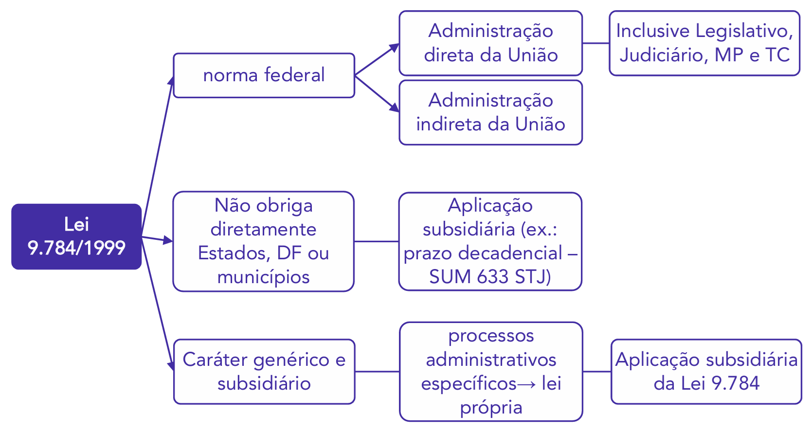

## **Princípios do Processo Administrativo**

Logo no início de seu texto, a Lei 9.784/1999, em seu art. 2º, estabelece um rol de princípios e critérios que devem ser obrigatoriamente observados pela Administração Pública Federal na condução dos processos administrativos.

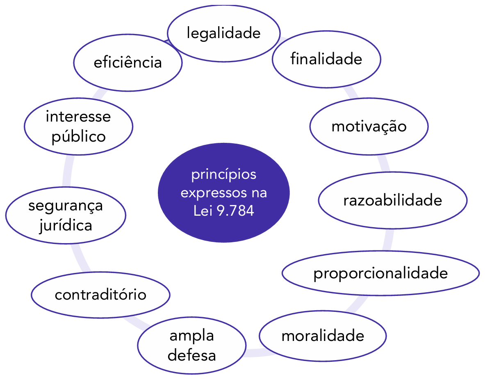

O rol acima contém os princípios **expressos** na Lei 9.784/1999. Examinando esta lista, percebe-se que alguns princípios repetem aqueles já enumerados no texto constitucional (art. 37, _caput_), como a **legalidade**, a **moralidade** e a **eficiência**. Outros consistem na positivação (transformação em lei) de princípios que a doutrina e a jurisprudência já consideravam implícitos na Constituição, como a **razoabilidade**, a **proporcionalidade**, o **contraditório** e a **ampla defesa**.

A doutrina infere, a partir do texto da lei e da própria Constituição, outros princípios que, embora não estejam no rol do art. 2º, são plenamente aplicáveis, sendo considerados **implícitos**.

### Comparativo: Lei 9.784/1999 vs. Constituição Federal

É instrutivo comparar os princípios expressos da Lei 9.784/1999 com os princípios expressos do "LIMPE" no art. 37 da Constituição Federal:

| **Princípios expressos na Lei 9.784**                                                                                                                                               | **Princípios expressos no art. 37 da Constituição Federal**             |
| ----------------------------------------------------------------------------------------------------------------------------------------------------------------------------------- | ----------------------------------------------------------------------- |
| Legalidade Finalidade Moralidade Eficiência Motivação Razoabilidade Proporcionalidade Ampla defesa Contraditório Segurança jurídica Interesse público | Legalidade Impessoalidade Moralidade Publicidade Eficiência |

Note que a Lei 9.784/1999, embora não repita expressamente a **Impessoalidade** e a **Publicidade** em seu art. 2º, as absorve em outros dispositivos (como a **Finalidade** e o **Interesse Público**, que são corolários da impessoalidade, e o art. 3º, que trata da publicidade). A seguir, detalharemos os princípios de maior destaque.

### Princípio da Publicidade

O princípio da publicidade rege a atividade administrativa de modo geral. Como boa parte dessa atividade é conduzida por meio de processos, este princípio de sede constitucional também é plenamente aplicável a eles, ainda que não conste no rol do art. 2º. A regra é a transparência.

Dessa forma, os interessados deverão ter acesso amplo aos processos administrativos. Este acesso só poderá ser restringido nas hipóteses previstas no próprio texto constitucional: (i) quando a **segurança da sociedade e do Estado** o exigir (CF, art. 5º, XXXIII) e (ii) quando a **defesa da intimidade ou o interesse social** o exigirem (CF, art. 5º, LX).

Uma regra que materializa o princípio da publicidade no âmbito dos processos administrativos é o direito do interessado, previsto no art. 3º da lei:

> **Lei 9.784/1999, art. 3º, II -** ter ciência da tramitação dos processos administrativos em que tenha a condição de interessado, ter vista dos autos, obter cópias de documentos neles contidos e conhecer as decisões proferidas;

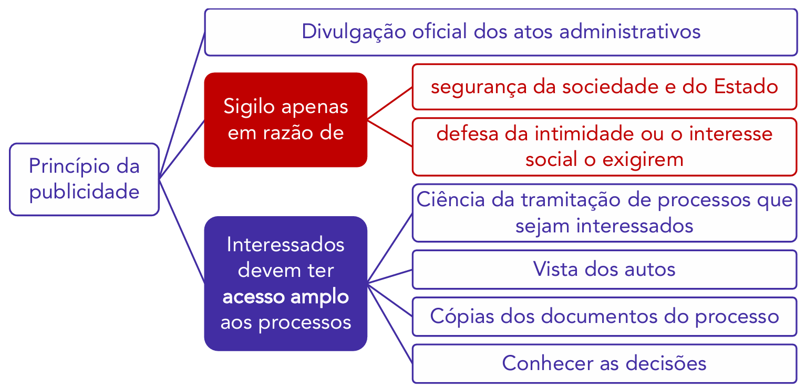

### Princípio da Verdade Material

No âmbito processual, existe uma distinção clássica entre a verdade "formal" e a "material".

- **Verdade Formal:** Vigora, como regra, nos processos judiciais cíveis. O juiz se limita a julgar com base nas provas que as partes trouxeram aos autos. Se uma parte não conseguir provar um fato, o juiz não pode, em geral, buscar essa prova por conta própria.
- **Verdade Material (ou Verdade Real):** É o princípio que rege o Processo Administrativo Federal (PAF). A Administração tem o poder-dever de ir além das provas existentes no processo, buscando ativamente a "verdade incontestável" dos fatos, para tomar a decisão mais correta e justa.

Uma importante consequência deste princípio está prevista no art. 27 da lei, ao se prever que "o desatendimento da intimação não importa o reconhecimento da verdade dos fatos".

- **Exemplo:** Se um cidadão é intimado a apresentar sua defesa em um processo e permanece em silêncio (não atende à intimação), a Administração **não pode** presumir que ele é culpado ou que os fatos alegados contra ele são verdadeiros. O silêncio do administrado não significa confissão. A Administração continua com o dever de investigar e provar a "verdade dos fatos" antes de tomar uma decisão.

### Princípio do Informalismo

O princípio do informalismo, também conhecido como **formalismo moderado**, é extraído dos seguintes critérios de atuação previstos na lei:

> Lei 9.784/1999, art. 2º
> 
> VIII – observância das formalidades essenciais à garantia dos direitos dos administrados;
> IX - adoção de formas simples, suficientes para propiciar adequado grau de certeza, segurança e respeito aos direitos dos administrados;

Muito embora os atos do processo administrativo sejam necessariamente escritos e documentados, o PAF não está sujeito a formas rígidas ou sacramentais, como ocorre no Judiciário. O princípio do informalismo preceitua que o processo deve ser pautado pela **simplicidade das formas**. O que importa é o conteúdo e a finalidade do ato, e não um rigor excessivo.

Como define Carvalho Filho:

> O princípio do informalismo significa que, no silêncio da lei ou de atos regulamentares, não há para o administrador a obrigação de adotar excessivo rigor na tramitação dos processos administrativos, tal como ocorre, por exemplo, nos processos judiciais.

Consequentemente, "os atos do processo administrativo não dependem de forma determinada senão quando a lei expressamente a exigir" (art. 22). Este princípio reduz a exigência de reconhecimentos de firma, de autenticação de documentos em cartório e de outras formalidades que poderiam dificultar o acesso do cidadão à Administração.

Como decorrência do informalismo, o administrado pode, como regra geral, atuar no processo administrativo sem a representação de um advogado. O Supremo Tribunal Federal (STF) consolidou esse entendimento:

> **Súmula Vinculante 5**
> 
> A falta de defesa técnica por advogado no processo administrativo disciplinar não ofende a Constituição.

Este entendimento, no entanto, é aplicável a processos de natureza cível ou administrativa. Se o procedimento disciplinar tiver sido instaurado para apurar cometimento de falta grave por réu condenado criminalmente (no âmbito da execução penal), tendo em vista estar em jogo a liberdade de ir e vir, aí torna-se obrigatória a presença de advogado (STF/RE 398.269).

### Princípio da Gratuidade

O princípio da gratuidade é derivado do seguinte critério de atuação administrativa:

> **Lei 9.784/1999, art. 2º, XI -** proibição de cobrança de despesas processuais, ressalvadas as previstas em lei;

Diferentemente de um processo judicial, em que o jurisdicionado deve pagar custas e emolumentos como regra geral, no PAF o administrado **não deve pagar despesas processuais**. Os processos administrativos são, por definição, gratuitos.

A ressalva "salvo as previstas em lei" refere-se, comumente, não a taxas para processar o pedido, mas aos custos de materiais que o cidadão solicita, como a cópia de documentos (conforme visto na Lei de Acesso à Informação).

### Princípio da Oficialidade

O princípio da oficialidade, também chamado de impulso de ofício, estabelece que a Administração Pública tem o dever de conduzir o processo, independentemente da provocação do interessado. Este princípio possui três principais repercussões:

1. **Instauração de Ofício:** Permite que a própria Administração, por iniciativa própria (de ofício), instaure um processo administrativo, sem necessidade de provocação externa.
2. **Impulso de Ofício:** Uma vez iniciado o processo (seja por requerimento do administrado ou de ofício), a Administração fica encarregada de impulsioná-lo e movimentá-lo por todas as suas etapas, até que se chegue à decisão final. O processo não pode ficar "parado" esperando que o cidadão peça o seu andamento.
3. **Revisão de Ofício:** Representa o poder-dever de **autotutela** da Administração. A autoridade competente pode (e deve) revisar suas próprias decisões, de ofício, para corrigir ilegalidades, mesmo que o interessado não tenha apresentado um recurso.

## Critérios de Atuação

Além dos princípios expressos (como legalidade, moralidade e eficiência) e implícitos (como publicidade, gratuidade e oficialidade), o parágrafo único do art. 2º da Lei 9.784/1999 estabelece um conjunto detalhado de **critérios** que devem ser observados nos processos administrativos.

Estes critérios são, na prática, a materialização dos princípios e funcionam como padrões de conduta obrigatórios para os agentes federais na condução dos processos, detalhando como os princípios devem ser aplicados.

Os diagramas a seguir resumem esses critérios, que estão listados nos incisos do parágrafo único do art. 2º:

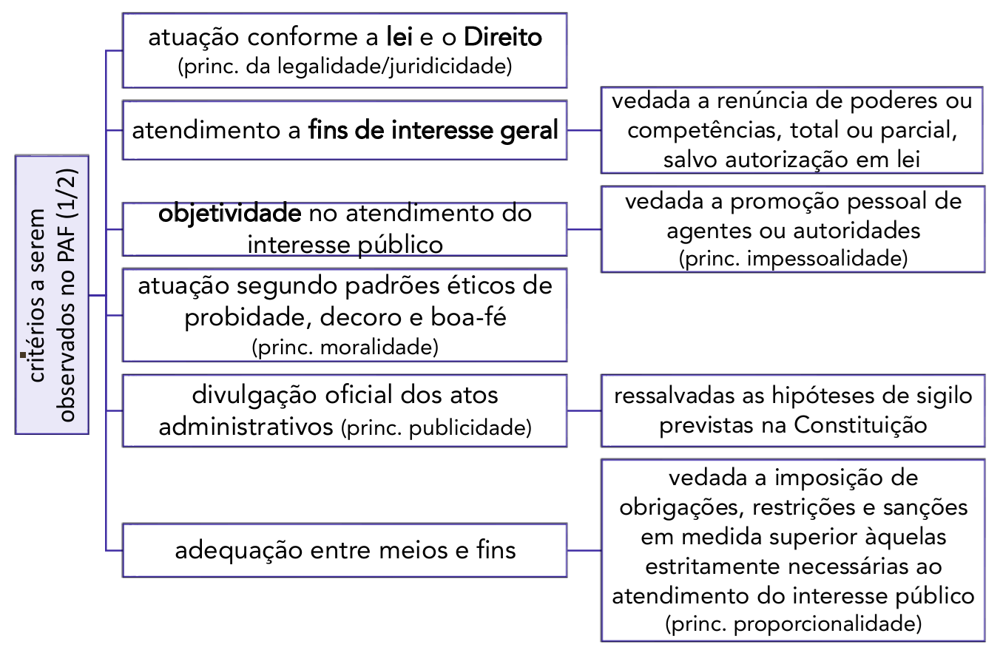

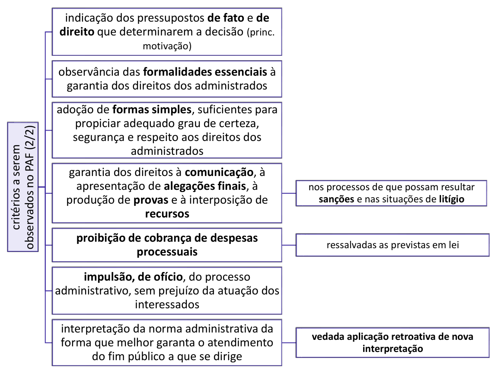

### Análise dos Principais Critérios

A seguir, detalhamos os critérios de maior relevância e suas implicações práticas:

#### Atuação conforme a Lei e o Direito (Juridicidade)

O inciso I estabelece o critério da "atuação conforme a lei e o Direito". Esta redação é importante por positivar o **Princípio da Juridicidade**, que é mais amplo que o da simples legalidade. A Administração não está submissa apenas à "lei" em seu sentido estrito, mas ao "Direito" como um todo, o que inclui os princípios constitucionais, a jurisprudência e os costumes administrativos.

#### Atendimento ao Interesse Geral (Indisponibilidade e Impessoalidade)

Dois critérios reforçam o pilar do interesse público:

- **Inciso II:** Atendimento a fins de interesse geral, vedada a renúncia total ou parcial de poderes ou competências, salvo autorização em lei. Este critério consagra o Princípio da Indisponibilidade do Interesse Público. A competência do agente público é um poder-dever. Ele não pode "abrir mão" de sua competência (renunciar) ou deixar de aplicar uma sanção por mera conveniência.
    - **Exemplo:** Um fiscal que constata uma infração não pode "renunciar" ao seu poder de multar por amizade com o infrator.
- **Inciso III:** Objetividade no atendimento do interesse público, vedada a promoção pessoal de agentes ou autoridades. Este é o Princípio da Impessoalidade (previsto no art. 37, §1º, da CF) trazido para dentro do processo. A Administração deve agir com objetividade, focando no fato e no interesse público, e o agente não pode usar o processo ou seus atos para se promover.

#### Adequação entre Meios e Fins (Proporcionalidade)

O inciso VI estabelece a "adequação entre meios e fins, vedada a imposição de obrigações, restrições e sanções em medida superior àquelas estritamente necessárias ao atendimento do interesse público".

Trata-se do **Princípio da Proporcionalidade**. A Administração deve escolher o meio menos gravoso para o cidadão, desde que seja suficiente para atingir o fim público.

- **Exemplo:** Ao aplicar uma sanção a um servidor por uma falta leve, a autoridade não pode aplicar a suspensão em seu grau máximo (90 dias) se uma suspensão de 5 dias já for suficiente para reprimir e prevenir a conduta. A sanção deve ser proporcional à gravidade da infração.

#### Motivação Obrigatória

O inciso VII exige a "indicação dos pressupostos de fato e de direito que determinarem a decisão". Este é o **Princípio da Motivação**, que será estudado em tópico próprio. A decisão administrativa não pode ser "nua"; ela deve vir acompanhada das razões de fato (o que aconteceu) e de direito (a lei que ampara a decisão) que a fundamentam.

#### Informalismo e Formas Simples

Os incisos VIII e IX reforçam o **Princípio do Informalismo Moderado** (já comentado):

- **Inciso VIII:** "observância das formalidades essenciais à garantia dos direitos dos administrados".
- **Inciso IX:** "adoção de formas simples, suficientes para propiciar adequado grau de certeza (...)".

Isso significa que o processo deve evitar burocracias desnecessárias (formas simples), mas não pode, em nome da simplicidade, abrir mão de ritos que são essenciais para a defesa do cidadão (formalidades essenciais), como o direito de ser notificado.

#### Garantia de Defesa (Contraditório e Ampla Defesa)

O inciso X é a base do devido processo legal administrativo: "garantia dos direitos à comunicação, à apresentação de alegações finais, à produção de provas e à interposição de recursos (...)".

É fundamental notar a ressalva final: "nos processos de que possam resultar **sanções** e nas situações de **litígio**". A lei torna expressa a obrigatoriedade do contraditório e da ampla defesa especialmente nos processos onde há um conflito de interesses (litígio) ou onde o administrado pode sofrer uma punição.

#### Gratuidade e Impulso de Ofício

Os incisos XI e XII formalizam os princípios da gratuidade e da oficialidade, já discutidos:

- **Inciso XI:** "proibição de cobrança de despesas processuais, ressalvadas as previstas em lei".
- **Inciso XII:** "impulsão, de ofício, do processo administrativo, sem prejuízo da atuação dos interessados".

#### Proteção da Confiança (Segurança Jurídica)

O inciso XIII é uma das mais importantes garantias de **Segurança Jurídica** e de **Proteção da Confiança Legítima** do cidadão: "interpretação da norma administrativa da forma que melhor garanta o atendimento do fim público a que se dirige, **vedada a aplicação retroativa de nova interpretação**."

Isto impede que a Administração mude seu entendimento consolidado sobre uma lei e aplique essa nova, e mais rigorosa, interpretação para prejudicar atos que já foram praticados no passado, ou para indeferir pedidos feitos com base na interpretação antiga.

- **Exemplo:** O INSS sempre interpretou a Lei "A" de forma a permitir a aposentadoria com 25 anos de contribuição. Um cidadão, vendo essa interpretação, faz seu pedido. No meio do processo, o INSS emite uma nova portaria, mudando o entendimento e passando a exigir 30 anos. Essa nova interpretação não pode retroagir para prejudicar o pedido do cidadão, que agiu de boa-fé com base na interpretação pública e notória anterior.

## Direitos dos Administrados

Um dos maiores avanços da Lei 9.784/1999 foi o de positivar, de forma expressa, um rol de direitos do cidadão perante a Administração Pública no contexto do processo administrativo. Isso representa uma mudança de paradigma, saindo de uma visão em que o administrado era um mero "objeto" do processo para uma em que ele é um "sujeito de direitos".

O art. 3º da lei traz uma lista que o próprio _caput_ define como exemplificativa ("sem prejuízo de outros que lhe sejam assegurados"), indicando que se trata de um rol mínimo de garantias.

### Direitos Expressos no Art. 3º

> Lei 9.784/1999, art. 3º O administrado tem os seguintes direitos perante a Administração, sem prejuízo de outros que lhe sejam assegurados:
> 
> I - ser tratado com respeito pelas autoridades e servidores, que deverão facilitar o exercício de seus direitos e o cumprimento de suas obrigações;
> 
> II - ter ciência da tramitação dos processos administrativos em que tenha a condição de interessado, ter vista dos autos, obter cópias de documentos neles contidos e conhecer as decisões proferidas;
> 
> III - formular alegações e apresentar documentos antes da decisão, os quais serão objeto de consideração pelo órgão competente;
> 
> IV - fazer-se assistir, facultativamente, por advogado, salvo quando obrigatória a representação, por força de lei.

Analisando estes incisos, destacam-se:

- **Inciso I (Dever de Urbanidade e Facilitação):** O direito a ser tratado com respeito não é apenas uma norma de cortesia. Ele se desdobra no dever da autoridade de **facilitar o exercício do direito**. Isso significa que o agente público deve atuar de forma colaborativa, e não obstrutiva, prestando orientações, evitando exigências desnecessárias ou o uso de linguagem excessivamente técnica que dificulte a compreensão do cidadão.
- **Inciso II (Publicidade e Acesso):** É a materialização do **Princípio da Publicidade** (visto anteriormente) e do **Acesso à Informação**. Garante ao interessado o direito de acompanhar ativamente o processo, saber onde ele está, consultar os autos (ter vista) e obter cópias para subsidiar sua defesa ou seu pleito.
- **Inciso III (Contraditório e Ampla Defesa):** Este é o núcleo do devido processo legal. O direito de "formular alegações e apresentar documentos **antes da decisão**" é a essência da defesa prévia. A norma ainda complementa que tais alegações "serão objeto de consideração", significando que o gestor não pode simplesmente ignorar os argumentos; ele deve analisá-los e, preferencialmente, rebatê-los na motivação da decisão.
- **Inciso IV (Assistência Jurídica Facultativa):** Reforça o **Princípio do Informalismo**. A regra geral é que o cidadão pode postular e se defender pessoalmente no processo administrativo, sem a necessidade de contratar um advogado. A obrigatoriedade da representação por advogado é uma exceção que deve estar expressamente prevista em lei.

### Direito de Prioridade na Tramitação (Art. 69-A)

Além dos direitos relativos ao conteúdo e à forma do processo, a legislação assegura um direito relativo à celeridade para grupos específicos considerados vulneráveis. O art. 69-A da lei estabelece prioridade na tramitação dos processos administrativos em que figurem como interessados:

> a) Idosos: Pessoas com idade igual ou superior a 60 (sessenta) anos, direito este que também é assegurado pelo Estatuto do Idoso (Lei nº 10.741/2003);
> b) Pessoa portadora de deficiência (física ou mental);
> c) Pessoa portadora de doenças graves, como tuberculose ativa, esclerose múltipla, neoplasia maligna (câncer), hanseníase, paralisia irreversível e incapacitante, cardiopatia grave, doença de Parkinson, espondiloartrose anquilosante, nefropatia grave, hepatopatia grave, estados avançados da doença de Paget (osteíte deformante), contaminação por radiação, síndrome de imunodeficiência adquirida (AIDS), ou outra doença grave, com base em conclusão da medicina especializada, mesmo que a doença tenha sido contraída após o início do processo.

Para que este direito seja exercido, o interessado deve solicitá-lo formalmente à autoridade competente, juntando a prova de sua condição (documento de identidade para comprovar a idade ou laudo médico para comprovar a deficiência ou a doença grave).

### Direito à Razoável Duração do Processo (Garantia Constitucional)

Além dos direitos previstos na Lei 9.784/1999, a Emenda Constitucional nº 45/2004 incluiu no rol de direitos fundamentais o **direito à razoável duração do processo**.

> **Constituição Federal, art. 5º, LXXVIII:** a todos, no âmbito judicial e **administrativo**, são assegurados a razoável duração do processo e os meios que garantam a celeridade de sua tramitação.

Este dispositivo constitucional confere ao administrado o direito de não ter seu processo "parado" indefinidamente na Administração. É com base nesta garantia que a Lei 9.784/1999 estabelece prazos para a Administração decidir (como o prazo geral de 30 dias do art. 49) e mecanismos para que o cidadão possa recorrer caso a decisão não seja proferida.

## Deveres do Administrado

Por uma questão de simetria e equilíbrio processual, assim como a Lei 9.784/1999 elenca os direitos do administrado, ela também estabelece seus deveres. Esta lista, igualmente em caráter exemplificativo (conforme o _caput_ do art. 4º), define as obrigações do cidadão que figura como parte em um processo administrativo, pautando-se nos princípios da boa-fé e da mútua colaboração.

> Art. 4º São deveres do administrado perante a Administração, sem prejuízo de outros previstos em ato normativo:
> 
> I - expor os fatos conforme a verdade;
> II - proceder com lealdade, urbanidade e boa-fé;
> III - não agir de modo temerário;
> IV - prestar as informações que lhe forem solicitadas e colaborar para o esclarecimento dos fatos.

Cada um desses deveres estabelece um padrão de conduta essencial para o bom andamento do processo:

- **Inciso I (Dever de Veracidade):** O dever de "expor os fatos conforme a verdade" é um pilar da relação com a Administração. Ele se conecta diretamente ao Princípio da Verdade Material. Diferente de outras esferas processuais (como a penal, onde o réu pode se manter em silêncio), espera-se que o administrado, no PAF, atue de forma transparente, não omitindo fatos ou distorcendo a realidade, para que a autoridade possa tomar a decisão mais correta.
- **Inciso II (Lealdade, Urbanidade e Boa-fé):** Este inciso estabelece a base comportamental do administrado.
    - **Lealdade e Boa-fé** exigem que o cidadão não utilize o processo para fins escusos ou protelatórios, agindo com honestidade de propósito.
    - **Urbanidade** é a contrapartida do direito do administrado de "ser tratado com respeito" (previsto no art. 3º). A relação processual exige civilidade de ambas as partes, vedando o uso de linguagem desrespeitosa ou ofensiva contra os agentes públicos ou outros interessados.
- **Inciso III (Proibição do Ato Temerário):** O dever de "não agir de modo temerário" proíbe a chamada "litigância de má-fé" na esfera administrativa. Segundo a definição clássica de Chiovenda, agir de modo temerário consiste em agir afoitamente, tendo consciência do injusto.
    - **Exemplos:** Incluem a formulação de pedidos sabidamente infundados ou ilegais, a interposição de recursos com intuito meramente protelatório (para "ganhar tempo") ou a alteração deliberada da verdade dos fatos para induzir a Administração a erro.
- **Inciso IV (Dever de Colaboração):** Este dever complementa o Princípio da Oficialidade (impulso de ofício) e da Verdade Material. Embora a Administração tenha o dever de impulsionar e investigar o processo, o administrado tem o dever de "colaborar para o esclarecimento dos fatos", fornecendo documentos e informações que estejam em seu poder e sejam solicitados pela autoridade para a correta instrução processual.

### Quadro Comparativo: Direitos vs. Deveres

Traçando um paralelo entre as listas de direitos e deveres, chegamos à seguinte tabela-comparativa:

| **Direitos dos administrados**                                                                                                                                                       | **Deveres dos administrados**                                                         |
| ------------------------------------------------------------------------------------------------------------------------------------------------------------------------------------ | ------------------------------------------------------------------------------------- |
| ser tratado com respeito (agentes públicos devem facilitar o exercício de direitos e cumprimento de obrigações).                                                                     | expor os fatos conforme a verdade.                                                    |
| ter ciência da tramitação dos processos administrativos em que é interessado;  ter vista dos autos;  obter cópias de documentos;  conhecer as decisões proferidas. | proceder com lealdade, urbanidade e boa-fé.                                           |
| formular alegações;  apresentar documentos antes da decisão (que devem ser objeto de consideração).                                                                            | não agir de modo temerário.                                                           |
| fazer-se assistir, facultativamente, por advogado (salvo quando obrigatória por lei a representação).                                                                                | prestar as informações solicitadas;  colaborar para o esclarecimento dos fatos. |

## Processo Administrativo

### Distinção entre Processo e Procedimento

Antes de analisar as fases do processo, é crucial estabelecer a diferença técnica entre os conceitos de "processo" e "procedimento", que, embora usados como sinônimos no dia a dia, possuem significados distintos no Direito Administrativo.

**Processo**, segundo José dos Santos Carvalho Filho, é “o instrumento que formaliza a sequência ordenada de atos e de atividades do Estado e dos particulares a fim de ser produzida uma vontade final da Administração”. A noção de processo implica um objetivo, um fim a ser alcançado; é uma noção teleológica.

**Procedimento**, por outro lado, é o instrumento _do_ processo. É o modo de proceder, o rito.

Maria Sylvia Zanella Di Pietro traça um paralelo esclarecedor:

> Não se confunde processo com procedimento. O primeiro [processo] existe sempre como instrumento indispensável para o exercício de função administrativa; tudo o que a Administração Pública faz, operações materiais ou atos jurídicos, fica documentado em um processo; cada vez que ela for tomar uma decisão, executar uma obra, celebrar um contrato, editar um regulamento, o ato final é sempre precedido de uma série de atos materiais ou jurídicos, consistentes em estudos, pareceres, informações, laudos, audiências, enfim, tudo o que for necessário para instruir, preparar e fundamentar o ato final objetivado pela Administração.
> 
> O procedimento é o conjunto de formalidades que devem ser observadas para a prática de certos atos administrativos; equivale a rito, a forma de proceder; o procedimento se desenvolve dentro de um processo administrativo.

Em síntese, o **processo** é o conjunto de documentos e atos que formalizam a busca por uma decisão final (ex: o "processo de aposentadoria", o "processo de licitação"). O **procedimento** é o rito, a sequência de etapas legais que devem ser seguidas _dentro_ desse processo (ex: o prazo para defesa, a regra de publicação do edital).

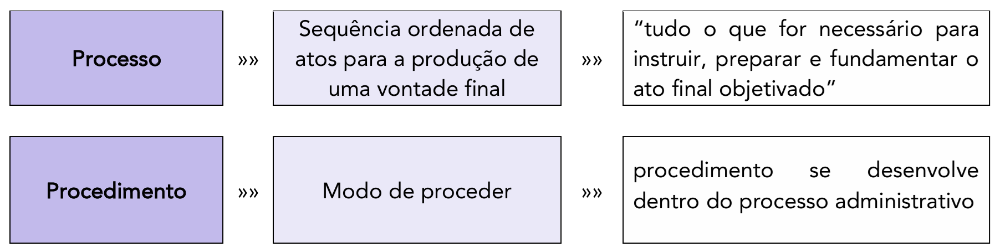

### Fases e Início do Processo Administrativo

Estudada a diferença conceitual, retornamos ao regramento que a Lei 9.784/1999 deu ao processo administrativo em âmbito federal. A doutrina clássica divide o processo administrativo em três fases centrais:

#### Fase de Instauração (Início do Processo)

O processo administrativo, conforme o art. 5º da Lei 9.784/1999, pode ser iniciado de duas maneiras: **de ofício** ou **a pedido de interessado**.

- **Início de Ofício:** Ocorre quando a própria Administração Pública dá início ao processo, por iniciativa própria, em cumprimento de seus deveres. Isso é uma manifestação clara do **Princípio da Oficialidade**.
    - **Exemplo:** A abertura de um Processo Administrativo Disciplinar (PAD) após uma auditoria interna constatar indícios de irregularidade, ou a instauração de um processo de interdição de um estabelecimento comercial após uma fiscalização sanitária.
- **Início a Pedido:** Ocorre quando um administrado (cidadão ou empresa) provoca a Administração, exercendo um direito de petição.
    - **Exemplo:** Um cidadão que protocola um pedido de licença para construir, um servidor que solicita sua aposentadoria, ou uma empresa que pede uma autorização de funcionamento.

#### Requerimento do Interessado (Início a Pedido)

Quando o processo é iniciado a pedido do interessado, o art. 6º da Lei 9.784/1999 estabelece os requisitos mínimos para o requerimento inicial. Salvo os casos em que a lei admite uma solicitação oral (como um pedido simples de informação), o requerimento deve ser formulado por escrito e conter os seguintes dados:

> Art. 6º O requerimento inicial do interessado, salvo casos em que for admitida solicitação oral, deve ser formulado por escrito e conter os seguintes dados:
> 
> I - órgão ou autoridade administrativa a que se dirige;
> II - identificação do interessado ou de quem o represente;
> III - domicílio do requerente ou local para recebimento de comunicações;
> IV - formulação do pedido, com exposição dos fatos e de seus fundamentos;
> V - data e assinatura do requerente ou de seu representante.
> 
> Parágrafo único. É vedada à Administração a recusa imotivada de recebimento de documentos, devendo o servidor orientar o interessado quanto ao suprimento de eventuais falhas.

Apesar de listar esses requisitos, a lei, pautada pelo **Princípio do Informalismo Moderado**, veda a recusa imotivada de recebimento de documentos. Caso o requerimento não contenha todos os elementos listados, o servidor público tem o dever de orientar o interessado a supri-la (art. 3º, I), em vez de simplesmente indeferir o protocolo.

Visando à eficiência e à racionalidade administrativa, a lei ainda traz duas regras para requerimentos de interessados:

1. **Requerimentos Conjuntos (Art. 8º):** Se múltiplos interessados tiverem requerimentos com conteúdo e fundamento idênticos (ex: moradores de uma mesma rua pedindo a instalação de um semáforo), eles podem, salvo vedação legal, formular um único requerimento conjunto.
2. **Padronização (Art. 7º):** Se houver múltiplos interessados com requerimentos diversos, mas para pretensões equivalentes (ex: milhares de pedidos de aposentadoria), os órgãos públicos devem criar modelos ou formulários padronizados para facilitar o processamento.

### Interessados

Diferentemente do processo judicial (que possui "partes", como autor e réu, em uma relação triangular com o juiz), o processo administrativo possui "interessados". Este termo é mais amplo e reflete a natureza inquisitorial e vertical do processo administrativo, onde a Administração é, ao mesmo tempo, parte e julgadora, e a relação com o administrado nem sempre envolve um litígio.

Nesse sentido, o art. 9º da Lei 9.784/1999 estabelece quem pode ser considerado "interessado" nos processos administrativos em âmbito federal. Em outras palavras, o art. 9º define os legitimados a intervir e participar do processo:

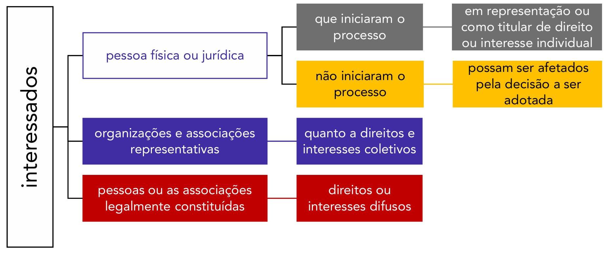

Analisando o diagrama, que detalha os legitimados, podemos dividi-los em três grandes grupos:

1. **Pessoas Físicas ou Jurídicas (Defesa de Interesses Individuais):**
    - **Os que iniciaram o processo:** É o interessado-requerente, que provocou a Administração para obter um direito ou interesse individual (ex: o servidor que protocola seu pedido de aposentadoria).
    - **Os que não iniciaram, mas podem ser afetados:** São os chamados "terceiros interessados", que não deram causa ao processo, mas cuja esfera jurídica pode ser diretamente atingida pela decisão a ser proferida (ex: em um concurso público, o candidato em 2º lugar tem legitimidade para intervir no processo de recurso do 1º colocado, pois a decisão pode afetar sua nomeação).
2. **Organizações e Associações Representativas (Defesa de Interesses Coletivos):** Este inciso confere legitimidade a entidades, como sindicatos ou associações de classe, para atuarem na defesa de **interesses coletivos**, que são aqueles pertencentes a um grupo, categoria ou classe de pessoas ligadas por uma relação jurídica comum (ex: um sindicato que atua em processo que revisa o cálculo de uma gratificação devida a todos os seus filiados).
3. **Pessoas ou Associações Legalmente Constituídas (Defesa de Interesses Difusos):** Aqui, a lei legitima a atuação de associações civis (como ONGs) ou até mesmo de pessoas físicas na defesa de **interesses difusos**, que são aqueles de natureza indivisível e que pertencem a um número indeterminado de pessoas, unidas por uma circunstância de fato (ex: uma associação de proteção ao meio ambiente que intervém em um processo de licenciamento de uma obra de grande impacto).

#### Capacidade Processual

Além de definir _quem_ pode ser interessado, a Lei 9.784/1999 estabelece, em seu art. 10, a regra de **capacidade** para a prática dos atos processuais (como fazer requerimentos, interpor recursos, etc.).

A capacidade, em linhas gerais, é a aptidão para a prática de atos. O art. 10 prevê que, para fins do processo administrativo federal, têm aptidão para praticar atos os **maiores de 18 (dezoito) anos**, ressalvada previsão especial em ato normativo próprio.

### Competência

A competência, de modo geral, consiste na atribuição que a lei confere a determinado agente ou órgão/entidade público para a prática de determinado ato administrativo. É o conjunto de poderes e deveres que definem a esfera de atuação do agente.

A Lei 9.784/1999 estabelece o **Princípio da Irrenunciabilidade da Competência**: o agente público não pode simplesmente "abrir mão" de suas atribuições. A competência é um poder-dever. Contudo, a própria lei autoriza que o _exercício_ (mas não a titularidade) da competência seja transferido, por meio dos institutos da delegação e da avocação.

> **Lei 9.784/1999, art. 11.** A competência é irrenunciável e se exerce pelos órgãos administrativos a que foi atribuída como própria, salvo os casos de delegação e avocação legalmente admitidos.

#### Delegação de Competência

A delegação consiste na transferência do exercício da competência a outro órgão ou agente. A Lei 9.784/1999 define este instituto:

> Lei 9.784/1999, art. 12. Um órgão administrativo e seu titular poderão, se não houver impedimento legal, delegar parte da sua competência a outros órgãos ou titulares, ainda que estes não lhe sejam hierarquicamente subordinados, quando for conveniente, em razão de circunstâncias de índole técnica, social, econômica, jurídica ou territorial.
> 
> Parágrafo único. O disposto no caput deste artigo aplica-se à delegação de competência dos órgãos colegiados aos respectivos presidentes.
> 
> (...)
> 
> Lei 9.784/1999, art. 14, § 1º O ato de delegação especificará as matérias e poderes transferidos, os limites da atuação do delegado, a duração e os objetivos da delegação e o recurso cabível, podendo conter ressalva de exercício da atribuição delegada.
> 
> § 2º O ato de delegação é revogável a qualquer tempo pela autoridade delegante.
> § 3º As decisões adotadas por delegação devem mencionar explicitamente esta qualidade e considerar-se-ão editadas pelo delegado.

A partir da análise destes dispositivos, a doutrina depreende as seguintes características da delegação:

- **Regra Geral:** A possibilidade de delegação é a regra, vista como uma medida comum de gestão e descentralização. Ela só não é admitida quando houver impedimento legal. (Apesar disso, há entendimentos doutrinários divergentes, a exemplo de José dos Santos Carvalho Filho, segundo o qual “tanto a delegação como a avocação devem ser consideradas como figuras excepcionais, só justificáveis ante os pressupostos que a lei estabelecer”.)
- **Hierarquia:** A delegação pode ser realizada a órgãos ou agentes **subordinados** hierarquicamente (delegação vertical), mas também àqueles **não subordinados** (delegação horizontal), quando for conveniente por razões técnicas, territoriais, etc.
- **Objeto Parcial:** A delegação deve ser sempre de **parte** das competências, e não da sua totalidade.
- **Prazo:** O ato de delegação deve especificar sua **duração**, tendo, portanto, caráter temporário.
- **Ato Discricionário e Revogável:** A delegação é um ato discricionário, baseado na conveniência e oportunidade, e, por isso, é **revogável a qualquer tempo** pela autoridade delegante (o delegante), sem necessidade de justificativa.
- **Forma do Ato Delegado:** As decisões tomadas pelo agente delegado devem **mencionar expressamente** esta qualidade (ex: "Por delegação de competência...").
- **Responsabilidade:** As decisões "considerar-se-ão editadas pelo delegado". Como regra, é o agente delegado quem responde pelo ato praticado.

##### Atos Indelegáveis (Art. 13)

Vimos que a regra é a possibilidade de delegação. No entanto, o artigo 13 da Lei 9.784/1999 estabelece um rol taxativo de matérias que, dada a sua relevância, **não podem** ser objeto de delegação:

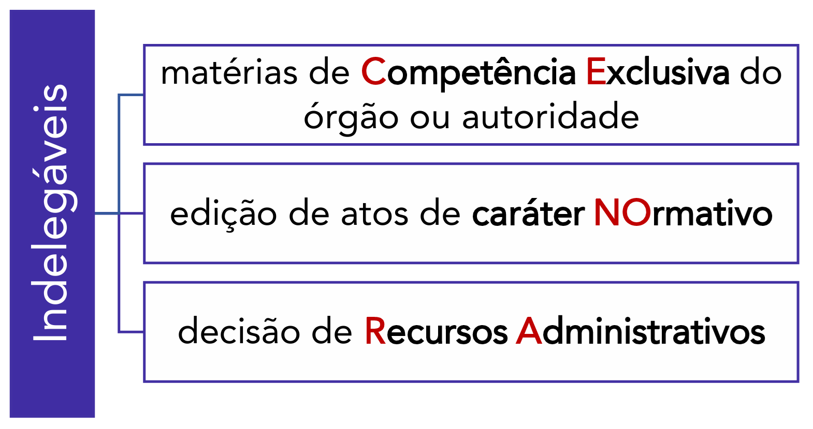

São indelegáveis, portanto:

1. **Matérias de Competência Exclusiva:** Quando a lei diz que a competência é "exclusiva" de um órgão ou autoridade, ela veda a delegação.
2. **Edição de Atos de Caráter Normativo:** A criação de regras gerais e abstratas (portarias, resoluções, instruções normativas) não pode ser delegada.
3. **Decisão de Recursos Administrativos:** A competência para julgar um recurso, por ser uma instância de reexame, é indelegável.

##### Publicação e Síntese da Delegação

Para garantir a transparência, a eficácia e o controle, o ato de delegação e sua revogação devem ser publicados:

> **Lei 9.784/1999, art. 14.** O ato de delegação e sua revogação deverão ser publicados no meio oficial.

O mapa mental a seguir resume as principais características da delegação:

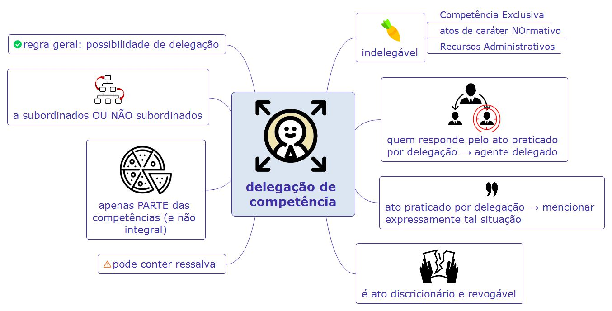

#### Avocação de Competência

A avocação é o movimento oposto à delegação. Nela, uma autoridade hierarquicamente superior chama para si o exercício de determinada competência, que originalmente pertencia a um subordinado:

> **Lei 9.784/1999, art. 15.** Será permitida, em caráter excepcional e por motivos relevantes devidamente justificados, a avocação temporária de competência atribuída a órgão hierarquicamente inferior.

Da leitura do artigo, percebem-se as diferenças claras em relação à delegação:

- A avocação é uma medida **excepcional** e exige **motivação** (justificativa de motivos relevantes).
- Ela só é admitida em relações de **hierarquia** (de cima para baixo).
- É sempre **temporária**.
- Embora a lei não liste as hipóteses de avocação, ela é vedada quando se tratar de **competência exclusiva** do órgão hierarquicamente inferior.

#### Delegação versus Avocação

O quadro a seguir resume as diferenças fundamentais entre os dois institutos:

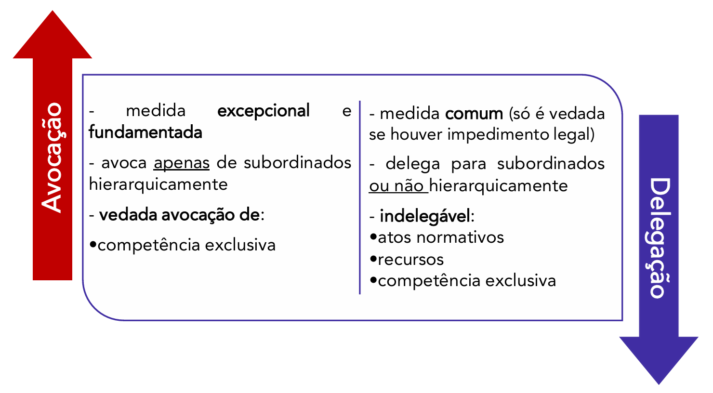

#### Disposições Finais sobre Competência

Antes de encerrar este tópico, duas últimas observações da lei:

1. **Transparência da Competência:** Para fins de transparência, os órgãos e entidades divulgarão publicamente os locais de suas sedes e, quando conveniente, qual a unidade competente em matéria de interesse especial (Art. 16).
2. **Competência Residual:** Se não houver a definição de uma competência legal específica para um determinado processo, ele deverá ser iniciado perante a autoridade de **menor grau hierárquico** para decidir (art. 17). Esta é uma regra de racionalidade que evita sobrecarregar a alta administração com a triagem inicial dos processos.

### Impedimento e Suspeição

Os institutos do impedimento e da suspeição são as ferramentas legais que materializam, no processo administrativo federal, o **Princípio da Impessoalidade**. Eles existem para garantir a imparcialidade do agente público responsável por analisar ou julgar um processo.

O objetivo de ambos os institutos é assegurar uma atuação objetiva, impedindo que a decisão do agente seja influenciada, positiva ou negativamente, por vínculos pessoais, familiares, profissionais ou de litígio que ele possua com o administrado ou com a própria matéria do processo.

Verificando-se uma situação de impedimento ou suspeição, o agente público fica afastado de atuar _naquele processo específico_, devendo os autos ser encaminhados a um substituto legal ou a outra autoridade designada.

#### Diferenças Gerais entre Impedimento e Suspeição

É crucial distinguir os dois institutos, pois eles possuem naturezas e consequências jurídicas distintas:

- **Impedimento:** Refere-se a vínculos **objetivos**, que podem ser aferidos factualmente e estão enumerados no art. 18 da lei. Como se trata de uma proibição absoluta de atuação, o agente público tem o **dever obrigatório** de se declarar impedido. A presunção de parcialidade aqui é **absoluta** (_juris et de jure_), ou seja, não admite prova em contrário. Se, posteriormente, constatar-se que um ato foi praticado por servidor impedido, esse ato será considerado **nulo**.
- **Suspeição:** Refere-se a situações de natureza **subjetiva**, ligadas ao foro íntimo do agente (amizade ou inimizade). O agente _poderá_ (mas não é estritamente obrigado a) se declarar suspeito. A presunção de parcialidade é **relativa** (_juris tantum_). Caso a suspeição não seja alegada no momento adequado, considera-se que o eventual defeito é sanado (preclusão).

#### Casos de Impedimento (Art. 18)

O impedimento é a hipótese mais grave de parcialidade. O servidor ou autoridade **está proibido** de atuar no processo.

> Lei 9.784/1999, art. 18. É impedido de atuar em processo administrativo o servidor ou autoridade que:
> 
> I - tenha interesse direto ou indireto na matéria;
> II - tenha participado ou venha a participar como perito, testemunha ou representante, ou se tais situações ocorrem quanto ao cônjuge, companheiro ou parente e afins até o terceiro grau;
> III - esteja litigando judicial ou administrativamente com o interessado ou respectivo cônjuge ou companheiro.

Analisando os incisos:

- **Inciso I (Interesse):** É a hipótese mais clara. O agente não pode julgar um processo em que ele mesmo é o beneficiário (interesse direto) ou em que a decisão beneficia uma empresa da qual é sócio (interesse indireto).
- **Inciso II (Atuação Prévia):** O agente não pode ser julgador e, ao mesmo tempo, parte técnica ou testemunha no mesmo processo. Isso evita que ele "julgue" seu próprio parecer ou depoimento. A regra se estende a seus parentes (ex: o servidor não pode julgar um processo em que seu irmão atuou como perito).
- **Inciso III (Litígio):** Se o agente público está processando o interessado (ou vice-versa) em outra esfera, judicial ou administrativa, a lei presume que há um conflito objetivo que o impede de julgar com imparcialidade.

Caso o servidor identifique que se enquadra em uma dessas situações, ele tem o **dever legal** de comunicar o fato à autoridade competente e se abster de atuar (art. 19, _caput_).

Dado o caráter obrigatório do impedimento, a omissão do servidor em comunicar esta situação constitui **falta grave**, para efeitos disciplinares (art. 19, parágrafo único).

Em síntese:

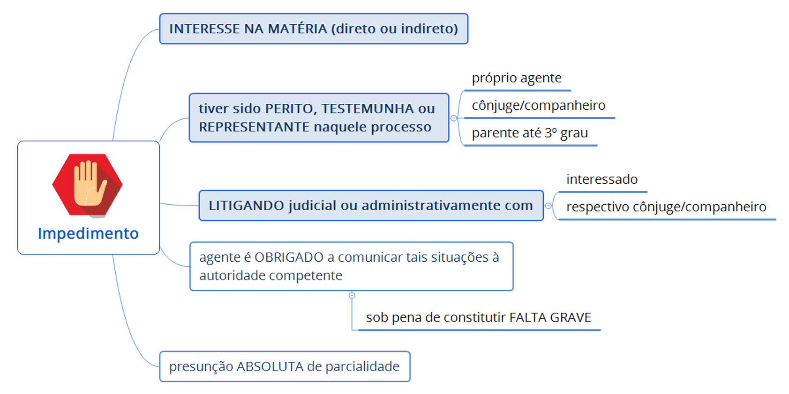

#### Casos de Suspeição (Art. 20)

A suspeição, por sua vez, está no campo da subjetividade, das relações pessoais do agente.

> **Art. 20.** Pode ser argüida a suspeição de autoridade ou servidor que tenha amizade íntima ou inimizade notória com algum dos interessados ou com os respectivos cônjuges, companheiros, parentes e afins até o terceiro grau.

Note a diferença no verbo: o impedimento "É", a suspeição "Pode ser argüida".

Tratando-se de suspeição, a legislação não estabelece a obrigatoriedade de o agente público comunicar a autoridade competente, como faz com o impedimento. O agente pode, por uma questão de foro íntimo, declarar-se suspeito para preservar a lisura do processo.

O interessado no processo também pode "arguir" (alegar) a suspeição da autoridade. Caso a autoridade não acate a alegação de suspeição (ou seja, indefira o pedido de afastamento), o interessado poderá **recorrer** desta decisão interlocutória. Contudo, este recurso **não terá efeito suspensivo** (art. 21), o que significa que o processo principal continuará tramitando enquanto o recurso sobre a suspeição é analisado pela instância superior.

Em síntese:

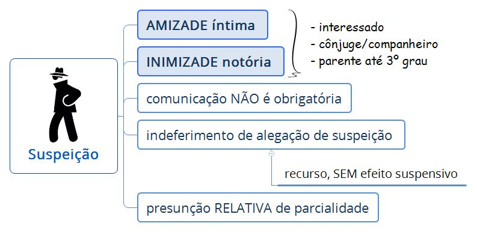

#### Quadro Comparativo: Impedimento vs. Suspeição

Para finalizar este tópico, o quadro a seguir reforça as diferenças entre as causas de impedimento e suspeição:

| **Impedimento**                                                                                                                                                                                                                                                                                                                           | **Suspeição**                                                                                                        |
| ----------------------------------------------------------------------------------------------------------------------------------------------------------------------------------------------------------------------------------------------------------------------------------------------------------------------------------------- | -------------------------------------------------------------------------------------------------------------------- |
| 1) interesse na matéria (direto ou indireto)  2) tiver sido perito, testemunha ou representante naquele processo:  - o próprio agente público ou - seu cônjuge, companheiro ou parente até 3º grau  3) litigando judicial ou administrativamente com:  - interessado ou - respectivo cônjuge ou companheiro | 1) amizade íntima ou inimizade notória com:  - interessado - cônjuge / companheiro - parente até 3º grau |

### Forma, Tempo e Lugar dos Atos do Processo

Os artigos 22 a 25 da Lei 9.784/1999 estabelecem as "regras do jogo" para a prática dos atos processuais. Elas são fundamentais para garantir a organização, a segurança jurídica e a padronização, ao mesmo tempo em que buscam equilibrar a formalidade necessária com a eficiência administrativa.

#### Forma dos Atos Processuais (Art. 22)

O processo administrativo é, por regra, documental. Os §§ 1º e 4º do art. 22 estabelecem as seguintes exigências formais mínimas:

> a) Os atos devem ser produzidos por escrito;
> b) Devem utilizar o vernáculo, ou seja, a língua portuguesa;
> c) Devem conter a data e o local de sua realização;
> d) Devem conter a assinatura da autoridade responsável, que identifica o autor do ato e atesta sua validade;
> e) As páginas do processo devem ser numeradas sequencialmente e rubricadas, para garantir a integridade dos autos e impedir a supressão ou adição indevida de documentos.

Em linha com o **Princípio do Informalismo Moderado**, a lei busca facilitar o acesso do administrado, restringindo exigências burocráticas que eram comuns, como o reconhecimento de firma e a autenticação de cópias (art. 22, §§2º e 3º):

> a) Reconhecimento de firma: A exigência de que o cidadão vá ao cartório atestar sua assinatura não é a regra. Ela só pode ser exigida em duas hipóteses: se houver uma imposição legal específica ou se a autoridade tiver dúvidas fundadas quanto à autenticidade da assinatura;
> b) Autenticação de documentos: A "cópia autenticada" pode ser feita pelo próprio servidor do órgão administrativo, mediante a simples conferência entre o documento original apresentado pelo cidadão e a cópia. Não é necessário, como regra, que o cidadão traga cópias já autenticadas por um cartório.

##### Reforço da Desburocratização (Lei nº 13.726/2018)

A Lei 13.726/2018 (que instituiu o selo de desburocratização) reforçou e ampliou essa diretriz, aplicando-a não só à União, mas a todos os entes federativos:

> Lei 13.726/2018, art. 3º Na relação dos órgãos e entidades dos Poderes da União, dos Estados, do Distrito Federal e dos Municípios com o cidadão, é dispensada a exigência de:
> 
> I - reconhecimento de firma, devendo o agente administrativo, confrontando a assinatura com aquela constante do documento de identidade do signatário, ou estando este presente e assinando o documento diante do agente, lavrar sua autenticidade no próprio documento;
> II - autenticação de cópia de documento, cabendo ao agente administrativo, mediante a comparação entre o original e a cópia, atestar a autenticidade;

#### Tempo dos Atos Processuais (Art. 23)

Comentando as regras aplicáveis ao tempo dos atos contidos no PAF, o art. 23 prevê, como regra geral, que os atos sejam praticados em **dias úteis** (excluindo-se fins de semana e feriados) e no **horário normal de funcionamento** da repartição na qual tramitar o processo.

Em caráter excepcional, no entanto, o legislador admite que sejam concluídos **depois do horário normal** os atos já iniciados, cujo adiamento prejudique o curso regular do procedimento ou cause dano ao interessado ou à Administração (ex: uma audiência ou oitiva de testemunha que se estende além do horário de expediente).

#### Local dos Atos Processuais (Art. 25)

Já em relação ao local dos atos, o art. 25 prevê que sejam **preferencialmente realizados na sede do órgão** onde o processo tramita. Caso, no entanto, sejam praticados em local diverso (ex: uma perícia que deve ser feita na propriedade do interessado), o interessado deverá ser **cientificado** com antecedência.

#### Prazo Geral dos Atos Processuais (Art. 24)

Por fim, no que se refere ao prazo, a lei estabelece uma regra geral supletiva. Se a lei ou um regulamento não definirem um prazo específico para a prática de um ato (seja pela Administração ou pelo administrado), aplica-se o prazo geral de **5 (cinco) dias**, salvo motivo de força maior.

Além disso, tal prazo poderá ser prorrogado por mais 5 dias (isto é, prorrogado até o dobro), mediante justificativa comprovada:

> Lei 9.784/1999, art. 24. Inexistindo disposição específica, os atos do órgão ou autoridade responsável pelo processo e dos administrados que dele participem devem ser praticados no prazo de cinco dias, salvo motivo de força maior.
> 
> Parágrafo único. O prazo previsto neste artigo pode ser dilatado até o dobro, mediante comprovada justificação.

Esquematizando as principais regras quanto à forma, tempo e lugar dos atos:

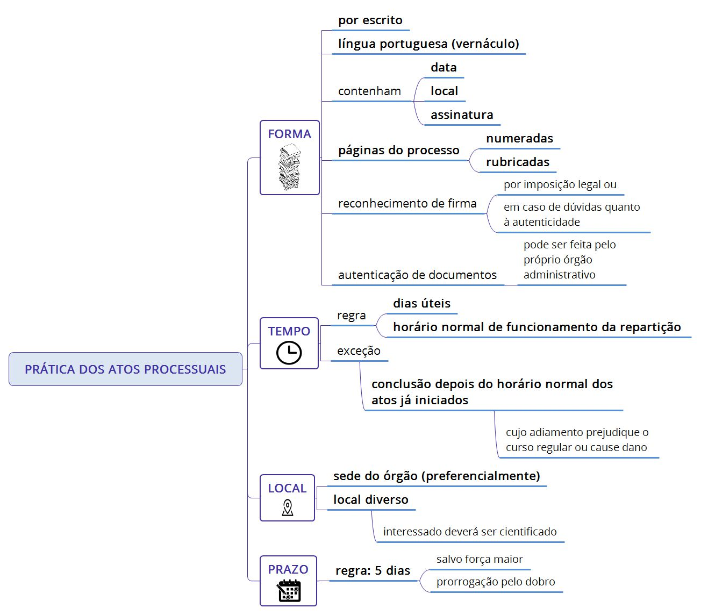

#### Processo Eletrônico

Por fim, é importante notar que, embora a Lei 9.784/1999 tenha sido concebida em um contexto de processos físicos (em papel), suas regras aplicam-se, no que couber, ao processo eletrônico. No entanto, tratando-se especificamente do processo administrativo eletrônico (como o SEI - Sistema Eletrônico de Informações), terão lugar também as disposições contidas no Decreto nº 8.539/2015, que regulamenta o uso do meio eletrônico na administração federal.

### Intimações

A intimação é o ato processual de **comunicação oficial** pelo qual a Administração dá ciência ao interessado sobre atos, decisões ou diligências no âmbito do processo. É um instrumento fundamental para garantir a eficácia dos **Princípios do Contraditório e da Ampla Defesa**, assegurando que o administrado possa, a tempo e modo, se manifestar, apresentar provas ou interpor recursos.

Este tema é tratado entre os artigos 26 a 28 da Lei 9.784/1999, que definem quando a intimação é obrigatória, sua forma, conteúdo e os efeitos de seu descumprimento.

#### Obrigatoriedade da Intimação (Art. 28)

O art. 28 prevê, de modo abrangente, que a Administração tem o dever de intimar o interessado sempre que a decisão ou o ato processual puder repercutir em sua esfera de direitos ou interesses. A intimação é obrigatória para:

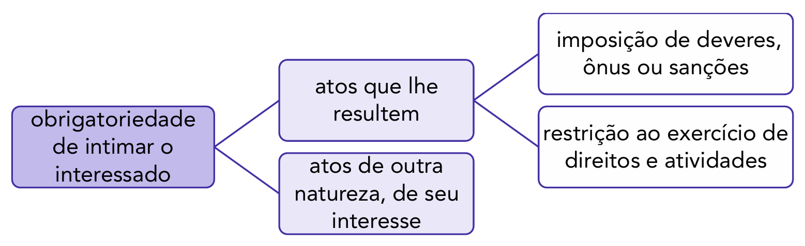

Em resumo, qualquer ato que não seja de mero expediente interno e que afete o interessado exige intimação.

#### Forma e Meios de Realização da Intimação (Art. 26)

A intimação deve ser realizada por um meio que assegure a **certeza da ciência** pelo interessado. O art. 26, §§3º e 4º, estabelece as formas válidas:

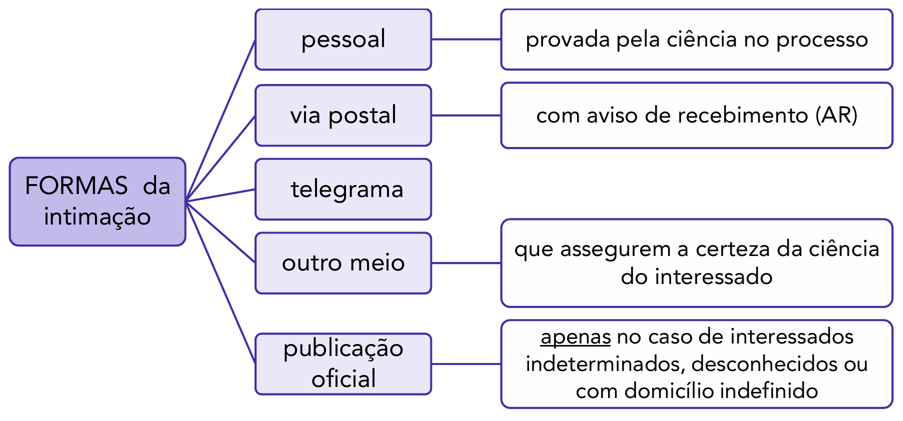

É fundamental destacar o caráter **excepcional** da intimação por **publicação oficial** (ex: Diário Oficial). Este meio só deve ser utilizado como último recurso, quando os interessados são **indeterminados, desconhecidos ou possuem domicílio indefinido**. Se a Administração possui o endereço do interessado, ela não pode optar pela publicação oficial, sob pena de nulidade da intimação.

#### Conteúdo da Intimação (Art. 26, §1º)

Para que a intimação seja válida e cumpra sua finalidade, ela deve conter informações claras e precisas. A lei exige o seguinte conteúdo mínimo:

> I - identificação do intimado e nome do órgão ou entidade administrativa;
> II - finalidade da intimação (ex: "apresentar defesa", "comparecer à oitiva");
> III - data, hora e local em que deve comparecer (se for o caso);
> IV - se o intimado deve comparecer pessoalmente, ou fazer-se representar;
> V - informação da continuidade do processo independentemente do seu comparecimento;
> VI - indicação dos fatos e fundamentos legais pertinentes (essencial para que o interessado saiba do que está se defendendo).

#### Nulidade, Suprimento e Consequências do Desatendimento

##### Nulidade e o Comparecimento Espontâneo

O art. 26, §5º, prevê que as intimações serão consideradas **nulas** quando feitas sem observância das prescrições legais (ex: falta de um dos conteúdos, uso de meio incorreto como a publicação oficial para um interessado com endereço certo). Essa nulidade, por sua vez, contamina os atos processuais seguintes que dependiam daquela intimação.

Contudo, a lei, pautada pela eficiência, estabelece uma forma de "curar" o vício: se a Administração descumpriu as regras, mas, ainda assim, o interessado **comparece espontaneamente** à repartição e exerce seu direito, este comparecimento **supre a falta ou a irregularidade da intimação**.

##### Desatendimento pelo Administrado (Art. 27)

Agora, imaginemos a situação contrária: a intimação foi regular, mas o administrado, por escolha própria, deixou de comparecer ou de se manifestar.

O art. 27 estabelece que isso **não tem significado de confissão e não autoriza que se presuma a culpa** daquele interessado. Esta é uma das mais importantes decorrências do **Princípio da Verdade Material**: o silêncio do interessado não significa que a Administração está correta. O órgão público continua com o dever de investigar e provar os fatos.

Embora o interessado não seja prejudicado pela "confissão ficta", ele perde a oportunidade de se manifestar _naquela fase_. O processo continuará, e o interessado poderá voltar a se manifestar nas fases seguintes, mas o processo não retrocederá.

#### Prazos e Situações Específicas

##### Antecedência Mínima para Provas (Art. 41)

Se a intimação tiver como finalidade a produção de provas (ex: oitiva de testemunhas) ou a realização de diligências (ex: uma perícia _in loco_), o interessado deverá ser intimado com antecedência mínima de **três dias úteis**. Este prazo visa a garantir que o interessado tenha tempo hábil para se preparar, constituir advogado (se quiser) e se organizar para acompanhar o ato.

##### Intimação para Cumprir Exigências (Art. 40)

Há uma situação específica com consequência diferente: quando o processo é iniciado **a pedido do interessado** (ex: um pedido de licença) e, durante a análise, a Administração o intima para apresentar documentos essenciais para a apreciação do pedido. Se o interessado, intimado, não cumprir a exigência no prazo, o seu processo será **arquivado** (art. 40). Note que isso não é uma sanção, mas uma consequência lógica da impossibilidade de a Administração prosseguir com a análise do pedido.

### Instrução do Processo e Decisão

Neste tópico estudaremos as regras aplicáveis à instrução do processo, bem como detalhes atinentes à decisão proferida no bojo do processo administrativo.

Antes, porém, faz-se oportuno definirmos o que seria a “instrução” do processo, bem como diferenciá-la da “instauração”.

A **instrução** do processo consiste nas atividades destinadas a averiguar e comprovar os dados necessários à tomada de decisão (art. 29). Grosso modo, podemos dizer que na fase de instrução a Administração irá colher provas, realizar diligências, solicitar laudos e pareceres, e reunir os demais fundamentos necessários para subsidiar sua decisão final.

Segundo o art. 29 da Lei 9.784/1999, a instrução do processo ocorrerá **de ofício**, ou seja, por iniciativa da própria Administração, em decorrência do **Princípio da Oficialidade** (impulso de ofício) e do dever de buscar a **Verdade Material**.

Isso não impede a participação do cidadão. Pelo contrário, a lei faculta ao interessado **propor** a realização de atos que auxiliem na instrução do processo. Dessa forma, o interessado poderá sugerir a oitiva de testemunhas, propor a realização de perícias e diligências, solicitar pareceres técnicos, etc., com o objetivo de auxiliar a autoridade a esclarecer os fatos.

Não podemos confundir, todavia, a “instrução” processual com sua “instauração”. A **instauração** consiste no início do processo (a primeira fase) que, como vimos, poderá ocorrer de ofício ou a requerimento do interessado. A instrução é a fase seguinte, de investigação dos fatos.

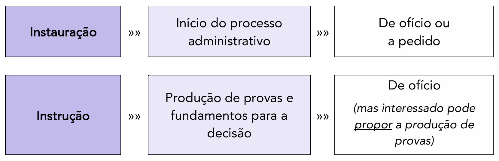

#### Ônus da Prova na Instrução Processual

Como regra geral, no Processo Administrativo Federal (PAF), cabe ao interessado o dever de provar os fatos que alegar. Em outras palavras, o ônus da prova recai, inicialmente, sobre quem faz o pedido ou a alegação:

> **Art. 36.** Cabe ao interessado a prova dos fatos que tenha alegado, sem prejuízo do dever atribuído ao órgão competente para a instrução e do disposto no art. 37 desta Lei.

- **Exemplo:** Um particular tem seu veículo abalroado por um veículo oficial da Polícia Federal. Para obter o ressarcimento do prejuízo pela via administrativa, ele instaura um processo. Se aquele administrado alegar que a viatura X se chocou com seu veículo no dia Y, caberá a ele mesmo, a princípio, provar tais alegações, fazendo juntar ao processo fotos do acidente, orçamentos da oficina, boletim de ocorrência, declarações de testemunhas, etc.

##### Inversão do Ônus da Prova (Art. 37)

A regra do art. 36, contudo, não é absoluta. A parte final do artigo ("...sem prejuízo do dever atribuído ao órgão competente para a instrução...") indica que a Administração também tem um dever instrutório (Princípio da Oficialidade).

A principal exceção a essa regra, que na prática inverte o ônus da prova, está no art. 37:

> **Art. 37.** Quando o interessado declarar que fatos e dados estão registrados em documentos existentes na própria Administração responsável pelo processo ou em outro órgão administrativo, o órgão competente para a instrução proverá, de ofício, à obtenção dos documentos ou das respectivas cópias.

Nesta situação excepcional, a Administração, de ofício, irá se incumbir de obter tais documentos. O cidadão não é obrigado a provar o que a Administração já sabe ou tem o dever de saber.

- **Exemplo:** Um servidor público, após mais de 40 anos de efetivo exercício no mesmo órgão, solicita sua aposentadoria. Ele não necessita provar todas as suas contribuições ou a data de ingresso no órgão anexando centenas de contracheques. Basta declarar que os referidos comprovantes se encontram registrados nos assentamentos funcionais da própria Administração. Caberá ao órgão instrutor (a unidade de gestão de pessoas) obter esses documentos internamente.

O Decreto nº 9.094/2017 (sobre a desburocratização) reforçou e detalhou essa obrigação. Salvo disposição legal em contrário, os órgãos federais que necessitarem de documentos que já constem em outra base de dados oficial da administração pública federal **deverão obtê-los diretamente** do órgão responsável, **não podendo exigi-los dos usuários**.

Portanto, uma repartição está proibida de solicitar ao usuário do serviço público que ele busque certidões em outra repartição pública federal. Os entes públicos devem integrar seus sistemas, de modo a não tornar o cidadão um mensageiro entre os órgãos da própria Administração.

##### Proposição de Provas pelo Interessado (Art. 38)

Embora a instrução seja de ofício, o interessado tem o direito de participar ativamente da produção probatória, em respeito ao contraditório e à ampla defesa.

> **Lei 9.784/1999, art. 38.** O interessado poderá, na fase instrutória e antes da tomada da decisão, juntar documentos e pareceres, requerer diligências e perícias, bem como aduzir alegações referentes à matéria objeto do processo.

##### Recusa de Provas e Provas Ilícitas

O direito de propor provas não é ilimitado. A Administração deve considerar todos os elementos, mas pode recusar provas que não contribuam para o esclarecimento dos fatos:

> Lei 9.784/1999, art. 38, § 1º Os elementos probatórios deverão ser considerados na motivação do relatório e da decisão.
> 
> § 2º Somente poderão ser recusadas, mediante decisão fundamentada, as provas propostas pelos interessados quando sejam ilícitas, impertinentes, desnecessárias ou protelatórias.

A recusa de uma prova solicitada pelo interessado deve ser sempre **fundamentada** (motivada) pela autoridade, sob pena de configurar cerceamento de defesa.

- **Exemplo de prova impertinente:** Em um processo para apurar uma falta por assiduidade (excesso de faltas), o servidor pede a oitiva de testemunhas para provar que ele é um "ótimo colega". Tal prova é impertinente, pois não se relaciona ao fato apurado (as faltas).

No que tange às **provas ilícitas**, muito embora o Princípio da Verdade Material suscite debates doutrinários sobre sua admissão no processo (especialmente se for para beneficiar o administrado), o entendimento majoritário, calcado no art. 38, § 2º, e no próprio texto constitucional (Art. 5º, LVI: "são inadmissíveis, no processo, as provas obtidas por meios ilícitos;"), pugna pela **não admissão** das provas obtidas ilicitamente no PAF.

#### Produção de Pareceres por Órgãos Consultivos

É muito comum que a legislação exija que, antes da tomada de decisão, o processo administrativo seja submetido a órgãos consultivos, a fim de que sejam emitidos pareceres. Esta é uma etapa crucial da instrução que visa a subsidiar a autoridade decisória com análises técnicas.

Os exemplos mais comuns são a submissão dos autos à **Consultoria Jurídica** do órgão (para emissão de parecer quanto à legalidade do processo e da decisão a ser tomada) ou a consultorias orçamentárias (para parecer quanto à adequação orçamentária de uma despesa).

O art. 42 da Lei 9.784/1999 estabelece um prazo para essa análise, visando a garantir a celeridade processual:

> **Art. 42.** Quando deva ser obrigatoriamente ouvido um órgão consultivo, o parecer deverá ser emitido no prazo máximo de **quinze dias**, salvo norma especial ou comprovada necessidade de maior prazo.

O legislador foi além e fixou os efeitos do descumprimento deste prazo. A consequência varia drasticamente a depender da natureza do parecer (se é vinculante ou não):

> **Art. 42, § 1º** Se um parecer **obrigatório e vinculante** deixar de ser emitido no prazo fixado, o processo **não terá seguimento** até a respectiva apresentação, responsabilizando-se quem der causa ao atraso.
> 
> **§ 2º** Se um parecer **obrigatório e não vinculante** deixar de ser emitido no prazo fixado, o processo **poderá ter prosseguimento** e ser decidido com sua dispensa, sem prejuízo da responsabilidade de quem se omitiu no atendimento.

Analisando os dispositivos, temos:

- **Parecer Obrigatório e Não Vinculante:** É o caso mais comum (ex: pareceres jurídicos, em regra). A autoridade é obrigada a _solicitar_ o parecer, mas não é obrigada a _seguir_ sua conclusão (desde que motive sua decisão em sentido contrário). Neste caso, se o órgão consultivo atrasar, a lei prioriza a eficiência: o processo pode seguir, dispensando-se o parecer, e o agente omisso será responsabilizado.
- **Parecer Obrigatório e Vinculante:** É uma hipótese mais rara, onde a lei exige que o parecer seja solicitado _e_ acatado. A decisão final está vinculada à conclusão do parecer. Neste caso, o parecer é um ato-condição para a validade da decisão final. Portanto, se o órgão consultivo atrasar, o processo **deve parar** (não terá seguimento), pois a decisão não pode ser tomada sem ele. A responsabilidade pelo atraso do processo recai sobre quem deu causa à omissão.

Sintetizando estes dois parágrafos, temos o seguinte diagrama:

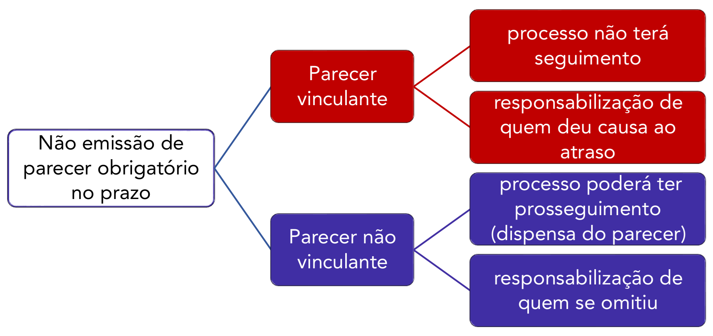

#### Participação do Cidadão e de Não Interessados no Processo

A instrução do processo não se limita aos atos da Administração ou às provas do interessado. O legislador regulamentou três institutos como meio de produzir elementos para subsidiar a decisão, ampliando a participação democrática: a consulta pública (art. 31), a audiência pública (art. 32) e outros meios de participação (art. 33).

##### Consulta Pública (Art. 31)

> **Lei 9.784/1999, art. 31.** Quando a matéria do processo envolver assunto de interesse geral, o órgão competente poderá, mediante despacho motivado, abrir período de consulta pública para manifestação de terceiros, antes da decisão do pedido, se não houver prejuízo para a parte interessada.

A consulta pública é um mecanismo de coleta de **manifestações escritas** da sociedade. É amplamente utilizada pelas agências reguladoras (ex: ANVISA, ANATEL) antes de editarem uma norma de grande impacto. A abertura da consulta é divulgada oficialmente e, durante um prazo fixado, qualquer pessoa pode examinar os autos (a "minuta" da norma, por exemplo) e enviar suas contribuições por escrito.

É fundamental o que dispõe o § 2º: o simples fato de participar da consulta **não torna o participante um "interessado"** no processo (com direito a recurso, por exemplo), mas lhe confere o **direito de obter da Administração uma resposta fundamentada** (que pode ser comum a todas as alegações substancialmente iguais).

##### Audiência Pública (Art. 32)

> **Art. 32.** Antes da tomada de decisão, a juízo da autoridade, diante da relevância da questão, poderá ser realizada audiência pública para debates sobre a matéria do processo.

Diferente da consulta (que é escrita), a audiência pública se destina a **obter manifestações orais e provocar debates** em uma sessão pública. É comum em processos de grande relevância e impacto, como no licenciamento ambiental de grandes obras.

##### Outros Meios de Participação (Art. 33)

Por fim, a lei traz uma cláusula aberta que permite à Administração estabelecer outros meios de participação, diretamente ou por meio de organizações e associações legalmente reconhecidas.

#### Fim da Instrução (Alegações Finais)

Suponhamos que o processo administrativo foi instaurado e, durante a fase de instrução, já foram produzidas provas, ouvidas testemunhas, realizadas perícias e emitidos os pareceres obrigatórios. A instrução está, portanto, completa.

Antes que a autoridade competente profira a decisão, a lei, em respeito à ampla defesa, concede ao interessado uma última oportunidade de se manifestar. Esta é a fase de "alegações finais".

> **Lei 9.784/1999, art. 44.** Encerrada a instrução, o interessado terá o direito de manifestar-se no prazo máximo de **dez dias**, salvo se outro prazo for legalmente fixado.

Este é o momento em que o interessado, já tendo visto o conjunto completo de provas e pareceres, pode apresentar seu argumento final, rebatendo pontos da instrução e reforçando seu pedido, visando a influenciar a decisão da autoridade.

#### Decisão

A decisão é a fase final e o objetivo do processo administrativo. É o ato pelo qual a Administração Pública, após a devida instauração e instrução, profere sua vontade final sobre a matéria analisada, seja para deferir ou indeferir um pedido, aplicar uma sanção, ou declarar um direito.

##### Dever e o Prazo para Decidir

A Administração não pode se omitir. O **Princípio da Obrigatoriedade de Decisão** (ou da vedação ao silêncio) é uma das garantias fundamentais do administrado.

> **Art. 48.** A Administração tem o dever de explicitamente emitir decisão nos processos administrativos e sobre solicitações ou reclamações, em matéria de sua competência.

Para garantir o direito constitucional à razoável duração do processo, a lei estabelece um prazo para que essa decisão seja proferida. Concluída a instrução processual, a Administração possui o prazo de **30 (trinta) dias** para emitir sua decisão. Este prazo pode ser prorrogado, uma única vez, por igual período (ou seja, por mais 30 dias), desde que haja uma **motivação explícita** para a prorrogação (art. 49).

##### Relatório e Proposta de Decisão (Art. 47)

É muito comum que o processo seja instruído e analisado por servidores ou setores técnicos (como uma comissão processante ou uma área de análise de benefícios) que não possuem a competência legal para a tomada de decisão final.

Nestes casos, a área de instrução, ao encerrar seus trabalhos, deve redigir um relatório final e encaminhar o processo à autoridade competente para decidir.

> **Art. 47.** O órgão de instrução que não for competente para emitir a decisão final elaborará relatório indicando o pedido inicial, o conteúdo das fases do procedimento e formulará proposta de decisão, objetivamente justificada, encaminhando o processo à autoridade competente.

Este relatório sintetiza o processo (o que foi pedido, o que foi investigado, o que foi provado) e, ao final, a área técnica opina, sugerindo uma "proposta de decisão" (ex: "sugere-se o deferimento do pedido", "opina-se pela aplicação da sanção X").

##### Motivação

Como vimos, a Administração tem o dever de decidir. Contudo, essa decisão não pode ser arbitrária ou "nua". Ela precisa ser fundamentada. A motivação é a exteriorização das razões que levaram a autoridade a decidir de determinada maneira.

Ela é um dos princípios expressos no art. 2º da lei, que a define como a "indicação dos pressupostos de fato e de direito que determinarem a decisão".

- **Pressupostos de Fato:** São os acontecimentos do mundo real que deram causa ao processo e que foram apurados na instrução (ex: "o servidor faltou 35 dias", "a empresa não entregou o produto").
- **Pressupostos de Direito:** É o fundamento legal (a lei, o artigo) que ampara a decisão tomada com base nos fatos (ex: "a lei X define que mais de 30 faltas configuram abandono de cargo").

###### Motivação 'per relationem' (aliunde)

A autoridade competente que recebe o relatório da área de instrução (conforme o art. 47) não precisa, necessariamente, reescrever todos os fundamentos já expostos no processo. A lei admite expressamente a **motivação _per relationem_** (também chamada de _aliunde_ ou por referência).

Esta é a prática, perfeitamente admitida, em que a autoridade competente se limita a adotar a proposta sugerida e aponta, como motivação do ato decisório, o conteúdo do relatório ou de um parecer anterior.

> **Lei 9.784/1999, art. 50, § 1º** A motivação deve ser explícita, clara e congruente, podendo consistir em **declaração de concordância com fundamentos de anteriores pareceres, informações, decisões ou propostas**, que, neste caso, serão parte integrante do ato.

- **Exemplo:** A decisão final da autoridade pode ser sucinta: "Acolho integralmente o Parecer nº 123/2025 da Consultoria Jurídica e o Relatório Final da Comissão de Processo Disciplinar, por seus próprios e jurídicos fundamentos, e decido pela demissão do servidor". Aquele parecer e aquele relatório passam a integrar, juridicamente, a motivação da decisão.

###### Atos que Exigem Motivação Obrigatória (Art. 50)

Embora a motivação seja a regra, o art. 50 da Lei 9.784/1999 lista um rol mínimo de situações em que a motivação é **obrigatória**, sob pena de nulidade do ato:

> Lei 9.784/1999, art. 50. Os atos administrativos deverão ser motivados, com indicação dos fatos e dos fundamentos jurídicos, quando:
> 
> I - neguem, limitem ou afetem direitos ou interesses; (Ex: O indeferimento de um pedido de licença ou aposentadoria).
> II - imponham ou agravem deveres, encargos ou sanções; (Ex: A aplicação de uma multa ou uma suspensão).
> III - decidam processos administrativos de concurso ou seleção pública; (Ex: O ato que homologa o resultado ou desclassifica um candidato).
> IV - dispensem ou declarem a inexigibilidade de processo licitatório; (Por serem exceções à regra de licitar, devem ser plenamente justificadas).
> V - decidam recursos administrativos; (A decisão do recurso deve explicar por que a decisão anterior foi mantida ou reformada).
> VI - decorram de reexame de ofício;
> VII - deixem de aplicar jurisprudência firmada sobre a questão ou discrepem de pareceres, laudos, propostas e relatórios oficiais; (A autoridade pode discordar de um parecer não vinculante, mas tem o dever de motivar sua discordância).
> VIII - importem anulação, revogação, suspensão ou convalidação de ato administrativo. (Atos que desfazem ou corrigem outros atos).

###### Características da Motivação (Art. 50, §§ 1º-3º)

Por fim, a lei define _como_ a motivação deve ser apresentada:

> **§ 1º** A motivação deve ser **explícita, clara e congruente**...

- **Explícita:** Não pode ser implícita ou presumida. Deve estar escrita no corpo do ato ou em documento a que ele se refira (como na motivação _per relationem_).
- **Clara:** Deve ser redigida em linguagem compreensível, permitindo que o cidadão entenda as razões da decisão.
- **Congruente:** Deve haver uma conexão lógica entre os fatos apurados, os fundamentos legais invocados e a decisão tomada.

> **§ 2º** Na solução de vários assuntos da mesma natureza, pode ser utilizado meio mecânico que reproduza os fundamentos das decisões, desde que não prejudique direito ou garantia dos interessados.

Esta é a permissão para "decisões-modelo" ou "atos em bloco". Se a Administração recebe 500 pedidos idênticos e infundados, ela pode usar uma decisão padronizada ("meio mecânico") para indeferir todos, desde que aquele fundamento se aplique a todos os casos.

> **§ 3º** A motivação das decisões de órgãos colegiados e comissões ou de decisões orais constará da respectiva ata ou de termo escrito.

A motivação de uma decisão tomada por um conselho ou uma diretoria não está na "cabeça" do presidente, mas sim no **registro escrito da reunião (a ata)**, que deve conter os debates e os fundamentos que levaram o colegiado àquela deliberação.

##### Decisão Coordenada

Em setembro de 2021, com a publicação da Lei nº 14.210, a Lei 9.784/1999 foi inovada com a introdução do instituto da **"decisão coordenada"**. Trata-se de uma moderna ferramenta de governança destinada a solucionar entraves em processos administrativos complexos que exigem a manifestação de múltiplos órgãos.

A decisão coordenada visa a combater a fragmentação administrativa, conhecida como "atuação em silos", onde cada órgão analisa um mesmo projeto de forma isolada e, muitas vezes, sequencial, levando a atrasos, decisões conflitantes e insegurança jurídica.

###### O que é decisão coordenada?

Em essência, a decisão coordenada consiste em uma forma de se buscar maior cooperação e interação entre vários órgãos públicos **antes** de se decidir algo que possa afetar a todos eles. É a "coletivização" do processo decisório, que busca conferir maior eficiência e celeridade para o funcionamento da máquina pública.

O mecanismo convoca os órgãos interessados para uma reunião (ou várias), na qual são debatidas as possíveis soluções, apresentados estudos e, ao final, busca-se chegar a uma decisão consensual e harmônica.

Na dicção do legislador, a definição formal é:

> **Art. 49-A, § 1º** Considera-se decisão coordenada a instância de natureza interinstitucional ou intersetorial que atua de forma **compartilhada** com a finalidade de **simplificar o processo** administrativo mediante **participação concomitante** de todas as autoridades e agentes decisórios e dos responsáveis pela instrução técnico-jurídica (...).

A decisão coordenada deve obedecer aos princípios da legalidade, da eficiência e da transparência, com utilização, sempre que necessário, da simplificação do procedimento e da concentração das instâncias decisórias (art. 49-A, § 5º).

É fundamental notar que, embora seja fruto desta articulação, a decisão coordenada **não exclui a responsabilidade originária de cada órgão** envolvido (art. 49-A, § 4º). Ou seja, se o IBAMA (órgão ambiental) participa de uma decisão coordenada sobre um porto, ele ainda é o responsável final pela emissão (ou não) da licença ambiental, e responderá por este ato. A decisão coordenada harmoniza, mas não substitui, as competências legais.

###### Quando pode ser tomada uma decisão coordenada?

A decisão coordenada não é aplicável a qualquer processo. Ela é reservada a situações de alta complexidade. Na Administração Pública Federal, ela poderá ser utilizada quando a decisão exigir a participação de **3 (três) ou mais órgãos, entidades ou setores**, e desde que preencha dois requisitos cumulativos (art. 49-A, _caput_):

1. Seja justificável pela **relevância da matéria**; e
2. Haja **discordância que prejudique a celeridade** do processo administrativo decisório.

Por outro lado, o art. 49-A, § 6º, estabelece que a decisão coordenada **NÃO se aplica** aos seguintes processos administrativos:

- de licitação;
- relacionados ao poder sancionador (ex: Processo Administrativo Disciplinar - PAD);
- em que estejam envolvidas autoridades de Poderes distintos (respeitando-se a separação dos poderes; é uma ferramenta de coordenação interna do Poder Executivo).

###### Quem participa da decisão coordenada?

Neste processo coletivo de decisão, poderão participar (art. 49-B):

1. Os **órgãos e entidades diretamente envolvidos** na decisão;
2. Os **outros interessados** que se enquadrem nos critérios do art. 9º da Lei 9.784/1999 (pessoas que iniciaram o processo, que podem ser afetadas, organizações representativas de interesses coletivos ou associações de defesa de interesses difusos).

A participação desses "outros interessados" (como uma ONG, por exemplo) depende de **autorização da autoridade responsável pela convocação** da decisão coordenada. Esta decisão de admitir ou não o interessado é de **caráter irrecorrível** (art. 49-B, parágrafo único), dando à autoridade convocadora o controle sobre o escopo da reunião.

Todos os participantes devem ser intimados (conforme as regras do art. 26), e a intimação já delimita a matéria que será objeto de decisão, sendo vedada a arguição de matéria estranha ao objeto da convocação (art. 49-F, parágrafo único).

###### Como os órgãos chegam a uma única decisão?

O processo é colaborativo. Cada órgão ou entidade participante é responsável pela elaboração de um **documento técnico sobre o tema**, dentro de sua respectiva competência. Este documento (ex: a nota técnica ambiental, o parecer jurídico) irá subsidiar os debates durante a reunião e integrará o processo (Art. 49-E).

###### E se os órgãos participantes não chegam a um consenso?

O mecanismo não obriga o consenso, mas obriga o debate. Se um órgão discordar da solução proposta (ou seja, se houver **dissenso**), ele deve manifestar esta discordância **durante a reunião**, de forma **fundamentada**, e (o que é mais importante) deve apresentar suas **propostas de solução e de alteração** necessárias para a resolução da questão (Art. 49-F). Isso impede o "veto" silencioso ou posterior, forçando uma negociação construtiva.

###### A ata da reunião da decisão coordenada

A conclusão dos trabalhos da decisão coordenada será consolidada em uma **ATA**, que é o documento final que formaliza o resultado. Esta ata deverá conter, no mínimo (Art. 49-G):

> I - relato sobre os itens da pauta;
> II - síntese dos fundamentos aduzidos;
> III - síntese das teses pertinentes ao objeto da convocação;
> IV - registro das orientações, das diretrizes, das soluções ou das propostas de atos governamentais relativos ao objeto da convocação;
> V - posicionamento dos participantes para subsidiar futura atuação governamental em matéria idêntica ou similar;
> VI - decisão de cada órgão ou entidade relativa à matéria sujeita à sua competência.

Esta ata deverá ser assinada pelos representantes de cada órgão participante e será publicada, por extrato, no Diário Oficial da União, com indicação do local onde seu inteiro teor pode ser acessado.

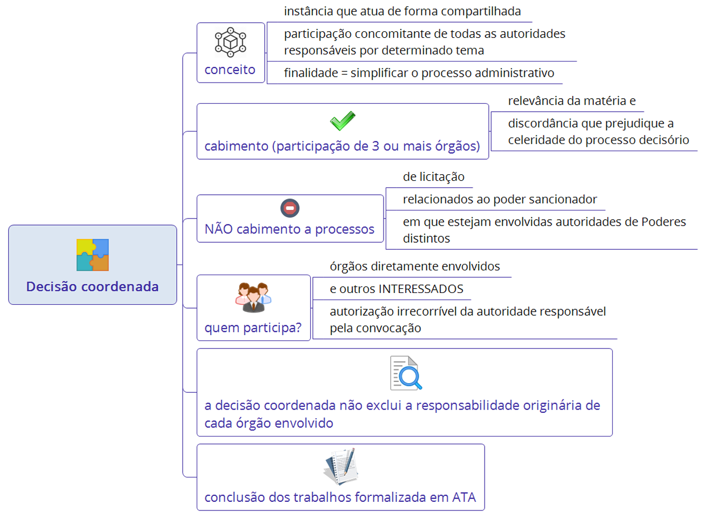

### Medida Cautelar

O legislador também positivou na Lei 9.784/1999 o **poder geral de cautela** da Administração Pública. Este é um instrumento de extrema importância para a defesa do interesse público. Muitas vezes, a Administração se depara com uma situação de risco iminente, e a demora normal de um processo administrativo (com suas fases de instrução, defesa e decisão) poderia levar a um dano irreversível. Nestes casos, o interesse público clama por uma ação imediata e urgente, materializada em uma medida cautelar.

Exemplos de medidas cautelares incluem a interdição imediata de um estabelecimento comercial pela vigilância sanitária ao constatar alimentos impróprios para o consumo, ou o embargo de uma obra em área de preservação ambiental que está causando desmatamento.

Nesses casos, em razão da necessidade de adoção imediata da medida, o legislador autorizou uma exceção à regra do contraditório prévio. O interessado se manifestará _após_ a prática do ato, o que se denomina **contraditório diferido** (ou adiado).

Vejamos a literalidade do referido dispositivo legal:

> **Art. 45.** Em caso de risco iminente, a Administração Pública poderá **motivadamente** adotar providências acauteladoras **sem a prévia manifestação do interessado**.

É crucial notar que este poder não é arbitrário. O art. 45 exige dois requisitos claros: a existência de um **risco iminente** e que a providência seja **motivada**. A autoridade deve justificar, nos autos do processo, qual era o risco e por que a medida era indispensável e urgente.

### Desistência e Extinção do Processo

Os artigos 51 e 52 tratam das formas de encerramento do processo que não decorrem de uma decisão final de mérito (deferimento ou indeferimento), mas sim da perda do seu objeto ou da vontade do interessado.

#### Desistência pelo Interessado (Art. 51)

A desistência é o ato pelo qual o interessado que iniciou o processo manifesta sua vontade de não prosseguir com o pedido.

> **Art. 51.** O interessado poderá, mediante **manifestação escrita**, desistir total ou parcialmente do pedido formulado ou, ainda, **renunciar a direitos disponíveis**.

A lei estabelece três regras importantes sobre os efeitos da desistência:

1. **Efeito Subjetivo (Art. 51, § 1º):** Havendo vários interessados (como em um pedido conjunto), a desistência ou renúncia atinge **somente quem a tenha formulado**. O processo continua normalmente para os demais.
2. **Efeito sobre o Interesse Público (Art. 51, § 2º):** Esta é a regra mais importante e que difere o processo administrativo do judicial. A desistência ou renúncia por parte do interessado **não prejudica o prosseguimento do processo, se a Administração considerar que o interesse público assim o exige**.
    - **Exemplo:** Um cidadão protocola uma denúncia sobre o funcionamento de uma indústria vizinha que está poluindo um rio. No meio da instrução, o cidadão (interessado) desiste do processo. Contudo, a Administração, ao investigar, já encontrou indícios da poluição (uma questão de interesse público e difuso). Neste caso, a Administração _deve_ continuar o processo de ofício para apurar a infração ambiental, mesmo contra a vontade do denunciante original.
3. **Renúncia a Direitos Disponíveis:** O artigo permite a renúncia apenas a **direitos disponíveis**, ou seja, aqueles de natureza privada sobre os quais o cidadão tem livre disposição (ex: um pedido de isenção fiscal, uma licença). Direitos indisponíveis (como o direito à vida, à saúde ou o próprio dever da Administração de apurar ilegalidades) não podem ser objeto de renúncia.

#### Extinção do Processo (Art. 52)

A extinção é a declaração formal de que o processo "morreu" por perda de objeto, tornando a decisão final desnecessária ou impossível.

> **Art. 52.** O órgão competente poderá declarar extinto o processo quando exaurida sua finalidade ou o objeto da decisão se tornar impossível, inútil ou prejudicado por fato superveniente.

Isso pode ocorrer por quatro motivos:

- **Exaurida sua finalidade:** O objetivo do processo foi alcançado por outros meios. (Ex: O servidor pede a correção de seu salário; antes da decisão, a Administração processa a folha de pagamento e faz a correção automaticamente. O processo perde o objeto).
- **Objeto impossível:** (Ex: Um pedido de autorização para restaurar um prédio histórico que, durante o processo, desaba).
- **Objeto inútil:** (Ex: Um pedido de autorização para um evento em data que já passou).
- **Prejudicado por fato superveniente:** (Ex: Um pedido de licença para construir em um terreno que, durante o processo, é declarado área de preservação permanente por uma nova lei).

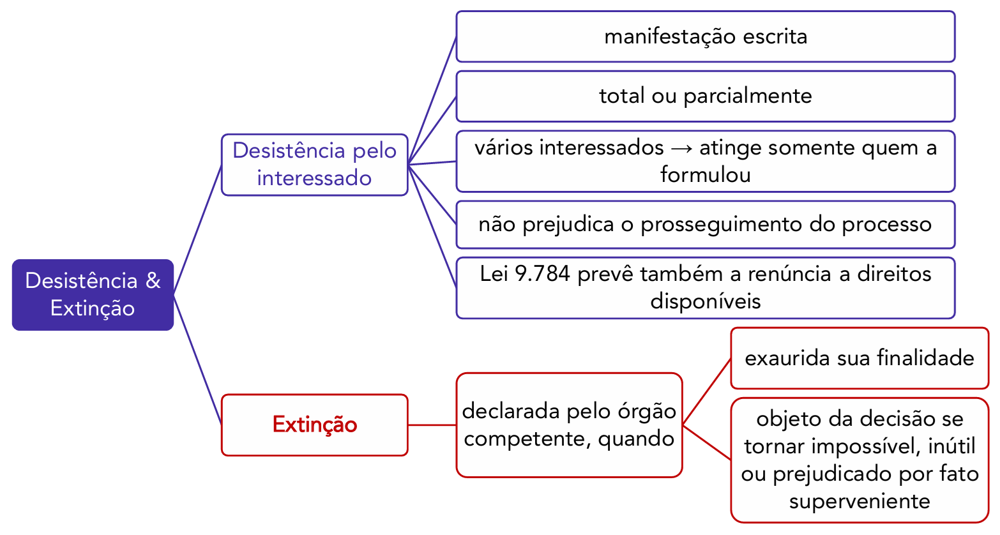

### Anulação, Revogação e Convalidação de Atos Administrativos

Um ato administrativo, ao ser praticado, entra no mundo jurídico e começa a produzir efeitos. No entanto, ele não é imutável. A própria Administração, no exercício de seu poder-dever de **autotutela**, pode (e deve) controlar seus próprios atos, desfazendo-os quando necessário.

Este desfazimento do ato, ou o seu "conserto", pode ocorrer por diferentes motivos, o que nos leva a três institutos distintos: anulação, revogação e convalidação.

#### Controle de Legalidade vs. Controle de Mérito

Para entender a diferença entre anulação e revogação, é preciso primeiro diferenciar os dois tipos de controle que a Administração exerce:

1. **Controle de Legalidade (Anulação):** Neste controle, a Administração atua como um fiscal da lei. Ela compara o ato praticado com os requisitos impostos pela legislação (competência, forma, finalidade, motivo, objeto). Se o ato tiver sido praticado com um vício, ou seja, de forma ilegal ou ilegítima, ele deve ser **anulado**.
    - **Exemplos:** Uma pessoa tomou posse em um cargo que a lei exige nível superior, embora não o tivesse (vício no objeto); foi aplicada uma sanção a um servidor público sem lhe conceder o direito ao contraditório e à ampla defesa (vício na forma/procedimento).
2. **Controle de Mérito (Revogação):** Neste controle, o ato é perfeitamente legal e válido. A questão aqui não é de legalidade, mas de conveniência e oportunidade. A Administração avalia se o ato, embora legal, ainda é útil e atende ao interesse público. Se o ato se mostrar inconveniente ou inoportuno, ele poderá ser **revogado**.
    - **Exemplo:** Determinado órgão público autorizou a realização de licitação para a construção de sua nova sede ao custo de R$ 100 milhões, com recursos previstos no orçamento. O ato é perfeitamente legal. Alguns meses depois, o país passa a enfrentar uma grave crise econômica. Aquele gasto, embora legal, torna-se inoportuno. A autoridade, por conveniência administrativa, decide **revogar** a autorização para a licitação, deixando a construção para outro momento.

Nesse sentido, a Lei 9.784/1999, em seu art. 53, resume perfeitamente o poder de autotutela da Administração, que deu origem à famosa Súmula 473 do STF:

> **Lei 9.784/1999, art. 53.** A Administração **deve anular** seus próprios atos, quando eivados de vício de legalidade, e **pode revogá-los** por motivo de conveniência ou oportunidade, respeitados os direitos adquiridos.

Note a diferença nos verbos: anular é um **dever** (ato vinculado, pois não se pode tolerar a ilegalidade); revogar é um **poder** (ato discricionário, pois depende da conveniência).

#### Anulação

A anulação ocorre, portanto, quando há um vício que torna o ato administrativo inválido ou ilegal.

- **Efeitos:** A anulação opera efeitos retroativos, conhecidos como **efeitos _ex tunc_**. O ato é retirado do mundo jurídico desde o momento em que foi praticado (retroage à origem), e seus efeitos são, em regra, desfeitos, como se o ato nunca tivesse existido.
- **Proteção a Terceiros de Boa-Fé:** Esta retroatividade, no entanto, não é absoluta. Ela é mitigada para proteger terceiros que, de boa-fé, não sabiam do vício e foram beneficiados pelo ato. Seus efeitos já produzidos em relação a terceiros de boa-fé são, em geral, preservados.

##### Decadência do Direito de Anular (Art. 54)

O direito (e dever) de a Administração anular um ato não é eterno. Em prol da segurança jurídica e da proteção da confiança do cidadão, a lei impõe um prazo máximo para que a Administração possa rever seus atos ilegais. No âmbito federal, este prazo é de **cinco anos**, salvo comprovada má-fé.

> Lei 9.784/1999, art. 54. O direito da Administração de anular os atos administrativos de que decorram efeitos favoráveis para os destinatários decai em cinco anos, contados da data em que foram praticados, salvo comprovada má-fé.
> 
> § 1º No caso de efeitos patrimoniais contínuos, o prazo de decadência contar-se-á da percepção do primeiro pagamento.
> § 2º Considera-se exercício do direito de anular qualquer medida de autoridade administrativa que importe impugnação à validade do ato.

Deste artigo, depreendem-se quatro pontos cruciais:

1. **Natureza:** O prazo é **decadencial** (a Administração perde o próprio direito de anular).
2. **Exceção à Decadência:** O prazo de 5 anos **não se aplica** se for comprovada a **má-fé** do beneficiário do ato. Nesse caso, a Administração pode anular o ato a qualquer tempo.
3. **Início do Prazo (Regra Geral):** O prazo conta da data em que o ato foi praticado.
4. **Início do Prazo (Exceção):** Se o ato gera **efeitos patrimoniais contínuos** (como a concessão de uma aposentadoria, ou o pagamento de uma vantagem pecuniária mensal a um servidor), o prazo de 5 anos começa a contar da percepção do **primeiro pagamento**.

Após o decurso do prazo de 5 anos (e sem má-fé), o ordenamento jurídico prioriza a segurança jurídica em detrimento da legalidade estrita, tolerando-se a manutenção do ato, ainda que originalmente ilegal.

#### Revogação

A revogação, segundo Maria Sylvia Zanella Di Pietro, consiste no “ato discricionário pelo qual a Administração extingue um ato válido, por razões de conveniência e oportunidade”.

- **Objeto:** A revogação aplica-se somente a **atos válidos (legais)**. Se o ato for ilegal, ele deve ser anulado, não revogado.
- **Escopo:** Só se fala em conveniência e oportunidade (mérito) nos **atos discricionários**. Atos vinculados (aqueles em que a lei não dá margem de escolha ao gestor, como a concessão de uma licença-maternidade) não podem ser revogados.
- **Efeitos:** Diferente da anulação, a revogação opera **efeitos _ex nunc_** (prospectivos), ou seja, "daqui para frente". O ato é válido até o momento da revogação, e seus efeitos produzidos até ali são plenamente respeitados.

#### Convalidação

Os defeitos (ou vícios) do ato administrativo podem ser subdivididos em sanáveis (corrigíveis) e insanáveis (incorrigíveis). Admitindo-se a existência de vícios sanáveis, tem lugar a **convalidação** (também chamada de "saneamento"), que consiste em **corrigir** o ato administrativo com efeitos retroativos (_ex tunc_).

- **Exemplo:** Um ato é praticado por uma autoridade que era incompetente (vício de competência sanável), mas o conteúdo do ato era legal. A autoridade superior (que tinha a competência correta) pode, posteriormente, praticar um ato B (convalidação) que "ratifica" o ato A, validando-o desde a sua origem.

Se a convalidação operasse apenas efeitos prospectivos (_ex nunc_), ela seria inútil, pois o administrador poderia simplesmente praticar um novo ato válido. A grande importância da convalidação consiste em "salvar" os efeitos passados do ato.

Como a convalidação se dá no bojo do controle de legalidade, ela pode recair tanto sobre atos discricionários quanto sobre atos vinculados.

No plano federal, a convalidação encontra-se positivada no art. 55 da Lei 9.784/1999:

> **Lei 9.784/1999, art. 55.** Em decisão na qual se evidencie não acarretarem lesão ao interesse público nem prejuízo a terceiros, os atos que apresentarem defeitos sanáveis poderão ser convalidados pela própria Administração.

Da leitura do dispositivo, reparem que a convalidação é um **ato discricionário** ("poderão ser convalidados") e exige o cumprimento de três condições cumulativas:

Os vícios considerados sanáveis pela doutrina majoritária são os de **Competência** (desde que não seja exclusiva) e de **Forma** (desde que não seja essencial à validade do ato). Vícios de Finalidade, Motivo e Objeto são, em regra, insanáveis.

### Recurso Administrativo e Revisão do Processo

Imagine que, após a instauração do processo e sua instrução, o interessado é notificado quanto à decisão tomada pela Administração. Caso o interessado não concorde com a decisão, ele poderá interpor um recurso ainda na via administrativa.

É fundamental destacar que o recurso não se restringe a questionamentos sobre a legalidade do ato. Ele também pode ser usado para contestar o **mérito** da decisão (conveniência e oportunidade).

> **Art. 56.** Das decisões administrativas cabe recurso, em face de razões de **legalidade** e de **mérito**.

Isso significa que o interessado pode recorrer alegando que a decisão foi ilegal (ex: baseou-se em lei errada) ou que, embora legal, foi inconveniente, desproporcional ou injusta (mérito).

#### Aspectos gerais

A Lei 9.784/1999 assegura aos interessados a possibilidade de que o processo seja analisado por outra autoridade, que seja hierarquicamente superior àquela que decidiu inicialmente o processo. Esta reapreciação do caso é deflagrada por meio da interposição de um recurso administrativo.

A doutrina (a exemplo de Marcelo Alexandrino) chega a afirmar que a Lei 9.784/1999 assegurou aos administrados o “direito ao duplo grau de jurisdição administrativa”, estabelecendo o recurso das decisões como um verdadeiro direito do administrado.

##### Tramitação do Recurso (Juízo de Reconsideração)

Quanto à tramitação deste recurso, a lei estabelece um fluxo específico e muito importante:

1. O recurso será endereçado à **própria autoridade que tomou a decisão** (a autoridade _a quo_). Ele não é protocolado diretamente na instância superior.
2. Esta autoridade, ao receber o recurso, terá o prazo de **5 (cinco) dias** para exercer o **juízo de reconsideração** (ou juízo de retratação). Ela irá analisar os argumentos do recurso e decidir se "volta atrás" na sua própria decisão inicial.
3. Caso aquela autoridade **não reconsidere** sua decisão (seja por manter seu entendimento, seja por deixar o prazo de 5 dias passar), ela deverá, obrigatoriamente, encaminhar (fazer subir) o recurso ao seu **superior hierárquico**, que será o responsável por julgar o recurso.

A partir daqui, concluímos que o recurso previsto na Lei 9.784/1999 é um **recurso hierárquico**, uma vez que “força” seu encaminhamento à autoridade hierarquicamente superior (caso a autoridade original não reconsidere sua decisão).

Em síntese:

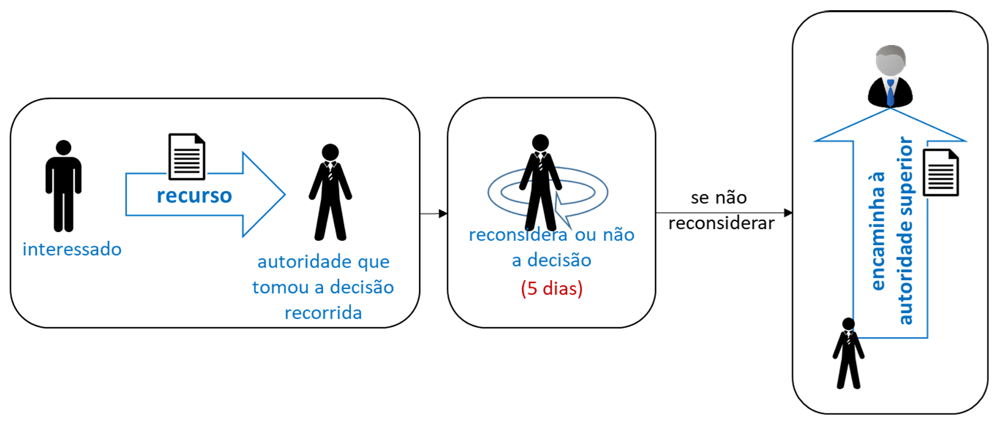

##### Limite de Instâncias

Apesar de o recurso envolver autoridades hierarquicamente superiores, o legislador, visando à celeridade e à segurança jurídica (para que o processo tenha um fim), limitou sua tramitação a, no máximo, **3 (três) instâncias administrativas**, como regra geral (art. 57).

Portanto, a Lei 9.784/1999 admite, no máximo, 2 (dois) recursos hierárquicos. A estrutura seria:

1. **1ª Instância:** Decisão original (ex: Autoridade A).
2. **2ª Instância:** Primeiro recurso (ex: Autoridade B, superior a A).
3. **3ª Instância:** Segundo e último recurso (ex: Autoridade C, superior a B).

#### Violação à Súmula Vinculante do STF

A Súmula Vinculante é uma decisão do Supremo Tribunal Federal (STF) que possui força obrigatória para toda a Administração Pública. Se o recorrente alegar que a decisão proferida no processo administrativo contrariou uma Súmula Vinculante, a lei exige um procedimento especial:

A autoridade que proferiu a decisão (a 1ª instância), antes de encaminhar o recurso à autoridade superior, **deverá explicitar as razões** de aplicabilidade ou inaplicabilidade da súmula, conforme o caso (art. 56, §3º).

Da mesma forma, caso o recorrente tenha alegado violação de enunciado da súmula vinculante, o órgão competente para decidir o recurso (a instância superior) também **explicitará as razões** da aplicabilidade ou inaplicabilidade da súmula (art. 64-A).

#### Exigência de Depósito Prévio (Caução)

O art. 56, § 2º, da Lei 9.784/1999 já restringia a exigência de caução (um depósito em dinheiro ou bens) como condição para se poder recorrer, limitando-a às hipóteses previstas em lei.

Contudo, o STF, em 2009, pacificou a questão, tornando a proibição absoluta. Fazendo uma interpretação ampliativa do princípio do contraditório e da ampla defesa (pois a exigência de depósito prévio impede o pobre de recorrer), o STF editou a Súmula Vinculante 21, que veda qualquer exigência deste tipo:

> **Súmula Vinculante 21**
> 
> É inconstitucional a exigência de depósito ou arrolamento prévios de dinheiro ou bens para admissibilidade de recurso administrativo.

