# Capítulo 12 – Lei nº 8.429/1992: Lei de Improbidade Administrativa

Estudaremos a Lei de Improbidade Administrativa (LIA), uma das principais ferramentas de combate à corrupção e defesa da moralidade no serviço público. A LIA é aplicável a ilícitos praticados em todas as esferas da nossa federação (União, Estados, DF e Municípios) e em todos os Poderes.

Esta lei, originalmente de 1992, foi profunda e estruturalmente alterada pela **Lei nº 14.230, de 2021**, que redefiniu conceitos, alterou sanções e mudou drasticamente o regime processual e prescricional. O nosso estudo considerará integralmente esta "nova LIA".

De modo geral, as 4 principais mudanças introduzidas pela reforma de 2021, que nortearão nosso estudo, são as seguintes:

1. **O fim da improbidade na modalidade culposa.** Antes da reforma, os atos de prejuízo ao erário podiam ser punidos por culpa (negligência). Agora, todos os atos de improbidade exigem, obrigatoriamente, a comprovação de **dolo** (intenção).
2. **Redução das categorias de atos de improbidade.** A lei revogou o art. 10-A (que tratava da concessão indevida de benefícios tributários relativos ao ISSQN), concentrando a LIA em três grandes eixos: enriquecimento ilícito (art. 9º), prejuízo ao erário (art. 10) e violação de princípios (art. 11).
3. **Alterações diversas nas sanções aplicáveis.** Houve uma reconfiguração das punições, como a ampliação dos prazos máximos para a suspensão dos direitos políticos, a redução de valores de multas em alguns casos e, principalmente, a supressão de sanções importantes (como a suspensão de direitos políticos) para os atos de violação a princípios.
4. **Unificação e ampliação do prazo prescricional.** O regime de prescrição, que era complexo e variado, foi unificado. Todos os atos de improbidade passam a se submeter a um prazo prescricional único de **8 (oito) anos**.

## Noções Gerais de Improbidade Administrativa

### Conceito de Probidade e Improbidade

Um dos deveres gerais impostos aos agentes públicos é o da **probidade**. A palavra "probidade" é sinônimo de integridade, honestidade, retidão e lisura. A ideia de probidade, que é intimamente ligada ao princípio constitucional da **moralidade administrativa**, informa que os agentes devem servir à Administração Pública com honestidade, exercendo suas atribuições no intuito de alcançar o interesse público, sem tirar proveito pessoal ou de terceiros dos poderes inerentes ao cargo.

Segundo Diogo de Figueiredo Moreira Neto, “trata-se de outro dever comum, que assume maior rigor quando se trate de servidor público, que terá bens públicos sob sua guarda e a seu uso, assim como poderá ter interesses de repercussões patrimoniais, ora mais ora menos importantes, sob sua esfera de decisão”.

De forma didática, Marino Pazzaglini Filho leciona que improbidade administrativa é o termo técnico para designar a corrupção administrativa, como a aquisição de vantagens indevidas ou o exercício nocivo da função, utilizando para isso o tráfico de influência nas esferas do poder, favorecendo poucos em detrimento dos interesses da sociedade, por meio de privilégios ilícitos.

É crucial notar que a improbidade não é uma mera ilegalidade. O ato de improbidade é aquele descumprimento da lei que ganha o "colorido adicional" da desonestidade, da má-fé, do dolo. Com a reforma de 2021, essa distinção ficou ainda mais clara: um ato ilegal, mas praticado sem a intenção de lesar o erário ou obter vantagem (sem dolo), pode ser anulado, mas não será considerado um ato de improbidade administrativa.

### Fundamento Constitucional

Tamanha é a importância do tema que a própria Constituição Federal de 1988 o alçou ao seu texto, prevendo sanções severas para os "atos de improbidade administrativa":

> **CF, art. 37, § 4º** Os atos de improbidade administrativa importarão a suspensão dos direitos políticos, a perda da função pública, a indisponibilidade dos bens e o ressarcimento ao erário, na forma e gradação previstas em lei, sem prejuízo da ação penal cabível.

Com fundamento neste dispositivo, foi editada a Lei nº 8.429/1992. Trata-se, na maior parte de seus dispositivos, de uma lei de **caráter nacional**, pois estabelece normas gerais de defesa da probidade, sendo, portanto, aplicável a todos os entes da federação (União, Estados, DF e Municípios) e a todos os Poderes (Executivo, Legislativo e Judiciário).

#### Sanções Constitucionais

Antes de passarmos ao texto da LIA, é importante destacarmos as penalidades mencionadas no dispositivo constitucional acima, que formam o núcleo de punição do agente ímprobo:

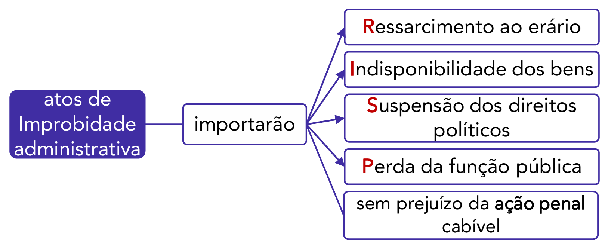

Ainda quanto ao rol constitucional de sanções aplicáveis, é importante não confundirmos as sanções de "suspensão de direitos políticos" e "perda da função pública".

Não há "perda", propriamente dita, dos direitos políticos em razão de atos de improbidade, mas apenas a **suspensão temporária** desses direitos. A própria Constituição (art. 15, _caput_) veda a **cassação** (perda definitiva) de direitos políticos, mas permite sua **suspensão** em algumas hipóteses, entre elas a condenação por improbidade administrativa (art. 15, inciso V).

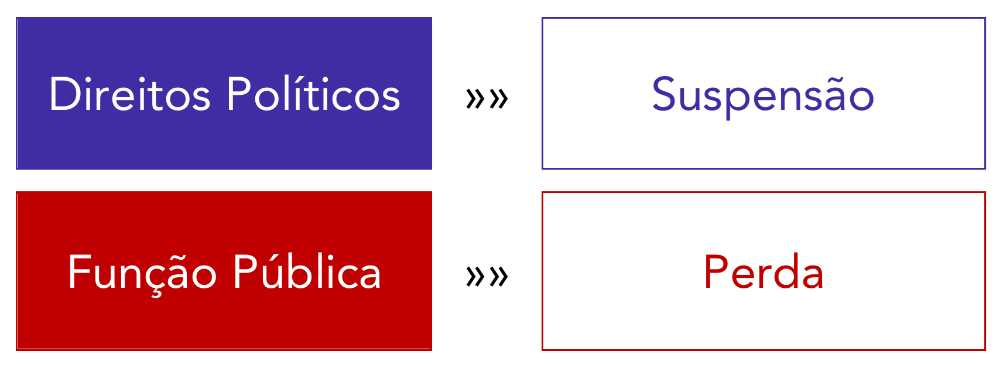

Dito isto, passemos ao estudo das disposições da Lei 8.429/1992, iniciando pela definição e categorização dos atos de improbidade administrativa.

## Atos de Improbidade Administrativa

Entre os artigos 9º, 10 e 11 da Lei 8.429/1992, o legislador definiu três categorias de atos de improbidade administrativa, a saber:

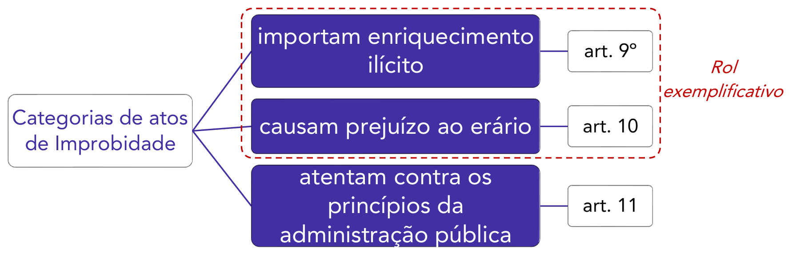

Antes de passarmos ao estudo de cada grupo de atos de improbidade administrativa, algumas observações importantíssimas, que refletem as mudanças da Lei nº 14.230/2021, devem ser feitas:

### Rol das Hipóteses (Exemplificativo vs. Taxativo)

Uma das mudanças mais significativas da reforma de 2021 foi a redefinição da natureza das listas (rol) de condutas em cada artigo.

- **Artigos 9º (Enriquecimento Ilícito) e 10 (Prejuízo ao Erário):** Estas listas permanecem sendo consideradas **rol exemplificativo**. Isto significa que a prática de outros atos que, embora não expressamente previstos nos incisos, se enquadrem na definição principal (_caput_) de "enriquecimento ilícito" ou "prejuízo ao erário" poderá ser caracterizada como ato de improbidade administrativa. O que importa é a descrição geral da conduta (o _caput_).
- **Artigo 11 (Violação de Princípios):** Aqui reside uma das maiores alterações da lei. O entendimento que tem se consolidado é que a lista do art. 11 tornou-se um **rol taxativo**. Em tese, se uma conduta imoral ou ilegal não estiver expressamente prevista em um dos incisos do art. 11, ela não poderá ser caracterizada como ato de improbidade por violação de princípio, ainda que seja uma violação clara de um dever funcional.

### Gravidade e o Princípio da Absorção

O legislador considerou os atos que importam **enriquecimento ilícito (art. 9º)** como os mais graves e, assim, cominou as sanções mais duras para eles. Na sequência, em gravidade, estão os atos que causam **prejuízo ao erário (art. 10)**. Por fim, com menor gravidade, encontram-se aqueles que atentam contra os **princípios da administração pública (art. 11)**.

Disso decorre o **Princípio da Absorção (ou Consunção)**: se uma mesma conduta puder ser enquadrada em mais de uma categoria, a infração mais grave irá absorver a conduta menos grave, sendo aplicadas as sanções da infração mais grave.

- **Exemplo:** Um agente público que desvia um bem público (Prejuízo ao Erário - Art. 10) para si (Enriquecimento Ilícito - Art. 9º) não responderá pelos dois artigos. A conduta mais grave (Art. 9º) absorve a menos grave (Art. 10), e o agente será processado e punido apenas com as sanções (mais severas) do Art. 9º.

Dito isto, passemos a cada uma das categorias de atos tipificados na Lei 8.429/1992.

### Atos que Importam Enriquecimento Ilícito (Art. 9º)

Esta é a categoria mais grave de improbidade administrativa, pois trata da corrupção em seu sentido mais direto: o uso do cargo público para obter vantagem patrimonial indevida.

Nos termos do art. 9º da LIA, considera-se ato de improbidade administrativa que importa enriquecimento ilícito **auferir qualquer tipo de vantagem patrimonial indevida em razão do exercício de cargo, mandato, função, emprego ou atividade públicos**. O _caput_ do artigo estabelece o conceito central, e seus incisos apresentam uma lista exemplificativa de condutas:

> - **receber**, para si ou para outrem, comissão, percentagem, gratificação ou **presente** de quem tenha interesse na atividade exercida pelo agente público;
> - **perceber** vantagem econômica para facilitar a aquisição ou locação por preço superior ao valor de mercado;
> - **perceber** vantagem econômica para facilitar a alienação, o fornecimento ou locação de bem público por preço inferior ao valor de mercado;
> - **utilizar** em proveito próprio, em obra ou serviço particular, qualquer bem móvel do poder público, bem como o trabalho de servidores públicos ou terceirizados por elas contratados;
> - **receber** vantagem econômica de qualquer natureza, direta ou indireta, para tolerar prática de qualquer atividade ilícita, como jogos de azar, narcotráfico e contrabando;
> - **receber** vantagem econômica de qualquer natureza, direta ou indireta, para fazer declaração falsa sobre qualquer dado técnico que envolva obras públicas ou qualquer outro serviço ou sobre quantidade, peso, medida, qualidade ou característica de mercadorias ou bens;
> - **adquirir**, para si ou para outrem, bens cujo valor seja desproporcional à evolução do patrimônio do agente público ou à sua renda, assegurada a demonstração da licitude da origem dessa evolução, pelo agente;
> - **aceitar** emprego ou exercer consultoria para pessoa de quem tenha interesse na atividade exercida pelo agente público;
> - **perceber** vantagem econômica para intermediar a liberação de verba pública;
> - **receber** vantagem econômica para omitir ato de ofício a que esteja obrigado;
> - **incorporar** ao seu patrimônio bens ou valores do patrimônio público;
> - **usar**, em proveito próprio, bens ou valores do patrimônio público.

O elemento marcante destas condutas é a **obtenção de vantagem pessoal** (o "locupletamento"), seja (i) recebendo ativamente uma vantagem patrimonial (um suborno, um presente caro) ou (ii) deixando de gastar por um benefício obtido indevidamente (como usar o carro oficial e o motorista para fins particulares).

- **Vantagem para si ou para outrem:** A vantagem poderá ser obtida em favor do próprio agente público, mas o ato também será caracterizado se a vantagem for obtida em favor de terceiros (ex: o recebimento, para a esposa do agente, de um vultoso presente dado por um empresário que tem contrato com o órgão).
- **Desnecessidade de Prejuízo ao Erário:** A caracterização dos atos desta categoria **não exige prejuízo aos cofres públicos**. O ato de "receber vantagem econômica para tolerar atividades ilícitas" (inciso V) é um exemplo claro. O agente enriqueceu (corrupção passiva), mas isso não gerou, necessariamente, um dano financeiro direto ao patrimônio público. O foco do art. 9º é o enriquecimento do agente, não o empobrecimento do Estado.
- **Evolução Patrimonial Desproporcional:** O legislador incluiu a aquisição de bens com valor desproporcional à renda (inciso VII), hipótese que consiste em uma presunção de que a origem daquela "renda extra" é ilícita. A reforma de 2021 deixou claro que esta presunção é **relativa** (_juris tantum_), pois é "assegurada a demonstração pelo agente da licitude da origem dessa evolução".
- **Conduta Comissiva:** Esta categoria de atos, diferentemente das demais, comporta apenas condutas **comissivas** (um fazer, uma ação, como "receber", "usar", "adquirir"). Não há espaço para enriquecimento ilícito decorrente de uma conduta puramente omissiva do agente público.

#### Sanções (Art. 12, I)

Por ser a conduta mais grave, o art. 12, inciso I, prevê as sanções mais severas. Caracterizado o ato de enriquecimento ilícito, terão lugar as seguintes sanções:

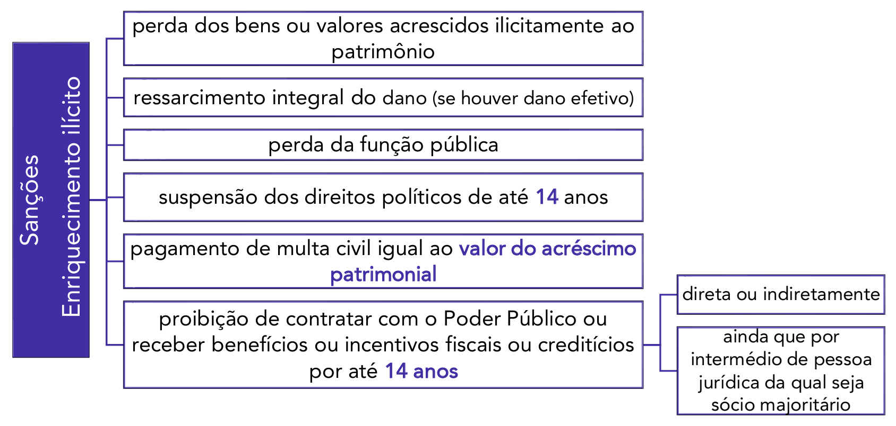

1. **Perda dos bens ou valores acrescidos ilicitamente ao patrimônio:** É o confisco do que foi obtido ilegalmente.
2. **Ressarcimento integral do dano (se houver dano efetivo):** Caso o ato, além de enriquecer o agente, também tenha gerado prejuízo ao erário.
3. **Perda da função pública:** O agente ímprobo é expulso do serviço público.
4. **Suspensão dos direitos políticos de até 14 anos.**
5. **Pagamento de multa civil igual ao valor do acréscimo patrimonial.**
6. **Proibição de contratar com o Poder Público ou receber benefícios fiscais ou creditícios por até 14 anos.**

Todas estas sanções poderão ser aplicadas de forma **isolada ou cumulada**, a depender da gravidade do fato e de outros aspectos avaliados pelo juiz. Além disso, a aplicação destas sanções (de natureza cível-administrativa) não impede a abertura de uma **ação penal** (para apurar o crime de corrupção, por exemplo) nem a aplicação de sanções administrativas (como a demissão por PAD), conforme o art. 12, _caput_.

#### Comparativo das Sanções (Antes e Depois da Lei 14.230/2021)

A reforma de 2021 alterou significativamente o rigor das punições para o art. 9º:

| **Como eram as sanções? (Antes de 2021)**           | **Como ficaram as sanções? (Após a Lei 14.230/2021)** |
| --------------------------------------------------- | ----------------------------------------------------- |
| Perda dos bens                                      | Perda dos bens                                        |
| Ressarcimento do dano (quando houver)               | Ressarcimento do dano (**se houver dano efetivo**)    |
| Perda da função pública                             | Perda da função pública                               |
| Suspensão dos direitos políticos de **8 a 10 anos** | Suspensão dos direitos políticos por **até 14 anos**  |
| Multa civil de **até 3x** o acréscimo patrimonial   | Multa civil **igual** ao acréscimo patrimonial        |
| Proibição de contratar pelo prazo de **10 anos**    | Proibição de contratar por **até 14 anos**            |

Houve um misto: a suspensão dos direitos políticos e a proibição de contratar tiveram seus prazos máximos aumentados (de 10 para 14 anos), mas a multa civil, que antes podia chegar ao triplo da vantagem, foi limitada ao valor exato do acréscimo patrimonial.

### Atos que Causam Prejuízo ao Erário (Art. 10)

Esta é a segunda categoria de atos de improbidade, focada na proteção do patrimônio público. O elemento central aqui não é o enriquecimento do agente, mas o **empobrecimento do Estado**.

Consoante previsto no _caput_ do art. 10, constitui ato de improbidade administrativa que causa lesão ao erário qualquer **ação ou omissão, sempre dolosa**, que enseje **efetiva e comprovada perda patrimonial**, desvio, apropriação, malbaratamento ou dilapidação dos bens ou haveres das entidades públicas.

#### Exigências do Dolo e do Dano Efetivo

Antes de listarmos os atos de improbidade exemplificados no art. 10, é crucial destacar o impacto da reforma da Lei 14.230/2021 sobre esta categoria:

1. **Exigência de Dolo:** Antes da reforma, esta era a **única** categoria de improbidade que admitia a modalidade **culposa** (negligência, imprudência ou imperícia). Isso foi extinto. Agora, só haverá ato de improbidade por prejuízo ao erário se a conduta do agente for **dolosa**, ou seja, se ele tiver a intenção de causar o dano.
2. **Exigência de Dano Efetivo e Comprovado:** A lei agora exige que o prejuízo seja "efetivo e comprovado". Isso extingue a tese do "dano presumido" (_in re ipsa_), que era anteriormente aceita pela jurisprudência. Não basta, por exemplo, provar que o agente dispensou indevidamente uma licitação; é preciso provar que o contrato assinado _causou um prejuízo financeiro real_ (ex: preço superfaturado) que não ocorreria se a licitação tivesse sido feita.

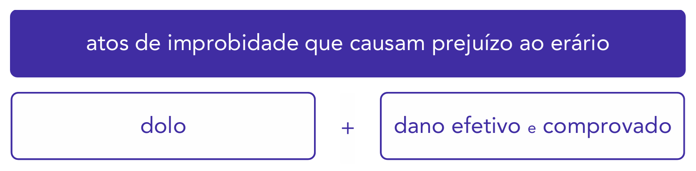

Reforçando estes dois pilares (dolo e dano efetivo), a lei trouxe duas salvaguardas importantes:

- **Mera Ilegalidade Formal (§ 1º):** A inobservância de formalidades legais (ex: a falta de uma certidão no processo de contratação) que **não implicar perda patrimonial efetiva** não será considerada improbidade para fins de ressarcimento. O objetivo é vedar o enriquecimento sem causa dos entes públicos.
- **Mera Perda Decorrente de Atividade Econômica (§ 2º):** A mera perda patrimonial decorrente de uma atividade econômica (ex: um investimento de um banco público que resulta em prejuízo) **não acarretará improbidade administrativa**, salvo se comprovado o ato doloso praticado com essa finalidade. Isso protege o gestor que toma uma decisão de risco de boa-fé, mas que acaba gerando um resultado negativo.

#### Rol Exemplificativo do Art. 10

Seguindo adiante, o rol do art. 10 permanece exemplificativo. As hipóteses mais comuns (com detalhes alterados pela Lei nº 14.230) incluem:

> - **facilitar ou concorrer**, por qualquer forma, para a indevida incorporação ao patrimônio particular, de pessoa física ou jurídica, de bens, de rendas, de verbas ou de valores integrantes do patrimônio público;
> - **permitir ou concorrer** para que pessoa privada utilize bens, rendas, verbas ou valores públicos, sem a observância das formalidades legais ou regulamentares aplicáveis;
> - **doar**, ainda que de fins educativos ou assistências, bens ou valores públicos, sem observância das formalidades legais aplicáveis;
> - **permitir ou facilitar a alienação**, permuta ou locação de bem público ou a prestação de serviço por ente público por **preço inferior ao de mercado**;
> - **permitir ou facilitar a aquisição**, permuta ou locação de bem ou serviço por **preço superior ao de mercado**;
> - **realizar operação financeira** sem observância das normas legais ou aceitar garantia insuficiente ou inidônea;
> - **conceder benefício** administrativo ou fiscal sem a observância das formalidades aplicáveis;
> - **frustrar a licitude de processo licitatório** ou de processo seletivo para celebração de parcerias com entidades sem fins lucrativos, ou dispensá-los indevidamente, acarretando **perda patrimonial efetiva**;
> - **ordenar ou permitir a realização de despesas** não autorizadas em lei ou regulamento;
> - **agir ilicitamente** na arrecadação de tributo ou renda, bem como no que diz respeito à conservação do patrimônio público;
> - **permitir, facilitar ou concorrer** para que **terceiro se enriqueça ilicitamente**;
> - **permitir que se utilize**, em obra ou serviço particular, maquinário de entidades públicas ou o trabalho de servidor público ou terceiros contratados;
> - **celebrar contrato de rateio** de consórcio público sem suficiente e prévia dotação orçamentária, ou sem observar as formalidades previstas na lei;
> - **agir para a configuração de ilícito** na celebração, na fiscalização e na análise das prestações de contas de parcerias firmadas pela administração pública com entidades privadas;
> - **facilitar a incorporação**, ao patrimônio particular de valores públicos transferidos a entidades privadas mediante parceria, sem a observância das formalidades aplicáveis;
> - **conceder, aplicar ou manter benefício** financeiro ou tributário que contrarie as regras referentes ao Imposto Sobre Serviços de Qualquer Natureza (ISSQN).

É importante não confundir o art. 9º com o art. 10, XII. No art. 9º (Enriquecimento Ilícito), o _próprio agente público_ enriquece. No art. 10, XII (Prejuízo ao Erário), o agente **facilita para que um terceiro** se enriqueça ilicitamente, causando dano aos cofres públicos (ex: um fiscal que, dolosamente, "deixa passar" uma medição superfaturada de uma obra, enriquecendo a construtora).

Com a extinção da improbidade culposa, as redações dos incisos X (arrecadação de tributo) e XIX (parcerias) foram ajustadas, excluindo a menção à "negligência" e substituindo-a pela exigência de "agir ilicitamente" ou "agir para a configuração de ilícito", reforçando a necessidade de dolo.

#### Sanções (Art. 12, II)

Nos termos do art. 12, inciso II, as sanções aplicáveis a esta categoria de improbidade administrativa são as seguintes:

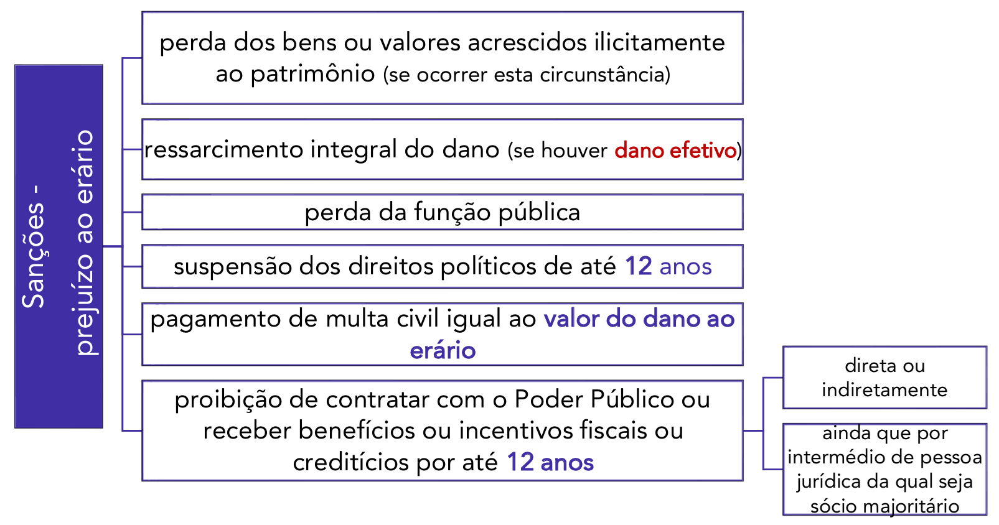

1. **Perda dos bens ou valores acrescidos ilicitamente ao patrimônio (se ocorrer esta circunstância):** Embora o foco seja o prejuízo, se o ato também gerou enriquecimento (ex: o terceiro que enriqueceu deu uma parte ao agente), esse valor é perdido.
2. **Ressarcimento integral do dano (se houver dano efetivo):** Esta é a sanção principal e obrigatória desta categoria.
3. **Perda da função pública.**
4. **Suspensão dos direitos políticos de até 12 anos.**
5. **Pagamento de multa civil igual ao valor do dano ao erário.**
6. **Proibição de contratar com o Poder Público ou receber benefícios fiscais ou creditícios por até 12 anos.**

#### Comparativo das Sanções (Antes e Depois da Lei 14.230/2021)

As sanções para o art. 10 também foram significativamente alteradas:

|**Como eram as sanções? (Antes de 2021)**|**Como ficaram as sanções? (Após a Lei 14.230/2021)**|
|---|---|
|Perda dos bens (se ocorrer)|Perda dos bens (se ocorrer) (Mantido)|
|Ressarcimento do dano|Ressarcimento do dano (se houver dano efetivo) (Mantido)|
|Perda da função pública|Perda da função pública (Mantido)|
|Suspensão dos direitos políticos de **5 a 8 anos**|Suspensão dos direitos políticos por **até 12 anos**|
|Multa civil de **até 2 vezes** o valor do dano|Multa civil **igual** ao valor do dano ao erário|
|Proibição de contratar pelo prazo de **5 anos**|Proibição de contratar por **até 12 anos**|

Assim como no art. 9º, os prazos máximos de suspensão de direitos e de proibição de contratar aumentaram (de 8 e 5 anos para 12 anos), mas a multa civil foi reduzida (de até o dobro do dano para o valor exato do dano).

### Atos que Atentam Contra os Princípios da Administração Pública (Art. 11)

Esta é a terceira categoria de improbidade, destinada a punir condutas que, embora possam não causar um prejuízo financeiro direto ou enriquecer o agente, ferem de morte os deveres éticos e legais fundamentais da Administração Pública.

Nos termos do art. 11 da LIA, constitui ato de improbidade administrativa que atenta contra os princípios da administração pública qualquer **ação ou omissão, dolosa**, que viole os deveres de **honestidade, imparcialidade e de legalidade**, por meio de uma das seguintes condutas (com os detalhes alterados pela Lei 14.230):

> - **revelar** fato ou circunstância de que tem ciência em razão das atribuições e que deva permanecer em segredo, propiciando beneficiamento por informação privilegiada ou colocando em risco a segurança da sociedade e do Estado;
> - **negar publicidade** aos atos oficiais, exceto em razão de sua imprescindibilidade para a segurança da sociedade e do Estado ou de outras hipóteses instituída sem lei;
> - **frustrar o caráter concorrencial** de concurso público, de chamamento ou de procedimento licitatório, em ofensa à imparcialidade, com vistas à obtenção de benefício;
> - **deixar de prestar contas** quando esteja obrigado a fazê-lo, desde que disponha das condições para isso, com vistas a ocultar irregularidades;
> - **revelar ou permitir** que chegue ao conhecimento de terceiro, antes da respective divulgação oficial, teor de medida política ou econômica capaz de afetar o preço de mercadoria, bem ou serviço;
> - **descumprir** as normas relativas à celebração, fiscalização e aprovação de contas de parcerias firmadas pela administração pública com entidades privadas;
> - **nepotismo** (nomear cônjuge/companheiro ou parente de até 3º grau para cargo em comissão/de confiança ou para função gratificada);
> - **promover enaltecimento** do agente público e personalização de atos, de programas, de obras, de serviços ou de campanhas dos órgãos públicos (violando o art. 37, § 1º da CF).

Como nesta categoria tivemos muitas alterações promovidas pela Lei 14.230, é igualmente importante destacar as hipóteses **revogadas**, que **deixaram de ser consideradas**, expressamente, atos de improbidade administrativa por violação de princípio:

- _deixar de cumprir a exigência de requisitos de acessibilidade previstos na legislação;_
- _transferir recurso a entidade privada, em razão da prestação de serviços na área de saúde sem a prévia celebração de contrato, convênio ou instrumento congênere;_
- _praticar ato visando fim proibido em lei ou regulamento ou diverso daquele previsto, na regra de competência;_ (Esta era a conduta conhecida como "desvio de finalidade").
- _retardar ou deixar de praticar, indevidamente, ato de ofício._ (Esta era a conduta que punia a "gaveta", a omissão e a procrastinação do agente).

#### Principais Alterações da Reforma de 2021 no Art. 11

As alterações no art. 11 não pararam por aí. As mudanças a seguir são de extrema relevância:

1. **Rol Taxativo (e não mais exemplificativo)**: Tem-se entendido que este rol de hipóteses deixou de ser exemplificativo, passando a ser taxativo. A principal evidência dessa mudança foi a alteração do _caput_ do artigo, que suprimiu a palavra "notadamente":

|**Como era? (Antes de 2021)**|**Como ficou? (Após a Lei 14.230/2021)**|
|---|---|
|Constitui ato de improbidade administrativa que atenta contra os princípios da administração pública a ação ou omissão que viole os deveres de honestidade, imparcialidade, legalidade, e lealdade às instituições, e **notadamente**:|Constitui vato de improbidade administrativa que atenta contra os princípios da administração pública a ação ou omissão **dolosa** que viole os deveres de honestidade, de imparcialidade e de legalidade, **caracterizada por uma das seguintes condutas**:|

2. **Supressão do Dever de Lealdade:** O dever de "lealdade às instituições", que era mencionado na redação anterior do art. 11, caput, foi excluído, passando a constar, expressamente, apenas os deveres de honestidade, imparcialidade e de legalidade como norteadores desta categoria.

3. **Exigência de Lesividade Relevante (Princípio da Insignificância):** O legislador deixou claro que só é ato de improbidade aquela conduta dolosa que seja relevante do ponto de vista jurídico, ou seja, que cause uma lesão significativa ao bem jurídico protegido (art. 11, § 4º). Isso parece significar a aplicação do princípio da insignificância aos atos de improbidade violadores de princípio. Em outras palavras, além de a conduta se enquadrar formalmente no rol taxativo do art. 11, é necessário que, materialmente, ela seja reprovável de modo significativo.
	- **Exemplo:** Se o agente público revelou um fato de que teve ciência em razão do cargo e que deveria permanecer em segredo (art. 11, I), mas o "segredo" divulgado não tinha qualquer importância real para a Administração ou para o mercado, em tese seria possível afastar a improbidade por ausência de lesividade relevante.

4. **Exigência de Demonstração da Ilegalidade** A caracterização do ato de improbidade, nesta categoria, requer a demonstração objetiva da prática de ilegalidade no exercício da função pública, com a indicação da norma jurídica específica que foi violada (art. 11, § 3º). Em nome da segurança jurídica, a acusação não pode ser genérica; ela deve indicar claramente qual lei, decreto ou regulamento foi violado, além de comprovar o dolo do agente em fazê-lo.

Diferentemente das categorias anteriores (arts. 9º e 10), o **enriquecimento ilícito** do agente ou a **produção de prejuízo** aos cofres públicos são **irrelevantes** para a caracterização dos atos violadores de princípios (art. 11, § 3º). O foco aqui é a violação do dever em si.

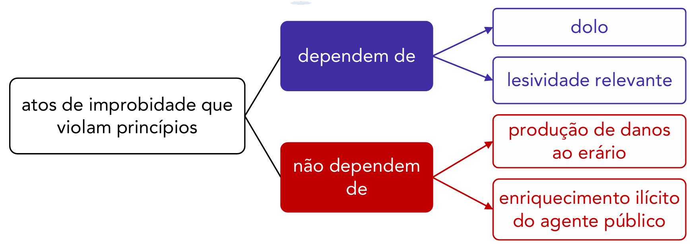

Aprofundando a análise das condutas listadas no rol do art. 11:

#### Nepotismo (Art. 11, XI)

Em tese, se alguém é designado para ocupar um cargo puramente em razão dos laços de parentesco que possui com uma autoridade pública, há uma ofensa clara a princípios basilares da Administração Pública, como o da moralidade, da impessoalidade e da eficiência.

Nesse sentido, o STF já havia editado a **Súmula Vinculante nº 13**:

> A nomeação de cônjuge, companheiro ou parente em linha reta, colateral ou por afinidade, até o terceiro grau, inclusive, da autoridade nomeante ou de servidor da mesma pessoa jurídica investido em cargo de direção, chefia ou assessoramento, para o exercício de cargo em comissão ou de confiança ou, ainda, de função gratificada na administração pública direta e indireta em qualquer dos poderes da União, dos Estados, do Distrito Federal e dos Municípios, compreendido o ajuste mediante designações recíprocas, viola a Constituição Federal.

A Súmula Vinculante já consolidava a **ilegalidade** da prática do nepotismo. O que a Lei 14.230/2021 fez foi transformar essa conduta, que já era ilegal, em um ato de **improbidade** expresso, inserindo o inciso XI no rol do art. 11:

> **Art. 11, XI -** nomear cônjuge, companheiro ou parente em linha reta, colateral ou por afinidade, até o terceiro grau, inclusive, da autoridade nomeante ou de servidor da mesma pessoa jurídica investido em cargo de direção, chefia ou assessoramento, para o exercício de cargo em comissão ou de confiança ou, ainda, de função gratificada na administração pública direta e indireta em qualquer dos Poderes da União, dos Estados, do Distrito Federal e dos Municípios, compreendido o ajuste mediante designações recíprocas;

Reparem que, de forma idêntica à Súmula Vinculante 13, o nepotismo positivado na Lei de Improbidade:

- alcança todos os Poderes (Executivo, Legislativo e Judiciário) e todas as esferas de governo (municipal, federal, estadual ou distrital);
- estende-se pela administração direta e por toda a administração indireta;
- tem como objeto as nomeações para cargos em comissão (CC), bem como as designações para funções de confiança (FC);
- alcança cônjuge/companheiro e parentesco de até o 3º grau da autoridade/servidor nomeante;
- abrange o **nepotismo cruzado**, que ocorre "mediante designações recíprocas" (uma autoridade nomeia o parente de outra, e vice-versa, como troca de favores).

Contudo, inspirado na jurisprudência do próprio STF (que diferencia a nomeação para cargos técnicos da nomeação para cargos políticos), o legislador da reforma de 2021 deixou claro que a mera indicação ou nomeação política, por parte dos detentores de mandatos eletivos, **não caracteriza, por si só, ato de improbidade**. Para isso, é necessária a aferição de **dolo com finalidade ilícita** por parte do agente (art. 11, § 5º).

Portanto, a nomeação de um parente (que já é ilegal pela SV 13 e deve ser anulada) só se transformará em ato de improbidade se o Ministério Público comprovar o dolo específico do agente em fraudar a lei ou obter vantagem indevida com o ato.

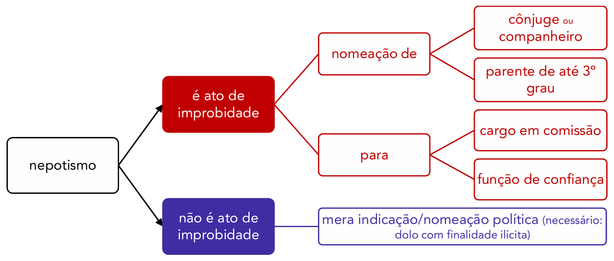

#### Fraude à Licitação e Concurso Público (Art. 11, V)

A reforma de 2021 trouxe uma importante distinção no tratamento das fraudes a certames:

1. **Concurso Público:** Frustrar o caráter concorrencial de concurso público (art. 11, V), em ofensa à imparcialidade, é sempre um ato de improbidade na modalidade **violação a princípio** (categoria menos grave).
2. **Licitação:** Se a frustração se der em relação a uma licitação pública, o enquadramento vai depender da existência, ou não, de **efetivo prejuízo aos cofres públicos**.
    - **Com perda patrimonial efetiva:** A conduta é considerada mais grave e será enquadrada como **prejuízo ao erário** (Art. 10, VIII).
    - **Sem perda patrimonial efetiva:** Se a fraude à licitação não resultar em dano financeiro comprovado (ex: a empresa vencedora praticou o preço de mercado), a conduta se amolda à categoria de **violação a princípio** (Art. 11, V).

Isso significa que não há mais presunção de que a licitação ilegal resulta, necessariamente, em contratações antieconômicas ao erário. O dano deve ser provado.

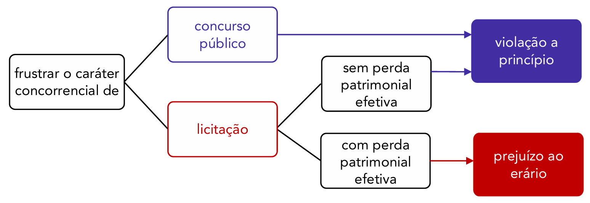

#### Deixar de Prestar Contas (Art. 11, VI)

Considerando que a prestação de contas é um dos pilares do sistema republicano, o legislador previu que aquele que deixa de prestar contas quando estiver obrigado a fazê-lo estará cometendo ato de improbidade (art. 11, VI).

A novidade inserida pela Lei 14.230/2021 é o estabelecimento de **dois requisitos cumulativos** para a caracterização deste ato de improbidade. A partir de agora, deixar de prestar contas só é considerado ato de improbidade se ficar comprovado que:

1. O agente **dispunha das condições** para apresentar as contas (ou seja, não estava objetivamente impossibilitado); e
2. O agente tinha por **objetivo (dolo específico) ocultar irregularidades**.

#### Sanções (Art. 12, III)

Em todos estes casos de violação a princípios (art. 11), o agente estará sujeito às sanções previstas no inciso III do art. 12, as quais podem ser aplicadas isolada ou cumulativamente:

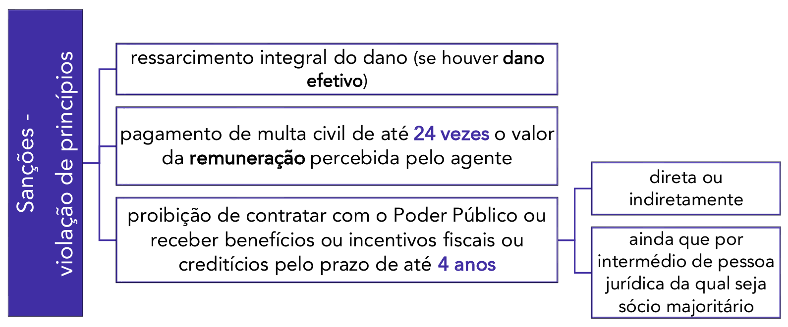

1. **Ressarcimento integral do dano (se houver dano efetivo):** Embora o ato do art. 11 não exija dano, se ele ocorrer, deve ser reparado.
2. **Pagamento de multa civil de até 24 (vinte e quatro) vezes o valor da remuneração percebida pelo agente.**
3. **Proibição de contratar com o Poder Público ou receber benefícios fiscais ou creditícios pelo prazo de até 4 (quatro) anos.**

##### Comparativo das Sanções (Antes e Depois da Lei 14.230/2021)

Se compararmos com as sanções aplicáveis antes da Lei 14.230/2021, concluiremos que as sanções para esta categoria foram **significativamente amenizadas**. A reforma buscou punir com maior rigor quem causa dano (art. 10) ou enriquece (art. 9º) e abrandar a pena para a violação "pura" de princípios:

|**Como eram as sanções? (Antes de 2021)**|**Como ficaram as sanções? (Após a Lei 14.230/2021)**|
|---|---|
|Ressarcimento do dano (quando houver)|Ressarcimento do dano (se houver dano efetivo)|
|**Perda da função pública**|**(Sanção EXCLUÍDA)**|
|**Suspensão dos direitos políticos de 3 a 5 anos**|**(Sanção EXCLUÍDA)**|
|Multa civil de **até 100 vezes** a remuneração|Multa civil de **até 24 vezes** a remuneração|
|Proibição de contratar pelo prazo de **3 anos**|Proibição de contratar por **até 4 anos**|

A exclusão da perda da função pública e da suspensão dos direitos políticos para os atos do art. 11 foi uma das mudanças mais drásticas e debatidas da reforma de 2021.

### Resumo Comparativo

Após a análise individual de cada categoria de ato de improbidade e suas respectivas sanções, é fundamental consolidar essas informações em um quadro comparativo. Esta visualização facilita a compreensão da gradação das penalidades estabelecida pelo legislador, que se torna mais severa à medida que a conduta avança do mero desrespeito aos princípios (Art. 11) para o dano patrimonial (Art. 10) e, no ápice da gravidade, o enriquecimento ilícito do agente (Art. 9º).

A tabela a seguir resume o regime sancionatório pós-Lei nº 14.230/2021:

|**Enriquecimento ilícito (Art. 9º)**|**Prejuízo ao erário (Art. 10)**|**Violação a princípio (Art. 11)**|
|---|---|---|
|**Perda dos bens** acrescidos ilicitamente|Perda dos bens acrescidos ilicitamente (se ocorrer esta circunstância)|-|
|Ressarcimento integral do dano (se houver dano efetivo)|**Ressarcimento integral do dano** (se houver dano efetivo)|Ressarcimento integral do dano (se houver dano efetivo)|
|**Perda da função pública**|**Perda da função pública**|-|
|**Suspensão dos direitos políticos** de **até 14 anos**|**Suspensão dos direitos políticos** de **até 12 anos**|-|
|**Multa civil igual** ao **acréscimo patrimonial**|**Multa civil igual** ao **dano ao erário**|**Multa civil** de **até 24 vezes a remuneração** do agente|
|**Proibição de contratar** com Poder Público ou receber benefícios por **até 14 anos**|**Proibição de contratar** com o Poder Público ou receber benefícios por **até 12 anos**|Proibição de contratar com o Poder Público ou receber benefícios por **até 4 anos**|

Uma observação adicional sobre a multa civil, prevista no §2º do art. 12: o juiz poderá, em decisão fundamentada, **aumentar a multa até o dobro** do valor-base (o dobro do acréscimo patrimonial, do dano ou do limite de 24 remunerações), caso entenda que, em razão da situação econômica do réu, o valor-base é ineficaz para a reprovação e prevenção do ato de improbidade.

Tão essencial quanto comparar as sanções é saber diferenciar as condutas que pertencem a cada categoria. O enquadramento correto do ato é o que definirá todo o regime sancionatório aplicável. A tabela a seguir compila os róis (exemplificativos para os arts. 9º e 10, e taxativo para o art. 11) de cada categoria de improbidade.

| Ato de Improbidade                   | Descrição                                                                                                                                                                                                                                                                                                                                                                                                                                                                                                                                                                                                                                                                                                                                                                                                                                                                                                                                                                                                                                                                                                                                                                                                                                                                                                                                                                                                                                                                                                                                                                                                                                                                                                                                                                                                                                                                                                                                                                   |
| ------------------------------------ | --------------------------------------------------------------------------------------------------------------------------------------------------------------------------------------------------------------------------------------------------------------------------------------------------------------------------------------------------------------------------------------------------------------------------------------------------------------------------------------------------------------------------------------------------------------------------------------------------------------------------------------------------------------------------------------------------------------------------------------------------------------------------------------------------------------------------------------------------------------------------------------------------------------------------------------------------------------------------------------------------------------------------------------------------------------------------------------------------------------------------------------------------------------------------------------------------------------------------------------------------------------------------------------------------------------------------------------------------------------------------------------------------------------------------------------------------------------------------------------------------------------------------------------------------------------------------------------------------------------------------------------------------------------------------------------------------------------------------------------------------------------------------------------------------------------------------------------------------------------------------------------------------------------------------------------------------------------------------- |
| **Enriquecimento ilícito (Art. 9º)** | • receber vantagem patrimonial indevida de quem tem interesse na atividade exercida pelo agente público; • perceber vantagem econômica para facilitar a aquisição ou locação por preço superior ao valor de mercado; • perceber vantagem econômica para facilitar a alienação, o fornecimento ou locação de bem público por preço inferior ao valor de mercado; • utilizar em proveito próprio, em obra ou serviço particular, qualquer bem móvel do poder público, bem como o trabalho de servidores públicos ou terceirizados por elas contratados; • receber vantagem econômica de qualquer natureza, direta ou indireta, para tolerar prática de qualquer atividade ilícita, como jogos de azar, narcotráfico e contrabando; • receber vantagem econômica para fazer declaração falsa sobre qualquer dado técnico de obra pública ou serviços contratados pelo poder público, como medição, quantidade, peso, medida e qualidade; • adquirir bens de valor desproporcional à evolução do patrimônio do agente público (assegurada a demonstração da licitude da origem dessa evolução); • aceitar emprego ou consultoria para pessoa que tenha interesse na atividade do agente público; • perceber vantagem econômica para intermediar a liberação de verba pública; • receber vantagem econômica para omitir ato de ofício; • incorporar ao seu patrimônio bens ou valores do patrimônio público; • usar, em proveito próprio, bens ou valores do patrimônio público.                                                                                                                                                                                                                                                                                                                                                                                                                                                                |
| **Prejuízo ao erário (Art. 10)**     | • facilitar a indevida incorporação ao patrimônio particular de bens ou valores públicos; • permitir que pessoa privada utilize bens públicos sem a observância das form. legais; • doar, ainda que de fins educativos ou assistências, bens ou valores públicos, sem observância das formalidades legais aplicáveis; • permitir a alienação, permuta ou locação de bem público ou a prestação de serviço por ente público por preço inferior ao de mercado; • permitir a aquisição de bem ou serviço por preço superior ao de mercado; • realizar operação financeira sem observância das normas legais ou aceitar garantia insuficiente ou inidônea; • conceder benefício administrativo ou fiscal sem a observância das formalidades aplicáveis; • frustrar a licitude de processo licitatório ou de processo seletivo para celebração de parcerias com entidades sem fins lucrativos, ou dispensá-los indevidamente, acarretando perda patrimonial efetiva; • ordenar ou permitir a realização de despesas não autorizadas em lei ou regulamento; • agir ilicitamente na arrecadação de tributo ou na conservação do patrimônio público; • permitir que terceiro se enriqueça ilicitamente; • permitir que se utilize, em obra ou serviço particular, maquinário de entidades públicas ou o trabalho de servidor público; • celebrar contrato de rateio de consórcio público sem suficiente dotação orçamentária; • agir para a configuração de ilícito na celebração, na fiscalização e na análise das prestações de contas de parcerias firmadas pela administração pública com entidades privada; • facilitar a incorporação, ao patrimônio particular de valores públicos transferidos a entidades privadas mediante parceria, sem a observância das formalidades aplicáveis; • conceder benefício financeiro ou tributário que contrarie as regras referentes ao Imposto Sobre Serviços de Qualquer Natureza (ISSQN). |
| **Violação a princípio (Art. 11)**   | • revelar fato ou circunstância de que tem ciência em razão das atribuições e que deva permanecer em segredo, propiciando beneficiamento por informação privilegiada ou colocando em risco a segurança da sociedade e do Estado; • negar publicidade aos atos oficiais, exceto em razão de sua imprescindibilidade para a segurança da sociedade e do Estado ou de outras hipóteses instituídas em lei; • frustrar o caráter concorrencial de concurso público, de chamamento ou de procedimento licitatório, em ofensa à imparcialidade, com vistas à obtenção de benefício; • deixar de prestar contas quando esteja obrigado a fazê-lo, desde que disponha das condições para isso, com vistas a ocultar irregularidades; • revelar ou permitir que chegue ao conhecimento de terceiro, antes da respectiva divulgação oficial, teor de medida política ou econômica capaz de afetar o preço de mercadoria, bem ou serviço; • descumprir as normas relativas à celebração, fiscalização e aprovação de contas de parcerias firmadas pela administração pública com entidades privadas; • nepotismo (nomear cônjuge/companheiro ou parente de até 3º grau para cargo em comissão/de confiança ou para função gratificada); • promover enaltecimento do agente público e personalização de atos, de programas, de obras, de serviços ou de campanhas dos órgãos públicos (CF, art. 37, §1º).                                                                                                                                                                                                                                                                                                                                                                                                                                                                                                                                                          |

## Disposições Gerais da Lei de Improbidade Administrativa

Uma vez estudadas as três categorias de atos de improbidade previstas na LIA, os principais casos expressos na Lei e as sanções aplicáveis, passemos ao estudo de quem são os atores envolvidos nesse cenário.

Comentaremos, neste tópico, quem sofre as consequências danosas dos atos de improbidade (sujeitos passivos) e quem pode ser considerado autor de atos de improbidade, sujeitando-se às sanções da lei (sujeitos ativos).

### Sujeitos Passivos

Os **sujeitos passivos** dos atos de improbidade administrativa consistem justamente nas **vítimas** diretas destes atos, ou seja, são os órgãos e entidades cujo patrimônio (financeiro ou moral) pode ser diretamente lesado pelas condutas ilícitas.

O art. 1º, §§ 5º a 7º, da LIA prevê um rol amplo de sujeitos passivos:

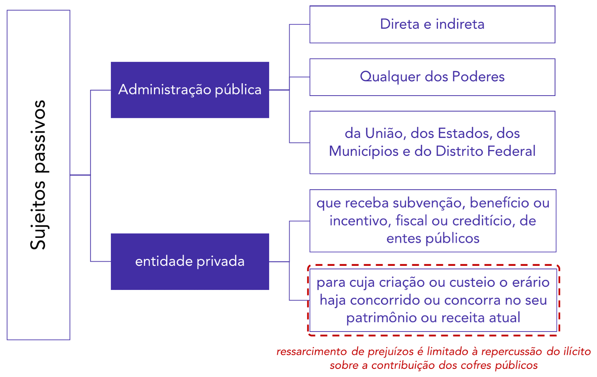

Reparem que existem sujeitos passivos que são:

a) Entes da Administração Pública; ou
b) Entes privados com vínculo com o poder público.

#### Entes da Administração Pública

No que se refere aos entes da Administração Pública, a LIA alcança a totalidade da estrutura estatal, em todas as suas facetas. Estão incluídos:

- **Todos os Poderes:** Executivo, Legislativo e Judiciário (e também o Ministério Público e Tribunais de Contas).
- **Todas as Esferas:** A lei é nacional, aplicando-se à União, aos Estados, ao Distrito Federal e aos Municípios.
- **Toda a Administração:** Inclui todos os órgãos da **administração direta** (Ministérios, Secretarias) e todas as entidades da **administração indireta**, sejam elas de direito público (Autarquias e Fundações Públicas) ou de direito privado (Empresas Públicas e Sociedades de Economia Mista).

#### Entes Privados que Gerenciam Recursos Públicos

A lei entende que o ato de improbidade não se resume a lesar o patrimônio "estatal", mas sim o patrimônio "público". Portanto, se um ente privado recebe ou gerencia dinheiro público, ele também pode ser vítima de improbidade.

Estão incluídos os particulares que (i) recebam subvenção, benefício ou incentivo, fiscal ou creditício, de entes públicos (art. 1º, § 6º) e também aqueles para os quais (ii) o poder público contribuiu para sua criação ou seu custeio (art. 1º, § 7º).

- **Exemplos (Art. 1º, § 6º):** Um frigorífico que recebeu um incentivo creditício subsidiado do BNDES; uma empresa que recebe um benefício fiscal (isenção de impostos) para se instalar em determinada região.
- **Exemplos (Art. 1º, § 7º):** Consoante leciona Maria Sylvia Zanella Di Pietro, podem ser incluídos nestas categorias os **Serviços Sociais Autônomos** (o "Sistema S", como Sesi, Senai, Sesc), as **Organizações Sociais (OS)** e as **Organizações da Sociedade Civil (OSC)**, que recebem recursos públicos por meio de contratos de gestão ou termos de parceria.

Neste último caso (entes para cuja criação ou custeio o erário concorreu), o legislador traçou uma limitação importante: a sanção de **ressarcimento de prejuízos** limita-se à repercussão do ilícito sobre a **contribuição dos cofres públicos** (art. 1º, § 7º). Ou seja, a LIA protege a parcela de dinheiro público envolvida.

#### Alterações da Lei 14.230/2021 nos Sujeitos Passivos

A reforma de 2021 trouxe duas mudanças importantes:

1. **Irrelevância do Percentual:** Antes da reforma, a lei fazia uma distinção complexa baseada no percentual de contribuição do poder público (se era mais ou menos de 50% da receita ou patrimônio). Isso foi **revogado**. Agora, havendo _qualquer_ contribuição do poder público, a entidade privada já se enquadra como sujeito passivo, independentemente do percentual.
2. **Exclusão das "Empresas Incorporadas":** A redação anterior incluía expressamente "empresas incorporadas ao patrimônio público". Esta menção foi suprimida pela Lei 14.230/2021.

#### Partidos Políticos como Sujeitos Passivos

A Lei 14.230/2021 tentou, por meio do art. 23-C, excluir expressamente os partidos políticos e suas fundações da aplicação da LIA, determinando que eles responderiam apenas pela Lei dos Partidos Políticos.

Contudo, em dezembro de 2022, o **Supremo Tribunal Federal (STF)**, na **ADI 7236**, deu interpretação conforme a Constituição a este artigo. O STF decidiu que os atos de improbidade praticados contra partidos políticos (que gerenciam o fundo partidário, um recurso público) poderão ser responsabilizados nos termos da Lei dos Partidos Políticos, **sem prejuízo** da plena incidência da Lei de Improbidade Administrativa.

### Sujeitos Ativos

Os **sujeitos ativos** são aquelas pessoas que podem praticar os atos de improbidade previstos na LIA e, assim, estarão sujeitas às suas penalidades.

Como regra geral, as normas da Lei de Improbidade são dirigidas aos **"agentes públicos"**, que são considerados os "sujeitos ativos próprios".

Mas, além destes, também estarão sujeitos às sanções por improbidade os **particulares** (também chamados de "terceiros" ou de "sujeitos ativos impróprios"), desde que tenham participado da prática do ato, de maneira **dolosa**, de duas formas (art. 3º):

1. **Induzindo** o agente público ao seu cometimento; ou
2. **Concorrendo** com ele para sua prática.

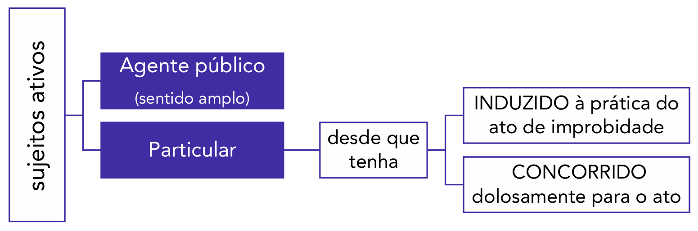

Dentro deste tópico, foram três as mudanças centrais promovidas pela Lei 14.230/2021:

1. Foi excluída a possibilidade de o terceiro ser considerado sujeito ativo pelo simples fato de ter se **beneficiado** do ato. A lei agora exige uma ação positiva: induzir ou concorrer.
2. Mencionou-se, expressamente, a necessidade de sua **contribuição dolosa** para o ato de improbidade, alinhando o particular à exigência de dolo agora imposta ao agente público.
3. O legislador equiparou a agente público o particular que celebra convênio com a administração pública (art. 2º, parágrafo único), sujeitando-o diretamente às sanções, como detalharemos.

#### Agente Público (Sujeito Ativo Próprio)

Quanto ao conceito de “agente público” adotado pela LIA, destaca-se que é bastante ampla a definição contida no art. 2º da LIA, alcançando até mesmo situações em que a pessoa age transitoriamente em nome do Estado ou sem remuneração.

> **Lei 8.429/1992, art. 2º.** Para os efeitos desta Lei, consideram-se agente público o agente político, o servidor público e todo aquele que exerce, ainda que transitoriamente ou sem remuneração, por eleição, nomeação, designação, contratação ou qualquer outra forma de investidura ou vínculo, mandato, cargo, emprego ou função nas entidades referidas no art. 1º desta Lei.

Este conceito pode ser sintetizado da seguinte forma:

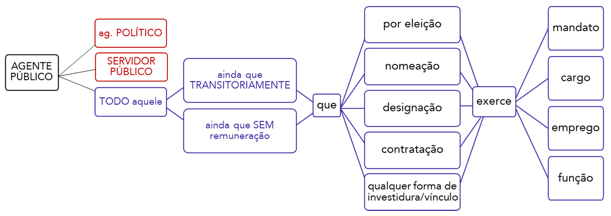

Nota-se que, para os fins de improbidade administrativa, foram enquadradas como “agentes públicos” as mais variadas espécies de agentes estatais, como:

- **agentes políticos:** parlamentares, chefes do Executivo, Ministros e Secretários;
- **servidores públicos:** regidos por estatuto ou vínculo especial;
- **empregados públicos:** com vínculo empregatício (CLT) com o Estado;
- **militares:** das Forças Armadas ou dos Estados;
- **magistrados e membros do Ministério Público:** juízes, desembargadores, promotores, Procuradores, conselheiros e ministros de Tribunais de Contas;
- **particulares em colaboração:** mesários de eleições, jurados, tabeliães, etc.

O conceito de “agente público” da LIA é tão amplo que, segundo a jurisprudência, alcança até mesmo o **estagiário** de uma repartição pública, seja ele remunerado ou não, que praticar dolosamente um ato de improbidade.

##### Equiparação do Particular (Art. 2º, Parágrafo Único)

Seguindo a jurisprudência do STJ, a Lei 14.230/2021 deixou claro que se sujeita às sanções da Lei de Improbidade, **equiparado a agente público**, o particular (pessoa física ou jurídica) que gerencie recursos de origem pública ao celebrar com a Administração Pública **convênio, contrato de repasse, contrato de gestão, termo de parceria, termo de cooperação ou ajuste administrativo equivalente** (art. 2º, parágrafo único).

- **Exemplo:** Se a entidade privada "ONG da cultura mineira do triângulo" e seu dirigente Antonio praticarem atos de improbidade (como desviar) com recursos recebidos do poder público por meio de um "convênio", eles serão processados e punidos diretamente, como se "agentes públicos" fossem, para os fins da LIA.

##### Agentes Políticos e o Duplo Regime Sancionatório

Especificamente quanto aos agentes políticos, é importante destacar o entendimento jurisprudencial majoritário (STF, Tema 576 de Repercussão Geral) no sentido de que, com exceção do **Presidente da República** (que por seus atos responde apenas por crime de responsabilidade perante o Senado Federal), **todos os demais agentes políticos** estão sujeitos à responsabilização pelos atos de improbidade administrativa.

Isto porque, salvo a exceção do Presidente, os agentes políticos estão sujeitos a um **duplo regime sancionatório**:

1. Respondem pela LIA (Lei 8.429/1992) em relação aos atos de improbidade (ação civil); e
2. Respondem pelas leis específicas relativamente aos crimes de responsabilidade (ação de natureza político-penal).

Os Ministros de Estado, por exemplo, sujeitam-se às sanções da LIA e, cumulativamente, às regras da Lei 1.079/1950 (Lei do Impeachment). Da mesma maneira os prefeitos, que se sujeitam às regras da LIA e, também, às sanções do Decreto-Lei 201/1967 (responsabilidade de prefeitos e vereadores).

#### Particular (Sujeito Ativo Impróprio)

Tratando-se do particular (aquele não equiparado a agente público), vale destacar que a Lei exige sua atuação dolosa no sentido de (i) **induzir** o cometimento do ato de improbidade ou (ii) **concorrer dolosamente** para o ato. A Lei 14.230/2021, como visto, excluiu a possibilidade de enquadramento do particular pelo simples fato de ter se _beneficiado_ passivamente.

De qualquer forma, é importante notar que o particular não será considerado, de maneira isolada, sujeito ativo do ato de improbidade administrativa. Ele só responde nos termos da LIA se tiver atuado **conjuntamente** com um agente público. O particular, sozinho, não comete ato de improbidade.

Por este motivo, o STJ (Superior Tribunal de Justiça) possui entendimento consolidado (Tema 105) de que:

> É inviável a propositura de ação civil de improbidade administrativa exclusivamente contra o particular, sem a concomitante presença de agente público na ação.

Detalhe importante é que o particular responde pelo mesmo ato de improbidade que o agente público. Assim, se o agente público está respondendo por ato de prejuízo ao erário (art. 10), o particular que concorreu dolosamente para o ato responderá com base nas sanções do art. 10.

##### Relação com a Lei Anticorrupção (Pessoas Jurídicas)

Embora a pessoa jurídica privada possa receber sanções da Lei de Improbidade (enquanto terceiro que induziu ou concorreu dolosamente para o ato), a reforma de 2021 buscou afastar o **_bis in idem_** (dupla punição pelo mesmo fato) com a Lei Anticorrupção (Lei nº 12.846/2013).

A Lei Anticorrupção também pune pessoas jurídicas por atos de corrupção, mas o faz na esfera administrativa (com multas pesadas), enquanto a LIA atua na esfera judicial. Para resolver esse conflito, a LIA agora prevê que, caso o ato de improbidade administrativa seja **também** sancionado com base na Lei Anticorrupção, as sanções da Lei de Improbidade (LIA) **não serão aplicadas** àquela pessoa jurídica (art. 3º, § 2º).

#### Síntese dos Sujeitos Ativos

Portanto, sintetizando os principais pontos comentados a respeito dos arts. 2º e 3º, temos o seguinte diagrama:

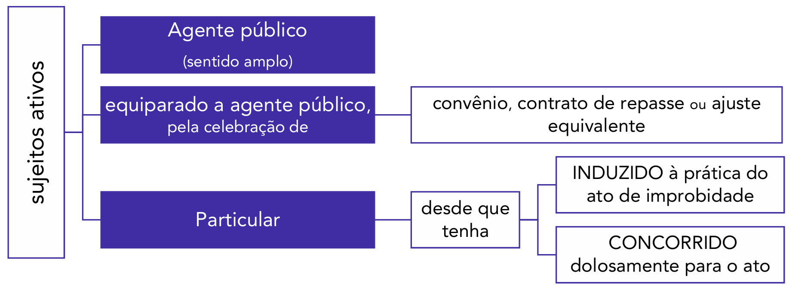

### Sanções

Neste tópico, estudaremos, de modo mais detalhado, as sanções decorrentes de atos de improbidade administrativa. Abordaremos algumas de suas características, a exemplo da natureza destas sanções, a competência para aplicação e a fixação das penas.

#### Natureza das Sanções

A própria Constituição Federal, em seu art. 37, § 4º, mencionou quatro sanções que poderiam ser aplicáveis aos atos de improbidade administrativa (ressarcimento ao erário, indisponibilidade dos bens, suspensão dos direitos políticos e perda da função pública).

A LIA, a seu turno, ao cominar as penalidades aplicáveis a cada categoria (como multa civil e proibição de contratar), acabou prevendo sanções não mencionadas expressamente no texto constitucional. A doutrina em geral considera que a lista de sanções do texto constitucional constitui uma "lista mínima", de sorte que não haveria óbices à criação, por parte do legislador ordinário, de novas sanções de natureza cível-administrativa.

Nesse sentido, a Lei de Improbidade Administrativa (LIA) prevê sanções de três naturezas distintas:

- **Política:** Suspensão dos direitos políticos.
- **Administrativa:** Perda da função pública e proibição de contratar com o poder público e de receber benefícios fiscais/creditícios.
- **Civil:** Ressarcimento ao erário, multa civil e perda dos bens e valores acrescidos ilicitamente ao patrimônio.

Reparem que, para os atos de improbidade (arts. 9º, 10 e 11), **não foram cominadas sanções de natureza penal** (como uma pena de reclusão ou detenção). A ação de improbidade é uma ação de natureza cível.

Contudo, caso o ato praticado (ex: receber propina) também esteja capitulado, em outra lei, como crime (ex: corrupção passiva), o agente estará sujeito a responder criminalmente por ele, por meio de outro processo, de natureza criminal, em virtude da independência de instâncias. Nesse sentido, a própria Constituição Federal já ressalva a possibilidade de o agente responder pela "ação penal cabível" (CF, art. 37, § 4º).

O **único crime** previsto _dentro_ da LIA é o de **denúncia caluniosa** (art. 19). Isto é, aquela pessoa que dá início a uma ação de improbidade sabendo que o denunciado é inocente.

> LIA, art. 19. Constitui crime a representação por ato de improbidade contra agente público ou terceiro beneficiário, quando o autor da denúncia o sabe inocente.
> 
> Pena: detenção de seis a dez meses e multa.
> 
> Parágrafo único. Além da sanção penal, o denunciante está sujeito a indenizar o denunciado pelos danos materiais, morais ou à imagem que houver provocado.

#### Competência para Aplicação das Sanções da LIA

Um ponto fundamental da LIA é que a aplicação das sanções nela previstas (perda da função pública, suspensão de direitos políticos, multa civil, etc.) é de **competência exclusiva do Poder Judiciário**.

As sanções da LIA **não podem ser aplicadas por uma autoridade administrativa** no bojo de um processo administrativo (PAD). Elas somente podem ser impostas por um magistrado (juiz, desembargador ou ministro) ao final do devido **processo judicial** (a Ação Civil Pública por Ato de Improbidade Administrativa).

#### Fixação das Penas (Dosimetria)

Nos termos do _caput_ do art. 21, em regra, a aplicação das penalidades previstas na LIA **não depende da ocorrência de prejuízo patrimonial** aos cofres públicos.

Esta regra, no entanto, comporta duas exceções lógicas:

1. A condenação por atos da categoria de **prejuízo ao erário (Art. 10)**, que, pela sua própria definição pós-reforma, agora exige a comprovação de efetivo prejuízo. Se não houver dano comprovado, o fato é atípico para o art. 10.
2. A condenação específica ao **ressarcimento ao erário** nas demais categorias (Arts. 9º e 11). Embora seja possível a aplicação de _outras_ sanções (como multa ou perda da função) mesmo sem dano, a sanção de "ressarcir" só pode ser aplicada se, de fato, houver algo a ser ressarcido.

##### Independência dos Órgãos de Controle

As sanções da LIA não estão vinculadas à aprovação ou rejeição das contas dos responsáveis, por parte do respectivo Tribunal de Contas (órgão de controle externo) ou da Controladoria (órgão de controle interno).

Portanto, em tese, determinado gestor que teve suas contas devidamente **aprovadas** pelo Tribunal de Contas **pode, ainda assim, ser condenado** pelas penalidades previstas na LIA em uma ação judicial, pois as instâncias são independentes.

No entanto, a reforma de 2021 buscou criar uma maior harmonia entre os sistemas, determinando que o juiz deve levar em consideração as decisões e provas dos órgãos de controle:

- Os atos do órgão de controle serão considerados pelo juiz quando tiverem servido de **fundamento para a conduta** do agente público (art. 21, § 1º). (Ex: O gestor agiu com base em um parecer do Tribunal de Contas).
- As provas produzidas perante os órgãos de controle e as correspondentes decisões deverão ser **consideradas na formação da convicção do juiz**, sem prejuízo da análise sobre o dolo na conduta do agente (art. 21, § 2º).

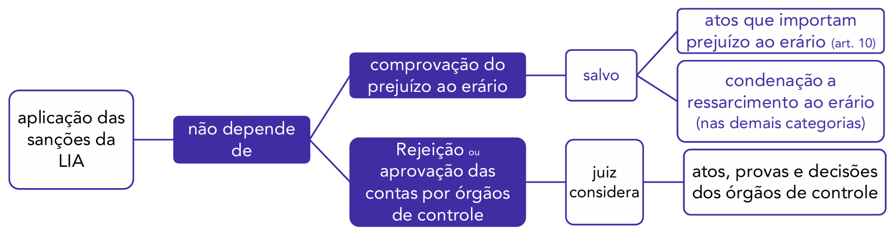

##### Critérios de Dosimetria

Quanto à fixação das penas, o juiz observará uma série de circunstâncias para definir o "tamanho" da sanção (dentro dos limites legais de cada artigo), como a **gravidade do fato** (art. 12, _caput_), a **extensão do dano** causado, o **proveito patrimonial** e os **antecedentes** do agente infrator (art. 17-C, IV).

Além disso, em uma ideia consequencialista e considerando o princípio da função social da empresa, a LIA (pós-reforma) passou a prever que, na responsabilização da **pessoa jurídica**, deverão ser considerados os **efeitos econômicos e sociais das sanções**, de modo a viabilizar a manutenção de suas atividades (art. 12, § 3º).

#### Responsabilidade dos Sucessores

Sabemos que, de acordo com as atuais regras constitucionais, as sanções, em regra, não podem passar da pessoa do condenado (Princípio da Intranscendência da Pena).

No entanto, a própria Constituição abre uma exceção para as sanções de natureza patrimonial:

> **CF, art. 5º, XLV -** nenhuma pena passará da pessoa do condenado, podendo a **obrigação de reparar o dano** e a decretação do **perdimento de bens** ser, nos termos da lei, estendidas aos sucessores e contra eles executadas, **até o limite do valor do patrimônio transferido**;

Seguindo essa lógica, a LIA estabelece que, tratando-se de atos que importem **enriquecimento ilícito (art. 9º)** e que causem **dano ao erário (art. 10)**, a obrigação de reparação poderá alcançar os sucessores do agente condenado.

É crucial notar que apenas as sanções de natureza patrimonial (o dever de ressarcir e a perda dos valores ilícitos) se transferem. As sanções de natureza pessoal ou política (como perda da função pública, suspensão dos direitos políticos e, até mesmo, a multa civil) são intransmissíveis e se extinguem com a morte do agente ímprobo.

A responsabilidade dos sucessores (herdeiros) é, portanto, limitada em dois aspectos:

1. Aplica-se apenas ao dever de reparação do dano e perdimento de bens.
2. É limitada ao valor da herança ou do patrimônio que foi efetivamente transferido.

> **LIA, art. 8°** O sucessor ou o herdeiro daquele que causar dano ao erário ou que se enriquecer ilicitamente estão sujeitos apenas à obrigação de repará-lo **até o limite do valor da herança ou do patrimônio transferido.**

- **Exemplo:** João Pedro, após ser condenado a ressarcir o erário público em R$ 10 milhões por ato de improbidade de enriquecimento ilícito, falece, deixando todo seu patrimônio para o único filho, Pedrinho. A herança recebida é avaliada em R$ 1 milhão. Neste caso, Pedrinho poderá ser alcançado pela ação e será obrigado a restituir o R$ 1 milhão que recebeu de herança, mas sua responsabilidade cessa nesse limite; ele não responderá com seu patrimônio pessoal pelos R$ 9 milhões restantes da dívida.

##### Sucessão Empresarial (Art. 8º-A)

A Lei 14.230/2021 deixou claro que esta responsabilidade patrimonial dos sucessores aplica-se também às **pessoas jurídicas**, nos casos de alteração contratual, transformação, incorporação, fusão ou cisão de empresas.

- **Alteração contratual:** Modificações relevantes no contrato social ou estatuto da empresa (ex: alteração no quadro de sócios).
- **Transformação:** A operação pela qual a sociedade passa de um tipo para outro, (ex: de S/A para Ltda) - Lei 6.404/1976, art. 220.
- **Incorporação:** A operação pela qual uma ou mais sociedades são absorvidas por outra, que lhes sucede em todos os direitos e obrigações (a incorporada deixa de existir) - Lei 6.404/1976, art. 227.
- **Fusão:** A operação pela qual se unem duas ou mais sociedades para formar sociedade nova, que lhes sucederá em todos os direitos e obrigações (todas as originais são extintas) - Lei 6.404/1976, art. 228.
- **Cisão:** A operação pela qual a companhia transfere parcelas do seu patrimônio para uma ou mais sociedades (extinguindo-se a original, se a cisão for total) - Lei 6.404/1976, art. 229.

**Exemplo:** Se a empresa privada "QuêBrada Ltda" é condenada a ressarcir os cofres públicos em R$ 5 milhões por um ato de improbidade (ex: fraudar uma licitação) e, posteriormente, é incorporada pela empresa "Frau da Tudo Ltda", esta última (a sucessora) responderá pela dívida, até o limite do patrimônio que absorveu da empresa condenada.

Especificamente nos casos de fusão e de incorporação de empresas, a lei estabelece uma regra clara: a responsabilidade da sucessora será restrita **apenas à obrigação de reparação integral do dano causado**, até o limite do patrimônio transferido. Não lhe serão aplicáveis as demais sanções previstas na LIA (como a proibição de contratar com o poder público) por fatos ocorridos antes da fusão/incorporação (art. 8º-A, parágrafo único).

Contudo, se ficar comprovado que a operação societária (fusão, incorporação, etc.) foi uma **simulação** ou teve o **evidente intuito de fraude** (feita justamente para "blindar" o patrimônio e fugir das sanções), esta regra de limitação deixa de ser aplicada, e a sucessora poderá responder integralmente por todas as sanções, inclusive a de proibição de contratar.

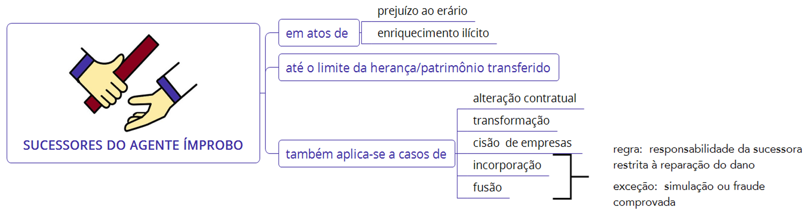

#### Independência de Instâncias e Cumulação de Sanções

Primeiramente, é importante destacar que a aplicação das sanções previstas na LIA não impede que outras sanções sejam aplicadas, sejam elas cíveis, penais ou administrativas.

- **Exemplo:** Imagine determinado agente público que passou a exigir propina para exercer suas atribuições. Reparem que esta única conduta pode gerar três processos distintos:
    1. **Ação de Improbidade (LIA):** Para apurar o ato de enriquecimento ilícito (art. 9º), buscando a suspensão dos direitos políticos, multa civil, etc.
    2. **Ação Penal:** Para apurar o crime de concussão (art. 316 do Código Penal), buscando a pena de reclusão.
    3. **Processo Administrativo Disciplinar (PAD):** Para apurar a falta disciplinar (Lei 8.112/1990), buscando a pena de demissão.

Isto é possível porque, como **regra geral**, as apurações em cada uma destas esferas (ou instâncias) são **independentes** entre si (art. 12, _caput_). Portanto, cada um dos processos pode ter desfechos diversos. O agente pode ser absolvido no crime (por falta de provas, por exemplo) e, ainda assim, ser condenado na ação de improbidade e demitido no PAD.

##### Exceções à Independência (Vinculação entre as Esferas)

A independência das instâncias é a regra geral, mas a própria LIA estabelece situações excepcionais (importantíssimas em prova) em que a decisão de uma esfera **vincula** (obriga) o resultado na esfera da improbidade.

###### Inexistência da Conduta ou Negativa de Autoria (Art. 21, § 3º)

A primeira exceção é a tradicional vinculação por inexistência do fato ou negativa de autoria:

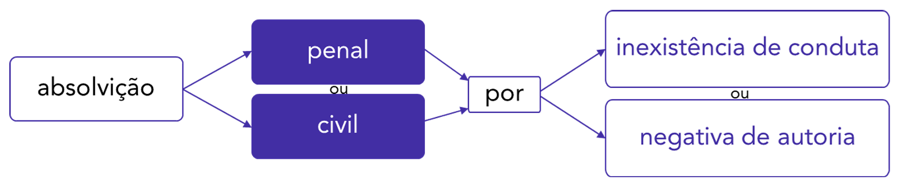

Se, após um processo penal ou civil, o juiz conclui, em sentença transitada em julgado, que **não houve a conduta** (o fato material não existiu) ou que aquele agente que havia sido acusado **não foi o autor** daquela conduta (negativa de autoria), o agente deverá ser, obrigatoriamente, absolvido na ação de improbidade.

> **Art. 21, § 3º** As sentenças civis e penais produzirão efeitos em relação à ação de improbidade quando concluírem pela inexistência da conduta ou pela negativa da autoria.

Reparem que esta regra não se aplica a absolvições na esfera administrativa (PAD), apenas na civil e na penal.

###### Absolvição Criminal Colegiada (Art. 21, § 4º) - REGRA SUSPENSA

A Lei 14.230/2021 (a reforma da LIA) tentou criar uma segunda e muito mais ampla exceção à independência das instâncias:

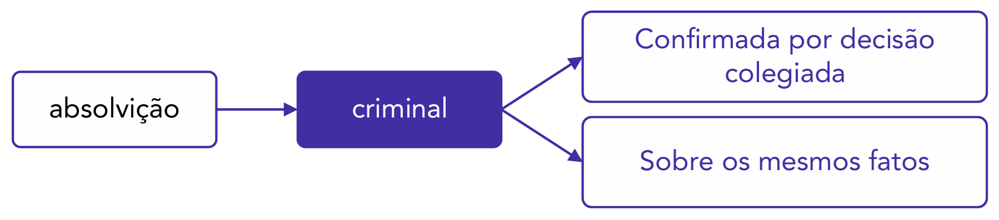

O texto do Art. 21, § 4º previa que:

> Art. 21, § 4º A absolvição criminal em ação que discuta os mesmos fatos, confirmada por decisão colegiada, impede o trâmite da ação da qual trata esta Lei, havendo comunicação com todos os fundamentos de absolvição previstos no art. 386 do Decreto-Lei nº 3.689, de 3 de outubro de 1941 (Código de Processo Penal).

Pela redação desta norma, a absolvição criminal por _qualquer_ fundamento (inclusive por "falta de provas", que normalmente não vincularia a esfera de improbidade) impediria a ação da LIA, desde que a decisão fosse de um órgão colegiado (um Tribunal).

**PONTO DE ATENÇÃO:** Ocorre que, em dezembro de 2022, em uma medida cautelar na **ADI 7236**, o Ministro Alexandre de Moraes, do STF, **suspendeu os efeitos** desta segunda exceção (o § 4º do art. 21). O STF entendeu que esta regra seria tão ampla a ponto de "corroer a própria lógica constitucional da autonomia das instâncias".

Portanto, **atualmente, a regra do Art. 21, § 4º, não está produzindo efeitos**, e a única exceção de absolvição que vincula a improbidade é a do § 3º (inexistência da conduta ou negativa de autoria).

##### Compensação de Sanções (Art. 21, § 5º)

Por fim, reduzindo ainda mais a independência (para evitar a dupla punição ou _bis in idem_), o legislador previu que sanções eventualmente aplicadas em outras esferas deverão ser **compensadas** com as sanções de mesma natureza aplicadas com base na Lei de Improbidade.

> **Art. 21, § 5º** As sanções aplicadas em outras esferas deverão ser compensadas com as sanções aplicadas nos termos desta Lei.

- **Exemplo:** Se o agente é condenado pelo Tribunal de Contas (TCU) a ressarcir R$ 50 mil e, na ação de improbidade, é condenado a ressarcir os mesmos R$ 50 mil (pelo mesmo fato), ele só pagará o valor uma vez. O pagamento feito em uma esfera "compensa" a dívida na outra.

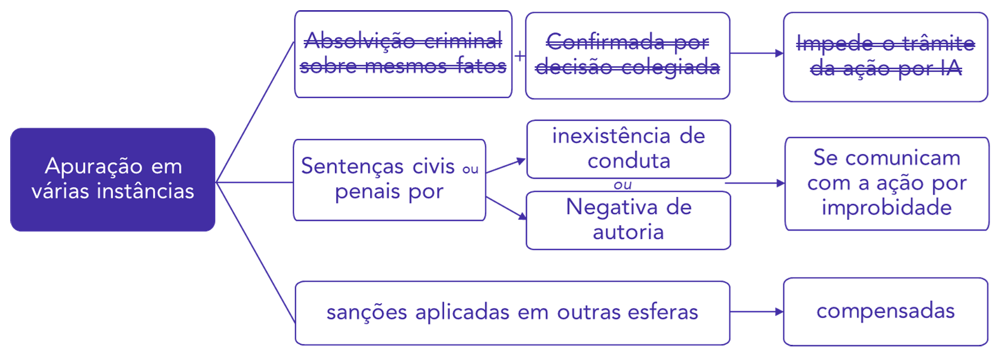

#### Exigência de Dolo

Um dos pontos de maior e mais profunda alteração promovido pela Lei nº 14.230/2021 foi a redefinição do elemento subjetivo (a intenção) necessário para a caracterização do ato de improbidade.

Primeiramente, é importante deixar claro que a responsabilidade com base na Lei de Improbidade será sempre de natureza **subjetiva**, exigindo-se a presença da intenção do agente. Não se admite, portanto, responsabilidade objetiva (na qual o agente responde independentemente de dolo ou culpa) na aplicação da Lei 8.429/1992.

A partir da reforma, ficou claro que a caracterização de **qualquer** ato de improbidade exige que a conduta tenha sido praticada na modalidade **dolosa** (art. 1º, §1º).

A consequência direta desta mudança foi a **extinção da improbidade administrativa na modalidade culposa**. Antes da Lei 14.230/2021, era possível a punição por culpa (negligência, imprudência ou imperícia) nos atos que causassem prejuízo ao erário (art. 10). Agora, mesmo para estes atos, as sanções somente poderão ser aplicadas se houver comprovação de dolo.

Em síntese:

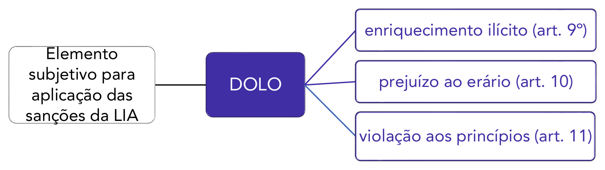

##### Definição de Dolo Específico na LIA

No Direito, em geral, o dolo pode ser genérico (a vontade de praticar a conduta, sem um fim especial) ou específico (quando se exige uma finalidade particular para o agente).

A este respeito, tem-se entendido que, após a reforma de 2021, a Lei de Improbidade passou a exigir um **dolo específico** para a caracterização dos atos de improbidade. Não basta o dolo genérico (a simples "voluntariedade do agente"), sendo necessário demonstrar que o infrator agiu com a intenção específica de alcançar o resultado ilícito. A própria lei define o dolo:

> **Art. 1º, § 2º** Considera-se **dolo** a vontade livre e consciente de **alcançar o resultado ilícito** tipificado nos arts. 9º, 10 e 11 desta Lei, **não bastando a voluntariedade do agente.**

Reforçando esta previsão, a lei busca proteger o gestor público que atua de boa-fé, mas que pode cometer erros no exercício regular de suas funções:

> **Art. 1º, § 3º** O mero exercício da função ou desempenho de competências públicas, sem comprovação de ato doloso com fim ilícito, afasta a responsabilidade por ato de improbidade administrativa.

Dificultando a caracterização dos atos de improbidade, o legislador reforça que somente haverá improbidade administrativa, em qualquer categoria, quando for comprovado, na conduta funcional do agente, o fim de **obter proveito ou benefício indevido** para si ou para outra pessoa ou entidade (art. 1º, § 1º).

##### Divergência Interpretativa de Lei (Art. 1º, § 8º - REGRA SUSPENSA)

Em outra tentativa de proteger o gestor e dificultar a caracterização dos atos de improbidade, o legislador da reforma de 2021 tentou estabelecer uma regra de que a mera divergência na interpretação da lei, baseada em jurisprudência, não configuraria improbidade.

Esta ressalva aplicar-se-ia mesmo se a jurisprudência não estivesse pacificada e mesmo que não viesse a ser posteriormente prevalecente nas decisões dos órgãos de controle ou dos tribunais (art. 1º, § 8º). Em síntese, o legislador deixou claro que a divergência interpretativa de lei (o chamado "erro de direito") não resultaria, por si só, em ato de improbidade administrativa.

Ocorre que, em dezembro de 2022, em decisão cautelar no bojo da **ADI 7236/DF**, o STF **suspendeu a eficácia** desta regra. O Supremo Tribunal Federal entendeu que a regra prevista no art. 1º, § 8º, seria muito abrangente e poderia comprometer a segurança jurídica, permitindo que gestores usassem interpretações minoritárias ou absurdas para justificar atos ilegais.

Portanto, **atualmente não está mais produzindo efeitos** a regra legal que dispunha que:

> ~~§ 8º Não configura improbidade a ação ou omissão decorrente de divergência interpretativa da lei, baseada em jurisprudência, ainda que não pacificada, mesmo que não venha a ser posteriormente prevalecente nas decisões dos órgãos de controle ou dos tribunais do Poder Judiciário.~~

Compilando as principais regras legais comentadas (com a ressalva de que a última regra do diagrama está suspensa pelo STF), temos o seguinte:

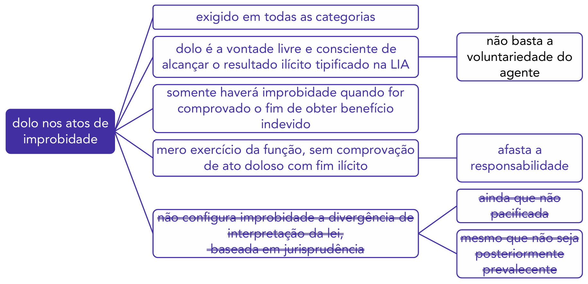

#### Exigência de Trânsito em Julgado

Uma das garantias processuais mais relevantes na Lei de Improbidade Administrativa refere-se ao momento em que as sanções podem ser efetivamente executadas.

Antes da reforma da Lei 14.230/2021, o art. 20 da LIA já estabelecia que as sanções mais gravosas – a **"perda da função pública"** e a **"suspensão dos direitos políticos"** – somente poderiam ser efetivadas após o **trânsito em julgado** da sentença condenatória. Isso impedia que um servidor fosse demitido ou ficasse inelegível com base em uma decisão de primeira instância, que ainda poderia ser revertida em cortes superiores.

A reforma de 2021, no entanto, foi além e buscou ampliar essa garantia para todas as penalidades. O legislador deixou claro, no novo § 9º do art. 12, que **todas as sanções** previstas na lei de improbidade (incluindo multa e proibição de contratar) exigem o trânsito em julgado para sua execução.

Embora a nova regra, mais ampla (art. 12, § 9º), tenda a prevalecer sobre a regra antiga e mais restrita (art. 20) – que não foi expressamente revogada –, é importante, por prudência, conhecer a literalidade de ambos os dispositivos.

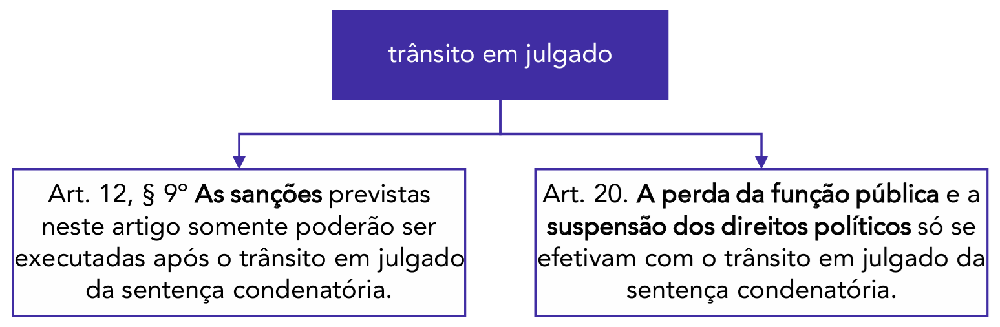

#### Atos de Menor Ofensa

A Lei 14.230/2021 inovou ao positivar, no § 5º do art. 12, o conceito de **"atos de menor ofensa"**. Esta categoria corresponde a situações de improbidade consideradas menos graves, em que os bens jurídicos tutelados pela lei (como a moralidade, o erário ou o patrimônio) foram ofendidos de modo menos intenso ou com menor reprovabilidade.

Nesses casos, em observância ao Princípio da Proporcionalidade, a lei restringe o poder sancionatório do juiz. A sanção a ser aplicada limitar-se-á à **multa civil**.

Isso significa que, identificada uma conduta como de "menor ofensa", o juiz fica proibido de aplicar as sanções mais severas de perda da função pública, suspensão dos direitos políticos e proibição de contratar.

Contudo, esta limitação refere-se apenas às sanções punitivas. Ela se aplica "sem prejuízo" das sanções de natureza reparatória, quando for o caso, como o **ressarcimento do dano** e a **perda dos valores obtidos** ilicitamente.

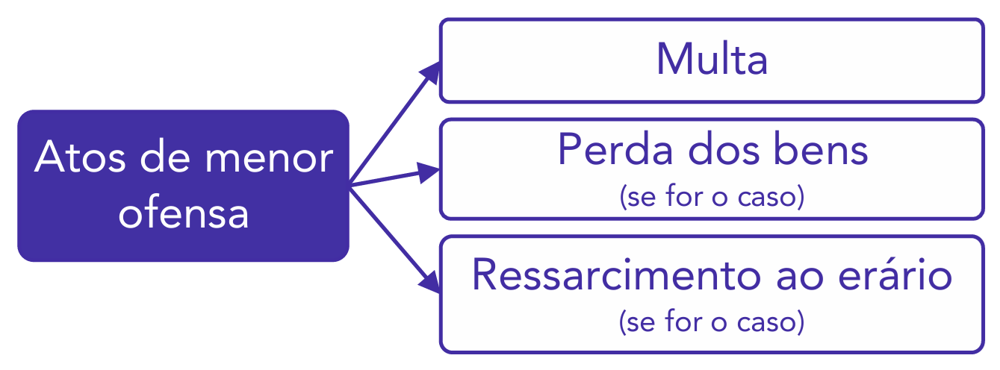

#### Sanções em Espécie

Neste bloco, comentaremos especificidades de algumas das sanções aplicáveis aos atos de improbidade.

##### Perda da Função Pública

Quanto à sanção de perda da função pública, duas observações importantes devem ser feitas:

1. A Lei 14.230/2021 tentou estabelecer que, em regra, a perda da função pública atingiria **apenas o vínculo** no qual o agente praticou o ato de improbidade. Seria possível, em caráter excepcional, estender a perda da função aos demais vínculos daquele agente, atendidos certos requisitos (art. 12, § 1º).
2. Entretanto, esta foi mais uma das alterações **suspensas pelo STF, na ADI 7236**, em dezembro de 2022. Para o Min. Alexandre de Moraes, a limitação a um vínculo do agente público é desarrazoada e seria uma “severa restrição ao mandamento constitucional de defesa da ‘probidade administrativa’”.

Com a suspensão deste dispositivo, em tese, a lei não impede que o juiz, ao fundamentar sua decisão, determine a perda de todos os vínculos públicos ocupados pelo agente condenado.

- **Exemplo:** Imagine que, ao final de 2021, o Ministério Público ajuizou ação por improbidade contra Alberto Roberto, alegando seu enriquecimento ilícito, relativo a fatos ocorridos no ano de 2016, quando Alberto ainda era prefeito do município Vila da Coruja. Atualmente, Alberto não é mais prefeito, mas assumiu, em 2020, cargo efetivo de técnico em determinado tribunal de justiça. Caso Alberto seja condenado à perda da função pública, é possível, em tese, que ele perca a atual função de técnico no tribunal de justiça, ainda que tenha assumido este cargo posteriormente aos fatos que geraram a condenação.

###### Perda da Função (LIA) vs. Demissão (Estatuto)

É fundamental não confundir a sanção de "perda da função pública" (prevista na LIA) com a "demissão" (prevista nos estatutos de servidores).

Muitos estatutos (a exemplo da Lei 8.112/1990 para os servidores civis federais) mencionam a "demissão" como penalidade para a prática de atos de improbidade administrativa (e.g., Lei 8.112/1990, art. 132, IV).

A este respeito, existem duas vias de apuração distintas:

1. **Via Administrativa (PAD):** A aplicação da sanção de **demissão** com base no estatuto (Lei 8.112, por exemplo) **não requer ato judicial**, podendo ser aplicada pela própria autoridade administrativa, após regular Processo Administrativo Disciplinar (PAD).
2. **Via Judicial (LIA):** A aplicação de **todas as sanções da Lei 8.429/1992**, inclusive a **perda da função pública**, somente pode ser determinada por um magistrado, no curso de um processo judicial.

A jurisprudência há muito tempo confirma a possibilidade de a esfera administrativa reconhecer a prática de improbidade para fins de demissão do servidor. Confirmando tal entendimento, o STJ firmou a tese de que:

> A aplicação da pena de demissão por improbidade administrativa não é exclusividade do Judiciário, sendo passível a sua incidência no âmbito do processo administrativo disciplinar.

Além disso, em razão da independência das instâncias, se o servidor estiver respondendo, ao mesmo tempo, a um PAD e a uma ação judicial de improbidade pelo mesmo ato, a autoridade administrativa não precisa aguardar a decisão judicial para demiti-lo. Este é o teor da **Súmula 651 do STJ**, editada em outubro de 2021:

> **Súmula 651-STJ:** Compete à autoridade administrativa aplicar a servidor público a pena de demissão em razão da prática de improbidade administrativa, independentemente de prévia condenação, por autoridade judicial, à perda da função pública.

Por fim, o STJ tem entendido que, se o agente ímprobo já está aposentado no momento da condenação judicial, a sanção de "perda da função pública" deve ser convertida em **cassação de sua aposentadoria** (MS 26.106-DF), mesmo que não exista previsão expressa na LIA para a cassação.

##### Multa Civil

Sabemos que, na fixação das penas, o juiz observará uma série de circunstâncias para realizar a chamada "dosimetria da pena", analisando a gravidade do fato, a extensão do dano e o proveito patrimonial (art. 12, _caput_; art. 17-C, IV).

No caso da multa civil, para além dos valores máximos que estudamos (valor do acréscimo patrimonial, valor do dano ou 24 vezes a remuneração), o juiz poderá **aumentar a multa até o dobro**, se considerar que, em virtude da situação econômica do réu, o valor "padrão" seria ineficaz para a reprovação e prevenção do ato de improbidade (art. 12, § 2º).

Neste caso (de aplicação do § 2º), os tetos da multa seriam os seguintes:

|**Enriquecimento ilícito**|**Prejuízo ao erário**|**Violação a princípio**|
|---|---|---|
|Multa civil de até o **dobro** do acréscimo patrimonial|Multa civil de até o **dobro** do dano ao erário|Multa civil de até **48 vezes** a remuneração do agente|

##### Ressarcimento ao Erário

Inicialmente, é fundamental não confundir a sanção de multa civil com a de ressarcimento do dano ao erário. O **ressarcimento ao erário** (ou reparação do dano) tem natureza **reparatória**, e não punitiva. Seu objetivo é a mera recomposição do patrimônio público lesado, um retorno ao _status quo ante_ (o estado anterior). Por este motivo, parte da doutrina nem considera o ressarcimento uma "sanção" propriamente dita, mas sim uma consequência cível da conduta, prevista no art. 12.

A **multa civil**, por outro lado, é puramente **punitiva**. É uma quantia que vai além do dano causado, cobrada como castigo ao agente ímprobo.

- **Exemplo:** Se a Administração desembolsou R$ 10 milhões a mais em virtude de uma fraude cometida durante a licitação (um superfaturamento, onde o preço justo seria R$ 50 milhões e foi pago R$ 60 milhões), estes R$ 10 milhões são exatamente o valor a ser recomposto aos cofres públicos (o ressarcimento). A multa civil (que, no caso do art. 10, é igual ao valor do dano) seria o pagamento de _outros_ R$ 10 milhões, como punição.

Havendo comprovação de efetivo prejuízo ao erário, é elaborado um cálculo do valor do dano. A reforma da Lei 14.230/2021 deixou claro que, para fins de apuração do valor do ressarcimento, deverão ser **descontados os serviços efetivamente prestados** (art. 18, § 3º). Em outras palavras, o ressarcimento deve cobrir apenas o "prejuízo líquido".

Além disso, a lei veda o _bis in idem_ (dupla punição pelo mesmo fato) e o enriquecimento ilícito do próprio Estado. Se o agente for processado em mais de uma instância (ex: LIA e Tribunal de Contas) e for condenado a ressarcir o erário em ambas, a reparação do dano deverá **deduzir o ressarcimento ocorrido nas outras instâncias** (criminal, civil e administrativa) que tiver por objeto os mesmos fatos (art. 12, § 6º).

Outra novidade da Lei 14.230/2021 consiste na possibilidade de o juiz autorizar o **parcelamento do ressarcimento em até 48 parcelas mensais**, corrigidas monetariamente, se o réu demonstrar incapacidade financeira de saldá-lo de imediato (art. 18, § 4º).

Tanto os valores resultantes do ressarcimento ao erário como do perdimento dos bens acrescidos ilicitamente deverão ser revertidos em favor da **pessoa jurídica prejudicada** pelo ilícito (art. 18).

Por fim, vale adiantar que, consoante será detalhado mais adiante, o Supremo Tribunal Federal (STF), em tese de repercussão geral (Tema 897), fixou o entendimento de que a pretensão de **ressarcimento ao erário** decorrente de ato **doloso** de improbidade administrativa é **imprescritível**.

##### Proibição de Contratar e Suspensão dos Direitos Políticos

Muitas vezes um agente público está sendo processado em vários processos por atos de improbidade, ou até mesmo já foi condenado anteriormente. Nestes casos, é possível que o agente condenado requeira a unificação da execução da pena (art. 18-A, _caput_).

Se um mesmo agente foi condenado por diferentes atos de improbidade, o Judiciário irá somar as sanções aplicadas em todos os processos (art. 18-A, II). No entanto, tratando-se das sanções de **suspensão de direitos políticos** e de **proibição de contratar** ou receber incentivos fiscais/creditícios do poder público, o legislador estabeleceu um **limite máximo de 20 (vinte) anos** para o somatório das penas (art. 18-A, parágrafo único).

Especificamente em relação à proibição de contratação com o poder público, apesar de em regra ela alcançar apenas o ente público lesado pelo ato de improbidade, é possível que, em caráter excepcional, ela extrapole o ente público lesado pelo ato de improbidade, gerando efeitos em outros entes públicos (art. 12, § 4º).

Antes de concluir, um detalhe relevante sobre a sanção de suspensão dos direitos políticos. A Lei 14.230/2021 tentou estabelecer o **cômputo retroativo** do intervalo de tempo entre a decisão colegiada (2ª instância) e o trânsito em julgado da sentença condenatória (art. 12, § 10). Seria uma espécie de “tempo fictício” em benefício do agente ímprobo, pois, mesmo sem a sanção ser efetivada, o tempo já estaria sendo contado.

Ocorre que, em dezembro de 2022, uma medida cautelar dada pelo Ministro Alexandre de Moraes, do STF, na **ADI 7236**, **suspendeu os efeitos** da referida regra. Portanto, apesar da tentativa de inserção desta regra pela Lei 14.230/2021, atualmente **não é possível** o cômputo retroativo para fins de contagem da suspensão dos direitos políticos.

Sintetizando as principais regras aplicáveis a estas espécies de sanções, temos o seguinte diagrama:

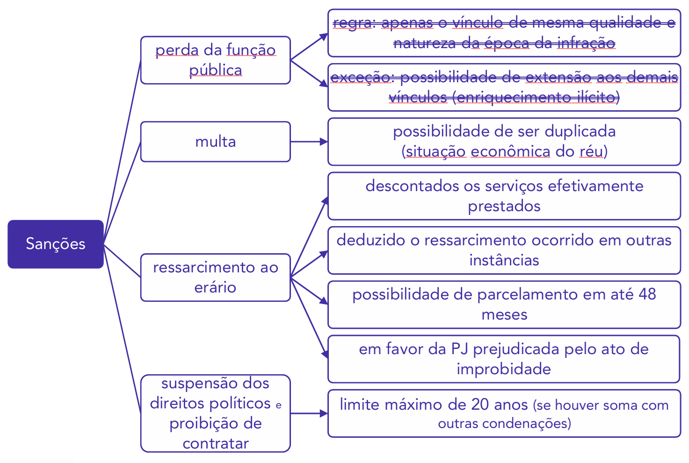

#### Resumo Geral das Sanções

O diagrama a seguir consolida as principais características do regime sancionatório da Lei de Improbidade Administrativa:

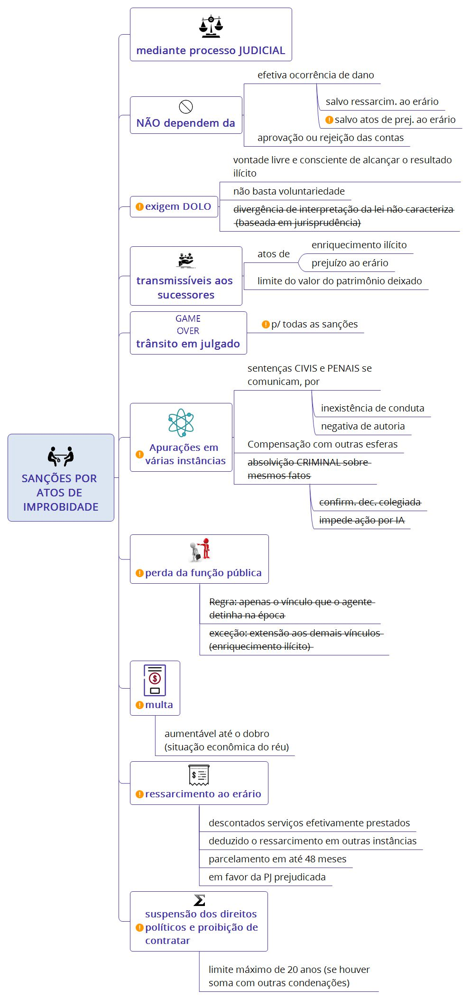

## Procedimento Administrativo e Ação Judicial

A apuração e a punição de um ato de improbidade administrativa envolvem duas etapas distintas e, em regra, sucessivas: uma fase de investigação preliminar, que ocorre dentro da própria Administração (procedimento administrativo), e uma fase de processo e julgamento, que ocorre no Poder Judiciário (ação judicial).

Adiante iremos examinar, em dois tópicos separados, (i) o procedimento de apuração administrativa e (ii) as características da ação judicial de improbidade administrativa.

### Procedimento Administrativo

Apesar de a aplicação das sanções da LIA (como suspensão de direitos políticos ou multa) exigir um processo judicial, a Lei de Improbidade previu a possibilidade de a apuração se iniciar por meio de um procedimento administrativo, ainda dentro da própria Administração Pública. Este procedimento serve como uma investigação preliminar para colher indícios de autoria e materialidade.

#### Representação à Autoridade Administrativa

Segundo o art. 14 da LIA, **qualquer pessoa** poderá representar à autoridade administrativa competente a fim de que seja apurada a prática de ato de improbidade.

Esta comunicação de ilegalidade (representação) deve ser apresentada por escrito ou, se feita oralmente, ser reduzida a termo (escrita) e assinada pelo denunciante. Além disso, a representação deve, obrigatoriamente, indicar as provas do alegado de que o representante tenha conhecimento.

A LIA trata com muita seriedade a denúncia falsa. Como vimos, constitui **crime** a representação (denúncia) à autoridade administrativa quando o denunciante sabe que o denunciado é inocente (art. 19). Este é o único crime previsto na LIA.

Atendidos estes pressupostos mínimos (identificação, fatos e indicação de provas), a autoridade administrativa ficará obrigada a determinar sua apuração. A apuração da denúncia consiste em um poder-dever da Administração e, portanto, é irrenunciável.

Esta apuração se dará, em regra, por meio da abertura de um **Processo Administrativo Disciplinar (PAD)** ou sindicância, conduzido por uma "comissão processante" (art. 14, § 3º). Este processo administrativo seguirá o rito próprio estabelecido nos respectivos estatutos (ex: Lei nº 8.112/1990, no caso de servidor federal).

Caso a autoridade administrativa, por alguma razão, rejeite a representação, o denunciante ainda poderá apresentá-la diretamente ao **Ministério Público** (art. 14, § 2º).

É fundamental reforçar que a comissão processante do PAD **não poderá aplicar as sanções previstas na Lei de Improbidade** (como suspensão de direitos políticos), pois estas exigem processo judicial.

Neste caso, o PAD instaurado terá duas finalidades:

1. Aplicar as penalidades previstas no estatuto do servidor (ex: a **demissão** com base na Lei 8.112/1990); e
2. Servir de insumo (juntar provas) para a futura Ação Judicial de Improbidade.

#### Ciência ao Tribunal de Contas e ao Ministério Público

Paralelamente à condução do processo administrativo, é dever da comissão processante (ou da autoridade que tomou conhecimento dos fatos) **dar conhecimento ao Ministério Público e ao Tribunal ou Conselho de Contas** sobre a existência do procedimento (art. 15).

A reforma de 2021 reforçou essa obrigação de comunicação ao MP, titular da ação de improbidade:

> **Art. 7º** Se houver indícios de ato de improbidade, a autoridade que conhecer dos fatos representará ao Ministério Público competente, para as providências necessárias.

#### Atuação do Ministério Público

A Lei de Improbidade confere um papel de protagonismo ao Ministério Público na apuração de supostos atos de improbidade. O MP não depende da provocação do cidadão ou da Administração.

O Ministério Público pode (e deve) agir de ofício, instaurando seu próprio procedimento investigatório (o **Inquérito Civil**) ou requisitando a instauração de inquérito policial para apurar os fatos (art. 22).

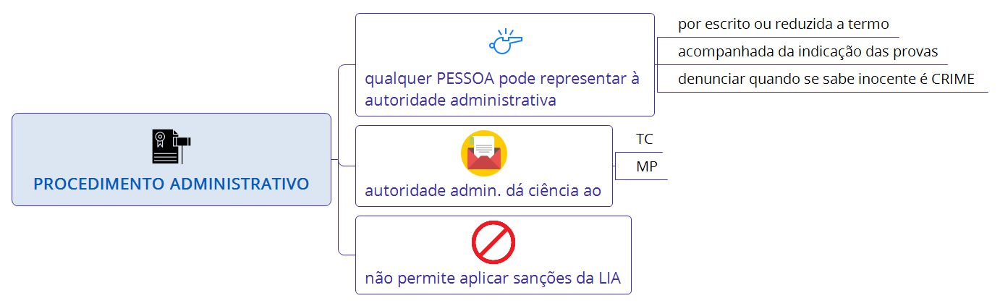

### Ação Judicial

Agora sim vamos nos debruçar sobre a ação judicial que permite a aplicação das sanções por improbidade administrativa previstas na Lei 8.429/1992. É fundamental reiterar que, conforme visto, as sanções da LIA (como perda da função pública, suspensão de direitos políticos ou multa) **só podem ser aplicadas pelo Poder Judiciário**, após o devido processo judicial.

#### Natureza da Ação

A LIA, após a reforma promovida pela Lei 14.230/2021, deixa claro que a ação por improbidade **não é uma Ação Civil Pública** comum. A lei define a Ação de Improbidade Administrativa (AIA) como uma ação **repressiva**, de **caráter sancionatório**, destinada à aplicação das sanções de caráter pessoal previstas no art. 12.

Portanto, poderíamos deduzir que se trata de uma ação _sui generis_ (de natureza própria), na medida em que a ação por improbidade não tem natureza criminal e, após a Lei 14.230/2021, também não se confunde com a ação civil pública.

O legislador, no art. 17-D, veda expressamente o ajuizamento da AIA para finalidades diversas, como o controle de legalidade de políticas públicas ou para a proteção "pura" do patrimônio público e social, do meio ambiente e de outros interesses difusos, coletivos e individuais homogêneos.

Essas outras matérias (controle de políticas públicas, danos ao meio ambiente, ao consumidor, a bens históricos, etc.) devem ser tuteladas por meio da **Ação Civil Pública (ACP)** comum (art. 17-D, parágrafo único).

Nesse sentido, a lei criou uma "válvula de escape" processual: se for inicialmente ajuizada uma ação por improbidade e, durante a instrução, o juiz identificar que não estão presentes todos os requisitos para a imposição das sanções da LIA (por exemplo, não há indicativos de **dolo** na conduta), ele poderá **converter a Ação de Improbidade Administrativa em Ação Civil Pública** (art. 17, § 16), passando a focar apenas no eventual ressarcimento do dano, sob as regras da ACP.

#### Legitimidade Ativa (Quem pode propor a Ação)

Este foi um dos pontos mais controversos e judicializados da reforma de 2021.

Após a alteração promovida pela Lei 14.230, a LIA passou a estabelecer, no _caput_ do art. 17, a **legitimidade exclusiva do Ministério Público** para a propositura da ação judicial de improbidade.

|**Como era? (Antes de 2021)**|**Como ficou? (Texto da Lei 14.230/2021)**|
|---|---|
|Art. 17. A ação principal (...) será proposta pelo **Ministério Público** ou pela **pessoa jurídica interessada**...|Art. 17. A ação para aplicação das sanções de que trata esta Lei será proposta **pelo Ministério Público**...|

Pela literalidade da lei reformada, a "pessoa jurídica interessada" (ou seja, a própria vítima, como a União, o Município ou a Autarquia lesada) perdeu o direito de processar o agente ímprobo, cabendo-lhe apenas ser intimada para, caso queira, intervir no processo como assistente (art. 17, § 14).

**PONTO DE ATENÇÃO (Decisão do STF):** Logo após a publicação da lei, o Supremo Tribunal Federal (STF) foi provocado a analisar a constitucionalidade desta restrição. Em medida cautelar (liminar) proferida na **ADI 7042**, o STF **suspendeu a eficácia** da regra de exclusividade do MP.

O STF deu interpretação conforme a Constituição para reafirmar a **"legitimidade ativa concorrente entre o Ministério Público e as pessoas jurídicas interessadas para a propositura da ação por ato de improbidade administrativa"**.

Portanto, no cenário atual, **ambos** (Ministério Público e a Pessoa Jurídica Interessada) podem propor a Ação de Improbidade Administrativa.

Por outro lado, o Superior Tribunal de Justiça (STJ) já possuía entendimento pacificado, mesmo antes da reforma, de que a **Defensoria Pública não tem legitimidade** para propor ação de improbidade.

#### Regras de Transição (Ações em Curso)

E em relação aos processos sobre improbidade que já estavam em curso quando da publicação da Lei 14.230/2021 e que haviam sido ajuizados pela Pessoa Jurídica Interessada (o que era permitido)?

A Lei 14.230/2021 (em seu art. 3º) estabeleceu que o MP teria o prazo de 1 ano (a partir de 26/10/2021) para manifestar interesse no prosseguimento dessas ações. Caso o MP não se manifestasse, o processo seria extinto sem resolução do mérito.

Contudo, esta regra de transição também teve sua **eficácia suspensa pelo STF no bojo da ADI 7042**. Como o STF reafirmou a legitimidade da Pessoa Jurídica Interessada, ela não precisa da "autorização" do MP para prosseguir com as ações que ela mesma ajuizou.

#### Juízo Competente

A definição de onde a ação de improbidade será julgada segue duas regras principais: a ausência de foro especial (prerrogativa de foro) e a competência territorial.

##### Inexistência de Foro por Prerrogativa de Função (Foro Especial)

A ação de improbidade deverá **sempre** ser proposta perante o **juízo de 1º grau** (um juiz de primeira instância), mesmo nos casos em que o responsável pelo ato seja uma alta autoridade detentora de prerrogativa de foro (como um Ministro, Governador, Deputado ou Desembargador).

- **Ponto de Atenção:** Não existe foro especial por prerrogativa de função nas ações de improbidade administrativa.

Tal conclusão deriva do entendimento pacificado do Supremo Tribunal Federal (STF) de que a prerrogativa de foro, prevista na Constituição, alcança **apenas ações de natureza penal** (crimes comuns e de responsabilidade).

Nesse sentido, como a ação de improbidade administrativa possui natureza cível-sancionatória (e não penal), não há que se cogitar o julgamento dela em foros especiais (como Tribunais de Justiça ou o STJ). Confirmando tal entendimento, em dezembro de 2020, o STF considerou inconstitucional uma regra da constituição de um estado que estabelecia prerrogativa de foro para atos de improbidade (ADI 4870).

##### Competência Territorial e Federal vs. Estadual

Quanto ao **local** de ajuizamento, a LIA (pós-reforma) prevê que a ação por improbidade deverá ser proposta perante o foro do **local onde ocorrer o dano** ou da **pessoa jurídica prejudicada** (vítima direta do ato) – (art. 17, § 4º-A).

Quanto à esfera (Federal ou Estadual), a regra segue a competência constitucional:

- **Justiça Federal:** A ação deverá ser proposta na Justiça Federal caso exista interesse da União ou de suas entidades da administração indireta (Autarquias ou Empresas Públicas Federais), seja como autoras ou como vítimas.
- **Justiça Estadual:** Nos demais casos (atos contra Estados, Municípios ou suas entidades), a ação tramitará perante a Justiça Estadual.

#### Possibilidade de Acordo (ANPC)

Uma das maiores inovações das reformas recentes (Lei 13.964/2019 e Lei 14.230/2021) foi a permissão expressa para a celebração de acordos em ações de improbidade. Antes disso, a LIA vedava qualquer tipo de transação, acordo ou conciliação.

Agora, é admitida a celebração do **Acordo de Não Persecução Civil (ANPC)** (art. 17-B).

Por meio deste acordo, o investigado/réu pode se comprometer a reparar o dano e reverter a vantagem indevida, em troca de não sofrer as sanções mais severas da lei (como a suspensão dos direitos políticos ou a perda da função). O acordo isenta o infrator de parte das sanções, em troca de benefícios (como a celeridade no ressarcimento) ou da colaboração para identificar outros envolvidos.

Havendo a possibilidade de solução consensual, as partes poderão requerer ao juiz a **interrupção do prazo para a defesa** (contestação), por um período não superior a 90 dias, para que possam negociar (art. 17, § 10-A).

##### Competências e Requisitos do Acordo

- **Quem Negocia:** O acordo é negociado entre o **Ministério Público** (ou a **pessoa jurídica interessada**) e, do outro lado, o investigado/réu e seu defensor (art. 17-B, § 5º).
- **Homologação Judicial:** O acordo só tem validade após a **homologação judicial** (art. 17-B, § 1º, III).
- **Oitiva do Ente Lesado:** Como estamos diante de um ato de disposição do interesse público (abrir mão de sanções), a LIA exige também a **oitiva do ente federativo lesado** (a vítima direta do ato de improbidade), que deve concordar com os termos (art. 17-B, § 1º, III).
- **Momento:** A lei foi bastante ampla, permitindo a celebração do acordo (i) durante a **investigação** (Inquérito Civil), (ii) no **curso da ação** de improbidade ou (iii) até mesmo no momento da **execução da sentença** condenatória (art. 17, § 4º).
- **Requisitos Mínimos:** A celebração do acordo está condicionada, ao menos, aos seguintes resultados (art. 17-B, _caput_):
    1. O **integral ressarcimento do dano**; e
    2. A **reversão da vantagem indevida obtida** à pessoa jurídica lesada.

##### Oitiva do Tribunal de Contas (REGRA SUSPENSA)

Para apuração do valor do dano a ser ressarcido no acordo, a lei (art. 17-B, § 3º) previa a **oitiva obrigatória do Tribunal de Contas** competente, que teria 90 dias para se manifestar sobre o cálculo.

Ocorre que, em 2022, na mesma **ADI 7236/DF**, o STF **suspendeu a eficácia** desta regra. Entendeu-se que condicionar o acordo (a ser feito pelo MP) à oitiva do TC seria uma interferência indevida na autonomia do Ministério Público. Portanto, atualmente, esta oitiva do Tribunal de Contas não é obrigatória.

##### Outras Cláusulas e Descumprimento

O acordo poderá contemplar, no âmbito da pessoa jurídica beneficiada, a adoção de **mecanismos e procedimentos internos de integridade** (programas de _compliance_), auditoria, códigos de ética, etc. (art. 17-B, § 6º).

Havendo **descumprimento do acordo**, aquele que o celebrou ficará **impedido de pactuar novo acordo** pelo prazo de **5 (cinco) anos**, contado do conhecimento pelo Ministério Público do efetivo descumprimento (art. 17-B, § 7º).

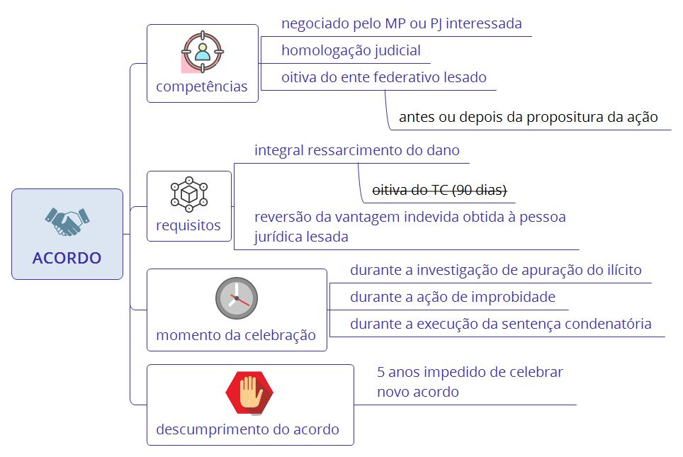

##### Colaboração Premiada (Tema 1043 STF)

Por fim, embora a LIA não trate do tema, o STF (em fevereiro de 2024, Tema 1043 de Repercussão Geral) pacificou a possibilidade de uso da **colaboração premiada** (um instrumento da esfera penal, Lei 12.850/2013) na Ação Civil Pública por Ato de Improbidade Administrativa.

> "É constitucional a utilização da colaboração premiada, nos termos da lei 12.850/13, no âmbito civil, em ação civil pública por ato de improbidade administrativa movida pelo Ministério Público, (...)." (Tema 1043)

Portanto, um acordo de colaboração feito na esfera penal pode gerar benefícios para o réu também na esfera de improbidade (como a redução ou isenção de sanções), desde que seguidas as diretrizes legais.

#### Afastamento Cautelar do Acusado

Além das sanções finais, a lei prevê medidas cautelares (providências urgentes e provisórias) que podem ser tomadas pelo juiz durante a tramitação da ação, para garantir a eficácia do processo ou a instrução.

A primeira delas é o afastamento do agente público de suas funções. Antes mesmo da conclusão do processo, a **autoridade judicial** competente poderá determinar o afastamento do agente público do exercício do cargo, emprego ou função, **sem prejuízo da remuneração**.

Este afastamento não é uma punição antecipada, mas uma medida de proteção à investigação. Ele só pode ser decretado quando a medida se fizer necessária à **produção de provas** (instrução processual) ou para **evitar a prática de novos ilícitos** (art. 20, § 1º). O juiz deve verificar se a permanência do agente no cargo (ex: como chefe de um setor de licitações) pode ser usada por ele para coagir testemunhas, destruir documentos ou continuar o esquema ilícito.

Após a Lei 14.230/2021, a Lei de Improbidade passou a prever uma duração máxima para este afastamento: **90 (noventa) dias**, prorrogáveis uma única vez por igual prazo, mediante decisão motivada (art. 20, § 2º).

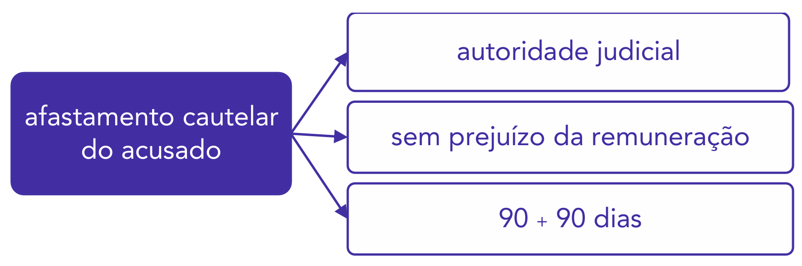

#### Indisponibilidade dos Bens do Acusado

Outra medida cautelar prevista na Lei de Improbidade, e a mais comum, diz respeito à **indisponibilidade dos bens** do indiciado (o "congelamento" de seu patrimônio), prevista no art. 16.

O objetivo desta medida é garantir que, ao final do processo, o réu tenha patrimônio suficiente para cobrir o ressarcimento ao erário ou o perdimento dos bens acrescidos ilicitamente.

A decretação da indisponibilidade é de competência **exclusiva do juiz** (não podendo ser feita pelo MP ou pela autoridade administrativa). A Lei 14.230/2021 trouxe inúmeras regras novas e restritivas para esta medida:

- **Finalidade (O que se bloqueia):** A LIA prevê que a indisponibilidade recairá sobre bens que assegurem **exclusivamente** o **integral ressarcimento do dano** e a **recomposição do acréscimo patrimonial indevido** (art. 16, _caput_). A lei veda expressamente (art. 16, § 10) que a indisponibilidade alcance o valor de eventual **multa civil** ou o acréscimo patrimonial decorrente de atividade lícita.
- **Múltiplos Réus:** Se houver mais de um réu na ação, a somatória dos valores declarados indisponíveis **não poderá superar o montante total** do dano ou do enriquecimento ilícito (art. 16, § 5º). Veda-se, assim, o bloqueio solidário do valor total em nome de cada réu.
- **Requisitos (Fim do _Periculum in Mora_ Presumido):** Antes da reforma, o STJ entendia que o _periculum in mora_ (perigo da demora) era presumido nos atos de improbidade. A Lei 14.230/2021 **derrubou** esse entendimento. Agora, o Ministério Público (ou a pessoa jurídica lesada) deve **demonstrar no caso concreto** o perigo de dano irreparável ou o risco ao resultado útil do processo (ex: provas de que o réu está dilapidando seu patrimônio), não se admitindo mais a presunção (art. 16, §§ 3º e 4º).
- **Contraditório Prévio:** A indisponibilidade poderá ser decretada com ou sem a oitiva prévia do réu. A oitiva prévia é a regra, mas a medida pode ser decretada liminarmente (sem ouvir o réu) "quando o contraditório prévio puder comprovadamente frustrar a efetividade da medida" (art. 16, § 4º).
- **Terceiros:** A indisponibilidade de bens do terceiro que induziu ou concorreu dolosamente para o ato dependerá da demonstração de sua efetiva concorrência e, sendo uma pessoa jurídica, dependerá da instauração do incidente de desconsideração da personalidade jurídica (art. 16, § 7º-A).
- **Ordem de Preferência dos Bens (Art. 16, § 11):** A lei criou uma ordem de preferência para o bloqueio, priorizando bens de menor liquidez (para não afetar a subsistência do réu). A ordem é: (1º) veículos de via terrestre, (2º) bens imóveis, (3º) bens móveis em geral, (4º) semoventes, (5º) navios e aeronaves, (6º) ações e quotas, (7º) pedras e metais preciosos e, **apenas em último caso**, (8º) o **bloqueio de contas bancárias**.
- **Bens Impenhoráveis:** A lei veda expressamente a decretação de indisponibilidade sobre:
    1. A quantia de até **40 (quarenta) salários mínimos** depositados em conta-corrente, em caderneta de poupança ou em outras aplicações financeiras (art. 16, § 13).
    2. O **bem de família** do acusado, **salvo** se comprovado que o próprio imóvel seja fruto de vantagem patrimonial indevida (art. 16, § 14).
- **Substituição da Medida (Art. 16, § 6º):** É possível substituir a indisponibilidade, a requerimento do réu, por uma caução idônea, por fiança bancária ou por seguro-garantia judicial, desde que cubra o valor integral do débito discutido.

Sintetizando os principais aspectos da indisponibilidade de bens:

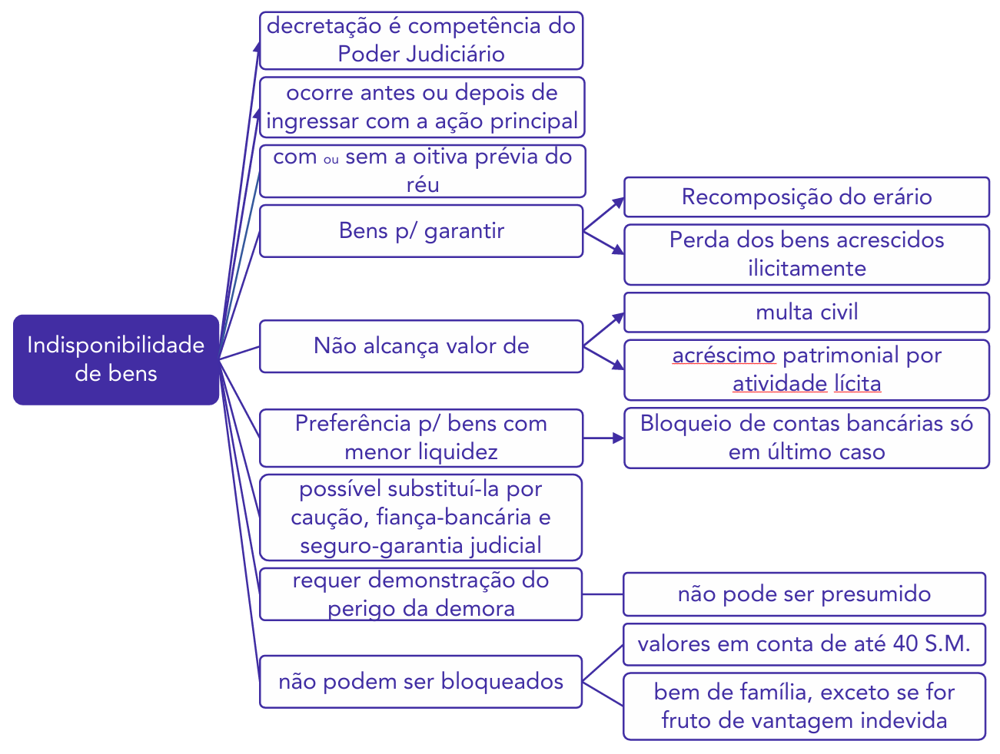

#### Produção de Provas

Seja no procedimento administrativo preliminar, seja na ação judicial (que é o foco aqui), o legitimado ativo (o Ministério Público ou a pessoa jurídica lesada) terá que produzir a prova de que houve a prática do ato de improbidade administrativa, da sua autoria e, fundamentalmente (após a reforma de 2021), do **dolo** do agente.

Nesse sentido, a jurisprudência há muito tempo consolidou a admissão da chamada **"prova emprestada"**. É perfeitamente admissível a utilização, na ação de improbidade, de provas que foram colhidas no bojo de uma ação penal (como interceptações telefônicas autorizadas judicialmente ou depoimentos), desde que, no âmbito da ação de improbidade, seja assegurado ao réu o contraditório e a ampla defesa sobre aquela prova.

- **Exemplo:** Determinado agente público praticou um ato que é, ao mesmo tempo, crime de corrupção e ato de improbidade por enriquecimento ilícito. Na ação criminal, foi produzida uma prova (ex: uma gravação). Esta mesma prova pode ser "emprestada" e utilizada pelo Ministério Público na ação de improbidade, desde que o juiz da improbidade dê ao réu a chance de se manifestar sobre ela.

Além disso, o STJ também tem entendimento pacificado de que, havendo indícios suficientes de improbidade (especialmente nos casos de enriquecimento ilícito do art. 9º), o juiz responsável pela ação poderá decretar a **quebra do sigilo bancário e fiscal** do acusado, como meio de instrução para comprovar a evolução patrimonial incompatível.

#### Defesa do Acusado

O rito de defesa do acusado na ação de improbidade sofreu uma das mudanças processuais mais drásticas com a reforma da Lei 14.230/2021.

##### Supressão da Defesa Preliminar

Antes da reforma, as ações de improbidade possuíam uma peculiaridade: o acusado tinha, em tese, duas oportunidades de se defender. O art. 17, § 7º (hoje revogado) previa que, antes mesmo de o juiz "receber" a acusação (a petição inicial), ele deveria notificar o acusado para apresentar uma **defesa preliminar** (ou "notificação prévia"). Somente após analisar essa defesa prévia é que o juiz decidia se tornava o agente em réu.

Com a **revogação do art. 17, § 7º**, foi suprimido tal benefício. O rito foi alterado para se alinhar ao "procedimento comum" do Código de Processo Civil. Agora, o juiz, ao receber a petição inicial do Ministério Público (ou da pessoa jurídica lesada), se entender que há indícios da improbidade, irá "receber a ação" (ato que torna o acusado em réu) e determinará a **citação** do acusado para que ele ofereça sua **contestação** (que passa a ser sua única defesa formal obrigatória no início do processo).

##### A Defesa por Advogados Públicos (Art. 17, § 20 - REGRA SUSPENSA)

A Lei 14.230/2021 inseriu uma novidade que busca proteger os agentes públicos que atuaram alicerçados em orientação dos órgãos de consultoria jurídica (como a Advocacia-Geral da União ou as Procuradorias de Estado/Município).

Se, futuramente, o agente público que praticou um ato baseado em um parecer jurídico estiver sendo acusado de praticar ato de improbidade, o art. 17, § 20, determinava que a assessoria jurídica que emitiu o parecer seria obrigada a defendê-lo judicialmente, sem ônus para o servidor.

> **Art. 17, § 20.** A assessoria jurídica que emitiu o parecer atestando a legalidade prévia dos atos administrativos praticados pelo administrador público ficará obrigada a defendê-lo judicialmente, caso este venha a responder ação por improbidade administrativa, até que a decisão transite em julgado.

**PONTO DE ATENÇÃO:** Esta foi outra regra da reforma que teve sua eficácia questionada. Em fevereiro de 2022, o **Supremo Tribunal Federal (STF)**, na **ADI 7042**, **suspendeu os efeitos** deste art. 17, § 20. O STF desobrigou a advocacia pública de promover, compulsoriamente, a defesa dos agentes públicos acusados de improbidade, por entender que a regra feria a autonomia das procuradorias e criava um potencial conflito de interesses (pois a procuradoria, como advocacia de Estado, também atua na defesa do ente público lesado).

##### Fluxo Processual

Prosseguindo, uma vez recebida a ação, apresentada a contestação pelo réu, e examinados os argumentos e provas apresentados pelas partes (fase de instrução processual), o juiz finalmente poderá proferir sua sentença, decidindo se (i) condena o acusado e aplica as sanções do art. 12 da LIA ou se (ii) julga improcedente a ação.

#### Outros Aspectos Relevantes

Tratemos aqui de outros aspectos não detalhados anteriormente, mas que podem vir a ser exigidos em prova, relativos ao rito da Ação de Improbidade Administrativa.

##### Constatação de Não Ocorrência de Ato de Improbidade

Ser processado por um possível ato de improbidade, mesmo que futuramente não ocorra uma condenação, já é, no mínimo, desagradável para um agente público honesto. Visando a garantir a celeridade processual e evitar o constrangimento desnecessário, o legislador estabeleceu que, em qualquer momento que se verificar a inexistência do ato, o processo deverá ser extinto:

> **Art. 17, § 11.** Em qualquer momento do processo, verificada a inexistência do ato de improbidade, o juiz julgará a demanda improcedente.

Isso significa que o juiz não precisa esperar até o final da instrução e a sentença. Se, logo após a defesa do réu, ficar evidente que o fato não ocorreu ou que a conduta é claramente atípica (ex: falta de dolo), o juiz pode proferir uma sentença de improcedência de forma antecipada.

##### Silêncio do Acusado no Interrogatório

O agente que está sendo processado por ato de improbidade (réu) tem o direito de ser interrogado sobre os fatos. No entanto, por se tratar de uma ação de forte caráter sancionatório, aplicam-se garantias do processo penal, como o direito de não autoincriminação (_nemo tenetur se detegere_).

Caso o réu prefira não responder aos questionamentos do juiz (exercendo seu direito ao silêncio) ou mesmo não compareça à audiência de interrogatório, isto **não significa sua confissão**:

> **Art. 17, § 18.** Ao réu será assegurado o direito de ser interrogado sobre os fatos de que trata a ação, e a sua recusa ou o seu silêncio não implicarão confissão.

O ônus de provar a improbidade, o dolo e a autoria permanece integralmente com a acusação.

##### Custas e Honorários Sucumbenciais

Seguindo o disposto na Lei da Ação Civil Pública (ACP - Lei 7.347/1985), o legislador deixou claro que, para facilitar o acesso à justiça e a atuação dos legitimados, nas ações judiciais por improbidade (e nos acordos de não persecução) **não haverá adiantamento de custas**, de preparo, de emolumentos, de honorários periciais e de quaisquer outras despesas (art. 23-B).

Em outras palavras, os custos do processo serão recolhidos apenas ao final, e somente se a ação for julgada procedente (ou seja, pagos pelo réu condenado).

Além disso, em regra, o autor da ação por improbidade (Ministério Público ou o Ente Público lesado) fica **isento de pagar honorários sucumbenciais** (honorários do advogado do réu) em caso de improcedência da ação.

No entanto, se ficar comprovada a existência de **má-fé** por parte do autor (ex: ajuizar a ação por perseguição política, sabendo que o réu era inocente), aí sim os honorários sucumbenciais passam a ser devidos ao agente processado (art. 23-B, § 2º).

##### Aplicação dos Princípios do Direito Administrativo Sancionador (DAS)

Considerando que a lei de improbidade trata do exercício do poder punitivo do Estado em matéria administrativa, a LIA consagrou expressamente, após a reforma de 2021, a seguinte regra:

> **Art. 1º, § 4º** Aplicam-se ao sistema da improbidade disciplinado nesta Lei os princípios constitucionais do **direito administrativo sancionador.**

O "direito administrativo sancionador" (DAS) consiste, em síntese, no conjunto de regras e princípios que regem a aplicação de penalidades pela Administração (ex: demissão em PAD) ou pelo Judiciário em ações de natureza punitiva, mas não-criminais (como a LIA).

Pela certa proximidade com o direito penal (ambos são manifestações do poder de punir do Estado, o _jus puniendi_), a jurisprudência e a doutrina foram estendendo princípios do direito penal ao DAS, especialmente aqueles que buscam proteger o réu, como a **presunção de inocência** (CF, art. 5º, LVII), a **retroatividade da lei mais benéfica** (CF, art. 5º, XL), e a necessidade de **individualização da sanção**.

A jurisprudência dos tribunais superiores ilustra essa aplicação:

> A unidade do jus puniendi do Estado obriga a transposição de garantias constitucionais e penais para o direito administrativo sancionador. As mínimas garantias devem ser: legalidade, proporcionalidade, presunção de inocência e ne bis in idem”. (OLIVEIRA, Ana Carolina. (...) - STF/Rcl 41.557/SP

> O tema insere-se no âmbito do direito administrativo sancionador e, segundo doutrina e jurisprudência, em razão de sua proximidade com o direito penal, a ele se estende a norma do art. 5º, XVIII [na verdade, XL], da Constituição da República, qual seja, a retroatividade da lei mais benéfica (..) - STJ/Resp 1.353.267

##### Vedação à Condenação por Ato Distinto daquele Apontado Inicialmente

Contrariando entendimentos jurisprudenciais anteriores (que permitiam ao juiz readequar a classificação do ato), a Lei 14.230/2021 previu expressamente que seria **nula** a decisão do juiz que condenar o acusado por **tipo diverso** daquele definido na petição inicial (art. 17, § 10-F).

O juiz fica vinculado ao Princípio da Correlação (ou Congruência), tal como no processo penal.

- **Exemplo:** Se o MP acusa uma pessoa de ter praticado ato capitulado como enriquecimento ilícito (Art. 9º), mas, ao longo da ação judicial, o juiz detecta que há provas de que na verdade foi praticado ato causador de prejuízo ao erário (Art. 10), ele estaria impedido de condenar o acusado pelo Art. 10. O juiz deve se ater ao que foi pedido na inicial e, neste caso, julgar improcedente a acusação do Art. 9º.

##### Regras Processuais Não Aplicáveis às Ações por Improbidade

A título de aprofundamento, o legislador deixou claro que **não se aplicam** na ação de improbidade administrativa (art. 17, § 19; art. 17-C, § 3º) os seguintes institutos do processo cível comum:

- **Presunção de veracidade dos fatos alegados pelo autor em caso de revelia:** Se o réu não apresentar defesa (for revel), os fatos alegados pelo MP **não** são presumidos verdadeiros. A acusação ainda deve prová-los.
- **Imposição de ônus da prova ao réu:** É vedada a inversão do ônus da prova. O ônus de provar a improbidade, o dolo e a autoria é sempre e integralmente da acusação.
- **Ajuizamento de mais de uma ação pelo mesmo fato:** Veda-se o _bis in idem_. Compete ao Conselho Nacional do Ministério Público (CNMP) solucionar eventuais conflitos de atribuições dentro do próprio MP.
- **Reexame obrigatório (ou Remessa Necessária):** A sentença que julga improcedente a ação de improbidade (absolvendo o réu) **não** será submetida automaticamente ao reexame do tribunal. Ela só subirá se houver recurso voluntário da acusação.

#### Resumo

O diagrama a seguir consolida as principais características da Ação Judicial de Improbidade Administrativa, incluindo as regras suspensas pelo STF (indicadas pelo símbolo de atenção [!]).

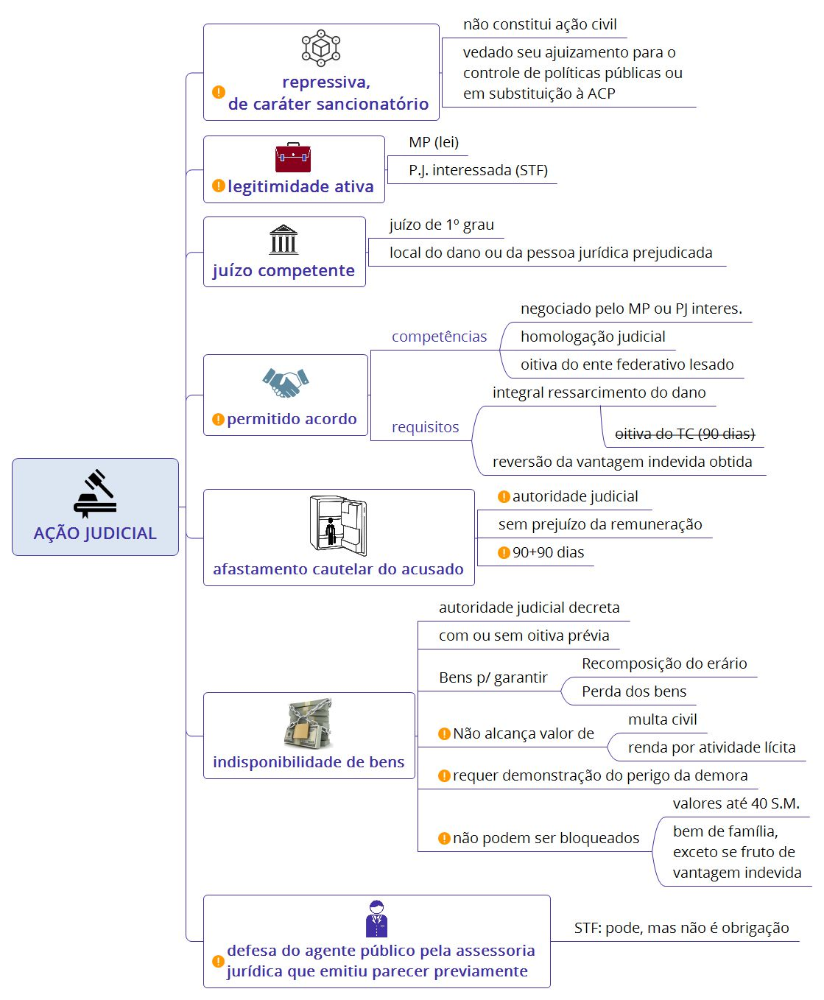

### Prescrição

A prescrição, no âmbito da LIA, é a perda do direito do Estado de propor a ação judicial e aplicar as sanções de improbidade, em razão do decurso de um prazo legal. Nos termos do art. 23 da LIA, as ações que buscam as sanções cominadas na LIA prescrevem em **8 (oito) anos**.

Este prazo é contado a partir da **ocorrência do fato** ou, no caso de infrações permanentes (aquelas cuja execução se prolonga no tempo), do **dia em que cessou a permanência**.

Neste ponto, a reforma promovida pela Lei 14.230/2021 facilitou significativamente a contagem. Anteriormente, a Lei previa três prazos distintos e complexos, a depender da natureza do vínculo do agente público. A reforma unificou todos os prazos em 8 (oito) anos.

| **Como era? (Antes de 2021)**                                                                                                                                                                                                                                                                                                                    | **Como ficou? (Após a Lei 14.230/2021)**                                                                                        |
| ------------------------------------------------------------------------------------------------------------------------------------------------------------------------------------------------------------------------------------------------------------------------------------------------------------------------------------------------ | ------------------------------------------------------------------------------------------------------------------------------- |
| - **5 anos** após o término do exercício de mandato, de cargo em comissão ou de função de confiança;  - **Prazo prescricional previsto em lei específica** (para demissão), nos casos de exercício de cargo efetivo ou de emprego;  - **5 anos** da data da apresentação da prestação de contas final no caso de entidades privadas. | **8 anos** para todos os casos, contados da:  - ocorrência do fato; ou  - sua cessação, para infrações permanentes. |

Aprofundando o tema, é necessário tratar da interrupção, da suspensão e da prescrição intercorrente, temas centrais trazidos pela Lei 14.230/2021.

#### Interrupção e Suspensão do Prazo Prescricional

Inicialmente, é crucial diferenciar os conceitos de "interrupção" e "suspensão" da prescrição, pois eles produzem efeitos distintos na contagem do prazo:

- **Suspensão:** É uma pausa. A contagem prescricional já iniciada é sustada (congelada). Desaparecida a causa suspensiva, o prazo **retoma a contagem de onde parou**. O tempo que já havia corrido antes da pausa é aproveitado.
- **Interrupção:** É um reinício. A contagem prescricional já iniciada é sustada, e o tempo que já havia corrido é eliminado, "zerando" o cronômetro. Após a causa interruptiva, o prazo recomeça do zero (respeitada a prescrição intercorrente, como veremos).

Dito isto, a Lei 8.429/1992 previu basicamente três causas que **interrompem** a prescrição (art. 23, § 4º):

**Causas de Interrupção da Prescrição:**

1. O ajuizamento da ação por improbidade administrativa;
2. A publicação da sentença condenatória;
3. A publicação de decisão ou acórdão de Tribunal (TJ, TRF, STJ ou STF) que confirma a sentença/acórdão condenatório ou que reforma uma sentença/acórdão de improcedência (absolvição).

Quando surge alguma das causas de interrupção, o prazo recomeça a correr do dia do evento (da interrupção), mas ele recomeça pela **metade do prazo original** (art. 23, § 5º). Portanto, apesar de a interrupção “zerar a contagem”, após a primeira interrupção (com o ajuizamento da ação), o prazo prescricional para a sentença (chamada prescrição intercorrente) passará a ser de **4 (quatro) anos**.

Por outro lado, tratando-se da **suspensão** da prescrição, o legislador previu as seguintes causas suspensivas (art. 23, § 1º), que ocorrem na fase de investigação, antes da ação judicial:

**Causas de Suspensão da Prescrição:**

1. A instauração de Inquérito Civil;
2. A instauração de Processo Administrativo para apuração dos ilícitos.

Nestes casos, a prescrição fica suspensa por, no máximo, **180 dias corridos**. O prazo recomeça a correr (de onde parou) após a conclusão do inquérito/processo ou, caso não concluídos, recomeça automaticamente após esgotado o prazo de 180 dias.

##### Extensão dos Efeitos da Sustação

Considerando que muitas vezes uma ação por improbidade tem vários acusados e apura vários fatos, o legislador deixou claro que:

- Tanto a suspensão como a interrupção da prescrição produzem efeitos sobre **todos os que concorreram** para a prática do ato de improbidade (art. 23, § 6º).
- Dentro de um mesmo processo, a suspensão e a interrupção relativas a um ato de improbidade **estendem-se aos demais atos de improbidade conexos** (art. 23, § 7º).

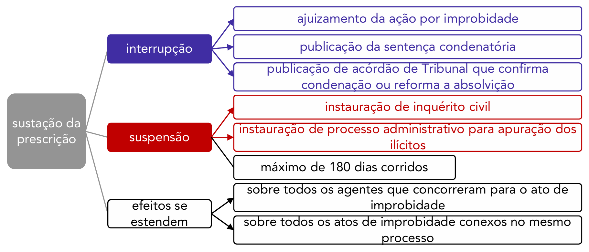

Após conhecermos as causas que interferem na contagem do prazo prescricional, trataremos da prescrição intercorrente, que se dá durante a ação judicial.

