# Capítulo 13 – Lei nº 13.709/2018: Lei Geral de Proteção de Dados Pessoais

## Noções Gerais

A Lei Geral de Proteção de Dados (LGPD), Lei nº 13.709 de 2018, é um marco legislativo que visa a garantir a segurança de dados pessoais. Seu objetivo principal é proteger os direitos fundamentais de **privacidade**, **liberdade** e o livre **desenvolvimento da personalidade** da pessoa física (também chamada de "pessoa natural").

Esta lei surgiu em um contexto global de crescente preocupação com a segurança virtual, o uso indiscriminado e, por vezes, abusivo de informações pessoais por grandes empresas de tecnologia (as "Big Techs") e a necessidade de combater fraudes e crimes virtuais. A LGPD estabelece um conjunto de regras claras sobre _como_ os dados pessoais podem ser coletados, armazenados, processados, compartilhados e eliminados.

Um exemplo prático e cotidiano da aplicação da LGPD ocorre no balcão de uma farmácia. Quando o estabelecimento solicita o CPF do cliente em troca de um "desconto", o consumidor (titular do dado) passa a ter o direito de saber _para que_ seu CPF está sendo coletado, _com quem_ ele será compartilhado (ex: planos de saúde, seguradoras, indústria farmacêutica) e _como_ ele pode solicitar a exclusão desse dado. A LGPD veio para regular exatamente esse tipo de transação de dados, que antes ocorria sem qualquer controle.

A boa notícia é que a cobrança da Lei em provas, em geral, tem sido bastante literal, exigindo uma noção geral da norma e detalhes dos pontos mais importantes, como os fundamentos, os princípios, os direitos do titular e as bases legais para o tratamento de dados.

### LGPD e a Lei de Acesso à Informação (LAI)

A LGPD não foi a primeira norma a tratar da privacidade de dados no âmbito público. A Lei de Acesso à Informação (LAI – Lei 12.527/2011) já definia o que é considerado "informação pessoal" e estabelecia diretrizes claras para seu tratamento pelo poder público (notadamente a regra de restrição de acesso por 100 anos).

A LGPD, portanto, vem para **detalhar** e **complementar** a LAI. Ela estabelece um regime muito mais robusto e específico sobre _como_ deve ocorrer o "tratamento" desses dados. Suas regras devem ser respeitadas **tanto pela Administração Pública** (dialogando com as regras da LAI) quanto **pelos particulares em geral** (empresas, associações, etc.), criando, pela primeira vez, um padrão nacional unificado de proteção.

### Fundamento Constitucional

A importância da proteção de dados foi tão reconhecida que, após a promulgação da LGPD, o próprio texto constitucional foi alterado. A **Emenda Constitucional nº 115, de 2022**, elevou a proteção de dados pessoais ao patamar de **direito fundamental autônomo**, inserindo-o no Art. 5º da Constituição:

> **CF, art. 5º, LXXIX -** é assegurado, nos termos da lei, o direito à proteção dos dados pessoais, inclusive nos meios digitais.

Isso significa que a proteção de dados não é mais apenas uma regra legal (infraconstitucional), mas uma garantia fundamental, no mesmo nível do direito à vida, à liberdade e à privacidade, conferindo o mais alto grau de blindagem jurídica ao tema.

### Estrutura da Lei

Para dominar a LGPD, é útil conhecer sua estrutura, que é dividida em 10 capítulos:

1. **Disposições Preliminares:** definições, princípios, fundamentos e campo de aplicação (arts. 1º a 6º);
2. **Tratamento de Dados Pessoais:** hipóteses em que os dados devem ser tratados, consentimento do titular, dados sensíveis, dados de crianças e adolescentes e término do tratamento dos dados (arts. 7º a 16);
3. **Direitos do Titular dos Dados:** direitos do titular dos dados, meios de defesa e procedimento para confirmação da existência de dados pessoais (arts. 17 a 22);
4. **Tratamento de Dados pelo Poder Público:** condições para tratamento de dados e responsabilidades (arts. 23 a 32);
5. **Transferência Internacional de Dados:** hipóteses permitidas e requisitos (arts. 33 a 36);
6. **Agentes de Tratamento de Dados Pessoais:** controlador, operador e encarregado e responsabilidades (arts. 37 a 45);
7. **Segurança dos Dados e Boas Práticas:** diretrizes sobre sigilo dos dados (arts. 46 a 51);
8. **Fiscalização por Infrações à LGPD:** penalidades aplicáveis por infração à Lei (arts. 52 a 54);
9. **Agência Nacional de Proteção de Dados (ANPD):** natureza e estrutura da ANPD e do CNPD (arts. 55-A a 58-B);
10. **Disposições Finais e Transitórias:** vigência e regras finais (arts. 60 a 65).

## Disposições Gerais

A LGPD dispõe sobre o **tratamento** de dados pessoais, inclusive nos meios digitais. O termo "tratamento" é extremamente amplo e abrange qualquer operação realizada com o dado: coleta, produção, recepção, classificação, utilização, acesso, reprodução, transmissão, distribuição, processamento, arquivamento, armazenamento, eliminação, avaliação, controle, modificação, comunicação, transferência, difusão ou extração.

Suas regras devem ser observadas por **pessoa natural** (uma pessoa física, como um profissional liberal que coleta dados de clientes) ou por **pessoa jurídica**, seja ela de **direito público** (órgãos, autarquias) ou **privado** (empresas, associações).

Como a LGPD é uma **norma de interesse nacional** (assim como a Lei de Licitações ou o Código de Trânsito), suas normas gerais devem ser observadas obrigatoriamente pela União, Estados, Distrito Federal e Municípios.

O objetivo central da LGPD, conforme já mencionado, é proteger os direitos fundamentais de liberdade e de privacidade e o livre desenvolvimento da personalidade da pessoa natural (o titular do dado).

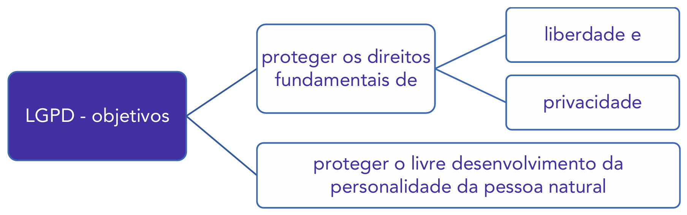

### Âmbito de Aplicação Territorial

A LGPD tem uma aplicação que "extrapola" as fronteiras físicas do Brasil, focando na proteção do dado do indivíduo que está no país. A lei se aplica a qualquer operação de tratamento realizada por pessoa (física ou jurídica, pública ou privada), independentemente do meio (físico ou digital), do país de sua sede ou do país onde estejam localizados os dados, **desde que** (art. 3º):

1. O tratamento (a operação) seja realizado no **território nacional**;
2. O tratamento tenha por objetivo o **fornecimento de bens ou serviços** ou o tratamento de dados de **indivíduos localizados no território nacional**; ou
3. Os dados pessoais objeto do tratamento tenham sido **coletados no território nacional**. (Consideram-se coletados no Brasil os dados cujo titular aqui se encontre no momento da coleta).

Percebe-se, portanto, que pouco importa onde os dados estão armazenados (ex: em "nuvem" na Irlanda) ou onde é a sede da empresa (ex: nos EUA). Se uma empresa americana coleta dados de pessoas que estão no Brasil para lhes oferecer serviços (como uma rede social ou um e-commerce), ela **deve** obedecer à LGPD.

A lei, contudo, cria uma exceção para dados vindos de fora: dados provenientes de fora do território nacional, que não sejam compartilhados com agentes de tratamento brasileiros nem transferidos para outro país além do Brasil, não atrairão a aplicação da LGPD, **desde que** o país de origem desses dados proporcione um grau de proteção de dados pessoais adequado (equivalente ao da LGPD).

#### Exceções: Onde a LGPD NÃO se Aplica (Art. 4º)

A LGPD não é absoluta. O art. 4º da lei estabelece um rol taxativo de situações em que o tratamento de dados pessoais **não** será regido por ela:

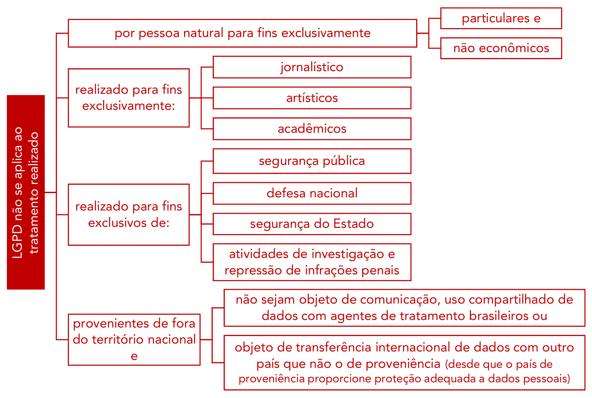

Analisando as exceções:

- **Fins Particulares e Não Econômicos:** É a exceção mais comum. A LGPD não se aplica ao tratamento feito por uma pessoa natural para fins exclusivamente particulares.
    - _Exemplo:_ A sua agenda de contatos pessoal no celular ou o cadastro de telefones de familiares e amigos. A lei só se aplica a partir do momento em que esse tratamento ganha uma finalidade econômica (ex: o médico que usa sua agenda de pacientes para marketing).
- **Fins Exclusivamente Jornalísticos, Artísticos ou Acadêmicos:** Nestes casos, a lei busca proteger a liberdade de imprensa, de expressão e a produção científica.
    - _Exceção da Exceção (Acadêmicos):_ Embora a lei não se aplique integralmente aos fins acadêmicos, ela determina que, mesmo nestes casos, os pesquisadores **devem** observar as bases legais de tratamento (previstas nos arts. 7º e 11), como a obtenção do consentimento ou a anonimização dos dados.
- **Fins Exclusivos de Segurança e Atividades Penais:** A LGPD não se aplica ao tratamento de dados realizado para fins exclusivos de:
    - Segurança pública;
    - Defesa nacional;
    - Segurança do Estado;
    - Atividades de investigação e repressão de infrações penais (ex: um inquérito policial).

Nestes casos de segurança e repressão penal, o tratamento será regido por uma **legislação específica**, que, embora ainda pendente de edição em muitos casos, deverá observar o devido processo legal e os princípios da LGPD.

A lei faz quatro observações importantes sobre esta exceção:

1. É **vedado** o tratamento desses dados (de segurança/penais) por **pessoa de direito privado** (ex: uma empresa de segurança privada), exceto se ela estiver sob a tutela direta do poder público (ex: uma empresa contratada para gerenciar câmeras de segurança pública, sob estrita supervisão estatal).
2. A **totalidade** dos dados de um banco de dados de segurança (ex: o banco de dados de antecedentes criminais) **não pode** ser tratada por pessoa de direito privado, salvo se ela for uma entidade com capital integralmente público (como uma empresa pública federal).
3. A **ANPD (Autoridade Nacional de Proteção de Dados)** poderá emitir opiniões técnicas e recomendações sobre esses tratamentos.
4. **Dados Provenientes de Fora do Território:** Conforme já mencionado na seção anterior.

### Definições

Para a correta aplicação da LGPD, o seu art. 5º estabelece um "dicionário" de conceitos fundamentais. A compreensão exata desses termos é essencial para a interpretação de toda a lei.

- **Titular:** É a **pessoa natural** a quem se referem os dados pessoais que são objeto de tratamento. O titular é o "dono" do dado, o centro da proteção da lei. É importante notar que a LGPD protege apenas pessoas naturais (pessoas físicas), não se aplicando, em regra, a dados de pessoas jurídicas (como CNPJ, faturamento da empresa, etc.).
- **Tratamento:** É um conceito extremamente amplo. A lei o define como **toda operação realizada com dados pessoais**, como as que se referem a coleta, produção, recepção, classificação, utilização, acesso, reprodução, transmissão, distribuição, processamento, arquivamento, armazenamento, eliminação, avaliação ou controle da informação, modificação, comunicação, transferência, difusão ou extração.
    - _Exemplo:_ O simples ato de "armazenar" um nome em uma planilha de Excel, ou "coletar" um e-mail em um site, já é considerado "tratamento" e deve obedecer à LGPD. O conceito abrange todo o ciclo de vida do dado.
- **Dado Pessoal:** É a informação relacionada a **pessoa natural identificada ou identificável**.
    - **Identificada:** É o dado que aponta diretamente para a pessoa (ex: nome completo, CPF, RG, CNH).
    - **Identificável:** É o dado que, sozinho, pode não identificar o titular, mas que, em conjunto com outros dados ou por meio de análise, permite a identificação (ex: um número de matrícula, o cargo em uma empresa pequena, o endereço IP, um cookie de navegador, a placa de um veículo particular).
- **Dado Pessoal Sensível:** É uma categoria de dado pessoal que, por sua natureza, tem maior potencial de causar **discriminação**. Por isso, a lei confere a ele uma proteção ainda mais rigorosa. O rol é taxativo (fechado) e inclui dados sobre: origem racial ou étnica, convicção religiosa, opinião política, filiação a sindicato ou a organização de caráter religioso, filosófico ou político, dado referente à saúde ou à vida sexual, dado genético ou biométrico, quando vinculado a uma pessoa natural.
    - _Exemplo:_ Um hospital que armazena prontuários (dado de saúde), um partido político que armazena a lista de seus filiados (dado de opinião política) ou uma academia que usa impressão digital para a catraca (dado biométrico) estão tratando dados sensíveis.

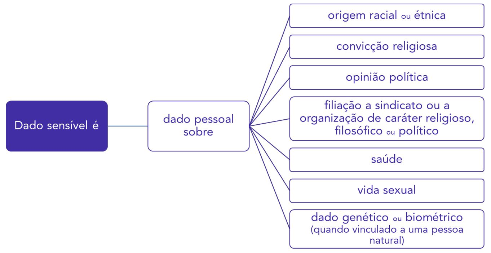

- **Dado Anonimizado:** É o dado relativo a um titular que **não possa ser identificado**. A anonimização é o processo que quebra o vínculo entre o dado e o titular, de forma que seja irreversível (ou que a reversão exija esforço desproporcional).
    - _Exemplo:_ Em uma pesquisa de saúde, remover o nome, CPF e endereço dos pacientes, mantendo apenas "Paciente do sexo masculino, 45 anos, residente na Região Sudeste".
- **Anonimização:** É a utilização de meios técnicos razoáveis e disponíveis no momento do tratamento, por meio dos quais um dado perde a possibilidade de associação, direta ou indireta, a um indivíduo. Um dado que foi verdadeiramente anonimizado não é mais considerado um dado pessoal e, portanto, **não se submete às regras da LGPD**.

- **Banco de Dados:** Conjunto estruturado de dados pessoais, estabelecido em um ou em vários locais, em suporte **eletrônico ou físico**. A LGPD protege não apenas o servidor de computador, mas também o arquivo físico de metal com as pastas de funcionários.
- **Agentes de Tratamento:** São aqueles que realizam o tratamento de dados: o **controlador** e o **operador**.
- **Controlador:** É a pessoa natural ou jurídica (pública ou privada) a quem competem as **decisões** referentes ao tratamento de dados pessoais. É quem define o "porquê" e "como" o dado será tratado.
    - _Exemplo:_ A farmácia que decide coletar CPFs para um programa de descontos é a **Controladora**.
- **Operador:** É a pessoa natural ou jurídica (pública ou privada) que realiza o tratamento de dados pessoais **em nome do controlador**. O operador "faz o que o controlador manda".
    - _Exemplo:_ A empresa de armazenamento em nuvem (como a Amazon AWS) que a farmácia contrata apenas para _armazenar_ o banco de dados dos clientes é a **Operadora**.
- **Encarregado:** É a pessoa (física ou natural) indicada pelo controlador e operador para atuar como **canal de comunicação** entre o controlador, os titulares dos dados e a Autoridade Nacional de Proteção de Dados (ANPD). É o "ponto de contato" para dúvidas e reclamações, também conhecido internacionalmente como _Data Protection Officer_ (DPO).
- **Autoridade Nacional:** A **Autoridade Nacional de Proteção de Dados (ANPD)**. A lei a define como "órgão" da administração pública, mas ela foi posteriormente transformada em uma **autarquia** de natureza especial (art. 55-A), o que lhe confere maior autonomia. A ANPD é a "guardiã" dos dados pessoais, sendo responsável por zelar, implementar e **fiscalizar** o cumprimento da LGPD, podendo aplicar as sanções (multas).
- **Órgão de Pesquisa:** Órgão ou entidade (pública ou privada sem fins lucrativos) que tenha em sua missão institucional a pesquisa básica ou aplicada de caráter histórico, científico, tecnológico ou estatístico. A lei confere um tratamento diferenciado (mais flexível) para órgãos de pesquisa.
- **Consentimento:** É a base legal "padrão" para o tratamento. É a **manifestação livre, informada e inequívoca** pela qual o titular concorda com o tratamento de seus dados pessoais para uma **finalidade determinada**.
    - _Livre:_ Não pode ser obtido sob coação.
    - _Informada:_ O titular deve saber exatamente o que está consentindo.
    - _Inequívoca:_ Deve ser um ato positivo (como marcar uma caixa de seleção), não podendo ser presumido ou estar embutido em longos termos de uso.
    - _Finalidade Determinada:_ O consentimento para "fins de marketing" não pode ser usado para "vender os dados a terceiros".
- **Bloqueio:** É a **suspensão temporária** de qualquer operação de tratamento. O dado é "congelado", mas não apagado.
- **Eliminação:** É a **exclusão** (ato definitivo) de dado ou de conjunto de dados armazenados. (Atenção para não confundir bloqueio, que é temporário, com eliminação, que é permanente).
- **Transferência Internacional de Dados:** Transferência de dados pessoais para país estrangeiro ou organismo internacional do qual o país seja membro.
- **Uso Compartilhado de Dados:** Comunicação, difusão, transferência, interconexão ou tratamento compartilhado de bancos de dados pessoais entre órgãos públicos, entre públicos e privados, ou entre entes privados.
    - _Exemplo:_ O compartilhamento do banco de dados do SUS (Ministério da Saúde) com o Ministério do Desenvolvimento Social para a gestão do Bolsa Família.
- **Relatório de Impacto à Proteção de Dados Pessoais:** É a documentação do controlador que contém a descrição dos processos de tratamento de dados que podem gerar **altos riscos** às liberdades civis e aos direitos fundamentais. É um estudo de impacto (similar a um estudo de impacto ambiental) que analisa os riscos e as medidas de mitigação, exigido para tratamentos sensíveis ou em larga escala.

Conforme redação original:

> **Art. 5º Para os fins desta Lei, considera-se:**
> 
> **I - dado pessoal:** informação relacionada a pessoa natural identificada ou identificável;
> **II - dado pessoal sensível:** dado pessoal sobre origem racial ou étnica, convicção religiosa, opinião política, filiação a sindicato ou a organização de caráter religioso, filosófico ou político, dado referente à saúde ou à vida sexual, dado genético ou biométrico, quando vinculado a uma pessoa natural;
> **III - dado anonimizado:** dado relativo a titular que não possa ser identificado, considerando a utilização de meios técnicos razoáveis e disponíveis na ocasião de seu tratamento;
> **IV - banco de dados:** conjunto estruturado de dados pessoais, estabelecido em um ou em vários locais, em suporte eletrônico ou físico;
> **V - titular:** pessoa natural a quem se referem os dados pessoais que são objeto de tratamento;
> **VI - controlador:** pessoa natural ou jurídica, de direito público ou privado, a quem competem as decisões referentes ao tratamento de dados pessoais;
> **VII - operador:** pessoa natural ou jurídica, de direito público ou privado, que realiza o tratamento de dados pessoais em nome do controlador;
> **VIII - encarregado:** pessoa indicada pelo controlador e operador para atuar como canal de comunicação entre o controlador, os titulares dos dados e a Agência Nacional de Proteção de Dados – ANPD;
> **IX - agentes de tratamento:** o controlador e o operador;
> **X - tratamento:** toda operação realizada com dados pessoais, como as que se referem a coleta, produção, recepção, classificação, utilização, acesso, reprodução, transmissão, distribuição, processamento, arquivamento, armazenamento, eliminação, avaliação ou controle da informação, modificação, comunicação, transferência, difusão ou extração;
> **XI - anonimização:** utilização de meios técnicos razoáveis e disponíveis no momento do tratamento, por meio dos quais um dado perde a possibilidade de associação, direta ou indireta, a um indivíduo;
> **XII - consentimento:** manifestação livre, informada e inequívoca pela qual o titular concorda com o tratamento de seus dados pessoais para uma finalidade determinada;
> **XIII - bloqueio:** suspensão temporária de qualquer operação de tratamento, mediante guarda do dado pessoal ou do banco de dados;
> **XIV - eliminação:** exclusão de dado ou de conjunto de dados armazenados em banco de dados, independentemente do procedimento empregado;
> **XV - transferência internacional de dados:** transferência de dados pessoais para país estrangeiro ou organismo internacional do qual o país seja membro;
> **XVI - uso compartilhado de dados:** comunicação, difusão, transferência internacional, interconexão de dados pessoais ou tratamento compartilhado de bancos de dados pessoais por órgãos e entidades públicos no cumprimento de suas competências legais, ou entre esses e entes privados, reciprocamente, com autorização específica, para uma ou mais modalidades de tratamento permitidas por esses entes públicos, ou entre entes privados;
> **XVII - relatório de impacto à proteção de dados pessoais:** documentação do controlador que contém a descrição dos processos de tratamento de dados pessoais que podem gerar riscos às liberdades civis e aos direitos fundamentais, bem como medidas, salvaguardas e mecanismos de mitigação de risco;
> **XVIII - órgão de pesquisa:** órgão ou entidade da administração pública direta ou indireta ou pessoa jurídica de direito privado sem fins lucrativos legalmente constituída sob as leis brasileiras, com sede e foro no País, que inclua em sua missão institucional ou em seu objetivo social ou estatutário a pesquisa básica ou aplicada de caráter histórico, científico, tecnológico ou estatístico; e
> **XIX - autoridade nacional:** entidade da administração pública responsável por zelar, implementar e fiscalizar o cumprimento desta Lei em todo o território nacional.

### Fundamentos da LGPD

A Lei Geral de Proteção de Dados Pessoais não é uma norma isolada; ela se baseia em um conjunto de valores e objetivos sociais e constitucionais. O art. 2º da lei estabelece os **fundamentos** da disciplina de proteção de dados, que representam o "porquê" da existência da lei.

Analisando estes fundamentos, destacam-se dois pilares centrais:

1. **Proteção da Pessoa Natural:** A lei fundamenta-se no **respeito à privacidade** (o direito de ser deixado em paz) e, de forma mais moderna, na **autodeterminação informativa**. Este conceito, importado do direito alemão, estabelece que o indivíduo tem o direito de decidir o que é feito com suas informações, controlando o fluxo de seus próprios dados. Isso se soma à proteção de direitos constitucionais como a honra, a imagem e o livre desenvolvimento da personalidade.
2. **Desenvolvimento Econômico e a Inovação:** A LGPD não foi criada para "parar" a economia digital. Pelo contrário, ela se fundamenta na **inovação**, no **desenvolvimento econômico e tecnológico**, na **livre iniciativa** e na **livre concorrência**. O objetivo da lei não é proibir o uso de dados, mas criar um ambiente de segurança jurídica onde o tratamento de dados possa ocorrer de forma ética, transparente e segura, fortalecendo a **defesa do consumidor** e a confiança nas relações digitais.

### Princípios

Enquanto os fundamentos são o "porquê" da lei, os princípios (art. 6º) são o "como". Eles são as regras de ouro que devem nortear **todas** as atividades de tratamento de dados pessoais, desde a coleta até a eliminação. O tratamento de dados deve observar a **boa-fé** e os dez princípios a seguir:

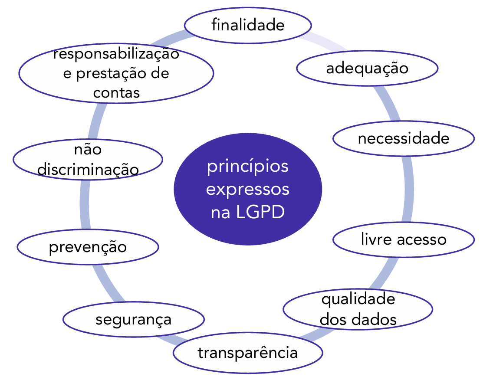

#### Finalidade

O princípio da finalidade informa sobre a realização do tratamento dos dados para **propósitos legítimos, específicos, explícitos e informados ao titular**, sem possibilidade de tratamento posterior de forma incompatível com essas finalidades.

- **Explicação:** Este é o princípio da "transparência na coleta". Não se pode coletar dados para "fins genéricos". O titular deve saber exatamente _para quê_ seu dado está sendo coletado.
- **Exemplo:** Se um aplicativo coleta a geolocalização do usuário com a finalidade específica de "fornecer a previsão do tempo", ele não pode, posteriormente, usar essa mesma geolocalização para uma finalidade diferente (como "vender os dados de deslocamento para empresas de publicidade") sem informar e obter uma nova base legal para isso.

#### Adequação

O princípio da adequação diz respeito à **compatibilidade entre o tratamento e as finalidades informadas** ao titular, de acordo com o contexto do tratamento.

- **Explicação:** O tratamento deve ser compatível (fazer sentido) com o que foi informado ao titular.
- **Exemplo:** Se a finalidade é "envio de newsletter por e-mail", é _adequado_ coletar o nome e o e-mail. Não é _adequado_ (e fere também a necessidade) coletar o CPF ou o endereço residencial para essa finalidade.

#### Necessidade

Por sua vez, o princípio da necessidade está ligado à **limitação do tratamento ao mínimo necessário** para a realização de suas finalidades, com abrangência dos dados pertinentes, proporcionais e não excessivos em relação às finalidades do tratamento de dados.

- **Explicação:** Este é também conhecido como o princípio da "minimização dos dados". O controlador só deve coletar o que for estritamente necessário para cumprir a finalidade informada.
- **Exemplo:** Para um cadastro de "fidelidade" em uma loja, que visa a apenas vincular compras ao cliente, a coleta do CPF pode ser _necessária_. A coleta da convicção religiosa ou da filiação sindical do cliente é, evidentemente, _excessiva_ e desnecessária para essa finalidade.

#### Livre Acesso

O princípio do livre acesso relaciona-se à garantia, aos titulares, de **consulta facilitada e gratuita** sobre o tratamento de seus dados, sua forma e duração, bem como sobre a integralidade de seus dados pessoais.

- **Explicação:** O titular tem o direito de perguntar "o que vocês têm sobre mim?" a qualquer momento, e a resposta deve ser fácil e gratuita. A empresa não pode cobrar uma taxa ou criar um caminho burocrático complexo para o titular acessar seus próprios dados.

#### Qualidade dos Dados

O princípio da qualidade dos dados diz respeito à garantia, aos titulares, de **exatidão, clareza, relevância e atualização** dos dados, de acordo com a necessidade e para o cumprimento da finalidade de seu tratamento.

- **Explicação:** Os bancos de dados devem ser "limpos" e corretos. A empresa (controlador) tem o dever de garantir que os dados armazenados estejam corretos e atualizados, permitindo que o titular os corrija facilmente.
- **Exemplo:** Manter um endereço de entrega antigo de um cliente, mesmo após ele ter informado o novo endereço, viola o princípio da qualidade (atualização).

#### Transparência

Relacionado ao “livre acesso” temos o princípio da transparência, que garante, aos titulares, **informações claras, precisas e facilmente acessíveis** sobre a realização do tratamento e os respectivos agentes de tratamento, observados os segredos comercial e industrial.

- **Explicação:** As informações sobre o tratamento (como as "Políticas de Privacidade") devem ser fáceis de entender. Elas não podem ser documentos longos, confusos ou escritos em linguagem jurídica hermética, escondidos no rodapé de um site.

#### Segurança

O princípio da segurança relaciona-se à utilização de **medidas técnicas e administrativas** aptas a proteger os dados pessoais de acessos não autorizados e de situações acidentais ou ilícitas de destruição, perda, alteração, comunicação ou difusão.

- **Explicação:** É o dever de implementar a proteção na prática. Isso inclui medidas técnicas (como criptografia, firewalls, controle de login) e administrativas (como treinamento de funcionários, política de senhas, controle de acesso físico a salas de servidores).

#### Prevenção

O princípio da prevenção consiste na **adoção de medidas para prevenir** a ocorrência de danos em virtude do tratamento de dados pessoais.

- **Explicação:** Este princípio é proativo. Enquanto a _Segurança_ reage a ameaças, a _Prevenção_ busca antecipar os riscos _antes_ que eles ocorram. É o dever de pensar em "privacidade desde a concepção" (_privacy by design_), analisando os riscos de um novo produto ou sistema antes de seu lançamento.

#### Não Discriminação

O princípio da não discriminação informa a **impossibilidade de realização do tratamento para fins discriminatórios ilícitos ou abusivos**.

- **Explicação:** Os dados pessoais, especialmente os sensíveis, não podem ser usados como base para decisões discriminatórias.
- **Exemplo:** Um banco não pode negar um empréstimo (ou oferecer taxas piores) a um cliente com base, unicamente, em sua origem racial, opinião política ou dados de saúde (fins discriminatórios ilícitos).

#### Responsabilização e Prestação de Contas

Por fim, o princípio da “responsabilização e prestação de contas“ (_accountability_, em inglês) representa a **demonstração, pelo agente de tratamento de dados, da adoção de medidas eficazes** e capazes de comprovar a observância e o cumprimento das normas de proteção de dados pessoais e, inclusive, da eficácia dessas medidas.

- **Explicação:** Não basta _cumprir_ a LGPD; é preciso _provar_ que cumpriu. O controlador deve ser capaz de prestar contas à ANPD e aos titulares, mantendo registros de suas operações de tratamento (o "RoPA"), relatórios de impacto e todas as evidências de que agiu de forma diligente para proteger os dados.

### Quadro Comparativo: Objetivos, Fundamentos e Princípios

| **Objetivos**                                                                                                                  | **Fundamentos**                                                                                                                                                                                                                                                                                                                                                                                                                                                  | **Princípios**                                                                                                                                                                                                                                   |
| ------------------------------------------------------------------------------------------------------------------------------ | ---------------------------------------------------------------------------------------------------------------------------------------------------------------------------------------------------------------------------------------------------------------------------------------------------------------------------------------------------------------------------------------------------------------------------------------------------------------- | ------------------------------------------------------------------------------------------------------------------------------------------------------------------------------------------------------------------------------------------------ |
| • proteger os direitos de liberdade e privacidade  • proteger o livre desenvolvimento da personalidade da pessoa natural | • respeito à privacidade  • autodeterminação informativa  • liberdade de expressão, informação, comunicação e opinião  • inviolabilidade da intimidade, honra e imagem  • inovação e o desenvolvimento econômico, tecnológico  • livre iniciativa, livre concorrência e defesa do consumidor  • direitos humanos e livre desenvolvimento da personalidade  • dignidade e exercício da cidadania pelas pessoas naturais | • finalidade  • adequação  • necessidade  • livre acesso  • qualidade dos dados  • transparência  • segurança  • prevenção  • não discriminação  • responsabilização e prestação de contas |

## Tratamentos de Dados Pessoais

Neste capítulo, estudaremos as hipóteses em que os dados poderão ser tratados (conhecidas como "bases legais"), como se dá o tratamento de dados pessoais sensíveis e o tratamento de dados de crianças e adolescentes, bem como as regras para o término do tratamento dos dados pessoais.

### Conceito de Tratamento de Dados Pessoais

Primeiramente, é fundamental reiterar o que a LGPD define como "tratamento" de dados pessoais, pois é este conceito que delimita a aplicação da lei. O tratamento representa toda e qualquer operação de informação relacionada a uma pessoa natural.

De modo mais detalhado, a literalidade da LGPD (art. 5º, X) é intencionalmente abrangente para cobrir todo o ciclo de vida do dado, desde sua criação até sua destruição:

> **Art. 5º, X -** toda operação realizada com dados pessoais, como as que se referem a coleta, produção, recepção, classificação, utilização, acesso, reprodução, transmissão, distribuição, processamento, arquivamento, armazenamento, eliminação, avaliação ou controle da informação, modificação, comunicação, transferência, difusão ou extração.

A amplitude desta definição é o que torna a lei tão impactante. Qualquer ação, da mais simples à mais complexa, é considerada "tratamento".

Exemplos práticos incluem:

- a coleta do endereço residencial por uma empresa de _e-commerce_ para realizar uma entrega;
- o armazenamento dos nomes dos filhos de um servidor por um órgão público (para fins de cadastro funcional ou imposto de renda);
- a captura de um endereço de e-mail por um site de compras para o envio de _newsletters_;
- o cadastro da data de nascimento pelo empregador no sistema de Recursos Humanos;
- a simples visualização (acesso) de um prontuário médico por um profissional de saúde.

Em síntese, em todos estes casos teremos o dado de uma pessoa (o “dado pessoal”) sendo coletado, processado, acessado ou armazenado (isto é, “tratado”). Esta ação de tratar o dado é o que gera a obrigação do controlador (a empresa ou órgão público) de respeitar a série de regras da LGPD, estabelecidas para resguardar os direitos fundamentais à intimidade, à vida privada (CF, art. 5º, X) e o direito ao conhecimento de informações relativas à pessoa do impetrante (_habeas data_ - CF, art. 5º, LXXII), entre outros.

### Hipóteses para Tratamento de Dados Pessoais (Bases Legais)

Para proteger seus titulares, a LGPD estabelece uma regra fundamental: o tratamento de dados pessoais é, em princípio, proibido. Ele só se torna lícito (permitido) se o controlador puder "encaixar" sua operação em uma das 10 (dez) hipóteses autorizadoras previstas no artigo 7º. Essas hipóteses são conhecidas como **"bases legais"**.

O tratamento de dados pessoais somente poderá ser realizado nas seguintes hipóteses (art. 7º):

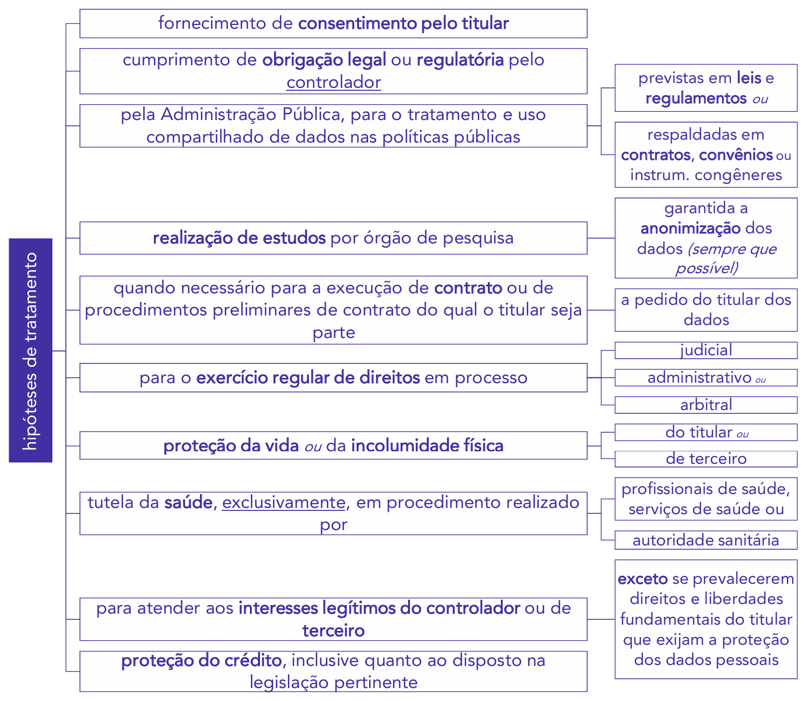

Note que apenas na 1ª hipótese (inciso I) exige-se o **consentimento** do titular. Em todas as outras nove hipóteses (incisos II a X), o tratamento de dados pessoais poderá ocorrer **mesmo sem o consentimento** (e até contra a vontade) do titular, desde que o controlador cumpra os requisitos da base legal invocada.

#### Análise das Principais Bases Legais

**1. Consentimento do Titular (Inciso I):**

Esta é a base legal mais conhecida. O titular, de forma livre, informada e inequívoca, autoriza o tratamento para uma finalidade determinada.

Se o controlador que recebeu o consentimento (ex: um site de notícias) necessitar compartilhar esses dados pessoais com _outros controladores_ (ex: uma agência de publicidade parceira), ele deverá, em regra, obter um **consentimento específico** do titular para esta finalidade de compartilhamento (art. 7º, § 5º). O consentimento para "receber newsletter" não autoriza, automaticamente, o "compartilhamento com terceiros".

> **PONTO DE ATENÇÃO:** A dispensa do consentimento (ou seja, o uso das outras nove bases legais) **não desobriga** os agentes de tratamento das demais obrigações da LGPD, especialmente a observância de todos os **princípios** (finalidade, necessidade, adequação, etc.) e a garantia dos **direitos do titular** (como o acesso e a correção) (art. 7º, § 6º).

**2. Cumprimento de Obrigação Legal ou Regulatória (Inciso II):**

Esta é uma das bases legais mais utilizadas pelo Poder Público e por empresas. O tratamento é permitido porque uma lei ou uma norma regulatória obriga o controlador a fazê-lo.

- **Exemplo:** O empregador (controlador) não precisa pedir consentimento para tratar os dados pessoais de seus empregados ao informá-los no eSocial (Previdência Social) ou durante uma fiscalização do Ministério do Trabalho. Ele está, simplesmente, cumprindo uma obrigação legal.

**3. Pela Administração Pública (Inciso III):**

Base legal específica para o Poder Público tratar e compartilhar dados necessários à execução de políticas públicas previstas em leis, regulamentos, contratos ou convênios.

**4. Realização de Estudos por Órgão de Pesquisa (Inciso IV):**

Permite o tratamento para fins de pesquisa, garantida, sempre que possível, a anonimização dos dados pessoais.

**5. Execução de Contrato (Inciso V):**

Permite o tratamento quando necessário para a execução de contrato (ou procedimentos preliminares) do qual o titular seja parte.

- **Exemplo:** Uma loja virtual não precisa de consentimento para tratar o endereço do cliente (dado pessoal), pois esse tratamento é _necessário_ para executar o contrato de compra e venda (a entrega do produto).

**6. Exercício Regular de Direitos (Inciso VI):**

Permite o tratamento para o uso em processo judicial, administrativo ou arbitral.

- **Exemplo:** Uma empresa que armazena os registros de ponto de um ex-funcionário, mesmo após a demissão, para se defender em uma futura reclamação trabalhista.

**7. Proteção da Vida (Inciso VII):**

Permite o tratamento para a proteção da vida ou da incolumidade física do titular ou de terceiro. É uma base legal usada em emergências.

- **Exemplo:** Um hospital que recebe um paciente desacordado e acessa seu histórico médico (dado pessoal) no sistema de outro hospital para salvar sua vida, mesmo sem o consentimento do paciente (que está incapaz de dá-lo).

**8. Tutela da Saúde (Inciso VIII):**

Permite o tratamento para a tutela da saúde, exclusivamente, em procedimento realizado por profissionais de saúde, serviços de saúde ou autoridade sanitária.

**9. Legítimo Interesse (Inciso IX):**

Esta é a base legal mais flexível e, ao mesmo tempo, a mais complexa. Permite o tratamento para atender aos interesses legítimos do controlador ou de terceiro, exceto se prevalecerem os direitos e liberdades fundamentais do titular.

O legítimo interesse somente poderá fundamentar o tratamento para finalidades legítimas, consideradas a partir de situações concretas, que incluem, mas não se limitam a (art. 10):

> Art. 10. O legítimo interesse do controlador somente poderá fundamentar tratamento de dados pessoais para finalidades legítimas, consideradas a partir de situações concretas, que incluem, mas não se limitam a:
> 
> I - apoio e promoção de atividades do controlador; e
> II - proteção, em relação ao titular, do exercício regular de seus direitos ou prestação de serviços que o beneficiem, respeitadas as legítimas expectativas dele e os direitos e liberdades fundamentais, nos termos desta Lei.

Quando o tratamento for baseado no legítimo interesse, o controlador deve observar duas regras estritas:

1. **Necessidade:** Somente os dados pessoais **estritamente necessários** para a finalidade pretendida poderão ser tratados (art. 10, § 1º).
2. **Transparência:** O controlador deverá adotar medidas para garantir a transparência do tratamento (art. 10, § 2º). A Autoridade Nacional (ANPD) poderá, inclusive, solicitar ao controlador um Relatório de Impacto à Proteção de Dados Pessoais quando o tratamento for baseado no legítimo interesse (art. 10, § 3º).

**10. Proteção do Crédito (Inciso X):**

Permite o tratamento de dados para a proteção do crédito (ex: análise de score de crédito por bancos, cadastro em serviços como Serasa/SPC).

#### Tratamento de Dados de Acesso Público

A lei também regula o uso de dados que já são públicos (ex: dados de um portal da transparência, de um cartório de registro de imóveis, ou de um perfil de rede social aberto).

- O tratamento de dados cujo acesso é público deve, ainda assim, considerar a **finalidade**, a **boa-fé** e o **interesse público** que justificaram sua disponibilização (art. 7º, § 3º).
- Se os dados pessoais foram tornados **manifestamente públicos pelo titular** (ex: o titular coloca seu telefone em um anúncio público), fica **dispensada a exigência de consentimento**, mas os princípios da LGPD e os direitos do titular devem ser resguardados (art. 7º, § 4º).
- O tratamento posterior desses dados públicos poderá ser realizado para **novas finalidades**, desde que observados os propósitos legítimos e específicos para o novo tratamento (art. 7º, § 7º).

#### Consentimento do Titular

Já sabemos que uma das dez hipóteses autorizadoras do tratamento de dados pessoais (uma das "bases legais") diz respeito ao consentimento dado pelo próprio titular do dado.

O consentimento é definido pela lei como a “manifestação **livre, informada e inequívoca** pela qual o titular concorda com o tratamento de seus dados pessoais para uma **finalidade determinada**” (art. 5º, XII). Esta definição é o pilar da base legal do consentimento, e cada um de seus termos tem um peso jurídico:

- **Livre:** O consentimento não pode ser obtido por coação. O titular deve ter uma escolha real, não podendo o consentimento ser usado como condição "pegar ou largar" para o acesso a um direito ou serviço essencial.
- **Informada:** O titular deve saber exatamente _o que_ está autorizando. Isso se conecta diretamente aos princípios da finalidade e da transparência.
- **Inequívoca:** A manifestação deve ser um ato positivo de concordância. O silêncio, a omissão ou o uso de caixas pré-marcadas (_opt-out_) não são, em regra, considerados consentimentos inequívocos. A regra deve ser o _opt-in_ (o titular realiza a ação de consentir).
- **Finalidade Determinada:** O consentimento é dado para um propósito específico, e não para qualquer uso futuro.

Nesse sentido, a LGPD prevê que tal consentimento seja fornecido **por escrito ou por outro meio** que demonstre a manifestação de vontade do titular (art. 8º).

- Se fornecido "por escrito" (como em um contrato de prestação de serviços ou um termo de adesão), a lei exige que o consentimento conste de **cláusula destacada** das demais cláusulas do contrato (art. 8º, § 1º). O objetivo é evitar que a autorização fique "escondida" no meio de longos textos jurídicos que o titular não lê.

O consentimento deverá referir-se a finalidades determinadas, sendo que as **autorizações genéricas** para o tratamento de dados pessoais serão consideradas **nulas** (art. 8º, § 4º).

- _Exemplo:_ Uma cláusula que diz: "Autorizo o uso dos meus dados para todas e quaisquer finalidades da empresa e de seus parceiros comerciais" é uma autorização genérica e, portanto, nula.

##### Ônus da Prova e Vícios de Consentimento

Como o consentimento para tratamento dos dados pessoais é um ponto central na LGPD, e visando a proteger o titular (a parte mais fraca da relação), o legislador previu que **cabe ao controlador o ônus da prova** de que o consentimento foi fornecido de acordo com as exigências da LGPD (art. 8º, § 2º).

- Isto significa que não cabe ao titular provar que _não_ consentiu; cabe à empresa (controlador) provar que obteve um consentimento válido (livre, informado, inequívoco e específico), por meio de registros de log, formulários assinados, etc.

Reforça tal proteção a vedação ao tratamento de dados pessoais mediante **vício de consentimento** (art. 8º, § 3º). Portanto, se o titular do dado fornece o consentimento mediante coação, erro, dolo, estado de perigo ou qualquer outro vício que afete sua livre vontade, o controlador estará impossibilitado de tratar tais dados.

##### Revogação do Consentimento (Art. 8º, § 5º)

O consentimento não é permanente. Ele pode ser **revogado a qualquer momento**, mediante manifestação expressa do titular. A lei exige que esta revogação seja feita por **procedimento gratuito e facilitado**. O mesmo canal usado para dar o consentimento deve servir para retirá-lo.

A revogação, todavia, somente gera efeitos "para frente" (_ex nunc_). Ela não prejudica o tratamento que foi realizado no passado, sob o amparo do consentimento original. Nesse sentido, a LGPD prevê que, havendo a revogação, são **ratificados os tratamentos realizados** sob amparo do consentimento anteriormente manifestado.

- **Ponto de Atenção (Revogação vs. Eliminação):** A "revogação" apenas impede novos tratamentos. Se o titular dos dados desejar impedir o uso do histórico (ou seja, apagar os dados que já foram tratados), ele não deve pedir apenas a revogação do consentimento, mas sim exercer seu direito de **eliminação** dos dados pessoais tratados (previsto no art. 18, VI).

##### Alteração da Finalidade (Art. 8º, § 6º)

Se o titular do dado forneceu seu consentimento para uma finalidade específica (ex: "cadastro para entrega do produto"), e o controlador decide alterar essa finalidade (ex: "usar também para análise de perfil de crédito"), a lei estabelece um rito simplificado.

Não se exige uma _renovação_ (um novo pedido) de consentimento para alterações de finalidade, forma, duração ou compartilhamento. O controlador deverá, contudo, **informar ao titular** o teor das alterações.

Ao ser informado, o titular dos dados poderá optar por **revogar o consentimento**, caso discorde da alteração (nos casos em que o consentimento é a base legal exigida).

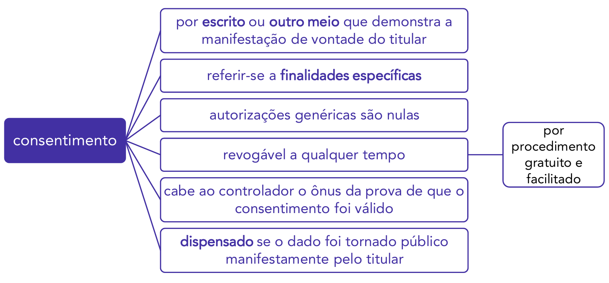

### Fornecimento de Informações ao Titular dos Dados Tratados (Art. 9º)

O **Princípio do Livre Acesso** (art. 6º, IV) e o **Princípio da Transparência** (art. 6º, VI) são materializados no art. 9º da LGPD. Este artigo estabelece que o titular dos dados tem o direito fundamental de obter acesso facilitado às informações sobre como seus dados estão sendo tratados.

A lei não exige apenas que a informação esteja _disponível_, mas que ela seja fornecida de forma **clara, adequada e ostensiva** (ou seja, de forma destacada, e não "escondida" em longos termos de uso).

As informações que devem ser disponibilizadas ao titular são:

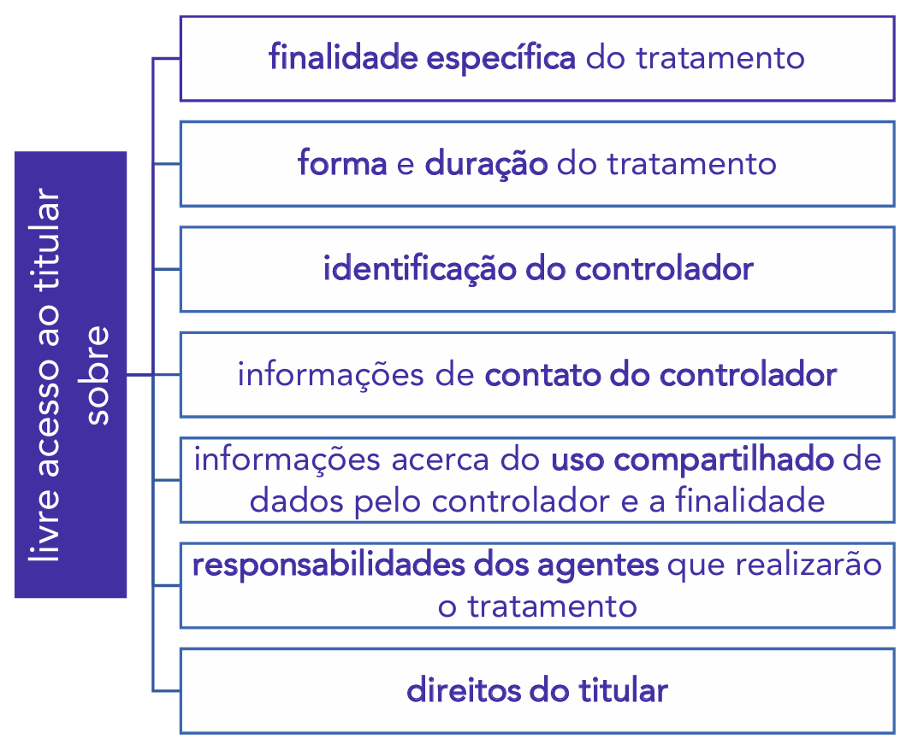

- **Finalidade específica:** O motivo exato pelo qual o dado está sendo coletado.
- **Forma e duração:** Como será o tratamento (armazenamento, compartilhamento, etc.) e por quanto tempo o dado será mantido.
- **Identificação e contato do controlador:** Quem é a empresa ou órgão responsável pela decisão do tratamento e como contatá-lo.
- **Uso compartilhado:** Se o dado será enviado a terceiros (outras empresas, outros órgãos públicos) e para qual finalidade.
- **Responsabilidades dos agentes:** Quem é o controlador e quem é o operador no processo.
- **Direitos do titular:** A própria empresa/órgão deve informar ao cidadão quais são seus direitos previstos na LGPD (como correção, eliminação, etc.).

##### Relação com o Consentimento (Art. 9º, §§ 1º e 2º)

A qualidade dessa informação prévia é crucial, especialmente quando a base legal utilizada é o **consentimento**.

- O consentimento será considerado **nulo** caso as informações fornecidas ao titular (listadas acima) tenham **conteúdo enganoso ou abusivo** ou não tenham sido apresentadas previamente com transparência, de forma clara e inequívoca (art. 9º, § 1º).
    - _Exemplo:_ Se uma Política de Privacidade afirma que os dados são usados apenas para "melhorar a experiência do usuário", mas na verdade são vendidos para _data brokers_, o consentimento obtido com base nessa informação enganosa é nulo.
- Se o consentimento foi obtido para uma finalidade e, posteriormente, houver **mudanças da finalidade** que não sejam compatíveis com o consentimento original, o controlador deverá **informar previamente** o titular sobre as mudanças. Diante da nova informação, o titular poderá **revogar o consentimento**, caso discorde das alterações (art. 9º, § 2º).

##### Tratamento como Condição para Fornecimento (Art. 9º, § 3º)

Em muitas situações, o tratamento de dados pessoais é uma condição obrigatória para o fornecimento de um produto, serviço ou para o exercício de um direito (ex: um banco _precisa_ tratar dados financeiros para conceder um empréstimo).

Nesses casos, a lei exige transparência máxima: o titular deverá ser **informado com destaque** sobre esse fato (de que o tratamento é obrigatório) e sobre os meios pelos quais poderá exercer seus direitos de titular de dados previstos na LGPD.

### Tratamento de Dados Pessoais Sensíveis

Estudamos, pouco acima, as hipóteses em que a LGPD permite o tratamento de dados pessoais comuns (art. 7º). O que veremos, neste tópico, são as regras específicas para o tratamento de dados que, por seu potencial discriminatório, foram considerados "sensíveis" pelo legislador.

O tratamento de dados sensíveis exige um nível de proteção ainda mais rigoroso do que o exigido para os dados pessoais em geral.

Relembrando a definição legal, dado pessoal sensível é o "dado pessoal sobre origem racial ou étnica, convicção religiosa, opinião política, filiação a sindicato ou a organização de caráter religioso, filosófico ou político, dado referente à saúde ou à vida sexual, dado genético ou biométrico, quando vinculado a uma pessoa natural" (art. 5º, II).

#### Hipóteses para Tratamento de Dados Pessoais Sensíveis (Art. 11)

De forma similar às bases legais do art. 7º (para dados comuns), o art. 11 da LGPD lista as hipóteses taxativas que permitem o tratamento de dados pessoais sensíveis. Este rol é **mais restrito** que o do art. 7º.

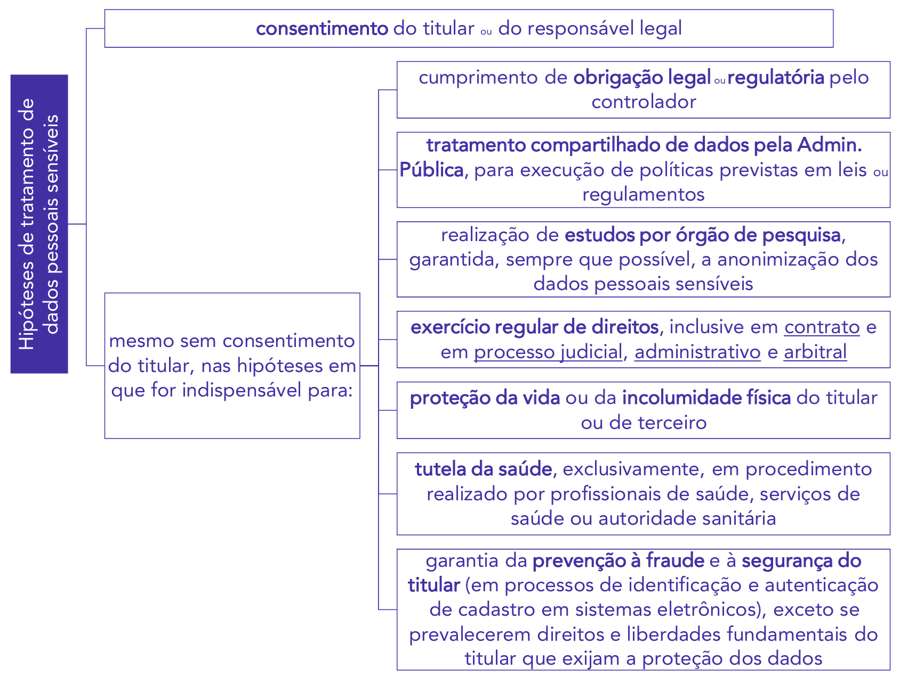

A partir do diagrama, percebe-se que o tratamento de dados sensíveis pode ocorrer em duas grandes vertentes:

1. **Com o consentimento do titular:** Esta é a hipótese principal. O titular (ou seu responsável legal) deve consentir de forma **específica e destacada**, para finalidades específicas.
2. **Sem o consentimento do titular:** O tratamento é permitido, mesmo sem consentimento, **apenas** nas hipóteses em que for **indispensável** para as sete finalidades listadas no diagrama (cumprimento de obrigação legal, políticas públicas, estudos, exercício regular de direitos, proteção da vida, tutela da saúde e prevenção à fraude).

Comparando as bases legais dos dados sensíveis (art. 11) com as dos dados comuns (art. 7º), notamos diferenças cruciais:

- **Não existe** a base legal do **"legítimo interesse"** para o tratamento de dados sensíveis. (Esta é a diferença mais importante).
- **Não existe** a base legal da **"proteção do crédito"** para dados sensíveis.
- O tratamento para **execução de contrato** (art. 7º, V) é mais restrito no art. 11, sendo limitado ao "exercício regular de direitos, _inclusive em contrato_...".
- Surge uma nova base legal específica: a **"garantia da prevenção à fraude e à segurança do titular"** em processos de identificação e autenticação de cadastro em sistemas eletrônicos (ex: o uso da biometria facial por um banco para autorizar uma transação).

A lei ainda esclarece que, no caso do tratamento de dados sensíveis pelo Poder Público para **cumprimento de obrigação legal** (uma das hipóteses de dispensa de consentimento), o órgão deverá dar **publicidade** a essa dispensa (art. 11, § 2º c/c art. 23, I).

#### Uso de Dado Sensível para Obter Vantagem Econômica

A LGPD demonstra uma preocupação especial com a monetização de dados sensíveis.

A lei determina que a comunicação ou o uso compartilhado de dados pessoais sensíveis entre controladores (ex: entre duas empresas diferentes) com o objetivo de **obter vantagem econômica** poderá ser objeto de **vedação** ou de regulamentação por parte da **ANPD** (Autoridade Nacional de Proteção de Dados) (art. 11, § 3º).

Contudo, no caso específico de **dados sensíveis referentes à saúde**, a LGPD já se antecipou e impôs uma vedação expressa: é **proibido** o compartilhamento ou a comunicação desses dados entre controladores com o objetivo de obter vantagem econômica (art. 11, § 4º).

- **Exceção à Vedação de Vantagem Econômica na Saúde:** A lei permite o compartilhamento de dados de saúde, mesmo que envolva transação financeira, nos casos indispensáveis para a prestação dos serviços em benefício do titular, como:
    - **Portabilidade** de dados (ex: levar seu histórico médico de um plano de saúde para outro); ou
    - **Transações financeiras e administrativas** resultantes do uso e da prestação dos serviços (ex: a comunicação entre o hospital e o plano de saúde para o faturamento do procedimento).

##### Vedação Específica para Planos de Saúde

Incorporando uma vedação que já era aplicável ao setor, a LGPD proíbe expressamente que operadoras de planos de saúde utilizem dados de saúde (sensíveis) para a **prática de seleção de riscos** na contratação de qualquer modalidade, ou para a contratação e exclusão de beneficiários (art. 11, § 5º).

- **Exemplo:** Um plano de saúde **não pode** usar um exame genético (dado sensível) de um candidato para negar sua adesão ao plano ou para cobrar dele um valor mais alto por prever um "risco" futuro de doença.

#### Dados Pessoais Anonimizados e Pseudonimização

Existe um procedimento, chamado **anonimização**, que pode ser aplicado aos dados pessoais para suprimir a informação sobre quem é seu titular. É o processo que torna o dado pessoal "anônimo".

A LGPD define tecnicamente a anonimização como:

> "utilização de meios técnicos razoáveis e disponíveis no momento do tratamento, por meio dos quais um dado perde a possibilidade de associação, direta ou indireta, a um indivíduo."

A Autoridade Nacional de Proteção de Dados (ANPD) poderá criar padrões e técnicas de anonimização e realizar verificações sobre sua segurança.

- **Exemplo:** Imagine um cadastro contendo o CPF e o Estado em que residem todos os brasileiros que tomaram vacina da Covid-19 do fabricante Pfizer (dado sensível):

**Tabela "Tomaram_vacina_Pfizer"**

| **CPF**        | **Estado de domicílio** |
| -------------- | ----------------------- |
| 111.111.111-11 | SP                      |
| 222.222.222-22 | RJ                      |
| 333.333.333-33 | SP                      |

Se o controlador deste cadastro eliminasse a informação do CPF (o dado identificador), o resultado seria uma lista de pessoas anônimas (pois sem qualquer forma de identificação) que tomaram a vacina da Pfizer. O dado resultante (o "dado anonimizado") permitiria conhecer em quais estados brasileiros mais foram aplicadas vacinas daquele fabricante, sem expor os titulares:

**Tabela "Tomaram_vacina_Pfizer_Anonimizada"**

| **Estado de domicílio** |
| ----------------------- |
| SP                      |
| RJ                      |
| SP                      |

De forma técnica, a LGPD define **dado anonimizado** como "dado relativo a titular que não possa ser identificado, considerando a utilização de meios técnicos razoáveis e disponíveis na ocasião de seu tratamento" (art. 5º, III).

##### Consequência Jurídica da Anonimização (Art. 12)

Eliminando a informação do titular do dado, a LGPD considera que, em regra, os **dados anonimizados não serão considerados dados pessoais** (art. 12). Esta é a consequência jurídica mais importante: um dado verdadeiramente anonimizado sai do escopo de aplicação da LGPD.

Contudo, este dado só é considerado anonimizado (e, portanto, fora da LGPD) **salvo** quando o processo de anonimização ao qual foi submetido puder ser **revertido**. A lei estabelece que um dado não é anonimizado se, "utilizando exclusivamente meios próprios, ou quando, com esforços razoáveis, puder ser revertido."

A LGPD estabelece que a determinação do que é "esforço razoável" (para se saber se o dado foi mesmo anonimizado) deve levar em consideração fatores objetivos, tais como o custo e o tempo necessários para reverter o processo de anonimização, de acordo com as tecnologias disponíveis (art. 12, § 1º).

##### Anonimização vs. Pseudonimização

Além da "anonimização", existe o procedimento de **"pseudonimização"**. É crucial não confundir os dois:

- **Anonimização:** A informação do titular é (em tese) permanentemente excluída. O objetivo é quebrar o vínculo.
- **Pseudonimização:** É uma técnica de segurança em que o dado é tratado para se retirar a informação do seu titular (substituindo-a por um código, por exemplo), mas se **mantém** a possibilidade de futuramente se encontrar e identificar seu titular, por meio de uma "chave" ou "informação adicional" mantida em separado e em segurança.

A principal diferença é que o dado **pseudonimizado** ainda é considerado um **dado pessoal** e continua sujeito à LGPD, pois o controlador ainda possui a "chave" para reverter o processo. A pseudonimização é uma medida de segurança (como a criptografia), enquanto a anonimização é uma medida de expurgo do dado pessoal.

Comparando as duas definições legais:

Por fim, a lei esclarece que poderão ser igualmente considerados como dados pessoais (mesmo que pareçam anonimizados) aqueles utilizados para a formação do **perfil comportamental** de determinada pessoa natural, **se identificada** (art. 12, § 2º).

#### Uso de Dados Pessoais em Estudos de Saúde Pública

A LGPD cria regras específicas para o uso de dados (incluindo sensíveis) em pesquisas. O art. 13 estabelece que, na realização de estudos em saúde pública, os **órgãos de pesquisa** (definidos no art. 5º) poderão ter acesso a bases de dados pessoais, dispensando-se o consentimento do titular.

Este acesso, contudo, é condicionado a salvaguardas rigorosas para proteger o titular:

1. Os dados serão tratados **exclusivamente dentro do órgão** e estritamente para a **finalidade de realização de estudos e pesquisas**;
2. Os dados serão mantidos em **ambiente controlado e seguro**;
3. O órgão de pesquisa deve adotar, **sempre que possível**, a **anonimização ou pseudonimização** dos dados, bem como considerar os devidos padrões éticos.

Quando os resultados dos estudos forem divulgados, a lei é categórica: sua divulgação **em nenhuma hipótese poderá revelar dados pessoais** (art. 13, § 1º).

Como se trata de dados de saúde (sensíveis), o órgão de pesquisa será o único responsável pela segurança da informação, sendo **vedada a transferência dos dados a terceiro**, em circunstância alguma (art. 13, § 2º).

#### Tratamento de Dados de Crianças e Adolescentes (Art. 14)

Segundo o Estatuto da Criança e do Adolescente (ECA), considera-se **criança** a pessoa até 12 anos de idade incompletos, e **adolescente** aquela entre 12 e 18 anos de idade.

Pela proteção diferenciada que este grupo recebe de toda a legislação brasileira, a LGPD estabeleceu regras rigorosas para o tratamento de seus dados pessoais. A regra mestra, estabelecida no _caput_ do art. 14, é que todo tratamento de dados deste grupo deverá ser realizado em seu **melhor interesse**.

O art. 14, § 1º, da LGPD estabelece a regra geral para o tratamento de dados de **crianças**: ele deverá ser realizado com o **consentimento específico e em destaque** dado por, pelo menos, **um dos pais ou pelo responsável legal**.

Abrindo um pequeno parêntese, repare que a mesma exigência explícita (consentimento por pelo menos um dos pais/responsável legal) não foi estabelecida no § 1º para **adolescentes**, apenas para dados de crianças (ao menos levando em consideração a literalidade da norma). Para os adolescentes, aplicam-se as bases legais gerais (art. 7º), mas sempre interpretadas sob a ótica do seu melhor interesse e da sua condição de pessoa em desenvolvimento.

A lei prevê duas exceções a esta regra, em que é possível **coletar** dados pessoais de crianças sem o consentimento prévio dos pais (art. 14, § 3º):

> a) quando a informação for necessária para contatar os pais ou o responsável legal. Nesses casos, os dados devem ser utilizados uma única vez e sem armazenamento; ou
> b) para a proteção da criança.

Em qualquer destas duas hipóteses, os dados **não poderão ser repassados a terceiro** sem o consentimento específico de um dos pais ou responsável legal.

Atento às dificuldades do consentimento no mundo virtual (como em jogos ou aplicativos), a Lei prevê que o controlador deve realizar **todos os esforços razoáveis para verificar** que o consentimento foi efetivamente dado pelo responsável pela criança, consideradas as tecnologias disponíveis (art. 14, § 5º).

Além disso, em clara aplicação do Princípio da Necessidade, os controladores **não deverão condicionar** a participação dos titulares (crianças ou adolescentes) em jogos, aplicações de internet ou outras atividades ao **fornecimento de informações pessoais além das estritamente necessárias** à atividade (art. 14, § 4º).

No tratamento de dados de crianças, os controladores deverão manter **pública a informação** sobre os tipos de dados coletados, a forma de sua utilização e os procedimentos para o exercício dos direitos pelo titular dos dados (art. 14, § 2º).

Por fim, priorizando o uso de linguagem simples e o Princípio da Transparência, a LGPD prevê que as informações sobre o tratamento de dados (como as Políticas de Privacidade) deverão ser fornecidas de maneira **simples, clara e acessível**, consideradas as características físico-motoras, perceptivas, sensoriais, intelectuais e mentais do usuário, com **uso de recursos audiovisuais** quando adequado, de forma a proporcionar a informação necessária aos pais ou ao responsável legal e **adequada ao entendimento da criança** (art. 14, § 6º).

#### Término do Tratamento de Dados (Art. 15 e 16)

Um ponto importante da LGPD é que o tratamento de dados não pode ser perpétuo. Ele está intrinsecamente ligado ao Princípio da Finalidade. Uma vez que a finalidade para a qual o dado foi coletado se exaure, o tratamento deve cessar.

Nesse sentido, a LGPD prevê que o término do tratamento de dados pessoais ocorrerá nas seguintes hipóteses (art. 15):

- **Finalidade alcançada:** O objetivo foi atingido. (Ex: O dado de endereço foi coletado para uma entrega; após a entrega ser concluída, a finalidade original se exauriu).
- **Dados deixaram de ser necessários:** Mesmo que a finalidade persista, aquele dado específico não é mais útil. (Ex: Manter um currículo de um candidato que não foi aprovado em um processo seletivo).
- **Fim do período de tratamento:** O controlador definiu que o tratamento ocorreria por um prazo determinado (ex: "manter os dados por 2 anos"), e esse prazo expirou.
- **Comunicação do titular:** O titular exerce seu direito de revogação do consentimento ou solicita a eliminação dos dados.
- **Determinação da ANPD:** A Autoridade Nacional fiscaliza e constata uma violação à LGPD (ex: tratamento sem base legal) e determina o fim do tratamento e a eliminação dos dados.

##### Destino dos Dados após o Término (Art. 16)

E o que acontece com os dados pessoais após o término do tratamento?

Em regra, os dados pessoais serão **eliminados** após o término de seu tratamento, no âmbito e nos limites técnicos das atividades (art. 16).

No entanto, a eliminação **não é imediata**. A lei autoriza a **conservação** (a guarda, sem o tratamento ativo) dos dados pessoais, mesmo após o término da finalidade original, nas seguintes hipóteses:

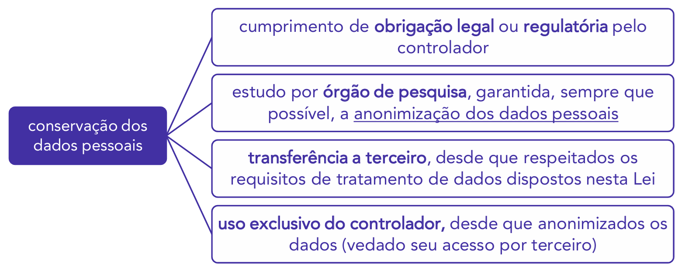

1. **Cumprimento de obrigação legal ou regulatória pelo controlador:** Esta é a exceção mais comum. O controlador (empresa ou órgão) não pode apagar o dado se outra lei o obriga a guardá-lo. (Ex: A empresa não pode apagar os dados de um ex-funcionário imediatamente após a demissão, pois a legislação trabalhista e previdenciária a obriga a guardar esses registros por muitos anos).
2. **Estudo por órgão de pesquisa:** Para fins de pesquisa, garantida, sempre que possível, a anonimização dos dados.
3. **Transferência a terceiro:** Desde que respeitados os requisitos de tratamento da LGPD (ex: o dado é transferido para outro controlador por meio da portabilidade solicitada pelo titular).
4. **Uso exclusivo do controlador:** O controlador pode manter o dado para seu uso interno (ex: para estatísticas), desde que o dado seja **anonimizado** e seja **vedado o seu acesso por terceiro**.

## Direitos do Titular dos Dados

Já sabemos que o "titular dos dados" é a pessoa natural a que os dados se referem. A LGPD, em seu art. 17, estabelece que toda pessoa natural tem assegurada a **titularidade de seus dados pessoais** e garantidos os direitos fundamentais de liberdade, de intimidade e de privacidade.

Buscando resguardar o titular, a LGPD lhe garante, em seu art. 18, um rol exemplificativo de direitos que ele pode exercer perante o **controlador**, em relação aos dados por ele tratados. Estes direitos podem ser exercidos a qualquer momento e mediante requisição:

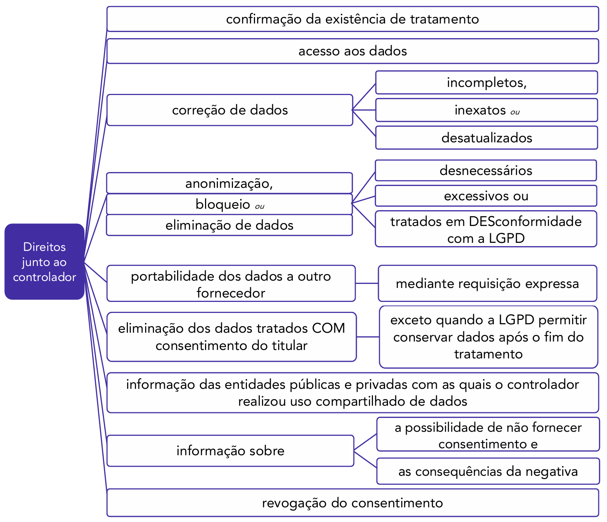

### Análise dos Principais Direitos (Art. 18 e 19)

Analisando o diagrama, destacam-se os seguintes direitos:

1. **Confirmação da existência de tratamento:** O direito básico de perguntar "Vocês tratam dados meus?".
2. **Acesso aos dados:** Se a resposta anterior for "sim", o titular tem o direito de saber _quais_ dados são tratados.
3. **Correção de dados:** O direito de corrigir dados que estejam incompletos, inexatos ou desatualizados (materializando o Princípio da Qualidade dos Dados).
4. **Anonimização, bloqueio ou eliminação:** O titular pode exigir uma dessas medidas quando o tratamento de seus dados for (I) **desnecessário**, (II) **excessivo** ou (III) estiver ocorrendo em **desconformidade** com a LGPD.
5. **Portabilidade:** O direito de solicitar, mediante requisição expressa, a transferência de seus dados pessoais a outro fornecedor de serviço ou produto. A portabilidade não inclui dados que já tenham sido anonimizados pelo controlador (art. 18, § 7º).
6. **Eliminação dos dados tratados com consentimento:** O titular tem o direito de pedir a eliminação dos dados que foram coletados com base na sua autorização (consentimento). A exceção ocorre se a LGPD permitir ao controlador conservar os dados após o fim do tratamento (ex: para cumprir uma obrigação legal, como visto no art. 16).
7. **Informação sobre o compartilhamento:** O direito de saber com quais entidades públicas ou privadas o controlador realizou o uso compartilhado de seus dados.
8. **Informação sobre o consentimento:** O direito de ser informado sobre a possibilidade de **não fornecer** o consentimento e sobre as **consequências** da negativa (ex: "Se não consentir, não será possível se cadastrar na newsletter").
9. **Revogação do consentimento:** O direito de "voltar atrás" na autorização, por procedimento gratuito e facilitado (como visto no art. 8º).

#### Prazos e Formas de Resposta (Art. 19)

Em relação aos direitos de **confirmação de existência** (direito 1) e **acesso aos dados** (direito 2), o art. 19 estabelece prazos específicos para a resposta do controlador:

- **Imediatamente:** Em formato simplificado (uma resposta simples de "sim, tratamos" ou "não, não tratamos").
- **Em até 15 dias** (contados da data do requerimento): O titular pode solicitar uma **declaração clara e completa**, que informe a origem dos dados, a inexistência de registro, os critérios utilizados e a finalidade do tratamento.

A critério do titular, tais informações poderão ser fornecidas por meio eletrônico ou sob forma impressa (art. 19, § 2º).

Quando o tratamento tiver origem no consentimento do titular ou em contrato, o titular poderá solicitar **cópia eletrônica integral** de seus dados pessoais, em formato que permita a sua utilização subsequente (art. 19, § 3º).

### Descumprimento pelo Controlador (Art. 18, §§ 1º e 8º)

Todas estas requisições são realizadas pelo titular dos dados perante o controlador. No entanto, se o controlador desrespeitar tais direitos (ex: não responder no prazo de 15 dias, ou negar a correção de um dado), o titular poderá **peticionar contra o controlador perante a Autoridade Nacional (ANPD)** ou perante um **organismo de defesa do consumidor**, como o Procon, para que estes órgãos tutelem seus direitos.

Além disso, o titular pode se **opor** ao tratamento, mesmo que a lei dispense o consentimento (ou seja, mesmo que o tratamento esteja baseado em outra hipótese legal), caso o controlador esteja descumprindo algum ponto da LGPD (art. 18, § 2º).

### Forma de Exercício Destes Direitos (Art. 18)

Os direitos acima comentados serão exercidos mediante **requerimento expresso** do titular ou de seu representante legalmente constituído, dirigido ao agente de tratamento (controlador ou operador) (art. 18, § 3º).

O requerimento será atendido **sem custos** para o titular (art. 18, § 5º).

Ao receber o requerimento, caso o controlador esteja impossibilitado de atender de maneira imediata a solicitação, ele deverá enviar ao titular uma resposta em que poderá (art. 18, § 4º):

- comunicar que não é o agente de tratamento dos dados e indicar, sempre que possível, quem é o agente; ou
- indicar as razões de fato ou de direito que impedem a adoção imediata da providência.

#### Efeito "Cascata" (Art. 18, § 6º)

Para dar efetividade aos direitos, o controlador (responsável pelos dados) que realizar uma correção, eliminação, anonimização ou bloqueio, deverá **informar, de maneira imediata, aos demais agentes de tratamento** com os quais tenha realizado uso compartilhado de dados, para que eles **repitam idêntico procedimento**.

- _Exemplo:_ Se o titular pede a um banco a correção de seu endereço, o banco (controlador) deve corrigir e avisar a seguradora parceira (com quem compartilhou o dado) para que ela também corrija o endereço em seu sistema.

### Tratamento Automatizado de Dados Pessoais (Art. 20)

Sabemos que, nos tempos atuais, dados pessoais muitas vezes são tratados unicamente por algoritmos computacionais ou robôs, e as decisões são tomadas apenas com base em tais análises (como nos casos de _Profiling_ - construção de perfil - ou _Scoring_ - avaliação de crédito), sem a verificação por uma pessoa.

Nestes casos, a LGPD assegura ao titular dos dados o direito a solicitar a **revisão de decisões tomadas unicamente com base em tratamento automatizado** de dados pessoais que afetem seus interesses (ex: uma recusa automática de crédito, a seleção em um processo seletivo online).

- _Ponto de Atenção:_ Antes da Lei 13.853/2019, a LGPD garantia que tal revisão fosse realizada por _pessoa natural_. Atualmente, com a nova redação do art. 20, esta revisão poderá ocorrer por um ser humano ou por um _novo processamento computacional_.

Além disso, o controlador deverá fornecer informações claras e adequadas, sempre que solicitadas, a respeito dos **critérios e dos procedimentos** utilizados para a decisão automatizada (observados os segredos comercial e industrial) (§ 1º).

Caso o controlador descumpra tal dever e deixe de oferecer informações sobre a decisão automatizada, a ANPD poderá realizar **auditoria** para verificação de aspectos discriminatórios nesse tratamento (§ 2º).

### Demais Direitos Relevantes (Arts. 21 e 22)

Alguns outros pontos relevantes relativos aos direitos são:

- **Não utilização em prejuízo (Art. 21):** Buscando coibir abusos, a LGPD deixa claro que os dados pessoais referentes ao exercício regular de direitos pelo titular **não podem ser utilizados em seu prejuízo**.
    - _Exemplo:_ Se, no exercício regular de seu direito, alguém registrou um Boletim de Ocorrência (BO) ou ajuizou uma ação judicial contra uma empresa, os dados desse BO ou da ação não poderiam ser utilizados por outra empresa para, por exemplo, negar-lhe crédito (considerando-o um "cliente problemático").
- **Tutela Judicial (Art. 22):** Por fim, a defesa dos interesses e dos direitos dos titulares de dados poderá ser exercida em juízo, individual ou coletivamente, na forma da legislação pertinente (como o Código de Defesa do Consumidor e a Lei da Ação Civil Pública).

## Tratamento de Dados Pessoais pelo Poder Público

Sabemos que a LGPD aplica-se tanto para entes da Administração Pública (pessoas jurídicas de direito público) como para os particulares em geral.

O que veremos neste bloco são os detalhes e as regras específicas de como as pessoas de direito público (como a Administração Direta – Ministérios, Secretarias – e as Autarquias e Fundações Públicas) devem promover o tratamento de dados pessoais de pessoas físicas.

Nesse sentido, a LGPD prevê que o tratamento de dados pessoais pelas pessoas jurídicas de direito público deverá ser realizado para o atendimento de sua **finalidade pública**, na persecução do **interesse público**, com o objetivo de executar as **competências legais** ou cumprir as **atribuições legais do serviço público** (Art. 23).

### Empresas Públicas e Sociedades de Economia Mista (Art. 24)

Sabendo que empresas públicas (como a Caixa Econômica Federal) e sociedades de economia mista (como o Banco do Brasil) não são pessoas de direito público, mas sim de direito privado, a LGPD prevê que a aplicação das "regras de poder público" a elas dependerá da atividade desempenhada:

1. Se a estatal atuar em **regime de concorrência**, explorando **atividade econômica** (conforme art. 173 da CF), ela terá o **mesmo tratamento dado aos particulares** (entes privados).
2. Por outro lado, se a estatal estiver **operacionalizando políticas públicas** ou executando-as (conforme art. 173 da CF), ela terá o **mesmo tratamento dado aos órgãos públicos**.

- **Exemplos:** O **Banco do Brasil** é uma estatal que explora atividade econômica (serviços bancários) em regime de concorrência com bancos privados (Itaú, Bradesco). Portanto, o BB seguirá as regras da LGPD como se fosse um particular (podendo usar bases legais como "legítimo interesse", por exemplo). Por outro lado, a **Ebserh (Empresa Brasileira de Serviços Hospitalares)**, que administra hospitais universitários, é uma estatal que executa a política pública de saúde. Portanto, a Ebserh deverá seguir as regras da LGPD aplicáveis às pessoas de direito público (tratando dados para a "finalidade pública", como visto no art. 23).

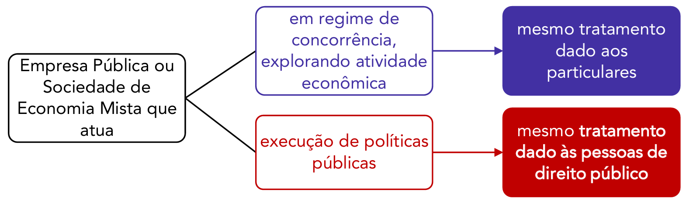

### Compatibilidade com a Lei de Acesso à Informação (LAI)

Sabemos que a Lei de Acesso à Informação (LAI) já previa diretrizes para o tratamento de informações pessoais por entes da Administração. A LAI chega a prever que as informações pessoais armazenadas pelo poder público deverão ter seu acesso restrito, independentemente de classificação de sigilo, pelo período máximo de 100 anos (Lei 12.527/2011, art. 31, § 1º, I).

É importante ficar claro que o cumprimento das regras da LGPD **não dispensa** o cumprimento das regras da LAI. As duas leis são complementares. A existência de regras na LGPD não dispensa, por exemplo, que a Administração Pública mantenha as autoridades mencionadas na LAI (como o "SIC" - Serviço de Informações ao Cidadão).

### Cartórios e Demais Serviços Notariais (Art. 23, §§ 4º e 5º)

Aos cartórios e demais serviços notariais e de registro (que, embora prestem serviço público, são exercidos em caráter privado, por delegação) aplicam-se as **mesmas regras de tratamento de dados do poder público**.

Além disso, estes órgãos notariais e de registro devem fornecer acesso aos dados para a Administração Pública, compartilhando tais dados com o poder público, preferencialmente, por meio eletrônico.

### Forma do Tratamento de Dados pelo Poder Público (Art. 23)

A LGPD prevê duas importantes condições de transparência e governança para o tratamento dos dados pelos entes públicos:

1. **Publicidade (Transparência):** Os órgãos públicos devem **informar ao cidadão** as hipóteses em que realizam o tratamento de dados pessoais (quais bases legais usam, para quais finalidades, etc.), fornecendo detalhes sobre essa atividade em veículos de fácil acesso, **preferencialmente em seus sítios eletrônicos**. A Autoridade Nacional (ANPD) poderá dispor sobre as formas dessa publicidade.
2. **Nomeação do Encarregado:** O Poder Público deve **indicar um encarregado** (o DPO), que é a pessoa indicada para atuar como canal de comunicação entre o controlador (o órgão), os titulares dos dados e a ANPD.

#### Formato dos Dados Pessoais Mantidos pelo Poder Público (Art. 25)

A Administração Pública no Brasil é composta por milhares de órgãos e entidades, cada um adotando tecnologias e sistemas informatizados distintos, o que muitas vezes cria "silos" de informação.

Atento a essa diversidade, o legislador previu que os dados pessoais deverão ser mantidos pelo poder público em **formato interoperável e estruturado**. "Interoperável" significa que um sistema deve ser capaz de "conversar" com outro.

O objetivo desta regra é permitir o **uso compartilhado** de dados entre os órgãos públicos, visando a:

- auxiliar na execução de políticas públicas;
- melhorar a prestação de serviços públicos;
- descentralizar a atividade pública; e
- disseminar e facilitar o acesso das informações pelo público em geral (em linha com a LAI).

### **Uso Compartilhado de Dados pelo Poder Público**

A LGPD permite o uso compartilhado de dados pessoais **entre entes do poder público**, desde que sejam atendidas três condições cumulativas (art. 26):

1. O compartilhamento deve atender a **finalidades específicas** de execução de **políticas públicas**;
2. Deve estar de acordo com a **atribuição legal** dos órgãos públicos envolvidos; e
3. Devem ser respeitados todos os **princípios** da LGPD (finalidade, adequação, necessidade, etc.).

Como exemplo de compartilhamento de dados, podemos citar a situação (que foi objeto de análise judicial) em que a Abin (Agência Brasileira de Inteligência) teve acesso a dados das carteiras de habilitação de milhões de cidadãos, que estavam armazenadas nas bases de dados dos Departamentos de Trânsito (Detran).

O Supremo Tribunal Federal (STF), ao analisar o tema (ADI 6649 e ADPF 695), confirmou que é constitucional que órgãos públicos compartilhem entre si dados pessoais dos cidadãos, mas fixou requisitos rigorosos, em linha com a LGPD:

> a) deve haver a eleição de propósitos legítimos, específicos e explícitos para o tratamento (Princípio da Finalidade);
> b) o tratamento deve ser compatível com as finalidades informadas (Princípio da Adequação);
> c) o compartilhamento deve ser limitado ao mínimo necessário para o atendimento da finalidade informada (Princípio da Necessidade); e
> d) deve haver o cumprimento integral dos demais requisitos e garantias da LGPD.

O diagrama a seguir resume as regras gerais de tratamento de dados pelo Poder Público:

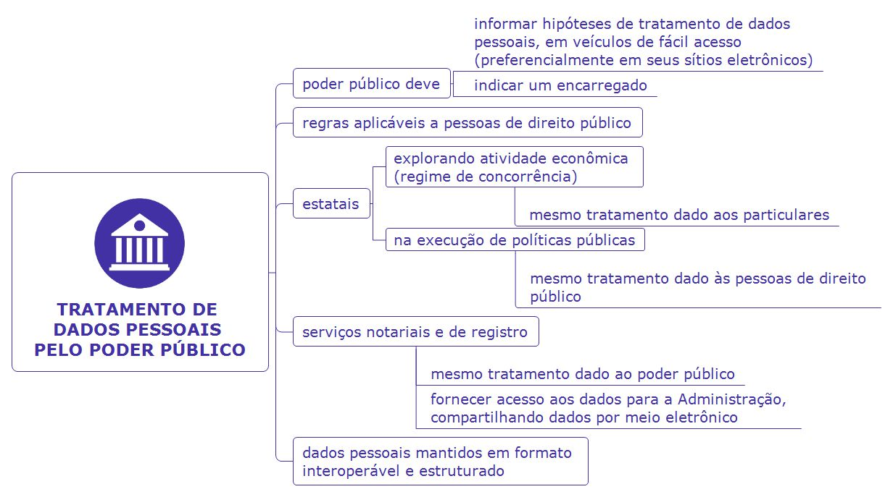

#### Compartilhamento de Dados com Entidades Privadas

Se o compartilhamento _entre_ entes públicos é permitido (com regras), a situação se inverte quando o Poder Público pretende enviar dados para entidades privadas.

A **regra geral** é que é **VEDADO** ao Poder Público transferir a entidades privadas dados pessoais de suas bases de dados (art. 26, § 1º).

Esta regra, todavia, comporta **4 (quatro) exceções** expressas, em que o compartilhamento é permitido:

**1) Na execução descentralizada de atividade pública:**

Quando uma política pública é executada por uma entidade privada (ex: uma OSC ou OS), de maneira descentralizada, é natural que ela precise acessar dados pessoais dos cidadãos para realizar o serviço.

- **Exemplo:** Uma entidade de apoio (OS) que faz atendimento médico pelo SUS. Mesmo sendo um particular, a entidade necessitará acessar os dados do prontuário do paciente (dado sensível) armazenado na base de dados do Poder Público. O compartilhamento é permitido, mas restrito a essa finalidade específica.

**2) Quando os dados forem acessíveis publicamente:**

Esta exceção tem uma razão simples: se o dado já é acessível publicamente (ex: em um Portal da Transparência, ou em um registro de CNPJ), não há razão para se proibir o compartilhamento formal pela Administração.

**3) Quando houver previsão legal ou a transferência for respaldada em contratos, convênios ou instrumentos congêneres:**

A par da vedação geral, é possível que outras leis específicas autorizem o compartilhamento, ou que ele seja formalizado em contratos ou convênios.

- **Condição:** Nestes casos, a lei exige que estes contratos e convênios sejam **comunicados à Autoridade Nacional (ANPD)** (art. 26, § 2º).

**4) Exclusivamente para prevenção de fraudes e irregularidades:**

O interesse público na prevenção de fraudes legitima o compartilhamento de dados com entidades privadas (ex: compartilhar dados com um bureau antifraude para proteger e resguardar a segurança do titular dos dados).

- **Condição:** Neste caso, é **vedado** o tratamento dos dados compartilhados para outras finalidades (como marketing ou análise de crédito).

#### Consentimento e Comunicação à ANPD no Compartilhamento com Privados (Art. 27)

Como regra adicional, o art. 27 estabelece que a comunicação ou o uso compartilhado de dados pessoais de uma base do Poder Público para uma pessoa de direito privado será **informado à ANPD** e dependerá de **consentimento do titular**.

Portanto, a regra geral para compartilhar com um privado é: (1) informar a ANPD e (2) pedir o consentimento.

Esta regra, entretanto, **não se aplica** (ou seja, o consentimento e a informação à ANPD são dispensados) nas seguintes hipóteses:

1. **Nas 4 exceções estudadas acima** (art. 26, § 1º): Se o caso se enquadrar na execução descentralizada, dado público, previsão legal/contratual ou prevenção à fraude, o compartilhamento é permitido sem o consentimento do titular.
2. **Nas hipóteses de dispensa de consentimento da própria LGPD:** Como nos casos de cumprimento de obrigação legal (art. 11, II, 'a'), execução de políticas públicas (art. 11, II, 'b'), estudos por órgão de pesquisa (art. 11, II, 'c') ou dados tornados manifestamente públicos pelo titular (art. 7º, § 4º).
3. **Nos casos de uso compartilhado de dados (entre entes públicos):** Quando houver o compartilhamento entre entes públicos (visto no art. 25), também não será necessário o consentimento do titular.

#### Exercício dos Direitos do Titular perante o Poder Público

Por fim, vale registrar que os prazos e procedimentos para o exercício dos direitos do titular (correção, acesso, eliminação, etc.) perante o Poder Público observarão o disposto em legislação específica, que prevalece sobre os prazos gerais da LGPD. As leis que regem esse rito são, em especial (art. 23, § 3º):

- A Lei do Habeas Data (Lei nº 9.507/1997);
- A Lei do Processo Administrativo Federal (Lei nº 9.784/1999); e
- A Lei de Acesso à Informação (Lei nº 12.527/2011).

