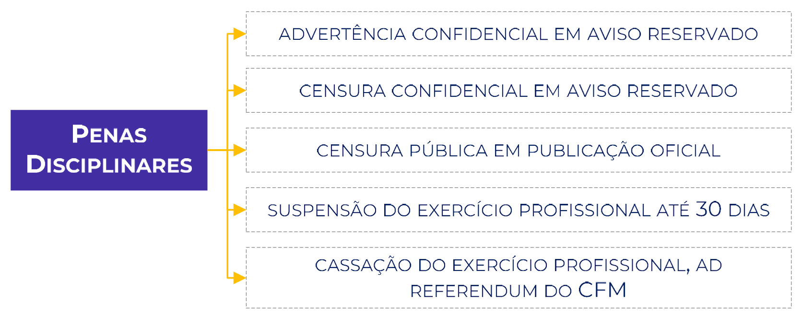
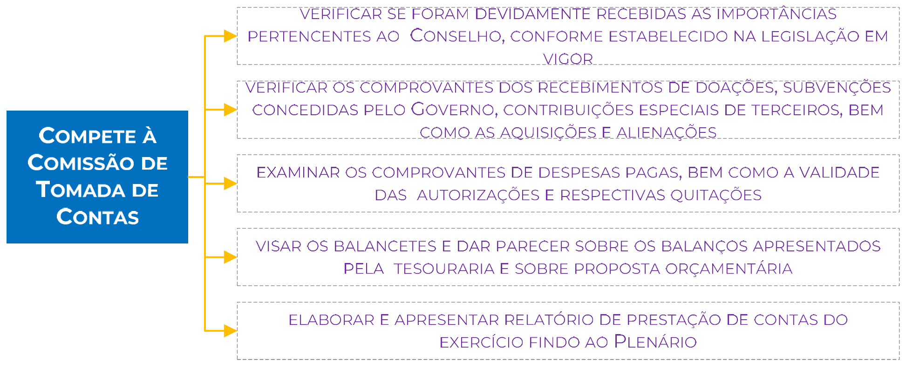

# Legislação do Conselho Regional de Medicina de Pernambuco (CREMEPE)

## Lei nº 3.268/1957

### Natureza

A Lei n. 3.268/1957 trata dos Conselho Federal de Medicina (CFM) e dos Conselhos Regionais de Medicina (CRMs).

> Art . 1º O Conselho Federal e os Conselhos Regionais de Medicina, instituídos pelo Decreto-lei nº 7.955, de 13 de setembro de 1945, passam a constituir em seu conjunto uma **autarquia**, sendo cada um deles dotado de **personalidade jurídica de direito público**, com **autonomia administrativa e financeira**.

A **natureza jurídica** de direito público ou de direito privado determina diversas características jurídicas especiais, definindo qual o regime jurídico aplicável. Basicamente, se a entidade exerce uma atividade de governo, é de direito público. Se explora atividade econômica, é de direito privado, pois se equipara as empresas particulares.

No caso dos Conselhos, tem **personalidade jurídica de direito público**:

> Art 1º [...] sendo cada um deles dotado de personalidade jurídica de **direito público** [...]

Evidentemente, os Conselhos são parte da Administração Pública, mas os entes federados não têm como prestar essa atividade diretamente, pois é muito específica. Daí que são criadas entidades na Administração Pública Indireta.

Para CARVALHO FILHO,

> A administração direta é o conjunto de órgãos que integram as pessoas federativas, aos quais foi atribuída a competência para o exercício, de forma centralizadas, das atividades administrativas do Estado. Em outras palavras, significa que a Administração Pública é, ao mesmo tempo, a titular e a executar do serviço público.
>
> Já a Administração indireta é o conjunto de pessoas administrativas que, vinculadas à respectiva Administração Direta, têm o objetivo de desempenhar as atividades administrativas de forma descentralizada.

Assim, precisamos entender em que local da estrutura os Conselhos estão inseridos. Podemos dividir a Administração Pública em administração direta e indireta da seguinte forma:

**Não é à toa que autarquias estão em destaque acima**. Os Conselhos são classificados como AUTARQUIAS.

> Art . 1º O Conselho Federal e os Conselhos Regionais de Medicina, [...], passam a constituir em seu conjunto uma **autarquia** [...]

Para entendermos o que é uma Autarquia, precisamos recorrer ao **Decreto-Lei n. 200/67**:

> Art. 5º Para os fins desta lei, considera-se:
> 
> I - **Autarquia** - o serviço autônomo, criado por lei, com personalidade jurídica, patrimônio e receita próprios, para **executar atividades típicas da Administração Pública**, que requeiram, para seu melhor funcionamento, gestão administrativa e financeira descentralizada.

Nesse sentido, autarquia é _uma pessoa jurídica de **direito público**, integrante da Administração Indireta, criada por lei para desempenhar funções que, despidas de caráter econômico, sejam própria e típicas de estado_ (CARVALHO FILHO).

Esse “fenômeno” de criar entidades da administração indireta é conhecido como descentralização e ocorre quando o ente político transfere competências no âmbito administrativo de mesmo nível, como por exemplo uma empresa pública. Por isso, para que os conselhos possam executar suas funções forma plena, tem autonomia.

> Art . 1º [...] **autonomia administrativa e financeira**.

A **autonomia administrativa** quer dizer que a entidade tem o poder de se autogovernar, ou seja, praticar atos próprios de gestão.

A **autonomia financeira** tem a ver com a capacidade da entidade em elaborar seu orçamento e gerir os recursos financeiros que lhe são destinados.

**ATENÇÃO!** Não é porque tem autonomia financeira que pode gastar o quanto e como quiser. Tudo isso tem limite e enseja a prestação de contas.

**Observação:** Os Conselhos não têm qualquer vínculo funcional ou hierárquico com os órgãos da Administração Pública.

Como regra, quando um órgão da Administração Indireta é criado, ele deve estar ligado (vinculado) a algum Poder ou Instituição. Todavia, essa regra tem exceção!

Em 1969 foi edital o **Decreto-Lei n. 968** que trouxe a seguinte disposição:

> Art. 1º - As entidades criadas por lei com atribuições de fiscalização do exercício de profissões liberais que sejam mantidas com recursos próprios e não recebam subvenções ou transferências à conta do orçamento da União, regular-se-ão pela respectiva legislação específica, não se lhes aplicando as normas legais sobre pessoal e demais disposições de caráter-geral, relativas à administração interna das autarquias federais.

Nesse contexto, as ditas "autarquias profissionais", em razão do princípio da especialidade, são tratados de forma diferente pela legislação pátria.

### Finalidade

Segundo o Art. 2º, o conselho Federal e os Conselhos Regionais de Medicina são os **órgãos supervisores da ética profissional** em toda a República e ao mesmo tempo, **julgadores e disciplinadores da classe médica**, cabendo-lhes zelar e trabalhar por todos os meios ao seu alcance, pelo perfeito desempenho ético da medicina e pelo prestígio e bom conceito da profissão e dos que a exerçam legalmente.

### Sede e Abrangência

Haverá na Capital da República um Conselho Federal, com jurisdição em todo o Território Nacional, ao qual ficam subordinados os Conselhos Regionais; e, em cada capital de Estado e Território e no Distrito Federal, um Conselho Regional, denominado segundo sua jurisdição, que alcançará, respectivamente, a do Estado, a do Território e a do Distrito Federal.

- **CONSELHO FEDERAL** - Com sede em Brasília, Distrito Federal, editar normas e fiscalizar a nível nacional a profissão;
- **CONSELHOS REGIONAIS** - Com sede nas capitais dos estados e do DF, executar as normas do Conselho Federal e fiscalizar a profissão localmente (dentro do estado);

> [!NOTE] ATENÇÃO
> A sede do CFM é em BRASÍLIA e não no DISTRITO FEDERAL. Explico. O DF é grande, tem várias cidades. Se a questão falar em "sede no DF", enseja o entendimento que seja em qualquer local do DF e não, necessariamente, em Brasília. Por isso, devemos afirmar que a SEDE fica em BRASÍLIA.

### Do Conselho Federal de Medicina

O Conselho Federal de Medicina compor-se-á de **28 conselheiros titulares**, sendo:

O mandato dos membros do CFM será **meramente honorífico** (sem remuneração) e **durará 5 anos**.

> Art. 13 § 2º O mandato dos membros dos Conselhos Regionais será meramente honorífico, e exigida como requisito para eleição a qualidade de brasileiro nato ou naturalizado.

Para cada Conselheiro será escolhido um suplente por escrutínio secreto e maioria de votos, presentes no mínimo 20%, dentre os médicos regularmente inscritos em cada Conselho Regional.

O suplente do representante da Associação Médica Brasileira (AMB) será por ela escolhido.

Para a candidatura à vaga de conselheiro federal, o médico não necessita ser conselheiro do Conselho Regional de Medicina em que está inscrito.

> Art. 4º. §2º Para a candidatura à vaga de conselheiro federal, o médico não necessita ser conselheiro do Conselho Regional de Medicina em que está inscrito.

### Diretoria do Conselho Federal

Na primeira reunião ordinária do Conselho Federal (eleito) será eleita a sua diretoria, composta de:

Notas:

- Ao presidente do Conselho Federal compete a direção do mesmo Conselho, cabendo-lhe velar pela conservação do decoro e da independência dos Conselhos de Medicina e pelo livre exercício legal dos direitos de seus membros.
- O secretário geral terá a seu cargo a secretaria permanente do Conselho Federal.

### Dos Conselhos Regionais

Os Conselhos Regionais serão instalados em cada capital de Estado na de Território e no Distrito Federal, onde terão sua sede, sendo compostos de:

| MEMBROS        | REQUISITOS                                         |
| -------------- | -------------------------------------------------- |
| **5 membros**  | quando o Conselho tiver até 50 médicos inscritos   |
| **10 membros** | quando o Conselho tiver até 150 médicos inscritos  |
| **15 membros** | quando o Conselho tiver até 300 médicos inscritos  |
| **21 membros** | quando o Conselho tiver + de 300 médicos inscritos |

Os membros dos Conselhos Regionais de Medicina, com exceção de um que será escolhido pela Associação Médica, sediada na Capital do respectivo Estado, federado à Associação Médica Brasileira, **serão eleitos, em escrutínio secreto, em assembleia dos inscritos de cada região e que estejam em pleno gôzo de seus direitos**.

> § 1º As eleições para os Conselhos Regionais serão feitas sem discriminação de cargos, que serão providos na primeira reunião ordinária dos mesmos.
> 
> § 2º O mandato dos membros dos Conselhos Regionais será meramente honorífico, e exigida como requisito para eleição a qualidade de brasileiro nato ou naturalizado.

### Diretoria do Conselho Regional

A diretoria de cada Conselho Regional compor-se-á de presidente, vice-presidente, primeiro e segundo secretários e tesoureiro.

> Art . 14. A diretoria de cada Conselho Regional compor-se-á de presidente, vice-presidente, primeiro e segundo secretários e tesoureiro.

Não confunda com a diretoria do CFM!

| DIRETORIA CFM       | DIRETORIA CRM       |
| ------------------- | ------------------- |
| presidente          | vice-presidente     |
| presidente          | vice-presidente     |
| secretário geral    | -                   |
| primeiro secretário | primeiro secretário |
| segundo secretário  | segundo secretário  |
| tesoureiro          | tesoureiro          |

Nos Conselhos onde o quadro abranger menos de 20 (vinte) médicos inscritos poderão ser suprimidos os cargos de vice-presidente e os de primeiro ou segundo secretários, ou alguns destes.

### Da Renda dos Conselhos

Outro item que é importante traçarmos a diferença entre os regionais e o federal:

| CONSELHO FEDERAL                                         | CONSELHOS REGIONAIS                                               |
| -------------------------------------------------------- | ----------------------------------------------------------------- |
| 20% da totalidade do imposto sindical pago pelos médicos | taxa de inscrição                                                 |
| 1/3 das anuidades percebidas pelos Conselhos Regionais   | 2/3 da anuidade paga pelos membros inscritos no Conselho Regional |
| 1/3 da taxa de expedição das carteiras profissionais     | 2/3 da taxa de expedição de carteiras profissionais               |
| 1/3 das multas aplicadas pelos Conselhos Regionais       | 2/3 das multas aplicadas                                          |
| doações e legados                                        | doações e legados                                                 |
| subvenções oficiais                                      | subvenções oficiais                                               |
| bens e valores adquiridos                                | bens e valores adquiridos                                         |

### Atribuições dos Conselhos

Eu sempre gosto de tratar as atribuições do Conselho Federal com as dos Regionais, comparando-as. Acredito que é o jeito mais eficaz de você as diferenciar.

| CONSELHO FEDERAL (Art. 5º)                                                                                                                                                                                                                                                                              | CONSELHOS REGIONAIS (Art. 15)                                                                                                                                                  |
| ------------------------------------------------------------------------------------------------------------------------------------------------------------------------------------------------------------------------------------------------------------------------------------------------------- | ------------------------------------------------------------------------------------------------------------------------------------------------------------------------------ |
| a) organizar o seu regimento interno;                                                                                                                                                                                                                                                                   | a) deliberar sobre a inscrição e cancelamento no quadro do Conselho;                                                                                                           |
| b) aprovar os regimentos internos organizados pelos Conselhos Regionais;                                                                                                                                                                                                                                | b) manter um registro dos médicos, legalmente habilitados, com exercício na respectiva Região;                                                                                 |
| c) eleger o presidente e o secretária geral do Conselho;                                                                                                                                                                                                                                                | **c) fiscalizar o exercício da profissão de médico**;                                                                                                                          |
| d) votar e alterar o Código de Deontologia Médica, ouvidos os Conselhos Regionais;                                                                                                                                                                                                                      | d) conhecer, apreciar e decidir os assuntos atinentes à ética profissional, impondo as penalidades que couberem;                                                               |
| e) promover quaisquer diligências ou verificações, relativas ao funcionamento dos Conselhos de Medicina, nos Estados ou Territórios e Distrito Federal, e adotar, quando necessárias, providências convenientes a bem da sua eficiência e regularidade, inclusive a designação de diretoria provisória; | e) elaborar a proposta do seu regimento interno, submetendo-a à aprovação do Conselho Federal;                                                                                 |
| f) propor ao Governo Federal a emenda ou alteração do Regulamento desta lei;                                                                                                                                                                                                                            | f) expedir carteira profissional;                                                                                                                                              |
| g) expedir as instruções necessárias ao bom funcionamento dos Conselhos Regionais;                                                                                                                                                                                                                      | g) velar pela conservação da honra e da independência do Conselho, livre exercício legal dos direitos dos médicos;                                                             |
| h) tomar conhecimento de quaisquer dúvidas suscitadas pelos Conselhos Regionais e dirimi-las;                                                                                                                                                                                                           | h) promover, por todos os meios e o seu alcance, o perfeito desempenho técnico e moral da medicina e o prestígio e bom conceito da medicina, da profissão e dos que a exerçam; |
| i) em grau de recurso por provocação dos Conselhos Regionais, ou de qualquer interessado, deliberar sobre admissão de membros aos Conselhos Regionais e sobre penalidades impostas aos mesmos pelos referidos Conselhos;                                                                                | i) publicar relatórios anuais de seus trabalhos e a relação dos profissionais registrados;                                                                                     |
| j) fixar e alterar o valor da anuidade única, cobrada aos inscritos nos Conselhos Regionais de Medicina; e                                                                                                                                                                                              | j) exercer os atos de jurisdição que por lei lhes sejam cometidos;                                                                                                             |
| l) normatizar a concessão de diárias, jetons e auxílio de representação, fixando o valor máximo para todos os Conselhos Regionais.                                                                                                                                                                      | k) representar ao Conselho Federal de Medicina Aérea sobre providências necessárias para a regularidade dos serviços e da fiscalização do exercício da profissão.              |

### Do Registro Profissional

Os médicos só poderão **exercer legalmente** a medicina, em qualquer de seus ramos ou especialidades, **após o prévio registro de seus títulos, diplomas, certificados ou cartas no Ministério da Educação e Cultura** e de sua **inscrição no Conselho Regional de Medicina**, sob cuja jurisdição se achar o local de sua atividade.

> Art . 17. Os médicos só poderão exercer legalmente a medicina, em qualquer de seus ramos ou especialidades, após o prévio registro de seus títulos, diplomas, certificados ou cartas no Ministério da Educação e Cultura e de sua inscrição no Conselho Regional de Medicina, sob cuja jurisdição se achar o local de sua atividade.

Aos profissionais registrados será entregue uma carteira profissional que os habitará ao exercício da medicina em todo o País.

> Art. 18. Aos profissionais registrados de acordo com esta lei será entregue uma carteira profissional que os habitará ao exercício da medicina em todo o País.

> [!NOTE] ATENÇÃO
> A carteira profissional valerá documento de identidade e terá fé pública.

> Art . 19. A carteira profissional, de que trata o art. 18, valerá documento de identidade e terá fé pública.

No caso em que o profissional tiver de exercer temporariamente, à medicina em outra jurisdição, apresentará sua carteira para ser visada pelo Presidente do Conselho Regional desta jurisdição.

> Art. 18. § 1º No caso em que o profissional tiver de exercer temporariamente, à medicina em outra jurisdição, apresentará sua carteira para ser visada pelo Presidente do Conselho Regional desta jurisdição.

Se o médico inscrito no Conselho Regional de um Estado passar a exercer, de modo permanente, atividade em outra região, assim se entendendo o exercício da profissão **por mais de 90 dias**, na nova jurisdição, ficará obrigado a requerer **inscrição secundária** no quadro respectivo, ou para ele se transferir, sujeito, em ambos os casos, à jurisdição do Conselho local pelos atos praticados em qualquer jurisdição.

> Art. 18. § 2º Se o médico inscrito no Conselho Regional de um Estado passar a exercer, de modo permanente, atividade em outra região, assim se entendendo o exercício da profissão por mais de 90 (noventa) dias, na nova jurisdição, ficará obrigado a requerer inscrição secundária no quadro respectivo, ou para êle se transferir, sujeito, em ambos os casos, à jurisdição do Conselho local pelos atos praticados em qualquer jurisdição.

Essa obrigação será dispensada, ainda que em **caráter transitório**, para o **perito médico federal** que esteja fora da unidade federativa originária do seu registro de regional, quando em cumprimento de dever funcional determinado no **interesse da Administração Pública**.

Quando deixar, temporária ou definitivamente, de exercer atividade profissional, o profissional restituirá a carteira à secretaria do Conselho onde estiver inscrito.

No prontuário do médico serão feitas quaisquer anotações referentes ao mesmo, inclusive os elogios e penalidades.

> Art . 27. A inscrição dos profissionais já registrados nos órgãos de saúde pública, na data da presente lei, será feita independente da apresentação de títulos, diplomas certificados ou cartas registradas no Ministério da Educação e Cultura, mediante prova do registro na repartição competente.

### Da Publicidade

Todo aquele que mediante anúncios, placas, cartões ou outros meios quaisquer, se propuser ao exercício da medicina, em qualquer dos ramos ou especialidades, fica sujeito às penalidades aplicáveis ao exercício ilegal da profissão, se não estiver devidamente registrado.

A lei de contravenção nos diz o seguinte:

> Art. 47. Exercer profissão ou atividade econômica ou anunciar que a exerce, sem preencher as condições a que por lei está subordinado o seu exercício:
> 
> Pena – prisão simples, de quinze dias a três meses, ou multa, de quinhentos mil réis a cinco contos de réis.

### Penas Disciplinares

> Art. 21. O poder de disciplinar e aplicar penalidades aos médicos compete exclusivamente ao Conselho Regional, em que estavam inscritos ao tempo do fato punível, ou em que ocorreu, nos termos do art. 18, § 1º.
> 
> Parágrafo único. A jurisdição disciplinar estabelecida neste artigo não derroga a jurisdição comum quando o fato constitua crime punido em lei.

As penas disciplinares aplicáveis pelos Conselhos Regionais aos seus membros são as seguintes:

**Observação:** ad referendum quer dizer que precisa ser confirmado pelo CFM. Nesse caso, podemos afirmar que nas decisões de que resultar cassação da autorização para o exercício profissional, o recurso _ex‐officio_ será obrigatório.

Salvo os casos de gravidade manifesta que exijam aplicação imediata da penalidade mais grave a imposição das penas obedecerá à gradação acima.

Em matéria disciplinar, o Conselho Regional deliberará de oficial ou em consequência de representação de autoridade, de qualquer membro, ou de pessoa estranha ao Conselho, interessada no caso.

A deliberação do Comércio precederá, sempre, audiência do acusado, sendo-lhe dado defensor no caso de não ser encontrado, ou for revel.

Da imposição de qualquer penalidade caberá recurso, no prazo de 30 dias, contados da ciência, para o Conselho Federal, da seguinte forma:

Nesse ponto há um problema na norma. Ela diz o seguinte:

> Art. 22. § 4º Da imposição de qualquer penalidade caberá recurso, no prazo de 30 (trinta) dias, contados da ciência, para o Conselho Federal, sem efeito suspenso salvo os casos das alíneas c , e e f , em que o efeito será suspensivo.

O problema é que não tem letra f:

> Art . 22. As penas disciplinares aplicáveis pelos Conselhos Regionais aos seus membros são as seguintes:
> 
> a) advertência confidencial em aviso reservado;
> b) censura confidencial em aviso reservado;
> c) censura pública em publicação oficial;
> d) suspensão do exercício profissional até 30 (trinta) dias;
> e) cassação do exercício profissional, ad referendum do Conselho Federal.

Assim, acredito que a norma se refira as letras C, D e E.

O Efeito suspensivo suspende a aplicação da penalidade até a apreciação do recurso.

> § 5º Além do recurso previsto no parágrafo anterior, não caberá qualquer outro de natureza administrativa, salvo aos interessados a via judiciária para as ações que forem devidas.
> 
> § 6º As denúncias contra membros dos Conselhos Regionais só serão recebidas quando devidamente assinadas e acompanhadas da indicação de elementos comprobatórios do alegado.

### Da Assembleia Geral

Constituem a assembleia geral de cada Conselho Regional os **médicos inscritos**, que se achem no pleno gôzo de seus direitos e tenham aí a sede principal de sua atividade profissional.

> A assembleia geral será dirigida pelo presidente e os secretários do Conselho Regional respectivo.

Veja as atribuições da assembleia:

> Art . 24. A assembleia geral compete:
> 
> I - ouvir a leitura e discutir o relatório e contas da diretoria. Para esse fim se reunirá, ao menos uma vez por ano, sendo, nos anos em que se tenha de realizar a eleição do Conselho Regional, de 30 (trinta) a 45(quarenta e cinco) dias antes da data fixada para essa eleição;
> lI - autorizar a alienação de imóveis do patrimônio do Conselho;
> III - fixar ou alterar as de contribuições cobradas pelo Conselho pelos serviços praticados;
> IV - deliberar sobre as questões ou consultas submetidas à sua decisão pelo Conselho ou pela Diretoria;
> V - eleger um delegado e um suplente para eleição dos membros e suplentes do Conselho Federal.

A assembleia geral em **primeira convocação**, **reunir-se-á com a maioria absoluta de seus membros** e, em **segunda convocação**, com **qualquer número** de membros presentes.

As **deliberações** serão tomadas por **maioria de votos dos presentes**.

O voto é pessoal e obrigatório em toda eleição, salvo doença ou ausência comprovadas plenamente.

O não comparecimento está sujeito ao pagamento de multa:

> Art. 26. § 1º Por falta injustificada à eleição, incorrerá o membro do Conselho na multa de Cr$200,00 (duzentos cruzeiros), dobrada na reincidência.

Por isso, os médicos que se encontrarem fora da sede das eleições, por ocasião destas, poderão dar seu voto em dupla sobrecarta, opaca, fechada, e remetida pelo correio, sob registro, por ofício com firma reconhecida, ao Presidente do Conselho Regional.

> § 3º Serão computadas as cédulas recebidas, com as formalidades do parágrafo precedente até o momento de encerrar-se a votação. A sobrecarta maior será aberta pelo Presidente do Conselho, que depositará a sobrecarta menor na urna, sem violar o segredo do voto.
> 
> § 4º As eleições serão anunciadas no órgão oficial e em jornal de grande circulação, com 30 (trinta) dias de antecedência.

As eleições serão feitas por escrutínio secreto, perante o Conselho, podendo, quando haja mais de duzentos votantes, determinarem-se locais diversos para o recebimento dos votos, permanecendo, neste caso, em cada local, dois diretores, ou médicos inscritos, designados pelo Conselho.

> § 6º Em cada eleição, os votos serão recebidos durante 6 (seis) horas contínuas pelo menos.

PARA FIXAR:

### Disposições Transitórias

Essas regras tinham sentido quando a presente lei foi publicada. Atualmente, vale apenas a título de informação.

> Art 28. O atual Conselho Federal de Medicina designará diretorias provisórias para os Conselhos Regionais dos Estados Territórios e Distrito Federal, onde não houverem ainda sido instalados, que tomarão a seu cargo a sua instalação e a convocação, dentro em 180 (cento e oitenta) dias, da assembléia geral, que elegerá o Conselho Regional respectivo.
> 
> Art 29. O Conselho Federal de Medicina baixará instruções no sentido de promover a coincidência dos mandatos dos membros do Conselhos Regionais já instalados e dos que vierem a ser organizados.
> 
> Art . 30. Enquanto não fôr elaborado e aprovado pelo Conselho Federal de Medicina, ouvidos os Conselhos Regionais o Código de Deontologia Médica, vigorará o Código de Ética da Associação Médica Brasileira.
> 
> Art . 31. O pessoal a serviço dos Conselhos de Medicina será inscrito, para efeito de previdência social, no Instituto de Previdência e Assistência dos Servidores do Estado em conformidade com o art. 2º do Decreto-lei nº 3.347, de 12 de junho de 1941.
> 
> Art . 32. As diretorias provisórias, a que se refere o art. 28, organizarão a tabela de emolumentos devidos pelos inscritos, submetendo-a à aprovação do Conselho Federal.
> 
> Art . 33. O Poder Executivo providenciará a entrega ao Conselho Federal de Medicina, logo após a publicação da presente lei, de 40% (quarenta por certo) da totalidade do impôsto sindical pago pelos médicos a fim de que sejam empregados na instalação do mesmo Conselho e dos Conselhos Regionais.
> 
> Art . 34. O Govêrno Federal tomará medidas para a instalação condigna dos Conselhos de Medicina no Distrito Federal e nas capitais dos Estados e Territórios, tanto quanto possível em edifícios públicos.
> 
> Art . 35 O Conselho Federal de Medicina elaborará o projeto de decreto de regulamentação desta lei, apresentando-o ao Poder Executivo dentro em 120 (cento e vinte) dias a contar da data de sua publicação.
> 
> Art 36. Esta lei entrará em vigor na data de sua publicação, revogados o Decreto-lei nº 7.955, de 13 de setembro de 1945, e disposições em contrário.

## Decreto nº 44.045/1958

O Decreto Federal nº44.045/1958 aprova o Regulamento do Conselho Federal e Conselhos regionais de Medicina a que se refere a Lei nº 3.268, de 30 de setembro de 1957.

### Da Inscrição

Os médicos legalmente habilitados ao exercício da profissão em virtude dos diplomas que lhes foram conferidos pelas Faculdades de Medicina oficiais ou reconhecidas do país só poderão desempenhá-lo efetivamente depois de inscreverem-se nos Conselhos Regionais de Medicina que jurisdicionarem a área de sua atividade profissional. Destaca-se que a inscrição é obrigatória e abrange todos os profissionais militantes, sem distinção de cargos ou funções públicas.

Para realizar o pedido de inscrição no Conselho Regional de Medicina será necessário a apresentação dos seguintes documentos:

- Original ou fotocópia autenticada do diploma de conclusão de curso, expedido por instituição de ensino superior, registrado no Ministério da Educação.
- Cópia do certificado de alistamento militar, com prova de regularidade.
- Cópia do título de eleitor e da certidão de regularidade junto à Justiça Eleitoral.
- Cópia da carteira de identidade.
- Comprovante de situação cadastral no Cadastro de Pessoas Físicas - CPF da Secretaria Especial da Receita Federal do Brasil do Ministério da Economia.

**Diploma de instituição estrangeira:** em se tratando de diploma expedido por instituição de ensino superior estrangeira, o requerente deverá apresentar o **diploma original, previamente revalidado e registrado em instituição de ensino superior brasileira** autorizada pelo Ministério da Educação, com tradução juramentada.

**Requerente estrangeiro:** em se tratando de requerente estrangeiro, não será exigido os documentos: original ou fotocópia autenticada do diploma de conclusão de curso, expedido por instituição de ensino superior, registrado no Ministério da Educação; cópia do certificado de alistamento militar, com prova de regularidade e cópia do título de eleitor e da certidão de regularidade junto à Justiça Eleitoral.

Os Conselhos Regionais de Medicina poderão exigir documentos complementares aos mencionados acima, nas hipóteses previstas em resolução do Conselho Federal de Medicina.

A efetivação real do registro do médico só existirá depois da sua inscrição nos assentamentos dos Conselhos Regionais de Medicina e também depois da expedição da Carteira Profissional estatuída nos artigos 18 e 19 da Lei nº 3.268, de 30 de setembro de 1957, cuja obtenção pelos interessados exige o pagamento prévio desse documento e o pagamento prévio da primeira anuidade.

Para todos os Conselhos Regionais de Medicina **serão uniformes as normas de processar os pedidos de inscrição**, os registros e as expedições da Carteira Profissional, valendo esta como prova de identidade e cabendo ao Conselho Federal de Medicina, disciplinar, por "atos resolutórios".

O **pedido de inscrição, poderá ser feito por procurador** quando o médico a se inscrever não possa deslocar se de seu local de trabalho. Nesses casos, ser-lhe-ão enviados registrados pelo Correio, por intermédio do Tabelião da comarca os documentos a serem por ele autenticados a fim de que o requerente, em presença do Tabelião, os assine e neles aponha a impressão digital do polegar da mão direita, dentro do prazo máximo de três (3) dias, devolvendo-os com a firma reconhecida ao Presidente do Conselho Regional que então autorizará a expedição da carteira e a inscrição.

Para formalizar o pedido de inscrição do médico, os Conselhos Regionais de Medicina deverão:

- Coletar os dados biométricos do médico.
- Verificar se o médico consta da relação de formandos enviada pela instituição de ensino superior; e
- Realizar a confirmação individual, por meio do encaminhamento de ofício à instituição de ensino superior na qual o médico se graduou, na hipótese de não constar da relação de formandos.

O pedido de inscrição do médico será **indeferido** quando:

- Os documentos apresentados não estiverem em conformidade.
- O diploma de conclusão do curso de Medicina tiver sido expedido por instituição de ensino estrangeira e não cumprir os requisitos.

Fica o médico obrigado a comunicar ao Conselho Regional de Medicina em que estiver inscrito a **instalação do seu consultório ou local de trabalho profissional**, assim como qualquer transferência de sede, ainda quando na mesma jurisdição.

> §1º - Quando houver mudança de sede de trabalho, bem como no caso de abandono temporário ou definitivo da profissão, obedecer-se-á às disposições dos §§ 1º, 2º, 3º e 4º do art. 18 da Lei nº 3.268, de 30 de setembro de 1957, pagando nova anuidade ao Conselho da Região onde passar a exercer a profissão.
> § 2º - Quando houver mudança de sede de trabalho para região de competência de outro Conselho Regional, o profissional deverá quitar integralmente a anuidade no Conselho Regional de Medicina de origem.
> § 3º - Na hipótese do § 2º, o profissional ficará isento do recolhimento no Conselho Regional na localidade de destino.
> §4º - O disposto no § 2º deverá constar de modo expresso no certificado de regularidade profissional, observado o disposto no parágrafo único do art. 4º da Lei nº 12.514, de 28 de outubro de 2011.

### Das Taxas, Carteiras Profissionais e Anuidades

Os profissionais inscritos ficarão obrigados ao pagamento de anuidade a serem fixadas pelo Conselho federal de Medicina.

O pagamento da anuidade será efetuado até o dia 31 do mês de março de cada ano, salvo no primeiro ano, quando será feito na ocasião da expedição da carteira profissional do interessado.

> O pagamento de anuidades fora do prazo será efetuado com acréscimo de 20% (vinte por cento) da importância fixada.

Os profissionais inscritos na forma da Lei nº 3.268, de 30 de setembro de 1957 pagarão no ato do pedido de sua inscrição, uma taxa de inscrição fixada pelo Conselho Federal de Medicina.

> Art. 9º Ao médico inscrito de acordo com o presente Regulamento será entregue, mediante pagamento de taxa específica de expedição de carteira profissional e fixada pela Assembleia Geral, uma carteira profissional numerada e registrada no Conselho Regional, contendo:
> 
> a) nome por extenso;
> b) filiação;
> c) nacionalidade e naturalidade;
> d) data do nascimento;
> e) designação da Faculdade de Medicina diplomadora;
> f) número da inscrição anotada nesse Conselho Regional;
> g) data dessa mesma inscrição;
> h) retrato do médico, de frente, de 3x4cm, exibindo a data dessa fotografia;
> i) assinatura do portador;
> j) impressão digital do polegar da mão direita;
> k) data em que foi diplomado;
> l) assinaturas do Presidente e do Secretário do Conselho Regional;
> m) mínimo de três (3) folhas para vistos e anotações sobre o exercício da medicina;
> n) mínimo de três (3) folhas para anotações de elogios, impedimentos e proibições;
> o) declaração da validade da carteira como documento de identidade e de sua fé pública (art. 19º da Lei nº 3.268, de 30 de setembro de 1957);
> p) denominação do Conselho Regional respectivo.
> 
> Parágrafo único. O modelo da Carteira Profissional a que se refere o art. 18º da Lei nº 3.268, de 30 de setembro de 1957, será uniforme para todo o País e fixado pelo Conselho Federal de Medicina.

### Das Penalidades

Os processos relativos às infrações dos princípios da ética profissional deverão revestir a forma de "autos judiciais", sendo exarados em ordem cronológica os seus pareceres e despachos.

As normas processuais para o recebimento de denúncia, a sua tramitação e a aplicação de penalidade seguirão as regras constantes das resoluções do Conselho Federal de Medicina, **observados os princípios da ampla defesa e do contraditório**. O Conselho Federal e os Conselhos Regionais de Medicina ficam autorizados a adotar meio eletrônico para a tramitação das sindicâncias e dos processos administrativos éticos profissionais.

> Art. 12 Recebida a queixa ou denúncia o Presidente a encaminhará a uma Comissão de Instrução, que, ordenará as providências específicas para o caso e depois de serem elas executadas, determinará, então, a intimação do médico ou do pessoal jurídico denunciado para, no prazo de trinta dias a contar de a data do recebimento dessa intimação oferecer a defesa que tiver, acompanhando-a das alegações e dos documentos que julgar convenientes.
> 
> § 1º A instrução a que se refere este artigo poderá ser feita mediante depoimento pessoal do queixoso ou denunciante, arrolamento de testemunhas, perícias e demais provas consideradas hábeis.
> § 2º A ambas as partes é facultada a representação por advogados militantes.

#### Penas Disciplinares

As penas disciplinares aplicáveis aos infratores da ética profissional são as seguintes:

- Advertência confidencial, em aviso reservado;
- Censura confidencial, em aviso reservado;
- Censura pública, em publicação oficial;
- Suspensão do exercício profissional, até 30 (trinta) dias; e
- Cassação do exercício profissional.

> Da imposição das penalidades mencionadas acima, caberá recurso para o Conselho Federal de Medicina.

O recurso de apelação poderá ser interposto:

- Por qualquer das partes;
- _Ex-officio_.

Julgado o recurso em **qualquer dos casos e publicado** o acórdão na forma estatuída pelo Regimento Interno do Conselho Federal de Medicina serão os autos devolvidos à instância de origem do processo, para a execução do decidido.

As execuções das penalidades impostas pelos Conselhos Regionais e pelo Conselho Federal de Medicina processar-se-ão na forma estabelecida pelas respectivas decisões, sendo anotadas tais penalidades na carteira profissional do médico infrator.

> No caso de cassação do exercício profissional, além, dos editais e das comunicações endereçadas às autoridades interessadas no assunto, **será apreendida a carteira profissional** do médico infrator.

### Das Eleições

Os Conselhos Regionais de Medicina terão sede nas capitais dos Estados e no Distrito Federal e serão constituídos por vinte e um conselheiros efetivos e os seus suplentes, em conformidade com o disposto no § 1º do art. 4º da Lei nº 3.268, de 1957.

> **Lei nº 3.268/1957**
> 
> Art. 1º O Conselho Federal e os Conselhos Regionais de Medicina, instituídos pelo Decreto-lei nº 7.955, de 13 de setembro de 1945, passam a constituir em seu conjunto uma autarquia, sendo cada um deles dotado de personalidade jurídica de direito público, com autonomia administrativa e financeira.
> 
> Art. 2º O conselho Federal e os Conselhos Regionais de Medicina são os órgãos supervisores da ética profissional em toda a República e ao mesmo tempo, julgadores e disciplinadores da classe médica, cabendo-lhes zelar e trabalhar por todos os meios ao seu alcance, pelo perfeito desempenho ético da medicina e pelo prestígio e bom conceito da profissão e dos que a exerçam legalmente.
> 
> Art. 3º Haverá na Capital da República um Conselho Federal, com jurisdição em todo o Território Nacional, ao qual ficam subordinados os Conselhos Regionais; e, em cada capital de Estado e Território e no Distrito Federal, um Conselho Regional, denominado segundo sua jurisdição, que alcançará, respectivamente, a do Estado, a do Território e a do Distrito Federal.
> 
> Art. 4º O Conselho Federal de Medicina compor-se-á de 28 (vinte e oito) conselheiros titulares, sendo:
> 
> I - 1 (um) representante de cada Estado da Federação
> II – 1 (um) representante do Distrito Federal;
> III – 1 (um) representante e respectivo suplente indicado pela Associação Médica Brasileira
> 
> § 1º Os Conselheiros e respectivos suplentes de que tratam os incisos I e II serão escolhidos por escrutínio secreto e maioria de votos, presentes no mínimo 20% (vinte por cento), dentre os médicos regularmente inscritos em cada Conselho Regional.
> § 2º Para a candidatura à vaga de conselheiro federal, o médico não necessita ser conselheiro do Conselho Regional de Medicina em que está inscrito.

O **conselheiro suplente** eleito **somente entrará em exercício** na hipótese de impedimento do conselheiro efetivo, **por mais de trinta dias**, ou na hipótese de vacância, para concluírem o mandato em curso. Independentemente, do disposto acima, os conselheiros suplentes eleitos poderão ser designados para o exercício de atividades necessárias ao funcionamento do Conselho Federal de Medicina e do Conselho Regional de Medicina respectivo, exceto para ocupar cargo diretivo.

> Os conselheiros **serão indicados** pela Associação Médica Brasileira sediada na capital do respectivo Estado ou do Distrito Federal entre os seus associados.

Os conselheiros indicados pela Associação Médica Brasileira e respectivo suplente serão designados para o período do mandato e, exceto na hipótese de renúncia, não poderão ser substituídos no curso do mandato.

O dia e a hora das eleições dos membros dos Conselhos Regionais e do Conselho Federal serão fixados pelo Conselho Federal de Medicina.

> Art. 26 Cabe aos Conselhos Regionais de Medicina promover as eleições.
> 
> § 1º Cada chapa eleitoral deverá ter vinte candidatos a conselheiros efetivos e vinte candidatos a conselheiros suplentes, observado o disposto no § 2º do art. 42.
> 
> § 1º-A As eleições serão realizadas entre sessenta e trinta dias antes do término dos mandatos em curso, mediante escrutínio secreto.
> § 2º Nenhum candidato poderá figurar em mais de uma chapa.

Para os fins de eleição a Assembleia Geral funcionará de conformidade com o art. 25 da Lei número 3.268:

> **Lei nº 3.268/1957**
> 
> Art. 25. A assembleia geral em primeira convocação, reunir-se-á com a maioria absoluta de seus membros e, em segunda convocação, com qualquer número de membros presentes.
> 
> Parágrafo único. As deliberações serão tomadas por maioria de votos dos presentes.

As eleições para os Conselhos regionais serão feitas sem discriminação de cargos, que serão providos na sua primeira sessão ordinária de conformidade com os respectivos regimentos internos.

> Art. 30. O Conselho Federal de Medicina normatizará o processo eleitoral e disporá sobre:
> 
> I - nomeação, competência e atuação da Comissão Regional Eleitoral pelo Conselho Regional de Medicina;
> II - nomeação, competência e atuação da Comissão Nacional Eleitoral pelo Conselho Federal de Medicina;
> III - condições de elegibilidade;
> IV - causas de inelegibilidade, inclusive funções públicas, cargos eletivos e cargos de direção em empresas que acarretam inelegibilidade;
> V - registro das chapas;
> VI - datas das eleições;
> VII - processo de votação;
> VIII - mesas receptoras;
> IX - processo de apuração;
> X - impugnações;
> XI - propaganda eleitoral e seu controle;
> XII - condutas vedadas; e
> XIII - punições das chapas.

> A **falta injustificada** do médico à eleição incorrerá no **pagamento de multa** estabelecida em lei.

#### Competência dos Conselhos Regionais de Medicina

> Art. 24-A. Aos Conselhos Regionais de Medicina compete:
> 
> I - Deliberar sobre a inscrição e o cancelamento dos profissionais no quadro do Conselho;
> II - Manter registro dos médicos legalmente habilitados, com exercício na região;
> III - fiscalizar o exercício da profissão de médico e das pessoas jurídicas prestadoras de serviços médicos;
> IV - Conhecer, apreciar e decidir sobre assuntos relativos à ética profissional, e impor as penalidades cabíveis;
> V - Elaborar a proposta do seu regimento interno e submeter à aprovação do Conselho Federal de Medicina;
> VI - Expedir carteira profissional;
> VII - Zelar pela conservação da honra, da independência do Conselho e do livre exercício legal dos direitos dos médicos;
> VIII - Promover, por todos os meios e o seu alcance, o perfeito desempenho técnico e moral, o prestigio e o bom conceito da Medicina e daqueles que a exerçam;
> IX - Publicar relatórios anuais de seus trabalhos e a relação dos profissionais registrados;
> X - Praticar os atos e as decisões que lhes sejam cometidos por lei; e
> XI - representar ao Conselho Federal de Medicina sobre providências necessárias para a regularidade dos serviços e da fiscalização do exercício da profissão.

### Do Conselho Federal de Medicina

O Conselho Federal de Medicina será composto **por 28 (vinte e oito) conselheiros titulares eleitos**, na forma prevista na Lei nº 3.268, de 1957, dos quais:

- Um representante de cada Estado;
- Um representante do Distrito Federal; e
- Um representante e respectivo suplente indicado pela Associação Médica Brasileira.

O **quórum** para as sessões plenárias do:

- **Conselho Federal de Medicina:** será de **15 (quinze) conselheiros efetivos**.
- **Conselhos Regionais de Medicina:** será de **11 (onze) conselheiros efetivos**.

Os conselheiros suplentes somente poderão participar das sessões plenárias após regular convocação e na ausência do conselheiro efetivo. E os conselheiros indicados pela Associação Médica Brasileira e respectivo suplente serão designados para o mandato e, exceto na hipótese de renúncia, não poderão ser substituídos no curso do mandato.

#### Competências do Conselho Federal de Medicina

> Art. 33. Ao Conselho Federal de Medicina compete:
> 
> I - organizar o seu regimento interno;
> II - aprovar os regimentos internos elaborados pelos Conselhos Regionais;
> III - eleger a Diretoria-Executiva do Conselho;
> IV - votar e alterar o Código de Deontologia Médica, ouvidos os Conselhos Regionais;
> V - promover diligências ou verificações relativas ao funcionamento dos Conselhos Regionais de Medicina nos Estados e no Distrito Federal e adotar providências para sua eficiência e regularidade, quando necessárias;
> VI - intervir nos Conselhos Regionais de Medicina, inclusive com a designação de diretoria provisória, para a consecução do disposto no inciso V do caput;
> VII - encaminhar proposta de alteração deste regulamento ao Poder Executivo federal;
> VIII - expedir as instruções necessárias ao bom funcionamento dos Conselhos Regionais e para a realização de sessões plenárias e de reuniões;
> IX - dirimir dúvidas suscitadas pelos Conselhos Regionais;
> X - em grau de recurso, por provocação dos Conselhos Regionais ou de interessado, deliberar sobre:
> 
> a) inscrições de pessoas naturais nos Conselhos Regionais;
> b) penalidades impostas aos inscritos pelos Conselhos Regionais;
> c) regras de fiscalização de pessoas jurídicas prestadoras de serviços médicos; e
> d) demais decisões proferidas pelos Conselhos Regionais de Medicina;
> 
> XI - atualizar o valor da anuidade única cobrada aos inscritos nos Conselhos Regionais de Medicina, nos termos do disposto no § 1º do art. 6º da Lei nº 12.514, de 2011;
> XII - normatizar a concessão de diárias, de jetons e de auxílio de representação, com a fixação do valor devido pelo Conselho Federal e pelos Conselhos Regionais;
> XIII - expedir normas para o desempenho ético da Medicina;
> XIV - editar normas para estabelecer o caráter experimental de procedimentos em Medicina, a autorização ou a vedação de sua prática pelos médicos, no âmbito de sua competência, nos termos do disposto no art. 7º da Lei nº 12.842, de 10 de julho de 2013; e
> XV - ofertar a educação continuada de médicos quanto ao desempenho ético da Medicina.

### Das Disposições Gerais

> Art. 41. O mandato dos Membros dos Conselhos Regionais de Medicina será meramente honorífico e durará cinco (5) anos, como o dos Membros do Conselho Federal de Medicina.
> 
> Art. 42. As eleições para os Conselhos Regionais serão realizadas sem discriminação dos postos a serem ocupados.
> 
> § 1º Na primeira sessão ordinária do Conselho Regional serão providos os diversos postos, nos termos do disposto em seu regimento interno.
> § 2º Na hipótese de existirem vagas no Conselho Regional e não houver suplentes aptos à convocação em quantidade suficiente para o seu funcionamento, serão convocadas eleições suplementares para o preenchimento das vagas de membros efetivos e suplentes, nos termos das normas do Conselho Federal de Medicina.
> 
> Art. 43. Os casos omissos do presente regulamento serão resolvidos pelo Conselho Federal de Medicina.

### Das Disposições Transitórias

> Art. 44. Dentro do prazo de trinta (30) dias após a aprovação do presente Regulamento, o Conselho Federal baixará instruções com uma tabela de emolumentos (anuidades, taxas de inscrição, carteiras, etc.), a serem cobradas pelos Conselhos Regionais de todo o país.
> 
> Art. 45. A exigência da apresentação da carteira profissional do médico, assim como a obrigatoriedade de indicar no seu receituário o respectivo número de sua carteira dos Conselhos Regionais, só se tornarão efetivos a partir de cento e oitenta (180) dias depois da publicação do presente Regulamento.
> 
> Art. 46. Os Conselhos Regionais de Medicina providenciarão a feitura ou a reforma de seus Regimentos Internos de conformidade com a Lei nº 3.268, de 30-9-1957.
> 
> Art. 47. Revogam-se as disposições em contrário.

## Lei nº 12.842/2013

A lei n. 12.842/2013 dispõe sobre o **exercício da Medicina**.

Vamos iniciar compreendendo o que vem a presente lei traz como denominação de 'Médico':

Sendo assim, o objeto da atuação do médico é a **saúde do ser humano e das coletividades humanas**, em benefício da qual deverá agir com o **máximo de zelo**, com o melhor de sua capacidade profissional e sem discriminação de qualquer natureza.

O médico terá que desenvolver suas ações profissionais no campo da atenção à saúde, para:

Devendo o médico atuar em mútua colaboração com os demais profissionais, conforme previsto no art. 3º:

> Art. 3º O médico integrante da equipe de saúde que assiste o indivíduo ou a coletividade atuará em mútua colaboração com os demais profissionais de saúde que a compõem.

| SÃO ATIVIDADES PRIVATIVAS DO MÉDICO                                                                                                                                                                                                                         |
| ----------------------------------------------------------------------------------------------------------------------------------------------------------------------------------------------------------------------------------------------------------- |
| Indicação e execução da intervenção cirúrgica e prescrição dos cuidados médicos pré e pós operatórios;                                                                                                                                                      |
| Indicação da execução e execução de procedimentos invasivos, sejam diagnósticos, terapêuticos ou estéticos, incluindo os acessos vasculares profundos, as biópsias e as endoscopias;                                                                        |
| Intubação traqueal;                                                                                                                                                                                                                                         |
| Coordenação da estratégia ventilatória inicial para a ventilação mecânica invasiva, bem como das mudanças necessárias diante das intercorrências clínicas, e do programa de interrupção da ventilação mecânica invasiva, incluindo a desintubação traqueal; |
| Execução de sedação profunda, bloqueios anestésicos e anestesia geral;                                                                                                                                                                                      |
| Emissão de laudo dos exames endoscópicos e de imagem, dos procedimentos diagnósticos invasivos e dos exames anatomopatológicos;                                                                                                                             |
| Determinação do prognóstico relativo ao diagnóstico nosológico;                                                                                                                                                                                             |
| Indicação de internação e alta médica nos serviços de atenção à saúde;                                                                                                                                                                                      |
| Realização de perícia médica e exames médico-legais, excetuados os exames laboratoriais de análises clínicas, toxicológicas, genéticas e de biologia molecular;                                                                                             |
| Atestação médica de condições de saúde, doenças e possíveis sequelas;                                                                                                                                                                                       |
| Atestação do óbito, exceto em casos de morte natural em localidade em que não haja médico.                                                                                                                                                                  |

**Diagnóstico nosológico:** é a determinação da doença que acomete o ser humano, aqui definida como interrupção, cessação ou distúrbio da função do corpo, sistema ou órgão.

Ela deve ser caracterizada por, **no mínimo, 2 (dois)** dos seguintes critérios:

Para fins de doenças, serão consideradas as referenciadas na versão atualizada da Classificação Estatística Internacional de Doenças e Problemas Relacionados à Saúde.

Sobre os Procedimento invasivos, hoje só temos a caracterização sobre a aspiração **nasofaringeana** ou **orotraqueal**.

Sobre rol de atividades privativas do médico:

**IMPORTANTE:** As atividades privativas do médico não se aplicam ao exercício da Odontologia, no âmbito de sua área de atuação.

E claro, deverá ser aplicado de forma que sejam **resguardadas** as competências próprias das profissões de assistente social, biólogo, biomédico, enfermeiro, farmacêutico, fisioterapeuta, fonoaudiólogo, nutricionista, profissional de educação física, psicólogo, terapeuta ocupacional e técnico e tecnólogo de radiologia.

Acerca dos atos privativos de médico:

Calma lá, muita atenção nesse ponto, pois temos uma **exceção**, e isso já caiu em prova:

A **direção administrativa de serviços de saúde não constitui função privativa de médico**.

Compreende-se entre as competências do Conselho Federal de Medicina:

**ATENÇÃO!** A competência fiscalizadora dos Conselhos Regionais de Medicina abrange a fiscalização e o controle dos procedimentos especificados no mapa gráfico acima, bem como a **aplicação das sanções pertinentes em caso de inobservância das normas determinadas pelo Conselho Federal**.

## Resolução CFM nº 1980/2011

A Resolução CFM n. 1980/2011 fixa regras para cadastro, registro, responsabilidade técnica e cancelamento de pessoas jurídicas.

> Art. 1º A inscrição nos conselhos regionais de medicina da empresa, instituição, entidade ou estabelecimento prestador e/ou intermediador de assistência médica será efetuada por cadastro ou registro, obedecendo-se as normas emanadas dos conselhos federal e regionais de medicina.

Eis, portanto, que temos uma das resoluções mais importantes de todo o sistema CFM/CRMs.

É bastante provável que uma questão ou outra aborde sobre a necessidade de entidades públicas se devem ou não se cadastrarem. A resposta é sim, devem se cadastrar.

> Art. 2º Os estabelecimentos hospitalares e de saúde, mantidos pela União, estados-membros e municípios, bem como suas autarquias e fundações públicas, deverão se cadastrar nos conselhos regionais de medicina de sua respectiva jurisdição territorial, consoante a Resolução CFM nº 997/80.
> 
> Parágrafo único. As empresas e/ou instituições prestadoras de serviços exclusivos médico-hospitalares mantidas por associações de pais e amigos de excepcionais e deficientes, devidamente reconhecidas como de utilidade pública, nos termos da lei, devem cadastrar-se nos conselhos regionais de medicina da respectiva jurisdição territorial.

E é claro que as empresas privadas também precisam se cadastrar.

Segundo o **artigo terceiro**, as empresas, instituições, entidades ou estabelecimentos prestadores e/ou intermediadores de assistência à saúde com **personalidade jurídica de direito privado** devem registrar-se nos conselhos regionais de medicina da jurisdição em que atuarem.

A **obrigatoriedade** de cadastro ou registro **abrange, ainda, a filial, a sucursal, a subsidiária e todas as unidades das empresas, instituições, entidades ou estabelecimentos prestadores e/ou intermediadores de assistência à saúde** citadas nos artigos 2º e 3º deste anexo.

**E quem deve requerer o registro?**

O cadastro ou registro da empresa, instituição, entidade ou estabelecimento deverá ser requerido pelo profissional médico responsável técnico, em requerimento próprio, dirigido ao conselho regional de medicina de sua jurisdição territorial.

O requerimento deverá ser instruído, no mínimo, com as seguintes documentações:

> A alteração do cadastro ou registro somente será efetuada após a emissão do documento de liberação pelo setor de fiscalização do conselho regional de medicina.

Podemos alterar dados posteriormente? Sim, e isso tem até prazo para que seja feito:

> Art. 7º A alteração de qualquer dado deverá ser comunicada ao conselho regional de medicina competente, no prazo de 30 (trinta) dias, contados a partir da data de sua ocorrência, sob pena de procedimento disciplinar envolvendo o médico responsável técnico.

E como faz para saber se a empresa está regular? Existe um certificado de cadastrou ou registro que é expedido anualmente:

> Art. 8º A regularidade do cadastro ou registro da empresa, instituição, entidade ou estabelecimento é dada pelo certificado de cadastro ou registro, a ser requerido e expedido anualmente, no mês do vencimento, desde que não haja pendências no Departamento de Fiscalização.
> 
> Parágrafo primeiro. A empresa, instituição, entidade ou estabelecimento que **não renovar o cadastro ou registro por período superior a 2 (dois) exercícios consecutivos estará sujeita à suspensão de cadastro ou registro a partir de deliberação de plenária do respectivo regional**, sem prejuízo das anuidades em débito até sua inativação ex officio no cadastro de pessoas jurídicas.
> 
> Parágrafo segundo. Será permitido às empresas enquadradas no parágrafo anterior requererem sua reativação, devendo, neste caso, recolher por ocasião do pedido o total das anuidades e taxas de renovação de certificado devidas desde o primeiro exercício em débito até sua reativação, obedecidas as demais normas em vigor.
> 
> Parágrafo terceiro. É obrigatória a disponibilização ao público em geral do Certificado de Inscrição de Empresa expedido pelos conselhos regionais de medicina, devidamente atualizado.

### Responsabilidade Técnica

O diretor técnico responde eticamente por todas as informações prestadas perante os conselhos federal e regionais de medicina.

> A responsabilidade técnica médica somente cessará quando o conselho regional de medicina tomar conhecimento do afastamento do médico responsável técnico, mediante sua própria comunicação escrita, por intermédio da empresa ou instituição onde exercia a função.

A empresa, instituição, entidade ou estabelecimento promoverá a substituição do diretor técnico ou clínico **no prazo de 24 horas**, contadas a partir do impedimento, suspensão ou demissão, comunicando este fato ao conselho regional de medicina – em idêntico prazo, mediante requerimento próprio assinado pelo profissional médico substituto, sob pena de suspensão da inscrição – e, ainda, à vigilância sanitária e demais órgãos públicos e privados envolvidos na assistência pertinente.

> Art. 12 Ao médico responsável técnico integrante do corpo societário da empresa, instituição, entidade ou estabelecimento somente é permitido requerer baixa da responsabilidade técnica por requerimento próprio, informando o nome e número de CRM de seu substituto naquela função.

### Cancelamento

O cancelamento de cadastro ou registro ocorrerá nas seguintes hipóteses:

O pedido de cancelamento do registro ou o processo de cancelamento punitivo do registro serão **decididos pelo conselho regional de medicina**, cabendo, no segundo caso, **recurso ao Conselho Federal de Medicina, no prazo de 30 dias**, contados a partir da data de intimação dos responsáveis técnicos.

> O cancelamento punitivo não elide as penalidades sobre o responsável técnico ou clínico ou demais médicos da empresa, instituição, entidade ou estabelecimento.

Caso a empresa, instituição, entidade ou estabelecimento não estiver quite com a anuidade quando do pedido de cancelamento de registro, pagará a última anuidade na proporção de 1/12 (um doze avos) por mês de atividade, entendendo-se como final da atividade a data constante do protocolo no requerimento de cancelamento ou a data do documento de baixa expedido por outro órgão oficial.

> Art. 17 O cancelamento de cadastro ou registro da pessoa jurídica no conselho regional de medicina encerra definitivamente as atividades médicas da empresa.

### Disposições Finais

> Art. 18 A Comissão de Ética Médica e as demais comissões, bem como o Regimento Interno do corpo clínico, obedecerão às normas estabelecidas pelos conselhos federal e regionais de medicina.
> 
> Art. 19 Os casos omissos serão decididos pelo Conselho Federal de Medicina.

## Resolução CFM nº 2.217/2018

A Resolução n. 2.217/2018 dispõe sobre o Código de Ética Médica.

A ética é uma ciência de estudo da filosofia, **pautada no indivíduo**. O termo “ética” deriva do grego ethos (caráter, modo de ser de uma pessoa). A ética serve para que haja um **equilíbrio e bom funcionamento social**, possibilitando que ninguém saia prejudicado. Neste sentido, a ética, embora não possa ser confundida com as leis, está relacionada com o sentimento de **justiça social**.

> De forma ampla a Ética é definida como a explicitação teórica do fundamento último do agir humano na busca do bem comum e da realização individual.

O Estado é a entidade com maior poder dentro de uma sociedade. Seus atos e decisões impactam diretamente em seus cidadãos.

Não obstante, as ações estatais estarem regidas pelos princípios constitucionais, regulando a atividade em conformidade com a lei, é imprescindível que a Administração Pública obedeça também a preceitos éticos difundidos pelo corpo social. Por isso, a ética é orientada especialmente para a dimensão do **agente público** em si, como **padrões de comportamento pré-formatados** como (IM)próprios pelo seu Código de Ética Profissional.

> O exercício da atividade dos Profissionais de Administração implica em compromisso moral com o indivíduo, cliente, empregador, a sociedade e a sustentabilidade das organizações, impondo deveres e responsabilidades indelegáveis.

A ética profissional estuda e regula o **relacionamento do profissional com sua clientela**, visando à dignidade humana e a construção do bem-estar no contexto sociocultural onde exerce sua profissão.

> **PREÂMBULO**
> 
> I - O presente Código de Ética Médica contém as normas que devem ser seguidas pelos médicos no exercício de sua profissão, inclusive nas atividades relativas a ensino, pesquisa e administração de serviços de saúde, bem como em quaisquer outras que utilizem o conhecimento advindo do estudo da medicina.
> II - As organizações de prestação de serviços médicos estão sujeitas às normas deste Código.
> III - Para o exercício da medicina, impõe-se a inscrição no Conselho Regional do respectivo estado, território ou Distrito Federal.
> IV - A fim de garantir o acatamento e a cabal execução deste Código, o médico comunicará ao Conselho Regional de Medicina, com discrição e fundamento, fatos de que tenha conhecimento e que caracterizem possível infração do presente Código e das demais normas que regulam o exercício da medicina.
> V - A fiscalização do cumprimento das normas estabelecidas neste Código é atribuição dos Conselhos de Medicina, das comissões de ética e dos médicos em geral.

> Este Código de Ética Médica é composto de **25 princípios fundamentais** do exercício da medicina, **10 normas diceológicas**, **118 normas deontológicas** e **quatro disposições gerais**. A transgressão das normas deontológicas sujeitará os infratores às penas disciplinares previstas em lei.

### Princípios Fundamentais

Um código de ética profissional oferece, implicitamente, uma série de responsabilidades ao indivíduo. Atinge todas as profissões e quando falamos de ética profissional, estamos nos referindo ao **caráter normativo** e até jurídico que regulamenta determinada profissão, a partir de estatutos e códigos específicos, assim, como a ética médica, do advogado, engenheiro, administrador, biólogo etc. Acontece que, em geral, as profissões apresentam a ética firmada em questões muito relevantes que ultrapassam o campo profissional em si.

Ademais, é praticamente impossível contextualizar em uma norma todos os atos e atividades dos profissionais.

Os princípios éticos são fundamentos que alicerçam a prática profissional. Corporificam um ideal de conduta e otimizam o agir dos homens impondo certos limites balanceando a sua atuação.

Conforme SUNDFELD, princípios são _“ideias centrais de um sistema, ao qual dão sentido lógico, harmonioso, racional, permitindo a compreensão de seu modo de se organizar-se"_.

Os princípios são objetivos e dispostos de forma que não é possível hierarquizá-los. Por isso, a prática profissional deve ser pautada no conjunto dos princípios éticos.

Por esse motivo existem os princípios, os quais são norteadores da conduta dos membros.

Vejamos os **PRINCÍPIOS**:

> I - A medicina é uma profissão a serviço da saúde do ser humano e da coletividade e será exercida **sem discriminação de nenhuma natureza**.
> II - **O alvo de toda a atenção do médico é a saúde do ser humano**, em benefício da qual deverá agir com o máximo de zelo e o melhor de sua capacidade profissional.
> III - Para exercer a medicina com honra e dignidade, **o médico necessita ter boas condições de trabalho e ser remunerado de forma justa**.
> IV - Ao médico cabe zelar e trabalhar pelo perfeito desempenho ético da medicina, bem como pelo prestígio e bom conceito da profissão.
> V - Compete ao médico **aprimorar continuamente seus conhecimentos** e usar o melhor do progresso científico em benefício do paciente e da sociedade.
> VI - O médico **guardará absoluto respeito pelo ser humano e atuará sempre em seu benefício**, mesmo depois da morte. Jamais utilizará seus conhecimentos para causar sofrimento físico ou moral, para o extermínio do ser humano ou para permitir e acobertar tentativas contra sua dignidade e integridade.
> VII - O médico exercerá sua profissão com **autonomia**, **não sendo obrigado a prestar serviços que contrariem os ditames de sua consciência ou a quem não deseje**, excetuadas as situações de ausência de outro médico, em caso de urgência ou emergência, ou quando sua recusa possa trazer danos à saúde do paciente.
> VIII - **O médico não pode, em nenhuma circunstância ou sob nenhum pretexto, renunciar à sua liberdade profissional**, nem permitir quaisquer restrições ou imposições que possam prejudicar a eficiência e a correção de seu trabalho.
> IX - A **medicina não pode, em nenhuma circunstância ou forma, ser exercida como comércio**.
> X - O **trabalho do médico não pode ser explorado por terceiros com objetivos de lucro, finalidade política ou religiosa**.
> XI - O **médico guardará sigilo** a respeito das informações de que detenha conhecimento no desempenho de suas funções, com exceção dos casos previstos em lei.
> XII - O médico empenhar-se-á pela melhor adequação do trabalho ao ser humano, pela **eliminação e pelo controle dos riscos à saúde** inerentes às atividades laborais.
> XIII - O médico comunicará às autoridades competentes quaisquer formas de deterioração do ecossistema, prejudiciais à saúde e à vida.
> XIV - O médico empenhar-se-á em melhorar os padrões dos serviços médicos e em assumir sua responsabilidade em relação à saúde pública, à educação sanitária e à legislação referente à saúde.
> XV - **O médico será solidário com os movimentos de defesa da dignidade profissional**, seja por remuneração digna e justa, seja por condições de trabalho compatíveis com o exercício ético-profissional da medicina e seu aprimoramento técnico-científico.
> XVI - **Nenhuma disposição estatutária ou regimental de hospital ou de instituição, pública ou privada, limitará a escolha, pelo médico, dos meios cientificamente reconhecidos a serem praticados para o estabelecimento do diagnóstico e da execução do tratamento, salvo quando em benefício do paciente**.
> XVII - As relações do médico com os demais profissionais devem basear-se no respeito mútuo, na liberdade e na independência de cada um, buscando sempre o interesse e o bem-estar do paciente.
> XVIII - O médico terá, para com os colegas, respeito, consideração e solidariedade, sem se eximir de denunciar atos que contrariem os postulados éticos.
> XIX - O médico se responsabilizará, em caráter pessoal e nunca presumido, pelos seus atos profissionais, resultantes de relação particular de confiança e executados com diligência, competência e prudência.
> XX - A natureza personalíssima da atuação profissional do médico não caracteriza relação de consumo.
> XXI - No processo de tomada de decisões profissionais, de acordo com seus ditames de consciência e as previsões legais, o médico aceitará as escolhas de seus pacientes relativas aos procedimentos diagnósticos e terapêuticos por eles expressos, desde que adequadas ao caso e cientificamente reconhecidas.
> XXII - Nas situações clínicas irreversíveis e terminais, o médico evitará a realização de procedimentos diagnósticos e terapêuticos desnecessários e propiciará aos pacientes sob sua atenção todos os cuidados paliativos apropriados.
> XXIII - Quando envolvido na produção de conhecimento científico, o médico agirá com **isenção, independência, veracidade e honestidade**, com vista ao maior benefício para os pacientes e para a sociedade.
> XXIV - Sempre que participar de pesquisas envolvendo seres humanos ou qualquer animal, o médico respeitará as normas éticas nacionais, bem como protegerá a vulnerabilidade dos sujeitos da pesquisa.
> XXV - Na aplicação dos conhecimentos criados pelas novas tecnologias, considerando-se suas repercussões tanto nas **gerações presentes quanto nas futuras**, o médico zelará para que as pessoas não sejam discriminadas por nenhuma razão vinculada a herança genética, protegendo-as em sua dignidade, identidade e integridade.
> XXVI - A medicina será exercida com a utilização dos meios técnicos e científicos disponíveis que visem aos melhores resultados.

### Direitos dos Médicos

Os direitos dividem-se em duas categorias: os direitos coletivos e os direitos individuais do profissional.

- **Direitos Coletivos:** Tem como característica a transindividualidade, ou seja, transcendem o indivíduo e têm como titulares um determinado grupo ou categoria.
- **Direitos Individuais:** Seus titulares são pessoas determinadas e regem as relações individuais.

A norma elenca direitos de ordem individual:

> É direito do médico:
> 
> I - **Exercer a medicina sem ser discriminado** por questões de religião, etnia, cor, sexo, orientação sexual, nacionalidade, idade, condição social, opinião política, deficiência ou de qualquer outra natureza.
> II - Indicar o procedimento adequado ao paciente, observadas as práticas cientificamente reconhecidas e respeitada a legislação vigente.
> III - **Apontar falhas em normas, contratos e práticas internas das instituições** em que trabalhe quando as julgar indignas do exercício da profissão ou prejudiciais a si mesmo, ao paciente ou a terceiros, devendo comunicá-las ao Conselho Regional de Medicina de sua jurisdição e à Comissão de Ética da instituição, quando houver.
> IV - **Recusar-se a exercer sua profissão em instituição pública ou privada onde as condições de trabalho não sejam dignas ou possam prejudicar a própria saúde ou a do paciente**, bem como a dos demais profissionais. Nesse caso, comunicará com justificativa e maior brevidade sua decisão ao diretor técnico, ao Conselho Regional de Medicina de sua jurisdição e à Comissão de Ética da instituição, quando houver.
> V - **Suspender suas atividades, individualmente ou coletivamente, quando a instituição pública ou privada para a qual trabalhe não oferecer condições adequadas** para o exercício profissional ou não o remunerar digna e justamente, ressalvadas as situações de urgência e emergência, devendo comunicar imediatamente sua decisão ao Conselho Regional de Medicina.
> VI - Internar e assistir seus pacientes em hospitais privados e públicos com caráter filantrópico ou não, ainda que não faça parte do seu corpo clínico, respeitadas as normas técnicas aprovadas pelo Conselho Regional de Medicina da pertinente jurisdição.
> VII - **Requerer desagravo público ao Conselho Regional de Medicina quando atingido no exercício de sua profissão**.
> VIII - Decidir, em qualquer circunstância, levando em consideração sua experiência e capacidade profissional, o tempo a ser dedicado ao paciente sem permitir que o acúmulo de encargos ou de consultas venha prejudicar seu trabalho.
> IX - **Recusar-se a realizar atos médicos** que, embora permitidos por lei, sejam contrários aos ditames de sua consciência.
> X - Estabelecer seus honorários de forma justa e digna.
> XI - É direito do médico com deficiência ou com doença, nos limites de suas capacidades e da segurança dos pacientes, exercer a profissão sem ser discriminado.

### Responsabilidade Profissional

As vedações são tratadas como condutas impróprias ao médico.

A lista é grande, mas tenho certeza que vai conseguir absorvê-las.

A norma classifica as vedações quanto as seguintes categorias:

- Responsabilidade profissional;
- Direitos humanos;
- Relação com pacientes e familiares;
- Doação e transplante de órgãos e tecidos;
- Relação entre médicos;
- Remuneração profissional;
- Sigilo profissional;
- Documentos médicos;
- Auditoria e perícia médica;
- Ensino e pesquisa médica;
- Publicidade médica.

É quase certo que em provas o examinador vai pedir para o candidato identificar a relação entre a vedação e a responsabilidade atribuída.

É vedado ao médico quanto a **RESPONSABILIDADE PROFISSIONAL**:

> Art. 1º Causar dano ao paciente, por **ação ou omissão**, caracterizável como imperícia, imprudência ou negligência.
> 
> Parágrafo único. **A responsabilidade médica é sempre pessoal e não pode ser presumida**.
> 
> Art. 2º **Delegar** a outros profissionais atos ou atribuições exclusivas da profissão médica.
> 
> Art. 3º **Deixar de assumir responsabilidade** sobre procedimento médico que indicou ou do qual participou, mesmo quando vários médicos tenham assistido o paciente.
> 
> Art. 4º **Deixar de assumir a responsabilidade** de qualquer ato profissional que tenha praticado ou indicado, ainda que solicitado ou consentido pelo paciente ou por seu representante legal.
> 
> Art. 5º **Assumir responsabilidade por ato médico que não praticou ou do qual não participou**.
> 
> Art. 6º **Atribuir seus insucessos a terceiros e a circunstâncias ocasionais, exceto nos casos em que isso possa ser devidamente comprovado**.
> 
> Art. 7º Deixar de atender em setores de urgência e emergência, quando for de sua obrigação fazê-lo, mesmo respaldado por decisão majoritária da categoria.
> 
> Art. 8º Afastar-se de suas atividades profissionais, mesmo temporariamente, sem deixar outro médico encarregado do atendimento de seus pacientes internados ou em estado grave.
> 
> Art. 9º **Deixar de comparecer a plantão em horário preestabelecido ou abandoná-lo sem a presença de substituto**, salvo por justo impedimento.
> 
> Parágrafo único. Na ausência de médico plantonista substituto, a direção técnica do estabelecimento de saúde deve providenciar a substituição.
> 
> Art. 10 Acumpliciar-se com os que exercem ilegalmente a medicina ou com profissionais ou instituições médicas nas quais se pratiquem atos ilícitos.
> 
> Art. 11 **Receitar, atestar ou emitir laudos de forma secreta ou ilegível**, sem a devida identificação de seu número de registro no Conselho Regional de Medicina da sua jurisdição, bem como assinar em branco folhas de receituários, atestados, laudos ou quaisquer outros documentos médicos.
> 
> Art. 12 **Deixar de esclarecer o trabalhador sobre as condições de trabalho que ponham em risco sua saúde**, devendo comunicar o fato aos empregadores responsáveis.
> 
> Parágrafo único. Se o fato persistir, é dever do médico comunicar o ocorrido às autoridades competentes e ao Conselho Regional de Medicina.
> 
> Art. 13 Deixar de esclarecer o paciente sobre as determinantes sociais, ambientais ou profissionais de sua doença.
> 
> Art. 14 **Praticar ou indicar atos médicos desnecessários ou proibidos** pela legislação vigente no País.
> 
> Art. 15 **Descumprir legislação específica nos casos de transplantes de órgãos ou de tecidos**, esterilização, fecundação artificial, abortamento, manipulação ou terapia genética.
> 
> § 1º No caso de procriação medicamente assistida, a fertilização não deve conduzir sistematicamente à ocorrência de embriões supranumerários.
> § 2º O médico não deve realizar a procriação medicamente assistida com nenhum dos seguintes objetivos:
> 
> I - criar seres humanos geneticamente modificados;
> II - criar embriões para investigação;
> III - criar embriões com finalidades de escolha de sexo, eugenia ou para originar híbridos ou quimeras.
> 
> § 3º Praticar procedimento de procriação medicamente assistida sem que os participantes estejam de inteiro acordo e devidamente esclarecidos sobre o método.
> 
> Art. 16 **Intervir sobre o genoma humano com vista à sua modificação, exceto na terapia gênica**, excluindo-se qualquer ação em células germinativas que resulte na modificação genética da descendência.
> 
> Art. 17 **Deixar de cumprir, salvo por motivo justo, as normas emanadas dos Conselhos Federal e Regionais de Medicina** e de atender às suas requisições administrativas, intimações ou notificações no prazo determinado.
> 
> Art. 18 Desobedecer aos acórdãos e às resoluções dos Conselhos Federal e Regionais de Medicina ou desrespeitá-los.
> 
> Art. 19 Deixar de assegurar, quando investido em cargo ou função de direção, os direitos dos médicos e as demais condições adequadas para o desempenho ético-profissional da medicina.
> 
> Art. 20 **Permitir que interesses pecuniários, políticos, religiosos ou de quaisquer outras ordens, do seu empregador ou superior hierárquico ou do financiador público ou privado da assistência à saúde, interfiram na escolha dos melhores meios de prevenção, diagnóstico ou tratamento disponíveis** e cientificamente reconhecidos no interesse da saúde do paciente ou da sociedade.
> 
> Art. 21 Deixar de colaborar com as autoridades sanitárias ou infringir a legislação pertinente.

### Direitos Humanos

É vedado ao médico quanto aos **DIREITOS HUMANOS**:

> Art. 22 **Deixar de obter consentimento do paciente ou de seu representante legal** após esclarecê-lo sobre o procedimento a ser realizado, salvo em caso de risco iminente de morte.
> 
> Art. 23 **Tratar o ser humano sem civilidade ou consideração, desrespeitar sua dignidade ou discriminá-lo de qualquer forma ou sob qualquer pretexto**.
> 
> Parágrafo único. **O médico deve ter para com seus colegas respeito, consideração e solidariedade**.
> 
> Art. 24 **Deixar de garantir ao paciente o exercício do direito de decidir livremente sobre sua pessoa ou seu bem estar**, bem como exercer sua autoridade para limitá-lo.
> 
> Art. 25 Deixar de denunciar prática de tortura ou de procedimentos degradantes, desumanos ou cruéis, praticá-las, bem como ser conivente com quem as realize ou fornecer meios, instrumentos, substâncias ou conhecimentos que as facilitem.
> 
> Art. 26 Deixar de respeitar a vontade de qualquer pessoa, considerada capaz física e mentalmente, em greve de fome, ou alimentá-la compulsoriamente, devendo cientificá-la das prováveis complicações do jejum prolongado e, na hipótese de risco iminente de morte, tratá-la.
> 
> Art. 27 **Desrespeitar a integridade física e mental do paciente** ou utilizar-se de meio que possa alterar sua personalidade ou sua consciência em investigação policial ou de qualquer outra natureza.
> 
> Art. 28 Desrespeitar o interesse e a integridade do paciente em qualquer instituição na qual esteja recolhido, independentemente da própria vontade.
> 
> Parágrafo único. Caso ocorram quaisquer atos lesivos à personalidade e à saúde física ou mental dos pacientes confiados ao médico, este estará obrigado a denunciar o fato à autoridade competente e ao Conselho Regional de Medicina.
> 
> Art. 29 **Participar, direta ou indiretamente, da execução de pena de morte**.
> 
> Art. 30 Usar da profissão para corromper costumes, cometer ou favorecer crime.

### Relação com Pacientes e Familiares

É vedado ao médico na relação com pacientes e familiares:

> Art. 31 Desrespeitar o direito do paciente ou de seu representante legal de decidir livremente sobre a execução de práticas diagnósticas ou terapêuticas, salvo em caso de iminente risco de morte.
> 
> Art. 32 Deixar de usar todos os meios disponíveis de promoção de saúde e de prevenção, diagnóstico e tratamento de doenças, cientificamente reconhecidos e a seu alcance, em favor do paciente.
> 
> Art. 33 Deixar de atender paciente que procure seus cuidados profissionais em casos de urgência ou emergência quando não houver outro médico ou serviço médico em condições de fazê-lo.
> 
> Art. 34 Deixar de informar ao paciente o diagnóstico, o prognóstico, os riscos e os objetivos do tratamento, **salvo quando a comunicação direta possa lhe provocar dano**, devendo, nesse caso, fazer a comunicação a seu representante legal.
> 
> Art. 35 Exagerar a gravidade do diagnóstico ou do prognóstico, complicar a terapêutica ou exceder-se no número de visitas, consultas ou quaisquer outros procedimentos médicos.
> 
> Art. 36 Abandonar paciente sob seus cuidados.
> 
> § 1° Ocorrendo fatos que, a seu critério, prejudiquem o bom relacionamento com o paciente ou o pleno desempenho profissional, o médico tem o direito de renunciar ao atendimento, desde que comunique previamente ao paciente ou a seu representante legal, assegurando-se da continuidade dos cuidados e fornecendo todas as informações necessárias ao médico que o suceder.
> § 2° Salvo por motivo justo, comunicado ao paciente ou à sua família, o médico não o abandonará por este ter doença crônica ou incurável e continuará a assisti-lo e a propiciar-lhe os cuidados necessários, inclusive os paliativos.
> 
> Art. 37 Prescrever tratamento e outros procedimentos sem exame direto do paciente, salvo em casos de urgência ou emergência e impossibilidade comprovada de realizá-lo, devendo, nesse caso, fazê-lo imediatamente depois de cessado o impedimento, assim como consultar, diagnosticar ou prescrever por qualquer meio de comunicação de massa.
> 
> § 1º O atendimento médico a distância, nos moldes da telemedicina ou de outro método, dar-se-á sob regulamentação do Conselho Federal de Medicina.
> § 2º Ao utilizar mídias sociais e instrumentos correlatos, o médico deve respeitar as normas elaboradas pelo Conselho Federal de Medicina.
> 
> Art. 38 Desrespeitar o pudor de qualquer pessoa sob seus cuidados profissionais.
> 
> Art. 39 Opor-se à realização de junta médica ou segunda opinião solicitada pelo paciente ou por seu representante legal.
> 
> Art. 40 Aproveitar-se de situações decorrentes da relação médico-paciente para obter vantagem física, emocional, financeira ou de qualquer outra natureza.
> 
> Art. 41 **Abreviar a vida do paciente, ainda que a pedido deste ou de seu representante legal**.
> 
> Parágrafo único. Nos casos de doença incurável e terminal, deve o médico oferecer todos os cuidados paliativos disponíveis sem empreender ações diagnósticas ou terapêuticas inúteis ou obstinadas, levando sempre em consideração a vontade expressa do paciente ou, na sua impossibilidade, a de seu representante legal.
> 
> Art. 42 Desrespeitar o direito do paciente de decidir livremente sobre método contraceptivo, devendo sempre esclarecê-lo sobre indicação, segurança, reversibilidade e risco de cada método.

### Doação e Transplante de Órgãos e Tecidos

É vedado ao médico quanto a doação e transplante de órgãos e tecidos:

> Art. 43 Participar do processo de diagnóstico da morte ou da decisão de suspender meios artificiais para prolongar a vida do possível doador, quando pertencente à equipe de transplante.
> 
> Art. 44 Deixar de esclarecer o doador, o receptor ou seus representantes legais sobre os riscos decorrentes de exames, intervenções cirúrgicas e outros procedimentos nos casos de transplante de órgãos.
> 
> Art. 45 **Retirar órgão de doador vivo quando este for juridicamente incapaz**, mesmo se houver autorização de seu representante legal, exceto nos casos permitidos e regulamentados em lei.
> 
> Art. 46 **Participar direta ou indiretamente da comercialização de órgãos ou de tecidos humanos**.

### Relação Entre Médicos

É vedado ao médico na relação entre médicos:

> Art. 47 Usar **de sua posição hierárquica para impedir, por motivo de crença religiosa, convicção filosófica, política, interesse econômico ou qualquer outro que não técnico-científico ou ético, que as instalações e os demais recursos da instituição sob sua direção sejam utilizados por outros médicos no exercício da profissão, particularmente se forem os únicos existentes no local**.
> 
> Art. 48 Assumir emprego, cargo ou função para suceder médico demitido ou afastado em represália à atitude de defesa de movimentos legítimos da categoria ou da aplicação deste Código.
> 
> Art. 49 **Assumir condutas contrárias a movimentos legítimos da categoria médica com a finalidade de obter vantagens**.
> 
> Art. 50 **Acobertar erro ou conduta antiética de médico**.
> 
> Art. 51 **Praticar concorrência desleal com outro médico**.
> 
> Art. 52 Desrespeitar a prescrição ou o tratamento de paciente, determinados por outro médico, mesmo quando em função de chefia ou de auditoria, salvo em situação de indiscutível benefício para o paciente, devendo comunicar imediatamente o fato ao médico responsável.
> 
> Art. 53 Deixar de encaminhar o paciente que lhe foi enviado para procedimento especializado de volta ao médico assistente e, na ocasião, fornecer-lhe as devidas informações sobre o ocorrido no período em que por ele se responsabilizou.
> 
> Art. 54 **Deixar de fornecer a outro médico informações sobre o quadro clínico de paciente, desde que autorizado por este ou por seu representante legal**.
> 
> Art. 55 Deixar de informar ao substituto o quadro clínico dos pacientes sob sua responsabilidade ao ser substituído ao fim do seu turno de trabalho.
> 
> Art. 56 Utilizar-se de sua posição hierárquica para impedir que seus subordinados atuem dentro dos princípios éticos.
> 
> Art. 57 Deixar de denunciar atos que contrariem os postulados éticos à comissão de ética da instituição em que exerce seu trabalho profissional e, se necessário, ao Conselho Regional de Medicina.

### Remuneração Profissional

É vedado ao médico quanto a remuneração profissional:

> Art. 58 O **exercício mercantilista da medicina**.
> 
> Art. 59 **Oferecer ou aceitar remuneração ou vantagens por paciente encaminhado ou recebido, bem como por atendimentos não prestados**.
> 
> Art. 60 Permitir a inclusão de nomes de profissionais que não participaram do ato médico para efeito de cobrança de honorários.
> 
> Art. 61 **Deixar de ajustar previamente com o paciente o custo** estimado dos procedimentos.
> 
> Art. 62 Subordinar os honorários ao resultado do tratamento ou à cura do paciente.
> 
> Art. 63 Explorar o trabalho de outro médico, isoladamente ou em equipe, na condição de proprietário, sócio, dirigente ou gestor de empresas ou instituições prestadoras de serviços médicos.
> 
> Art. 64 Agenciar, aliciar ou desviar, por qualquer meio, para clínica particular ou instituições de qualquer natureza, paciente atendido pelo sistema público de saúde ou dele utilizar-se para a execução de procedimentos médicos em sua clínica privada como forma de obter vantagens pessoais.
> 
> Art. 65 Cobrar honorários de paciente assistido em instituição que se destinam à prestação de serviços públicos, ou receber remuneração de paciente como complemento de salário ou de honorários.
> 
> Art. 66 **Praticar dupla cobrança por ato médico realizado**.
> 
> Parágrafo único. A complementação de honorários em serviço privado pode ser cobrada quando prevista em contrato.
> 
> Art. 67 Deixar de manter a integralidade do pagamento e permitir descontos ou retenção de honorários, salvo os previstos em lei, quando em função de direção ou de chefia.
> 
> Art. 68 **Exercer a profissão com interação ou dependência de farmácia, indústria farmacêutica, óptica ou qualquer organização destinada à fabricação, manipulação, promoção ou comercialização de produtos de prescrição médica, qualquer que seja sua natureza**.
> 
> Art. 69 Exercer simultaneamente a medicina e a farmácia ou obter vantagem pelo encaminhamento de procedimentos, pela prescrição e/ou comercialização de medicamentos, órteses, próteses ou implantes de qualquer natureza, cuja compra decorra de influência direta em virtude de sua atividade profissional.
> 
> Art. 70 Deixar de apresentar separadamente seus honorários quando outros profissionais participarem do atendimento ao paciente.
> 
> Art. 71 Oferecer seus serviços profissionais como prêmio, qualquer que seja sua natureza.
> 
> Art. 72 Estabelecer vínculo de qualquer natureza com empresas que anunciam ou comercializam planos de financiamento, cartões de descontos ou consórcios para procedimentos médicos.

### Sigilo Profissional

É vedado ao médico em relação ao sigilo profissional:

> Art. 73 **Revelar fato de que tenha conhecimento em virtude do exercício de sua profissão, salvo por motivo justo, dever legal ou consentimento, por escrito, do paciente**.
> 
> Parágrafo único. Permanece essa proibição:
> a) mesmo que o fato seja de conhecimento público ou o paciente tenha falecido;
> b) quando de seu depoimento como testemunha (nessa hipótese, o médico comparecerá perante a autoridade e declarará seu impedimento);
> c) na investigação de suspeita de crime, o médico estará impedido de revelar segredo que possa expor o paciente a processo penal.
> 
> Art. 74 **Revelar sigilo profissional** relacionado a paciente criança ou adolescente, desde que estes tenham capacidade de discernimento, inclusive a seus pais ou representantes legais, salvo quando a não revelação possa acarretar dano ao paciente.
> 
> Art. 75 Fazer referência a casos clínicos identificáveis, exibir pacientes ou imagens que os tornem reconhecíveis em anúncios profissionais ou na divulgação de assuntos médicos em meios de comunicação em geral, mesmo com autorização do paciente.
> 
> Art. 76 Revelar informações confidenciais obtidas quando do exame médico de trabalhadores, inclusive por exigência dos dirigentes de empresas ou de instituições, salvo se o silêncio puser em risco a saúde dos empregados ou da comunidade.
> 
> Art. 77 Prestar informações a empresas seguradoras sobre as circunstâncias da morte do paciente sob seus cuidados, além das contidas na declaração de óbito, salvo por expresso consentimento do seu representante legal.
> 
> Art. 78 **Deixar de orientar seus auxiliares e alunos a respeitar o sigilo profissional e zelar para que seja por eles mantido**.
> 
> Art. 79 Deixar de guardar o sigilo profissional na cobrança de honorários por meio judicial ou extrajudicial.

### Documentos Médicos

É vedado ao médico em relação aos documentos médicos:

> Art. 80 Expedir documento médico sem ter praticado ato profissional que o justifique, que seja tendencioso ou que não corresponda à verdade.
> 
> Art. 81 **Atestar como forma de obter vantagem**.
> 
> Art. 82 Usar formulários institucionais para atestar, prescrever e solicitar exames ou procedimentos fora da instituição a que pertençam tais formulários.
> 
> Art. 83 Atestar óbito quando não o tenha verificado pessoalmente, ou quando não tenha prestado assistência ao paciente, salvo, no último caso, se o fizer como plantonista, médico substituto ou em caso de necropsia e verificação médico-legal.
> 
> Art. 84 **Deixar de atestar óbito de paciente ao qual vinha prestando assistência**, exceto quando houver indícios de morte violenta.
> 
> Art. 85 Permitir o manuseio e o conhecimento dos prontuários por pessoas não obrigadas ao sigilo profissional quando sob sua responsabilidade.
> 
> Art. 86 Deixar de fornecer laudo médico ao paciente ou a seu representante legal quando aquele for encaminhado ou transferido para continuação do tratamento ou em caso de solicitação de alta.
> 
> Art. 87 **Deixar de elaborar prontuário legível para cada paciente**.
> 
> § 1º O prontuário deve conter os dados clínicos necessários para a boa condução do caso, sendo preenchido, em cada avaliação, em ordem cronológica com data, hora, assinatura e número de registro do médico no Conselho Regional de Medicina.
> § 2º O prontuário estará sob a guarda do médico ou da instituição que assiste o paciente.
> § 3º Cabe ao médico assistente ou a seu substituto elaborar e entregar o sumário de alta ao paciente ou, na sua impossibilidade, ao seu representante legal.
> 
> Art. 88 **Negar ao paciente ou, na sua impossibilidade, a seu representante legal, acesso a seu prontuário, deixar de lhe fornecer cópia quando solicitada**, bem como deixar de lhe dar explicações necessárias à sua compreensão, salvo quando ocasionarem riscos ao próprio paciente ou a terceiros.
> 
> Art. 89 **Liberar cópias do prontuário sob sua guarda exceto para atender a ordem judicial ou para sua própria defesa, assim como quando autorizado por escrito pelo paciente**.
> 
> § 1º Quando requisitado judicialmente, o prontuário será encaminhado ao juízo requisitante.
> § 2º Quando o prontuário for apresentado em sua própria defesa, o médico deverá solicitar que seja observado o sigilo profissional.
> 
> Art. 90 Deixar de fornecer cópia do prontuário médico de seu paciente quando de sua requisição pelos Conselhos Regionais de Medicina.
> 
> Art. 91 Deixar de atestar atos executados no exercício profissional, quando solicitado pelo paciente ou por seu representante legal.

### Auditoria e Perícia Médica

É vedado ao médico:

> Art. 92 **Assinar laudos periciais, auditoriais ou de verificação médico-legal caso não tenha realizado pessoalmente o exame**.
> 
> Art. 93 **Ser perito ou auditor do próprio paciente, de pessoa de sua família ou de qualquer outra com a qual tenha relações capazes de influir em seu trabalho ou de empresa em que atue ou tenha atuado**.
> 
> Art. 94 Intervir, quando em função de auditor, assistente técnico ou perito, nos atos profissionais de outro médico, ou fazer qualquer apreciação em presença do examinado, reservando suas observações para o relatório.
> 
> Art. 95 Realizar exames médico-periciais de corpo de delito em seres humanos no interior de prédios ou de dependências de delegacias de polícia, unidades militares, casas de detenção e presídios.
> 
> Art. 96 **Receber remuneração ou gratificação por valores vinculados à glosa ou ao sucesso da causa, quando na função de perito ou de auditor**.
> 
> Art. 97 Autorizar, vetar, bem como modificar, quando na função de auditor ou de perito, procedimentos propedêuticos ou terapêuticos instituídos, salvo, no último caso, em situações de urgência, emergência ou iminente perigo de morte do paciente, comunicando, por escrito, o fato ao médico assistente.
> 
> Art. 98 Deixar de atuar com absoluta isenção quando designado para servir como perito ou como auditor, bem como ultrapassar os limites de suas atribuições e de sua competência.
> 
> Parágrafo único. **O médico tem direito a justa remuneração pela realização do exame pericial**.

### Ensino e Pesquisa Médica

É vedado ao médico em relação ao ensino e pesquisa médica:

> Art. 99 **Participar de qualquer tipo de experiência envolvendo seres humanos com fins bélicos, políticos, étnicos, eugênicos ou outros que atentem contra a dignidade humana**.
> 
> Art. 100 Deixar de obter aprovação de protocolo para a realização de pesquisa em seres humanos, de acordo com a legislação vigente.
> 
> Art. 101 Deixar de obter do paciente ou de seu representante legal o termo de consentimento livre e esclarecido para a realização de pesquisa envolvendo seres humanos, após as devidas explicações sobre a natureza e as consequências da pesquisa.
> 
> § 1º **No caso de o paciente participante de pesquisa ser criança, adolescente, pessoa com transtorno ou doença mental, em situação de diminuição de sua capacidade de discernir**, além do consentimento de seu representante legal, é necessário seu assentimento livre e esclarecido na medida de sua compreensão.
> § 2º O acesso aos prontuários será permitido aos médicos, em estudos retrospectivos com questões metodológicas justificáveis e autorizados pelo Comitê de Ética em Pesquisa (CEP) ou pela Comissão Nacional de Ética em Pesquisa (Conep).
> 
> Art. 102 **Deixar de utilizar a terapêutica correta quando seu uso estiver liberado no País**.
> 
> Parágrafo único. A utilização de terapêutica experimental é permitida quando aceita pelos órgãos competentes e com o consentimento do paciente ou de seu representante legal, adequadamente esclarecidos da situação e das possíveis consequências.
> 
> Art. 103 Realizar pesquisa em uma comunidade sem antes informá-la e esclarecê-la sobre a natureza da investigação e deixar de atender ao objetivo de proteção à saúde pública, respeitadas as características locais e a legislação pertinente.
> 
> Art. 104 Deixar de manter independência profissional e científica em relação a financiadores de pesquisa médica, satisfazendo interesse comercial ou obtendo vantagens pessoais.
> 
> Art. 105 **Realizar pesquisa médica em sujeitos que sejam direta ou indiretamente dependentes ou subordinados ao pesquisador**.
> 
> Art. 106 Manter vínculo de qualquer natureza com pesquisas médicas em seres humanos que usem placebo de maneira isolada em experimentos, quando houver método profilático ou terapêutico eficaz.
> 
> Art. 107 Publicar em seu nome trabalho científico do qual não tenha participado; atribuir a si mesmo autoria exclusiva de trabalho realizado por seus subordinados ou outros profissionais, mesmo quando executados sob sua orientação, bem como omitir do artigo científico o nome de quem dele tenha participado.
> 
> Art. 108 **Utilizar dados, informações ou opiniões ainda não publicadas, sem referência ao seu autor ou sem sua autorização por escrito**.
> 
> Art. 109 Deixar de zelar, quando docente ou autor de publicações científicas, pela veracidade, clareza e imparcialidade das informações apresentadas, bem como deixar de declarar relações com a indústria de medicamentos, órteses, próteses, equipamentos, implantes de qualquer natureza e outras que possam configurar conflitos de interesse, ainda que em potencial.
> 
> Art. 110 Praticar a medicina, no exercício da docência, sem o consentimento do paciente ou de seu representante legal, sem zelar por sua dignidade e privacidade ou discriminando aqueles que negarem o consentimento solicitado.

### Publicidade Médica

É vedado ao médico quanto a publicidade:

> Art. 111 **Permitir que sua participação na divulgação de assuntos médicos, em qualquer meio de comunicação de massa, deixe de ter caráter exclusivamente de esclarecimento e educação da sociedade**.
> 
> Art. 112 Divulgar informação sobre assunto médico de forma sensacionalista, promocional ou de conteúdo inverídico.
> 
> Art. 113 **Divulgar, fora do meio científico, processo de tratamento ou descoberta cujo valor ainda não esteja expressamente reconhecido cientificamente por órgão competente**.
> 
> Art. 114 Anunciar títulos científicos que não possa comprovar e especialidade ou área de atuação para a qual não esteja qualificado e registrado no Conselho Regional de Medicina.
> 
> Art. 115 Participar de anúncios de empresas comerciais, qualquer que seja sua natureza, valendo-se de sua profissão.
> 
> Art. 116 Apresentar como originais quaisquer ideias, descobertas ou ilustrações que na realidade não o sejam.
> 
> Art. 117 **Deixar de incluir, em anúncios profissionais de qualquer ordem, seu nome, seu número no Conselho Regional de Medicina, com o estado da Federação no qual foi inscrito** e Registro de Qualificação de Especialista (RQE) quando anunciar a especialidade.
> 
> Parágrafo único. Nos anúncios de estabelecimentos de saúde, devem constar o nome e o número de registro, no Conselho Regional de Medicina, do diretor técnico.

### Disposições Gerais

O médico portador de doença incapacitante para o exercício profissional, apurada pelo Conselho Regional de Medicina em procedimento administrativo com perícia médica, terá seu registro suspenso enquanto perdurar sua incapacidade.

Os médicos que cometerem faltas graves previstas neste Código e cuja continuidade do exercício profissional constitua risco de danos irreparáveis ao paciente ou à sociedade poderão ter o exercício profissional suspenso mediante procedimento administrativo específico.

O Conselho Federal de Medicina, ouvidos os Conselhos Regionais de Medicina e a categoria médica, promoverá a revisão e atualização do presente Código quando necessárias.

> As omissões deste Código serão sanadas pelo Conselho Federal de Medicina.

## Resolução CFM nº 2.306/2022

A Resolução nº 2.306/2022 do Conselho Regional de Medicina dispõe sobre o Código de Processo Ético-Profissional (CPEP).

### Do Processo em Geral

A **sindicância** e o processo ético-profissional (PEP) nos Conselhos Regionais de Medicina (CRMs) e no Conselho Federal de Medicina (CFM) serão regidos por este Código de Processo Ético-Profissional (CPEP) e **tramitarão em sigilo processual**.

A sindicância e o processo ético-profissional poderão tramitar em formato eletrônico, nos termos de Resolução específica do CFM.

A competência para julgar infrações éticas é do CRM em que o médico esteja inscrito ao tempo da ocorrência do fato punível.

A **competência para instaurar sindicância**, apreciar seu relatório e, se for o caso, instaurar PEP e sua instrução **é do CRM onde o fato punível ocorreu**, ainda que o médico não possua inscrição na respectiva circunscrição ou, mesmo que fosse inscrito, já tenha se transferido para a circunscrição de outro CRM.

Quando houver apenas um médico no polo passivo, que não esteja inscrito no CRM onde os fatos ocorreram, os autos deverão ser remetidos ao CRM da sua inscrição primária para julgamento do PEP, sem necessidade de desaforamento ao CFM.

**Havendo pluralidade de médicos no polo passivo** do PEP, com inscrição em CRMs distintos, a competência para o julgamento de todos será fixada no CRM em que ocorreu o fato, se pelo menos um dos médicos estiver inscrito neste. A decisão final apenas será encaminhada aos demais CRMS para registro e aplicação de sanção.

> **Havendo conflito de competência**, os autos deverão ser **encaminhados ao CFM** para decisão;
> 
> No **atendimento por telemedicina**, a instauração e apreciação da Sindicância e a tramitação do PEP ocorrerão no CRM com jurisdição no local onde o paciente foi atendido virtualmente. O julgamento do PEP será no CRM onde o médico tiver inscrição primária à época dos fatos e, em caso de inscrição secundaria, nesta jurisdição, se o evento tiver ocorrido na mesma.

Em delitos éticos relacionados à publicidade médica, cuja divulgação não esteja restrita a uma única circunscrição, será competente para a abertura e apreciação da Sindicância, a tramitação e o julgamento do PEP, o CRM onde o médico tiver inscrição primária à época dos fatos.

A apreciação de sindicância ou o julgamento do PEP poderá ser desaforada por decisão fundamentada e aprovada em sessão plenária, com a remessa dos autos ao Conselho Federal de Medicina.

A sindicância e o PEP terão forma de autos judiciais, com as peças anexadas e os despachos, pareceres, notas técnicas, petições e decisões ou acórdãos juntados em ordem cronológica, sendo vedada a juntada de qualquer peça, documento ou certificação no verso de folha já constante ou a ser juntada nos autos.

Aquele que de qualquer forma participa do processo deve comportar-se de acordo com a boa-fé e cooperar para que seja proferida decisão de mérito justa.

#### Partes

É dever das partes informar e manter atualizados seus dados cadastrais perante os Conselhos de Medicina para recebimento de citações e intimações.

As partes podem praticar, pessoalmente, todos os atos processuais necessários à sua defesa; sendo facultado fazer-se representar por advogado. Todavia, a ausência de advogado não anula os atos praticados.

O processo e julgamento das infrações às disposições previstas no Código de Ética Médica (CEM) são independentes, não estando em regra, vinculado ao processo e julgamento da questão criminal ou cível sobre os mesmos fatos.

> A responsabilidade ético-profissional é **independente das esferas cível e criminal**.

A sentença penal absolutória somente influirá na apuração da infração ética quando tiver por fundamento o art. 386, incisos I (estar provada a inexistência do fato) e IV (estar provado que o réu não concorreu para a infração penal) do Decreto-Lei nº 3.689/1941 (CPP).

> Art. 8º A apreciação de sindicância e a instrução e o julgamento do PEP que envolva conselheiro obedecerá às seguintes regras:
> 
> I− a sindicância será instruída pelo CRM onde o fato ocorreu e sua apreciação, por decisão fundamentada da plenária, poderá ser desaforada, com a remessa dos autos ao CFM;
> II− decidida a instauração de PEP, a instrução ocorrerá no CRM onde o fato ocorreu, que o remeterá ao CFM para desaforamento do julgamento.

A Presidência dos Conselhos Federal e Regionais de Medicina poderá delegar às respectivas Corregedorias a competência para designar conselheiro sindicante, instrutor e relator, assim como lavrar portarias e assinaturas dos documentos pertinentes às sindicâncias e aos PEPs.

A sindicância será apreciada em Câmara específica no CRM.

O PEP será julgado diretamente pelo pleno nos CRMs que não possuírem, regimentalmente, Câmaras de julgamento.

Os servidores dos CRMs e do CFM, obrigados ao sigilo processual, poderão receber delegação para a prática de atos de administração de mero expediente sem caráter decisório.

O CRM deverá suspender o curso do prazo processual nos dias compreendidos entre 20 de dezembro e 20 de janeiro.

Além da hipótese prevista, o plenário do CRM poderá determinar a suspensão do prazo processual _“ad referendum”_ do CFM, excepcionalmente, diante da ocorrência de casos fortuitos ou força maior.

### Da Sindicância

#### Instauração da Sindicância

O CRM pode instaurar a sindicância por iniciativa própria **(de ofício)**, bem como a sindicância pode ser instaurada **mediante uma denúncia**. Esta denúncia pode ser:

- Escrita ou verbal.
- Deve conter um relato detalhado dos fatos.
- Se possível, deve identificar o médico denunciado.
- Deve indicar as provas documentais.
- Deve identificar o denunciante (com documentos como identidade, CPF, comprovante de endereço e meios eletrônicos para contato).

Pode fazer a denúncia:

- O paciente tem direito de denunciar.
- Se o paciente falecer, a ordem de legitimidade para denunciar é: cônjuge ou companheiro(a), pais, filhos ou irmãos.

Se a denúncia for verbal, um servidor designado pelo CRM deve registrar a denúncia por escrito.

A denúncia, seja ela analógica ou digital, deve ser dirigida ao Presidente ou à Corregedoria do CRM e deve ser assinada pelo denunciante, seu representante legal ou por um procurador.

Uma foto ou imagem digitalizada da denúncia assinada é aceitável, mas deve ser acompanhada por um documento oficial com foto que mostre a mesma assinatura.

Se a denúncia não seguir as regras acima, a Corregedoria do CRM irá avaliá-la. Ela pode ser arquivada ou pode ser determinada a instauração de uma sindicância de ofício.

A sindicância pode ser arquivada se o denunciante desistir, a menos que o caso envolva lesão corporal grave, violação à dignidade sexual ou a morte do paciente.

> [!NOTE] Atenção
> Denúncias anônimas não são aceitas.

> Art. 15. Havendo elementos fáticos e documentais suficientes na sindicância, o conselheiro poderá elaborar o relatório conclusivo de imediato que será levado à Câmara para apreciação, sem a necessidade de nenhum outro ato.
> 
> § 1º A sindicância deverá ser instaurada por portaria da Presidência ou Corregedoria e terá a finalidade meramente investigativa, sem a necessidade de garantia da ampla defesa e do contraditório.
> § 2º Será admitida a manifestação preliminar escrita do denunciado, a requisição de prontuário e, quando imprescindíveis à verificação dos indícios de autoria e materialidade da infração ética, outros documentos.
> § 3º Não serão permitidos outros atos de instrução mais complexos, tais como solicitação de parecer de Câmara Técnica ou oitiva de testemunha.
> 
> Art. 16. Determinada a instauração de sindicância, a Presidência ou a Corregedoria do CRM nomeará conselheiro para apresentar relatório conclusivo que deverá conter:
> 
> I − identificação das partes, quando possível;
> II – síntese dos fatos e circunstâncias em que ocorreram;
> III − indicação da correlação entre os fatos apurados e a eventual infração ao Código de Ética Médica;
> IV − conclusão indicando a existência ou inexistência de indícios de infração ao Código de Ética Médica;
> 
> § 1º Na parte conclusiva, o relatório deve apontar os indícios da materialidade e da autoria dos fatos apurados, de modo específico a cada artigo do CEM supostamente infringido.
> § 2º A sindicância tramitará no CRM do local da ocorrência do fato por até 90 dias, podendo, por motivo justificado, devidamente autorizado pela Corregedoria, esse prazo ser prorrogado uma única vez e pelo mesmo período.
> § 3º O prazo previsto no parágrafo segundo deste artigo não inclui a tramitação da sindicância no CFM.

A **comissão de ética médica** dos estabelecimentos de saúde deverá **encaminhar ao CRM as denúncias** de natureza ética que tiver ciência, nos termos da resolução específica. Na inexistência da comissão de ética médica nos estabelecimentos de saúde, caberá ao diretor clínico ou técnico fazer a comunicação.

A pessoa jurídica, pública ou privada, poderá exercer o direito de denúncia e figurar no polo ativo, devendo ser representada por quem a lei ou os respectivos estatutos indicarem, ou no silêncio destes, pelos seus diretores ou sócios-gerentes.

- Quando da denúncia, as pessoas jurídicas previstas neste artigo deverão demonstrar o seu interesse em figurar no polo ativo, caso contrário, a tramitação ocorrerá de ofício.
- Quando se identificar pessoa física legitimada para a denúncia, esta deverá ser intimada para integrar o polo ativo, se assim o desejar.

> Art. 19. O relatório conclusivo da sindicância, devidamente fundamentado, será levado à apreciação da Câmara de sindicância, em sessão que poderá ser realizada em ambiente eletrônico, por meio de videoconferência ou outro recurso tecnológico de transmissão de sons e imagens de forma síncrona, com uma ou mais das seguintes proposições:
> 
> I – conciliação, quando pertinente;
> II – termo de ajustamento de conduta (TAC), quando pertinente;
> III – arquivamento: se indicar a inexistência de indícios de materialidade e/ou autoria de infração ao Código de Ética Médica;
> IV – instauração de PEP: se indicar a existência de indícios de materialidade e autoria de infração ao Código de Ética Médica, cumulada ou não de proposta de interdição cautelar. Nesse caso, os autos serão encaminhados à Corregedoria a quem competirá lavrar portaria de instauração de PEP;
> V – instauração de procedimento administrativo para apurar doença incapacitante, nos termos de resolução específica.
> 
> § 1º Qualquer membro da Câmara, não se sentindo apto a se manifestar, poderá pedir vistas dos autos pelo prazo de 30 (trinta) dias.
> § 2º O relatório conclusivo da sindicância que determinar a instauração de PEP, na forma do art. 19, inciso IV, acompanhará o mandado de citação do denunciado e a intimação do denunciante, se houver.
> § 3º Em caso de divergência ao relatório do sindicante, o voto divergente deverá ser formalizado e juntado aos autos.
> § 4º Quando da instauração de PEP houver proposta de interdição cautelar, é da competência do pleno do CRM deliberar acerca da interdição cautelar, devendo os autos serem pautados para a sessão plenária imediata, constando dos mesmos a ata da sessão ou o seu extrato.
> § 5º A sessão plenária poderá ser realizada em ambiente eletrônico, por meio de videoconferência ou outro recurso tecnológico de transmissão de sons e imagens de forma síncrona.

O **procedimento administrativo para apurar doença incapacitante** tramitará em autos próprios, com a suspensão do PEP **por até 90 (noventa) dias, prorrogável, por uma única vez, por igual período**, apenas nos casos em que o Instrutor do PEP entenda que a condição de saúde do médico periciando impede o regular andamento dos atos processuais.

Quando a sindicância for arquivada, a parte denunciante, no prazo de 15 (quinze) dias corridos, contados da juntada aos autos do comprovante da ciência da respectiva intimação, poderá apresentar recurso dirigido ao presidente do CRM, que o remeterá ao CFM. O médico será intimado para, querendo, apresentar contrarrazões no mesmo prazo.

> Na **hipótese de haver arquivamento** em relação a um ou mais médicos denunciados e instauração de PEP em relação a outro (s), caberá recurso, com cópia integral dos autos, o qual será remetido ao CFM que, por uma de suas Câmaras, deliberará apenas na parte em que houve o arquivamento.
> 
> Na hipótese de arquivamento, os autos principais ficarão suspensos por no máximo 06 (seis) meses aguardando o julgamento do recurso no CFM. Ultrapassado esse prazo, os autos deverão voltar à tramitação regular.
> 
> Se no relatório conclusivo da Sindicância não forem constatados indícios de infração ética relativos à denúncia, a parte denunciante deverá ser comunicada do arquivamento e da possibilidade recursal.
> 
> Na hipótese de serem encontradas outras questões pertinentes ao denunciado, não relacionadas à denúncia apresentada, caberá à Câmara de Sindicância decidir pelo envio de cópia das peças dos autos, onde se vislumbrou indícios de infração ética, à Corregedoria para abertura de nova Sindicância, que tramitará de ofício.
> 
> Quando houver instauração de PEP, não será cabível recurso da parte denunciante quanto aos artigos capitulados.
> 
> Quando houver instauração de PEP, não será cabível recurso da parte denunciada.

#### Da Conciliação

**Condições para Conciliação:** A conciliação entre as partes só é possível em casos específicos. Ela não é admitida quando os incidentes envolvem:

- **Lesão corporal de natureza grave**, conforme descrito no art. 129, §§ 1º a 3º do Código Penal;
- Violação à **dignidade sexual**;
- **Óbito do paciente**, que esteja relacionado à conduta médica em questão.

Para que a conciliação ocorra, é necessário que haja uma proposta fundamentada do sindicante (a pessoa responsável pela investigação) ou de outro membro da Câmara. Além disso, essa proposta precisa ser aprovada pela Câmara de sindicância.

> A audiência de conciliação pode ser feita eletronicamente, utilizando videoconferência ou outros recursos tecnológicos que transmitam som e imagem em tempo real.
> 
> Se a audiência for realizada por videoconferência, os depoimentos das partes serão registrados e lidos pelo conselheiro que preside a sessão. Se todos concordarem com o que foi registrado, o conselheiro assinará o documento, que será incluído no processo.
> 
> Uma vez que o relatório final da sindicância for aprovado, não será mais possível propor conciliação.
> 
> É **proibido fazer acordos** em dinheiro durante a conciliação.
> 
> Se as partes propuserem e aceitarem a conciliação e esta for homologada pela Câmara de sindicância, não será possível recorrer da decisão.
> 
> Se a tentativa de conciliação falhar, a sindicância (investigação) continuará normalmente.

#### Do Termo de Ajustamento de Conduta

O Termo de Ajustamento de Conduta (TAC) é o ato jurídico pelo qual a pessoa, física ou jurídica, em regra, reconhecendo implicitamente que sua conduta ofende ou pode ofender interesse ético individual ou coletivo, assume, perante órgão público legitimado, o compromisso de eliminar a ofensa ou o risco, por meio da adequação de seu comportamento às exigências éticas, mediante formalização de termo.

> O TAC depende de proposta do sindicante ou de outro membro da Câmara, após a apresentação de seu relatório conclusivo, e será firmado após aprovação pela Câmara de sindicância.

O TAC será admitido nos casos em que não envolvam lesão corporal de natureza grave (art. 129, §§ 1º a 3º do Código Penal), violação à dignidade sexual ou óbito do paciente relacionados à conduta médica objeto da apuração.

O **TAC é sigiloso** e será assinado por membro da Câmara de sindicância que o aprovar ou o corregedor e o médico interessado, tendo como embasamento legal a Lei nº 7.347/1985 e inciso II do art. 19 deste CPEP.

O CRM figurará no TAC como compromitente e o médico interessado como compromissário.

São cláusulas obrigatórias do TAC, dentre outras:

- Objeto: descreve o (s) fato (s) imputado (s) ao médico;
- Cláusula de comportamento: impõe ao médico portar-se de acordo com o determinado no TAC;
- Cláusula de suspensão da sindicância: fixa o prazo de suspensão da sindicância, não superior a 180 (cento e oitenta) dias, com atenção aos prazos prescricionais estabelecidos no CPEP;
- Cláusula de fiscalização: define como será feita a fiscalização do TAC e como deverá o médico compromissário demonstrar o cumprimento das metas e obrigações assumidas;

A audiência para firmar TAC poderá ser realizada em ambiente eletrônico, por meio de videoconferência ou outro recurso tecnológico de transmissão de sons e imagens de forma síncrona.

Na audiência realizada por videoconferência as cláusulas do TAC poderão ser reduzidas a termo e lidas pelo conselheiro presidente do ato. Havendo a concordância do compromissário será assinado pelo Presidente do ato e em seguida inserido nos autos.

O TAC não pode ser firmado nos autos da sindicância que tenha no polo ativo a figura do denunciante.

Competirá à Corregedoria, em despacho fundamentado, declarar o cumprimento dos termos contidos no TAC, arquivando os autos. O descumprimento dos termos e condições contidas no TAC, implicará a instauração imediata de PEP, reconhecido em Câmara, nos termos propostos previamente no relatório conclusivo da sindicância.

> O médico que aderir a um TAC ficará impedido de firmar outro, sobre qualquer assunto, pelo período de 5 (cinco) anos, a partir da data em que foi firmado.

#### Da Interdição Cautelar do Exercício Da Medicina

O pleno do CRM, por **maioria simples de votos** e respeitando o **quórum mínimo de 11 (onze)** e o **quórum máximo de 21 (vinte e um)** conselheiros, incluso o representante da AMB, excepcionalmente, poderá interditar cautelarmente o exercício profissional do médico.

A interdição cautelar poderá ser aplicada quando da instauração do PEP ou no curso da instrução quando houver prova da ocorrência de fatos novos diversos daqueles que embasaram a abertura da sindicância.

> Fica vedada a interdição cautelar na sessão de julgamento do PEP.

O médico interditando deverá ser notificado com pelo menos 72 (setenta e duas) horas de antecedência da sessão plenária do CRM, sendo facultada sua presença ou de seu representante legal, para, querendo, fazer sustentação oral no prazo de 10 (dez) minutos.

A sessão Plenária poderá ser realizada em ambiente eletrônico, por meio de videoconferência ou outro recurso tecnológico de transmissão de sons e imagens de forma síncrona.

> Art. 30. A interdição cautelar ocorrerá desde que existam nos autos elementos de prova que evidenciem a probabilidade da autoria e da materialidade da prática de procedimento danoso pelo médico, a indicar a verossimilhança da acusação, e haja fundado receio de dano irreparável ou de difícil reparação ao paciente, à população e ao prestígio e bom conceito da profissão, caso ele continue a exercer a medicina.
> 
> § 1º A interdição cautelar implicará no impedimento total ou parcial do exercício da medicina pelo médico denunciado até o julgamento final do PEP, que deverá ser obrigatoriamente instaurado.
> § 2º Na decisão que determinar a interdição cautelar, o conselheiro deverá fundamentar de forma detalhada e de modo claro e preciso as razões de seu convencimento, levando em consideração o tempo decorrido da data do conhecimento dos fatos pelo CRM até a efetiva interdição, que não poderá ser superior a 6 (seis) meses.
> § 3º A decisão de interdição cautelar pelo CRM somente poderá ser efetivada após ser referendada pelo Conselho Federal de Medicina.
> § 4º É nula a decisão de interdição cautelar que não esteja fundamentada na gravidade concreta dos fatos ou que não observe o critério da sua atualidade, na forma do § 2º deste artigo.
> 
> Art. 31. O médico interditado cautelarmente do exercício da medicina pelo CRM, será notificado da decisão na própria sessão, com registro em ata, se presente, ou na forma do art. 41, incisos e parágrafos, se ausente, tendo o prazo recursal de 5 (cinco) dias.
> 
> § 1º O recurso previsto no caput deste artigo será protocolizado no CRM de origem e receberá tramitação prioritária sobre todos os demais, devendo ser remetido ao CFM, independentemente de contrarrazões ou juízo de admissibilidade, em 5 (cinco) dias úteis.
> § 2º O recurso será instruído com cópias integrais dos autos do Processo Ético instaurado.
> § 3º A sessão plenária do CFM poderá ser realizada em ambiente eletrônico, por meio de videoconferência ou outro recurso tecnológico de transmissão de sons e imagens de forma síncrona.

Recebido e autuado o recurso no CFM, a Corregedoria o remeterá à Coordenação Jurídica para exame de admissibilidade e, caso seja arguida alguma preliminar processual, **emissão de Nota Técnica no prazo de 05 (cinco) dias úteis**.

Após a manifestação da Coordenação Jurídica, o recurso será distribuído a um relator para elaborar seu relatório e voto, devendo ser pautado para julgamento na sessão plenária subsequente.

A **decisão de interdição cautelar terá abrangência nacional** e somente poderá ser publicitada no sítio eletrônico dos Conselhos de Medicina e no Diário Oficial da União, com a identificação do médico interditado, após ser referendada pelo Conselho Federal de Medicina.

A decisão de interdição cautelar, referendada pelo Conselho Federal de Medicina, deverá ser comunicada aos estabelecimentos onde o médico interditado exerce suas atividades e à Vigilância Sanitária, além da apreensão da carteira profissional e cédula de identidade do médico interditado totalmente.

O CRM ao ser comunicado da decisão de interdição cautelar pelo Conselho Federal de Medicina, mediante ofício, deverá providenciar as comunicações e providências previstas no prazo de 05 (cinco) dias úteis.

O PEP no qual tiver sido decretada a interdição cautelar terá tramitação prioritária sobre todos os demais, devendo ser julgado no prazo de 06 (seis) meses; podendo, por motivo justificado e devidamente autorizado pela Corregedoria, esse prazo ser prorrogado, excepcionalmente, por igual período uma única vez.

A interdição cautelar vigorará pelo mesmo prazo estabelecido no caput deste artigo, cujo termo inicial será a data da sessão que referendar a interdição no Conselho Federal de Medicina.

Caso o PEP não seja julgado em grau recursal no CFM, no prazo do caput deste artigo, ou o julgamento do mérito do PEP no CRM não aplicar a sanção de cassação (alínea “e”, do art. 22, da lei nº 3.268/57), a interdição cautelar perderá os seus efeitos.

O prazo de seis meses não será considerado quando o atraso da prática de qualquer ato processual for causado, sem motivo justo, pelo médico interditado.

### Dos Processos em Espécie

#### Da Instrução do Processo Ético-Profissional

Aprovado o relatório da sindicância, na forma do art. 19, inciso IV, deste CPEP, o instrutor conduzirá o processo atentando-se para os prazos prescricionais.

> Art. 19. O relatório conclusivo da sindicância, devidamente fundamentado, será levado à apreciação da Câmara de sindicância, em sessão que poderá ser realizada em ambiente eletrônico, por meio de videoconferência ou outro recurso tecnológico de transmissão de sons e imagens de forma síncrona, com uma ou mais das seguintes proposições:
> 
> IV – Instauração de PEP: se indicar a existência de indícios de materialidade e autoria de infração ao Código de Ética Médica, cumulada ou não de proposta de interdição cautelar. Nesse caso, os autos serão encaminhados à Corregedoria a quem competirá lavrar portaria de instauração de PEP;

O sindicante e o conselheiro que apresentou voto divergente, quando houver, não poderão ser designados como instrutor do PEP.

> Art. 37. O PEP não poderá ser extinto por desistência da parte denunciante. Nesta hipótese, ele seguirá de ofício.
> 
> § 1º Comprovado o falecimento do médico denunciado, mediante a juntada da certidão de óbito nos autos, será extinta a punibilidade em relação a ele, mediante despacho da Corregedoria.
> § 2º Comprovado o falecimento do denunciante, mediante a juntada da certidão de óbito nos autos, o PEP seguirá de ofício, mediante despacho da Corregedoria.
> § 3º Havendo requerimento do cônjuge ou companheiro(a), pais, filhos ou irmãos do denunciante falecido, nessa ordem, ele poderá ser admitido como parte denunciante, assumindo o processo no estado em que se encontra.
> § 4º O procedimento administrativo, para apurar doença incapacitante, observará resolução específica. Quando também estiver sendo apurada infração ética, sua conclusão deverá ocorrer antes do julgamento do PEP, na forma do artigo 20 deste CPEP.

#### Do Adiantamento ao Relatório Conclusivo da Sindicância

No curso da instrução probatória, o instrutor poderá corrigir erro material e, surgindo novas evidências ou fatos novos, além dos constantes no relatório conclusivo da sindicância, poderá aditá-lo para, de forma fundamentada, inserir outros fatos e artigos, bem como incluir outros denunciados.

O aditamento previsto no caput deste artigo deve ser aprovado pela Câmara ou pleno do CRM e não poderá excluir fatos, artigos ou denunciados, assegurando-se, às partes a ampla defesa e o contraditório.

#### Da Citação do Denunciado

Citação é o ato pelo qual o médico denunciado é convocado para integrar a relação processual, dando-lhe ciência da instauração de PEP e imputando-lhe a prática de infração ética, bem como lhe oferecendo a oportunidade para se defender.

**O mandado de citação deverá conter obrigatoriamente:**

- O nome completo do denunciado;
- O endereço residencial ou profissional do denunciado;
- A finalidade da citação, bem como a menção do prazo e local para apresentação da defesa prévia, sob pena de revelia.

Cópia do relatório conclusivo da sindicância e do voto divergente, se houver, deverá acompanhar o mandado de citação.

A citação inicial poderá ser feita em qualquer lugar em que se encontre o denunciado e será realizada:

- Por aplicativos de mensagens ou por correspondência eletrônica;
- Pelos Correios ou outra empresa equivalente, com comprovação de recebimento;
- Por servidor do CRM, quando possível, com comprovação de recebimento ou certidão de recusa;
- Por Carta Precatória;
- Por edital, quando frustradas as hipóteses anteriores.

A citação e intimação serão feitas preferencialmente por aplicativos de mensagens ou correspondência eletrônica, desde que sejam adotadas medidas para atestar a autenticidade do número telefônico ou do endereço eletrônico, bem como a identidade do destinatário do ato processual, com os dados da ficha cadastral do CRM/CFM ou da denúncia apresentada.

As comunicações de atos processuais por aplicativos de mensagens serão enviadas a partir do aparelho celular do Conselho Regional ou Conselho Federal exclusivo para essa finalidade.

A citação ou a intimação será considerada cumprida se houver confirmação de recebimento da mensagem ou correspondência eletrônica, por meio de resposta do intimando, no prazo de 3 (três) dias de seu envio, devendo ser certificado formalmente o ato no processo e o eventual prazo terá início no dia útil subsequente à certificação. Se não houver a entrega e leitura e/ou confirmação do recebimento da mensagem ou correspondência eletrônica pela parte no prazo de 3 (três) dias, o CRM/CFM providenciará a citação ou intimação conforme previsto no artigo 41, incisos e parágrafos e artigo 45 desse Código.

**Nas clínicas**, nos consultórios e nos hospitais **será válida a entrega do mandado de citação à secretária ou outro funcionário da recepção ou da portaria** responsável pelo recebimento de correspondências.

**Nos condomínios edilícios** ou nos loteamentos com controle de acesso, **será válida a entrega do mandado de citação a funcionário da portaria** responsável pelo recebimento de correspondências.

#### Da Citação por Edital

São requisitos da citação por edital:

- A certidão do servidor do CRM informando acerca da frustração ou impossibilidade das tentativas de citação pessoal do denunciado;
- A publicação do edital no Diário Oficial e no sítio eletrônico do respectivo CRM, que deve ser certificada nos autos;
- A determinação, pela Corregedoria ou instrutor, do prazo para apresentação de defesa prévia, que será 30 (trinta) dias, fluindo da data da publicação;
- A advertência de que será nomeado defensor dativo em caso de revelia.

#### Defesa Prévia

> Art. 43. Na defesa prévia, o denunciado poderá arguir preliminares processuais e alegar tudo o que interesse à sua defesa, oferecer documentos e justificações, especificar as provas pretendidas e indicar até 3 (três) testemunhas, que deverão ser qualificadas com nome, profissão, telefone, endereços eletrônico e residencial completos.
> 
> § 1º O prazo para apresentação da defesa prévia será de 30 (trinta) dias, contados a partir da juntada aos autos do comprovante da efetivação da citação ou do comparecimento espontâneo do denunciado certificado nos autos.
> § 2º Ao denunciado ou a seu defensor será garantido o direito de vistas dos autos na Secretaria do CRM, bem como a extração de cópias, físicas ou digitais.
> § 3º A defesa prévia deve vir aos autos acompanhada de procuração, quando subscrita por advogado, que conterá obrigatoriamente seu telefone fixo e/ou móvel, bem como os seus endereços eletrônico e não eletrônico para fins de futuras intimações.
> § 4º Será permitida qualquer manifestação das partes através de meio eletrônico, devidamente cadastrado e quando houver fundado receio da sua autenticidade, o documento original poderá ser solicitado.
> 
> Art. 44. O denunciante poderá, no prazo de 30 (trinta) dias, contados da juntada aos autos de comprovação da intimação da decisão de instauração do PEP, oferecer documentos e justificações, especificar as provas pretendidas e indicar até 3 (três) testemunhas, que deverão ser qualificadas com nome, profissão, telefone, endereços eletrônico e residencial completos.
> 
> Parágrafo Único. Se houver mais de um denunciante sobre os mesmos fatos, o instrutor intimará a todos e solicitará a indicação de um representante que atuará em nome deles, sendo facultada a constituição de advogado.

#### Das Intimações

Nas intimações do denunciado, do denunciante, da testemunha da instrução e demais pessoas que devam tomar conhecimento de qualquer ato, será observado, no que for aplicável, o disposto no art. 41, incisos e parágrafos e art. 42 e incisos deste CPEP.

As notificações e intimações serão feitas às testemunhas da instrução, às partes ou aos seus advogados.

A intimação do defensor dativo, do advogado do denunciado ou do denunciante, poderá ser feita para o endereço eletrônico indicado na forma do art. 43, § 3º ou por qualquer outro meio idôneo.

Constitui dever das partes, procuradores e interessados declinar, no primeiro momento que lhes couber falar nos autos, nome, profissão, telefone, endereços eletrônico e residencial ou profissional completos, por onde receberão intimações e mantê-los atualizado.

Presumem-se válidas as intimações dirigidas ao endereço constante dos autos, ainda que não recebidas pessoalmente pelo destinatário.

A certidão de intimação feita por servidor deverá conter:

- Indicação do lugar e a descrição da pessoa intimada, mencionando, quando possível, o número de seu documento de identidade e o órgão que o expediu.
- Declaração de entrega do objeto da intimação.
- Nota de ciente ou menção de que o interessado não quis receber o mandado.

#### Da Revelia

**Revelia** é um termo jurídico que se refere à ausência ou omissão de uma das partes em um processo judicial, particularmente quando essa parte não apresenta defesa após ser devidamente citada. Esta situação tem consequências específicas no processo, dependendo do sistema jurídico e do tipo de ação. Vou explicar o conceito com base no Direito Processual Civil brasileiro, mas saiba que a revelia pode ser tratada de maneira diferente em outros sistemas jurídicos ou em outros ramos do direito.

O principal efeito da revelia é que os fatos alegados pelo autor (a parte que moveu a ação) são considerados verdadeiros, ou seja, são presumidos como verdadeiros em relação ao réu revel. Isso significa que, se o réu não se defender, os fatos apresentados pelo autor não serão contestados, facilitando a procedência da ação.

> Art. 48. Considera-se revel o médico denunciado que, regularmente citado, deixar de apresentar defesa prévia no prazo legal, nem constituir defensor. Parágrafo único. Caso o denunciado ou seu defensor manifeste nos autos que não deseja fazer sua defesa prévia, não será considerado revel.
> 
> Art. 49. Ao médico denunciado declarado revel será nomeado um defensor dativo para apresentação de defesa prévia no prazo do art. 43, § 1º e a prática dos demais atos processuais que visem a sua defesa, incluindo eventual recurso.
> 
> § 1º No CRM e no CFM, o defensor dativo será um advogado, que receberá a devida remuneração pelo desempenho de sua função, cujo valor deverá ser fixado mediante edição de resolução própria ou realização de convênio com instituições públicas ou privadas.
> § 2º O defensor dativo que deixar de cumprir a função para a qual foi nomeado, deverá ser substituído, sem prejuízo de ser expedido ofício para seu órgão de classe para tomar as medidas cabíveis.
> § 3º O comparecimento espontâneo do denunciado aos autos, pessoalmente ou por procurador, em qualquer fase do processo, cessa à revelia e o concurso do defensor dativo, assumindo o processo no estado em que se encontra.
> 
> Art. 50. No exercício de sua função, o defensor dativo se manifestará de forma fundamentada e terá ampla liberdade para fazer requerimentos e produzir provas que entenda pertinente.
> 
> Art. 51. A atuação do defensor dativo se encerra com a apresentação de recurso para o CFM.
> 
> Parágrafo único. Quando o julgamento for realizado por videoconferência, o defensor dativo poderá se habilitar para sustentação oral no CFM.

#### Das Provas

As partes têm o direito de empregar todos os meios legais para provar a verdade dos fatos e influir eficazmente na convicção dos conselheiros julgadores, devendo justificar a sua pertinência.

O relator formará sua convicção pela livre apreciação das provas produzidas nos autos do PEP. Os elementos informativos documentais anexados à Sindicância integrarão o PEP para fins probatórios.

A prova da alegação incumbirá a quem a fizer, sendo, porém, facultado ao instrutor de ofício:

- Indicar testemunhas;
- Ordenar a produção antecipada de provas consideradas urgentes e relevantes, observando a necessidade, adequação e proporcionalidade da medida;
- Determinar, no curso da instrução do PEP, a realização de diligências para dirimir dúvida sobre ponto relevante.

O instrutor poderá, fundamentadamente, indeferir as provas consideradas irrelevantes, impertinentes ou protelatórias

#### Das Provas Ilícitas

São inadmissíveis, devendo ser desentranhadas dos autos do PEP, as provas ilícitas, assim entendidas as obtidas em violação a normas constitucionais ou legais.

#### Do Parecer de Câmara Técnica

O Instrutor poderá requisitar parecer de Câmara técnica em matéria de complexidade científica, servindo como elemento de esclarecimento, sem caráter pericial ou decisório. Cabe ao Instrutor única e exclusivamente a elaboração dos quesitos às Câmaras técnicas.

#### Da Audiência de Instrução

No dia e na hora designados, o instrutor declarará aberta a audiência de instrução e convidará as partes e, se houver, os respectivos advogados, bem como outras pessoas que dela devam participar.

A audiência será iniciada após a identificação e qualificação de todas as partes, com a presença do instrutor, dos colaboradores de apoio do CRM e dos patronos das partes, quando houver.

As partes, após intimação pelo instrutor, são obrigadas a apresentar as testemunhas que indicarem, independentemente da intimação destas, para serem ouvidas nas datas designadas. Caso a testemunha não possa comparecer na data designada poderá a parte solicitar, antecipadamente, de forma justificada, a redesignação do depoimento.

Adiado, por qualquer motivo, o ato processual, o instrutor marcará desde logo, sempre que possível, na presença das partes e testemunhas, dia e hora para seu prosseguimento, do que se lavrará termo nos autos.

> Art. 62. O instrutor designado pela corregedoria preside a audiência e lhe incumbe:
> 
> I − Manter a ordem e o decoro na audiência, dentro de suas prerrogativas;
> II − Ordenar que se retirem da sala de audiência os que se comportarem inconvenientemente;
> III - Registrar, com exatidão, todos os requerimentos apresentados em audiência e eventuais intercorrências.

As provas orais serão produzidas em audiência, ouvindo-se, nesta ordem:

1. o denunciante;
2. as testemunhas indicadas pelo denunciante, pelo instrutor e, por fim, as indicadas pelo denunciado;
3. o denunciado.

As oitivas poderão ser realizadas numa só audiência e, dependendo das circunstâncias, poderão ser designadas várias datas e horários.

As testemunhas indicadas pelo instrutor poderão ser ouvidas em qualquer fase processual, garantindo-se o contraditório.

> Art. 64. Após a qualificação e antes de iniciado o depoimento, as partes poderão contraditar a testemunha ou arguir circunstâncias ou defeitos, que a tornem suspeita de parcialidade. O instrutor fará consignar a contradita ou arguição e a resposta da testemunha.
> 
> Parágrafo único. A testemunha impedida ou suspeita, nos termos dos artigos 106 e 107 deste CPEP, somente poderá ser ouvida como informante.
> 
> Art. 65. As perguntas serão formuladas pelas partes diretamente à testemunha, não admitindo o instrutor aquelas que puderem induzir a resposta, não tiverem relação com a causa ou importarem na repetição de outra já respondida.
> 
> § 1º Sobre os pontos não esclarecidos, o instrutor poderá complementar a inquirição.
> § 2º O instrutor não permitirá que a testemunha manifeste suas apreciações pessoais, de cunho subjetivo, salvo quando inseparáveis da narrativa do fato.
> 
> Art. 66. Na redação do depoimento, o instrutor deverá ater-se, tanto quanto possível, às expressões usadas pelo depoente.
> 
> Art. 67. Serão consignadas no termo da audiência as perguntas que os depoentes deixarem de responder.
> 
> Art. 68. A parte poderá desistir da inquirição de qualquer das testemunhas indicadas, ressalvado o direito de o instrutor ouvi-las se entender pertinente.

#### Dos Depoimentos do Denunciante e Denunciado

O denunciante será qualificado e perguntado sobre as circunstâncias em que ocorreram os fatos, quem seja ou presuma ser o responsável, as provas testemunhais e documentais que possa indicar, tomando-se por termo as suas declarações.

Se houver mais de um denunciante, apenas o representante previsto no parágrafo único do art. 44 deste CPEP será ouvido, sendo facultada a presença do seu advogado.

> Art. 70. O denunciado será devidamente qualificado e, depois de cientificado do relatório conclusivo da sindicância, será informado pelo instrutor, antes de iniciar o depoimento, de seu direito de permanecer calado e de não responder perguntas que lhe forem formuladas.
> 
> § 1º O silêncio do denunciado, que não importará em confissão, não poderá ser interpretado em prejuízo de sua defesa.
> § 2º O denunciado será indagado se conhece o denunciante e as testemunhas indicadas e o que tem a alegar acerca dos fatos contidos no relatório conclusivo da sindicância.
> § 3º Se houver mais de um denunciado, cada um será ouvido separadamente, sendo facultada a presença de todos os defensores.
> § 4º Caso o denunciado não tenha advogado constituído, poderá participar do depoimento dos outros denunciados, inclusive formular perguntas.
> 
> Art. 71. O denunciante ou denunciado que residir fora da circunscrição do CRM onde tramita o PEP poderá ser inquirido por meio de videoconferência ou outro recurso tecnológico de transmissão de sons e imagens em tempo real, permitida a presença dos defensores e vedada a permanência no local da videoconferência de pessoas estranhas ao processo.
> 
> § 1º Quando não for possível a realização de videoconferência, o CRM expedirá carta precatória.
> § 2º No caso do caput deste artigo, competirá ao CRM responsável pela condução do PEP intimar diretamente as partes.

#### Das Testemunhas

A **testemunha fará a promessa de dizer a verdade** do que souber e for perguntado, devendo declarar seu nome, idade, estado civil e residência; sua profissão, lugar onde exerce sua atividade; se é parente, e em que grau, de alguma das partes, ou quais suas relações com qualquer delas; e relatar o que souber, explicando sempre as razões de sua ciência ou as circunstâncias pelas quais seja possível avaliar sua credibilidade.

As testemunhas serão inquiridas separadamente, de modo que umas não saibam nem ouçam os depoimentos das outras, devendo o instrutor adverti-las das penas cominadas ao falso testemunho previsto no art. 342 do Código Penal.

O depoimento será prestado oralmente, não sendo permitido à testemunha trazê-lo por escrito, não sendo vedada, entretanto, breve consulta a apontamentos.

O instrutor, quando julgar necessário, poderá ouvir outras testemunhas, além das indicadas pelas partes. Caso ocorra oitiva de testemunha da instrução após o depoimento do denunciado, deve-se oportunizar ao mesmo ser ouvido novamente.

Nas audiências realizadas por videoconferência os depoimentos serão reduzidos a termo e lidos pelo instrutor, com a concordância, será por ele assinado e em seguida inserido nos autos. O depoimento da testemunha, de forma presencial, será reduzido a termo, assinado por ela, pelo instrutor e pelas partes, caso estejam presentes. Se a testemunha não souber assinar, ou não puder fazê-lo, pedirá a alguém que o faça por ela, depois de lido na presença de ambos ou aposição de sua digital.

Caso o denunciante ou o denunciado apresente comportamento inadequado, intimidando a testemunha ou desrespeitando e não acatando as determinações do instrutor, este poderá determinar a sua retirada, prosseguindo na inquirição, com a presença de seu defensor, quando houver.

A adoção de qualquer das medidas previstas no caput deste artigo deverá constar do termo, assim como os motivos que a determinaram.

As pessoas impossibilitadas por enfermidade de comparecer para depor serão inquiridas onde estiverem se o instrutor entender conveniente para a instrução.

O médico regularmente intimado pelo instrutor, como testemunha ou informante que não comparecer para depor e nem apresentar motivo justo, ficará sujeito às disposições previstas no Código de Ética Médica. A inquirição das testemunhas poderá ser realizada por meio de videoconferência ou outro recurso tecnológico de transmissão de sons e imagens em tempo real, permitida a presença dos defensores e vedada a permanência no local da videoconferência de pessoas estranhas ao processo.

Quando não for possível a realização de videoconferência e a testemunha residir fora da circunscrição do CRM será expedida carta precatória, com prazo razoável, intimando as partes no CRM de origem.

#### Da Prova Emprestada

É lícita a utilização de prova emprestada para instrução do PEP, desde que submetida ao contraditório. A prova emprestada ingressará nos autos como prova documental e deverá ser analisada como tal.

#### Das Degravações

> Art. 81. As mídias de áudio apresentadas pelas partes, para serem admitidas nos autos, deverão estar acompanhadas de sua respectiva transcrição e submetidas ao contraditório.
> 
> Parágrafo único. As mídias de áudio juntadas aos autos de ofício poderão ser degravadas a critério do CRM.
> 
> Art. 82. Antes das alegações finais será obrigatória a juntada da ficha de antecedentes éticos do denunciado pelo CRM.
> 
> § 1º Na sindicância e no recurso ao CFM é facultada a juntada da ficha de antecedentes éticos atualizada.
> § 2º Deverão constar na ficha de antecedentes:
> 
> I – as sindicâncias em tramitação e arquivadas;
> II – as interdições cautelares;
> III – os PEPs em tramitação, os já transitados e a capitulação e sanção dos mesmos.
> 
> § 3º Quando do julgamento do denunciado, não será possível a utilização de sindicâncias ou PEPs em tramitação para justificar o agravamento da sanção.
> § 4º As sindicâncias e PEPs em tramitação ou já arquivados poderão ser utilizados para a formação do juízo de valor na interdição cautelar.

#### Do Encerramento da Instrução

Concluída a instrução, será aberto o prazo sucessivo de 15 (quinze) dias para apresentação das alegações finais; primeiramente ao denunciante e, em seguida, ao denunciado.

Havendo mais de um denunciante ou mais de um denunciado, o prazo será comum aos denunciantes ou aos denunciados.

Estando as partes ou seus procuradores presentes à última audiência, elas poderão ser intimadas para apresentação das alegações finais escritas, podendo fazê-la, a critério do instrutor, de forma oral e reduzida a termo na própria audiência, ou declinar de sua apresentação.

Após a apresentação das alegações finais, os autos deverão ser remetidos à Assessoria Jurídica para análise e parecer quanto a eventuais preliminares e regularidade processual. Em seguida, o instrutor apresentará termo de encerramento dos trabalhos e os autos serão encaminhados à Corregedoria.

Até a data da sessão de julgamento, a Corregedoria, verificando a existência de qualquer vício ou irregularidade processual, poderá intervir nos autos e, por meio de despacho fundamentado, devolver o processo ao instrutor com determinação específica para a realização ou a retificação de atos processuais a serem executados, com a devida intimação das partes.

#### Do Julgamento do PEP no CRM

> Art. 86. A Corregedoria, após o recebimento do processo, devidamente instruído, designará relator, o qual ficará responsável pela elaboração do seu relatório.
> 
> § 1º O relatório deverá conter o nome das partes, a síntese dos fatos, da conclusão da sindicância, da defesa prévia e/ou alegações finais, bem como o registro das principais ocorrências.
> § 2º O sindicante e o conselheiro que apresentou o voto divergente, quando houver, não poderão ser designados como relator do PEP, mas poderão participar do julgamento e emitirem votos.
> § 3º O instrutor poderá ser designado relator e participar do julgamento com emissão de voto.
> § 4º O relator poderá, antes do julgamento, mediante despacho fundamentado, solicitar à Corregedoria que remeta os autos ao instrutor para novas diligências, indicando quais as providências cabíveis e estabelecendo prazo razoável para as referidas deliberações.
> 
> Art. 87. Designado relator, a Corregedoria determinará a inclusão do processo na pauta de julgamento.
> 
> Art. 88. As partes serão intimadas da data de julgamento com a antecedência mínima de 05 (cinco) dias.

#### Sessão de Julgamento

> Art. 89. A sessão de julgamento, que poderá ser realizada em ambiente eletrônico, por meio de videoconferência ou outro recurso tecnológico de transmissão de sons e imagens de forma síncrona, terá início com a leitura da parte expositiva do relatório do relator, sem manifestação quanto à conclusão de mérito.
> 
> § 1º Ao início da sessão de julgamento, o relator deverá propor ao presidente da sessão a apreciação de nulidade absoluta – prejudicial ao mérito –, assim reconhecida em nota técnica ou manifestação oral da assessoria jurídica que deverá ser discutida e votada antes da análise do mérito. Nesta hipótese, será concedido às partes o prazo de 5 (cinco) minutos para defender o acolhimento ou a rejeição.
> § 2º Após a leitura dos relatórios, será concedido às partes denunciante e denunciada o prazo sucessivo de 10 (dez) minutos para sustentação oral, quanto a preliminares relativas e mérito.
> § 3º Havendo mais de um denunciante apenas o representante previsto no parágrafo único do art. 44 fará sustentação oral no prazo de 10 (dez) minutos.
> § 4º Havendo mais de um denunciado, o prazo do § 2º deste artigo será contado individualmente.
> § 5º Encerrada a sustentação oral, o Presidente indagará ao plenário se há algum esclarecimento a ser feito sobre os fatos e provas constantes dos autos; podendo os conselheiros solicitá-los ao relator e, excepcionalmente, às partes – sempre por intermédio do Presidente -, garantindo-se o direito ao silêncio.
> § 6º Após as fases de esclarecimentos e de mérito, será concedido o prazo de 5 (cinco) minutos, primeiro à parte denunciante, depois à parte denunciada, para manifestações orais finais. Se for o caso, aplicar-se-á o disposto nos §§ 3º e 4º deste artigo.
> § 7º A sustentação oral não é ato processual obrigatório, sendo ato exclusivo de advogado ou da própria parte.

#### Do Pedido de Diligências

> Art. 90. Encerrados os debates orais, o Presidente indagará ao plenário se há pedido de diligências, que deverão ser especificadas e aprovadas por maioria dos presentes.
> 
> § 1º Sendo aprovadas as diligências, a sessão deverá ser suspensa e os autos deverão ser remetidos ao instrutor, por intermédio da Corregedoria, estabelecendo-se prazo razoável para o seu cumprimento.
> § 2º Cumpridas e juntadas as diligências aos autos, as partes serão intimadas para manifestação no prazo de 10 (dez) dias. Em seguida, os autos serão pautados para julgamento.

#### Dos Votos

> Art. 91. Superada a fase de diligências, o Presidente dará a palavra ao relator para proferir o seu voto, que deverá ser de forma escrita e integral (preliminares, culpabilidade, sanção).
> 
> § 1º O voto apresentado deverá conter:
> 
> I – preliminares, se houver;
> II – mérito: não culpabilidade ou culpabilidade com artigos imputados, com fundamentação adequada;
> III – sanção a ser aplicada, se for o caso, com fundamentação adequada para dosimetria, de acordo com o artigo 22 da Lei nº 3268/57.
> 
> § 2º Havendo mais de um denunciado o voto apresentado seguirá a regra do parágrafo anterior, devendo a votação ser feita de forma individualizada por denunciado.
> § 3º O acórdão será assinado pelo Conselheiro que proferir o voto vencedor para cada denunciado.

#### Do Pedido de Vistas

> Art. 92. Após o voto do relator, o Presidente indagará aos conselheiros se há pedido de “vistas”.
> 
> § 1º O Conselheiro que requerer “vistas” dos autos deverá apresentar a sua manifestação em até 30 (trinta) dias, devendo o processo ser pautado na sessão seguinte, com a intimação das partes. Neste caso, o rito estabelecido no artigo 89 deve ser repetido.
> § 2º Não há obrigatoriedade da mesma composição de participantes da sessão anterior, quando da continuidade do julgamento, após o pedido de diligências ou de “vistas”.

#### Do Voto Divergente

> Art. 93. Na continuidade do julgamento, o Presidente indagará aos conselheiros se há voto divergente.
> 
> § 1º. Quando o julgamento ocorrer de forma presencial, não havendo divergência, o Presidente declarará o resultado unânime do julgamento, sem necessidade de votação nominal.
> § 2º Caso haja voto divergente, este deverá ser proferido obedecendo-se o art. 91 deste CPEP.
> § 3º Quando o julgamento ocorrer de forma virtual ou mista, por videoconferência, os votos deverão ser sempre colhidos individualmente.
> § 4º Quando houver dois ou mais votos divergentes, a votação deverá ser acrescida de uma nova etapa, nesta ordem:
> 
> I - deve ser votada primeiro a culpabilidade com a capitulação dos artigos (culpado ou absolvido). Se vencer a absolvição encerrar-se-á a votação;
> II - se vencer o voto de culpabilidade e dentre os votos houver proposta de cassação, a votação deverá ocorrer da seguinte maneira: cassação ou não-cassação;
> III - se for afastada a cassação, será decidida a aplicação da sanção confidencial ou pública e em seguida, persistindo divergência, entre a mais versus a menos gravosa;
> IV – se houver mais de um voto com a mesma sanção, deverá ser votada esta divergência.
> 
> § 5º Em todos os casos o voto divergente deverá ser apresentado de forma oral e integral, devendo ser entregue de forma escrita na mesma sessão.

#### Do Voto do Presidente

> Art. 94. O Presidente da sessão votará por último e, havendo empate, proferirá o voto de desempate.
> 
> Art. 95. O conselheiro presente ao julgamento, respeitando o quórum previsto em lei, não poderá abster-se de votar.
> 
> Art. 96. Proferidos os votos, o presidente anunciará o resultado do julgamento, designando para redigir o acórdão o autor do voto vencedor.
> 
> Art. 97. As partes ou seus procuradores, bem como o defensor dativo, se houver, serão intimados da decisão nos termos do art. 45 e parágrafos deste Código.
> 
> Parágrafo único. No caso de decisão absolutória, no processo instaurado de ofício, e o denunciado ou seu patrono esteja presente ao julgamento, o Presidente, com anuência da parte, consignará o trânsito em julgado da decisão, dispensando-se as intimações.
> 
> Art. 98. Na sessão de julgamento será permitida apenas a presença das partes e seus defensores, membros do CRM, integrantes da assessoria jurídica do CRM e os funcionários necessários para o bom funcionamento do Tribunal de Ética Médica até o seu encerramento.
> 
> Art. 99. As sanções disciplinares aplicáveis pelo CRM são as previstas no artigo 22 da Lei nº 3.268/1957.

### Dos Recursos em PEP

Caberá recurso administrativo, no prazo de 30 (trinta) dias, contados a partir da juntada do comprovante de intimação da decisão nos autos:

- Ao pleno do CRM, de ofício ou voluntário, da decisão proferida por sua Câmara que aplicar a sanção de alínea “e” do art. 22, da Lei nº 3.268/1957;
- À Câmara do CFM contra a decisão proferida no PEP pelo CRM que absolver ou que aplicar as sanções de alíneas “a”, “b”, “c” ou “d”, do art. 22, da Lei nº 3.268/1957;
- Ao Pleno do CFM da decisão não unânime de uma de suas Câmaras;
- Ao Pleno do CFM, de ofício ou voluntário, da decisão proferida no pleno do CRM ou na Câmara do CFM, que aplicar a sanção de alínea “e” do art. 22, da Lei nº 3.268/1957;

> **Lei nº 3.268/1957**
> 
> Art. 22. As penas disciplinares aplicáveis pelos Conselhos Regionais aos seus membros são as seguintes:
> 
> a) advertência confidencial em aviso reservado;
> b) censura confidencial em aviso reservado;
> c) censura pública em publicação oficial;
> d) suspensão do exercício profissional até 30 (trinta) dias; e) cassação do exercício profissional, ad referendum do Conselho Federal.

Os recursos terão efeito **devolutivo** e **suspensivo**.

- **Efeito Devolutivo:** é à capacidade do recurso de devolver ao órgão jurisdicional a análise de determinada matéria ou decisão.
- **Efeito Suspensivo:** Contrariamente ao efeito devolutivo, o efeito suspensivo impede que a decisão recorrida produza efeitos enquanto o recurso está pendente de julgamento.

Somente poderá ocorrer o agravamento da sanção imposta no CRM, se houver recurso do denunciante.

Havendo pluralidade de médicos no polo passivo do PEP, com sanções diferentes, sendo uma delas de cassação do exercício profissional, eventual recurso será de competência do Pleno do CFM.

O pleno do CRM ou do CFM poderá, além dos aspectos pertinentes às razões recursais, analisar toda a matéria discutida no processo.

O recurso previsto no inciso III deste artigo, somente será cabível para o denunciado se houver agravamento da sanção imposta no CRM.

Para o denunciante recorrer ao pleno na forma do inciso III deste artigo é necessário que também tenha recorrido da decisão imposta pelo CRM.

A divergência apenas na imputação de artigos do CEM ou na fundamentação não poderá ser objeto do recurso previsto no inciso III deste artigo.

Além dos recursos previstos no caput e incisos deste artigo, não caberá qualquer outro de natureza administrativa, salvo o previsto no art. 31 deste CPEP.

> Após o protocolo do recurso a outra parte será intimada para, querendo, apresentar as contrarrazões, no **prazo de 30 (trinta) dias**, contados a partir da juntada do respectivo comprovante de intimação nos autos.

Com ou sem as contrarrazões o processo deverá ser remetido ao CFM em até 30 (trinta) dias, após esgotado o prazo.

#### Dos Recursos em PEP no CFM

> Art. 102. A Corregedoria, após o recebimento do recurso o remeterá ao Setor Jurídico para exame de admissibilidade e emissão de Nota Técnica (NT).
> 
> § 1º Após, o recurso retornará à Corregedoria, que nomeará relator para emissão de relatório e voto, bem como a sua inclusão na pauta de julgamento.
> 
> Art. 103. O julgamento do recurso no âmbito do CFM seguirá, no que couber, as normas previstas na Seção IV, do capítulo III, deste CPEP.

### Da Execução das Sanções

> Art. 104. A decisão será executada pelo CRM no prazo de até 90 (noventa) dias, a partir da certificação do trânsito em julgado pelo Regional.
> 
> § 1º Quando houver recurso, a certificação do trânsito em julgado será emitida pelo CFM.
> § 2º O cumprimento deste prazo não prejudica o disposto no art. 120 deste CPEP.
> 
> Art. 105. A execução da sanção administrativa será processada nos estritos termos do acórdão, devendo ser anotada nos registros dos médicos sendo o mesmo comunicado oficialmente.
> 
> § 1º As sanções previstas nas alíneas “c”, “d” ou “e” do art. 22, da Lei nº 3.268/1957 serão executadas mediante a publicação no Diário Oficial e no sítio eletrônico do CRM e CFM.
> § 2º No caso das sanções previstas nas alíneas “d” e “e”, do art. 22, da Lei nº 3.268/1957, além da publicação dos editais e das comunicações endereçadas aos estabelecimentos onde o médico exerce suas atividades e à Vigilância Sanitária, serão apreendidas a carteira profissional e a cédula de identidade de médico. Em caso de recusa do médico, caberá ao CRM acionar o Poder Judiciário.
> § 3º Quando no acórdão houver mais de um médico condenado e apenas um ou alguns recorrerem, a execução da sanção daquele que não recorreu deverá aguardar o resultado do recurso para que o seu cumprimento seja feito em um único momento.
> § 4º Quando o médico tiver inscrição em mais de um CRM, a sanção será executada em todos eles em um intervalo de até 10 (dez) dias, na forma dos parágrafos antecedentes.

### Do Impedimento e da Suspeição

#### Do Impedimento

**Há impedimento do conselheiro**, sendo-lhe vedado exercer suas funções na sindicância ou no PEP que:

- Interveio como advogado de uma das partes, atuou como participante em parecer de Câmara técnica, de relatório de fiscalização, como perito, assistente técnico em pericia, médico assistente de uma das partes ou prestou depoimento como testemunha;
- Tenha cônjuge, companheira, qualquer parente, consanguíneo ou afim, em linha reta ou colateral, até o terceiro grau, que esteja postulando como defensor público, dativo ou advogado;
- Seja parte seu cônjuge, companheira ou parente, consanguíneo ou afim, em linha reta ou colateral, até o terceiro grau;
- Seja membro de direção da pessoa jurídica que tiver interesse direto na sindicância ou no PEP, tais como: cooperativa, plano de saúde, hospital ou clínica e outros; for empregador, empregado ou sócio de uma das partes;
- Esteja litigando, judicial ou administrativamente contra os interesses de uma das partes ou respectivo cônjuge ou companheira; ou parente, consanguíneo ou afim, em linha reta ou colateral, até o terceiro grau, inclusive;
- Solicite a sua substituição após ter sido nomeado sindicante, instrutor ou relator.

Na hipótese de ter cônjuge, companheira, qualquer parente, consanguíneo ou afim, em linha reta ou colateral, até o terceiro grau, o impedimento só se verifica quando o defensor público, dativo ou o advogado já atuava na sindicância ou no processo antes do início das funções do conselheiro como sindicante, instrutor ou relator.

É vedada a criação de fato superveniente a fim de caracterizar impedimento do sindicante, instrutor ou relator.

Se for Conselheiro (a) Federal, no julgamento do recurso em Sindicância ou em PEP oriundo do estado que o elegeu, também estará impedido.

O(A) Conselheiro(a) que incorrer em impedimento deve comunicar o fato à Corregedoria ou ao Presidente do Conselho, em qualquer fase do processo, abstendo-se de atuar e praticar quaisquer outros atos.

#### Da Suspeição

**Há suspeição do Conselheiro, na sindicância e no PEP:**

- Quando for amigo íntimo ou inimigo de qualquer das partes ou de seus advogados;
- Quando qualquer das partes for sua credora ou devedora, de seu cônjuge ou companheiro ou de parentes destes, em linha reta até o terceiro grau;
- Quando interessado no julgamento do PEP em favor de qualquer das partes.

**Será ilegítima a alegação de suspeição quando:**

- Houver sido provocada por quem a alega;
- A parte que a alega houver praticado ato que signifique manifesta aceitação do arguido.

#### Do Incidente de Impedimento ou de Suspeição

> Art. 108. O impedimento poderá ser alegado a qualquer tempo antes do trânsito em julgado da decisão, em petição específica, na qual indicará, com clareza, o fundamento da recusa; podendo instrui-la com documentos em que se fundar a alegação e com rol de testemunhas, se for o caso.
> 
> Art. 109. A suspeição poderá ser alegada, no prazo de 15 (quinze) dias, a contar do conhecimento do fato em petição específica, na qual indicará, com clareza, o fundamento da recusa; podendo instrui-la com documentos em que se fundar a alegação e com rol de testemunhas, se for o caso.
> 
> § 1º Se reconhecer o impedimento ou a suspeição ao receber a petição, o conselheiro sindicante, instrutor ou relator comunicará imediatamente à Corregedoria, que nomeará substituto; caso contrário, apresentará por escrito, no prazo de 15 (quinze) dias, suas razões, acompanhadas de documentos e de rol de testemunhas, se houver.
> § 2º Na hipótese do não reconhecimento do impedimento ou da suspeição, a sindicância ou o PEP tramitarão regularmente, devendo esta matéria ser apreciada pela Câmara específica ou pelo plenário, em preliminar de julgamento.
> § 3º Se a suspeição e/ou impedimento forem arguidos no recurso ou de forma oral na sessão de julgamento, serão apreciados como matéria preliminar antes da análise do mérito.

### Das Nulidades Processuais

Nenhum ato será declarado nulo, se da nulidade não resultar prejuízo para as partes.

Nenhuma das partes poderá arguir nulidade a que haja dado causa, ou para que tenha concorrido, ou referente à formalidade cuja observância só à parte contrária interesse.

Não será declarada a nulidade de ato processual que não tenha influído na apuração da verdade substancial ou na decisão da causa.

As nulidades serão consideradas sanadas:

- Se não forem arguidas em tempo oportuno;
- Se, praticado por outra forma, o ato atingir suas finalidades;
- Se a parte, ainda que tacitamente, aceitar seus efeitos.

Os atos cuja nulidade não tenha sido sanada na forma do artigo anterior serão renovados ou retificados.

> Declarada a nulidade de um ato, serão considerados nulos todos os atos dele derivados.

A nulidade dos atos deve ser alegada na primeira oportunidade em que couber à parte se manifestar nos autos, sob pena de preclusão.

### Da Prescrição

A punibilidade por falta ética sujeita a PEP **prescreve em 5 (cinco) anos, contados a partir da data do efetivo conhecimento do fato pelo CRM**.

**Das Regras de Prescrição da Pretensão Punitiva:**

> Art. 117. Após o conhecimento efetivo do fato pelo CRM o prazo prescricional será interrompido:
> 
> I − Pelo conhecimento expresso ou pela citação do denunciado, inclusive por meio de edital;
> II − Pelo protocolo da defesa prévia;
> III − Por decisão condenatória recorrível;
> 
> Art. 118. A sindicância ou PEP paralisado há mais de 3 (três) anos, pendente de despacho ou julgamento, será arquivado de ofício ou por requerimento da parte interessada, sem prejuízo de imputação de responsabilidade a quem deu causa ao excesso do prazo.
> 
> Art. 119. Deferida medida judicial de suspensão da apuração ética, em qualquer fase, o prazo prescricional fica suspenso enquanto perdurar seus efeitos, quando então voltará a fluir.

**Prescrição da Pretensão Executória:**

> Art. 120. A execução da sanção administrativa prescreverá em 5 (cinco) anos, tendo como termo inicial a data do trânsito em julgado da decisão condenatória.

### Da Revisão e da Reabilitação do Processo

#### Da Revisão

> Art. 121. Caberá pedido de revisão da decisão condenatória em PEP, a qualquer tempo, após o trânsito em julgado e será dirigido ao Presidente do CFM, que o encaminhará à Corregedoria.
> 
> § 1º A revisão da decisão transitada em julgado será admitida quando forem apresentadas novas provas que possam inocentar o médico condenado, ou ficar demonstrada que a condenação foi baseada em prova falsa.
> § 2º O pedido de revisão deve ser instruído com todos os elementos de prova necessários ao deslinde do feito.
> § 3º O pedido de revisão não terá efeito suspensivo.
> 
> Art. 122. A Corregedoria remeterá o pedido de revisão ao Setor Jurídico para emissão de Nota Técnica, quanto aos seus pressupostos de cabimento previstos no § 1º do art. 121.
> 
> § 1º Após a emissão da Nota Técnica, o processo retornará à Corregedoria, que emitirá juízo de admissibilidade do pedido de revisão.
> § 2º Na hipótese de juízo de inadmissibilidade o pedido de revisão será arquivado.
> § 3º Admitido o pedido de revisão, será nomeado um relator para elaborar relatório a ser apresentado à Câmara do CFM nos casos de sanções previstas nas alíneas “a”, “b”, “c” ou “d” e ao pleno do CFM no caso de sanção prevista na alínea “e” do art. 22, da Lei nº 3.268/1957.
> 
> Art. 123. São partes legítimas para requerer a revisão:
> 
> I − o médico requerente, pessoalmente ou por intermédio de procurador habilitado;
> II − o cônjuge ou companheiro, descendente, ascendente ou irmão, no caso de falecimento do condenado, obedecendo-se esta ordem;
> 
> Parágrafo único. Quando, no curso da revisão, falecer o profissional requerente, ele poderá ser substituído por qualquer das pessoas referidas no inciso II deste artigo; caso contrário, o pedido de revisão será arquivado.
> 
> Art. 124. Julgando procedente o pedido de revisão, o CFM poderá anular a decisão condenatória, alterar sua capitulação, reduzir a sanção ou absolver o médico requerente.
> 
> Parágrafo único. Do pedido de revisão não poderá resultar agravamento da sanção.
> 
> Art. 125. No julgamento do pedido de revisão serão aplicadas, no que couber, as normas prescritas na Seção IV, do Capítulo III deste CPEP.

#### Da Reabilitação Profissional

Decorridos 8 (oito) anos após o cumprimento da sanção, o médico será reabilitado, de ofício ou a requerimento, no CRM onde está inscrito, com a retirada dos apontamentos referentes aquela sanção.

**Não será reabilitado o médico que sofrer cassação do exercício profissional, ad referendum do Conselho Federal.**

É requisito para o deferimento do pedido de reabilitação que o requerente não tenha sofrido outra sanção e nem esteja respondendo a PEP no âmbito do respectivo CRM no período previsto no caput deste artigo.

A sanção administrativa objeto de pedido de reabilitação deferido não poderá constar na certidão ética emitida pelo CRM.

O pedido de reabilitação será dirigido ao Presidente do CRM e tramitará na Corregedoria, com comunicação da decisão ao Plenário.

### Das Disposições Processuais Finais

> Art. 127. À Corregedoria, ao sindicante ou instrutor caberá prover os atos que entender necessários para a conclusão e elucidação dos fatos, podendo requerer ou requisitar a órgãos da administração pública direta, indireta ou fundacional, da União, dos Estados, dos Municípios, do Distrito Federal e de instituições privadas, quaisquer documentos, peças ou informações.
> 
> Art. 128. Vindo aos autos decisão judicial determinando a suspensão ou anulação de algum ato processual, após parecer jurídico, caberá à Corregedoria o seu cumprimento.
> 
> Art. 129. Os atos processuais serão realizados ordinariamente na sede do CRM, da Delegacia Regional ou do CFM, presencialmente ou de forma remota, em dias úteis e no horário de funcionamento previsto em normativo interno.
> 
> Parágrafo único. Havendo previsão em normativo interno ou deliberação plenária, é possível praticar atos processuais aos sábados ou no período noturno.
> 
> Art. 130. A juntada de procuração por advogado revoga eventual instrumento de procuração anterior, salvo se houver expressa manifestação em sentido contrário.

#### Da Fluência dos Prazos

> Art. 131. Os prazos deste CPEP são contínuos e ininterruptos e serão contados a partir da data da juntada aos autos da comprovação do recebimento da citação, da intimação, da notificação ou da certificação nos autos.
> 
> Parágrafo único. Havendo mais de um denunciante ou mais de um denunciado, o prazo será contado individualmente para cada um, a partir da certidão de juntada aos autos da respectiva citação, intimação ou notificação.
> 
> Art. 132. Os prazos serão contados excluindo o dia do começo e incluindo o dia do vencimento.
> 
> Parágrafo único. Os dias do começo e do vencimento do prazo serão postergados para o primeiro dia útil seguinte, se coincidirem com o dia em que não haja expediente administrativo ou este for encerrado antes ou iniciado depois da hora normal.

#### Da Entrada em Vigor deste Código

> Art. 133. À sindicância e ao PEP em trâmite será aplicado, de imediato, este Código de Processo Ético-Profissional (CPEP), sem prejuízo da validade dos atos processuais já realizados sob a vigência do Código anterior.
> 
> § 1º A norma processual não retroagirá.
> § 2º Aplicar-se-á o prazo previsto no § 2º do art. 16 deste CPEP somente às novas Sindicâncias que forem instauradas após a sua entrada em vigor.
> 
> Art. 134. As normas procedimentais para apreciação do relatório conclusivo da sindicância, julgamento de processo ético-profissional, e outros processos administrativos, bem como para os atos de instrução e respectivos recursos, serão as definidas neste Código de Processo Ético Profissional (CPEP), na Resolução CFM nº 2.234, de 15 de agosto de 2019, e em Instrução Normativa específica do CFM.
> 
> Art. 135. Este Código de Processo Ético-Profissional (CPEP) entrará em vigor na data de sua publicação no Diário Oficial da União e no sítio eletrônico do CFM.

## Regimento Interno do CREMEPE

### Da Natureza e da Finalidade

Vamos do princípio:

> Art. 1º O Conselho Regional de Medicina do Estado de Pernambuco CREMEPE, instituído pelo Decreto-Lei n. 0 7.955, de 13 de setembro de 1945, e conforme a Lei 3.268, de 30 de setembro de 1957, regulamentada pelo Decreto no 44.045, de 19 de julho de 1958, alterada pela Lei n. 0 11.000, de 15 de dezembro de 2004, é dotado de personalidade jurídica de direito público, com autonomia financeira e administrativa.

A **natureza jurídica** de direito público ou de direito privado determina diversas características jurídicas especiais, definindo qual o regime jurídico aplicável. Basicamente, se a entidade exerce uma atividade de governo, é de direito público. Se explora atividade econômica, é de direito privado, pois se equipara as empresas particulares.

No caso dos Conselhos, tem **personalidade jurídica de direito público**!

Evidentemente, os Conselhos são parte da Administração Pública, mas os entes federados não têm como prestar essa atividade diretamente, pois é muito específica. Daí que são criadas entidades na Administração Pública Indireta.

Para CARVALHO FILHO,

> A administração direta é o conjunto de órgãos que integram as pessoas federativas, aos quais foi atribuída a competência para o exercício, de forma centralizadas, das atividades administrativas do Estado. Em outras palavras, significa que a Administração Pública é, ao mesmo tempo, a titular e a executar do serviço público.
> 
> Já a Administração indireta é o conjunto de pessoas administrativas que, vinculadas à respectiva Administração Direta, têm o objetivo de desempenhar as atividades administrativas de forma descentralizada.

Assim, precisamos entender em que local da estrutura os Conselhos estão inseridos. Podemos dividir a Administração Pública em administração direta e indireta da seguinte forma:

Não é à toa que autarquias estão em destaque acima. Os Conselhos são classificados como **AUTARQUIAS**.

Para entendermos o que é uma Autarquia, precisamos recorrer ao Decreto-Lei n. 200/67:

> Art. 5º Para os fins desta lei, considera-se:
> 
> I - **Autarquia** - o serviço autônomo, criado por lei, com personalidade jurídica, patrimônio e receita próprios, para **executar atividades típicas da Administração Pública**, que requeiram, para seu melhor funcionamento, gestão administrativa e financeira descentralizada.

Nesse sentido, autarquia é uma _pessoa jurídica de **direito público**, integrante da Administração Indireta, criada por lei para desempenhar funções que, despidas de caráter econômico, sejam própria e típicas de estado_ (CARVALHO FILHO).

Esse “fenômeno” de criar entidades da administração indireta é conhecido como descentralização e ocorre quando o ente político transfere competências no âmbito administrativo de mesmo nível, como por exemplo uma empresa pública. Por isso, para que os conselhos possam executar suas funções forma plena, tem autonomia.

A **autonomia administrativa** quer dizer que a entidade tem o poder de se autogovernar, ou seja, praticar atos próprios de gestão.

A **autonomia financeira** tem a ver com a capacidade da entidade em elaborar seu orçamento e gerir os recursos financeiros que lhe são destinados.

**ATENÇÃO**! Não é porque tem autonomia financeira que pode gastar o quanto e como quiser. Tudo isso tem limite e enseja a prestação de contas.

O Conselho Federal e os Conselhos Regionais de Medicina são os **órgãos supervisores da ética profissional** em toda a República e ao mesmo tempo, **julgadores e disciplinadores da classe médica**, cabendo-lhes zelar e trabalhar por todos os meios ao seu alcance, pelo perfeito desempenho ético da medicina e pelo prestígio e bom conceito da profissão e dos que a exerçam legalmente.

> Art. 2º O Conselho Regional de Medicina de Pernambuco tem por finalidade a supervisão da ética profissional médica em todo o Estado de Pernambuco, bem como julgar e disciplinar a classe médica cabendo-lhe zelar e trabalhar, por todos os meios ao seu alcance, pelo perfeito desempenho ético, técnico e moral da medicina, pelo prestígio e bom conceito da profissão e dos que a exerçam legalmente na área do estado.

### Da Competência

Quando falamos em competências, precisamos ficar atento somente a quais são.

Não é necessário divagar sobre cada item, pois isso não cai em provas. Assim, REPITO, foque em saber quais são essas competências:

> Art. 3º Compete ao CREMEPE:
> 
> I - deliberar sobre inscrição e cancelamento de inscrição de médicos;
> II - manter o registro dos médicos legalmente habilitados, com exercício no Estado;
> III - fiscalizar o exercício profissional dos médicos e das pessoas jurídicas registradas ou cadastradas no Conselho Regional de Medicina de Pernambuco;
> IV - conhecer, apreciar e decidir os assuntos atinentes à ética profissional, com observância do Código de Processo Ético-ProfissionaI aprovado pelo Conselho Federal de Medicina - CFM, impondo as penalidades que couberem;
> V - elaborar um anteprojeto do seu Regimento Interno submetendo-o à aprovação do CFM;
> VI - expedir Carteira Profissional médica de acordo com o Art. 90 e seu parágrafo de regulamento aprovado pelo Decreto no 44.045, de 19 de julho de 1958;
> VII - velar pela preservação da honra e da independência do Conselho e pelo livre exercício legal dos direitos dos médicos;
> VIII - promover, por todos os meios ao seu alcance, o perfeito desempenho técnico, ético e moral da medicina, o prestígio e o bom conceito da profissão e dos que a exerçam;
> IX - publicar relatórios anuais dos seus trabalhos e a relação dos profissionais registrados;
> X - exercer os atos de jurisdição que por lei lhe sejam submetidos;
> XI - representar ao CFM sobre providências necessárias ao seu funcionamento;
> XII - baixar atos resolutórios, dando as normas que forem necessárias ao seu funcionamento;
> XIII - eleger a Diretoria e a Comissão de Tomada de Contas;
> XIV - criar Grupos de Trabalho e Delegações para fins especiais, podendo delas participar médicos não Conselheiros;
> XV - deliberar sobre a contratação de pessoal.

### Da Organização

Para o desempenho de sua finalidade o CREMEPE é organizado da seguinte forma:

Ainda:

> Art. 5º Para a execução de suas ações, o CREMEPE é estruturado em departamentos responsáveis pelos serviços técnico-administrativos, financeiros e jurídicos.
> 
> Parágrafo único. Os serviços técnico-administrativos, financeiros e jurídicos estão regulamentados em normativo específico, respeitada a legislação em vigor.

### Da Assembleia Geral

Constituem a assembleia geral de cada Conselho Regional os **médicos inscritos**, que se achem no pleno gozo de seus direitos e tenham aí a sede principal de sua atividade profissional.

> Art. 6º A Assembleia Geral tem por finalidade deliberar sobre todos os atos relativos ao CREMEPE e tomar as decisões que julgar convenientes à defesa de seus interesses.
> 
> § 1 º - A Assembleia Geral será convocada, ordinariamente, pelo Presidente do CREMEPE e realizar-se-á até o dia 31 de maio, através de publicação no Diário Oficial do Estado e em jornal de grande circulação, com antecedência mínima de 10 (dez) dias.
> § 2 º - Para efeito de eleição de Conselheiro efetivo e respectivo suplente para o CFM, a Assembleia Geral para tal fim deverá ser determinada por Resolução do Conselho Federal de Medicina.
> 
> Art. 7 º A Assembleia Geral é constituída dos médicos inscritos que se acham em pleno gozo de seus direitos e tenha em Pernambuco a sede principal de sua atividade profissional.
> 
> § 1 º - A Assembleia Geral é dirigida pelo Presidente e Secretários do Conselho, em convocação anual elou quando o motivo relevante a justifique.
> § 2 º - A Assembleia Geral, em primeira convocação, reunir-se-á com a maioria absoluta de seus membros e, em segunda convocação, com qualquer número de inscritos presentes.
> § 3 º - As deliberações serão tomadas por maioria dos votos presentes.

PARA FIXAR:

O artigo seguinte trata das competências da Assembleia:

> Art. 8 º Compete à Assembleia Geral:
> 
> I - ouvir a leitura, discutir e deliberar sobre relatório e contas da diretoria;
> II - autorizar a alienação de imóveis do patrimônio do Conselho;
> III - eleger um Conselheiro efetivo e respectivo suplente para o CFM, conforme Resolução especifica do Conselho Federal de Medicina;
> IV - eleger os membros efetivos e os membros suplentes do CREMEPE conforme Resolução especifica do Conselho Federal de Medicina;
> V - deliberar sobre as questões ou consultas submetidas à sua decisão pelo Conselho ou pela Diretoria;
> VI - fixar ou alterar as taxas cobradas pelo Conselho, pelos serviços administrativos praticados, conforme a Resolução especifica do Conselho Federal de Medicina;

### Do Plenário

O Plenário é composto de membros efetivos e/ou membros suplentes efetivados, eleitos pela Assembleia Geral e tem por finalidade apreciar e decidir sobre os assuntos relacionados às competências do CREMEPE.

> Parágrafo único. O número de membros do Conselho é fixado de acordo com que estabelece a legislação vigente.

Compete ao PLENÁRIO:

> Art. 11. Compete ao Plenário:
> 
> I - julgar Processo Ético Profissional - PEP;
> II - apreciar e decidir sobre projeto de resolução destinado a regulamentar o exercício profissional da medicina, executar a lei e resolver os casos omissos;
> III - avaliar e deliberar a aquisição, oneração e alienação de bens imóveis do património do CREMEPE para subsidiar decisão da Assembléia Geral.
> IV - apreciar e decidir sobre o regimento do CREMEPE e suas alterações;
> V - apreciar e decidir, em primeira instância, sobre matéria referente ao exercício da profissão de médico, de competência do CREMEPE, podendo anular qualquer ato que não estiver de acordo com a legislação específica, observando sempre o contraditório e ampla defesa, caso a anulação do ato cause prejuízo a direitos de terceiros;
> VI - apreciar e decidir, em primeira instância, sobre questões referentes à atribuição de títulos, atividades e competências profissionais da medicina, por meio do voto de, no mínimo, dois terços de seus integrantes;
> VII - apreciar e decidir, em primeira instância, sobre recursos referentes a registros, decisões e penalidades impostas aos médicos;
> VIII - apreciar e decidir o calendário anual de sessões plenárias do CREMEPE proposto pela Diretoria;
> IX - determinar a realização de auditoria financeira, contábil, administrativa e institucional no CREMEPE;
> X - determinar a instauração de sindicância ou processo administrativo, conforme o caso, quando houver indício de irregularidade de natureza administrativa ou financeira no CREMEPE; XI - dar posse ao presidente e à Diretoria do CREMEPE;
> XII - eleger conselheiros regionais para a composição da Diretoria do CREMEPE;
> XIII - apreciar e decidir sobre assunto aprovado ad referendum pelo presidente;
> XIV - apreciar e decidir sobre assunto encaminhado pelo presidente, diretoria, comissões ou por grupo de trabalho;
> XV - compor delegação de representantes do CREMEPE em missão específica;
> XVI - conceder licença solicitada por conselheiro, desde que justificada, por período não superior a (90) dias, prorrogável uma vez;
> XVII - apreciar e aprovar a prestação de contas da Diretoria, a previsão orçamentária, o orçamento anual, o relatório da Comissão de Tomada de Contas e o relatório do Presidente a serem deliberados pela Assembléia Geral e submetidos ao CFM.

### Do Conselheiro Regional

O conselheiro regional é o médico habilitado de acordo com a legislação específica, registrado no CREMEPE, eleito para integrar o Conselho.

> Art. 13. Os médicos eleitos para membros do CREMEPE assinam os respectivos termos de posse na sessão plenária de homologação da eleição, com efeitos a partir do primeiro dia do período de mandato para o qual foram eleitos.
> 
> Art. 14. O exercício da função de conselheiro regional é honorífico.

Como honorífico entende-se como gratuito.

O período de mandato de conselheiro regional tem duração de cinco anos.

São deveres dos membros do CREMEPE no exercício do seu mandato:

As renúncias a cargos e comissões, e as licenças e substituições do Conselho serão resolvidas pelo plenário, que apreciará cada caso em sua primeira reunião posterior à ocorrência.

> Art. 18. Os conselheiros que não puderem comparecer às reuniões deverão comunicar o impedimento à secretaria, com a necessária antecedência, podendo apresentar na sessão seguinte os motivos determinantes do seu não comparecimento.
> 
> Art. 19. Verificadas três (3) faltas consecutivas, ou cinco (5) intercaladas às reuniões do Conselho não justificadas considerar-se-ão vagos os cargos, e o Presidente do Conselho formalizará a vacância do cargo, cabendo ao pleno do CREMEPE tomar as medidas cabíveis para o seu preenchimento.
> 
> Art. 20, Considera-se não aceito o cargo, quando o Conselheiro eleito não comparecer à respectiva posse, salvo por impedimento justificado perante o Conselho, na sessão imediatamente seguinte. É considerada recusa ao cargo de conselheiro ou qualquer outro cargo dentro do Conselho a atitude do médico eleito que, convocado para tomar posse, não comparecer, salvo por impedimento justificado perante o Conselho, devendo ser marcada nova data para a sua posse pelo Presidente do Conselho.
> 
> Art. 21. O mandato de conselheiro poderá se extinguir antes do seu término normal, em razão da prática de falta grave, após indicação da Diretoria e aprovação de, no mínimo, 2/3 dos conselheiros efetivos que compõem o corpo de conselheiros do CFM, garantindo-se ao conselheiro a ampla defesa e o contraditório.

Entende-se por falta grave praticada por conselheiro:

### Das Comissões Permanentes e Especiais

O CREMEPE terá Comissões de caráter permanente e especiais, sendo que a Comissão de Tomadas de Contas; Comissão de Licitações e Comissão de Ouvidores terão caráter permanente.

> As Comissões Especiais serão criadas para fins específicos e definidos, sempre que o Plenário achar conveniente, dando preferência em sua composição aos Conselheiros efetivos ou suplentes, podendo delas fazer parte médicos não pertencentes ao corpo de conselheiros do CREMEPE.

A escolha dos integrante das Comissões Permanentes e Especiais far-se-á por designação do Presidente, ouvida a diretoria, devendo a indicação ser formalizada por meio de Portaria.

A **Comissão de Tomada de Contas** será constituída por 03 (três) integrantes, eleitos pelo Plenário, conjuntamente com cada Diretoria, não podendo dela participar membro da Diretoria, e reunir-se-á bimestralmente ou a qualquer tempo por convocação do Plenário ou da Diretoria.

Compete à Comissão de Tomada de Contas:

A **Comissão de Licitação** será composta de acordo com o estabelecido em Lei.

Compete à Comissão Permanente de Licitação:

Compete à **Comissão de Ouvidores**.

### Das Câmaras Técnicas

As Câmaras Técnicas de Especialidade serão **compostas por até 07 (sete) membros** indicados pelo **Presidente** do CREMEPE mediante Portaria, devendo, preferencialmente, ser coordenadas por um Conselheiro nomeado pela Diretoria.

> Os componentes das Câmaras Técnicas de Especialidades desempenharão suas atividades em caráter honorífico, sendo expedido um certificado aos mesmos.

São atribuições das Câmaras Técnicas de Especialidades:

Já as **Câmaras Temáticas** têm por finalidade debater temas específicos do interesse da coletividade, podendo ser formadas por médicos, Conselheiros ou não, e/ou membros da sociedade que tenham interesse no tema a ser debatido.

Os membros das Câmaras Temáticas serão indicados pelo Presidente do CREMEPE mediante Portaria.

> Caberá ao Vice-Presidente do CREMEPE a supervisão do funcionamento das Câmaras Técnicas de Especialidades e Temáticas.

### Das Delegacias Regionais e/ou Representações

As delegacias regionais e representações têm por finalidade a representatividade do Conselho Regional em seu âmbito geográfico, sendo jurisdicionados a elas os médicos residentes nos municípios que as compõem.

> Art. 37. O CREMEPE definirá, através de Resolução, a jurisdição, a composição, as competências e o funcionamento das Delegacias e Representações.
> 
> Parágrafo único. As Delegacias Regionais e Representações terão abrangência e competência definidas em Portaria especifica.

### Da Diretoria

A Diretoria tem por finalidade executar as ações determinadas pelo Plenário e é constituída pelo

A Diretoria é eleita pelo plenário na primeira reunião plenária.

> § 20 - As vagas que se verificarem na Diretoria serão preenchidas pelo Conselho, mediante eleição, em sua primeira reunião plenária após a vacância.

A Diretoria terá **mandato de (30) trinta meses** podendo seus membros serem reeleitos dentro do mandato de Conselheiro.

Abaixo, vejamos as atividades da Diretoria:

Os cargos de livre provimento serão lotados em qualquer unidade organizacional contemplada no Organograma, objetivando atender às necessidade de prestação de serviços de assistência elou temporário.

### Das Atribuições dos Diretores

As atividades do CREMEPE são dirigidas por um presidente que exerce as competências previstas na legislação vigente e neste Regimento.

> Art. 43. Os diretores do CREMEPE assinam o termo de posse na sessão plenária de homologação da eleição, com efeitos a partir do primeiro dia do período de mandato para o qual foram eleitos.

O exercício da função de diretor é honorífico.

**Do Presidente:**

É vedado ao profissional ocupar o cargo eletivo de presidente no CREMEPE por mais de dois períodos sucessivos.

> Caracteriza a quebra de sucessividade de mandatos, o interstício de dois mandatos.

O presidente do CREMEPE é substituído na sua falta, impedimento, licença ou renúntia pelo vice-presidente.

Na ausência do vice-presidente, substituirá o presidente o Secretário-GeraI e, na ausência deste, 1º Secretário.

São atribuições do Presidente:

> Art. 45. Compete ao Presidente:
> 
> I - cumprir e fazer cumprir as normas legais e regulamentares que regem o Conselho e os preceitos deste regimento interno;
> II - convocar e presidir o Conselho e Assembléia Geral, assinando e rubricando as atas respectivas;
> III - dar posse aos Conselheiros;
> IV - executar e fazer cumprir as decisões do Conselho;
> V - designar entre os membros do Conselho, secretário "ad hoc" para substituir o efetivo, quando necessário;
> VI - apresentar ao Conselho relatório anual das atividades e das ocorrências verificadas dentro do exercício;
> VII - superintender os serviços do Conselho, nomear, contratar, dar posse, licenciar, punir e demitir funcionários ou rescindir contratos de prestação de serviços;
> VIII - assinar os termos de abertura e encerramento e rubricar os livros da Secretaria e da Tesouraria;
> IX - assinar com o tesoureiro os cheques e demais documentos referentes à receita e a despesa do Conselho;
> X - convocar os suplentes do Conselho, de acordo com as normas do presente Regimento;
> XI - adquirir ou alienar bens móveis e imóveis ou entrar em negociações para tais fins, com prévia autorização do Plenário, em qualquer caso, atendidas as normas legais e regulamentares;
> XII - nomear, através de Portaria, os membros das Câmaras Permanentes e Especiais;
> XIII - representar o Conselho em solenidade e perante os Poderes Públicos, ou em juízo, em todas as relações com terceiros, designando representantes quando necessário;
> XIV - propor ao Plenário a criação de cargos e funções necessárias aos respectivos serviços administrativos, ouvida a Diretoria;
> XV - corresponder-se com as autoridades da União, dos Estados, Territórios, do Distrito Federal, com os Presidentes dos Conselhos Regionais, dos Sindicatos de Médicos, das Associações Médicas, e demais entidades oficiais ou privadas; e
> XVI - submeter ao CFM, na época própria, a prestação de contas anual da receita e da despesa do Conselho, para a devida aprovação.
> XVII - delegar competência para o bom cumprimento e desempenho das funções do CREMEPE;
> XVIII - supervisionar a assessoria jurídica do CREMEPE;

Compete ao **1º Vice-Presidente**:

Compete ao **2º vice-presidente**, coordenar, fomentar e auxiliar as Delegacias Regionais;

> Parágrafo único: cabe ao 2º vice-presidente propor composições e regulamentação da abrangência das Delegacias Regionais.

Compete ao **3º vice-presidente**, a coordenação e administração do Setor de Comunicação do Conselho Regional de Medicina de Pernambuco;

> Parágrafo único: cabe ao 3º vice-presidente propor politicas de comunicação e identidade visual do Conselho Regional de Medicina de Pernambuco;

Compete ao **Secretário-GeraI**:

Compete ao **1º Secretário**:

Compete ao **2º Secretário**:

Compete ao **1º Tesoureiro**:

Compete ao **2º Tesoureiro** auxiliar e substituir o 1º Tesoureiro em seus impedimentos ou ausências.

> Parágrafo único: Cabe ao 2º Tesoureiro a coordenação e fiscalização do Setor de Cobrança.

Compete ao **Corregedor** coordenar o Setor Judicante devendo:

Compete ao **Vice-Corregedor**:

### Das Sessões Plenárias

O Conselho se reunirá:

- **Ordinariamente:** Semanalmente.
- **Extraordinariamente:** todas as vezes que for convocado pelo Presidente ou dois terços dos Conselheiros.

O **"quórum"** necessário a realização das sessões do Conselho é a maioria absoluta e deliberará com a maioria dos presentes, salvo os casos previstos nos artigos 21 e 69 deste Regimento que exigem a deliberação por 2/3 (dois terços) dos presentes. A Secretaria elaborará pauta para as sessões ordinárias e dará conhecimento prévio aos conselheiros do seu teor.

> Art. 60. As sessões extraordinárias, iniciadas em hora previamente designada, durarão o tempo necessário à solução da matéria para que foram convocadas.
> 
> Art. 61. As sessões serão privativas, podendo tornar-se públicas por voto da maioria dos membros presentes.
> 
> Parágrafo único. O julgamento far-se-á a portas fechadas, sendo permitida apenas a presença das partes e seus procuradores, Assessoria Jurídica do Conselho Regional de Medicina, Corregedores e funcionários necessários para o bom funcionamento do Tribunal de Ética Médica, até o encerramento da sessão.
> 
> Art. 62. Os Conselheiros assinarão o livro de presença que deve ser controlado pelo Secretário-GeraI.
> 
> Art. 63. Em data e hora pré-fixada para o início dos trabalhos os Conselheiros ocuparão seus lugares e o Presidente, preliminarmente verificará a existência do "quorum".
> 
> Parágrafo primeiro - Não havendo "quorum" o Presidente, depois de declará-lo, fará lavrar a ata do ocorrido, designando dia e hora para nova sessão.
> 
> Parágrafo segundo - Havendo "quorum", o Presidente declarará abertos os trabalhos e convidará o Secretário Geral para ler a ata da sessão anterior, submetendo a, em seguida, à aprovação do plenário.
> 
> Parágrafo terceiro - O Presidente dará conhecimento ao plenário da justificativa da ausência de Conselheiros, quando houver.

Aberta a sessão, os trabalhos só poderão ser suspensos momentâneo ou definitivamente, para a manutenção da ordem pelo Presidente, ou por deliberação do próprio Plenário.

Toda reunião tem ata. As atas das sessões serão lavradas.

O resto é tudo procedimento:

> Parágrafo primeiro - No começo de cada sessão, o Presidente e o Secretário Geral procederão pela forma prevista no § 20 do art. 74 e, depois de feitas as retificações necessárias, relativamente à ata da sessão anterior, será ela encerrada e assinada pelo Presidente e pelo Secretário-Geral.
> 
> Parágrafo segundo - Somente constarão na ata as declarações de votos apresentadas por escrito.
> 
> Art. 66. Haverá um livro próprio para lavratura das atas das sessões secretas do Conselho, em relação ao qual serão observadas as normas gerais contidas nas disposições do artigo anterior.
> 
> Art. 67. Aprovada a ata o Secretário-Geral fará a leitura da matéria constante no expediente.
> 
> Art. 68. No período destinado às comunicações e proposições, cada conselheiro poderá falar, por ordem de inscrição, por cinco minutos, podendo inscrever-se mais uma vez para o mesmo tempo sobre o mesmo assunto.
> 
> Art. 69. Encerrada a parte das comunicações e proposições, o Presidente anunciará a Ordem do Dia, convidando o Secretário-Geral a ler a respectiva pauta, cuja ordem será observada.
> 
> Parágrafo primeiro - É facultado a qualquer conselheiro solicitar modificação da ordem da pauta.
> 
> Parágrafo segundo - As proposições ou requerimentos que versam sobre a matéria de que cogita o § 1º, bem como sobre o adiamento de votação e prorrogações da duração dos trabalhos, serão submetidos sem discussão, à deliberação do plenário, dando-se como aprovados os que obtiverem o voto da maioria dos membros presentes.
> 
> Art. 70. Depois de lido os relatórios, pareceres, proposições ou quaisquer documentos referentes a cada uma das matérias, o Presidente declarará iniciada a discussão.
> 
> Parágrafo primeiro - Para arguição de questões de ordem ou para explicação pessoal, encaminhamento de votação e declaração de voto, cada membro do Conselho somente poderá falar uma vez e pelo prazo máximo de cinco minutos.
> 
> Parágrafo segundo - Somente o Relator poderá falar mais de duas vezes acerca da matéria em discussão sendo, no entanto, facultado aos conselheiros solicitarem apartes ou esclarecimentos sobre o assunto em discussão.
> 
> Parágrafo terceiro - Os "apartes" só serão permitidos com assentimento do orador.
> 
> Art. 71. Poderá ser discutida e votada matéria que não conste da ordem do dia, mediante requerimento de urgência, aprovado por 2/3 (dois terços) dos presentes.
> 
> Art. 72. Os pedidos de "vista" serão concedidos aos conselheiros que os formularem, por um prazo não superior a trinta (30) dias corridos.
> 
> Art. 73. Ao orador que se tornar inconveniente por suas expressões, o Presidente o advertirá, Parágrafo único. Se a advertência não for atendida, será reiterada nominalmente e, caso ainda não acatado, o Presidente cassará a palavra do orador.
> 
> Art. 74. O Presidente advertirá ã quem se portar de modo inconveniente ou perturbar a regularidade dos trabalhos, nos mesmos termos do artigo precedente, podendo adotar outras medidas para manutenção da ordem.
> 
> Art. 75. Encerrada a discussão, o Presidente promoverá a votação nominal. Cabe ao Presidente votar em caso de empate.
> 
> Art. 76. O adiamento da votação de matéria constante da ordem do dia somente poderá ser requerido e decidido antes de a mesma ser iniciada.
> 
> Art. 77. Encerrada a votação e contados os votos, o presidente proclamará a decisão do Conselho de acordo com a maioria.
> 
> Art. 78. Os Conselheiros vencidos em suas propostas de voto divergente poderão apresentar por escrito, declaração de voto, para que fique constando da ata.
> 
> Art. 79. Lavrada e assinada a decisão, o Presidente determinará as providências legais cabíveis.
> 
> Art. 80. Esgotadas as matérias da ordem do dia, o Presidente declarará encerrados os trabalhos.

### Das Disposições Gerais

> Art. 81. Os serviços do Conselho funcionarão nos dias úteis, em horários estabelecidos pela diretoria do CREMEPE.
> 
> Art. 82. Qualquer proposta de alteração deste Regimento, apresentada por um conselheiro, será com a respectiva justificativa e parecer do Grupo de Trabalho designado pelo Presidente, distribuída a todos os membros do Conselho.
> 
> Art. 83. Os casos omissos neste Regimento serão submetidos à decisão do Conselho, "ad referendum" do CFM.
> 
> Parágrafo primeiro - Resolvido pelo Conselho qualquer caso omisso, a resolução será incorporada ao regimento.
> 
> Parágrafo segundo - Nos casos urgentes, o Presidente resolverá, submetendo sua decisão ao plenário, na sessão que se seguir.
> 
> Art. 84. As inscrições de médicos (pessoa física) e das instituições de assistência à saúde (pessoa jurídica) obedecerão às instruções definidas pelo CFM.
> 
> Art. 85. No caso de perda ou inutilização da Carteira profissional de Médico será expedida segunda via da mesma ao médico que a requerer.
> 
> Art. 86 As normas do processo eleitoral do CREMEPE constarão de instruções baixadas pelo CFM, em conformidade com a legislação vigente.
> 
> Art. 87. O presente Regimento deverá ser aprovado pelo CFM e entrará em vigor na data de sua publicação.

