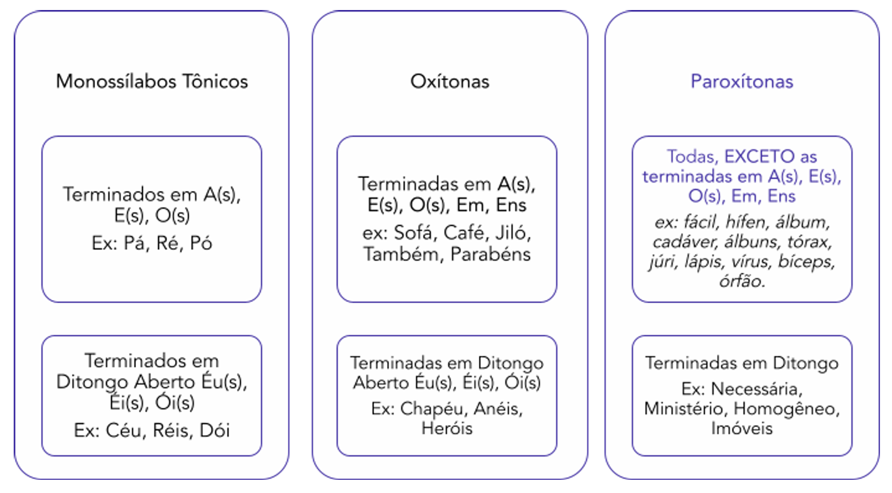

# Capítulo 2 – Ortografia e Novo Acordo Ortográfico

O domínio da ortografia é uma das competências mais visíveis e cobradas em qualquer avaliação de Língua Portuguesa. Escrever corretamente, no entanto, vai muito além de memorizar regras; envolve a compreensão da relação entre os sons da fala e sua representação na escrita. Este capítulo se aprofundará no sistema ortográfico vigente, abordando as regras de acentuação e as principais alterações trazidas pelo Novo Acordo Ortográfico. O objetivo é construir um conhecimento sólido que permita não apenas aplicar as regras de forma mecânica, mas entender a lógica por trás delas, garantindo segurança e precisão na escrita formal exigida em concursos públicos.

## Acentuação Gráfica: A Diferença entre o Som e a Escrita

Antes de mergulharmos nas regras de acentuação, é fundamental esclarecer alguns conceitos preliminares que formam a base desse estudo. A norma padrão não se preocupa apenas com a escrita, mas também com a pronúncia adequada das palavras.

### Ortoépia e Prosódia: A Base da Pronúncia Correta

Dois campos da gramática normativa se dedicam a guiar a pronúncia correta:

- **Ortoépia:** Trata da correta articulação e pronúncia dos fonemas de uma palavra. Erros de ortoépia ocorrem, por exemplo, ao pronunciar "sombrancelha" em vez de "sobrancelha".
- **Prosódia:** Trata da correta acentuação tônica das palavras, ou seja, da identificação da sílaba que deve ser pronunciada com mais intensidade. Um erro de prosódia clássico é pronunciar "rúbrica" (proparoxítona) quando o correto é "rubrica" (paroxítona).

O estudo da acentuação gráfica, portanto, é uma consequência direta da prosódia, pois as regras de acentuação na escrita dependem da classificação da palavra quanto à sua sílaba tônica.

### Acento Tônico vs. Acento Gráfico: A Voz e a Letra

Embora frequentemente relacionados, acento tônico e acento gráfico são conceitos distintos e não devem ser confundidos.

- **Acento Tônico:** É um fenômeno da **fala**. Corresponde à maior intensidade ou força com que pronunciamos uma determinada sílaba dentro de uma palavra. Toda palavra com duas ou mais sílabas possui uma (e apenas uma) sílaba tônica. Essa intensidade sonora existe independentemente de haver um sinal gráfico.
    - _Exemplo:_ Na palavra **saci** (sa-**CI**), a sílaba "ci" é a tônica, pois é pronunciada com mais ênfase, mas não leva acento gráfico.
- **Acento Gráfico (`´` ou `^`):** É um sinal diacrítico da **escrita**. Sua função é indicar a sílaba tônica em palavras que fogem à regra geral de acentuação da língua, além de marcar o timbre da vogal. Nem toda sílaba tônica recebe um acento gráfico.
    - _Exemplo:_ Na palavra **café** (ca-**FÉ**), a sílaba "fé" é a tônica e, por uma regra específica de ortografia, também recebe o acento gráfico agudo.

|Conceito|Ocorrência|Definição|Exemplo|
|---|---|---|---|
|**Acento Tônico**|Na Fala|Intensidade da pronúncia em uma sílaba.|a-**BA**-ca-xi (sílaba tônica "ba")|
|**Acento Gráfico**|Na Escrita|Sinal (`´`, `^`) que marca a sílaba tônica.|**LÂM**-pa-da (acento na sílaba tônica "lâm")|

### Monossílabos: Tônicos vs. Átonos

As palavras de uma única sílaba (monossílabos) também se distinguem pela intensidade com que são pronunciadas, o que define sua classificação e, consequentemente, suas regras de acentuação.

- **Monossílabos Tônicos:** Possuem autonomia fonética, ou seja, são pronunciados com força e têm sentido próprio na frase.
    - _Exemplos:_ **pá, fé, pó, mau, dor, sim, nós, seu.**
- **Monossílabos Átonos:** Não possuem autonomia fonética. São pronunciados de forma fraca, "apoiando-se" na palavra seguinte ou anterior. Geralmente são palavras de função puramente gramatical, como artigos, preposições, conjunções e pronomes oblíquos átonos.
    - _Exemplos:_ **o, a, um, de, em, por, com, que, se, me.**

Observe a semelhança sonora entre a sílaba átona de uma palavra e um monossílabo átono:

- _Exemplo:_ **Embaixo** estão as tarifas. (A sílaba "**Em**-" é átona em relação à tônica "-**bai**-").
- _Exemplo:_ Tarifas **em baixa** temporada. (O monossílabo "**em**" é átono e se apoia na palavra "baixa").

### A Função Distintiva do Acento Gráfico

Além de marcar a tonicidade, um dos papéis mais importantes da acentuação gráfica é **diferenciar palavras** que, de outra forma, teriam a mesma grafia (homógrafas), mas significados e, por vezes, classes gramaticais distintas.

|Sem Acento|Com Acento|
|---|---|
|**Sabia** (Verbo "saber") _Ex: Eu não **sabia** da notícia._|**Sábia** (Adjetivo "que sabe muito") _Ex: A juíza era uma mulher **sábia**._ **Sabiá** (Substantivo "pássaro") _Ex: O canto do **sabiá** é lindo._|
|**Acumulo** (Verbo "acumular") _Ex: Eu **acumulo** muitas tarefas._|**Acúmulo** (Substantivo "ato de acumular") _Ex: O **acúmulo** de tarefas me estressa._|
|**Pode** (Verbo "poder" no presente) _Ex: Ele **pode** chegar a qualquer momento._|**Pôde** (Verbo "poder" no pretérito) _Ex: Ontem ele não **pôde** vir._|

### Acento Agudo e Circunflexo: Abertura e Fechamento do Timbre

Os dois acentos gráficos usados sobre as vogais também carregam uma informação sobre a pronúncia do timbre vocálico.

- **Acento Agudo (`´`):** Indica um **timbre aberto**. É usado sobre as vogais **a, i, u** e sobre as vogais **e, o** com som aberto.
    - _Exemplos:_ ch**á**, caf**é**, jil**ó**.
- **Acento Circunflexo (`^`):** Indica um **timbre fechado**. É usado apenas sobre as vogais **a, e, o**.
    - _Exemplos:_ l**â**mpada, voc**ê**, av**ô**.

A oposição entre os timbres é claramente percebida em pares de palavras como **avó** (som aberto) e **avô** (som fechado).

## Sons, Fonemas, Letras e Dígrafos

Para compreender as regras de acentuação e de ortografia de forma lógica, é preciso antes entender a matéria-prima com a qual a língua é construída: os sons e sua representação gráfica. O campo da Fonologia estuda a função dos sons na formação e na distinção das palavras. Dominar noções como fonema, letra, dígrafo e encontro consonantal é essencial para a correta separação de sílabas e, consequentemente, para a classificação da sílaba tônica, que é a base de toda a acentuação gráfica.

### Fonema e Letra: A Distinção entre Som e Símbolo

Um **Fonema** é a menor **unidade sonora** de uma língua capaz de criar distinção de significado entre palavras. O fonema é um conceito abstrato, é o som que mentalizamos. A troca de um único fonema pode alterar completamente o sentido de um vocábulo.

- _Exemplo:_ Na palavra **pato**, temos a união de quatro fonemas: /p/ /a/ /t/ /o/.
- Se trocarmos o fonema /p/ pelo fonema /g/, formamos uma nova palavra: **gato**.
- Se trocarmos o /t/ pelo /k/ (representado pela letra "c"), temos **paco**.

Já uma **Letra** é a **representação gráfica**, o símbolo visual que usamos na escrita para representar um fonema.

Idealmente, cada letra representaria um único fonema, mas essa correspondência não é perfeita no português. A relação entre o número de letras e o de fonemas em uma palavra pode variar por três motivos principais:

1. Uma mesma letra pode representar fonemas diferentes (ex: a letra **X** pode ter som de /ch/ em _xícara_, /z/ em _exame_, /s/ em _texto_ ou /ks/ em _táxi_).
2. Um mesmo fonema pode ser representado por letras diferentes (ex: o fonema /z/ pode ser representado pela letra **Z** em _azeite_ ou pela letra **S** em _casa_).
3. Um único fonema pode ser representado por duas letras. A este fenômeno damos o nome de **dígrafo**.

### Dígrafos: Duas Letras, Um Só Som

O dígrafo ocorre quando um grupo de duas letras é usado para representar um único fonema. A presença de um dígrafo em uma palavra significa que ela terá **mais letras do que fonemas**.

- _Exemplo:_ **Chuva**
    - **Letras:** 5 (c-h-u-v-a)
    - **Fonemas:** 4 (/ch/ - /u/ - /v/ - /a/). O grupo "ch" representa um único som.

Os dígrafos podem ser consonantais ou vocálicos.

#### Dígrafos Consonantais

São os encontros de duas letras que representam um único som de consoante.

|Dígrafo|Exemplo|Dígrafo|Exemplo|Dígrafo|Exemplo|
|---|---|---|---|---|---|
|**ch**|**ch**ave|**rr**|ca**rr**o|**sc**|na**sc**er|
|**lh**|pa**lh**a|**ss**|pa**ss**o|**sç**|na**sç**a|
|**nh**|ni**nh**o|**xc**|e**xc**eto|**xs**|e**xs**udar|
|**qu**|**qu**eijo|**gu**|**gu**erra|||

> **Fique de Olho:** Os grupos **gu** e **qu** só são dígrafos quando o "u" não é pronunciado, o que ocorre antes das vogais "e" e "i". Em palavras como "a**gu**ado" ou "**qu**ase", o "u" é pronunciado, portanto, não há dígrafo.

#### Dígrafos Vocálicos (ou Nasais)

Ocorrem quando as letras **m** ou **n** aparecem após uma vogal na mesma sílaba. Nesses casos, "m" e "n" não representam fonemas de consoantes, mas apenas indicam que a vogal anterior deve ser pronunciada com um som nasal.

|Dígrafo|Exemplo|
|---|---|
|**am** / **an**|c**am**po / s**an**gue|
|**em** / **en**|t**em**po / l**en**to|
|**im** / **in**|l**im**po / c**in**to|
|**om** / **on**|c**om**pra / t**on**to|
|**um** / **un**|at**um** / m**un**do|

### Encontros Consonantais: Duas Letras, Dois Sons

Diferentemente do dígrafo, o **encontro consonantal** é a sequência de duas ou mais consoantes na palavra, onde **cada letra representa um fonema distinto**. Aqui, todos os sons das consoantes são pronunciados.

- _Exemplo:_ **br**a**d**o (o "b" e o "r" são pronunciados; o "d" também).
- _Exemplo:_ **tr**a**nst**o**rn**o (há três encontros consonantais: "tr", "ns", "rn").

O encontro consonantal pode ser classificado de acordo com sua posição na sílaba:

- **Encontro Consonantal Perfeito (ou Próprio):** Ocorre na mesma sílaba, sendo inseparável na divisão silábica. Geralmente, envolve a letra "l" ou "r" como segunda consoante.
    - _Exemplos:_ **pr**a-to, **bl**u-sa, **ps**i-có-lo-go, a-**tl**e-ta.
- **Encontro Consonantal Imperfeito (ou Impróprio):** Ocorre em sílabas diferentes, sendo separável na divisão silábica.
    - _Exemplos:_ a**d-v**o-ga-do, ri**t-m**o, o**b-j**e-to, su**b-s**olo.

> **Resumo da Diferença:**
> 
> - **Dígrafo:** Duas letras, um som (Ex: ca**rr**o).
> - **Encontro Consonantal:** Duas letras, dois sons (Ex: ca**rt**a).

A identificação correta desses fenômenos é o primeiro passo para a divisão silábica correta, que por sua vez é pré-requisito para as regras de acentuação que veremos a seguir.

## Sons Vocálicos: Ditongo, Tritongo e Hiato

Além dos encontros entre consoantes, a estrutura das sílabas em português é definida pela maneira como os sons vocálicos se agrupam ou se separam. A correta identificação desses encontros — Ditongo, Tritongo e Hiato — é crucial para a divisão silábica e, consequentemente, para a aplicação das regras de acentuação.

### Ditongo: Dois Sons, Uma Só Sílaba

O ditongo é o encontro de dois sons vocálicos — uma **vogal** (som mais forte, núcleo da sílaba) e uma **semivogal** (som mais fraco, que acompanha a vogal) — pronunciados na mesma sílaba.

- _Exemplos:_ p**ai**, s**au**dade, histór**ia**, s**érie**, c**éu**.

Os ditongos podem ser classificados segundo diferentes critérios: a posição da vogal, a sonoridade e o timbre.

#### Classificação quanto à Posição da Vogal (Crescente vs. Decrescente)

Esta classificação se baseia na ordem em que a vogal e a semivogal aparecem, o que cria um efeito de "crescimento" ou "decréscimo" na intensidade do som.

- **Ditongo Crescente (semivogal + vogal):** A pronúncia vai do som mais fraco (semivogal) para o mais forte (vogal).
    - _Exemplos:_ sé-r**ie**, his-tó-r**ia**, má-g**oa**, á-g**ua**, q**ua**se, q**ui**eto.
- **Ditongo Decrescente (vogal + semivogal):** A pronúncia vai do som mais forte (vogal) para o mais fraco (semivogal).
    - _Exemplos:_ p**ai**, a-z**ei**-te, c**éu**, n**oi**te, fl**ui**-do, s**au**dade.

#### Classificação quanto à Sonoridade (Oral vs. Nasal)

- **Ditongo Oral:** O ar passa exclusivamente pela boca durante a pronúncia.
    - _Exemplos:_ p**ai**, c**éu**, s**éi**s, histór**ia**.
- **Ditongo Nasal:** Parte do ar passa também pelo nariz. Na escrita, são marcados com til (~) ou seguidos de "m" ou "n" na mesma sílaba.
    - _Exemplos:_ m**ãe**, p**ão**, c**ã**imbra, p**õe**m, m**ui**to.

#### Classificação quanto ao Timbre (Aberto vs. Fechado)

Esta classificação se aplica principalmente aos ditongos decrescentes **éi**, **éu**, **ói**.

- **Ditongo Aberto:** A vogal é pronunciada com timbre aberto.
    - _Exemplos:_ pap**éis**, c**éu**, her**ói**, an**éis**, d**ói**.
- **Ditongo Fechado:** A vogal é pronunciada com timbre fechado.
    - _Exemplos:_ l**ei**, m**eu**, b**oi**, r**ei**no.

### Tritongo: Três Sons, Uma Só Sílaba

O tritongo é o encontro de três sons vocálicos na mesma sílaba, seguindo a ordem: **semivogal + vogal + semivogal**.

- **Tritongos Orais:**
    - _Exemplos:_ U-ru-g**uai**, Pa-ra-g**uai**, i-g**uais**, a-ve-ri-g**uou**.
- **Tritongos Nasais:**
    - _Exemplos:_ sa-g**uão**, en-xá-g**uam**, á-g**uem**.

> **Fique de Olho:** Em palavras como **águam** e **deságuem**, a letra "m" no final não representa o fonema /m/, mas sim nasaliza a vogal e funciona foneticamente como uma semivogal com som de "u" ou "i". Por isso, temos tritongos: á-g**uam** (/wɐ̃w̃/), de-sá-g**uem** (/gẽj̃/).

### Hiato: Dois Sons, Duas Sílabas

O hiato é o encontro de duas vogais em uma palavra, que, por serem ambas sons fortes (núcleos de sílaba), pertencem a **sílabas diferentes**. A existência do hiato é uma consequência direta da regra de que só pode haver uma vogal por sílaba.

- _Exemplos:_
    - s**a-ú**-de
    - p**a-í**s
    - c**o-o**r-de-nar
    - r**a-i**-nha
    - j**u-í**-zo
    - c**a-ó**-ti-co

A diferença entre ditongo e hiato é uma das chaves para a acentuação. Compare:

- **pais** (monossílaba) -> **ai** é um ditongo decrescente.
- **pa-ís** (dissílaba) -> **a-í** é um hiato.

### Classificação das Palavras Quanto ao Número de Sílabas

Relembrar esta classificação é fundamental, pois, juntamente com a identificação da sílaba tônica, ela forma a base para a aplicação das regras de acentuação.

|Categoria|Número de sílabas|Exemplos|
|---|---|---|
|**Monossílabas**|Uma sílaba|pá, pé, chá, sol, trem, um|
|**Dissílabas**|Duas sílabas|so-fá, a-té, ca-sa, hí-fen, tam-bém|
|**Trissílabas**|Três sílabas|va-ta-pá, te-cla-do, mé-di-co, ar-ma-zém|
|**Polissílabas**|Quatro ou mais sílabas|ja-ca-ran-dá, pro-pa-ro-xí-to-na, es-pe-ci-al-men-te|

### Dígrafo Nasal vs. Ditongo Nasal

A presença das letras "m" e "n" após uma vogal pode criar dois fenômenos fonéticos distintos: o dígrafo nasal e o ditongo nasal. Embora pareçam semelhantes na escrita, eles são fundamentalmente diferentes em sua sonoridade e na contagem de fonemas. Dominar essa diferença é crucial para a análise fonológica correta.

A distinção essencial reside no número de sons vocálicos produzidos:

- **Dígrafo Nasal:** Duas letras representam **UM ÚNICO SOM** de vogal nasal.
- **Ditongo Nasal:** Duas ou mais letras representam **DOIS SONS** vocálicos (uma vogal nasal + uma semivogal nasal).

#### Compreendendo o Dígrafo Nasal (Um Som)

O dígrafo nasal ocorre quando as letras **m** ou **n** aparecem após uma vogal e são seguidas por uma consoante (exceto "h") na sílaba seguinte. Nesses casos, as letras "m" e "n" não são pronunciadas como consoantes; sua única função é atuar como um sinal de nasalização, transformando a vogal anterior em uma vogal nasal, de forma muito semelhante ao til (~).

|Dígrafo|Som|Exemplo|Análise Fonética|Divisão Silábica|
|---|---|---|---|---|
|**am/an**|/ɐ̃/|c**am**po / c**an**to|O "am" e o "an" representam o som único da vogal nasal /ɐ̃/.|c**am**-po / c**an**-to|
|**em/en**|/ẽ/|t**em**po / v**en**da|O "em" e o "en" representam o som único da vogal nasal /ẽ/.|t**em**-po / v**en**-da|
|**im/in**|/ĩ/|l**im**po / l**in**do|O "im" e o "in" representam o som único da vogal nasal /ĩ/.|l**im**-po / l**in**-do|
|**om/on**|/õ/|s**om**bra / t**on**to|O "om" e o "on" representam o som único da vogal nasal /õ/.|s**om**-bra / t**on**-to|
|**um/un**|/ũ/|t**um**ba / m**un**do|O "um" e o "un" representam o som único da vogal nasal /ũ/.|t**um**-ba / m**un**-do|

Em todos esses casos, o grupo de duas letras (vogal + m/n) resulta em apenas **um fonema**.

#### Compreendendo o Ditongo Nasal (Dois Sons)

O ditongo nasal, por sua vez, é um encontro vocálico genuíno, formado por uma vogal nasal seguida por uma semivogal nasal. Ele ocorre tipicamente no final das palavras ou é marcado pelo til (~).

**Com as terminações -am / -em / -ens:**

Quando as terminações -am e -em aparecem no final das palavras (especialmente em verbos na 3ª pessoa do plural ou em palavras como "alguém"), elas não produzem um único som de vogal, mas sim dois sons vocálicos nasais. A letra "m" no final soa como uma semivogal nasalizada, com som de "u" ou "i".

- **-am** soa como **-ão** (/ɐ̃w̃/)
    - _Exemplo:_ Eles fal**am**. (Pronúncia: fál**ão**)
- **-em/-ens** soa como **-eim** (/ẽj̃/)
    - _Exemplo:_ Eles v**em**. (Pronúncia: v**êim**)
    - _Exemplo:_ armaz**éns** (Pronúncia: armaz**êins**)

|Terminação|Exemplo|Análise Fonética|Sons Vocálicos|
|---|---|---|---|
|**-am**|cant**am**|Pronunciado como "cántão" (/kɐ̃tɐ̃w̃/).|Dois sons: /ɐ̃/ + /w̃/ (semivogal)|
|**-em**|bat**em**|Pronunciado como "bátêim" (/batẽj̃/).|Dois sons: /ẽ/ + /j̃/ (semivogal)|
|**-em**|algu**ém**|Pronunciado como "alguêim" (/awgẽj̃/).|Dois sons: /ẽ/ + /j̃/ (semivogal)|

**Com o til (~):**

Os ditongos marcados com til são sempre nasais e sempre representam dois sons vocálicos.

- _Exemplos:_ m**ãe**, p**ão**, p**õe**, c**ã**ibra.

|Resumo Comparativo|Dígrafo Nasal|Ditongo Nasal|
|---|---|---|
|**Número de Sons Vocálicos**|**UM** (apenas uma vogal nasal)|**DOIS** (vogal nasal + semivogal nasal)|
|**Posição Típica**|No meio da palavra, antes de consoante.|No final da palavra (-am, -em) ou marcado com til (~).|
|**Função do M/N**|Atua como sinal de nasalização (como um til).|O "m" final atua foneticamente como uma semivogal.|
|**Exemplo-Chave**|c**an**-to (UM som nasal: /ɐ̃/)|cant**am** (DOIS sons nasais: /ɐ̃w̃/)|

## As Regras Gerais de Acentuação Gráfica

As regras de acentuação gráfica da Língua Portuguesa operam com base em uma lógica que combina dois fatores essenciais: a **posição da sílaba tônica** na palavra e a **terminação** dessa palavra. Para aplicar as regras corretamente, é preciso primeiro classificar a palavra quanto à sua tonicidade. Na língua portuguesa, a sílaba tônica ocupa sempre uma das três últimas posições:

|Nomenclatura|Definição|Exemplo|
|---|---|---|
|**Oxítona**|A sílaba tônica é a **última**.|va-ta-**pÁ**, ca-rro**s-SEL**, de-va-**GAR**|
|**Paroxítona**|A sílaba tônica é a **penúltima**.|es-**CO**-la, se-cre-**TÁ**-ria, la-**VA**-bo|
|**Proparoxítona**|A sílaba tônica é a **antepenúltima**.|**MÉ**-di-co, **LÂM**-pa-da, es-pe-**CÍ**-fi-co|

Como se pode observar na tabela, nem toda palavra que possui uma sílaba tônica recebe um acento gráfico. A acentuação na escrita segue regras específicas que visam orientar a pronúncia correta, especialmente nos casos que fogem ao padrão mais comum da língua. Além das palavras com múltiplas sílabas, os monossílabos também possuem regras próprias.

### Monossílabos Tônicos

Os monossílabos tônicos — palavras de uma única sílaba com pronúncia forte e sentido autônomo — recebem acento gráfico quando terminam em **-a(s)**, **-e(s)**, **-o(s)** ou nos **ditongos abertos -éu(s), -éi(s), -ói(s)**.

|Terminação|Exemplos|
|---|---|
|**-a(s)**|pá, pás, má, más, já, lá|
|**-e(s)**|pé, pés, ré, rês, lê, mês|
|**-o(s)**|pó, pós, nó, nós, só, dôo|
|**-éu(s)**|céu, céus, véu, véus|
|**-éi(s)**|réis, méis|
|**-ói(s)**|dói, sóis|

> **Nota:** Monossílabos tônicos com outras terminações não são acentuados. Exemplos: _luz, mar, som, flor, um, trem, bem_.

### Oxítonas

As palavras oxítonas — aquelas cuja sílaba tônica é a última — são acentuadas quando possuem terminações muito semelhantes às dos monossílabos, com o acréscimo de **-em** e **-ens**.

Acentuam-se as oxítonas terminadas em **-a(s)**, **-e(s)**, **-o(s)**, **-em**, **-ens** e nos **ditongos abertos -éu(s), -éi(s), -ói(s)**.

|Terminação|Exemplos|
|---|---|
|**-a(s)**|so**fá**, guara**ná**, Cajá, para**ná**s|
|**-e(s)**|ca**fé**, vo**cê**, ponta**pé**, cro**chê**, Tietê|
|**-o(s)**|avô, a**vó**, jiló, paletó, cipó|
|**-em**|al**guém**, tam**bém**, arma**zém**, refém|
|**-ens**|para**béns**, arma**zéns**, reféns|
|**-éu(s)**|cha**péu**, tro**féu**, cha**péus**|
|**-éi(s)**|pa**péis**, fi**éis**, a**néis**|
|**-ói(s)**|he**rói**, Nit**erói**, cor**rói**, an**zóis**|

> **Nota:** Palavras oxítonas com outras terminações não são acentuadas. Exemplos: _saci, urubu, aqui, animal, cantor, talvez_.

> **Foco de Prova: A Lógica por Trás das Regras**
> 
> Uma das chaves para resolver questões de acentuação é entender que as regras gerais são, em princípio, mutuamente exclusivas. Uma palavra é classificada quanto à tonicidade (monossílaba, oxítona, paroxítona ou proparoxítona) e, a partir daí, enquadra-se em uma única regra geral.
> 
> Portanto, se uma questão afirmar que duas palavras de tonicidades diferentes são acentuadas pela mesma regra, a alternativa provavelmente estará incorreta.
> 
> Exemplo: "As palavras ‘parabéns’ e ‘hífen’ são acentuadas pelo mesmo motivo."
> 
> Análise: Sem sequer saber a regra específica de cada uma, é possível identificar o erro. Parabéns é uma oxítona (tônica na última sílaba). Hífen é uma paroxítona (tônica na penúltima sílaba). Logo, elas não podem ser justificadas pela mesma regra geral de acentuação.
> 
> **Atenção:** Existe uma exceção importante a essa lógica: as **regras especiais**, como a do **hiato**, que estudaremos a seguir. Uma regra especial pode se sobrepor à classificação geral. Por exemplo, as palavras **Sa-ú-de** (paroxítona) e **A-ça-í** (oxítona) são acentuadas pela mesma regra especial do hiato, mesmo tendo tonicidades diferentes.

### Paroxítonas

As paroxítonas — palavras cuja sílaba tônica é a penúltima — constituem o maior grupo de vocábulos da Língua Portuguesa. Por serem a maioria, sua regra de acentuação funciona de maneira inversa à das oxítonas, ou seja, por **exclusão**.

A lógica é a seguinte: as terminações mais comuns da língua (`-a, -e, -o, -em, -ens`) já são usadas para acentuar as oxítonas. Para diferenciar, a norma estabelece que as paroxítonas com essas mesmas terminações **não recebem acento**.

- **Não são acentuadas** as paroxítonas terminadas em **-a(s), -e, -o(s), -em, -ens**:
    - _Exemplos:_ c**a**s**a**, p**o**st**e**, l**i**vr**o**, **i**t**em**, hif**ens**, p**o**l**ens**.

Consequentemente, acentuam-se as paroxítonas com **todas as outras terminações**. Elas podem ser agrupadas em duas grandes regras: a regra geral (por terminação específica) e a regra especial (por terminação em ditongo).

#### A Regra Geral: Acentuação por Terminações Específicas

Acentuam-se as paroxítonas que possuem as seguintes terminações:

|Terminação|Exemplos|
|---|---|
|**-l**|amáve**l**, fáci**l**, possíve**l**, têxti**l**|
|**-r**|caráte**r**, repórte**r**, açúca**r**, Ménie**r**|
|**-n**|hífe**n**, próto**n**, elétro**n**, lúme**n**|
|**-x**|tóra**x**, lâte**x**, fêni**x**, ônix|
|**-i(s)**|júr**i**, táx**i**, láp**is**, tên**is**|
|**-us**|vír**us**, bôn**us**, ôn**us**, Vên**us**|
|**-ps**|bíce**ps**, fórce**ps**, tríce**ps**|
|**-ã(s)**|ím**ã**, ím**ãs**, órf**ã**, órf**ãs**|
|**-ão(s)**|órg**ão**, órg**ãos**, sót**ão**, bênç**ão**|
|**-um, -uns**|álb**um**, álb**uns**, fór**um**, médi**uns**|

#### A Regra Especial: Paroxítonas Terminadas em Ditongo Oral

Esta é uma regra de grande importância e alta incidência em provas. Acentuam-se todas as paroxítonas terminadas em **ditongo oral** (crescente ou decrescente), seguido ou não de "s".

- _Exemplos:_
    - histór**ia**, sár**ie**, secretár**ia**, mágo**a**
    - indivíd**uo**, planíc**ie**, calvíc**ie**, imóv**eis**
    - rádio, império, farmácia, pônei

> **Cuidado:** Não confunda a terminação. A palavra **água** não termina na vogal "-a", mas sim no ditongo crescente **-ua**. Por isso, ela é acentuada por esta regra. O mesmo vale para **distância** (termina no ditongo **-ia**).

#### O Novo Acordo e a Queda do Acento nos Ditongos Abertos

Uma das mudanças mais significativas do Novo Acordo Ortográfico afetou diretamente a regra das paroxítonas. O acento agudo que era usado nos ditongos abertos **-éi** e **-ói** foi **abolido APENAS nas palavras paroxítonas**.

Essa regra não afetou as palavras oxítonas nem os monossílabos tônicos, que continuam sendo acentuados.

|Não são mais acentuadas (Paroxítonas)|Continuam acentuadas (Oxítonas e Monossílabos)|
|---|---|
|id**ei**a, plat**ei**a, assembl**ei**a, colm**ei**a|an**éis**, fi**éis**, pap**éis**, r**éis**|
|her**oi**co, aster**oi**de, paran**oi**co, jib**oi**a|her**ói**, corrói, d**ói**, an**zóis**|

#### Observações Importantes e Dicas de Prova

1. **Justificativa pela Regra Geral:** Palavras como **amável** (terminada em -l), **bíceps** (terminada em -ps) e **caráter** (terminada em -r) são acentuadas pela **mesma regra geral das paroxítonas**, apesar de suas terminações serem diferentes. A justificativa é a mesma: "acentua-se paroxítona não terminada em -a, -e, -o, -em, -ens".
2. **Justificativa pela Regra Especial:** Da mesma forma, palavras como **história**, **relógio** e **pônei** são acentuadas pela **mesma regra especial das paroxítonas**, pois todas terminam em ditongo oral.
3. **Hífen vs. Hifens:** A palavra **hífen** é acentuada por ser uma paroxítona terminada em **-n**. No plural, **hifens** perde o acento, pois passa a ser uma paroxítona terminada em **-ens**, que é uma das terminações que não recebem acento. O mesmo ocorre com **item** (não tem acento, termina em -em) e **itens** (não tem acento, termina em -ens).
4. **Prefixos:** Prefixos paroxítonos terminados em **-i** ou **-r**, como _super-, hiper-, inter-, mini-, semi-_, não são acentuados.
    - **Exceção:** Palavras como **Méier** e **destróier** são acentuadas. Elas não são vistas como prefixos, mas como substantivos próprios ou comuns terminados em **-r**, enquadrando-se na regra geral das paroxítonas.
5. **Verbos em -am:** Verbos na 3ª pessoa do plural do presente do indicativo, como _cant**am**_ e _chor**am**_, são paroxítonas terminadas no ditongo nasal **-am**, mas **não são acentuadas**.

### Proparoxítonas

Chegamos à regra mais simples e absoluta de toda a acentuação gráfica. As palavras **proparoxítonas** — aquelas cuja sílaba tônica é a antepenúltima — são **todas acentuadas**, sem exceção.

Esta regra prevalece sobre qualquer outra. Não é necessário analisar a terminação da palavra ou qualquer outro critério. Se, na separação silábica, a sílaba tônica for a antepenúltima, a palavra obrigatoriamente levará um acento gráfico.

- **Exemplos:**
    - **mé**-di-co
    - **lâm**-pa-da
    - es-pe-**cí**-fi-co
    - ma-te-**má**-ti-ca
    - **trân**-si-to
    - an-**tô**-ni-mo
    - ca-**ó**-ti-co
    - fe-**nô**-me-no

#### Uma Polêmica Gramatical: As "Proparoxítonas Aparentes"

Existe uma discussão teórica na gramática sobre a classificação de palavras paroxítonas terminadas em ditongo crescente, como **história**, **série** e **pátio**. A polêmica reside na possibilidade de uma dupla análise da separação silábica do encontro vocálico final.

A visão tradicional e dominante classifica essas palavras como paroxítonas terminadas em ditongo:

- his-**tó**-ria (paroxítona terminada no ditongo "-ia")
- **sé**-rie (paroxítona terminada no ditongo "-ie")

No entanto, uma segunda corrente de análise, apoiada por alguns gramáticos e pelo próprio texto do Acordo Ortográfico, admite a possibilidade de separar esse encontro vocálico final em um hiato, o que transformaria a palavra em uma proparoxítona:

- his-**tó**-ri-a (proparoxítona)
- **sé**-ri-e (proparoxítona)

O próprio Acordo Ortográfico menciona a acentuação das "...chamadas proparoxítonas aparentes, isto é, que (...) terminam por sequências vocálicas pós-tónicas/pós-tônicas praticamente consideradas como ditongos crescentes (-ea, -eo, -ia, -ie, -io, -oa, -ua, -uo, etc.)".

O renomado gramático Domingos Paschoal Cegalla também registra essa dualidade, mas recomenda a classificação principal:

> "Os encontros ia, ie, io, ua, ue, uo finais átonos, seguidos ou não de s, classificam-se quer como ditongos, quer como hiatos (...). Todavia, é preferível considerar tais grupos ditongos crescentes e, consequentemente, paroxítonos os vocábulos em que ocorrem."

> **Foco de Prova: Como Abordar a Questão?**
> 
> Diante dessa polêmica, qual postura adotar em um concurso? A orientação é clara e estratégica:
> 
> 1. **A Regra Dominante:** Para a esmagadora maioria das bancas e questões, a classificação a ser considerada é a tradicional: **PAROXÍTONA TERMINADA EM DITONGO**. Esta deve ser sempre a sua primeira análise.
> 2. **Questões de "Mesma Justificativa":** Se uma questão apresentar as palavras "farmácia", "critério" e "mágoa" e perguntar se são acentuadas pela mesma razão, a resposta é **SIM**. Elas se encaixam no mesmo grupo, seja pela regra das paroxítonas terminadas em ditongo, seja pela das proparoxítonas aparentes.
> 3. **Quando Considerar a Dupla Possibilidade:** Apenas em questões de nível muito avançado, ou se a alternativa que considera a regra principal parecer incorreta, deve-se pensar na possibilidade da palavra ser classificada como uma proparoxítona "aparente" ou "eventual".
> 4. **Distinção Importante:** Esta discussão **não se aplica** a paroxítonas terminadas em ditongo **decrescente**, como _fáceis_ ou _amáveis_. Essas são, sem qualquer polêmica, apenas paroxítonas.

Em resumo, a regra a ser levada como principal é a da **paroxítona terminada em ditongo**. A teoria da proparoxítona aparente é um conhecimento acessório para situações excepcionais.

### Quadro-Resumo das Regras Gerais de Acentuação

Para consolidar o conhecimento e facilitar a memorização, o quadro a seguir sintetiza as regras gerais de acentuação baseadas na terminação das palavras monossílabas, oxítonas e paroxítonas.

É fundamental notar que o quadro acima resume as regras que dependem da **terminação** das palavras. A regra das proparoxítonas, que independe de terminação, é a mais simples de todas e sobrepõe-se a estas: **TODA PROPAROXÍTONA É ACENTUADA**.

### As Regras Especiais de Acentuação

Além das regras gerais que se baseiam na tonicidade e terminação (monossílabos, oxítonas, paroxítonas, proparoxítonas), existem regras especiais que se sobrepõem a elas. A mais importante e cobrada em concursos é a regra de acentuação do hiato.

#### A Regra do Hiato: Protegendo a Pronúncia

Como vimos, o hiato é o encontro de duas vogais em sílabas adjacentes (Ex: s**a-ú**-de). A regra de acentuação do hiato existe por uma razão fonética muito específica: evitar que a sequência de vogais seja lida como um ditongo. O acento gráfico serve como um "aviso" de que a segunda vogal do encontro é tônica e forma sua própria sílaba.

- Compare a pronúncia:
    - **cai** (um único impulso de voz, ditongo, monossílaba)
    - **ca-í** (dois impulsos de voz, hiato, dissílaba)

O acento em "caí" é o que garante a pronúncia correta do hiato. É fundamental entender que esta regra é autônoma e se aplica independentemente da classificação geral da palavra.

- **a-ça-í** (oxítona com hiato)
- **sa-ú-de** (paroxítona com hiato)

Ambas são acentuadas pela mesma regra especial do hiato.

##### A Regra Principal do Hiato

Acentuam-se as vogais **"i"** e **"u"** quando representam a segunda vogal tônica de um hiato, desde que atendam, simultaneamente, às seguintes condições:

1. Sejam **tônicas**.
2. Formem sílaba **sozinhas ou acompanhadas apenas da letra "s"**.
3. Não sejam seguidas pelo dígrafo **"nh"** na sílaba seguinte.

|Exemplos Acentuados (Regra Aplicada)|
|---|
|sa-**í**-da, e-go-**ís**-ta, fa-**ís**-ca, Pa-ra-**í**-ba|
|sa-**ú**-de, ga-**ú**-cho, ba-**ú**, ba-la-**ús**-tre|

| Exemplos Não Acentuados (Regra Não Aplicada)              | Motivo                                                     |
| --------------------------------------------------------- | ---------------------------------------------------------- |
| c**a-ir**, sa-**ir**-mos, j**u-iz**, R**a-ul**            | O "i" ou "u" tônico é seguido por outra letra que não "s". |
| r**a-i**-nha, b**a-i**-nha, m**o-i**-nho, camp**a-i**-nha | O "i" tônico é seguido pelo dígrafo "nh".                  |
| s**aiu**, contr**i-buiu**                                 | O "i" ou "u" não é tônico (a sílaba tônica é a anterior).  |

##### O Novo Acordo Ortográfico e as Exceções ao Hiato

O Acordo Ortográfico de 2009 trouxe mudanças importantes que criaram exceções a esta regra, principalmente envolvendo hiatos que aparecem após ditongos e os hiatos de vogais repetidas.

**Hiatos após Ditongos:**

Esta é uma das regras mais complexas e detalhadas.

- **A Mudança:** Deixam de ser acentuadas as vogais **"i"** e **"u"** tônicas de um hiato quando vêm após um **ditongo decrescente** em uma palavra **paroxítona**.
    - _Exemplos (não são mais acentuados):_ fei-**u**-ra, bai-**u**-ca, bo-cai-**u**-va.

A regra, no entanto, é mantida em outros cenários, o que gera a necessidade de atenção redobrada.

| Condição da Palavra                                   | Acentuação do Hiato              | Exemplo                              |
| ----------------------------------------------------- | -------------------------------- | ------------------------------------ |
| **Paroxítona** com hiato após ditongo **decrescente** | **NÃO** leva acento (Nova Regra) | fei-**u**-ra, bai-**u**-ca           |
| **Paroxítona** com hiato após ditongo **crescente**   | **LEVA** acento (Regra Mantida)  | Gua-**í**-ra, Gua-**í**-ba           |
| **Oxítona** com hiato após qualquer ditongo           | **LEVA** acento (Regra Mantida)  | Pi-au-**í**, tui-ui-**ú**, tei-**ú** |

**Hiatos de Vogais Repetidas (-eem, -oo):**

- **A Mudança:** O acento circunflexo que era usado para marcar os hiatos **-eem** (na 3ª pessoa do plural de verbos como _crer, dar, ler, ver_) e **-oo(s)** foi abolido.
    - _Exemplos (não são mais acentuados):_
        - Eles **creem**, **deem**, **leem**, **veem**.
        - v**oo**, enj**oo**, perd**oo**, abenç**oo**.

> **Dica Estratégica: Simplificando a Regra do Hiato para Provas**
> 
> A regra do hiato e suas exceções podem parecer complexas. Para fins práticos, concentre-se em memorizar os seguintes pontos:
> 
> 1. As palavras **feiura, baiuca e bocaiuva** (e similares) **não têm acento**.
> 2. As palavras **Guaíra** e **Guaíba** **têm acento**.
> 3. As palavras oxítonas como **Piauí, tuiuiú** e **teiú** **têm acento**.
> 4. As terminações **-eem** e **-oo(s)**, como em **creem** e **voo**, **não têm acento**.
> 5. Palavras como **juiz, ruim, Raul, rainha** e **moinho** **não têm acento** porque o "i" ou "u" do hiato não cumpre as condições da regra principal.

### Casos Específicos e de Dúvida Frequente

Além das regras gerais e especiais, o estudo da acentuação envolve o conhecimento de casos particulares que foram mantidos ou alterados pelo Novo Acordo Ortográfico, bem como a correta pronúncia de palavras que frequentemente causam confusão.

#### Os Acentos Diferenciais Remanescentes

O acento diferencial é um acento gráfico que não serve para marcar a tonicidade, mas sim para distinguir palavras com a mesma grafia (homógrafas), mas com significados, classes gramaticais ou tempos verbais diferentes. O Novo Acordo Ortográfico de 2009 aboliu a maioria desses acentos, simplificando as regras. A estratégia correta é focar apenas nos casos que permaneceram válidos.

##### Acentos Obrigatórios

**Pôr (verbo) vs. Por (preposição)**

Esta distinção é mantida para diferenciar o verbo da preposição.

- **Pôr (Verbo):** Leva acento circunflexo. Uma dica para confirmar é tentar substituí-lo por seu sinônimo "colocar".
    - _Exemplo:_ É preciso **pôr** (colocar) os livros na prateleira correta.
- **Por (Preposição):** Não é acentuado.
    - _Exemplo:_ Viajamos **por** uma estrada de terra.

**Pôde (passado) vs. Pode (presente)**

O acento diferencia os tempos do verbo "poder" na 3ª pessoa do singular.

- **Pôde (Pretérito Perfeito):** Com acento, indica uma ação no passado. A pronúncia do "o" é fechada.
    - _Exemplo:_ Ontem, ele não **pôde** comparecer à reunião por motivos de saúde.
- **Pode (Presente):** Sem acento, indica uma ação no presente. A pronúncia do "o" é aberta.
    - _Exemplo:_ Ele não **pode** falar ao telefone neste momento.

**Têm/Vêm (plural) e seus derivados**

Este é um caso de concordância verbal marcado por acento. O acento circunflexo é usado para indicar a 3ª pessoa do plural dos verbos ter e vir e de todos os seus derivados.

| Singular (sem acento)          | Plural (com acento circunflexo) |
| ------------------------------ | ------------------------------- |
| Ele **tem**...                 | Eles **têm**...                 |
| Ele **vem**...                 | Eles **vêm**...                 |
| Ele **mantém**... (manter)     | Eles **mantêm**...              |
| Ele **contém**... (conter)     | Eles **contêm**...              |
| Ele **intervém**... (intervir) | Eles **intervêm**...            |
| Ele **convém**... (convir)     | Eles **convêm**...              |

- **Atenção:** Os verbos derivados (manter, conter, intervir, etc.) já recebem um acento **agudo** na 3ª pessoa do **singular** por serem oxítonos terminados em "-em" (Ex: ele man**tém**). No plural, esse acento apenas se transforma em **circunflexo** (Ex: eles man**têm**).

##### Acento Facultativo

O Acordo Ortográfico tornou o acento diferencial facultativo em um caso principal, para ser usado apenas quando houver risco de ambiguidade.

- **Fôrma (com acento):** Usado para se referir ao objeto, ao utensílio (fôrma de bolo).
- **Forma (sem acento):** Usado para se referir ao formato, ao jeito ou ao verbo "formar".
- **Uso:** O acento em "fôrma" é opcional.
    - _Exemplo:_ Qual é a **forma** correta de preencher esta **fôrma**? (O uso do acento aqui ajuda a evitar a repetição sonora e a esclarecer o sentido).

##### Acentos Abolidos: Foco de Prova

É importante saber quais palavras **perderam** o acento diferencial para não cometer erros ou cair em "pegadinhas" que testam o conhecimento desatualizado.

- **pelo** (substantivo) / **pelo** (verbo pelar) -> Agora são iguais a **pelo** (per + o).
- **pera** (substantivo - fruta) -> Agora é igual a **pera** (preposição arcaica).
- **polo** (substantivo - extremidade) -> Agora é igual a **polo** (contração antiga).
- **para** (verbo parar) -> Agora é igual a **para** (preposição).

#### Ortoépia e Prosódia: Palavras que Geram Dúvidas

Como vimos, a aplicação correta das regras de acentuação depende do conhecimento da prosódia da palavra, ou seja, da sua sílaba tônica correta. Muitas palavras do vocabulário formal ou técnico possuem uma pronúncia que contraria a intuição, podendo levar a erros de classificação e, consequentemente, de acentuação. A seguir, uma lista de palavras importantes, organizadas por sua correta classificação tônica.

| Classificação      | Palavras                                                                                                                                                                                                                                                                                                                                                                                                                                           |
| ------------------ | -------------------------------------------------------------------------------------------------------------------------------------------------------------------------------------------------------------------------------------------------------------------------------------------------------------------------------------------------------------------------------------------------------------------------------------------------- |
| **Oxítonas**       | aloés, cateter, Gibraltar, harém, mister (=necessário), Nobel, novel, recém, refém, ruim (hiato u-im), sutil, ureter.                                                                                                                                                                                                                                                                                                                              |
| **Paroxítonas**    | acórdão, âmbar, ambrosia, avaro, aziago, barbaria, cânon, caracteres, cartomancia, ciclope, edito (=lei, decreto), epifania, exegese, filantropo, fluido (ui ditongo), fortuito (ui ditongo), gratuito (ui ditongo), ibero, inaudito, látex, maquinaria, misantropo, necropsia, Normandia, oximoro (tb. oximóron), pudico, quiromancia, simulacro.                                                                                                 |
| **Proparoxítonas** | aeródromo, aerólito, álcali, álcool, alcoólatra, álibi, alvíssaras, âmago, amálgama, ambrósia, anátema, andrógino, antídoto, arquétipo, autóctone, brâmane, cáfila, condômino, crisântemo, década, díptero, écloga, édito (ordem judicial), Éfeso, êmbolo, epíteto, épsilon, escâncaras (às), êxodo, fac-símile, fíbula, idólatra, ímprobo, ínclito, ínterim, máxime ou maxime (lat.), ômega, plêiade (-a), protótipo, Tâmisa, trânsfuga, vândalo. |

##### Palavras com Dupla Prosódia

Algumas palavras da língua admitem duas pronúncias (e, às vezes, duas grafias) como corretas pela norma padrão.

| Pronúncia Proparoxítona | Pronúncia Paroxítona |
| ----------------------- | -------------------- |
| acróbata                | acrobata             |
| alópata                 | alopata              |
| ambrósia                | ambrosia             |
| crisântemo              | crisantemo           |
| geodésia                | geodesia             |
| hieróglifo              | hieroglifo           |
| homília                 | homilia              |
| nefelíbata              | nefelibata           |
| Oceânia                 | Oceania              |
| ortoépia                | ortoepia             |
| projétil                | projetil             |
| réptil                  | reptil               |
| reseda (ê)              | resedá               |
| sóror                   | soror                |
| zângão                  | zangão               |

## O Emprego do Hífen: As Regras da União e Separação

O hífen (-) é um sinal de pontuação com múltiplas funções: é usado na divisão de sílabas ao final da linha (translineação), na união de pronomes oblíquos átonos a verbos (ênclise e mesóclise) e, principalmente, na formação de palavras compostas. É neste último campo, especialmente na união de prefixos a radicais, que o Novo Acordo Ortográfico trouxe as mudanças mais significativas e onde se concentra a maior parte das questões de concurso.

O tema é extenso e possui diversas exceções consagradas pelo uso. O foco aqui será apresentar a lógica geral e as regras de maior incidência em provas, fornecendo uma base sólida para a resolução da maioria dos casos.

### Entendendo a Formação das Palavras: Prefixo vs. Composição

Para aplicar corretamente as regras do hífen, é fundamental distinguir os dois principais processos de formação de palavras: a **derivação** (com prefixos e sufixos) e a **composição** (com dois ou mais radicais).

O **radical** é o elemento que contém o significado básico e primitivo da palavra.

- _Exemplo:_ A partir do radical **pedr-**, formam-se diversas palavras: _pedra, pedrinha, pedregulho, pedreiro, apedrejar, petrificar_.

Quando adicionamos um elemento no início do radical, temos uma **derivação prefixal**. É o caso de **anti**-inflamatório e **super**-resistente. As regras de hífen que estudaremos a seguir se aplicam majoritariamente a este processo.

Quando unimos dois ou mais radicais para formar uma nova palavra, temos uma **composição**. A palavra composta, por ter mais de um radical, segue outras lógicas. A união pode ocorrer de duas formas:

- **Composição por Justaposição:** Os radicais se juntam sem perda de sons, podendo ou não ter hífen.
    - _Exemplos:_ homem-bomba, salário-família, guarda-chuva, pontapé, girassol.
- **Composição por Aglutinação:** Os radicais se fundem e há alteração fonética, sem uso de hífen.
    - _Exemplos:_ planalto (_plano + alto_), lobisomem (_lobo + homem_), petróleo (_pedra + óleo_).

Essa distinção é crucial, pois as regras de "letras iguais e diferentes" que veremos a seguir aplicam-se à **prefixação**. Palavras formadas por composição, como **corre-corre** ou **pega-pega**, são a união de dois radicais (dois verbos, no caso) e não entram nessa análise, seguindo regras próprias.

### A Regra Geral para Prefixos

A maioria das regras de hifenização com prefixos pode ser entendida a partir de um princípio mnemônico simples: **os iguais se repelem, os diferentes se atraem**. Na prática, isso significa que letras iguais são separadas pelo hífen, enquanto letras diferentes tendem a se unir.

A lista de prefixos (ou falsos prefixos) é extensa. Os mais comuns em provas são:

| aero-  | auto-   | extra- | macro- | proto-  | sobre- |
| ------ | ------- | ------ | ------ | ------- | ------ |
| agro-  | circum- | geo-   | micro- | pós-    | sub-   |
| além-  | co-     | hidro- | mini-  | pré-    | super- |
| ante-  | contra- | hiper- | multi- | pró-    | supra- |
| anti-  | eletro- | infra- | neo-   | pseudo- | tele-  |
| aquém- | entre-  | inter- | pan-   | retro-  | ultra- |

Vamos detalhar a aplicação da regra geral.

**Usa-se o hífen:**

- **Para separar letras iguais:** Quando o prefixo termina com a mesma letra com que se inicia a palavra seguinte, o hífen é obrigatório.
    - _Vogais iguais:_ micr**o-o**ndas, contr**a-a**taque, ant**i-i**nflamatório, aut**o-o**bservação.
    - _Consoantes iguais:_ supe**r-r**omântico, inte**r-r**egional, su**b-b**ibliotecário.

**Não se usa o hífen (junta-se tudo):**

- **Quando as letras são diferentes:** Se o prefixo termina com uma letra e a palavra seguinte começa com outra diferente, a união é feita sem hífen.
    - _Vogal + Vogal diferente:_ **autoes**trada, **agroin**dustrial, **antion**tem, **extrao**ficial, **infraes**trutura.
    - _Consoante + Vogal diferente:_ **hipera**tivo, **interes**colar, **supere**conômico.
    - _Vogal + Consoante diferente:_ **autoa**prendizagem, **semia**nalfabeto.
    - _Consoante + Consoante diferente:_ **hiperme**rcado, **superba**ctéria, **intermu**nicipal.

**Uso Obrigatório do Hífen Antes da Letra H**

Esta é uma regra especial e absoluta dentro do universo dos prefixos: independentemente do prefixo utilizado, **usa-se sempre o hífen antes de uma palavra iniciada pela letra H**.

- **Exemplos:**
    - anti-**h**igiênico
    - circum-**h**ospitalar
    - contra-**h**armônico
    - extra-**h**umano
    - geo-**h**istória
    - neo-**h**elênico
    - pan-**h**elenismo
    - pré-**h**istória
    - semi-**h**ospitalar
    - sobre-**h**umano
    - sub-**h**epático
    - super-**h**omem
    - ultra-**h**iperbólico

> **Exceção Importante:**
> 
> Não se usa o hífen em palavras formadas com os prefixos **des-** e **in-** em que o segundo elemento perdeu o "h" inicial por um processo histórico de formação.
> 
> - **Exemplos:** desumano (_des + humano_), desonesto, desidratar, inábil (_in + hábil_), inumano.
>

> **Foco de Prova: A Duplicação do R e do S**
> 
> Uma regra especial e muito cobrada deriva do caso "vogal + consoante diferente". Quando o prefixo termina em vogal e a palavra seguinte começa com **R** ou **S**, **não se usa hífen e essas consoantes são duplicadas**.
> 
> - ant**iss**ocial, ant**irr**acismo, ant**irr**ugas
> - contr**ass**enso, contr**arr**egra, contr**arr**azões
> - min**iss**aia, ultr**ass**om, ne**orr**ealismo
> - co**rr**esponsável

> **Exceção Importante:**
> 
> O prefixo co- é uma exceção à regra das "letras iguais". Ele geralmente se aglutina mesmo quando a palavra seguinte começa com "o": cooperativa, coobrigar, coordenar.

### Outros Casos de Hifenização (Palavras Compostas em Geral)

É crucial entender que a regra geral dos prefixos não é universal. Muitas palavras compostas, formadas pela união de dois radicais (e não prefixo + radical), seguem outras lógicas. Não se deve sair suprimindo o hífen de palavras como _segunda-feira_, _mato-grossense_, _bem-te-vi_, _guarda-roupa_ ou _verde-amarelo_.

**Compostos com Elemento de Ligação**

Por regra, não se usa hífen em palavras compostas que possuem um elemento de ligação (geralmente uma preposição como "de", "com", "a"). A lógica é que a preposição já serve como conector.

- _Exemplos:_ mão de obra, dia a dia, café com leite, cão de guarda, fim de semana, pé de moleque, camisa de força, pé de moleque, cara de pau.
- **Exceções (consagradas pelo uso):** Algumas palavras mantêm o hífen mesmo com elemento de ligação.
    - _Exemplos:_ cor-de-rosa, água-de-colônia, arco-da-velha, mais-que-perfeito, pé-de-meia, ao deus-dará, gota-d’água, à queima-roupa.
    - Nomes de espécies botânicas e zoológicas também são exceções: bem-te-vi, pimenta-do-reino, cravo-da-índia, erva-doce, bico-de-papagaio.

**Compostos sem Elemento de Ligação**

Quando não há preposição e os termos formam uma nova unidade de sentido, o hífen geralmente é empregado.

- _Exemplos:_ arco-íris, boa-fé, guarda-chuva, porta-malas, vaga-lume.

**Palavras Repetidas ou Onomatopeias**

- **Com hífen:** Se não houver elemento de ligação.
    - _Exemplos:_ corre-corre, pega-pega, pingue-pongue, cri-cri, glu-glu, bate-boca.
- **Sem hífen:** Se houver um elemento de ligação.
    - _Exemplos:_ dia a dia, corpo a corpo, face a face.

**Advérbios "Não" e "Quase"**

Não se usa hífen quando "não" e "quase" funcionam como advérbios, modificando a palavra seguinte.

- _Exemplos:_ não agressão, não fumante, não violência, quase delito, quase morte.

**Encadeamentos Vocabulares**

Usa-se o hífen para ligar duas ou mais palavras que formam um encadeamento de sentido, como em trajetos ou relações.

- _Exemplos:_ ponte Rio-Niterói, eixo Rio-São Paulo, percurso casa-trabalho.

### Regras Especiais de Hifenização por Prefixo

Além da regra geral de "letras iguais e diferentes", existem regras específicas para determinados prefixos que se sobrepõem à lógica principal. O conhecimento destes casos é fundamental, pois eles são frequentemente explorados em provas.

#### Os Prefixos "Bem" e "Mal"

A hifenização com estes dois prefixos segue uma lógica particular.

- **Com o prefixo BEM-:** A regra é usar sempre o hífen, exceto quando a palavra seguinte for um derivado dos verbos fazer ou querer.
    - **Casos com hífen (regra geral):** bem-vindo, bem-humorado, bem-estar, bem-criado, bem-aventurado, bem-sucedido, bem-nascido.
    - **Exceções sem hífen (derivados de _fazer/querer_):** benfeito, benfeitor, benfazejo, benquerer, benquisto.
- **Com o prefixo MAL-:** A regra depende da letra que inicia a palavra seguinte.
    - Usa-se o hífen se a palavra seguinte começar com **vogal** ou **H**.
        - _Exemplos:_ mal-educado, mal-estar, mal-humorado, mal-afortunado.
    - **Não** se usa o hífen (junta-se tudo) se a palavra seguinte começar com **consoante** (diferente de H).
        - _Exemplos:_ malfeito, malcriado, malvisto, malnascido.

|Prefixo|Antes de VOGAL ou H|Antes de CONSOANTE|Exceções|
|---|---|---|---|
|**BEM-**|**COM HÍFEN** (bem-estar)|**COM HÍFEN** (bem-criado)|**SEM HÍFEN** com `fazer`/`querer` (benfeito, benquerer)|
|**MAL-**|**COM HÍFEN** (mal-educado)|**SEM HÍFEN** (malfeito)|N/A|

#### Prefixos com Hífen Obrigatório

Alguns prefixos exigem o uso do hífen em praticamente todas as situações.

- **Com `além-`, `aquém-`, `recém-`, `sem-`, `ex-`, `vice-`:**
    - _Exemplos:_ além-mar, aquém-fronteiras, recém-casado, sem-terra, ex-diretor, vice-presidente.
- **Com `pós-`, `pré-`, `pró-` (quando tônicos e acentuados):**
    - _Exemplos:_ pós-graduação, pré-vestibular, pró-americano.
    - **Atenção:** Quando são átonos (sem acento e sem autonomia fonética), aglutinam-se à palavra seguinte sem hífen.
        - _Exemplos:_ **pre**estabelecer, **pro**mover, **pos**por.

#### Regras Específicas por Consoante

- Com sub- e sob-:
    Usa-se o hífen antes de palavras iniciadas por R ou B.
    - _Exemplos:_ sub-região, sub-reitor, sub-base, sob-roda.
    - (A regra das letras iguais `sub-bibliotecário` também se aplica aqui).
    - A mesma lógica se aplica a prefixos como `ad-`, `ab-`, `ob-`: _ad-renal, ab-rogar, ob-rogar_.
- Com circum- e pan-:
    Usa-se o hífen antes de palavras iniciadas por vogal, M, N ou H.
    - _Exemplos:_ pan-americano, pan-helenismo, circum-navegação, circum-escolar.

### O Caso das Palavras que "Perderam a Noção de Composição"

O texto do Acordo Ortográfico abre uma exceção à regra de duplicação do "r" e "s" para palavras que, pelo uso, já não são percebidas como compostas. A regra oficial diz:

> "Certos compostos, em relação aos quais se perdeu, em certa medida, a noção de composição, grafam-se aglutinadamente: girassol, madressilva, mandachuva, pontapé, paraquedas, paraquedista etc.”

A lógica é que o hífen serve para marcar a união de radicais distintos que mantêm sua individualidade (como em **homem-bomba**). Em palavras como **girassol**, a noção original de "gira + sol" se perdeu; pensamos nela como uma entidade única, uma flor. O mesmo ocorre com **pontapé** (não pensamos na "ponta do pé") e **paraquedas** (não pensamos em algo que "para a queda").

Por ser uma regra de vocabulário impreciso ("certos compostos", "em certa medida"), a melhor estratégia é memorizar os principais exemplos que podem ser cobrados em prova.

- **Principais exemplos:** girassol, madressilva, mandachuva, pontapé, paraquedas, paraquedista.

Em caso de dúvida com outras palavras, a regra geral dos prefixos (vogais e consoantes iguais se separam; diferentes se unem, duplicando R e S) continua sendo a referência mais segura.

## O Emprego das Letras: Convenções Ortográficas

Entramos agora no campo da Ortografia que lida com a correta escolha das letras (como G/J, S/Z, X/CH, etc.) para representar os sons das palavras. Diferentemente da acentuação, que segue um sistema de regras mais lógico, o emprego de letras é, em grande parte, resultado da história e da etimologia (origem) de cada palavra. As regras são numerosas e, muitas vezes, repletas de exceções.

Por essa razão, a familiaridade com a grafia correta das palavras é uma habilidade que se consolida principalmente através da leitura constante e da prática com exercícios. O objetivo aqui não é memorizar listas exaustivas, mas sim reconhecer os padrões mais importantes e as regularidades que podem guiar a escrita na hora da prova.

> **O Princípio da Coerência Radical**
> 
> A dica fundamental para resolver a maioria das dúvidas de ortografia é: **uma palavra derivada, em geral, mantém a grafia da palavra primitiva da qual se origina.** Ao se deparar com uma dúvida, procure pela palavra de origem ou por outra da mesma família (com o mesmo radical).
> 
> - _Exemplo:_ A palavra "paralisar" é com "s" ou "z"? Se lembrarmos que ela deriva de "parali**s**ia", a resposta se torna clara: parali**s**ar.
> - _Exemplo:_ A palavra "jeitoso" é com "g" ou "j"? Ela vem de "**j**eito". Logo, **j**eitoso.

### O Uso do "Ç" e dos Sufixos "-ção", "-tenção" e "-çar"

A letra "Ç" (cedilha) é um dígrafo fonético, pois representa o som de /s/ antes das vogais "a", "o", "u". Seu uso está frequentemente associado a sufixos que formam substantivos a partir de outras palavras.

**O Sufixo -ção**

Este sufixo, que geralmente indica "o ato ou o efeito de", é empregado em substantivos derivados de:

- **Verbos (Ações):** A regra é remover o "-r" do infinitivo e adicionar o sufixo "-ção".
    - educar → educa**ção**
    - exportar → exporta**ção**
    - repartir → reparti**ção**
    - combinar → combina**ção**
    - observar → observa**ção**
- **Palavras terminadas em -to, -tor, -tivo:**
    - De palavras terminadas em **-to**:
        - erudito → erudi**ção**
        - exceto → exce**ção**
        - atento → aten**ção**
    - De palavras terminadas em **-tor**:
        - setor → se**ção**
        - redator → reda**ção**
        - infrator → infra**ção**
    - De palavras terminadas em **-tivo**:
        - intuitivo → intui**ção**
        - relativo → rela**ção**

**O Sufixo -tenção**

Este é um caso específico e regular. Os substantivos que correspondem a verbos derivados do verbo ter são sempre grafados com -tenção.

| Verbo      | Substantivo Correspondente |     |
| ---------- | -------------------------- | --- |
| Man**ter** | manu**tenção**             |     |
| Re**ter**  | re**tenção**               |     |
| De**ter**  | de**tenção**               |     |
| Con**ter** | con**tenção**              |     |
| Ob**ter**  | ob**tenção**               |     |

**O Sufixo -çar (em verbos)**

Os verbos que derivam de substantivos terminados em -ce são grafados com -çar. A lógica é manter o som de /s/.

- alcan**ce** → alcan**çar**
- lan**ce** → lan**çar**
- do**ce** → ado**çar**

### O Uso da Letra "S"

A escolha entre "s", "z", "c", "ç" ou os dígrafos "ss", "sc", "xc" é uma das maiores fontes de dúvida na ortografia do português. A letra "s", em particular, aparece em diversos contextos, e seu uso frequentemente segue padrões previsíveis, especialmente na formação de palavras derivadas de verbos.

#### Em Derivados de Verbos com Radicais Específicos

Um grande número de substantivos e adjetivos derivados de verbos são grafados com "s" por manterem a sonoridade do radical primitivo.

- **Verbos terminados em -nder e -ndir:**
    - prete**nder** → preten**s**ão
    - defe**nder** → defe**s**a, defen**s**ivo
    - compree**nder** → compreen**s**ão
    - suspe**nder** → suspe**ns**ão
    - expa**ndir** → expan**s**ão
    - fu**ndir** → fu**s**ão
- **Verbos terminados em -erter, -ertir e -ergir:**
    - conv**erter** → conver**s**ão
    - rev**erter** → rever**s**ão
    - div**ertir** → diver**s**ão
    - asp**ergir** → asper**s**ão
    - im**ergir** → imer**s**ão
    - subm**ergir** → submer**s**ão
- **Verbos terminados em -pelir (formando derivados em -puls-):**
    - ex**pelir** → ex**puls**ão, ex**puls**o
    - im**pelir** → im**puls**o, im**puls**ivo
    - com**pelir** → com**puls**ório
    - re**pelir** → re**puls**a
- **Verbos terminados em -correr (formando derivados em -curs-):**
    - con**correr** → con**curs**o
    - dis**correr** → dis**curs**o
    - per**correr** → per**curs**o
    - in**correr** → in**curs**ão

#### Emprego em Sufixos Formadores de Palavras

A letra "s" é a grafia padrão em diversos sufixos comuns.

- **Sufixos -oso e -osa:** Usados para formar adjetivos que indicam "cheio de", "provido de".
    - gost**oso**, gost**osa**
    - sabor**oso**, sabor**osa**
    - glamur**oso**, glamur**osa**
    - medr**oso**, medr**osa**
    - cheir**oso**, cheir**osa**
- **Sufixos -ase, -ese, -ise, -ose:** Presentes em substantivos, muitos de origem grega.
    - f**ase**, cr**ase**
    - t**ese**, sín**tese**
    - cr**ise**, análi**se**
    - osm**ose**, hipn**ose**
- **Sufixo -isa:** Usado para formar o feminino de alguns substantivos e títulos.
    - poet**isa**
    - profet**isa**
    - sacerdot**isa**
    - pap**isa**
    - Nomes próprios: Helo**ísa**, Mar**isa**

> **Fique de Olho: Exceções**
> 
> Algumas palavras fogem a esses padrões e são grafadas com "z", merecendo atenção.
> 
> - _Exemplos:_ go**z**o, ga**z**e, desli**z**e, bali**z**a, cori**z**a.

#### Na Conjugação de Verbos Específicos

Esta é uma regra de grande importância e frequência em provas. As formas conjugadas dos verbos **pôr**, **querer** e **usar**, bem como de seus derivados (compor, repor, requerer, etc.), são sempre grafadas com **S**.

| Verbo                 | Formas Conjugadas com "S"                                                                                        |
| --------------------- | ---------------------------------------------------------------------------------------------------------------- |
| **Pôr** (e derivados) | eu **pus**, ele **pôs**, nós **pusemos**, eles **puseram**; se eu **pusesse**; quando nós **pusermos**.    |
| **Querer**            | eu **quis**, ele **quis**, nós **quisemos**, eles **quiseram**; que ele **queira**; se eles **quisessem**. |
| **Usar**              | eu **uso**, ele **usa**, nós **usamos**, que eles **usem**; se nós **usássemos**.                             |

- _Exemplos:_
    - Ele **quis** participar, mas não **pôs** seu nome na lista.
    - Quando nós **compusermos** a música, **usaremos** o violão novo.
    - Seria ótimo se eles **quisessem** e **pusessem** em prática o novo plano.

### O Uso de "S" em Oposição a "Z"

A alternância entre as letras "s" e "z" é uma das maiores fontes de erros ortográficos, principalmente porque, em muitos contextos, o "s" assume o som de /z/ (como em "casa"). A chave para a grafia correta está, na maioria das vezes, em entender a formação da palavra, especialmente os sufixos utilizados em sua derivação.

#### Sufixos de Nacionalidade/Títulos (-ês / -esa) vs. de Qualidade (-ez / -eza)

Esta é uma das distinções mais clássicas e regulares da ortografia.

- **Usa-se S nos sufixos -ês e -esa:** Para formar adjetivos pátrios (nacionalidades), títulos de nobreza e alguns nomes próprios.
    - _Nacionalidades:_ portugu**ês**, ingl**ês**, franc**esa**, noruegu**esa**, finland**ês**.
    - _Títulos:_ marqu**ês**, duqu**esa**, barone**sa**, consul**esa**.
    - _Nomes Próprios:_ In**ês**, Ter**esa**.
- **Usa-se Z nos sufixos -ez e -eza:** Para formar substantivos abstratos que derivam de adjetivos, indicando a qualidade ou o estado expresso pelo adjetivo.

| Adjetivo | Substantivo Abstrato |
| -------- | -------------------- |
| limpo    | limp**eza**          |
| nobre    | nobr**eza**          |
| pobre    | pobr**eza**          |
| belo     | bel**eza**           |
| certo    | cert**eza**          |
| lúcido   | lucid**ez**          |
| rápido   | rapid**ez**          |
| inválido | invalid**ez**        |

#### Sufixos Formadores de Verbos (-isar vs. -izar)

Esta regra se baseia diretamente no **Princípio da Coerência Radical**: a palavra derivada tende a manter a grafia da primitiva.

- **Usa-se -isar (com S):** Quando a palavra primitiva **já possui a letra "s"** no seu radical. Na prática, a palavra original apenas recebe o sufixo "-ar".
    - análi**s**e → anal**is**ar
    - pe**s**quisa → pesqu**is**ar
    - parali**s**ia → parali**s**ar
    - avi**s**o → av**is**ar
    - pi**s**o → p**is**ar
- **Usa-se -izar (com Z):** Quando a palavra primitiva **não possui "s"** no seu radical. Nestes casos, a palavra recebe o sufixo "-izar".
    - economia → econom**izar**
    - terror → aterror**izar**
    - frágil → fragil**izar**
    - canal → canal**izar**
    - moderno → modern**izar**

> **Fique de Olho: Exceções**
> 
> Algumas palavras, por razões etimológicas (de sua origem histórica), fogem a essa regra. Os casos mais conhecidos são:
> 
> - cateque**s**e → catequi**z**ar
> - sínte**s**e → sinteti**z**ar
> - hipno**s**e → hipnoti**z**ar
> - bati**s**mo → bati**z**ar

#### Sufixos Diminutivos (-sinho vs. -zinho)

A mesma lógica da palavra primitiva se aplica à formação de diminutivos.

- **Usa-se -sinho(a) (com S):** Se a palavra primitiva **já possui "s"** na sua sílaba final.
    - ca**s**a → ca**s**inha
    - Tere**s**a → Tere**s**inha
    - portugu**ês** → portugue**s**inho
    - lápi**s** → lapi**s**inho
- **Usa-se -zinho(a) (com Z):** Se a palavra primitiva **não possui "s"** em sua sílaba final. O sufixo adicionado é o "-zinho".
    - mulher → mulher**zinha**
    - árvore → arvore**zinha**
    - pai → pai**zinho**
    - flor → flor**zinha**
    - café → cafe**zinho**

### O Uso de "Ç" ou "S" após Ditongos

Esta regra é de natureza puramente fonética (baseada no som). Após um ditongo, a grafia da consoante depende do som que ela representa.

- **Usa-se Ç para o som de /s/:**
    - _Exemplos:_ elei**ç**ão, trai**ç**ão, refeição, bei**ç**o.
- **Usa-se S para o som de /z/:**
    - _Exemplos:_ coi**s**a, cau**s**a, Neu**s**a, lou**s**a, deu**s**a.

### O Uso do Dígrafo "SS"

Foneticamente, o dígrafo "ss" é o recurso utilizado na escrita para representar o som de /s/ (como em "sapo") quando ele aparece entre duas vogais. Se usássemos um "s" único entre vogais, o som seria de /z/ (como em "casa"). A grafia com "ss", portanto, é uma forma de garantir a manutenção do som sibilante original.

O emprego de "ss" segue padrões previsíveis, especialmente em palavras formadas a partir de verbos com terminações específicas.

#### Em Derivados de Verbos com Radicais Específicos

- **Verbos terminados em -ceder:** Os substantivos e adjetivos derivados desses verbos são formados com o radical **-cess-**.
    - ante**ceder** → antece**ss**or
    - ex**ceder** → exce**ss**o
    - con**ceder** → conce**ss**ão
    - pro**ceder** → proce**ss**o
    - su**ceder** → suce**ss**o, suce**ss**or
    
    > **Foco de Prova: A Grande Exceção**
    > 
    > A palavra **exceção** é a exceção mais famosa a esta regra. Por sua origem etimológica, é grafada com **"ç"**, e não com "ss". A atenção a este vocábulo é fundamental em provas.

- **Verbos terminados em -primir:** Os derivados são formados com o radical **-press-**.
    - im**primir** → impre**ss**ão, impre**ss**o
    - com**primir** → compre**ss**a, compre**ss**ão
    - de**primir** → depre**ss**ivo, depre**ss**ão
    - re**primir** → repre**ss**ão
    - o**primir** → opre**ss**or, opre**ss**ão
- **Verbos terminados em -gredir:** Os derivados são formados com o radical **-gress-**.
    - pro**gredir** → progre**ss**o, progre**ss**ão
    - a**gredir** → agre**ss**ão, agre**ss**or
    - trans**gredir** → transgre**ss**ão, transgre**ss**or
    - re**gredir** → regre**ss**o, regre**ss**ão
- **Verbos terminados em -meter:** Os derivados são formados com os radicais **-miss-** ou **-mess-**.
    - compro**meter** → compro**miss**o
    - intro**meter** → intro**miss**ão
    - pro**meter** → prome**ss**a
    - re**meter** → reme**ss**a
    - sub**meter** → submi**ss**ão, submi**ss**o

### O Uso dos Grupos "SC", "SÇ" e "XC"

Estes grupos de letras são dígrafos quando representam o som único de /s/. São frequentes em palavras de origem latina e merecem atenção especial.

#### Palavras com "SC"

A lista a seguir contém vocábulos importantes cuja grafia com "sc" deve ser memorizada.
- acre**sc**entar, acré**sc**imo
- adole**sc**ência, adole**sc**ente
- a**sc**ender (subir), a**sc**ensão, a**sc**ensorista
- con**sc**iência, côn**sc**io
- cre**sc**er, cre**sc**imento
- de**sc**ender, de**sc**endente
- di**sc**ernimento, di**sc**ente, di**sc**iplina, di**sc**ípulo
- fa**sc**ículo, fa**sc**ínio, fa**sc**inante
- impre**sc**indível
- mi**sc**igenação, mi**sc**ível
- na**sc**er, na**sc**imento
- ob**sc**eno
- pi**sc**ina
- plebi**sc**ito
- re**sc**isão, re**sc**indir
- ressu**sc**itar
- su**sc**itar
- tran**sc**ender

#### A Variação para "SÇ"

Nas conjugações de verbos com o radical **-sc-**, a grafia muda para **-sç-** antes das vogais **"a"** e **"o"** para manter o som de /s/.

- na**sc**er → eu na**sç**o, que eles na**sç**am
- cre**sc**er → eu cre**sç**o, que você cre**sç**a
- de**sc**er → eu de**sç**o, que nós de**sç**amos

### O Uso de "G" e "J"

A alternância entre "g" e "j" é uma fonte comum de erros ortográficos porque, antes das vogais **"e"** e **"i"**, ambas as letras representam o mesmo fonema /ʒ/ (como em "**ge**lo" e "**ji**pe"). A escolha correta, portanto, não é guiada pelo som, mas sim pela etimologia (a origem histórica da palavra) e pelos padrões de derivação da língua.

#### Casos de Emprego da Letra "J"

A grafia com "j" geralmente está associada a palavras de origens específicas ou a derivações que mantêm a letra da palavra primitiva.

**Em palavras de origem Tupi, Africana, Árabe ou popular:**

Muitas palavras incorporadas ao português a partir dessas matrizes linguísticas são grafadas com "j".

- _Exemplos:_ **j**iboia, **j**iló, pa**j**é, can**j**ica, **j**erimum, man**j**ericão.

**Em palavras derivadas de outras que já possuem "j" no radical:**

Seguindo o Princípio da Coerência Radical, a família de palavras mantém a grafia da primitiva.

- lo**j**a → lo**j**ista, lo**j**inha
- gor**j**a → gor**j**eta
- can**j**a → can**j**ica
- laran**j**a → laran**j**eira
- cere**j**a → cere**j**eira
- ri**j**o → enri**j**ecer

**Em verbos terminados em -jar e em suas formas conjugadas:**

Os verbos que terminam em -jar mantêm o "j" em toda a sua conjugação.

- tra**j**ar → eu tra**j**ei, que eles tra**j**em
- encora**j**ar → encora**j**ei, que eles encora**j**em
- via**j**ar → eu via**j**o, que eles via**j**em

#### Casos de Emprego da Letra "G"

A grafia com "g" é a mais comum em palavras de origem greco-latina e em sufixos específicos.

**Nas terminações -ágio, -égio, -ígio, -ógio, -úgio:**

Substantivos com estes sufixos são sempre grafados com "g".

- _Exemplos:_ ped**ágio**, est**ágio**, sortil**égio**, col**égio**, prest**ígio**, vest**ígio**, rel**ógio**, ref**úgio**.

**Nos substantivos terminados em -gem:**

Esta terminação, muito comum em substantivos, é grafada com "g".

- _Exemplos:_ vanta**gem**, cora**gem**, persona**gem**, ferru**gem**, fuli**gem**, verna**gem**, la**gem**, passa**gem**.

> **Foco de Prova: Viagem (com G) vs. Viajem (com J)**
> 
> Esta é uma das distinções mais cobradas em concursos e ilustra perfeitamente as regras que vimos.
> 
> - **Viagem (com G):** É o **substantivo**. Refere-se ao ato de viajar.
>     - _Exemplo:_ A **viagem** foi maravilhosa. / Fiz uma boa **viagem**.
> - **Viajem (com J):** É a forma do **verbo** "viajar" no Presente do Subjuntivo e no Imperativo.
>     - _Exemplo:_ Espero que eles **viajem** em segurança. / Não **viajem** à noite!

#### Exceções e Palavras de Dúvida Frequente

Algumas palavras fogem às regras gerais e devem ser memorizadas.

- **Exceções à terminação "-gem":** As palavras **pajem** e **lambujem** são grafadas com "j".
- **Palavras importantes com "j":** o**j**eriza (muito cobrada em provas), berin**j**ela, ma**j**estade, **j**eito, tra**j**e, sar**j**eta.
- **Palavras importantes com "g":** ti**g**ela, va**g**em, rabu**g**ento, fuli**g**em, al**g**ema, here**g**e, cônju**g**e.

### O Uso de "X" e "CH"

A alternância entre "x" e o dígrafo "ch" é uma fonte comum de erros, pois ambos podem representar o mesmo fonema /ʃ/ (o som de "ch" em "chave"). A grafia correta, portanto, não é determinada pela pronúncia, mas sim pela etimologia (origem) da palavra e por algumas convenções ortográficas que servem como guia.

#### Grafia após os Inícios "en-" e "mex-"

- **Após o prefixo "en-":** Por regra geral, emprega-se a letra **X**.
    - _Exemplos:_ **enx**ada, **enx**ame, **enx**urrada, **enx**oval, **enx**aqueca, **enx**uto, **enx**erido.
    - Uma das palavras mais cobradas neste caso é **enxergar**.
    
    > **Foco de Prova: A Exceção do "CH"**
    > 
    > A regra acima não se aplica quando o prefixo **en-** se une a uma palavra que já se inicia com **ch**. Nesses casos, vale o Princípio da Coerência Radical, e a grafia com "ch" da palavra primitiva é mantida.
    > 
    > - **ch**eio → en**ch**er, en**ch**ente, preen**ch**er
    > - **ch**arco → en**ch**arcar
    > - **ch**iqueiro → en**ch**iqueirar
    > - **ch**umaço → en**ch**umaçar

- **Após a sílaba inicial "mex-":** A regra é empregar a letra **X**.
    - _Exemplos:_ **mex**er, **mex**ilhão, **mex**erico, **Méx**ico, **mex**icano, re**mex**er.
    - **Exceção Principal:** A palavra **mecha** (de cabelo) e seus derivados.

#### Grafia após Ditongos

Por regra geral, após um **ditongo**, emprega-se a letra **X**.

- _Exemplos:_
    - am**ei**xa
    - b**ai**xo
    - c**ai**xa
    - d**ei**xar
    - **ei**xo
    - f**ei**xe
    - fr**ou**xo
    - p**ei**xe
    - qu**ei**xa

- **Exceções:** As principais exceções a esta regra são a palavra **guache** e o verbo **recauchutar** e seus derivados.

## O Emprego das Letras Maiúsculas e Minúsculas

O uso de letras maiúsculas e minúsculas não é aleatório; ele segue um princípio fundamental: a letra maiúscula serve para **particularizar, individualizar e destacar** um substantivo. Ela transforma um ser comum em um ser específico dentro de um determinado contexto. Compreender essa lógica de "especificação vs. generalização" é a chave para aplicar corretamente as regras.

Observe a diferença de sentido criada pela capitalização:

- _Uso geral (minúscula):_ Todos os **estados** da federação enviaram representantes.
- _Uso específico (maiúscula):_ O **Estado** do Rio de Janeiro enfrenta uma crise. (Um estado particular).
- _Uso único/personificado (maiúscula):_ O **Estado** deve garantir a segurança de seus cidadãos. (A Nação, uma entidade única).

A partir desse princípio, derivam as seguintes regras de uso.

### Em Nomes Próprios e Títulos

A função mais básica da letra maiúscula é marcar os nomes próprios.

- **Nomes de Pessoas, Divindades, Personagens e Seres Mitológicos (Antropônimos):**
    - _Exemplos:_ **J**oão da **S**ilva, **M**achado de **A**ssis, **D**eus, **J**úpiter, **S**aci-**P**ererê.
- **Nomes de Lugares (Topônimos):**
    - _Exemplos:_ **B**rasil, **P**ortugal, **A**mazônia, **R**io **A**mazonas, **O**ceano **A**tlântico, **C**ordilheira dos **A**ndes.
- **Nomes de Instituições, Órgãos, Empresas, Edifícios e Logradouros Públicos:**
    - _Exemplos:_ **S**enado **F**ederal, **M**inistério da **E**ducação, **P**raça da **S**é, **A**venida **B**rasil, **P**arque do **I**birapuera.
- **Nomes de Corpos Celestes (quando usados como nomes próprios):**
    - _Exemplos:_ **T**erra, **S**ol, **L**ua, **N**etuno, **V**ia **L**áctea.
- Títulos de Obras (Livros, Filmes, Músicas, Jornais, etc.): A primeira palavra do título é sempre maiúscula. Os substantivos, adjetivos, verbos e numerais subsequentes também costumam ser grafados com maiúscula. As palavras de ligação curtas (artigos, preposições, conjunções) ficam em minúscula.
    - _Exemplos:_ **M**emórias **P**óstumas de **B**rás **C**ubas, **J**ornal do **C**omércio, **C**idade de **D**eus, **S**onata ao **L**uar.
- **Pronomes de Tratamento e Títulos de Reverência:**
    - _Exemplos:_ **V**ossa **E**xcelência (V. Ex.ª), **S**enhor (Sr.), **D**ona (D.), **S**ua **S**antidade.

### Em Referências Temporais e Espaciais

- **Datas Oficiais, Festividades e Épocas Históricas:**
    - _Exemplos:_ **S**ete de **S**etembro, **D**ia das **M**ães, **N**atal, **P**áscoa, **I**dade **M**édia, **R**enascimento, **R**evolução **F**rancesa.
- Pontos Cardeais: A capitalização depende do uso.
    - **Com maiúscula:** Quando designam as grandes regiões do Brasil ou do mundo.
        - _Exemplo:_ A culinária do **N**ordeste é muito rica. / O conflito ocorreu no **O**riente **M**édio.
    - **Com minúscula:** Quando designam direção, localização ou aspecto geográfico.
        - _Exemplo:_ O vento **n**orte é mais frio. / Ele mora na zona **s**ul da cidade. / O **n**ordeste do estado é mais seco.

### Em Outros Contextos Específicos

- Início de Períodos e Citações Diretas: Toda frase se inicia com letra maiúscula. Após ponto final, ponto de interrogação, ponto de exclamação e reticências (quando encerram a ideia), também se usa a maiúscula. A citação direta também se inicia com maiúscula.
    - _Exemplo:_ Ele perguntou: "**Q**uem está aí?".
    - **Atenção:** Após dois-pontos, em geral, usa-se letra minúscula (a não ser que a palavra seguinte seja um nome próprio). _Exemplo: Comprei três coisas: **p**ão, leite e queijo._
- Áreas do Saber, Cursos e Disciplinas: Usa-se a maiúscula para designar ramos do conhecimento em sua dimensão mais ampla ou o nome formal de uma disciplina ou curso.
    - _Exemplos:_ Ele é um especialista em **L**inguística. / O curso de **M**edicina é muito concorrido. / Minha pior nota foi em **M**atemática.
- Personificações e Individualizações: Um substantivo comum pode ser grafado com maiúscula para indicar que ele está sendo personificado ou tratado como uma entidade única e específica.
    - _Exemplos:_ A **M**orte (entidade) o levou. / A **N**ação (o Brasil) espera por mudanças.

## Siglas, Símbolos e Abreviações: As Formas Reduzidas da Escrita

Na comunicação escrita, é comum o uso de formas reduzidas para otimizar o espaço e agilizar a leitura de nomes e expressões extensas. Essas formas, no entanto, seguem convenções específicas. É fundamental distinguir os três principais tipos de redução: siglas, abreviações (ou abreviaturas) e símbolos.

### Siglas: A Economia na Escrita Oficial

A sigla é uma palavra formada pelas letras ou sílabas iniciais de um nome composto, geralmente de instituições, órgãos, partidos, estados, etc.

**Regras de Grafia e Capitalização**

1. **Siglas de até três letras:** São grafadas com todas as letras maiúsculas.
    - _Exemplos:_ **ONU** (Organização das Nações Unidas), **USP** (Universidade de São Paulo), **PIB** (Produto Interno Bruto), **CPF** (Cadastro de Pessoas Físicas), **PT**, **RJ**.
2. **Siglas com mais de três letras, soletradas:** Se a sigla é pronunciada letra por letra, também é grafada com todas as letras maiúsculas.
    - _Exemplos:_ **UFRJ** (Universidade Federal do Rio de Janeiro), **BNDES** (Banco Nacional de Desenvolvimento Econômico e Social), **INSS** (Instituto Nacional do Seguro Social), **ICMS**.
3. **Siglas com mais de três letras, pronunciadas como palavras:** Se a sigla forma uma palavra que pode ser lida silabicamente, apenas a primeira letra é grafada em maiúscula.
    - _Exemplos:_ **Detran** (Departamento Estadual de Trânsito), **Unesco** (Organização das Nações Unidas para a Educação, a Ciência e a Cultura), **Petrobras**, **Uerj**, **Suframa**.
4. **Casos Híbridos:** Algumas siglas podem apresentar letras maiúsculas e minúsculas de forma mista, geralmente por convenção da própria instituição.
    - _Exemplos:_ **UnB** (Universidade de Brasília), **CNPq** (Conselho Nacional de Desenvolvimento Científico e Tecnológico).

**Plural das Siglas**

A norma padrão indica que o plural das siglas é feito simplesmente com o acréscimo de um "s" minúsculo, sem o uso de apóstrofo.

- **Correto:** os **CPFs**, as **UPAs**, os **PDFs**.
- **Incorreto:** os CPF's, as UPA's, os PDFS.

**Lexicalização e Derivação**

Com o tempo, algumas siglas se tornam tão comuns que passam a ser tratadas como palavras do léxico, sendo grafadas em minúsculas e podendo, inclusive, gerar palavras derivadas.

- _Exemplos de lexicalização:_ **aids**, **ibope**, **jipe**, **laser**, **radar**, **óvni**.
- _Exemplos de derivação:_ Do **PT** → **petista**; de **aids** → **aidético**.

### Abreviações: A Redução Gráfica das Palavras

A abreviação (ou abreviatura) é a representação de uma palavra por meio de suas sílabas ou letras iniciais, sendo sempre finalizada por um **ponto abreviativo**.

**Regras Gerais de Formação**

1. A forma mais comum é utilizar a primeira sílaba mais a primeira letra da segunda sílaba, seguidas de ponto. Se a palavra original tiver acento na primeira sílaba, ele é mantido.
    - _Exemplos:_ **gram.** (gramática), **num.** (numeral), **pág.** (página), **séc.** (século).
2. Se a segunda sílaba da palavra se iniciar com um encontro consonantal, ambas as consoantes fazem parte da abreviação.
    - _Exemplos:_ **constr.** (construção), **pess.** (pessoa), **secr.** (secretaria).

**Abreviações Consagradas pelo Uso**

Muitas abreviações não seguem as regras gerais, mas são fixadas pela tradição. A tabela abaixo lista algumas das mais comuns.

| Palavra                     | Abreviação(ões) |
| --------------------------- | --------------- |
| apartamento                 | apto.           |
| avenida                     | Av.             |
| companhia                   | Cia.            |
| Doutor(a)                   | Dr. / Dr.ª      |
| et cetera (e outras coisas) | etc.            |
| Limitada                    | Ltda.           |
| observação                  | obs.            |
| página                      | p. ou pág.      |
| por exemplo                 | p. ex.          |
| professor(a)                | prof. / prof.ª  |
| Senhor(a)                   | Sr. / Sr.ª      |
| veja                        | v.              |

### Símbolos: Representações Internacionais

Os símbolos são representações gráficas de unidades de medida e elementos químicos, padronizados internacionalmente. Eles se diferenciam das abreviações por seguirem regras próprias:

- **Não levam ponto final** (a menos que coincidam com o fim da frase).
- **Não possuem forma plural** (o número que os antecede indica a quantidade).
- São, em geral, grafados com letras **minúsculas**.

| Grandeza   | Símbolo | Exemplo de Uso                              |
| ---------- | ------- | ------------------------------------------- |
| quilograma | **kg**  | A encomenda pesa 15 **kg**. (e não 15 kgs.) |
| metro      | **m**   | O terreno tem 200 **m** de comprimento.     |
| litro      | **L**   | Comprei 2 **L** de suco.                    |
| hora       | **h**   | A viagem durou 3 **h**.                     |
| minuto     | **min** | A prova começará em 10 **min**.             |

## Expressões Problemáticas: Distinções Essenciais

Certas palavras e expressões da Língua Portuguesa, por possuírem grafia ou pronúncia muito semelhantes (parônimos e homônimos), são uma fonte recorrente de dúvidas e erros. Para as bancas examinadoras, representam uma excelente oportunidade para testar a atenção e o conhecimento do candidato. Dominar as distinções a seguir é um passo fundamental para garantir a precisão na escrita e na resolução de questões.

### Os Quatro "Porquês": Uma Análise Definitiva

A correta utilização das quatro formas de "porquê" é um dos testes mais reveladores de domínio da norma padrão. Embora foneticamente semelhantes, suas funções gramaticais e contextos de uso são completamente distintos. Compreender a lógica por trás de cada um deles é essencial para a escrita formal e para o sucesso em questões de ortografia.

#### Porque (junto e sem acento)

Esta forma é uma **conjunção** e seu papel é conectar orações para introduzir uma **causa**, uma **explicação** ou uma **finalidade**. É a forma utilizada em respostas.

- **Dica:** Pode ser substituído por conjunções como **pois**, **uma vez que**, **já que**, **para que**.
- **Exemplos (Causa):**
    - Ele não foi à festa **porque** estava doente.
    - O trânsito está lento **porque** houve um acidente na via principal.
- **Exemplos (Explicação):**
    - Estude, **porque** a prova será difícil. (Justificando uma ordem).
    - Deve estar chovendo, **porque** o chão da rua está molhado. (Justificando uma suposição).

#### Por que (separado e sem acento)

Esta forma é a mais versátil e pode ser usada em duas situações principais:

- **Em Interrogações (diretas ou indiretas):** É utilizado no início ou no meio de frases interrogativas.
    - **Dica:** Pode ser substituído pelas expressões **"por qual motivo"** ou **"por qual razão"**.
    - _Exemplo (Interrogativa Direta):_ **Por que** o edital ainda não foi publicado?
    - _Exemplo (Interrogativa Direta):_ **Por que** você não me avisou antes?
    - _Exemplo (Interrogativa Indireta):_ Gostaria de saber **por que** a reunião foi cancelada.
    - _Exemplo (Interrogativa Indireta):_ Ninguém entende **por que** ele tomou essa decisão.
- **Preposição "por" + Pronome Relativo "que":** Ocorre quando é possível substituir a expressão por **"pelo qual"** e suas variações (pela qual, pelos quais, pelas quais).
    - _Exemplo:_ A causa **por que** lutamos é nobre. (A causa **pela qual** lutamos...).
    - _Exemplo:_ Os caminhos **por que** passamos eram longos. (Os caminhos **pelos quais** passamos...).

#### Por quê (separado e com acento)

Esta forma possui exatamente o mesmo sentido do `por que` interrogativo, mas é usada em uma posição específica: **imediatamente antes de um sinal de pontuação** (ponto final, ponto de interrogação, exclamação) que encerra a frase ou uma pausa. O acento surge porque o monossílabo "que" se torna tônico ao final da frase.

- **Dica:** Se está no final de uma pergunta ou de uma frase e tem o sentido de "por qual motivo", será acentuado.
- **Exemplos:**
    - Você não compareceu à reunião. **Por quê**?
    - Ele está rindo e não quer dizer o motivo. Eu não sei **por quê**.
    - Mudar todos os planos agora, **por quê**?!

#### Porquê (junto e com acento)

Esta forma é um **substantivo**. Significa "o motivo", "a razão", "a causa". Por ser um substantivo, ele geralmente vem acompanhado de um artigo (o, um) ou outro determinante (pronome, numeral) e pode ser pluralizado (os porquês).

- **Dica:** Pode ser substituído diretamente por **"o motivo"**.
- **Exemplos:**
    - Ninguém sabe **o porquê** de tanta confusão. (Ninguém sabe **o motivo**...).
    - Existe **um porquê** para cada decisão que tomamos.
    - O diretor da empresa explicou **os porquês** do corte de gastos.

#### Quadro-Resumo: O Uso dos Porquês

| Forma       | Função                                   | Dica de Substituição   | Exemplo                                  |
| ----------- | ---------------------------------------- | ---------------------- | ---------------------------------------- |
| **Porque**  | **Conjunção** (causa/explicação)         | _pois, uma vez que_    | Não saí **porque** estava chovendo.      |
| **Por que** | **Interrogativo** (início/meio de frase) | _por qual motivo_      | **Por que** você não veio?               |
| **Por que** | **Preposição + Pronome Relativo**        | _pelo qual, pela qual_ | A rua **por que** passei estava deserta. |
| **Por quê** | **Interrogativo** (final de frase)       | _por qual motivo_      | Você não veio **por quê**?               |
| **Porquê**  | **Substantivo**                          | _o motivo, a razão_    | Não sei **o porquê** da sua ausência.    |

### Mal vs. Mau

Esta é, talvez, a distinção mais clássica da ortografia. A regra para diferenciá-los é simples e eficaz, baseada em seus antônimos.

- **MAU é o contrário de BOM.** É um **adjetivo** e, portanto, caracteriza um substantivo.
    - _Exemplos:_
        - Ele sempre foi um **mau** aluno. (Contrário: um **bom** aluno).
        - O lobo **mau** é um personagem clássico. (Contrário: o lobo **bom**).
        - Estava de **mau** humor o dia todo. (Contrário: de **bom** humor).
- **MAL é o contrário de BEM.** Pode exercer diferentes funções na frase.
    - **Como Advérbio de Modo:** Modifica um verbo, indicando a maneira como uma ação foi realizada.
        - _Exemplo:_ O candidato foi **mal** na prova. (Contrário: foi **bem** na prova).
        - _Exemplo:_ A redação estava **mal** escrita. (Contrário: estava **bem** escrita).
    - **Como Substantivo:** Significa "doença", "problema", "coisa ruim".
        - _Exemplo:_ O **mal** da sociedade é a indiferença. (Contrário: o **bem** da sociedade).
        - _Exemplo:_ Ele sofre de um **mal** desconhecido.
    - **Como Conjunção Temporal:** Significa "logo que", "assim que".
        - _Exemplo:_ **Mal** cheguei em casa, o telefone tocou. (Equivale a: **Assim que** cheguei...).

> **Dica Rápida:** Na dúvida, tente substituir pela palavra oposta. Se a frase fizer sentido com **BOM**, use **MAU**. Se fizer sentido com **BEM**, use **MAL**.

### Há vs. A

A confusão aqui envolve um verbo e uma preposição.

- **HÁ (do verbo HAVER):** É usado em dois contextos principais, ambos com uma ideia de passado ou existência.
    1. **Tempo decorrido (passado):** Pode ser substituído por "faz".
        - _Exemplo:_ **Há** três anos não viajo. (Equivale a: **Faz** três anos...).
        - _Exemplo:_ Ele concluiu o curso **há** poucos meses.
    2. **Sentido de "existir" ou "ocorrer":**
        - _Exemplo:_ **Há** muitas pessoas na fila. (Equivale a: **Existem** muitas pessoas...).
        - _Exemplo:_ Não **há** vagas neste setor.
- **A (Preposição):** É usado em contextos que indicam futuro ou distância.
    1. **Tempo futuro:**
        - _Exemplo:_ A reunião começará daqui **a** dez minutos.
        - _Exemplo:_ Voltarei **a** visitá-lo na próxima semana.
    2. **Distância:**
        - _Exemplo:_ O posto de gasolina mais próximo fica **a** dois quilômetros daqui.

### Onde vs. Aonde

Como vimos no estudo dos pronomes relativos, a escolha entre "onde" e "aonde" depende da regência do verbo, ou seja, da preposição que ele exige.

- **ONDE (lugar fixo):** Indica permanência, lugar em que algo ou alguém está. É usado com verbos que pedem a preposição **"em"**.
    - _Verbos comuns:_ estar, morar, ficar, residir, localizar-se.
    - _Exemplos:_
        - A cidade **onde** nasci é muito pequena. (Nasci **em** uma cidade).
        - Não sei **onde** estacionei o carro. (Estacionei **em** algum lugar).
- **AONDE (movimento, destino):** Indica movimento em direção a um lugar. É usado com verbos que pedem a preposição **"a"**.
    - _Verbos comuns:_ ir, chegar, voltar, levar, dirigir-se.
    - _Exemplos:_
        - **Aonde** você vai com tanta pressa? (Vai **a** algum lugar).
        - A praia **aonde** fomos estava lotada. (Fomos **a** uma praia).

### Mas vs. Mais

Apesar da pronúncia idêntica em muitas regiões, essas palavras têm significados e funções completamente diferentes.

- **MAS:** É uma **conjunção adversativa**. Introduz uma ideia de oposição, contraste ou ressalva. É sinônimo de **porém, contudo, todavia, entretanto**.
    - _Exemplos:_
        - Ela estuda muito, **mas** não consegue boas notas.
        - O dia está ensolarado, **mas** frio.
- **MAIS:** É um **advérbio de intensidade** (ou pronome indefinido). Indica adição, aumento ou quantidade. Seu oposto é **menos**.
    - _Exemplos:_
        - Ele é o aluno **mais** dedicado da turma. (Oposto: **menos** dedicado).
        - Preciso de **mais** tempo para terminar.
        - Quero um pouco **mais** de café.

### A fim de vs. Afim

- **A fim de (separado):** É uma locução prepositiva que indica **finalidade, propósito ou intenção**. É sinônimo de "para".
    - _Exemplos:_
        - Ele estudou muito **a fim de** passar no concurso.
        - Estamos aqui **a fim de** resolver este problema.
- **Afim (junto):** É um **adjetivo** que significa **semelhante, parente, que possui afinidade**.
    - _Exemplos:_
        - Temos ideias **afins** sobre política.
        - Matemática e Física são áreas **afins**.

### A par vs. Ao par

- **A par:** É uma expressão que significa **estar ciente, informado, por dentro de** algo.
    - _Exemplos:_
        - Preciso me manter **a par** das novas legislações.
        - Você já está **a par** do que aconteceu na reunião?
- **Ao par:** É uma expressão usada quase exclusivamente no contexto financeiro, indicando **equivalência de valor ou câmbio** entre moedas ou títulos.
    - _Exemplos:_
        - Por muito tempo, o dólar esteve quase **ao par** do euro.
        - As ações foram negociadas **ao par**, ou seja, pelo seu valor nominal.

### Acerca de vs. A cerca de vs. Há cerca de

- **Acerca de (junto):** É uma locução que significa **sobre, a respeito de**. Refere-se a um assunto.
    - _Exemplos:_
        - Conversamos **acerca dos** novos projetos da empresa.
        - O livro é **acerca da** história do Brasil.
- **A cerca (separado):** É a combinação do artigo "a" com o substantivo "cerca" (muro, vedação).
    - _Exemplo:_ **A cerca** de arame farpado foi derrubada.
- **Há cerca de (com verbo Haver):** Expressão que indica **tempo decorrido aproximado**.
    - _Exemplo:_ Ele se mudou para cá **há cerca de** cinco anos.
- **A cerca de (com preposição A):** Expressão que indica **distância ou tempo futuro aproximado**.
    - _Exemplo:_ Estamos **a cerca de** 10 km do nosso destino.

### Tampouco vs. Tão pouco

- **Tampouco:** É um advérbio de negação, sinônimo de **também não** ou **nem**. É usado para adicionar uma ideia negativa a outra já expressa.
    - _Exemplos:_
        - Ele não estudou para a prova, **tampouco** pareceu preocupado com isso.
        - A comida não estava saborosa, **tampouco** bem apresentada.
- **Tão pouco (separado):** É a combinação do advérbio de intensidade "tão" com o advérbio ou pronome "pouco". Indica uma **quantidade muito pequena**.
    - _Exemplos:_
        - Trabalhamos por **tão pouco** tempo e já produzimos tanto.
        - Comi **tão pouco** no almoço que já estou com fome.

### Trás vs. Traz

- **Trás (com "s" e acento):** É um **advérbio de lugar**, indicando a parte posterior. Geralmente é precedido por uma preposição.
    - _Exemplos:_
        - Ele olhou para **trás** para ver se alguém o seguia.
        - O ladrão se escondeu por **trás** do muro.
- **Traz (com "z" e sem acento):** É a forma do verbo **trazer** na 3ª pessoa do singular do presente do indicativo.
    - _Exemplos:_
        - Ele sempre **traz** boas notícias.
        - O carteiro **traz** as correspondências pela manhã.

### Cessão vs. Sessão vs. Seção (ou Secção)

Este é um trio de homófonos clássico. A melhor forma de distingui-los é associá-los a outras palavras da mesma família.

| Grafia     | Associação  | Definição                                    | Exemplo                                                                      |
| ---------- | ----------- | -------------------------------------------- | ---------------------------------------------------------------------------- |
| **Cessão** | **Ceder**   | Ato de ceder, transferir, doar.              | O autor assinou a **cessão** dos seus direitos autorais.                     |
| **Sessão** | **Sentar**  | Intervalo de tempo de uma reunião ou evento. | A **sessão** de cinema começa às 20h. / A **sessão** da tarde foi produtiva. |
| **Seção**  | **Separar** | Divisão, parte de um todo, departamento.     | Procure o produto na **seção** de limpeza.                                   |

### Ao invés de vs. Em vez de

- **Ao invés de:** Expressa uma **oposição real, o contrário, o inverso**. Deve ser usado apenas com ideias antônimas.
    - _Exemplos:_
        - **Ao invés de** subir, ele desceu as escadas. (subir ≠ descer)
        - **Ao invés de** ajudar, ele só atrapalhou. (ajudar ≠ atrapalhar)
- **Em vez de:** Expressa uma **substituição, uma troca**. É uma locução mais genérica que pode ser usada em qualquer contexto de troca, inclusive com antônimos.
    - _Exemplos:_
        - **Em vez de** ir ao cinema, preferiu ficar em casa.
        - **Em vez de** pedir pizza, vamos fazer o jantar.

> **Dica de Redação:** Na dúvida, opte sempre por **"em vez de"**. Seu uso é mais amplo e sempre estará correto nos casos em que "ao invés de" também se aplicaria.

### De mais vs. Demais

- **De mais (separado):** É uma locução adjetiva, oposta a **"de menos"**. Geralmente modifica um substantivo.
    - _Exemplos:_
        - Não vejo nada **de mais** no que ele disse. (Contrário: nada **de menos**).
        - Não há nada **de mais** nesta sala, apenas o básico.
- **Demais (junto):** Pode ser um advérbio de intensidade (sinônimo de "muito") ou um pronome indefinido (sinônimo de "os outros", "os restantes").
    - _Como Advérbio:_ Ele fala **demais**. / Este exercício é fácil **demais**.
    - _Como Pronome:_ Um foi aprovado; os **demais** foram reprovados.

### De encontro a vs. Ao encontro de

Estas locuções expressam ideias opostas e não devem ser confundidas.

- **De encontro a:** Indica **oposição, choque, conflito, discordância**.
    - _Exemplos:_
        - A motocicleta foi **de encontro ao** poste. (Choque físico).
        - Suas ideias vêm **de encontro às** minhas; discordamos em tudo. (Oposição de ideias).
- **Ao encontro de:** Indica **concordância, aproximação, estar a favor de**.
    - _Exemplos:_
        - O filho correu **ao encontro do** pai. (Aproximação física).
        - A nova proposta veio **ao encontro dos** nossos interesses. (Concordância, favor).
