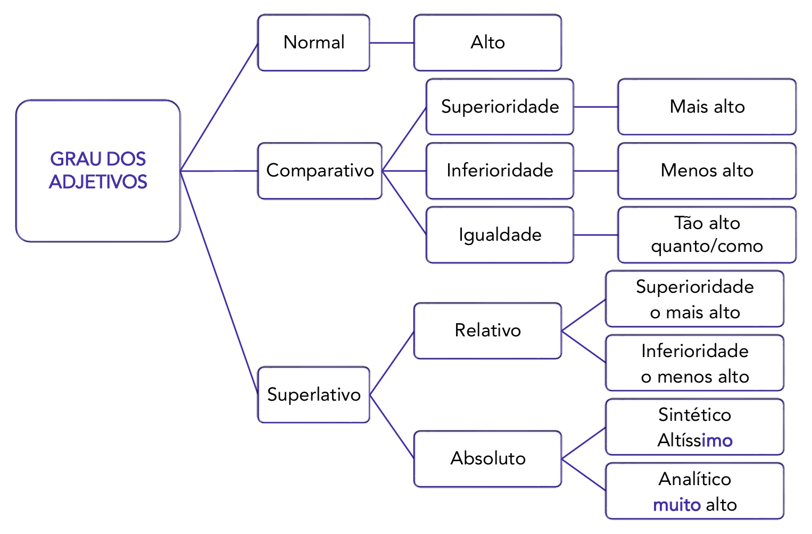

# Capítulo 3 – Classes de Palavras I: Substantivo, Adjetivo, Advérbio, Artigo, Numeral e Interjeição

Após termos construído uma visão panorâmica da gramática no primeiro capítulo e detalhado as convenções da escrita no segundo, iniciamos agora o estudo sistemático e aprofundado da **Morfologia**. Este capítulo, e o seguinte, se dedicarão a analisar individualmente as dez classes de palavras da Língua Portuguesa.

Compreender a identidade de cada classe — o que ela é, como se comporta e como se flexiona — é um pré-requisito indispensável para dominar a Sintaxe e a Interpretação de Textos. Se a Sintaxe estuda a função que a palavra exerce na "orquestra" da frase, a Morfologia nos apresenta cada um dos "instrumentos", detalhando suas características e potencialidades. Neste primeiro momento, focaremos nas classes de palavras de natureza nominal (substantivo, artigo, adjetivo, numeral) e circunstancial (advérbio), além da interjeição.

## A Organização do Léxico: Classes, Funções e Variações

As palavras da Língua Portuguesa são tradicionalmente agrupadas em dez classes gramaticais, de acordo com suas características de forma, função e significado. São elas: **Substantivo, Artigo, Adjetivo, Numeral, Pronome, Verbo, Advérbio, Preposição, Conjunção e Interjeição**.

### A Relação entre Morfologia e Sintaxe

Como já vimos, a Morfologia (a classe) e a Sintaxe (a função) são indissociáveis. A classe gramatical de uma palavra define, em grande parte, as funções que ela pode desempenhar em uma oração.

- A palavra **"hoje"** pertence à classe dos **advérbios**. Na frase "Hoje estudarei mais", ela exerce a função sintática de **adjunto adverbial de tempo**.
- A palavra **"livro"** pertence à classe dos **substantivos**. Na frase "O livro é novo", ela exerce a função sintática de **núcleo do sujeito**.

Embora o sistema de dez classes seja a base do estudo, é importante saber que nem todas as palavras da língua se encaixam perfeitamente nesse modelo. Existem, por exemplo, as chamadas **palavras denotativas** (ex: _aliás, inclusive, apenas, só_), que se assemelham a advérbios, mas não possuem a mesma função modificadora, atuando para realçar ou especificar ideias. Para os fins de concurso, no entanto, o domínio das dez classes tradicionais é o foco principal.

### O Conceito de Locução

Frequentemente, um conjunto de duas ou mais palavras pode exercer, de forma unificada, o papel que seria de uma única palavra de uma determinada classe. A esse conjunto damos o nome de **locução**. A locução é classificada de acordo com a classe de palavra à qual ela equivale.

|Locução|Exemplo de Uso|Classe de Palavra Equivalente|
|---|---|---|
|**Locução Adjetiva**|amor **de mãe**|materno (Adjetivo)|
|**Locução Adverbial**|Ele chegou **às pressas**.|apressadamente (Advérbio)|
|**Locução Prepositiva**|O livro está **embaixo de**...|sob (Preposição)|
|**Locução Conjuntiva**|...**visto que** estava doente.|porque (Conjunção)|
|**Locução Verbal**|Eu **vou estudar** amanhã.|estudarei (Verbo)|

### Classes Variáveis vs. Classes Invariáveis: A Grande Divisão

A distinção mais fundamental entre as classes de palavras é sua capacidade de sofrer **flexão**, ou seja, de variar sua forma para indicar noções como gênero, número, pessoa, tempo e modo.

- **Classes Variáveis:** São aquelas que se flexionam, seguindo as regras de concordância.
- **Classes Invariáveis:** São aquelas que possuem uma única forma, não se flexionando.

Observe a diferença no comportamento das palavras nas frases a seguir:

> “**A minha** nov**a** amig**a** **é** inteligent**e** e **seus** filh**os** **são** inteligent**es**.”

Nesta frase, as palavras destacadas pertencem a classes variáveis (artigo, pronome, adjetivo, substantivo, verbo). Note como elas mudam de forma para concordar em gênero ("amiga", "nova") e número ("filhos", "são", "inteligentes").

> “João anda **apressadamente** e Joana, **lentamente**.”

Aqui, as palavras "apressadamente" e "lentamente" não sofrem qualquer variação, independentemente de se referirem a "João" (masculino) ou "Joana" (feminino). Isso ocorre porque são advérbios, uma classe invariável.

A tabela a seguir resume essa grande divisão da Morfologia:

|Classes Variáveis|Classes Invariáveis|
|---|---|
|Substantivo|Advérbio|
|Adjetivo|Preposição|
|Artigo|Conjunção|
|Numeral|Interjeição|
|Pronome||
|Verbo||

Esta distinção deve ser mantida em mente durante o estudo de cada uma das classes a seguir.

## Substantivo

O substantivo é a classe de palavras central da Morfologia. Sua função primordial é **nomear** os seres e as coisas em geral, sejam eles reais ou imaginários. É a palavra que dá nome a tudo o que percebemos, sentimos ou concebemos: pessoas, lugares, objetos, sentimentos, qualidades, ações, estados e conceitos. Por essa característica, o substantivo frequentemente atua como o núcleo dos termos sintáticos mais importantes, como o sujeito e os objetos.

Sendo uma classe **variável**, o substantivo se flexiona para indicar:

- **Gênero:** masculino ou feminino (ex: _menino, menina_).
- **Número:** singular ou plural (ex: _casa, casas_).
- **Grau:** aumentativo ou diminutivo (ex: _casa, casarão, casinha_).

### Classificação dos Substantivos

Os substantivos podem ser classificados a partir de diferentes critérios, que analisam sua origem, estrutura, tipo de referência e abrangência.

- **Primitivo e Derivado:** Esta classificação se refere à formação da palavra.
    - **Primitivo:** É o substantivo que não se origina de nenhuma outra palavra já existente na língua. Ele serve como base para a formação de novas palavras. Exemplos: _pedra, ferro, jornal, flor, luz_.
    - **Derivado:** É o substantivo que se origina a partir de uma palavra primitiva, geralmente pelo acréscimo de afixos (prefixos ou sufixos). Exemplos: _pedr**eiro**, ferr**ageiro**, jornal**ista**, flor**icultura**, **in**felicidade_.
- **Simples e Composto:** Refere-se ao número de radicais que formam a palavra.
    - **Simples:** Possui apenas um radical. Exemplos: _tempo, chuva, roupa, sol_.
    - **Composto:** Possui mais de um radical, sendo formado pela junção de duas ou mais palavras. Exemplos: _passa-tempo, guarda-chuva, guarda-roupa, girassol_.
- **Comum e Próprio:** Analisa a abrangência do ser nomeado.
    - **Comum:** Designa de forma genérica qualquer ser de uma mesma espécie, sem individualizá-lo. É grafado com letra minúscula. Exemplos: _mulher, cidade, país, rio, cachorro_.
    - **Próprio:** Designa um ser específico, particular, individualizando-o dentro de sua espécie. É sempre grafado com letra inicial maiúscula. Exemplos: _Maria, Paris, Brasil, Rio Amazonas, Rex_.
- **Concreto e Abstrato:** Esta é uma classificação que frequentemente gera dúvidas. A distinção se baseia na natureza da existência do ser nomeado.
    - **Concreto:** Designa seres que possuem existência autônoma, independentemente de outros seres. Podem ser reais ou imaginários, materiais ou espirituais. Uma dica prática é pensar se o ser pode ser, de alguma forma, visualizado ou representado como uma imagem. Exemplos: _pedra, menino, carro, Deus, fada, saci, som, vento, alma_.
    - **Abstrato:** Designa ações, estados, sentimentos, qualidades ou conceitos cuja existência depende de outro ser para se manifestar. Geralmente, são palavras derivadas de verbos, adjetivos ou outros substantivos. Exemplos: _beleza_ (qualidade, depende de um ser para ser belo), _viagem_ (ação, depende de alguém que viaja), _tristeza_ (sentimento), _vida_ (estado), _liberalismo_ (conceito).
- **Coletivo:** É um substantivo que, mesmo no singular, designa um conjunto de seres ou coisas da mesma espécie.

|Coletivo|Grupo Representado|Coletivo|Grupo Representado|
|---|---|---|---|
|**Alcateia**|de lobos|**Elenco**|de atores|
|**Arquipélago**|de ilhas|**Esquadra**|de navios de guerra|
|**Banca**|de examinadores, advogados|**Fauna**|de animais de uma região|
|**Cardume**|de peixes|**Flora**|de plantas de uma região|
|**Código**|de leis|**Frota**|de veículos (ônibus, táxis)|
|**Constelação**|de estrelas|**Manada**|de bois, búfalos, elefantes|
|**Congresso**|de parlamentares|**Pinacoteca**|de quadros, pinturas|
|**Discoteca**|de discos|**Prole**|de filhos|
|**Enxame**|de abelhas, insetos|**Tropa**|de soldados, muares|

> **Fique de Olho: A Importância do Contexto**
> 
> A classificação de um substantivo não é absoluta; ela pode mudar drasticamente dependendo do contexto em que a palavra é usada.
> 
> - **Judas** foi um dos apóstolos. (Substantivo **próprio**, refere-se a um indivíduo específico).
> - Aquele amigo revelou-se um **judas**. (Substantivo **comum**, passou a significar "traidor").
> - A **saída** para a crise é investir em educação. (Substantivo **abstrato**, refere-se à "solução").
> - A **saída** de incêndio fica no final do corredor. (Substantivo **concreto**, refere-se à "porta").

### Flexão de Gênero dos Substantivos

Quanto ao gênero, os substantivos podem ser classificados em dois grandes grupos: Biformes e Uniformes.

- **Substantivos Biformes:** São aqueles que apresentam duas formas distintas, uma para o masculino e outra para o feminino.
    - _Exemplos:_ lobo/loba, menino/menina, capitão/capitã, poeta/poetisa, boi/vaca, homem/mulher.
- **Substantivos Uniformes:** São aqueles que possuem uma única forma para se referir a ambos os gêneros. Eles se subdividem em três tipos:

|Classificação|Definição|Exemplos|
|---|---|---|
|**Epicenos**|Referem-se a animais e possuem um só gênero gramatical. A distinção do sexo é feita com as palavras "macho" e "fêmea".|**a** águia (macho/fêmea), **a** cobra (macho/fêmea), **o** jacaré (macho/fêmea).|
|**Sobrecomuns**|Referem-se a pessoas e possuem um só gênero gramatical para designar ambos os sexos.|**a** criança, **o** cônjuge, **a** vítima, **a** testemunha, **o** ídolo, **o** monstro.|
|**Comuns de Dois Gêneros**|Apresentam uma única forma, mas a distinção de gênero é feita pelo artigo ou por outro determinante que o acompanha.|**o** chefe / **a** chefe, **o** cliente / **a** cliente, **o** artista / **a** artista, **o** jornalista / **a** jornalista.|

### Formação dos Substantivos

Compreender como os substantivos são formados é uma maneira eficaz de reconhecê-los em um texto e de ampliar o vocabulário. A grande maioria dos substantivos da língua portuguesa surge a partir de quatro processos principais: derivação sufixal, derivação regressiva, derivação imprópria e composição.

#### Derivação por Afixação

Este é o processo mais comum, no qual novas palavras (derivadas) são criadas a partir de outras já existentes (primitivas) pelo acréscimo de afixos (prefixos e sufixos).

- **Substantivos Primitivos:** São aqueles que dão origem a outras palavras e não possuem afixos.
    - _Exemplos:_ pedra, fogo, terra, chuva, feliz.
- **Substantivos Derivados:** São formados a partir de um primitivo.
    - _Exemplos:_ **pedr**eiro (sufixo), **terr**estre (sufixo), **in**feliz (prefixo), **in**felicidade (prefixo e sufixo).

O processo mais produtivo para a criação de novos substantivos é a **derivação sufixal**, em que um sufixo é adicionado a um verbo, adjetivo ou outro substantivo. Conhecer os principais sufixos formadores de substantivos ("sufixos substantivadores") é de grande ajuda.

| Sufixo                     | Ideia que Expressa         | Exemplo de Formação                                                                   |
| -------------------------- | -------------------------- | ------------------------------------------------------------------------------------- |
| **-ada**                   | Ação, golpe, marca         | faca → fac**ada**; cabeça → cabeç**ada**                                              |
| **-agem, -ugem**           | Coleção, conjunto, estado  | folha → folh**agem**; pena → pen**ugem**                                              |
| **-eiro, -aria, -ário**    | Profissão, ofício, lugar   | açougue → açougu**eiro**; sorvete → sorvet**eria**; banco → banc**ário**              |
| **-ista**                  | Ocupação, adepto de        | contabilidade → contabil**ista**; social → social**ista**                             |
| **-dade, -ice, -ez, -eza** | Qualidade, estado          | bom → bon**dade**; velho → velh**ice**; insensato → insensat**ez**; belo → bel**eza** |
| **-ção, -são, -mento**     | Ação ou resultado da ação  | corromper → corrup**ção**; dissolver → dissolu**ção**; casar → casa**mento**          |
| **-tude, -idão**           | Qualidade, estado abstrato | alto → alti**tude**; grato → grat**idão**                                             |
| **-ia, -ura**              | Qualidade, estado          | alegre → alegr**ia**; eufórico → eufor**ia**; feio → fei**ura**                       |
| **-ite**                   | Inflamação                 | apêndice → apendic**ite**; brônquios → bronqu**ite**                                  |

#### Derivação Regressiva

Neste processo, em vez de se adicionar um afixo, **retira-se a parte final de um verbo** para formar um substantivo, geralmente abstrato, que nomeia a ação. São os chamados substantivos deverbais.

- _Exemplos:_
    - cant**ar** → o cant**o**
    - almoç**ar** → o almoç**o**
    - compr**ar** → a compr**a**
    - atac**ar** → o ataqu**e**
    - chor**ar** → o chor**o**

#### Derivação Imprópria (ou Conversão)

A derivação imprópria é um processo de formação de palavras que ocorre **sem qualquer alteração na forma** da palavra primitiva. Uma palavra de uma determinada classe é "convertida" em um substantivo simplesmente por ser empregada em um novo contexto, geralmente precedida por um artigo ou outro determinante.

É o poder do artigo de **substantivar** qualquer classe gramatical.

- **Verbo → Substantivo:**
    - Os verbos possuem formas nominais (infinitivo, gerúndio, particípio) que podem ser facilmente substantivadas.
    - _Exemplos:_ **O fazer** é mais importante que o falar. / **O jantar** será servido às 20h. / Ele tem um **olhar** penetrante.
- **Adjetivo → Substantivo:**
    - _Exemplo:_ Os **bons** sempre vencem no final. / A **bela** adormecida acordou.
- **Advérbio → Substantivo:**
    - _Exemplo:_ Receber um **não** é sempre difícil.
- **Conjunção → Substantivo:**
    - _Exemplo:_ Não entendi **o porém** que você colocou no seu argumento.
- **Numeral → Substantivo:**
    - _Exemplo:_ O **sete** é considerado um número de sorte.

Conhecer esses mecanismos de formação e transformação de palavras é uma ferramenta valiosa, pois permite reconhecer a função de um substantivo mesmo quando ele se apresenta de forma atípica.

### Flexão dos Substantivos

Como vimos, o substantivo é uma classe variável. Sua capacidade de se flexionar é o que permite a concordância e a precisão na comunicação. As flexões do substantivo ocorrem em:

- **Gênero:** masculino e feminino (tema já abordado na seção de classificação).
- **Número:** singular e plural.
- **Grau:** aumentativo e diminutivo.

Inicialmente, nosso foco será a **flexão de número**, ou seja, as regras e particularidades da formação do plural dos substantivos, tanto simples quanto compostos.

#### Plural dos Substantivos Simples

Os substantivos simples são formados por um único radical. A formação de seu plural depende da terminação da palavra no singular.

**A Regra Geral**

A regra mais básica, aplicada à maioria dos substantivos terminados em vogal, é o simples acréscimo da desinência -s.

- _Exemplos:_ casa → casa**s**, livro → livro**s**, colega → colega**s**, táxi → táxi**s**.

**Regras Especiais por Terminação**

Para as demais terminações, existem regras específicas que devem ser observadas.

|Terminação no Singular|Formação do Plural|Exemplos|
|---|---|---|
|**-r, -z, -n**|Acrescenta-se **-es**|caráter → caracter**es**, luz → luz**es**, cônsul → cônsul**es**, hífen → hifen**es**|
|**-s** (oxítonos/monossílabos)|Acrescenta-se **-es**|gás → gas**es**, mês → mes**es**, deus → deus**es**|
|**-s** (paroxítonos/proparoxítonos)|**Invariável** (o plural é marcado pelo artigo)|o lápis → os lápis, o ônibus → os ônibus, o atlas → os atlas|
|**-al, -el, -ol, -ul**|Troca-se o **-l** por **-is**|anim**al** → anim**ais**, pap**el** → pap**éis**, far**ol** → far**óis**, pa**ul** → pa**uis**|
|**-il** (oxítonos)|Troca-se o **-l** por **-s**|fun**il** → fun**is**, barr**il** → barr**is**, fuz**il** → fuz**is**|
|**-il** (paroxítonos)|Troca-se o **-il** por **-eis**|fóss**il** → fóss**eis**, répt**il** → répt**eis**, projét**il** → projét**eis**|
|**-x**|**Invariável**|o tórax → os tórax, o látex → os látex, a fênix → as fênix|

**O Plural dos Substantivos em "-ão"**

Esta terminação é a que apresenta maior variedade, admitindo três possíveis plurais: -ãos, -ões e -ães. Não há uma regra fixa; a forma correta é determinada pela etimologia e pelo uso consagrado da palavra.

- **Plural em -ãos:** Geralmente em paroxítonas. _Exemplos:_ órgão**s**, sótão**s**, bênção**s**, órfão**s**. E em algumas oxítonas: _mão**s**_, _irmão**s**_, _cidadão**s**_.
- **Plural em -ões:** É a forma mais comum. _Exemplos:_ eleiç**ões**, lim**ões**, bal**ões**, coraç**ões**, naç**ões**.
- **Plural em -ães:** É a forma mais restrita. _Exemplos:_ p**ães**, c**ães**, capit**ães**, alem**ães**, escriv**ães**.

**Substantivos com Múltiplos Plurais**

Algumas palavras terminadas em "-ão" admitem mais de uma forma de plural, todas consideradas corretas pela norma padrão.

|Singular|Plurais Aceitos|
|---|---|
|Aldeão|aldeãos, aldeões, aldeães|
|Ancião|anciãos, anciões, anciães|
|Anão|anãos, anões|
|Charlatão|charlatões, charlatães|
|Corrimão|corrimãos, corrimões|
|Ermitão|ermitãos, ermitões, ermitães|
|Guardião|guardiões, guardiães|
|Vilão|vilãos, vilões, vilães|
|Vulcão|vulcãos, vulcões|

##### Casos Especiais: "Pluralia Tantum"

Existem substantivos na língua portuguesa que são empregados quase exclusivamente na forma plural, mesmo que se refiram a uma única entidade. São conhecidos como _pluralia tantum_ (apenas plural, em latim).

- _Exemplos:_ as **núpcias**, as **férias**, os **arredores**, as **fezes**, os **pêsames**, os **óculos**, as **cócegas**, as **olheiras**.

#### Plural dos Substantivos Compostos

A formação do plural para substantivos compostos segue uma lógica que depende das classes de palavras que formam o composto. A regra geral é bastante intuitiva: os elementos que pertencem a classes de palavras variáveis (substantivo, adjetivo, numeral) vão para o plural; os elementos que pertencem a classes invariáveis (advérbio, preposição, interjeição) ou que são verbos, permanecem no singular.

**A Regra Geral: "Quem varia, varia; quem não varia, não varia"**

1. **Ambos os elementos flexionam:** Isso ocorre quando a palavra composta é formada por classes variáveis.
    
    |Composição|Exemplo Singular|Plural|
    |---|---|---|
    |Substantivo + Substantivo|couve-flor|couve**s**-flor**es**|
    |Substantivo + Adjetivo|amor-perfeito|amor**es**-perfeito**s**|
    |Adjetivo + Substantivo|baixo-relevo|baixo**s**-relevo**s**|
    |Numeral + Substantivo|quarta-feira|quarta**s**-feira**s**|
    
2. **Apenas o segundo elemento flexiona:** Isso ocorre quando o primeiro elemento é de uma classe invariável ou é um verbo.
    
    |Composição|Exemplo Singular|Plural|
    |---|---|---|
    |Verbo + Substantivo|beija-flor|beija-flor**es**|
    |Advérbio + Adjetivo|alto-falante|alto-falante**s**|
    |Palavras Repetidas|corre-corre|corre-corre**s**|

##### Casos Especiais e Exceções

A regra geral, embora útil, não abrange todas as situações. Existem diversos casos específicos que devem ser memorizados.

**Quando o Segundo Substantivo Especifica o Primeiro**

Quando o segundo substantivo da composição serve para especificar o primeiro, indicando seu tipo, finalidade ou semelhança, a gramática normativa aceita duas formas de plural:

- Flexionando apenas o primeiro elemento (mais comum).
- Flexionando ambos os elementos.

|Exemplo Singular|Plural (Opção 1)|Plural (Opção 2)|
|---|---|---|
|peixe-espada|peixe**s**-espada|peixe**s**-espada**s**|
|pombo-correio|pombo**s**-correio|pombo**s**-correio**s**|
|salário-família|salário**s**-família|salário**s**-família**s**|
|licença-maternidade|licença**s**-maternidade|licença**s**-maternidade**s**|
|banho-maria|banho**s**-maria|banho**s**-maria**s**|

**Compostos com Preposição**

Em palavras compostas ligadas por uma preposição (explícita ou oculta), apenas o primeiro elemento vai para o plural.

- _Exemplos:_
    - pé de moleque → pé**s** de moleque
    - mula sem cabeça → mula**s** sem cabeça
    - mão de obra → mão**s** de obra
    - água-de-colônia → água**s**-de-colônia
    - pôr do sol → **pores** do sol (Aqui, "pôr" é um substantivo derivado do verbo).

**Compostos com o Verbo "Guarda"**

A flexão de compostos iniciados por "guarda" depende da classe gramatical dessa palavra no composto.

- **Quando "Guarda" é Verbo:** Apenas o segundo elemento (o substantivo) vai para o plural.
    - _Exemplos:_ guarda-chuva → guarda-chuva**s**; guarda-roupa → guarda-roupa**s**; guarda-sol → guarda-s**óis**.
- **Quando "Guarda" é Substantivo (o agente):** Ambos os elementos (substantivo + adjetivo) vão para o plural.
    - _Exemplos:_ guarda-noturno → guarda**s**-noturno**s**; guarda-civil → guarda**s**-civi**s**; guarda-florestal → guarda**s**-florestai**s**.

**Outros Casos Importantes**

|Singular|Plural|Observação|
|---|---|---|
|mal-estar|mal-estar**es**|Advérbio + Substantivo (apenas o substantivo flexiona).|
|o louva-a-deus|os louva-a-deus|**Invariável**. O plural é marcado pelo artigo.|
|arco-íris|arco**s**-íris|Apenas o primeiro elemento flexiona.|
|o bota-fora|os bota-fora|**Invariável**. Composto por dois verbos.|
|bem-te-vi|bem-te-vi**s**|Apenas o último elemento flexiona.|

#### Flexão de Grau: Aumentativo e Diminutivo

A flexão de grau é a capacidade que os substantivos têm de expressar variações de tamanho, podendo ser para mais (aumentativo) ou para menos (diminutivo). Essa flexão pode ocorrer de duas maneiras:

- **Grau Analítico:** Utiliza-se um adjetivo que indica tamanho, como _grande_, _enorme_, _pequeno_ ou _minúsculo_.
    - _Exemplos:_ casa **grande**, livro **pequeno**, problema **enorme**.
- **Grau Sintético:** Utiliza-se o acréscimo de sufixos específicos ao substantivo, como _-ão_, _-ona_, _-inho_, _-inha_, _-zinho_.
    - _Exemplos:_ cas**arão**, livr**inho**, problem**ão**.

**O Valor Discursivo do Grau**

Em provas, especialmente em questões de interpretação de texto, é fundamental entender que o grau do substantivo raramente indica apenas tamanho. Com muito mais frequência, ele é empregado para expressar a atitude do falante, agregando valores de afetividade, admiração, ironia ou desprezo.

| Valor Discursivo         | Exemplo                                                  | Análise do Sentido                                                          |
| ------------------------ | -------------------------------------------------------- | --------------------------------------------------------------------------- |
| **Afetividade/Carinho**  | Que **cachorrinho** fofo!                                | O diminutivo expressa ternura, não necessariamente o tamanho do animal.     |
| **Admiração/Ênfase**     | O Porsche é um **carrão**!                               | O aumentativo expressa admiração pela qualidade do carro.                   |
| **Depreciação/Desprezo** | Não trabalho tanto para dar dinheiro àquele **padreco**! | O sufixo "-eco" confere um valor pejorativo.                                |
| **Depreciação/Desprezo** | Não se misture com essa **gentalha**!                    | O sufixo "-alha" expressa desprezo pelo grupo de pessoas.                   |
| **Ironia**               | Então... O **sabichão** aí se enganou de novo?           | O aumentativo é usado de forma irônica para criticar uma suposta sabedoria. |
| **Ironia**               | **Queridinho**, devolva o que você pegou.                | O diminutivo é usado com sarcasmo para repreender.                          |

**O Plural dos Diminutivos Sintéticos**

A formação do plural de substantivos no diminutivo segue uma regra específica e lógica:

1. Primeiro, passa-se a palavra primitiva para o plural.
2. Em seguida, retira-se o **-s** final dessa forma plural.
3. Por fim, acrescenta-se o sufixo **-zinhos** ou **-zinhas**.

| Primitivo | Plural Primitivo | Sem o "-s" | Plural do Diminutivo |
| --------- | ---------------- | ---------- | -------------------- |
| animal    | animai**s**      | animai     | animai**zinhos**     |
| flor      | flore**s**       | flore      | flore**zinhas**      |
| coração   | coraçõe**s**     | coraçõe    | coraçõe**zinhos**    |
| papel     | papéi**s**       | papéi      | papei**zinhos**      |
| pão       | pãe**s**         | pãe        | pãe**zinhos**        |

- **Formas Alternativas:** Em alguns casos, a língua admite formas variantes para o diminutivo.
    - _Exemplos:_ colherzinha ou colherinha; florzinha ou florinha; pastorzinho ou pastorinho.

### Sintagma Nominal: Substantivo como Núcleo

Para conectar o estudo da Morfologia com a Sintaxe, é útil compreender o conceito de **sintagma**. Um sintagma é um bloco de palavras que forma uma unidade de sentido dentro da oração, construído em torno de um elemento central, o **núcleo**.

O **Sintagma Nominal (SN)** é o bloco de palavras cujo núcleo é um **substantivo** (ou uma palavra com valor de substantivo, como um pronome). Todas as outras palavras dentro desse bloco (artigos, adjetivos, numerais, pronomes, locuções adjetivas) são os **determinantes**, que servem para modificar ou especificar o núcleo.

Na análise sintática, é crucial reconhecer o sintagma nominal inteiro como uma única unidade que desempenha uma função (sujeito, objeto, etc.).

- **Exemplo 1:**
    - **[O homem previdente]** cuida do futuro.
    - **Sintagma Nominal (função de sujeito):** O homem previdente
    - **Núcleo:** homem
    - **Determinantes:** O (artigo), previdente (adjetivo)
- **Exemplo 2:**
    - **[Os meus dois amigos mineiros de longa data]** chegaram hoje.
    - **Sintagma Nominal (função de sujeito):** Os meus dois amigos mineiros de longa data
    - **Núcleo:** amigos
    - **Determinantes:** Os (artigo), meus (pronome), dois (numeral), mineiros (adjetivo), de longa data (locução adjetiva)

Reconhecer a estrutura do sintagma nominal ajuda a identificar corretamente o núcleo de um termo sintático, o que é fundamental para aplicar as regras de concordância e para a correta interpretação das relações dentro da frase.

### O Papel Sintático do Substantivo

A análise da classe de uma palavra (Morfologia) e da função que ela desempenha na frase (Sintaxe) são estudos indissociáveis. A classe gramatical de uma palavra é o que a habilita a exercer determinadas funções. O substantivo, por ser a classe que nomeia, ocupa uma posição de destaque, atuando como o centro gravitacional das estruturas nominais.

Para identificar um substantivo, uma das estratégias mais eficazes é analisar a função que a palavra exerce. Em funções sintáticas nominais — como sujeito, objeto, complemento nominal, etc. — o **substantivo** (ou uma palavra de valor substantivo) será, em regra, o **núcleo** dessa função.

#### O Substantivo como Núcleo e os Termos Satélites

Podemos visualizar a estrutura de um termo sintático a partir da analogia de um sistema planetário:

- **O Núcleo:** É o elemento central e principal, a palavra que carrega o significado essencial do termo. No Sintagma Nominal, esse papel é do **substantivo**.
- **Os Satélites (ou Determinantes):** São as palavras que "orbitam" ao redor do núcleo, modificando-o, especificando-o ou caracterizando-o. Essas palavras pertencem a outras classes (artigo, adjetivo, pronome, numeral) e devem concordar com o núcleo em gênero e número.

Vamos analisar essa estrutura em um exemplo detalhado:

> **Os seus cinco patinhos amarelos nadam na lagoa.**

O sujeito da oração é o sintagma nominal "Os seus cinco patinhos amarelos". A análise morfológica de seus componentes revela a relação núcleo-satélite:

| Palavra      | Classe Morfológica | Função e Relação                                             |
| ------------ | ------------------ | ------------------------------------------------------------ |
| **Os**       | Artigo definido    | Satélite/Determinante: define o substantivo "patinhos".      |
| **seus**     | Pronome possessivo | Satélite/Determinante: indica posse em relação a "patinhos". |
| **cinco**    | Numeral            | Satélite/Determinante: quantifica o substantivo "patinhos".  |
| **patinhos** | **Substantivo**    | **NÚCLEO** do sujeito. É o termo central.                    |
| **amarelos** | Adjetivo           | Satélite/Determinante: caracteriza o substantivo "patinhos". |

Todos os determinantes (`Os`, `seus`, `cinco`, `amarelos`) concordam em gênero (masculino) e número (plural) com o núcleo `patinhos`. O verbo `nadam` também concorda em número e pessoa com este núcleo.

#### A Versatilidade do Substantivo como Núcleo

O substantivo ocupa a posição de núcleo na grande maioria das funções sintáticas nominais. Reconhecer o substantivo como o centro do termo é o primeiro passo para uma análise sintática correta.

- **Núcleo do Sujeito:** _As **meninas** ricas do Leblon chegaram._
- **Núcleo do Objeto Direto:** _Elas compraram muitos **vestidos** novos._
- **Núcleo do Objeto Indireto:** _Eu preciso de **ajuda**._
- **Núcleo do Complemento Nominal:** _Tenho consciência de meus **defeitos**._
- **Núcleo do Agente da Passiva:** _A lei foi aprovada pelos **deputados**._
- **Núcleo do Aposto:** _Carlos, grande **advogado**, defendeu a causa._
- **Núcleo do Adjunto Adnominal:** _Comprei um muro de **concreto**._
- **Núcleo do Vocativo:** _Ó **Deus**, ajudai-me!_

#### Outras Classes em Papel de Substantivo (Substantivação)

Como vimos, outras classes de palavras podem assumir o papel de substantivo, passando a funcionar como o núcleo de um termo sintático. Esse processo, chamado de derivação imprópria ou substantivação, geralmente ocorre pela presença de um artigo.

Além disso, os pronomes podem ser classificados como **pronome adjetivo** (quando acompanham um substantivo) ou **pronome substantivo** (quando o substituem, assumindo o papel de núcleo).

- **Pronome Adjetivo:** Acompanha o núcleo.
    - _Exemplo:_ **Minhas** mãos estão limpas. (O pronome "Minhas" acompanha o substantivo "mãos").
- **Pronome Substantivo:** Substitui o núcleo.
    - _Exemplo:_ Minhas mãos estão limpas; lave as **suas**. (O pronome "suas" substitui "mãos" e atua como núcleo do objeto direto).
- **Outros Exemplos de Substantivação:**
    - **O jantar** (verbo) está servido.
    - **O não** (advérbio) já está garantido.
    - **O porquê** (conjunção) da demissão não foi explicado.

Este estudo da relação entre a classe e a função sintática será aprofundado nos próximos capítulos, mas a centralidade do substantivo como núcleo das estruturas nominais é a base para toda essa análise.

## Adjetivo

O adjetivo é a classe de palavra **variável** cuja função principal é modificar um substantivo ou um termo de valor substantivo (como um pronome), atribuindo-lhe uma característica, qualidade, estado ou condição. Ele atua como um "satélite" do substantivo, especificando ou restringindo seu sentido e, por ser uma classe variável, deve concordar com o nome a que se refere em gênero (masculino/feminino) e número (singular/plural).

- **Exemplos no singular:** _homem **mau**, mulher **simples**, céu **azul**, casa **arruinada**._
- **Exemplos no plural:** _homens **maus**, mulheres **simples**, céus **azuis**, casas **arruinadas**._

Sintaticamente, o adjetivo desempenha principalmente duas funções: a de **adjunto adnominal**, quando está diretamente ligado ao nome, e a de **predicativo** (do sujeito ou do objeto), quando se liga ao nome por meio de um verbo.

### Classificação dos Adjetivos

Os adjetivos podem ser classificados segundo diferentes critérios, como sua formação e o tipo de significado que expressam.

#### Quanto à Formação

- **Simples:** Formado por um único radical.
    - _Exemplos:_ estilo **literário**, homem **bom**, camisa **verde**.
- **Composto:** Formado por mais de um radical.
    - _Exemplos:_ estilo **lítero-musical**, camisa **verde-clara**, problema **socioeconômico**.
- **Primitivo:** É a forma original, que não deriva de outra palavra.
    - _Exemplos:_ **bom**, **belo**, **claro**, **triste**.
- **Derivado:** É formado a partir de outra palavra (substantivo, verbo ou outro adjetivo).
    - _Exemplos:_ **bondoso** (de bom), **embelezar** (de belo), **clarear** (de claro), **entristecer** (de triste).

#### Quanto ao Significado

- **Explicativo:** Indica uma qualidade que é inerente, própria e universal do ser.
    - _Exemplos:_ homem **mortal**, neve **fria**, fogo **quente**. (Todo homem é mortal, toda neve é fria).
- **Restritivo:** Indica uma qualidade que não é inerente ao ser, servindo para particularizá-lo e distingui-lo do resto de sua espécie.
    - _Exemplos:_ homem **valente**, fruta **madura**, aluno **inteligente**. (Nem todo homem é valente, nem toda fruta é madura).

### Adjetivos Pátrios e Gentílicos

São os adjetivos que indicam a origem ou a procedência geográfica de um ser. O termo "gentílico" é mais amplo (povos, raças), enquanto "pátrio" se refere a continentes, países, estados e cidades. Na prática, são usados como sinônimos.

É importante notar que os adjetivos pátrios são sempre grafados com **letra inicial minúscula**.

A tabela a seguir mostra alguns sufixos comuns na formação desses adjetivos:

|Sufixo|Exemplos|
|---|---|
|**-ês/-esa**|portugu**ês**, ingl**ês**, franc**esa**, japon**ês**|
|**-ano/-ana**|americ**ano**, goia**no**, italia**na**, africa**no**|
|**-ense**|ceaar**ense**, estadunid**ense**, flumin**ense**|
|**-eiro**|brasil**eiro**, min**eiro**|
|**-ista**|paul**ista**|
|**-eu/-eia**|europ**eu**, europ**eia**|
|**-ino/-ina**|argent**ino**, nordest**ina**|

### Estruturas com Valor de Adjetivo

A função de caracterizar um substantivo não é exclusiva do adjetivo. Outras estruturas, como as locuções e as orações, podem exercer o mesmo papel.

- **Locução Adjetiva:** É a união de duas ou mais palavras (geralmente `preposição + substantivo`) que equivale a um adjetivo.
    - _Exemplos:_
        - cidadão **inglês** → cidadão **da Inglaterra**
        - amor **materno** → amor **de mãe**
        - energia **solar** → energia **do sol**
- **Oração Subordinada Adjetiva:** É uma oração inteira, introduzida por um pronome relativo, que funciona como um adjetivo, caracterizando um termo anterior.
    - _Exemplos:_
        - cidadão **inglês** → cidadão **que é nativo da Inglaterra**
        - problema **insolúvel** → problema **que não tem solução**
- **Substantivação do Adjetivo:** Por meio da derivação imprópria, um adjetivo pode ser transformado em substantivo ao ser precedido por um artigo ou outro determinante.
    - _Exemplo:_ O céu **azul** me tranquiliza. (Adjetivo)
    - _Exemplo:_ **O azul** do céu me tranquiliza. (Adjetivo substantivado)

### Flexão de Gênero do Adjetivo

Quanto à flexão de gênero, os adjetivos se dividem em dois grupos:

- **Biformes:** Apresentam duas formas distintas, uma para o masculino e outra para o feminino.
    - _Exemplos:_ ativ**o**/ativ**a**, brasileir**o**/brasileir**a**, cru**el**/cru**a**.
- **Uniformes:** Apresentam uma única forma que serve tanto para o masculino quanto para o feminino. Geralmente, são os terminados em -a, -e, -l, -ar, -s, -z, -m.

|Terminação|Exemplo de Uso|
|---|---|
|**-a**|homem hipócrit**a** / mulher hipócrit**a**|
|**-e**|candidato competent**e** / candidata competent**e**|
|**-l**|serviço amáve**l** / pessoa amáve**l**|
|**-ar**|costume singul**ar** / beleza singul**ar**|
|**-s**|homem simpl**es** / mulher simpl**es**|
|**-z**|rapaz feli**z** / moça feli**z**|
|**-m**|olhar ru**im** / pessoa ru**im**|

### Flexão de Número do Adjetivo

Já vimos que a flexão de gênero do adjetivo pode classificá-lo como biforme ou uniforme. Agora, veremos as regras de flexão de número (plural), com foco especial nos adjetivos compostos.

#### O Plural dos Adjetivos Compostos

A formação do plural dos adjetivos compostos segue regras específicas que merecem atenção.

**A Regra Geral**

Por regra geral, nos adjetivos compostos formados por dois adjetivos, apenas o último elemento flexiona em número (e em gênero, se for o caso). Frequentemente, o primeiro elemento aparece em uma forma reduzida (como luso- para luso, político- para político).

- _Exemplos:_
    - acordos **luso-brasileiros**
    - problemas **socioeconômicos**
    - camisas **verde-claras**
    - obras **político-sociais**
    - culturas **afro-brasileiras**

**Os Casos de Invariabilidade**

Existem duas situações principais em que o adjetivo composto se torna invariável, ou seja, não flexiona no plural.

- **a) Adjetivo + Substantivo (indicando cor):** Quando o segundo elemento da composição é um substantivo usado para especificar uma cor, o adjetivo composto como um todo permanece invariável.

|Singular|Plural|
|---|---|
|camisa **amarelo-ouro**|camisas **amarelo-ouro**|
|parede **verde-oliva**|paredes **verde-oliva**|
|gravata **vermelho-sangue**|gravatas **vermelho-sangue**|
|tecido **verde-bandeira**|tecidos **verde-bandeira**|

- **b) Compostos Invariáveis por Convenção:** Alguns adjetivos compostos são, por tradição e uso, sempre invariáveis.

|Singular|Plural|
|---|---|
|terno **azul-marinho**|ternos **azul-marinho**|
|céu **azul-celeste**|céus **azul-celeste**|
|tecido **furta-cor**|tecidos **furta-cor**|
|casaco **verde-musgo**|casacos **verde-musgo**|
|laço **cor-de-rosa**|laços **cor-de-rosa**|
|carro **zero-quilômetro**|carros **zero-quilômetro**|
|raios **ultravioleta**|— (a palavra "ultravioleta" já é naturalmente invariável)|

### Adjetivos Opinativos e Descritivos

Além de sua função gramatical, o adjetivo carrega um valor semântico que pode ser objetivo (descrevendo um fato) ou subjetivo (expressando uma opinião). Essa distinção é crucial para a interpretação de textos.

- **Adjetivos Subjetivos (ou Opinativos):** Expressam um julgamento de valor, uma avaliação pessoal do emissor sobre o substantivo. Por serem uma opinião, são termos acessórios que podem ser retirados da frase sem prejuízo para a informação central.
    - _Exemplos:_
        - um carro **bonito**
        - um turista **animado**
        - um filme **chato**
        - uma ideia **genial**
- **Adjetivos Objetivos (ou Descritivos):** Expressam uma característica concreta, factual e verificável do substantivo, que não depende da interpretação do emissor.
    - _Exemplos:_
        - um carro **preto**
        - um turista **japonês**
        - uma mesa **redonda**
        - uma parede **branca**

#### Adjetivo de Relação: Um Caso Especial de Objetividade

Dentro do grupo dos adjetivos objetivos, existe uma subclasse muito importante: o **adjetivo de relação**. Ele se caracteriza por categorizar o substantivo, estabelecendo com ele uma relação específica (de origem, matéria, finalidade, etc.), em vez de atribuir-lhe uma qualidade inerente.

Suas principais características são:

- **Valor sempre objetivo:** Indica uma classificação técnica.
- **Derivado de um substantivo:** Geralmente, deriva de um nome.
- **Não admite variação de grau:** Não pode ser intensificado com advérbios como "muito" ou "pouco".
- **Posição fixa:** Aparece sempre depois do substantivo.

| Adjetivo de Relação      | Relação que Estabelece | Análise                                                                                         |
| ------------------------ | ---------------------- | ----------------------------------------------------------------------------------------------- |
| vinho **português**      | Origem/Procedência     | É um tipo de vinho de Portugal. Não se pode dizer "vinho muito português" ou "português vinho". |
| reunião **mensal**       | Tempo/Periodicidade    | É uma reunião relativa ao mês. Não existe "reunião mensalíssima".                               |
| movimento **estudantil** | Agente/Propriedade     | É o movimento pertencente ou feito por estudantes.                                              |
| energia **solar**        | Origem/Tipo            | É a energia proveniente do sol.                                                                 |
| carne **bovina**         | Tipo/Espécie           | É a carne que vem do boi.                                                                       |

O reconhecimento dos adjetivos de relação é importante para questões de semântica e de reescrita, pois sua posição e gradação são rígidas, ao contrário dos adjetivos opinativos.

### O Papel Sintático do Adjetivo

A análise morfológica e a sintática são, como já vimos, indissociáveis. A classe gramatical de uma palavra (sua identidade morfológica) a habilita para exercer certas funções na frase (seu papel sintático). O adjetivo, por sua natureza qualificadora e por sua ligação intrínseca com o substantivo, desempenha dois papéis sintáticos principais.

1. **Adjunto Adnominal:** É a função mais comum do adjetivo. Ocorre quando o adjetivo está diretamente ligado ao substantivo, dentro do mesmo sintagma nominal, modificando-o sem o intermédio de um verbo.
    - _Exemplos:_
        - O carro **velho** quebrou.
        - Comprei uma mesa **redonda**.
        - Li um livro **interessante**.

2. **Predicativo (do Sujeito ou do Objeto):** Ocorre quando o adjetivo, apesar de se referir a um substantivo (o sujeito ou o objeto), está posicionado no predicado e se liga a esse nome por meio de um verbo. Ele atribui uma característica ao substantivo de forma indireta.
    - **Predicativo do Sujeito:** A característica é atribuída ao sujeito.
        - _Exemplo:_ João está **chato**. / A prova parecia **difícil**.
    - **Predicativo do Objeto:** A característica é atribuída ao objeto (direto ou indireto).
        - _Exemplo:_ Considerei o filme **chato**. / O juiz julgou o réu **culpado**.

> **Foco de Prova: "Ser Adjetivo" vs. "Ter Valor Adjetivo"**
> 
> As bancas examinadoras frequentemente exploram a diferença entre a **classe** de uma palavra e a **função** que ela exerce. É fundamental entender que "ter valor adjetivo" não significa necessariamente "ser da classe dos adjetivos".
> 
> **Ter valor adjetivo** significa desempenhar a função sintática de **Adjunto Adnominal**, ou seja, modificar diretamente um substantivo. Diversas classes de palavras podem fazer isso.
> 
> Vamos analisar a estrutura "O meu violão novo":

|Termo|Classe Morfológica|Função Sintática|Tem Valor Adjetivo?|É um Adjetivo?|
|---|---|---|---|---|
|**O**|Artigo|Adjunto Adnominal|Sim|Não|
|**meu**|Pronome Possessivo|Adjunto Adnominal|Sim|Não|
|**novo**|Adjetivo|Adjunto Adnominal|Sim|**Sim**|

> Portanto, se uma questão pede para identificar um termo de "valor adjetivo", a resposta pode ser um artigo, um pronome ou um numeral, além do próprio adjetivo.

#### Pronomes e Numerais: A Dupla Função

A distinção acima fica muito clara na classificação de pronomes e numerais, que podem ser **adjetivos** (quando acompanham o nome) ou **substantivos** (quando o substituem).

- **Pronome/Numeral Adjetivo (acompanha o substantivo):**
    - _Exemplos:_
        - **Minhas** mãos estão limpas.
        - **Dois** irmãos estão doentes.
- **Pronome/Numeral Substantivo (substitui o substantivo):**
    - _Exemplos:_
        - Lave as **suas** [mãos].
        - Ajudarei os **dois** [irmãos].

#### A Posição na Frase: Diferenciando Adjunto Adnominal de Predicativo

Uma dica estrutural para diferenciar as duas funções do adjetivo é observar sua posição em relação ao substantivo a que se refere.

- **Adjunto Adnominal:** O adjetivo está "junto ao nome", dentro do mesmo bloco sintático.
    - _Exemplo:_ [A vida **solitária**] dura menos. (O adjetivo "solitária" faz parte do sujeito "A vida solitária").
- **Predicativo:** O adjetivo está "separado" do nome por um verbo.
    - _Exemplo:_ [**A vida**] está **solitária**. (O adjetivo "solitária" está no predicado, caracterizando o sujeito "A vida" através do verbo "está").
    - _Exemplo:_ Acho [**a vida**] muito **solitária**. (O adjetivo "solitária" está no predicado, caracterizando o objeto "a vida" através do verbo "Acho").

### A Posição do Adjetivo e a Alteração de Sentido

Uma característica notável da Língua Portuguesa é que a posição do adjetivo em relação ao substantivo não é meramente uma questão de estilo; ela pode alterar profundamente o sentido da expressão. A ordem considerada "natural" ou padrão é **substantivo + adjetivo**. A inversão dessa ordem (**adjetivo + substantivo**) é um recurso expressivo que pode resultar em três cenários distintos.

#### Sem Alteração de Classe ou Sentido

Em alguns casos, a inversão da ordem é puramente estilística e não provoca uma mudança significativa no sentido da expressão. Isso ocorre geralmente com adjetivos que expressam qualidades inerentes ou universalmente reconhecidas.

- _Exemplos:_
    - cão **bom** ↔ **bom** cão
    - mulher **bela** ↔ **bela** mulher
    - acidente **terrível** ↔ **terrível** acidente

#### Alteração de Sentido sem Mudança de Classe

Este é o caso mais comum e mais explorado em provas. Aqui, a classe gramatical das palavras se mantém (substantivo e adjetivo), mas a mudança de posição altera o significado. A regra geral é:

- **Adjetivo depois do substantivo:** Tende a ter um valor mais **objetivo**, denotativo, descritivo.
- **Adjetivo antes do substantivo:** Tende a adquirir um valor mais **subjetivo**, conotativo, afetivo ou figurado.

|Substantivo + Adjetivo (Sentido Objetivo)|Adjetivo + Substantivo (Sentido Subjetivo/Figurado)|
|---|---|
|homem **grande** (de alta estatura)|**grande** homem (notável, importante)|
|homem **pobre** (sem recursos financeiros)|**pobre** homem (coitado, digno de pena)|
|amigo **velho** (idoso)|**velho** amigo (amizade de longa data)|
|mulher **nova** (jovem)|**nova** mulher (outra mulher, uma segunda mulher)|
|questão **simples** (fácil, não complexa)|**simples** questão (mera questão, insignificante)|
|sabor **único** (inigualável, especial)|**único** sabor (apenas um sabor disponível)|
|funcionário **alto** (de alta estatura)|**alto** funcionário (de cargo elevado)|
|soldado **bravo** (irritado, zangado)|**bravo** soldado (corajoso, valente)|

#### Alteração de Classe e de Sentido

Em algumas situações, a expressão é formada por duas palavras que podem, ambas, funcionar como substantivo ou adjetivo. Nesses casos, a inversão da ordem muda qual palavra é o núcleo (o substantivo) e qual é a característica (o adjetivo), alterando o foco e, consequentemente, o sentido.

A famosa frase de Machado de Assis em _Memórias Póstumas de Brás Cubas_ é o exemplo máximo desse fenômeno:

> “...não sou propriamente um **autor defunto**, mas um **defunto autor**.”

- **autor defunto:** O núcleo é "autor" (substantivo), e "defunto" é a sua característica (adjetivo). Trata-se de um escritor que morreu.
- **defunto autor:** O núcleo passa a ser "defunto" (substantivo), e "autor" é sua nova e inusitada característica (adjetivo). Trata-se de um morto que agora escreve.

> **Foco de Prova: A Mudança de Classe Garante a Mudança de Sentido**
> 
> Em questões de reescrita, este é um critério decisivo: **se a inversão da ordem causa uma alteração na classe morfológica das palavras, o sentido da expressão é obrigatoriamente alterado**. Identificar a troca de papéis entre substantivo e adjetivo é uma forma segura de avaliar a mudança semântica.

- **Outros exemplos:**
    - **preso político** (subst. + adj.): Um prisioneiro cuja detenção se deve a motivos políticos.
    - **político preso** (subst. + adj.): Um político (profissão) que está encarcerado.
    - **amigo médico** (subst. + adj.): Um amigo cuja profissão é a medicina.
    - **médico amigo** (subst. + adj.): Um médico que é amigável, cordial.

- **Dica de Análise:** Quando for difícil determinar qual é o substantivo e qual é o adjetivo (ex: _sábio religioso_), a tendência lógica da língua é considerar o primeiro termo como o substantivo (núcleo) e o segundo como o adjetivo (característica).

### Locuções Adjetivas e a Distinção com o Complemento Nominal

Como vimos, o adjetivo é a palavra que caracteriza o substantivo. No entanto, muitas vezes essa caracterização é feita por um conjunto de palavras, e não por uma única. A esse conjunto, damos o nome de **locução adjetiva**.

A estrutura mais comum de uma locução adjetiva é **`preposição + substantivo`**. Sintaticamente, essa locução desempenha a função de **adjunto adnominal**, pois está "junto ao nome", modificando-o.

- _Exemplos:_
    - Homem **sem coragem** (locução adjetiva) = Homem **covarde** (adjetivo)
    - Rosto **de anjo** (locução adjetiva) = Rosto **angelical** (adjetivo)

O grande desafio, e um ponto de alta incidência em provas, é que nem toda expressão no formato `preposição + substantivo` que se liga a um nome é uma locução adjetiva. Em alguns casos, essa expressão será um **complemento nominal**.

A banca examinadora explora essa diferença ao perguntar qual termo exerce "valor adjetivo" (função de adjunto adnominal) e qual não exerce (função de complemento nominal). Embora o tema seja aprofundado em Sintaxe, a distinção pode ser feita a partir de critérios semânticos.

> **Foco de Prova: Adjunto Adnominal (Locução Adjetiva) vs. Complemento Nominal**
> 
> A diferença fundamental entre os dois reside na relação que o termo preposicionado estabelece com o substantivo anterior.

| Critério               | Adjunto Adnominal (Locução Adjetiva)                                                                                                  | Complemento Nominal                                                                                            |
| ---------------------- | ------------------------------------------------------------------------------------------------------------------------------------- | -------------------------------------------------------------------------------------------------------------- |
| **Relação Semântica**  | Expressa uma ideia **ATIVA (de agente)**, de **posse**, pertinência, matéria, origem, etc.                                            | Expressa uma ideia **PASSIVA (de paciente ou alvo)** da ação contida no nome.                                  |
| **Termo Anterior**     | Pode se ligar a substantivos **concretos** ou **abstratos**.                                                                          | Liga-se a substantivos **abstratos**, adjetivos ou advérbios que pedem um complemento.                         |
| **Dependência**        | É um termo acessório, que acrescenta uma característica (como um adjetivo faria).                                                     | É um termo integrante, que completa um sentido que estaria vago. A palavra anterior "pede" esse complemento.   |
| **Exemplo de Análise** | As músicas **do pianista** são lindas.  (Análise: O pianista **possui** ou **compõe** as músicas. Relação de posse/agente. Ativo.) | A invenção **do carro** mudou o mundo.  (Análise: O carro **foi inventado**. Relação de paciente. Passivo.) |

Vamos aplicar essa lógica:

- **Locução Adjetiva (Adjunto Adnominal):**
    - _O processamento **do computador** é rápido._
        - **Análise:** O computador **processa** (agente, ativo). O termo "processamento" não exige um complemento obrigatório. "Do computador" especifica o tipo de processamento. Logo, é uma locução adjetiva.
- **Complemento Nominal:**
    - _A construção **do muro** foi demorada._
        - **Análise:** O muro **foi construído** (paciente, passivo). O substantivo abstrato "construção" deixa uma pergunta no ar ("construção de quê?"), exigindo um complemento. Logo, é um complemento nominal.

#### Tabela de Correspondência: Locuções Adjetivas Comuns

A seguir, uma lista de referência com locuções adjetivas e seus adjetivos correspondentes, que auxiliam no reconhecimento e enriquecem o vocabulário.

|Locução Adjetiva|Adjetivo|Locução Adjetiva|Adjetivo|
|---|---|---|---|
|de aluno|discente|de madeira|lígneo|
|de anjo|angelical|de monge|monacal|
|de boi|bovino|de orelha|auricular|
|de estômago|gástrico|de ouro|áureo|
|de paixão|passional|de ovelha|ovino|
|de frente|frontal|de porco|suíno, porcino|
|de irmão|fraternal|de prata|argênteo|
|de lago|lacustre|de sonho|onírico|
|de leão|leonino|de terra|telúrico, terrestre|
|de lebre|leporino|de trás|traseiro|
|de lobo|lupino|de velho|senil|
|de lua|lunar, selênico|de vento|eólico|
|de mestre|magistral|de vidro|vítreo, hialino|

Lembre-se: nem sempre existirá um adjetivo correspondente. O critério mais seguro é sempre a análise da relação semântica (ativa/posse vs. passiva) entre os termos.

### Flexão de Grau do Adjetivo

Além de variar em gênero e número para concordar com o substantivo, o adjetivo também se flexiona em **grau** para expressar a intensidade de uma característica ou para comparar essa característica entre dois ou mais seres. O grau do adjetivo se divide em dois grandes grupos: o **Comparativo** e o **Superlativo**.

#### Grau Comparativo

O grau comparativo é utilizado para estabelecer uma relação de comparação da mesma característica entre dois ou mais seres, ou de duas ou mais características de um mesmo ser.

**Comparativo de Superioridade:**

- **Estrutura:** `mais + adjetivo + (do) que`
- **Exemplo:** A prova de Português foi **mais difícil que** a de Matemática.

**Comparativo de Inferioridade:**

- **Estrutura:** `menos + adjetivo + (do) que`
- **Exemplo:** João é **menos ágil que** seu irmão.

**Comparativo de Igualdade:**

- **Estrutura:** `tão + adjetivo + quanto/como`
- **Exemplo:** Este livro é **tão interessante quanto** o filme.

> **Nota:** Nas estruturas de superioridade e inferioridade, o uso da preposição "do" antes do "que" é facultativo e mais comum na linguagem coloquial. Ex: _Sou mais alto (do) que você_.

**Comparativos Sintéticos (Eruditos)**

Quatro adjetivos possuem formas comparativas sintéticas, herdadas do latim, que já embutem a ideia de "mais". Por isso, não se deve usar o advérbio "mais" junto a elas.

| Adjetivo | Comparativo Analítico | Comparativo Sintético |
| -------- | --------------------- | --------------------- |
| bom      | mais bom              | **melhor**            |
| mau      | mais mau              | **pior**              |
| grande   | mais grande           | **maior**             |
| pequeno  | mais pequeno          | **menor**             |

- **Exemplo:** A sua nota foi **melhor** que a minha. (e não "mais melhor").

#### Grau Superlativo

O grau superlativo expressa uma qualidade em seu nível mais intenso ou elevado, seja de forma absoluta, seja em relação a um conjunto de outros seres.

**Superlativo Relativo**

Eleva a qualidade de um ser em relação a todos os outros de um mesmo grupo.

- **De Superioridade:** `o/a mais + adjetivo + de/dentre`
    - _Exemplo:_ Pelé foi **o mais famoso de** todos os jogadores.
- **De Inferioridade:** `o/a menos + adjetivo + de/dentre`
    - _Exemplo:_ Esta foi **a questão menos complexa da** prova.

**Superlativo Absoluto**

Intensifica a qualidade de um ser de forma extrema, sem compará-lo a nenhum outro.

- **Absoluto Analítico:** Formado com o auxílio de um advérbio de intensidade.
    - _Exemplos:_ A candidata estava **muito nervosa**. / O resultado foi **extremamente positivo**.
- **Absoluto Sintético:** Formado pelo acréscimo de um sufixo ao adjetivo, geralmente **-íssimo**.
    - _Exemplos:_ difícil → dific**ílimo**; fácil → fac**ílimo**; comum → comun**íssimo**.

Muitos adjetivos possuem formas sintéticas irregulares ou eruditas.

| Adjetivo | Superlativo Absoluto Sintético         |
| -------- | -------------------------------------- |
| bom      | **ótimo**                              |
| mau      | **péssimo**                            |
| grande   | **máximo**                             |
| pequeno  | **mínimo**                             |
| magro    | **macérrimo** (erudito) ou magríssimo  |
| pobre    | **paupérrimo** (erudito) ou pobríssimo |
| humilde  | **humílimo**                           |
| fiel     | **fidelíssimo**                        |

#### Outros Recursos de Superlativação

Na prática, a língua dispõe de diversos outros recursos estilísticos para expressar a ideia de superlativo, muito comuns em textos literários e na fala.

- **Repetição do Adjetivo:**
    - _Exemplo:_ A água estava **fria, fria, fria**.
- **Prefixos Intensificadores:**
    - _Exemplo:_ Ele é um profissional **super**competente. / A questão era **ultra**difícil.
- **Aumentativos ou Diminutivos:**
    - _Exemplo:_ O gol foi **rapidinho**, nem deu para ver. / Que **golaço**!
- **Comparações Expressivas:**
    - _Exemplo:_ O rapaz era **forte como um touro**.
- **Expressões Fixas:**
    - _Exemplo:_ O empresário era **podre de rico**. / É um profissional **de mão cheia**.
- **Uso do Artigo Definido:**
    - _Exemplo:_ Ele não é um médico qualquer, ele é **o** médico.

## Advérbio

O advérbio é a classe de palavra fundamentalmente **invariável** cuja função principal é modificar um verbo, um adjetivo ou até mesmo outro advérbio, acrescentando-lhes uma noção de circunstância (como tempo, lugar, modo, intensidade) ou intensificando seu sentido. Sintaticamente, a função que o advérbio desempenha é, em geral, a de **adjunto adverbial**.

### As Funções Modificadoras do Advérbio

O advérbio é um modificador versátil, capaz de incidir sobre diferentes elementos da frase:

**Modificando um Verbo:**

Esta é sua função mais tradicional. Ao se ligar a um verbo, o advérbio adiciona uma informação circunstancial à ação, processo ou estado.

- _Exemplos:_
    - Ele chegou **ontem**. (Circunstância de tempo)
    - Ela fala **calmamente**. (Circunstância de modo)
    - Nós moramos **longe**. (Circunstância de lugar)
    - **Não** sairei de casa. (Circunstância de negação)

**Modificando um Adjetivo:**

Neste caso, o advérbio atua como um intensificador, graduando a qualidade expressa pelo adjetivo.

- _Exemplos:_
    - A prova estava **muito** difícil.
    - O candidato parecia **bastante** tranquilo.
    - O conteúdo é **pouco** relevante para o edital.

**Modificando outro Advérbio:**

Da mesma forma, um advérbio pode intensificar o sentido de outro advérbio.

- _Exemplos:_
    - A equipe jogou **extremamente** mal.
    - Chegamos **bem** cedo ao local da prova.
    - Ela mora **tão** perto do trabalho.

**Modificando uma Oração Inteira:**

Alguns advérbios, chamados de oracionais ou sentenciais, podem modificar o sentido de toda a oração, geralmente expressando a opinião ou o ponto de vista do emissor sobre o que é declarado.

- _Exemplos:_
    - **Infelizmente**, o Brasil não vai bem.
    - **Felizmente**, todos os passageiros foram resgatados.
    - **Logicamente**, ele não aceitou a proposta.

### A Invariabilidade do Advérbio e sua Exceção

A característica definidora do advérbio é ser invariável, ou seja, não se flexionar em gênero (masculino/feminino) ou número (singular/plural).

> **Foco de Prova: A Flexão do Advérbio "Todo"**
> 
> Existe uma exceção notável a essa regra. Quando a palavra **todo** é empregada com valor de advérbio, no sentido de "totalmente", "completamente", ela pode variar para concordar em gênero e número com o adjetivo a que se refere.
> 
> - _Exemplos:_
>     - O candidato chegou **todo** sujo após a chuva. (= totalmente sujo)
>     - A candidata estava **toda** orgulhosa de seu resultado. (= totalmente orgulhosa)
>     - Os meninos voltaram **todos** molhados do futebol. (= totalmente molhados)
>     - As alunas ficaram **todas** ansiosas antes da prova. (= totalmente ansiosas)

### Advérbios Interrogativos

Os advérbios **onde**, **quando**, **como** e **por que** são classificados como interrogativos quando são usados para iniciar perguntas (diretas ou indiretas) sobre circunstâncias.

| Advérbio Interrogativo | Circunstância | Interrogativa Direta (com "?")          | Interrogativa Indireta (sem "?")                            |
| ---------------------- | ------------- | --------------------------------------- | ----------------------------------------------------------- |
| **Onde**               | Lugar         | **Onde** você mora?                     | Ninguém sabe **onde** ele mora.                             |
| **Quando**             | Tempo         | **Quando** o resultado será divulgado?  | A banca não informou **quando** o resultado será divulgado. |
| **Como**               | Modo          | **Como** eles organizaram tudo?         | Quero saber **como** tudo foi organizado.                   |
| **Por que**            | Causa         | **Por que** tantos candidatos desistem? | É um mistério **por que** tantos desistem.                  |

É importante notar que, em uma análise mais rigorosa, a expressão "por que" é classificada como uma **locução adverbial interrogativa de causa**.

### Advérbio de Intensidade vs. Pronome Indefinido

Palavras como _muito, pouco, bastante, mais, menos_ e _demais_ podem pertencer a duas classes gramaticais distintas, e a capacidade de diferenciá-las é uma habilidade recorrentemente testada. A chave para a correta classificação não está na palavra em si, mas na **palavra que ela está modificando**.

A regra fundamental é:

- Se o termo modifica um **verbo, adjetivo ou outro advérbio**, ele é um **ADVÉRBIO** e, portanto, **invariável**.
- Se o termo modifica um **substantivo**, ele é um **PRONOME INDEFINIDO** e, em geral, **variável** (concorda com o substantivo).

#### O Papel do Advérbio (Invariável)

Quando essas palavras funcionam como advérbios, elas expressam a **intensidade** da ação (verbo), da qualidade (adjetivo) ou de outra circunstância (advérbio). Como advérbios, são sempre **invariáveis**, ou seja, não possuem feminino nem plural.

- **Modificando Verbos:**
    - _Exemplos:_
        - Os candidatos estudaram **muito** para a prova.
        - Maria viaja **bastante**.
        - Comi **pouco** no almoço.

- **Modificando Adjetivos:**
    - _Exemplos:_
        - Gil é **muito** rico.
        - As questões eram **bastante** complexas.
        - Ele ficou **menos** irritado depois da conversa.

- **Modificando Advérbios:**
    - _Exemplos:_
        - As crianças chegaram **muito** cedo.
        - A encomenda chegou tarde **demais**.
        - O carro se movia **bem** devagar.

#### O Papel do Pronome Indefinido (Variável)

Quando essas mesmas palavras funcionam como pronomes indefinidos, elas se referem a um **substantivo**, indicando uma quantidade vaga e imprecisa. Como pronomes, eles devem **concordar** em gênero e número com o substantivo a que se referem.

- _Exemplos:_
    - Gil possui **muitos** carros e **muitas** casas. (Concorda com "carros" e "casas").
    - Temos **poucos** recursos e **poucas** esperanças. (Concorda com "recursos" e "esperanças").
    - Havia **bastantes** pessoas na fila. (Concorda com "pessoas". Este é um caso clássico em provas).

> **Atenção:** As palavras **mais**, **menos** e **demais** são invariáveis mesmo quando atuam como pronomes indefinidos.
> 
> - _Exemplos:_
>     - Temos agora **mais** tempo e **mais** oportunidades.
>     - Havia **menos** problemas antigamente.

#### Quadro Comparativo

Para consolidar a diferença, observe a comparação direta:

| -                          | **Advérbio de Intensidade**                                        | **Pronome Indefinido**                                             |
| -------------------------- | ------------------------------------------------------------------ | ------------------------------------------------------------------ |
| **Palavra Modificada**     | **Verbo, Adjetivo ou Advérbio**                                    | **Substantivo**                                                    |
| **Flexão**                 | **INVARIÁVEL** (nunca muda)                                        | **VARIÁVEL** (concorda com o substantivo)1              |
| **Exemplo com "Muito"**    | Ele correu **muito**. (modifica o verbo "correu")                  | Ele tem **muitos** amigos. (modifica o substantivo "amigos")       |
| **Exemplo com "Bastante"** | Eles estão **bastante** cansados. (modifica o adjetivo "cansados") | Eles têm **bastantes** motivos. (modifica o substantivo "motivos") |

1 _Lembrando que "mais", "menos" e "demais" são invariáveis em ambos os casos._

