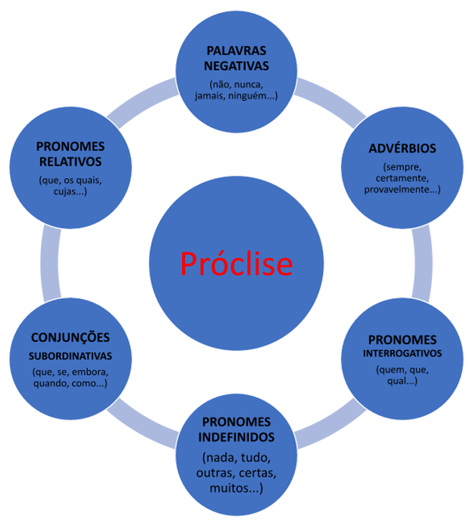

# Capítulo 4 – Classes de Palavras II: Pronomes

Após o estudo das classes nominais e circunstanciais, dedicamos este capítulo a uma das classes de palavras mais versáteis e fundamentais da Língua Portuguesa: o **Pronome**. Por sua natureza multifuncional e seu papel central na coesão textual, o pronome é um tópico de alta incidência e complexidade em provas, exigindo atenção especial.

Neste capítulo, faremos uma análise detalhada dos diferentes tipos de pronomes — Pessoais, Possessivos, Demonstrativos, Relativos, Indefinidos e Interrogativos — e de suas respectivas funções. Ao final, abordaremos um tópico de aplicação prática direta e muito cobrado em questões de gramática normativa: a **Colocação Pronominal**, que trata do correto posicionamento dos pronomes oblíquos átonos na oração. O domínio destes assuntos é indispensável para uma escrita formalmente correta e para a interpretação precisa das relações lógicas dentro de um texto.

## Pronome: A Palavra que Aponta e Substitui

Os pronomes são palavras variáveis que possuem uma dupla natureza: podem **acompanhar** um substantivo, determinando-o, ou podem **substituir** um substantivo, tomando o seu lugar na frase. Independentemente da função, seu papel é sempre referencial, ou seja, eles "apontam" para seres, coisas ou ideias, situando-os no discurso.

Semanticamente, os pronomes são capazes de expressar diversas noções, como as pessoas do discurso, posse, localização no tempo e no espaço, indefinição, quantidade, entre outras.

### A Dupla Natureza do Pronome: Acompanhar ou Substituir

A distinção mais fundamental na análise de um pronome é identificar se ele está atuando como um "adjetivo" (acompanhando um nome) ou como um "substantivo" (substituindo um nome).

- **Pronome Adjetivo:** É aquele que **acompanha** um substantivo, funcionando como um determinante, um "satélite" que qualifica ou especifica o nome. Sintaticamente, exerce a função de adjunto adnominal.
    - _Exemplo:_ **Estes** livros são meus. (O pronome "Estes" acompanha o substantivo "livros").
    - _Exemplo:_ **Minha** casa fica naquela rua. (O pronome "Minha" acompanha o substantivo "casa").

- **Pronome Substantivo:** É aquele que **substitui** um substantivo, ocupando o seu lugar e assumindo sua função sintática (núcleo do sujeito, do objeto, etc.). É um recurso essencial para evitar a repetição de palavras.
    - _Exemplo:_ Estes livros são meus; **aqueles** são seus. (O pronome "aqueles" substitui a palavra "livros", que fica implícita).
    - _Exemplo:_ **Alguém** bateu à porta. (O pronome "Alguém" substitui um nome desconhecido: "uma pessoa").

| Função                  | Definição                | Exemplo                 |
| ----------------------- | ------------------------ | ----------------------- |
| **Pronome Adjetivo**    | Acompanha o substantivo. | **Que** prova você fez? |
| **Pronome Substantivo** | Substitui o substantivo. | **Que** você fez?       |

### Os Valores Semânticos e a Classificação dos Pronomes

A tradicional divisão dos pronomes em seis categorias está diretamente ligada ao valor semântico ou à função discursiva que eles expressam. Conhecer essa relação ajuda a compreender o propósito de cada tipo de pronome.

| Valor Semântico / Função Principal                                             | Categoria de Pronome        |
| ------------------------------------------------------------------------------ | --------------------------- |
| Indicar as pessoas do discurso (quem fala, com quem se fala, de quem se fala). | **Pronomes Pessoais**       |
| Indicar uma relação de posse entre as pessoas do discurso e os seres/coisas.   | **Pronomes Possessivos**    |
| Situar os seres no tempo, no espaço ou no próprio texto (coesão).              | **Pronomes Demonstrativos** |
| Retomar um termo anterior e introduzir uma nova oração que o qualifica.        | **Pronomes Relativos**      |
| Referir-se a um ser de forma vaga, imprecisa ou genérica.                      | **Pronomes Indefinidos**    |
| Formular perguntas diretas ou indiretas.                                       | **Pronomes Interrogativos** |

A seguir, analisaremos detalhadamente cada uma dessas categorias.

### Pronomes Interrogativos

Os pronomes interrogativos são palavras (variáveis ou invariáveis) utilizadas para formular perguntas, sejam elas diretas ou indiretas. Eles se referem à terceira pessoa do discurso de uma forma imprecisa, buscando uma informação que é desconhecida.

Os pronomes interrogativos são:

- **que** (invariável)
- **quem** (invariável)
- **qual** (plural: **quais**)
- **quanto** (variáveis: **quanta, quantos, quantas**)

#### A Interrogação Direta

É o uso mais evidente, ocorrendo em frases que terminam com um ponto de interrogação (?).

- **Que:** Usado de forma ampla para perguntar sobre coisas ou fatos.
    - _Exemplos:_
        - **Que** aconteceu aqui?
        - **Que** livro você comprou?
    - **Nota:** Na expressão "O que", a palavra "o" é frequentemente considerada uma partícula expletiva (de realce), que pode ser retirada sem prejuízo ao sentido essencial da pergunta. _Exemplo: **(O) que** você disse?_

- **Quem:** Refere-se exclusivamente a pessoas.
    - _Exemplos:_
        - **Quem** resolveu a questão?
        - Com **quem** você estava falando?

- **Qual / Quais:** Implica uma ideia de seleção ou escolha dentro de um conjunto, definido ou não.
    - _Exemplos:_
        - **Qual** é a sua disciplina favorita?
        - Dentre estes, **quais** você prefere?

- **Quanto / Quanta / Quantos / Quantas:** Usado para perguntar sobre quantidades. Deve concordar em gênero e número com o substantivo a que se refere.
    - _Exemplos:_
        - **Quanto** custa a inscrição?
        - **Quantas** vagas estão disponíveis no edital?

#### A Interrogação Indireta

Ocorre quando a pergunta está inserida dentro de uma oração declarativa, sem o uso do ponto de interrogação. Geralmente, a oração iniciada pelo pronome interrogativo complementa o sentido de verbos como _saber, perguntar, indagar, dizer, ignorar, desconhecer_.

- **Exemplos:**
    - A banca não informou **que** aconteceu.
    - Gostaria de saber **quem** resolveu a questão.
    - Ele me perguntou **qual** era a minha disciplina favorita.
    - Desconheço **quantas** vagas estão disponíveis.

> **Foco de Prova: A Expressão Expletiva "é que"**
> 
> Em frases interrogativas, é muito comum o uso da expressão **"é que"** com valor de realce ou ênfase. Ela não possui função sintática e pode ser retirada da frase sem alterar o seu sentido fundamental. O pronome interrogativo é apenas a palavra inicial.
> 
> - **Com Expletivo:** _Quem **é que** te contou essa fofoca?_
> - **Sem Expletivo:** _Quem te contou essa fofoca?_
> - **Com Expletivo:** _O que **é que** ele fez para merecer isso?_
> - **Sem Expletivo:** _O que ele fez para merecer isso?_

### Pronomes Indefinidos

Os pronomes indefinidos são palavras, em sua maioria variáveis, que se referem à 3ª pessoa do discurso de maneira vaga, imprecisa ou genérica. Eles são utilizados para indicar uma quantidade, identidade ou totalidade indeterminada.

Assim como os outros pronomes, podem ser classificados como:

- **Pronomes Adjetivos Indefinidos:** Quando acompanham um substantivo.
    - _Exemplo:_ **Alguns** alunos não fizeram o trabalho.

- **Pronomes Substantivos Indefinidos:** Quando substituem um substantivo.
    - _Exemplo:_ **Alguém** precisa fazer o trabalho.

#### Listas de Pronomes e Locuções

Para facilitar o estudo, podemos dividir os pronomes indefinidos em variáveis e invariáveis.

|Pronomes Indefinidos Variáveis|Pronomes Indefinidos Invariáveis|
|---|---|
|algum, alguma, alguns, algumas|alguém|
|nenhum, nenhuma, nenhuns, nenhumas|ninguém|
|todo, toda, todos, todas|tudo|
|outro, outra, outros, outras|nada|
|muito, muita, muitos, muitas|algo|
|pouco, pouca, poucos, poucas|cada (sempre pronome adjetivo)|
|certo, certa, certos, certas|outrem|
|vário, vária, vários, várias||
|tanto, tanta, tantos, tantas||
|quanto, quanta, quantos, quantas||
|qualquer, quaisquer||

- **Locuções Pronominais Indefinidas:** São expressões formadas por mais de uma palavra com valor de pronome indefinido.
    - _Exemplos:_ **cada um, cada qual, qualquer um, quem quer que, seja quem for, todo aquele que, um ou outro, etc.**

#### Palavras com Múltiplas Classificações

Certas palavras podem funcionar como pronome indefinido, adjetivo ou advérbio, dependendo do contexto. A posição e a palavra modificada são as chaves para a correta classificação.

**O caso de "Certo"**

|Posição|Exemplo|Análise (Classe e Sentido)|
|---|---|---|
|**Antes** do substantivo|Procurei por **certas** pessoas.|**Pronome Indefinido:** Indica uma identidade indeterminada ("umas pessoas", "determinadas pessoas").|
|**Depois** do substantivo|Procurei pelas pessoas **certas**.|**Adjetivo:** Indica uma qualidade ("corretas", "adequadas").|

**O caso de "Bastante"**

Esta palavra é uma das que mais geram dúvidas. A análise é sempre relacional.

|Uso de "Bastante(s)"|Exemplo|Palavra Modificada|Classe Gramatical|Análise|
|---|---|---|---|---|
|**Variável (com "s")**|Temos **bastantes** problemas.|`problemas` (Substantivo)|**Pronome Indefinido**|Indica quantidade vaga ("muitos"). Concorda em número com o substantivo.|
|**Variável (com "s")**|Temos provas **bastantes** para a acusação.|`provas` (Substantivo)|**Adjetivo**|Indica qualidade ("suficientes"). Vem após o nome e concorda com ele.|
|**Invariável (sem "s")**|Elas são **bastante** competentes.|`competentes` (Adjetivo)|**Advérbio**|Indica intensidade ("muito"). Não varia.|
|**Invariável (sem "s")**|Elas estudaram **bastante**.|`estudaram` (Verbo)|**Advérbio**|Indica intensidade ("muito"). Não varia.|

A mesma lógica se aplica a **muito(s)** e **pouco(s)**: quando modificam substantivos, são pronomes e variam; quando modificam verbos ou adjetivos, são advérbios e não variam.

- _Exemplos:_
    - Havia **muita** gente na festa. (Pronome Indefinido)
    - As pessoas estavam **muito** animadas. (Advérbio)
    - **Poucos** candidatos foram aprovados. (Pronome Indefinido)
    - Os candidatos estavam **pouco** preparados. (Advérbio)

### Pronomes Possessivos

Os pronomes possessivos são palavras variáveis que indicam uma relação de **posse** ou **pertencimento** entre os seres ou objetos e as pessoas do discurso (o possuidor).

A tabela a seguir apresenta os pronomes possessivos correspondentes a cada pessoa do discurso:

|Pessoa do Discurso|Singular|Plural|
|---|---|---|
|**1ª pessoa** (eu/nós)|meu, minha|meus, minhas, nosso, nossa, nossos, nossas|
|**2ª pessoa** (tu/vós)|teu, tua|teus, tuas, vosso, vossa, vossos, vossas|
|**3ª pessoa** (ele/ela/eles/elas)|seu, sua|seus, suas|

#### As Regras de Concordância

A concordância do pronome possessivo segue uma regra fundamental que pode gerar dúvidas: ele concorda em gênero e número com a **coisa possuída** (o substantivo que ele determina), e não necessariamente com a pessoa do possuidor.

- **Exemplo 1:** Eu respeito **o Português** por **sua importância** na prova.
    - **Análise:** O pronome **sua** está no feminino singular para concordar com o substantivo **importância** (a coisa possuída), mesmo que o possuidor, **o Português**, seja um termo masculino.

- **Exemplo 2:** **Ela** guardou **seus documentos** na pasta.
    - **Análise:** O pronome **seus** está no masculino plural para concordar com o substantivo **documentos**, e não com a possuidora, **Ela**, que é do gênero feminino.

Sintaticamente, quando acompanha um nome, o pronome possessivo exerce sempre a função de **adjunto adnominal**.

#### A Ambiguidade de "Seu/Sua"

Como o pronome "seu" (e suas variações) pode se referir tanto à 3ª pessoa do discurso (`ele/dela`) quanto à pessoa com quem se fala (`você`), seu uso pode gerar ambiguidade em certas frases.

- **Frase Ambigua:** Maria disse a João que **sua** irmã ligou.
    - **Dúvida:** A irmã é de Maria ou de João?

Para garantir a clareza, a norma padrão recomenda o uso das formas **dele(s)** e **dela(s)** para desfazer a ambiguidade.

- **Para esclarecer:**
    - Maria disse a João que a irmã **dele** ligou. (A irmã de João).
    - Maria disse a João que a irmã **dela** ligou. (A irmã de Maria).

#### O Valor Possessivo dos Pronomes Oblíquos

Um ponto de análise refinado e recorrente em provas é o fato de que os **pronomes pessoais oblíquos átonos (me, te, lhe, nos, vos, lhes)** podem, em certas construções, adquirir um valor possessivo, equivalendo a um pronome possessivo. Isso ocorre frequentemente quando o substantivo se refere a partes do corpo, vestimentas ou atributos pessoais.

|Frase com Pronome Oblíquo|Equivalência com Pronome Possessivo|
|---|---|
|O assaltante feriu-**lhe** o braço.|Feriu o **seu** braço.|
|Beijou-**me** a testa com carinho.|Beijou a **minha** testa.|
|Penteou-**lhes** os cabelos.|Penteou os cabelos **deles/delas**.|
|Levaram-**nos** os pertences.|Levaram os **nossos** pertences.|

Nesses casos, embora o pronome esteja ligado ao verbo, sua função sintática é de **adjunto adnominal** do substantivo que representa a posse (mão, testa, cabelos, etc.).

#### A Função Coesiva do Pronome Possessivo

Assim como os demais pronomes, os possessivos são ferramentas essenciais para a **coesão textual**. Eles retomam um termo já mencionado no texto (o possuidor), criando uma ligação entre as partes do discurso e evitando repetições.

- **Exemplo:** **O candidato** preparou-se durante um ano. **Seu** esforço foi finalmente recompensado. (O pronome "Seu" retoma "O candidato", conectando as duas orações).

### Pronomes Demonstrativos

Os pronomes demonstrativos são palavras variáveis que situam seres e objetos, estabelecendo sua posição no espaço, no tempo ou no próprio corpo do texto. Eles "demonstram" ou "apontam" para os elementos do discurso, criando uma relação de proximidade ou distância em relação às três pessoas gramaticais.

A lista de pronomes demonstrativos inclui:

- **Essenciais:** este(s), esta(s), isto; esse(s), essa(s), isso; aquele(s), aquela(s), aquilo.
- **Outros pronomes com valor demonstrativo:** o(s), a(s); mesmo(s), mesma(s); próprio(s), própria(s); tal, tais; semelhante(s).

A tabela a seguir organiza os pronomes demonstrativos essenciais de acordo com a pessoa do discurso a que se associam:

|Pessoa|Variáveis|Invariáveis|Relação de Proximidade|
|---|---|---|---|
|**1ª Pessoa**|este(s), esta(s)|**isto**|Perto de quem fala (aqui).|
|**2ª Pessoa**|esse(s), essa(s)|**isso**|Perto de com quem se fala (aí).|
|**3ª Pessoa**|aquele(s), aquela(s)|**aquilo**|Longe de ambos (lá, ali).|

#### As Funções Referenciais: Fora e Dentro do Texto

A função primordial de um pronome é fazer referência a algo. Essa referência pode apontar para um elemento no mundo real (fora do texto) ou para um elemento dentro do próprio texto.

**Referência Exofórica (ou Dêitica)**

Ocorre quando o pronome aponta para um elemento que está fora do texto, na situação de comunicação. O sentido desses pronomes depende do contexto: de quem está falando, para quem, onde e quando.

- _Exemplo:_ **Neste país**, **neste momento**, **este autor** que vos fala está otimista.
    - **Análise:** Para entender a quais "país", "momento" e "autor" os pronomes se referem, é preciso conhecer o contexto externo em que a frase foi produzida. A referência espacial (`este violão aqui`) e temporal (`nesta semana`) dos demonstrativos é, por natureza, exofórica ou dêitica.

**Referência Endofórica (Textual)**

Ocorre quando o pronome aponta para um elemento que está dentro do texto. É o mecanismo fundamental da coesão textual e se divide em duas funções:

- **Função Anafórica (Retomada):** O pronome retoma uma informação que **já foi mencionada** no texto.
    - _Exemplo:_ O candidato não estudou. Apesar **disso**, ele passou. ("disso" retoma "não ter estudado").

- **Função Catafórica (Anunciação):** O pronome anuncia uma informação que **ainda será mencionada** no texto.
    - _Exemplo:_ Eu só pensava **nisto**: passar no concurso. ("nisto" anuncia "passar no concurso").

#### O Emprego dos Demonstrativos

A escolha entre `este`, `esse` e `aquele` depende se a referência é espacial, temporal ou textual.

**No Espaço (Uso Dêitico)**

|Relação de Proximidade|Pronomes Utilizados|Advérbio Associado|Exemplo|
|---|---|---|---|
|Perto de quem fala (1ª pessoa)|**este(s), esta(s), isto**|**aqui**|**Este** violão **aqui** na minha mão é de madeira maciça.|
|Perto de com quem se fala (2ª pessoa)|**esse(s), essa(s), isso**|**aí**|**Esse** violão **aí** na sua mão é de madeira maciça?|
|Longe de ambos (3ª pessoa)|**aquele(s), aquela(s), aquilo**|**lá, ali**|**Aquela** pintura **lá** na parede é um afresco.|

**No Tempo (Uso Dêitico)**

|Referência Temporal|Pronomes Utilizados|Exemplo|
|---|---|---|
|**Presente ou período corrente**|**este(s), esta(s), isto**|**Este** domingo está ensolarado. / **Neste** verão, viajarei.|
|**Passado ou futuro recentes**|**esse(s), essa(s), isso**|Lembro-me de 2024; **nesse** ano, estudei muito.|
|**Passado ou futuro remotos**|**aquele(s), aquela(s), aquilo**|A década de 70 foi marcante. **Naquele** tempo, tudo era diferente.|

**No Texto (Uso Endofórico para Coesão)**

- **Para anunciar (Catáfora):** Usa-se **este(s), esta(s), isto**.
    - _Exemplo:_ **Esta** é a sua nova senha: ynot.xp$%.
    - _Exemplo:_ O objetivo da vida é **isto**: ser feliz.

- **Para retomar (Anáfora):** Usa-se **esse(s), essa(s), isso**.
    - _Exemplo:_ João foi aprovado em primeiro lugar. **Esse** rapaz é um gênio.
    - _Exemplo:_ Dinheiro, sucesso e prestígio; **isso** tudo era importante para ela.

> **Foco de Prova: A Retomada de Dois ou Mais Termos**
> 
> Para se referir a dois elementos já citados em uma frase, a norma padrão prescreve o seguinte uso:
> 
> - **este** (e suas variações) para o termo mencionado por **último** (o mais próximo).
> - **aquele** (e suas variações) para o termo mencionado em **primeiro** lugar (o mais distante).
> 
> Exemplo: João e Maria são concursados; esta é do Bacen, aquele é do TCU.
> 
> Análise: esta (Maria, o termo mais próximo) / aquele (João, o termo mais distante).

- **Observação sobre o Uso Anafórico de "Este":** Embora a regra mais rigorosa indique esse para retomadas, é comum e aceito na norma culta o uso de este para se referir a um elemento na oração imediatamente anterior, conferindo-lhe maior proximidade ou destaque.
    - _Exemplo:_ Precisamos respeitar o professor, pois **este** é um grande formador de caráter.

#### Outras Palavras com Valor Demonstrativo

Além do trio `este/esse/aquele`, diversas outras palavras podem ser classificadas como pronomes demonstrativos, a depender do contexto em que são empregadas.

**"O, A, Os, As" como Pronomes Demonstrativos**

As palavras **o, a, os, as** podem funcionar como pronomes demonstrativos quando for possível substituí-las por **aquilo, aquele(s)** ou **aquela(s)**. Isso ocorre comumente em duas estruturas:

- **Antes da preposição "de":**
    - _Exemplo:_ Entre as camisas, prefiro **a** de algodão. (Equivale a: ...prefiro **aquela** de algodão).
    - _Exemplo:_ Seu discurso foi igual **ao** de seu antecessor. (Equivale a: ...foi igual **àquele** de seu antecessor).

- **Antes do pronome relativo "que":**
    - _Exemplo:_ Quero **o** que estiver em promoção. (Equivale a: Quero **aquilo** que estiver em promoção).
    - _Exemplo:_ As propostas que ele fez não são **as** que esperávamos. (Equivale a: ...não são **aquelas** que esperávamos).

- **Retomando uma oração inteira (com valor neutro):** Quando retomam uma ideia completa, "o" equivale a "isso".
    - _Exemplo:_ Ele sabia que devia estudar, mas não **o** fez. (não fez **isso** = não estudou).
    - _Exemplo:_ Ela parece simpática, mas na verdade não **o** é. (não é **isso** = não é simpática).

> **Foco de Prova: Não Confundir as Funções!**
> 
> É crucial diferenciar o "o, a, os, as" demonstrativo de suas outras funções:
> 
> - **Artigo Definido:** Acompanha um substantivo. (_Vi **a** menina_).
> - **Pronome Pessoal Oblíquo:** Substitui um substantivo-objeto. (_Vi-**a** na rua_).
> - **Pronome Demonstrativo:** Equivale a "aquilo/aquele/aquela". (_Quero **a** que for mais barata_).

> **Uma Polêmica Gramatical**
> 
> É importante registrar que uma corrente minoritária de gramáticos, como Evanildo Bechara e Celso Pedro Luft, defende que, em casos como "comprei **a** de algodão", a palavra "a" continua sendo um **artigo**, e o que ocorre é a elipse (omissão) do substantivo: "comprei a [camisa] de algodão". Embora a visão majoritária em concursos classifique como pronome demonstrativo, conhecer essa dupla interpretação pode ser útil em questões mais teóricas.

**"Tal", "Tais" e "Semelhante(s)"**

Essas palavras funcionam como demonstrativos quando podem ser substituídas por `este(s)`, `esta(s)`, `esse(s)`, `essa(s)`, `aquele(s)`, `aquela(s)`.

- _Exemplos:_
    - Não esperava **tal** atitude de você. (**essa** atitude).
    - Não se deve dar atenção a **semelhantes** absurdos. (**esses** absurdos).
    - Sei que está triste, mas não diga **tal**. (não diga **isso**).

**"Mesmo(s)", "Mesma(s)" e "Próprio(s)", "Própria(s)"**

Quando usados para reforçar um nome ou pronome, têm valor demonstrativo e enfático.

- _Exemplos:_
    - **Ele próprio** se demitiu do cargo. (Ele em pessoa).
    - **Eu mesma** resolverei o problema. (Eu em pessoa).
    - Eles cometeram os **mesmos** erros. (Exatamente aqueles erros, erros iguais).

### Pronomes Relativos

Os pronomes relativos são palavras que desempenham uma dupla função crucial na estrutura da frase:

1. **Retomam um termo anterior (o antecedente):** Eles se referem a um substantivo ou pronome já mencionado na oração, evitando sua repetição.
2. **Introduzem uma nova oração:** Dão início a uma oração subordinada adjetiva, que serve para caracterizar ou restringir o sentido do termo antecedente.

Por essa capacidade de conectar ideias e retomar informações, os pronomes relativos são as ferramentas de **coesão textual** por excelência. Eles "costuram" o texto, tornando-o mais elegante, conciso e articulado.

Podem ser **variáveis**, quando se flexionam em gênero e número para concordar com seu antecedente, ou **invariáveis**.

| Variáveis (Masculinos) | Variáveis (Femininos) | Invariáveis |
| ---------------------- | --------------------- | ----------- |
| o qual (os quais)      | a qual (as quais)     | **quem**    |
| cujo (cujos)           | cuja (cujas)          | **que**     |
| quanto (quantos)       | quanta (quantas)      | **onde**    |

#### A Função Coesiva na Prática

Para entender o poder dos pronomes relativos, observe a diferença entre um texto construído sem eles e um texto coeso.

**Texto sem pronomes relativos (repetitivo e truncado):**

> _O aluno foi aprovado. O aluno é primo de João. João tem mãe. A mãe de João é professora. A mãe do João foi professora da menina. A menina roubava livros. Os livros eram caríssimos. Os livros foram comprados numa loja distante. Havia muitos enfeites na loja. Perguntaram a várias pessoas a localização da loja. As pessoas não souberam responder._

A leitura é difícil e a falta de conexão entre as ideias é evidente. Agora, veja como o uso dos pronomes relativos transforma a estrutura.

**Texto com pronomes relativos (fluido e coeso):**

> _O aluno **que** foi aprovado é primo de João, **cuja** mãe foi professora daquela menina **que** roubava livros, **os quais** eram caríssimos e foram comprados numa loja **onde** havia muitos enfeites. As pessoas a **quem** perguntaram a localização da loja não souberam responder._

O segundo texto é infinitamente mais claro e bem-estruturado. Cada pronome relativo retoma um termo anterior (`que` → aluno; `cuja` → de João; `que` → menina; `os quais` → livros; `onde` → loja; `quem` → pessoas), conectando as informações em um fluxo lógico e contínuo.

A seguir, vamos analisar o uso e as particularidades de cada um dos principais pronomes relativos, pontos que são indispensáveis para um bom desempenho na sua prova.

#### Pronome Relativo Universal: "Que"

O pronome **que** é o mais versátil e frequente dos relativos. Pode ser usado para retomar tanto **pessoas** quanto **coisas**, no singular ou no plural.

Sua função principal é introduzir uma **oração subordinada adjetiva**, que, como o nome sugere, equivale a um adjetivo, caracterizando o termo anterior.

- _Exemplos:_
    - O menino **estudioso** passa no concurso. (Adjetivo)
    - O menino **que estuda** passa no concurso. (Oração Subordinada Adjetiva)

Como o pronome `que` sempre retoma um termo anterior (função anafórica), é fundamental atentar para a regência verbal ou nominal da oração que ele introduz. Se o verbo ou nome dessa oração exigir uma preposição, ela deverá, obrigatoriamente, ser colocada antes do pronome `que`. A omissão da preposição é um erro grave e muito cobrado em provas.

- _Incorreto:_ O filme **que** assisti era ótimo.
- _Correto:_ O filme **a que** assisti era ótimo. (Pois quem assiste, no sentido de "ver", assiste **a** algo).
- _Incorreto:_ As ideias **que** ele concorda são polêmicas.
- _Correto:_ As ideias **com que** ele concorda são polêmicas. (Pois quem concorda, concorda **com** algo).

#### Pronome "O Qual" (e suas variações)

Os pronomes **o qual, a qual, os quais, as quais** são variáveis e podem, em muitos casos, substituir o pronome `que`. Seu uso é preferível ou obrigatório em duas situações principais:

1. **Para Evitar Ambiguidade:** Como estes pronomes flexionam em gênero e número, eles são uma ferramenta precisa para deixar claro a qual antecedente se referem, desfazendo possíveis ambiguidades.
    - _Frase Ambigua:_ Conheci a filha do vizinho, **que** é muito simpática. (Quem é simpática? A filha ou o vizinho?)
    - **Desfazendo a Ambiguidade:**
        - Conheci a filha do vizinho, **a qual** é muito simpática. (Refere-se à filha).
        - Conheci a filha do vizinho, **o qual** é muito simpático. (Refere-se ao vizinho).

2. **Após Preposições Longas:** Após preposições com duas ou mais sílabas (como _sobre, entre, perante_) ou locuções prepositivas (como _apesar de, acerca de_), o uso de "o qual" e suas variações é obrigatório.
    - _Exemplo:_ Este é o autor **sobre o qual** conversamos. (e não _"sobre que"_).
    - _Exemplo:_ As dificuldades **apesar das quais** vencemos nos fortaleceram. (e não _"apesar que"_).

#### Pronome "Quem"

- **Referência:** Refere-se exclusivamente a **pessoas** ou a seres personificados.
- **Preposição:** É quase sempre precedido por uma preposição.
    - _Exemplos:_
        - A pessoa **a quem** me dirigi não soube informar.
        - O artista **de quem** sou fã fará um show no Brasil.
        - Este é o colega **por quem** tenho grande apreço.

- **Uso Absoluto:** Em sentenças proverbiais ou de sentido genérico, "quem" pode ser usado sem um antecedente explícito.
    - _Exemplo:_ **Quem** com ferro fere, com ferro será ferido.

#### Pronome "Cujo" (e suas variações)

O pronome **cujo, cuja, cujos, cujas** é o único que expressa, primariamente, uma relação de **posse**. Seu uso segue regras rígidas:

1. **Posição:** Aparece sempre entre dois substantivos: o **possuidor** (termo antecedente) e a **coisa possuída** (termo consequente).
2. **Concordância:** Concorda em gênero e número com a **coisa possuída** (o substantivo que vem depois dele).
3. **Artigo:** **NUNCA** se usa artigo depois do pronome `cujo`. As construções "cujo o", "cuja a" são erros graves.

- _Exemplos:_
    - Vi o filme **cujo diretor** ganhou o Oscar. (O diretor é do filme. "Cujo" concorda com "diretor").
    - A árvore **cujas folhas** caíram era antiga. (As folhas são da árvore. "Cujas" concorda com "folhas").
    - O escritor **a cuja obra** me referi é brilhante. (A preposição "a" é exigida por "referi-me". "Cuja" concorda com "obra").

#### Pronomes Relativos de Lugar: "Onde", "Aonde", "Donde"

- **Onde:** Retoma um antecedente que indica **lugar físico** e equivale a **em que / no qual**. É usado com verbos que indicam permanência.
    - _Exemplo:_ A casa **onde** moro fica em um bairro tranquilo.
    - _Uso Inadequado:_ A reunião **onde** discutimos o projeto foi longa. (O correto seria: A reunião **em que/na qual**...).

- **Aonde:** Retoma um antecedente de lugar, mas é usado com verbos que indicam **movimento, destino** e que regem a preposição "a". Equivale a **a que / ao qual**.
    - _Exemplo:_ A cidade **aonde** iremos nas férias é histórica.

- **Donde:** É uma forma mais arcaica que equivale a **de onde**, indicando origem ou procedência.
    - _Exemplo:_ A terra **donde** ele veio é muito distante.

#### Outros Pronomes Relativos: "Quanto", "Como", "Quando"

O uso destes pronomes é determinado pelo sentido do termo antecedente.

- **Quanto(s), Quanta(s):** Usado após pronomes indefinidos como _tudo, tanto, todos_.
    - _Exemplo:_ Ele fez **tudo quanto** pôde para ajudar.

- **Como:** Usado após substantivos como _modo, maneira, forma, jeito_.
    - _Exemplo:_ Admiro a **forma como** ele resolve os problemas.

- **Quando:** Usado após substantivos que indicam tempo.
    - _Exemplo:_ Recordo-me do **tempo quando** brincávamos na rua.

> **Foco de Prova: A Regência com Pronomes Relativos**
> 
> A chave para acertar questões de regência com pronomes relativos é "desfazer" a estrutura. Para saber qual preposição usar (ou se ela é necessária), construa uma frase simples com o verbo/nome da oração adjetiva e o termo antecedente.
> 
> - **Frase:** _O cargo **que** aspiro é muito concorrido._
>     - **Teste:** Eu aspiro **ao** cargo. → A preposição "a" é exigida.
>     - **Correto:** O cargo **a que** aspiro é muito concorrido.
> - **Frase:** _A autora **cujos** livros gosto muito virá ao Brasil._
>     - **Teste:** Eu gosto muito **dos** livros (de + os). → A preposição "de" é exigida.
>     - **Correto:** A autora **de cujos** livros gosto muito virá ao Brasil.

### Pronomes de Tratamento

Os pronomes de tratamento são palavras ou locuções que funcionam como uma forma especial de pronome pessoal. São empregados para se dirigir a pessoas de acordo com sua idade, cargo, título ou posição social, expressando um grau de formalidade, cortesia ou reverência.

Embora a lista de pronomes de tratamento seja extensa, especialmente em manuais de redação oficial (como os da Presidência da República e de tribunais superiores), para fins de concurso, o foco recai sobre os mais comuns e, principalmente, sobre as regras de concordância associadas a eles.

#### Principais Formas de Tratamento e seu Emprego

| Pronome de Tratamento    | Abreviação(ões)        | Destinatário(s) / Emprego                                                                                           |
| ------------------------ | ---------------------- | ------------------------------------------------------------------------------------------------------------------- |
| **Vossa Senhoria**       | V. S.ª / V. S.as       | Usado em correspondência formal para funcionários graduados, diretores, e pessoas de prestígio em geral.            |
| **Vossa Excelência**     | V. Ex.ª / V. Ex.as     | Altas autoridades do Estado (Presidente, Ministros, Senadores, Deputados, Juízes, Embaixadores, Oficiais Generais). |
| **Vossa Magnificência**  | V. M.ª / V. Mag.as     | Reitores de universidades.                                                                                          |
| **Vossa Santidade**      | V. S.                  | Papa.                                                                                                               |
| **Vossa Eminência**      | V. Em.ª / V. Em.as     | Cardeais.                                                                                                           |
| **Vossa Alteza**         | V. A. / VV. AA.        | Príncipes, duques, arquiduques.                                                                                     |
| **Vossa Majestade**      | V. M. / VV. MM.        | Reis e imperadores.                                                                                                 |
| **Vossa Reverendíssima** | V. Rev.ma / V. Rev.mas | Sacerdotes e religiosos em geral.                                                                                   |

#### As Regras de Concordância

A correta concordância com os pronomes de tratamento é o ponto mais crucial deste tópico. As regras podem parecer contraintuitivas, mas seguem uma lógica clara.

**Concordância Verbal e Pronominal (3ª Pessoa)**

Embora os pronomes de tratamento se refiram à 2ª pessoa do discurso (a pessoa com quem se fala), toda a concordância de verbos e demais pronomes deve ser feita na 3ª pessoa (singular ou plural).

A lógica por trás disso é que a concordância se estabelece com o substantivo que é o núcleo da expressão (`Senhoria`, `Excelência`, `Majestade`), que é um substantivo de terceira pessoa.

- **Dica:** Para simplificar, faça a concordância como se estivesse usando "você" ou "vocês".

| -                      | Exemplo de Concordância                                               |
| ---------------------- | --------------------------------------------------------------------- |
| **Verbo**              | **Vossa Excelência decidiu** corretamente. (e não "decidistes").      |
| **Pronome Oblíquo**    | Eu **o** vi ontem, Senhor Presidente. (e não "vos vi").               |
| **Pronome Possessivo** | **Vossa Senhoria** pode trazer **seus** documentos? (e não "vossos"). |

- _Exemplo do Manual da Presidência:_ **Vossa Senhoria** nomeará **seu** substituto.

**Concordância Nominal (Gênero da Pessoa)**

Diferentemente da concordância verbal, os adjetivos e particípios que se referem à pessoa tratada devem concordar com o gênero real (masculino ou feminino) dessa pessoa, e não com o gênero da palavra que compõe o pronome de tratamento (que geralmente é feminino, como "Excelência", "Senhoria", "Majestade").

- _Exemplos:_
    - Se o interlocutor for um juiz: **Vossa Excelência** está muito **ocupado** hoje.
    - Se a interlocutora for uma senadora: **Vossa Excelência** foi **eleita** com muitos votos.
    - Se a interlocutora for uma rainha: **Vossa Majestade** é muito **bondosa**.

#### A Diferença entre "Vossa" e "Sua"

A escolha entre "Vossa" e "Sua" depende da posição do interlocutor na conversa.

- **VOSSA (Excelência, Senhoria, etc.):** Usa-se para falar **DIRETAMENTE COM** a autoridade.
    - _Exemplo:_ Senhor Deputado, esperamos que **Vossa** Excelência aprecie nosso projeto.

- **SUA (Excelência, Senhoria, etc.):** Usa-se para falar **SOBRE** a autoridade, referindo-se a ela como uma terceira pessoa.
    - _Exemplo:_ O Deputado não pôde comparecer, mas **Sua** Excelência enviou um representante.

#### Uso de Artigo e Crase

Por regra geral, a maioria dos pronomes de tratamento (especialmente os iniciados por "Vossa") **rejeita o uso de artigo**. Como consequência, **não ocorre crase** antes deles.

- _Exemplo:_ Encaminho o ofício **a Vossa** Senhoria. (Sem crase).
- **Exceções:** Formas de tratamento mais comuns como **senhor, senhora, senhorita**, **madame**, **doutora** e **dona** admitem o uso de artigo. Portanto, diante delas, a crase pode ocorrer.
    - _Exemplo:_ Entreguei o presente **à senhora**. (Preposição "a" + artigo "a").

### Pronomes Pessoais: A Indicação das Pessoas do Discurso

Os pronomes pessoais são aqueles que representam diretamente as três pessoas do discurso: a que fala (1ª pessoa), a com quem se fala (2ª pessoa) e a de quem/que se fala (3ª pessoa). Eles se subdividem em duas grandes categorias, de acordo com a função sintática que desempenham na oração: **retos** e **oblíquos**.

|Pessoas do Discurso|Pronomes Retos|Pronomes Oblíquos Átonos|Pronomes Oblíquos Tônicos|
|---|---|---|---|
|1ª pessoa do singular|**Eu**|**me**|**mim**, comigo|
|2ª pessoa do singular|**Tu**|**te**|**ti**, contigo|
|3ª pessoa do singular|**Ele/Ela**|**se**, **o**, **a**, **lhe**|**si**, consigo, ele, ela|
|1ª pessoa do plural|**Nós**|**nos**|**nós**, conosco|
|2ª pessoa do plural|**Vós**|**vos**|**vós**, convosco|
|3ª pessoa do plural|**Eles/Elas**|**se**, **os**, **as**, **lhes**|**si**, consigo, eles, elas|

#### Pronomes do Caso Reto (Função de Sujeito)

A função primordial dos pronomes retos (`eu, tu, ele/ela, nós, vós, eles/elas`) é exercer o papel de **sujeito** ou de **predicativo do sujeito** na oração.

- **Exemplos:**
    - **João** é um ótimo aluno. → **Ele** é um ótimo aluno.
    - O culpado sou **eu**. (Predicativo do Sujeito)

> **Foco de Prova: Pronome Reto como Objeto Direto**
> 
> A norma padrão condena o uso de pronomes retos como complementos verbais diretos (Ex: "Vi ele", "Manda um abraço para nós"). No entanto, o uso é abonado por grandes gramáticos quando o pronome reto vem modificado por palavras como **"todos", "só", "apenas"** ou por um **numeral**.
> 
> - _Exemplos:_
>     - Encontrei **ele só** na festa.
>     - A diretora convocou **todos eles** para a reunião.
>     - Vi **elas duas** no cinema.

#### Pronomes do Caso Oblíquo (Função de Complemento)

Os pronomes oblíquos atuam como **complementos** (objetos diretos, indiretos, etc.). Dividem-se em **átonos** (sem preposição) e **tônicos** (com preposição).

**Pronomes Oblíquos Átonos**

São pronomes de pronúncia fraca que se ligam diretamente ao verbo, sem preposição. Sua função como objeto direto ou indireto é fixa:

|Pronome(s)|Função Sintática|Exemplo|
|---|---|---|
|**o, a, os, as**|Apenas **Objeto Direto (OD)**|Vi **o filme**. → Vi-**o**.|
|**lhe, lhes**|Apenas **Objeto Indireto (OI)**|Entreguei o livro **a ele**. → Entreguei-**lhe** o livro.|
|**me, te, se, nos, vos**|**Objeto Direto ou Indireto**|Ele **me** viu na rua. (OD) / Ele **me** obedeceu. (OI)|

**Pronomes Oblíquos Tônicos**

São pronomes de pronúncia forte e são sempre antecedidos por uma preposição.

- _Exemplos:_
    - Não há mais nada entre **mim** e **ela**.
    - Fizeram tudo **para ti**.
    - Fiquei preocupado **contigo**.

#### Casos Especiais de Emprego

- **"Entre mim e ti" vs. "Entre eu e tu":** Após preposições, em regra, usam-se os pronomes oblíquos tônicos (mim, ti).
    - _Correto:_ Havia um acordo entre mim e ti.
        A exceção ocorre quando o pronome funciona como sujeito de um verbo no infinitivo que vem logo a seguir. Nesse caso, usa-se o pronome reto.
    - _Correto:_ Não há nada para **eu** fazer aqui. (Pois "eu" é o sujeito de "fazer").
    - _Correto:_ A tarefa de organizar tudo ficou para **mim**.

#### Adaptações dos Pronomes Oblíquos em Ênclise

Quando os pronomes **o, a, os, as** são ligados a um verbo após este (ênclise), a forma do verbo e do pronome pode sofrer adaptações para facilitar a pronúncia.

**Verbos terminados em -r, -s, -z**

Estas consoantes finais são suprimidas e o pronome assume as formas -lo, -la, -los, -las.

- _Exemplos:_
    - comprar o carro → comprá-**lo**
    - felicitamos as alunas → felicitamo-**las**
    - fiz a tarefa → fi-**la**

**Verbos terminados em som nasal (-m, -ão, -õe)**

Acrescenta-se um -n- ao pronome, que assume as formas -no, -na, -nos, -nas.

- _Exemplos:_
    - viram o acidente → viram-**no**
    - põe a mesa → põe-**na**
    - dão o presente → dão-**no**

**Verbos terminados em "-mos" + "-nos"**

Quando a primeira pessoa do plural (-mos) é seguida do pronome oblíquo nos, o "-s" final do verbo é suprimido.

- _Exemplo:_ Nós nos alistamos. → Alistamo-**nos** no exército.

**Combinação de Pronomes**

Na linguagem formal ou arcaica, é possível contrair dois pronomes oblíquos (um indireto e um direto) em uma única forma.

- _Exemplos:_
    - Deu o livro a mim. → Deu-**mo**. (`me + o`)
    - Entregou a carta a ele. → Entregou-**lha**. (`lhe + a`)

## Colocação Pronominal: A Posição Correta dos Pronomes Átonos

Colocação pronominal é o estudo da correta posição dos pronomes pessoais oblíquos átonos na oração. Embora na linguagem falada do dia a dia haja uma forte tendência ao uso do pronome antes do verbo (próclise), a norma padrão escrita estabelece regras precisas que devem ser seguidas.

Os pronomes em questão são: **me, te, se, o, a, lhe, nos, vos, os, as, lhes**.

Existem três posições possíveis para esses pronomes em relação ao verbo:

|Posição|Nome|Exemplo|
|---|---|---|
|**Antes** do verbo|**Próclise**|Hoje **me** escondi na mata.|
|**Depois** do verbo|**Ênclise**|Escondi-**me** na mata.|
|**No meio** do verbo|**Mesóclise**|Esconder-**me**-ia na mata.|

### As Regras Fundamentais: O que é Proibido

A maneira mais eficaz de dominar a colocação pronominal é começar pelo que a norma padrão **proíbe**. Se uma construção não for proibida e não houver uma regra que obrigue uma posição específica, ela é, em princípio, permitida.

1. **É proibido iniciar um período com pronome oblíquo átono.**
    - _Inadequado:_ **Me** dá um cigarro?
    - _Adequado:_ **Dá-me** um cigarro? (Usa-se a ênclise).

2. **É proibido usar o pronome após um verbo no futuro (do presente ou do pretérito) ou no particípio.**
    - _Inadequado (Futuro do Presente):_ Darei-**te** um presente.
    - _Adequado:_ **Dar-te-ei** um presente. (Usa-se a mesóclise, pois a ênclise é proibida e não há palavra atrativa).
    - _Inadequado (Futuro do Pretérito):_ Daria-**te** um presente.
    - _Adequado:_ **Dar-te-ia** um presente. (Mesma lógica da mesóclise).
    - _Inadequado (Particípio):_ Tinha emprestado-**lhe** o dinheiro.
    - _Adequado:_ Tinha-**lhe** emprestado o dinheiro. (O pronome se liga ao verbo auxiliar).

3. **Não se deve iniciar uma oração com pronome átono após uma pausa forte (vírgula, ponto e vírgula).**
    - _Inadequado:_ Ele não virá amanhã; **me** disse que estará ocupado.
    - _Adequado:_ Ele não virá amanhã; **disse-me** que estará ocupado.

### A Regra Principal: Próclise e os Fatores de Atração

A próclise (pronome antes do verbo) é a colocação preferencial no português brasileiro. Ela se torna **obrigatória** quando há, antes do verbo, uma **"palavra atrativa"** ou **"fator de próclise"**. A regra geral é que palavras de natureza invariável (advérbios, conjunções subordinativas, certos pronomes) "puxam" o pronome para perto de si.

O esquema a seguir resume os principais fatores de atração:

- **Palavras de sentido negativo:** _não, nunca, jamais, ninguém, nada, etc._
    - Exemplo: **Nunca se** arrependeu do que fez.

- **Advérbios (sem vírgula):** _já, sempre, talvez, aqui, hoje, etc._
    - Exemplo: **Talvez se** encontrem amanhã.

- **Pronomes Relativos:** _que, quem, o qual, cujo, onde, etc._
    - Exemplo: O livro **que me** emprestaram era ótimo.

- **Pronomes Indefinidos:** _alguém, todos, tudo, ninguém, etc._
    - Exemplo: **Alguém me** ligou durante a reunião.

- **Pronomes Interrogativos:** _quem, que, qual, quando, etc._
    - Exemplo: **Quem te** contou essa história?

- **Conjunções Subordinativas:** _quando, se, porque, embora, conforme, etc._

    - Exemplo: **Quando se** precisa de ajuda, os amigos aparecem.
    - Exemplo: **Embora me** dedique à matéria, ainda tenho dificuldades.

### Regras Especiais e Outros Casos de Colocação

**1. Orações Optativas:** Em frases que expressam desejo (optativas), a próclise é obrigatória.
- Exemplos: **Deus lhe** pague. / **Bons ventos o** levem.

**2. Preposição "Em" + Verbo no Gerúndio:** Nesta construção fixa, usa-se sempre a próclise.
- Exemplos: **Em se** tratando de vinhos, ele é uma autoridade. / **Em se** plantando tudo dá.

**3. Construções com Infinitivo:** Quando o verbo está no infinitivo (não flexionado), a colocação do pronome é, em geral, livre, podendo ocorrer a próclise ou a ênclise, especialmente se precedido por uma preposição ou palavra negativa.
- Exemplos: Prefiro não **te convidar**. / Prefiro não **convidar-te**. / Para **me ajudar**... / Para **ajudar-me**...

**4. Orações Coordenadas:** Em orações ligadas por conjunções coordenativas (como "e", "mas", "ou"), a colocação costuma ser livre.
- Exemplo: Cheguei ao local, **e me** sentei, **e preparei-me** para a prova.
    - **Observação:** Com alguns conectivos aditivos e alternativos, como `nem`, `ora... ora`, `não só... mas também`, a próclise é fortemente recomendada.
        - Exemplo: João não respeitou o horário **nem se** desculpou.

**5. Próclise em Orações Subordinadas:** Como regra geral, as orações subordinadas (iniciadas por conjunções subordinativas ou pronomes relativos) sempre favorecem a próclise. A força de atração do conectivo inicial se mantém mesmo que haja outras palavras entre ele e o verbo.
- Exemplo: Soube que, **naquele dia, se** sentiu mal.
- Exemplo: **Enquanto** os protestos violentos **se** espalham, a população espera.
    - **Exceção:** Se houver uma pausa bem marcada (uma intercalação longa entre vírgulas), a força de atração pode ser "quebrada", tornando a ênclise também possível.
        - Exemplo: Jamais, segundo pensam os economistas, **se fizeram** (ou **fizeram-se**) tantas despesas.

### A Colocação Pronominal em Locuções Verbais

Uma locução verbal, como vimos, é a combinação de um **Verbo Auxiliar** (que é conjugado) e um **Verbo Principal** (em uma das formas nominais: infinitivo, gerúndio ou particípio).

- _Exemplos:_
    - **Posso dizer** a verdade. (Auxiliar + Infinitivo)
    - **Estava dizendo** a verdade. (Auxiliar + Gerúndio)
    - **Tinha dito** a verdade. (Auxiliar + Particípio)

A posição do pronome oblíquo átono em uma locução verbal segue as regras gerais de próclise e ênclise, mas com mais possibilidades de posicionamento.

#### Locuções Verbais SEM Fator de Atração

Quando não há uma palavra atrativa (advérbio, pronome relativo, etc.) antes da locução, o pronome pode ocupar, em geral, duas posições principais, consideradas corretas pela maioria dos gramáticos:

- **Após o Verbo Auxiliar (Ênclise ao Auxiliar):** O pronome é ligado ao auxiliar por hífen.
    - _Exemplos:_
        - Os alunos **tinham-se** revoltado.
        - **Vou-me** arrastando pela vida.
        - **Ia-me** esquecendo da reunião.

- **Após o Verbo Principal (Ênclise ao Principal):** O pronome é ligado ao principal por hífen.
    - _Exemplos:_
        - Os alunos tinham revoltado-**se**.
        - Quero convidar-**te** para a festa.
        - Ele estava testando-**me** sempre.

> **Observação sobre o Pronome "Solto" no Meio:**
> 
> No português do Brasil, é extremamente comum a colocação do pronome "solto" (sem hífen) entre os dois verbos, em próclise ao verbo principal. Embora a gramática mais tradicional prefira as formas com hífen, este uso é amplamente aceito e abonado por gramáticas modernas.
> 
> - _Exemplos de uso corrente:_
>     - Eu **estou lhe** emprestando dinheiro.
>     - **Vou me** arrastando pela vida.

#### Locuções Verbais COM Fator de Atração

Esta é a situação mais importante para provas. Quando uma palavra atrativa precede a locução verbal, ela força a **próclise**. Isso cria duas posições corretas e **proíbe** uma terceira.

- **Posições CORRETAS:**
    1. **Antes do Verbo Auxiliar:** O pronome é atraído para o início do bloco verbal.
    2. **Antes do Verbo Principal (solto no meio):** O pronome é atraído para antes do verbo principal.

- **Posição INCORRETA:**
    1. **Após o Verbo Auxiliar:** A ênclise ao verbo auxiliar é **proibida**, pois a palavra atrativa "puxa" o pronome para antes do verbo.

Vamos analisar o exemplo "Eu não estou emprestando dinheiro":

|Exemplo|Posição do Pronome|Análise|
|---|---|---|
|Eu **não lhe** estou emprestando dinheiro.|Antes da locução|**Correto.** Próclise ao verbo auxiliar, atraído por "não".|
|Eu não **estou lhe** emprestando dinheiro.|Antes do verbo principal|**Correto.** Próclise ao verbo principal, atraído por "não".|
|Eu não estou emprestando-**lhe** dinheiro.|Depois do verbo principal|**Correto** (apenas com infinitivo e gerúndio).|
|_Eu não estou-**lhe** emprestando dinheiro._|_Depois do verbo auxiliar_|**INCORRETO.** A palavra "não" proíbe a ênclise ao verbo "estou".|

#### Casos Específicos: Particípio e Futuro

Lembre-se sempre das proibições gerais, que continuam válidas nas locuções:

- **Com Particípio:** **Nunca** se usa o pronome após o particípio.
    - _Correto:_ Eles **haviam-me** enganado. / Eles **me haviam** enganado.
    - _Incorreto:_ Eles haviam enganado-**me**.

- **Com Futuro:** **Nunca** se usa o pronome após um verbo no futuro. A mesóclise ocorrerá no verbo auxiliar.
    - _Correto:_ **Convidar-te-ei** para a festa. (Verbo simples)
    - _Correto:_ **Hei de** convidar-**te**. (Locução verbal)

> **Resumo Estratégico para Provas**
> 
> Apesar das nuances e divergências, o conhecimento essencial para resolver questões de prova sobre colocação pronominal em locuções se resume a:
> 
> 1. **Memorizar as proibições:** Nunca inicie frase com pronome átono e nunca use ênclise após futuro ou particípio.
> 2. **Memorizar os fatores de atração:** Palavras negativas, advérbios, pronomes relativos e conjunções subordinativas forçam a próclise.
> 3. **Em uma locução com palavra atrativa,** lembre-se que a **ênclise ao verbo auxiliar é o erro clássico** cobrado pelas bancas (Ex: _Não posso-lhe ajudar_ está errado).

## Considerações Finais

Neste capítulo, realizamos uma imersão no universo complexo e multifacetado dos **Pronomes**, uma classe de palavras que se destaca por sua enorme versatilidade e importância para a estrutura do texto. Iniciamos pela distinção fundamental entre pronomes **adjetivos** (que acompanham o nome) e **substantivos** (que o substituem), um conceito que permeou o estudo de todas as categorias. Em seguida, analisamos as particularidades dos pronomes **Pessoais**, **Possessivos**, **Demonstrativos**, **Indefinidos**, **Interrogativos**, **Relativos** e de **Tratamento**, detalhando suas classificações, regras de concordância e valores semânticos.

O capítulo culminou com um estudo aprofundado e estratégico da **Colocação Pronominal**, detalhando as regras de próclise, mesóclise e ênclise em orações simples e em locuções verbais. A abordagem, focada nas proibições e nos fatores de atração, buscou fornecer uma ferramenta prática e segura para a aplicação da norma padrão em provas e na escrita formal.

O grande fio condutor deste capítulo foi o papel do pronome como o principal arquiteto da **coesão textual**. Vimos como os pronomes evitam a repetição, criam laços entre as partes do texto através da **anáfora** e da **catáfora**, e situam informações no discurso, garantindo a clareza e a fluidez da escrita. Ficou evidente, também, a indissociável relação dos pronomes com a **Sintaxe**, seja na concordância dos possessivos, na regência exigida pelos relativos ou nas funções de sujeito e complemento dos pronomes pessoais.

O domínio dos pronomes e de sua correta colocação é uma das habilidades mais sofisticadas da língua e um divisor de águas na proficiência de um candidato. Este conhecimento será a base para a construção de períodos compostos mais complexos e para a análise sintática de orações subordinadas. Com o estudo detalhado desta classe, estamos mais preparados para compreender as engrenagens que articulam o pensamento e a argumentação em um texto.