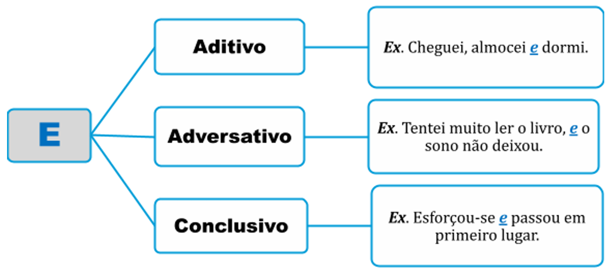
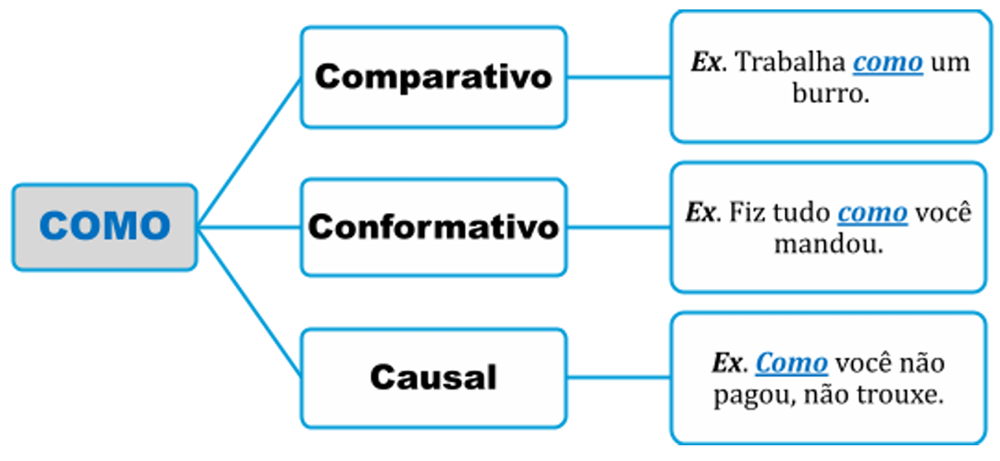
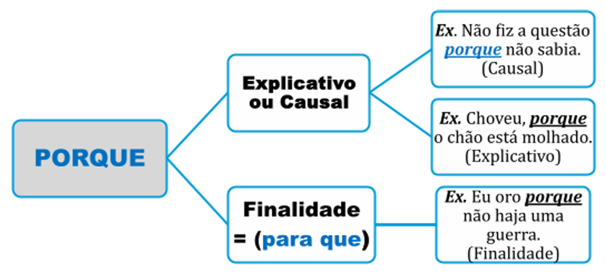
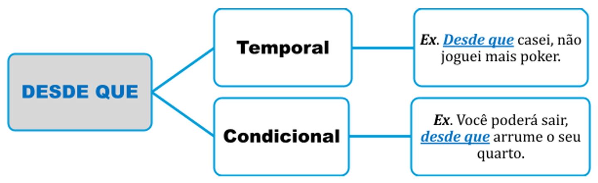
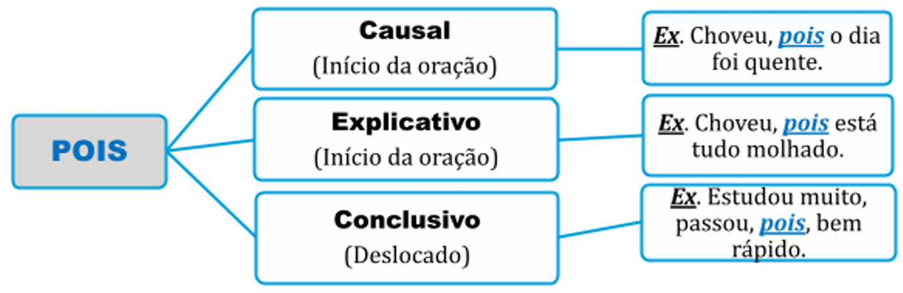

# Capítulo 5 – Classes de Palavras III: Preposições e Conjunções

Após termos estudado as classes de palavras que nomeiam (substantivos), caracterizam (adjetivos), quantificam (numerais), determinam (artigos), circunstanciam (advérbios) e se referem (pronomes), chegamos agora às classes que atuam como os principais **conectivos** da língua. A preposição e a conjunção são as ferramentas que estabelecem as ligações lógicas e gramaticais, permitindo a construção de frases complexas e articuladas.

## Preposição

A preposição é uma classe de palavra **invariável** (não se flexiona em gênero ou número) cuja função principal é **conectar dois termos**, estabelecendo entre eles uma relação de sentido e, frequentemente, de dependência. O primeiro termo (chamado de regente) é completado ou modificado pelo segundo (chamado de regido), que é introduzido pela preposição.

As preposições são fundamentais na formação de **locuções**, que são expressões com mais de uma palavra que equivalem a uma só:

- **Locução Adjetiva:** mesa **de mármore** (= marmórea)
- **Locução Adverbial:** chegou **à noite** (= tardiamente)

Além disso, a preposição pode introduzir **orações reduzidas de infinitivo**:

- **Sem estudar**, não será possível passar.

As preposições essenciais da língua são: **a, ante, após, até, com, contra, de, desde, em, entre, para, perante, por, sem, sob, sobre, trás.**

### Classificação Morfológica: Preposições Essenciais e Acidentais

Quanto à sua origem e função primária, as preposições se dividem em dois grupos:

- **Preposições Essenciais:** São palavras que atuam original e exclusivamente como preposições. É o grupo listado acima.
- **Preposições Acidentais:** São palavras de outras classes gramaticais (como conjunções, advérbios ou até verbos) que, em determinados contextos, passam a exercer o papel de uma preposição.
    - _Exemplos:_
        - Tenho **que** estudar. (O "que" funciona como a preposição "de").
        - Lutou **como** um leão. (O "como" funciona como a preposição "em", com valor de "na qualidade de").
        - **Segundo** o relatório, as metas não foram atingidas.
        - **Salvo** aquele capítulo, o livro inteiro é bom. (O termo "salvo" equivale à preposição "exceto").

> **Foco de Prova: A Regra dos Pronomes**
> 
> A distinção entre preposições essenciais e acidentais tem uma consequência direta na escolha do pronome pessoal.
> 
> - Após uma **preposição essencial**, usa-se o **pronome oblíquo tônico** (mim, ti, si).
>     - _Exemplo:_ Não há nada entre **mim** e **ti**. / Venha até **mim**.
> - Após uma **preposição acidental**, usa-se o **pronome reto** (eu, tu, ele).
>     - _Exemplo:_ Todos saíram, **exceto eu**. / **Fora tu**, ninguém mais se manifestou.

### Classificação Sintático-Semântica: Preposições Relacionais e Nocionais

Esta é uma distinção mais profunda, que analisa a **função** da preposição na frase.

- **Preposições Relacionais (ou Gramaticais):** São preposições vazias de sentido próprio, que servem apenas como um elo gramatical **obrigatório**, exigido pela **regência** de um verbo ou de um nome. Elas introduzem **complementos** (objetos indiretos e complementos nominais).
    - _Exemplos:_
        - Desconfio **de** um funcionário. (O verbo "desconfiar" exige a preposição "de").
        - Tenho medo **de** cobra. (O substantivo "medo" exige a preposição "de").
        - Estou apto **a** uma vaga. (O adjetivo "apto" exige a preposição "a").

- **Preposições Nocionais (ou Semânticas):** São preposições que não são exigidas por regência, mas que são inseridas na frase para agregar um valor semântico, uma **"noção"** específica (posse, causa, matéria, lugar, tempo, modo, etc.). Elas introduzem termos acessórios, como **adjuntos adnominais** e **adjuntos adverbiais**.
    - _Exemplos:_
        - Este é o carro **de** Ricardo. (Noção de posse).
        - Tenho um violão **de** madeira. (Noção de matéria).
        - Ele morreu **de** fome. (Noção de causa).
        - Estudo **com** afinco. (Noção de modo).

Vamos analisar um exemplo para consolidar a diferença:

> **Discordo de argumentos de direita.**

Nesta frase, temos duas ocorrências da preposição "de", cada uma com uma função distinta:

1. **de argumentos:** Esta preposição é **relacional**. Ela é uma exigência gramatical do verbo "discordar" (quem discorda, discorda **de** algo). Ela introduz o objeto indireto "de argumentos".
2. **de direita:** Esta preposição é **nocional**. Ela não é exigida pelo substantivo "argumentos", mas foi adicionada para expressar uma noção de tipo ou qualidade, formando a locução adjetiva "de direita" (que funciona como adjunto adnominal).

A capacidade de distinguir esses dois tipos de preposição é fundamental para a correta análise sintática dos termos da oração.

### Combinação e Contração: As Formas Aglutinadas da Preposição

As preposições são palavras que frequentemente se unem a outras que as seguem (artigos, pronomes, advérbios), formando uma única unidade sonora e gráfica. Esse processo de fusão pode ocorrer de duas maneiras:

- **Combinação:** Ocorre quando a preposição se une a outra palavra **sem que haja perda de fonemas**. Ambas as palavras mantêm sua integridade sonora.
- **Contração:** Ocorre quando a preposição se une a outra palavra e **há perda ou transformação de fonemas**. Este é o caso mais comum.

É crucial saber reconhecer a preposição "escondida" dentro dessas formas aglutinadas, pois isso é fundamental para a análise de regência e outras relações sintáticas.

#### Preposição "a"

| Fusão com                           | Resultado     | Tipo              | Exemplo de Uso                                |
| ----------------------------------- | ------------- | ----------------- | --------------------------------------------- |
| **Artigo o(s)**                     | **ao, aos**   | Combinação        | Fomos **ao** cinema no sábado.                |
| **Artigo a(s)**                     | **à, às**     | Contração (Crase) | Refiro-me **à** diretora da escola.           |
| **Pronome Demonstrativo aquele(s)** | **àquele(s)** | Contração (Crase) | Entreguei o relatório **àquele** funcionário. |
| **Pronome Demonstrativo aquela(s)** | **àquela(s)** | Contração (Crase) | Não dei importância **àquela** discussão.     |
| **Pronome Demonstrativo aquilo**    | **àquilo**    | Contração (Crase) | Assisti **àquilo** horrorizado.               |
| **Pronome Demonstrativo onde**      | **aonde**     | Combinação        | A cidade **aonde** vamos é linda.             |

#### Preposição "de"

| Fusão com                                                                                                | Resultado(s)                                                                                                                    | Exemplo de Uso                                                       |
| -------------------------------------------------------------------------------------------------------- | ------------------------------------------------------------------------------------------------------------------------------- | -------------------------------------------------------------------- |
| **Artigos o(s), a(s), um, uns, uma(s)**                                                                  | **do, da, dos, das dum, duma, duns, dumas**                                                                                  | O livro **do** professor está aqui. Preciso **duma** caneta nova. |
| **Pronomes Pessoais ele(s), ela(s)**                                                                     | **dele, dela, deles, delas**                                                                                                    | Esta casa é **deles**.                                               |
| **Pronomes Demonstrativos este(s), esta(s), isto, esse(s), essa(s), isso, aquele(s), aquela(s), aquilo** | **deste, desta, destes, destas, disto desse, dessa, desses, dessas, disso daquele, daquela, daqueles, daquelas, daquilo** | Lembrei-me **disso** agora. Gosto **daquele** filme.              |
| **Pronomes Indefinidos outro(s), outra(s), alguém**                                                      | **doutro, doutra, doutros, doutras dalguém (raro)**                                                                          | Ele falava **doutros** assuntos.                                     |
| **Advérbios aqui, aí, ali, acolá, além**                                                                 | **daqui, daí, dali, dacolá, dalém**                                                                                             | Saia **daqui** imediatamente!                                        |

#### Preposição "em"

| Fusão com                                                                                                | Resultado(s)                                                                                                                            | Exemplo de Uso                                                  |
| -------------------------------------------------------------------------------------------------------- | --------------------------------------------------------------------------------------------------------------------------------------- | --------------------------------------------------------------- |
| **Artigos o(s), a(s), um, uns, uma(s)**                                                                  | **no, na, nos, nas** **num, numa, nuns, numas**                                                                                      | A chave está **na** gaveta. Moro **numa** cidade pequena.    |
| **Pronomes Pessoais ele(s), ela(s)**                                                                     | **nele, nela, neles, nelas**                                                                                                            | Confio plenamente **neles**.                                    |
| **Pronomes Demonstrativos este(s), esta(s), isto, esse(s), essa(s), isso, aquele(s), aquela(s), aquilo** | **neste, nesta, nestes, nestas, nisto** **nesse, nessa, nesses, nessas, nisso** **naquele, naquela, naqueles, naquelas, naquilo** | Pense bem **nisso** antes de decidir. Não toque **naquilo**. |

#### Preposição "por"

| Fusão com                        | Resultado(s)                 | Exemplo de Uso                     |
| -------------------------------- | ---------------------------- | ---------------------------------- |
| **Artigos Definidos o(s), a(s)** | **pelo, pela, pelos, pelas** | Passamos **pela** praça principal. |

> **Foco de Prova: Reconhecendo a Preposição Oculta**
> 
> Para a análise sintática, é indispensável "enxergar" a preposição original dentro da forma contraída. Isso permite identificar corretamente a regência de um verbo ou nome.
> 
> - Na frase "Gosto **do** seu trabalho", deve-se entender que **do = de + o**. Assim, fica claro que o verbo "gostar" rege a preposição "de".
> - Na frase "Confio **nela**", deve-se entender que **nela = em + ela**. Fica claro que o verbo "confiar" rege a preposição "em".

### Valor Semântico das Preposições (Preposições Nocionais)

Como vimos, as preposições nocionais (ou semânticas) não são uma exigência gramatical da regência de um termo, mas são empregadas para adicionar um valor de sentido, uma noção ou uma circunstância à frase. A variedade de sentidos que as preposições podem expressar é vasta, e a correta identificação depende fundamentalmente do contexto.

> **Foco de Prova: Como Identificar o Valor Semântico**
> 
> A melhor maneira de identificar o sentido de uma preposição é analisar a ideia expressa pela **locução inteira que ela introduz** (preposição + termo regido). A pergunta _"Qual noção ou circunstância esta expressão adiciona à frase?"_ revelará o valor semântico da preposição naquele contexto específico. Não há necessidade de decorar listas; a chave é a análise da relação de sentido.

A seguir, uma tabela com as principais relações semânticas cobradas em provas, com diversos exemplos.

| Relação de Sentido (Valor Nocional) | Exemplos                                                                                                                |
| ----------------------------------- | ----------------------------------------------------------------------------------------------------------------------- |
| **Assunto**                         | Não gosto de falar **sobre** política. / A palestra foi **acerca do** novo acordo.                                      |
| **Causa**                           | Ele tremia **de** frio. / Fiquei chocado **com** a novidade. / O show foi cancelado **por** causa da chuva.             |
| **Companhia**                       | Fui ao cinema **com** minha namorada. / Viajou **com** os amigos.                                                       |
| **Conformidade / Opinião**          | **Para** Freud, o sonho é a realização de um desejo. / **Segundo** o edital, a prova terá 4 horas.                      |
| **Direção / Destino**               | Vou **para** Lisboa no próximo ano. (Ideia de permanência). Vou **a** Lisboa no próximo ano. (Ideia de ida e volta). |
| **Finalidade / Objetivo**           | Estudo muito **para** passar no concurso. / Ele se esforçou **a fim de** conseguir a promoção.                          |
| **Instrumento**                     | Escrevi o bilhete **a** lápis. / Feriu-se **com** a faca. / Resolvi a questão **com** um macete.                        |
| **Lugar**                           | Moro **em** São Paulo. / O livro está **sobre** a mesa. / O avião passou **por** cima da cidade.                        |
| **Matéria**                         | O anel era **de** ouro. / Comprei um violão **de** mogno.                                                               |
| **Meio**                            | Vivo **de** aluguéis. / Viajamos **de** avião. / Comuniquei-me com ele **por** telefone.                                |
| **Modo**                            | Agiu **com** cautela. / Estudo **com** gana. / Saiu **às** pressas.                                                     |
| **Oposição**                        | O time jogou **contra** o seu maior rival. / Sou **contra** o populismo.                                                |
| **Origem / Procedência**            | Sou **de** Campinas. / Este vinho veio **de** Portugal.                                                                 |
| **Posse**                           | Este é o carro **de** Ricardo. / Devolva-me o livro **do** aluno.                                                       |
| **Tempo**                           | O prazo **para** a entrega é de 30 dias. / Chegarei **em** cinco minutos. / Viajo **durante** as férias.                |

#### Uma Observação sobre "Ante" e "Perante"

As preposições **ante** e **perante** já expressam uma noção de lugar ("diante de", "na presença de"). Por essa razão, a norma padrão não admite o uso da preposição "a" após elas.

- _Incorreto:_ Ele se apresentou ante ao juiz.
- _Correto:_ Ele se apresentou **ante** o juiz.
- _Correto:_ Ele se apresentou **perante** o juiz.

### As Locuções Prepositivas e Outras Estruturas

As **locuções prepositivas** são conjuntos de duas ou mais palavras que, juntas, possuem o valor de uma única preposição. Elas servem para estabelecer as mesmas relações de sentido que as preposições essenciais (lugar, causa, finalidade, etc.).

A estrutura mais comum de uma locução prepositiva é `advérbio + preposição` ou `substantivo + preposição`. A característica fundamental é que elas sempre terminam com uma preposição.

- _Exemplo:_ Falei **sobre** o tema. (Preposição)
- _Exemplo:_ Falei **acerca do** tema. (Locução Prepositiva)

A tabela a seguir apresenta algumas das locuções mais comuns e suas preposições ou ideias equivalentes:

|Locução Prepositiva|Preposição / Ideia Equivalente|Valor Semântico|
|---|---|---|
|**a fim de**|para|Finalidade|
|**acerca de**|sobre|Assunto|
|**a respeito de**|sobre|Assunto|
|**abaixo de**|sob|Lugar (posição inferior)|
|**de acordo com**|conforme, segundo|Conformidade|
|**de encontro a**|contra|Oposição, choque|
|**ao encontro de**|a favor de|Concordância, aproximação|
|**embaixo de**|sob|Lugar (posição inferior)|
|**em vez de**|—|Substituição|
|**em virtude de**|por, com|Causa|
|**por meio de**|por, com|Meio, instrumento|

#### Foco de Prova: Nuances de Uso

**A Questão de "Através de":**

A gramática normativa mais rigorosa preconiza que a locução através de seja usada apenas com seu sentido literal de "atravessar", "passar por dentro de".

- _Uso Prescritivo:_ A luz entrava **através da** janela. / Olhava o movimento **através do** vidro.

No entanto, o uso de "através de" com o sentido de "por meio de" ou "por intermédio de" é extremamente difundido e consagrado pelo uso, inclusive em textos formais.

- _Uso Consagrado:_ Conseguiu a promoção **através de** muito esforço.

Em provas, é importante ter atenção ao comando da questão. Se a banca pedir uma análise segundo a norma prescritiva, o uso com sentido de "meio" pode ser considerado inadequado.

**Substituição por Locuções Conjuntivas:**

É comum que questões de reescrita peçam para substituir uma locução prepositiva por uma locução conjuntiva de mesmo valor semântico. Essa troca exige uma adaptação na estrutura da frase: a locução prepositiva é seguida por um verbo no infinitivo, enquanto a locução conjuntiva exige um verbo flexionado (geralmente no subjuntivo).

- _Com Locução Prepositiva:_ Ele estudou **a fim de passar** no concurso.
- _Com Locução Conjuntiva:_ Ele estudou **a fim de que passasse** no concurso.

#### A Preposição Expletiva "de"

Em algumas construções, a preposição "de" pode ser usada de forma **expletiva** (ou pleonástica). Isso significa que ela não é uma exigência da regência de nenhum termo, sendo utilizada apenas para dar ênfase ou ritmo à frase. Sua principal característica é que ela **pode ser retirada sem prejuízo gramatical** ou alteração relevante de sentido.

- **Em Estruturas Comparativas:**
    - _Exemplo:_ Ele tem mais dinheiro **(do) que** juízo.

- **Com Apostos Especificativos (Nomes de Lugares):**
    - _Exemplo:_ A cidade **(de)** São Paulo é imensa. / O bairro **(das)** Laranjeiras é charmoso.

- **Em Orações Subordinadas Predicativas:**
    - _Exemplo:_ A minha impressão era **(de)** que ninguém se importava.

- **Com o verbo "chamar" (e sinônimos) + Predicativo do Objeto:**
    - _Exemplo:_ O chefe chamou o funcionário **(de)** incompetente.

- **Em Expressões de Realce:**
    - _Exemplo:_ Aquele tolo **(do)** rapaz estragou tudo!

## Conjunção

A conjunção é uma classe de palavra **invariável** que atua como um dos principais articuladores lógicos da língua. Sua função é conectar termos de mesma função dentro de uma oração ou, mais comumente, ligar duas ou mais orações, estabelecendo entre elas uma relação de sentido precisa. Por essa característica, as conjunções são também conhecidas por outros nomes, como **síndetos**, **conectivos** ou **operadores argumentativos**. O domínio de seu uso e de seu valor semântico é fundamental para a coesão e a coerência textual.

### Coordenação vs. Subordinação

A distinção mais fundamental entre as conjunções reside no tipo de relação que elas estabelecem entre as orações que conectam.

- **Relação de Coordenação:** Ocorre quando a conjunção liga orações ou termos que são **sintaticamente independentes**. Cada oração possui sua própria estrutura e sentido completo, podendo existir de forma autônoma. A conjunção apenas as une, adicionando um nexo lógico.
    - _Exemplos:_
        - Cães **e** gatos são animais domésticos. (Liga dois termos de mesma função).
        - [Acordei cedo] **e** [fui correr na praia]. (Liga duas orações independentes).
        - [O carro é bonito], **mas** [custa caro]. (Liga duas orações independentes).

- **Relação de Subordinação:** Ocorre quando a conjunção liga uma oração **sintaticamente dependente** a uma oração principal. A oração subordinada não possui sentido completo por si só e exerce uma função sintática (de sujeito, objeto, adjunto adverbial, etc.) em relação à oração principal.
    - _Exemplos:_
        - [**Quando eu chegar**], [todas as alegrias estarão completas]. (A primeira oração indica o tempo da segunda).
        - [É necessário] [**que haja mais compreensão**]. (A segunda oração funciona como sujeito da primeira).
        - João, [**que é filho único**], vive solitário. (A segunda oração funciona como um adjetivo para "João").

### As Conjunções Coordenativas

As conjunções coordenativas ligam orações independentes (coordenadas), estabelecendo entre elas cinco possíveis relações de sentido: adição, oposição, alternância, conclusão e explicação.

Antes de analisá-las, é importante conhecer dois conceitos:

- **Locuções Conjuntivas:** São conjuntos de duas ou mais palavras que, juntas, equivalem a uma conjunção. Por exemplo, a locução `no entanto` equivale à conjunção `mas`; a locução `visto que` equivale a `porque`.
- **Pares Correlatos:** Algumas conjunções atuam em pares para correlacionar ideias, como `ou... ou` e `não só... mas também`.

Para fins de análise, tanto as conjunções simples, quanto as locuções e os pares correlatos são classificados de acordo com o mesmo valor semântico.

#### Conjunções Coordenativas Aditivas

Expressam uma ideia de **adição, soma, acréscimo** ou sequência de ideias.

- **Principais:** e, nem (com sentido de "e não"), bem como, mas também, como também, mas ainda.
- **Exemplos:**
    - Ela estuda com afinco **e** trabalha nos fins de semana.
    - O candidato não entregou a redação **nem** assinou a folha de respostas.
    - Ele é um profissional competente, **bem como** uma pessoa honesta.
    - A empresa **não só** oferece bons salários, **mas também** excelentes benefícios.

> **Foco de Prova: Nuanças das Conjunções Aditivas**
> 
> - **O uso de "nem":** A conjunção `nem` já possui um valor aditivo e negativo (`= e não`). Por isso, a construção "e nem" é considerada redundante pela norma padrão.
> - **As Correlações Enfáticas:** Os pares como `não só... mas também` são usados para dar ênfase à adição, destacando o segundo elemento.
> - **O "e" com valor de sequência:** Em narrativas, a conjunção "e" pode indicar uma sequência cronológica de ações. _Exemplo: Vim, vi **e** venci._
> - **Outras Palavras com Valor Aditivo:**
>     - **Senão:** Pode ter valor aditivo quando equivale a "mas também", geralmente após "não só". _Exemplo: O projeto agradou não só ao diretor, **senão** a toda a equipe._
>     - **Tampouco:** É um advérbio que pode ser usado com valor aditivo-negativo, em substituição a "nem". _Exemplo: Não concordou com o plano, **tampouco** apresentou uma alternativa._
>     - **Ainda:** O advérbio "ainda" pode ser usado para introduzir um último elemento aditivo, com valor de "além disso". _Exemplo: Ele é inteligente, dedicado e **ainda** tem um ótimo senso de humor._

#### Conjunções Coordenativas Adversativas

As conjunções adversativas são aquelas que ligam duas orações independentes estabelecendo uma relação de **contraste, oposição, ressalva, compensação** ou **quebra de expectativa**.

- **Principais:** mas, porém, contudo, todavia, entretanto, no entanto, senão (com valor de "mas sim"), não obstante.

Embora todas expressem uma ideia de adversidade, o tipo de contraste pode variar sutilmente, a depender do contexto:

- **Oposição Direta:** As ideias apresentadas são claramente antagônicas.
    - _Exemplo:_ Ele é um homem bom, **mas** cometeu um ato mau.

- **Compensação:** A segunda ideia compensa ou equilibra a primeira.
    - _Exemplo:_ O carro não é o mais bonito, **porém** é muito econômico.
    - _Exemplo:_ Falou pouco, **mas** falou bonito.

- **Quebra de Expectativa:** A segunda oração contraria a consequência lógica que se esperava da primeira.
    - _Exemplo:_ O professor era muito tímido, **não obstante** falava bem em público.
    - _Exemplo:_ Estudou o ano inteiro para a prova, **entretanto** não foi aprovado.

- **Retificação:** A segunda oração corrige ou refina a informação da primeira.
    - _Exemplo:_ Não tenho apenas um filho, **mas** dois.
    - _Exemplo:_ A culpa não foi da população, **senão** dos governantes. (Aqui, "senão" equivale a "mas sim").

> **Foco de Prova: O Valor Adversativo da Conjunção "E"**
> 
> Embora seja a principal conjunção aditiva, a conjunção **"e"** pode adquirir um valor adversativo, equivalendo a **"mas"**. As bancas examinadoras frequentemente exploram essa possibilidade em questões de semântica.
> 
> - _Exemplo:_ O rico tem tudo, **e** vive amargurado. (= mas vive amargurado).
> - _Exemplo:_ Estava querendo ler, **e** o sono não deixava. (= mas o sono não deixava).
> 
> A presença de uma **vírgula antes da conjunção "e"** é um forte indício deste uso adversativo, sendo recomendada pela norma padrão para marcar a quebra de expectativa.

##### A Força Argumentativa da Conjunção Adversativa

Em um texto, a escolha de uma conjunção não é neutra; ela direciona a interpretação do leitor. As conjunções adversativas são consideradas **operadores argumentativos fortes** por uma razão fundamental: em uma estrutura com uma conjunção adversativa, a informação mais relevante, a que representa a opinião final do autor, é sempre a que vem **depois** da conjunção.

- **Análise de Foco:**
    - _Frase 1:_ O candidato é esforçado, **mas** um pouco despreparado.
        - **Foco Argumentativo:** A ênfase recai na ressalva, no ponto negativo ("despreparado"). A qualidade "esforçado" é minimizada.

    - _Frase 2:_ O candidato é um pouco despreparado, **mas** esforçado.
        - **Foco Argumentativo:** A ênfase recai na qualidade ("esforçado"), que se sobrepõe ao ponto negativo. A impressão final é positiva.

Esta percepção é crucial para questões de interpretação que pedem para identificar o ponto de vista do autor.

- **Adversidade vs. Concessão:** A adversidade é semanticamente "prima" da concessão (expressa por "embora", "ainda que", etc.). Ambas indicam contraste. A diferença está no foco argumentativo. A conjunção adversativa destaca o contraste, enquanto a concessiva "rebaixa" uma ideia para dar mais força à outra.
    
    - _Adversativa:_ Ele é honesto, **mas** não concordo com suas ideias. (O foco está na discordância).
    - _Concessiva:_ **Embora** ele seja honesto, não concordo com suas ideias. (O foco principal continua sendo a discordância; a honestidade é um obstáculo que não impediu a opinião contrária).

#### Conjunções Coordenativas Alternativas

Expressam uma ideia de **alternância, escolha** ou **exclusão** entre os fatos ou conceitos apresentados nas orações.

- **Principais:** ou, ou...ou, ora...ora, quer...quer, já...já, seja...seja.

O conectivo "ou" é o mais comum, mas seu sentido pode variar, exigindo atenção ao contexto.

> **Foco de Prova: Os Múltiplos Sentidos de "Ou"**
> 
> A conjunção "ou" pode estabelecer diferentes relações, nem sempre de exclusão mútua.
> 
> - **Exclusão:** Apresenta opções em que a escolha de uma impede a realização da outra.
>     - _Exemplo:_ Estude para o concurso **ou** desista de uma vez.
> - **Inclusão / Adição:** Pode conectar termos que não se excluem, mas que se somam, tendo um efeito semelhante ao da conjunção "e".
>     - _Exemplo:_ Fritura **ou** açúcar em excesso fazem mal à saúde. (Ambos fazem mal; o verbo no plural confirma a soma dos sujeitos).
> - **Retificação ou Equivalência:** Usado para apresentar um sinônimo ou um nome alternativo.
>     - _Exemplo:_ Edson Arantes do Nascimento, **ou** Pelé, é considerado o Rei do Futebol.
> - **Alternância:** Os pares correlatos como `ora...ora` ou `quer...quer` enfatizam a alternância de estados ou a indiferença entre as opções.
>     - _Exemplo:_ **Ora** estava motivado, **ora** pensava em desistir.
>     - _Exemplo:_ **Seja** por bem, **seja** por mal, vou convencê-lo.

A palavra **senão** também pode adquirir um valor alternativo, geralmente com sentido de "do contrário" ou "ou então".

- _Exemplo:_ Saia em silêncio, **senão** acordará o bebê.

#### Conjunções Coordenativas Conclusivas

Expressam uma ideia de **conclusão, consequência** ou **dedução lógica** a partir da oração anterior.

- **Principais:** logo, portanto, por isso, assim, então, por conseguinte, pois (posposto ao verbo), destarte.
- **Exemplos:**
    - O edital foi publicado, **portanto** devemos intensificar os estudos.
    - Penso, **logo** existo.
    - O time jogou mal, **assim**, não mereceu a vitória.

> **Foco de Prova: A Posição e a Pontuação do "Pois" Conclusivo**
> 
> A conjunção **pois** tem seu valor semântico definido por sua posição na frase.
> 
> - **Para ter valor conclusivo:** O `pois` deve vir **após o verbo** (posposto) e, por ser um termo deslocado, deve estar **isolado por vírgulas**.
>     - _Exemplo:_ Estava despreparado; não foi, **pois**, aprovado.
>     - _Exemplo:_ A instabilidade econômica persiste; o dólar voltará, **pois**, a subir.

#### Conjunções Coordenativas Explicativas

Expressam uma ideia de **explicação, justificativa** ou **motivo** em relação ao que foi enunciado na oração anterior.

- **Principais:** que, porque, pois (anteposto ao verbo), porquanto.

Uma característica marcante das orações explicativas é que elas frequentemente sucedem uma oração com o verbo no modo **imperativo** (uma ordem, um pedido, um conselho).

- **Exemplos:**
    - Fujam, **porque** a bruxa está à solta!
    - Fique em silêncio, **pois** o filme já começou.
    - Economize recursos, **porquanto** o futuro é incerto.
    - Vem, vamos embora, **que** esperar não é saber.

A diferença entre o **pois explicativo** e o **pois conclusivo** é, portanto, posicional:

- **Pois explicativo:** Inicia a oração, antes do verbo. _Ex: Volte, **pois** sinto sua falta._
- **Pois conclusivo:** Vem após o verbo, entre vírgulas. _Ex: Sinto sua falta; voltarei, **pois**, imediatamente._

### As Conjunções Subordinativas

Diferentemente das coordenativas, que ligam elementos independentes, as conjunções subordinativas conectam duas orações que possuem uma relação de **dependência sintática**. A oração iniciada pela conjunção é chamada de **oração subordinada**, e ela exerce uma função sintática (de sujeito, objeto, adjunto adverbial, etc.) em relação à outra, que é chamada de **oração principal**.

O domínio desta matéria é fundamental, pois é a base para a correta análise e pontuação do período composto. As conjunções subordinativas se dividem em dois grandes grupos: as **integrantes** e as **adverbiais**.

#### Conjunções Integrantes

As conjunções integrantes recebem este nome porque iniciam uma oração que **integra** ou **completa** o sentido da oração principal, que, sem ela, estaria sintaticamente incompleta. Elas introduzem as chamadas **orações subordinadas substantivas**.

As conjunções integrantes não possuem valor semântico próprio; funcionam apenas como um conectivo gramatical. São apenas duas:

- **QUE** (a mais comum)
- **SE** (quando introduz uma dúvida ou incerteza)

> **Foco de Prova: O Teste da Substituição por "ISTO"**
> 
> A maneira mais eficaz de identificar se "que" ou "se" são conjunções integrantes é tentar substituir toda a oração que elas iniciam pela palavra **ISTO** (ou suas variações, como "disso", "nisso"). Se a substituição for possível e mantiver a lógica da frase, trata-se de uma conjunção integrante.
> 
> - _Exemplo:_ Só quero **que você me aqueça nesse inverno**.
> - _Teste:_ Só quero **ISTO**. (A substituição funciona perfeitamente).

##### As Orações Substantivas: Uma Visão Geral

As orações subordinadas substantivas, como o nome indica, exercem as funções sintáticas típicas de um substantivo (sujeito, objeto direto, objeto indireto, etc.). Embora a análise detalhada de cada uma seja matéria de Sintaxe, reconhecer suas estruturas ajuda a identificar a conjunção integrante.

|Tipo de Oração Substantiva|Função Sintática|Exemplo|
|---|---|---|
|**Subjetiva**|**Sujeito** da oração principal.|**É necessário que você estude.** (Isto é necessário).|
|**Objetiva Direta**|**Objeto Direto** do verbo da oração principal.|Quero **que você estude.** (Quero isto).   Eles não sabiam **se haveria aula.**|
|**Objetiva Indireta**|**Objeto Indireto** do verbo da oração principal (iniciada por preposição).|O candidato necessita **de que todos o apoiem.** (Necessita disto).|
|**Completiva Nominal**|**Complemento Nominal** de um nome da oração principal (iniciada por preposição).|Tenho esperança **de que vamos vencer.** (Tenho esperança disto).|
|**Predicativa**|**Predicativo do Sujeito** da oração principal (geralmente após o verbo "ser").|O bom é **que a prova foi adiada.** (O bom é isto).|
|**Apositiva**|**Aposto** de um termo da oração principal (geralmente após dois-pontos).|João só queria uma coisa: **que fosse aprovado logo.**|

##### Distinção Importante: Conjunção vs. Preposição Acidental

É preciso ter cuidado para não confundir a conjunção integrante "que" com a preposição acidental "que" em locuções verbais que indicam obrigação ou necessidade.

- **Estrutura:** `verbo ter/haver + que/de + infinitivo`
- **Exemplos:**
    - Tenho **que** estudar mais. (= Tenho **de** estudar mais).
    - Hei **de** passar neste concurso.

Nesses casos, "que" e "de" são considerados **preposições acidentais**, e não conjunções integrantes, pois a estrutura não pode ser substituída por "isto" (_"Tenho isto"_ não recupera o sentido original).

#### Conjunções Adverbiais

As conjunções adverbiais são aquelas que introduzem as **orações subordinadas adverbiais**. A oração iniciada por elas funciona como um grande **adjunto adverbial** da oração principal, acrescentando-lhe uma noção de circunstância.

- **Exemplo de Análise:** Visitei meus parentes maternos **quando viajei para Natal**.
    - **Oração Principal:** Visitei meus parentes maternos
    - **Oração Subordinada Adverbial:** quando viajei para Natal
    - **Conjunção:** quando
    - **Análise:** A segunda oração inteira informa **quando** a visita ocorreu, funcionando como um adjunto adverbial de tempo para o verbo "visitei". Ela equivale a um simples advérbio: _Visitei meus parentes maternos **naquela ocasião**._

Existem nove tipos principais de conjunções adverbiais, classificados de acordo com a circunstância que expressam: **Causais, Comparativas, Concessivas, Condicionais, Conformativas, Consecutivas, Finais, Proporcionais e Temporais.**

Vamos analisar cada um deles.

##### Conjunções Condicionais

Expressam a **condição** ou a **hipótese** necessária para que o fato da oração principal se realize (ou não). As orações introduzidas por elas geralmente apresentam o verbo no **modo subjuntivo**, que é o modo da incerteza e da hipótese.

- **Principais:** se, caso, contanto que, desde que, a menos que, a não ser que, sem que (= se não).
- **Exemplos:**
    - **Se** chover, o jogo será cancelado.
    - Ajudarei com o trabalho, **contanto que** todos colaborem.
    - O evento ocorrerá, **a não ser que** haja um imprevisto de última hora.
    - Não se consegue a aprovação **sem que** haja muito esforço e disciplina.

> **Foco de Prova: A Troca entre "Se" e "Caso"**
> 
> As bancas examinadoras frequentemente pedem para substituir "se" por "caso" (ou vice-versa). Essa troca exige uma **alteração obrigatória no tempo verbal** para que a correção gramatical seja mantida.
> 
> |Conjunção|Tempo Verbal Exigido|Exemplo|
> |---|---|---|
> |**Se**|**Futuro do Subjuntivo**|**Se** eu **puder**, viajarei. / **Se** eles **fizerem** silêncio...|
> |**Caso**|**Presente do Subjuntivo**|**Caso** eu **possa**, viajarei. / **Caso** eles **façam** silêncio...|

##### Conjunções Conformativas

Expressam a ideia de **conformidade, acordo** ou **segundo** o que foi declarado em outra fonte ou na oração principal.

- **Principais:** conforme, como (com sentido de conforme), segundo, consoante.
- **Exemplos:**
    - Tudo ocorreu **conforme** havíamos planejado.
    - **Segundo** informou o meteorologista, haverá chuva no fim de semana.
    - O relatório foi elaborado **consoante** as normas da empresa.
    - Ele agiu **como** o pai lhe ensinara.

###### Distinção Importante: Conjunção Conformativa vs. Preposição Acidental

Quando palavras como `conforme`, `segundo` e `consoante` introduzem uma oração (ou seja, uma estrutura **com verbo**), elas são classificadas como conjunções. No entanto, se introduzem um sintagma nominal (uma estrutura **sem verbo**), elas funcionam como **preposições acidentais**.

- **Conjunção:** O projeto foi executado **conforme** a equipe **planejou**.
- **Preposição Acidental:** O projeto foi executado **conforme** o planejamento da equipe.

##### Conjunções Finais

Expressam a **finalidade, o propósito** ou **o objetivo** da ação declarada na oração principal. A oração introduzida por elas responde à pergunta "para quê?".

- **Principais:** para que, a fim de que, que, porque (com valor de "para que").
- **Exemplos:**
    - Estude com afinco **a fim de que** você alcance seus objetivos.
    - Dou muitos exemplos **para que** o conteúdo fique claro.
    - O palestrante fez um sinal **que** todos se calassem. (Equivale a "para que todos se calassem").
    - "É preciso rezar **porque** não estoure uma nova guerra mundial.” (Equivale a "para que não estoure").

##### Conjunções Proporcionais

Expressam uma ideia de **proporcionalidade**, indicando que um fato ocorre ou se desenvolve de forma simultânea e proporcional (direta ou inversamente) ao fato expresso na oração principal.

- **Principais:** à medida que, à proporção que, ao passo que, e as correlações `quanto mais... (mais/menos)` e `quanto menos... (mais/menos)`.
- **Exemplos:**
    - **À medida que** o tempo passa, a confiança aumenta.
    - **Ao passo que** o produto escasseia no mercado, seu preço sobe.
    - **Quanto mais** estudo, mais sorte pareço ter nas provas.
    - **Quanto menos** me preocupo, mais as coisas dão certo.

##### Conjunções Temporais

Expressam uma circunstância de **tempo**, situando o fato da oração principal em um momento específico. A relação temporal pode ser de simultaneidade, anterioridade ou posterioridade.

- **Principais:** quando, enquanto, desde que, sempre que, toda vez que, assim que, logo que, mal (com sentido de "assim que"), depois que, antes que.
- **Exemplos:**
    - **Mal** cheguei ao trabalho, fui bombardeado de perguntas. (Indica tempo imediato).
    - **Assim que** o edital for publicado, iniciarei os estudos.
    - Comprei roupas **enquanto** ela escolhia sapatos. (Indica tempo simultâneo).
    - Ele mudou muito **depois que** se casou. (Indica tempo posterior).

> **Observação Gramatical:**
> 
> Alguns gramáticos, como Sacconi, apontam um uso específico da conjunção "quando" com valor de causa, especialmente em contextos argumentativos. Isso ocorre quando ela pode ser substituída por "já que".
> 
> - _Exemplo:_ “Por que ficar amontoado na cidade, sob a poluição, **quando** existe um mundo de terra fértil no campo para se trabalhar?” (Equivale a: **já que** existe...).

##### Conjunções Comparativas

Expressam uma **comparação** entre os fatos ou seres mencionados na oração principal e na subordinada.

- **Principais:** como, assim como, tal qual, tal como, (mais/menos/maior/menor...) do que, (tão) quanto.
- **Exemplos:**
    - Essa matéria é **mais** fácil **do que** a que estudamos ontem.
    - Ele é **tão** esforçado **quanto** seu irmão.
    - A criança corria pela casa **como** um foguete.

É muito comum que, nas orações comparativas, o verbo da oração subordinada esteja elíptico (oculto), pois é o mesmo da oração principal.

- **Exemplo:** Ele estuda **tanto quanto** seu tio médico (estuda).
- **Exemplo:** Ela é inteligente **como** a mãe (é).

##### Conjunções Causais

Expressam a **causa, o motivo** ou **a razão** do fato enunciado na oração principal. A oração introduzida por uma conjunção causal contém o evento que, cronologicamente, antecede e provoca o acontecimento da oração principal.

- **Principais:** porque, que, como (sempre no início da frase), pois que, já que, uma vez que, visto que, na medida em que, porquanto.
- **Exemplos:**
    - Não fomos à praia **porque** estava chovendo.
    - **Como** o tempo estava instável, a viagem foi cancelada.
    - Ele foi aprovado, **uma vez que** estudou com muita dedicação.
    - **Visto que** todos concordaram, a proposta foi aceita.

###### Reescrita com Preposição Causal

É muito comum em provas a solicitação para reescrever uma oração causal, substituindo a conjunção por uma preposição de mesmo valor semântico (como "por"). Essa alteração exige uma mudança na forma verbal, que geralmente vai para o infinitivo.

- **Com Conjunção:** Não fiz a questão **porque não sabia** o conteúdo.
- **Com Preposição:** Não fiz a questão **por não saber** o conteúdo.

> **Foco de Prova: Causa vs. Consequência vs. Explicação**
> 
> A relação de causa e efeito é um pilar da argumentação e da interpretação de textos. É fundamental não confundir a **causa** (a origem do fato) com a **consequência** (o resultado do fato) e a **explicação** (a justificativa para uma afirmação).
> 
> |Relação Lógica|Exemplo|Análise da Relação|
> |---|---|---|
> |**CAUSA**|A grama cresceu **porque choveu muito**.|A chuva (causa, fato anterior) provocou o crescimento da grama (efeito).|
> |**CONSEQUÊNCIA**|Choveu tanto **que a grama cresceu**.|O crescimento da grama (consequência) foi o resultado da intensidade da chuva.|
> |**EXPLICAÇÃO**|Choveu, **porque a grama está molhada**.|A grama molhada (evidência) é a justificativa para a _afirmação_ de que choveu, não a sua causa. A vírgula antes da conjunção é um forte indício da relação explicativa.|
> 
> **Conselho para a Prova:**
> 
> A distinção entre **causa** e **explicação** é, por vezes, muito sutil, e grandes gramáticos admitem que "não possui limites claros". Em geral, não é preciso se preocupar com essa diferenciação, tratando ambas como uma "justificativa". Contudo, se uma questão apresentar "causa" em uma alternativa e "explicação" em outra, aplique o critério: a **causa** é a origem de um **fato**; a **explicação** é o fundamento para uma **afirmação, ordem ou suposição**.

##### Conjunções Consecutivas

Expressam a **consequência** ou o **resultado** de um fato que foi intensificado na oração principal. A oração introduzida por elas geralmente vem precedida de um termo de intensidade na oração principal, como _tão, tal, tanto, tamanho_.

- **Principais:** que (precedido por um intensificador), de modo que, de sorte que, de forma que, de maneira que.
- **Exemplos:**
    - Ele estudou **tanto que** ficou exausto.
    - A ventania foi **tão** forte **que** derrubou a árvore.
    - Fez **tamanho** escândalo na festa **que** foi expulsa do local.
    - O palestrante explicou o conteúdo com clareza, **de modo que** não restaram dúvidas.
    - O silêncio era profundo, **que** se podia ouvir o zumbido de um mosquito. (Aqui, a intensidade está implícita).

###### A Relação Causa-Efeito: Consecutivas vs. Causais

Como vimos, a causa é o evento que ocorre _antes_ e provoca o outro. A consequência é o evento que ocorre _depois_, como resultado. A conjunção recebe a classificação de acordo com a oração que ela introduz.

- **Conjunção Causal:** Inicia a oração que contém a **causa**.
    - _Exemplo:_ O rio transbordou **porque choveu muito**. (A chuva é a causa).

- **Conjunção Consecutiva:** Inicia a oração que contém a **consequência**.
    - _Exemplo:_ Choveu tanto **que o rio transbordou**. (A transbordamento é a consequência).

É importante notar que a relação de causa e efeito pode existir no texto mesmo sem a presença de um conectivo explícito. A capacidade de identificar essa decorrência lógica é uma habilidade fundamental de interpretação.

##### Conjunções Concessivas

Expressam uma ideia de **concessão**, ou seja, admitem um fato que é contrário à ação da oração principal, mas que **não é capaz de impedi-la**. A concessão estabelece uma quebra de expectativa. A oração concessiva apresenta um obstáculo que, logicamente, deveria impedir a ação principal, mas não impede.

- **Principais:** embora, ainda que, mesmo que, apesar de que, conquanto, por mais que, posto que, se bem que, não obstante.
- **Exemplos:**
    - **Embora** estivesse doente, ele foi trabalhar. (A doença deveria impedi-lo de ir, mas não impediu).
    - **Mesmo que** chova, o show acontecerá.
    - **Posto que** estivessem em menor número, os soldados venceram a batalha.
    - Ele conseguiu a vaga, **conquanto** não fosse o mais preparado.

> **Foco de Prova: Concessão e o Modo Subjuntivo**
> 
> Uma característica gramatical fundamental das orações concessivas é que elas exigem que o verbo seja conjugado no **Modo Subjuntivo**, o modo da hipótese.
> 
> - **Embora fosse** gago...
> - **Ainda que eu falasse**...
> - **Conquanto não tivesse** gostado...
> 
> Fique atento a isso em questões de reescrita. Ao substituir uma conjunção concessiva por uma adversativa (que usa o verbo no indicativo), é necessário fazer o ajuste verbal.

###### Outras Estruturas Concessivas

- A locução prepositiva **apesar de** também tem valor concessivo e é frequentemente usada em provas para reescrita.
    - **Apesar de estar** doente, ele foi trabalhar.

- **Posto que:** É sinônimo de "embora" e tem valor **concessivo**. É um erro comum, especialmente na linguagem jurídica, usá-lo com valor de causa ("visto que"). Para a norma padrão, **posto que = embora**.

###### A Diferença Argumentativa: Concessão vs. Adversidade

Ambas as estruturas expressam contraste, mas o foco argumentativo é diferente.

- **Conjunção Adversativa (mas):** A informação mais importante é a que vem **depois** da conjunção.
    - _Exemplo:_ O réu agiu em legítima defesa, **mas matou** uma pessoa. (O foco está no fato de ter matado).

- **Conjunção Concessiva (embora):** A informação mais importante é a da **oração principal**. A oração concessiva apresenta um argumento secundário, que é "rebaixado".
    - _Exemplo:_ **Embora** tenha agido em legítima defesa, o réu **matou** uma pessoa. (O foco continua sendo o fato de ter matado).

Essa distinção é crucial para entender a intenção do autor e a hierarquia das ideias em um texto.

### Conjunções Polissêmicas (Múltiplos Sentidos)

Como vimos ao longo deste capítulo, o valor semântico de um conectivo é a chave para a correta interpretação do texto. Algumas conjunções são especialmente versáteis e podem expressar diferentes relações lógicas, dependendo do contexto. O conhecimento dessas nuances é fundamental para resolver questões de semântica e reescrita. Vamos sistematizar os casos mais importantes.

#### Conjunção "E"

Embora sua função primária seja aditiva, a conjunção "e" pode assumir outros valores, como oposição e conclusão.

- **Valor Aditivo:** É seu uso mais comum, indicando soma ou sequência.
    - _Exemplo:_ Ele levantou, tomou café **e** saiu para trabalhar.

- **Valor Adversativo:** Ocorre quando o "e" conecta ideias opostas, equivalendo a "mas". A vírgula antes do "e" é um forte indício desse valor.
    - _Exemplo:_ O candidato estudou muito para a prova, **e** não foi aprovado.

- **Valor Conclusivo:** Ocorre quando a segunda oração é uma consequência natural da primeira.
    - _Exemplo:_ O time treinou com dedicação **e** conquistou o campeonato.

#### Conjunção "Como"

A palavra "como" pode introduzir três tipos distintos de orações adverbiais.

- **Valor Comparativo:** Estabelece uma comparação.
    - _Exemplo:_ Ele é forte **como** um touro.

- **Valor Conformativo:** Indica que algo foi feito "conforme" ou "segundo" o que foi declarado.
    - _Exemplo:_ O relatório foi redigido **como** o diretor havia solicitado.

- **Valor Causal:** Indica a causa de um evento, equivalendo a "porque" ou "visto que". Este uso ocorre sempre no **início do período**.
    - _Exemplo:_ **Como** estava chovendo, decidimos não ir à praia.

#### Conjunção "Porque"

A conjunção "porque" é primariamente causal ou explicativa, mas também pode ter valor de finalidade.

- **Valor Causal / Explicativo:** Indica o motivo ou a justificativa de um fato.
    - _Exemplo:_ Não viajei **porque** perdi o voo.

- **Valor de Finalidade:** É um uso menos comum, no qual equivale a "para que".
    - _Exemplo:_ Fiz um sinal **porque** ele parasse.

#### Locução Conjuntiva "Desde que"

Esta locução pode expressar tanto tempo quanto condição. A distinção é feita pelo tempo verbal que a acompanha.

- **Valor Temporal:** Indica o ponto de partida de uma ação. O verbo geralmente vai para o **modo indicativo**.
    - _Exemplo:_ **Desde que** ele se mudou, a vida no prédio ficou mais silenciosa.

- **Valor Condicional:** Estabelece uma condição, equivalendo a "contanto que" ou "caso". O verbo vai para o **modo subjuntivo**.
    - _Exemplo:_ Emprestarei o carro, **desde que** você o devolva com o tanque cheio.

#### Conjunção "Pois"

A posição da conjunção "pois" na frase é o que define seu valor semântico.

- **Valor Causal / Explicativo:** Quando aparece no **início da segunda oração**, antes do verbo.
    - _Exemplo:_ Volte para casa, **pois** está ficando tarde.

- **Valor Conclusivo:** Quando aparece **deslocada** na segunda oração (após o verbo), ficando entre vírgulas.
    - _Exemplo:_ O time treinou intensamente; será, **pois**, o campeão.

#### Outras Distinções Importantes

- **na medida em que** vs. **à medida que**: A primeira é **causal** (= porque); a segunda é **proporcional**. Formas como "na medida que" ou "à medida em que" são consideradas inadequadas.
- **porquanto** vs. **conquanto**: `porquanto` é **causal/explicativo** (= porque); `conquanto` é **concessivo** (= embora).
- **quando** com valor condicional: A conjunção temporal "quando" pode, em certos contextos, adquirir valor condicional, equivalendo a "se".
    - _Exemplo:_ O país só se desenvolverá **quando** (= se) investir em educação.

## Considerações Finais

Neste capítulo, aprofundamos o estudo das classes de palavras responsáveis por tecer as conexões lógicas e gramaticais do discurso: a **Preposição** e a **Conjunção**. Exploramos estas duas classes de conectivos em suas múltiplas facetas, indo muito além de uma simples memorização de listas.

Analisamos a Preposição em sua classificação morfológica (**essenciais e acidentais**), em sua função sintático-semântica como um elo **relacional** (exigido por regência) ou **nocional** (portadora de sentido), em suas diversas formas de **contração** e na riqueza de seus **valores semânticos**. Em seguida, mergulhamos no universo das Conjunções, estabelecendo a distinção fundamental entre **Coordenação** e **Subordinação**. Detalhamos os cinco tipos de conectivos coordenativos e os nove tipos de conectivos subordinativos adverbiais, além das conjunções integrantes, finalizando com uma análise estratégica das **conjunções polissêmicas**, cujo domínio é crucial para a interpretação de textos.

O fio condutor deste capítulo foi a demonstração de que a clareza e a precisão de um texto não dependem apenas da escolha correta das palavras, mas, fundamentalmente, da **correta articulação entre elas**. Tanto as preposições quanto as conjunções são os pilares da coesão e da coerência. Elas definem as relações de dependência, hierarquia e lógica, transformando frases simples em períodos complexos e argumentativamente sofisticados. Compreender o valor de um "mas" em oposição a um "embora", ou a função de um "de" nocional em oposição a um "de" relacional, é o que permite ao leitor decifrar a verdadeira intenção do autor.

O domínio dos conectivos estudados aqui é a porta de entrada para o tópico mais importante da Sintaxe: a **Análise do Período Composto**. Saber identificar uma conjunção e seu valor é o pré-requisito para classificar orações coordenadas e subordinadas, uma habilidade testada exaustivamente em todas as provas de concurso. Com este capítulo, estamos equipados com as ferramentas necessárias para analisar a estrutura lógica do texto em seu nível mais elaborado.

Neste capítulo, aprofundamos o estudo das classes de palavras responsáveis por tecer as conexões lógicas e gramaticais do discurso: a **Preposição** e a **Conjunção**. Exploramos estas duas classes de conectivos em suas múltiplas facetas, indo muito além de uma simples memorização de listas.

Analisamos a Preposição em sua classificação morfológica (**essenciais e acidentais**), em sua função sintático-semântica como um elo **relacional** (exigido por regência) ou **nocional** (portadora de sentido), em suas diversas formas de **contração** e na riqueza de seus **valores semânticos**. Em seguida, mergulhamos no universo das Conjunções, estabelecendo a distinção fundamental entre **Coordenação** e **Subordinação**. Detalhamos os cinco tipos de conectivos coordenativos e os nove tipos de conectivos subordinativos adverbiais, além das conjunções integrantes, finalizando com uma análise estratégica das **conjunções polissêmicas**, cujo domínio é crucial para a interpretação de textos.

O fio condutor deste capítulo foi a demonstração de que a clareza e a precisão de um texto não dependem apenas da escolha correta das palavras, mas, fundamentalmente, da **correta articulação entre elas**. Tanto as preposições quanto as conjunções são os pilares da coesão e da coerência. Elas definem as relações de dependência, hierarquia e lógica, transformando frases simples em períodos complexos e argumentativamente sofisticados. Compreender o valor de um "mas" em oposição a um "embora", ou a função de um "de" nocional em oposição a um "de" relacional, é o que permite ao leitor decifrar a verdadeira intenção do autor.

O domínio dos conectivos estudados aqui é a porta de entrada para o tópico mais importante da Sintaxe: a **Análise do Período Composto**. Saber identificar uma conjunção e seu valor é o pré-requisito para classificar orações coordenadas e subordinadas, uma habilidade testada exaustivamente em todas as provas de concurso. Com este capítulo, estamos equipados com as ferramentas necessárias para analisar a estrutura lógica do texto em seu nível mais elaborado.