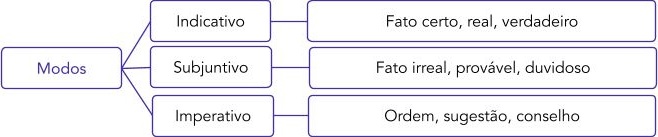
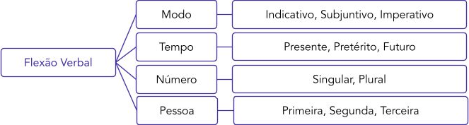
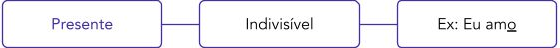
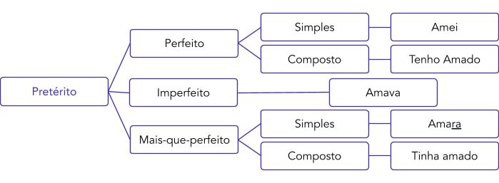
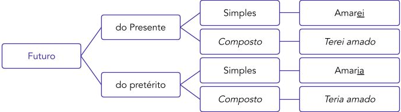
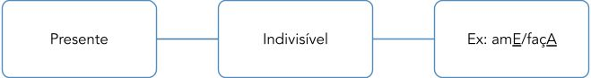
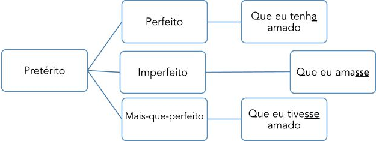
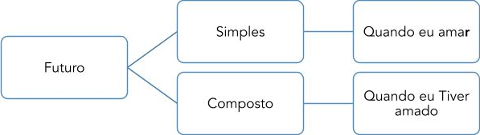
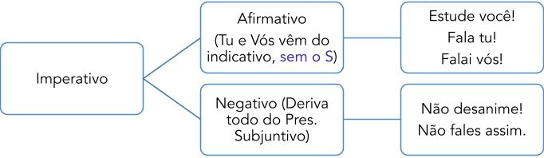

# Capítulo 6 – Classes de Palavras IV: Verbos

O verbo é o coração dinâmico da oração. É a classe de palavras que nos permite situar ações, estados e fenômenos no tempo, expressando a maior parte do conteúdo semântico de uma frase. No dia a dia, utilizamos centenas de verbos de forma intuitiva, conjugando-os em diferentes tempos e modos sem a necessidade de consultar manuais.

O objetivo deste capítulo não é a memorização mecânica de infinitas tabelas de conjugação, mas sim a sistematização desse conhecimento que já possuímos. Focaremos na **terminologia técnica** exigida pelas bancas, na compreensão do **valor semântico** de cada tempo e modo verbal, e no domínio das **exceções e particularidades** que são, de fato, o alvo das questões de concurso.

## Os Pilares do Verbo: Tempo, Modo, Número e Pessoa

O verbo é a classe gramatical mais rica em flexões. É uma palavra variável que se altera para expressar quatro noções fundamentais: o tempo, o modo, o número e a pessoa.

### Definição e Centralidade do Verbo

Formalmente, o **verbo** é a classe de palavra que indica **ação** (_correr, estudar_), **estado** (_ser, estar, parecer_), **fenômeno da natureza** (_chover, nevar_) ou um **processo** em geral, sempre localizando-o no tempo. Sintaticamente, ele é o núcleo do predicado, o elemento em torno do qual a maioria das orações se estrutura.

### As Flexões Verbais

#### Número e Pessoa

Estas duas flexões andam juntas e indicam a relação do verbo com as pessoas do discurso.

- **Pessoa:** Indica quem está envolvido no processo verbal.
    - **1ª pessoa:** A que fala (eu, nós).
    - **2ª pessoa:** A com quem se fala (tu, vós).
    - **3ª pessoa:** A de quem ou de que se fala (ele, ela, eles, elas).

- **Número:** Indica se a pessoa do discurso está no singular ou no plural.

É crucial entender que a "pessoa do discurso" é uma categoria gramatical. Ela não se refere exclusivamente a seres humanos. Qualquer substantivo pode ser representado por um pronome de 3ª pessoa e, consequentemente, determinar a flexão do verbo.

- _Exemplo:_ Os **carros** caíram no abismo e **ficaram** destruídos. (O verbo "ficaram" concorda com "carros", que corresponde à 3ª pessoa do plural, "eles").

#### Tempo

A flexão de tempo situa o processo verbal em uma linha cronológica: **presente, pretérito (passado)** e **futuro**. No entanto, é fundamental distinguir o tempo gramatical do tempo real.

- **Tempo Verbal vs. Tempo Cronológico:** O tempo expresso pela forma do verbo (tempo verbal) nem sempre corresponde ao momento real da ação (tempo cronológico).
    - _Exemplo:_ Amanhã eu **viajo** para o Rio. (O verbo está no **presente do indicativo**, mas a ação ocorrerá no **futuro**).
    - _Exemplo:_ Em 1500, Cabral **chega** ao Brasil. (O verbo está no **presente**, mas narra um fato do **passado**. É o chamado presente histórico).

#### Modo

A flexão de modo indica a **atitude do falante** em relação ao fato que ele enuncia.

- **Modo Indicativo:** Expressa uma atitude de **certeza, realidade, constatação**. O fato é apresentado como real e concreto.
    - _Exemplo:_ O sol **nasceu** hoje.

- **Modo Subjuntivo:** Expressa uma atitude de **dúvida, incerteza, desejo, hipótese**. O fato é apresentado como uma possibilidade.
    - _Exemplo:_ **Talvez** ele **venha** à festa. / **Se** eu **pudesse**, viajaria.

- **Modo Imperativo:** Expressa uma atitude de **ordem, pedido, conselho, sugestão**. O falante busca influenciar o interlocutor.
    - _Exemplo:_ **Faça** o seu trabalho, por favor.

#### Quadro-Resumo das Flexões Verbais

| Termo      | Descrição                                                               | Tipos                                                                                                                                                 |
| ---------- | ----------------------------------------------------------------------- | ----------------------------------------------------------------------------------------------------------------------------------------------------- |
| **Verbo**  | Palavra variável que indica ação, estado, fenômeno e processo em geral. | -                                                                                                                                                     |
| **Tempo**  | Momento em que ocorre a ação.                                           | **Presente** **Pretérito** **Futuro**                                                                                                           |
| **Modo**   | Diferentes maneiras em que um fato pode se realizar.                    | **Indicativo** – indica um fato certo. **Subjuntivo** – enuncia um fato hipotético, duvidoso. **Imperativo** – exprime ordem, conselho, pedido. |
| **Pessoa** | Quem realiza a ação verbal.                                             | **Singular** – eu (1ª), tu (2ª), ele (3ª) **Plural** – nós (1ª), vós (2ª), eles (3ª)                                                               |

## A Estrutura dos Verbos e o Padrão de Conjugação

A chave para dominar a conjugação verbal não é memorizar tabelas infinitas, mas sim compreender a lógica por trás de sua estrutura. O português organiza seus verbos em três grandes grupos, chamados **conjugações**, que funcionam como "famílias" com um padrão de flexão semelhante. Ao dominar um verbo-modelo de cada família, torna-se possível conjugar, por analogia, a grande maioria dos verbos da língua.

Os verbos são classificados em três conjugações, de acordo com a vogal que precede o "-r" em sua forma infinitiva:

- **1ª Conjugação:** Verbos terminados em **-AR**.
- **2ª Conjugação:** Verbos terminados em **-ER**.
- **3ª Conjugação:** Verbos terminados em **-IR**.

| 1ª Conjugação (-AR) | 2ª Conjugação (-ER) | 3ª Conjugação (-IR) |
| ------------------- | ------------------- | ------------------- |
| Amar                | Beber               | Sorrir              |
| Falar               | Escrever            | Dormir              |
| Estudar             | Correr              | Partir              |

### A Anatomia do Verbo

Para entender como o padrão de conjugação funciona, é útil conhecer as "peças" que compõem a estrutura de um verbo. Um verbo flexionado é formado pela união de morfemas (as menores unidades de significado), cada um com uma função específica.

- **Radical:** É a parte que carrega o significado principal, a essência semântica do verbo. Nos verbos regulares, o radical não se altera.
    - _Exemplos:_ **CANT**- (em cantar), **BEB**- (em beber), **PART**- (em partir).

- **Vogal Temática:** É a vogal que se liga ao radical e indica a qual das três conjugações o verbo pertence (**-A-** para a 1ª, **-E-** para a 2ª, **-I-** para a 3ª).

- **Tema:** É a união do **Radical + Vogal Temática**. É a base sobre a qual se acrescentam as desinências.
    - _Exemplos:_ **CANTA**-, **BEBE**-, **PARTI**-.

- **Desinências:** São os elementos que se juntam ao tema para indicar as flexões de modo, tempo, número e pessoa.
    - **Desinência Modo-Temporal (DMT):** Indica o modo e o tempo.
        - _Exemplo:_ cantá**va**mos (o `-va-` indica o Pretérito Imperfeito do Indicativo).
    - **Desinência Número-Pessoal (DNP):** Indica o número (singular/plural) e a pessoa (1ª, 2ª, 3ª).
        - _Exemplo:_ cantáva**mos** (o `-mos` indica a 1ª pessoa do plural, "nós").

Analisando a forma verbal **CANTÁVAMOS**, temos a seguinte estrutura:

**CANT** (Radical) + **Á** (Vogal Temática) + **VA** (Desinência Modo-Temporal) + **MOS** (Desinência Número-Pessoal)

O objetivo não é decorar o nome de cada desinência, mas sim reconhecer que as terminações dos verbos carregam essas informações gramaticais e se repetem em padrões previsíveis.

### Os Verbos Regulares

Verbos **regulares** são aqueles que seguem perfeitamente o paradigma de conjugação de sua família, mantendo o radical inalterado e utilizando as mesmas desinências do verbo-modelo.

Tomemos como exemplo o verbo **LEVANTAR** (1ª conjugação) e comparemos com o modelo **AMAR**.

**LEVANTAR (Modo Indicativo)**

| Presente | Pretérito Perfeito | Futuro do Presente |
| --- | --- | --- |
| Eu levanto | Eu levantei | Eu levantarei |
| Tu levantas | Tu levantaste | Tu levantarás |
| Ele levanta | Ele levantou | Ele levantará |
| Nós levantamos | Nós levantamos | Nós levantaremos |
| Vós levantais | Vós levantastes | Vós levantareis |
| Eles levantam | Eles levantaram | Eles levantarão |

**AMAR (Modo Indicativo)**

| Presente | Pretérito Perfeito | Futuro do Presente |
| --- | --- | --- |
| Eu amo | Eu amei | Eu amarei |
| Tu amas | Tu amaste | Tu amarás |
| Ele ama | Ele amou | Ele amará |
| Nós amamos | Nós amamos | Nós amaremos |
| Vós amais | Vós amastes | Vós amareis |
| Eles amam | Eles amaram | Eles amarão |

Observe que, para um mesmo tempo, modo e pessoa, as **terminações (desinências)** são idênticas. A única diferença entre as palavras é o radical, que carrega o sentido principal. É por isso que, ao dominar a conjugação de um verbo regular de cada terminação (-ar, -er, -ir), adquire-se a capacidade de conjugar milhares de outros. O nosso estudo, a partir de agora, se concentrará no valor semântico de cada um desses tempos e modos, e nas exceções a esses padrões (os verbos irregulares) que são mais cobradas em provas.

## Modo Indicativo

O modo indicativo é o modo verbal da **certeza**, da **realidade** e do **fato**. É utilizado quando o falante enuncia um processo verbal como algo concreto, real, cuja ocorrência é tida como certa, seja no presente, no passado ou no futuro.

Este modo é composto por seis tempos verbais principais:

- **Presente**
- **Pretérito Perfeito**
- **Pretérito Imperfeito**
- **Pretérito Mais-que-perfeito**
- **Futuro do Presente**
- **Futuro do Pretérito**

A seguir, analisaremos a forma e, principalmente, o valor semântico de cada um desses tempos.

### Presente do Indicativo

O Presente do Indicativo é um dos tempos mais versáteis da língua, capaz de expressar uma gama de nuances que vão muito além do momento exato da fala.

#### Formas e Conjugação

A tabela a seguir apresenta a conjugação do Presente do Indicativo para os verbos-modelo de cada uma das três conjugações.

|Pessoa|1ª Conjugação (Levantar)|2ª Conjugação (Beber)|3ª Conjugação (Cair)|
|---|---|---|---|
|Eu|levanto|bebo|caio|
|Tu|levantas|bebes|cais|
|Ele/Ela|levanta|bebe|cai|
|Nós|levantamos|bebemos|caímos|
|Vós|levantais|bebeis|caís|
|Eles/Elas|levantam|bebem|caem|

> **Dica de Reconhecimento:** Para identificar o Presente do Indicativo, basta tentar encaixar um marcador temporal como **"Hoje"** ou **"Agora"** antes do verbo: _"Hoje eu **estudo**"_, _"Agora ele **corre**"_.

#### Os Valores Semânticos do Presente do Indicativo

Apesar do nome, o uso deste tempo verbal não se restringe ao presente momentâneo. Seus principais valores semânticos são:

1. **Fato Pontual ou Momentâneo:** Descreve uma ação que ocorre ou um estado que se manifesta no exato momento da fala.
	- _Exemplos:_
	    - Ele **está** ranzinza hoje.
	    - Neste momento, os alunos **fazem** a prova.

2. **Hábito ou Rotina:** Expressa uma ação que se repete com frequência no presente, um costume ou uma rotina.
	- _Exemplos:_
	    - Eu **corro** e **nado** todo dia pela manhã.
	    - Ela sempre **visita** os avós aos domingos.

3. **Fato Permanente ou Verdade Atemporal:** Enuncia verdades científicas, fatos universalmente aceitos ou declarações que não dependem de um tempo cronológico específico.
	- _Exemplos:_
	    - A água **ferve** a 100 graus Celsius.
	    - O Brasil **faz** parte do Mercosul.
	    - Dois e dois **são** quatro.

4. **Futuro Próximo:** É um uso extremamente comum na língua portuguesa, especialmente no Brasil, para indicar uma ação futura que é dada como certa ou que já está planejada.
	- _Exemplos:_
	    - A novela **começa** hoje à noite.
	    - **Viajo** para o exterior na próxima semana.
	    - Arrume-se logo, o táxi **chega** às dez.

5. **Presente Histórico (ou Narrativo):** É um recurso estilístico usado para narrar fatos ocorridos no passado, trazendo-os para o presente do leitor. Isso confere maior vivacidade, dinamismo e verossimilhança ao evento narrado.
	- _Exemplos:_
	    - Em 1908, **nasce** o grande poeta.
	    - Machado de Assis **publica** _Dom Casmurro_ em 1899.
	    - No ano de 44 a.C., um grupo de senadores **assassina** Júlio César.

### Pretérito Perfeito do Indicativo

O Pretérito Perfeito é o tempo verbal utilizado para expressar fatos e ações que tiveram início e foram **completamente concluídos** em um momento anterior ao da fala. Sua principal característica semântica é a de apresentar o fato passado como algo pontual, finalizado e acabado.

#### Formas e Conjugação

A tabela a seguir apresenta a conjugação do Pretérito Perfeito para os verbos-modelo.

|Pessoa|1ª Conjugação (Levantar)|2ª Conjugação (Beber)|3ª Conjugação (Cair)|
|---|---|---|---|
|Eu|levant**ei**|beb**i**|ca**í**|
|Tu|levant**aste**|beb**este**|ca**íste**|
|Ele/Ela|levant**ou**|beb**eu**|ca**iu**|
|Nós|levant**amos**|beb**emos**|ca**ímos**|
|Vós|levant**astes**|beb**estes**|ca**ístes**|
|Eles/Elas|levant**aram**|beb**eram**|ca**íram**|

> **Dica de Reconhecimento:** Para identificar o Pretérito Perfeito, basta tentar encaixar um marcador temporal de passado concluído, como **"Ontem"**: _"Ontem eu **estudei**"_, _"Ontem ele **correu**"_.

#### Os Valores Semânticos do Pretérito Perfeito

1. **Fato Pontual e Concluído no Passado:** É o seu uso mais comum, para narrar um evento que aconteceu e terminou, seja em um passado recente ou distante.
	- _Exemplos:_
	    - Eu **li** duas aulas de Direito Constitucional hoje pela manhã.
	    - Cristóvão Colombo **chegou** à América em 1492.
	    - Nós **visitamos** aquele museu durante a viagem a Ouro Preto.
	    - O Brasil **ganhou** a Copa do Mundo em 2002.

2. **Fato Passado com Efeitos que Perduram no Presente:** Neste uso, embora a ação esteja concluída no passado, seu resultado ou consequência ainda é válido ou relevante no momento da fala.
- _Exemplos:_
    - Eu **aprendi** inglês na infância. (A ação de aprender acabou, mas o conhecimento permanece).
    - A chuva **quebrou** o galho daquela árvore. (A ação de quebrar terminou, mas o galho continua quebrado).
    - Ela **perdeu** a chave de casa. (O ato de perder é passado, mas a consequência — estar sem a chave — é presente).

#### Pretérito Perfeito Composto do Indicativo

Enquanto a forma simples do Pretérito Perfeito (`estudei`) indica uma ação pontual e concluída no passado, a sua forma composta (`tenho estudado`) possui um valor semântico muito específico: indica uma **ação que se inicia em um momento do passado e se estende, perdura ou se repete continuamente até o momento presente da fala.** A ênfase não está na conclusão do fato, mas em sua **duração ou frequência** ao longo de um período que chega até o agora.

- **Exemplos:**
    - **Tenho feito** muitos exercícios de português ultimamente. (A ação de fazer exercícios começou no passado e vem se repetindo até o presente).
    - **João tem investido** muito em fundos imobiliários. (O ato de investir não foi um evento único, mas um processo contínuo até o momento).
    - **Maria tem evitado** o açúcar desde a consulta. (A ação de evitar começou no passado e perdura até hoje).

##### A Estrutura do Tempo Composto

A expressão "tempo composto" significa apenas que o tempo verbal é formado por uma **locução verbal**, ou seja, por uma combinação de mais de um verbo. A estrutura é sempre a mesma:

- **Verbo Auxiliar (TER ou HAVER) + Verbo Principal no PARTICÍPIO**

O **verbo auxiliar** é aquele que recebe a flexão de tempo, modo, número e pessoa. O **verbo principal** é o que carrega o significado central da ação e aparece na forma nominal do **particípio** (terminação em -ado, -ido).

- _Exemplos de análise:_
    - Que eu **tenha amado**. (`tenha`: auxiliar; `amado`: principal no particípio)
    - Às 19h, o jogo não **haverá começado**. (`haverá`: auxiliar; `começado`: principal no particípio)

> **Nota sobre a Nomenclatura dos Tempos Compostos**
> 
> Em geral, o tempo do verbo **auxiliar** é o que dá nome ao tempo verbal composto. Por exemplo, em "eu **terei** feito", como o auxiliar "terei" está no Futuro do Presente, o tempo composto é o Futuro do Presente Composto.
> 
> O Pretérito Perfeito Composto é a grande **exceção** a essa regra. Embora o tempo se chame "pretérito", o seu verbo auxiliar é conjugado no **Presente do Indicativo**.
> 
> - _Exemplo:_ **Tenho** andado distraído... ("Tenho" está no Presente do Indicativo).

**Estrutura Equivalente: "Vir/Ir" + Gerúndio**

A mesma ideia de continuidade e duração até o presente, expressa pelo Pretérito Perfeito Composto, pode ser transmitida pela locução formada pelos verbos **VIR** ou **IR** no Presente do Indicativo + o verbo principal no **Gerúndio**.

- _Exemplo 1:_
    - **Tenho levantado** cedo todos os dias. (Pretérito Perfeito Composto)
    - **Venho levantando** cedo todos os dias. (Estrutura Equivalente)
- _Exemplo 2:_
    - A situação **tem piorado** a cada dia. (Pretérito Perfeito Composto)
    - A situação **vai piorando** a cada dia. (Estrutura Equivalente)

### Pretérito Imperfeito do Indicativo

Enquanto o Pretérito Perfeito é a "fotografia" de um fato concluído no passado, o Pretérito Imperfeito é o "filme". Ele não foca no início ou no fim da ação, mas sim em sua **continuidade, duração ou repetição** ao longo de um período do passado. É o tempo verbal da rotina, da descrição e do cenário.

#### Formas e Conjugação

A tabela a seguir apresenta a conjugação do Pretérito Imperfeito para os verbos-modelo. Note as desinências (terminações) características: **-VA-** para a 1ª conjugação (-AR) e **-IA-** para a 2ª e 3ª conjugações (-ER e -IR).

|Pessoa|1ª Conjugação (Levantar)|2ª Conjugação (Beber)|3ª Conjugação (Cair)|
|---|---|---|---|
|Eu|levanta**va**|beb**ia**|ca**ía**|
|Tu|levanta**vas**|beb**ias**|ca**ías**|
|Ele/Ela|levanta**va**|beb**ia**|ca**ía**|
|Nós|levantá**vamos**|beb**íamos**|ca**íamos**|
|Vós|levantá**veis**|beb**íeis**|ca**íeis**|
|Eles/Elas|levanta**vam**|beb**iam**|ca**íam**|

> **Dica de Reconhecimento:** Para identificar o Pretérito Imperfeito, basta tentar encaixar um marcador temporal de passado habitual, como **"Antigamente"**: _"Antigamente eu **estudava**"_, _"Antigamente eles **viviam** felizes"_.

#### Os Valores Semânticos do Pretérito Imperfeito

1. **Ação Habitual ou Contínua no Passado:** É o seu uso mais comum, para descrever rotinas, costumes ou estados que se prolongavam no passado.
	- _Exemplos:_
	    - **Antigamente**, eu **estudava** todo dia e ainda **malhava** à noite.
	    - Quando eu era pequeno, **achava** a vida mais simples.
	    - Naquele tempo, nós **íamos** ao cinema todos os sábados.

2. **Descrição e "Pano de Fundo" Narrativo:** O Pretérito Imperfeito é amplamente utilizado para descrever cenários e situações que serviam de "pano de fundo" para um evento principal e pontual (geralmente expresso no Pretérito Perfeito).
	- _Exemplos:_
	    - Eu **dormia** tranquilamente quando o alarme **disparou**. (Ação contínua de "dormir" é o cenário para a ação pontual de "disparar").
	    - O céu **estava** azul e os pássaros **cantavam**, mas de repente o tempo **fechou**.
	    - Ele **lia** um livro na varanda quando o telefone **tocou**.

3. **Ação Planejada e Não Realizada:** Pode ser usado para indicar uma intenção ou um plano do passado que acabou sendo frustrado ou não se concretizou por algum motivo.
	- _Exemplos:_
	    - Eu **pretendia** começar o curso hoje, porém tudo foi cancelado.
	    - Nós **íamos** viajar para a praia, mas o carro quebrou.
	    - Ele **vinha** me visitar, mas teve um imprevisto e não pôde vir.

4. **Pretérito de Cortesia ou Modéstia:** É um uso estilístico muito comum no presente para fazer pedidos ou afirmações de forma mais polida e menos impositiva.
	- _Exemplos:_
	    - Com licença, eu **queria** pedir uma informação. (Mais polido que "quero").
	    - **Gostaria** de um café, por favor.
	    - O senhor **desejava** alguma coisa?

### Pretérito Mais-Que-Perfeito do Indicativo

O Pretérito Mais-que-perfeito é o tempo verbal que expressa o **"passado do passado"**. Sua função específica é indicar uma ação que ocorreu e foi concluída **antes de outra ação também já passada**. Ele estabelece uma relação de anterioridade entre dois eventos no passado.

#### Forma Simples e Conjugação

A forma simples do Pretérito Mais-que-perfeito é caracterizada pela desinência **-ra** (e suas variações de pessoa). Embora seja pouco utilizada na linguagem falada contemporânea, seu uso é comum na escrita formal, em textos literários, e é um conhecimento exigido em concursos públicos.

|Pessoa|1ª Conjugação (Levantar)|2ª Conjugação (Beber)|3ª Conjugação (Cair)|
|---|---|---|---|
|Eu|levanta**ra**|bebe**ra**|ca**íra**|
|Tu|levanta**ras**|bebe**ras**|ca**íras**|
|Ele/Ela|levanta**ra**|bebe**ra**|ca**íra**|
|Nós|levantá**ramos**|bebê**ramos**|ca**íramos**|
|Vós|levantá**reis**|bebê**reis**|ca**íreis**|
|Eles/Elas|levanta**ram**|bebe**ram**|ca**íram**|

- **Exemplo 1:** Quando a polícia **chegou** (passado 1), o ladrão já **fugira** (passado 2, anterior).
- **Exemplo 2:** Ele me **disse** (passado 1) que já **lêra** (passado 2) aquele livro.
- **Exemplo 3:** Já passa**ra** das dez horas quando o táxi **chegou**.

#### Forma Composta (tinha/havia + particípio)

Na prática, a ideia do "passado do passado" é mais frequentemente expressa pela forma composta, que é perfeitamente equivalente à forma simples.

- **Formação:** Verbo Auxiliar **TER** ou **HAVER** no Pretérito Imperfeito do Indicativo + **Particípio** do Verbo Principal.
- **Equivalência Semântica:** A substituição da forma simples pela composta (ou vice-versa) não gera alteração de sentido nem prejuízo gramatical, sendo uma reescritura perfeita.

|Forma Simples|Forma Composta (Equivalente)|
|---|---|
|Quando cheguei ao ponto, o ônibus já **passara**.|Quando cheguei ao ponto, o ônibus já **tinha passado**.|
|O paciente já **falecera** quando o médico chegou.|O paciente já **havia falecido** quando o médico chegou.|

> **Foco de Prova: A Substituição pelo Pretérito Perfeito Simples**
> 
> Em contextos específicos, a norma culta permite que o **Pretérito Perfeito Simples** (`viu`) seja usado com o valor do Mais-que-perfeito (`vira` / `tinha visto`). Isso ocorre principalmente em orações temporais (introduzidas por `depois que`, `assim que`, etc.) ou em narrativas onde a sequência cronológica dos fatos passados é muito clara.
> 
> - **Exemplo:** Depois que **viu** a confusão, achou melhor se afastar.
>     - **Análise:** A forma "viu" (Perfeito) tem, neste contexto, o mesmo valor de "vira" ou "tinha visto" (Mais-que-perfeito), pois a ação de ver é claramente anterior à de se afastar.
> - **Exemplo:** Assim que **terminou** o trabalho, ele foi para casa.
>     - **Análise:** "terminou" (Perfeito) equivale a "terminara" ou "tinha terminado" (Mais-que-perfeito).
> 
> É fundamental notar que essa equivalência depende de um contexto que deixe a anterioridade da ação subentendida.

### Futuro do Presente do Indicativo

O Futuro do Presente é o tempo verbal que expressa uma ação que ocorrerá em um momento **posterior ao momento da fala**. É o futuro visto a partir de "agora", expressando, em geral, um fato tido como certo ou provável.

#### Forma Simples e Conjugação (-rei, -rás, -rá)

A forma simples do Futuro do Presente, embora seja a padrão na escrita formal, é frequentemente substituída na linguagem cotidiana pela locução verbal `verbo IR (no presente) + Infinitivo` (ex: "vou fazer" em vez de "farei"). Mesmo assim, seu domínio é indispensável para a norma culta.

|Pessoa|1ª Conjugação (Levantar)|2ª Conjugação (Beber)|3ª Conjugação (Cair)|
|---|---|---|---|
|Eu|levanta**rei**|bebe**rei**|cai**rei**|
|Tu|levanta**rás**|bebe**rás**|cai**rás**|
|Ele/Ela|levanta**rá**|bebe**rá**|cai**rá**|
|Nós|levanta**remos**|bebe**remos**|cai**remos**|
|Vós|levanta**reis**|bebe**reis**|cai**reis**|
|Eles/Elas|levanta**rão**|bebe**rão**|cai**rão**|

> **Dica de Reconhecimento:** Para identificar o Futuro do Presente, basta tentar encaixar um marcador temporal como **"Amanhã"**: _"Amanhã eu **estudarei**"_, _"Amanhã ele **partirá**"_.

#### Os Valores Semânticos da Forma Simples

1. **Fato Futuro Certo ou Provável:** É o seu uso mais comum, indicando uma ação que se realizará no futuro.
	- _Exemplos:_
	    - **Passarei** no concurso dos meus sonhos.
	    - A cerimônia de posse **começará** às 10h.
	    - No próximo ano, nós **viajaremos** para a Europa.

2. **Incerteza ou Suposição sobre o Presente:** De forma modal, o Futuro do Presente pode ser usado para expressar uma dúvida, uma incerteza ou uma suposição sobre um fato que ocorre no presente.
	- _Exemplos:_
	    - Onde **estará** Maria agora?
	    - Quantos anos ele **terá**?
	    - **Será** que eles estão falando a verdade?

3. **Valor de Imperativo Categórico:** Em textos solenes, como os bíblicos ou os jurídicos, o Futuro do Presente é usado para expressar uma ordem ou um mandamento de forma enfática e inquestionável.
	- _Exemplos:_
	    - **Honrarás** pai e mãe.
	    - Não **matarás**.
	    - A lei não **prejudicará** o direito adquirido.

#### Futuro do Presente Composto

A forma composta deste tempo verbal possui dois valores semânticos distintos.

- **Formação:** Verbo Auxiliar **TER** (ou **HAVER**) no Futuro do Presente Simples + **Particípio** do Verbo Principal.
- **Valores Semânticos:**
    1. **Ação Futura Concluída Antes de Outra Ação Futura:** Indica uma ação que já estará terminada quando outra ação, também futura, acontecer.
        - _Exemplo:_ Quando você **chegar** ao aeroporto, o avião já **terá decolado**. (A decolagem é um futuro anterior à chegada).
        - _Exemplo:_ Em dezembro, eu já **terei concluído** meu curso.

    2. **Suposição sobre um Fato Passado:** Expressa uma probabilidade ou uma hipótese sobre algo que já aconteceu.
        - _Exemplo:_ Ele não veio à festa. **Terá ficado** doente? (Suposição sobre um fato ocorrido no passado).
        - _Exemplo:_ O suspeito **terá fugido** pela janela durante a madrugada. (Indica uma forte probabilidade sobre o passado).

### Futuro do Pretérito do Indicativo

O Futuro do Pretérito é o tempo verbal da **hipótese** e da **condição**. Ele descreve uma ação que poderia acontecer ou ter acontecido, mas cuja realização depende ou dependia de uma determinada condição. Formalmente, ele também pode indicar uma ação futura vista a partir de um ponto de referência no passado (o "futuro do passado").

#### Forma Simples e Conjugação

Sua desinência (terminação) característica é **-ria** (e suas variações).

|Pessoa|1ª Conjugação (Levantar)|2ª Conjugação (Beber)|3ª Conjugação (Cair)|
|---|---|---|---|
|Eu|levanta**ria**|bebe**ria**|cai**ria**|
|Tu|levanta**rias**|bebe**rias**|cai**rias**|
|Ele/Ela|levanta**ria**|bebe**ria**|cai**ria**|
|Nós|levantá**ríamos**|bebê**ramos**|cair**íamos**|
|Vós|levanta**ríeis**|bebe**ríeis**|cair**íeis**|
|Eles/Elas|levanta**riam**|bebe**riam**|cair**iam**|

> **Dica de Reconhecimento:** Para identificar o Futuro do Pretérito, use o gatilho da hipótese: **"Se eu pudesse, eu..."**: _"Se eu pudesse, eu **viajaria**"_, _"Se eu pudesse, eu **compraria**"_.

#### Os Valores Semânticos da Forma Simples

1. **Ação Condicionada:** É seu uso principal. Expressa uma ação que só se realizaria se uma determinada condição fosse atendida. Frequentemente, aparece em correlação com o Pretérito Imperfeito do Subjuntivo (cuja desinência é -sse).
	- _Exemplos:_
	    - Se eu soube**sse**, **contaria** a todos a verdade.
	    - Eu **continuaria** trabalhando, mesmo se ganha**sse** na loteria.
	    - Nós **iríamos** à praia, se não estive**sse** chovendo.

2. **Incerteza ou Suposição sobre o Passado:** É usado para expressar uma dúvida, uma suposição ou uma estimativa sobre um fato ocorrido no passado.
	- _Exemplos:_
	    - Quem **seria** o autor daquela obra anônima?
	    - Naquela época, ele **teria** uns 30 anos de idade.
	    - Segundo estimativas, a fortuna dela **seria** de 4 milhões de libras.

3. **Polidez, Conselho ou Indignação:** É um recurso estilístico para suavizar pedidos e afirmações, tornando-os mais polidos, ou para expressar surpresa e indignação.
	- _Exemplos (Polidez):_
	    - Você me **faria** um favor?
	    - Eu **gostaria** de fazer uma pergunta.
	- _Exemplo (Conselho):_
	    - **Seria** bom você estudar mais a matéria de português.
	- _Exemplo (Indignação):_
	    - Quem **diria** que ele seria capaz de fazer isso!

#### Futuro do Pretérito Composto

A forma composta (formada pelo verbo auxiliar **TER** ou **HAVER** no Futuro do Pretérito Simples + **Particípio**) expressa ideias semelhantes.

1. **Ação que Teria Ocorrido sob uma Condição Passada:** Descreve uma ação no passado que não aconteceu porque sua condição, também no passado, não foi cumprida.
	- _Exemplo:_ Se eu **tivesse estudado** mais, **teria sido** aprovado.
	- _Exemplo:_ Nós **teríamos viajado**, se não **tivéssemos perdido** o voo.

2. **Suposição sobre um Fato Passado:** Assim como o Futuro do Presente Composto, a forma composta do Futuro do Pretérito também expressa uma probabilidade sobre o passado, muitas vezes com um grau maior de incerteza.
	- _Exemplo:_ Imaginei que o ladrão **teria escapado** pela janela.
	- _Comparação:_
	    - Não **terá sido** em vão nosso esforço? (Dúvida com maior probabilidade).
	    - Não **teria sido** em vão nosso esforço? (Dúvida mais hipotética, remota).

### Quadro-Resumo do Modo Indicativo

Para consolidar o estudo dos tempos do Modo Indicativo, os esquemas a seguir resumem os principais valores semânticos de cada tempo verbal, divididos em presente, pretérito e futuro.

## Modo Subjuntivo

Diferentemente do Modo Indicativo, que expressa a certeza e a realidade, o Modo Subjuntivo é empregado para enunciar um fato de maneira **incerta, duvidosa, hipotética** ou **irreal**. Ele não apresenta a ação como um fato concreto, mas sim como uma **possibilidade**, um **desejo**, uma **suposição** ou uma **condição**.

Por essa natureza, o Subjuntivo é o modo característico das **orações subordinadas**, sendo frequentemente introduzido por conjunções ou pronomes que estabelecem essa relação de dependência.

- _Exemplos:_
    - **Ainda que** eu **estude** muito...
    - **Se** eu **pudesse** viajar...
    - **Quando** você **vir** o resultado...
    - Quero um emprego **que me faça** bem.

O Modo Subjuntivo possui três tempos verbais: o Presente, o Pretérito Imperfeito e o Futuro.

### Presente do Subjuntivo

O Presente do Subjuntivo expressa uma possibilidade, um desejo ou uma dúvida que se projeta no presente ou no futuro.

#### Formas e Conjugação

Uma dica prática para formar o Presente do Subjuntivo é partir da 1ª pessoa do singular do Presente do Indicativo. Troca-se a terminação "-o" pela vogal temática oposta:

- Verbos em **-AR** (terminação **-E**): _eu canto → que eu cant**e**_
- Verbos em **-ER** e **-IR** (terminação **-A**): _eu bebo → que eu beb**a**; eu parto → que eu part**a**_

|Pessoa|1ª Conjugação (Levantar)|2ª Conjugação (Beber)|3ª Conjugação (Cair)|
|---|---|---|---|
|Eu|que eu levant**e**|que eu beb**a**|que eu cai**a**|
|Tu|que tu levant**es**|que tu beb**as**|que tu cai**as**|
|Ele/Ela|que ele levant**e**|que ele beb**a**|que ele cai**a**|
|Nós|que nós levant**emos**|que nós beb**amos**|que nós cai**amos**|
|Vós|que vós levant**eis**|que vós beb**ais**|que vós cai**ais**|
|Eles/Elas|que eles levant**em**|que eles beb**am**|que eles cai**am**|

> **Dica de Reconhecimento:** Para conjugar ou reconhecer o Presente do Subjuntivo, utilize o gatilho de uma expressão que exija esse tempo verbal, como **"Espero que..."** ou **"Talvez..."**: _"Espero que eu **faça** uma boa prova"_.

#### Os Valores Semânticos do Presente do Subjuntivo

Este tempo é empregado em orações que expressam:

1. **Desejo, Vontade ou Ordem Indireta:**
    - _Exemplos:_
        - **Espero que** você **seja** aprovado.
        - **Tomara que** não **chova** amanhã.
        - O professor quer **que** os alunos **façam** silêncio.

2. **Dúvida ou Possibilidade:**
    - _Exemplos:_
        - **Talvez** ele **chegue** a tempo.
        - É **provável que** a banca **divulgue** o gabarito hoje.
        - **Pena que** a vida não **seja** assim tão colorida.

3. **Necessidade ou Importância:**
    - _Exemplos:_
        - É **necessário que** todos **colaborem**.
        - **Convém que** o assunto **seja** discutido em reunião.

> **Foco de Prova: Indicativo vs. Subjuntivo em Orações Adjetivas**
> 
> A escolha entre o Modo Indicativo e o Subjuntivo em uma oração adjetiva (iniciada por "que") altera profundamente o sentido da frase.
> 
> - **Indicativo → Realidade, Certeza:** Refere-se a um ser ou grupo específico, cuja existência é um fato.
>     - _Exemplo:_ Procuro os alunos **que estudam** para o concurso. (O falante se refere a um grupo real e conhecido de alunos que estudam).
>     
> - **Subjuntivo → Hipótese, Indefinição:** Refere-se a um ser ou grupo hipotético, desejado ou de existência incerta.
>     - _Exemplo:_ Procuro alunos **que estudem** para o concurso. (O falante procura por quaisquer alunos que tenham essa característica; ele não sabe quem são ou se existem).
> 
> |Frase|Modo|Análise do Sentido|
> |---|---|---|
> |Há quem **comete** maldade.|Indicativo|Afirma a existência de pessoas que, de fato, cometem maldade.|
> |Há quem **cometa** maldade.|Subjuntivo|Expressa a possibilidade de existirem pessoas que cometam maldade.|

### Pretérito Imperfeito do Subjuntivo

O Pretérito Imperfeito do Subjuntivo é o tempo verbal da **condição** e da **hipótese**, especialmente em relação a fatos passados ou a desejos. Sua desinência (terminação) característica e marcante é **-sse**.

#### Formas e Conjugação

A tabela a seguir apresenta a conjugação do Pretérito Imperfeito do Subjuntivo para os verbos-modelo.

|Pessoa|1ª Conjugação (Levantar)|2ª Conjugação (Beber)|3ª Conjugação (Cair)|
|---|---|---|---|
|Eu|se eu levanta**sse**|se eu bebe**sse**|se eu ca**ísse**|
|Tu|se tu levanta**sses**|se tu bebe**sses**|se tu ca**ísses**|
|Ele/Ela|se ele levanta**sse**|se ele bebe**sse**|se ele ca**ísse**|
|Nós|se nós levantá**ssemos**|se nós bebê**ssemos**|se nós ca**íssemos**|
|Vós|se vós levantá**sseis**|se vós bebê**sseis**|se vós ca**ísseis**|
|Eles/Elas|se eles levanta**ssem**|se eles bebe**ssem**|se eles ca**íssem**|

> **Dica de Reconhecimento:** Para identificar o Pretérito Imperfeito do Subjuntivo, utilize o gatilho da condição, a conjunção **"Se"**: _"Se eu **pudesse**..."_, _"Se nós **estudássemos**..."_.

#### Os Valores Semânticos do Pretérito Imperfeito do Subjuntivo

1. **Condição ou Hipótese (geralmente irreal ou pouco provável):** É seu uso mais comum, frequentemente em correlação com o Futuro do Pretérito do Indicativo (-ria) para formar períodos condicionais.
	- _Exemplos:_
	    - **Se** eu **estudasse** todo dia, passa**ria** em qualquer prova.
	    - Ele agiu como **se não soubesse** de nada.
	    - **Caso** você **precisasse** de ajuda, eu o ajuda**ria**.

2. **Desejo ou Vontade:** É usado para expressar um desejo, muitas vezes em construções com o verbo "querer" ou "gostar".
	- _Exemplos:_
	    - Eu gostaria que você **falasse** a verdade.
	    - Queria que eles **se levantassem** mais cedo.

3. **Fato Incerto ou Duvidoso no Passado:** Indica uma ação posterior a uma dúvida, temor ou pedido expresso no passado na oração principal.
	- _Exemplos:_
	    - Eu duvidei que minha avó **bebesse** tanta tequila.
	    - O professor pediu que os alunos **fizessem** silêncio.
	    - Eu temia que **fosse** um golpe.

#### Os Tempos Compostos do Pretérido Subjuntivo

Assim como no Indicativo, o Modo Subjuntivo também possui tempos compostos, formados pelo verbo auxiliar (TER ou HAVER) no subjuntivo + o particípio do verbo principal.

##### Pretérito Perfeito Composto do Subjuntivo

- **Formação:** Auxiliar no **Presente do Subjuntivo** + Particípio.
- **Valor Semântico:** Expressa um **fato passado**, mas de cuja ocorrência se duvida ou se deseja. Também pode indicar um **fato futuro já concluído**.
- **Exemplos (Fato Passado Hipotético):**
    - Espero que você **tenha entendido** a explicação de ontem. (Expressa um desejo sobre um fato passado).
    - É uma pena que ele não **tenha vindo** à festa.

- **Exemplos (Fato Futuro Concluído):**
    - Quando chegarmos lá, suponho que João já **tenha saído**. (Expressa uma hipótese sobre uma ação futura que estará terminada antes de outra).
    - Avisem-me assim que vocês **tiverem terminado** o relatório.

##### Pretérito Mais-que-perfeito Composto do Subjuntivo

- **Formação:** Auxiliar no **Pretérito Imperfeito do Subjuntivo** + Particípio.
- **Valor Semântico:** É o tempo da **hipótese irreal no passado**. Indica uma ação que poderia ter acontecido, mas não aconteceu, pois sua condição também não se realizou.
- **Exemplos:**
    - **Se** a sorte nos **tivesse favorecido**, não faltaria dinheiro hoje. (A condição — a sorte nos favorecer — não ocorreu).
    - **Se** eu **tivesse aplicado** tudo em ações, hoje estaria rico.
    - Ele teria evitado o acidente **se tivesse dirigido** com mais cuidado.

### Futuro do Subjuntivo

O Futuro do Subjuntivo é o tempo verbal que descreve uma ação **eventual ou hipotética que poderá ocorrer no futuro**. Ele não expressa uma certeza, mas sim uma condição para que outra ação futura se realize. É frequentemente introduzido por conjunções como **"quando"** (com sentido de "no momento em que") e **"se"**.

#### Formas e Conjugação

A tabela a seguir apresenta a conjugação do Futuro do Subjuntivo para os verbos-modelo.

|Pessoa|1ª Conjugação (Levantar)|2ª Conjugação (Beber)|3ª Conjugação (Cair)|
|---|---|---|---|
|Eu|quando eu levanta**r**|quando eu bebe**r**|quando eu cai**r**|
|Tu|quando tu levanta**res**|quando tu bebe**res**|quando tu caí**res**|
|Ele/Ela|quando ele levanta**r**|quando ele bebe**r**|quando ele cai**r**|
|Nós|quando nós levanta**rmos**|quando nós bebe**rmos**|quando nós caí**rmos**|
|Vós|quando vós levanta**rdes**|quando vós bebe**rdes**|quando vós caí**rdes**|
|Eles/Elas|quando eles levanta**rem**|quando eles bebe**rem**|quando eles caí**rem**|

> **Dica de Reconhecimento:** Para identificar o Futuro do Subjuntivo, utilize o gatilho de uma hipótese futura, como **"Quando eu..."**: _"Quando eu **fizer**..."_, _"Quando nós **pudermos**..."_.

#### Os Valores Semânticos do Futuro do Subjuntivo

1. **Ação Eventual ou Hipotética no Futuro:** Este tempo verbal está quase sempre em correlação com um verbo no Futuro do Presente do Indicativo ou no Imperativo na oração principal.
    - _Exemplos:_
        - **Quando** você **terminar** o relatório, avise-me.
        - **Se** eu **quiser** falar com Deus, tenho que ficar a sós.
        - Daremos o prêmio àquele que **atingir** a meta primeiro.

2. **Futuro do Subjuntivo Composto:** A forma composta (formada pelo auxiliar TIVER/HOUVER + Particípio) expressa uma ação futura que já estará concluída antes de outra ação também futura.
    - _Exemplo:_ **Quando** você **tiver terminado** o relatório, poderá ir para casa.
    - _Exemplo:_ Só poderemos comemorar **depois que tivermos recebido** o resultado oficial.

#### Futuro do Subjuntivo vs. Infinitivo Pessoal

Em verbos regulares, a forma da 1ª e 3ª pessoa do singular do Futuro do Subjuntivo é **idêntica** à do Infinitivo Pessoal (`entregar`). Esta semelhança é uma fonte constante de confusão e um alvo preferencial das bancas.

Para distinguir as duas formas, a análise do contexto é fundamental. No entanto, o método mais rápido e seguro é o da **substituição por um verbo irregular**, cujas formas são distintas. O verbo **FAZER** é o melhor modelo para este teste.

|Frase de Teste|Substituição pelo verbo FAZER|Análise|
|---|---|---|
|**Quando** eu **entregar** o trabalho...|**Quando** eu **fizer** o trabalho...|A forma "fizer" confirma **Futuro do Subjuntivo**.|
|**Para entregar** o trabalho, fiz horas extras.|**Para fazer** o trabalho, fiz horas extras.|A forma "fazer" confirma **Infinitivo**.|

Esta diferença é especialmente importante para os verbos irregulares derivados de **PÔR, TER, VER** e **VIR**, cujas formas são muito cobradas.

|Verbo|Infinitivo|Futuro do Subjuntivo|
|---|---|---|
|**Pôr** (e derivados)|pro**por**|propo**user**|
|**Ter** (e derivados)|entre**ter**|entret**iver**|
|**Ver** (e derivados)|re**ver**|re**vir**|
|**Vir** (e derivados)|inter**vir**|inter**vier**|

### Quadro-Resumo do Modo Subjuntivo

Os esquemas a seguir consolidam os principais valores semânticos de cada tempo verbal do Modo Subjuntivo, servindo como um guia rápido para consulta.

## Modo Imperativo

O Modo Imperativo é utilizado para expressar diretamente uma **ordem, pedido, conselho, convite** ou **súplica**. Seu foco é influenciar a ação do interlocutor. Por essa razão, ele não possui a 1ª pessoa do singular ("eu"), pois, gramaticalmente, não se dá uma ordem direta a si mesmo.

Este modo se apresenta em duas formas distintas, com regras de formação diferentes: o Imperativo Afirmativo e o Imperativo Negativo.

### Imperativo Afirmativo

A formação do Imperativo Afirmativo é um processo híbrido, pois deriva de dois tempos verbais diferentes: o Presente do Indicativo e o Presente do Subjuntivo.

> **Foco de Prova: A Formação do Imperativo Afirmativo**
> 
> A regra de formação do afirmativo é um dos tópicos mais cobrados sobre verbos, especialmente por suas exceções. O processo é o seguinte:
> 
> 1. As formas de **`tu`** e **`vós`** derivam do **Presente do Indicativo**, com a **retirada do "s" final**.
>     - _Exemplo:_ tu cant**as** → cant**a** tu / vós cant**ais** → cant**ai** vós.
>     
> 2. As formas de **`você`**, **`nós`** e **`vocês`** são **idênticas** às do **Presente do Subjuntivo**.
>     - _Exemplo:_ que você **cante** → **cante** você / que nós **cantemos** → **cantemos** nós.

**Conjugação (Forma Afirmativa):**

|Pessoa|1ª Conjugação (Levantar)|2ª Conjugação (Beber)|3ª Conjugação (Cair)|
|---|---|---|---|
|(tu)|levanta tu|bebe tu|cai tu|
|(você)|levante você|beba você|caia você|
|(nós)|levantemos nós|bebamos nós|caiamos nós|
|(vós)|levantai vós|bebei vós|caí vós|
|(vocês)|levantem vocês|bebam vocês|caiam vocês|

### Imperativo Negativo

A formação do Imperativo Negativo é mais simples e regular.

- **Regra de Formação:** Todas as pessoas do Imperativo Negativo são **idênticas** às do **Presente do Subjuntivo**, precedidas pelo advérbio de negação **"não"**.

**Conjugação (Forma Negativa):**

|Pessoa|1ª Conjugação (Levantar)|2ª Conjugação (Beber)|3ª Conjugação (Cair)|
|---|---|---|---|
|(tu)|não levantes tu|não bebas tu|não caias tu|
|(você)|não levante você|não beba você|não caia você|
|(nós)|não levantemos nós|não bebamos nós|não caiamos nós|
|(vós)|não levanteis vós|não bebais vós|não caiais vós|
|(vocês)|não levantem vocês|não bebam vocês|não caiam vocês|

### Observações Importantes sobre o Imperativo

1. **Uniformidade de Tratamento:** É um princípio fundamental da norma culta manter a consistência no tratamento do interlocutor. Misturar as formas de tu e você em um mesmo texto ou enunciado é considerado um desvio gramatical.
	- _Inadequado:_ **Faz** o que eu te peço e **pegue** o livro. (`Faz` é da 2ª pessoa `tu`; `pegue` é da 3ª pessoa `você`).
	- **Adequado (tratamento por "tu"):** **Faze** o que eu te peço e **pega** o livro.
	- **Adequado (tratamento por "você"):** **Faça** o que eu lhe peço e **pegue** o livro.

2. **Casos Especiais de Conjugação:**
	- Verbos terminados em **-zer** e **-zir** admitem duas formas para a 2ª pessoa do singular (tu) no afirmativo:
	    - Dizer: **Dize** tu / **Diz** tu.
	    - Fazer: **Faze** tu / **Faz** tu.
	    - Conduzir: **Conduze** tu / **Conduz** tu.
	- O verbo **SER** é irregular: **Sê** tu, **seja** você, **sejamos** nós, **sede** vós, **sejam** vocês.

### Quadro-Resumo do Modo Imperativo

O esquema a seguir sintetiza a origem das formas do Modo Imperativo, ilustrando a derivação do Presente do Indicativo e do Presente do Subjuntivo.

## As Formas Nominais do Verbo

Além dos tempos e modos que expressam ações conjugadas, os verbos possuem três formas que não indicam tempo ou modo diretamente. São as **Formas Nominais**: o **Infinitivo**, o **Gerúndio** e o **Particípio**. Elas recebem este nome porque, além de seu valor verbal, podem desempenhar funções sintáticas típicas dos "nomes" (substantivo e adjetivo) ou de um advérbio.

|Forma Nominal|Terminação|Função Nominal Típica|Exemplo|
|---|---|---|---|
|**Infinitivo**|-ar, -er, -ir|**Substantivo**|O **viver** é uma arte. (= A vida é uma arte).|
|**Gerúndio**|-ndo|**Advérbio** ou **Adjetivo**|Saiu da sala **correndo**. (= modo como saiu).|
|**Particípio**|-ado, -ido|**Adjetivo**|Era um texto bem **escrito**. (= um texto bom).|

As Formas Nominais são a base para a construção das **locuções verbais** (ex: _vou estudar, estava correndo, tinha feito_) e das **orações reduzidas**, que são orações sem um conectivo explícito (ex: _Ao chegar, percebeu o erro_).

### Infinitivo

O infinitivo é a forma que "dá nome" ao verbo, expressando a ação de maneira neutra e abstrata. Ele se divide em duas categorias: impessoal e pessoal.

#### Infinitivo Impessoal vs. Pessoal

- **Infinitivo Impessoal (não flexionado):** É a forma que não se refere a nenhum sujeito específico. Enuncia a ação de modo vago e genérico.
    - _Exemplos:_
        - **Amar** é o que importa.
        - É proibido **fumar** neste local.
        - Nas locuções verbais, o infinitivo é sempre impessoal: _Eles precisam **estudar** mais_.

- **Infinitivo Pessoal (flexionado):** É a forma que possui um sujeito próprio e, por isso, pode ser flexionada para concordar com ele.

|Flexão do Infinitivo Pessoal (verbo ESTUDAR)|
|---|
|(para) estud**ar** eu|
|(para) estud**ares** tu|
|(para) estud**ar** ele|
|(para) estud**armos** nós|
|(para) estud**ardes** vós|
|(para) estud**arem** eles|

> **Atenção: Singular não é sinônimo de Impessoal**
> 
> A forma não flexionada do infinitivo (`estudar`) pode ser tanto impessoal quanto pessoal. A diferença está na presença ou ausência de um sujeito claro.
> 
> - É importante **estudar** para a prova. (Quem vai estudar? A ideia é genérica. **Infinitivo Impessoal**).
> - É importante **ele estudar** para a prova. (Quem vai estudar? "ele". **Infinitivo Pessoal** concordando com o sujeito singular).
> - É importante **estudarmos** para a prova. (Quem vai estudar? "nós". **Infinitivo Pessoal** concordando com o sujeito plural).
> 
> Embora existam casos em que a flexão do infinitivo pessoal é obrigatória ou recomendada, a norma culta é, em geral, flexível. O mais importante é saber que a flexão existe e está ligada à presença de um sujeito.

#### Infinitivo vs. Futuro do Subjuntivo

Para a maioria dos verbos regulares, a forma do Infinitivo Pessoal é **idêntica** à do Futuro do Subjuntivo. Esta semelhança é uma fonte constante de confusão e um alvo preferencial das bancas.

| Verbo  | Infinitivo Pessoal | Futuro do Subjuntivo |
| ------ | ------------------ | -------------------- |
| chegar | para eu cheg**ar** | quando eu cheg**ar** |

O contexto geralmente esclarece a diferença: o Futuro do Subjuntivo está ligado a uma ideia de **hipótese ou condição futura** (com _se, quando_), enquanto o Infinitivo aparece em outros contextos, como após preposições.

O método mais seguro para a distinção é **substituir o verbo em questão por um verbo irregular** cujas formas são distintas. O verbo **FAZER** é o melhor modelo.

- **Se a forma for `...fazer`, trata-se do Infinitivo.**
- **Se a forma for `...fizer`, trata-se do Futuro do Subjuntivo.**

| Frase de Teste                                  | Substituição pelo verbo FAZER              | Análise                  |
| ----------------------------------------------- | ------------------------------------------ | ------------------------ |
| Ao **chegar** à festa, cumprimente a todos.     | Ao **fazer** o trabalho, seja cuidadoso.   | **Infinitivo**           |
| Quando o inverno **chegar**, quero estar junto. | Quando o inverno **fizer** seu trabalho... | **Futuro do Subjuntivo** |

Esta distinção é especialmente crucial para os verbos irregulares derivados de **PÔR, TER, VER** e **VIR**.

| Verbo                 | Infinitivo      | Futuro do Subjuntivo |
| --------------------- | --------------- | -------------------- |
| **VER** (e derivados) | para eu **ver** | quando eu **vir**    |
| **VIR** (e derivados) | para eu **vir** | quando eu **vier**   |
| **PÔR** (e derivados) | para eu **pôr** | quando eu **puser**  |
| **TER** (e derivados) | para eu **ter** | quando eu **tiver**  |

### Gerúndio

O gerúndio é a forma nominal do verbo que expressa a ideia de uma **ação em curso, em andamento** ou um processo contínuo. Sua forma é fixa, marcada pela terminação **-ndo** (cantando, bebendo, partindo), e, por ser uma forma nominal, é invariável.

Sua função mais comum é indicar uma ação que ocorre simultaneamente a outra, ou descrever o modo como uma ação se desenrola.

#### Os Valores Circunstanciais do Gerúndio

Em provas, o gerúndio é frequentemente explorado por sua capacidade de introduzir **orações reduzidas de gerúndio**, que podem expressar diversas circunstâncias adverbiais. Identificar corretamente o valor semântico da oração iniciada pelo gerúndio é uma habilidade de interpretação fundamental.

| Valor Circunstancial | Exemplo                                             | Análise (Equivalência com Oração Desenvolvida)           |
| -------------------- | --------------------------------------------------- | -------------------------------------------------------- |
| **Tempo**            | **Chegando** ao banco, ele se assustou com a fila.  | **Quando chegou** ao banco, ele se assustou...           |
| **Condição**         | **Lavando** a louça, deixo você sair.               | **Se você lavar** a louça, deixo você sair.              |
| **Modo**             | Ele saiu da sala **batendo** a porta.               | O modo como ele saiu foi batendo a porta.                |
| **Causa**            | **Estudando** com dedicação por anos, foi aprovada. | **Porque estudou** com dedicação por anos, foi aprovada. |

#### Outras Funções e Estruturas com Gerúndio

- **Valor Adjetivo:** Embora sua função principal seja adverbial, o gerúndio pode, em certos contextos, introduzir uma oração com valor adjetivo, caracterizando um substantivo de forma semelhante a uma oração subordinada adjetiva.
    - _Exemplo:_ Vi um filme **mostrando** a história do Brasil. (Equivale a: Vi um filme **que mostrava**...).
    - _Exemplo:_ Tenho um livro **ensinando** essa matéria. (Equivale a: Tenho um livro **que ensina**...).

- **Expressando a Continuidade:** A ideia de uma ação contínua e duradoura pode ser expressa por diferentes locuções verbais. Conhecer essas equivalências é útil para questões de reescrita.

|Estrutura|Exemplo|Análise|
|---|---|---|
|**Locução com Gerúndio**|Ele **vem buscando** a aprovação há anos.|Enfatiza o processo contínuo e progressivo.|
|**Locução com Infinitivo**|Ele **está a buscar** a aprovação.|Forma mais comum em Portugal, também com valor de continuidade.|
|**Tempo Composto com Particípio**|Ele **tem buscado** a aprovação.|Enfatiza a repetição da ação ao longo do tempo até o presente.|

### Particípio

O particípio é a forma nominal do verbo que expressa a ideia de uma **ação finalizada, concluída**. Sua principal função é atuar com valor de **adjetivo**, caracterizando um substantivo ou compondo os tempos verbais compostos e a voz passiva.

Sua forma regular é marcada pelas terminações **-ado** (para verbos da 1ª conjugação) e **-ido** (para verbos da 2ª e 3ª conjugações).

#### Particípios Abundantes (Regulares vs. Irregulares)

Alguns verbos, conhecidos como **abundantes**, possuem duas formas de particípio:

- Uma **regular** (longa), terminada em -ado/-ido.
- Uma **irregular** (curta), com terminações variadas.

O uso de cada forma não é livre; ele é determinado pelo verbo auxiliar que o acompanha na locução verbal.

> **Foco de Prova: A Regra de Uso dos Particípios Abundantes**
> 
> Esta é uma das regras de ortografia e morfologia mais cobradas em concursos.
> 
> - **Com os verbos auxiliares TER e HAVER (Voz Ativa):** Usa-se o particípio **REGULAR** (-ado/-ido).
> - **Com os verbos auxiliares SER e ESTAR (Voz Passiva):** Usa-se o particípio **IRREGULAR** (forma curta).

|Verbo|Uso com TER/HAVER (Voz Ativa)|Uso com SER/ESTAR (Voz Passiva)|
|---|---|---|
|**Aceitar**|Eu tinha **aceitado** o convite.|O convite foi **aceito**.|
|**Pagar**|Ele havia **pagado** a dívida.|A dívida foi **paga**.|
|**Eleger**|O povo tinha **elegido** o candidato.|O candidato foi **eleito**.|
|**Imprimir**|A gráfica havia **imprimido** os folhetos.|O folheto já está **impresso**.|
|**Suspender**|O juiz tinha **suspendido** a sessão.|A sessão está **suspensa**.|

> **Atenção:** Os verbos **chegar** e **trazer** não são abundantes. Suas únicas formas de particípio são as regulares: **chegado** e **trazido**. Formas como "chego" e "trago" como particípios são inadequadas na norma padrão.

A seguir, uma lista de referência de verbos com particípios abundantes:

| Infinitivo | Particípio Regular (com ter/haver) | Particípio Irregular (com ser/estar) |
| ---------- | ---------------------------------- | ------------------------------------ |
| **Aceitar**    | Aceitado                           | Aceito                               |
| **Acender**    | Acendido                           | Aceso                                |
| **Afligir**    | Afligido                           | Aflito                               |
| **Assentar**   | Assentado                          | Assento                              |
| **Corrigir**   | Corrigido                          | Correto                              |
| **Encher**     | Enchido                            | Cheio                                |
| **Entregar**   | Entregado                          | Entregue                             |
| **Expressar**  | Expressado                         | Expresso                             |
| **Extinguir**  | Extinguido                         | Extinto                              |
| **Fixar**      | Fixado                             | Fixo                                 |
| **Limpar**     | Limpado                            | Limpo                                |
| **Misturar**   | Misturado                          | Misto                                |
| **Morrer**     | Morrido                            | Morto                                |
| **Pagar**      | Pagado                             | Pago                                 |
| **Submeter**   | Submetido                          | Submisso                             |
| **Suspender**  | Suspendido                         | Suspenso                             |
| **Tingir**     | Tingido                            | Tinto                                |
| **Vagar**      | Vagado                             | Vago                                 |
| **Imprimir**   | Imprimido                          | Impresso                             |

#### Os Valores Circunstanciais do Particípio

Assim como o gerúndio, o particípio pode iniciar **orações reduzidas de particípio**, que expressam diferentes circunstâncias adverbiais.

| Valor Circunstancial | Exemplo                                                    | Análise (Equivalência com Oração Desenvolvida) |
| -------------------- | ---------------------------------------------------------- | ---------------------------------------------- |
| **Tempo**            | **Concluído** o curso, começou a procurar emprego.         | **Quando concluiu** o curso...                 |
| **Condição**         | **Resolvida** a questão, poderemos prosseguir.             | **Se a questão for resolvida**...              |
| **Causa**            | **Preso** no trânsito, não conseguiu chegar a tempo.       | **Porque ficou preso** no trânsito...          |
| **Concessão**        | **Mesmo cercado** de policiais, o bandido não se entregou. | **Embora estivesse cercado** de policiais...   |

#### A Distinção entre Adjetivo e Particípio

A função adjetiva do particípio é tão forte que, em muitos casos, a distinção entre um particípio e um adjetivo puro torna-se uma questão teórica e controversa, raramente cobrada de forma direta em provas. No entanto, para fins de análise, alguns critérios podem ser utilizados.

1. **Possibilidade de Oração Adjetiva:** Se o termo pode ser desdobrado em uma oração adjetiva (com "que é", "que foi"), ele pode ser classificado tanto como adjetivo quanto como particípio com valor de adjetivo.
    - _Exemplo:_ Os dados **divulgados** são precisos. (Pode ser visto como particípio de "divulgar" ou como adjetivo, pois equivale a "dados **que foram divulgados**").

2. **Impossibilidade de Oração Adjetiva:** Se o termo expressa um estado ou característica e não pode ser desdobrado em oração, trata-se de um adjetivo puro, geralmente na função de predicativo.
    - _Exemplo:_ A aluna chegou **cansada**. (Indica o estado em que a aluna chegou. Não é possível dizer _"A aluna chegou que é cansada"_).

3. **Presença de Agente da Passiva:** Este é o critério mais definitivo. Se o termo é seguido por um **agente da passiva** (introduzido por "por" ou "de"), ele é inequivocamente um **verbo no particípio**, pois a estrutura verbal da voz passiva está explícita.
    - _Exemplo:_ O texto, **escrito pelo autor**, foi publicado. (A presença de "pelo autor" confirma que "escrito" é um particípio verbal).

## A Predicação e a Transitividade Verbal

A **predicação verbal** é o estudo da relação que um verbo estabelece com seus complementos. O conceito central dessa análise é a **transitividade**, que se refere à necessidade que alguns verbos têm de que sua ação "transite" (ou seja, passe) para outro elemento para que a frase tenha sentido completo.

Quando um verbo possui sentido completo por si só, dizemos que ele é **intransitivo**. Quando ele exige um complemento para completar seu sentido, dizemos que é **transitivo**. O estudo da transitividade, portanto, é a base para a correta identificação dos objetos direto e indireto, como veremos em Sintaxe.

### Verbos Intransitivos (VI)

São os verbos que **não exigem um complemento** (objeto), pois já possuem sentido completo. A ação expressa pelo verbo se encerra em si mesma ou no sujeito.

- _Exemplos:_
    - Dercy **morreu**.
    - Nosso barco **partiu**.
    - Acidentes **acontecem**.
    - O bebê **nasceu**.

> **Foco de Prova: Complemento vs. Circunstância**
> 
> É crucial não confundir a **ausência de complemento** com a **ausência de outros termos na frase**. Um verbo intransitivo pode perfeitamente ser acompanhado por **adjuntos adverbiais**, que adicionam informações de circunstância (tempo, lugar, modo, etc.), mas não são exigidos pelo verbo.
> 
> - O bebê **nasceu**. (VI com sentido completo).
> - O bebê **nasceu ontem**, **em um hospital particular**, **de parto normal**. (O mesmo VI, agora acompanhado por três adjuntos adverbiais que detalham a ação, mas não a completam).

### Verbos Transitivos

São os verbos que **exigem um complemento** para que a frase tenha sentido completo. A ação expressa por eles "transita" para um objeto. Eles se dividem em três categorias.

#### Verbo Transitivo Direto (VTD)

Exige um complemento (o **objeto direto**) que se liga ao verbo **sem a necessidade de uma preposição** obrigatória. A pergunta que se faz ao verbo para encontrar o objeto direto é **"o quê?"** ou **"quem?"**.

- _Exemplos:_
    - Comprei **charutos**. (Comprou **o quê?** → charutos).
    - O aluno leu **o edital inteiro**. (Leu **o quê?** → o edital inteiro).
    - Encontrei **meus amigos** no parque. (Encontrou **quem?** → meus amigos).

#### Verbo Transitivo Indireto (VTI)

Exige um complemento (o **objeto indireto**) que se liga ao verbo **obrigatoriamente por meio de uma preposição**. As perguntas que se fazem ao verbo são **"de quê/quem?", "a quê/quem?", "com quê/quem?", "em quê/quem?"**, etc.

- _Exemplos:_
    - Gosto **de frituras**. (Gosta **de quê?** → de frituras).
    - Eu acredito **em você**. (Acredita **em quem?** → em você).
    - Todos precisam **de ajuda**. (Precisam **de quê?** → de ajuda).

#### Verbo Transitivo Direto e Indireto (VTDI)

Exige **dois complementos** simultaneamente: um objeto direto (sem preposição) e um objeto indireto (com preposição). A estrutura da pergunta é, geralmente, **"algo a/para alguém"**.

- _Exemplos:_
    - Mazinho deu **balinhas** (OD) **aos meninos da rua** (OI). (Deu **o quê?** a **quem?**).
    - O professor entregou **a prova** (OD) **a cada aluno** (OI). (Entregou **o quê?** a **quem?**).
    - Agradeci **a oportunidade** (OD) **ao diretor** (OI). (Agradeceu **o quê?** a **quem?**).

#### Quadro-Resumo da Transitividade

| Tipo de Verbo                           | Precisa de Complemento? | Usa Preposição Obrigatória? | Nome do(s) Complemento(s)                 |
| --------------------------------------- | ----------------------- | --------------------------- | ----------------------------------------- |
| **Intransitivo (VI)**                   | Não                     | -                           | Não tem.                                  |
| **Transitivo Direto (VTD)**             | Sim, um.                | Não                         | Objeto Direto (OD)                        |
| **Transitivo Indireto (VTI)**           | Sim, um.                | Sim                         | Objeto Indireto (OI)                      |
| **Transitivo Direto e Indireto (VTDI)** | Sim, dois.              | Sim (para o segundo)        | Objeto Direto (OD) e Objeto Indireto (OI) |

## Classificação dos Verbos

### Verbos Impessoais

Verbos impessoais são aqueles que não se referem a nenhuma "pessoa" ou sujeito gramatical. A oração formada por eles não possui sujeito, sendo por isso chamada de **oração sem sujeito** (ou com sujeito inexistente).

A consequência gramatical mais importante, e o ponto mais cobrado em provas, é: **verbos impessoais são conjugados sempre e exclusivamente na 3ª pessoa do singular.**

#### Principais Casos de Verbos Impessoais

1. **Verbos que expressam fenômenos da natureza:** Verbos que indicam fenômenos naturais são, em seu sentido literal, impessoais.
	- _Exemplos:_ **chover, nevar, gear, ventar, trovejar, relampejar, amanhecer, anoitecer.**
	- _Frases de exemplo:_
	    - **Choveu** muito em Cajazeiras na noite passada.
	    - **Nevará** na serra gaúcha amanhã.
	    - **Anoitece** mais cedo no inverno.

> **Foco de Prova: O Uso Figurado**
> 
> Se um verbo que indica fenômeno da natureza for usado em sentido **figurado**, ele deixa de ser impessoal e passa a ter um sujeito, com o qual deve concordar normalmente.
> 
> - _Exemplo:_ **Choveram** críticas sobre o novo projeto. (Sujeito: "críticas").
> - _Exemplo:_ Naquela manhã, o candidato **amanheceu** doente. (Sujeito: "o candidato").

2. **O Verbo "Haver":** Este é o verbo impessoal de maior incidência em provas. Ele permanece sempre no singular quando possui um dos seguintes sentidos:
	- **Sentido de "existir":**
	    - _Exemplo:_ **Havia** muitas pessoas com sudorese no trem.
	    - **Atenção à Pegadinha:** O verbo **existir** não é impessoal. Ele possui sujeito e, portanto, concorda com ele no plural.
	        - **Correto:** **Havia** graves problemas na cidade.
	        - **Incorreto:** **Haviam** graves problemas na cidade.
	        - **Correto:** **Existiam** graves problemas na cidade.
	- **Sentido de "ocorrer" ou "acontecer":**
	    - _Exemplo:_ **Houve** acidentes graves na rodovia.
	    - _Contraste:_ **Ocorreram** acidentes graves na rodovia.
	- **Sentido de "tempo decorrido":**
	    - _Exemplo:_ **Há** dois anos não me drogo.
	    - _Exemplo:_ Ele concluiu o curso **havia** poucos meses.

3. **Verbos "Fazer", "Ser" e "Estar" indicando tempo ou clima:** Esses verbos, quando usados em expressões que indicam tempo decorrido ou fenômenos climáticos, também são impessoais e ficam no singular.
	- **Fazer:** **Faz** dez anos que me mudei. / **Fazia** muito frio naquela noite.
	- **Ser / Estar:** Já **é** tarde. / **Está** na hora do almoço. / **Estava** frio ontem.

### Verbos Unipessoais

Verbos unipessoais são aqueles que, embora possuam sujeito, são conjugados, por sua natureza semântica, apenas na **3ª pessoa** (do singular ou do plural).

#### Principais Casos de Verbos Unipessoais

1. **Verbos que indicam vozes ou ações de animais:** O sujeito desses verbos é o nome do animal.
	- _Exemplos:_ latir, miar, mugir, cacarejar, zurrar, galopar.
	- _Frases de exemplo:_
	    - O cão **latiu** durante a noite.
	    - Os cavalos **galopavam** pelo campo.

2. **Verbos que possuem uma oração como sujeito:** Certos verbos (como convir, parecer, importar, cumprir, constar) são frequentemente usados na 3ª pessoa do singular porque seu sujeito é toda uma oração (uma oração subordinada substantiva subjetiva).
	- _Exemplos:_
	    - **Convém** [acordar mais cedo]. (O sujeito de "convém" é a oração "acordar mais cedo").
	    - **Parece** [que vai chover]. (O sujeito de "parece" é a oração "que vai chover").
	    - **Importa** [que você estude muito].
	    - **Consta** [que você se atrasou].
	    - **Cumpre** ao policial [proteger as pessoas].

### Verbos Auxiliares

Os verbos auxiliares são aqueles que se unem a um verbo principal para formar uma **locução verbal**, um conjunto que funciona sintaticamente como um único verbo. Enquanto o verbo principal carrega o sentido central da ação, o auxiliar tem duas funções:

1. **Função Gramatical:** É o verbo auxiliar que recebe a flexão de tempo, modo, número e pessoa, concordando com o sujeito. O verbo principal permanece em uma de suas formas nominais (infinitivo, gerúndio ou particípio).
2. **Função Semântica:** O auxiliar adiciona "matizes" de sentido à ação principal, expressando noções de tempo, aspecto (a fase da ação), modalidade (a atitude do falante), entre outras.

A estrutura básica da locução verbal é:

**Verbo Auxiliar (flexionado) + Verbo Principal (forma nominal)**

Observe como diferentes auxiliares e formas nominais alteram o sentido do verbo "pensar":

| Locução Verbal     | Verbo Auxiliar (flexionado)        | Verbo Principal (forma nominal) | Sentido Expresso                            |
| ------------------ | ---------------------------------- | ------------------------------- | ------------------------------------------- |
| **deve pensar**    | **deve** (presente do indicativo)  | **pensar** (infinitivo)         | Possibilidade / Probabilidade               |
| **tenho pensado**  | **tenho** (presente do indicativo) | **pensado** (particípio)        | Ação contínua que se estende até o presente |
| **estou pensando** | **estou** (presente do indicativo) | **pensando** (gerúndio)         | Ação em andamento no momento da fala        |

#### Os Principais Verbos Auxiliares

Os verbos **ter, haver, ser** e **estar** são os auxiliares mais comuns, sendo a base para a formação dos tempos compostos e da voz passiva. Além deles, uma vasta gama de outros verbos pode atuar como auxiliares, agregando significados específicos.

#### Verbos Auxiliares Modais e Aspectuais

Muitos verbos auxiliares funcionam como **modalizadores**, ou seja, eles expressam a atitude do falante em relação à ação (possibilidade, dever, certeza, etc.). Outros indicam o **aspecto verbal**, ou seja, a fase em que a ação se encontra (início, continuidade, conclusão).

A tabela a seguir sistematiza as principais noções semânticas que os auxiliares podem agregar:

|Noção Semântica (Modo ou Aspecto)|Verbo(s) Auxiliar(es) Típico(s)|Exemplo(s)|
|---|---|---|
|**Possibilidade / Probabilidade**|poder, dever|Ele **pode estar** doente. / Ele **deve estar** chegando.|
|**Capacidade / Habilidade**|poder|Ele **pode ficar** horas sem dormir.|
|**Dever / Obrigação / Conselho**|ter (que), haver (de), dever|**Tenho que** ir agora. / Você **deve estudar** mais.|
|**Desejo / Intenção**|haver (de), querer|Vocês **hão de** passar neste concurso.|
|**Aparência / Incerteza**|parecer|Ele **parece ser** um bom profissional.|
|**Início da Ação (Aspecto Incoativo)**|começar a, pôr-se a|O bebê **começou a** chorar. / O time **pôs-se a** atacar.|
|**Continuidade da Ação (Aspecto Cursivo)**|estar, andar, vir, ir|**Estou pensando** no assunto. / **Venho tratando** essa doença.|
|**Iminência da Ação (Aspecto Iminencial)**|estar para, estar a ponto de|O avião **está para** chegar.|
|**Fim da Ação (Aspecto Conclusivo)**|acabar de, deixar de|O avião **acabou de** aterrissar. / Ele **deixou de** fumar.|
|**Ação Interrompida / Não Realizada**|ficar por|O trabalho **ficou por** terminar.|

O reconhecimento desses valores é uma importante ferramenta de interpretação textual, pois revela as nuances e as intenções por trás do que é dito.

### Verbos de Ligação

Enquanto a maioria dos verbos, chamados **nocionais**, expressam uma ideia de ação ou fenômeno, existe um grupo especial de verbos cuja função principal não é indicar um processo, mas sim **ligar** o sujeito a uma palavra que o caracteriza. São os **verbos de ligação**, também conhecidos como verbos copulativos ou relacionais.

Sua função é conectar o sujeito a um **predicativo do sujeito**, que é o termo que atribui ao sujeito um estado, uma qualidade ou uma condição.

- _Exemplos:_
    - João **é** feliz. (O verbo "é" liga o sujeito "João" à sua característica "feliz").
    - Maria **está** alegre.
    - O Rio de Janeiro **continua** lindo.

#### Os Valores Semânticos dos Verbos de Ligação

Os verbos de ligação não são meros conectores vazios; cada um agrega uma nuance de sentido específica ao estado que está sendo atribuído ao sujeito. As bancas examinadoras frequentemente exploram essa diferença semântica.

| Noção Semântica Expressa                | Verbos Típicos e Exemplos                                                                                                                                                                 |
| --------------------------------------- | ----------------------------------------------------------------------------------------------------------------------------------------------------------------------------------------- |
| **Estado Permanente**                   | **ser** Indica uma característica inerente, essencial ou atemporal do sujeito. _Ex: Minha mãe **é** mal-humorada. / A neve **é** fria._                                             |
| **Estado Transitório / Circunstancial** | **estar, andar** Indica um estado momentâneo, passageiro ou circunstancial. _Ex: Minha mãe **está** feliz hoje. / Ele **anda** preocupado ultimamente._                             |
| **Continuidade de Estado**              | **continuar, permanecer, ficar** Indica que um estado preexistente se mantém. _Ex: Minha mãe **continua** mal-humorada. / Ele **permaneceu** calado._                               |
| **Mudança de Estado (Transmutação)**    | **ficar, tornar-se, virar** Indica uma transição de um estado para outro. _Ex: Minha mãe **ficou** mal-humorada. / Ele **tornou-se** um grande líder. / O sapo **virou** príncipe._ |
| **Estado Aparente**                     | **parecer** Indica um estado que é uma aparência, uma impressão. _Ex: Minha mãe **parece** distraída. / A prova **parece** difícil._                                                |

> **Observação Semântica:** A diferença entre um estado permanente (ser) e um estado continuado (continuar) é sutil. O estado permanente descreve uma qualidade vista como inerente, sem um ponto de início ou fim definido. O estado continuado, por sua vez, pressupõe que o estado teve um início e foca em sua persistência no tempo.

#### Verbo de Ligação vs. Verbo Nocional

Um mesmo verbo pode ser de ligação ou nocional (intransitivo ou transitivo), dependendo exclusivamente do contexto. A palavra só é classificada como verbo de ligação se, na frase, estiver de fato ligando o sujeito a um predicativo. Se o mesmo verbo indicar uma ação, ele será nocional.

|Verbo|Como Verbo de Ligação (indicando Estado)|Como Verbo Nocional (indicando Ação)|
|---|---|---|
|**Andar**|Ana **anda** deprimida. (= está)|Ana **anda** no parque todos os dias. (= caminha)|
|**Ficar**|Ele **ficou** rico após a herança. (= tornou-se)|Ele **ficou** em casa no fim de semana. (= permaneceu em um lugar)|
|**Virar**|O atleta **virou** herói nacional. (= tornou-se)|O atleta **virou** a garrafa de água. (= inverteu a posição)|
|**Continuar**|A cidade **continua** linda. (= permanece)|Ele **continuou** o trabalho após o almoço. (= prosseguiu com)|

A capacidade de fazer essa distinção contextual é essencial para a correta análise sintática do predicado.

### Verbos Defectivos

Os verbos defectivos são aqueles que possuem um "defeito" em sua conjugação, ou seja, **não são conjugados em todas as pessoas, tempos ou modos**. Essa ausência de formas ocorre, geralmente, por dois motivos:

1. **Eufonia:** Para evitar formas que soariam estranhas ou desagradáveis (cacofonia). Por exemplo, a forma _"eu computo"_ do verbo _computar_ é evitada.
2. **Homofonia:** Para evitar formas que seriam idênticas às de outros verbos mais comuns, o que poderia gerar confusão. Por exemplo, a forma _"eu falo"_ do verbo _falir_ seria idêntica à do verbo _falar_.

> **A Lógica da Defectividade**
> 
> A principal consequência da defectividade de muitos desses verbos segue uma lógica em cascata, que é fundamental para entender suas lacunas:
> 
> 1. Muitos verbos defectivos **não possuem a 1ª pessoa do singular do Presente do Indicativo** (a forma "eu").
> 2. O **Presente do Subjuntivo** é formado a partir do radical da 1ª pessoa do singular do Presente do Indicativo (Ex: _eu faço_ → _que eu faça_).
> 3. **Consequência:** Se não há a forma "eu" no Presente do Indicativo, **não existe o Presente do Subjuntivo** para aquele verbo.
> 4. **Consequência Adicional:** Se não há Presente do Subjuntivo, também **não existe o Imperativo Negativo** (que deriva totalmente dele) e faltam as formas do Imperativo Afirmativo que também são herdadas do Subjuntivo (você, nós, vocês).

Por essa razão, a maioria dos verbos defectivos só possui conjugação para "nós" e "vós" no Presente do Indicativo.

- **Lista de Verbos Defectivos Comuns:** abolir, banir, brandir, carpir, colorir, computar, delir, explodir, ruir, exaurir, demolir, puir, delinquir, fulgir (resplandecer), feder, aturdir, bramir, esculpir, extorquir, retorquir, soer (costumar: ter costume de).

#### Os Verbos "Reaver" e "Precaver"

Estes dois verbos são clássicos em questões de concurso por suas conjugações altamente restritas.

- **Verbo REAVER (recuperar, ter de volta):** Este verbo só é conjugado nas formas em que o verbo HAVER possui a letra "v".

|Conjugação do HAVER|Conjugação Correspondente do REAVER|
|---|---|
|nós ha**v**emos|nós re**av**emos|
|vós ha**v**eis|vós re**av**eis|
|eu h**ouv**e|eu re**ouv**e|
|ele h**ouv**e|ele re**ouv**e|
|eu h**av**ia|eu re**av**ia|
|eu h**av**erei|eu re**av**erei|
|eu h**av**eria|eu re**av**eria|

**Atenção:** Formas como "eu reavo", "que eu reava" ou "reaveja" **não existem**.

- **Verbo PRECAVER:** Este verbo só possui as formas em que a vogal temática "e" é mantida. Na prática, suas formas existentes nos tempos presente e imperativo são:
    - **Presente do Indicativo:** nós precav**emos**, vós precav**eis**.
    - **Imperativo Afirmativo:** precav**ei** vós.
    - **Presente do Subjuntivo:** Não possui.

**Atenção:** Formas como "eu precavo", "ele precavê" ou "que eu precavenha" **não existem**.

#### Verbos que Parecem, mas Não São Defectivos

É importante não confundir os verbos genuinamente defectivos com verbos irregulares que possuem formas "estranhas", mas completas. Os verbos a seguir **possuem conjugação completa** e são frequentemente usados em provas para testar o conhecimento do candidato.

- **Exemplos de verbos com conjugação completa:** _caber_ (eu caibo), _valer_ (eu valho), _polir_ (eu pulo), _sortir_ (eu surto), _rir_ (eu rio), _sacudir_ (eu sacudo), _entupir_ (eu entupo), _redimir_ (eu redimo), _escapulir_ (eu escapulo).

### Verbos Pronominais

Os verbos pronominais são aqueles que se conjugam obrigatoriamente (ou opcionalmente) com um pronome oblíquo átono (me, te, se, nos, vos) da mesma pessoa do sujeito. O pronome, nestes casos, é parte fundamental da estrutura ou do sentido do verbo. Eles se dividem em dois grupos.

#### Verbos Essencialmente Pronominais

São verbos que **não existem na língua sem o pronome oblíquo**. O pronome é uma parte integrante e inseparável do verbo, não possuindo uma função sintática própria (não é objeto direto nem indireto).

- **Principais Verbos:** _arrepender-se, queixar-se, orgulhar-se, atrever-se, dignar-se, esforçar-se, suicidar-se, zangar-se, assemelhar-se, candidatar-se, refugiar-se, estreitar-se._
- **Análise:** No verbo **arrepender-se**, por exemplo, não é possível "arrepender alguém" ou "arrepender a si mesmo". A ação não transita; ela se manifesta no próprio sujeito. Por isso, o pronome **se** é apenas uma partícula que integra o verbo.
- **Exemplos:**
    - Eles **se queixaram** do barulho excessivo. (Incorreto: _Eles queixaram..._)
    - Eu **me orgulho** de suas conquistas. (Incorreto: _Eu orgulho..._)

#### Verbos Acidentalmente Pronominais

São verbos que existem e podem ser usados com ou sem o pronome oblíquo. A presença do pronome, no entanto, altera a **regência** do verbo e, por vezes, seu sentido.

> **Foco de Prova: "Lembrar" e "Esquecer"**
> 
> Este é o par mais cobrado em concursos. A regra de regência muda completamente com a presença do pronome.
> 
> - **Sem Pronome:** Os verbos `lembrar` e `esquecer` são **Transitivos Diretos (VTD)**, com objeto direto sem preposição.
>     - _Exemplo:_ Eu esqueci **o compromisso**.
>     
> - **Com Pronome:** Os verbos `lembrar-se` e `esquecer-se` são **Transitivos Indiretos (VTI)**, exigindo um objeto indireto com a preposição **"de"**.
>     - _Exemplo:_ Eu me esqueci **do compromisso**.
> 
> |Análise de Correção|
> |---|
> |**Certo:** Lembrei **o nome** dele.|
> |**Certo:** Lembrei-**me do nome** dele.|
> |**Errado:** Lembrei **do nome** dele. (Falta o pronome `me`).|
> |**Errado:** Lembrei-**me o nome** dele. (Falta a preposição `de`).|

**Distinção Importante:** É fundamental não confundir o **se** de um verbo pronominal com o **se** de voz passiva sintética.

- _Verbo Pronominal:_ O candidato **esforçou-se** muito. (O **se** é parte do verbo).
- _Voz Passiva Sintética:_ **Alugam-se** casas. (O **se** é partícula apassivadora; **casas são alugadas**).

### Verbos Vicários

Os verbos vicários são aqueles que, em um determinado contexto, "fazem as vezes" de outro verbo ou de uma ideia já enunciada, substituindo-os para evitar repetição. Os principais verbos que desempenham essa função são **SER** e **FAZER**.

Essa substituição geralmente é acompanhada pelo pronome demonstrativo **o**, que retoma anaforicamente a ação ou o evento anterior.

- **Exemplos com o verbo FAZER:**
    - Eu poderia ter me dedicado mais, mas não **o fiz**. (Onde **o fiz** substitui "me dediquei mais").
    - Ele pediu para que eu entregasse o relatório, e eu **o farei** amanhã. (**o farei** substitui "entregarei o relatório").

- **Exemplos com o verbo SER:**
    - Ele é um bom aluno, mas o irmão não **é**. (`é` substitui "é um bom aluno").
    - Se você não estudou, **foi** porque não quis. (`foi` substitui a ideia de "o fato de você não ter estudado").
    - Se ela não aceita o convite, **é** porque tem outro compromisso. (`é` substitui "o fato de ela não aceitar").

O reconhecimento dessa estrutura é importante em questões de coesão e de compreensão textual, que podem perguntar a qual ideia ou termo um verbo vicário ou um pronome demonstrativo se refere.

## Regularidade Verbal: Padrões e Exceções

Nesta parte do estudo, veremos verbos que se comportam de maneira a enganar ou criar dúvidas, pois se parecem com outros, mas não seguem a conjugação que aparentam. A maioria dos verbos segue os paradigmas de conjugação, contudo, as exceções a esses modelos são o principal foco das bancas examinadoras. A principal estratégia utilizada para confundir o candidato é conjugar um verbo irregular como se fosse regular.

### Classificação quanto à Regularidade

Quanto à manutenção ou alteração do radical e das desinências em relação ao paradigma de sua conjugação, os verbos se classificam em:

|Tipo|Explicação|Exemplos|
|---|---|---|
|**Regulares**|Mantêm o radical inalterado e as desinências seguem o modelo de sua conjugação.|O radical **levant-** se mantém em: _Eu levanto, tu levantas, ele levanta, nós levantamos, vós levantais, eles levantam._|
|**Irregulares**|Ocorrem alterações no radical ou nas desinências, ou em ambos, ao longo da conjugação.|**Caber** (caibo, coube); **Dar** (dou, dei); **Dizer** (digo, disse); **Querer** (quero, quis); **Ouvir** (ouço, ouve); **Trazer** (trago, trouxe).|
|**Anômalos**|A irregularidade é tão profunda que o verbo apresenta radicais completamente diferentes.|**Ser/Ir** apresentam total diversidade: _Eu sou, tu és… eu fui… eu era… (que) eu seja… (se) eu fosse… (quando) eu for…_|
|**Defectivos**|Apresentam "defeito" na conjugação, ou seja, não são conjugados em todas as formas.|**Abolir, Precaver, Reaver...**|

### Verbos terminados em -IAR e -EAR

A terminação do infinitivo é um forte indício sobre a regularidade de um verbo. A distinção entre os verbos terminados em **-iar** e **-ear** é um caso clássico em provas.

- **Verbos terminados em -IAR:** Em sua grande maioria, são **regulares**. Seguem o modelo do verbo **criar**: _Eu crio, tu crias, ele cria..._ São também desse grupo verbos como **variar, copiar, espiar**.
- **Verbos terminados em -EAR:** São **irregulares**. Eles recebem um **"i"** tônico nas **formas rizotônicas** (aquelas em que a sílaba tônica recai no radical: **eu, tu, ele, eles/elas** do Presente do Indicativo e do Subjuntivo). O verbo **passear** é o melhor modelo:

|Presente do Indicativo|Presente do Subjuntivo|Imperativo Afirmativo|
|---|---|---|
|eu pass**ei**o|que eu pass**ei**e|-|
|tu pass**ei**as|que tu pass**ei**es|pass**ei**a tu|
|ele(a) pass**ei**a|que ele(a) pass**ei**e|pass**ei**e você|
|nós passeamos|que nós passeemos|passeemos nós|
|vós passeais|que vós passeeis|passeai vós|
|eles(as) pass**ei**am|que eles(as) pass**ei**em|pass**ei**em vocês|

#### A Exceção: O Grupo "MARIO"

Existe um grupo de cinco verbos terminados em **-IAR** (e um de seus derivados) que são **exceções** à regra. Eles são irregulares e seguem a conjugação dos verbos em **-EAR**, como **passear**. Para memorizá-los, usa-se o mnemônico **MARIO**:

- **M**ediar
- **A**nsiar
- **R**emediar
- **I**ncendiar (e **I**ntermediar)
- **O**diar

| Comparação de Conjugação (Presente do Indicativo) |
| ------------------------------------------------- |
| **Regular em -IAR (Copiar):**                     |
| eu cop**io**                                      |
| tu cop**ias**                                     |
| ele cop**ia**                                     |

- **Observação:** O verbo **mobiliar** se conjuga de forma regular, mas suas formas rizotônicas são acentuadas para marcar o hiato e a correta pronúncia: _Eu mo**bíl**io, tu mo**bíl**ias, ele mo**bíl**ia..._

### Verbos com Terminações em -UAR, -OAR, -UIR

1. **Verbos terminados em -UAR:** Em geral, os verbos terminados em -uar são regulares. Seguem o modelo de aguar (águo, águas, água...).
	- **Observação de Pronúncia:** Alguns verbos, como `averiguar`, admitem uma dupla pronúncia (e, consequentemente, dupla grafia) nas formas rizotônicas do presente.
	    - _Exemplos:_
	        - Eu averi**guo** (pronúncia mais comum no Brasil) ou aver**íguo**.
	        - Que ele averi**gue** ou aver**ígue**.

2. **Verbos terminados em -OAR:** Os verbos terminados em -oar, como doar, perdoar e abençoar, são regulares, mas suas formas rizotônicas apresentam a vogal tônica "o" aberta (som de "ó").
	- **Modelo DOAR:** eu d**o**o, tu d**o**as, ele d**o**a, eles d**o**am.
	- **Lembrete:** Conforme o Novo Acordo Ortográfico, o hiato `oo` não é mais acentuado.
	    - _Exemplos:_ abenç**oo**, per**oo**, v**oo**, enj**oo**.

3. **O caso de "Arguir" (terminado em -UIR):** O verbo arguir (acusar, questionar) e seu derivado redarguir (responder a uma acusação) tiveram seu acento gráfico abolido nas formas rizotônicas pelo Acordo Ortográfico. Sua conjugação irregular pode ser mais facilmente compreendida pelo modelo do verbo influir.

| Pessoa | Influir (Modelo) | Arguir (Conjugação Correta) |
| ------ | ---------------- | --------------------------- |
| Eu     | influ**o**       | arg**uo**                   |
| Tu     | influ**is**      | arg**uis**                  |
| Ele    | influ**i**       | arg**ui**                   |
| Nós    | influ**ímos**    | argu**ímos**                |
| Vós    | influ**ís**      | argu**ís**                  |
| Eles   | influ**em**      | arg**uem**                  |

### Verbo "Vir" e seus Derivados

O verbo **vir** é irregular e serve de base para uma série de outros verbos importantes e muito cobrados em provas, que seguem exatamente o seu padrão de conjugação. A dificuldade reside em reconhecer o padrão de "vir" dentro de um verbo mais longo.

- **Principais Derivados:**
    - **Intervir:** (interferir)
    - **Convir:** (ser conveniente, concordar)
    - **Provir:** (originar-se de)
    - **Advir:** (resultar, sobrevir)
    - **Sobrevir:** (acontecer depois)

A regra é simples: **se "vir" se conjuga de uma forma, seus derivados se conjugarão da mesma forma, apenas com o acréscimo do prefixo.**

| Tempo Verbal             | Verbo VIR (Modelo)     | Verbo INTERVIR              | Verbo CONVIR              |
| ------------------------ | ---------------------- | --------------------------- | ------------------------- |
| **Pretérito Perfeito**   | ele **veio**           | ele inter**veio**           | ele con**veio**           |
|                          | eles **vieram**        | eles inter**vieram**        | eles con**vieram**        |
| **Pret. Imperf. Subj.**  | se eu **viesse**       | se eu inter**viesse**       | se eu con**viesse**       |
|                          | se ele **viesse**      | se ele inter**viesse**      | se ele con**viesse**      |
| **Futuro do Subjuntivo** | quando eu **vier**     | quando eu inter**vier**     | quando eu con**vier**     |
|                          | quando nós **viermos** | quando nós inter**viermos** | quando nós con**viermos** |

É fundamental familiarizar-se com essas formas, pois são muito diferentes do que a conjugação por "intuição" poderia sugerir.

### Verbos "Ver", "Prover" e "Provir"

Estes três verbos são frequentemente confundidos pela semelhança sonora, mas possuem significados e, principalmente, conjugações distintas.

- **Verbo PROVIR:**
    - **Significado:** "originar-se de", "derivar", "resultar".
    - **Conjugação:** Segue integralmente a conjugação do verbo **VIR**.
    - **Exemplos Comparativos:**
        - ele **veio** → o mal **proveio** da ignorância.
        - eles **vieram** → os lucros **provieram** dos investimentos.
        - se ele **viesse** → se o resultado **proviesse** do esforço.
        - quando ele **vier** → quando o bem **provier**.

- **Verbo PROVER:**
    - **Significado:** "fornecer", "abastecer", "providenciar".
    - **Conjugação:** Possui uma conjugação híbrida. Na maioria dos tempos, é **regular** como `vender`. No entanto, em alguns tempos-chave, ele segue a conjugação do verbo **VER**.
        - **Segue o verbo VER:** no Presente do Indicativo (`eu vejo` → `eu provejo`), no Presente do Subjuntivo (`que eu veja` → `que eu proveja`) e no Pretérito Imperfeito do Indicativo (`eu via` → `eu provia`).
        - **É REGULAR nos demais tempos:** como o Pretérito Perfeito (`eu provi`, e não _"proveu"_), o Pretérito Imperfeito do Subjuntivo (`se eu provesse`) e o Futuro do Subjuntivo (`quando eu prover`).

> **Foco de Prova: "Vir" vs. "Ver" no Futuro do Subjuntivo**
> 
> A confusão entre o Futuro do Subjuntivo dos verbos **VIR** e **VER** é uma das mais exploradas em concursos. A memorização destas formas é indispensável.

|Verbo VIR|Verbo VER|
|---|---|
|quando eu **vier**|quando eu **vir**|
|quando tu **vieres**|quando tu **vires**|
|quando ele **vier**|quando ele **vir**|
|quando nós **viermos**|quando nós **virmos**|
|quando vós **vierdes**|quando vós **virdes**|
|quando eles **vierem**|quando eles **virem**|

- **Aplicação em Frases:**
    - Se você **vir** o João, avise-o. (Verbo VER)
    - Se você **vier** à festa, traga um amigo. (Verbo VIR)

### Verbos "Ver" e "Ter" e Seus Derivados

Os verbos **ver** e **ter**, e todos os seus derivados, compartilham o mesmo padrão de irregularidade. A regra é simples: o derivado se conjuga exatamente como o verbo primitivo, apenas com o acréscimo do prefixo.

- **Verbos derivados de VER:** _rever, prever, antever, entrever_.
    - _Exemplos Comparativos:_
        - ele **viu** → ele **reviu** o texto.
        - eles **viram** → eles **previram** o resultado.
        - se eu **visse** → se eu **revisse** o material.
        - quando nós **virmos** → quando nós **previrmos** o perigo.

- **Verbos derivados de TER:** _manter, conter, deter, reter, entreter, obter, abster_.
    - _Exemplos Comparativos:_
        - ele **teve** → ele **manteve** a calma.
        - eles **tiveram** → eles **detiveram** os suspeitos.
        - se nós **tivéssemos** → se nós **obtivéssemos** a licença.
        - quando você **tiver** → quando você **mantiver** o foco.

    - **Acento Diferencial:** A regra do acento diferencial de número também se aplica aos derivados:
        - ele tem → ele man**tém**, con**tém**, de**tém**.
        - eles têm → eles man**têm**, con**têm**, de**têm**.

As tabelas a seguir apresentam as conjugações do Futuro e do Pretérito Imperfeito do Subjuntivo para os verbos **Vir** e **Ter**, que servem de modelo para todos os seus derivados.

**Futuro do Subjuntivo**

| VIR (e derivados) | TER (e derivados) |
| --- | --- |
| quando eu vier | quando eu tiver |
| quando tu vieres | quando tu tiveres |
| quando ele vier | quando ele tiver |
| quando nós viermos | quando nós tivermos |
| quando vós vierdes | quando vós tiverdes |
| quando eles vierem | quando eles tiverem |

**Pretérito Imperfeito do Subjuntivo**

| VIR (e derivados) | TER (e derivados) |
| --- | --- |
| se eu viesse | se eu tivesse |
| se tu viesses | se tu tivesses |
| se ele viesse | se ele tivesse |
| se nós viéssemos | se nós tivéssemos |
| se vós viésseis | se vós tivésseis |
| se eles viessem | se eles tivessem |

> **Foco de Prova: Erros Comuns de Conjugação**
> 
> A principal estratégia das bancas é conjugar esses verbos irregulares como se fossem regulares. Fique atento a estas formas:
> 
> - **Incorreto:** _Se eu propor..._ → **Correto:** Se eu **propuser**...
> - **Incorreto:** _Quando eu ver o resultado..._ → **Correto:** Quando eu **vir** o resultado...
> - **Incorreto:** _A polícia interviu..._ → **Correto:** A polícia **interveio**...
> - **Incorreto:** _Eles deteram os ladrões._ → **Correto:** Eles **detiveram** os ladrões.
> - **Incorreto:** _Se ele mantesse a palavra..._ → **Correto:** Se ele **mantivesse** a palavra...

