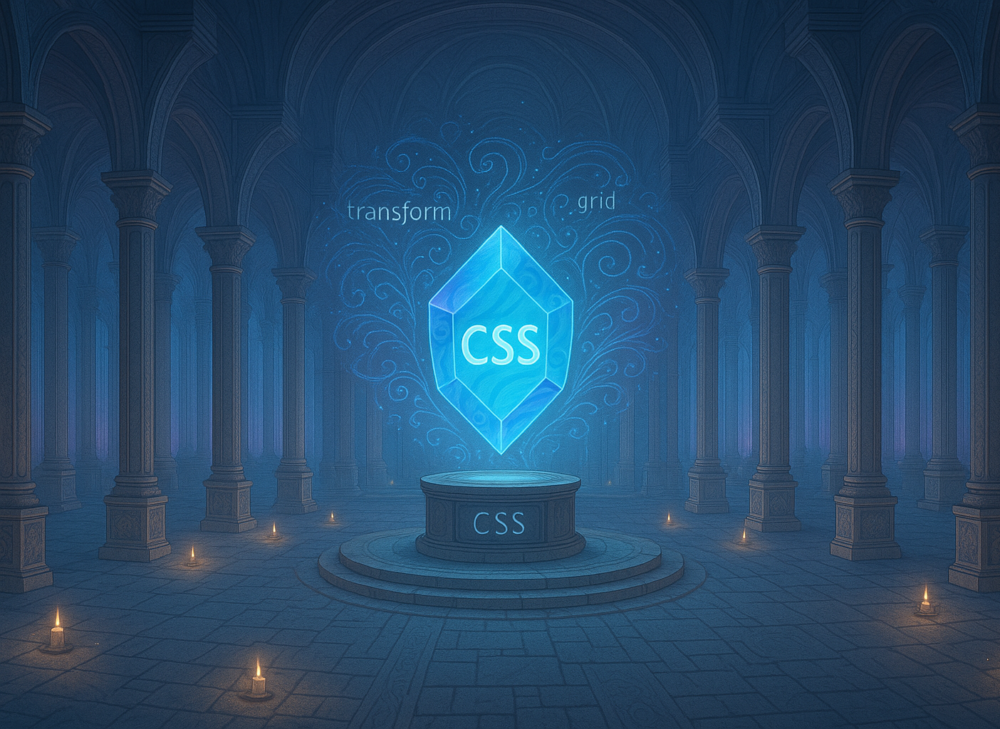

  

 

# CSS (Cascading Style Sheets)

**CSS**, sigla para **Cascading Style Sheets (Folhas de Estilo em Cascata)**, é a linguagem padrão utilizada para definir a **aparência visual de páginas web**. Criado para separar o conteúdo da apresentação, o CSS permite estilizar elementos HTML de forma precisa, controlando cores, fontes, tamanhos, espaçamentos, posicionamentos e até mesmo animações. Enquanto o HTML estrutura o conteúdo, o CSS é responsável por deixá-lo visualmente atraente e coerente com a identidade desejada para o site.

A principal característica do CSS é a utilização de regras de estilo, que associam seletores (como `body`, `.classe`, `#id`) a conjuntos de declarações. Cada declaração especifica uma propriedade (como `color`, `font-size`, `margin`) e um valor correspondente. Por exemplo, a regra `p { color: blue; }` define que todos os parágrafos da página terão o texto azul. Essas regras podem ser escritas diretamente no HTML (estilo embutido), dentro de uma tag `<style>` (estilo interno) ou em arquivos externos com extensão `.css` (estilo externo), promovendo reutilização e organização do código.

O termo "em cascata" refere-se ao mecanismo de hierarquia do CSS, onde múltiplas regras podem se aplicar a um mesmo elemento, e o navegador decide qual estilo prevalecerá com base em fatores como especificidade, ordem de declaração e herança. Esse modelo confere grande flexibilidade ao desenvolvedor, permitindo criar desde layouts simples até interfaces complexas e responsivas, que se adaptam a diferentes dispositivos e tamanhos de tela.

Com o tempo, o CSS evoluiu significativamente. Versões mais recentes, como o CSS3, trouxeram recursos avançados como transições, transformações, _flexbox_, _grid layout_, variáveis CSS e suporte a animações, tornando possível construir interfaces ricas sem depender exclusivamente de scripts ou imagens externas.

O CSS é uma das tecnologias fundamentais da web, ao lado do HTML e do JavaScript. Dominar o CSS é essencial para quem deseja criar experiências visuais profissionais e responsivas, sendo uma habilidade indispensável no desenvolvimento front-end moderno.

## Índice de Conteúdos

Abaixo segue o índice com diversos conteúdos sobre a linguagem. Pode-se considerar esta como uma mini documentação de referência. Vale ressaltar que este material foi elaborado com base na versão 3 da linguagem.

- [Estrutura Básica](./contents/01-estrutura/README.md)
