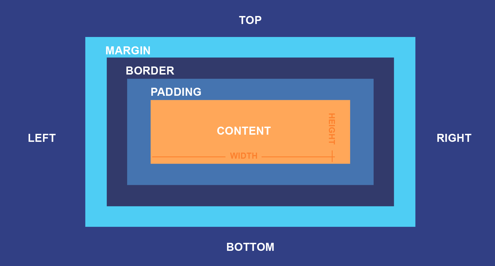

# Capítulo 13 – O Box Model: A Fundação do Layout

Até agora, nossa jornada pelo CSS nos levou a um profundo entendimento de como selecionar e estilizar elementos. Dominamos a tipografia, as cores, os planos de fundo e um arsenal completo de seletores. Sabemos como fazer nossos elementos parecerem bonitos, mas agora precisamos responder a uma pergunta ainda mais fundamental: como os elementos ocupam espaço na página? Como suas dimensões são calculadas e como eles interagem entre si para formar um layout?

A resposta para tudo isso reside no conceito mais essencial de todo o CSS: o **Box Model**, ou Modelo de Caixa. No CSS, tudo é uma caixa. Cada elemento HTML que você renderiza no navegador — seja um parágrafo, um título, uma imagem ou uma `div` — é tratado como uma caixa retangular. O Box Model é o conjunto de regras que define como as dimensões dessa caixa são calculadas e como as diferentes partes que a compõem (conteúdo, espaçamento interno, bordas e espaçamento externo) se relacionam.

Neste capítulo, vamos dissecar a anatomia de uma caixa no CSS. Entenderemos suas quatro camadas concêntricas: o conteúdo, o preenchimento (padding), a borda (border) e a margem (margin). O foco principal, no entanto, será na propriedade `box-sizing`, a regra de ouro que define como a largura (`width`) и а altura (`height`) de um elemento são calculadas em relação a essas camadas. Dominar o Box Model e, especialmente, o `box-sizing`, é o pré-requisito absoluto para criar layouts previsíveis, robustos e livres de frustração.

## A Anatomia de uma Caixa

Todo elemento HTML é composto por quatro "caixas" ou áreas, uma dentro da outra. Pense nelas como as camadas de uma cebola, do centro para fora:

1. **A Caixa de Conteúdo (Content Box):** Esta é a área mais interna, onde seu conteúdo real é exibido. Para um parágrafo, é o texto; para uma imagem, é a própria imagem. Suas dimensões são, por padrão, o que você define com as propriedades `width` e `height`.
2. **A Caixa de Preenchimento (Padding Box):** Esta é uma área de espaçamento transparente que envolve a caixa de conteúdo. O preenchimento (padding) cria um espaço "respirável" entre o conteúdo e a borda.
3. **A Caixa de Borda (Border Box):** A borda que envolve a caixa de preenchimento. Ela tem uma espessura e um estilo definidos.
4. **A Caixa de Margem (Margin Box):** A camada mais externa. A margem (margin) é um espaçamento transparente que envolve a borda, criando um espaço entre este elemento e os elementos vizinhos.

Visualmente, podemos representar assim:

<div align="center">
  
</div>

## `box-sizing`: A Regra que Muda Tudo

Agora, a pergunta de um milhão de dólares: se eu defino `width: 300px;`, a que parte da caixa esses 300px se referem? A resposta depende do valor da propriedade `box-sizing`. Esta propriedade controla exatamente como a largura e a altura totais de um elemento são calculadas.

### `content-box` (O Padrão Problemático)

Por padrão, todos os elementos têm `box-sizing: content-box;`. Neste modelo:

- As propriedades `width` e `height` que você define se aplicam **apenas à caixa de conteúdo**.
- O padding e a border são **adicionados por fora** dessa largura e altura.

Isso significa que a largura total que o elemento ocupa na tela é: **`width` + `padding-left` + `padding-right` + `border-left-width` + `border-right-width`**.

**Exemplo Prático:** Vamos criar uma caixa que **deveria** ter 300px de largura.

```html
<div class="caixa-content-box">Eu não tenho 300px de largura total.</div>
```

```css
.caixa-content-box {
  box-sizing: content-box; /* O padrão, mas explícito aqui */
  width: 300px;
  padding: 20px;
  border: 10px solid steelblue;
  background-color: lightblue;
}
```

**Qual a largura real desta caixa na tela?** Largura do conteúdo (300px) + Padding esquerdo (20px) + Padding direito (20px) + Borda esquerda (10px) + Borda direita (10px) = **360px**.

Este comportamento é extremamente contraintuitivo para criar layouts. Se você quisesse duas caixas lado a lado dentro de um contêiner de 600px, definir `width: 300px` para cada uma não funcionaria assim que você adicionasse qualquer padding ou border.

### `border-box` (O Modelo Intuitivo e Moderno)

Para resolver a confusão do `content-box`, temos o valor `border-box`. Neste modelo:

- As propriedades `width` e `height` que você define se aplicam à área que **inclui o conteúdo, o padding E a border**.
- A caixa de conteúdo interna **encolherá** para dar espaço ao padding e à border.

Isso significa que a largura total que o elemento ocupa na tela (excluindo a margem) é **exatamente o valor que você definiu para `width`**.

**Exemplo Prático:** Vamos criar a mesma caixa, mas agora com `border-box`.

```html
<div class="caixa-border-box">Eu tenho exatamente 300px de largura total.</div>
```

```css
.caixa-border-box {
  box-sizing: border-box;
  width: 300px;
  padding: 20px;
  border: 10px solid seagreen;
  background-color: lightgreen;
}
```

**Qual a largura real desta caixa na tela?** **300px**. Simples assim. O navegador faz o cálculo para você: A largura total é 300px. Desses 300px, 20px são para a borda (10+10) e 40px para o padding (20+20). Portanto, a área de conteúdo restante encolhe para 240px.

Com `border-box`, se você quiser duas caixas lado a lado, pode definir `width: 50%` para cada uma, adicionar o padding e a borda que quiser, e elas continuarão a se encaixar perfeitamente.

## Palavras-chave Globais: `initial` e `inherit`

Assim como em outras propriedades CSS, `box-sizing` também aceita valores globais que controlam seu comportamento de forma explícita.

### `initial`

A palavra-chave `initial` redefine uma propriedade para seu valor padrão inicial, conforme definido na especificação do CSS. No caso de `box-sizing`, o valor inicial é `content-box`.

```css
.meu-componente {
  /* Força o uso do modelo de caixa padrão, mesmo que um reset global tenha sido aplicado */
  box-sizing: initial;
}
```

### `inherit`

Esta palavra-chave instrui o elemento a herdar o valor da propriedade `box-sizing` de seu elemento pai direto. Este é um conceito poderoso, especialmente quando usado em um reset global, como veremos nas boas práticas.

**Exemplo:**

```html
<div class="pai-border-box">
  <div class="filho-herda">O filho herda o box-sizing do pai.</div>
</div>
```

```css
.pai-border-box {
  box-sizing: border-box;
}

.filho-herda {
  box-sizing: inherit; /* Este elemento agora se comportará como border-box */
}
```

## Boas Práticas de Desenvolvimento: O Reset Universal do `box-sizing`

Dado que `border-box` é muito mais previsível e fácil de usar para a criação de layouts, é uma prática padrão na indústria do desenvolvimento web aplicá-lo a todos os elementos da página desde o início. A forma mais elegante e robusta de fazer isso é com o seguinte snippet, que você verá em quase todos os frameworks e resets de CSS modernos:

```css
html {
  box-sizing: border-box;
}

*, *::before, *::after {
  box-sizing: inherit;
}
```

**Por que este método é tão bom?**

1. Ele define `box-sizing: border-box` no elemento `<html>`.
2. Em seguida, ele seleciona todos os elementos (`*`), e também todos os pseudo-elementos `::before` e `::after`, e define seu `box-sizing` como `inherit`.
3. Isso significa que, por padrão, todos os elementos herdarão o `border-box` do elemento `<html>`.
4. A grande vantagem é que, se você precisar que um componente específico use o `content-box` por algum motivo, você pode simplesmente aplicar `box-sizing: content-box;` a ele, e seus filhos herdarão esse novo valor, sem quebrar o comportamento do resto da página. É um sistema flexível e à prova de futuro.

**É altamente recomendável que você adicione este bloco de código no topo de todas as suas folhas de estilo.**

## Considerações Finais

Neste capítulo, desvendamos o conceito mais fundamental do layout em CSS: o **Box Model**. Compreendemos que cada elemento na web é uma caixa composta por quatro camadas: conteúdo, preenchimento, borda e margem.

O ponto mais crucial de nossa discussão foi a propriedade `box-sizing`. Vimos como o modelo padrão, `content-box`, pode levar a cálculos de dimensão contraintuitivos, e como `border-box` simplifica drasticamente a criação de layouts, tornando a largura e a altura de nossos elementos previsíveis e fáceis de gerenciar. Adotar o reset universal do `box-sizing: border-box` não é apenas uma boa prática — é o padrão profissional para o desenvolvimento web moderno.

Com um entendimento sólido de como as dimensões de uma caixa são calculadas, estamos agora perfeitamente preparados para explorar as propriedades que definem o tamanho de cada camada dessa caixa. Nos próximos capítulos, vamos detalhar o funcionamento de `margin`, `padding`, `border` e `outline`, as ferramentas que nos darão controle total sobre o espaçamento e a aparência de nossos componentes.