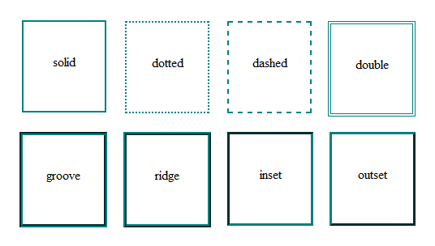
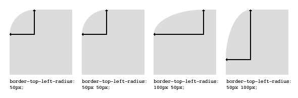

# Capítulo 15 – Bordas e Contornos

Nos capítulos anteriores, desvendamos o Box Model, aprendendo a controlar as dimensões de um elemento com `box-sizing` e a gerenciar o espaço ao redor e dentro dele com `margin` e `padding`. Agora, vamos focar na linha que visualmente define os limites de um elemento, separando o seu espaço interno (padding) do seu espaço externo (margin): a **borda (border)**.

A borda é muito mais do que uma simples linha. Ela é uma poderosa ferramenta de design que pode ser usada para agrupar conteúdo, criar separação visual, dar ênfase a elementos interativos e adicionar um acabamento estético sofisticado. Com o CSS, temos um controle minucioso sobre a espessura, o estilo e a cor de uma borda. Podemos criar desde linhas sólidas e nítidas até bordas pontilhadas, tracejadas, duplas e até mesmo arredondar seus cantos para criar designs mais suaves e modernos.

Neste capítulo, faremos uma exploração completa das propriedades de borda. Vamos detalhar como controlar cada aspecto de uma borda e como usar os atalhos para um código mais limpo. Daremos uma atenção especial à propriedade `border-radius`, que revolucionou o design web ao permitir a criação de cantos arredondados. Mergulharemos em técnicas avançadas, como bordas com imagens e a simulação de múltiplas bordas. Por fim, vamos diferenciar a borda de sua "prima", a propriedade **`outline` (contorno)**, entendendo seu propósito principal relacionado à acessibilidade.

## As Propriedades Fundamentais da Borda

Uma borda é definida por três características principais: sua espessura (`border-width`), seu estilo (`border-style`) e sua cor (`border-color`).

### `border-width`

Define a espessura da borda. Pode ser definida com unidades de medida (`px`, `em`, `rem`) ou com as palavras-chave `thin` (fina), `medium` (média - padrão) e `thick` (grossa). Assim como `margin` e `padding`, você pode fornecer de um a quatro valores para controlar os lados individualmente.

```html
<div class="exemplo-width">Esta caixa tem espessuras de borda diferentes.</div>
```

```css
.exemplo-width {
  border-style: solid;
  border-color: steelblue;
  /* 5px topo, 10px direita, 15px baixo, 20px esquerda */
  border-width: 5px 10px 15px 20px;
}
```

### `border-style`

Esta é a **propriedade mais importante**. Se `border-style` não for definido (seu padrão é `none`), nenhuma borda será visível, independentemente dos valores de `border-width` ou `border-color`.

Os valores possíveis são:

- `solid`: Uma linha sólida e única. O mais comum.
- `dotted`: Uma linha composta por pontos redondos.
- `dashed`: Uma linha composta por traços.
- `double`: Duas linhas sólidas paralelas. `border-width` define a soma da espessura das duas linhas e do espaço entre elas.
- `groove`: Faz a borda parecer "entalhada" na página.
- `ridge`: O oposto de `groove`, faz a borda parecer "saltada".
- `inset`: Faz a caixa inteira parecer afundada na página.
- `outset`: O oposto de `inset`, faz a caixa inteira parecer saltada.
- `none`: Nenhuma borda.
- `hidden`: O mesmo que `none`, mas tem relevância no colapso de bordas de tabelas.

```html
<div class="style-box solid">solid</div>
<div class="style-box dotted">dotted</div>
<div class="style-box dashed">dashed</div>
<div class="style-box double">double</div>
<div class="style-box groove">groove</div>
<div class="style-box ridge">ridge</div>
<div class="style-box inset">inset</div>
<div class="style-box outset">outset</div>
```

```css
.style-box {
  border-width: 5px;
  border-color: darkslateblue;
  padding: 10px;
  margin: 10px;
}
.solid { border-style: solid; }
.dotted { border-style: dotted; }
.dashed { border-style: dashed; }
.double { border-style: double; }
.groove { border-style: groove; }
.ridge { border-style: ridge; }
.inset { border-style: inset; }
.outset { border-style: outset; }
```

<div align="center">
  
</div>

### `border-color`

Define a cor da borda, usando qualquer formato de cor válido do CSS. Se não for definida, ela herda a `color` (cor do texto) do elemento. Você também pode fornecer de um a quatro valores para colorir cada lado de forma diferente.

```html
<div class="borda-colorida"></div>
```

```css
.borda-colorida {
  width: 100px;
  height: 100px;
  border-style: solid;
  border-width: 10px;
  /* topo=red, direita=green, baixo=blue, esquerda=gold */
  border-color: red green blue gold;
}
```

### `border` (Shorthand - Atalho Principal)

Na prática, é raro ver as três propriedades acima usadas separadamente. A forma mais comum de definir uma borda simples é com a propriedade de atalho `border`, que aceita os três valores em qualquer ordem (embora a ordem `width style color` seja a convenção).

**Exemplo:**

```css
.caixa-com-borda {
  /* Define uma borda sólida, com 2px de espessura e cor steelblue */
  border: 2px solid steelblue;
}
```

### Controlando Lados Individuais (`border-top`, `border-right`, etc.)

Você pode estilizar a borda de cada lado de um elemento de forma independente usando propriedades específicas para cada lado, que também são atalhos para `border-[side]-width`, `border-[side]-style` e `border-[side]-color`.

```html
<div class="seta-para-baixo"></div>
```

```css
.aba-ativa {
  border-top: 3px solid #007bff;
  border-right: 1px solid #ccc;
  border-bottom: none; /* Remove a borda inferior */
  border-left: 1px solid #ccc;
}

/* Criando uma forma de triângulo com bordas */
.seta-para-baixo {
  width: 0;
  height: 0;
  border-left: 20px solid transparent;
  border-right: 20px solid transparent;
  border-top: 20px solid navy; /* Apenas a borda superior é colorida */
}
```

## Bordas Arredondadas com `border-radius`

A propriedade `border-radius` permite suavizar os cantos de um elemento. Ela pode receber de um a quatro valores para controlar cada canto individualmente, similar à sintaxe de `margin` e `padding`.

- **Um valor:** `border-radius: 15px;` (Aplica a todos os quatro cantos).
- **Dois valores:** `border-radius: 10px 30px;` (10px para topo-esquerda/baixo-direita, 30px para topo-direita/baixo-esquerda).
- **Quatro valores:** `border-radius: 10px 20px 30px 40px;` (topo-esquerda, topo-direita, baixo-direita, baixo-esquerda - sentido horário).

```html
<div class="box radius-1">Um valor</div>
<div class="box radius-4">Quatro valores</div>
<div class="box circulo">Círculo</div>
```

```css
.box { width: 150px; height: 80px; background: lightcoral; margin:10px;}
.radius-1 { border-radius: 15px; }
.radius-4 { border-radius: 0px 20px 40px 60px; }
.circulo { width: 80px; border-radius: 50%; } /* Cria um círculo se a caixa for um quadrado */
```

### `border-radius` Elíptico (Dois Conjuntos de Valores)

A sintaxe do `border-radius` pode se tornar ainda mais poderosa, permitindo a criação de cantos elípticos. Isso é feito fornecendo dois conjuntos de valores separados por uma barra (`/`). O primeiro conjunto define os raios **horizontais** e o segundo os raios **verticais**.

**Sintaxe:** `border-radius: [raios-horizontais] / [raios-verticais];`

**Exemplo (`border-radius: 10px 5% / 20px 30px`):**

- **Canto superior esquerdo:** Raio horizontal de `10px`, raio vertical de `20px`.
- **Canto superior direito:** Raio horizontal de `5%`, raio vertical de `30px`.
- **Canto inferior direito:** Raio horizontal de `10px`, raio vertical de `20px`.
- **Canto inferior esquerdo:** Raio horizontal de `5%`, raio vertical de `30px`.

### Propriedades `longhand` para `border-radius`

Você também pode controlar cada canto individualmente. Para cada canto, você pode fornecer um (raio circular) ou dois (raio elíptico) valores.

- `border-top-left-radius`
- `border-top-right-radius`
- `border-bottom-right-radius`
- `border-bottom-left-radius`

<div align="center">
  
</div>

**Exemplo (Forma de Folha):**

```html
<div class="folha"></div>
```

```css
.folha {
  width: 150px;
  height: 150px;
  background: green;
  /* Arredonda muito um canto e o seu oposto na diagonal */
  border-top-left-radius: 80%;
  border-bottom-right-radius: 80%;
}
```

## Técnicas Avançadas de Bordas

### Bordas Múltiplas

A propriedade `border` só permite desenhar uma única linha. Para simular múltiplas bordas, podemos usar algumas técnicas criativas:

1. **`outline` + `outline-offset`:** O contorno (`outline`) desenha uma linha fora da borda, e o `outline-offset` pode criar um espaço entre eles.
2. **`box-shadow`:** Podemos criar múltiplas sombras de caixa sem desfoque (`blur`) e com propagação (`spread`) para imitar bordas.

**Exemplo (com `box-shadow`):**

```html
<div class="bordas-multiplas">Múltiplas Bordas</div>
```

```css
.bordas-multiplas {
  background: white;
  padding: 20px;
  /* A sintaxe é: offset-x offset-y blur spread color */
  /* Usamos offset 0 e blur 0, e controlamos a "espessura" com o spread */
  box-shadow: 0 0 0 5px red, /* Borda vermelha de 5px */
              0 0 0 10px blue, /* Borda azul de 5px (10px total - 5px da anterior) */
              0 0 0 15px green; /* Borda verde de 5px (15px total - 10px das anteriores) */
}
```

### `border-image`

Esta propriedade permite que você use uma imagem como borda de um elemento. O navegador "fatiará" a imagem e a aplicará aos cantos e lados da borda.

**Exemplo (Bordas Multicoloridas com Gradiente):** A aplicação mais poderosa de `border-image` é usar um gradiente linear como fonte da imagem.

```html
<div class="caixa-com-borda-gradiente">Borda de Gradiente</div>
```

```css
.caixa-com-borda-gradiente {
  padding: 2rem;
  text-align: center;
  border: 10px solid; /* A espessura da borda é necessária */
  /* 1. Define o gradiente como a fonte da imagem */
  border-image-source: linear-gradient(45deg, gold, fuchsia, turquoise);
  /* 2. "Fatia" a imagem-fonte. O valor 1 significa que a imagem inteira
        será usada para preencher a área da borda sem ser fatiada internamente.*/
  border-image-slice: 1;
}
```

### `border-collapse` (Para Tabelas)

Esta propriedade controla como as bordas de células em uma tabela são renderizadas.

- `separate` (padrão): Cada célula tem sua própria borda individual. A distância entre elas é controlada pela propriedade `border-spacing`.
- `collapse`: As bordas adjacentes das células são fundidas em uma única borda, criando uma aparência de grade mais limpa.

## Outline (Contorno)

O `outline` desenha uma linha **fora da borda** de um elemento. Ele é muito semelhante à borda, mas com duas diferenças cruciais:

1. **Não ocupa espaço:** O outline é desenhado "por cima" do layout e não afeta a posição ou o tamanho de nenhum elemento (não faz parte do Box Model).
2. **Seu principal objetivo é acessibilidade:** Navegadores usam `outline` para indicar qual elemento está com foco (quando se navega com a tecla `Tab`).

As propriedades são análogas às da borda:

- `outline-width`
- `outline-style`
- `outline-color`
- `outline` (shorthand)

Além disso, temos o `outline-offset`, que adiciona um espaço entre o contorno e a borda do elemento.

**Exemplo:**

```css
/* Melhora o estilo de foco padrão para botões */
button:focus {
  /* Contorno azul, tracejado, com 2px de espessura e 4px de distância da borda */
  outline: 2px dashed #007bff;
  outline-offset: 4px;
}
```

## Boas Práticas de Desenvolvimento

São práticas recomendadas:

- **Nunca Remova o `outline` sem um Substituto:** Muitos desenvolvedores removem o contorno de foco (`outline: none;`) por razões estéticas. **Isso é péssimo para a acessibilidade**, pois torna impossível para usuários de teclado saberem qual elemento está selecionado. Se você remover o `outline`, **sempre** forneça uma alternativa clara, como um `box-shadow` ou um `background-color` diferente no estado `:focus`.
- **Use `border: 0;` em vez de `border: none;`:** Embora funcionalmente idênticos, `border: 0;` é ligeiramente mais curto e consistente com outras propriedades que usam `0` para ausência de valor (como `margin: 0;`).
- **Aproveite o `border-radius`:** Bordas arredondadas podem tornar uma interface mais amigável e moderna. Use-as para suavizar botões, caixas de input, cards e contêineres.
- **Use `border` para Debug:** Temporariamente adicionar `border: 1px solid red;` a um elemento é uma das maneiras mais rápidas e fáceis de visualizar seu tamanho e posição exatos durante o desenvolvimento e depuração de layouts.
- **Lembre-se do Box Model:** A espessura da `border` é adicionada à dimensão total do elemento quando se usa `box-sizing: content-box`. Use `box-sizing: border-box;` para garantir que a borda seja incluída na largura que você define.

## Considerações Finais

Neste capítulo, exploramos em profundidade como dar forma e definição aos nossos elementos com as propriedades `border` e `outline`. Vimos como controlar a espessura, o estilo e a cor de uma borda, e como o `border-radius` nos dá o poder de criar desde cantos sutilmente suavizados até formas circulares complexas.

Avançamos para técnicas mais sofisticadas, como o uso de gradientes para criar bordas multicoloridas com `border-image` e a simulação de múltiplas bordas com `box-shadow` e `outline`. Mais importante ainda, estabelecemos a distinção crucial entre a borda, que faz parte do layout, e o contorno, que é uma ferramenta de feedback visual para acessibilidade.

Com um domínio completo sobre todas as camadas do Box Model, estamos agora prontos para o próximo grande salto: controlar o posicionamento e o fluxo dos elementos na página. No próximo capítulo, vamos mergulhar na propriedade `display`, a chave que destrava os poderosos modelos de layout do CSS, como **Flexbox** e **Grid**.