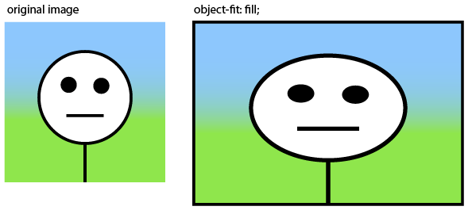
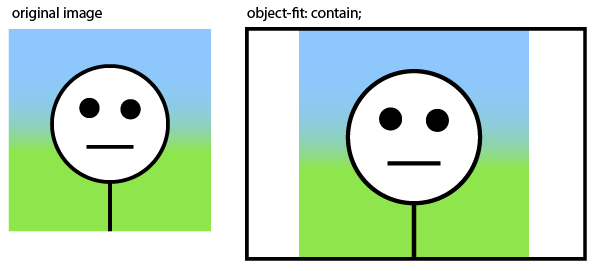
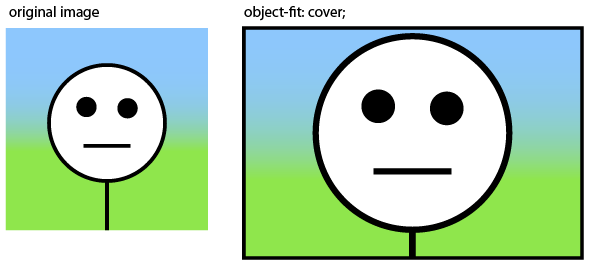
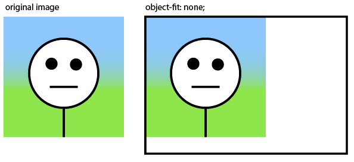

# Capítulo 16 – Ajuste de Objetos com `object-fit`

Ao longo da nossa jornada pelo CSS, aprendemos a criar caixas e contêineres de todos os tamanhos e formas. Dominamos o Box Model, as bordas e os planos de fundo. No entanto, quando inserimos conteúdo dentro dessas caixas — especialmente conteúdo de mídia como imagens (``) ou vídeos (`<video>`) — enfrentamos um desafio clássico: o que acontece quando as proporções do nosso conteúdo não correspondem às proporções da caixa que o contém?

Por padrão, se você define uma `width` e uma `height` para uma tag `` que não correspondem à proporção original da imagem, o navegador irá esticar ou esmagar a imagem para que ela preencha o espaço, resultando em uma distorção feia e pouco profissional. Por muito tempo, a solução para este problema era um "truque": usar a imagem como um `background-image` em uma `div` e aplicar `background-size: cover` ou `contain`. Embora funcional, esta abordagem é semanticamente incorreta, pois a imagem, que é parte do conteúdo, é relegada a uma função puramente decorativa no CSS, prejudicando a acessibilidade e o SEO.

Felizmente, o CSS moderno nos oferece uma solução direta, elegante e semanticamente correta para este problema: a propriedade **`object-fit`**. Esta propriedade nos dá o mesmo nível de controle que tínhamos com `background-size`, mas para elementos de conteúdo como `` e `<video>`.

Neste capítulo, vamos mergulhar na propriedade `object-fit`, entendendo como ela nos permite ditar a forma como uma imagem ou vídeo se encaixa em seu contêiner. Exploraremos cada um de seus valores, desde o comportamento de preenchimento até o de cobertura e contenção. Aprenderemos também a usar sua propriedade complementar, `object-position`, para controlar qual parte do nosso conteúdo deve permanecer visível quando ele é cortado.

## O Problema: Distorção de Imagens

Vamos primeiro visualizar o problema que `object-fit` veio para resolver.

```html
<div class="container-imagem">
  <!-- Imagem com proporção 4:3 (horizontal) -->
  
</div>
```

```css
.container-imagem {
  width: 200px;
  height: 250px; /* Um contêiner com proporção vertical */
  border: 2px solid steelblue;
}

.container-imagem img {
  width: 100%;
  height: 100%;
  /* Nenhum object-fit definido, então o padrão é 'fill' */
}
```

**Resultado:** A imagem será esmagada horizontalmente e esticada verticalmente para caber exatamente no contêiner de 200x250 pixels, ficando visivelmente distorcida.

## A Solução: A Propriedade `object-fit`

A propriedade `object-fit` é aplicada diretamente ao elemento de mídia (ex: `img`, `video`) e dita como ele deve ser redimensionado para se ajustar ao seu contêiner.

### `object-fit: fill`

Este é o **valor padrão**. Ele redimensiona o conteúdo para preencher completamente a caixa do elemento. Se as proporções do objeto e da caixa não corresponderem, o conteúdo será distorcido. É exatamente o comportamento que vimos no exemplo problemático acima.

<div align="center">
  
</div>

### `object-fit: contain`

Este valor redimensiona o conteúdo para ser o maior possível dentro de seu contêiner, mas **sem distorcê-lo ou cortá-lo**. A proporção da imagem é mantida. Se a proporção do contêiner for diferente da imagem, haverá um espaço vazio nas laterais ou na parte superior e inferior (efeito conhecido como "letterboxing").

<div align="center">
  
</div>

**Exemplo:**

```css
img.exemplo-contain {
  width: 100%;
  height: 100%;
  object-fit: contain;
}
```

**Resultado:** Usando o mesmo HTML e contêiner do nosso exemplo inicial, a imagem de 400x300 será redimensionada para ter 200px de largura, e sua altura será ajustada proporcionalmente para 150px. Como o contêiner tem 250px de altura, sobrarão 50px de espaço vazio acima e 50px abaixo da imagem. A imagem inteira estará visível.

### `object-fit: cover`

Este é um dos valores mais úteis. Ele redimensiona o conteúdo para **cobrir completamente a área do contêiner**, mantendo sua proporção e **sem distorção**. Para conseguir isso, o navegador irá "cortar" partes da imagem que excedam os limites do contêiner (seja nas laterais ou no topo/baixo).

<div align="center">
  
</div>

**Exemplo:**

```css
img.exemplo-cover {
  width: 100%;
  height: 100%;
  object-fit: cover;
}
```

**Resultado:** Para preencher o contêiner de 200x250, a imagem de 400x300 será redimensionada para ter 250px de altura, e sua largura será ajustada proporcionalmente para aproximadamente 333px. Como o contêiner tem apenas 200px de largura, as partes esquerda e direita da imagem serão cortadas. O contêiner ficará totalmente preenchido pela parte central da imagem.

### `object-fit: none`

Com este valor, o conteúdo **não é redimensionado**. Ele é renderizado em seu tamanho intrínseco (seu tamanho original) e posicionado dentro do contêiner. Se o conteúdo for maior que o contêiner, ele será simplesmente cortado.

<div align="center">
  
</div>

**Exemplo:**

```css
img.exemplo-none {
  width: 100%;
  height: 100%;
  object-fit: none;
}
```

**Resultado:** A imagem original de 400x300 será posicionada dentro do contêiner de 200x250. Como ela é maior em ambas as dimensões, veremos apenas o canto superior esquerdo de 200x250 pixels da imagem.

### `object-fit: scale-down`

Este valor tem um comportamento inteligente. Ele compara o resultado de usar `none` e `contain`, e escolhe **aquele que resultar em um tamanho de imagem menor**. Na prática, isso impede que uma imagem pequena seja ampliada e perca qualidade (`none`), ao mesmo tempo que garante que uma imagem grande seja reduzida para caber no contêiner (`contain`).

**Exemplo:**

```css
img.exemplo-scale-down {
  width: 100%;
  height: 100%;
  object-fit: scale-down;
}
```

**Resultado:** Se a imagem original fosse menor que o contêiner (ex: 100x75), ela seria exibida com 100x75 pixels (o resultado de `none`). Se a imagem fosse maior (ex: 400x300), ela seria reduzida para caber no contêiner (o resultado de `contain`).

## Controlando o Foco: `object-position`

Quando usamos `object-fit: cover` ou `contain`, o navegador centraliza a imagem dentro da caixa por padrão. Mas e se a parte mais importante da nossa foto não estiver no centro? A propriedade `object-position` nos permite controlar o alinhamento do conteúdo dentro de sua caixa, funcionando exatamente como a propriedade `background-position`.

**Sintaxe:** `object-position: x-pos y-pos;` Os valores podem ser palavras-chave (`top`, `center`, `bottom`, `left`, `right`) ou unidades (`px`, `%`, `rem`).

**Exemplo Prático: Focando em um Rosto** Imagine uma foto de retrato vertical que precisa ser exibida em um contêiner de cartão horizontal.

```html
<div class="card-container">
  <!-- Imagem de retrato, mais alta do que larga -->
  
</div>
```

```css
.card-container {
  width: 250px;
  height: 150px; /* Contêiner horizontal */
  border: 1px solid #ccc;
}
.card-container img {
  width: 100%;
  height: 100%;
  object-fit: cover;
  /* Por padrão, o centro da imagem seria mostrado (o torso da pessoa).
     Com a linha abaixo, alinhamos o topo da imagem com o topo do contêiner,
     garantindo que o rosto fique visível. */
  object-position: top; /* ou 50% 0% */
}
```

Com `object-position`, garantimos que a parte mais importante da imagem — o rosto — seja o ponto de foco, mesmo quando a imagem é cortada para preencher o contêiner.

## Boas Práticas com `object-fit`

São boas práticas:

- **Use `object-fit` em vez de `background-image` para Conteúdo:** Se uma imagem é conteúdo (um avatar de usuário, uma foto de produto, uma imagem principal de um artigo), use sempre a tag `` com `object-fit`. Isso é melhor para acessibilidade (leitores de tela leem o atributo `alt`) e SEO. Reserve `background-image` para imagens puramente decorativas.
- **Combine com `aspect-ratio`:** Para criar contêineres de imagem responsivos que mantêm sua proporção, a propriedade `aspect-ratio` é a parceira ideal para `object-fit`. Isso evita que você tenha que definir alturas fixas.

    ```css
    .responsive-image-box {
      width: 100%;
      aspect-ratio: 16 / 9; /* Mantém a proporção de um vídeo widescreen */
    }
    .responsive-image-box img {
      width: 100%;
      height: 100%;
      object-fit: cover;
    }
    ```

- **Ideal para Conteúdo Gerado pelo Usuário:** `object-fit: cover` é a solução perfeita para layouts onde as imagens são enviadas por usuários e podem ter qualquer tamanho ou proporção (galerias de fotos, avatares, feeds de notícias). Ele garante que o design da sua grade não quebre, não importa o que o usuário envie.
- **Lembre-se da Acessibilidade:** Mesmo que partes de uma imagem sejam cortadas visualmente por `object-fit: cover`, o atributo `alt` deve descrever a imagem completa. Um usuário de leitor de tela não tem a percepção visual do corte e depende do texto alternativo para entender o contexto do conteúdo.

## Considerações Finais

Neste capítulo, desvendamos as propriedades `object-fit` e `object-position`, as ferramentas modernas e essenciais para controlar como o conteúdo de mídia se ajusta aos seus contêineres. Vimos como elas resolvem o antigo problema de distorção de imagens de forma elegante e semanticamente correta, liberando-nos do uso de `background-image` como um paliativo.

Com valores como `contain` e `cover`, ganhamos o poder de criar layouts de imagem robustos e flexíveis, que se adaptam graciosamente a diferentes proporções, especialmente em cenários com conteúdo dinâmico ou gerado pelo usuário.

Com um domínio completo sobre como os elementos são dimensionados, espaçados e agora, como seu conteúdo se encaixa, estamos prontos para mergulhar nos sistemas de layout que organizam todas essas caixas na página.