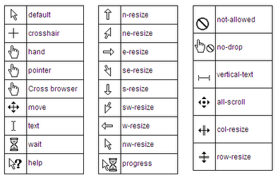

# Capítulo 19 – Estilizando o Cursor e a Interação

Ao longo de nossa jornada pelo CSS, focamos intensamente em como os elementos se parecem e se comportam na página. Mas há um elemento da experiência do usuário que atua como a ponte principal entre o usuário e a interface: o **cursor**. O cursor do mouse é a extensão da mão do usuário no ambiente digital. A forma como ele se apresenta e reage é uma forma de comunicação sutil, mas extremamente poderosa.

Mudar a forma do cursor fornece um feedback instantâneo e intuitivo. Ele diz ao usuário "você pode clicar aqui", "você pode arrastar isto", "o sistema está ocupado, por favor aguarde" ou "esta ação não é permitida". Usar o cursor correto para a tarefa certa não é apenas um detalhe estético; é um pilar da boa usabilidade (UX).

Neste capítulo, vamos explorar como podemos controlar essa ferramenta de comunicação vital. Mergulharemos na propriedade **`cursor`**, detalhando seu vasto leque de valores predefinidos que cobrem quase todos os cenários de interação imagináveis. Iremos além, aprendendo a usar imagens customizadas para criar cursores únicos. Em seguida, desvendaremos a propriedade **`pointer-events`**, uma ferramenta poderosa que nos permite "desligar" a interatividade de um elemento. Por fim, daremos um toque de polimento às nossas interfaces de texto com a propriedade **`caret-color`**.

## A Propriedade `cursor`

A propriedade `cursor` especifica qual ícone de cursor do mouse deve ser exibido quando o ponteiro está sobre um elemento.

**Sintaxe:**

```css
.seletor {
  cursor: valor;
}
```

Os valores podem ser agrupados em categorias lógicas.

### Cursores Gerais e de Interação

Estes são os cursores mais comuns que comunicam estados básicos.

|Valor|Descrição|Exemplo de Uso|
|---|---|---|
|`default`|O cursor padrão do sistema operacional (geralmente uma seta).|Para o corpo da página e elementos não interativos.|
|`pointer`|A mão com o dedo indicador apontando. O cursor universal para indicar que algo é clicável.|Links (`<a>`), botões (`<button>`), e qualquer elemento com um evento de clique.|
|`text`|A barra vertical (I-beam), indicando que o texto pode ser selecionado.|Parágrafos, títulos e campos de texto.|
|`help`|Um ponto de interrogação ao lado do cursor, indicando que ajuda contextual está disponível.|Ícones de ajuda ou elementos com dicas de contexto (tooltips).|
|`crosshair`|Uma cruz, usada para seleção precisa em áreas como imagens ou mapas.|Ferramentas de "cortar imagem" ou de seleção de coordenadas.|

**Nota sobre `hand`:** Você pode encontrar o valor `hand` em códigos mais antigos. Ele era uma alternativa não padronizada para `pointer`. O valor correto e universalmente suportado hoje é **`pointer`**.

### Cursores de Status

Informam ao usuário que o sistema está em um determinado estado.

|Valor|Descrição|Exemplo de Uso|
|---|---|---|
|`wait`|Um ícone de "espera" (ampulheta ou círculo giratório), indicando que o programa está ocupado e o usuário deve aguardar.|Aplicado ao `<body>` quando uma operação de longa duração (como um envio de formulário) é iniciada.|
|`progress`|Um cursor de espera com uma seta, indicando que o sistema está ocupado, mas o usuário ainda pode interagir com a interface.|Enquanto uma parte da página carrega em segundo plano.|

### Cursores de Ação Proibida

Indicam que uma determinada ação não pode ser executada.

|Valor|Descrição|Exemplo de Uso|
|---|---|---|
|`not-allowed`|Um círculo com uma barra diagonal. Indica que a ação solicitada não pode ser realizada.|Um botão desabilitado (`<button disabled>`).|
|`no-drop`|Similar ao `not-allowed`, mas usado especificamente em operações de arrastar e soltar (drag-and-drop) para indicar que um item não pode ser solto no local atual.|Uma área inválida em uma interface de arrastar e soltar.|

### Cursores de Movimento e Arraste (Drag-and-Drop)

|Valor|Descrição|Exemplo de Uso|
|---|---|---|
|`move`|Uma cruz com setas nas quatro pontas, indicando que o elemento pode ser movido em qualquer direção.|O título de uma janela que pode ser arrastada pela tela.|
|`all-scroll`|Similar a `move`, indica que o elemento pode ser rolado em qualquer direção.|Uma imagem panorâmica que pode ser explorada.|
|`grab`|Uma mão aberta, indicando que algo pode ser "agarrado".|Um slide em um carrossel que pode ser arrastado.|
|`grabbing`|Uma mão fechada, indicando que algo está sendo ativamente arrastado.|Aplicado a um slide de carrossel enquanto o botão do mouse está pressionado.|

### Cursores de Redimensionamento (Resize)

Estes cursores são usados para indicar que as bordas de um elemento (como uma janela ou uma caixa de texto) podem ser redimensionadas.

- `n-resize` (norte), `s-resize` (sul), `e-resize` (leste), `w-resize` (oeste): Para redimensionamento vertical e horizontal.
- `ne-resize` (nordeste), `nw-resize` (noroeste), `se-resize` (sudeste), `sw-resize` (sudoeste): Para redimensionamento diagonal.
- `col-resize`: Setas horizontais, indicando que uma coluna pode ser redimensionada.
- `row-resize`: Setas verticais, indicando que uma linha pode ser redimensionada.

## Referência Visual dos Cursores

Para visualizar facilmente o efeito de cada valor, você pode criar uma grade de exemplos.

<div align="center">
  
</div>

Abaixo, um exemplo de como você pode codificar uma demonstração interativa:

```html
<div class="grid-cursores">
  <div style="cursor: pointer;">pointer</div>
  <div style="cursor: move;">move</div>
  <div style="cursor: wait;">wait</div>
  <div style="cursor: not-allowed;">not-allowed</div>
  <div style="cursor: text;">text</div>
  <div style="cursor: help;">help</div>
  <div style="cursor: e-resize;">e-resize</div>
  <div style="cursor: grabbing;">grabbing</div>
</div>
```

```css
.grid-cursores {
  display: grid;
  grid-template-columns: repeat(auto-fill, minmax(120px, 1fr));
  gap: 10px;
}
.grid-cursores div {
  background-color: #f0f0f0;
  border: 1px solid #ccc;
  padding: 20px;
  text-align: center;
  font-family: monospace;
}
````

## Cursores Customizados com `url()`

Você pode ir além dos cursores padrão e usar suas próprias imagens. A função `url()` permite especificar o caminho para um arquivo de imagem.

**Sintaxe:** `cursor: url('caminho/para/imagem.cur') [x y], fallback;`

- `[x y]` (opcional): Define as coordenadas do "ponto quente" (hotspot) do cursor — a ponta exata que interage com os elementos. `0 0` é o canto superior esquerdo.
- `fallback` (obrigatório): Um cursor de palavra-chave (como `pointer` ou `auto`) que será usado se a imagem falhar ao carregar.

**Exemplo:**

```css
.elemento-customizado {
  /* Usa uma imagem de mira. O ponto quente está no centro (16, 16) de uma imagem 32x32.
     Se falhar, usa o cursor 'crosshair' padrão. */
  cursor: url('imagens/mira.png') 16 16, crosshair;
}
```

## `pointer-events`: Controlando a "Clicabilidade"

Às vezes, queremos que um elemento seja visualmente presente, mas que ele não interfira com as interações do mouse. A propriedade `pointer-events` nos dá esse poder. Seu valor mais útil é `none`.

`pointer-events: none;` faz com que um elemento se torne completamente "transparente" para eventos de mouse (cliques, hovers, etc.). Qualquer evento direcionado a ele passará "através" dele para o elemento que estiver diretamente abaixo.

**Exemplo Prático: Rótulos sobre imagens**

```html
<a href="#" class="container-promocao">
  
  <span class="selo-desconto">20% OFF</span>
</a>
```

```css
.container-promocao {
  position: relative;
  display: inline-block;
}
.selo-desconto {
  position: absolute;
  top: 10px;
  left: 10px;
  background: red;
  color: white;
  padding: 5px;

  /* Sem esta linha, se o usuário clicar no selo, ele não estará clicando no link 'a'. */
  /* Com esta linha, o selo é ignorado e o clique vai direto para o link. */
  pointer-events: none;
}
```

## `caret-color`: Estilizando o Cursor de Texto

O "caret" é a barra vertical piscante que aparece em campos de texto (`<input>`, `<textarea>`) indicando onde a digitação ocorrerá. A propriedade `caret-color` permite que você mude a cor desse cursor para alinhá-lo com a identidade visual do seu site.

**Exemplo:**

```css
input[type="text"]:focus {
  border-color: #f06; /* Cor da borda rosa no foco */
  caret-color: #f06;  /* O cursor de texto também fica rosa */
  outline: none;
}
```

## Boas Práticas com Cursor

São boas práticas:

- **Siga as Convenções:** O principal objetivo do cursor é a usabilidade. Use os cursores de forma previsível. `pointer` significa clicável. `text` significa selecionável. Quebrar essas convenções confunde o usuário e prejudica a experiência.
- **Forneça Feedback Claro:** Use `cursor: wait;` ou `progress` durante operações demoradas para que o usuário saiba que o sistema não travou. Use `not-allowed` em elementos desabilitados.
- **Otimize Cursores Customizados:** Mantenha os arquivos de imagem para cursores customizados pequenos (idealmente no formato `.cur` ou `.png` otimizado) para evitar qualquer atraso perceptível na mudança do cursor.
- **Sempre Forneça um Fallback:** Nunca use um cursor customizado com `url()` sem fornecer um cursor de palavra-chave como fallback. Se a imagem não carregar, a interface ainda precisa ser funcional.
- **Use `pointer-events: none;` com Propósito:** Esta é uma ferramenta poderosa para resolver problemas de sobreposição de UI, mas use-a com cuidado. Se um elemento parece interativo mas não é clicável, isso pode frustrar o usuário. Geralmente, ela é usada em elementos puramente decorativos que ficam sobre elementos interativos.

## Considerações Finais

Neste capítulo, exploramos como o cursor, embora pequeno, desempenha um papel gigante na comunicação da interface e na experiência do usuário. Detalhamos a vasta gama de valores da propriedade `cursor`, que nos permite fornecer feedback visual instantâneo para praticamente qualquer estado ou ação. Vimos como ir além dos padrões com cursores customizados e como gerenciar a interatividade de camadas com `pointer-events`.

Ao aplicar estes conceitos de forma cuidadosa e convencional, você cria uma interface mais intuitiva, onde o usuário sempre sabe o que esperar. Esta atenção aos detalhes é o que diferencia um bom design de um ótimo design.