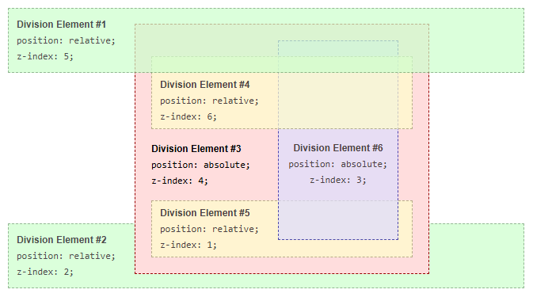

# Capítulo 25 – O Contexto de Pilha e `z-index`

Até agora, todos os layouts que construímos existiram em um plano bidimensional. Posicionamos elementos lado a lado ou um abaixo do outro. No entanto, o design de interfaces moderno raramente é plano. Menus suspensos (dropdowns), janelas modais, dicas de contexto (tooltips) e notificações são exemplos de componentes que precisam "flutuar" ou se sobrepor a outros elementos na página. Isso introduz uma terceira dimensão no nosso layout: um eixo Z, que vai da parte de trás da tela em direção ao usuário.

Como o navegador decide qual elemento aparece na frente do outro? Por padrão, a ordem de empilhamento é determinada pela ordem dos elementos no código HTML. Mas para criar UIs complexas, precisamos de um controle mais explícito sobre essa ordem. As ferramentas que o CSS nos oferece para gerenciar essa profundidade são o **Contexto de Pilha (Stacking Context)** e a propriedade **`z-index`**.

Neste capítulo, vamos mergulhar em um dos conceitos mais poderosos e, por vezes, mais confusos do CSS. Vamos entender o que é um Contexto de Pilha e como ele atua como um "mini-universo" isolado para o empilhamento de seus elementos filhos. Em seguida, desvendaremos a propriedade `z-index`, aprendendo que seu poder não é absoluto, mas sim relativo ao contexto em que se encontra. Dominar a interação entre esses dois conceitos é a chave para construir qualquer layout com múltiplas camadas de forma previsível e sem frustrações.

## O Contexto de Pilha (Stacking Context)

Um contexto de pilha é um grupo de elementos que são tratados como uma única unidade no que diz respeito ao eixo Z. Dentro de um contexto de pilha, os elementos filhos são empilhados uns sobre os outros de acordo com regras específicas, e nenhum elemento de dentro pode "saltar" para uma camada acima de um elemento de fora que pertença a um contexto de pilha superior.

Pense nisso como um conjunto de baralhos de cartas. A página inteira (`<html>`) é o primeiro baralho. Você pode empilhar as cartas (elementos) dentro desse baralho. Se uma dessas cartas for, na verdade, uma caixinha que contém seu próprio mini-baralho, você pode empilhar as cartas dentro dessa caixinha como quiser, mas a caixinha inteira (e tudo dentro dela) sempre se moverá como uma única unidade no baralho principal.

### O que Cria um Contexto de Pilha?

O elemento raiz (`<html>`) cria o contexto de pilha principal. Além dele, várias propriedades CSS, quando aplicadas a um elemento, fazem com que ele crie seu próprio contexto de pilha. As mais comuns são:

- Um elemento com `position` definido como `absolute` ou `relative` e uma propriedade `z-index` com um valor diferente de `auto`.
- Um elemento com `position` definido como `fixed` ou `sticky`.
- Um elemento que é um item flex (`display: flex`) ou grid (`display: grid`) e tem um `z-index` diferente de `auto`.
- Um elemento com uma propriedade `opacity` menor que `1`.
- Um elemento com uma propriedade `transform`, `filter` ou `perspective` diferente de `none`.

## A Propriedade `z-index`

A propriedade `z-index` especifica a ordem de empilhamento de um **elemento posicionado** e seus descendentes. Um elemento posicionado é qualquer elemento cujo valor de `position` seja `relative`, `absolute`, `fixed` ou `sticky`. `z-index` não tem efeito em elementos com `position: static` (o padrão).

Os valores possíveis são:

- **`auto`** (padrão): O elemento é empilhado em seu contexto de pilha atual de acordo com sua posição no HTML.
- **`<integer>`**: Um número inteiro (positivo, negativo ou zero). Elementos com um `z-index` maior são empilhados na frente de elementos com um `z-index` menor.

**A Regra Mais Importante:** O `z-index` de um elemento só tem significado e só compete com outros `z-index` **dentro do mesmo contexto de pilha**.

## Exemplo Detalhado de Contexto de Pilha Aninhado

Vamos analisar o exemplo que você forneceu para ver este conceito em ação. Ele ilustra perfeitamente como o `z-index` de um filho fica "preso" dentro do contexto de pilha de seu pai.

### A Estrutura

Neste exemplo, cada elemento posicionado cria seu próprio contexto de pilha devido aos seus valores de `position` e `z-index`. A hierarquia dos contextos de pilha é organizada da seguinte forma:

- **Root (Raiz)**
    - `DIV #1`
    - `DIV #2`
    - `DIV #3` (contém seu próprio contexto de pilha)
        - `DIV #4`
        - `DIV #5`
        - `DIV #6`

É crucial notar que `DIV #4`, `DIV #5` e `DIV #6` são filhos de `DIV #3`. Portanto, o empilhamento desses elementos é **completamente resolvido dentro da `DIV #3`**. Uma vez que o empilhamento e a renderização dentro da `DIV #3` são concluídos, o elemento `DIV #3` inteiro é passado para empilhamento no elemento raiz em relação às suas `DIV`s irmãs.

```html
<div id="div1">
 <h1>Division Element #1</h1>
 <code>position: relative;<br/>
 z-index: 5;</code>
</div>
<div id="div2">
 <h1>Division Element #2</h1>
 <code>position: relative;<br/>
 z-index: 2;</code>
</div>

<div id="div3">
 <div id="div4">
  <h1>Division Element #4</h1>
  <code>position: relative;<br/>
  z-index: 6;</code>
 </div>
 <h1>Division Element #3</h1>
 <code>position: absolute;<br/>
 z-index: 4;</code>
 <div id="div5">
  <h1>Division Element #5</h1>
  <code>position: relative;<br/>
  z-index: 1;</code>
 </div>
 <div id="div6">
  <h1>Division Element #6</h1>
  <code>position: absolute;<br/>
  z-index: 3;</code>
 </div>
</div>
```

```css
* {
 margin: 0;
}
html {
 padding: 20px;
 font: 12px/20px Arial, sans-serif;
}
div {
 opacity: 0.7; /* Opacidade < 1 também cria um contexto de pilha! */
 position: relative;
}
h1 {
 font: inherit;
 font-weight: bold;
}
#div1, #div2 {
 border: 1px dashed #696;
 padding: 10px;
 background-color: #cfc;
}
#div1 {
 z-index: 5;
 margin-bottom: 190px;
}
#div2 {
 z-index: 2;
}
#div3 {
 z-index: 4;
 opacity: 1;
 position: absolute;
 top: 40px;
 left: 180px;
 width: 330px;
 border: 1px dashed #900;
 background-color: #fdd;
 padding: 40px 20px 20px;
}
#div4, #div5 {
 border: 1px dashed #996;
 background-color: #ffc;
}
#div4 {
 z-index: 6;
 margin-bottom: 15px;
 padding: 25px 10px 5px;
}
#div5 {
 z-index: 1;
 margin-top: 15px;
 padding: 5px 10px;
}
#div6 {
 z-index: 3;
 position: absolute;
 top: 20px;
 left: 180px;
 width: 150px;
 height: 125px;
 border: 1px dashed #009;
 padding-top: 125px;
 background-color: #ddf;
 text-align: center;
}
```

Este é o resultado:

<div align="center">
  
</div>

### Análise Passo a Passo do Empilhamento

1. **Contexto Raiz (`<html>`):** O navegador primeiro olha para os elementos que competem no contexto de pilha principal: `div1`, `div2` e `div3`.
    - `div1` tem `z-index: 5`.
    - `div2` tem `z-index: 2`.
    - `div3` tem `z-index: 4`.
    - Com base nesses valores, a ordem de empilhamento do mais para trás para o mais para a frente é: **`div2` (2) -> `div3` (4) -> `div1` (5)**.
2. **Contexto da `DIV #3`:** Agora, o navegador olha para dentro da `div3`. Como ela é posicionada e tem um `z-index`, ela cria seu próprio contexto de pilha. A ordenação de seus filhos (`div4`, `div5`, `div6`) acontece **independentemente** do que está acontecendo do lado de fora.
    - `div4` tem `z-index: 6`.
    - `div5` tem `z-index: 1`.
    - `div6` tem `z-index: 3`.
    - A ordem de empilhamento **dentro** da `div3` é: **`div5` (1) -> `div6` (3) -> `div4` (6)**.
3. **Resultado Final:** O navegador primeiro renderiza o empilhamento interno da `div3`. Depois, ele pega esse bloco `div3` já renderizado e o coloca no contexto raiz com seu valor de `z-index: 4`.
    - É por isso que a **`div1` (z-index: 5) aparece na frente de tudo**, incluindo a `div4`.
    - E é por isso que a **`div4` (z-index: 6) aparece na frente da `div6` (z-index: 3)**, mas ambas estão **atrás** da `div1`. O `z-index: 6` da `div4` só a torna a mais alta dentro da `div3`, ele não tem poder para competir com os `z-index` do contexto raiz.

## Boas Práticas com `z-index`

Gerenciar o `z-index` em projetos grandes pode se tornar um desafio. Seguir boas práticas desde o início pode economizar horas de depuração e manter sua folha de estilos organizada e previsível.

- **Evite Números Mágicos e Altos:** É tentador usar `z-index: 9999;` para garantir que um elemento fique no topo, mas isso é um "code smell". Isso leva a uma "guerra de z-index", onde os números só aumentam, tornando o sistema caótico. Use os menores valores possíveis que alcancem o resultado desejado.
- **Centralize e Gerencie seus `z-index`:** Em vez de espalhar valores de `z-index` por toda a sua folha de estilos, defina-os como variáveis CSS (Custom Properties) em seu `:root`. Isso cria uma fonte única da verdade para suas camadas de empilhamento e torna o sistema fácil de entender e manter.

    ```
    :root {
      --z-index-dropdown: 10;
      --z-index-header: 20;
      --z-index-popup: 30;
      --z-index-modal: 40;
    }
    .header { z-index: var(--z-index-header); }
    .modal { z-index: var(--z-index-modal); }
    ```

- **Entenda o que Cria um Contexto de Pilha:** A causa mais comum de confusão com `z-index` é não perceber que um elemento está preso dentro de um contexto de pilha recém-criado. Lembre-se que `opacity`, `transform` e `filter` podem criar um contexto de pilha tanto quanto `position` e `z-index`. Se um `z-index` não está funcionando, verifique os pais do elemento.
- **Mantenha a Simplicidade:** Uma boa estrutura HTML e o uso correto de posicionamento muitas vezes eliminam a necessidade de múltiplos valores de `z-index`. Use-o quando for estritamente necessário para sobrepor elementos, como em menus, modais e tooltips.
- **Comente seu Raciocínio:** Se você precisar usar um `z-index` de uma forma que não seja imediatamente óbvia, deixe um comentário no código explicando por que aquele valor foi escolhido e como ele se relaciona com outros contextos de pilha.

## Considerações Finais

Neste capítulo, desvendamos o conceito do **Contexto de Pilha**, a regra fundamental que governa como os elementos se sobrepõem na tela. Vimos que a propriedade `z-index` não é uma força absoluta, mas um valor relativo que só tem significado dentro do seu próprio contexto de pilha.

Compreender que propriedades como `position`, `opacity` e `transform` podem criar novos contextos de empilhamento é a chave para resolver 99% dos problemas de `z-index`. Ao adotar uma estratégia de gerenciamento de `z-index` com variáveis e ao usar os menores valores possíveis, você pode construir interfaces de múltiplas camadas complexas de forma lógica, previsível e fácil de manter.