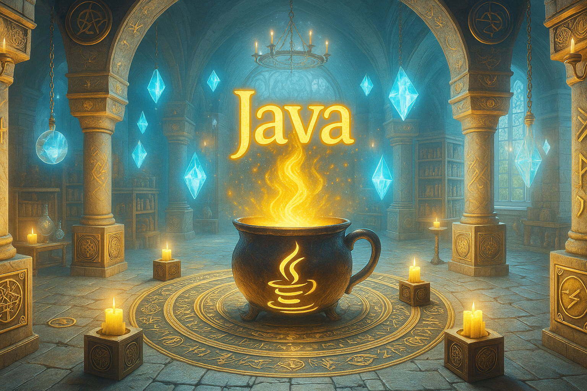

  

 

# Java

**Java**, uma das mais conhecidas e estabelecidas **linguagens de programação**, é uma tecnologia robusta e versátil, projetada para o **desenvolvimento de aplicações de alta performance e portabilidade**. Criada com o lema "escreva uma vez, rode em qualquer lugar" (_write once, run anywhere_), sua principal função é permitir que softwares sejam executados de forma consistente em diferentes plataformas, sem a necessidade de recompilação.

Enquanto muitas linguagens são compiladas para código de máquina nativo, o Java é compilado para um formato intermediário chamado **bytecode**, que é executado pela **Máquina Virtual Java (JVM)**. Essa camada de abstração é o que garante sua portabilidade, tornando-o a base para uma vasta gama de aplicações, desde **sistemas corporativos complexos (backend)** e **aplicativos Android** até **sistemas embarcados**, **Big Data** e **computação científica**.

O Java é uma linguagem de **tipagem estática**, **fortemente orientada a objetos** e **compilada/interpretada**. Sua arquitetura foi planejada sobre pilares como **segurança**, **robustez** e **gerenciamento automático de memória** (através do _Garbage Collector_), o que simplifica o desenvolvimento e previne erros comuns. A sintaxe do Java é explícita e estruturada, influenciando muitas outras linguagens populares, como C# e Kotlin.

Com uma longa trajetória, o Java evoluiu de forma significativa. A introdução do **Java 5** trouxe recursos como **Generics** e **Annotations**, e o **Java 8** representou um marco ao introduzir **expressões Lambda** e a **API de Streams**, modernizando a programação funcional na plataforma. Versões mais recentes, como as **LTS (Long-Term Support) Java 11, 17 e 21**, continuam a adicionar funcionalidades que aumentam a produtividade do desenvolvedor, como inferência de tipo para variáveis locais (`var`), **Pattern Matching** e **Virtual Threads**, otimizando a concorrência em larga escala.

O Java é a tecnologia central de um ecossistema maduro e extenso, que inclui frameworks consolidados como **Spring** e **Hibernate** para o desenvolvimento backend, além de ser a linguagem principal para o desenvolvimento nativo de aplicativos **Android**. Dominar Java é uma habilidade fundamental para desenvolvedores backend, de aplicações mobile e engenheiros de software que trabalham na construção de sistemas distribuídos, escaláveis e seguros.

## Índice de Conteúdos

Abaixo segue o índice com diversos conteúdos sobre a linguagem Java. Pode-se considerar esta como uma mini documentação de referência. Vale ressaltar que este material foi elaborado com base na versão 21 da linguagem.

- 
